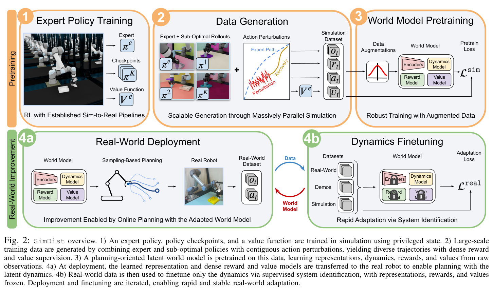
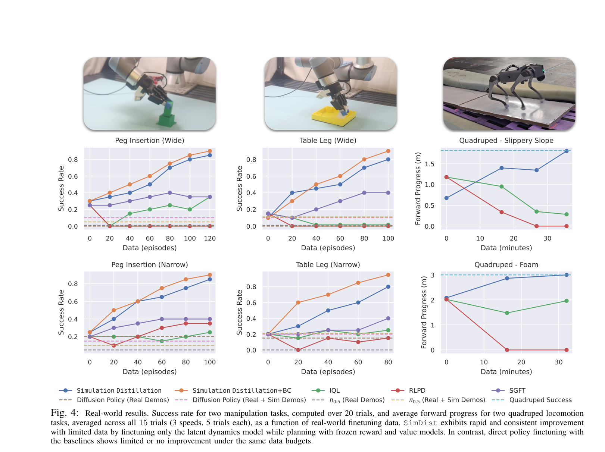
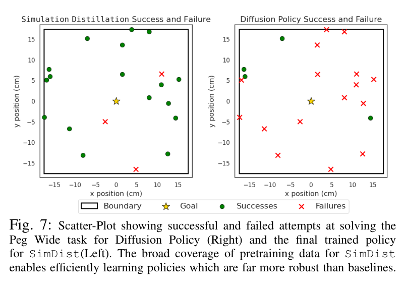
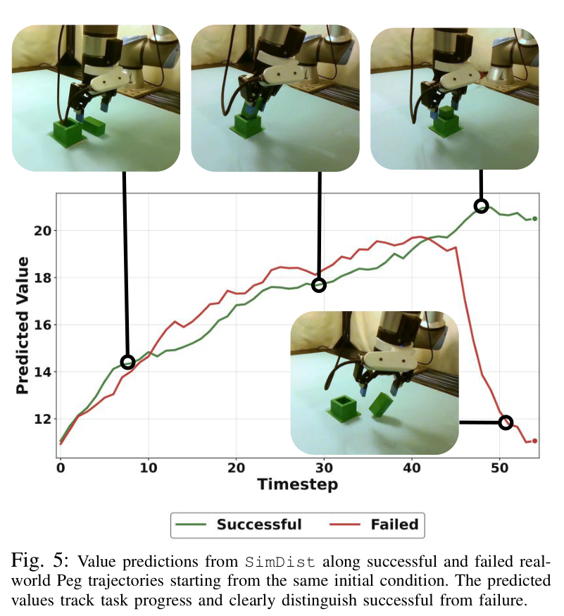
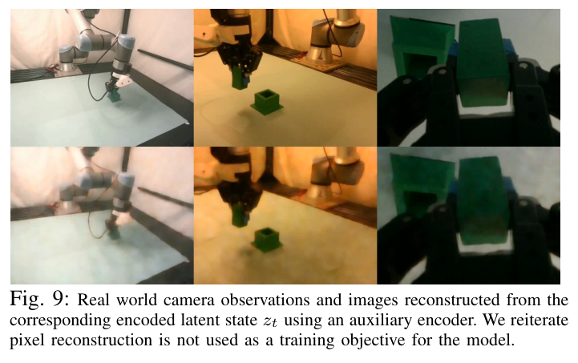
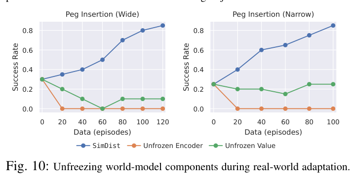
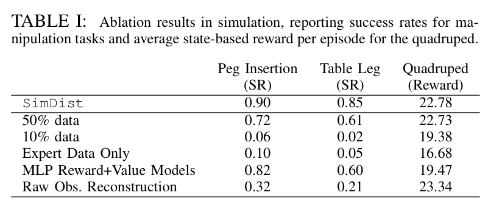
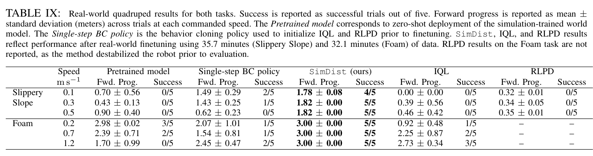

# Simulation Distillation: Pretraining World Models in Simulation for Rapid Real-World Adaptation

**Authors:** Jacob Levy, Tyler Westenbroek, Kevin Huang, Fernando Palafox, Patrick Yin, Shayegan Omidshafiei, Dong-Ki Kim, Abhishek Gupta, David Fridovich-Keil  
**Source:** `/root/wwwroy/papernotes/papers/Levy 等 - 2026 - Simulation Distillation Pretraining World Models in Simulation for Rapid Real-World Adaptation.pdf`  
**Detected source format:** selectable-text PDF (`pdf-text`)  
**Reader type:** full-paper Chinese-English Markdown reader with figure/table assets.

## Page / Section Index

| Pages | Section | Reader anchor |
|---:|---|---|
| 1–2 | Title, Fig. 1, Abstract | [Abstract](#abstract) |
| 2–3 | I. Introduction | [Introduction](#i-introduction) |
| 3–4 | II. Related Work | [Related Work](#ii-related-work) |
| 4–5 | III. Preliminaries | [Preliminaries](#iii-preliminaries) |
| 5–6 | IV. Simulation Distillation | [Method](#iv-simulation-distillation-for-efficient-real-world-adaptation) |
| 6–9 | V. Experiments | [Experiments](#v-experiments) |
| 9 | VI. Conclusion, Acknowledgments | [Conclusion](#vi-conclusion) |
| 10–13 | References | [References](#references) |
| 13–16 | Appendices A–D | [Appendices](#appendices) |

## Terminology Ledger

| Canonical term | 中文约定 | First-use definition / note |
|---|---|---|
| Simulation Distillation (SimDist) | SimDist（仿真蒸馏） | 本文框架：仿真中预训练世界模型，真实世界只做动力学微调 |
| world model | 世界模型 | 面向规划的 latent world model，不做像素生成 |
| latent dynamics model $f_\theta$ | 潜在动力学模型 | 真实世界适配中唯一被更新的组件 |
| system identification | 系统辨识 | 把真实世界适配归约为监督式动力学学习 |
| MPPI (Model Predictive Path Integral) | MPPI | 采样式 MPC 规划器，用世界模型评估候选动作序列 |
| privileged state | 特权状态 | 仿真器可直接读取的底层状态 $s_t$ |
| expert policy $\pi^e$ / expert value function $V^e$ | 专家策略 / 专家值函数 | 由既有 sim-to-real RL pipeline 在特权状态上训练 |
| behavior cloning (BC) | 行为克隆 | base policy 头的训练信号，用于 warm-start 规划 |
| dynamics gap | 动力学差距 | sim-to-real 差距中 SimDist 专门修正的部分 |
| catastrophic forgetting | 灾难性遗忘 | RL 微调基线的主要失败模式 |
| domain randomization | 域随机化 | 保证 encoder 跨 sim-to-real 迁移的感知/物理随机化 |
| offline-to-online RL | 离线到在线强化学习 | IQL、RLPD 等基线所属类别 |
| credit assignment | 信用分配 | SimDist 通过仿真预训练回避的长时域难题 |
| proprioceptive / exteroceptive observation | 本体感知 / 外感知观测 | $o_t=(o^p_t, o^e_t)$ 的两部分拆分 |
| action perturbation | 动作扰动 | 数据生成时注入的连续时间窗高斯噪声 |

### Figure 1. Zero-shot failures and real-world improvement

**Caption:** Failures of zero-shot sim-to-real policies (left). Our framework SimDist rapidly overcomes the dynamics gap and improves performance with minimal real-world interaction. We demonstrate substantial gains in task execution on both precise manipulation and quadrupedal locomotion tasks with only 15-30 minutes of real-world data, substantially outperforming baselines.

**Caption[CN]:** 零样本 sim-to-real 策略的失败案例（左）。SimDist 框架迅速克服动力学差距，用极少的真实世界交互提升性能。在精细操作与四足运动任务上，仅用 15–30 分钟真实数据即可显著改进任务执行，大幅超过基线。

**Reading note:** 四个任务（Peg Insertion、Table Leg、Slippery Slope、Foam）贯穿全文；裁切包含首页作者区，但图体与原始图注完整。

## Abstract

> <strong>Para. 1:</strong> Robot learning requires adaptation methods that improve reliably from limited, mixed-quality interaction data. This is especially challenging in long-horizon, contact-rich tasks, where end-to-end policy finetuning remains inefficient and brittle. World models offer a compelling alternative: by predicting the outcomes of candidate action sequences, they enable online planning through counterfactual reasoning. However, training action-conditioned robotic world models directly in the real world requires diverse data at impractical scale. We introduce Simulation Distillation (SimDist), a framework that uses physics simulators as a scalable source of action-conditioned robot experience. During pretraining, SimDist distills structural priors from the simulator into a world model that enables planning from raw real-world observations. During real-world adaptation, SimDist transfers the encoder, reward model, and value function learned in simulation, and updates only the latent dynamics model using real-world prediction losses. This reduces adaptation to supervised system identification while preserving dense, long-horizon planning signals for online improvement. Across contact-rich manipulation and quadruped locomotion tasks, SimDist rapidly improves with experience, while prior adaptation methods struggle to make progress or degrade during online finetuning. Project website and code: https://sim-dist.github.io

> <strong>Para. 1[CN]:</strong> 机器人学习需要能够从有限、质量混杂的交互数据中可靠改进的适配方法。这在长时域、富接触任务中尤其困难：端到端策略微调依然低效且脆弱。世界模型提供了一个有力的替代方案：通过预测候选动作序列的后果，它们支持基于反事实推理的在线规划。然而，直接在真实世界训练动作条件化的机器人世界模型，所需的数据多样性和规模都不切实际。我们提出 Simulation Distillation（SimDist），一个把物理仿真器当作可扩展的动作条件化机器人经验来源的框架。预训练阶段，SimDist 把仿真器中的结构先验蒸馏进一个世界模型，使其能够从原始真实观测出发进行规划。真实世界适配阶段，SimDist 迁移仿真中学到的 encoder、reward model 和 value function，只用真实世界的预测损失更新潜在动力学模型。这把适配问题归约为监督式系统辨识，同时保留稠密的长时域规划信号以支撑在线改进。在富接触操作与四足运动任务上，SimDist 随经验快速提升，而既有适配方法要么难以取得进展，要么在在线微调中性能退化。项目网站与代码：https://sim-dist.github.io

## I. Introduction

> <strong>Para. 1:</strong> Robotic systems must effectively adapt their behavior using limited interactions in new environments. This adaptation data is often of mixed quality, spanning demonstrations, failed attempts, exploratory actions, and rollouts from previous policies. An effective adaptation algorithm should preserve useful priors from pretraining while extracting maximal information from each new in-domain sample. This is especially important in long-horizon, contact-rich tasks, where small errors compound and success requires reasoning through many possible futures.

> <strong>Para. 1[CN]:</strong> 机器人系统必须能在新环境中用有限的交互有效调整行为。这些适配数据往往质量混杂，包括演示、失败尝试、探索性动作以及此前策略的 rollout。有效的适配算法应当既保留预训练中的有用先验，又能从每个新的域内样本中榨取最多的信息。这在长时域、富接触任务中尤其关键：小误差会累积放大，成功需要在众多可能的未来中进行推理。

> <strong>Para. 2:</strong> The authors argue that world models, rather than monolithic end-to-end policies, provide the right abstraction for leveraging prior experience to improve efficiently in new environments. Existing end-to-end reinforcement learning methods often collapse when finetuning policies in new domains, indicating catastrophic forgetting of pretraining priors. This reflects a limitation of off-policy model-free finetuning: task representations, reward and value estimates, dynamics, and action selection are tightly entangled, so adaptation updates the entire decision-making process end-to-end while solving difficult long-horizon credit assignment problems. In contrast, world model architectures typically modularize decision making by learning separate networks for environment prediction and credit assignment. This separation allows new environment data to refine the model of action consequences without overwriting the broader decision-making structure learned during pretraining. Online planning can then convert these improved predictions into better behavior by evaluating counterfactual futures beyond those directly observed in the robot's data.

> <strong>Para. 2[CN]:</strong> 作者主张，利用既往经验在新环境中高效改进的正确抽象是世界模型，而不是一体化的端到端策略。既有端到端强化学习方法在新领域微调策略时经常崩溃，表明预训练先验遭遇灾难性遗忘。这反映了 off-policy model-free 微调的固有局限：任务表征、reward/value 估计、动力学与动作选择紧密纠缠，因此适配过程必须端到端地更新整个决策链，同时还要解决困难的长时域信用分配问题。相比之下，世界模型架构通常把决策模块化，用独立网络分别负责环境预测和信用分配。这种分离让新环境数据只需修正"动作后果模型"，而不会覆盖预训练学到的更广泛决策结构。在线规划再把改进后的预测转化为更好的行为——通过评估机器人数据中未直接出现过的反事实未来。

> <strong>Para. 3:</strong> However, learning a world model suitable for planning requires action-conditioned robot data with diverse coverage at a scale that is prohibitively expensive to collect purely in the real world. Planning algorithms sample candidate trajectories beyond the optimal data distribution and must discriminate action sequences that lead to success from those that lead to failure over long horizons. This requires dynamics predictions, return estimates, and state representations that generalize over mistakes, corrections, and varying contact sequences. How can we obtain the data coverage and supervision required to train these models at scale?

> <strong>Para. 3[CN]:</strong> 然而，学习一个可用于规划的世界模型，需要覆盖多样的动作条件化机器人数据，其规模若完全在真实世界采集将昂贵到不可行。规划算法会在最优数据分布之外采样候选轨迹，并且必须在长时域上区分导向成功与导向失败的动作序列。这要求动力学预测、回报估计和状态表征都能在错误、纠正和各种接触序列上泛化。那么，如何获得大规模训练这些模型所需的数据覆盖和监督信号？

> <strong>Para. 4:</strong> The authors argue that simulation, despite the sim-to-real gap, provides an ideal setting for bootstrapping the components of a world model that are required for effective real-world decision making. Beyond cheap, scalable interaction data, privileged simulator state enables supervision that is difficult to obtain at scale in the real world. Simulator rewards can train dense reward models that provide informative planning signals from raw perception. Expert policies and critics learned by existing student-teacher RL pipelines provide scalable labels for action priors and long-horizon value estimation. Together, these rich sources of supervision encourage the world-model encoder to learn robust state representations that capture the features required for effective decision making. However, a natural concern remains: if a simulator does not exactly replicate the real world, won't a world model inherit the same biases, leading to poor real-world performance?

> <strong>Para. 4[CN]:</strong> 作者进一步主张：尽管存在 sim-to-real 差距，仿真仍是引导（bootstrap）世界模型各组件的理想环境——这些组件恰恰是真实世界有效决策所必需的。除了廉价、可扩展的交互数据外，仿真器的特权状态还提供真实世界中难以规模化获取的监督：仿真 reward 可以训练稠密 reward model，从原始感知中给出信息丰富的规划信号；既有 student-teacher RL pipeline 学到的专家策略和 critic 则为动作先验和长时域 value 估计提供可扩展的标签。这些丰富的监督共同促使世界模型的 encoder 学到鲁棒的状态表征，捕捉有效决策所需的特征。但一个自然的疑虑仍在：如果仿真器不能精确复刻真实世界，世界模型是否会继承同样的偏差，导致真实表现糟糕？

> <strong>Para. 5:</strong> The key insight is that these components need not be perfectly calibrated to the real world to enable effective planning during deployment. Indeed, reward and value models only need to define an accurate ranking over real-world states to enable the planner to distinguish promising futures from poor ones. This is a weaker and more transferable requirement than estimating exact returns. For example, in the peg insertion task, the model need only rank states where the peg is closer to the hole, better aligned, or partially inserted above states farther from success. The dynamics model, in contrast, ties actions to future states and is particularly sensitive to the dynamics gap. However, with a properly initialized model, this gap can be corrected efficiently using simple, supervised finetuning on real-world data.

> <strong>Para. 5[CN]:</strong> 关键洞察是：这些组件不必与真实世界精确校准，也能支撑部署时的有效规划。reward 和 value 模型只需要在真实世界状态上给出准确的**排序**，让规划器能区分有希望的未来与糟糕的未来即可——这比估计精确回报是更弱、也更易迁移的要求。例如在 peg insertion 任务中，模型只需把"peg 更靠近孔、对得更准、已部分插入"的状态排在离成功更远的状态之上。相反，动力学模型把动作与未来状态直接绑定，对动力学差距尤其敏感；但只要初始化得当，这一差距可以通过简单的真实数据监督微调被高效修正。

> <strong>Para. 6:</strong> Concretely, the paper introduces Simulation Distillation (SimDist), a framework for bootstrapping world models in simulation and efficiently adapting in the real world with online planning and dynamics adaptation. During simulation pretraining, diverse rollouts are systematically generated by perturbing expert action sequences to expose the model to mistakes, recoveries, and failed attempts. At deployment, the state encoder, reward model, and value function learned in simulation are frozen, and only the latent dynamics model is updated using real-world prediction losses. The frozen reward and value heads provide immediate long-horizon planning signals, enabling a relatively short-horizon planner to improve performance as dynamics predictions become more accurate. Extensive ablations show that the encoder, reward model, and value function transfer robustly across the sim-to-real gap, and that broad simulation pretraining enables the dynamics model to generalize to new trajectories from limited real-world data. Altogether, SimDist sidesteps the long-horizon credit assignment and bootstrapping problems that make real-world RL unstable and data-hungry by moving this bootstrapping to simulation. Across four real-world tasks spanning quadruped locomotion and contact-rich manipulation, SimDist reliably improves with additional experience, while baseline methods for online finetuning struggle to make meaningful progress and can even degrade during adaptation. Contributions: 1) SimDist, a world-model framework for sim-to-real transfer that reduces real-world adaptation to supervised dynamics learning while reusing reward, value, and representation priors learned in simulation; 2) instantiations on two contact-rich manipulation tasks and two quadruped locomotion tasks in the real world, achieving reliable autonomous improvement with only 15–30 minutes of real-world data and substantially outperforming existing adaptation strategies.

> <strong>Para. 6[CN]:</strong> 具体地，论文提出 Simulation Distillation（SimDist）：在仿真中引导世界模型、并借助在线规划与动力学适配在真实世界高效改进的框架。仿真预训练阶段，通过扰动专家动作序列系统性地生成多样 rollout，让模型见到错误、恢复和失败尝试。部署阶段，冻结仿真学到的状态 encoder、reward model 和 value function，只用真实世界预测损失更新潜在动力学模型。冻结的 reward/value 头立即提供长时域规划信号，使一个相对短视界的规划器随着动力学预测变准而持续提升性能。大量消融表明：encoder、reward model 和 value function 能鲁棒地跨越 sim-to-real 差距迁移，而广覆盖的仿真预训练让动力学模型能从有限真实数据泛化到新轨迹。总体上，SimDist 把 bootstrapping 挪进仿真，从而绕开了让真实世界 RL 不稳定、吃数据的长时域信用分配与自举问题。在覆盖四足运动与富接触操作的四个真实任务上，SimDist 随经验可靠改进，而在线微调基线难有实质进展、甚至在适配中退化。贡献：1）SimDist——一个 sim-to-real 世界模型框架，把真实世界适配归约为监督式动力学学习，同时复用仿真学到的 reward、value 与表征先验；2）在两个富接触操作任务和两个四足运动任务上的真实实例化，仅用 15–30 分钟真实数据实现可靠的自主改进，大幅超过既有适配策略。

### Figure 2. SimDist overview

**Caption:** SimDist overview. 1) An expert policy, policy checkpoints, and a value function are trained in simulation using privileged state. 2) Large-scale training data are generated by combining expert and sub-optimal policies with contiguous action perturbations, yielding diverse trajectories with dense reward and value supervision. 3) A planning-oriented latent world model is pretrained on this data, learning representations, dynamics, rewards, and values from raw observations. 4a) At deployment, the learned representation and dense reward and value models are transferred to the real robot to enable planning with the latent dynamics. 4b) Real-world data is then used to finetune only the dynamics via supervised system identification, with representations, rewards, and values frozen. Deployment and finetuning are iterated, enabling rapid and stable real-world adaptation.

**Caption[CN]:** SimDist 总览。1）在仿真中用特权状态训练专家策略、策略 checkpoint 和 value function。2）把专家与次优策略结合连续时间窗的动作扰动，生成带稠密 reward/value 监督的大规模多样轨迹。3）在这些数据上预训练面向规划的 latent world model，从原始观测学习表征、动力学、reward 与 value。4a）部署时把学到的表征和稠密 reward/value 模型迁移到真实机器人，用潜在动力学进行规划。4b）随后用真实数据通过监督式系统辨识只微调动力学，表征、reward、value 全部冻结。部署与微调交替迭代，实现快速而稳定的真实世界适配。

## II. Related Work

> <strong>Para. 1:</strong> Real-World Reinforcement Learning. A growing body of work studies reinforcement learning on real-world robotic systems. However, both model-free and model-based approaches remain challenging to apply reliably in low-data regimes and typically require sophisticated regularization. Efficient model-free methods aggressively reuse off-policy data and rely on frequent critic updates, often leading to value overestimation and unstable learning. Prior work mitigates these issues using conservative value estimation, policy constraints, or critic ensembles. Model-based methods instead learn dynamics and reward models to reason about unseen trajectories, but must carefully avoid exploiting model inaccuracies; common strategies include uncertainty-aware dynamics and explicitly penalizing out-of-distribution predictions. Rather than constraining learning, this work shows that bootstrapping a world model in simulation provides the coverage necessary to enable generalization beyond a small real-world dataset.

> <strong>Para. 1[CN]:</strong> 真实世界强化学习。越来越多的工作研究在真实机器人系统上做强化学习，但无论 model-free 还是 model-based 方法，在低数据量下都难以可靠应用，通常需要复杂的正则化。高效的 model-free 方法激进复用 off-policy 数据并依赖频繁的 critic 更新，容易导致 value 高估和学习不稳定；既有工作用保守 value 估计、策略约束或 critic ensemble 来缓解。model-based 方法学习动力学和 reward model 来推理未见过的轨迹，但必须小心避免规划器利用模型误差；常见策略包括不确定性感知的动力学和显式惩罚分布外预测。与"约束学习"不同，本文表明：在仿真中引导世界模型即可提供必要的覆盖，从而在小规模真实数据集之外实现泛化。

> <strong>Para. 2:</strong> Adaptation with Physics-based Models. Many lines of work leverage approximate physics-based models for adaptation and control, but typically rely on simplified, low-dimensional state representations that are brittle in partially observed, contact-rich settings. Classical adaptive control and model-predictive control approaches use highly simplified dynamics, abstracting away complex contacts and interactions. Neural physics engines combine structured system identification with residual learning to adapt high-fidelity simulators using real-world data, but often assume access to object poses, contact labels, or reliable state estimates that degrade under partial observability. Closely related work learns world models from mixtures of simulated and real data or transfers value functions from simulation to guide real-world learning, but similarly depends on low-dimensional state observations. This paper instead proposes distilling simulator structure from raw perception.

> <strong>Para. 2[CN]:</strong> 基于物理模型的适配。许多工作利用近似物理模型做适配与控制，但通常依赖简化的低维状态表征，在部分可观测、富接触场景中很脆弱。经典自适应控制和模型预测控制使用高度简化的动力学，抽象掉复杂接触与交互。神经物理引擎把结构化系统辨识与残差学习结合，用真实数据校准高保真仿真器，但往往假设可获得物体位姿、接触标签或可靠状态估计——这些在部分可观测下都会退化。最相关的工作从仿真与真实数据的混合中学习世界模型，或从仿真迁移 value function 来引导真实学习，但同样依赖低维状态观测。本文则提出直接从原始感知中蒸馏仿真器结构。

> <strong>Para. 3:</strong> Generative World Models for Robotics. Recent work trains large video models on internet-scale data to learn broad physical priors for robotics, sometimes augmented with simulation data. Translating these predictions into executable robot actions typically requires expert demonstrations, either by planning in video space and using inverse models to recover actions, or by combining video prediction with behavior cloning. While effective for reproducing demonstrated behaviors, these methods are typically trained on narrow, expert-like action distributions and remain constrained by the real-world data. In contrast, SimDist does not predict pixels and learns a task-oriented latent world model with reward and value heads over a broad distribution of low-level robot actions generated in simulation, enabling planning to improve beyond the real-world data.

> <strong>Para. 3[CN]:</strong> 面向机器人的生成式世界模型。近期工作在互联网规模数据上训练大型视频模型以学习广泛的物理先验，有时还会补充仿真数据。要把这些预测转成可执行的机器人动作，通常需要专家演示：要么在视频空间规划、再用逆模型恢复动作，要么把视频预测与行为克隆结合。这类方法虽然能有效复现被演示的行为，但一般只在狭窄的、类专家动作分布上训练，仍受真实数据约束。相反，SimDist 不预测像素，而是在仿真生成的、覆盖广泛低层机器人动作分布的数据上学习一个带 reward/value 头的任务导向 latent world model，使规划能够超越真实数据本身实现改进。

## III. Preliminaries

> <strong>Para. 1:</strong> Problem Setting. The paper considers controlling a robotic system operating in the real world under partial observability and unmodeled dynamics. The dynamics take the form $s_{t+1} \sim p(\cdot \mid s_t, a_t)$, where $s_t \in \mathcal{S}$ is the underlying state and $a_t \in \mathcal{A}$ is the robot action. The underlying state is not directly observable in the real world; the robot only has access to raw observations $o_t \in \mathcal{O}$. The control problem is modeled as a partially observable Markov decision process (POMDP) defined by the tuple $(\mathcal{S}, \mathcal{A}, \mathcal{O}, p, r, \gamma)$, with user-specified reward function $r(s_t, a_t, s_{t+1})$ and discount factor $\gamma \in (0,1]$, and the objective is to maximize the discounted return $\mathbb{E}\left[\sum_{t=0}^{\infty} \gamma^t r(s_t, a_t, s_{t+1})\right]$. Dense informative reward functions are difficult to evaluate directly in the real world, given the difficulty of measuring the underlying state. To make the problem tractable, Assumption 1 is introduced: access to an approximate physics-based simulator $s_{t+1} \sim p_{\mathrm{sim}}(\cdot \mid s_t, a_t)$ that provides privileged access to the underlying state $s_t$.

> <strong>Para. 1[CN]:</strong> 问题设定。论文考虑在部分可观测、存在未建模动力学的真实世界中控制机器人系统。动力学形如 $s_{t+1} \sim p(\cdot \mid s_t, a_t)$，其中 $s_t \in \mathcal{S}$ 为底层状态，$a_t \in \mathcal{A}$ 为机器人动作。底层状态在真实世界不可直接观测，机器人只能获得原始观测 $o_t \in \mathcal{O}$。控制问题被建模为由元组 $(\mathcal{S}, \mathcal{A}, \mathcal{O}, p, r, \gamma)$ 定义的部分可观测马尔可夫决策过程（POMDP），其中 $r(s_t, a_t, s_{t+1})$ 为用户指定的 reward，$\gamma \in (0,1]$ 为折扣因子，目标是最大化折扣回报 $\mathbb{E}\left[\sum_{t=0}^{\infty} \gamma^t r(s_t, a_t, s_{t+1})\right]$。由于底层状态难以测量，稠密而信息丰富的 reward 在真实世界很难直接计算。为使问题可解，论文引入假设 1：可以访问一个近似的物理仿真器 $s_{t+1} \sim p_{\mathrm{sim}}(\cdot \mid s_t, a_t)$，它提供对底层状态 $s_t$ 的特权访问。

> <strong>Para. 2:</strong> Planning-Oriented Latent World Models. The method builds on common planning-oriented latent world models such as TD-MPC and Dreamer, which learn reward and value models that operate directly on raw observations, enabling real-world planning. The primary novelty of SimDist lies in the systematic framework for sim-to-real pretraining and adaptation. The world model is structured as follows (Eq. 1, depicted in Fig. 3):

$$
\begin{aligned}
\text{Latent representation:}\quad & z_t = E_\theta(o_t)\\
\text{History representation:}\quad & h_t = C_\theta(o_{t-H:t-1},\, a_{t-H:t-1})\\
\text{Latent dynamics:}\quad & \hat{z}_{t+1:t+T} = f_\theta(z_t,\, a_{t:t+T-1},\, h_t)\\
\text{Reward prediction:}\quad & \hat{r}_{t:t+T-1} = R_\theta(\hat{z}_{t:t+T},\, a_{t:t+T-1})\\
\text{Value prediction:}\quad & \hat{v}_{t+1:t+T} = V_\theta(\hat{z}_{t:t+T})\\
\text{Base policy:}\quad & \hat{a}_{t:t+H} = \pi_\theta(z_t,\, h_t)
\end{aligned}
$$

> <strong>Para. 2[CN]:</strong> 面向规划的潜在世界模型。方法建立在 TD-MPC、Dreamer 一类常见的面向规划的 latent world model 之上：它们直接在原始观测上学习 reward 和 value 模型，从而支持真实世界规划。SimDist 的主要新颖之处在于其系统化的 sim-to-real 预训练与适配框架。世界模型按上式（式 1，见 Fig. 3）组织：$E_\theta$ 从原始观测 $o_t$ 编码出状态 $s_t$ 的潜在表征 $z_t$；$h_t$ 是长度为 $H$ 的观测—动作历史编码；$\hat{z}_{t+1:t+T}$ 是学习到的动力学 $f_\theta$ 生成的 $T$ 步未来潜在状态序列；$\hat{r}_{t:t+T-1}$ 与 $\hat{v}_{t+1:t+T}$ 为 reward 和 value 估计；base policy $\pi_\theta$ 输出动作 chunk。关键架构决策在第 IV-C 节讨论。

### Figure 3. World model architecture

**Caption:** World model architecture. The most recent observation is encoded into a latent representation while a history encoder processes a history of observations and actions. These jointly condition a transformer-based latent dynamics model that predicts future latent trajectories under candidate action sequences. Transformer-based reward and value heads evaluate predicted trajectories to produce reward and value sequences, while a base policy head predicts action chunks used to warm-start sampling-based planning.

**Caption[CN]:** 世界模型架构。最新观测被编码为潜在表征，同时 history encoder 处理观测与动作历史。二者共同条件化一个基于 transformer 的潜在动力学模型，在候选动作序列下预测未来潜在轨迹。基于 transformer 的 reward/value 头评估预测轨迹并输出 reward 与 value 序列；base policy 头预测动作 chunk，用于 warm-start 采样式规划。

> <strong>Para. 3:</strong> Sampling-Based Planning. The robot is controlled in the real world with Model Predictive Path Integral (MPPI) control, a sampling-based Model Predictive Control (MPC) method. At each control step, a batch of candidate future action sequences is sampled and evaluated using the world model, extracting the predicted future reward sequence $\hat{r}_{t:t+T-1}$ and terminal value $\hat{v}_{t+T}$, which are combined to compute the trajectory return $R(a_{t:t+T-1}) = \gamma^{T}\hat{v}_{t+T} + \sum_{s=t}^{t+T-1}\gamma^{s-t}\hat{r}_s$. MPPI then computes the control action to execute by importance-weighting sampled trajectories according to their predicted returns. Similar to TD-MPC, sampling is warm-started by seeding a subset of candidate action sequences with noise-corrupted outputs of $\hat{a}_{t:t+T-1}$ from the base policy $\pi_\theta$.

> <strong>Para. 3[CN]:</strong> 采样式规划。真实世界中用 Model Predictive Path Integral（MPPI）控制机器人，这是一种采样式模型预测控制（MPC）方法。每个控制步采样一批候选未来动作序列，用世界模型评估，提取预测 reward 序列 $\hat{r}_{t:t+T-1}$ 与终端 value $\hat{v}_{t+T}$，组合成轨迹回报 $R(a_{t:t+T-1}) = \gamma^{T}\hat{v}_{t+T} + \sum_{s=t}^{t+T-1}\gamma^{s-t}\hat{r}_s$。MPPI 再按预测回报对采样轨迹做重要性加权，得出要执行的控制动作。与 TD-MPC 类似，采样通过给部分候选序列注入 base policy $\pi_\theta$ 输出 $\hat{a}_{t:t+T-1}$ 的带噪版本来 warm-start。

## IV. Simulation Distillation for Efficient Real-World Adaptation

### A. Pretraining on Simulated Data

> <strong>Para. 1:</strong> SimDist builds on sim-to-real data-generation pipelines that use privileged, state-based expert policies to collect large-scale datasets paired with raw perception. While prior work primarily uses this data for imitation, planning-based adaptation places stronger demands on the learned model. A planner will actively search for high-value action sequences and exploit model errors wherever coverage is weak, so the model must remain reliable far beyond the expert and real-world data distributions. Dynamics predictions must generalize from few real-world samples, while reward and value models must distinguish good and bad outcomes under off-policy actions. To provide this coverage, sub-optimal actions are deliberately injected during simulation rollouts, providing coverage over mistakes, recoveries, and failed attempts.

> <strong>Para. 1[CN]:</strong> SimDist 建立在既有的 sim-to-real 数据生成 pipeline 之上：用特权状态的专家策略采集与原始感知配对的大规模数据集。既往工作主要用这类数据做模仿学习，而基于规划的适配对模型的要求更高：规划器会主动搜索高 value 的动作序列，并在覆盖薄弱之处利用模型误差，因此模型必须在远超专家与真实数据分布之外仍然可靠。动力学预测要能从少量真实样本泛化，reward/value 模型要能在 off-policy 动作下区分好坏结果。为提供这种覆盖，SimDist 在仿真 rollout 中刻意注入次优动作，让数据覆盖错误、恢复与失败尝试。

> <strong>Para. 2:</strong> Expert Policy Training. A state-based expert policy $\pi^e(s_t)$ is first trained with reinforcement learning using existing sim-to-real pipelines. The optimal state-based value function $V^e(s_t)$ and intermediate policy checkpoints $\{\pi^k\}_{k=1}^{K}$ learned during training are also saved, to be used for value supervision and diverse, sub-optimal data generation.

> <strong>Para. 2[CN]:</strong> 专家策略训练。首先用既有 sim-to-real pipeline 以强化学习训练基于状态的专家策略 $\pi^e(s_t)$，同时保存训练中得到的最优状态值函数 $V^e(s_t)$ 和中间策略 checkpoint $\{\pi^k\}_{k=1}^{K}$，分别用于 value 监督和多样化的次优数据生成。

> <strong>Para. 3:</strong> Generating Diverse Trajectories and Dense Supervision. Diverse simulation rollouts are generated (Fig. 2) by alternating between the expert policy $\pi^e$ and a set of sub-optimal policies $\{\pi^k\}_{k=1}^{K}$, and by periodically injecting random action perturbations over short temporal windows. This generates diverse failure and recovery behaviors beyond the nominal expert manifold, broadening coverage over dynamically feasible state-action trajectories and enabling the world model to reliably predict counterfactual outcomes. This results in a dataset $D_{\mathrm{sim}} = \{(o_t, a_t, r_t, v_t)\}_{t=0}^{N}$, where rewards $r_t$ are computed from privileged simulator state and value targets $v_t$ are provided by the expert value function $V^e(s_t)$. Crucially, this data-generation process is massively parallelizable and exploits the full training artifact of the simulator—including expert policies, intermediate checkpoints, and value functions—to produce rich supervision at scale. In addition, perceptual observations are randomized extensively to ensure robust transfer of the encoder.

> <strong>Para. 3[CN]:</strong> 生成多样轨迹与稠密监督。通过在专家策略 $\pi^e$ 与一组次优策略 $\{\pi^k\}_{k=1}^{K}$ 之间交替、并周期性地在短时间窗内注入随机动作扰动，生成多样的仿真 rollout（Fig. 2）。这在名义专家流形之外制造出多样的失败与恢复行为，拓宽了对动力学可行的状态—动作轨迹的覆盖，使世界模型能可靠预测反事实结果。得到数据集 $D_{\mathrm{sim}} = \{(o_t, a_t, r_t, v_t)\}_{t=0}^{N}$：reward $r_t$ 由特权仿真状态计算，value 目标 $v_t$ 由专家值函数 $V^e(s_t)$ 提供。关键是，这个数据生成过程可大规模并行，并充分利用仿真器的全部训练产物——专家策略、中间 checkpoint 和 value function——以规模化地产出丰富监督。此外还对感知观测做大量随机化，确保 encoder 的鲁棒迁移（细节见 Appendix A）。

> <strong>Para. 4:</strong> Algorithm 1 (SimDist) summarizes the pipeline. Pretraining: run RL, saving the expert policy $\pi^e$, policy checkpoints $\{\pi^k\}_{k=1}^{K}$, and learned value function $V^e$; generate the dataset $D_{\mathrm{sim}}$ in simulation per Section IV-A; until convergence, draw segments $\{(o_t, r_t, v_t, a_t)\}_{t=i-H}^{i+T} \sim D_{\mathrm{sim}}$ and update $\theta$ minimizing $\mathcal{L}^{\mathrm{sim}}(\theta)$ at each time step. Iterative finetuning: initialize $D_{\mathrm{real}}$ with offline real-world data if available; for $J$ iterations, collect real-world rollouts $\{(o_t, a_t)\}_{t=0}^{M}$ with MPPI and the world model, add them to $D_{\mathrm{real}}$, then until convergence draw segments from $D_{\mathrm{real}}$, freeze $C_\theta, E_\theta, R_\theta, V_\theta, \pi_\theta$, and update $f_\theta$ minimizing $\mathcal{L}^{\mathrm{real}}(\theta)$.

> <strong>Para. 4[CN]:</strong> 算法 1（SimDist）概括了整个流程。预训练：运行 RL，保存专家策略 $\pi^e$、策略 checkpoint $\{\pi^k\}_{k=1}^{K}$ 和 value function $V^e$；按第 IV-A 节在仿真中生成数据集 $D_{\mathrm{sim}}$；随后循环采样片段 $\{(o_t, r_t, v_t, a_t)\}_{t=i-H}^{i+T} \sim D_{\mathrm{sim}}$，逐时间步最小化 $\mathcal{L}^{\mathrm{sim}}(\theta)$ 更新 $\theta$ 直至收敛。迭代微调：若有离线真实数据则用其初始化 $D_{\mathrm{real}}$；重复 $J$ 轮——用 MPPI 与世界模型采集真实 rollout $\{(o_t, a_t)\}_{t=0}^{M}$ 并加入 $D_{\mathrm{real}}$，然后冻结 $C_\theta, E_\theta, R_\theta, V_\theta, \pi_\theta$，从 $D_{\mathrm{real}}$ 采样片段、最小化 $\mathcal{L}^{\mathrm{real}}(\theta)$ 只更新 $f_\theta$，直至收敛。

> <strong>Para. 5:</strong> World Model Pretraining. The world model is pretrained on $D_{\mathrm{sim}}$ by applying the following loss to predictions made at each time step $t$:

$$
\mathcal{L}^{\mathrm{sim}}(\theta) = \sum_{i=0}^{T}\Big[\;\underbrace{\lVert \hat{z}_{t+i+1} - \mathrm{sg}\big(E_\theta(o_{t+i+1})\big)\rVert^{2}}_{\text{latent dynamics}}\; +\; c_1\underbrace{\big(\hat{r}_{t+i} - r_{t+i}\big)^{2}}_{\text{reward}}\; +\; c_2\underbrace{\big(\hat{v}_{t+i+1} - v_{t+i+1}\big)^{2}}_{\text{value}}\; +\; c_3\,\mathbb{1}_{e}(a_{t+i})\underbrace{\lVert \hat{a}_{t+i} - a_{t+i}\rVert^{2}}_{\text{behavior cloning}}\;\Big]
$$

where $\mathrm{sg}$ is the stop-grad operator, constants $c_{1:3}$ are determined by normalizing over the range for each target, and $\mathbb{1}_e(a_t) = 1$ if $a_t$ came from the uncorrupted expert policy and $0$ otherwise. Various data augmentations are applied to prevent overfitting to simulated observations and ensure that the model learns robust, transferable representations. In contrast to typical online MBRL approaches, which are computationally intensive and attempt to bootstrap behavior from scratch, behavior generation is offloaded to a privileged expert. This reduces pretraining to optimizing a simple, stationary objective, without requiring temporal-difference learning.

> <strong>Para. 5[CN]:</strong> 世界模型预训练。在 $D_{\mathrm{sim}}$ 上对每个时间步 $t$ 的预测施加上述损失（式 2）：四项分别是潜在动力学项、reward 项、value 项和行为克隆项。其中 $\mathrm{sg}$ 为 stop-gradient 算子；常数 $c_{1:3}$ 通过对各目标的取值范围归一化确定；$\mathbb{1}_e(a_t)$ 在动作来自未加噪的专家策略时为 1，否则为 0（即 BC 项只在专家动作上生效）。训练中施加多种数据增强（见 Appendices B、C），防止过拟合仿真观测、保证表征鲁棒可迁移。与计算量大、需要从零自举行为的典型在线 MBRL 不同，SimDist 把行为生成外包给特权专家，使预训练退化为优化一个简单的平稳目标，完全不需要时序差分学习。

> <strong>Para. 6:</strong> Robust Representations Without Reconstruction. Predicting rewards and values from $z$ forces the encoder to capture the task-specific features required for effective planning. In contrast, many world-model approaches use pixel-level reconstruction objectives, arguing that they produce more robust and generalizable latent representations. The authors find reconstruction unnecessary, and in some cases harmful, for two reasons. First, the diverse data-generation procedure exposes the model to an extremely broad range of state-action pairs, spanning initial conditions, object configurations, contact modes, expert behaviors, failures, and recoveries; this diversity forces the model to learn a robust representation without the added computational cost of reconstructing pixels. Second, sim-to-real transfer requires extensive visual randomization. Pixel reconstruction would therefore pressure the latent state to encode randomized texture, lighting, and rendering artifacts that are deliberately varied and irrelevant to the task, which can hurt transfer.

> <strong>Para. 6[CN]:</strong> 无重建的鲁棒表征。从 $z$ 预测 reward 和 value 本身就迫使 encoder 捕捉有效规划所需的任务特征。相反，许多世界模型方法采用像素级重建目标，理由是重建能带来更鲁棒、更可泛化的潜在表征。作者发现重建并非必要，甚至有时有害，原因有二：其一，多样化数据生成让模型见到极广的状态—动作对——初始条件、物体配置、接触模式、专家行为、失败与恢复——这种多样性本身就迫使模型学出鲁棒表征，无需承担重建像素的额外计算开销；其二，sim-to-real 迁移要求大量视觉随机化，像素重建会迫使潜在状态去编码那些被刻意随机化、与任务无关的纹理、光照和渲染伪影，反而可能损害迁移。

### B. Real World Transfer and Efficient Dynamics Adaptation

> <strong>Para. 1:</strong> The key insight is that global task structure is largely invariant to low-level sim-to-real dynamics gaps. For example, in Peg Insertion (Fig. 1), a meaningful latent state captures the locations of the peg and hole, while the value function encodes distance to the goal and motions leading to successful insertion. This structure persists across the sim-to-real gap, even though the low-level actions required to realize these behaviors differ between domains. Exploiting this decomposition, SimDist finetunes only the environment-specific dynamics model while freezing the encoder, reward, and value functions. Planning with frozen reward and value models enables immediate improvement as dynamics predictions become more accurate, without requiring reward or value bootstrapping in the real world. Because the world model can be trained on arbitrary trajectories, SimDist naturally supports off-policy learning and can incorporate prior data such as demonstrations. Importantly, the adaptation remains relatively short horizon and local, since no long-horizon bootstrapping is needed.

> <strong>Para. 1[CN]:</strong> 关键洞察：全局任务结构在很大程度上对低层 sim-to-real 动力学差距保持不变。例如在 Peg Insertion（Fig. 1）中，有意义的潜在状态编码 peg 与孔的位置，value function 编码到目标的距离和导向成功插入的运动方式。即便两个域中实现这些行为所需的低层动作不同，这一结构依然跨越 sim-to-real 差距而存在。利用这种分解，SimDist 只微调环境特定的动力学模型，冻结 encoder、reward 和 value。用冻结的 reward/value 做规划，意味着动力学预测一变准性能就立即提升，无需在真实世界做 reward 或 value 自举。由于世界模型可以在任意轨迹上训练，SimDist 天然支持 off-policy 学习，也能吸收演示等先验数据。重要的是，适配保持相对短视界且局部化，因为完全不需要长时域自举。

> <strong>Para. 2:</strong> Dynamics Adaptation Loss. When updating the dynamics model, the following loss is applied at each time $t$:

$$
\mathcal{L}^{\mathrm{real}}(\theta) = \sum_{i=0}^{T}\lVert \hat{z}_{t+i+1} - \mathrm{sg}\big(E_\theta(o_{t+i+1})\big)\rVert^{2}
\quad\text{with } C_\theta, E_\theta, R_\theta, V_\theta, \pi_\theta \text{ frozen, } f_\theta \text{ finetunable.}
$$

Because the encoder is frozen, it provides consistent latent targets $E_\theta(o_{t+i+1})$ throughout finetuning, avoiding the need to bootstrap a representation as in the pretraining loss. This also anchors the adapted dynamics to the same latent representation used by the frozen reward and value models, rather than drifting away from the representation $R_\theta$ and $V_\theta$ were trained to evaluate.

> <strong>Para. 2[CN]:</strong> 动力学适配损失。更新动力学模型时对每个时间 $t$ 施加上述损失（式 3）：只保留潜在动力学预测项，$C_\theta, E_\theta, R_\theta, V_\theta, \pi_\theta$ 全部冻结，仅 $f_\theta$ 可微调。由于 encoder 被冻结，它在整个微调过程中提供一致的潜在目标 $E_\theta(o_{t+i+1})$，避免了像预训练损失那样自举表征的需要；同时也把适配后的动力学锚定在冻结 reward/value 模型所使用的同一潜在表征上，而不会漂离 $R_\theta$、$V_\theta$ 当初被训练来评估的表征空间。

> <strong>Para. 3:</strong> Iterative Improvement. The overall pipeline is shown in Fig. 2 and in pseudo-code in Algorithm 1. SimDist autonomously improves in the real world by repeatedly collecting $M$ on-policy rollouts under the planner, adding this data to the real-world dataset $D_{\mathrm{real}}$, then finetuning $f_\theta$ to minimize prediction losses. Notably, because system identification can effectively learn from any real-world trajectories, SimDist is a simple off-policy reinforcement learning strategy which can easily incorporate diverse data sources such as demonstrations or play data into $D_{\mathrm{real}}$. Remark 1: in contrast to standard MBRL frameworks, which must jointly bootstrap latent representations, value functions, and policies from scarce in-domain data, SimDist offloads these challenging objectives to simulation, where diverse data is cheap and plentiful. As a result, real-world adaptation reduces to supervised finetuning of the dynamics.

> <strong>Para. 3[CN]:</strong> 迭代改进。整体流程见 Fig. 2 与 Algorithm 1 伪代码。SimDist 在真实世界自主改进：反复用规划器采集 $M$ 条 on-policy rollout，加入真实数据集 $D_{\mathrm{real}}$，然后微调 $f_\theta$ 最小化预测损失（式 3）。值得注意的是，由于系统辨识可以从任何真实轨迹中有效学习，SimDist 本质上是一种简单的 off-policy 强化学习策略，可以轻松把演示、play data 等多样数据源并入 $D_{\mathrm{real}}$。注记 1：标准 MBRL 框架必须从稀缺的域内数据中同时自举潜在表征、value function 和策略；SimDist 把这些困难目标全部卸载到数据廉价而充足的仿真中，因此真实世界适配退化为对动力学的监督微调。

### C. World Model Design Decisions

> <strong>Para. 1:</strong> In order to successfully improve behavior, the planner must sample numerous off-policy rollouts and accurately model returns. The following decisions were necessary to accelerate inference and enable reliable real-time decision making. Minimal History Representation: observation histories $o_{t-H:t}$ can contain high-dimensional inputs such as images that are costly to process. To reduce inference cost, observations $o_t = (o^p_t, o^e_t)$ are split into proprioceptive and exteroceptive components and only $(o^p_{t-H:t}, a_{t-H:t}, o^e_t)$ is fed into the history encoder $C_\theta$. Using only the most recent high-dimensional observation substantially reduces planning latency and, empirically, improves training stability by reducing context length.

> <strong>Para. 1[CN]:</strong> 要成功改进行为，规划器必须采样大量 off-policy rollout 并精确建模回报，以下设计决策对加速推理、实现可靠的实时决策不可或缺。最小历史表征：观测历史 $o_{t-H:t}$ 可能包含图像等处理代价高昂的高维输入。为降低推理成本，观测被拆分为本体感知与外感知两部分 $o_t = (o^p_t, o^e_t)$，只把 $(o^p_{t-H:t}, a_{t-H:t}, o^e_t)$ 送入 history encoder $C_\theta$。只使用最近一帧高维观测显著降低了规划延迟，并且经验上通过缩短上下文长度提升了训练稳定性。

> <strong>Para. 2:</strong> Chunked Prediction for Planning. Autoregressive world models require sequential unrolling over the planning horizon, which bottlenecks parallelism when evaluating numerous rollouts. Inspired by prior work on universal dynamics models, the latent dynamics model $f_\theta$ predicts $T$ future states in a single forward pass using a transformer with cross-attention between the encoded history tokens and a candidate action sequence, together with a causal mask. This chunked prediction fully exploits GPU parallelism, dramatically improving planning throughput.

> <strong>Para. 2[CN]:</strong> 面向规划的分块预测。自回归世界模型必须沿规划视界逐步展开，在评估大量 rollout 时成为并行化瓶颈。受通用动力学模型工作的启发，潜在动力学模型 $f_\theta$ 用一个 transformer 在单次前向中预测全部 $T$ 个未来状态：编码后的历史 token 与候选动作序列之间做 cross-attention，并配合因果 mask。这种分块预测充分利用 GPU 并行性，大幅提升规划吞吐量。

> <strong>Para. 3:</strong> Sequence-to-Sequence Return Modeling. Prior work often decodes rewards and values with per-timestep MLPs applied independently to each predicted latent state. Instead, transformer-based reward and value models attend over the entire predicted latent trajectory $\hat{z}_{t:t+T}$. This aggregates information across the entire trajectory, yielding more accurate return estimates (see Section V-D).

> <strong>Para. 3[CN]:</strong> 序列到序列的回报建模。既往工作通常用逐时间步的 MLP 独立解码每个预测潜在状态的 reward 和 value。SimDist 改用基于 transformer 的 reward/value 模型，对整条预测潜在轨迹 $\hat{z}_{t:t+T}$ 做注意力。这样可在整条轨迹上聚合信息，得到更准的回报估计（见第 V-D 节）。

## V. Experiments

> <strong>Para. 1:</strong> The experiments evaluate the ability of SimDist to adapt in the real world on the four manipulation and quadruped tasks depicted in Fig. 1 and carefully ablate key design decisions. The questions are: 1) does SimDist outperform existing online RL methods and behavior cloning baselines? 2) what factors enable the planner to effectively improve performance with minimal real-world data? 3) which components of the architecture and pretraining procedure are crucial for the performance of SimDist?

> <strong>Para. 1[CN]:</strong> 实验在 Fig. 1 所示的四个操作与四足任务上评估 SimDist 的真实世界适配能力，并细致消融关键设计决策。要回答三个问题：1）SimDist 是否优于既有在线 RL 方法和行为克隆基线？2）哪些因素使规划器能用最少的真实数据有效提升性能？3）架构与预训练流程中哪些组件对 SimDist 的性能至关重要？

### A. Robotic Systems and Tasks

> <strong>Para. 1:</strong> Manipulation System and Tasks. Manipulation experiments are conducted on a UR5e robot. Actions are six-dimensional relative end-effector pose targets and a binary gripper action, and observations include joint states and three $224 \times 224$ RGB images from wrist-mounted, overhead, and side-view cameras. Each image is encoded with a pretrained ResNet-18, fused with proprioception, and mapped to a 64-dimensional latent state $z$. Training uses 100k trajectories (see Appendix B for details on data mixture). History and prediction horizons are $H = T = 5$ and the robot is controlled at 5 Hz. Expert policies are trained following the diverse-resets large-scale RL pipeline of Yin et al. Two precise assembly tasks are considered, with initial conditions drawn from a Narrow (2 cm × 2 cm) or Wide (35 cm × 35 cm) grid: 1) Peg Insertion, similar to the 16 mm square peg task from Factory, which requires picking the peg, aligning it with the hole, and insertion; 2) Table Leg, following FurnitureBench, wherein a table leg must be picked, aligned, and threaded into a hole on a table.

> <strong>Para. 1[CN]:</strong> 操作系统与任务。操作实验在 UR5e 机器人上进行。动作为六维相对末端执行器位姿目标加二值夹爪动作；观测包括关节状态与来自腕部、俯视、侧视三台相机的 $224 \times 224$ RGB 图像。每张图像用预训练 ResNet-18 编码，与本体感知融合后映射到 64 维潜在状态 $z$。训练使用 10 万条轨迹（数据混合细节见 Appendix B）；历史与预测视界 $H = T = 5$，控制频率 5 Hz。专家策略按 Yin 等人的 diverse-resets 大规模 RL pipeline 训练。考虑两个精密装配任务，初始条件从 Narrow（2 cm × 2 cm）或 Wide（35 cm × 35 cm）网格采样：1）Peg Insertion——类似 Factory 中 16 mm 方形 peg 任务，需要抓取 peg、对准孔位并插入；2）Table Leg——沿用 FurnitureBench 设定，需要抓取桌腿、对准并旋入桌面孔中。

> <strong>Para. 2:</strong> Quadruped System and Tasks. Quadrupedal experiments are conducted on a Unitree Go2, with actions given as position targets for the 12 joints. Observations include proprioception and a local terrain height map, encoded using a CNN and fused with low-dimensional observations via an MLP to produce the latent state $z$. The policy $\pi_\theta$, reward $R_\theta$, and value $V_\theta$ are additionally conditioned on desired base forward, lateral, and yaw velocities. Pretraining uses 100M simulated transitions. History and prediction horizons are $H = T = 25$ and planning runs at 50 Hz on a laptop with an RTX 4090M. Two tasks are considered: 1) Slippery Slope — the robot traverses straight over two panels inclined at 3.0° and 5.7°, covered with PTFE (Teflon), with the robot's feet wrapped in thermoplastic, creating extremely low-friction contacts; a trial is successful if the robot traverses 1.82 m, clearing both panels, with five trials per commanded forward speed at 0.1, 0.3, and 0.5 m/s. 2) Foam — the robot traverses two 5 cm thick overlapping memory foam pads whose compliant dynamics are not modeled in simulation; a trial is successful if the robot traverses 3.00 m to clear the foam, with five trials per commanded forward speed at 0.2, 0.7, and 1.2 m/s.

> <strong>Para. 2[CN]:</strong> 四足系统与任务。四足实验在 Unitree Go2 上进行，动作为 12 个关节的位置目标。观测包括本体感知和局部地形高度图：高度图用 CNN 编码，再经 MLP 与低维观测融合得到潜在状态 $z$。策略 $\pi_\theta$、reward $R_\theta$ 和 value $V_\theta$ 额外以期望的机身前向、侧向与偏航速度为条件。预训练使用约 1 亿条仿真转移样本；历史与预测视界 $H = T = 25$，在配 RTX 4090M 的笔记本上以 50 Hz 规划（细节见 Appendix C）。两个任务：1）Slippery Slope——机器人直线穿越倾角分别为 3.0° 和 5.7° 的两块板，板面覆盖 PTFE（特氟龙），机器人足端包裹热塑材料，形成极低摩擦接触；走完 1.82 m、越过两块板算成功，在 0.1、0.3、0.5 m/s 三个指令速度下各测五次。2）Foam——机器人穿越两块 5 cm 厚、相互搭接的记忆海绵垫，其柔性动力学未在仿真中建模；走完 3.00 m 越过海绵算成功，在 0.2、0.7、1.2 m/s 下各测五次。

### B. Real-World Learning Methods

> <strong>Para. 1:</strong> SimDist is evaluated against state-of-the-art real-world RL methods (and behavior cloning baselines on manipulation tasks). All RL methods use the same encoders as SimDist, but with an MLP policy head (no action chunking).

> <strong>Para. 1[CN]:</strong> SimDist 与最先进的真实世界 RL 方法比较（操作任务上还加入行为克隆基线）。所有 RL 方法使用与 SimDist 相同的 encoder，但采用 MLP 策略头（无 action chunking）。

> <strong>Para. 2:</strong> Manipulation. For each task, 20 real-world demonstrations are collected via teleoperation. Two variants of SimDist are evaluated: (i) SimDist, which adapts only the latent dynamics model using on-policy rollouts (Algorithm 1), without access to the demonstrations; and (ii) SimDist+BC, which additionally finetunes the base policy $\pi_\theta$ using expert action labels from the teleoperated data. In both cases, the dynamics model is updated after every 20 real-world episodes. Comparisons include model-free offline-to-online RL baselines RLPD and IQL, trained from sparse rewards to reflect common manipulation settings where dense rewards are difficult to specify (these baselines update after every episode), and SGFT-SAC, a model-free method that transfers a simulated value function, isolating the benefit of full world-model adaptation beyond value transfer alone. All online RL methods are given access to the 20 pre-collected demonstrations. Finally, behavior cloning baselines—Diffusion Policy and $\pi_{0.5}$—are trained with 100 real-world demonstrations, as variants trained on real-world demonstrations only and co-trained on these demonstrations plus the simulated dataset used by SimDist. The task set-up is identical to the corresponding tasks from SGFT, except that a rollout is defined as successful if it completes the task within 45 seconds.

> <strong>Para. 2[CN]:</strong> 操作任务。每个任务通过遥操作采集 20 条真实演示。评估两个 SimDist 变体：(i) SimDist——只用 on-policy rollout 适配潜在动力学模型（Algorithm 1），不使用演示；(ii) SimDist+BC——额外用遥操作数据中的专家动作标签微调 base policy $\pi_\theta$。两种情形都是每 20 个真实 episode 更新一次动力学模型。对比方法包括 model-free 的离线到在线 RL 基线 RLPD 与 IQL（用稀疏 reward 训练，反映操作场景中稠密 reward 难以指定的现实；它们每个 episode 更新一次），以及 SGFT-SAC——迁移仿真 value function 的 model-free 方法，用于把"完整世界模型适配"与"仅 value 迁移"的收益分离开。所有在线 RL 方法都可使用那 20 条预采演示。此外还有行为克隆基线——Diffusion Policy 与 $\pi_{0.5}$——用 100 条真实演示训练，并各分两种变体：只用真实演示、以及真实演示与 SimDist 所用仿真数据集共同训练。任务设置与 SGFT 对应任务一致，但本文改为"45 秒内完成任务"才算成功。

> <strong>Para. 3:</strong> Quadruped. For quadruped locomotion, SimDist is compared against the off-policy algorithm RLPD and the offline-to-online finetuning method from IQL, whose value function is pretrained in simulation. All methods use the same learned reward model from SimDist, allowing the effect of different adaptation strategies to be isolated. Demonstrations cannot be collected for this system, so methods requiring them are not compared.

> <strong>Para. 3[CN]:</strong> 四足任务。四足运动上，SimDist 与 off-policy 算法 RLPD 以及 IQL 的离线到在线微调法比较（后者的 value function 在仿真中预训练）。所有方法都使用 SimDist 学到的同一 reward model，从而把不同适配策略的效果隔离出来。该系统无法采集演示，因此不比较需要演示的方法。

### C. Real World Improvement Results

### Figure 4. Real-world results

**Caption:** Real-world results. Success rate for two manipulation tasks, computed over 20 trials, and average forward progress for two quadruped locomotion tasks, averaged across all 15 trials (3 speeds, 5 trials each), as a function of real-world finetuning data. SimDist exhibits rapid and consistent improvement with limited data by finetuning only the latent dynamics model while planning with frozen reward and value models. In contrast, direct policy finetuning with the baselines shows limited or no improvement under the same data budgets.

**Caption[CN]:** 真实世界结果。两个操作任务报告 20 次试验的成功率，两个四足任务报告全部 15 次试验（3 个速度 × 5 次）的平均前进距离，横轴为真实微调数据量。SimDist 只微调潜在动力学模型、用冻结的 reward/value 规划，就在有限数据下快速而稳定地改进；相同数据预算下，基线的直接策略微调几乎没有改进甚至退化。

> <strong>Para. 1:</strong> Figure 4 summarizes the results. Across all tasks, SimDist consistently outperforms prior approaches, achieving substantially higher success rates with far greater sample efficiency than online RL baselines, while autonomously improving well beyond the performance of behavior cloning methods. Across the board SimDist typically reaches scores around 2× higher than any baseline. Standard RL finetuning methods frequently exhibit catastrophic forgetting, with performance collapsing during adaptation, whereas SimDist makes steady, monotonic progress throughout training, due to its ability to sidestep long-horizon credit assignment and improve performance with simple supervised learning. SGFT avoids catastrophic collapse by transferring value functions from simulation, but remains significantly more sample inefficient than SimDist, which can efficiently improve by leveraging the world model to make numerous counterfactual predictions about trajectories the robot has not directly experienced. Finally, providing SimDist with demonstrations only boosts performance, highlighting how SimDist can naturally absorb heterogeneous, mixed-quality sources of data.

> <strong>Para. 1[CN]:</strong> Fig. 4 汇总了结果。所有任务上 SimDist 一致优于既有方法：比在线 RL 基线样本效率高得多、成功率显著更高，同时自主改进的上限远超行为克隆方法。总体上 SimDist 的分数通常约为任意基线的 2 倍。标准 RL 微调方法频繁出现灾难性遗忘，适配过程中性能崩溃；SimDist 则在整个训练中保持平稳单调的进步，因为它绕开了长时域信用分配，用简单监督学习即可提升性能。SGFT 靠迁移仿真 value function 避免了灾难性崩溃，但样本效率仍显著低于 SimDist——后者能利用世界模型对机器人未直接经历的轨迹做大量反事实预测，从而高效改进。最后，给 SimDist 提供演示只会提升性能，凸显它能自然吸收异构、质量混杂的数据源。

> <strong>Para. 2:</strong> For the two manipulation tasks, the performance gap between SimDist and baselines widens as the task is made more difficult by expanding the ranges of initial conditions from the narrow to wide distribution. This underscores the benefit of broad simulation pretraining, which enables SimDist to retain structural priors from the simulator and reliably improve performance over the entire state-space with limited real-world data. This effect is illustrated in Fig. 7, which visualizes successful and failed initial conditions for SimDist and Diffusion Policy on Peg Wide, revealing the substantially greater robustness of policies learned by SimDist.

> <strong>Para. 2[CN]:</strong> 在两个操作任务上，当初始条件范围从 narrow 扩到 wide、任务变难时，SimDist 与基线的差距进一步拉大。这印证了广覆盖仿真预训练的价值：SimDist 保留了仿真器中的结构先验，能用有限真实数据在整个状态空间上可靠提升性能。Fig. 7 的散点图可视化了 SimDist 与 Diffusion Policy 在 Peg Wide 任务上成功/失败的初始条件分布，显示 SimDist 学到的策略明显更鲁棒。

### Figure 7. Success/failure scatter on Peg Wide

**Caption:** Scatter-plot showing successful and failed attempts at solving the Peg Wide task for Diffusion Policy (right) and the final trained policy for SimDist (left). The broad coverage of pretraining data for SimDist enables efficiently learning policies which are far more robust than baselines.

**Caption[CN]:** Peg Wide 任务上成功与失败尝试的散点图：右为 Diffusion Policy，左为 SimDist 最终策略。SimDist 预训练数据的广覆盖使其能高效学到比基线鲁棒得多的策略。

> <strong>Para. 3:</strong> Finally, Fig. 6 provides additional insight into how SimDist improves performance by plotting the number of successes per minute achieved during training. SimDist monotonically improves throughput by roughly 1.5×–2× over zero-shot performance.

> <strong>Para. 3[CN]:</strong> 最后，Fig. 6 通过绘制训练期间每分钟成功次数，进一步展示 SimDist 如何提升性能：SimDist 使吞吐量相对零样本水平单调提升约 1.5–2 倍。

### Figure 6. Manipulation throughput

**Caption:** Throughput of manipulation policies throughout training. SimDist reliably improves the velocity of successful task completions.

**Caption[CN]:** 操作策略在训练全程的吞吐量。SimDist 可靠地提升成功完成任务的速度。

### D. Analyzing Real-World Predictions and Effects on Planning

> <strong>Para. 1:</strong> The planner can only improve behavior if it can reliably distinguish trajectories with high and low returns. This requires both accurate dynamics predictions and successful transfer of reward and value models. Value transfer is examined in Fig. 5, which plots predicted values over time for successful and failed trajectories. For the successful rollout, predicted value increases consistently over time, while the value drops sharply when the robot drops the peg during the failed rollout. Thus the transferred encoder $E_\theta$ and value function $V_\theta$ reliably discriminate between successful and failed trajectories.

> <strong>Para. 1[CN]:</strong> 规划器只有能可靠区分高低回报的轨迹，才可能改进行为——这同时要求准确的动力学预测和 reward/value 模型的成功迁移。Fig. 5 检验 value 迁移：绘制成功与失败轨迹上预测 value 随时间的变化。成功 rollout 中预测 value 随时间持续上升；失败 rollout 中机器人掉落 peg 的瞬间 value 骤降。可见迁移过来的 encoder $E_\theta$ 与 value function $V_\theta$ 能可靠区分成功与失败轨迹。

### Figure 5. Value predictions along real trajectories

**Caption:** Value predictions from SimDist along successful and failed real-world Peg trajectories starting from the same initial condition. The predicted values track task progress and clearly distinguish successful from failure.

**Caption[CN]:** 从同一初始条件出发的成功/失败真实 Peg 轨迹上，SimDist 的 value 预测。预测值跟踪任务进展，并清晰区分成功与失败。

> <strong>Para. 2:</strong> Next, Fig. 9 compares ground-truth camera observations for the peg task with images reconstructed from the corresponding latent encoding $z_t = E_\theta(o_t)$ generated by the frozen encoder. The images are generated by an auxiliary probe trained on all available real-world data; the world model itself is not trained with a reconstruction loss. Even though the encoder is not trained to explicitly reconstruct pixels, the broad diverse pretraining of SimDist forces the encoder to learn a robust representation which is able to capture the underlying state of the real-world scene, enabling the reconstructions portrayed.

> <strong>Para. 2[CN]:</strong> 接着，Fig. 9 把 peg 任务的真实相机观测与从冻结 encoder 的潜在编码 $z_t = E_\theta(o_t)$ 重建出的图像并排比较。重建图像由一个在全部可用真实数据上训练的辅助 probe 生成——世界模型本身并不使用重建损失训练。即便 encoder 从未被显式训练去重建像素，SimDist 的广而多样的预训练仍迫使它学出足以捕捉真实场景底层状态的鲁棒表征，因而能支撑图中的重建效果。

### Figure 9. Latent-state reconstructions

**Caption:** Real-world camera observations and images reconstructed from the corresponding encoded latent state $z_t$ using an auxiliary encoder. Pixel reconstruction is not used as a training objective for the model.

**Caption[CN]:** 真实相机观测与用辅助解码器从对应潜在状态 $z_t$ 重建的图像。像素重建并不是模型的训练目标。

> <strong>Para. 3:</strong> Dynamics prediction accuracy is then evaluated on the Quadruped Slippery Slope task in Fig. 8a. A held-out real-world trajectory is rolled through the world model and the latent dynamics loss is computed at each timestep, yielding an average loss of 0.076 for the pretrained model and 0.019 after finetuning. To visualize the impact of this improvement, predicted latent states are decoded into predicted front-left foot positions in Fig. 8c. Before finetuning, the model incorrectly predicts stable contact on the PTFE surface and fails to anticipate slip; after finetuning, it accurately predicts future slippage, closely matching the real trajectory (Fig. 8b). This illustrates how broad simulation pretraining enables the dynamics model to generalize to real-world trajectories outside the training set.

> <strong>Para. 3[CN]:</strong> 随后在四足 Slippery Slope 任务上评估动力学预测精度（Fig. 8a）：把一条留出的真实轨迹送入世界模型，逐时间步计算潜在动力学损失（式 3），预训练模型平均损失 0.076，微调后降到 0.019。为直观展示这一改进，Fig. 8c 把预测的潜在状态解码为左前足位置预测：微调前，模型错误地预测在 PTFE 表面能稳定接触、无法预见打滑；微调后能准确预测未来滑动，与真实轨迹高度吻合（Fig. 8b）。这说明广覆盖仿真预训练使动力学模型能泛化到训练集之外的真实轨迹。

> <strong>Para. 4:</strong> Finally, improved dynamics predictions directly reshape planning behavior. As shown in Fig. 8d, trajectory samples generated with the finetuned model reflect the altered contact dynamics and lead the planner to select plans that account for real-world slip. In contrast, plans derived from the pretrained model are qualitatively inconsistent with the true dynamics. Together, these results show that finetuning corrects latent dynamics errors in a way that meaningfully changes the planner's trajectory distribution, explaining the rapid real-world performance gains observed in Fig. 4.

> <strong>Para. 4[CN]:</strong> 最后，动力学预测的改进直接重塑了规划行为。如 Fig. 8d 所示，用微调后模型采样的轨迹反映了改变后的接触动力学，引导规划器选择考虑真实打滑的计划；而基于预训练模型的计划与真实动力学在定性上就不一致。这些结果共同表明：微调以一种切实改变规划器轨迹分布的方式修正了潜在动力学误差，解释了 Fig. 4 中观察到的快速真实性能增益。

### Figure 8. Dynamics finetuning analysis on Slippery Slope

**Caption:** (a) Finetuning drastically lowers dynamics prediction loss on a quadruped Slippery Slope trial. (b) Frames showing the front left foot slipping during the trial. (c) Foot-trajectory predictions from the world model at the same instant: the finetuned model correctly anticipates future slippage, while the pretrained model fails to do so. (d) Visualization of sampling-based planning. Candidate action sequences are evaluated with the world model. Sampled trajectories are shown from the finetuned dynamics model, along with the resulting optimal plans under the finetuned and pretrained models. The finetuned model produces plans that account for real-world dynamics mismatch, while the pretrained model generates qualitatively different plans.

**Caption[CN]:** (a) 微调大幅降低四足 Slippery Slope 试验中的动力学预测损失。(b) 试验中左前足打滑的画面。(c) 同一时刻世界模型的足端轨迹预测：微调后模型正确预见未来滑动，预训练模型则不能。(d) 采样式规划可视化：候选动作序列用世界模型评估；图中展示微调后动力学模型的采样轨迹，以及微调/预训练两种模型各自得到的最优计划。微调后模型的计划考虑了真实动力学失配，预训练模型的计划则定性不同。

### E. Ablating Key Design Decisions

> <strong>Para. 1:</strong> Unfreezing World Model Components. The first ablation unfreezes world-model components during real-world adaptation, with results in Fig. 10. Unfreezing the encoder causes complete performance loss, as frozen reward and value heads receive latents outside their training distribution. Unfreezing the value function, following prior work on finetuning offline world models, reintroduces long-horizon credit assignment from limited real-world data and causes catastrophic forgetting. Reward-model unfreezing is omitted, since accurate dense reward labels are generally unavailable in the real world, underscoring a key advantage of SimDist: reward transfer without real-world labels.

> <strong>Para. 1[CN]:</strong> 解冻世界模型组件。第一组消融在真实适配阶段解冻世界模型的不同组件，结果见 Fig. 10。解冻 encoder 导致性能完全崩溃：冻结的 reward/value 头会收到超出其训练分布的潜在表征。按照微调离线世界模型的既有做法解冻 value function，则重新引入了"从有限真实数据做长时域信用分配"的难题，造成灾难性遗忘。未做 reward 模型解冻实验，因为真实世界一般拿不到准确的稠密 reward 标签——这恰恰凸显 SimDist 的关键优势：无需真实标签的 reward 迁移。

### Figure 10. Unfreezing ablation

**Caption:** Unfreezing world-model components during real-world adaptation.

**Caption[CN]:** 真实世界适配阶段解冻世界模型组件的消融结果。

> <strong>Para. 2:</strong> The remaining ablations are run in simulation, with results in Table I (see Appendix D for details). Data Scale and Diversity: reducing simulation rollouts to 10% and 50% of the full pretraining data causes performance to drop sharply for both systems. Comparing pretraining on expert-only trajectories with the mixed datasets at equal data volume shows that expert-only data leads to a substantial performance drop. Together, these results highlight the importance of obtaining large, diverse datasets to provide the coverage needed to pretrain world models that can be used for effective planning.

> <strong>Para. 2[CN]:</strong> 其余消融在仿真中进行，结果见 Table I（细节见 Appendix D）。数据规模与多样性：把仿真 rollout 缩减到全量预训练数据的 10% 和 50%，两个系统性能都急剧下降；在数据量相同的条件下比较"仅专家轨迹"与混合数据集，仅专家数据导致大幅性能下降。这些结果共同强调：要预训练出可用于有效规划的世界模型，必须获得大规模且多样的数据集以提供足够覆盖。

> <strong>Para. 3:</strong> Reward and Value Transformers. Replacing the sequence-to-sequence transformers for reward and value prediction with per-timestep MLP decoders consistently degrades performance across tasks, attributed to the inability of per-step models to capture trajectory-level structure, which is essential for accurately evaluating candidate action sequences during planning. Reconstruction Loss: adding an observation reconstruction loss to the training objective, a common design choice in MBRL, slightly improves quadruped performance but leads to a steep performance drop for manipulation, consistent with the concern that pixel reconstruction pressures the latent state to encode task-irrelevant details.

> <strong>Para. 3[CN]:</strong> Reward/Value Transformer 消融。把序列到序列的 reward/value transformer 换成逐时间步 MLP 解码器，所有任务性能一致下降；归因于逐步模型无法捕捉轨迹级结构，而后者正是规划时准确评估候选动作序列的关键。重建损失消融：在训练目标中加入观测重建损失（MBRL 常见设计）对四足性能略有提升，但操作任务性能骤降——与"像素重建迫使潜在状态编码任务无关细节"的担忧一致。

### Table I. Simulation ablation results

**Caption:** Ablation results in simulation, reporting success rates for manipulation tasks and average state-based reward per episode for the quadruped. SimDist: 0.90 / 0.85 / 22.78; 50% data: 0.72 / 0.61 / 22.73; 10% data: 0.06 / 0.02 / 19.38; Expert Data Only: 0.10 / 0.05 / 16.68; MLP Reward+Value Models: 0.82 / 0.60 / 19.47; Raw Obs. Reconstruction: 0.32 / 0.21 / 23.34.

**Caption[CN]:** 仿真消融结果：操作任务报告成功率，四足报告每 episode 平均状态 reward。完整 SimDist 为 0.90 / 0.85 / 22.78；数据减半 0.72 / 0.61 / 22.73；只留 10% 数据 0.06 / 0.02 / 19.38；仅专家数据 0.10 / 0.05 / 16.68；MLP reward/value 0.82 / 0.60 / 19.47；加原始观测重建 0.32 / 0.21 / 23.34。

## VI. Conclusion

> <strong>Para. 1:</strong> The paper introduced SimDist, a framework for sim-to-real adaptation that uses the modular structure of world models to target the dynamics gap between simulation and reality. Across two precise manipulation tasks and two quadruped locomotion tasks, SimDist improves more efficiently and reliably than prior RL finetuning methods, which often collapse or fail to make meaningful progress. However, freezing reward and value models can cap performance when the transferred value function saturates or no longer distinguishes high-performing real-world trajectories. Closing the gap to near-perfect success may require selectively updating value functions in addition to dynamics. SimDist also does not train on internet-scale video or richer sensing modalities, and still depends on simulation coverage broad enough to support reliable planning.

> <strong>Para. 1[CN]:</strong> 论文提出了 SimDist：一个利用世界模型模块化结构、专门瞄准仿真与现实之间动力学差距的 sim-to-real 适配框架。在两个精密操作任务和两个四足运动任务上，SimDist 比既有 RL 微调方法更高效、更可靠——后者经常崩溃或难有实质进展。不过，冻结 reward/value 模型也可能封顶性能：当迁移的 value function 饱和、不再能区分真实世界中的高水平轨迹时。要把成功率推向接近完美，可能需要在动力学之外选择性地更新 value function。此外，SimDist 没有在互联网规模视频或更丰富的感知模态上训练，并且仍然依赖足够广的仿真覆盖来支撑可靠规划。

## Acknowledgments

> <strong>Para. 1:</strong> The authors thank Trey Smith, Brian Coltin and the members of the WEIRD Lab at UW for their insights and feedback. This work was supported by a NASA Space Technology Graduate Research Opportunity under award 80NSSC23K1192 and the generous support of FieldAI.

> <strong>Para. 1[CN]:</strong> 作者感谢 Trey Smith、Brian Coltin 以及华盛顿大学 WEIRD Lab 成员的见解与反馈。本工作由 NASA Space Technology Graduate Research Opportunity（编号 80NSSC23K1192）资助，并获得 FieldAI 的慷慨支持。

## References

The bibliography occupies pages 10–13 (59 entries) and is preserved in the source PDF. Following the reader contract, individual entries are not translated line by line. The main lineages cited in the body are: real-world RL (SERL, RLPD, IQL, walk-in-the-park), conservative/offline RL regularization, model-based RL and latent world models (Dreamer, TD-MPC, TransDreamer), classical adaptive control and MPC, neural physics engines and system identification, generative video world models (Genie, Genie 2, UniSim, DreamGen, GR-2, UWM), sim-to-real pipelines with privileged experts (Yin et al. 2025/2026, SGFT), MPPI, Isaac Lab, Factory, and FurnitureBench.

参考文献位于 PDF 第 10–13 页，共 59 条，按阅读器约定不逐条翻译。正文引用的主要谱系包括：真实世界 RL（SERL、RLPD、IQL、walk-in-the-park）、保守/离线 RL 正则化、model-based RL 与 latent world model（Dreamer、TD-MPC、TransDreamer）、经典自适应控制与 MPC、神经物理引擎与系统辨识、生成式视频世界模型（Genie、Genie 2、UniSim、DreamGen、GR-2、UWM）、带特权专家的 sim-to-real pipeline（Yin 等 2025/2026、SGFT）、MPPI、Isaac Lab、Factory 与 FurnitureBench。

## Appendices

### A. Diverse Data Generation Details

> <strong>Para. 1:</strong> Algorithm 2 details the data generation process, which proceeds by running many environments in parallel. For the $j$-th environment, a diagonal action-noise covariance $\Sigma_j = \mathrm{diag}(\sigma)$ is sampled, where each diagonal element is drawn between a minimum and maximum variance: $\sigma_i \sim U[\sigma_{\min}, \sigma_{\max}]$. When each environment is reset, contiguous noise intervals are sampled during which Gaussian noise $\varepsilon_t \sim \mathcal{N}(0, \Sigma_j)$ is added to policy actions. In addition, each environment is assigned a randomly selected policy checkpoint from $\{\pi^k\}_{k=1}^{K}$, or the expert policy $\pi^e$. Together, policy mixing and temporally structured action noise produce a dataset that captures both expert-like trajectories and systematic deviations beyond the optimal manifold, which is critical for world-model training. During rollouts, the optimal state-based value function $V^e$ is queried at each visited state to generate value targets $v_t$ for distilling an approximate optimal value function. An expert action flag $b^e_t$ is also recorded, distinguishing actions from the uncorrupted expert policy $\pi^e$ versus noised or earlier-checkpoint actions, to support behavior cloning.

> <strong>Para. 1[CN]:</strong> Algorithm 2 给出数据生成流程：大量环境并行运行。对第 $j$ 个环境采样对角动作噪声协方差 $\Sigma_j = \mathrm{diag}(\sigma)$，对角元素 $\sigma_i \sim U[\sigma_{\min}, \sigma_{\max}]$。每次环境重置时，采样连续的噪声区间，区间内向策略动作加入高斯噪声 $\varepsilon_t \sim \mathcal{N}(0, \Sigma_j)$；同时给该环境随机指派一个策略 checkpoint（来自 $\{\pi^k\}_{k=1}^{K}$）或专家策略 $\pi^e$。策略混合与时间结构化的动作噪声共同产出一个既含类专家轨迹、又含最优流形之外系统性偏离的数据集——这对世界模型训练至关重要。rollout 过程中，在每个访问到的状态查询最优状态值函数 $V^e$ 生成 value 目标 $v_t$，用于蒸馏近似最优值函数；同时记录专家动作标志 $b^e_t$，区分"来自未加噪专家策略 $\pi^e$ 的动作"与"加噪或早期 checkpoint 的动作"，以支持行为克隆项。

### B. Manipulation Experiment Details

> <strong>Para. 1:</strong> Expert Policy Training. The manipulation experts use the expert policies $\pi^e$ and value function $V^e$ from Yin et al. (2026), replicating that training exactly; the reader is referred to that work for details, including the exact rewards used.

> <strong>Para. 1[CN]:</strong> 专家策略训练。操作任务的专家直接采用 Yin 等（2026）的专家策略 $\pi^e$ 与 value function $V^e$，完全复刻其训练；具体细节（含所用 reward）参见原工作。

> <strong>Para. 2:</strong> Data Generation. To generate $D_{\mathrm{sim}}$, environments are reset with sub-optimal policies $\{\pi^k\}_{k=1}^{K}$ with probability 0.5, and Gaussian action perturbations are injected in contiguous intervals sampled from $U[1,5]$ steps, interleaved with noise-free intervals sampled from $U[5,10]$ steps. 100k trajectories are generated for each task, of which approximately 36% are optimal actions. Policies are saved every 100 checkpoints up to checkpoint 1000.

> <strong>Para. 2[CN]:</strong> 数据生成。生成 $D_{\mathrm{sim}}$ 时，环境以 0.5 概率用次优策略 $\{\pi^k\}_{k=1}^{K}$ 重置；高斯动作扰动按 $U[1,5]$ 步的连续区间注入，与 $U[5,10]$ 步的无噪区间交替。每个任务生成 10 万条轨迹，其中约 36% 为最优动作。策略每 100 个 checkpoint 保存一次，直到 checkpoint 1000。

> <strong>Para. 3:</strong> World Model Structure. The encoder first passes each of the three camera images through a ResNet-18 pretrained on ImageNet, producing embeddings of size $3 \times 512$, which are stacked and concatenated with the robot's 6 joint observations and then passed through an MLP to produce the latent $z$. Specific architectural parameters are listed in Table II of the paper.

> <strong>Para. 3[CN]:</strong> 世界模型结构。encoder 先把三路相机图像分别送入 ImageNet 预训练的 ResNet-18，得到 $3 \times 512$ 的嵌入，堆叠后与机器人 6 维关节观测拼接，再经 MLP 得到潜在状态 $z$。具体结构参数见原文 Table II（该表数值列在文本层提取中缺失，请对照原 PDF）。

> <strong>Para. 4:</strong> World Model Pretraining. The world model is pretrained for two epochs over the full simulation dataset, using a batch size of 256 and approximately 200k gradient updates. Optimization uses Adam with an initial learning rate of $2 \times 10^{-4}$, annealed to $1 \times 10^{-4}$ via a cosine decay schedule, with a linear warmup over the first 10,000 steps. Data augmentation injects zero-mean Gaussian noise into the proprioceptive observations and applies visual augmentations such as color jitter, Gaussian blurring, and random cropping.

> <strong>Para. 4[CN]:</strong> 世界模型预训练。在完整仿真数据集上训练两个 epoch，batch size 256，约 20 万次梯度更新。优化器为 Adam，初始学习率 $2 \times 10^{-4}$，经 cosine 衰减退火到 $1 \times 10^{-4}$，前 10,000 步线性 warmup。数据增强包括向本体感知观测注入零均值高斯噪声，以及 color jitter、高斯模糊、随机裁剪等视觉增强。

> <strong>Para. 5:</strong> Hardware Deployment. MPPI is used as implemented in TD-MPC with the hyperparameters listed in Table III, including initial action standard deviation 1.0, minimum action standard deviation 0.05, base policy action standard deviation 0.1, temperature 0.4, momentum 0.0, and discount 0.99.

> <strong>Para. 5[CN]:</strong> 硬件部署。使用 TD-MPC 实现的 MPPI，超参数见原文 Table III：初始动作标准差 1.0、最小动作标准差 0.05、base policy 动作标准差 0.1、temperature 0.4、momentum 0.0、折扣 0.99（batch size、solver 迭代次数、elite 数等数值列在文本层提取中缺失，请对照原 PDF）。

### C. Quadruped Experiment Details

> <strong>Para. 1:</strong> Expert Policy Training. A state-based expert policy $\pi^e$ and its associated optimal value function $V^e$ are trained using PPO in IsaacLab. Both the policy and value networks are MLPs with three hidden layers of width 512 and operate on privileged simulator state variables listed in Table IV. The expert is trained with a dense state-based reward composed of the terms summarized in Table V (e.g., commanded x, y-velocity tracking 1.5, yaw-rate tracking 0.75, gait rewards, and penalties on base motion, orientation, joint torque/acceleration, and action rate); full implementation details will be released with the public code. To improve robustness and coverage, domain randomization is applied over the parameters in Table IV (base mass −1.0 to +3.0 kg, static/dynamic friction 0.2–1.2, restitution 0.0–0.3, joint stiffness/damping ±10%, joint friction 0.0–0.05), and terrain conditions are randomized across steps, boxes, rough terrain, and slopes, using a curriculum that gradually increases terrain difficulty. Training uses 4096 parallel simulation environments over 5000 PPO iterations, with 24 environment steps per iteration, for a total of 490M environment steps. Policy checkpoints are saved at iterations {0, 50, 100, 150, 200, 250, 300, 400, 500, 1000, 2000}.

> <strong>Para. 1[CN]:</strong> 专家策略训练。用 IsaacLab 中的 PPO 训练基于状态的专家策略 $\pi^e$ 及其最优值函数 $V^e$。策略与 value 网络均为三层宽 512 的 MLP，输入为 Table IV 列出的特权仿真状态变量。专家用 Table V 汇总的稠密状态 reward 训练（例如 x、y 速度跟踪权重 1.5、偏航率跟踪 0.75、步态奖励，以及对机身运动、姿态、关节力矩/加速度、动作变化率的惩罚）；完整实现细节将随公开代码发布。为提升鲁棒性与覆盖，对 Table IV 中参数做域随机化（机身质量 −1.0 至 +3.0 kg、静/动摩擦 0.2–1.2、恢复系数 0.0–0.3、关节刚度/阻尼 ±10%、关节摩擦 0.0–0.05），并在台阶、箱体、粗糙地形和斜坡之间随机化地形，配合逐渐加大地形难度的 curriculum。训练用 4096 个并行仿真环境、5000 次 PPO 迭代、每迭代 24 个环境步，共 4.9 亿环境步。策略 checkpoint 保存在第 {0, 50, 100, 150, 200, 250, 300, 400, 500, 1000, 2000} 次迭代。

> <strong>Para. 2:</strong> Data Generation. To generate $D_{\mathrm{sim}}$, environments are reset with sub-optimal policies with probability 0.5, and Gaussian action perturbations are injected in contiguous intervals sampled from $U[1,50]$ steps, interleaved with noise-free intervals sampled from $U[25,500]$ steps. 4096 parallel environments are run for 25000 steps, yielding approximately 100M data points, of which 55.7% correspond to uncorrupted expert actions. Data generation takes approximately 7 hours with a single NVIDIA RTX 4500 Ada GPU.

> <strong>Para. 2[CN]:</strong> 数据生成。生成 $D_{\mathrm{sim}}$ 时，环境以 0.5 概率用次优策略重置；高斯动作扰动按 $U[1,50]$ 步区间注入，与 $U[25,500]$ 步无噪区间交替。4096 个并行环境运行 25000 步，得到约 1 亿个数据点，其中 55.7% 对应未加噪的专家动作。数据生成在单张 NVIDIA RTX 4500 Ada GPU 上约需 7 小时。

> <strong>Para. 3:</strong> World Model Structure. Figure 11 illustrates the world model architecture, and Table VII lists the corresponding model parameters; the observation space is given in Table VI. The history encoder processes a history of proprioceptive observations (all observations except the height map) and actions by first projecting each input, assigning a type embedding to distinguish observations from actions, and interleaving the resulting embeddings to form the history representation $h_t$. The latent encoder $E_\theta$ encodes the local terrain height map using a CNN followed by spatial encoding, flattening, and projection; this representation is concatenated with the projected latest proprioceptive observation and passed through an MLP to produce the latent state embedding. Commands consist of the desired forward, lateral, and yaw velocities of the base $g_t := (v^x_t, v^y_t, \omega_t)$. The future commands $g_{t:t+T-1}$ are concatenated to the inputs of the base policy $\pi_\theta$, reward model $R_\theta$, and value model $V_\theta$.

> <strong>Para. 3[CN]:</strong> 世界模型结构。Fig. 11 展示四足世界模型架构，Table VII 列出对应模型参数，观测空间见 Table VI。history encoder 处理本体感知观测（除高度图外的全部观测）与动作的历史：先分别投影，再用 type embedding 区分观测与动作，最后交错排列形成历史表征 $h_t$。latent encoder $E_\theta$ 用 CNN 编码局部地形高度图，经空间编码、展平和投影后，与投影后的最新本体感知观测拼接，通过 MLP 得到潜在状态嵌入。指令为期望的机身前向、侧向与偏航速度 $g_t := (v^x_t, v^y_t, \omega_t)$；未来指令 $g_{t:t+T-1}$ 被拼接到 base policy $\pi_\theta$、reward model $R_\theta$ 和 value model $V_\theta$ 的输入上。

### Figure 11. Detailed quadruped world model architecture

**Caption:** Detailed world model architecture for the quadruped.

**Caption[CN]:** 四足平台的世界模型详细架构。

> <strong>Para. 4:</strong> World Model Pretraining. The world model is pretrained for two epochs over the full simulation dataset. With a batch size of 512, this corresponds to approximately $3.69 \times 10^{5}$ gradient update steps. Optimization uses Adam with an initial learning rate of $2 \times 10^{-4}$, annealed to $1 \times 10^{-4}$ via cosine decay, with a linear warmup over the first 10,000 steps. Data augmentation injects zero-mean Gaussian noise into the input observations (both proprioceptive and height map) during training. Pretraining requires approximately 28 hours on a single NVIDIA RTX 4500 Ada GPU.

> <strong>Para. 4[CN]:</strong> 世界模型预训练。在完整仿真数据集上训练两个 epoch；batch size 512，对应约 $3.69 \times 10^{5}$ 次梯度更新。Adam 优化，初始学习率 $2 \times 10^{-4}$，cosine 衰减到 $1 \times 10^{-4}$，前 10,000 步线性 warmup。训练中对输入观测（本体感知与高度图）注入零均值高斯噪声作为增强。预训练在单张 NVIDIA RTX 4500 Ada GPU 上约需 28 小时。

> <strong>Para. 5:</strong> Hardware Deployment. MPPI is used as implemented in TD-MPC with the hyperparameters listed in Table VIII, including initial action standard deviation 2.0, minimum action standard deviation 0.05, base policy action standard deviation 0.05, temperature 0.25, momentum 0.0, and discount 0.99. To encourage straight-line locomotion during quadruped experiments, commanded base velocities $g_t$ are computed from the robot's current base pose using a PD controller on position, and these commands are provided to the world model.

> <strong>Para. 5[CN]:</strong> 硬件部署。使用 TD-MPC 实现的 MPPI，超参数见原文 Table VIII：初始动作标准差 2.0、最小动作标准差 0.05、base policy 动作标准差 0.05、temperature 0.25、momentum 0.0、折扣 0.99。为鼓励四足实验中的直线行走，指令机身速度 $g_t$ 由机器人当前机身位姿经位置 PD 控制器计算，并输入世界模型。

> <strong>Para. 6:</strong> Detailed Results. Table IX reports detailed real-world quadruped locomotion results on both tasks across commanded forward speeds, with success rate (successful trials out of five) and average forward progress (mean ± standard deviation) at each speed. The Pretrained model corresponds to zero-shot deployment of the simulation-pretrained world model without any real-world finetuning; while it occasionally achieves partial forward progress, it fails to complete the task reliably, highlighting the severity of the sim-to-real dynamics gap. The Single-step BC policy, which serves as the initial policy for the RLPD and IQL baselines prior to finetuning, improves performance in some settings but remains inconsistent and rarely achieves full task completion. After real-world finetuning (32.1 minutes of data for Foam and 35.7 minutes for Slippery Slope), SimDist consistently achieves the highest success rates and forward progress across all tested speeds. In contrast, both IQL and RLPD exhibit limited improvement despite access to the same real-world data budget. In particular, RLPD destabilized the robot during adaptation on the Foam task and is therefore not reported for that condition.

> <strong>Para. 6[CN]:</strong> 详细结果。Table IX 报告两个四足任务在各指令速度下的详细真实结果：成功率（五次试验中成功次数）与平均前进距离（均值 ± 标准差）。Pretrained 模型指仿真预训练世界模型的零样本部署（无任何真实微调）：偶尔能取得部分前进，但无法可靠完成任务，凸显 sim-to-real 动力学差距之严重。Single-step BC 策略是 RLPD 和 IQL 微调前的初始策略，在部分设置下有改进，但表现不稳定、很少完整完成任务。经过真实微调（Foam 32.1 分钟、Slippery Slope 35.7 分钟数据）后，SimDist 在所有测试速度上都取得最高成功率与前进距离（Slippery Slope 三个速度 4/5、5/5、5/5，Foam 全部 5/5）。相比之下，IQL 与 RLPD 在相同数据预算下改进有限；RLPD 在 Foam 任务适配中甚至使机器人失稳，因此该条件下未报告其结果。

### Table IX. Detailed real-world quadruped results

**Caption:** Real-world quadruped results for both tasks. Success is reported as successful trials out of five. Forward progress is reported as mean ± standard deviation (meters) across trials at each commanded speed. The Pretrained model corresponds to zero-shot deployment of the simulation-trained world model. The Single-step BC policy is the behavior cloning policy used to initialize IQL and RLPD prior to finetuning. SimDist, IQL, and RLPD results reflect performance after real-world finetuning using 35.7 minutes (Slippery Slope) and 32.1 minutes (Foam) of data. RLPD results on the Foam task are not reported, as the method destabilized the robot prior to evaluation.

**Caption[CN]:** 两个四足任务的真实世界详细结果。成功率为五次试验中的成功次数；前进距离为各指令速度下试验的均值 ± 标准差（米）。Pretrained 为仿真训练世界模型的零样本部署；Single-step BC 为 IQL/RLPD 微调前的行为克隆初始策略。SimDist、IQL、RLPD 的结果对应使用 35.7 分钟（Slippery Slope）和 32.1 分钟（Foam）真实数据微调后的表现。RLPD 在 Foam 任务上因评估前已使机器人失稳而未报告。

### D. Ablations Details

> <strong>Para. 1:</strong> Each ablation corresponds to a separately pretrained world model. Across all ablations, the same planning hyperparameters and evaluation environments are used, and each configuration is evaluated on an identical set of randomized environments. For manipulation, success rates are evaluated over the initial-condition and domain randomization described in the environments of Yin et al. (2026). For the quadruped, the robot is commanded to walk forward at a specified target speed until episode termination; for each evaluated model, environments cover all combinations of the parameters listed in Table X (commanded forward speed, ground friction coefficient, terrain type, and terrain difficulty), resulting in 1080 distinct environments per model, all evaluated on the same fixed set. Each environment is run for a single episode, during which state-based reward is accumulated until termination; episodes terminate either after 1000 simulation steps or upon failure, defined as body contact with the ground or violation of base orientation limits. Results are summarized in Table I as the average accumulated reward per episode across all environments.

> <strong>Para. 1[CN]:</strong> 每个消融对应一个单独预训练的世界模型。所有消融使用相同的规划超参数与评估环境，每种配置都在同一组随机化环境上评估。操作任务在 Yin 等（2026）环境描述的初始条件与域随机化范围上评估成功率。四足任务命令机器人以指定目标速度前行直至 episode 终止；对每个被评估模型，环境覆盖 Table X 所列参数（指令前进速度、地面摩擦系数、地形类型、地形难度）的全部组合，共 1080 个不同环境，且所有模型都在同一固定环境集上评估。每个环境运行一个 episode，期间累积状态 reward 直至终止；终止条件为运行满 1000 个仿真步，或发生失败（机身触地或机身姿态超限）。Table I 汇总各环境上每 episode 平均累积 reward。

## Critical Reading Notes

- SimDist 的真正贡献不是新的世界模型架构，而是一个训练信号的重新分工：把 MBRL 里最不稳定的三件事（表征自举、value 自举、长时域信用分配）全部搬进仿真，让真实世界只剩下"监督式系统辨识"这一个平稳目标。Fig. 4 中单调上升的曲线正是这一分工的直接后果，而 RLPD/IQL 的崩溃曲线是反面证据。
- "reward/value 只需排序正确、不需数值精确"是全文最关键的可迁移性论据，Fig. 5 是它唯一的直接证据（单条成功/失败轨迹对比）。这一论据同时也划定了方法上限：Conclusion 明确承认当迁移 value 饱和、区分不出更好的真实轨迹时，冻结策略会封顶——SimDist+BC 在 Table Leg (Narrow) 上高于纯 SimDist 也暗示了这一点。
- 数据消融是说服力最强的部分：等量数据下 expert-only 从 0.90/0.85 掉到 0.10/0.05（Table I），说明规划式适配的前提是覆盖失败与恢复的"次优流形"，而非高质量演示。这与 BC 路线（Diffusion Policy、$\pi_{0.5}$）的数据哲学正好相反。
- 与基线的比较总体设计得比较干净（共享 encoder、四足共享 reward model、匹配数据预算），但仍需注意：BC 基线只有 100 条演示且成功被重新定义为 45 秒内完成；RL 基线用稀疏 reward 训练而 SimDist 享有仿真稠密 reward 的蒸馏产物。跨方法数字应读作"适配策略之争"，不是"范式最终裁决"。
- 任务本质上是四个单技能、短程任务（插孔、装桌腿、走 1.82 m / 3.00 m），每个任务单独训练专家与世界模型；论文反复出现的 "long-horizon" 更多指接触序列内的规划深度，不是通用长程任务执行。与视频世界模型路线（Genie、UniSim、UWM）相比，SimDist 换取效率的代价是放弃了跨任务先验。
- 复现成本在同类工作中相当亲民：四足数据生成 7 h + 预训练 28 h（单张 RTX 4500 Ada），部署在 RTX 4090M 笔记本上 50 Hz 规划；操作专家直接复用 Yin 等（2026）。主要门槛是 UR5e/Go2 硬件与尚未完全放出的 reward 实现细节（"will be released with the public code"）。
