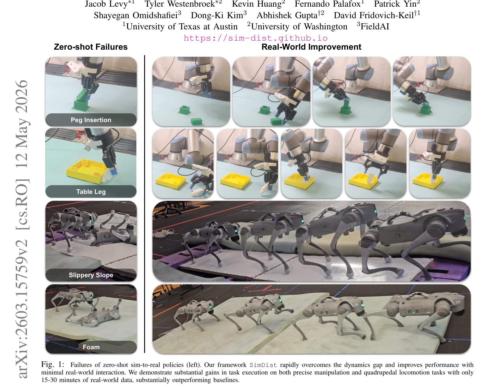
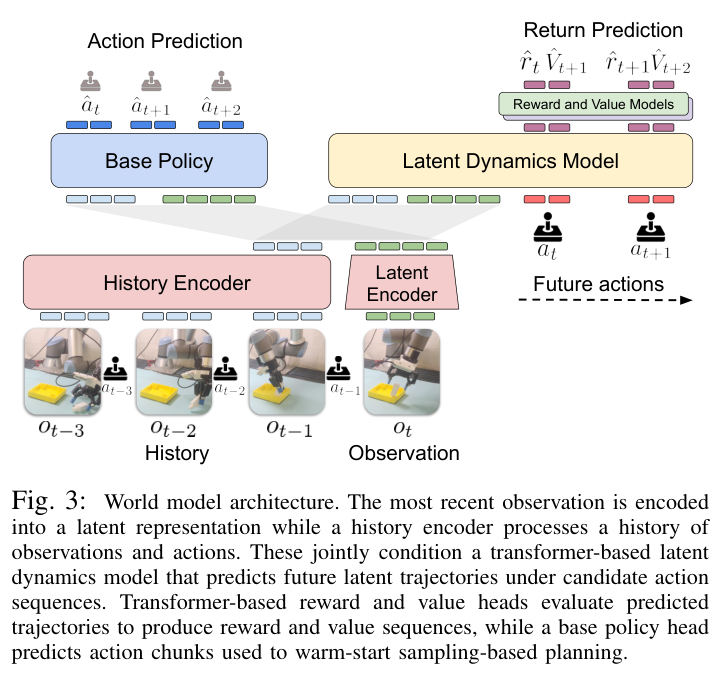
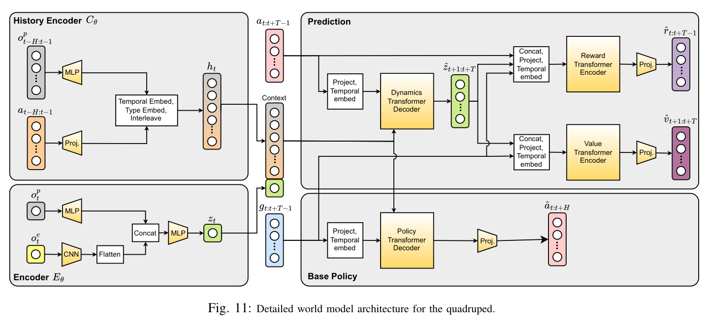
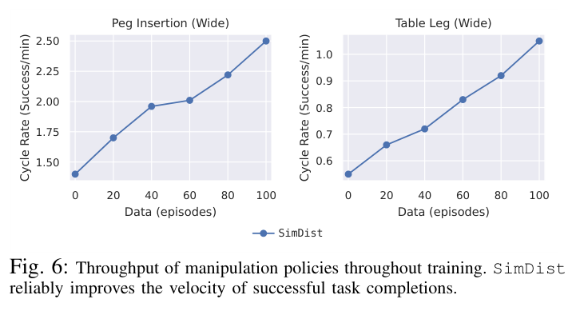
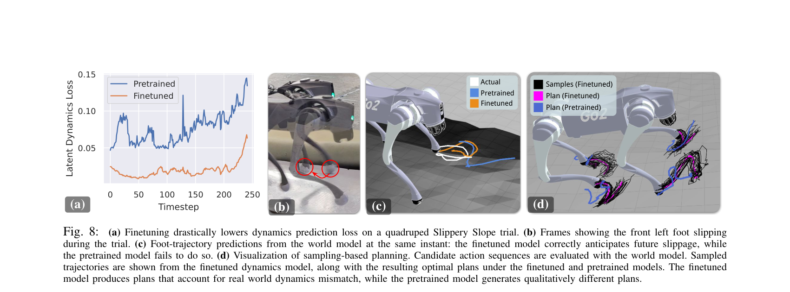

---
tags:
  - papers/WorldModel
  - robotics
  - sim-to-real
  - world-model
aliases:
  - SimDist
  - Simulation Distillation
  - 仿真蒸馏
date: 2026-05-12
doi: 10.48550/arXiv.2603.15759
arxiv_id: "2603.15759"
---

# Simulation Distillation: Pretraining World Models in Simulation for Rapid Real-World Adaptation

## 核心信息

- 标题: Simulation Distillation: Pretraining World Models in Simulation for Rapid Real-World Adaptation
- 标题翻译: 仿真蒸馏：在仿真中预训练世界模型以实现快速真实世界适配
- 作者: Jacob Levy, Tyler Westenbroek, Kevin Huang, Fernando Palafox, Patrick Yin, Shayegan Omidshafiei, Dong-Ki Kim, Abhishek Gupta, David Fridovich-Keil
- 机构: University of Texas at Austin；University of Washington；FieldAI
- 发表时间: 2026-05-12（arXiv v2；cs.RO）
- 发表渠道: arXiv 预印本
- DOI: 10.48550/arXiv.2603.15759
- arXiv: 2603.15759
- 论文链接: https://arxiv.org/abs/2603.15759
- 代码 / 项目: https://sim-dist.github.io
- 数据 / 资源: 仿真数据由管线自生成（操作每任务 10 万条轨迹；四足约 1 亿步）；操作专家复用 Yin 等 ICLR 2026 管线；四足专家用 IsaacLab PPO 训练
- 论文类型: 机器人世界模型 / sim-to-real 方法论文

## 原文摘要翻译

机器人学习需要能够从有限、质量混杂的交互数据中可靠改进的适配方法。这在长时程、富接触的任务中尤其困难：端到端的策略微调在这类任务上仍然低效且脆弱。世界模型提供了一个有吸引力的替代方案：通过预测候选动作序列的后果，它们能够以反事实推理的方式支持在线规划。然而，直接在真实世界中训练动作条件化的机器人世界模型，需要规模上不切实际的多样数据。

我们提出 Simulation Distillation（SimDist），一个把物理仿真器用作可扩展的动作条件化机器人经验来源的框架。在预训练阶段，SimDist 把仿真器中的结构先验蒸馏进一个世界模型，使其能够从原始真实世界观测出发进行规划。在真实世界适配阶段，SimDist 迁移在仿真中学到的编码器、奖励模型与价值函数，只用真实世界的预测损失更新潜动力学模型。这把适配化归为监督式系统辨识，同时保留了用于在线改进的稠密长时程规划信号。在富接触操作与四足运动任务上，SimDist 随经验快速改进，而已有适配方法要么难以取得进展，要么在在线微调中退化。项目网站与代码：https://sim-dist.github.io

## 创新点

1. **把真实世界适配从强化学习问题改写成监督学习问题。** 冻结仿真中学到的编码器、奖励模型与价值函数，只用潜空间预测损失微调动力学模块——真实世界里没有 TD 自举、没有长时程信用分配，只剩系统辨识。这是全文所有结果的杠杆点。
2. **提出并验证"排序即可迁移"的观察。** 规划器只需要 reward/value 对真实状态给出正确的相对排序，而非精确回报值；这个远弱于数值标定的要求恰好能跨过 sim-to-real 差距，让冻结的价值头在零真实标注下立即为规划提供长时程信号。
3. **把仿真器的全部训练产物变成监督源。** 不只用专家策略：中间检查点、最优价值函数、特权状态密集奖励和时间连续的动作扰动一起生成覆盖错误、恢复与失败的多样数据。消融显示这是规划器不利用模型漏洞的先决条件（仅专家数据把成功率从 0.90 打到 0.10）。
4. **一组面向规划吞吐的架构决策。** 单次前向的整块潜状态预测、只保留最近高维观测的最小历史表示、聚合整条预测轨迹的序列到序列 reward/value transformer，共同支撑 50 Hz 的真机在线规划。

*Fig. 1：零样本 sim-to-real 策略在四个任务上的失败（左）与 SimDist 用 15-30 分钟真实数据后的改进（右）；裁切含首页作者区与 arXiv 侧边条，图体与原始图注完整。*

## 一句话总结

这篇论文最干净的一点是把 sim-to-real 差距精确定位到潜动力学这一个模块：任务结构（表征、奖励排序、价值形状）在仿真里就能学对并冻结带走，真实世界只需 15-30 分钟数据做监督式系统辨识，就能在四个真机任务上拿到约两倍于 RL 微调与行为克隆基线的稳定改进；但它交付的是任务专用的小型世界模型，每个新任务都要重建一次仿真加专家 RL 管线，与通用世界模型是两个方向。

## 研究问题

机器人部署后的适配数据天然是有限且混合质量的：演示、失败尝试、探索动作、旧策略轨迹。理想的适配算法要保留预训练先验，又要榨干每条新样本的信息。作者指出端到端离策略微调在这里系统性失败的原因：表征、奖励/价值估计、动力学与动作选择纠缠在同一组参数里，适配等于在稀缺数据上重解一遍长时程信用分配，于是灾难性遗忘频发。

世界模型架构天然把"预测环境"与"信用分配"分成不同网络，新数据可以只修正动作后果的模型而不覆写决策结构，再靠在线规划把更好的预测转成更好的行为。但规划型世界模型有自己的数据问题：规划器会主动搜索高价值动作序列，在覆盖薄弱处利用模型误差，因此模型必须在专家流形之外依然可靠——这种覆盖度的动作条件化数据在真实世界里贵到不可行。

论文的解法是承认仿真有偏差，但论证偏差的分布不均匀：奖励与价值模型只需对真实状态排序正确即可支撑规划，这个性质对 sim-to-real 差距稳健；真正敏感的是把动作绑定到未来状态的动力学模型，而它恰好可以用监督学习便宜地修。于是问题被拆成"仿真里蒸馏任务结构 + 真实里辨识动力学"两段。

## 数据与任务定义

问题被建模为部分可观测马尔可夫决策过程：真实状态不可直接观测，机器人只有原始观测，目标是最大化折扣回报。核心假设（论文假设 1）是可以访问一个提供特权状态的近似物理仿真器——密集奖励在真实世界难以测量，在仿真里免费。

### 两套系统与四个任务

操作任务是两个精密装配问题——插销插入（Peg Insertion）与桌腿装配（Table Leg）。

四足任务是两个越障问题——低摩擦坡面（Slippery Slope）与记忆棉垫（Foam）。

| 项目 | 操作系统 | 四足系统 |
|---|---|---|
| 平台 | UR5e | Unitree Go2 |
| 任务难度分档 | 窄 2 cm 与宽 35 cm 初始方格 | 坡面 3.0° 与 5.7°；两块 5 cm 泡棉 |
| 动作空间 | 6 维相对末端位姿加二值夹爪 | 12 个关节位置目标 |
| 观测 | 3 路 224×224 RGB 加关节状态 | 本体感知加 21×15 局部高度图 |
| 编码 | ResNet-18 融合到 64 维潜状态 | CNN 编码高度图后与本体融合 |
| 仿真数据 | 每任务 10 万条轨迹（约 36% 最优动作） | 约 1 亿步（55.7% 专家动作） |
| 时域与频率 | $H=T=5$，5 Hz | $H=T=25$，50 Hz |
| 成功判据 | 45 秒内完成 | 走完 1.82 m 或 3.00 m |

两个四足任务都是仿真里没有的动力学：PTFE 板加热塑封足套制造极低摩擦接触，记忆棉的柔性压缩在仿真中根本未建模。每个指令速度跑 5 次试验（坡面 0.1/0.3/0.5 米每秒，泡棉 0.2/0.7/1.2 米每秒）；四足规划跑在一台 RTX 4090M 笔记本上。

### 评测协议与基线设置

操作任务的成功率按每个数据点 20 次试验统计。RL 基线（RLPD、IQL、SGFT-SAC）拿到 20 条遥操作演示并用稀疏奖励训练，每集更新一次。

SimDist 每 20 集才更新一次动力学，标准版完全不用演示；带行为克隆的变体（下文记作 SimDist+BC）额外用这 20 条演示微调基础策略头。行为克隆基线是 Diffusion Policy 与 π0.5，用 100 条真实演示，各含纯真实与真实加仿真共训两个变体。

四足对比中所有方法共享 SimDist 的学习奖励模型，以隔离适配策略本身的差异；该系统无法采集演示，故不含需要演示的方法。

## 方法主线

### 机制流程

1. **特权状态强化学习 → 专家产物。** 输入仿真特权状态，用现成管线训练状态输入的专家策略（操作复用 Yin 等的管线，四足用 IsaacLab 的 PPO 实现），同时保存中间检查点与最优价值函数，作为后续监督源。
2. **策略混合 + 动作扰动 → 多样数据集。** 大规模并行环境在重置时以 0.5 概率换用次优检查点，并在连续时间窗内注入高斯动作噪声；每步记录观测、动作、特权奖励、专家价值目标与专家动作标志，输出 $\mathcal{D}_{sim}$。
3. **联合监督 → 面向规划的世界模型。** 在 $\mathcal{D}_{sim}$ 上以损失 (2) 同时训练编码器、历史编码器、潜动力学、reward/value 头与基础策略头，配合大量视觉与本体噪声增广，得到能从原始观测规划的模型。
4. **真实部署 → 冻结式动力学微调闭环。** MPPI 用世界模型给候选动作序列打分并执行；每收集 20 条真实轨迹，按损失 (3) 只更新潜动力学 $f_\theta$，其余模块全部冻结，然后继续部署，迭代进行。

*Fig. 2：SimDist 总览——仿真侧专家训练、数据生成、世界模型预训练，真实侧规划部署与仅动力学微调的闭环；裁切完整、含原始图注。*

> [!figure] Algorithm 2：多样数据生成
> 建议位置：机制流程
> 放置原因：伪代码给出噪声协方差采样、噪声区间与检查点混合的完整过程。
> 当前状态：自动裁切只有窄条不可用；关键参数（重置换策略概率 0.5、操作噪声区间 U[1,5] 步、四足 U[1,50] 步）已在正文与复现注意点转写。

### 世界模型结构与预训练目标

模型是 TD-MPC 一系的面向规划潜世界模型，六个组件共享一个 64 维潜空间：

$$
z_t=E_\theta(o_t),\qquad h_t=C_\theta(o_{t-H:t-1},a_{t-H:t-1}),\qquad \hat z_{t+1:t+T}=f_\theta(z_t,a_{t:t+T-1},h_t),
$$

$$
\hat r_{t:t+T-1}=R_\theta(\hat z_{t:t+T},a_{t:t+T-1}),\qquad \hat v_{t+1:t+T}=V_\theta(\hat z_{t:t+T}),\qquad \hat a_{t:t+H}=\pi_\theta(z_t,h_t).
$$

*Fig. 3：架构总图——最新观测走潜编码器，历史观测与动作走历史编码器，二者共同条件化 transformer 潜动力学，reward/value 头评估整条预测轨迹；裁切完整清晰。*

预训练损失对每个时间步施加四项监督：

$$
\mathcal{L}^{sim}(\theta)=\sum_{i=0}^{T}\Big[\|\hat z_{t+i+1}-\mathrm{sg}(E_\theta(o_{t+i+1}))\|_2^2+c_1(\hat r_{t+i}-r_{t+i})^2+c_2(\hat v_{t+i+1}-v_{t+i+1})^2+c_3\,\mathbf{1}_e(a_{t+i})\|\hat a_{t+i}-a_{t+i}\|_2^2\Big],
$$

其中 sg 是停梯度算子，$c_{1:3}$ 按各目标的数值范围归一化，$\mathbf{1}_e$ 只在动作来自未扰动专家时为 1（行为克隆项不学扰动动作）。关键在于价值目标 $v_t$ 直接查询专家价值函数 $V^e(s_t)$，奖励来自特权状态——预训练是一个平稳的纯监督目标，完全没有时间差分学习，这与需要在线自举行为的常规 MBRL 形成鲜明对比。

部署用 MPPI：采样一批候选动作序列，用世界模型按下式估计回报，再按回报做重要性加权，并像 TD-MPC 那样用加噪的基础策略输出热启动一部分候选：

$$
R(a_{t:t+T-1})=\gamma^T\hat v_{t+T}+\sum_{s=t}^{t+T-1}\gamma^{s-t}\hat r_s.
$$

### 真实世界适配：系统辨识而非强化学习

适配损失只剩潜动力学一项：

$$
\mathcal{L}^{real}(\theta)=\sum_{i=0}^{T}\big\|\hat z_{t+i+1}-\mathrm{sg}(E_\theta(o_{t+i+1}))\big\|_2^2.
$$

微调时只有潜动力学模块可训练，编码器、历史编码器、奖励、价值与基础策略头全部冻结。

冻结编码器有双重作用：一是给微调提供恒定的潜目标，不需要在真实域重新自举表征；二是把适配后的动力学锚定在 reward/value 头训练时的同一潜空间上，防止漂移到它们无法评估的区域。因为目标是纯监督的，任意真实轨迹（在策略轨迹、演示、玩耍数据）都能用——这是一个天然的离策略学习框架。

> [!figure] Algorithm 1：SimDist 主流程
> 建议位置：真实世界适配：系统辨识而非强化学习
> 放置原因：伪代码给出预训练与迭代微调两个循环的完整控制流。
> 当前状态：自动裁切过窄不可用；流程已在机制流程四步与本节转写，无信息损失。

### 面向规划吞吐的三个架构决策

- **最小历史表示。** 观测拆成本体感知与外部感知两部分，历史编码器只吃本体历史加动作历史加最近一帧高维观测；上下文变短既降规划时延，经验上还更稳。
- **整块预测。** 潜动力学是带因果掩码的 transformer，在历史令牌与候选动作序列之间做交叉注意力，一次前向吐出全部 $T$ 步潜状态，避免自回归展开在评估大批量候选时的并行瓶颈。
- **序列到序列回报建模。** reward/value 头是对整条预测轨迹做注意力的 transformer，而非常规的逐步 MLP 解码器；聚合轨迹级结构对评估候选动作序列更准（消融损失见关键结果）。

*Fig. 11：四足版模型的详细数据流——历史编码器的交错嵌入、CNN 高度图编码、动力学 transformer 解码器与四个头的连接方式，是复现层面信息量最大的一张图；裁切完整清晰。*

### 不做像素重建

许多世界模型用像素重建来"稳住"表征，这里刻意不用，理由有二：多样数据本身已迫使表征覆盖广泛的状态-动作对；sim-to-real 需要大量视觉随机化，重建会逼潜状态编码那些被故意随机化的纹理光照——与任务无关却占容量。作者用一个事后探针证明冻结编码器已经隐式捕获场景状态：仅从潜变量就能训练出重建真实相机画面的辅助解码器，而世界模型本身从未见过重建目标。

## 关键结果

### 主结果与强基线

*Fig. 4：四个任务的真实世界学习曲线，操作每点 20 次试验，四足为 3 速 × 5 次的平均前进距离；SimDist 单调上升，RL 基线普遍停滞或崩溃；裁切完整、图例齐全。*

从曲线读出的操作任务终点（约值）：

| 设置 | SimDist | SimDist+BC | 最强基线 | 失败侧 |
|---|---:|---:|---:|---|
| Peg Insertion（Wide），120 集 | 约 0.85 | 约 0.90 | SGFT 约 0.40 | RLPD 崩到 0；两个 BC 基线约 0.10 以下 |
| Table Leg（Wide），100 集 | 约 0.80 | 约 0.90 | SGFT 约 0.40 | IQL 退化到接近 0 |
| Peg Insertion（Narrow），100 集 | 约 0.85 | 约 0.90 | SGFT 约 0.40 | RLPD 约 0.35 |
| Table Leg（Narrow），80 集 | 约 0.80 | 约 0.95 | SGFT 约 0.40 | 其余在 0.2 上下徘徊 |

四足按附录第 IX 表的精确数字（前进距离，米；成功次数每 5 次试验）：

| 任务 / 速度 | 零样本预训练 | 单步 BC | SimDist | IQL | RLPD |
|---|---|---|---|---|---|
| 坡面 0.1 米每秒 | 0.70，0/5 | 1.49，2/5 | **1.78，4/5** | 0.00，0/5 | 0.32，0/5 |
| 坡面 0.3 | 0.43，0/5 | 1.43，1/5 | **1.82，5/5** | 0.39，0/5 | 0.34，0/5 |
| 坡面 0.5 | 0.90，0/5 | 0.62，0/5 | **1.82，5/5** | 0.46，0/5 | 0.35，0/5 |
| 泡棉 0.2 | 2.98，3/5 | 2.07，1/5 | **3.00，5/5** | 0.92，1/5 | 失稳未测 |
| 泡棉 0.7 | 2.39，2/5 | 1.54，1/5 | **3.00，5/5** | 2.25，2/5 | 失稳未测 |
| 泡棉 1.2 | 1.70，0/5 | 2.45，2/5 | **3.00，5/5** | 2.73，3/5 | 失稳未测 |

几个值得停留的模式：SimDist 在坡面任务用 35.7 分钟数据、泡棉用 32.1 分钟，把零样本部署的 5/30 次成功抬到 29/30；IQL 与 RLPD 在同等数据预算下几乎无成功，后者甚至在泡棉适配中把机器人弄失稳。

操作侧的规律是任务越难差距越大：初始方格从窄扩到宽之后，基线全面塌方而 SimDist 几乎不掉——这是宽覆盖仿真预训练在整个状态空间上保留结构先验的直接体现。SGFT 靠迁移仿真价值函数躲过了崩溃，但它是无模型方法，无法像世界模型那样对未经历的轨迹做反事实评估，样本效率明显更低，最终卡在 0.4 附近。给 SimDist 加演示只会更好（带行为克隆的变体全面最高），说明框架能自然吸收混合质量数据。

*Fig. 6：训练过程中的任务吞吐率——Peg Wide 从约 1.4 升到 2.5 次成功每分钟，Table Leg 从约 0.55 升到 1.05；动力学变准不仅提高成功率还加快执行；裁切完整。*

> [!figure] Fig 5：成功与失败轨迹的价值预测
> 建议位置：主结果与强基线
> 放置原因：原图展示冻结价值头沿真实轨迹的输出——成功轨迹单调上升，失败轨迹在掉落木钉瞬间骤降，是排序迁移论断的直接证据。
> 当前状态：两个自动裁切分别截断图体或只含正文文字，不可靠故保留占位；结论已在本节转写。

> [!figure] Fig 7：Wide 初始条件的成败散点
> 建议位置：主结果与强基线
> 放置原因：原图对比 SimDist 与 Diffusion Policy 在 35 cm 初始格上的成功覆盖，前者绿点铺满全格、后者大面积红叉。
> 当前状态：人工检查发现自动裁切把 Fig 5 的左半价值曲线与本图混在同一图块，身份不纯，不插入；结论已在正文转写。

### 消融到底说明了什么

全部消融在仿真中评测（四足用 1080 个参数组合环境），报告操作成功率与四足每集平均奖励：

| 配置 | Peg Insertion | Table Leg | 四足奖励 |
|---|---:|---:|---:|
| SimDist 完整 | 0.90 | 0.85 | 22.78 |
| 50% 数据 | 0.72 | 0.61 | 22.73 |
| 10% 数据 | 0.06 | 0.02 | 19.38 |
| 仅专家数据（等量） | 0.10 | 0.05 | 16.68 |
| 逐步 MLP reward/value 头 | 0.82 | 0.60 | 19.47 |
| 加像素重建损失 | 0.32 | 0.21 | 23.34 |

- **多样性比规模更致命。** 等数据量的纯专家轨迹（0.10/0.05）几乎和 10% 数据（0.06/0.02）一样糟，而 50% 数据只温和下降；四足侧砍半数据几乎无损（22.73 对 22.78），去掉多样性却直接掉到 16.68。规划型世界模型需要的不是更多专家示范，而是错误与恢复的覆盖。
- **轨迹级回报聚合有真实收益。** 换成逐步 MLP 头后，Table Leg 从 0.85 掉到 0.60、四足从 22.78 掉到 19.47——评估长时程装配序列时逐步解码丢失了跨步结构。
- **重建损失的伤害是模态依赖的。** 操作（三路 RGB、重度视觉随机化）从 0.90 崩到 0.32；四足（高度图观测）反而略升到 23.34。"重建有害"的正确读法是：当观测含大量被随机化的任务无关细节时有害。

*Fig. 10：适配阶段解冻组件的后果——解冻编码器立即归零（reward/value 头收到分布外潜变量），解冻价值函数重新引入信用分配并灾难性遗忘；顶部混入一行截断正文，属轻微裁切瑕疵。*

解冻消融是全文论证闭环的一块关键拼图：冻结不是保守的工程偏好，而是让监督式适配成立的必要条件。作者不做奖励头解冻的理由也直白——真实世界根本没有密集奖励标签，这恰是零真实标注奖励迁移的价值所在。

### 微调为什么起效：从预测误差到规划分布

*Fig. 8：机制证据链四联图——留出轨迹上潜动力学损失从 0.076 降到 0.019；真实前左足打滑帧；微调后模型正确预报滑移而预训练模型预测稳定接触；规划分布随之改变，微调后的最优计划开始补偿真实打滑；裁切完整清晰。*

这一节是论文把"损失下降"翻译成"行为改善"的因果链：预训练模型在 PTFE 表面错误地预测稳定接触，规划器于是选出会打滑的计划；微调后模型预报滑移，MPPI 采样的同一批候选被重新排序，选出的计划显式补偿低摩擦。值得注意留出轨迹不在微调数据里——宽覆盖仿真预训练让动力学修正能泛化到未见轨迹，而不是记住见过的错误。

## 深度分析

### 真正贡献是什么

组件层面几乎全是已有零件：TD-MPC 式潜世界模型与 MPPI、师生式仿真到真实的强化学习管线、域随机化、ResNet 编码器。

真正的贡献是一个可检验的分解论断及其证据：任务结构（表征、奖励排序、价值形状）对 sim-to-real 差距近似不变，环境特异的只有动力学，所以预训练时就按这条线切开参数，适配时只动动力学。解冻消融（动谁谁崩）、价值判别曲线（Fig 5）与机制四联图（Fig 8）合起来把这个论断钉住了。

第二个被低估的贡献是把数据生成当成一等公民：检查点混合加时间连续扰动的配方，本质是在离线阶段预演规划器将来会查询的反事实分布。消融里它是最大的单一因素（0.90 对 0.10），比任何架构选择都重要。序列到序列回报头是锦上添花的架构点，收益真实但量级次之。

### 为什么结果成立

从优化角度看，SimDist 把真实数据花在一个条件数最好的子问题上：潜空间回归目标平稳、密集、无自举，几百条轨迹就能显著降损失；RL 基线要用同样的数据同时修策略、价值与表征，还要对抗离策略偏差。这是样本效率差距的第一性来源。

排序迁移之所以成立，是因为 MPPI 只做候选间的相对比较：回报估计的单调变形不改变重要性加权的排序结构，所以 reward/value 只要保序就能给出正确的搜索方向。而动力学差距被冻结表征"局部化"了——潜目标由冻结编码器给出，微调只需把动作到潜状态转移的映射对齐真实物理，不需要动任何语义。

### 容易误读的地方

- 这里的"世界模型"是任务专用的低维潜模型，没有像素生成、没有语言、没有跨任务共享。不要把标题读成通用世界模型路线的胜利——它证明的是分解式适配在单任务 regime 的有效性。
- "约两倍于基线"不是普适常数。操作 RL 基线用稀疏奖励（反映真实操作场景的现实约束，但确实是不利设置），BC 基线的演示数量与数据分布也与 SimDist 不同质；比较证明的是适配策略的排序，不是控制变量后的净差。
- 15-30 分钟真实数据的前面还有每任务一整套前置成本：以四足为例，490M 环境步的专家 RL、约 7 小时数据生成、约 28 小时预训练（单卡）。成本没有消失，只是从真实世界搬进了仿真——这笔交换在真实交互昂贵时划算，反之未必。
- 消融表全部在仿真评测，各组件对真机结果的贡献没有独立复验；泡棉任务的成功也不能读成"仿真覆盖度无关紧要"，它说明的是潜动力学微调能修没建模的动力学，前提是任务结构仍然成立。

### 复现注意点

1. 专家管线：操作完全复用 Yin 等的 ICLR 2026 工作（含奖励定义）；四足用 IsaacLab PPO，策略与价值网络均为 3 层 512 宽 MLP，490M 环境步，检查点存于迭代 {0, 50, 100, 150, 200, 250, 300, 400, 500, 1000, 2000}。
2. 数据生成：环境重置时以 0.5 概率换次优检查点；操作噪声区间 U[1,5] 步、无噪区间 U[5,10] 步；四足对应 U[1,50] 与 U[25,500]；每个环境独立采样对角高斯噪声协方差。
3. 预训练：两个 epoch，Adam 学习率 2e-4 余弦退火至 1e-4，warmup 10k 步；操作 batch 256 约 20 万步梯度更新，四足 batch 512 约 3.69×10⁵ 步；增广含本体高斯噪声、颜色抖动、高斯模糊、随机裁剪。
4. 规划：MPPI 沿用 TD-MPC 实现，折扣 0.99；操作温度 0.4、初始动作标准差 1.0；四足温度 0.25、初始标准差 2.0。注意附录第 II、VII 两张参数表里各变换器模块的层数、头数与嵌入维度在本次文本抽取中数值丢失，需以公开代码为准。
5. 四足的策略、reward、value 头额外条件化在期望前进/侧向/偏航速度上，实机用位置 PD 控制器生成速度命令以保持直线行走。
6. 域随机化范围：基座质量 −1.0 到 +3.0 kg、摩擦系数 [0.2, 1.2]、恢复系数 [0.0, 0.3]、关节刚度与阻尼 ±10%、关节摩擦 [0.0, 0.05]。
7. 适配节奏是每 20 集一次动力学更新（基线每集更新），复现对比实验时不要弄错这一不对称设置。

## 局限

1. **冻结价值封顶。** 作者在结论坦承：当迁移的价值函数饱和、不再区分高表现真实轨迹时，性能会被封住；逼近满分可能需要选择性更新价值——而这正是全文刻意绕开的信用分配问题，如何安全地做没有给出答案。
2. **任务专用与前置成本。** 每个任务需要自己的仿真环境、密集奖励设计与专家 RL 管线；框架的边际适配成本极低，但固定成本高，且完全不摊销到下一个任务。
3. **依赖仿真覆盖度。** 结论明确指出方法依赖足够宽的仿真覆盖来支撑可靠规划；如果真实差距大到动力学微调修不动（形态改变、传感器失效），框架没有退路机制。
4. **感知与模态的天花板。** 不用互联网级视频，也不用更丰富的感知模态；部分可观测的处理很朴素（本体历史加最近一帧高维观测），需要视觉记忆的任务会遇到结构性困难。
5. **评测规模。** 4 个任务、每点 15-20 次试验，无跨任务、跨形态或长期部署证据；操作与四足的基线集合也不对称（后者无演示类方法）。

## 我的笔记

- 与 [[World Action Models are Zero-shot Policies]]（DreamZero，https://arxiv.org/abs/2602.15922 ）恰好构成世界模型光谱的两端：DreamZero 用 14B 像素空间视频扩散换跨任务零样本泛化，失败主要来自视频生成；SimDist 用小型任务潜模型换单任务快速适配，干脆不生成像素，还给出"重建有害"的消融。两者对"世界模型该预测什么"的回答相反，但不矛盾——regime 不同：前者赌视觉先验的广度，后者赌控制回路只需要保序的任务结构。真正有信息量的问题是两者的组合点在哪里。
- 对本地仿真锚定世界动作模型项目（设计稿见 [[insight]]）：这篇是"仿真当结构先验"路线最硬的一块前证，给出三个可直接搬运的组件。其一，排序迁移论点直接支撑设计稿里"仿真侧奖励与价值只需给出正确排序"的置信度加权设计，甚至提示仿真监督可以整体降格为序数信号来抗保真度误差。其二，检查点混合加时间连续扰动的数据配方，就是设计稿第 4.2 节在线批评器想覆盖"模型会犯的错"的离线廉价版，仿真原生分支的轨迹生成应当照抄。其三，冻结编码器锚定潜目标的手法回应了设计稿对表征漂移的担忧——在视频世界模型上加仿真状态一致性监督时，感知头同样应该冻结或慢更新。
- 反向的教训同样重要：SimDist 暴露了纯潜空间路线的天花板——没有视频先验，每个新任务都要重建仿真加专家强化学习，固定成本不摊销。这恰好是仿真锚定视频世界模型想两头兼得的位置：视频预训练给跨任务先验，仿真给动作条件化的物理监督。一个值得排期的桥接实验：把 SimDist 式的冻结奖励/价值头接到视频世界模型的潜空间上（经设计稿第 4.3 节的辅助头对齐），检验排序迁移在高维视频潜空间是否仍然成立——成立的话，DreamZero 类模型就能免真实标注地获得规划信号。
- 工程上最值得偷的单点：把"适配哪个模块"当成 sim-to-real 的第一设计问题。DreamZero 适配新形态是全模型微调；SimDist 表明预训练时就按"任务结构对动力学"切开参数，适配成本能低一个量级。这个参数划分原则与具体架构无关，潜模型、视频模型、VLA 都适用。

## 引用

Levy, J., Westenbroek, T., Huang, K., Palafox, F., Yin, P., Omidshafiei, S., Kim, D.-K., Gupta, A. & Fridovich-Keil, D. *Simulation Distillation: Pretraining World Models in Simulation for Rapid Real-World Adaptation*. arXiv:2603.15759 (2026). DOI: 10.48550/arXiv.2603.15759.
