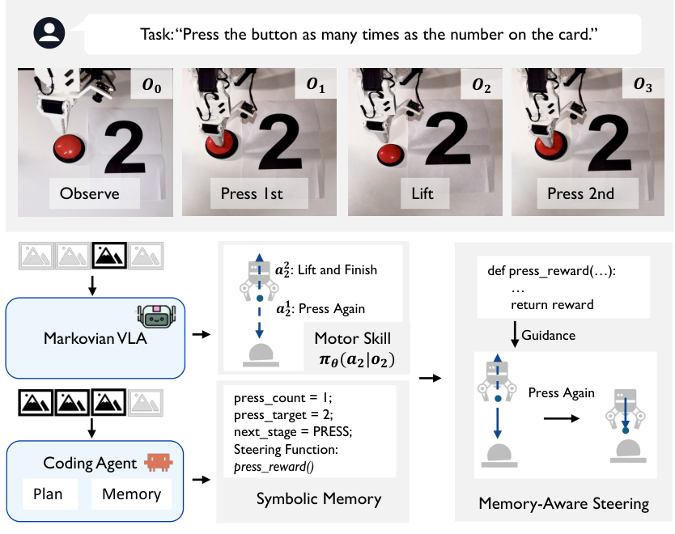
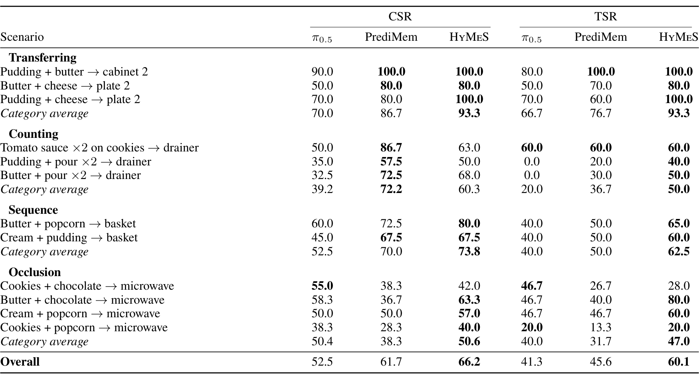
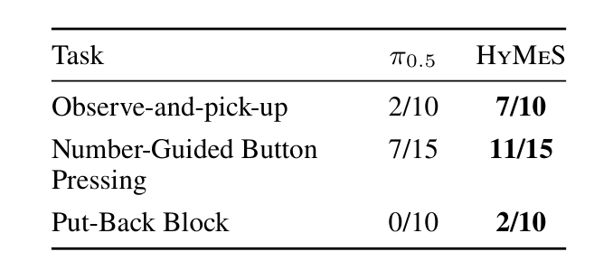
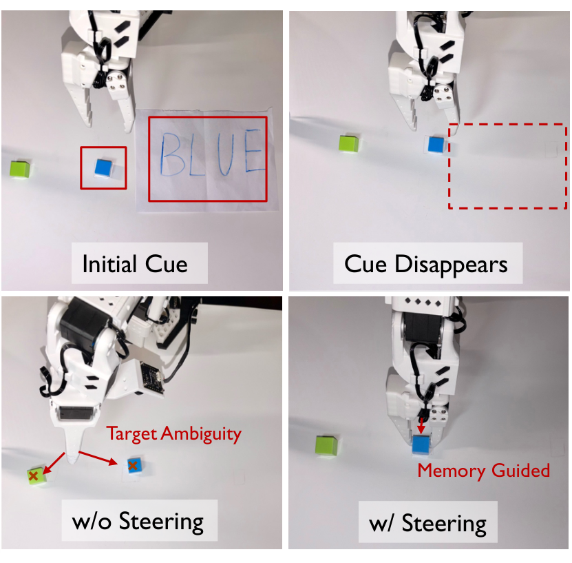
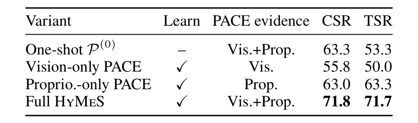

# Skills in Weights, Memory in Code: Hybrid Learning for Memory-Dependent Robot Manipulation

**Authors:** Yunhao Zhao*, Zhenyang Ni*, Haoyang Chen, Ruohan Zhang, Qi Zhu (Northwestern University, University of Minnesota, Stanford University)  
**Source:** local PDF, SHA256 `f50ef6fc852a319723a4b246ee27546e0da03ce58e27a2b5d6cef84b3fa19344`, arXiv:2608.09410v1  
**Reader:** complete 9-page bilingual reader; references remain English-only for searchable bibliographic fidelity.

## Section Index
Abstract; Introduction; Related Work; Problem Formulation; Method; Experiments; Conclusion; References.

## Terminology Ledger
| English | 中文 |
| --- | --- |
| Skills in Weights, Memory in Code | 权重承载技能，代码承载记忆 |
| HyMeS (Hybrid learning for Memory-dependent Steering) | 混合学习记忆导引框架（HyMeS） |
| Markovian / non-Markovian | 马尔可夫 / 非马尔可夫 |
| Flow-matching VLA | 流匹配视觉—语言—动作模型 |
| Memory-conditioned action steering | 记忆条件化动作导引 |
| Velocity field injection | 速度场注入 |
| PACE (Proprioception-And-Completion-driven stagE-switching) | 基于本体感受与完成度的阶段切换机制（PACE） |
| Cumulative Success Rate (CSR) | 累积阶段成功率 |
| Task Success Rate (TSR) | 整任务成功率 |
| Rollout-driven heuristic learning | 基于轨迹反馈的启发式代码学习 |

## Abstract

> <strong>Para. 1:</strong> Modern vision-language-action (VLA) policies have acquired broad manipulation skills, but typically generate each action chunk from the current observation or a short fixed-length history. However, real-world manipulation is often non-Markovian, requiring robots to retain and reason over task-relevant information from long-horizon interaction histories to determine the next action. To address this challenge, we propose HyMeS, a Hybrid learning framework that leverages the reasoning and Memory-management capabilities of coding agents to Steer a Markovian VLA for memory-dependent manipulation. Specifically, HyMeS learns low-level motor skills through gradient-based imitation learning, while a coding agent acquires high-level memory-management strategies through heuristic learning by iteratively updating an executable heuristic system from rollout feedback. Furthermore, we close the loop between steering and execution through multimodal stage-completion verification, which updates memory using proprioceptive signals and multi-frame VLM judgments.

> <strong>Para. 1[CN]:</strong> 现代视觉—语言—动作（VLA）策略已经掌握了广泛的操作技能，但通常仅根据当前观测或较短的固定长度历史生成每个动作块。然而，真实的机器人操作往往是非马尔可夫的，要求机器人能够从长时程交互历史中保留并推理与任务相关的信息，以决定下一步动作。为应对这一挑战，我们提出了 HyMeS，这是一种混合学习框架（Hybrid learning framework），利用编码智能体（coding agent）的高层推理与记忆管理能力来导引（Steer）马尔可夫 VLA 完成依赖历史记忆的操作任务。具体而言，HyMeS 通过基于梯度的模仿学习在权重中学习低层运动技能；而编码智能体则通过启发式学习，根据交互轨迹的执行反馈迭代更新可执行的代码启发式系统，从而在代码空间中习得高层记忆管理策略。此外，我们通过多模态阶段完成验证机制实现了导引与执行之间的物理闭环，结合本体感受信号与多帧 VLM 视觉判定实时更新记忆状态。

> <strong>Para. 2:</strong> Compared with end-to-end memory-augmented VLAs, HyMeS requires demonstrations only for reusable motor skills rather than for every history-dependent task configuration, enabling data-efficient compositional generalization. On RoboMemArena, HyMeS improves mean cumulative success from 52.5% to 66.2% and mean task success from 41.3% to 60.1% over $\pi_{0.5}$, while outperforming PrediMem by 4.5 points in cumulative success and 14.5 points in task success.

> <strong>Para. 2[CN]:</strong> 与端到端记忆增强型 VLA 相比，HyMeS 仅需可复用运动技能的演示数据，而无需为每一种依赖历史的任务组合配置分别收集演示，从而实现了高效的数据组合泛化。在 RoboMemArena 基准上，HyMeS 相比 $\pi_{0.5}$ 将平均累积阶段成功率（CSR）从 52.5% 提升至 66.2%，将平均整任务成功率（TSR）从 41.3% 提升至 60.1%；同时超越了强基线 PrediMem，累积成功率领先 4.5 个百分点，整任务成功率大幅领先 14.5 个百分点。

## Introduction

> <strong>Para. 3:</strong> Vision–language–action (VLA) models have made rapid progress toward general-purpose robot control. Recent models such as $\pi_{0.5}$ generalize across diverse objects, scenes, and language instructions (Physical Intelligence et al. 2025b), while $\pi_{0.6}$ further extends these capabilities to fine-grained and dexterous manipulation (Physical Intelligence et al. 2025a). A single policy can now acquire a broad repertoire of motor skills and achieve high success rates across many manipulation tasks. These advances suggest that low-level motor competence is increasingly well served by modern VLAs.

> <strong>Para. 3[CN]:</strong> 视觉—语言—动作（VLA）模型在通用机器人控制领域取得了飞速进展。近期模型如 $\pi_{0.5}$ 已经能够在多样化的物体、场景和语言指令间实现广泛泛化（Physical Intelligence et al. 2025b），而 $\pi_{0.6}$ 进一步将这些能力扩展到了细粒度与灵巧操作领域（Physical Intelligence et al. 2025a）。如今，单一策略网络即可习得丰富的运动技能库，并在诸多操作任务上取得高成功率。这些进展表明，现代 VLA 模型已经能够很好地胜任低层运动执行能力。

> <strong>Para. 4:</strong> Despite this progress, most VLAs remain Markovian by design: they generate each action chunk from only the current observation or a short fixed-length context, whereas real-world robot manipulation is often non-Markovian and requires reasoning over task-relevant information from long-horizon interaction histories. For example, although pressing a button is a simple motor skill, a Markovian VLA cannot reliably press multiple buttons the required numbers of times when the counts must be recalled from earlier observations.

> <strong>Para. 4[CN]:</strong> 尽管取得了这些突破，绝大多数 VLA 在设计架构上依然是严格马尔可夫的：它们仅根据当前单帧观测或极短的固定窗口上下文生成动作块；然而现实物理世界中的机器人操作往往是非马尔可夫的，需要根据长时程交互历史中保留的任务关键信息进行跨阶段推理。例如，按压按钮本身是一项基础的低层运动技能，但当按压的具体次数必须从早期观测到的卡片中检索回忆时，纯马尔可夫 VLA 便无法可靠地按要求的次数完成多按钮按压任务。

### Figure 1. 代码记忆消除历史依赖动作歧义

**Caption:** Figure 1: Memory as code resolves history-dependent action ambiguity. Top: the required number of presses is specified by a card observed at the start of the episode. Bottom: at $o_2$ the first press is complete and the arm has lifted, so the current observation alone supports two incompatible action modes: press again ($a_2^1$) or lift and stop ($a_2^2$). The Markovian VLA conditions on $o_2$ only and cannot choose between them. HyMeS instead passes the interaction history to a coding agent that maintains symbolic memory in executable form, and selects the corresponding steering function. The gradient of that function guides action generation toward pressing again, using the same policy weights with no weight update.

**Caption[CN]:** 图 1：代码形式的记忆消解历史依赖动作歧义。顶部：目标按压次数由回合初始阶段观测到的一张卡片指定。底部：在时刻 $o_2$，第一次按压已完成且机械臂已抬起，此时单凭当前视觉观测同时支持两种互不兼容的动作模态：再次按压（$a_2^1$）或抬起并结束任务（$a_2^2$）。纯马尔可夫 VLA 仅以 $o_2$ 为条件，因而无法在二者之间做出决断。HyMeS 将交互历史交由编码智能体处理，以可执行代码形式维护符号记忆，并选取对应的导引函数；该函数的梯度引导动作生成走向“再次按压”，在无需更新任何网络权重的前提下复用同一套策略。

> <strong>Para. 5:</strong> Existing memory-augmented VLAs address this limitation by extending the observation context or adding learned memory modules, then training the history-conditioned policy end-to-end from robot demonstrations (Shi et al. 2025; Yang et al. 2026a,b). However, this entangles memory acquisition with motor learning, forcing expensive robot demonstrations to cover combinatorial memory configurations even when no new motor skills are involved. Moreover, history-conditioned policies trained end-to-end often suffer from catastrophic forgetting and yield implicit latent states that are difficult to inspect or correct when execution fails.

> <strong>Para. 5[CN]:</strong> 现有的记忆增强型 VLA 通常通过扩充观测上下文或添加可学习的记忆模块来应对这一局限，随后通过端到端模仿学习直接从机器人演示数据中训练历史条件化策略（Shi et al. 2025；Yang et al. 2026a,b）。然而，这种范式将记忆习得与低层运动学习紧密纠缠在一起，即使任务并未引入任何新的物理运动技能，也迫使昂贵的真机演示数据必须穷举覆盖各种组合爆炸式的记忆状态配置。此外，端到端训练的历史条件化策略容易遭遇灾难性遗忘，并产生不可解释的隐式潜空间状态，在发生执行失败时极难被审计或针对性修复。

> <strong>Para. 6:</strong> We propose a different perspective: motor skills should be learned in weight space, but memory should be acquired in code space. Motor skills—such as grasping, pressing, and opening—are continuous, contact-rich behaviors that are naturally represented by neural network weights optimized on demonstration data. By contrast, memory management—such as tracking completed stages, updating counters, and resolving occluded object references—is symbolic, rule-governed, and combinatorial. Learning memory strategies in code space enables rapid adaptation, explicit state inspection, and modular combination with pretrained motor skills, without collecting demonstrations for every memory configuration.

> <strong>Para. 6[CN]:</strong> 我们提出了一个截然不同的全新视角：**运动技能应在权重空间中学习，而记忆机制应在代码空间中习得**（Skills in Weights, Memory in Code）。诸如抓取、按压、开门等低层运动技能属于连续且依赖丰富物理接触的行为，天然适合由在演示数据上优化的神经网络权重来表征；相反，记忆管理——例如跟踪已完成阶段、更新事件计数器、解析被遮挡物体的空间引用——在本质上是符号化的、规则约束的和高度组合性的。在代码空间中学习记忆策略，能够实现快速自适应、显式状态可查性以及与预训练运动技能的模块化灵活解耦组合，从而彻底免除了为每一种记忆组合状态收集真机演示的沉重负担。

> <strong>Para. 7:</strong> To realize this principle, we propose HyMeS (Hybrid Learning for Memory-Dependent Steering), an embodied framework that couples a Markovian VLA with an executable heuristic system. HyMeS keeps the underlying VLA purely Markovian, freezing its weights after fine-tuning on reusable motor skills. To handle memory dependence, a coding agent maintains an executable symbolic memory and dynamically selects a stage-specific constraint function. The gradient of this constraint is injected into the VLA’s denoising velocity field to bias action generation toward memory-consistent behaviors, as illustrated in Fig. 1.

> <strong>Para. 7[CN]:</strong> 为践行这一原则，我们提出了 HyMeS（面向记忆依赖导引的混合学习框架），将马尔可夫 VLA 与可执行启发式代码系统紧密耦合。HyMeS 保持底层 VLA 的纯马尔可夫特性，在针对可复用运动技能进行微调后彻底冻结其网络权重。为了处理历史记忆依赖，编码智能体维护一套可执行的符号记忆，并动态选取阶段特定的可微约束函数。该约束函数的梯度被实时注入到 VLA 的去噪速度场中，从而引导动作生成倾向于与当前记忆状态相吻合的行为模态（如图 1 所示）。

> <strong>Para. 8:</strong> To learn and maintain memory strategies effectively, HyMeS introduces two key mechanisms:
>
> - **Rollout-driven heuristic learning:** A coding agent iteratively inspects execution traces and stage verdicts from development rollouts to diagnose failures and refine the executable program, acquiring memory-management logic in code space without gradients or expert action labels.
> - **Multimodal progress verification (PACE):** A dual-stream verification mechanism combines proprioceptive signals with multi-frame visual language model (VLM) judgments in a temporal voting window to reliably detect stage transitions and update symbolic memory.
> - **Extensive empirical gains:** On RoboMemArena, HyMeS improves CSR from 52.5% to 66.2% and TSR from 41.3% to 60.1% over $\pi_{0.5}$, while exceeding PrediMem by 4.5 and 14.5 points, respectively.

> <strong>Para. 8[CN]:</strong> 为高效学习与维护记忆策略，HyMeS 引入了两大核心机制：
>
> - **基于轨迹反馈的启发式代码学习**：编码智能体迭代分析开发阶段的执行轨迹与阶段判定结果，精准诊断失败根因并修改可执行程序，无需任何梯度或专家动作标签即可在代码空间中习得记忆管理逻辑；
> - **多模态进度验证（PACE）**：双流验证机制在时序投票窗口中将本体感受信号与多帧视觉语言模型（VLM）判断紧密融合，可靠识别阶段转换并触发符号记忆更新；
> - **显著的实验增益**：在 RoboMemArena 基准上，HyMeS 相比 $\pi_{0.5}$ 将 CSR 从 52.5% 提高到 66.2%，将 TSR 从 41.3% 提高到 60.1%；相比 PrediMem 分别领先 4.5 和 14.5 个百分点。

## Related Work

> <strong>Para. 9:</strong> **Memory-augmented VLAs.** Modern VLA models map the current observation—or a short, fixed-length window—to actions (Brohan et al. 2022, 2023; Kim et al. 2024; Chi et al. 2023; Black et al. 2024; Physical Intelligence et al. 2025b), and are thus Markovian by construction. The dominant remedy for memory-dependent tasks bakes the missing memory into the action model and learns it end-to-end: by pretraining history representations (Zhou et al. 2026a), retrieving perceptual–cognitive memories (Shi et al. 2025, 2026), recurring over memory tokens (Cherepanov et al. 2026), recoding adaptive working memory (Tan, Li, and Jing 2026; Hu et al. 2026), or storing event-triggered, hierarchical, and full-history states (Yang et al. 2026a,b; Wang et al. 2026a; Sun et al. 2026; Zhou et al. 2026b).

> <strong>Para. 9[CN]:</strong> **记忆增强型 VLA**。现代 VLA 模型通常将当前观测（或极短的固定长度时间窗）直接映射为动作（Brohan et al. 2022, 2023；Kim et al. 2024；Chi et al. 2023；Black et al. 2024；Physical Intelligence et al. 2025b），因而从架构本质上是马尔可夫的。主流应对记忆依赖任务的方案是将缺失的历史记忆直接固化在动作模型内部并进行端到端学习：例如预训练历史时序表征（Zhou et al. 2026a）、检索感知—认知记忆（Shi et al. 2025, 2026）、在记忆 token 上进行循环递归（Cherepanov et al. 2026）、重编码自适应工作记忆（Tan, Li, and Jing 2026；Hu et al. 2026），或存储事件触发的、分层的全历史状态（Yang et al. 2026a,b；Wang et al. 2026a；Sun et al. 2026；Zhou et al. 2026b）。

> <strong>Para. 10:</strong> Because the memory logic is combinatorial and discrete, learning it in weight space demands demonstrations that cover the combinatorial space, is prone to forgetting, and yields latent buffers that are hard to inspect or edit. HyMeS instead trains the action model only for motor skills, keeping it Markovian, and acquires the memory logic in code space—without demonstrations that cover the memory combinatorics and without any memory-aware weight updates.

> <strong>Para. 10[CN]:</strong> 由于记忆逻辑具有天然的离散性与组合性，在权重空间中学习记忆需要演示数据能够穷举覆盖整个组合空间，不仅容易遭遇灾难性遗忘，还会产生难以人工检查或编辑修改的隐式潜层缓存。与之相反，HyMeS 仅针对连续运动技能训练动作模型并使其保持马尔可夫特性，将高层记忆逻辑完全放置在代码空间中习得——完全不需要覆盖组合式记忆状态的机器人演示，也无需进行任何面向记忆的权重更新。

> <strong>Para. 11:</strong> **Steering VLAs at inference time.** A complementary line keeps a pretrained generative policy frozen and biases its action sampling at test time, injecting guidance from human interactions (Wang et al. 2024), learned value functions (Nakamoto et al. 2024), goal-conditioned dynamics models (Du and Song 2025), success predictors (Wang et al. 2026b), tactile feasibility (Zhang et al. 2026b), or VLM-synthesized stage rewards (Liu et al. 2026a). These methods preserve the base policy as a skill prior, but their guidance is reactive—computed from the current observation or an external signal—so none maintains the episode-level memory that memory-dependent tasks demand. Moreover, information flows in only one direction, with nothing read back from the policy. HyMeS adopts the steering interface of VLS but conditions the injected constraint on an explicit symbolic memory, and reads execution feedback (proprioceptive and visual) back for event detection, making the coupling bidirectional.

> <strong>Para. 11[CN]:</strong> **推理阶段导引 VLA**。另一条互补的技术路线是在测试时保持预训练生成式策略权重冻结，通过干预动作采样过程注入导引信号，例如来自人类在线交互（Wang et al. 2024）、学习到的价值函数（Nakamoto et al. 2024）、目标条件化动力学模型（Du and Song 2025）、成功率预测器（Wang et al. 2026b）、触觉可行性（Zhang et al. 2026b）或 VLM 合成的阶段奖励（Liu et al. 2026a）。这些方法完好保留了基座策略作为运动先验的优势，但其导引方式是纯反应式的——仅根据当前单步观测或外部单向信号计算得出——没有任何一种方法维护了长程任务所需的整回合级持久记忆。此外，其信息流动是单向的，无法从策略执行中反向读取物理反馈。HyMeS 借鉴了 VLS 的测试期导引接口，但将注入的约束显式条件化在符号记忆之上，并通过读取执行过程中的本体感受与视觉反馈进行事件检测，构建了双向耦合的物理闭环。

> <strong>Para. 12:</strong> **Coding agents for robotics.** LLMs that write executable code have long served robotics as policies and reward designers: Code as Policies and VoxPoser compose control APIs and value maps from language (Liang et al. 2022; Huang et al. 2023), and Eureka evolves reward code for skill learning (Ma et al. 2023). Recent agentic systems close the loop with environment feedback, iteratively rewriting controllers or policy repositories from rollout outcomes (Tsui, Fang, and Hwu 2026; Gaboardi dos Santos et al. 2026; Kumar 2026; Elmaaroufi et al. 2026), while orchestration frameworks let a VLM agent plan over, invoke, and monitor low-level policies as tools (Chen et al. 2026; Liu et al. 2026b).

> <strong>Para. 12[CN]:</strong> **面向机器人的编码智能体**。能够编写可执行代码的大语言模型长期以来在机器人学中扮演着策略编排与奖励函数设计者的角色：Code as Policies 与 VoxPoser 能够从自然语言中组装控制 API 与三维价值图（Liang et al. 2022；Huang et al. 2023），而 Eureka 能够为强化学习演化生成高质量奖励函数代码（Ma et al. 2023）。近期的智能体系统通过环境反馈实现闭环，根据实际运行结果迭代重写控制器代码或策略仓库（Tsui, Fang, and Hwu 2026；Gaboardi dos Santos et al. 2026；Kumar 2026；Elmaaroufi et al. 2026）；与此同时，智能体编排框架允许 VLM 智能体将底层策略视为黑盒工具进行任务规划、调用与监控（Chen et al. 2026；Liu et al. 2026b）。

> <strong>Para. 13:</strong> Most closely related, Harness VLA uses task-specific traces and global failure rules to orchestrate a frozen VLA as a retryable contact-rich primitive (Zhang et al. 2026a). Its memory operates at primitive granularity, whereas HyMeS couples executable memory directly to the VLA’s denoising process to steer individual actions. In all of these, however, the agent’s code either replaces the low-level policy or commands it at subtask granularity, leaving action generation itself untouched. In HyMeS, the coding agent instead maintains memory as executable task state and learns its update rules in code space from rollout traces (Weng 2026), coupling this memory to the inside of a Markovian VLA’s denoising loop to steer action generation step by step.

> <strong>Para. 13[CN]:</strong> 与本工作最密切相关的是 Harness VLA，它利用特定任务执行轨迹与全局失败规则，将冻结的 VLA 编排为可重试的接触密集型技能原语（Zhang et al. 2026a）。然而 Harness VLA 的记忆仅在粗粒度的技能原语层级运作，而 HyMeS 将可执行代码记忆直接耦合至 VLA 的连续去噪流场内部以导引细粒度动作块。在此前所有的工作中，智能体生成的代码要么直接取代低层连续策略，要么在子任务颗粒度上对其进行粗糙调用，完全没有介入到底层动作生成的微观动力学中。相比之下，HyMeS 的编码智能体将记忆维持为可执行的任务状态，从交互轨迹反馈中学习代码更新规则（Weng 2026），并将其深度接入马尔可夫 VLA 的去噪迭代循环，实现步进式的动作导引。

## Problem Formulation

> <strong>Para. 14:</strong> We consider robot manipulation under a language instruction $\ell$. At control step $t$, the robot receives an observation $o_t$, consisting of RGB images and proprioception, and executes an action chunk $a_t$. We denote the interaction history by $h_t = (o_1, a_1, \dots, o_{t-1}, a_{t-1}, o_t)$. A task is memory-dependent when the expert policy depends on the history only through a compact task state

> <strong>Para. 14[CN]:</strong> 我们考虑在自然语言指令 $\ell$ 约束下的机器人操作任务。在控制时间步 $t$，机器人接收包含 RGB 图像与本体感受状态的观测 $o_t$，并输出执行一段动作块 $a_t$。我们将截止时刻 $t$ 的全部交互历史记为 $h_t = (o_1, a_1, \dots, o_{t-1}, a_{t-1}, o_t)$。当最优专家策略仅通过一个紧凑的任务状态依赖于历史时，该任务即为记忆依赖型任务：

$$z_t = \phi(h_t), \quad \pi^*(a_t \mid h_t, \ell) = \pi^*(a_t \mid o_t, z_t, \ell), \tag{1}$$

> <strong>Para. 15:</strong> where $z_t$ (e.g., a cue observed once and then removed, or the number of completed repetitions) is not recoverable from $o_t$ alone. The observation is thus aliased: histories with different task states can yield the same $o_t$ while demanding incompatible actions (Fig. 1), so a Markovian policy $\pi_\theta(a_t \mid o_t, \ell)$ must average over the induced action modes and cannot match $\pi^*$.

> <strong>Para. 15[CN]:</strong> 其中 $z_t$（例如仅在初始出现随后被撤去的提示卡片，或当前已完成的动作重复次数）单凭当前帧观测 $o_t$ 是完全无法恢复重建的。这导致了严重的观测混淆（observation aliased）：具有不同任务历史状态的情境可能产生完全相同的即时观测 $o_t$，但却要求执行完全互斥的动作（如图 1 所示）；因此纯马尔可夫策略 $\pi_\theta(a_t \mid o_t, \ell)$ 必然在相互冲突的动作模态之间取平均，从而根本无法逼近专家策略 $\pi^*$。

> <strong>Para. 16:</strong> We assume an expert demonstration set $\mathcal{D} = \{(o_i, a_i, \ell_i)\}_{i=1}^N$ that covers the motor skills required by the task but does not enumerate the combinatorial space of task states $z$. During method development, the robot can additionally collect interaction rollouts containing execution traces and stage-wise task outcomes, but no expert action labels. Our goal is to learn a Markovian motor policy from $\mathcal{D}$ and, from rollout feedback, an external memory mechanism that maintains an executable estimate $s_t$ of $z_t$ and injects it into action generation, yielding history-consistent actions without demonstrations covering each task state. Figure 2 provides an overview of this within-episode execution loop.

> <strong>Para. 16[CN]:</strong> 我们假设拥有一个专家演示数据集 $\mathcal{D} = \{(o_i, a_i, \ell_i)\}_{i=1}^N$，它充分覆盖了任务所需的各种物理运动技能，但并未枚举覆盖任务状态 $z$ 组合爆炸的空间。在算法开发阶段，机器人还可以采集包含执行轨迹与阶段判定结果的交互 rollout 数据，但这些轨迹中不包含任何专家动作标签。我们的目标是从 $\mathcal{D}$ 中学习纯马尔可夫的底层运动策略，并基于交互 rollout 反馈学习一个外部记忆机制，使其持久维护 $z_t$ 的可执行估计 $s_t$ 并将其注入到底层动作生成中，从而在无需收集覆盖所有记忆组合配置的演示数据的前提下，输出与历史高度一致的连贯动作。图 2 给出了该回合内执行循环的总体框架。

### Figure 2. HyMeS 回合内执行循环总体架构

**Caption:** Figure 2: Overview of the HyMeS within-episode execution loop. The instruction and the current observation are passed to the pretrained policy in weight space, whose weights stay fixed throughout. At initialization and after each verified stage transition, SAM and DINOv2 extract task-relevant keypoints; the coding agent (Claude Code / Codex) combines them with the observation and the program $P^{(n)}$ refined over prior rollouts to instantiate a code-space memory holding an executable plan, the current stage, its verification rules, and a stage-specific constraint reward. The gradient of that reward is injected into action generation as guidance, so the executed action chunk $a_t$ follows the current memory state without any weight update. PACE verifies progress using synchronized multi-frame visual and joint-state evidence, advancing the stage only when at least $k$ of the most recent $w$ completion queries pass.

**Caption[CN]:** 图 2：HyMeS 回合内执行循环总览。语言指令与当前观测输入至权重空间中的预训练策略，策略权重在整个过程中保持冻结。在初始化以及每次经验证的阶段转换发生后，SAM 与 DINOv2 提取任务关键点；编码智能体（Claude Code / Codex）将其与观测及在先验轨迹上迭代优化的代码程序 $P^{(n)}$ 相结合，在代码空间实例化一套符号记忆，内含可执行规划、当前所处阶段、阶段验证规则及阶段特定的约束奖励函数。该奖励函数的梯度作为导引信号实时注入到动作生成流场中，使得执行动作块 $a_t$ 严格遵循当前记忆状态，且无需任何网络权重更新。PACE 机制利用同步的多帧视觉与关节状态证据验证操作进度，仅在最近 $w$ 次完成度查询中至少有 $k$ 次判定通过时才正式推进阶段。

## Method

> <strong>Para. 17:</strong> We propose HyMeS, a hybrid learning framework comprising a flow-matching VLA and an executable heuristic program. The two components acquire complementary capabilities through different learning mechanisms. The VLA learns motor skills in weight space through gradient-based imitation learning. The heuristic program learns memory-management strategies in code space through rollout-driven revisions by a coding agent. After the VLA has been fine-tuned, its parameters remain fixed throughout heuristic development and evaluation.

> <strong>Para. 17[CN]:</strong> 我们提出了 HyMeS，这是一个由流匹配 VLA 与可执行启发式代码程序共同构成的混合学习框架。这两个组件通过截然不同的学习机制获取互补的核心能力：VLA 在**权重空间**中通过基于梯度的模仿学习掌握低层运动技能；启发式程序则在**代码空间**中由编码智能体根据交互轨迹反馈进行启发式演化，习得高层记忆管理策略。在 VLA 完成基础技能微调后，其神经网络权重在后续的启发式代码开发与在线评估中保持完全冻结。

> <strong>Para. 18:</strong> The learned program $P = (\mathcal{C}, \mathcal{V}, \mathcal{U})$ contains constraint-selection rules $\mathcal{C}$, event-verification rules $\mathcal{V}$, and memory-update rules $\mathcal{U}$. Let $\pi_{\theta^\star}$ denote the pretrained VLA after task-specific motor-skill fine-tuning, and let $s_t$ be the symbolic memory state maintained by $P$ at control step $t$—the executable estimate of the latent task state $z_t$ in Eq. 1. At evaluation, $P$ is frozen: evaluation rollouts no longer revise its heuristic experience or constraint-generation strategy. The coding agent still applies $P$ to instantiate context-dependent stage rules and the initial memory $s_1 = \text{Init}_P(\ell, o_1)$, building the stage plan from the instruction and the initial observation (Fig. 2), and then interacts with the Markovian VLA through the following closed-loop process:

> <strong>Para. 18[CN]:</strong> 习得的代码程序 $P = (\mathcal{C}, \mathcal{V}, \mathcal{U})$ 包含约束选择规则 $\mathcal{C}$、事件验证规则 $\mathcal{V}$ 以及记忆更新规则 $\mathcal{U}$。令 $\pi_{\theta^\star}$ 表示完成特定任务低层技能微调后的预训练 VLA，令 $s_t$ 表示程序 $P$ 在时间步 $t$ 所维护的符号记忆状态——即式 (1) 中潜在任务状态 $z_t$ 的可执行显式估计。在评估阶段，程序 $P$ 处于冻结状态：测试评估轨迹不再修改其启发式经验或约束生成策略。编码智能体应用 $P$ 实例化上下文自适应的阶段规则与初始记忆 $s_1 = \text{Init}_P(\ell, o_1)$，根据初始指令与观测构建阶段计划（如图 2 所示），随后通过以下闭环交互过程与马尔可夫 VLA 协同运转：

$$R_t = \mathcal{C}(s_t, o_t, \ell), \tag{2}$$

$$a_t = \text{Steer}\left(\pi_{\theta^\star}, R_t, o_t, \ell\right), \tag{3}$$

$$e_t = \mathcal{V}\left(o_{W_t}, a_{W_t}; s_t\right), \tag{4}$$

$$s_{t+1} = \mathcal{U}(s_t, e_t, o_t), \tag{5}$$

> <strong>Para. 19:</strong> where $R_t$ is the differentiable constraint selected for the active stage (Eq. 11), $\text{Steer}(\cdot)$ denotes constraint-guided action generation (Eq. 12), and $e_t \in \{0, 1\}$ is the stage-progress event verified by $\mathcal{V}$ from the observations and executed action chunks in a sliding verification window $W_t$, instantiated by the multimodal vote of Eq. 15. Upon an accepted event, $\mathcal{U}$ advances the stage and updates the memory contents from the current observation. This bidirectional interaction lets the VLA remain Markovian while the external program carries the long-horizon task state.

> <strong>Para. 19[CN]:</strong> 其中 $R_t$ 为针对当前活跃阶段所选取的显式可微约束函数（式 11），$\text{Steer}(\cdot)$ 表示受约束导引的动作生成过程（式 12），$e_t \in \{0, 1\}$ 是验证规则 $\mathcal{V}$ 在滑动时间窗口 $W_t$ 内根据观测与执行动作块综合判定的阶段推进事件，由式 (15) 中的多模态投票具体实例化。一旦事件被确认采纳，$\mathcal{U}$ 便推进任务阶段，并根据当前最新观测更新记忆内容。这种双向闭环机制使得 VLA 能够维持简洁纯粹的马尔可夫特性，而由外部代码程序可靠承载长时程任务状态。

### Motor-Skill Learning in Weight Space

> <strong>Para. 20:</strong> The motor component is a Markovian flow-matching policy $\pi_\theta(a_t \mid o_t, \ell)$ initialized from a pretrained VLA, such as $\pi_{0.5}$ (Physical Intelligence et al. 2025b). Let $\epsilon \sim \mathcal{N}(0, I)$ denote Gaussian noise and $\tau$ a flow timestep sampled uniformly from $[0, 1]$. Following the original flow-matching objective, we interpolate between noise and an expert action chunk as

> <strong>Para. 20[CN]:</strong> 底层运动组件是一个马尔可夫流匹配（flow-matching）策略 $\pi_\theta(a_t \mid o_t, \ell)$，初始化自预训练基座 VLA（如 $\pi_{0.5}$，Physical Intelligence et al. 2025b）。设高斯随机噪声 $\epsilon \sim \mathcal{N}(0, I)$，流时间步 $\tau$ 从 $[0, 1]$ 均匀采样。遵循标准流匹配目标函数，我们在噪声与专家动作块之间进行线性插值：

$$a_\tau = (1 - \tau)\epsilon + \tau a, \tag{6}$$

$$\theta^\star = \arg\min_\theta \mathbb{E}_{(o, a, \ell) \sim \mathcal{D}, \tau, \epsilon} \left[ \| v_\theta(a_\tau, \tau \mid o, \ell) - (a - \epsilon) \|_2^2 \right]. \tag{7}$$

> <strong>Para. 21:</strong> and fine-tune the velocity field by Eq. 7. This stage learns the contact-rich motor behaviors demonstrated in $\mathcal{D}$. Once fine-tuning is complete, $\theta^\star$ is fixed. Memory acquisition therefore does not modify the policy weights or require additional expert actions.

> <strong>Para. 21[CN]:</strong> 并通过式 (7) 优化拟合速度场 $v_\theta$。这一阶段充分学习了演示数据集 $\mathcal{D}$ 中所展现的丰富物理接触运动行为。微调完成后，参数权重 $\theta^\star$ 即被彻底固定。因此，后续对高层记忆机制的习得完全不会改动策略网络参数，也无需增补任何额外的专家示范动作。

> <strong>Para. 22:</strong> The resulting policy is robust at executing primitive skills but Markovian by design: conditioned only on the current image and proprioceptive state, it cannot disambiguate tasks whose future trajectories depend on historical events.

> <strong>Para. 22[CN]:</strong> 最终得到的策略在执行单步原语技能时表现出色且鲁棒，但由于架构本身的马尔可夫限制：它仅以当前帧图像与本体感受状态为条件，因而在面对未来轨迹依赖于历史关键事件的任务时，无法自主消解动作歧义。

### Memory-Strategy Learning in Code Space

> <strong>Para. 23:</strong> The memory component maintains an explicit symbolic state:

> <strong>Para. 23[CN]:</strong> 记忆组件在代码空间维护一个显式的符号状态元组：

$$s_t = \left(\text{plan}, \rho_t, B_t, N_t, F_t\right), \tag{8}$$

> <strong>Para. 24:</strong> where $\rho_t$ denotes the active plan stage. The remaining variables record task bindings, repeated-event counts, and persistent interaction states, together realizing the estimate of the task state $z_t$ in Eq. 1. Unlike a learned history embedding, $s_t$ is updated by executable rules and directly exposes the task information used to select the next behavior.

> <strong>Para. 24[CN]:</strong> 其中 $\rho_t$ 表示当前活跃的规划阶段。其余变量分别记录任务实体绑定（$B_t$）、重复动作事件计数（$N_t$）以及持久交互状态标记（$F_t$），共同构成了对式 (1) 中真实任务状态 $z_t$ 的显式估计。与不可解释的端到端隐式历史嵌入不同，$s_t$ 完全由清晰的可执行代码规则进行更新，能够直观暴露用于指导下一步行为决策的核心任务信息。

> <strong>Para. 25:</strong> The program $P$ is developed iteratively by the coding agent. Given a candidate program $P^{(n)}$, rollout $n$ produces a symbolic execution trace:

> <strong>Para. 25[CN]:</strong> 程序 $P$ 由编码智能体通过迭代交互式开发演进而来。给定当前候选程序 $P^{(n)}$，第 $n$ 次交互轨迹会生成符号化的执行跟踪记录：

$$\xi_n = \left(s_t, e_t, R_t\right)_{t=1}^{T_n}, \tag{9}$$

> <strong>Para. 26:</strong> together with the stage-wise verdicts $b_n$ provided by the benchmark. The coding agent compares the stage transitions and completion evidence recorded by PACE with $b_n$ to localize the failed stage. It then diagnoses whether the active constraint reward is mis-specified or the corresponding verification rule is overly strict or permissive, and revises the executable program:

> <strong>Para. 26[CN]:</strong> 以及基准环境所反馈的阶段级判决真值 $b_n$。编码智能体将 PACE 所记录的阶段转换时序与完成证据与 $b_n$ 进行逐一比对，精准定位出发生故障的首个阶段；进而深度诊断究竟是当前阶段的约束奖励函数表述有误，还是对应的事件验证规则过于严苛或宽松，据此修改生成新的可执行程序：

$$P^{(n+1)} = \text{Edit}\left(P^{(n)}, \xi_n, b_n\right). \tag{10}$$

> <strong>Para. 27:</strong> The revision can modify the stage constraint reward or adjust the event-verification and transition rules. The best-performing program on development rollouts is retained as $P^\star$. This learning process updates software rather than neural-network parameters. It uses neither gradients nor expert action labels, allowing the coding agent to refine memory logic from execution feedback. During evaluation, the coding agent applies the frozen program $P^\star$ to update the within-episode memory and instantiate stage-specific rules and rewards, without rollout-level diagnosis or program revision.

> <strong>Para. 27[CN]:</strong> 此项修订既可调整特定阶段的约束导引函数，也可校准事件验证与阶段跳转规则。在开发集轨迹上综合表现最佳的代码程序被最终保留为 $P^\star$。该学习过程更新的是纯粹的软件逻辑代码，而非神经网络权重参数；它既不依赖反向传播梯度，也不需要专家演示标签，使编码智能体能够直接从交互执行的物理反馈中精炼记忆管理逻辑。在正式测试评估时，编码智能体直接执行固化的程序 $P^\star$ 来更新回合内部记忆并实例化阶段规则与导引奖励，不再进行任何轨迹级的诊断与代码重写。

### Memory-Conditioned Action Steering

> <strong>Para. 28:</strong> At control step $t$, the active stage $\rho_t$ and symbolic memory $s_t$ select a differentiable constraint $R_{\rho_t}(a, o_t; s_t)$. For example, a reaching stage may instantiate

> <strong>Para. 28[CN]:</strong> 在控制步 $t$，当前活跃阶段 $\rho_t$ 与符号记忆 $s_t$ 共同选定一个显式可微约束函数 $R_{\rho_t}(a, o_t; s_t)$。例如，伸手接近（reaching）阶段可具体实例化为：

$$R_{\text{reach}} = -\| \text{ee}(a) - \Gamma(\text{target}(s_t), o_t) \|_2^2, \tag{11}$$

> <strong>Para. 29:</strong> where $\text{ee}(a)$ is the terminal end-effector position of chunk $a$ and $\Gamma(\cdot)$ grounds a symbolic target into scene keypoints using open-vocabulary detection, mask refinement, and depth back-projection as in VLS (Liu et al. 2026a).

> <strong>Para. 29[CN]:</strong> 其中 $\text{ee}(a)$ 表示动作块 $a$ 最终末端执行器的三维空间坐标，而 $\Gamma(\cdot)$ 遵循 VLS 框架（Liu et al. 2026a），结合开放词汇检测模型、掩码细化以及深度图反投影，将符号化的目标实体 $\text{target}(s_t)$ 精确具身映射为场景中的实际三维关键点。

> <strong>Para. 30:</strong> The selected constraint is injected into the flow-matching velocity field:

> <strong>Para. 30[CN]:</strong> 选定的约束通过梯度注入到流匹配去噪速度场中：

$$\hat{v} = v_{\theta^\star}(a_\tau, \tau \mid o_t, \ell) + \lambda_t \nabla_{a_\tau} R_{\rho_t}(a_\tau, o_t; s_t), \tag{12}$$

$$\lambda_t = \frac{\lambda_0}{1 + \exp\left(\beta(p_t - p_{\text{mid}})\right)}, \tag{13}$$

> <strong>Para. 31:</strong> where the constraint is evaluated on the intermediate chunk following VLS (Liu et al. 2026a), and its gradient coincides with the clean-action gradient as $\tau \to 1$. Integrating $\hat{v}$ steers the denoising process toward an action mode consistent with the current memory state. The symbolic program determines which behavior should be executed, while the VLA retains responsibility for realizing the corresponding motor skill. We further attenuate guidance as the policy approaches the interaction region, with the schedule in Eq. 13, where $\lambda_0$ is the base scale, $p_t = \text{clip}\left(1 - c_t / c_{t_\rho}, 0, 1\right)$ is the normalized reduction of the constraint residual $c_t = -R_{\rho_t}(a_t, o_t; s_t)$ since stage entry at step $t_\rho$, $p_{\text{mid}}$ is the midpoint at which the scale halves, and $\beta$ controls the decay rate. This schedule lets memory guide global behavior selection while allowing the learned motor policy to dominate contact-rich execution.

> <strong>Para. 31[CN]:</strong> 其中约束计算直接施加在去噪过程的中间动作块上（遵循 VLS，Liu et al. 2026a），当去噪时间步 $\tau \to 1$ 时其梯度严格收敛于干净动作流场的真实梯度。沿合成速度场 $\hat{v}$ 进行数值积分，使得整个去噪过程平滑偏向与当前记忆状态高度一致的动作模态。符号化代码程序负责决策“应当执行哪一种行为模态”，而底层 VLA 则专注于发挥其在连续轨迹规划中的精细运动控制能力。进一步地，随着机械臂逐步接近交互区域，我们依据式 (13) 对导引强度进行平滑衰减，其中 $\lambda_0$ 为基础导引尺度，$p_t = \text{clip}\left(1 - c_t / c_{t_\rho}, 0, 1\right)$ 表示自进入该阶段（时刻 $t_\rho$）以来约束残差 $c_t = -R_{\rho_t}(a_t, o_t; s_t)$ 的归一化衰减进度，$p_{\text{mid}}$ 为导引衰减至一半的中点阈值，$\beta$ 控制衰减斜率。该衰减调度机制确保了记忆能够有效主导大范围的全局行为决策，而在进入关键接触交互的细粒度操作阶段时，交由预训练运动策略全权主导物理交互。

### Multimodal Progress Verification and Memory Update

> <strong>Para. 32:</strong> Reliable memory updates require determining whether the current stage has actually been completed. We refer to this mechanism as Proprioception-And-Completion-driven stagE-switching (PACE). PACE infers completion from two complementary evidence streams available during robot execution. Proprioceptive evidence detects action-dependent motion patterns and preserves persistent events through symbolic latches. Visual evidence is provided by Qwen3-VL-8B, which judges completion from the active stage and up to five recent RGB frames. The multi-frame context helps distinguish an ongoing action from a completed one.

> <strong>Para. 32[CN]:</strong> 维持可靠的记忆更新，核心前提是准确判定当前操作阶段是否在物理现实中真正完成。我们将该机制命名为**基于本体感受与完成度的阶段切换机制（PACE）**。PACE 巧妙融合了机器人执行过程中两条高度互补的物理证据流：本体感受证据（proprioceptive evidence）通过关节轨迹与夹爪力学反馈实时捕捉特定动作模态，并通过符号锁存器（symbolic latches）固化关键物理事件；视觉证据则由 Qwen3-VL-8B 提供，结合当前活跃阶段的语义定义与最近至多 5 帧连续 RGB 图像进行综合判定。多帧时序上下文对于准确区分“正在执行中的动作”与“已完全收尾的动作”起到了决定性作用。

> <strong>Para. 33:</strong> PACE issues completion queries periodically; let $r(t)$ index the most recent query before step $t$. At query $r$, the two evidence streams produce binary judgments $e_{\text{prop}}^{(r)}$ and $e_{\text{vlm}}^{(r)}$, combined as

> <strong>Para. 33[CN]:</strong> PACE 以固定周期发起阶段完成度查询；设 $r(t)$ 表示时刻 $t$ 之前最近一次发起的查询编号。在查询点 $r$，双流通道分别产生二值化的独立判定 $e_{\text{prop}}^{(r)}$ 与 $e_{\text{vlm}}^{(r)}$，并进行逻辑析取融合：

$$d_r = e_{\text{prop}}^{(r)} \vee e_{\text{vlm}}^{(r)}, \tag{14}$$

$$e_t = \mathbb{I}\left[ \sum_{i=r(t)-w+1}^{r(t)} d_i \ge k \right]. \tag{15}$$

> <strong>Para. 34:</strong> To suppress isolated errors, the stage-progress event fires only when completion is supported by at least $k$ of the $w$ most recent queries, as in Eq. 15, which instantiates the verification rule $\mathcal{V}$ of Eq. 4 over the window $W_t$ covered by these $w$ queries; the vote is reset upon stage advancement. We use $w = 5$ and $k = 3$ in all experiments.

> <strong>Para. 34[CN]:</strong> 为有效滤除偶发的感知误判与瞬时噪声，阶段推进事件仅在最近 $w$ 次连续查询中至少有 $k$ 次投票赞成时才会正式触发（如式 15 所示），这在物理上具体实例化了式 (4) 中覆盖 $w$ 次查询窗口 $W_t$ 的验证规则 $\mathcal{V}$；一旦阶段发生跳转推进，投票计数器立即清零重置。在所有仿真与实机实验中，我们统一设定时间窗长 $w = 5$、阈值 $k = 3$。

> <strong>Para. 35:</strong> Once an event is accepted, $\mathcal{U}$ updates the corresponding bindings, counters, and persistent states before activating the constraint for the next stage. This closes the loop between memory-conditioned steering and physical execution without requiring privileged environment states or separately trained task-specific completion models.

> <strong>Para. 35[CN]:</strong> 一旦阶段推进事件被正式接纳，记忆更新函数 $\mathcal{U}$ 便会即时更新相应的实体绑定、事件计数器与持久状态标记，随后激活下一阶段的专属约束导引函数。这在无需任何特权仿真器状态、也无需针对特定任务专门训练额外判定模型的前提下，完美构建起了记忆条件化导引与现实物理执行之间的坚实闭环。

## Experiments

### Experimental Setup

> <strong>Para. 36:</strong> **Tasks and metrics.** We evaluate HyMeS on a corrected 12-task protocol from RoboMemArena (Lei et al. 2026), comprising 160 episodes across transferring, counting, sequential execution, and occlusion. We correct success checks that can produce false positives and retain tasks where $\pi_{0.5}$ has the required motor skills but still exhibits failures caused by missing history. Tasks solvable through observation shortcuts or dominated by motor-skill failures are excluded. This selection uses only protocol checks and $\pi_{0.5}$ behavior, without HyMeS results. All methods are evaluated on the same corrected tasks and episodes. Each transferring and counting task uses 10 episodes, each occlusion task uses 15, and each sequence task uses 20. We additionally evaluate three memory-dependent tasks on an SO-101 robot. We report Task Success Rate (TSR) and Cumulative Success Rate (CSR), which measure full-task success and stage-level progress, respectively. Exploration experience is frozen during evaluation.

> <strong>Para. 36[CN]:</strong> **任务设计与评估指标**。我们在来自 RoboMemArena（Lei et al. 2026）的修正版 12 任务评测协议上全面评估 HyMeS，共包含跨越物体转移（transferring）、计数操作（counting）、顺序执行（sequence）和视觉遮挡（occlusion）四大类的 160 个评测回合。我们纠正了原始基准中可能导致假阳性判定的检测缺陷，筛选并保留了那些 $\pi_{0.5}$ 具备足够底层运动能力、但由于缺失历史记忆而频发失败的典型任务；剔除了可通过观测捷径投机求解或纯粹受限于机械臂运动学能力的无关任务。该任务筛选过程严格依据协议检查和 $\pi_{0.5}$ 的基线行为，完全独立于 HyMeS 的实验结果。所有对比方法均在完全相同的修正任务和评估回合下进行公平测试：每个转移与计数任务评测 10 个回合，遮挡任务评测 15 个回合，顺序任务评测 20 个回合。此外，我们在实机 SO-101 六自由度机械臂上评测了三类具有挑战性的真实记忆依赖任务。我们汇报**整任务成功率（TSR）**与**累积阶段成功率（CSR）**，分别量化全局端到端完成度与阶段级物理进展。测试期间所有探索经验严格冻结。

> <strong>Para. 37:</strong> **Baselines.** We compare against the reactive $\pi_{0.5}$ policy and PrediMem (Lei et al. 2026), the memory-augmented baseline introduced with RoboMemArena. PrediMem combines a high-level VLM planner with recent-frame and keyframe memory, while HyMeS steers a Markovian VLA using memory strategies learned in executable code. PrediMem is reevaluated on our 12-task protocol rather than using its published 26-task results. On the real robot, $\pi_{0.5}$ and HyMeS share the same demonstrations and fine-tuned policy weights, isolating the effect of executable memory.

> <strong>Para. 37[CN]:</strong> **基线对比方法**。我们将 HyMeS 与纯反应式 $\pi_{0.5}$ 基座策略以及 RoboMemArena 官方提出的前沿记忆增强基线 PrediMem（Lei et al. 2026）展开全面对比。PrediMem 结合了高层 VLM 规划器与包含近期帧与关键帧的神经记忆库，而 HyMeS 则通过在可执行代码中习得的记忆策略动态导引纯马尔可夫 VLA。PrediMem 在我们严格对齐的 12 任务协议上进行了重新评估，而非直接套用其原始 26 任务论文数据。在真机实验中，$\pi_{0.5}$ 与 HyMeS 共享完全相同的示范数据与微调后的策略权重，彻底剥离并凸显可执行代码记忆的独立作用。

> <strong>Para. 38:</strong> **Implementation details.** Simulation uses the RoboMemArena-trained $\pi_{0.5}$ checkpoint through OpenPI, while the real-robot policy is fine-tuned on SO-101 demonstrations through LeRobot. Policy weights remain fixed during heuristic development and evaluation. The coding agent uses an Opus 4.8 model to update experience from PACE traces and benchmark stage verdicts during development. During evaluation, it applies the frozen program $P^\star$ to instantiate context-dependent constraints; rollout summarization, experience revision, and updates to $P^\star$ are disabled. Qwen3-VL-8B is used only for multi-frame stage-completion verification.

> <strong>Para. 38[CN]:</strong> **实现细节**。仿真实验通过 OpenPI 部署在 RoboMemArena 对应数据上预训练的 $\pi_{0.5}$ 权重，真机策略则基于 LeRobot 框架在 SO-101 收集的少量演示数据上微调。在启发式代码开发与在线评测全程，神经网络权重完全固定。开发阶段中，编码智能体采用 Opus 4.8 模型根据 PACE 追踪记录与基准阶段判定结果增量迭代经验；在测试评估阶段，直接运行冻结的代码程序 $P^\star$ 生成上下文相关的导引约束，禁用一切经验修订与代码重写逻辑。Qwen3-VL-8B 仅用作多帧阶段完成度的轻量化视觉判定器。

### Quantitative Results

> <strong>Para. 39:</strong> **Simulation experiments.** Table 1 presents the task-level, category-averaged, and overall CSR and TSR of $\pi_{0.5}$, PrediMem, and HyMeS on 12 RoboMemArena tasks. All methods are evaluated on the same tasks and scene configurations across 160 evaluation episodes. The results yield four main findings. i) Under identical policy weights, HyMeS improves CSR from 52.5% to 66.2% and TSR from 41.3% to 60.1% over $\pi_{0.5}$, showing that executable memory and steering compensate for the lack of built-in memory in a Markovian VLA.

> <strong>Para. 39[CN]:</strong> **仿真实验分析**。表 1 详细展示了 $\pi_{0.5}$、PrediMem 与 HyMeS 在 12 个 RoboMemArena 任务上的单任务、类别平均以及全域总 CSR 和 TSR 指标。所有方法在跨越 160 个评测回合的完全相同的任务与初始场景分布下接受检验。实验数据揭示了四大核心发现：**其一**，在完全相同的底层策略权重下，HyMeS 相比纯马尔可夫 $\pi_{0.5}$ 将 CSR 从 52.5% 跃升至 66.2%，将 TSR 从 41.3% 大幅提升至 60.1%，有力证明了可执行代码记忆与动态流场导引能够完美弥补马尔可夫策略缺乏内置记忆的致命缺陷。

> <strong>Para. 40:</strong> ii) HyMeS exceeds PrediMem by 14.5 TSR points, despite a smaller 4.5-point CSR gain. This result indicates that HyMeS more effectively converts intermediate progress into full-task success, supporting our hybrid design that couples weight-space motor learning with code-space memory-strategy learning. iii) The largest TSR gains over $\pi_{0.5}$ occur on counting (30.0 points), transferring (26.6 points), and sequence tasks (22.5 points), consistent with the benefits of explicit counters, object–location associations, and stage state. On counting tasks, HyMeS achieves higher TSR than PrediMem (50.0% vs. 36.7%) despite lower CSR (60.3% vs. 72.2%). In our experiments, we found that these failures were concentrated in early execution stages, where they may stem from limitations of the frozen VLA or occasional guidance interference. Once these stages succeed, explicit counting and verified transitions make full-task completion more reliable.

> <strong>Para. 40[CN]:</strong> **其二**，HyMeS 在 TSR 上超出 PrediMem 达 14.5 个百分点，而 CSR 增益为 4.5 个百分点。这一显著差异表明，HyMeS 能够极其高效地将中间操作步骤的局部进展转化为端到端的全局任务终局成功，这强力印证了我们将权重空间运动学习与代码空间记忆策略学习深度解耦的混合设计的优越性。**其三**，相比 $\pi_{0.5}$，最大的 TSR 增益集中出现在计数任务（提升 30.0 个点）、转移任务（提升 26.6 个点）和顺序执行任务（提升 22.5 个点），这高度契合了显式离散计数器、物体—位置空间映射表以及严格阶段状态机所带来的理论红利。在计数任务中，HyMeS 取得了比 PrediMem 更高的 TSR（50.0% 对比 36.7%），尽管其 CSR 相对偏低（60.3% 对比 72.2%）；深入分析表明这些失误主要集中在前期动作阶段，可能源于固化 VLA 的运动能力极限或偶发的初期导引干扰，而一旦前期顺利打通，显式计数与经过严密验证的阶段跃迁便能极其可靠地保障全局任务闭环。

> <strong>Para. 41:</strong> iv) Occlusion is the hardest category for memory injection: PrediMem falls below the reactive $\pi_{0.5}$ (38.3% vs. 50.4% CSR), suggesting that an unreliable memory can actively mislead execution when the target is hidden. HyMeS matches $\pi_{0.5}$ on CSR (50.6%) while improving TSR by 7.0 points, indicating that verified stage transitions limit negative guidance transfer.

> <strong>Para. 41[CN]:</strong> **其四**，视觉遮挡是记忆注入最为棘手的类别：PrediMem 的 CSR 甚至反向跌破了纯反应式 $\pi_{0.5}$（38.3% 对比 50.4%），这说明当目标物体被隐蔽遮挡时，不稳定的隐式记忆很容易产生幻觉并严重误导动作执行；相比之下，HyMeS 的 CSR 与 $\pi_{0.5}$ 持平（50.6%），但将全局 TSR 提升了 7.0 个百分点，证实经过 PACE 严格验证的阶段转换有效阻断了错误导引信号的负向传导。

### Table 1. Comparison on RoboMemArena (%)

| Scenario / Task | CSR $\pi_{0.5}$ | CSR PrediMem | CSR HyMeS | TSR $\pi_{0.5}$ | TSR PrediMem | TSR HyMeS |
| :--- | :---: | :---: | :---: | :---: | :---: | :---: |
| **Transferring** | | | | | | |
| Pudding + butter $\to$ cabinet 2 | 90.0 | 100.0 | 100.0 | 80.0 | 100.0 | 100.0 |
| Butter + cheese $\to$ plate 2 | 50.0 | 80.0 | 80.0 | 50.0 | 70.0 | 80.0 |
| Pudding + cheese $\to$ plate 2 | 70.0 | 80.0 | 100.0 | 70.0 | 60.0 | 100.0 |
| *Category average* | 70.0 | 86.7 | **93.3** | 66.7 | 76.7 | **93.3** |
| **Counting** | | | | | | |
| Tomato sauce $\times 2$ on cookies $\to$ drainer | 50.0 | 86.7 | 63.0 | 60.0 | 60.0 | 60.0 |
| Pudding + pour $\times 2$ $\to$ drainer | 35.0 | 57.5 | 50.0 | 0.0 | 20.0 | 40.0 |
| Butter + pour $\times 2$ $\to$ drainer | 32.5 | 72.5 | 68.0 | 0.0 | 30.0 | 50.0 |
| *Category average* | 39.2 | 72.2 | 60.3 | 20.0 | 36.7 | **50.0** |
| **Sequence** | | | | | | |
| Butter + popcorn $\to$ basket | 60.0 | 72.5 | 80.0 | 40.0 | 50.0 | 65.0 |
| Cream + pudding $\to$ basket | 45.0 | 67.5 | 67.5 | 40.0 | 50.0 | 60.0 |
| *Category average* | 52.5 | 70.0 | **73.8** | 40.0 | 50.0 | **62.5** |
| **Occlusion** | | | | | | |
| Cookies + chocolate $\to$ microwave | 55.0 | 38.3 | 42.0 | 46.7 | 26.7 | 28.0 |
| Butter + chocolate $\to$ microwave | 58.3 | 36.7 | 63.3 | 46.7 | 40.0 | 80.0 |
| Cream + popcorn $\to$ microwave | 50.0 | 50.0 | 57.0 | 46.7 | 46.7 | 60.0 |
| Cookies + popcorn $\to$ microwave | 38.3 | 28.3 | 40.0 | 20.0 | 13.3 | 20.0 |
| *Category average* | 50.4 | 38.3 | **50.6** | 40.0 | 31.7 | **47.0** |
| **Overall** | 52.5 | 61.7 | **66.2** | 41.3 | 45.6 | **60.1** |

**Caption:** Table 1: Comparison of the fine-tuned $\pi_{0.5}$ policy, PrediMem, and HyMeS on RoboMemArena. Rows group tasks by category; columns report cumulative success rate (CSR) and task success rate (TSR) in percent. HyMeS matches or exceeds both baselines on overall CSR and TSR, with the largest TSR gains on counting and transferring tasks.

**Caption[CN]:** 表 1：微调后的 $\pi_{0.5}$ 策略、PrediMem 与 HyMeS 在 RoboMemArena 上的系统性对比。行按任务类别划分；列汇报累积阶段成功率（CSR）与整任务成功率（TSR），单位为百分比。HyMeS 在总 CSR 和 TSR 上均达到或超越了两个基线，其中在计数与转移任务族上取得了最为显著的 TSR 增益。

### Real-World Experiments

> <strong>Para. 42:</strong> **Real-world experiments.** Table 2 reports the task success rates of the fine-tuned $\pi_{0.5}$ baseline and HyMeS across three memory-dependent tasks on the SO-101. All trials use identical demonstrations and fine-tuned policy weights, so any performance difference reflects the contribution of executable memory and steering. HyMeS improves success on all three tasks, achieving 7/10 on observe-and-pick-up, 11/15 on number-guided button pressing, and 2/10 on put-back block. By contrast, the Markovian $\pi_{0.5}$ succeeds on only 2/10, 7/15, and 0/10 trials, respectively.

> <strong>Para. 42[CN]:</strong> **真机实验评测**。表 2 汇报了微调后的 $\pi_{0.5}$ 基线与 HyMeS 在真实 SO-101 机械臂上三项典型记忆依赖任务中的成功率。所有真机评测均采用完全相同的示教数据与微调模型检查点，因而展现出的所有性能差距完全由可执行代码记忆与动作导引机制带来。HyMeS 在全部三项任务上均实现了大幅超越：在“观察并拾取（observe-and-pick-up）”上达到 7/10，在“数字引导按钮按压（number-guided button pressing）”上达到 11/15，在极其复杂的“积木复位（put-back block）”上达到 2/10；相比之下，纯马尔可夫 $\pi_{0.5}$ 分别仅取得 2/10、7/15 和 0/10 的成绩。

> <strong>Para. 43:</strong> Across these tasks, HyMeS demonstrates that code-space memory can steer a physical robot through non-Markovian manipulation using only a Markovian VLA. The real-world results also highlight the importance of multimodal verification: proprioceptive signals reliably detect physical contacts such as button depressions, while VLM judgments confirm object displacements and stage transitions that leave no distinct proprioceptive signature.

> <strong>Para. 43[CN]:</strong> 在这些任务中，HyMeS 充分证明了仅使用纯马尔可夫 VLA，代码空间的显式记忆就能成功导引实体机器人在真实物理世界中完成复杂的非马尔可夫操作。真机实验结果还格外突出了多模态验证的必要性：本体感受信号能够极其灵敏地捕捉到如按钮按下等机械接触信号，而多帧 VLM 视觉判定则能准确确认未产生明显力觉特征的物体空间位移与阶段完成状态。

### Table 2. Real-World Task Success on the SO-101

| Task | $\pi_{0.5}$ | HyMeS |
| :--- | :---: | :---: |
| Observe-and-pick-up | 2 / 10 | **7 / 10** |
| Number-Guided Button Pressing | 7 / 15 | **11 / 15** |
| Put-Back Block | 0 / 10 | **2 / 10** |

**Caption:** Table 2: Real-world task success on the SO-101. Columns compare successful trials over total attempts for the fine-tuned $\pi_{0.5}$ policy and HyMeS under identical demonstrations and policy weights.

**Caption[CN]:** 表 2：SO-101 机械臂上的真实世界任务成功率。列对比了在相同示范数据和微调策略权重下，微调 $\pi_{0.5}$ 策略与 HyMeS 的成功尝试次数与总尝试次数之比。

### Qualitative Results

> <strong>Para. 44:</strong> **Visualization of memory-guided execution.** Figure 3 illustrates an execution trace of number-guided button pressing on the SO-101. The robot is instructed to press the button indicated by the card twice. The episode begins with a card reading 2. At step 10, the robot approaches and presses the button; the contact is confirmed by proprioception, incrementing the counter in memory ($s_{\text{count}} = 1$). The robot lifts its arm at step 25, reaching an observation identical to the pre-press state. Under this observation, a Markovian policy cannot decide whether to press again or terminate. Guided by the memory constraint, HyMeS generates a downward velocity that steers the robot into a second press at step 38. After the second press is verified, the counter reaches the target ($s_{\text{count}} = 2$), the steering constraint switches to a retraction goal, and the robot lifts and stops, successfully completing the task.

> <strong>Para. 44[CN]:</strong> **记忆导引执行的可视化分析**。图 3 展示了在 SO-101 机械臂上执行“数字引导按钮按压”的实际轨迹追踪。机器人被指派根据卡片数字将目标按钮连续按压两次。回合伊始，卡片清晰显示数字“2”；在第 10 步，机械臂前出完成首次按压，本体感受特征精准确认接触事件，代码记忆中的计数器自增为 $s_{\text{count}} = 1$；在第 25 步，机械臂复位抬起，此时相机视野呈现出与按压前完全一致的即时画面——在这一时刻，纯马尔可夫策略完全无法抉择应当再次按压还是直接结束；在显式代码记忆约束函数的导引下，HyMeS 在去噪流场中注入了向下的速度分量，在第 38 步精确导引机器人完成了第二次按压；当第二次按压被判定通过后，计数器达到目标值 $s_{\text{count}} = 2$，导引约束立即自动切换为回退收缩目标，机械臂抬起并终止执行，圆满完成任务。

### Figure 3. SO-101 上的记忆导引执行轨迹

**Caption:** Figure 3: Memory-guided execution on the SO-101 for number-guided button pressing. The card indicates that the target button should be pressed twice. HyMeS updates the counter upon each verified press and switches the steering function to press again at step 38, completing both presses successfully.

**Caption[CN]:** 图 3：SO-101 机械臂上数字引导按钮按压的记忆导引执行过程。卡片指示目标按钮需按压两次。HyMeS 在每次验证按压后更新计数器，并在第 38 步切换导引函数以触发再次按压，最终顺利完成两次连续按压。

> <strong>Para. 45:</strong> **Visualization of failure modes.** Figure 4 presents representative failure modes observed on the real robot, highlighting the complementary roles of the VLA and the memory system.

> <strong>Para. 45[CN]:</strong> **典型失败模式的可视化剖析**。图 4 展示了在真实物理机器人上观察到的典型失败案例，清晰揭示出 VLA 运动能力与高层代码记忆系统之间的互补依赖关系。

> <strong>Para. 46:</strong> The top row shows a motor-execution failure in observe-and-pick-up: the memory correctly identifies and tracks the target block location from the initial observation, and the steering function accurately guides the gripper to the target. However, the fine-tuned VLA fails to establish a secure grasp due to kinematic imprecision, and the block slips. This failure underscores that code-space memory provides correct behavioral guidance but depends on the underlying VLA for contact-rich motor competence.

> <strong>Para. 46[CN]:</strong> 顶部行展示了在“观察并拾取”任务中的底层运动执行失败：代码空间记忆准确捕捉并维护了初始画面中目标积木的空间坐标，导引函数也极其精准地引导夹爪抵达目标区域；然而，微调后的底层 VLA 因运动学微调不充分而未能形成稳固闭合抓握，导致积木发生滑动脱落。该失败鲜明表明：代码记忆能够提供无懈可击的高层行为目标导引，但具体物理交互的成败仍深度依赖于底层 VLA 的高难度接触运动技能。

> <strong>Para. 47:</strong> The bottom row shows a stage-verification failure in put-back block: the robot picks the block and brings it toward the target location, but the block is released prematurely while the gripper is still above the surface. The VLM stage-completion check misjudges the approaching motion as successful placement, advancing the stage before the block has been placed stably. This failure illustrates that stage verification is critical for closing the loop between memory and physical execution, motivating our multimodal voting design in PACE.

> <strong>Para. 47[CN]:</strong> 底部行展示了在“积木复位”任务中的阶段验证误判失败：机器人准确拾取积木并将其移动至目标区域上方，但在夹爪尚未完全贴合基座时积木过早滑脱；此时单凭 VLM 的单向阶段完成度判定误将接近动作判定为放置成功，过早触发了下一阶段跃迁。这一真实失败案例深刻印证了阶段验证机制对于维持记忆与物理世界准确同步的决定性意义，也充分证明了我们在 PACE 中引入多模态融合与时序滑动窗口投票机制的至关重要性。

### Figure 4. SO-101 上的可解释失败模式

**Caption:** Figure 4: Interpretable failure modes on the SO-101. Top: in observe-and-pick-up, the memory correctly retains the target cube location, but the robot fails to establish a secure grasp. Bottom: in put-back block, the stage-completion check misjudges placement, advancing the stage before the block is released.

**Caption[CN]:** 图 4：SO-101 上的可解释失败模式。顶部：在观察并拾取任务中，记忆正确保留了目标积木位置，但机器人未能建立牢固抓握；底部：在积木复位任务中，阶段完成判定误判了放置状态，在积木未平稳释放前过早推进了阶段。

### Ablation Studies

> <strong>Para. 48:</strong> We conduct ablation studies on a six-task subset of RoboMemArena (covering transferring, counting, and sequence tasks) to evaluate the design choices in HyMeS. All variants share the same fine-tuned $\pi_{0.5}$ policy weights and are evaluated on the same 80 test episodes. Table 3 compares the following variants:
>
> - **One-shot $P^{(0)}$:** replaces the iteratively refined program with a one-shot program generated by the coding agent from the task instruction alone, without rollout-driven heuristic learning;
> - **Vision-only PACE:** uses only Qwen3-VL-8B for stage-completion verification, disabling proprioceptive evidence;
> - **Proprioception-only PACE:** uses only proprioceptive signals, disabling VLM queries;
> - **Full HyMeS:** combines rollout-driven heuristic learning with multimodal PACE verification.

> <strong>Para. 48[CN]:</strong> 我们在 RoboMemArena 的 6 个任务子集（全面涵盖转移、计数与顺序执行任务）上开展消融实验，以系统拆解 HyMeS 的各项核心机制设计。所有变体均共享完全相同的微调 $\pi_{0.5}$ 策略权重，并在完全一致的 80 个测试回合下进行横向对比。表 3 对比了以下四类消融配置：
>
> - **单次生成的初始程序（One-shot $P^{(0)}$）**：不经历基于交互轨迹的启发式代码学习，直接采用编码智能体单凭任务指令一次性零样本生成的初始程序；
> - **仅视觉 PACE（Vision-only PACE）**：阶段完成判定仅依赖 Qwen3-VL-8B 的视觉判定，禁用本体感受流；
> - **仅本体感受 PACE（Proprioception-only PACE）**：阶段完成判定仅依赖本体感受信号，禁用 VLM 视觉查询；
> - **完整版 HyMeS（Full HyMeS）**：融合基于轨迹反馈的启发式代码学习与多模态双流 PACE 验证。

> <strong>Para. 49:</strong> Table 3 shows that rollout-driven heuristic learning contributes substantially: the one-shot program $P^{(0)}$ achieves 63.3% CSR and 53.3% TSR, while the refined program $P^\star$ achieves 71.8% CSR and 71.7% TSR (+8.5 points CSR, +18.4 points TSR). Inspecting the learned code reveals that rollout feedback helps the coding agent correct miscalibrated constraint scales, adjust keypoint offsets, and tighten transition criteria that were either overly permissive or triggered prematurely.

> <strong>Para. 49[CN]:</strong> 表 3 的量化结果表明，基于轨迹反馈的启发式代码学习带来了极其显著的性能跃升：单次生成的初始程序 $P^{(0)}$ 的 CSR 为 63.3%、TSR 为 53.3%，而经过轨迹演化迭代后的程序 $P^\star$ 取得了 71.8% 的 CSR 和 71.7% 的 TSR（CSR 提升 8.5 个点，TSR 飙升 18.4 个点）。对演化代码差异的深度审查表明：轨迹反馈有效帮助编码智能体校准了未对齐的导引约束强度、修正了空间关键点微小偏移量，并大幅收紧了原本过于宽松或极易提前误触发的阶段跃迁判据。

> <strong>Para. 50:</strong> Comparing the PACE variants confirms the necessity of multimodal verification. Vision-only PACE drops TSR to 50.0% (-21.7 points relative to Full HyMeS), largely due to false-positive completion judgments when the gripper occludes the interaction target. Proprioception-only PACE achieves 63.0% CSR and 63.3% TSR, outperforming vision-only but falling 8.4 TSR points short of the full system because contact signals alone cannot verify visual state changes, such as whether an object was released into the correct receptacle. Combining both modalities in PACE provides the highest reliability.

> <strong>Para. 50[CN]:</strong> 对比 PACE 的不同变体强力证实了多模态联合验证的绝对必要性。仅视觉验证导致 TSR 骤降至 50.0%（较完整系统狂跌 21.7 个百分点），深入剖析发现这主要是由于夹爪与末端执行器自身遮挡了目标交互物体时极易产生假阳性误判；仅本体感受验证取得了 63.0% 的 CSR 与 63.3% 的 TSR，表现明显优于纯视觉版，但仍比完整系统落后 8.4 个 TSR 百分点，根源在于单纯的接触与力学信号无法验证纯视觉状态转移（例如物体是否准确落入了指定的容器内）。在 PACE 中将双模态有机结合在时序投票窗口中，展现出了无可比拟的最高鲁棒性。

### Table 3. Ablations on RoboMemArena Subset (%)

| Variant | Learn | PACE Evidence | CSR (%) | TSR (%) |
| :--- | :---: | :---: | :---: | :---: |
| One-shot $P^{(0)}$ | – | Vis. + Prop. | 63.3 | 53.3 |
| Vision-only PACE | ✓ | Vis. only | 55.8 | 50.0 |
| Proprioception-only PACE | ✓ | Prop. only | 63.0 | 63.3 |
| **Full HyMeS** | **✓** | **Vis. + Prop.** | **71.8** | **71.7** |

**Caption:** Table 3: Ablations on a six-task subset under shared policy weights and identical test episodes. Learn indicates whether the program was refined via rollout-driven heuristic learning; PACE evidence specifies the signals used for stage-completion verification.

**Caption[CN]:** 表 3：在共享策略权重和完全相同测试回合下，六任务子集上的消融实验结果。Learn 列指示代码程序是否经过基于交互轨迹的启发式学习细化；PACE evidence 列指明用于阶段完成验证的具体物理信号源。

## Conclusion

> <strong>Para. 51:</strong> We presented HyMeS, a hybrid learning framework for memory-dependent robot manipulation that couples a Markovian VLA with an executable heuristic program maintained by a coding agent. HyMeS learns low-level motor skills in weight space through gradient-based imitation learning, while acquiring high-level memory-management strategies in code space through rollout-driven heuristic learning. Memory-conditioned action steering injects explicit constraints into the VLA's denoising velocity field to bias action generation toward memory-consistent behaviors without any weight updates, and multimodal stage-completion verification updates the memory from physical execution. Experiments on RoboMemArena and real-world manipulation tasks show that HyMeS substantially improves stage completion and task success without requiring expert demonstrations to cover every history-dependent task configuration.

> <strong>Para. 51[CN]:</strong> 我们提出了 HyMeS，这是一种面向记忆依赖型机器人操作的混合学习框架，将纯马尔可夫 VLA 与编码智能体所维护的可执行代码启发式系统深度耦合。HyMeS 在权重空间中通过基于梯度的模仿学习掌握底层连续运动技能，同时在代码空间中通过基于轨迹反馈的启发式演化习得高层记忆管理策略。记忆条件化动作导引机制将显式约束梯度实时注入至 VLA 的去噪速度场中，在无需任何网络权重更新的前提下引导动作生成走向符合历史记忆的行为模态；多模态阶段完成验证机制则根据实际物理执行反馈驱动记忆动态更新。在 RoboMemArena 基准与真实物理机器人操作实验中的充分验证表明，HyMeS 在无需收集覆盖每一种组合式记忆状态配置的昂贵演示数据的前提下，大幅提升了阶段完成度与全局任务成功率。

> <strong>Para. 52:</strong> **Limitations and future work.** The current work focuses on tasks whose relevant history can be represented by a compact symbolic state. Two further limitations remain. Task success remains limited by both motor competence and stage-completion verification. As the failure analysis shows, a correct memory state and an appropriate constraint do not guarantee successful contact-rich execution. In addition, the periodic VLM queries and coding-agent calls add inference latency and cost per episode. In future work, we plan to extend the same hybrid learning principle to hierarchical and multimodal memory representations, enabling more open-ended instructions and longer-horizon manipulation.

> <strong>Para. 52[CN]:</strong> **局限性与未来工作**。当前工作主要聚焦于任务关键历史能够被紧凑符号状态完备表征的具身场景。系统仍存在两项进一步的局限：其一，整任务成功率同时受到底层运动技能上限与阶段完成判定的双重制约；正如失败模式分析所展现的，即使记忆状态完全准确、导引约束完全合理，若底层 VLA 的接触力学控制不够扎实，依然无法保证物理抓取的最终成功；其二，周期性的 VLM 查询与编码智能体调用增加了单个回合的推理延迟与计算成本。在未来工作中，我们计划将这一混合学习范式进一步拓展至分层化与多模态记忆表征之中，从而支持更加开放式的通用自然语言指令与更为超长时程的复杂自主操作。

## References

References are retained in the original English bibliographic form for searchability and exact citation identity; no reference entry is silently translated or fabricated.

1. Black, K.; Brown, N.; Driess, D.; Esmail, A.; Equi, M.; Finn, C.; Fusai, N.; Groom, L.; Hausman, K.; Ichter, B.; et al. 2024. $\pi_0$: A Vision-Language-Action Flow Model for General Robot Control. arXiv:2410.24164.
2. Brohan, A.; Brown, N.; Carbajal, J.; Chebotar, Y.; Chen, X.; Choromanski, K.; Ding, T.; Driess, D.; Dubey, A.; Finn, C.; et al. 2023. RT-2: Vision-Language-Action Models Transfer Web Knowledge to Robotic Control. arXiv:2307.15818.
3. Brohan, A.; Brown, N.; Carbajal, J.; Chebotar, Y.; Dabis, J.; Finn, C.; Gopalakrishnan, K.; Hausman, K.; Herzog, A.; Hsu, J.; et al. 2022. RT-1: Robotics Transformer for Real-World Control at Scale. arXiv:2212.06817.
4. Chen, S.; Hadfield, H.; Zook, A.; Uy, M. A.; Song, C. H.; Coumans, E.; Yang, X.; Ladhak, F.; Qu, Q.; Birchfield, S.; Tremblay, J.; and Blukis, V. 2026. VoLo: A Physical Orchestrator for Open-Vocabulary Long-Horizon Manipulation. arXiv:2606.07723.
5. Cherepanov, E.; Kachaev, N.; Zelezetsky, D.; Bulatov, A.; Pshenitsyn, A.; Kuratov, Y.; Skrynnik, A.; Panov, A. I.; and Kovalev, A. K. 2026. $\mu$VLA: On Recurrent Memory for Partially Observable Manipulation in VLA Models. arXiv:2606.12497.
6. Chi, C.; Xu, Z.; Feng, S.; Cousineau, E.; Du, Y.; Burchfiel, B.; Tedrake, R.; and Song, S. 2023. Diffusion Policy: Visuomotor Policy Learning via Action Diffusion. arXiv:2303.04137.
7. Du, M.; and Song, S. 2025. DynaGuide: Steering Diffusion Polices with Active Dynamic Guidance. arXiv:2506.13922.
8. Elmaaroufi, K.; Svegliato, J.; Kalade, S.; Schelle, G.; Seshia, S. A.; and Zaharia, M. 2026. RHO: Your Coding Agent is Secretly a Roboticist. arXiv:2606.16458.
9. Gaboardi dos Santos, V.; Khadraoui, I.; Farhat, I.; Yous, H.; Teffahi, S.; and Hacid, H. 2026. ALRM: Agentic LLM for Robotic Manipulation. arXiv:2601.19510.
10. Hu, Q.; Qiu, Z.; Xu, Z.; Zhang, K.; Bu, X.; Sun, Z.; Zhang, B.; Zhao, J.; Gan, Z.; and Ding, W. 2026. Resolving State Ambiguity in Robot Manipulation via Adaptive Working Memory Recoding. IEEE Robotics and Automation Letters, 11(7): 8439–8446.
11. Huang, W.; Wang, C.; Zhang, R.; Li, Y.; Wu, J.; and Fei-Fei, L. 2023. VoxPoser: Composable 3D Value Maps for Robotic Manipulation with Language Models. arXiv:2307.05973.
12. Kim, M. J.; Pertsch, K.; Karamcheti, S.; Xiao, T.; Balakrishna, A.; Nair, S.; Rafailov, R.; Foster, E.; Lam, G.; Sanketi, P.; Vuong, Q.; Kollar, T.; Burchfiel, B.; Tedrake, R.; Sadigh, D.; Levine, S.; Liang, P.; and Finn, C. 2024. OpenVLA: An Open-Source Vision-Language-Action Model. arXiv:2406.09246.
13. Kumar, V. 2026. Act-Observe-Rewrite: Multimodal Coding Agents as In-Context Policy Learners for Robot Manipulation. arXiv:2603.04466.
14. Lei, H.; Song, W.; Zhang, H.; Pei, J.; Chen, J.; Yan, H.; Zhao, H.; Ding, P.; Zhang, Z.; Huang, L.; Wang, D.; Wang, Y.; and Li, H. 2026. RoboMemArena: A Comprehensive and Challenging Robotic Memory Benchmark. arXiv:2605.10921.
15. Liang, J.; Huang, W.; Xia, F.; Xu, P.; Hausman, K.; Ichter, B.; Florence, P.; and Zeng, A. 2022. Code as Policies: Language Model Programs for Embodied Control. arXiv:2209.07753.
16. Liu, S.; Singh, I. S.; Xu, Y.; Duan, J.; and Krishna, R. 2026a. VLS: Steering Pretrained Robot Policies via Vision-Language Models. arXiv:2602.03973.
17. Liu, Z.; Ning, X.; Hu, Z.; Xie, X.; Li, W.; Tang, Z.; Wang, C.; Yang, Z.; Wang, H.; Liu, Y.; and Pu, Z. 2026b. Goal2Skill: Long-Horizon Manipulation with Adaptive Planning and Reflection. arXiv:2604.13942.
18. Ma, Y. J.; Liang, W.; Wang, G.; Huang, D.-A.; Bastani, O.; Jayaraman, D.; Zhu, Y.; Fan, L.; and Anandkumar, A. 2023. Eureka: Human-Level Reward Design via Coding Large Language Models. arXiv:2310.12931.
19. Nakamoto, M.; Mees, O.; Kumar, A.; and Levine, S. 2024. Steering Your Generalists: Improving Robotic Foundation Models via Value Guidance. arXiv:2410.13816.
20. Physical Intelligence; Amin, A.; Aniceto, R.; Balakrishna, A.; Black, K.; et al. 2025a. $\pi_{0.6}^*$: a VLA That Learns From Experience. arXiv:2511.14759.
21. Physical Intelligence; Black, K.; Brown, N.; Darpinian, J.; Dhabalia, K.; Driess, D.; Esmail, A.; Equi, M.; Finn, C.; Fusai, N.; et al. 2025b. $\pi_{0.5}$: A Vision-Language-Action Model with Open-World Generalization. arXiv:2504.16054.
22. Shi, H.; Li, W.; Xie, B.; Wang, Y.; Zhou, R.; Wang, T.; Zhang, X.; Luo, P.; and Huang, G. 2026. MemoryVLA++: Temporal Modeling via Memory and Imagination in Vision-Language-Action Models. arXiv:2606.09827.
23. Shi, H.; Xie, B.; Liu, Y.; Sun, L.; Liu, F.; Wang, T.; Zhou, E.; Fan, H.; Zhang, X.; and Huang, G. 2025. MemoryVLA: Perceptual-Cognitive Memory in Vision-Language-Action Models for Robotic Manipulation. arXiv:2508.19236.
24. Sun, X.; Zhang, R.; Cao, C.; Sun, Y.; Chen, J.; Xu, Z.; Chen, B.; Chen, H.; Yang, Z.; Zhu, J.; Hong, Y.; Xu, J.; Pang, J.; Yuan, M.; and Chen, J. 2026. HiMem-WAM: Hierarchical Memory-Gated World Action Models for Robotic Manipulation. arXiv:2606.10363.
25. Tan, L.; Li, J.; and Jing, G. 2026. MemoAct: Atkinson-Shiffrin-Inspired Memory-Augmented Visuomotor Policy for Robotic Manipulation. arXiv:2603.18494.
26. Tsui, B. Y.; Fang, A. Y.; and Hwu, T. J. 2026. Demonstration-Free Robotic Control via LLM Agents. arXiv:2601.20334.
27. Wang, K.; Gu, Z.; Chen, Y.; Xu, Y.; Ma, Q.; Su, P.; Li, Z.; Huang, Y.; and Wang, L. 2026a. DIM-WAM: World-Action Modeling with Diverse Historical Event Memory. arXiv:2606.27677.
28. Wang, Y.; Wang, L.; Du, Y.; Sundaralingam, B.; Yang, X.; Chao, Y.-W.; Perez-D’Arpino, C.; Fox, D.; and Shah, J. 2024. Inference-Time Policy Steering through Human Interactions. arXiv:2411.16627.
29. Wang, Z.; Jha, D. K.; Qureshi, A. H.; and Romeres, D. 2026b. PPGuide: Steering Diffusion Policies with Performance Predictive Guidance. arXiv:2603.10980.
30. Weng, J. 2026. Learning Beyond Gradients. https://trinkle23897.github.io/learning-beyond-gradients/. Blog post.
31. Yang, G.; Tu, Z.; Yang, Y.; Mao, S.; Dong, J.; Chen, T.; Peng, J.; Xiong, J.; Cao, J.; Dai, J.; Zhou, W.; Mu, Y.; and Wang, T. 2026a. EventVLA: Event-Driven Visual Evidence Memory for Long-Horizon Vision-Language-Action Policies. arXiv:2606.20092.
32. Yang, S.; Mu, J.; Wei, T.; Lu, C.; Li, X.; Xu, L.; Xue, Z.; Yuan, Z.; Lin, D.; Pang, J.; and Xu, H. 2026b. MemoryWAM: Efficient World Action Modeling with Persistent Memory. arXiv:2606.20562.
33. Zhang, Y.; Zhang, H.; Gao, F.; Li, X.; Liu, Z.; Zhu, C.; Qiu, J.; Yan, Y.; Liu, J.; Tang, W.; Fang, Z.; Nie, Y.; Wei, C.; Wang, Y.; Ding, W.; and Yu, C. 2026a. Harness VLA: Steering Frozen VLAs into Reliable Manipulation Primitives via Memory-Guided Agents. arXiv:2607.08448.
34. Zhang, Z.; Ma, J.; Yang, X.; Wen, X.; Zhang, Y.; Li, B.; Qin, Y.; Liu, J.; Zhao, C.; Kang, L.; Hong, H.; Yin, Z.; Torr, P.; Su, H.; Zhang, R.; and Ma, D. 2026b. TouchGuide: Inference-Time Steering of Visuomotor Policies via Touch Guidance. arXiv:2601.20239.
35. Zhou, Y.; Liang, Q.; Zhuang, S.; Li, J.; Wang, X.; Cai, B.; Mo, Y.; and Xu, R. 2026a. Action-Effect Memory Pretraining for Robot Manipulation. arXiv:2606.12499.
36. Zhou, Y.; Wang, Y.; Wang, N.; Xing, S.; Tu, S.; Li, X.; Zhang, J.; Jiang, N.; Lin, Y.; Yang, H.; Zeng, X.; and Yin, Z. 2026b. Chronos: A Physics-Informed Full-History Framework for Non-Markovian Long-Horizon Manipulation. arXiv:2606.30318.
