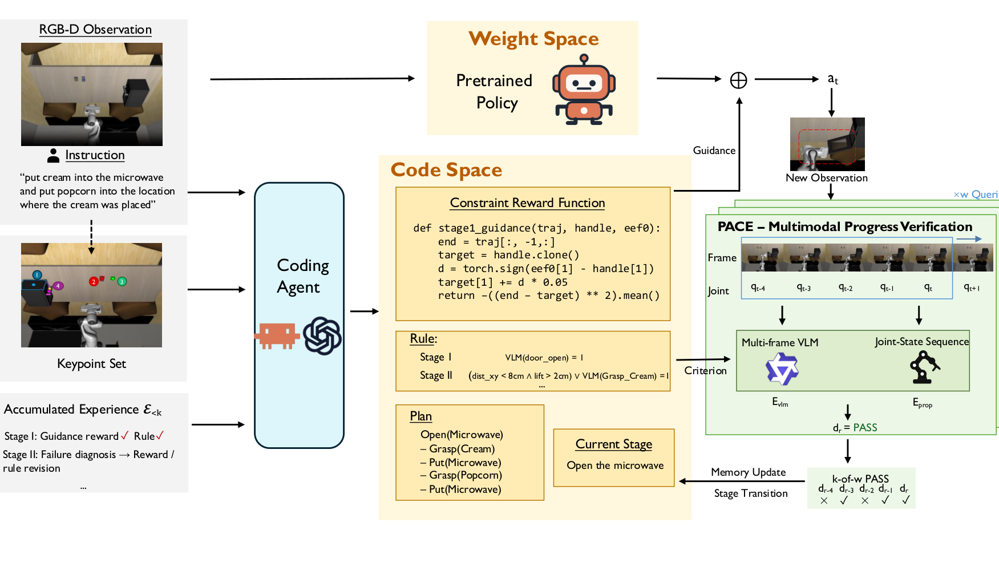
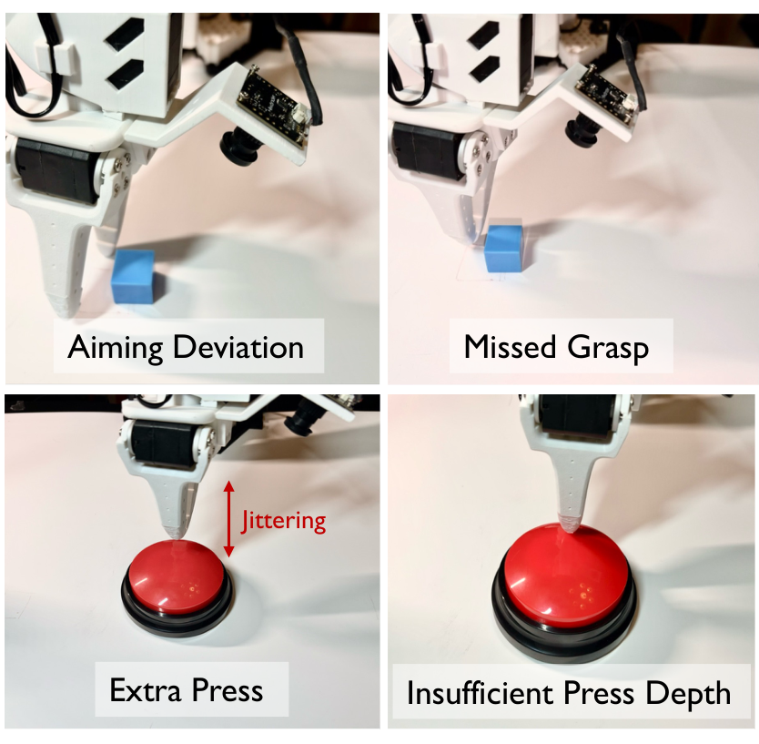

# Skills in Weights, Memory in Code: Hybrid Learning for Memory-Dependent Robot Manipulation

## 核心信息
- **论文标题**：Skills in Weights, Memory in Code: Hybrid Learning for Memory-Dependent Robot Manipulation（权重承载技能，代码承载记忆：面向记忆依赖型机器人操作的混合学习）
- **作者列表**：Yunhao Zhao* (赵云浩), Zhenyang Ni* (倪振阳), Haoyang Chen (陈浩阳), Ruohan Zhang (张若涵), Qi Zhu (朱琦)
- **第一作者**：Yunhao Zhao (Northwestern University), Zhenyang Ni (Northwestern University)（*共同一作）
- **通讯作者 / 指导学者**：Ruohan Zhang (Stanford University / Northwestern University), Qi Zhu (Northwestern University)
- **完成机构**：西北大学（Northwestern University）、明尼苏达大学（University of Minnesota）、斯坦福大学（Stanford University）
- **发表年份 / 来源**：arXiv:2608.09410v1 [cs.RO], 2026 年 8 月
- **核心定位**：具身智能 / 机器人操作 / 记忆增强 VLA / 编码智能体（Coding Agent）测试期导引 / 神经符号混合系统
- **核心基准**：RoboMemArena（修正版 12 任务基准协议，跨 4 个类别共 160 个评测回合）+ SO-101 真实物理机械臂操作
- **开源状态**：基于 OpenPI（仿真 $\pi_{0.5}$ 部署）与 LeRobot（SO-101 实体机械臂控制）构建

---

## 原文摘要翻译

现代视觉—语言—动作（VLA）策略已经掌握了广泛的操作技能，但通常仅根据当前观测或极短的固定时域历史生成每个动作块。然而，真实的物理世界操作往往具有强烈的非马尔可夫特性，要求机器人必须在长时程交互历史中持久保留并推理与任务关键相关的历史信息，以决定下一步动作。为攻克这一瓶颈，我们提出了 **HyMeS**，这是一种混合学习框架（Hybrid learning framework），充分利用编码智能体（coding agent）的高层逻辑推理与记忆管理能力，在无需修改模型权重的测试期间**导引（Steer）**马尔可夫 VLA 完成依赖历史记忆的复杂操作任务。

具体而言，HyMeS 通过基于梯度的模仿学习在神经网络**权重空间**中学习底层的连续运动技能；而编码智能体则通过启发式学习机制，基于真实交互轨迹的物理执行反馈迭代更新可执行的符号启发式代码系统，从而在**代码空间**中习得高层记忆管理策略。此外，我们通过多模态阶段完成验证机制（PACE）构建了动作导引与物理执行之间的紧密闭环，联合利用机器人的本体感受信号与多帧 VLM 视觉判定实时触发记忆更新。

与传统的端到端记忆增强型 VLA 相比，HyMeS 仅需要针对可复用的基础物理运动技能收集专家演示，而完全不需要为每一种排列组合式的历史依赖任务状态单独收集海量示教，从而实现了极其高效的数据组合泛化。在 RoboMemArena 基准上，HyMeS 相比微调后的 $\pi_{0.5}$ 策略将平均累积阶段成功率（CSR）从 52.5% 跃升至 66.2%，将平均整任务成功率（TSR）从 41.3% 大幅提升至 60.1%；同时显著超越了前沿强基线 PrediMem，累积成功率领先 4.5 个百分点，整任务成功率大幅领先 14.5 个百分点。在真实 SO-101 机械臂上，HyMeS 同样展现出了卓越的记忆导引与非马尔可夫操作闭环能力。

---

## 创新点

1. **提出“权重承载技能，代码承载记忆”的混合解耦学习范式（Skills in Weights, Memory in Code）**：
   彻底颠覆了以往“将记忆硬塞进神经网络潜空间参数并进行端到端黑盒训练（Memory in Weights）”的传统思路。论文深刻指出：连续的、富接触的物理运动技能（抓取、按压、开启等）天然适合由神经网络权重拟合；而离散的、组合式的任务记忆管理（阶段流转、动作计数、被遮挡物体状态维持等）在本质上是符号化与规则驱动的。通过将马尔可夫 VLA（权重空间）与编码智能体生成的可执行代码状态机（代码空间）解耦组合，免除了为组合爆炸式的任务历史状态收集真机示教数据的沉重负担。

2. **基于轨迹反馈的启发式代码学习机制（Rollout-Driven Heuristic Learning in Code Space）**：
   不同于传统基于梯度反向传播的参数优化，高层记忆管理程序 $P = (\mathcal{C}, \mathcal{V}, \mathcal{U})$ 由编码智能体（Claude Code / Codex）根据开发阶段的物理交互轨迹（rollout traces）与阶段判定结果进行迭代诊断与自主重写。该机制既不需要网络梯度，也不需要专家动作标签，能够直接通过物理执行中暴露出的失败点修正约束函数与阶段跳转规则。

3. **微观去噪速度场记忆条件化动作导引（Memory-Conditioned Action Steering with Adaptive Decay）**：
   在测试执行时，完全冻结 VLA 权重，仅将代码空间当前记忆状态所对应的可微几何/语义约束 $R_{\rho_t}$ 的梯度 $\nabla_{a_\tau} R_{\rho_t}$ 动态注入到流匹配（Flow-Matching）策略的动作去噪速度场 $\hat{v}$ 中。结合基于约束残差归一化进度的自适应衰减调度（Adaptive Attenuation Schedule），在远离目标时由记忆导引主导大范围空间寻路，在接近物理接触区域时平滑交由微调 VLA 的物理运动先验全权接管，完美兼顾了高层任务指向性与低层接触合规性。

4. **本体感受与多帧视觉协同的双流阶段验证机制（PACE）**：
   提出了基于本体感受与完成度的阶段切换机制（Proprioception-And-Completion-driven stagE-switching, PACE）。通过将力学/关节运动特征的本体感受证据流（$e_{\text{prop}}$）与多帧时序 VLM 视觉判定流（$e_{\text{vlm}}$，Qwen3-VL-8B）在时序滑动窗口内进行 $k$-of-$w$ 投票判定（$w=5, k=3$），有效滤除了夹爪自遮挡导致的视觉假阳性与缺乏力学特征的纯视觉转移失效，实现了记忆更新与物理现实的精确对齐。

---

## 一句话总结

HyMeS 将“连续物理技能”留给纯马尔可夫 VLA 权重通过模仿学习掌握，将“离散组合记忆”交由编码智能体在代码空间中从轨迹反馈中自主演化，在测试时通过去噪速度场注入显式约束导引动作生成，辅以本体与多帧视觉双流阶段验证闭环，无需组合式演示数据即可使纯马尔可夫策略高成功率完成复杂的长时程非马尔可夫操作。

---

## 研究问题

### 1. 现实机器人操作的非马尔可夫本质与现代 VLA 的马尔可夫短板
现有的前沿视觉—语言—动作大模型（如 $\pi_0, \pi_{0.5}, \text{OpenVLA}, \text{Octo}$）在设计上几乎全都是**马尔可夫策略（Markovian Policy）**：它们以当前时刻的单帧图像观测（或极短的固定滑动窗口）为输入直接回归动作块 $a_t$。然而，真实的物理世界操作充满了深度的历史依赖（non-Markovian）：
- **初始线索后撤型任务**：例如“根据起始桌面卡片上的数字按压对应次数的按钮”、“将物品放回最开始它所在的位置”；一旦卡片被移走或物品被挪动，当前视野完全丢失了最初的目标指示。
- **阶段重复计数型任务**：当机械臂完成一次按钮按压并抬起后，当前相机捕捉到的即时画面与未按压前的画面几乎完全一致（如图 1 所示）；此时单一观测对应着两个物理互斥的动作分支（再次按压 vs 结束任务抬臂）。这种现象被称为**观测混淆（Observation Aliasing）**。纯马尔可夫策略面对多模态分布只能输出折中平均动作，导致策略抽搐或过早退出。

### 2. 传统“记忆在权重中（Memory in Weights）”方案的核心死穴
学术界此前针对记忆依赖操作的主流路线是“端到端神经记忆增强”，例如在策略内部引入循环记忆 token、检索外部图像缓存（MemoryVLA、PrediMem、Chronos 等）。然而，这一范式存在四大不可调和的矛盾：
- **数据组合爆炸（Combinatorial Explosion）**：高层记忆是高度离散与组合化的（$N$ 个不同物体 $\times$ $M$ 种不同摆放位置 $\times$ $K$ 种按压计数）。端到端网络要求收集覆盖所有可能组合配置的非马尔可夫示范数据，在现实中数据采集成本不可承受；
- **严重灾难性遗忘与泛化脆性**：在学习时序记忆的过程中，策略往往会损害基础物理运动技能的泛化表现；
- **隐式记忆状态黑盒化**：注意力权重或隐藏层激活向量无法直观检查，当机器人中途执行失败时，无法判断是“算错了数字”、“认错了抽屉”还是“机械臂抓滑了”；
- **单向开环执行**：高层推理无法敏锐感知低层物理执行的细微接触反馈。

### 3. 破局之道：代码空间记忆与权重空间技能的正交解耦
HyMeS 敏锐地抓住了一个关键对称性：
- **低层运动（Motor Competence）**：需要连续平滑、高频响应、丰富接触力学，天然契合深度神经网络的非线性函数拟合能力（Weights）；
- **高层记忆（Memory Strategy）**：涉及离散变量赋值、条件判断分支、事件计数增量、状态转移验证，天然契合可执行编程语言的代码逻辑（Code）。
通过让权重专精物理运动、让代码专精任务记忆，既彻底解放了示教数据的采集需求，又带来了可解释、可审计、零样本组合迁移的巨大技术红利。

---

## 数据与任务定义

### 1. 任务数学形式化与观测混淆
设机器人在语言指令 $\ell$ 约束下运行。在控制时间步 $t$，接收观测 $o_t = (I_t^{\text{agent}}, I_t^{\text{wrist}}, q_t)$ 并执行动作块 $a_t$。完整交互历史表示为 $h_t = (o_1, a_1, \dots, o_t)$。
若最优专家策略依赖于历史且仅通过一个紧凑的任务状态 $z_t = \phi(h_t)$ 起作用：

$$\pi^*(a_t \mid h_t, \ell) = \pi^*(a_t \mid o_t, z_t, \ell)$$

当存在两条不同的历史 $h_t^{(1)} \neq h_t^{(2)}$ 使得当前即时观测相同 $o_t^{(1)} = o_t^{(2)}$，但对应潜在任务状态相异 $z_t^{(1)} \neq z_t^{(2)}$ 导致最优动作互斥 $\pi^*(a_t \mid o_t, z_t^{(1)}, \ell) \cap \pi^*(a_t \mid o_t, z_t^{(2)}, \ell) = \emptyset$ 时，纯马尔可夫策略 $\pi_\theta(a_t \mid o_t, \ell)$ 必然发生混淆崩溃。

### 2. 评测基准：RoboMemArena（修正版 12 任务评测协议）
论文在长程记忆权威基准 **RoboMemArena**（Lei et al., 2026）上构建了修正版 12 任务评测协议，共 160 个评测 episode，覆盖四大互补的核心记忆任务族：
1. **多物体转移（Transferring, 3 任务, 30 episodes）**：
   - 例：`Pudding + butter -> cabinet 2`、`Butter + cheese -> plate 2`、`Pudding + cheese -> plate 2`；
   - 考查：跨多步骤跟踪哪些物体已经被成功转移，维护物体与目标容器之间的动态绑定关系。
2. **动作计数（Counting, 3 任务, 30 episodes）**：
   - 例：`Tomato sauce x2 on cookies -> drainer`、`Pudding + pour x2 -> drainer`、`Butter + pour x2 -> drainer`；
   - 考查：必须精确执行指定次数的倾倒或挤压操作，要求维持离散事件自增计数器。
3. **顺序执行（Sequence, 2 任务, 40 episodes）**：
   - 例：`Butter + popcorn -> basket`、`Cream + pudding -> basket`；
   - 考查：长时程严格依赖顺序的组合操作，前序阶段未完成严禁擅自提前进入后续阶段。
4. **视觉遮挡（Occlusion, 4 任务, 60 episodes）**：
   - 例：`Cookies + chocolate -> microwave`、`Butter + chocolate -> microwave` 等；
   - 考查：目标物体在被放入微波炉或抽屉后视野被完全遮挡，必须持久记忆被隐藏物体的存在性与空间属性。

### 3. 实体物理机器人实验：SO-101 六自由度机械臂
在实机评测中，针对三类典型的非马尔可夫物理操作任务展开真机对比：
- **观察并拾取（Observe-and-pick-up, 10 trials）**：初始画面中通过特定视觉标记指示目标积木颜色与位置，随后移除标记，机器人需精准前往对应位置拾取；
- **数字引导按钮按压（Number-Guided Button Pressing, 15 trials）**：根据起始卡片展示的点数（1、2 或 3）连续按压同一实体按钮相应次数；
- **积木复位（Put-Back Block, 10 trials）**：拾取积木并将其复位回回合开始时该积木所在的原始位置。

### 4. 评测指标
- **整任务成功率（Task Success Rate, TSR）**：所有子阶段全部正确完成且最终全局目标被验证达成的比例（端到端可靠性指标）；
- **累积阶段成功率（Cumulative Success Rate, CSR）**：各个任务中成功达成的阶段数占总阶段数的宏观平均比例（反映中间执行进展）。

---

## 方法主线

### 机制流程总览



HyMeS 的回合内执行循环由双空间交互驱动：
1. **初始化**：在回合开始时，编码智能体读取全局指令 $\ell$ 与初始帧观测 $o_1$，利用在离线开发轨迹中演化出的程序 $P^\star$ 实例化符号记忆状态 $s_1 = \text{Init}_P(\ell, o_1)$，分解出阶段执行序列；
2. **微观控制（快循环）**：在每个控制步 $t$，根据当前活跃阶段 $\rho_t$ 从代码空间选定可微约束奖励函数 $R_{\rho_t}$，计算其相对于动作的梯度，注入到冻结 VLA 的流匹配速度场中输出动作块 $a_t$；
3. **宏观验证与记忆更新（慢循环 / 闭环反馈）**：PACE 模块周期性采集关节状态与多帧视觉画面，通过 $k$-of-$w$ 投票判定当前阶段是否完成。一旦判定通过，触发记忆更新规则 $\mathcal{U}$，更新内部计数器、物体绑定与当前阶段指针，平滑切入下一阶段约束。

---

### 核心组件 1：权重空间运动技能学习（Motor-Skill Learning in Weight Space）
底层连续控制器采用基于流匹配（Flow-Matching）的 $\pi_{0.5}$ 骨干网络。
- **训练数据**：仅使用包含可复用接触运动原语的演示数据集 $\mathcal{D} = \{(o_i, a_i, \ell_i)\}$，无需包含复杂的长程逻辑分支；
- **流匹配目标函数**：在均匀采样的流时间步 $\tau \in [0, 1]$ 下，专家动作块 $a$ 与高斯噪声 $\epsilon$ 插值得到 $a_\tau = (1-\tau)\epsilon + \tau a$，优化目标为：

$$\theta^\star = \arg\min_\theta \mathbb{E}_{(o, a, \ell) \sim \mathcal{D}, \tau, \epsilon} \left[ \| v_\theta(a_\tau, \tau \mid o, \ell) - (a - \epsilon) \|_2^2 \right]$$

- **技能固化**：微调收敛后，$\theta^\star$ 彻底冻结，在后续所有实验与记忆演化中不作任何反向传播修改，保持纯粹的马尔可夫物理运动先验。

---

### 核心组件 2：代码空间记忆策略学习（Memory-Strategy Learning in Code Space）

#### 1. 显式符号记忆状态表示
代码空间维持的符号记忆状态表示为一个具象的结构化元组：

$$s_t = \left(\text{plan}, \rho_t, B_t, N_t, F_t\right)$$

- $\text{plan}$：阶段计划列表（如 `['OPEN_DOOR', 'GRASP_CREAM', 'PUT_INTO_MICROWAVE']`）；
- $\rho_t$：当前活跃的阶段索引指针；
- $B_t$：实体属性与空间几何绑定字典（例如 `{'target_drawer': 'drawer_1', 'cream_pos': [x, y, z]}`）；
- $N_t$：离散事件计数器字典（例如 `{'button_press_count': 1, 'target_presses': 2}`）；
- $F_t$：持久布尔状态标记（例如 `{'drawer_opened': True, 'cream_held': False}`）。

#### 2. 基于交互轨迹的启发式代码演化（Rollout-Driven Heuristic Learning）
程序 $P = (\mathcal{C}, \mathcal{V}, \mathcal{U})$ 在开发阶段通过编码智能体自主迭代演化：
1. 给定候选代码 $P^{(n)}$，在仿真环境中执行 rollout，记录下符号追踪轨迹 $\xi_n = \{(s_t, e_t, R_t)\}_{t=1}^{T_n}$ 以及环境提供的阶段评测真值 $b_n$；
2. 编码智能体对比 $\xi_n$ 中 PACE 的阶段跳转时刻与 $b_n$ 的真实结果，精准定位出首个失配阶段；
3. 智能体分析失配原因：是导引约束函数的几何中心算偏了？还是阶段验证条件定得太苛刻导致超时？亦或是验证太宽松导致提前切阶段？
4. 智能体调用重写接口生成修正代码：

$$P^{(n+1)} = \text{Edit}\left(P^{(n)}, \xi_n, b_n\right)$$

在开发集上测试表现最优的程序固化为 $P^\star$，在正式评测时直接加载执行。

---

### 核心组件 3：记忆感知动作导引与渐进衰减调度（Action Steering with Adaptive Decay）

#### 1. 语义目标空间具身接地
利用开放词汇检测模型、SAM 分割掩码与深度反投影，将符号记忆中的抽象目标 $\text{target}(s_t)$ 实时投影为当前三维点云中的几何关键点 $\Gamma(\text{target}(s_t), o_t)$。阶段约束奖励定义为欧氏距离的负范数：

$$R_{\text{reach}} = -\| \text{ee}(a) - \Gamma(\text{target}(s_t), o_t) \|_2^2$$

#### 2. 连续流场微观梯度注入
在流匹配去噪循环中，将约束函数的梯度直接累加到预测速度场中：

$$\hat{v} = v_{\theta^\star}(a_\tau, \tau \mid o_t, \ell) + \lambda_t \nabla_{a_\tau} R_{\rho_t}(a_\tau, o_t; s_t)$$

#### 3. 依据约束残差的自适应衰减调度（Adaptive Attenuation Schedule）
若在整个物理接近与抓取过程中都保持恒定的外部导引力，往往会严重干扰机械臂在微小接触区域的自适应力学调整。HyMeS 设计了精巧的 S 型衰减函数：

$$\lambda_t = \frac{\lambda_0}{1 + \exp\left(\beta(p_t - p_{\text{mid}})\right)}$$

- $c_t = -R_{\rho_t}(a_t, o_t; s_t)$ 为当前步的约束残差（末端到目标的距离）；
- $p_t = \text{clip}\left(1 - c_t / c_{t_\rho}, 0, 1\right)$ 量化了该阶段自进入以来的归一化接近进度；
- 当机械臂远离目标时（$p_t \approx 0$），导引权重 $\lambda_t \approx \lambda_0$，强力牵引末端奔向目标；
- 当机械臂逼近物理接触区域时（$p_t > p_{\text{mid}}$），$\lambda_t$ 迅速衰减至接近 0，使得底层微调 VLA 的丰富接触力学先验能够完全支配最终的物理抓取与插入。

---

### 核心组件 4：多模态阶段完成验证（PACE 机制）


为防止错误动作在长程执行中无限滚雪球，阶段转换必须经过严谨的物理事实检验：
1. **本体感受证据流（$e_{\text{prop}}$）**：监测机械臂关节角速度、末端力矩变化以及夹爪闭合度，精准捕获具有鲜明物理接触特征的瞬间（如按钮触底反弹、夹爪受阻闭合）；
2. **多帧 VLM 视觉判定流（$e_{\text{vlm}}$）**：调用 Qwen3-VL-8B，输入当前阶段动作语义以及最近连续 5 帧 RGB 序列，有效消除单帧静态画面的运动学混淆；
3. **逻辑析取与时序滑动窗口投票**：单步联合判定 $d_r = e_{\text{prop}}^{(r)} \vee e_{\text{vlm}}^{(r)}$，并在最近 $w=5$ 次查询窗口内统计，仅当赞成票 $\sum d_i \ge k=3$ 时，阶段推进事件 $e_t=1$ 才正式生效，随即调用 $\mathcal{U}$ 刷新记忆状态。

---

## 关键结果

### 1. 仿真主实验结果（RoboMemArena）

| 方法 | Transferring (CSR / TSR) | Counting (CSR / TSR) | Sequence (CSR / TSR) | Occlusion (CSR / TSR) | Overall CSR | Overall TSR |
| :--- | :---: | :---: | :---: | :---: | :---: | :---: |
| **微调基座 $\pi_{0.5}$** | 70.0% / 66.7% | 39.2% / 20.0% | 52.5% / 40.0% | 50.4% / 40.0% | 52.5% | 41.3% |
| **PrediMem (神经记忆)** | 86.7% / 76.7% | 72.2% / 36.7% | 70.0% / 50.0% | 38.3% / 31.7% | 61.7% | 45.6% |
| **HyMeS (本文方法)** | **93.3% / 93.3%** | **60.3% / 50.0%** | **73.8% / 62.5%** | **50.6% / 47.0%** | **66.2%** | **60.1%** |

- **全面大幅超越强基线**：HyMeS 在总 TSR 上达到 **60.1%**，相比微调 $\pi_{0.5}$（41.3%）提高 **18.8 个百分点**，相比 PrediMem（45.6%）大幅高出 **14.5 个百分点**；
- **高转化率特征**：PrediMem 的 CSR 虽达到 61.7%，但 TSR 仅有 45.6%（转化率 73.9%）；而 HyMeS 的 CSR 为 66.2%，TSR 达到了 60.1%（转化率高达 90.8%），证明显式代码状态机能更加坚决地将中间步骤推进为最终的成功闭环；
- **计数任务绝对优势**：在 Counting 任务上，HyMeS 的 TSR 达到 50.0%，是纯马尔可夫 $\pi_{0.5}$（20.0%）的 2.5 倍，远超 PrediMem 的 36.7%。

---

### 2. 真实物理机器人实验（SO-101）

| 评测任务 | 微调 $\pi_{0.5}$ 成功率 | HyMeS 成功率 | 提升幅度 |
| :--- | :---: | :---: | :---: |
| **Observe-and-pick-up** (观察并拾取) | 2 / 10 (20%) | **7 / 10 (70%)** | **+50%** |
| **Number-Guided Button Pressing** (数字引导按钮按压) | 7 / 15 (46.7%) | **11 / 15 (73.3%)** | **+26.6%** |
| **Put-Back Block** (积木复位) | 0 / 10 (0%) | **2 / 10 (20%)** | **+20%** |

- 真实机械臂在相同的底层演示微调权重下，纯马尔可夫 $\pi_{0.5}$ 在需要多步计数的复杂场景中彻底瘫痪（积木复位 0 成功率）；
- HyMeS 凭借代码空间维护的卡片数字与初始位置坐标，精准导引实体机器人完成多次连续按压与跨遮挡拾取，展现出强大的真机工程实用价值。

---

### 3. 核心机制消融分析

| 消融变体配置 | 启发式代码演化 (Learn) | PACE 物理验证信号源 | CSR (%) | TSR (%) | 关键结论与启示 |
| :--- | :---: | :---: | :---: | :---: | :--- |
| **One-shot $P^{(0)}$** | 否（零样本单次生成） | 视觉 + 本体感受 | 63.3% | 53.3% | 启发式轨迹迭代使 TSR 飙升 **+18.4%**，修正了初始约束超参偏差 |
| **Vision-only PACE** | 是 | 仅 Qwen3-VL 视觉判定 | 55.8% | 50.0% | 机械臂自遮挡导致大量假阳性提前跳步，TSR 暴跌 **-21.7%** |
| **Proprio.-only PACE** | 是 | 仅机械臂本体感受 | 63.0% | 63.3% | 缺乏纯视觉转移判定能力，TSR 仍比完整版低 **8.4%** |
| **Full HyMeS (完整版)** | **是** | **视觉 + 本体感受时序投票** | **71.8%** | **71.7%** | **双模态互补 + 轨迹自适应演化取得最高可靠性** |

---

### 4. 典型失败模式分析



论文极具批判性地披露了在 SO-101 实机上的两类标志性失败模式：
1. **底层物理运动能力极限（Motor-Execution Failure）**：
   在观察拾取任务中，代码记忆准确跟踪到了目标方块的位置，导引约束也精准将夹爪带到了方块表面；但底层微调后的 $\pi_{0.5}$ 在最终接触闭合瞬间发生了细微打滑，导致抓握脱落。这说明代码导引无法替代底层策略自身的物理接触鲁棒性；
2. **阶段验证误判导致提前跳步（Stage-Verification Failure）**：
   在积木复位任务中，机械臂将积木带到了目标托盘上方，但尚未完全释放；单向视觉判定误以为积木已经到位，过早触发了下一阶段，导致积木从半空中坠落。这进一步佐证了多模态接触证据对于阶段判定的刚性要求。

---

## 深度分析

### 1. 真正的核心贡献是什么？
HyMeS 最重要的学术贡献在于**确立了具身操作中“神经表示”与“符号逻辑”的最佳能力边界**：
- 以往的具身智能研究往往走向两个极端：要么试图通过端到端海量数据把所有东西（包括 1+1=2、数数、阶段跳转）全学进神经网络权重里（纯联结主义，高代价且脆弱）；要么试图让 LLM 直接写代码输出轨迹控制关节（纯符号主义，遇到复杂物理接触完全崩溃）。
- HyMeS 极其精妙地打通了一条中间道路：**让神经网络专注于它最擅长的物理世界平滑连续流场拟合，让代码专注于它最擅长的离散符号状态追踪与组合逻辑；在测试期，代码通过微积分（速度场梯度）对连续流场施加软约束，而连续流场通过物理传感器向代码提供离散事件反馈**。这种微观双向耦合架构代表了具身智能混合系统（Neuro-Symbolic Embodied AI）的演进前沿。

### 2. 为什么这一方法能在不加演示的情况下大幅超越强基线？
- **零额外示教的组合泛化**：传统模型如果要学会“按 1 次、按 2 次、按 3 次按钮”，必须分别录制 3 种任务的大量轨迹；而 HyMeS 只需要录制“按一次按钮”的基础动作示教，关于按几次的组合逻辑完全由代码变量 `press_count < press_target` 自主处理；
- **显式可解释性与调试效率**：在开发阶段，智能体不需要重新训练昂贵的大模型，只需要花几秒钟修改几行 Python 代码中的判定阈值或偏移量，就能立竿见影地修复整个任务流；
- **双向闭环纠偏**：PACE 提供的物理世界事实锁存，使得高层认知绝不会陷入开环自嗨或产生幻觉。

### 3. 容易误读与混淆的技术细节
- **误读 1：测试评估时 Coding Agent 是否还在动态调用 LLM 写代码？**
  - **纠正**：绝非如此！在正式测试时，演化好的程序 $P^\star$ 是**完全冻结的代码软件**，在线运行的仅是其内部编写好的 Python 规则与约束函数计算，完全不需要调用商业大模型重新写代码，因此测试期没有代码生成的不确定性。
- **误读 2：流场梯度注入是否会强行把机械臂拉变形？**
  - **纠正**：不会。一方面，约束梯度是在流匹配的速度场 $\hat{v}$ 上做加法，先验速度场 $v_\theta$ 依然起到了强大的运动学流形约束作用；另一方面，自适应衰减函数 $\lambda_t$ 确保在临近接触瞬间外部导引力归零，完全由策略自主动力学接管。

---

## 局限与未来思考

1. **强依赖于可结构化的符号任务先验**：
   当前 HyMeS 能够取得惊艳效果，前提是任务的长程依赖能够被抽象为清晰的计数器、实体字典和阶段状态机。若面对高度开放、非结构化、纯连续渐变的艺术创造型任务，代码空间难以写出显式的转移规则；
2. **多模态 VLM 查询带来的延迟开销**：
   尽管策略本身在本地 GPU 上高频推断动作块，但 PACE 周期性调用 Qwen3-VL-8B 引入了数百毫秒的判定时延，在需要毫秒级瞬时反应的高动态操作中可能构成瓶颈；
3. **低层物理执行能力的“木桶短板”**：
   代码记忆再完美，也无法挽救底层策略本身接触力学建模的先天缺陷（如抓取打滑）。高层导引与低层运动控制的联合鲁棒性仍需进一步探索。

---

## 我的笔记：与前沿具身记忆/世界模型架构横向对比

| 框架名称 | 技能承载空间 (Skills) | 记忆承载空间 (Memory) | 导引/干预颗粒度 | 记忆更新机制 | 对组合示教的依赖 | 代表性基准表现 (RoboMemArena) |
| :--- | :---: | :---: | :---: | :---: | :---: | :---: |
| **MemoryVLA / ++** (Shi et al., 2025/2026) | 权重空间 (Weights) | 权重与潜空间缓存 (Weights) | 模型内部隐式交叉注意力 | 端到端反向传播微调 | 强依赖海量组合演示 | CSR 35.3% / TSR 15.0% |
| **PrediMem** (Lei et al., 2026) | 权重空间 (Weights) | 关键帧图像记忆库 (Neural Memory) | 高层子任务自然语言规划 | 启发式关键帧检索与 VLM 提示 | 中等依赖 | CSR 61.7% / TSR 45.6% |
| **Harness VLA** (Zhang et al., 2026a) | 权重空间 (Weights) | 代码与符号规则 (Code) | 粗粒度技能原语调用与重试 | 全局失败规则与追踪反思 | 仅需基础原语演示 | 面向接触密集型长程组合 |
| **HarnessWAM** (Gu et al., 2026) | WAM 预测流场 (Weights) | 结构化任务图与信念元组 (Graph/Tuple) | 确定性编译器可执行投影 | 事件驱动双时间尺度状态估计 | 仅需局部技能演示 | CSR 69.9% / TSR 59.6% |
| **HyMeS (本工作)** (Zhao et al., 2026) | **权重空间 (Weights)** | **代码启发式程序 (Code Space)** | **微观流匹配速度场显式梯度注入** | **PACE 双流时序投票闭环** | **仅需可复用物理技能演示** | **CSR 66.2% / TSR 60.1%** |

**核心启示**：
从 `MemoryVLA` 的纯潜空间记忆，到 `PrediMem` 的图像关键帧，再到 `HarnessWAM` 的任务图投影与 `HyMeS` 的代码速度场导引，具身智能正在经历一场深刻的认知革命——**记忆不应当再被当作无序的感知历史堆叠在神经网络内部，而必须作为结构化、符号化、可审计的代码级具身状态机进行外部编排**。HyMeS 在这一方向上迈出了极其扎实且优雅的一步。

---

## 引用

```bibtex
@article{zhao2026skills,
  title={Skills in Weights, Memory in Code: Hybrid Learning for Memory-Dependent Robot Manipulation},
  author={Zhao, Yunhao and Ni, Zhenyang and Chen, Haoyang and Zhang, Ruohan and Zhu, Qi},
  journal={arXiv preprint arXiv:2608.09410},
  year={2026}
}
```
