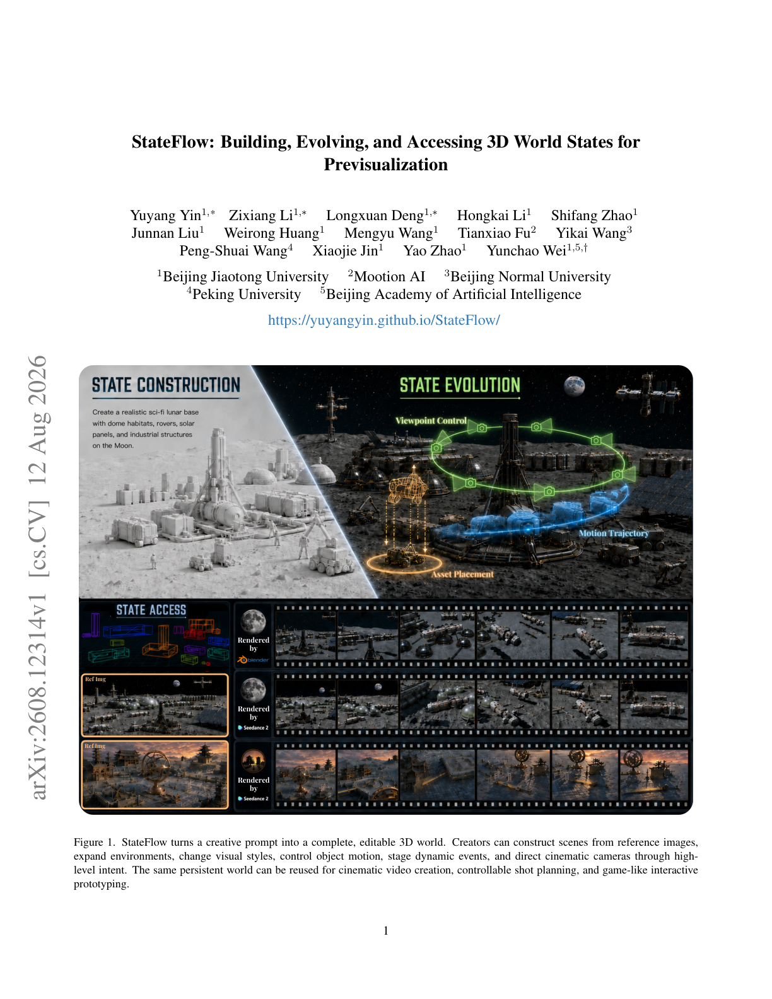
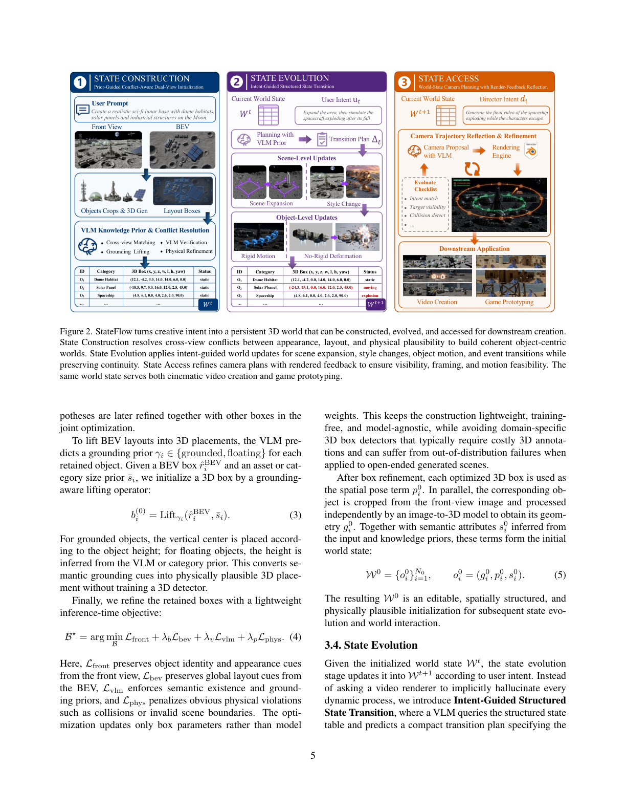
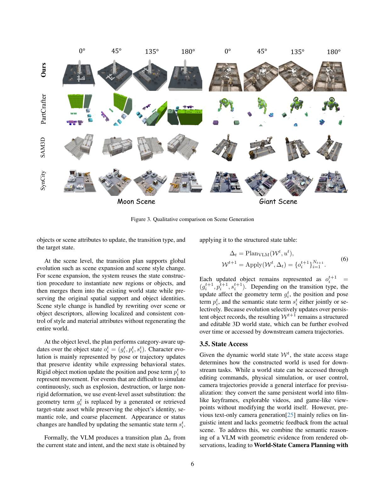
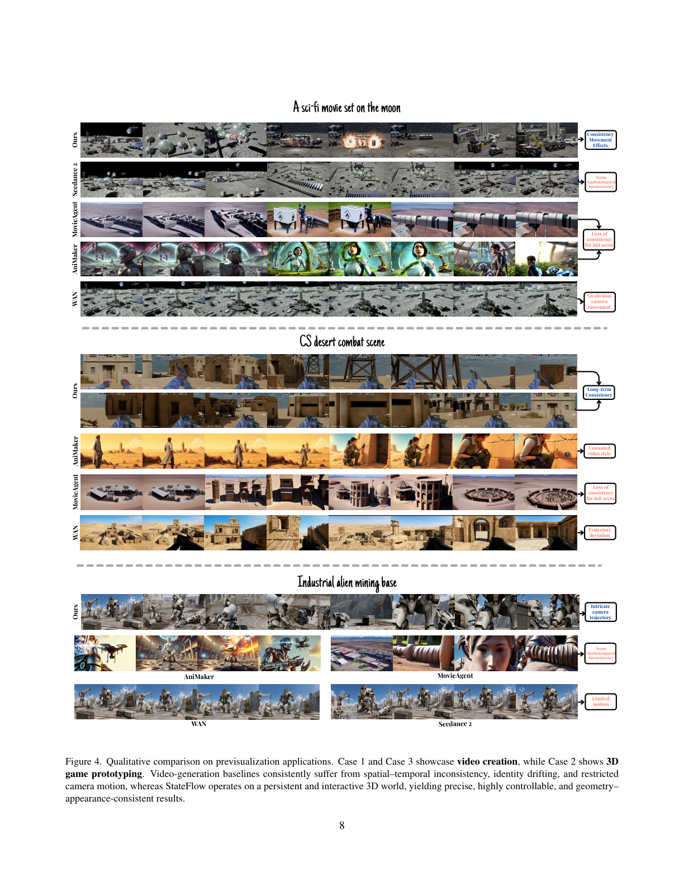
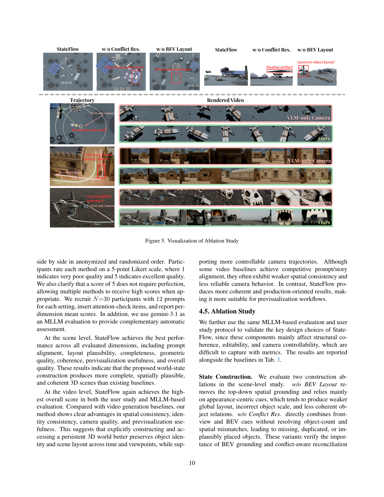

# StateFlow: Building, Evolving, and Accessing 3D World States for Previsualization

**Authors:** Yuyang Yin, Zixiang Li, Longxuan Deng, Hongkai Li, Shifang Zhao, Junnan Liu, Weirong Huang, Mengyu Wang, Tianxiao Fu, Yikai Wang, Peng-Shuai Wang, Xiaojie Jin, Yao Zhao, Yunchao Wei

**Source:** `/Users/roywangj/journey_wj/research/papers4zotero/zotero1/storage/VZKCU5KV/Yin 等 - 2026 - StateFlow Building, Evolving, and Accessing 3D World States for Previsualization.pdf`

**Detected source format:** selectable-text PDF (`pdf-text`), 14 pages; arXiv:2608.12314v1 (12 Aug 2026).

**Reader status:** source-preserving bilingual build. Complete selectable text is retained page by page; dense multi-column and figure/table interleaving caveats are documented in `translation_notes.md`.

## Page / Section Index

| Pages | Content |
|---|---|
| 1 | Title, Figure 1 |
| 2–4 | Abstract, Introduction, Related Work |
| 5–6 | Method, Figures 2–3 |
| 7–10 | Tables, experiments, Figures 4–5 |
| 11 | Conclusion, Limitation and Future Work |
| 11–14 | References [1]–[62] |

## Terminology Ledger

- **previsualization / previs:** 预可视化，制作前用于迭代验证场景、动作和镜头的中间层。
- **world state:** 世界状态，持久、可编辑的结构化 3D 工作表示。
- **State Construction / Evolution / Access:** 状态构建 / 状态演化 / 状态访问。
- **BEV:** bird’s-eye view，鸟瞰/俯视图。
- **VLM / MLLM:** 视觉语言模型 / 多模态大语言模型。


## Source page 1

> <span style="color:#3B82F6"><strong>Para. 1:</strong></span> Source page 1 transcription (complete selectable-text extraction):
> StateFlow: Building, Evolving, and Accessing 3D World States for
> Previsualization
> Yuyang Yin1,*
> Zixiang Li1,∗
> Longxuan Deng1,∗
> Hongkai Li1
> Shifang Zhao1
> Junnan Liu1
> Weirong Huang1
> Mengyu Wang1
> Tianxiao Fu2
> Yikai Wang3
> Peng-Shuai Wang4
> Xiaojie Jin1
> Yao Zhao1
> Yunchao Wei1,5,†
> 1Beijing Jiaotong University
> 2Mootion AI
> 3Beijing Normal University
> 4Peking University
> 5Beijing Academy of Artificial Intelligence
> https://yuyangyin.github.io/StateFlow/
> Rendered
> by
> Rendered
> by
> Rendered
> by
> Ref Img
> Ref Img
> Asset Placement
> Viewpoint Control
> Motion Trajectory
> Figure 1. StateFlow turns a creative prompt into a complete, editable 3D world. Creators can construct scenes from reference images,
> expand environments, change visual styles, control object motion, stage dynamic events, and direct cinematic cameras through high-
> level intent. The same persistent world can be reused for cinematic video creation, controllable shot planning, and game-like interactive
> prototyping.
> 1
> arXiv:2608.12314v1  [cs.CV]  12 Aug 2026

> <span style="color:#F59E0B"><strong>Para. 1[CN]:</strong></span> StateFlow 将创意提示转换为完整、可编辑的 3D 世界；创作者可以构建和扩展场景、改变风格、控制运动、编排事件并指导电影化摄像机。

### Figure 1. StateFlow overview



**Caption:** StateFlow turns a creative prompt into a complete, editable 3D world.

**Caption[CN]:** StateFlow turns a creative prompt into a complete, editable 3D world.

## Source page 2

> <span style="color:#3B82F6"><strong>Para. 2:</strong></span> Source page 2 transcription (complete selectable-text extraction):
> Abstract
> Previsualization is an intermediate layer between ideas
> and production in film, games, architecture, and urban de-
> sign. It lets creators iteratively refine scenes, actions, cam-
> eras, and spatial-temporal dynamics. Yet existing genera-
> tive methods rely on simple prompts to jointly control all
> of these factors through one-shot image or video synthe-
> sis, offering weak controllability and limited support for
> iterative editing. Fundamentally, a world comprises mul-
> tiple elements with geometry, appearance, and other at-
> tributes, together with cameras. Different frames are pro-
> duced through local modifications or recombinations of this
> shared state, which is otherwise largely reused. Therefore,
> we argue that the missing component is an explicit and per-
> sistent working state. To address this, we present State-
> Flow, a state-centric framework for generative previsual-
> ization. Rather than generating videos in one shot, State-
> Flow uses an editable 3D world to organize scene struc-
> ture, evolution, and cameras, while off-the-shelf video
> models enhance visual quality when higher fidelity is de-
> sired. This world is maintained as a persistent structured
> 3D state of scene elements and camera configurations, serv-
> ing as the core working representation for previsualiza-
> tion. Built on this insight, StateFlow has three stages to
> construct, evolve, and access the world state. State con-
> struction lifts generated 2D content into a coherent 3D
> world through prior-guided, conflict-aware dual-view ini-
> tialization, while State evolution translates user intent into
> structured state transitions while preserving world memory,
> avoiding full-scene regeneration for each edit. State access
> uses render-feedback reflection to refine camera plans into
> visually feasible trajectories, avoiding reliance on VLM se-
> mantics alone. Experiments show that StateFlow produces
> high-quality 3D worlds for video creation and game-like
> prototyping.
> 1. Introduction
> Previsualization is a fundamental step in filmmaking, game
> development, and architectural or urban design, where cre-
> ators plan scenes, block actions, test cameras, and explore
> spatiotemporal dynamics before final production [1, 5, 12].
> Unlike final-content generation, previsualization prioritizes
> communicating creative intent and enabling rapid iteration
> over producing polished visual outputs. Creators repeatedly
> refine scene layout, object placement, motion, and view-
> points to explore different design choices and narrative pos-
> sibilities [24].
> In practice, building previsualization content remains
> time-consuming and expertise-intensive. Meanwhile, ex-
> *Equal contribution. †Corresponding author.
> isting generative approaches are poorly suited to this it-
> erative process.
> Although recent image and video gen-
> eration methods have substantially improved visual qual-
> ity [3, 4, 32, 43, 52], they are largely designed for one-shot
> synthesis: a simple prompt must jointly specify scene con-
> tent, layout, motion, and cameras, while the generated ob-
> servations expose no persistent state for local editing and
> validation. Consequently, they often exhibit spatiotempo-
> ral inconsistency, identity drift, and unstable local details
> when content is modified, extended, or viewed from differ-
> ent cameras.
> Fundamentally, a previsualization world consists of mul-
> tiple scene elements with geometry, spatial poses, semantic
> and appearance attributes, and dynamic states, together with
> camera configurations. Different shots largely reuse this in-
> formation, modifying or recombining only a subset of the
> shared state. This suggests that previsualization should be
> modeled through an explicit and persistent working state
> rather than a sequence of isolated visual outputs.
> An explicit 3D state is essential for previsualization: a
> shared coordinate system preserves object identity and spa-
> tial relations, supports local edits to placement and mo-
> tion, and provides geometric constraints for camera plan-
> ning across viewpoints and time. Existing methods can al-
> ready assemble retrieved or generated assets into coherent
> multi-object 3D scenes [6, 8, 35, 44, 51]. However, they
> commonly treat scene construction as the endpoint, produc-
> ing a largely static world without jointly modeling its subse-
> quent evolution or repeated, camera-controlled access. For
> previsualization, an initial scene is only a starting point: the
> same world must remain editable as it changes and as it is
> viewed from different cameras.
> Building on this formulation, we propose StateFlow,
> a state-centric framework for generative previsualization.
> Rather than generating videos in one shot, StateFlow uses
> an editable 3D world to organize scene structure, evolu-
> tion, and cameras. Each world is represented by an editable
> structured 3D state of scene elements, geometry, spatial
> poses, and semantic states; StateFlow constructs and up-
> dates this state from user intent, while controllable camera
> trajectories provide access for scene inspection and down-
> stream previsualization. When greater visual fidelity is de-
> sired, off-the-shelf video models [33] enhance geometry-
> grounded observations into expressive videos without alter-
> ing the underlying world.
> As shown in Fig. 1, our framework addresses three core
> questions in previsualization: how to initialize the struc-
> tured 3D world state through State Construction, how to
> evolve the world state according to the real physical world
> and user intent through State Evolution, and how to use it
> for downstream tasks through State Access.
> In State Construction, StateFlow translates a user’s
> natural-language intent into an initial 3D scene by first
> 2

> <span style="color:#F59E0B"><strong>Para. 2[CN]:</strong></span> 预可视化连接创意与制作，强调快速迭代。现有一次性图像/视频生成缺少可持久编辑的工作状态，容易产生时空不一致、身份漂移和局部细节不稳定。论文提出以显式持久 3D 世界状态为核心的 StateFlow。

## Source page 3

> <span style="color:#3B82F6"><strong>Para. 3:</strong></span> Source page 3 transcription (complete selectable-text extraction):
> generating complementary visual references with an image
> model. Since a single view cannot reliably capture both
> object detail and global layout, we introduce Prior-Guided
> Conflict-Aware Dual-View Initialization, which combines
> front-view semantic grounding with BEV spatial ground-
> ing. The framework detects and resolves cross-view con-
> flicts in object counts and spatial hypotheses, producing
> plausible 3D placements.
> In State Evolution, StateFlow introduces Intent-Guided
> Structured State Transition, which translates user intent into
> compact updates over the structured state table, rather than
> continuously simulating dynamics or regenerating videos.
> It supports scene expansion, local style changes, object pose
> and motion edits, and discrete asset substitutions for events
> such as destruction. This keeps world evolution editable,
> memory-aware, and reusable for later access.
> In State Access, StateFlow introduces World-State Cam-
> era Planning with Render-Feedback Reflection, a two-
> system design that couples VLM-based camera proposal
> with render-feedback verification.
> The VLM proposes
> trajectories from director intent and shot style, while
> geometry-faithful rendering exposes visibility, occlusion,
> framing, and motion issues to guide local repairs.
> This
> yields visually grounded trajectories without training a
> camera policy.
> Overall, our formulation shifts previsualization from
> generating isolated visual outputs to constructing editable,
> evolvable, and interactive 3D worlds.
> Operating on the
> same persistent 3D world, our framework naturally sup-
> ports two representative downstream previsualization appli-
> cations: video creation, including storyboard, shot plan-
> ning, and video production, and 3D game prototyping for
> interactive content design. Extensive experiments across di-
> verse tasks and application settings show that the 3D worlds
> constructed by our framework serve as effective represen-
> tations for downstream applications, demonstrating strong
> flexibility, controllability, and extensibility.
> In summary, our main contributions are as follows:
> 1. We introduce a new formulation of generative previsu-
> alization as persistent 3D world-state modeling, shifting
> the goal from one-shot visual synthesis to building ed-
> itable, evolvable, and reusable 3D worlds.
> 2. We propose StateFlow, a unified state-centric framework
> that constructs, evolves, and accesses 3D world states
> through prior-guided initialization, intent-guided state
> transition, and render-feedback camera planning.
> 3. Experiments show that our method produces high-
> quality and fine-grained results, while naturally sup-
> porting two representative previsualization applications:
> video creation for storyboard, shot planning, and video
> production, and 3D game prototyping for interactive
> content design.
> 2. Related Work
> 2.1. Previsualization
> Previsualization has been widely explored across film,
> games, and design as an intermediate process for validat-
> ing scene layout, camera motion, staging, and collaboration
> before full production. Early studies emphasized game en-
> gines and real-time 3D tools for shot planning and prelimi-
> nary scene prototyping in film and game pipelines [26, 27].
> Later work extended previsualization to immersive and col-
> laborative settings, including virtual reality, tangible inter-
> faces, and video-based rapid ideation [1, 7, 19]. Beyond
> filmmaking, related studies in HCI and architectural design
> have framed previs as a broader method for design futuring,
> immersive review, and stakeholder communication [18, 58].
> 2.2. 3D Scene Generation
> Recent 3D, 4D, and video-based generation methods cre-
> ate detailed objects, dynamic content, and navigable scenes
> from images, text, or video [21–23, 31, 37–41, 48, 49, 53,
> 56, 57, 60, 61]. However, they primarily generate individual
> assets, short dynamic sequences, or video/world reconstruc-
> tions, without maintaining the persistent spatial relations,
> semantics, motion, and camera access required for an ed-
> itable multi-object world. StateFlow instead treats video as
> an observation of such an explicit world state.
> Existing 3D scene generation methods mainly follow
> three directions.
> Procedural approaches create large en-
> vironments with hand-designed rules or asset placement
> pipelines [29, 30], but their diversity and realism are con-
> strained by predefined rules and assets. LLM and VLM
> based methods infer object layouts and instantiate retrieved
> assets from curated libraries [8, 11, 36, 50, 51, 62]; while
> controllable, they are often limited by the coverage and
> style of the asset database. Recent 3D generative meth-
> ods synthesize scene elements or full scenes more flexi-
> bly [6, 17, 23, 35, 41, 44, 54, 55], but accurate placement,
> global consistency, and high-detail scene quality remain
> challenging, especially under limited 3D scene data and do-
> main coverage. In contrast, our method organizes gener-
> ated content into an explicit editable 3D world state, aiming
> to support open-ended previsualization across diverse styles
> without relying on fixed scene datasets or asset domains.
> 2.3. Agentic Video Generation
> Recent video-generation backbones, including Stable Video
> Diffusion (SVD) [2], CogVideoX [52], HunyuanVideo [20],
> Seedance [33], and Wan [43], provide increasingly ca-
> pable primitives for short-clip synthesis from text or im-
> ages.
> Building on these models, MovieAgent [46], An-
> iMaker [34], and AniME [59] use hierarchical planning,
> candidate-clip selection, and director-centered coordination
> to generate longer, story-driven videos; VideoClaw [14],
> 3

> <span style="color:#F59E0B"><strong>Para. 3[CN]:</strong></span> 相关工作覆盖预可视化、3D 场景生成和智能体视频生成。StateFlow 与脚本或故事板系统不同，维护统一的物体、关系、运动和摄像机状态。

## Source page 4

> <span style="color:#3B82F6"><strong>Para. 4:</strong></span> Source page 4 transcription (complete selectable-text extraction):
> Toonflow [13], and ViMax [15] further expose editable pro-
> duction stages and coordinate assets, shots, and consistency
> across multiple scenes. Unlike systems centered on scripts,
> storyboards, or dependencies, StateFlow maintains a uni-
> fied 3D state of objects, relations, motion, and cameras, us-
> ing rendered video as feedback for state and camera refine-
> ment.
> 3. Method
> We present StateFlow, a state-centric framework for previ-
> sualization. The key idea is to treat previsualization not as
> one-shot output generation, but as maintaining a persistent
> world state that can be constructed, evolved, and accessed
> under different controls. In the following, we first formulate
> this process as persistent 3D world-state modeling, then de-
> scribe how StateFlow instantiates it with an object-centric
> structured 3D state.
> 3.1. Previsualization Formulation
> Both manual previs and generative previs pursue the same
> process: creators first establish a scene, then modify how
> it evolves, and finally inspect it through cameras or inter-
> actions. The difference is that manual workflows naturally
> maintain an explicit working state, while current generative
> methods often treat this state into isolated images or videos.
> From this perspective, previsualization can be summarized
> as a state-based process. Given input conditions C, a system
> first builds an initial world state, then updates this state over
> time, and finally produces observations under controllable
> access:
> W0 = Fbuild(C),
> Wt+1 = Fevolve(Wt),
> yt = Faccess(Wt).
> (1)
> where Wt denotes the world state at time t, and yt is the re-
> sulting observation. This formulation separates three roles
> that are often entangled in generative visual models: the
> world state W t, its evolution Fevolve, and the rendered or
> interactive observation yt. In previsualization, this separa-
> tion is crucial because creators repeatedly modify the same
> world and inspect it from different viewpoints, rather than
> consuming a single generated output.
> 3.2. Overall Pipeline
> StateFlow instantiates Wt as an object-centric structured
> 3D state. We use an object-level state because previsual-
> ization needs to reason about what entities exist, where they
> are, how they look, and how they can change. At time t, the
> world is represented as:
> Wt = {ot
> i}Nt
> i=1,
> ot
> i = (gt
> i, pt
> i, st
> i).
> (2)
> Here, ot
> i denotes the i-th object entity in the world state at
> time t, represented by its geometry, spatial placement, and
> semantic attributes. This is a minimal complete state for our
> setting: gt
> i provides the geometry for rendering and physical
> reasoning, pt
> i defines the object’s 3D position and pose for
> spatial layout, and st
> i stores semantic and editable attributes
> such as category, appearance, and state descriptors. Remov-
> ing any of these would respectively lose visual realization,
> spatial consistency, or controllable semantic evolution.
> Built on this representation, StateFlow contains three
> stages: State construction initializes W0 from input condi-
> tions, state evolution updates the world over time, and state
> access renders or interacts with Wt under camera and user
> controls. The overall pipeline is shown in Fig. 2 This uni-
> fied state representation enables automatic generation, local
> modification, temporal evolution and repeated observation
> within the same 3D world.
> 3.3. State Construction
> Given input conditions C, the scene construction stage ini-
> tializes the first world state W0 by estimating both object
> geometry and global spatial layout.
> Existing generation
> pipelines often rely on a single view for scene construction,
> which either preserves appearance without reliable layout
> or provides layout without sufficient object appearance and
> vertical structure. To combine these complementary cues,
> we first generate a front-view image for object assets and a
> BEV image for spatial layout. Since the two views are gen-
> erated independently, they inevitably introduce cross-view
> conflicts. We therefore use semantic-physical knowledge
> priors, instantiated with a VLM, to reconcile these conflicts
> and obtain a unified procedure, Prior-Guided Conflict-
> Aware Dual-View Initialization.
> From the generated front view and BEV, we detect object
> instances and 2D layout boxes, respectively. Because the
> two views are independently generated, they can disagree in
> object count, spatial placement, and appearance details. We
> resolve these conflicts by factorizing the cues. We therefore
> assign asymmetric roles to the two views. The front view is
> treated as the appearance and asset source, providing object
> identity, local visual details, and geometry references. The
> BEV is treated as the spatial source, providing ground-plane
> placement, scene topology, and coarse spatial support.
> When the detected object counts are inconsistent be-
> tween two views, we handle three cases. For matched ob-
> jects, we instantiate the front-view asset and place it ac-
> cording to the corresponding BEV layout box. For BEV-
> only objects, we query the VLM with the prompt, neigh-
> boring objects, and current layout context. Objects that are
> inconsistent with the prompt or physically unsupported by
> the scene are removed or down-weighted as hallucinations,
> while plausible contextual elements are retained. For front-
> only objects, we keep them as semantic anchors and use the
> VLM to infer tentative layout hypotheses from the prompt,
> object category, and nearby matched objects. These hy-
> 4

> <span style="color:#F59E0B"><strong>Para. 4[CN]:</strong></span> 方法把预可视化形式化为构建、演化和访问世界状态的过程，并定义对象中心状态的几何、空间姿态和语义属性。

## Source page 5

> <span style="color:#3B82F6"><strong>Para. 5:</strong></span> Source page 5 transcription (complete selectable-text extraction):
> 1
> STATE CONSTRUCTION
> Prior-Guided Conflict-Aware Dual-View Initialization
> 3
> STATE ACCESS
> World-State Camera Planning with Render-Feedback Reflection
> moon.png
> 2
> STATE EVOLUTION
> Intent-Guided Structured State Transition
> Current World State
> User Intent u!
> Expand the area, then simulate the
> spacecraft exploding after its fall
> Planning with
> VLM Prior
> Transition Plan Δ!
> Scene-Level Updates
> User Prompt
> Create a realistic sci-fi lunar base with dome habitats,
> solar panels and industrial structures on the Moon.
> Front View
> BEV
> Scene Expansion
> Style Change
> Object-Level Updates
> Layout Boxes
> Objects Crops & 3D Gen
> l Cross-view Matching
> l Grounding Lifting
> l VLM Verification
> l Physical Refinement
> No-Rigid Deformation
> Rigid Motion
> VLM Knowledge Prior & Conflict Resolution
> Current World State
> Director Intent ""
> Generate the final video of the spaceship
> exploding while the characters escape.
> Camera Proposal
> with VLM
> Video Creation
> Game Prototyping
> Downstream Application
> Rendering
> Engine
> l Intent match
> l Target visibility
> l Collision detect
> l …
> Evaluate
> Checklist
> Camera Trajectory Reflection & Refinement
> Status
> 3D Box (x, y, z, w, l, h, yaw)
> Category
> ID
> static
> (12.1, -4.2, 0.0, 14.0, 14.0, 6.0, 0.0)
> Dome Habitat
> O1
> static
> (-18.3, 9.7, 0.0, 16.0, 12.0, 2.5, 45.0)
> Solar Panel
> O2
> static
> (4.8, 6.1, 0.0, 4.0, 2.6, 2.0, 90.0)
> Spaceship
> O3
> …
> …
> …
> …
> Status
> 3D Box (x, y, z, w, l, h, yaw)
> Category
> ID
> static
> (12.1, -4.2, 0.0, 14.0, 14.0, 6.0, 0.0)
> Dome Habitat
> O1
> moving
> (-24.3, 15.1, 0.0, 16.0, 12.0, 2.5, 45.0)
> Solar Pbanel
> O2
> explosion
> (4.8, 6.1, 0.0, 4.0, 2.6, 2.0, 90.0)
> Spaceship
> O3
> …
> …
> …
> …
> !!
> #!
> !!"#
> #!#$
> Figure 2. StateFlow turns creative intent into a persistent 3D world that can be constructed, evolved, and accessed for downstream creation.
> State Construction resolves cross-view conflicts between appearance, layout, and physical plausibility to build coherent object-centric
> worlds. State Evolution applies intent-guided world updates for scene expansion, style changes, object motion, and event transitions while
> preserving continuity. State Access refines camera plans with rendered feedback to ensure visibility, framing, and motion feasibility. The
> same world state serves both cinematic video creation and game prototyping.
> potheses are later refined together with other boxes in the
> joint optimization.
> To lift BEV layouts into 3D placements, the VLM pre-
> dicts a grounding prior γi ∈{grounded, floating} for each
> retained object. Given a BEV box ˆrBEV
> i
> and an asset or cat-
> egory size prior ¯si, we initialize a 3D box by a grounding-
> aware lifting operator:
> b(0)
> i
> = Liftγi(ˆrBEV
> i
> , ¯si).
> (3)
> For grounded objects, the vertical center is placed accord-
> ing to the object height; for floating objects, the height is
> inferred from the VLM or category prior. This converts se-
> mantic grounding cues into physically plausible 3D place-
> ment without training a 3D detector.
> Finally, we refine the retained boxes with a lightweight
> inference-time objective:
> B⋆= arg min
> B Lfront + λbLbev + λvLvlm + λpLphys. (4)
> Here, Lfront preserves object identity and appearance cues
> from the front view, Lbev preserves global layout cues from
> the BEV, Lvlm enforces semantic existence and ground-
> ing priors, and Lphys penalizes obvious physical violations
> such as collisions or invalid scene boundaries. The opti-
> mization updates only box parameters rather than model
> weights. This keeps the construction lightweight, training-
> free, and model-agnostic, while avoiding domain-specific
> 3D box detectors that typically require costly 3D annota-
> tions and can suffer from out-of-distribution failures when
> applied to open-ended generated scenes.
> After box refinement, each optimized 3D box is used as
> the spatial pose term p0
> i . In parallel, the corresponding ob-
> ject is cropped from the front-view image and processed
> independently by an image-to-3D model to obtain its geom-
> etry g0
> i . Together with semantic attributes s0
> i inferred from
> the input and knowledge priors, these terms form the initial
> world state:
> W0 = {o0
> i }N0
> i=1,
> o0
> i = (g0
> i , p0
> i , s0
> i ).
> (5)
> The resulting W0 is an editable, spatially structured, and
> physically plausible initialization for subsequent state evo-
> lution and world interaction.
> 3.4. State Evolution
> Given the initialized world state Wt, the state evolution
> stage updates it into Wt+1 according to user intent. Instead
> of asking a video renderer to implicitly hallucinate every
> dynamic process, we introduce Intent-Guided Structured
> State Transition, where a VLM queries the structured state
> table and predicts a compact transition plan specifying the
> 5

> <span style="color:#F59E0B"><strong>Para. 5[CN]:</strong></span> 状态构建使用正面视图提供外观/资产、BEV 提供空间布局，并利用 VLM 先验解决视图冲突，再将 2D 线索提升为物理合理的 3D 摆放。

### Figure 2. State-centric pipeline



**Caption:** StateFlow turns creative intent into a persistent 3D world that can be constructed, evolved, and accessed for downstream creation.

**Caption[CN]:** StateFlow turns creative intent into a persistent 3D world that can be constructed, evolved, and accessed for downstream creation.

## Source page 6

> <span style="color:#3B82F6"><strong>Para. 6:</strong></span> Source page 6 transcription (complete selectable-text extraction):
> Ours
> SynCity
> PartCrafter
> SAM3D
> 0°
> 45°
> 135°
> 180°
> 0°
> 45°
> 135°
> 180°
> Moon Scene
> Giant Scene
> Figure 3. Qualitative comparison on Scene Generation
> objects or scene attributes to update, the transition type, and
> the target state.
> At the scene level, the transition plan supports global
> evolution such as scene expansion and scene style change.
> For scene expansion, the system reuses the state construc-
> tion procedure to instantiate new regions or objects, and
> then merges them into the existing world state while pre-
> serving the original spatial support and object identities.
> Scene style change is handled by rewriting over scene or
> object descriptors, allowing localized and consistent con-
> trol of style and material attributes without regenerating the
> entire world.
> At the object level, the plan performs category-aware up-
> dates over the object state ot
> i = (gt
> i, pt
> i, st
> i). Character evo-
> lution is mainly represented by pose or trajectory updates
> that preserve identity while expressing behavioral states.
> Rigid object motion update the position and pose term pt
> i to
> represent movement. For events that are difficult to simulate
> continuously, such as explosion, destruction, or large non-
> rigid deformation, we use event-level asset substitution: the
> geometry term gt
> i is replaced by a generated or retrieved
> target-state asset while preserving the object’s identity, se-
> mantic role, and coarse placement. Appearance or status
> changes are handled by updating the semantic state term st
> i.
> Formally, the VLM produces a transition plan ∆t from
> the current state and intent, and the next state is obtained by
> applying it to the structured state table:
> ∆t = PlanVLM(Wt, ut),
> Wt+1 = Apply(Wt, ∆t) = {ot+1
> i
> }Nt+1
> i=1 .
> (6)
> Each updated object remains represented as ot+1
> i
> =
> (gt+1
> i
> , pt+1
> i
> , st+1
> i
> ). Depending on the transition type, the
> update affect the geometry term gt
> i, the position and pose
> term pt
> i, and the semantic state term st
> i either jointly or se-
> lectively. Because evolution selectively updates over persis-
> tent object records, the resulting Wt+1 remains a structured
> and editable 3D world state, which can be further evolved
> over time or accessed by downstream camera trajectories.
> 3.5. State Access
> Given the dynamic world state Wt, the state access stage
> determines how the constructed world is used for down-
> stream tasks. While a world state can be accessed through
> editing commands, physical simulation, or user control,
> camera trajectories provide a general interface for previsu-
> alization: they convert the same persistent world into film-
> like keyframes, explorable videos, and game-like view-
> points without modifying the world itself. However, pre-
> vious text-only camera generation[25] mainly relies on lin-
> guistic intent and lacks geometric feedback from the actual
> scene. To address this, we combine the semantic reason-
> ing of a VLM with geometric evidence from rendered ob-
> servations, leading to World-State Camera Planning with
> 6

> <span style="color:#F59E0B"><strong>Para. 6[CN]:</strong></span> 状态演化把用户意图转换为结构化状态表上的紧凑更新；状态访问使用 VLM 提议摄像机轨迹，并通过低成本渲染反馈进行局部修复。

### Figure 3. Scene-generation comparison



**Caption:** Qualitative comparison on Scene Generation.

**Caption[CN]:** Qualitative comparison on Scene Generation.

## Source page 7

> <span style="color:#3B82F6"><strong>Para. 7:</strong></span> Source page 7 transcription (complete selectable-text extraction):
> Table 1. Quantitative comparison with video generation methods on VBench. Higher values indicate better performance for all metrics.
> Method
> Subject Cons ↑
> Background Cons ↑
> Aesthetic ↑
> Imaging ↑
> Motion Smooth ↑
> Flicker ↑
> Average ↑
> Animaker
> 0.7509
> 0.8343
> 0.6795
> 0.6684
> 0.9582
> 0.9641
> 0.8092
> MovieAgent
> 0.7533
> 0.8557
> 0.5348
> 0.7260
> 0.9895
> 0.9858
> 0.8075
> Wan2.2
> 0.8836
> 0.9422
> 0.5220
> 0.6911
> 0.9852
> 0.9731
> 0.8283
> Seedance2.0
> 0.8110
> 0.9329
> 0.6311
> 0.7184
> 0.9828
> 0.9565
> 0.8387
> Ours
> 0.9135
> 0.9506
> 0.5257
> 0.7185
> 0.9923
> 0.9902
> 0.8484
> Render-Feedback Reflection.
> We first read camera-relevant information from Wt, in-
> cluding object identities, object poses, bounding boxes, col-
> lection hierarchy, important objects, and coarse scene ex-
> tent. Canonical rendered views provide additional visual
> context. The user instruction is summarized into segment-
> level director intents di, which specify the desired target,
> shot style, and motion at a high level.
> For each segment, the VLM acts as a semantic proposer
> rather than the final controller. It generates an initial trajec-
> tory from the world state, rendered scene observations V ,
> and director intent:
> π0
> i = ProposeVLM(Wt, V, di).
> (7)
> We then execute the proposal in the 3D world through low-
> cost rendering and evaluate the rendered result:
> Rk
> i = Render(Wt, πk
> i ),
> ek
> i = Eval(Rk
> i , πk
> i , di, Wt).
> (8)
> Here, ek
> i summarizes discrepancies such as intent mis-
> match, target invisibility, poor framing, collision risk, and
> motion artifacts.
> Reflection converts these discrepancies into local repair
> candidates over camera parameters. For example, visibility
> or framing issues can be repaired by adjusting camera dis-
> tance, look-at targets, or field of view; occlusion and colli-
> sion issues can be repaired by changing viewpoint height,
> azimuth, or moving along collision-free directions. Let ∆m
> denote the m-th local repair operation applied to the current
> trajectory. These repairs generate a compact candidate set
> around πk
> i rather than performing global search, from which
> we select the best trajectory:
> Pk
> i = {πk
> i +∆m}M
> m=1,
> πk+1
> i
> = arg min
> π∈Pk
> i
> J(π; di, Wt, Rk
> i ).
> (9)
> The score J favors better trajectories satisfy intent align-
> ment, target visibility, framing quality, collision avoid-
> ance, and motion smoothness.
> This local proposal-and-
> verification loop is efficient because it searches only over
> issue-driven repairs, and iterates until no significant issue is
> detected or maximum rounds is reached. Since only camera
> parameters are updated, the planner remains training-free
> and does not require camera trajectory annotations. The fi-
> nal trajectory π⋆
> i provides state access for keyframe gener-
> ation, free-view exploration, and third-person views while
> remaining grounded in the same persistent 3D world state.
> 4. Experiments
> 4.1. Implementation Details.
> Our system takes a single text prompt from the user as in-
> put and automatically completes the full workflow from 3D
> world construction to downstream application export. We
> use Gemini 3.1 [9] as the vision-language model for scene
> understanding, intent parsing, layout reasoning, state tran-
> sition planning, and camera feedback reflection. For im-
> age generation, we use Nano Banana 2 [10] to synthesize
> the front-view and bird’s-eye-view references used in state
> construction. Object-centric image crops are lifted into 3D
> assets using the latest Hunyuan3D model [42]. For video-
> based downstream outputs, we use Seedance2 [33] as the
> video generation backbone.
> Table 2. Quantitative comparison with scene generation. We
> report CLIP-I, CLIP-T, HPS V2 and Q-Align. Higher values indi-
> cate better performance.
> Method
> CLIP-I ↑
> CLIP-T ↑
> HPS V2 ↑
> Q-Align Quality/Aesthetics ↑
> PartCrafter
> 0.542
> 20.761
> 0.110
> 1.675/1.587
> SAM3D
> 0.580
> 15.481
> 0.055
> 2.262/2.137
> SynCity
> 0.689
> 22.880
> 0.175
> 3.535/2.966
> Ours
> 0.788
> 30.214
> 0.151
> 3.621/2.859
> 4.2. Comparison on Scene Generation
> We compare StateFlow with representative 3D generation
> baselines covering different paradigms. SynCity [6] gener-
> ates text-conditioned 3D worlds in a training-free, tile-by-
> tile manner, SAM3D [41] represents feed-forward image-
> to-3D generation, and PartCrafter [23] represents part-
> aware 3D object generation. Since our wild inference ex-
> amples do not have ground-truth 3D scenes, we render
> each generated result into a video from a 45◦bird’s-eye-
> view camera and compute CLIP-I and CLIP-T [28], Hu-
> man Preference Score (HPS) [47] and Q-Align score [45]
> to measure visual and text alignment.
> As shown in Ta-
> ble 2, the results show that our method achieves overall
> 7

> <span style="color:#F59E0B"><strong>Para. 7[CN]:</strong></span> 实验设置使用 Gemini 3.1、Nano Banana 2、Hunyuan3D 和 Seedance2。表 1 和表 2 分别比较视频与场景生成，报告 VBench、CLIP、HPS 和 Q-Align。

## Source page 8

> <span style="color:#3B82F6"><strong>Para. 8:</strong></span> Source page 8 transcription (complete selectable-text extraction):
> No obvious
> camera
> movement
> Long-term
> Consistency
> Unwanted
> video style
> Trajectory
> deviation
> Intricate
> camera
> trajectory
> Ours
> AniMaker
> WAN
> MovieAgent
> Seedance 2
> Ours
> AniMaker
> MovieAgent
> WAN
> Ours
> AniMaker
> MovieAgent
> Seedance 2
> WAN
> CS desert combat scene
> A sci-fi movie set on the moon
> Industrial alien mining base
> Loss of
> consistency
> for init scene
> Scene
> Spatiotemporal
> Inconsistency
> Consistency
> Movement
> Effects
> Loss of
> consistency
> for init scene
> Scene
> Spatiotemporal
> Inconsistency
> Limited
> motion
> Figure 4. Qualitative comparison on previsualization applications. Case 1 and Case 3 showcase video creation, while Case 2 shows 3D
> game prototyping. Video-generation baselines consistently suffer from spatial–temporal inconsistency, identity drifting, and restricted
> camera motion, whereas StateFlow operates on a persistent and interactive 3D world, yielding precise, highly controllable, and geometry–
> appearance-consistent results.
> 8

> <span style="color:#F59E0B"><strong>Para. 8[CN]:</strong></span> 定性结果显示 StateFlow 在摄像机移动和视点变化时保持更稳定的场景结构、空间落地和物体身份。

### Figure 4. Qualitative downstream comparison



**Caption:** Qualitative comparison on previsualization applications.

**Caption[CN]:** Qualitative comparison on previsualization applications.

## Source page 9

> <span style="color:#3B82F6"><strong>Para. 9:</strong></span> Source page 9 transcription (complete selectable-text extraction):
> Table 3. User study and MLLM-based evaluation on 3D scene generation (top) and video generation (bottom). Each cell is reported as
> user study / MLLM evaluation. User study: N=30 participants, 12 prompts per setting. Bold represents the best performance.
> Scene-level study (45◦BEV fly-around videos)
> Method
> Prompt
> Align. ↑
> Layout
> Plaus. ↑
> Complete
> ness ↑
> Geo.
> Quality ↑
> Coher.
> ence ↑
> Previs
> Useful. ↑
> Overall
> Score ↑
> SynCity
> 3.5/2.8
> 2.8/2.8
> 3.1/2.6
> 3.9/2.8
> 2.9/4.4
> 2.7/2.6
> 3.2/3.0
> SAM3D
> 3.9/2.4
> 3.1/2.6
> 3.7/2.2
> 3.9/2.2
> 3.2/4.6
> 3.1/1.2
> 3.5/2.5
> PartCrafter
> 2.4/2.0
> 1.9/2.0
> 1.9/2.0
> 2.2/2.0
> 2.0/3.2
> 1.8/1.0
> 2.0/2.0
> w/o BEV Layout (Ours)
> 3.6/3.0
> 3.0/2.6
> 3.4/2.0
> 3.7/2.4
> 3.0/3.6
> 3.1/1.2
> 3.3/2.5
> w/o Conflict Res. (Ours)
> 3.7/3.0
> 3.2/2.6
> 3.2/2.0
> 3.8/2.6
> 3.1/3.6
> 3.2/1.6
> 3.4/2.6
> StateFlow (Ours)
> 4.4/3.6
> 4.6/3.3
> 4.2/3.7
> 4.2/3.6
> 4.6/4.7
> 4.7/3.1
> 4.5/3.7
> Video-level study (final rendered videos)
> Method
> Prompt/Story
> Align. ↑
> Spatial
> Cons. ↑
> Identity
> Cons. ↑
> Motion
> Plaus. ↑
> Camera
> Quality ↑
> Previs
> Useful. ↑
> Overall
> Score ↑
> Seedance2
> 4.1/3.4
> 3.3/1.5
> 3.2/1.3
> 3.9/2.6
> 3.5/1.4
> 3.7/2.3
> 3.6/2.1
> Wan2.2
> 3.5/3.6
> 2.8/2.4
> 2.7/2.2
> 3.4/2.7
> 3.0/1.6
> 3.1/1.5
> 3.1/2.3
> AniMaker
> 2.8/1.6
> 2.3/1.2
> 2.2/1.5
> 2.8/2.4
> 2.5/2.3
> 2.4/1.4
> 2.5/1.7
> MovieAgent
> 1.9/1.3
> 1.6/1.1
> 1.5/1.2
> 1.9/2.2
> 1.6/1.4
> 1.5/1.3
> 1.7/1.4
> VLM-only Camera (Ours)
> 4.3/3.5
> 4.6/3.4
> 4.6/3.7
> 4.1/3.2
> 3.4/2.6
> 3.8/3.5
> 4.1/3.3
> StateFlow (Ours)
> 4.4/3.8
> 4.7/4.3
> 4.7/3.9
> 4.2/3.6
> 4.6/4.4
> 4.6/4.2
> 4.5/4.0
> superior performance, with particularly clear advantages in
> CLIP-I and CLIP-T. We note that HPS and Q-Align tend
> to exhibit strong preferences toward colorfulness and visual
> style, which may lead to relatively high scores for SynCity.
> We also provide qualitative comparisons in Fig. 3 to in-
> spect whether the generated outputs provide coherent spa-
> tial layout and editable scene structure required by previsu-
> alization. The visual results show that StateFlow produces
> more coherent and fine-grained 3D worlds than the com-
> pared baselines. In particular, our method better preserves
> global spatial organization while maintaining object-level
> details, resulting in scenes that are more suitable for down-
> stream previsualization. In contrast, the baseline methods
> often suffer from incomplete scene construction, weak ob-
> ject relationships, or limited editable structure.
> 4.3. Comparison on Video Creation
> We compare StateFlow with video generation methods,
> such as Animaker [34], MovieAgent [46], Wan2.2 [43] and
> Seedance2.0 [33]. These methods span large-scale text-to-
> video generation, narrative-driven animation synthesis, and
> agentic multi-shot video generation, providing a broad com-
> parison against recent video paradigms.
> Table 1 reports the quantitative comparison with repre-
> sentative video generation methods using VBench [16]. Our
> method achieves the best average score among all compared
> methods, indicating its overall advantage in video gener-
> ation quality. In particular, our method obtains the high-
> est scores in subject consistency, background consistency,
> motion smoothness, and flicker, suggesting that the gener-
> ated videos better preserve the main object, maintain sta-
> ble scene content, and exhibit smoother temporal dynam-
> ics. Although some baselines achieve slightly higher scores
> on aesthetic or imaging quality, these metrics are more sen-
> sitive to low-level visual preferences such as colorfulness
> and contrast. In contrast, our method shows stronger per-
> formance on structure and temporality related dimensions,
> which are more critical for controllable scene generation
> and previsualization.
> Beyond these quantitative results, Fig. 4 presents a visual
> comparison with these video generation methods. State-
> Flow produces outputs with more stable scene structure
> and clearer spatial grounding, especially when the camera
> moves or the scene is observed from changing viewpoints.
> The generated videos preserve the major objects and envi-
> ronmental layout more reliably, while avoiding severe tem-
> poral drift or background inconsistency.
> 4.4. MLLM-based Evaluation and User Study
> We further conduct both MLLM-based evaluation and user
> study to assess perceptual quality and practical usefulness,
> as summarized in Table 3. The evaluation covers two set-
> tings: a scene-level study, where each method’s output is
> rendered as a 45◦bird’s-eye-view fly-around video, and a
> video-level study, where the final rendered videos are eval-
> uated. For each prompt, results from all methods are shown
> 9

> <span style="color:#F59E0B"><strong>Para. 9[CN]:</strong></span> 用户研究与 MLLM 评估采用 30 名参与者、每种设置 12 个提示和 5 点 Likert 量表；StateFlow 在场景和视频层面总体得分最高。

## Source page 10

> <span style="color:#3B82F6"><strong>Para. 10:</strong></span> Source page 10 transcription (complete selectable-text extraction):
> Floating artifact!
> Wrong focused point!
> Trajectory passes
> through object!
> Oversimplified
> trajectory!
> VLM-only Camera
> w/o Conflict Res.
> StateFlow
> w/o BEV Layout
> w/o Conflict Res.
> StateFlow
> w/o BEV Layout
> Object interpenetration!
> Distorted proportions!
> Incorrect object layout!
> Trajectory
> Rendered Video
> Ours
> VLM-only Camera
> Ours
> VLM-only Camera
> Ours
> VLM-only Camera
> Ours
> VLM-only Camera
> Ours
> VLM-only Camera
> Ours
> Figure 5. Visualization of Ablation Study
> side by side in anonymized and randomized order. Partic-
> ipants rate each method on a 5-point Likert scale, where 1
> indicates very poor quality and 5 indicates excellent quality.
> We also clarify that a score of 5 does not require perfection,
> allowing multiple methods to receive high scores when ap-
> propriate. We recruit N=30 participants with 12 prompts
> for each setting, insert attention-check items, and report per-
> dimension mean scores. In addition, we use gemini-3.1 as
> an MLLM evaluation to provide complementary automatic
> assessment.
> At the scene level, StateFlow achieves the best perfor-
> mance across all evaluated dimensions, including prompt
> alignment, layout plausibility, completeness, geometric
> quality, coherence, previsualization usefulness, and overall
> quality. These results indicate that the proposed world-state
> construction produces more complete, spatially plausible,
> and coherent 3D scenes than existing baselines.
> At the video level, StateFlow again achieves the high-
> est overall score in both the user study and MLLM-based
> evaluation. Compared with video generation baselines, our
> method shows clear advantages in spatial consistency, iden-
> tity consistency, camera quality, and previsualization use-
> fulness. This suggests that explicitly constructing and ac-
> cessing a persistent 3D world better preserves object iden-
> tity and scene layout across time and viewpoints, while sup-
> porting more controllable camera trajectories.
> Although
> some video baselines achieve competitive prompt/story
> alignment, they often exhibit weaker spatial consistency and
> less reliable camera behavior. In contrast, StateFlow pro-
> duces more coherent and production-oriented results, mak-
> ing it more suitable for previsualization workflows.
> 4.5. Ablation Study
> We further use the same MLLM-based evaluation and user
> study protocol to validate the key design choices of State-
> Flow, since these components mainly affect structural co-
> herence, editability, and camera controllability, which are
> difficult to capture with metrics. The results are reported
> alongside the baselines in Tab. 3.
> State Construction.
> We evaluate two construction ab-
> lations in the scene-level study.
> w/o BEV Layout re-
> moves the top-down spatial grounding and relies mainly
> on appearance-centric cues, which tends to produce weaker
> global layout, incorrect object scale, and less coherent ob-
> ject relations. w/o Conflict Res. directly combines front-
> view and BEV cues without resolving object-count and
> spatial mismatches, leading to missing, duplicated, or im-
> plausibly placed objects. These variants verify the impor-
> tance of BEV grounding and conflict-aware reconciliation
> 10

> <span style="color:#F59E0B"><strong>Para. 10[CN]:</strong></span> 消融验证 BEV 布局、冲突调和、结构化状态转移和渲染反馈摄像机规划的作用；移除这些组件会导致布局错误、物体重复/缺失、身份保持下降或碰撞遮挡问题。

### Figure 5. Ablation visualization



**Caption:** Visualization of Ablation Study.

**Caption[CN]:** Visualization of Ablation Study.

## Source page 11

> <span style="color:#3B82F6"><strong>Para. 11:</strong></span> Source page 11 transcription (complete selectable-text extraction):
> for building a coherent 3D world.
> State Evolution.
> We additionally ablate the structured
> state transition by replacing selective state updates with di-
> rect regeneration for edited content. This weakens identity
> preservation and spatial consistency across edits, since the
> system no longer updates persistent object records. This
> validates the need for evolving the world through explicit
> state changes rather than treating each edit as an indepen-
> dent generation task.
> State Access.
> For camera planning, we compare against
> VLM-only Camera, which generates trajectories from se-
> mantic intent without render-feedback reflection. This of-
> ten causes visibility, occlusion, framing, or collision issues
> because semantic reasoning alone cannot fully predict the
> visual outcome in the concrete 3D scene. The comparison
> verifies the effectiveness of using rendered feedback to re-
> fine camera trajectories.
> 5. Conclusion
> This paper introduces StateFlow, a state-centric framework
> for previsualization. Rather than generating videos in one
> shot, it uses an editable 3D world to organize scene struc-
> ture, evolution, and cameras, while off-the-shelf video mod-
> els can enhance visual quality without altering the underly-
> ing world. We formulate previsualization around this per-
> sistent structured 3D state, composed of object geometry,
> spatial pose, and semantic attributes. Based on this rep-
> resentation, StateFlow initializes 3D worlds through prior-
> guided dual-view construction, evolves them via intent-
> guided state transitions, and accesses them through render-
> feedback camera planning for downstream applications
> such as keyframe generation, explorable observation, video
> creation, and third-person interaction.
> Extensive experiments demonstrate that StateFlow pro-
> vides an effective and versatile foundation for controllable
> previsualization, producing visually faithful results while
> maintaining coherent spatial layout, stable scene structure,
> and editable object-level organization. Beyond improving
> generation quality, our framework highlights the value of
> explicit 3D world states as an intermediate representation
> between generative models and production-oriented cre-
> ative workflows. We believe StateFlow opens a promising
> direction toward more interactive, structured, and world-
> aware generative systems for future content creation.
> Limitation and Future Work
> Although our method ac-
> celerates previsualization from the weeks or months typ-
> ically required in industrial workflows to several min-
> utes, it is still limited by the inference speed of third-
> party models and therefore cannot yet support fully
> real-time interaction.
> In the future,
> with more ef-
> ficient deployment and faster inference of the asso-
> ciated models,
> our method can be further acceler-
> ated.
> References
> [1] Dui Ardal, Simon Alexandersson, Mirko Lempert, and
> Andr´e Tiago Abelho Pereira. A collaborative previsualiza-
> tion tool for filmmaking in virtual reality. In Proceedings of
> the 16th ACM SIGGRAPH European Conference on Visual
> Media Production, pages 1–10, 2019. 2, 3
> [2] Andreas Blattmann, Tim Dockhorn, Sumith Kulal, Daniel
> Mendelevitch, Maciej Kilian, Dominik Lorenz, Yam Levi,
> Zion English, Vikram Voleti, Adam Letts, et al. Stable video
> diffusion: Scaling latent video diffusion models to large
> datasets. arXiv preprint arXiv:2311.15127, 2023. 3
> [3] Tim Brooks, Bill Peebles, Connor Holmes, Will DePue,
> Yufei Guo, Leo Jing, David Schnurr, Joe Taylor, Troy Luh-
> man, Eric Luhman, et al. Video generation models as world
> simulators. OpenAI Blog, 1(8):1, 2024. 2
> [4] Jake Bruce, Michael D Dennis, Ashley Edwards, Jack
> Parker-Holder, Yuge Shi, Edward Hughes, Matthew Lai,
> Aditi Mavalankar, Richie Steigerwald, Chris Apps, et al. Ge-
> nie: Generative interactive environments. In Forty-first Inter-
> national Conference on Machine Learning, 2024. 2
> [5] Marc Christie, Patrick Olivier, and Jean-Marie Normand.
> Camera control in computer graphics. In Computer graphics
> forum, pages 2197–2218. Wiley Online Library, 2008. 2
> [6] Paul Engstler, Aleksandar Shtedritski, Iro Laina, Christian
> Rupprecht, and Andrea Vedaldi. Syncity: Training-free gen-
> eration of 3d worlds. In Proceedings of the IEEE/CVF In-
> ternational Conference on Computer Vision, pages 27585–
> 27595, 2025. 2, 3, 7
> [7] Guangzheng Fei and Dake Liu. Tape: Tangible augmented
> previz environment for filmmaking. In Proceedings of the
> Eleventh International Symposium of Chinese CHI, pages
> 251–262, 2023. 3
> [8] Weixi Feng, Wanrong Zhu, Tsu-jui Fu, Varun Jampani, Ar-
> jun Akula, Xuehai He, Sugato Basu, Xin Eric Wang, and
> William Yang Wang. Layoutgpt: Compositional visual plan-
> ning and generation with large language models. Advances
> in Neural Information Processing Systems, 36:18225–18250,
> 2023. 2, 3
> [9] Google. Gemini 3.1 Pro Preview. https://ai.google.
> dev/gemini-api/docs/models/gemini-3.1-
> pro-preview, 2026. Accessed: 2026-05-12. 7
> [10] Google. Nano Banana 2: Google’s latest AI image genera-
> tion model. https://blog.google/innovation-
> and-ai/technology/ai/nano-banana-2/, 2026.
> Accessed: 2026-05-12. 7
> [11] Zeqi Gu, Yin Cui, Zhaoshuo Li, Fangyin Wei, Yunhao
> Ge, Jinwei Gu, Ming-Yu Liu, Abe Davis, and Yifan Ding.
> Artiscene:
> Language-driven artistic 3d scene generation
> through image intermediary. In Proceedings of the Computer
> Vision and Pattern Recognition Conference, pages 2891–
> 2901, 2025. 3
> 11

> <span style="color:#F59E0B"><strong>Para. 11[CN]:</strong></span> 结论强调持久结构化 3D 状态作为生成模型与制作型创意流程之间中间表示的价值。局限是第三方模型推理速度限制，尚不能完全实时交互。

## Source page 12

> <span style="color:#3B82F6"><strong>Para. 12:</strong></span> Source page 12 transcription (complete selectable-text extraction):
> [12] Brett A Halperin and Stephanie M Lukin. From camera-eye
> to ai: Exploring the interplay of cinematography and compu-
> tational visual storytelling. In Proceedings of the 2025 CHI
> Conference on Human Factors in Computing Systems, pages
> 1–18, 2025. 2
> [13] HBAI-Ltd. Toonflow-app: Open-source ai tool for animated
> short drama creation. https://github.com/HBAI-
> Ltd/Toonflow-app, 2026. GitHub repository, accessed
> 2026-08-08. 4
> [14] HITsz-TMG.
> Videoclaw:
> Ai creative video produc-
> tion agent.
> https://github.com/HITsz- TMG/
> VideoClaw, 2026. GitHub repository, accessed 2026-08-
> 08. 3
> [15] Lingxuan Huang, Sizhe He, Hengji Zhou, Liqiang Nie,
> Lianghao Xia, and Chao Huang. Vimax: Agentic video gen-
> eration. arXiv preprint arXiv:2606.07649, 2026. 4
> [16] Ziqi Huang, Yinan He, Jiashuo Yu, Fan Zhang, Chenyang Si,
> Yuming Jiang, Yuanhan Zhang, Tianxing Wu, Qingyang Jin,
> Nattapol Chanpaisit, et al. Vbench: Comprehensive bench-
> mark suite for video generative models. In Proceedings of
> the IEEE/CVF Conference on Computer Vision and Pattern
> Recognition, pages 21807–21818, 2024. 9
> [17] Zehuan Huang, Yuan-Chen Guo, Xingqiao An, Yunhan
> Yang, Yangguang Li, Zi-Xin Zou, Ding Liang, Xihui Liu,
> Yan-Pei Cao, and Lu Sheng. Midi: Multi-instance diffusion
> for single image to 3d scene generation. In Proceedings of
> the IEEE/CVF Conference on Computer Vision and Pattern
> Recognition, pages 23646–23657, 2025. 3
> [18] Alexander Ivanov, Tim Au Yeung, Kathryn Blair, Kurtis
> Danyluk, Georgina Freeman, Marcus Friedel, Carmen Hull,
> Michael Yuk-Shing Hung, Sydney Pratte, and Wesley Wil-
> lett. One week in the future: Previs design futuring for hci
> research. In Proceedings of the 2022 CHI Conference on
> Human Factors in Computing Systems, pages 1–15, 2022. 3
> [19] Hye-Young Jo, Ryo Suzuki, and Yoonji Kim. Collagevis:
> Rapid previsualization tool for indie filmmaking using video
> collages.
> In Proceedings of the 2024 CHI Conference on
> Human Factors in Computing Systems, pages 1–16, 2024. 3
> [20] Weijie Kong, Qi Tian, Zijian Zhang, Rox Min, Zuozhuo Dai,
> Jin Zhou, Jiangfeng Xiong, Xin Li, Bo Wu, Jianwei Zhang,
> et al. Hunyuanvideo: A systematic framework for large video
> generative models. arXiv preprint arXiv:2412.03603, 2024.
> 3
> [21] Longfei Li, Zhiwen Fan, Wenyan Cong, Xinhang Liu,
> Yuyang Yin, Matt Foutter, Panwang Pan, Chenyu You, Yue
> Wang, Zhangyang Wang, et al. Martian world model: Con-
> trollable video synthesis with physically accurate 3d recon-
> structions. Advances in Neural Information Processing Sys-
> tems, 38, 2026. 3
> [22] Hanwen Liang, Yuyang Yin, Dejia Xu, Hanxue Liang,
> Zhangyang Wang, Konstantinos N Plataniotis, Yao Zhao,
> and Yunchao Wei. Diffusion4d: Fast spatial-temporal consis-
> tent 4d generation via video diffusion models. arXiv preprint
> arXiv:2405.16645, 2024.
> [23] Yuchen Lin, Chenguo Lin, Panwang Pan, Honglei Yan,
> Yiqiang Feng, Yadong Mu, and Katerina Fragkiadaki.
> Partcrafter:
> Structured 3d mesh generation via compo-
> sitional latent diffusion transformers.
> arXiv preprint
> arXiv:2506.05573, 2025. 3, 7
> [24] Christophe Lino,
> Marc Christie,
> Roberto Ranon,
> and
> William Bares.
> The director’s lens: an intelligent assis-
> tant for virtual cinematography. In Proceedings of the 19th
> ACM international conference on Multimedia, pages 323–
> 332, 2011. 2
> [25] Xinhang Liu, Yu-Wing Tai, and Chi-Keung Tang.
> Chat-
> cam: Empowering camera control through conversational
> ai. Advances in Neural Information Processing Systems, 37:
> 54483–54506, 2024. 6
> [26] Michael Nitsche. Experiments in the use of game technology
> for pre-visualization. In Proceedings of the 2008 Confer-
> ence on Future Play: Research, Play, Share, pages 160–165,
> 2008. 3
> [27] Lesley Northam, Joe Istead, and Craig S Kaplan. A collab-
> orative real time previsualization tool for video games and
> film. In ACM SIGGRAPH 2012 Posters, pages 1–1. 2012. 3
> [28] Alec Radford, Jong Wook Kim, Chris Hallacy, Aditya
> Ramesh, Gabriel Goh, Sandhini Agarwal, Girish Sastry,
> Amanda Askell, Pamela Mishkin, Jack Clark, et al. Learning
> transferable visual models from natural language supervi-
> sion. In International conference on machine learning, pages
> 8748–8763. PmLR, 2021. 7
> [29] Alexander Raistrick, Lahav Lipson, Zeyu Ma, Lingjie Mei,
> Mingzhe Wang, Yiming Zuo, Karhan Kayan, Hongyu Wen,
> Beining Han, Yihan Wang, Alejandro Newell, Hei Law,
> Ankit Goyal, Kaiyu Yang, and Jia Deng. Infinite photore-
> alistic worlds using procedural generation. In Proceedings
> of the IEEE/CVF Conference on Computer Vision and Pat-
> tern Recognition, pages 12630–12641, 2023. 3
> [30] Alexander Raistrick, Lingjie Mei, Karhan Kayan, David
> Yan, Yiming Zuo, Beining Han, Hongyu Wen, Meenal
> Parakh, Stamatis Alexandropoulos, Lahav Lipson, Zeyu
> Ma, and Jia Deng.
> Infinigen indoors: Photorealistic in-
> door scenes using procedural generation. In Proceedings of
> the IEEE/CVF Conference on Computer Vision and Pattern
> Recognition (CVPR), pages 21783–21794, 2024. 3
> [31] Jiawei Ren, Liang Pan, Jiaxiang Tang, Chi Zhang, Ang Cao,
> Gang Zeng, and Ziwei Liu.
> Dreamgaussian4d: Genera-
> tive 4d gaussian splatting. arXiv preprint arXiv:2312.17142,
> 2023. 3
> [32] Robin Rombach, Andreas Blattmann, Dominik Lorenz,
> Patrick Esser, and Bj¨orn Ommer.
> High-resolution image
> synthesis with latent diffusion models.
> In Proceedings of
> the IEEE/CVF conference on computer vision and pattern
> recognition, pages 10684–10695, 2022. 2
> [33] Team Seedance, De Chen, Liyang Chen, Xin Chen, Ying
> Chen, Zhuo Chen, Zhuowei Chen, Feng Cheng, Tianheng
> Cheng, Yufeng Cheng, et al.
> Seedance 2.0:
> Advanc-
> ing video generation for world complexity. arXiv preprint
> arXiv:2604.14148, 2026. 2, 3, 7, 9
> [34] Haoyuan Shi, Yunxin Li, Xinyu Chen, Longyue Wang, Bao-
> tian Hu, and Min Zhang. Animaker: Multi-agent animated
> storytelling with mcts-driven clip generation. In Proceed-
> ings of the SIGGRAPH Asia 2025 Conference Papers, pages
> 1–11, 2025. 3, 9
> 12

> <span style="color:#F59E0B"><strong>Para. 12[CN]:</strong></span> 本页包含参考文献 [1]–[34]，按原文书目形式保留。

## Source page 13

> <span style="color:#3B82F6"><strong>Para. 13:</strong></span> Source page 13 transcription (complete selectable-text extraction):
> [35] Yukai Shi, Weiyu Li, Zihao Wang, Hongyang Li, Xingyu
> Chen, Ping Tan, and Lei Zhang. Scenemaker: Open-set 3d
> scene generation with decoupled de-occlusion and pose es-
> timation model. arXiv preprint arXiv:2512.10957, 2025. 2,
> 3
> [36] Fan-Yun Sun, Weiyu Liu, Siyi Gu, Dylan Lim, Goutam
> Bhat, Federico Tombari, Manling Li, Nick Haber, and Jia-
> jun Wu. Layoutvlm: Differentiable optimization of 3d layout
> via vision-language models. In Proceedings of the Computer
> Vision and Pattern Recognition Conference, pages 29469–
> 29478, 2025. 3
> [37] Wenqiang Sun, Shuo Chen, Fangfu Liu, Zilong Chen, Yueqi
> Duan, Jun Zhang, and Yikai Wang. Dimensionx: Create any
> 3d and 4d scenes from a single image with controllable video
> diffusion. arXiv preprint arXiv:2411.04928, 2024. 3
> [38] Wenqiang Sun, Haiyu Zhang, Haoyuan Wang, Junta Wu,
> Zehan Wang, Zhenwei Wang, Yunhong Wang, Jun Zhang,
> Tengfei Wang, and Chunchao Guo.
> Worldplay: Towards
> long-term geometric consistency for real-time interactive
> world modeling. arXiv preprint arXiv:2512.14614, 2025.
> [39] Jiaxiang Tang, Jiawei Ren, Hang Zhou, Ziwei Liu, and Gang
> Zeng. Dreamgaussian: Generative gaussian splatting for ef-
> ficient 3d content creation. In International Conference on
> Learning Representations, pages 33879–33896, 2024.
> [40] HY Team, Chenjie Cao, Xuhui Zuo, Zhenwei Wang, Yisu
> Zhang, Junta Wu, Zhenyang Liu, Yuning Gong, Yang Liu,
> Bo Yuan, et al. Hy-world 2.0: A multi-modal world model
> for reconstructing, generating, and simulating 3d worlds.
> arXiv e-prints, pages arXiv–2604, 2026.
> [41] SAM 3D Team, Xingyu Chen, Fu-Jen Chu, Pierre Gleize,
> Kevin J Liang, Alexander Sax, Hao Tang, Weiyao Wang,
> Michelle Guo, Thibaut Hardin, Xiang Li, Aohan Lin, Jiawei
> Liu, Ziqi Ma, Anushka Sagar, Bowen Song, Xiaodong Wang,
> Jianing Yang, Bowen Zhang, Piotr Doll´ar, Georgia Gkioxari,
> Matt Feiszli, and Jitendra Malik. Sam 3d: 3dfy anything in
> images. 2025. 3, 7
> [42] Tencent Hunyuan3D Team. Hunyuan3d 2.5: Towards high-
> fidelity 3d assets generation with ultimate details, 2025. 7
> [43] Team Wan, Ang Wang, Baole Ai, Bin Wen, Chaojie Mao,
> Chen-Wei Xie, Di Chen, Feiwu Yu, Haiming Zhao, Jianxiao
> Yang, et al. Wan: Open and advanced large-scale video gen-
> erative models. arXiv preprint arXiv:2503.20314, 2025. 2,
> 3, 9
> [44] Dilin Wang, Hyunyoung Jung, Tom Monnier, Kihyuk Sohn,
> Chuhang Zou, Xiaoyu Xiang, Yu-Ying Yeh, Di Liu, Zix-
> uan Huang, Thu Nguyen-Phuoc, et al.
> Worldgen: From
> text to traversable and interactive 3d worlds. arXiv preprint
> arXiv:2511.16825, 2025. 2, 3
> [45] Haoning Wu, Zicheng Zhang, Weixia Zhang, Chaofeng
> Chen, Liang Liao, Chunyi Li, Yixuan Gao, Annan Wang,
> Erli Zhang, Wenxiu Sun, et al. Q-align: Teaching lmms for
> visual scoring via discrete text-defined levels. arXiv preprint
> arXiv:2312.17090, 2023. 7
> [46] Weijia Wu, Zeyu Zhu, and Mike Zheng Shou.
> Auto-
> mated movie generation via multi-agent cot planning. arXiv
> preprint arXiv:2503.07314, 2025. 3, 9
> [47] Xiaoshi Wu, Keqiang Sun, Feng Zhu, Rui Zhao, and Hong-
> sheng Li.
> Human preference score: Better aligning text-
> to-image models with human preference.
> In Proceedings
> of the IEEE/CVF International Conference on Computer Vi-
> sion, pages 2096–2105, 2023. 7
> [48] Jianfeng Xiang, Zelong Lv, Sicheng Xu, Yu Deng, Ruicheng
> Wang, Bowen Zhang, Dong Chen, Xin Tong, and Jiaolong
> Yang.
> Structured 3d latents for scalable and versatile 3d
> generation. In 2025 IEEE/CVF Conference on Computer Vi-
> sion and Pattern Recognition (CVPR), pages 21469–21480.
> IEEE, 2025. 3
> [49] Ke Xing, Hanwen Liang, Dejia Xu, Yuyang Yin, Konstanti-
> nos N Plataniotis, Yao Zhao, and Yunchao Wei. Tip4gen:
> Text to immersive panorama 4d scene generation. In Pro-
> ceedings of the 33rd ACM International Conference on Mul-
> timedia, pages 9267–9276, 2025. 3
> [50] Yixuan Yang, Junru Lu, Zixiang Zhao, Zhen Luo, James JQ
> Yu, Victor Sanchez, and Feng Zheng. Llplace: The 3d in-
> door scene layout generation and editing via large language
> model. arXiv preprint arXiv:2406.03866, 2024. 3
> [51] Yue Yang, Fan-Yun Sun, Luca Weihs, Eli VanderBilt, Al-
> varo Herrasti, Winson Han, Jiajun Wu, Nick Haber, Ranjay
> Krishna, Lingjie Liu, et al. Holodeck: Language guided gen-
> eration of 3d embodied ai environments. In Proceedings of
> the IEEE/CVF Conference on Computer Vision and Pattern
> Recognition, pages 16227–16237, 2024. 2, 3
> [52] Zhuoyi Yang, Jiayan Teng, Wendi Zheng, Ming Ding, Shiyu
> Huang, Jiazheng Xu, Yuanming Yang, Wenyi Hong, Xiao-
> han Zhang, Guanyu Feng, et al. Cogvideox: Text-to-video
> diffusion models with an expert transformer. arXiv preprint
> arXiv:2408.06072, 2024. 2, 3
> [53] Zhongqi Yang, Wenhang Ge, Yuqi Li, Jiaqi Chen, Haoyuan
> Li, Mengyin An, Fei Kang, Hua Xue, Baixin Xu, Yuyang
> Yin, et al. Matrix-3d: Omnidirectional explorable 3d world
> generation. arXiv preprint arXiv:2508.08086, 2025. 3
> [54] Zhifei Yang, Keyang Lu, Chao Zhang, Jiaxing Qi, Hanqi
> Jiang, Ruifei Ma, Shenglin Yin, Yifan Xu, Mingzhe Xing,
> Zhen Xiao, et al. Mmgdreamer: Mixed-modality graph for
> geometry-controllable 3d indoor scene generation. In Pro-
> ceedings of the AAAI Conference on Artificial Intelligence,
> pages 9391–9399, 2025. 3
> [55] Zhifei Yang, Guangyao Zhai, Keyang Lu, YuYang Yin, Chao
> Zhang, Zhen Xiao, Jieyi Long, Nassir Navab, and Yikai
> Wang.
> Flowscene: Style-consistent indoor scene genera-
> tion with multimodal graph rectified flow.
> arXiv preprint
> arXiv:2603.19598, 2026. 3
> [56] Yuyang Yin, Dejia Xu, Zhangyang Wang, Yao Zhao,
> and Yunchao Wei.
> 4dgen:
> Grounded 4d content gen-
> eration with spatial-temporal consistency.
> arXiv preprint
> arXiv:2312.17225, 2023. 3
> [57] Yuyang Yin, HaoXiang Guo, Fangfu Liu, Mengyu Wang,
> Hanwen Liang, Eric Li, Yikai Wang, Xiaojie Jin, Yao Zhao,
> and Yunchao Wei.
> Panoworld-x: Generating explorable
> panoramic worlds via sphere-aware video diffusion. arXiv
> preprint arXiv:2509.24997, 2025. 3
> [58] Rongrong Yu, Ning Gu, Gun Lee, and Ayaz Khan. A system-
> atic review of architectural design collaboration in immersive
> virtual environments. Designs, 6(5):93, 2022. 3
> [59] Lisai Zhang, Baohan Xu, Siqian Yang, Mingyu Yin, Jing
> Liu, Chao Xu, Siqi Wang, Yidi Wu, Yuxin Hong, Zihao
> 13

> <span style="color:#F59E0B"><strong>Para. 13[CN]:</strong></span> 本页包含参考文献 [35]–[58]，按原文书目形式保留。

## Source page 14

> <span style="color:#3B82F6"><strong>Para. 14:</strong></span> Source page 14 transcription (complete selectable-text extraction):
> Zhang, et al. Anime: Adaptive multi-agent planning for long
> animation generation.
> In Proceedings of the SIGGRAPH
> Asia 2025 Posters, pages 1–3. 2025. 3
> [60] Yisu Zhang, Chenjie Cao, Tengfei Wang, Xuhui Zuo,
> Junta Wu, Jianke Zhu, and Chunchao Guo.
> Worldstereo:
> Bridging camera-guided video generation and scene re-
> construction via 3d geometric memories.
> arXiv preprint
> arXiv:2603.02049, 2026. 3
> [61] Zibo Zhao, Zeqiang Lai, Qingxiang Lin, Yunfei Zhao,
> Haolin Liu, Shuhui Yang, Yifei Feng, Mingxin Yang, Sheng
> Zhang, Xianghui Yang, et al. Hunyuan3d 2.0: Scaling diffu-
> sion models for high resolution textured 3d assets generation.
> arXiv preprint arXiv:2501.12202, 2025. 3
> [62] Xiaoming Zhu, Xu Huang, Qinghongbing Xie, Zhi Deng,
> Junsheng Yu, Yirui Guan, Zhongyuan Liu, Lin Zhu, Qijun
> Zhao, Ligang Liu, et al. Imaginarium: Vision-guided high-
> quality 3d scene layout generation. ACM Transactions on
> Graphics (TOG), 44(6):1–24, 2025. 3
> 14

> <span style="color:#F59E0B"><strong>Para. 14[CN]:</strong></span> 本页包含参考文献 [59]–[62]，按原文书目形式保留。

## References

The bibliography is retained in original searchable form; identifiers, URLs, venues, pages, and years are not translated line by line.

```text
[12] Brett A Halperin and Stephanie M Lukin. From camera-eye
to ai: Exploring the interplay of cinematography and compu-
tational visual storytelling. In Proceedings of the 2025 CHI
Conference on Human Factors in Computing Systems, pages
1–18, 2025. 2
[13] HBAI-Ltd. Toonflow-app: Open-source ai tool for animated
short drama creation. https://github.com/HBAI-
Ltd/Toonflow-app, 2026. GitHub repository, accessed
2026-08-08. 4
[14] HITsz-TMG.
Videoclaw:
Ai creative video produc-
tion agent.
https://github.com/HITsz- TMG/
VideoClaw, 2026. GitHub repository, accessed 2026-08-
08. 3
[15] Lingxuan Huang, Sizhe He, Hengji Zhou, Liqiang Nie,
Lianghao Xia, and Chao Huang. Vimax: Agentic video gen-
eration. arXiv preprint arXiv:2606.07649, 2026. 4
[16] Ziqi Huang, Yinan He, Jiashuo Yu, Fan Zhang, Chenyang Si,
Yuming Jiang, Yuanhan Zhang, Tianxing Wu, Qingyang Jin,
Nattapol Chanpaisit, et al. Vbench: Comprehensive bench-
mark suite for video generative models. In Proceedings of
the IEEE/CVF Conference on Computer Vision and Pattern
Recognition, pages 21807–21818, 2024. 9
[17] Zehuan Huang, Yuan-Chen Guo, Xingqiao An, Yunhan
Yang, Yangguang Li, Zi-Xin Zou, Ding Liang, Xihui Liu,
Yan-Pei Cao, and Lu Sheng. Midi: Multi-instance diffusion
for single image to 3d scene generation. In Proceedings of
the IEEE/CVF Conference on Computer Vision and Pattern
Recognition, pages 23646–23657, 2025. 3
[18] Alexander Ivanov, Tim Au Yeung, Kathryn Blair, Kurtis
Danyluk, Georgina Freeman, Marcus Friedel, Carmen Hull,
Michael Yuk-Shing Hung, Sydney Pratte, and Wesley Wil-
lett. One week in the future: Previs design futuring for hci
research. In Proceedings of the 2022 CHI Conference on
Human Factors in Computing Systems, pages 1–15, 2022. 3
[19] Hye-Young Jo, Ryo Suzuki, and Yoonji Kim. Collagevis:
Rapid previsualization tool for indie filmmaking using video
collages.
In Proceedings of the 2024 CHI Conference on
Human Factors in Computing Systems, pages 1–16, 2024. 3
[20] Weijie Kong, Qi Tian, Zijian Zhang, Rox Min, Zuozhuo Dai,
Jin Zhou, Jiangfeng Xiong, Xin Li, Bo Wu, Jianwei Zhang,
et al. Hunyuanvideo: A systematic framework for large video
generative models. arXiv preprint arXiv:2412.03603, 2024.
3
[21] Longfei Li, Zhiwen Fan, Wenyan Cong, Xinhang Liu,
Yuyang Yin, Matt Foutter, Panwang Pan, Chenyu You, Yue
Wang, Zhangyang Wang, et al. Martian world model: Con-
trollable video synthesis with physically accurate 3d recon-
structions. Advances in Neural Information Processing Sys-
tems, 38, 2026. 3
[22] Hanwen Liang, Yuyang Yin, Dejia Xu, Hanxue Liang,
Zhangyang Wang, Konstantinos N Plataniotis, Yao Zhao,
and Yunchao Wei. Diffusion4d: Fast spatial-temporal consis-
tent 4d generation via video diffusion models. arXiv preprint
arXiv:2405.16645, 2024.
[23] Yuchen Lin, Chenguo Lin, Panwang Pan, Honglei Yan,
Yiqiang Feng, Yadong Mu, and Katerina Fragkiadaki.
Partcrafter:
Structured 3d mesh generation via compo-
sitional latent diffusion transformers.
arXiv preprint
arXiv:2506.05573, 2025. 3, 7
[24] Christophe Lino,
Marc Christie,
Roberto Ranon,
and
William Bares.
The director’s lens: an intelligent assis-
tant for virtual cinematography. In Proceedings of the 19th
ACM international conference on Multimedia, pages 323–
332, 2011. 2
[25] Xinhang Liu, Yu-Wing Tai, and Chi-Keung Tang.
Chat-
cam: Empowering camera control through conversational
ai. Advances in Neural Information Processing Systems, 37:
54483–54506, 2024. 6
[26] Michael Nitsche. Experiments in the use of game technology
for pre-visualization. In Proceedings of the 2008 Confer-
ence on Future Play: Research, Play, Share, pages 160–165,
2008. 3
[27] Lesley Northam, Joe Istead, and Craig S Kaplan. A collab-
orative real time previsualization tool for video games and
film. In ACM SIGGRAPH 2012 Posters, pages 1–1. 2012. 3
[28] Alec Radford, Jong Wook Kim, Chris Hallacy, Aditya
Ramesh, Gabriel Goh, Sandhini Agarwal, Girish Sastry,
Amanda Askell, Pamela Mishkin, Jack Clark, et al. Learning
transferable visual models from natural language supervi-
sion. In International conference on machine learning, pages
8748–8763. PmLR, 2021. 7
[29] Alexander Raistrick, Lahav Lipson, Zeyu Ma, Lingjie Mei,
Mingzhe Wang, Yiming Zuo, Karhan Kayan, Hongyu Wen,
Beining Han, Yihan Wang, Alejandro Newell, Hei Law,
Ankit Goyal, Kaiyu Yang, and Jia Deng. Infinite photore-
alistic worlds using procedural generation. In Proceedings
of the IEEE/CVF Conference on Computer Vision and Pat-
tern Recognition, pages 12630–12641, 2023. 3
[30] Alexander Raistrick, Lingjie Mei, Karhan Kayan, David
Yan, Yiming Zuo, Beining Han, Hongyu Wen, Meenal
Parakh, Stamatis Alexandropoulos, Lahav Lipson, Zeyu
Ma, and Jia Deng.
Infinigen indoors: Photorealistic in-
door scenes using procedural generation. In Proceedings of
the IEEE/CVF Conference on Computer Vision and Pattern
Recognition (CVPR), pages 21783–21794, 2024. 3
[31] Jiawei Ren, Liang Pan, Jiaxiang Tang, Chi Zhang, Ang Cao,
Gang Zeng, and Ziwei Liu.
Dreamgaussian4d: Genera-
tive 4d gaussian splatting. arXiv preprint arXiv:2312.17142,
2023. 3
[32] Robin Rombach, Andreas Blattmann, Dominik Lorenz,
Patrick Esser, and Bj¨orn Ommer.
High-resolution image
synthesis with latent diffusion models.
In Proceedings of
the IEEE/CVF conference on computer vision and pattern
recognition, pages 10684–10695, 2022. 2
[33] Team Seedance, De Chen, Liyang Chen, Xin Chen, Ying
Chen, Zhuo Chen, Zhuowei Chen, Feng Cheng, Tianheng
Cheng, Yufeng Cheng, et al.
Seedance 2.0:
Advanc-
ing video generation for world complexity. arXiv preprint
arXiv:2604.14148, 2026. 2, 3, 7, 9
[34] Haoyuan Shi, Yunxin Li, Xinyu Chen, Longyue Wang, Bao-
tian Hu, and Min Zhang. Animaker: Multi-agent animated
storytelling with mcts-driven clip generation. In Proceed-
ings of the SIGGRAPH Asia 2025 Conference Papers, pages
1–11, 2025. 3, 9
12
[35] Yukai Shi, Weiyu Li, Zihao Wang, Hongyang Li, Xingyu
Chen, Ping Tan, and Lei Zhang. Scenemaker: Open-set 3d
scene generation with decoupled de-occlusion and pose es-
timation model. arXiv preprint arXiv:2512.10957, 2025. 2,
3
[36] Fan-Yun Sun, Weiyu Liu, Siyi Gu, Dylan Lim, Goutam
Bhat, Federico Tombari, Manling Li, Nick Haber, and Jia-
jun Wu. Layoutvlm: Differentiable optimization of 3d layout
via vision-language models. In Proceedings of the Computer
Vision and Pattern Recognition Conference, pages 29469–
29478, 2025. 3
[37] Wenqiang Sun, Shuo Chen, Fangfu Liu, Zilong Chen, Yueqi
Duan, Jun Zhang, and Yikai Wang. Dimensionx: Create any
3d and 4d scenes from a single image with controllable video
diffusion. arXiv preprint arXiv:2411.04928, 2024. 3
[38] Wenqiang Sun, Haiyu Zhang, Haoyuan Wang, Junta Wu,
Zehan Wang, Zhenwei Wang, Yunhong Wang, Jun Zhang,
Tengfei Wang, and Chunchao Guo.
Worldplay: Towards
long-term geometric consistency for real-time interactive
world modeling. arXiv preprint arXiv:2512.14614, 2025.
[39] Jiaxiang Tang, Jiawei Ren, Hang Zhou, Ziwei Liu, and Gang
Zeng. Dreamgaussian: Generative gaussian splatting for ef-
ficient 3d content creation. In International Conference on
Learning Representations, pages 33879–33896, 2024.
[40] HY Team, Chenjie Cao, Xuhui Zuo, Zhenwei Wang, Yisu
Zhang, Junta Wu, Zhenyang Liu, Yuning Gong, Yang Liu,
Bo Yuan, et al. Hy-world 2.0: A multi-modal world model
for reconstructing, generating, and simulating 3d worlds.
arXiv e-prints, pages arXiv–2604, 2026.
[41] SAM 3D Team, Xingyu Chen, Fu-Jen Chu, Pierre Gleize,
Kevin J Liang, Alexander Sax, Hao Tang, Weiyao Wang,
Michelle Guo, Thibaut Hardin, Xiang Li, Aohan Lin, Jiawei
Liu, Ziqi Ma, Anushka Sagar, Bowen Song, Xiaodong Wang,
Jianing Yang, Bowen Zhang, Piotr Doll´ar, Georgia Gkioxari,
Matt Feiszli, and Jitendra Malik. Sam 3d: 3dfy anything in
images. 2025. 3, 7
[42] Tencent Hunyuan3D Team. Hunyuan3d 2.5: Towards high-
fidelity 3d assets generation with ultimate details, 2025. 7
[43] Team Wan, Ang Wang, Baole Ai, Bin Wen, Chaojie Mao,
Chen-Wei Xie, Di Chen, Feiwu Yu, Haiming Zhao, Jianxiao
Yang, et al. Wan: Open and advanced large-scale video gen-
erative models. arXiv preprint arXiv:2503.20314, 2025. 2,
3, 9
[44] Dilin Wang, Hyunyoung Jung, Tom Monnier, Kihyuk Sohn,
Chuhang Zou, Xiaoyu Xiang, Yu-Ying Yeh, Di Liu, Zix-
uan Huang, Thu Nguyen-Phuoc, et al.
Worldgen: From
text to traversable and interactive 3d worlds. arXiv preprint
arXiv:2511.16825, 2025. 2, 3
[45] Haoning Wu, Zicheng Zhang, Weixia Zhang, Chaofeng
Chen, Liang Liao, Chunyi Li, Yixuan Gao, Annan Wang,
Erli Zhang, Wenxiu Sun, et al. Q-align: Teaching lmms for
visual scoring via discrete text-defined levels. arXiv preprint
arXiv:2312.17090, 2023. 7
[46] Weijia Wu, Zeyu Zhu, and Mike Zheng Shou.
Auto-
mated movie generation via multi-agent cot planning. arXiv
preprint arXiv:2503.07314, 2025. 3, 9
[47] Xiaoshi Wu, Keqiang Sun, Feng Zhu, Rui Zhao, and Hong-
sheng Li.
Human preference score: Better aligning text-
to-image models with human preference.
In Proceedings
of the IEEE/CVF International Conference on Computer Vi-
sion, pages 2096–2105, 2023. 7
[48] Jianfeng Xiang, Zelong Lv, Sicheng Xu, Yu Deng, Ruicheng
Wang, Bowen Zhang, Dong Chen, Xin Tong, and Jiaolong
Yang.
Structured 3d latents for scalable and versatile 3d
generation. In 2025 IEEE/CVF Conference on Computer Vi-
sion and Pattern Recognition (CVPR), pages 21469–21480.
IEEE, 2025. 3
[49] Ke Xing, Hanwen Liang, Dejia Xu, Yuyang Yin, Konstanti-
nos N Plataniotis, Yao Zhao, and Yunchao Wei. Tip4gen:
Text to immersive panorama 4d scene generation. In Pro-
ceedings of the 33rd ACM International Conference on Mul-
timedia, pages 9267–9276, 2025. 3
[50] Yixuan Yang, Junru Lu, Zixiang Zhao, Zhen Luo, James JQ
Yu, Victor Sanchez, and Feng Zheng. Llplace: The 3d in-
door scene layout generation and editing via large language
model. arXiv preprint arXiv:2406.03866, 2024. 3
[51] Yue Yang, Fan-Yun Sun, Luca Weihs, Eli VanderBilt, Al-
varo Herrasti, Winson Han, Jiajun Wu, Nick Haber, Ranjay
Krishna, Lingjie Liu, et al. Holodeck: Language guided gen-
eration of 3d embodied ai environments. In Proceedings of
the IEEE/CVF Conference on Computer Vision and Pattern
Recognition, pages 16227–16237, 2024. 2, 3
[52] Zhuoyi Yang, Jiayan Teng, Wendi Zheng, Ming Ding, Shiyu
Huang, Jiazheng Xu, Yuanming Yang, Wenyi Hong, Xiao-
han Zhang, Guanyu Feng, et al. Cogvideox: Text-to-video
diffusion models with an expert transformer. arXiv preprint
arXiv:2408.06072, 2024. 2, 3
[53] Zhongqi Yang, Wenhang Ge, Yuqi Li, Jiaqi Chen, Haoyuan
Li, Mengyin An, Fei Kang, Hua Xue, Baixin Xu, Yuyang
Yin, et al. Matrix-3d: Omnidirectional explorable 3d world
generation. arXiv preprint arXiv:2508.08086, 2025. 3
[54] Zhifei Yang, Keyang Lu, Chao Zhang, Jiaxing Qi, Hanqi
Jiang, Ruifei Ma, Shenglin Yin, Yifan Xu, Mingzhe Xing,
Zhen Xiao, et al. Mmgdreamer: Mixed-modality graph for
geometry-controllable 3d indoor scene generation. In Pro-
ceedings of the AAAI Conference on Artificial Intelligence,
pages 9391–9399, 2025. 3
[55] Zhifei Yang, Guangyao Zhai, Keyang Lu, YuYang Yin, Chao
Zhang, Zhen Xiao, Jieyi Long, Nassir Navab, and Yikai
Wang.
Flowscene: Style-consistent indoor scene genera-
tion with multimodal graph rectified flow.
arXiv preprint
arXiv:2603.19598, 2026. 3
[56] Yuyang Yin, Dejia Xu, Zhangyang Wang, Yao Zhao,
and Yunchao Wei.
4dgen:
Grounded 4d content gen-
eration with spatial-temporal consistency.
arXiv preprint
arXiv:2312.17225, 2023. 3
[57] Yuyang Yin, HaoXiang Guo, Fangfu Liu, Mengyu Wang,
Hanwen Liang, Eric Li, Yikai Wang, Xiaojie Jin, Yao Zhao,
and Yunchao Wei.
Panoworld-x: Generating explorable
panoramic worlds via sphere-aware video diffusion. arXiv
preprint arXiv:2509.24997, 2025. 3
[58] Rongrong Yu, Ning Gu, Gun Lee, and Ayaz Khan. A system-
atic review of architectural design collaboration in immersive
virtual environments. Designs, 6(5):93, 2022. 3
[59] Lisai Zhang, Baohan Xu, Siqian Yang, Mingyu Yin, Jing
Liu, Chao Xu, Siqi Wang, Yidi Wu, Yuxin Hong, Zihao
13
Zhang, et al. Anime: Adaptive multi-agent planning for long
animation generation.
In Proceedings of the SIGGRAPH
Asia 2025 Posters, pages 1–3. 2025. 3
[60] Yisu Zhang, Chenjie Cao, Tengfei Wang, Xuhui Zuo,
Junta Wu, Jianke Zhu, and Chunchao Guo.
Worldstereo:
Bridging camera-guided video generation and scene re-
construction via 3d geometric memories.
arXiv preprint
arXiv:2603.02049, 2026. 3
[61] Zibo Zhao, Zeqiang Lai, Qingxiang Lin, Yunfei Zhao,
Haolin Liu, Shuhui Yang, Yifei Feng, Mingxin Yang, Sheng
Zhang, Xianghui Yang, et al. Hunyuan3d 2.0: Scaling diffu-
sion models for high resolution textured 3d assets generation.
arXiv preprint arXiv:2501.12202, 2025. 3
[62] Xiaoming Zhu, Xu Huang, Qinghongbing Xie, Zhi Deng,
Junsheng Yu, Yirui Guan, Zhongyuan Liu, Lin Zhu, Qijun
Zhao, Ligang Liu, et al. Imaginarium: Vision-guided high-
quality 3d scene layout generation. ACM Transactions on
Graphics (TOG), 44(6):1–24, 2025. 3
14

```

## Critical Reading Notes

Independent WJ analysis is provided separately in `paper_DeepPaperNote.md`; it is not used to infer omitted source prose.
