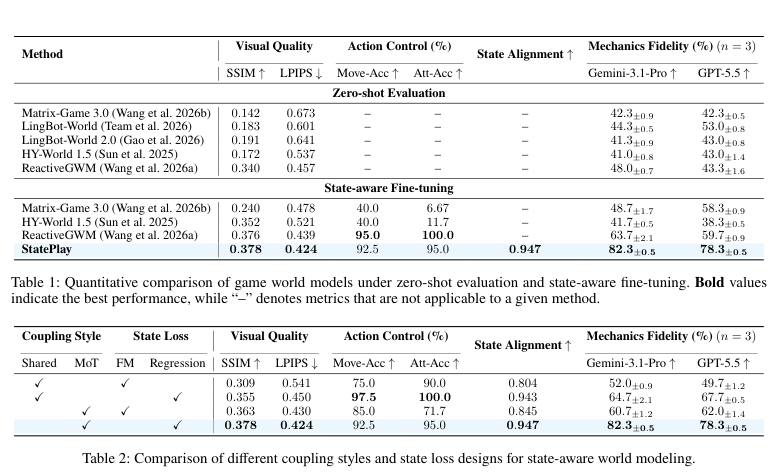
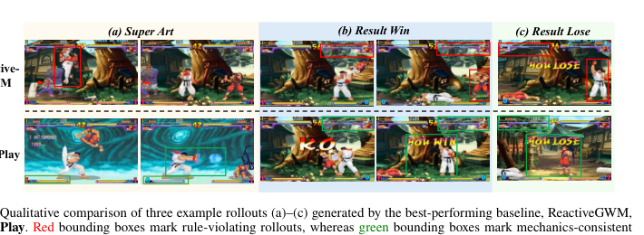
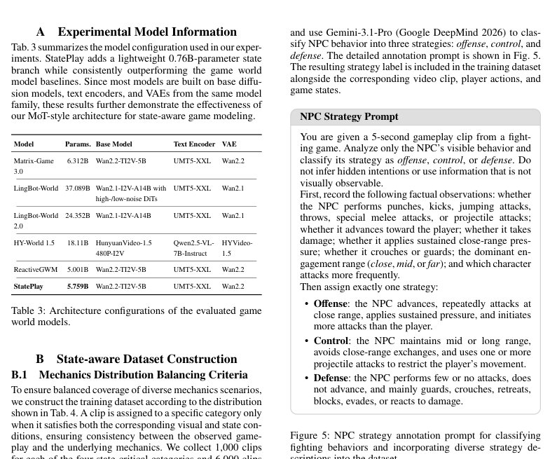
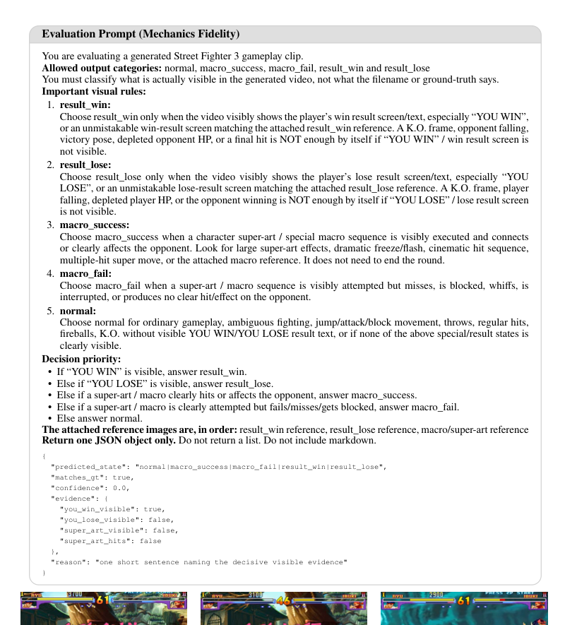
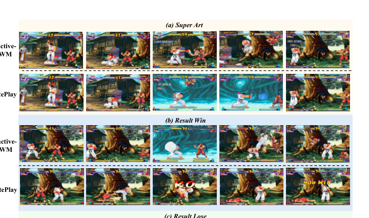

# StatePlay: State-Aware Game World Models for Mechanics-Consistent Generation

**Authors:** Zijun Lin, Zeqing Wang, Cheston Tan, Bihan Wen, Yeying Jin
**Source:** `/Users/roywangj/journey_wj/research/papers4zotero/zotero1/storage/2GC8LZER/Lin 等 - 2026 - StatePlay State-Aware Game World Models for Mechanics-Consistent Generation.pdf`
**Detected source format:** selectable-text PDF (`pdf-text`), arXiv:2607.26754v1, 29 Jul 2026, 12 pages.
**Reader type:** full-paper Chinese-English Markdown reader with figure/table assets.

## Page / Section Index

| Pages | Source content |
|---|---|
| 1–2 | Abstract; Introduction; Figure 1–2 |
| 3 | Related Work; 3.1 State-Aware Dataset Construction |
| 4–5 | Figure 3; 3.2 Model Architecture; equations (1)–(6) |
| 6–7 | Experiments, Tables 1–2; qualitative comparison; Conclusions |
| 8–9 | References |
| 10 | Appendix A; Appendix B.1–B.2; Table 3–4; Figure 5 |
| 11 | Appendix C–D; Figure 6 and exact evaluation prompt |
| 12 | Appendix E–F; Table 5; Figure 7 |

## Terminology Ledger

| English | 中文处理 |
|---|---|
| game world model | 游戏世界模型 |
| state-aware | 状态感知 |
| mechanics consistency/fidelity | 机制一致性/机制保真度 |
| health point (HP) | 生命值（HP） |
| skill meter | 技能槽 |
| super art | 超必杀技 |
| state alignment | 状态对齐 |
| Mixture-of-Transformers (MoT) | Transformer 混合架构（MoT） |
| flow matching | 流匹配 |
| NPC | 非玩家角色，保留 NPC |
| macro | 宏动作/必杀技序列 |

## Abstract

> <span style="color:#3B82F6"><strong>Para. 1:</strong></span> Recent game world models can generate visually realistic and interactive environments conditioned on player actions. However, games are not defined by pixels alone; they are governed by explicit mechanics, namely state-dependent rules that control health reduction, skill activation, and game termination. These mechanics depend on precise internal states, such as health points, skill meters, and timers, which are tightly coupled with visual observations and determine how gameplay evolves. Without modeling these state dynamics, existing game world models may generate visually plausible rollouts but violate the underlying game rules. In this paper, we propose StatePlay, a novel state-aware game world model that jointly predicts visual content and game states to promote mechanics-consistent generation. StatePlay adopts a mixture-of-transformers (MoT)-style architecture that preserves specialized visual and state representations while enabling cross-modal interaction, allowing predicted states to guide frame generation. Each branch is further optimized with a distinct objective suited to its modality. Experiments show that StatePlay achieves an average normalized L1 distance below 0.06 for state prediction. Furthermore, compared with models without explicit state modeling, our method improves mechanics fidelity in generated game rollouts by 18.6%. Overall, our work highlights the importance of state-aware game world modeling and advances beyond pixel-level realism toward complete and mechanically faithful game generation.

> <span style="color:#F59E0B"><strong>Para. 1[CN]:</strong></span> 近期的游戏世界模型能够根据玩家动作生成视觉上逼真且可交互的环境。然而，游戏并不只由像素定义；它们受显式游戏机制支配，即控制生命值降低、技能激活和游戏结束的状态相关规则。这些机制依赖精确的内部状态，例如生命值、技能槽和计时器；这些状态与视觉观测紧密耦合，并决定游戏过程如何演化。如果不建模这些状态动力学，现有游戏世界模型可能生成视觉上合理的 rollout，却违反底层游戏规则。本文提出 StatePlay，一种新颖的状态感知游戏世界模型，通过联合预测视觉内容和游戏状态，促进机制一致的生成。StatePlay 采用 mixture-of-transformers（MoT）风格架构，在保留视觉与状态专门表示的同时实现跨模态交互，使预测状态能够引导帧生成。两个分支还分别使用适合其模态的目标进行优化。实验表明，StatePlay 的状态预测平均归一化 L1 距离低于 0.06；与没有显式状态建模的模型相比，本方法使生成游戏 rollout 的机制保真度提高 18.6%。总体而言，这项工作凸显了状态感知游戏世界建模的重要性，使游戏生成从像素级逼真迈向更完整、更忠实于机制的生成。项目主页：<https://jimntu.github.io/stateplay_page/>。

### Figure 1. Existing failures and StatePlay capabilities


**Caption:** Existing game world models produce mechanically inconsistent gameplay, such as attacking at zero health or triggering a super art without a full skill meter (red boxes, top). In contrast, StatePlay jointly achieves state awareness and mechanics consistency (bottom table).
**Caption[CN]:** 现有游戏世界模型会产生机制不一致的 gameplay，例如在生命值为零时继续攻击，或在技能槽未满时触发超必杀技（上方红框）。相比之下，StatePlay 同时实现了状态感知和机制一致性（下方表格）。

## 1 Introduction

> <span style="color:#3B82F6"><strong>Para. 2:</strong></span> World models have attracted increasing attention for simulating future environment dynamics conditioned on agent or user actions (Bruce et al. 2024; Mao et al. 2026). Unlike traditional video generation models (Seedance et al. 2026; Team et al. 2025), they emphasize action-conditioned prediction, where future observations are jointly determined by historical context and interactive inputs. This capability makes them well suited to closed-loop applications such as autonomous driving (Wang et al. 2024), embodied AI (Ye et al. 2026), and games (Yu et al. 2025). In particular, games provide a promising testbed because the environment must respond coherently to player actions over time. Recent game world models can generate visually realistic and controllable gameplay rollouts while supporting interactions with dynamic environments (Tong et al. 2026), non-player characters (Wang et al. 2026a), and multiple players (Wu et al. 2026), enabling more immersive, creative, and engaging gameplay experiences.

> <span style="color:#F59E0B"><strong>Para. 2[CN]:</strong></span> 世界模型受到越来越多的关注，被用于模拟由智能体或用户动作条件化的未来环境动力学（Bruce et al. 2024；Mao et al. 2026）。不同于传统视频生成模型（Seedance et al. 2026；Team et al. 2025），世界模型强调动作条件预测：未来观测由历史上下文与交互输入共同决定。这一能力使其适合自动驾驶（Wang et al. 2024）、具身 AI（Ye et al. 2026）和游戏（Yu et al. 2025）等闭环应用。尤其是游戏是很有前景的测试平台，因为环境必须随时间对玩家动作做出连贯响应。近期游戏世界模型能够生成视觉逼真且可控的 gameplay rollout，并支持与动态环境（Tong et al. 2026）、非玩家角色（Wang et al. 2026a）和多名玩家（Wu et al. 2026）的交互，从而带来更沉浸、更有创造性且更具吸引力的游戏体验。

> <span style="color:#3B82F6"><strong>Para. 3:</strong></span> However, simulating a playable game requires more than generating realistic frames that follow user intent. Games are governed by underlying mechanics, which are often determined by internal state variables such as health points, skill meters, and timers. These states regulate valid actions, visual transitions, and game progression. Taking fighting games as an example, a player can perform certain special attacks only when the skill meter is full, and the game should end once either player’s health points reach zero. Therefore, valid and consistent mechanics are fundamental to games, directly determining whether a generated environment is truly playable or merely a visual demo.

> <span style="color:#F59E0B"><strong>Para. 3[CN]:</strong></span> 但是，要模拟一个可玩的游戏，不能只生成符合用户意图的逼真帧。游戏受底层机制支配，而这些机制通常由生命值、技能槽和计时器等内部状态变量决定。这些状态控制合法动作、视觉转场和游戏进程。以格斗游戏为例，只有技能槽充满时玩家才能施放某些特殊攻击；当任一方生命值降至零时，游戏应当结束。因此，合法且一致的机制是游戏的基础，直接决定生成的环境是真正可玩，还是仅仅是视觉演示。

> <span style="color:#3B82F6"><strong>Para. 4:</strong></span> Despite the importance of internal states, existing game world models formulate gameplay generation as a pixel-space prediction task and overlook the causal role of state dynamics in shaping future observations. Consequently, current models may generate visually plausible rollouts but fail to follow the game rules. As shown in Fig. 1, players may continue fighting after the game should have ended, or perform super arts without full skill meters. Such failures lead to mechanically inconsistent and incomplete gameplay experiences.

> <span style="color:#F59E0B"><strong>Para. 4[CN]:</strong></span> 尽管内部状态非常重要，现有游戏世界模型仍将 gameplay 生成表述为像素空间预测任务，忽略了状态动力学对未来观测形成的因果作用。因此，当前模型可能产生视觉上合理的 rollout，却不能遵循游戏规则。如图 1 所示，游戏本应结束后玩家仍可能继续战斗，或者在技能槽未满时使用超必杀技。这些失败会造成机制不一致且不完整的游戏体验。

### Figure 2. State-aware generation overview


**Caption:** Overview of StatePlay. By explicitly modeling game states, including timers, health points, and skill meters, StatePlay guides frame generation to remain consistent with the underlying game mechanics (highlighted in green bounding box).
**Caption[CN]:** StatePlay 概览。通过显式建模计时器、生命值和技能槽等游戏状态，StatePlay 引导帧生成保持与底层游戏机制一致（绿色边界框高亮部分）。

> <span style="color:#3B82F6"><strong>Para. 5:</strong></span> To address this gap, we introduce StatePlay, the first state-aware game world model that jointly predicts game states and visual content for mechanics-consistent gameplay generation (See Fig. 2). Our key observation is that player actions are often directly reflected in pixel-level changes, whereas internal state dynamics cannot be reliably learned from visual observations alone. Therefore, existing game world model datasets that contain only frames and actions are insufficient for learning state transitions and game rules.

> <span style="color:#F59E0B"><strong>Para. 5[CN]:</strong></span> 为弥补这一空白，我们提出 StatePlay，这是首个联合预测游戏状态与视觉内容、用于机制一致 gameplay 生成的状态感知游戏世界模型（见图 2）。我们的关键观察是：玩家动作通常会直接反映为像素级变化，而仅凭视觉观测无法可靠学习内部状态动力学。因此，只包含帧和动作的现有游戏世界模型数据集不足以学习状态转移与游戏规则。

> <span style="color:#3B82F6"><strong>Para. 6:</strong></span> Based on this observation, we develop StatePlay from both the data and model perspectives. First, due to the limited availability of open-source datasets with explicit state annotations, we construct a synchronized state–frame–action dataset from Street Fighter 3 (SF3) (Capcom 1998). The dataset records game frames and player actions together with internal states, including health points, skill meters, and timers, enabling us to systematically investigate the effect of explicit state modeling on game world models. Second, inspired by the World Action Model (WAM) (Ye et al. 2026; Kim et al. 2026), which jointly models visual frames and actions, we design StatePlay with a mixture-of-transformers (MoT)-style backbone that simultaneously predicts game states and generates visual content. Specifically, StatePlay couples the two modalities while optimizing each branch with a tailored objective to produce rollouts that are both visually plausible and consistent with game mechanics.

> <span style="color:#F59E0B"><strong>Para. 6[CN]:</strong></span> 基于这一观察，我们从数据和模型两个角度开发 StatePlay。第一，由于带显式状态标注的开源数据集很少，我们从 Street Fighter 3（SF3）（Capcom 1998）构建同步的 state–frame–action 数据集。该数据集将游戏帧、玩家动作与内部状态一同记录，包括生命值、技能槽和计时器，使我们能够系统研究显式状态建模对游戏世界模型的影响。第二，受到联合建模视觉帧和动作的 World Action Model（WAM）（Ye et al. 2026；Kim et al. 2026）启发，我们设计了 MoT 风格骨干，同时预测游戏状态并生成视觉内容。具体而言，StatePlay 连接两种模态，并为每个分支优化定制目标，以产生视觉合理且符合游戏机制的 rollout。

> <span style="color:#3B82F6"><strong>Para. 7:</strong></span> Experiments highlight the importance of generating visual content with explicit state prediction. StatePlay accurately models internal game states, achieving an average normalized L1 distance below 0.06 across key state variables. Beyond state prediction itself, coupling states with visual generation leads to a 18.6% improvement in mechanics fidelity over the best-performing baseline. Compared with stateless game world models that learn game mechanics implicitly through pixel-level supervision, StatePlay better preserves state-dependent events, such as skill activation, health reduction, and game termination, while maintaining visual quality and action controllability. These results indicate that explicit state modeling is crucial for advancing game world models beyond visual realism toward more playable and mechanically consistent simulation.

> <span style="color:#F59E0B"><strong>Para. 7[CN]:</strong></span> 实验凸显了用显式状态预测辅助视觉内容生成的重要性。StatePlay 能够准确建模内部游戏状态，在关键状态变量上达到低于 0.06 的平均归一化 L1 距离。除状态预测本身外，将状态与视觉生成耦合还使机制保真度相对于最佳基线提升 18.6%。与通过像素级监督隐式学习游戏机制的无状态游戏世界模型相比，StatePlay 更好地保留了技能激活、生命值降低和游戏结束等依赖状态的事件，同时保持视觉质量和动作可控性。这些结果说明，显式状态建模对于推动游戏世界模型超越视觉逼真、走向更可玩且机制更一致的模拟至关重要。

> <span style="color:#3B82F6"><strong>Para. 8:</strong></span> Overall, our contributions are summarized as follows:
>
> - We propose StatePlay, the first state-aware game world model that jointly predicts game states and visual content, addressing the lack of state modeling in prior work.
> - We introduce a novel mixture-of-transformers (MoT)-style architecture with distinct objectives for the state and visual branches. By explicitly coupling state modeling with visual generation, it enables accurate state prediction and mechanically consistent frame generation.
> - We conduct extensive experiments demonstrating that StatePlay improves mechanics fidelity by 18.6% over stateless game world models, while maintaining accurate state prediction, action controllability, and visual quality.

> <span style="color:#F59E0B"><strong>Para. 8[CN]:</strong></span> 总体而言，本文贡献如下：
>
> - 提出 StatePlay，这是首个联合预测游戏状态和视觉内容的状态感知游戏世界模型，解决了以往工作缺少状态建模的问题。
> - 提出新颖的 MoT 风格架构，为状态分支和视觉分支设置不同目标。通过显式耦合状态建模与视觉生成，该架构实现准确状态预测和机制一致的帧生成。
> - 通过广泛实验表明，与无状态游戏世界模型相比，StatePlay 将机制保真度提升 18.6%，同时保持准确的状态预测、动作可控性和视觉质量。

## 2 Related Work

### 2.1 Game World Model

> <span style="color:#3B82F6"><strong>Para. 9:</strong></span> Game world models have the potential to transform game development by autonomously generating interactive content conditioned on player actions. Pioneering work such as Genie (Bruce et al. 2024) demonstrates that video generative models can produce playable environments by learning action-controllable dynamics from unlabeled videos. Studies such as ReactiveGWM (Wang et al. 2026a), Incantation (Zhu et al. 2026), and MultiWorld (Wu et al. 2026) further extend this direction toward richer forms of interactivity, from free exploration to interactions with environments, NPCs, and other players. In parallel, recent works including Lyra 2.0 (Shen et al. 2026), HY-World 1.5 (Sun et al. 2025), and Matrix-Game 3.0 (Wang et al. 2026b) focus on improving real-time interaction, long-horizon consistency, and high-resolution generation.

> <span style="color:#F59E0B"><strong>Para. 9[CN]:</strong></span> 游戏世界模型有潜力通过自主生成由玩家动作条件化的交互内容，改变游戏开发。Genie（Bruce et al. 2024）等先驱工作表明，视频生成模型可以从无标注视频中学习动作可控的动力学，进而生成可玩的环境。ReactiveGWM（Wang et al. 2026a）、Incantation（Zhu et al. 2026）和 MultiWorld（Wu et al. 2026）等研究进一步将这一方向拓展到更丰富的交互形式，从自由探索到与环境、NPC 和其他玩家交互。与此同时，Lyra 2.0（Shen et al. 2026）、HY-World 1.5（Sun et al. 2025）和 Matrix-Game 3.0（Wang et al. 2026b）等工作重点改善实时交互、长时一致性和高分辨率生成。

> <span style="color:#3B82F6"><strong>Para. 10:</strong></span> Despite rapid progress in game world models, state prediction, which is equally important for building playable environments, remains largely overlooked. In this work, we identify this missing component in recent game world model research and enable game world models to simultaneously predict game states and generate video frames that follow the underlying game rules.

> <span style="color:#F59E0B"><strong>Para. 10[CN]:</strong></span> 尽管游戏世界模型发展迅速，但对于构建可玩环境同样重要的状态预测仍基本被忽视。本文指出了近期游戏世界模型研究中缺失的这一组件，使游戏世界模型能够同时预测游戏状态，并生成遵循底层游戏规则的视频帧。

### 2.2 State-Aware World Modeling

> <span style="color:#3B82F6"><strong>Para. 11:</strong></span> The use of state information has been widely studied in embodied and decision-making domains, where the definition of state depends on the task setting. In embodied AI, state often refers to proprioceptive information, such as robot poses and joint configurations, which helps policies generate physically feasible actions (Black et al. 2025; Kim et al. 2024). In autonomous driving, state variables such as ego speed, acceleration, and surrounding object motion are commonly modeled to support safer future prediction and planning (Zheng et al. 2024; Hu et al. 2022). These examples suggest that explicit state modeling is crucial for systems that require both visual understanding and rule-consistent interaction.

> <span style="color:#F59E0B"><strong>Para. 11[CN]:</strong></span> 状态信息的使用已在具身和决策领域得到广泛研究，其中状态的定义取决于任务设置。在具身 AI 中，状态通常指本体感知信息，如机器人姿态和关节配置，帮助策略生成物理上可行的动作（Black et al. 2025；Kim et al. 2024）。在自动驾驶中，自车速度、加速度和周围物体运动等状态变量通常被建模，以支持更安全的未来预测与规划（Zheng et al. 2024；Hu et al. 2022）。这些例子说明，对于同时需要视觉理解和规则一致交互的系统，显式状态建模至关重要。

> <span style="color:#3B82F6"><strong>Para. 12:</strong></span> Games also involve task-dependent states, such as ammunition or bandage counts in first-person shooter (FPS) games, nitro or speed in racing games, and health points or skill meters in fighting games. However, this perspective remains underexplored in game world models because game state information cannot always be directly extracted from the environment or reliably inferred from generated content. The most closely related recent works, including WildWorld (Li et al. 2026a) and From Pixels to States (Li et al. 2026b), introduce action-conditioned video datasets with explicit state annotations, but it remains unclear how state prediction can improve the mechanics fidelity of frame generation, or how such state information should be incorporated into game world models. In this work, we propose StatePlay, a state-aware game world model, to fill this gap and systematically investigate how visual generation and state prediction can complement and reinforce each other.

> <span style="color:#F59E0B"><strong>Para. 12[CN]:</strong></span> 游戏还包含依赖任务的状态，例如第一人称射击游戏中的弹药或绷带数量、竞速游戏中的氮气或速度，以及格斗游戏中的生命值或技能槽。然而，在游戏世界模型中，这一视角仍未得到充分探索，因为游戏状态信息不一定能从环境中直接提取，也不一定能从生成内容中可靠推断。与本文最相关的近期工作 WildWorld（Li et al. 2026a）和 From Pixels to States（Li et al. 2026b）引入了带显式状态标注的动作条件视频数据集，但状态预测如何改善帧生成的机制保真度、以及这类状态信息应如何纳入游戏世界模型，仍然不清楚。为填补这一空白，我们提出状态感知游戏世界模型 StatePlay，并系统研究视觉生成与状态预测如何相互补充、相互强化。

## 3 StatePlay

### 3.1 State-Aware Dataset Construction

> <span style="color:#3B82F6"><strong>Para. 13:</strong></span> We specifically construct our dataset using Street Fighter 3 (SF3) (Capcom 1998), as few publicly available game datasets provide explicit state annotations. This game offers a suitable starting point for studying the relationship between state prediction and mechanics-consistent visual generation, as it contains intuitive state variables and clearly defined game rules. These states are directly tied to game progression: different attacks cause different amounts of health-point reduction, super arts can be activated only when the skill meter is full, and the game ends when either character’s health reaches zero. The state-aware dataset is constructed in three stages: gameplay recording, mechanics distribution balancing, and NPC strategy annotation.

> <span style="color:#F59E0B"><strong>Para. 13[CN]:</strong></span> 我们特别使用 Street Fighter 3（SF3）（Capcom 1998）构建数据集，因为公开可用的游戏数据集很少提供显式状态标注。该游戏包含直观的状态变量和定义清晰的游戏规则，是研究状态预测与机制一致视觉生成关系的合适起点。这些状态与游戏进程直接相关：不同攻击造成不同程度的生命值减少；只有技能槽充满时才能激活超必杀技；任一角色生命值归零时游戏结束。状态感知数据集分三个阶段构建：游戏录制、机制分布平衡和 NPC 策略标注。

> <span style="color:#3B82F6"><strong>Para. 14:</strong></span> Gameplay Recording. Following a similar data acquisition pipeline to ReactiveGWM (Wang et al. 2026a), the stable-retro framework (Poliquin 2026) is employed to programmatically collect gameplay episodes. It provides a Gymnasium-compatible interface for SF3, allowing us to control the game through Python, record visual observations and actions. Players are controlled by agents that sample actions from an 11-dimensional action space, including 4 movement actions, 6 normal attacks, and 1 super art. Additionally, we extract five state variables from emulator memory: the game timer, the health points and the skill meters of both the player and the NPC. Each episode runs until a round-ending knock-out, and is then segmented into 5-second clips at 20 FPS.

> <span style="color:#F59E0B"><strong>Para. 14[CN]:</strong></span> 游戏录制。遵循与 ReactiveGWM（Wang et al. 2026a）类似的数据采集流程，我们使用 stable-retro 框架（Poliquin 2026）以程序方式收集游戏 episode。它为 SF3 提供兼容 Gymnasium 的接口，使我们能够通过 Python 控制游戏并记录视觉观测和动作。玩家由智能体控制，动作从 11 维动作空间采样，包括 4 个移动动作、6 个普通攻击和 1 个超必杀技。此外，我们从模拟器内存中提取 5 个状态变量：游戏计时器、玩家和 NPC 双方的生命值及技能槽。每个 episode 持续到本回合击倒结束，然后以 20 FPS 切分为 5 秒视频片段。

> <span style="color:#3B82F6"><strong>Para. 15:</strong></span> Mechanics Distribution Balancing. After collecting the gameplay clips with synchronized player actions and internal states, we balance the dataset across five mechanics-related categories: result win, result lose, macro success, macro fail, and normal. Labels are assigned using both Gemini-3.1-Pro (Google DeepMind 2026) and the recorded game states. Specifically, a clip is labeled as result win or result lose when Gemini detects the corresponding “You Win” or “You Lose” frame, and one character reaches zero health. A clip is labeled as macro success when Gemini detects a successfully executed super art, the recorded action contains the corresponding command, and the skill meter exceeds the required threshold. In contrast, it is labeled as macro fail when the player issues the command with insufficient skill meter, causing a regular attack instead. The remaining clips without these state-dependent events are labeled as normal. Finally, we construct a balanced training set with 10,000 clips. State-critical cases account for 40% of the dataset, including result win, result lose, macro success, and macro fail, each contributing 10%. The remaining 60% consists of normal cases. This balancing strategy ensures that the dataset contains sufficient clips where state information is essential for generating mechanics-consistent game frames, while still preserving common gameplay dynamics. Please refer to Appendix B.1 for more details.

> <span style="color:#F59E0B"><strong>Para. 15[CN]:</strong></span> 机制分布平衡。收集带同步玩家动作和内部状态的 gameplay 片段后，我们在五个机制相关类别之间平衡数据集：胜利结果、失败结果、宏动作成功、宏动作失败和普通片段。标签同时使用 Gemini-3.1-Pro（Google DeepMind 2026）和记录的游戏状态分配。具体而言，当 Gemini 检测到对应的“You Win”或“You Lose”帧，且一名角色生命值归零时，片段被标为 result win 或 result lose。当 Gemini 检测到成功执行超必杀技、记录动作包含相应指令且技能槽超过所需阈值时，片段标为 macro success。相反，当玩家在技能槽不足时发出该指令、结果执行普通攻击时，标为 macro fail。没有这些依赖状态事件的其余片段标为 normal。最终我们构建了包含 10,000 个片段的平衡训练集。状态关键案例占 40%，包括 result win、result lose、macro success 和 macro fail，每类占 10%；剩余 60% 为 normal。该平衡策略确保数据集中有足够片段体现状态信息对于生成机制一致游戏帧的必要性，同时保留常见 gameplay 动力学。更多细节见附录 B.1。

> <span style="color:#3B82F6"><strong>Para. 16:</strong></span> NPC Strategy Annotation. To enable the model to steer the NPC toward different strategies against the player, we use Gemini-3.1-Pro to annotate NPC behavior with natural-language descriptions. Following (Wang et al. 2026a), we design the prompt to describe NPC behavior along three strategy categories: Offense, where the NPC closes the distance and attacks the player proactively; Control, where the NPC maintains distance and uses projectiles; and Defense, where the NPC reacts passively with crouching guards. Please refer to Appendix B.2 for the detailed NPC strategy prompt. Altogether, we construct a state-aware dataset with 10,000 training clips including video frames, player actions, state information, and an NPC textual description, with a balanced distribution across different mechanics-related scenarios.

> <span style="color:#F59E0B"><strong>Para. 16[CN]:</strong></span> NPC 策略标注。为了让模型能够引导 NPC 针对玩家采取不同策略，我们使用 Gemini-3.1-Pro 以自然语言描述标注 NPC 行为。遵循 Wang et al.（2026a），我们设计提示词描述三类 NPC 策略：Offense，即 NPC 接近玩家并主动攻击；Control，即 NPC 保持距离并使用投射物；Defense，即 NPC 通过下蹲防守被动反应。详细 NPC 策略提示词见附录 B.2。总之，我们构建了包含 10,000 个训练片段的状态感知数据集，其中包括视频帧、玩家动作、状态信息和 NPC 文本描述，并在不同机制相关场景之间保持平衡分布。

### Figure 3. StatePlay training architecture


**Caption:** StatePlay block architecture during training. StatePlay adopts a Mixture-of-Transformers (MoT)-style architecture with separate state and visual branches. A shared joint-attention module enables information exchange between the two branches. The state branch is optimized with a regression loss, while the visual branch is trained using a flow-matching objective. White-filled boxes denote inputs and supervision targets, while colored boxes represent model components. The block is repeated N times.
**Caption[CN]:** StatePlay 的训练模块架构。StatePlay 采用具有独立状态分支和视觉分支的 Mixture-of-Transformers（MoT）风格架构。共享的联合注意力模块实现两个分支之间的信息交换。状态分支使用回归损失优化，视觉分支使用流匹配目标训练。白色填充框表示输入和监督目标，彩色框表示模型组件。该模块重复 N 次。

### 3.2 Model Architecture

> <span style="color:#3B82F6"><strong>Para. 17:</strong></span> State and Visual Branches. To jointly predict internal game states and generate mechanics-consistent visual frames, we introduce a lightweight state branch (0.76B) alongside the visual branch (5B) commonly adopted by existing game world models. This simple yet effective design shown in Fig. 3 can be readily integrated into different game world models to endow them with state modeling capability.

> <span style="color:#F59E0B"><strong>Para. 17[CN]:</strong></span> 状态分支与视觉分支。为了联合预测内部游戏状态并生成机制一致的视觉帧，我们在现有游戏世界模型常用的视觉分支（5B）旁引入轻量级状态分支（0.76B）。图 3 所示这一简单而有效的设计可以方便地集成到不同游戏世界模型中，为其赋予状态建模能力。

> <span style="color:#3B82F6"><strong>Para. 18:</strong></span> Inspired by the action-conditioning design in world action models, we construct the state branch by perturbing the clean state sequence $s_0$ with Gaussian noise $\epsilon_s$ according to a sampled timestep $t$. Here, $s_0 \in \mathbb{R}^{B\times f\times S}$, where $B$ denotes batch size, $f$ denotes the number of latent frames, and $S$ denotes the number of state variables, which may vary across different games. During inference, the state of the first frame is provided as a condition, while the states of the remaining frames are initialized from noise and predicted by the model. The perturbed state sequence is then processed by the state encoder $E_s$ and state self-attention module to obtain state representation $H_s \in \mathbb{R}^{B\times L_s\times C}$, which captures temporal state dynamics and mechanics-related information with $L_s$ state token length containing $C$ dimensions each.

> <span style="color:#F59E0B"><strong>Para. 18[CN]:</strong></span> 受到 world action model 中动作条件设计的启发，我们按照采样时间步 $t$，用高斯噪声 $\epsilon_s$ 扰动干净状态序列 $s_0$，从而构建状态分支。其中 $s_0 \in \mathbb{R}^{B\times f\times S}$，$B$ 为批大小，$f$ 为潜在帧数，$S$ 为状态变量数，该数量可随游戏变化。推理时，第一帧的状态作为条件提供，其余帧状态从噪声初始化并由模型预测。扰动后的状态序列随后经过状态编码器 $E_s$ 和状态自注意力模块，得到状态表示 $H_s \in \mathbb{R}^{B\times L_s\times C}$；该表示捕捉时间状态动力学和机制相关信息，其中状态 token 长度为 $L_s$，每个 token 含 $C$ 个维度。

$$s_t=(1-t)s_0+t\epsilon_s,\qquad \epsilon_s\sim\mathcal{N}(0,I).$$

> <span style="color:#3B82F6"><strong>Para. 19:</strong></span> Similarly, the video branch perturbs the clean latent representation $x_0$ produced by the VAE encoder using independently sampled Gaussian noise $\epsilon_v$: $x_t=(1-t)x_0+t\epsilon_v$, where $\epsilon_v\sim\mathcal{N}(0,I)$. Here $x_0\in\mathbb{R}^{B\times L_v\times C}$ denotes the visual latent representation, consisting of $L_v$ visual tokens, each with feature dimension $C$, matching the dimension of the state tokens. The perturbed visual latent $x_t$ is processed by the visual self-attention module, followed by cross-attention with the text embedding, producing visual representation $H_v\in\mathbb{R}^{B\times L_v\times C}$ that captures both visual dynamics and semantic information from the text prompt.

> <span style="color:#F59E0B"><strong>Para. 19[CN]:</strong></span> 类似地，视频分支使用独立采样的高斯噪声 $\epsilon_v$ 扰动 VAE 编码器产生的干净潜在表示 $x_0$：$x_t=(1-t)x_0+t\epsilon_v$，其中 $\epsilon_v\sim\mathcal{N}(0,I)$。这里 $x_0\in\mathbb{R}^{B\times L_v\times C}$ 表示视觉潜在表示，由 $L_v$ 个视觉 token 组成，每个 token 的特征维度为 $C$，与状态 token 维度一致。扰动的视觉潜变量 $x_t$ 先经过视觉自注意力模块，再与文本嵌入进行交叉注意力，得到视觉表示 $H_v\in\mathbb{R}^{B\times L_v\times C}$，从文本提示中同时捕捉视觉动力学和语义信息。

> <span style="color:#3B82F6"><strong>Para. 20:</strong></span> The state representation $H_s$ and visual representation $H_v$ are processed separately by their respective expert branches, as they correspond to intrinsically different modalities. The effectiveness of this modality-specific design is further analyzed in Sec. 4.4. In addition, the action sequence $A\in\mathbb{R}^{B\times f\times K}$, where $K$ denotes the action dimension, is projected by an action encoder into an action embedding $A'\in\mathbb{R}^{B\times f\times C}$. The action embedding is then injected into both the visual and state branches immediately after token embedding, enabling player actions to jointly modulate visual generation and state prediction throughout the network.

> <span style="color:#F59E0B"><strong>Para. 20[CN]:</strong></span> 状态表示 $H_s$ 和视觉表示 $H_v$ 分别由各自的专家分支处理，因为它们对应本质不同的模态。这一模态特定设计的有效性将在第 4.4 节进一步分析。此外，动作序列 $A\in\mathbb{R}^{B\times f\times K}$（其中 $K$ 为动作维度）经动作编码器投影为动作嵌入 $A'\in\mathbb{R}^{B\times f\times C}$。动作嵌入在 token 嵌入之后立即注入视觉和状态分支，使玩家动作能够在整个网络中共同调制视觉生成和状态预测。

> <span style="color:#3B82F6"><strong>Para. 21:</strong></span> Mixture of Transformers. After obtaining the state representation $H_s$ and visual representation $H_v$ from their respective expert branches, a joint attention module is applied for cross-modal information exchange. Specifically, the visual tokens serve as queries and attend to the keys and values derived from the state tokens, allowing visual generation to incorporate mechanics-related state information. Conversely, the state tokens serve as queries and attend to the keys and values derived from the visual tokens, enabling state prediction to leverage the corresponding visual dynamics. This bidirectional interaction enables effective information exchange while preserving modality-specific representations in each branch.

> <span style="color:#F59E0B"><strong>Para. 21[CN]:</strong></span> Transformer 混合架构。在各自专家分支得到状态表示 $H_s$ 与视觉表示 $H_v$ 后，使用联合注意力模块进行跨模态信息交换。具体而言，视觉 token 作为 query，关注由状态 token 产生的 key 和 value，使视觉生成能够纳入机制相关状态信息。反过来，状态 token 作为 query，关注由视觉 token 产生的 key 和 value，使状态预测能够利用对应的视觉动力学。这种双向交互实现了有效信息交换，同时保留每个分支的模态专用表示。

$$H'_v=H_v+\operatorname{MHA}(H_v,H_s,H_s),\qquad H'_s=H_s+\operatorname{MHA}(H_s,H_v,H_v).$$

> <span style="color:#3B82F6"><strong>Para. 22:</strong></span> Loss Design. StatePlay is jointly optimized for visual generation and state prediction. For the visual branch, we follow the standard flow matching objective adopted by Wan-based game world models to learn the velocity field for denoising the perturbed visual latent. Here $v_\theta$ denotes the velocity field predicted by the visual branch, $x_t$ is the perturbed visual latent at timestep $t$, and $\epsilon_v-x_0$ is the corresponding ground-truth velocity under the linear flow path.

> <span style="color:#F59E0B"><strong>Para. 22[CN]:</strong></span> 损失设计。StatePlay 联合优化视觉生成和状态预测。对于视觉分支，我们遵循基于 Wan 的游戏世界模型所采用的标准流匹配目标，学习用于对扰动视觉潜变量去噪的速度场。其中 $v_\theta$ 是视觉分支预测的速度场，$x_t$ 是时间步 $t$ 的扰动视觉潜变量，而 $\epsilon_v-x_0$ 是在线性流路径下对应的真实速度。

$$\mathcal{L}_{video}=\mathbb{E}_{x_0,\epsilon_v,t}\left[\left\|v_\theta(x_t,t)-(\epsilon_v-x_0)\right\|_2^2\right].$$

> <span style="color:#3B82F6"><strong>Para. 23:</strong></span> For the state branch, rather than applying the same flow-matching objective used in world action models, we directly supervise the predicted states with a Smooth L1 regression loss. Compared with naively adapting flow matching to state prediction, regression is better suited to the low-dimensional, mechanics-constrained nature of game states. Here $D_s$ denotes the state decoder, and the loss is computed between the predicted state sequence $D_s(H'_s)$ and the corresponding clean state sequence $s_0$. Finally, the two objectives are jointly optimized using a weighted summation, where $\lambda_{state}$ and $\lambda_{video}$ denote the loss weights for the state and visual branches, respectively. A detailed ablation study of this design choice is provided in Sec. 4.4.

> <span style="color:#F59E0B"><strong>Para. 23[CN]:</strong></span> 对于状态分支，我们不采用 world action model 使用的相同流匹配目标，而是使用 Smooth L1 回归损失直接监督预测状态。与将流匹配生搬硬套到状态预测相比，回归更适合游戏状态低维且受机制约束的性质。这里 $D_s$ 表示状态解码器，损失计算于预测状态序列 $D_s(H'_s)$ 与对应干净状态序列 $s_0$ 之间。最后，两个目标通过加权求和联合优化，其中 $\lambda_{state}$ 与 $\lambda_{video}$ 分别是状态分支和视觉分支的损失权重。该设计选择的详细消融见第 4.4 节。

$$\mathcal{L}_{state}=\operatorname{SmoothL1}(D_s(H'_s),s_0),\qquad \mathcal{L}_{train}=\lambda_{state}\mathcal{L}_{state}+\lambda_{video}\mathcal{L}_{video}.$$

## 4 Experiments

### 4.1 Evaluation Metrics

> <span style="color:#3B82F6"><strong>Para. 24:</strong></span> Our benchmark evaluates each generated clip from four complementary dimensions: visual quality, action control, state alignment, and mechanics fidelity. All metrics are evaluated on an additional test set of 100 generated samples, evenly covering various mechanics categories.

> <span style="color:#F59E0B"><strong>Para. 24[CN]:</strong></span> 我们的基准从四个互补维度评估每个生成片段：视觉质量、动作控制、状态对齐和机制保真度。所有指标均在额外的 100 个生成样本测试集上评估，样本均匀覆盖不同机制类别。

> <span style="color:#3B82F6"><strong>Para. 25:</strong></span> Visual Quality evaluates frame-level and perceptual fidelity by comparing generated videos with reference game-engine outputs. SSIM (Wang et al. 2004) measures structural similarity after aligning frame size and crop, capturing scene layout, character shapes, and local image structure. LPIPS (Zhang et al. 2018) measures perceptual similarity using deep visual features.

> <span style="color:#F59E0B"><strong>Para. 25[CN]:</strong></span> 视觉质量通过将生成视频与游戏引擎参考输出比较，评估帧级和感知层面的保真度。SSIM（Wang et al. 2004）在对齐帧大小和裁剪后测量结构相似度，捕捉场景布局、角色形状和局部图像结构。LPIPS（Zhang et al. 2018）使用深层视觉特征测量感知相似度。

> <span style="color:#3B82F6"><strong>Para. 26:</strong></span> Action Control evaluates how well the generated gameplay follows the commanded player actions, measuring controllability at both movement and combat levels. Movement Accuracy (Move-Acc) quantifies alignment between generated character movement and the input movement direction. We track the character using SAM2.1 (Ravi et al. 2025) and Grounding DINO (Liu et al. 2024), and count movement as successful when observed displacement satisfies predefined thresholds in normalized $[0,1]$ coordinate space. Attack Accuracy (Att-Acc) measures consistency between generated attack behavior and the intended attack command. We evaluate this using ClipAttackNet, a custom 6-way frame-level attack classifier based on ResNet-18 (He et al. 2016) and a 4-layer dilated TCN (Bai, Kolter, and Koltun 2018), trained on about 5k clips with a confidence threshold of 0.7.

> <span style="color:#F59E0B"><strong>Para. 26[CN]:</strong></span> 动作控制评估生成 gameplay 遵循玩家指令的程度，同时衡量移动和战斗层面的可控性。移动准确率（Move-Acc）量化生成角色移动与输入移动方向之间的一致性。我们使用 SAM2.1（Ravi et al. 2025）和 Grounding DINO（Liu et al. 2024）跟踪角色；当归一化 $[0,1]$ 坐标空间中的观测位移满足预设阈值时，将移动计为成功。攻击准确率（Att-Acc）衡量生成攻击行为与目标攻击指令的一致性。我们使用 ClipAttackNet 进行评估，这是一个基于 ResNet-18（He et al. 2016）和 4 层膨胀 TCN（Bai, Kolter, and Koltun 2018）的自定义 6 类帧级攻击分类器，在约 5k 个片段上训练，置信度阈值为 0.7。

> <span style="color:#3B82F6"><strong>Para. 27:</strong></span> State Alignment measures the accuracy of generated game states, including the timer, player HP, opponent HP, and both skill meters. For each state variable, we compute normalized prediction error against the target state trace and report the average distance. We further define the state alignment score as $1-$distance.

> <span style="color:#F59E0B"><strong>Para. 27[CN]:</strong></span> 状态对齐衡量生成游戏状态的准确性，包括计时器、玩家 HP、对手 HP 和双方技能槽。对于每个状态变量，我们相对于目标状态轨迹计算归一化预测误差，并报告平均距离。进一步将状态对齐分数定义为 $1-$distance。

> <span style="color:#3B82F6"><strong>Para. 28:</strong></span> Mechanics Fidelity assesses the correctness of mechanics in generated clips. We use Gemini-3.1-Pro (Google DeepMind 2026) and GPT-5.5 (OpenAI 2026) as visual judges with a strict prompt and ground-truth reference images, comparing identified mechanics against the target label. This includes, but is not limited to, verifying the correct winner and valid super art execution. Gemini-3.1-Pro processes each video directly, whereas GPT-5.5 evaluates 24 uniformly sampled frames due to limited video input support. Results are reported as mean ± standard deviation over three runs for more reliable evaluation. Please refer to Appendix D for details.

> <span style="color:#F59E0B"><strong>Para. 28[CN]:</strong></span> 机制保真度评估生成片段中机制的正确性。我们使用 Gemini-3.1-Pro（Google DeepMind 2026）和 GPT-5.5（OpenAI 2026）作为视觉评审器，配合严格提示词和真实标签参考图，将识别出的机制与目标标签比较。这包括但不限于验证胜者是否正确、超必杀技是否有效执行。Gemini-3.1-Pro 直接处理每个视频；由于 GPT-5.5 对视频输入支持有限，GPT-5.5 评估均匀采样的 24 帧。结果报告三次运行的均值 ± 标准差，以提高评估可靠性。详情见附录 D。

### 4.2 Implementation Details

> <span style="color:#3B82F6"><strong>Para. 29:</strong></span> We adopt Wan2.2-TI2V-5B (Wan et al. 2025) as the base video diffusion model, together with the Wan2.2 VAE and the UMT5-XXL text encoder (Chung et al. 2023). The model is trained on our collected dataset of 10,000 5-second video clips, where each clip is annotated with player actions, game states, and textual descriptions. Our model is trained for 40,000 steps using a batch size of 4 and a learning rate of $5\times10^{-5}$. All video frames are resized to 480 × 832. The hyperparameters $N,L_s,L_v,f,C,K,\lambda_{state},\lambda_{video}$ are set to 30, 25, 9750, 25, 3072, 11, 1, and 1, respectively.

> <span style="color:#F59E0B"><strong>Para. 29[CN]:</strong></span> 我们采用 Wan2.2-TI2V-5B（Wan et al. 2025）作为基础视频扩散模型，并使用 Wan2.2 VAE 和 UMT5-XXL 文本编码器（Chung et al. 2023）。模型在收集的 10,000 个 5 秒视频片段数据集上训练，每个片段都标注玩家动作、游戏状态和文本描述。模型训练 40,000 步，批大小为 4，学习率为 $5\times10^{-5}$。所有视频帧缩放为 480 × 832。超参数 $N,L_s,L_v,f,C,K,\lambda_{state},\lambda_{video}$ 分别设为 30、25、9750、25、3072、11、1 和 1。

### 4.3 Comparisons with Game World Models

> <span style="color:#3B82F6"><strong>Para. 30:</strong></span> Zero-shot Evaluation. StatePlay is compared with several state-of-the-art game world models in the zero-shot setting. To ensure a fair comparison, all baseline models are evaluated using their original released architectures and pretrained weights without modification. Since existing game world models neither support our state representation nor share the same action space, we report only visual quality and mechanics fidelity.

> <span style="color:#F59E0B"><strong>Para. 30[CN]:</strong></span> 零样本评估。我们首先在零样本设置下将 StatePlay 与多个最新游戏世界模型比较。为保证公平，所有基线都使用其原始发布架构和预训练权重，不做修改。由于现有游戏世界模型既不支持我们的状态表示，也不共享相同动作空间，因此只报告视觉质量和机制保真度。

### Table 1. Quantitative comparison



**Caption:** Quantitative comparison of game world models under zero-shot evaluation and state-aware fine-tuning. Bold values indicate the best performance, while “–” denotes metrics that are not applicable to a given method.
**Caption[CN]:** 游戏世界模型在零样本评估和状态感知微调下的定量比较。粗体表示最佳性能，“–”表示某指标不适用于该方法。

| Setting | Method | SSIM ↑ | LPIPS ↓ | Move-Acc ↑ | Att-Acc ↑ | State Alignment ↑ | Gemini-3.1-Pro ↑ | GPT-5.5 ↑ |
|---|---|---:|---:|---:|---:|---:|---:|---:|
| Zero-shot | Matrix-Game 3.0 | 0.142 | 0.673 | – | – | – | 42.3±0.9 | 42.3±0.5 |
| Zero-shot | LingBot-World | 0.183 | 0.601 | – | – | – | 44.3±0.5 | 53.0±0.8 |
| Zero-shot | LingBot-World 2.0 | 0.191 | 0.641 | – | – | – | 41.3±0.9 | 43.0±0.8 |
| Zero-shot | HY-World 1.5 | 0.172 | 0.537 | – | – | – | 41.0±0.8 | 43.0±1.4 |
| Zero-shot | ReactiveGWM | 0.340 | 0.457 | – | – | – | 48.0±0.7 | 43.3±1.6 |
| State-aware fine-tuning | Matrix-Game 3.0 | 0.240 | 0.478 | 40.0 | 6.67 | – | 48.7±1.7 | 58.3±0.9 |
| State-aware fine-tuning | HY-World 1.5 | 0.352 | 0.521 | 40.0 | 11.7 | – | 41.7±0.5 | 38.3±0.5 |
| State-aware fine-tuning | ReactiveGWM | 0.376 | 0.439 | 95.0 | 100.0 | – | 63.7±2.1 | 59.7±0.9 |
| State-aware fine-tuning | **StatePlay** | **0.378** | **0.424** | 92.5 | 95.0 | **0.947** | **82.3±0.5** | **78.3±0.5** |

> <span style="color:#3B82F6"><strong>Para. 31:</strong></span> As shown in Tab. 1, Matrix-Game 3.0, LingBot-World, LingBot-World 2.0 and HY-World 1.5 produce relatively poor visual quality. Although ReactiveGWM, trained on an in-domain dataset, achieves substantially better visual quality than the other zero-shot baselines, its mechanics fidelity remains below 50% for both Gemini and GPT evaluation. This result indicates that current game world models can generate visually plausible gameplay but still struggle to faithfully preserve the game rules.

> <span style="color:#F59E0B"><strong>Para. 31[CN]:</strong></span> 如表 1 所示，Matrix-Game 3.0、LingBot-World、LingBot-World 2.0 和 HY-World 1.5 的视觉质量相对较差。尽管在域内数据集上训练的 ReactiveGWM 比其他零样本基线取得显著更好的视觉质量，但在 Gemini 和 GPT 评估下其机制保真度均低于 50%。这说明当前游戏世界模型可以生成视觉上合理的 gameplay，却仍难以忠实保留游戏规则。

> <span style="color:#3B82F6"><strong>Para. 32:</strong></span> State-aware Fine-tuning. We further fine-tune the baseline models on our state-aware dataset to assess whether mechanics-consistent gameplay can emerge from visual supervision alone. To the best of our knowledge, existing open-source game world models neither explicitly model nor predict internal game states; therefore, the state alignment metric is not applicable and is omitted. We also omit fine-tuning results for the LingBot-World model family because they contain over 24B parameters and require substantially more training memory than our 5.75B StatePlay model.

> <span style="color:#F59E0B"><strong>Para. 32[CN]:</strong></span> 状态感知微调。我们进一步在状态感知数据集上微调基线模型，以评估仅靠视觉监督能否产生机制一致 gameplay。据我们所知，现有开源游戏世界模型既不显式建模也不预测内部游戏状态，因此状态对齐指标不适用并被省略。我们也省略 LingBot-World 系列的微调结果，因为其参数量超过 24B，需要的训练显存显著多于 5.75B 的 StatePlay。

> <span style="color:#3B82F6"><strong>Para. 33:</strong></span> As shown in Tab. 1, StatePlay achieves a state alignment score of 0.947, demonstrating accurate prediction of internal game states. More importantly, it attains the highest mechanics fidelity, achieving 82.3% under Gemini evaluation and 78.3% under GPT evaluation, consistently outperforming all baselines over three runs across both evaluators. These results indicate that jointly learning state prediction and frame generation effectively guides the model toward generating gameplay that better follows the underlying game mechanics. Furthermore, introducing explicit state modeling does not compromise the core capabilities of game world models. While significantly improving mechanics fidelity, StatePlay maintains comparable or better visual quality and action control than existing baselines.

> <span style="color:#F59E0B"><strong>Para. 33[CN]:</strong></span> 如表 1 所示，StatePlay 的状态对齐分数为 0.947，说明其能够准确预测内部游戏状态。更重要的是，它取得最高机制保真度：Gemini 评估为 82.3%，GPT 评估为 78.3%，在两个评审器的三次运行中都稳定超过所有基线。这些结果表明，联合学习状态预测与帧生成能够有效引导模型生成更遵循底层游戏机制的 gameplay。此外，引入显式状态建模并未损害游戏世界模型的核心能力。在显著改善机制保真度的同时，StatePlay 的视觉质量和动作控制与现有基线相当或更好。

> <span style="color:#3B82F6"><strong>Para. 34:</strong></span> Overall, comparisons in both zero-shot and fine-tuned settings show that existing game world models can generate visually plausible and controllable gameplay but struggle to preserve state-dependent rules when relying on visual modeling alone. StatePlay addresses this limitation by explicitly modeling internal game states and coupling state prediction with frame generation.

> <span style="color:#F59E0B"><strong>Para. 34[CN]:</strong></span> 总体而言，零样本和微调设置下的比较都表明，现有游戏世界模型能够生成视觉合理且可控的 gameplay，但仅依赖视觉建模时难以保留依赖状态的规则。StatePlay 通过显式建模内部游戏状态，并将状态预测与帧生成耦合，解决了这一局限。

### 4.4 Ablation Study

### Table 2. Coupling and state-loss ablation


**Caption:** Comparison of different coupling styles and state loss designs for state-aware world modeling.
**Caption[CN]:** 状态感知世界建模中不同耦合方式和状态损失设计的比较。

| Shared | MoT | State Loss | SSIM ↑ | LPIPS ↓ | Move-Acc ↑ | Att-Acc ↑ | State Alignment ↑ | Gemini ↑ | GPT ↑ |
|---|---|---|---:|---:|---:|---:|---:|---:|---:|
| ✓ |  | FM | 0.309 | 0.541 | 75.0 | 90.0 | 0.804 | 52.0±0.9 | 49.7±1.2 |
| ✓ |  | Regression | 0.355 | 0.450 | **97.5** | **100.0** | 0.943 | 64.7±2.1 | 67.7±0.5 |
|  | ✓ | FM | 0.363 | 0.430 | 85.0 | 71.7 | 0.845 | 60.7±1.2 | 62.0±1.4 |
|  | ✓ | Regression | **0.378** | **0.424** | 92.5 | 95.0 | **0.947** | **82.3±0.5** | **78.3±0.5** |

> <span style="color:#3B82F6"><strong>Para. 35:</strong></span> Coupling Style. To evaluate the effectiveness of the MoT-style backbone for state-aware world modeling, we compare it with another common architectural choice in world action models: the shared-style backbone (Hou et al. 2026). In the shared-style design, frame tokens and state tokens are processed by a unified backbone, so visual prediction and state prediction are jointly modeled in a common latent space. In contrast, the MoT-style design keeps video and state modeling partially specialized through separate expert branches, while still enabling cross-modal interaction through shared joint attention. From Tab. 2, the performance gap is most pronounced in mechanics fidelity, where the MoT-style backbone outperforms the shared-style backbone by 17.6%.

> <span style="color:#F59E0B"><strong>Para. 35[CN]:</strong></span> 耦合方式。为了评估 MoT 风格骨干对状态感知世界建模的有效性，我们将其与 world action model 中另一种常见架构选择——共享式骨干（Hou et al. 2026）比较。在共享式设计中，帧 token 和状态 token 由统一骨干处理，因此视觉预测和状态预测在共同潜空间中联合建模。相比之下，MoT 风格设计通过独立专家分支使视频与状态建模保持部分专门化，同时通过共享联合注意力实现跨模态交互。根据表 2，性能差距在机制保真度上最明显，MoT 风格骨干比共享式骨干高 17.6%。

> <span style="color:#3B82F6"><strong>Para. 36:</strong></span> This improvement suggests that modality-specific structure is important for state-aware world modeling. Although visual dynamics and game states are tightly coupled, they correspond to intrinsically different representations: video prediction focuses on high-dimensional visual details, while state prediction follows lower-dimensional but rule-sensitive temporal dynamics. Forcing both modalities into a fully shared latent space may interfere with optimization and weaken mechanics modeling. By contrast, the MoT-style backbone allows each modality to preserve specialized representations while maintaining sufficient interaction between visual generation and state prediction.

> <span style="color:#F59E0B"><strong>Para. 36[CN]:</strong></span> 这一改进说明，模态特定结构对于状态感知世界建模很重要。尽管视觉动力学和游戏状态紧密耦合，它们仍对应本质不同的表示：视频预测关注高维视觉细节，而状态预测遵循低维但对规则敏感的时间动力学。将两个模态强行放入完全共享潜空间可能干扰优化并削弱机制建模。相比之下，MoT 风格骨干允许每种模态保留专门表示，同时维持视觉生成与状态预测之间足够的交互。

> <span style="color:#3B82F6"><strong>Para. 37:</strong></span> State Loss. Flow matching is commonly adopted in world action models to jointly train frame generation and action prediction. However, we observe that game states have different properties from actions. Actions are usually continuous control signals and may vary freely according to the policy, whereas game states are compact, rule-governed variables with structured temporal patterns. For example, health points typically decrease after attacks, while skill meters usually increase gradually and reset after special moves. These differences make flow matching less suitable for state prediction. Although effective for high-dimensional visual generation, flow matching introduces random perturbations to low-dimensional state variables and requires the model to learn a transport vector field over their distributions. This formulation may unnecessarily complicate state prediction, whose transitions are largely determined by explicit mechanics and can be modeled more directly through temporal regression. Our experimental results from Tab. 2 further show that supervising states with a direct regression loss consistently outperforms flow matching, yielding improvements of 12.1% in state alignment and 21.6% in mechanics fidelity. Additional ablation studies are provided in Appendix E.

> <span style="color:#F59E0B"><strong>Para. 37[CN]:</strong></span> 状态损失。流匹配常用于 world action model，以联合训练帧生成和动作预测。然而，我们观察到游戏状态具有不同于动作的性质。动作通常是连续控制信号，可以随策略自由变化；游戏状态则是紧凑、受规则支配并具有结构化时间模式的变量。例如，生命值通常在攻击后下降，而技能槽通常逐渐增加，并在特殊招式后重置。这些差异使流匹配不太适合状态预测。尽管流匹配对高维视觉生成有效，但它会对低维状态变量引入随机扰动，并要求模型学习其分布上的输运向量场。这种形式可能不必要地复杂化状态预测，而状态转移主要由显式机制决定，可以更直接地通过时间回归建模。表 2 的实验结果进一步表明，直接回归损失监督状态持续优于流匹配，使状态对齐提高 12.1%，机制保真度提高 21.6%。更多消融见附录 E。

### 4.5 Qualitative Visualization

### Figure 4. Qualitative comparisons



**Caption:** Qualitative comparison of three example rollouts (a)–(c) generated by the best-performing baseline, ReactiveGWM, and StatePlay. Red bounding boxes mark rule-violating rollouts, whereas green bounding boxes mark mechanics-consistent rollouts produced by our method. Please zoom in for better visibility.
**Caption[CN]:** 最佳基线 ReactiveGWM 与 StatePlay 生成的三个示例 rollout（a）–（c）的定性比较。红色边界框表示违反规则的 rollout，绿色边界框表示我们的方法生成的机制一致 rollout。请放大查看以获得更清晰的可见性。

> <span style="color:#3B82F6"><strong>Para. 38:</strong></span> We compare the qualitative results of the best-performing baseline, ReactiveGWM, and our StatePlay. For a fair comparison, both methods are given the same action sequence, text prompt, initial frame, and initial state as input. As shown in Fig. 4(a), StatePlay successfully performs the super art when the skill meter is full and correctly resets the meter to 0 after execution. In contrast, ReactiveGWM fails to trigger the super art even when the skill meter reaches the required threshold. It also produces blurred visual artifacts, where the two characters become visually entangled.

> <span style="color:#F59E0B"><strong>Para. 38[CN]:</strong></span> 我们比较最佳基线 ReactiveGWM 与 StatePlay 的定性结果。为公平比较，两个方法获得相同的动作序列、文本提示、初始帧和初始状态作为输入。如图 4(a) 所示，技能槽充满时 StatePlay 成功执行超必杀技，并在执行后正确将技能槽重置为 0。相反，即使技能槽达到所需阈值，ReactiveGWM 也未能触发超必杀技；它还产生模糊视觉伪影，使两个角色在视觉上纠缠在一起。

> <span style="color:#3B82F6"><strong>Para. 39:</strong></span> Fig. 4(b) shows a game-ending case where the NPC’s health point reaches zero. ReactiveGWM produces an invalid rollout in which the NPC remains standing and attacking despite having zero health, whereas StatePlay correctly generates the “You Win” result. Fig. 4(c) shows the opposite case, where the player’s health point reaches zero. ReactiveGWM incorrectly depicts the player as winning, with the player celebrating and the NPC lying on the ground, while StatePlay generates the correct losing outcome consistent with the game rule. These visualization results further show that game world models without explicit state modeling, such as ReactiveGWM, tend to overfit to pixel-level visual dynamics and fail to capture valid game mechanics. In contrast, our state-aware design enables StatePlay to predict internal states more accurately and generate mechanics-consistent rollouts. Please refer to Appendix F for more visualization results.

> <span style="color:#F59E0B"><strong>Para. 39[CN]:</strong></span> 图 4(b) 展示了 NPC 生命值降为零的游戏结束案例。ReactiveGWM 生成了无效 rollout：NPC 在生命值为零后仍站立并攻击；StatePlay 则正确生成“You Win”结果。图 4(c) 展示相反情况，即玩家生命值降为零。ReactiveGWM 错误地将玩家描绘为胜者：玩家在庆祝，NPC 倒地；StatePlay 则生成符合游戏规则的正确失败结果。这些可视化结果进一步说明，没有显式状态建模的游戏世界模型（如 ReactiveGWM）容易过拟合像素级视觉动力学，无法捕捉有效游戏机制。相比之下，我们的状态感知设计使 StatePlay 能更准确地预测内部状态并生成机制一致的 rollout。更多可视化结果见附录 F。

## 5 Conclusions and Discussions

> <span style="color:#3B82F6"><strong>Para. 40:</strong></span> In this paper, we introduce StatePlay, a state-aware game world model that incorporates explicit internal state prediction into game frame generation. Unlike previous game world models that mainly focus on visual dynamics conditioned on player actions, StatePlay models states such as timers, health points, and skill meters as part of the generative process. By coupling state prediction with frame generation, our method produces rollouts that are both visually plausible and more consistent with the underlying game mechanics. Experiments on an intuitive fighting game demonstrate that StatePlay accurately predicts internal states and improves mechanics fidelity while preserving action controllability and visual quality. These results establish the importance of state-aware modeling and provide an initial viable framework for more complete and playable game world models.

> <span style="color:#F59E0B"><strong>Para. 40[CN]:</strong></span> 本文介绍 StatePlay，一种将显式内部状态预测纳入游戏帧生成的状态感知游戏世界模型。不同于主要关注玩家动作条件视觉动力学的以往游戏世界模型，StatePlay 将计时器、生命值和技能槽等状态作为生成过程的一部分。通过将状态预测与帧生成耦合，本方法产生视觉上合理且更符合底层游戏机制的 rollout。在直观的格斗游戏上的实验表明，StatePlay 能准确预测内部状态并提升机制保真度，同时保持动作可控性和视觉质量。这些结果确立了状态感知建模的重要性，并为更完整、更可玩的游戏世界模型提供了初步可行框架。

> <span style="color:#3B82F6"><strong>Para. 41:</strong></span> However, as publicly available datasets with synchronized state, frame and action remain limited, we focus our initial evaluation on Street Fighter 3. Broader validation across game genres requires larger and more diverse state-aware datasets. Given the benefits of state modeling for mechanics-consistent generation, we hope this work encourages the development of datasets with explicit state annotations across a wider range of games, enabling state-aware game world models to scale and generalize across diverse rule systems.

> <span style="color:#F59E0B"><strong>Para. 41[CN]:</strong></span> 然而，由于带同步状态、帧和动作的公开数据集仍然有限，我们的初步评估集中于 Street Fighter 3。跨游戏类型的更广泛验证需要更大、更丰富的状态感知数据集。鉴于状态建模对机制一致生成的益处，我们希望本工作能推动在更广泛游戏范围内开发带显式状态标注的数据集，使状态感知游戏世界模型能够在多样规则系统上扩展和泛化。

## References

The bibliography below is retained in searchable source form, as required by the reader contract; citation keys and bibliographic literals are not translated line by line.

1. Bai, S.; Kolter, J. Z.; and Koltun, V. 2018. An empirical evaluation of generic convolutional and recurrent networks for sequence modeling. arXiv preprint arXiv:1803.01271.
2. Black, K.; Brown, N.; Darpinian, J.; Dhabalia, K.; Driess, D.; Esmail, A.; Equi, M. R.; Finn, C.; Fusai, N.; Galliker, M. Y.; et al. 2025. π0.5: a Vision-Language-Action Model with Open-World Generalization. In 9th Annual Conference on Robot Learning.
3. Bruce, J.; Dennis, M. D.; Edwards, A.; Parker-Holder, J.; Shi, Y.; Hughes, E.; Lai, M.; Mavalankar, A.; Steigerwald, R.; Apps, C.; et al. 2024. Genie: Generative interactive environments. In Forty-first International Conference on Machine Learning.
4. Capcom. 1998. Street Fighter Alpha 3. Arcade.
5. Chung, H. W.; Constant, N.; Garcia, X.; Roberts, A.; Tay, Y.; Narang, S.; and Firat, O. 2023. Unimax: Fairer and more effective language sampling for large-scale multilingual pretraining. arXiv preprint arXiv:2304.09151.
6. Gao, Z.; Wang, Q.; Zhu, J.; Chen, J.; Liu, Z.; Bai, Q.; Wang, J.; Yuan, Y.; Wang, H.; Lu, Y.; Cheng, K. L.; Zhang, H.; Gao, J.; Feng, T.; Liu, Y.; Yao, Y.; Xu, Y.; Zhu, X.; Shen, Y.; and Ouyang, H. 2026. Infinite Worlds with Versatile Interactions. arXiv:2607.07534.
7. Google DeepMind. 2026. Gemini 3.1 Pro Model Card. https://deepmind.google/models/model-cards/gemini-3-1-pro/. Accessed: 2026-07-28.
8. He, K.; Zhang, X.; Ren, S.; and Sun, J. 2016. Deep residual learning for image recognition. In Proceedings of the IEEE conference on computer vision and pattern recognition, 770–778.
9. Hou, B.; Li, G.; Jia, J.; An, T.; Guo, X.; Leng, S.; Geng, H.; Ze, Y.; Harada, T.; Torr, P.; et al. 2026. World model for robot learning: A comprehensive survey. arXiv preprint arXiv:2605.00080.
10. Hu, A.; Corrado, G.; Griffiths, N.; Murez, Z.; Gurau, C.; Yeo, H.; Kendall, A.; Cipolla, R.; and Shotton, J. 2022. Model-based imitation learning for urban driving. Advances in Neural Information Processing Systems, 35: 20703–20716.
11. Hu, Y.; Zhang, J.; Luo, Y.; Guo, Y.; Chen, X.; Sun, X.; Feng, K.; Lu, Q.; Chen, S.; Zhang, Y.; et al. 2026. Bagelvla: Enhancing long-horizon manipulation via interleaved vision-language-action generation. arXiv preprint arXiv:2602.09849.
12. Kim, M. J.; Gao, Y.; Lin, T.-Y.; Lin, Y.-C.; Ge, Y.; Lam, G.; Liang, P.; Song, S.; Liu, M.-Y.; Finn, C.; et al. 2026. Cosmos policy: Fine-tuning video models for visuomotor control and planning. arXiv preprint arXiv:2601.16163.
13. Kim, M. J.; Pertsch, K.; Karamcheti, S.; Xiao, T.; Balakrishna, A.; Nair, S.; Rafailov, R.; Foster, E. P.; Sanketi, P. R.; Vuong, Q.; et al. 2024. OpenVLA: An Open-Source Vision-Language-Action Model. In 8th Annual Conference on Robot Learning.
14. Li, Z.; Meng, Z.; Shi, S.; Peng, W.; Wu, Y.; Zheng, B.; Li, C.; and Zhang, K. 2026a. Wildworld: A large-scale dataset for dynamic world modeling with actions and explicit state toward generative arpg. arXiv preprint arXiv:2603.23497.
15. Li, Z.; Meng, Z.; Shi, S.; Zhai, M.; Tan, J.; Li, C.; and Zhang, K. 2026b. From Pixels to States: Rethinking Interactive World Models as Game Engines. arXiv:2607.14076.
16. Liu, S.; Zeng, Z.; Ren, T.; Li, F.; Zhang, H.; Yang, J.; Jiang, Q.; Li, C.; Yang, J.; Su, H.; et al. 2024. Grounding dino: Marrying dino with grounded pre-training for open-set object detection. In European conference on computer vision, 38–55. Springer.
17. Mao, X.; Li, Z.; Li, C.; Xu, X.; Ying, K.; and Zhang, K. 2026. Yume1.5: A text-controlled interactive world generation model. In Proceedings of the IEEE/CVF Conference on Computer Vision and Pattern Recognition, 7752–7761.
18. OpenAI. 2026. GPT-5.5 System Card. https://openai.com/index/gpt-5-5-system-card/. Accessed: 2026-07-28.
19. Poliquin, M. 2026. Stable Retro: A Maintained Fork of OpenAI’s Gym Retro. Accessed: 2026-07-07.
20. Ravi, N.; Gabeur, V.; Hu, Y.-T.; Hu, R.; Ryali, C.; Ma, T.; Khedr, H.; Rädle, R.; Rolland, C.; Gustafson, L.; et al. 2025. Sam 2: Segment anything in images and videos. In International Conference on Learning Representations, volume 2025, 28085–28128.
21. Seedance, T.; Chen, D.; Chen, L.; Chen, X.; Chen, Y.; Chen, Z.; Chen, Z.; Cheng, F.; Cheng, T.; Cheng, Y.; et al. 2026. Seedance 2.0: Advancing video generation for world complexity. arXiv preprint arXiv:2604.14148.
22. Shen, T.; Bahmani, S.; He, K.; Srinivasan, S. G.; Cao, T.; Ren, J.; Li, R.; Wang, Z.; Sharp, N.; Gojcic, Z.; et al. 2026. Lyra 2.0: Explorable generative 3d worlds. arXiv preprint arXiv:2604.13036.
23. Sun, W.; Zhang, H.; Wang, H.; Wu, J.; Wang, Z.; Wang, Z.; Wang, Y.; Zhang, J.; Wang, T.; and Guo, C. 2025. Worldplay: Towards long-term geometric consistency for real-time interactive world modeling. arXiv preprint arXiv:2512.14614.
24. Team, K.; Chen, J.; Ci, Y.; Du, X.; Feng, Z.; Gai, K.; Guo, S.; Han, F.; He, J.; He, K.; et al. 2025. Kling-Omni Technical Report. arXiv preprint arXiv:2512.16776.
25. Team, R.; Gao, Z.; Wang, Q.; Zeng, Y.; Zhu, J.; Cheng, K. L.; Li, Y.; Wang, H.; Xu, Y.; Ma, S.; et al. 2026. Advancing Open-source World Models. arXiv preprint arXiv:2601.20540.
26. Tong, Z.; Lai, H.; Wang, Z.; Xing, Z.; Cheng, K.; Xu, H.; Pu, Z.; Zhu, S.; Feng, R.; Zhao, J.; et al. 2026. SCOPE: Simulating Cross-game Operations in Playable Environments for FPS World Models. arXiv preprint arXiv:2605.23345.
27. Wan, T.; Wang, A.; Ai, B.; Wen, B.; Mao, C.; Xie, C.-W.; Chen, D.; Yu, F.; Zhao, H.; Yang, J.; et al. 2025. Wan: Open and advanced large-scale video generative models. arXiv preprint arXiv:2503.20314.
28. Wang, X.; Zhu, Z.; Huang, G.; Chen, X.; Zhu, J.; and Lu, J. 2024. Drivedreamer: Towards real-world-drive world models for autonomous driving. In European conference on computer vision, 55–72. Springer.
29. Wang, Z.; Bovik, A. C.; Sheikh, H. R.; and Simoncelli, E. P. 2004. Image quality assessment: from error visibility to structural similarity. IEEE transactions on image processing, 13(4): 600–612.
30. Wang, Z.; Chen, D.; Xing, Z.; Tong, Z.; Zhang, Y.; Yang, X.; and Jin, Y. 2026a. ReactiveGWM: Steering NPC in Reactive Game World Models. arXiv preprint arXiv:2605.15256.
31. Wang, Z.; Liu, Z.; Li, J.; Huang, K.; Xu, B.; Kang, F.; An, M.; Wang, P.; Jiang, B.; Wei, Y.; et al. 2026b. Matrix-game 3.0: Real-time and streaming interactive world model with long-horizon memory. arXiv preprint arXiv:2604.08995.
32. Wu, H.; Yu, J.; Zou, Y.; and Liu, X. 2026. Multiworld: Scalable multi-agent multi-view video world models. arXiv preprint arXiv:2604.18564.
33. Ye, S.; Ge, Y.; Zheng, K.; Gao, S.; Yu, S.; Kurian, G.; Indupuru, S.; Tan, Y. L.; Zhu, C.; Xiang, J.; et al. 2026. World action models are zero-shot policies. arXiv preprint arXiv:2602.15922.
34. Yu, J.; Qin, Y.; Wang, X.; Wan, P.; Zhang, D.; and Liu, X. 2025. Gamefactory: Creating new games with generative interactive videos. In Proceedings of the IEEE/CVF International Conference on Computer Vision, 11590–11599.
35. Zhang, R.; Isola, P.; Efros, A. A.; Shechtman, E.; and Wang, O. 2018. The unreasonable effectiveness of deep features as a perceptual metric. In Proceedings of the IEEE conference on computer vision and pattern recognition, 586–595.
36. Zheng, W.; Chen, W.; Huang, Y.; Zhang, B.; Duan, Y.; and Lu, J. 2024. Occworld: Learning a 3d occupancy world model for autonomous driving. In European conference on computer vision, 55–72. Springer.
37. Zhu, S.; Peng, Q.; Pu, Z.; Shu, Z.; Ke, X.; Xing, Z.; Tong, Z.; Wang, Z.; Cui, X.; Wang, H.; et al. 2026. Incantation: Natural Language as the Action Interface for Multi-Entity Video World Models. arXiv preprint arXiv:2605.18601.

## Appendix A Experimental Model Information

> <span style="color:#3B82F6"><strong>Para. A1:</strong></span> Tab. 3 summarizes the model configuration used in our experiments. StatePlay adds a lightweight 0.76B-parameter state branch while consistently outperforming the game world model baselines. Since most models are built on base diffusion models, text encoders, and VAEs from the same model family, these results further demonstrate the effectiveness of our MoT-style architecture for state-aware game modeling.

> <span style="color:#F59E0B"><strong>Para. A1[CN]:</strong></span> 表 3 总结了实验使用的模型配置。StatePlay 增加了轻量级的 0.76B 参数状态分支，同时持续超过游戏世界模型基线。由于大多数模型使用同一模型家族的基础扩散模型、文本编码器和 VAE 构建，这些结果进一步证明了 MoT 风格架构用于状态感知游戏建模的有效性。

### Table 3. Architecture configurations



**Caption:** Architecture configurations of the evaluated game world models.
**Caption[CN]:** 评估的游戏世界模型架构配置。

| Model | Params. | Base Model | Text Encoder | VAE |
|---|---:|---|---|---|
| Matrix-Game 3.0 | 6.312B | Wan2.2-TI2V-5B | UMT5-XXL | Wan2.2 |
| LingBot-World | 37.089B | Wan2.1-I2V-A14B with high-/low-noise DiTs | UMT5-XXL | Wan2.1 |
| LingBot-World 2.0 | 24.352B | Wan2.1-I2V-A14B | UMT5-XXL | Wan2.1 |
| HY-World 1.5 | 18.11B | HunyuanVideo-1.5 480P-I2V | Qwen2.5-VL-7B-Instruct | HYVideo-1.5 |
| ReactiveGWM | 5.001B | Wan2.2-TI2V-5B | UMT5-XXL | Wan2.2 |
| **StatePlay** | **5.759B** | Wan2.2-TI2V-5B | UMT5-XXL | Wan2.2 |

### Figure 5. NPC strategy annotation prompt


**Caption:** NPC strategy annotation prompt for classifying fighting behaviors and incorporating diverse strategy descriptions into the dataset.
**Caption[CN]:** 用于分类格斗行为并将多样策略描述纳入数据集的 NPC 策略标注提示词。

> <span style="color:#3B82F6"><strong>Para. A2:</strong></span> You are given a 5-second gameplay clip from a fighting game. Analyze only the NPC’s visible behavior and classify its strategy as offense, control, or defense. Do not infer hidden intentions or use information that is not visually observable. First, record the following factual observations: whether the NPC performs punches, kicks, jumping attacks, throws, special melee attacks, or projectile attacks; whether it advances toward the player; whether it takes damage; whether it applies sustained close-range pressure; whether it crouches or guards; the dominant engagement range (close, mid, or far); and which character attacks more frequently. Then assign exactly one strategy: Offense: the NPC advances, repeatedly attacks at close range, applies sustained pressure, and initiates more attacks than the player. Control: the NPC maintains mid or long range, avoids close-range exchanges, and uses one or more projectile attacks to restrict the player’s movement. Defense: the NPC performs few or no attacks, does not advance, and mainly guards, crouches, retreats, blocks, evades, or reacts to damage.

> <span style="color:#F59E0B"><strong>Para. A2[CN]:</strong></span> 给定一个来自格斗游戏的 5 秒 gameplay 片段。只分析 NPC 可见的行为，并将其策略分类为 offense、control 或 defense。不要推断隐藏意图，也不要使用视觉上不可观察的信息。首先记录以下事实观察：NPC 是否进行拳击、踢腿、跳跃攻击、投掷、特殊近战攻击或投射物攻击；是否向玩家前进；是否受到伤害；是否施加持续的近距离压力；是否下蹲或防守；主要交战距离（近、中或远）；以及哪个角色攻击更频繁。然后严格分配一个策略：Offense：NPC 前进、反复近距离攻击、施加持续压力，并且发起的攻击多于玩家。Control：NPC 保持中距离或远距离，避免近距离交锋，并使用一个或多个投射物限制玩家移动。Defense：NPC 很少或不攻击、不前进，主要进行防守、下蹲、后退、格挡、闪避或对伤害作出反应。

## Appendix B State-aware Dataset Construction

### B.1 Mechanics Distribution Balancing Criteria

> <span style="color:#3B82F6"><strong>Para. B1:</strong></span> To ensure balanced coverage of diverse mechanics scenarios, we construct the training dataset according to the distribution shown in Tab. 4. A clip is assigned to a specific category only when it satisfies both the corresponding visual and state conditions, ensuring consistency between the observed gameplay and the underlying mechanics. We collect 1,000 clips for each of the four state-critical categories and 6,000 clips for normal gameplay, resulting in 10,000 training samples.

> <span style="color:#F59E0B"><strong>Para. B1[CN]:</strong></span> 为确保多样机制场景得到平衡覆盖，我们根据表 4 所示分布构建训练数据集。只有同时满足相应视觉条件和状态条件时，片段才会被分配到特定类别，从而保证观测到的 gameplay 与底层机制一致。四个状态关键类别各收集 1,000 个片段，普通 gameplay 收集 6,000 个片段，共得到 10,000 个训练样本。

### Table 4. Dataset categories and criteria


**Caption:** Dataset categories and classification criteria.
**Caption[CN]:** 数据集类别与分类标准。

| Category | # | Visual condition | State condition |
|---|---:|---|---|
| Result Win | 1k | “You Win” in final frame | Player HP > 0, NPC HP = 0 |
| Result Lose | 1k | “You Lose” in final frame | Player HP = 0, NPC HP > 0 |
| Macro Success | 1k | Super art is executed | Macro input; Player skill meter ≥ τ |
| Macro Fail | 1k | No super art is executed | Macro input; Player skill meter < τ |
| Normal | 6k | No terminal or super art event | None |
| **Total** | **10k** | **40% state-critical, 60% normal** | |

### B.2 NPC Strategy Annotation

> <span style="color:#3B82F6"><strong>Para. B2:</strong></span> To encourage NPCs to engage players strategically in generated rollouts, we follow ReactiveGWM (Wang et al. 2026a) and use Gemini-3.1-Pro (Google DeepMind 2026) to classify NPC behavior into three strategies: offense, control, and defense. The detailed annotation prompt is shown in Fig. 5. The resulting strategy label is included in the training dataset alongside the corresponding video clip, player actions, and game states.

> <span style="color:#F59E0B"><strong>Para. B2[CN]:</strong></span> 为鼓励 NPC 在生成 rollout 中以策略性方式与玩家交互，我们遵循 ReactiveGWM（Wang et al. 2026a），使用 Gemini-3.1-Pro（Google DeepMind 2026）将 NPC 行为分类为三种策略：offense、control 和 defense。详细标注提示词见图 5。最终策略标签与对应视频片段、玩家动作和游戏状态一同纳入训练数据集。

## Appendix C Failure Cases

> <span style="color:#3B82F6"><strong>Para. C1:</strong></span> Although StatePlay accurately predicts the internal states required for valid mechanics, pixel-level indicators such as health bars and skill meters may still show occasional inconsistencies. Visual quality can also degrade when multiple mechanics occur simultaneously, such as a super art coinciding with the end of a match. Stronger visual generation capabilities may help address these limitations.

> <span style="color:#F59E0B"><strong>Para. C1[CN]:</strong></span> 尽管 StatePlay 能准确预测合法机制所需的内部状态，但生命条和技能槽等像素级指示器仍可能偶尔不一致。当多个机制同时发生时，视觉质量也可能下降，例如超必杀技与比赛结束同时发生。更强的视觉生成能力可能有助于解决这些局限。

## Appendix D Details of Mechanics Fidelity Evaluation

> <span style="color:#3B82F6"><strong>Para. D1:</strong></span> To robustly evaluate mechanics fidelity, we prompt Gemini-3.1-Pro and GPT-5.5 with explicit visual rules, a fixed decision priority, and reference images to determine whether each generated rollout follows the ground-truth mechanics. Win and loss are recognized only when the corresponding result screen is visible, while macro success requires a clearly executed super art that successfully hits the opponent. The complete prompt and reference images are shown in Fig. 6.

> <span style="color:#F59E0B"><strong>Para. D1[CN]:</strong></span> 为稳健评估机制保真度，我们向 Gemini-3.1-Pro 和 GPT-5.5 提供明确视觉规则、固定决策优先级和参考图像，以判断每个生成 rollout 是否遵循真实机制。只有在对应结果画面可见时才识别胜利和失败；macro success 则要求清晰执行超必杀技并成功击中对手。完整提示词和参考图像见图 6。

### Figure 6. Mechanics fidelity evaluation prompt



**Caption:** Evaluation prompt for mechanics fidelity (top), with three ground-truth reference images (bottom).
**Caption[CN]:** 机制保真度评估提示词（上方）及三张真实标签参考图（下方）。

> <span style="color:#3B82F6"><strong>Para. D2:</strong></span> Evaluation Prompt (Mechanics Fidelity). You are evaluating a generated Street Fighter 3 gameplay clip. Allowed output categories: normal, macro_success, macro_fail, result_win and result_lose. You must classify what is actually visible in the generated video, not what the filename or ground-truth says. Important visual rules: (1) result_win: choose result_win only when the video visibly shows the player’s win result screen/text, especially “YOU WIN”, or an unmistakable win-result screen matching the attached result_win reference. A K.O. frame, opponent falling, victory pose, depleted opponent HP, or a final hit is NOT enough by itself if “YOU WIN” / win result screen is not visible. (2) result_lose: choose result_lose only when the video visibly shows the player’s lose result screen/text, especially “YOU LOSE”, or an unmistakable lose-result screen matching the attached result_lose reference. A K.O. frame, player falling, depleted player HP, or the opponent winning is NOT enough by itself if “YOU LOSE” / lose result screen is not visible. (3) macro_success: choose macro_success when a character super-art / special macro sequence is visibly executed and connects or clearly affects the opponent. Look for large super-art effects, dramatic freeze/flash, cinematic hit sequence, multiple-hit super move, or the attached macro reference. It does not need to end the round. (4) macro_fail: choose macro_fail when a super-art / macro sequence is visibly attempted but misses, is blocked, whiffs, is interrupted, or produces no clear hit/effect on the opponent. (5) normal: choose normal for ordinary gameplay, ambiguous fighting, jump/attack/block movement, throws, regular hits, fireballs, K.O. without visible YOU WIN/YOU LOSE result text, or if none of the above special/result states is clearly visible.

> <span style="color:#F59E0B"><strong>Para. D2[CN]:</strong></span> 评估提示词（机制保真度）。你正在评估一个生成的 Street Fighter 3 gameplay 片段。允许的输出类别：normal、macro_success、macro_fail、result_win 和 result_lose。你必须分类生成视频中实际可见的内容，而不是文件名或真实标签所说的内容。重要视觉规则：(1) result_win：只有视频清楚显示玩家胜利结果画面/文字，尤其是“You WIN”，或显示与附加 result_win 参考图匹配的明确胜利结果画面时，才选择 result_win。如果不可见“You WIN”/胜利结果画面，仅有 K.O. 帧、对手倒下、胜利姿势、对手 HP 耗尽或最后一击都不够。(2) result_lose：只有视频清楚显示玩家失败结果画面/文字，尤其是“You LOSE”，或显示与附加 result_lose 参考图匹配的明确失败结果画面时，才选择 result_lose。如果不可见“You LOSE”/失败结果画面，仅有 K.O. 帧、玩家倒下、玩家 HP 耗尽或对手获胜都不够。(3) macro_success：当角色的超必杀技/特殊宏序列被清楚执行并命中或明显影响对手时选择 macro_success。寻找大型超必杀技效果、戏剧性的定格/闪光、电影式命中序列、多段超必杀技或附加宏参考图；它不必结束回合。(4) macro_fail：当超必杀技/宏序列被明显尝试但未命中、被格挡、落空、被打断，或没有对对手产生清晰命中/效果时选择 macro_fail。(5) normal：普通 gameplay、含义不明确的格斗、跳跃/攻击/格挡移动、投掷、普通命中、火球、没有可见 YOU WIN/YOU LOSE 结果文本的 K.O.，或以上特殊/结果状态均不清晰时选择 normal。

> <span style="color:#3B82F6"><strong>Para. D3:</strong></span> Decision priority: If “YOU WIN” is visible, answer result_win. Else if “YOU LOSE” is visible, answer result_lose. Else if a super-art / macro clearly hits or affects the opponent, answer macro_success. Else if a super-art / macro is clearly attempted but fails/misses/gets blocked, answer macro_fail. Else answer normal. The attached reference images are, in order: result_win reference, result_lose reference, macro/super-art reference. Return one JSON object only. Do not return a list. Do not include markdown.

> <span style="color:#F59E0B"><strong>Para. D3[CN]:</strong></span> 决策优先级：如果可见“You WIN”，回答 result_win；否则如果可见“You LOSE”，回答 result_lose；否则如果超必杀技/宏动作清楚命中或影响对手，回答 macro_success；否则如果超必杀技/宏动作被清楚尝试但失败/落空/被格挡，回答 macro_fail；否则回答 normal。附加参考图依次为：result_win 参考图、result_lose 参考图、macro/super-art 参考图。只返回一个 JSON 对象，不要返回列表，不要包含 Markdown。

```json
{
  "predicted_state": "normal|macro_success|macro_fail|result_win|result_lose",
  "matches_gt": true,
  "confidence": 0.0,
  "evidence": {
    "you_win_visible": true,
    "you_lose_visible": false,
    "super_art_visible": false,
    "super_art_hits": false
  },
  "reason": "one short sentence naming the decisive visible evidence"
}
```

## Appendix E State Input Comparisons

> <span style="color:#3B82F6"><strong>Para. E1:</strong></span> Since StatePlay uses a regression objective for state prediction, we compare two ways of constructing the state input during training: broadcasting the initial clean state across all timesteps and adding noise to the state sequence. As shown in Tab. 5, the noise-based input consistently outperforms the broadcasting baseline in both state alignment and mechanics fidelity. We hypothesize that broadcasting the same clean state across all timesteps produces an overly static initialization, which hinders the learning of temporally evolving frame dynamics. Therefore, following prior world action models (Hu et al. 2026; Ye et al. 2026), we perturb both the video latents and raw states during training.

> <span style="color:#F59E0B"><strong>Para. E1[CN]:</strong></span> 由于 StatePlay 使用回归目标进行状态预测，我们比较训练时构造状态输入的两种方式：在所有时间步广播初始干净状态，以及向状态序列加入噪声。如表 5 所示，基于噪声的输入在状态对齐和机制保真度两方面都稳定优于广播基线。我们推测，在所有时间步广播同一干净状态会产生过于静态的初始化，从而阻碍学习随时间演化的帧动力学。因此，遵循以往 world action model（Hu et al. 2026；Ye et al. 2026），我们在训练时同时扰动视频潜变量和原始状态。

### Table 5. State input designs



**Caption:** Comparison of different state input designs.
**Caption[CN]:** 不同状态输入设计的比较。

| State input | State alignment ↑ | Gemini ↑ | GPT ↑ |
|---|---:|---:|---:|
| Broadcast | 0.938 | 78.3±2.4 | 76.0±0.8 |
| Noise | **0.947** | **82.3±0.5** | **78.3±0.5** |

## Appendix F More Qualitative Comparisons

### Figure 7. Additional qualitative comparisons


**Caption:** Qualitative comparison of three example rollouts (a)–(c) generated by the best-performing baseline, ReactiveGWM, and StatePlay. Please zoom in for better visibility.
**Caption[CN]:** 最佳基线 ReactiveGWM 与 StatePlay 生成的三个示例 rollout（a）–（c）的定性比较。请放大查看以获得更清晰的可见性。

> <span style="color:#3B82F6"><strong>Para. F1:</strong></span> We provide additional qualitative comparisons in Fig. 7. ReactiveGWM and StatePlay are fine-tuned on the same state-aware dataset for 40,000 steps. Despite this identical training setup, ReactiveGWM, which models only visual observations without explicitly predicting game states, frequently generates rollouts that violate the underlying game mechanics. Specifically, Fig. 7(a) shows that it fails to execute a super art even when the skill meter is full. In Fig. 7(b), it does not display the game result after the NPC’s health reaches zero. In Fig. 7(c), although the “You Lose” message appears, the subsequent frames become blurred and distorted instead of transitioning to a proper game-ending screen. In contrast, StatePlay generates mechanics-consistent rollouts by explicitly modeling the underlying game states.

> <span style="color:#F59E0B"><strong>Para. F1[CN]:</strong></span> 图 7 提供了更多定性比较。ReactiveGWM 和 StatePlay 在同一个状态感知数据集上微调 40,000 步。尽管训练设置完全相同，只建模视觉观测而不显式预测游戏状态的 ReactiveGWM 仍频繁生成违反底层游戏机制的 rollout。具体而言，图 7(a) 显示即使技能槽充满，它也无法执行超必杀技；图 7(b) 中，NPC 生命值降为零后它没有显示游戏结果；图 7(c) 中，尽管出现“You Lose”消息，后续帧却变得模糊和扭曲，没有转入正确的游戏结束画面。相比之下，StatePlay 通过显式建模底层游戏状态生成机制一致的 rollout。

## Translation Notes

This file is a complete reader-style reconstruction from the 12-page selectable-text PDF. References are retained in searchable bibliographic form rather than translated line by line. Formula typography was normalized to Markdown/LaTeX (`$...$` and standalone `$$...$$`) while preserving symbols and values. Figure/table assets are page-level crops/rendered-page extracts because the source uses dense vector layouts and interleaved multi-panel figures; the captions and important table values are transcribed in Markdown. See the companion `translation_notes.md` for material-level extraction and crop caveats.
