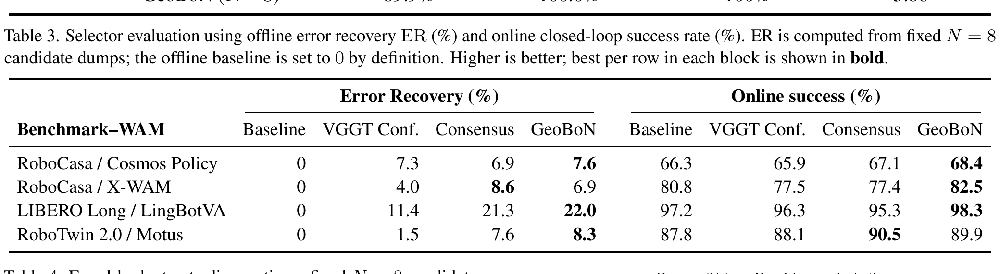
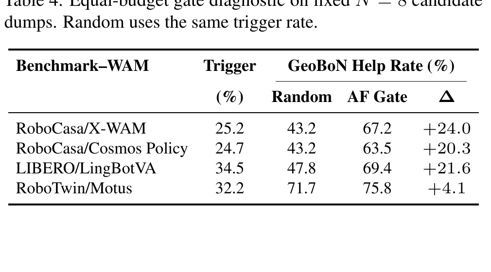
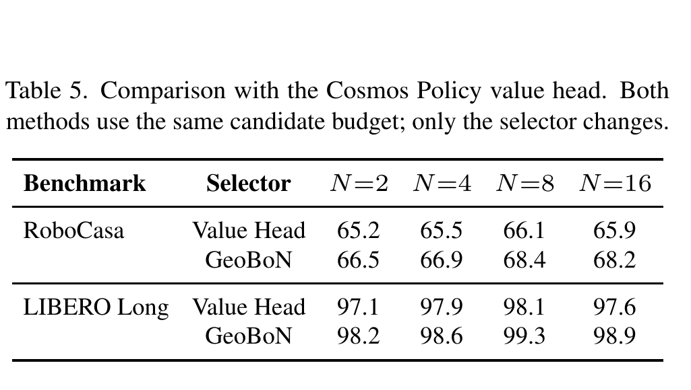

# Test-Time Scaling for World Action Models via Zero-Shot Geometric Evaluation

**Authors:** Zesen Zhao; Minkyoung Cho; Hui Shen; Boyuan Zheng; Kunxiao Gao; Yulong Cao; Z. Morley Mao  
**Affiliations:** University of Michigan; NVIDIA  
**Canonical metadata title:** *Test-Time Scaling for World Action Models via Zero-Shot Geometric Evaluation*  
**Rendered PDF title:** *Test-Time Scaling for World Action Models via Zero-Shot Geometric Verification*  
**Version:** arXiv:2607.17454v1, 20 July 2026  
**DOI:** 10.48550/arXiv.2607.17454  
**Source format:** selectable-text PDF (`pdf-text`), 8 pages  
**Reader type:** complete paragraph-level English–Chinese reader. `detailed_paper.md` is authoritative; `paper.md` is its exact byte-identical copy.  

> **Title provenance note / 标题溯源说明：** The canonical folder and metadata follow the Zotero record, filename, embedded PDF metadata, and DOI title, which use “Evaluation”. The title visibly typeset on page 1 instead uses “Verification”. This reader preserves both forms rather than silently normalizing the discrepancy. / 规范文件夹与元数据沿用 Zotero 条目、文件名、PDF 内嵌元数据及 DOI 所使用的 “Evaluation”；但第 1 页实际排印标题为 “Verification”。本读者保留并解释两种形式，不对这一差异作静默归一化。

## Page / Section Index

| PDF page | Content |
|---:|---|
| 1 | Title, Abstract, §1 Introduction |
| 2 | Figure 1, end of §1, §2 Related Work, §3 Method, §3.1 begins |
| 3 | §3.1, §3.2, Eqs. (2)–(5), §3.3, §4, §4.1, §4.2 begins |
| 4 | Table 1, §4.2, §4.3, §4.4 begins |
| 5 | Tables 2–4, Figure 2, §4.4 |
| 6 | Table 5, §4.5, Figure 3, §5 Conclusion |
| 7–8 | References [1]–[29] |

## Terminology Ledger

| Canonical term | 中文 | Definition / decision |
|---|---|---|
| World Action Model (WAM) | 世界动作模型 | A model jointly exposing predicted future observations and action chunks; retain “WAM” after first use. |
| test-time scaling | 测试时扩展 | Spending additional inference computation through candidate sampling and selection. |
| GeoBoN | GeoBoN | Fixed-budget geometric Best-of-$N$ selector; method name is not translated. |
| Gated GeoBoN | 门控 GeoBoN | Selective two-stage framework combining the action–future gate and GeoBoN. |
| action–future consistency gate | 动作—未来一致性门 | Cheap trigger based on agreement between optical flow and projected end-effector motion. |
| cross-view depth reprojection inconsistency | 跨视角深度重投影不一致性 | Selector score between predicted primary- and wrist-view futures. |
| VGGT-$\Omega$ | VGGT-$\Omega$ | Frozen geometry foundation model; exact notation retained. |
| Best-of-$N$ (BoN) | $N$ 选优 | Sampling $N$ rollouts and selecting one by a score. |
| error recovery (ER) | 误差恢复率 | Offline selector diagnostic; retain “ER”. |
| false low-score selection | 伪低分选择 | Spurious selection of a near-duplicate candidate assigned an unusually low reprojection score. |
| full-gain recovery | 全增益恢复率 | Fraction of always-on GeoBoN success gain retained by gating. |
| AF Gate | 动作—未来门 | Table shorthand for the action–future gate. |

## Abstract

> <strong>Para. 1:</strong> Test-time scaling improves foundation-model inference by spending additional computation, but robot control requires deciding whether extra compute is useful before executing an action. World Action Models (WAMs) make this decision natural: each rollout exposes both an action chunk and predicted future observations. We propose **Gated GeoBoN**, a training-free selective test-time scaling framework for WAMs. We first instantiate **GeoBoN**, a fixed-budget Best-of-$N$ selector that ranks sampled rollouts by cross-view depth reprojection consistency of their predicted futures, computed with a frozen geometry foundation model. Gated GeoBoN adds a lightweight action–future consistency gate that invokes GeoBoN only when the initial rollout appears internally inconsistent. Across five benchmark–backbone settings on RoboCasa, LIBERO Long, and RoboTwin 2.0, fixed-budget GeoBoN improves $N=8$ task success in every setting, e.g., raising the RoboCasa group average from 66.3% to 68.4% with Cosmos Policy and from 80.8% to 82.5% with X-WAM. With gating enabled, Gated GeoBoN recovers on average 74.8% of the always-on success gain while triggering additional sampling on only 26.2% of decision points. Offline diagnostics show that cross-view reprojection is a strong task-label-free selector, and we identify false low-score selections as a failure mode that helps explain why performance can saturate or degrade as $N$ increases.

> <strong>Para. 1[CN]:</strong> 测试时扩展通过投入额外计算来改善基础模型推理，但机器人控制必须在执行动作之前判断额外计算是否有用。世界动作模型（WAM）使这一决策变得自然：每次 rollout 都同时给出一个动作块和预测的未来观测。我们提出 **Gated GeoBoN**，一种面向 WAM、无需训练的选择性测试时扩展框架。我们首先实例化 **GeoBoN**：它是固定预算的 $N$ 选优选择器，利用冻结的几何基础模型计算预测未来的跨视角深度重投影一致性，并据此对采样 rollout 排序。Gated GeoBoN 进一步加入轻量的动作—未来一致性门，仅当初始 rollout 表现出内部不一致时才调用 GeoBoN。在 RoboCasa、LIBERO Long 和 RoboTwin 2.0 上的五种基准—骨干设置中，固定预算 GeoBoN 在每种设置下都提升了 $N=8$ 的任务成功率；例如，RoboCasa 组平均成功率在 Cosmos Policy 上从 66.3% 提升到 68.4%，在 X-WAM 上从 80.8% 提升到 82.5%。启用门控后，Gated GeoBoN 平均恢复了始终启用方案成功增益的 74.8%，同时仅在 26.2% 的决策点触发额外采样。离线诊断表明，跨视角重投影是一种强的、无需任务标签的选择信号；我们还识别出“伪低分选择”这一失败模式，它有助于解释为何性能会随 $N$ 增大而饱和或下降。

## 1. Introduction / 引言

> <strong>Para. 1:</strong> World Action Models (WAMs) have recently emerged as a promising paradigm for visuomotor control by jointly predicting future visual observations and action chunks from multi-view observations and language instructions [8, 11, 25]. Unlike action-only policies, a WAM exposes both a candidate action sequence and its predicted visual consequences before execution, creating an opportunity for test-time selection: the robot can inspect whether the imagined future is internally consistent, rather than comparing actions alone.

> <strong>Para. 1[CN]:</strong> 世界动作模型（WAM）近来成为视觉运动控制中一种很有前景的范式：它根据多视角观测和语言指令，联合预测未来视觉观测与动作块 [8, 11, 25]。不同于仅输出动作的策略，WAM 会在执行前同时暴露候选动作序列及其预测的视觉后果，从而为测试时选择创造机会：机器人可以检查想象的未来是否具有内部一致性，而不只是比较动作本身。

> <strong>Para. 2:</strong> Test-time scaling has become an effective inference-time strategy in language models [18, 22–24], and robotic policies have begun to adopt a similar candidate-generation-and-selection paradigm using learned reward models, model-internal confidence signals, verifier objectives, or consistency criteria [4, 7, 9, 14, 17]. However, these methods often either spend a fixed sampling budget at every decision point, or rely on selection signals that are trained, model-internal, or tied to a particular policy interface. This raises a basic question for WAM inference: when should the robot spend extra computation, and how should it choose among the sampled futures?

> <strong>Para. 2[CN]:</strong> 测试时扩展已经成为语言模型中有效的推理时策略 [18, 22–24]；机器人策略也开始采用类似的候选生成—选择范式，所依据的信号包括学习式奖励模型、模型内部置信度、验证器目标或一致性准则 [4, 7, 9, 14, 17]。然而，这些方法往往要么在每个决策点都花费固定采样预算，要么依赖经过训练、位于模型内部或绑定于特定策略接口的选择信号。这为 WAM 推理提出了一个基本问题：机器人应当何时投入额外计算，又应如何在采样得到的未来之间作出选择？

> <strong>Para. 3:</strong> We propose a training-free two-stage consistency framework for selective test-time scaling of WAMs. The key idea is to audit the rollout using signals already exposed by WAM inference. A WAM rollout can fail along two axes: the generated action may disagree with the future imagined by the model, or the predicted futures from different camera views may fail to correspond to a single coherent 3D scene. These two checks have different costs. Action–future agreement can be tested cheaply from optical flow and projected end-effector motion, so we use it as a per-step gate. Cross-view geometric agreement requires running a geometry model on predicted frames, so we reserve it for selecting among candidates only when the cheap gate flags the initial rollout as unreliable. Concretely, if the gate finds the initial rollout consistent, the policy executes it directly; otherwise it samples additional rollouts, and a frozen VGGT-$\Omega$ [20] geometry model ranks the candidates by a cross-view depth reprojection inconsistency score computed between the predicted primary-view and wrist-view future frames. Both stages operate directly on predicted images, generated actions, and proprioception, without task success labels, ground-truth future observations, online environment rollouts, or WAM-specific value heads.

> <strong>Para. 3[CN]:</strong> 我们提出一种无需训练的两阶段一致性框架，用于 WAM 的选择性测试时扩展。核心思想是使用 WAM 推理本身已经暴露的信号来审计 rollout。WAM rollout 可能沿两个维度失败：生成动作可能与模型想象的未来不一致；不同相机视角预测的未来也可能无法对应到同一个连贯的三维场景。这两项检查的成本不同。动作—未来一致性可由光流与投影末端执行器运动低成本检验，因此我们将其用作逐步门控。跨视角几何一致性则需要在预测帧上运行几何模型，因此仅当低成本门将初始 rollout 标记为不可靠时，才用它在候选之间作选择。具体而言，如果门判断初始 rollout 一致，策略就直接执行它；否则，策略采样额外 rollout，并由冻结的 VGGT-$\Omega$ [20] 几何模型，根据预测主视角与腕部视角未来帧之间的跨视角深度重投影不一致性分数对候选排序。两个阶段都直接作用于预测图像、生成动作和本体感知，不需要任务成功标签、真实未来观测、在线环境 rollout 或 WAM 专用价值头。

### Figure 1. Gated GeoBoN overview / Gated GeoBoN 总览

**Caption:** The action–future gate decides whether the initial WAM rollout is reliable enough to execute directly; when it triggers, GeoBoN samples additional rollouts and selects the candidate with the lowest cross-view depth reprojection inconsistency.

**Caption[CN]:** 动作—未来门判断初始 WAM rollout 是否足够可靠、可直接执行；当门被触发时，GeoBoN 采样额外 rollout，并选择跨视角深度重投影不一致性最低的候选。

> <strong>Para. 4:</strong> In summary, we (i) identify cross-view geometric consistency as a training-free signal for ranking WAM rollouts and propose GeoBoN, a fixed-budget Best-of-$N$ selector; (ii) introduce an action–future consistency gate for selective test-time scaling, yielding Gated GeoBoN, which allocates additional sampling only when the initial rollout appears internally inconsistent; and (iii) validate the framework through closed-loop evaluations and offline diagnostics across multiple manipulation benchmarks and WAM backbones.

> <strong>Para. 4[CN]:</strong> 总而言之，我们：（i）将跨视角几何一致性识别为一种无需训练的 WAM rollout 排序信号，并提出固定预算的 $N$ 选优选择器 GeoBoN；（ii）为选择性测试时扩展引入动作—未来一致性门，形成 Gated GeoBoN，仅在初始 rollout 呈现内部不一致时分配额外采样；（iii）通过多个操作基准和 WAM 骨干上的闭环评估与离线诊断验证该框架。

## 2. Related Work / 相关工作

> <strong>Para. 1:</strong> **World Action Models and imagined futures.** WAMs jointly model robot actions and future observations, exposing an imagined rollout before execution. Cosmos Policy [8] and DreamZero [25] build on video-generation backbones, LingBotVA [11] studies causal video-action world modeling, and Motus [1] and MotuBrain [15] unify understanding, action, and video generation in latent-action world models. Recent 4D and video-action WAMs make future representations more explicit, including multiview RGB-D prediction in X-WAM [6] and unified action-conditioned evaluation in $\tau_0$-WM [29]. These works improve the WAM backbone itself. Our work is orthogonal: given an existing multi-view WAM, we ask how its imagined futures can be used as training-free evidence for test-time selection.

> <strong>Para. 1[CN]:</strong> **世界动作模型与想象未来。** WAM 联合建模机器人动作与未来观测，在执行前暴露想象 rollout。Cosmos Policy [8] 与 DreamZero [25] 基于视频生成骨干；LingBotVA [11] 研究因果视频—动作世界建模；Motus [1] 与 MotuBrain [15] 则在潜动作世界模型中统一理解、动作和视频生成。近期的 4D 与视频—动作 WAM 使未来表示更加显式，包括 X-WAM [6] 中的多视角 RGB-D 预测，以及 $\tau_0$-WM [29] 中统一的动作条件评估。这些工作改进的是 WAM 骨干本身。我们的工作与之正交：给定现有多视角 WAM，我们追问如何把其想象未来用作无需训练的测试时选择证据。

> <strong>Para. 2:</strong> **Test-time scaling and rollout selection.** Robotic policies increasingly adopt the sample-and-select paradigm of test-time scaling [18, 22–24]: RoboMonkey uses a trained VLM-based verifier [9], RoVer a robot process reward model [4], MG-Select model-internal masked-distribution signals [7], and WAV forward–inverse asymmetry of world-model predictions [14]. For WAMs, concurrent work introduces future-consensus selection as a value-free fixed-budget selector [17]. These methods typically rely on a fixed sampling budget, a learned reward or verifier, or a model/interface-specific signal. In contrast, our method uses WAM-exposed consistency signals for selective inference: action–future consistency decides whether extra candidates are needed, and cross-view geometric consistency selects among them.

> <strong>Para. 2[CN]:</strong> **测试时扩展与 rollout 选择。** 机器人策略越来越多地采用测试时扩展的采样—选择范式 [18, 22–24]：RoboMonkey 使用训练过的 VLM 验证器 [9]，RoVer 使用机器人过程奖励模型 [4]，MG-Select 使用模型内部的掩码分布信号 [7]，WAV 则使用世界模型预测的前向—逆向非对称性 [14]。针对 WAM，同期工作提出未来共识选择，作为无需价值函数的固定预算选择器 [17]。这些方法通常依赖固定采样预算、学习式奖励/验证器，或模型/接口特定信号。相比之下，我们的方法利用 WAM 暴露的一致性信号进行选择性推理：动作—未来一致性决定是否需要额外候选，跨视角几何一致性则负责在候选中选择。

> <strong>Para. 3:</strong> **Adaptive and efficient WAM inference.** A growing line of work reduces the cost of WAM-style future reasoning by questioning whether explicit imagination is always necessary [26], adapting the video denoising trajectory [19], comparing imagined and real observations after partial rollout [21], or via caching, compact backbones, and horizon-adaptive modeling [2, 10, 12, 28]. These methods mainly optimize the WAM architecture, denoising process, or execution horizon; our setting is complementary: before executing the current action chunk, we decide whether additional samples are worth drawing, and if so select among them with a frozen geometric evaluator.

> <strong>Para. 3[CN]:</strong> **自适应且高效的 WAM 推理。** 越来越多的工作通过以下方式降低 WAM 式未来推理的成本：质疑显式想象是否总有必要 [26]、调整视频去噪轨迹 [19]、在部分 rollout 后比较想象观测与真实观测 [21]，或采用缓存、紧凑骨干及自适应时域建模 [2, 10, 12, 28]。这些方法主要优化 WAM 架构、去噪过程或执行时域；我们的设置与其互补：在执行当前动作块之前，判断是否值得抽取额外样本，并在值得时使用冻结的几何评估器从中选择。

## 3. Method / 方法

> <strong>Para. 1:</strong> WAM inference receives multi-view observations, proprioception, and a language instruction, and stochastically generates a visual–action rollout. We denote the $i$-th sampled rollout as

> <strong>Para. 1[CN]:</strong> WAM 推理接收多视角观测、本体感知和语言指令，并随机生成视觉—动作 rollout。我们将第 $i$ 个采样 rollout 表示为

$$
\tau_i = \left(\hat{I}^{i}_{\mathrm{pri}},\hat{I}^{i}_{\mathrm{wri}},a_{i,1:H}\right),
\tag{1}
$$

> <strong>Para. 2:</strong> where $\hat{I}^{i}_{\mathrm{pri}}$ and $\hat{I}^{i}_{\mathrm{wri}}$ are the predicted future frames used for scoring from the primary and wrist views, and $a_{i,1:H}$ is the generated action chunk over horizon $H$. Our method uses two consistency signals: an action–future gate that decides whether additional candidates should be sampled, and a cross-view geometric evaluator that ranks candidates in the resulting candidate set (Figure 1).

> <strong>Para. 2[CN]:</strong> 其中，$\hat{I}^{i}_{\mathrm{pri}}$ 与 $\hat{I}^{i}_{\mathrm{wri}}$ 分别是用于评分的主视角和腕部视角预测未来帧，$a_{i,1:H}$ 是跨时域 $H$ 生成的动作块。我们的方法使用两种一致性信号：动作—未来门决定是否应采样额外候选，跨视角几何评估器则对所形成候选集中的候选排序（Figure 1）。

### 3.1. Action–Future Gate for Selective Sampling / 用于选择性采样的动作—未来门

> <strong>Para. 1:</strong> The gate tests whether the generated action is consistent with the motion visible in the predicted future. Given $\tau_1$, we compute dense optical flow $F_1$ between the current primary-view observation $I_t^{\mathrm{pri}}$ and the predicted future frame $\hat{I}_1^{\mathrm{pri}}$.

> <strong>Para. 1[CN]:</strong> 该门检验生成动作是否与预测未来中可见的运动一致。给定 $\tau_1$，我们在当前主视角观测 $I_t^{\mathrm{pri}}$ 与预测未来帧 $\hat{I}_1^{\mathrm{pri}}$ 之间计算稠密光流 $F_1$。

> <strong>Para. 2:</strong> For each arm $r$, let $x_{r,0}$ be the current end-effector position from proprioception, and $x_{1,r,H}$ the position after applying the generated action chunk (via forward kinematics for joint-position actions, or accumulated displacement for delta actions). Projecting both endpoints into the primary camera gives

> <strong>Para. 2[CN]:</strong> 对每条机械臂 $r$，令 $x_{r,0}$ 为本体感知给出的当前末端执行器位置，$x_{1,r,H}$ 为应用生成动作块后的位置（关节位置动作使用正向运动学，增量动作使用累积位移）。将两个端点投影到主相机可得

$$
\Delta \mathbf{u}_{1,r}=\pi_{\mathrm{pri}}(x_{1,r,H})-\pi_{\mathrm{pri}}(x_{r,0}).
\tag{2}
$$

> <strong>Para. 3:</strong> We ignore arms whose 3D displacement is below an idle threshold. For each moving arm, we average the optical flow inside a capsule-shaped region $\mathcal{M}_{1,r}$ around the projected end-effector trajectory:

> <strong>Para. 3[CN]:</strong> 我们忽略三维位移低于静止阈值的机械臂。对每条运动中的机械臂，我们在投影末端执行器轨迹周围的胶囊形区域 $\mathcal{M}_{1,r}$ 内对光流取平均：

$$
\bar{\mathbf{f}}_{1,r}=\frac{1}{|\mathcal{M}_{1,r}|}\sum_{p\in\mathcal{M}_{1,r}}F_1(p),
\tag{3}
$$

> <strong>Para. 4:</strong> and compute the cosine agreement between predicted visual motion and projected action motion:

> <strong>Para. 4[CN]:</strong> 然后计算预测视觉运动与投影动作运动之间的余弦一致性：

$$
c_{1,r}=\frac{\bar{\mathbf{f}}_{1,r}^{\top}\Delta\mathbf{u}_{1,r}}{\|\bar{\mathbf{f}}_{1,r}\|_2\|\Delta\mathbf{u}_{1,r}\|_2+\epsilon}.
\tag{4}
$$

> <strong>Para. 5:</strong> The gate triggers if any moving arm has $c_{1,r}<\tau_{\mathrm{gate}}$; otherwise, or if no arm remains after idle filtering, the policy executes the initial action chunk. When triggered, the policy samples $N_{\max}-1$ additional rollouts, retains the original in the candidate set, and ranks the candidates with the cross-view geometric evaluator.

> <strong>Para. 5[CN]:</strong> 若任一运动机械臂满足 $c_{1,r}<\tau_{\mathrm{gate}}$，门就被触发；否则，或者静止过滤后没有机械臂保留下来，策略便执行初始动作块。触发后，策略额外采样 $N_{\max}-1$ 个 rollout，将原始 rollout 保留在候选集中，再由跨视角几何评估器对候选排序。

### 3.2. Cross-View Geometric Evaluator / 跨视角几何评估器

> <strong>Para. 1:</strong> For each candidate $\tau_i$, we feed the predicted frame pair $(\hat{I}^{i}_{\mathrm{pri}},\hat{I}^{i}_{\mathrm{wri}})$ into frozen VGGT-$\Omega$. Let $d_i^{\mathrm{vggt}}(p)$ denote the depth predicted directly for the primary image at pixel $p$. Using the camera geometry estimated by VGGT-$\Omega$, we project the wrist-view 3D point map into the primary camera frame, yielding a projected depth $d_i^{\mathrm{proj}}(p)$. The cross-view depth reprojection inconsistency is

> <strong>Para. 1[CN]:</strong> 对每个候选 $\tau_i$，我们将预测帧对 $(\hat{I}^{i}_{\mathrm{pri}},\hat{I}^{i}_{\mathrm{wri}})$ 输入冻结的 VGGT-$\Omega$。令 $d_i^{\mathrm{vggt}}(p)$ 表示在像素 $p$ 处直接为主视角图像预测的深度。利用 VGGT-$\Omega$ 估计的相机几何，我们把腕部视角三维点图投影到主相机坐标系，得到投影深度 $d_i^{\mathrm{proj}}(p)$。跨视角深度重投影不一致性定义为

$$
e_{\mathrm{depth}}(\tau_i)=\frac{1}{|\Omega_i|}\sum_{p\in\Omega_i}\left|\log\frac{d_i^{\mathrm{proj}}(p)}{d_i^{\mathrm{vggt}}(p)}\right|.
\tag{5}
$$

> <strong>Para. 2:</strong> Here $\Omega_i$ contains pixels whose projected points fall inside the primary image with positive depths and VGGT-$\Omega$ confidence above a threshold $\gamma_{\mathrm{conf}}$; candidates with an empty valid set receive a large score. The logarithmic ratio reduces sensitivity to absolute depth scale. When selection is invoked, we execute the action chunk of the candidate with the lowest inconsistency.

> <strong>Para. 2[CN]:</strong> 其中，$\Omega_i$ 包含投影点落在主视角图像内部、深度为正且 VGGT-$\Omega$ 置信度高于阈值 $\gamma_{\mathrm{conf}}$ 的像素；有效集合为空的候选会被赋予一个很大的分数。对数比值降低了对绝对深度尺度的敏感性。调用选择时，我们执行不一致性最低候选的动作块。

### 3.3. Inference Procedure / 推理流程

> <strong>Para. 1:</strong> At each control step, the WAM first generates an initial rollout $\tau_1$. We instantiate three inference modes. The **baseline** executes $a_{1,1:H}$ directly, without additional sampling or geometric scoring. **Fixed-budget GeoBoN** always samples a candidate set $\mathcal{C}_N=\{\tau_i\}_{i=1}^{N}$ and selects the rollout with the lowest cross-view reprojection inconsistency, $i^\star=\arg\min_{\tau_i\in\mathcal{C}_N}e_{\mathrm{depth}}(\tau_i)$, executing $a_{i^\star,1:H}$. **Gated GeoBoN** first applies the action–future gate from Sec. 3.1 to the initial rollout: if the gate does not trigger, it executes $a_{1,1:H}$ directly; if it triggers, it samples $N_{\max}-1$ additional rollouts, forms $\mathcal{C}_{N_{\max}}$ including the initial rollout, and applies the same geometric selection rule.

> <strong>Para. 1[CN]:</strong> 在每个控制步，WAM 首先生成初始 rollout $\tau_1$。我们实例化三种推理模式。**Baseline** 直接执行 $a_{1,1:H}$，不做额外采样或几何评分。**固定预算 GeoBoN** 总是采样候选集 $\mathcal{C}_N=\{\tau_i\}_{i=1}^{N}$，选择跨视角重投影不一致性最低的 rollout，即 $i^\star=\arg\min_{\tau_i\in\mathcal{C}_N}e_{\mathrm{depth}}(\tau_i)$，并执行 $a_{i^\star,1:H}$。**Gated GeoBoN** 首先对初始 rollout 应用 §3.1 的动作—未来门：若门未触发，直接执行 $a_{1,1:H}$；若触发，则额外采样 $N_{\max}-1$ 个 rollout，形成包含初始 rollout 的 $\mathcal{C}_{N_{\max}}$，再应用相同的几何选择规则。

## 4. Experiments / 实验

> <strong>Para. 1:</strong> We evaluate the framework along four axes: whether cross-view geometric evaluation improves task success under fixed-budget Best-of-$N$ inference; whether the action–future gate reduces sampling cost while preserving much of the always-on gain; whether reprojection and the gate are informative signals compared to alternatives; and why large Best-of-$N$ budgets can saturate or degrade under evaluator noise.

> <strong>Para. 1[CN]:</strong> 我们沿四个维度评估该框架：跨视角几何评估能否在固定预算 $N$ 选优推理下提高任务成功率；动作—未来门能否在保留大部分始终启用增益的同时降低采样成本；与替代方案相比，重投影和门是否提供有效信号；以及为何较大的 $N$ 选优预算会在评估器噪声下饱和或退化。

### 4.1. Experimental Setup / 实验设置

> <strong>Para. 1:</strong> We evaluate on RoboCasa [16], LIBERO Long [13], and RoboTwin 2.0 [3], using Cosmos Policy [8], X-WAM [6], LingBotVA [11], and Motus [1] as WAM backbones. All experiments are training-free: we use publicly available checkpoints and their default evaluation setups without fine-tuning, on H200 and RTX Pro 6000 GPU nodes. We evaluate each benchmark–backbone setting with four random seeds, using the standard 50 rollouts per task per seed on LIBERO Long and 10 rollouts per task per seed on RoboCasa and RoboTwin 2.0; success rates are averaged over seeds. The gate uses Farneback optical flow [5] with idle threshold $\delta_{\mathrm{idle}}=1\,\mathrm{cm}$, cosine threshold $\tau_{\mathrm{gate}}=-0.2$, capsule radius $\rho_{\mathrm{cap}}=30$ pixels, and VGGT-$\Omega$ confidence threshold $\gamma_{\mathrm{conf}}=0.5$; all thresholds are fixed across experiments.

> <strong>Para. 1[CN]:</strong> 我们在 RoboCasa [16]、LIBERO Long [13] 和 RoboTwin 2.0 [3] 上评估，并使用 Cosmos Policy [8]、X-WAM [6]、LingBotVA [11] 与 Motus [1] 作为 WAM 骨干。所有实验均无需训练：在 H200 和 RTX Pro 6000 GPU 节点上使用公开 checkpoint 及其默认评估设置，不进行微调。每种基准—骨干设置使用四个随机种子；LIBERO Long 每任务每种子采用标准的 50 个 rollout，RoboCasa 与 RoboTwin 2.0 每任务每种子采用 10 个 rollout；成功率在种子间取平均。门使用 Farneback 光流 [5]，固定参数为静止阈值 $\delta_{\mathrm{idle}}=1\,\mathrm{cm}$、余弦阈值 $\tau_{\mathrm{gate}}=-0.2$、胶囊半径 $\rho_{\mathrm{cap}}=30$ 像素，以及 VGGT-$\Omega$ 置信度阈值 $\gamma_{\mathrm{conf}}=0.5$；所有实验均使用同一组阈值。

### 4.2. Fixed-Budget GeoBoN / 固定预算 GeoBoN

> <strong>Para. 1:</strong> We compare single-rollout inference against fixed-budget GeoBoN with $N\in\{2,4,8,16\}$. Since X-WAM provides a native depth prediction head, X-WAM experiments use its own predicted depth for reprojection scoring rather than an external depth foundation model.

> <strong>Para. 1[CN]:</strong> 我们将单 rollout 推理与 $N\in\{2,4,8,16\}$ 的固定预算 GeoBoN 比较。由于 X-WAM 自带原生深度预测头，X-WAM 实验使用其自身预测深度进行重投影评分，而不是使用外部深度基础模型。

### Table 1. GeoBoN success rate / GeoBoN 成功率

**Caption:** GeoBoN success rate (%). Bold indicates the best fixed-budget result in each row. The last column reports the paired improvement of the main fixed-budget setting ($N=8$) over the baseline; brackets denote 95% confidence intervals.

**Caption[CN]:** GeoBoN 成功率（%）。粗体表示每行最佳固定预算结果。最后一列报告主要固定预算设置（$N=8$）相对 baseline 的配对提升；方括号表示 95% 置信区间。

| Benchmark / Task Group | WAM | Baseline | $N=2$ | $N=4$ | $N=8$ | $N=16$ | $\Delta$ $N=8$ vs. Base (95% CI) |
|---|---|---:|---:|---:|---:|---:|---:|
| **RoboCasa [16] — Door/Drawer Manipulation** | Cosmos Policy | 89.8 | 88.7 | 90.2 | 90.8 | **91.2** | +1.0 [−2.6, +4.6] |
| RoboCasa — Pick-and-Place | Cosmos Policy | 47.2 | **49.2** | 47.9 | 49.0 | 48.1 | +1.8 [−2.1, +7.7] |
| RoboCasa — Appliance Control | Cosmos Policy | 79.9 | 79.3 | 81.0 | **82.6** | 82.3 | +2.7 [−2.0, +7.4] |
| RoboCasa — Coffee Making | Cosmos Policy | 38.3 | 38.7 | 38.5 | 42.0 | **42.9** | +3.7 [−3.0, +13.0] |
| RoboCasa — **Group avg.** | Cosmos Policy | 66.3 | 66.5 | 66.9 | **68.4** | 68.2 | +2.1 [+0.6, +7.3] |
| RoboCasa — Door/Drawer Manipulation | X-WAM | 96.7 | 89.7 | **92.7** | 92.1 | 88.7 | −4.6 [−6.9, −2.9] |
| RoboCasa — Pick-and-Place | X-WAM | 68.8 | 70.5 | 71.0 | 70.4 | **73.2** | +1.6 [−6.6, +9.8] |
| RoboCasa — Appliance Control | X-WAM | 84.3 | 84.4 | 81.0 | **87.5** | 83.4 | +3.2 [−2.3, +8.8] |
| RoboCasa — Coffee Making | X-WAM | 73.3 | 86.3 | 87.7 | 83.7 | **92.0** | +10.4 [−2.8, +24.5] |
| RoboCasa — **Group avg.** | X-WAM | 80.8 | 81.3 | 81.4 | **82.5** | 82.4 | +1.7 [+0.3, +2.6] |
| **LIBERO Long [13]** | Cosmos Policy | 97.5 | 98.2 | 98.6 | **99.3** | 98.9 | +1.8 [+0.4, +2.2] |
| LIBERO Long | LingBotVA [11] | 97.2 | 97.8 | 98.0 | 98.3 | **99.1** | +1.1 [+0.2, +1.5] |
| **RoboTwin 2.0 [3]** | Motus [1] | 87.8 | 88.3 | 88.5 | **89.9** | 89.5 | +2.1 [+0.2, +3.4] |

> <strong>Para. 2:</strong> Across all benchmark–WAM settings in Table 1, GeoBoN improves the main $N=8$ success rate over single-rollout inference. On RoboCasa, the task-count-weighted group average improves from 66.3% to 68.4% with Cosmos Policy and from 80.8% to 82.5% with X-WAM. Category-level results are mixed but informative: for X-WAM, Door/Drawer Manipulation drops from 96.7% to 92.1%, while Coffee Making increases from 73.3% to 83.7% at $N=8$ and 92.0% at $N=16$, suggesting that geometric reranking helps most when the task leaves room for rejecting implausible futures, but can hurt when the initial rollout is already strong. On LIBERO Long, GeoBoN improves Cosmos Policy from 97.5% to 99.3% and LingBotVA from 97.2% to 98.3% at $N=8$; on RoboTwin 2.0 with Motus, success improves from 87.8% to 89.9%. Notably, several settings saturate or slightly degrade at $N=16$: fixed-budget geometric selection is not strictly monotonic in the number of sampled candidates.

> <strong>Para. 2[CN]:</strong> 在 Table 1 的所有基准—WAM 设置中，GeoBoN 的主要 $N=8$ 成功率都高于单 rollout 推理。在 RoboCasa 上，按任务数加权的组平均成功率在 Cosmos Policy 上从 66.3% 提升到 68.4%，在 X-WAM 上从 80.8% 提升到 82.5%。类别级结果有升有降但很有信息量：对 X-WAM，Door/Drawer Manipulation 从 96.7% 降至 92.1%，而 Coffee Making 在 $N=8$ 时从 73.3% 升至 83.7%，在 $N=16$ 时达到 92.0%。这表明，当任务存在排除不合理未来的空间时，几何重排序最有帮助；但当初始 rollout 已很强时，它也可能造成损害。在 LIBERO Long 上，$N=8$ 时 GeoBoN 将 Cosmos Policy 从 97.5% 提升到 99.3%，将 LingBotVA 从 97.2% 提升到 98.3%；在使用 Motus 的 RoboTwin 2.0 上，成功率从 87.8% 提升到 89.9%。值得注意的是，若干设置在 $N=16$ 时饱和或略有下降：固定预算几何选择并不随候选数量严格单调改善。

### 4.3. Gated GeoBoN / 门控 GeoBoN

> <strong>Para. 1:</strong> Table 2 evaluates the full gate-and-evaluator procedure. The goal of Gated GeoBoN is to recover most of the always-on GeoBoN gain while avoiding unnecessary candidate sampling and geometric scoring. Across the five benchmark–WAM settings, the gate triggers additional Best-of-$N$ sampling on only 14.2–34.5% of decision points, while recovering 63.6–85.7% of the always-on GeoBoN success gain.

> <strong>Para. 1[CN]:</strong> Table 2 评估完整的门控—评估器流程。Gated GeoBoN 的目标是在避免不必要候选采样和几何评分的同时，恢复始终启用 GeoBoN 的大部分增益。在五种基准—WAM 设置中，门仅在 14.2–34.5% 的决策点触发额外的 $N$ 选优采样，却恢复了始终启用 GeoBoN 成功增益的 63.6–85.7%。

### Table 2. Gated GeoBoN efficiency / Gated GeoBoN 效率

**Caption:** Gated GeoBoN with $N_{\max}=8$. Full-gain recovery measures how much of the always-on GeoBoN success gain is retained.

**Caption[CN]:** $N_{\max}=8$ 的 Gated GeoBoN。全增益恢复率衡量始终启用 GeoBoN 的成功增益被保留了多少。

| Benchmark / WAM | Mode | Success Rate | Full-Gain Recovery | BoN Trigger (%) | Avg. Latency (s) |
|---|---|---:|---:|---:|---:|
| RoboCasa / Cosmos Policy | Baseline | 66.3% | 0.0% | 0% | 0.90 |
|  | Gated GeoBoN ($N=8$) | 67.9% | 76.2% | 24.7% | 1.29 |
|  | GeoBoN ($N=8$) | 68.4% | 100.0% | 100% | 3.65 |
| RoboCasa / X-WAM | Baseline | 80.8% | 0.0% | 0% | 2.68 |
|  | Gated GeoBoN ($N=8$) | 82.1% | 76.5% | 25.2% | 3.11 |
|  | GeoBoN ($N=8$) | 82.5% | 100.0% | 100% | 9.67 |
| LIBERO Long / Cosmos Policy | Baseline | 97.5% | 0.0% | 0% | 0.90 |
|  | Gated GeoBoN ($N=8$) | 98.8% | 72.2% | 14.2% | 0.96 |
|  | GeoBoN ($N=8$) | 99.3% | 100.0% | 100% | 3.66 |
| LIBERO Long / LingBotVA | Baseline | 97.2% | 0.0% | 0% | 2.27 |
|  | Gated GeoBoN ($N=8$) | 97.9% | 63.6% | 34.5% | 2.83 |
|  | GeoBoN ($N=8$) | 98.3% | 100.0% | 100% | 3.86 |
| RoboTwin 2.0 / Motus | Baseline | 87.8% | 0.0% | 0% | 2.29 |
|  | Gated GeoBoN ($N=8$) | 89.6% | 85.7% | 32.2% | 2.83 |
|  | GeoBoN ($N=8$) | 89.9% | 100.0% | 100% | 3.86 |

> <strong>Para. 2:</strong> Gated GeoBoN closely tracks the fixed-budget result at much lower latency. On RoboCasa, it improves success from 66.3% to 67.9% (Cosmos Policy) and from 80.8% to 82.1% (X-WAM) at roughly one-third of the always-on latency; on LIBERO Long with Cosmos Policy it reaches 98.8% with only a 14.2% trigger rate, and on RoboTwin 2.0 with Motus 89.6%, close to the always-on 89.9%. Overall, gating preserves most of the fixed-budget benefit at a fraction of the average cost.

> <strong>Para. 2[CN]:</strong> Gated GeoBoN 以低得多的延迟紧密追随固定预算结果。在 RoboCasa 上，它以约为始终启用方案三分之一的延迟，将成功率从 66.3% 提升到 67.9%（Cosmos Policy），并从 80.8% 提升到 82.1%（X-WAM）；在采用 Cosmos Policy 的 LIBERO Long 上，它仅以 14.2% 的触发率达到 98.8%；在采用 Motus 的 RoboTwin 2.0 上达到 89.6%，接近始终启用的 89.9%。总体而言，门控以一小部分平均成本保留了固定预算方案的大部分收益。

### 4.4. Selector and Gate Diagnostics / 选择器与门控诊断

> <strong>Para. 1:</strong> We ablate the two decisions made by our system: which rollout to select, and when to invoke additional sampling. Offline diagnostics use the same fixed $N=8$ candidate dumps.

> <strong>Para. 1[CN]:</strong> 我们对系统作出的两个决策进行消融：选择哪个 rollout，以及何时调用额外采样。离线诊断使用同一批固定 $N=8$ 候选 dump。

> <strong>Para. 2:</strong> **Selector ablation.** Table 3 compares our reprojection selector with two training-free alternatives: a VGGT-$\Omega$ confidence-based selector and a future-consensus selector adapted from [17] (reimplemented from the paper description, as the original implementation is not public). We evaluate each selector with offline error recovery (ER) and online closed-loop success. ER measures the fraction of the gap closed between the default first-candidate selector and a ground-truth-aware oracle, $\mathrm{ER}=(\mathrm{ADE}_{c_0}-\mathrm{ADE}_s)/(\mathrm{ADE}_{c_0}-\mathrm{ADE}_{\mathrm{oracle}})\times100$; the oracle is used only for offline analysis.

> <strong>Para. 2[CN]:</strong> **选择器消融。** Table 3 将我们的重投影选择器与两种无需训练的替代方案比较：基于 VGGT-$\Omega$ 置信度的选择器，以及由 [17] 改编的未来共识选择器（原实现未公开，因此根据论文描述重新实现）。我们以离线误差恢复率（ER）和在线闭环成功率评估每种选择器。ER 衡量默认首候选选择器与了解真实值的 oracle 之间差距被弥合的比例：$\mathrm{ER}=(\mathrm{ADE}_{c_0}-\mathrm{ADE}_s)/(\mathrm{ADE}_{c_0}-\mathrm{ADE}_{\mathrm{oracle}})\times100$；oracle 仅用于离线分析。

### Table 3. Selector evaluation / 选择器评估

**Caption:** Selector evaluation using offline error recovery ER (%) and online closed-loop success rate (%). ER is computed from fixed $N=8$ candidate dumps; the offline baseline is set to 0 by definition. Higher is better; best per row in each block is shown in bold.

**Caption[CN]:** 使用离线误差恢复率 ER（%）和在线闭环成功率（%）评估选择器。ER 从固定 $N=8$ 候选 dump 计算；离线 baseline 按定义设为 0。越高越好；每个分块中每行最佳值以粗体显示。

| Benchmark–WAM | ER: Baseline | ER: VGGT Conf. | ER: Consensus | ER: GeoBoN | Online: Baseline | Online: VGGT Conf. | Online: Consensus | Online: GeoBoN |
|---|---:|---:|---:|---:|---:|---:|---:|---:|
| RoboCasa / Cosmos Policy | 0 | 7.3 | 6.9 | **7.6** | 66.3 | 65.9 | 67.1 | **68.4** |
| RoboCasa / X-WAM | 0 | 4.0 | **8.6** | 6.9 | 80.8 | 77.5 | 77.4 | **82.5** |
| LIBERO Long / LingBotVA | 0 | 11.4 | 21.3 | **22.0** | 97.2 | 96.3 | 95.3 | **98.3** |
| RoboTwin 2.0 / Motus | 0 | 1.5 | 7.6 | **8.3** | 87.8 | 88.1 | **90.5** | 89.9 |

> <strong>Para. 3:</strong> Cross-view reprojection is the most consistent selector among the tested signals: it achieves the best offline ER in three of four settings, and is the only selector that improves online success over the baseline in all settings. Confidence-only ranking is unstable and often reduces online success, and consensus, while competitive in individual cases, is less consistent in closed loop. These results support reprojection inconsistency as the second-stage selector, while also showing that offline error recovery is only an approximate proxy for closed-loop success.

> <strong>Para. 3[CN]:</strong> 在所测试信号中，跨视角重投影是最稳定的选择器：它在四种设置中的三种取得最佳离线 ER，并且是唯一在所有设置中都相对 baseline 提高在线成功率的选择器。仅依赖置信度的排序不稳定，且经常降低在线成功率；共识信号虽在个别情形具有竞争力，但闭环表现不够一致。这些结果支持将重投影不一致性用作第二阶段选择器，同时也表明离线误差恢复只是闭环成功率的近似代理指标。

> <strong>Para. 4:</strong> **Gate ablation.** We next test whether the gate provides an informative compute-allocation signal rather than merely reducing the sampling budget. Defining $g=\mathrm{ADE}_{c_0}-\mathrm{ADE}_{\mathrm{GeoBoN}}$ so that $g>0$ means invoking GeoBoN helps, Table 4 compares the gate with a random trigger at the same trigger rate. The gate improves the GeoBoN help rate in all settings, with large gains on RoboCasa/X-WAM (67.2% vs. 43.2%), RoboCasa/Cosmos Policy (63.5% vs. 43.2%), and LIBERO/LingBotVA (69.4% vs. 47.8%), and a smaller gain on RoboTwin/Motus (75.8% vs. 71.7%): the signal is informative but not uniformly strong across domains.

> <strong>Para. 4[CN]:</strong> **门控消融。** 接下来，我们检验门是否提供了有信息量的计算分配信号，而不只是减少采样预算。定义 $g=\mathrm{ADE}_{c_0}-\mathrm{ADE}_{\mathrm{GeoBoN}}$，使得 $g>0$ 表示调用 GeoBoN 有帮助；Table 4 在相同触发率下比较门与随机触发。门在所有设置中都提高了 GeoBoN 帮助率：RoboCasa/X-WAM 为 67.2% 对 43.2%，RoboCasa/Cosmos Policy 为 63.5% 对 43.2%，LIBERO/LingBotVA 为 69.4% 对 47.8%，均有较大提升；RoboTwin/Motus 的提升较小，为 75.8% 对 71.7%。因此该信号具有信息量，但其强度并非在各领域均匀一致。

### Table 4. Equal-budget gate diagnostic / 等预算门控诊断

**Caption:** Equal-budget gate diagnostic on fixed $N=8$ candidate dumps. Random uses the same trigger rate.

**Caption[CN]:** 在固定 $N=8$ 候选 dump 上进行等预算门控诊断。Random 使用相同触发率。

| Benchmark–WAM | Trigger (%) | Random Help Rate (%) | AF Gate Help Rate (%) | $\Delta$ |
|---|---:|---:|---:|---:|
| RoboCasa/X-WAM | 25.2 | 43.2 | 67.2 | +24.0 |
| RoboCasa/Cosmos Policy | 24.7 | 43.2 | 63.5 | +20.3 |
| LIBERO/LingBotVA | 34.5 | 47.8 | 69.4 | +21.6 |
| RoboTwin/Motus | 32.2 | 71.7 | 75.8 | +4.1 |

### Table 5. Comparison with Cosmos Policy value head / 与 Cosmos Policy 价值头比较

**Caption:** Comparison with the Cosmos Policy value head. Both methods use the same candidate budget; only the selector changes.

**Caption[CN]:** 与 Cosmos Policy 价值头比较。两种方法使用相同候选预算；只有选择器不同。

| Benchmark | Selector | $N=2$ | $N=4$ | $N=8$ | $N=16$ |
|---|---|---:|---:|---:|---:|
| RoboCasa | Value Head | 65.2 | 65.5 | 66.1 | 65.9 |
| RoboCasa | GeoBoN | 66.5 | 66.9 | 68.4 | 68.2 |
| LIBERO Long | Value Head | 97.1 | 97.9 | 98.1 | 97.6 |
| LIBERO Long | GeoBoN | 98.2 | 98.6 | 99.3 | 98.9 |

> <strong>Para. 5:</strong> **Comparison to a model-specific value head.** We also compare GeoBoN with the Cosmos Policy value head, a model-specific learned selector, using identical candidate budgets. As shown in Table 5, GeoBoN consistently outperforms the value head across all budgets: by +1.3 to +2.3 percentage points on RoboCasa and +0.7 to +1.3 points on near-saturated LIBERO Long. Cross-view geometric consistency thus serves as a strong training-free alternative to model-internal value estimates, while remaining applicable to backbones without a learned value head.

> <strong>Para. 5[CN]:</strong> **与模型特定价值头比较。** 我们还在相同候选预算下，将 GeoBoN 与 Cosmos Policy 的模型特定学习式选择器——价值头——进行比较。如 Table 5 所示，GeoBoN 在所有预算下都持续优于价值头：RoboCasa 上高出 +1.3 至 +2.3 个百分点，在已接近饱和的 LIBERO Long 上高出 +0.7 至 +1.3 个百分点。因此，跨视角几何一致性是模型内部价值估计的一种强而无需训练的替代方案，并且仍可用于没有学习式价值头的骨干。

### 4.5. Best-of-$N$ Failure Analysis / $N$ 选优失败分析

> <strong>Para. 1:</strong> We further analyze why fixed-budget GeoBoN does not always improve with the candidate budget. A desirable evaluator should assign similar scores to visually near-identical futures, so we look for **false low-score selections**: cases where Best-of-$N$ selects a candidate with an unusually low reprojection error despite a near-duplicate rendering with no visible geometric difference. We identify near-duplicates via LPIPS [27] distance below 0.02, and mark a selection as false when its score is separated from a near-duplicate by more than the evaluator’s 95th-percentile duplicate-pair variation.

> <strong>Para. 1[CN]:</strong> 我们进一步分析为何固定预算 GeoBoN 并不总是随候选预算增加而改善。理想评估器应当为视觉上近乎相同的未来赋予相近分数，因此我们寻找**伪低分选择**：尽管某候选与一个视觉上没有可见几何差异的近重复渲染对应，$N$ 选优却因其异常低的重投影误差而选中它。我们使用低于 0.02 的 LPIPS [27] 距离识别近重复；当某候选分数与近重复样本的差异超过评估器重复对变化的第 95 百分位数时，将该选择标记为伪选择。

### Figure 2. False low-score selection rate / 伪低分选择率

**Caption:** False low-score selection rate as the candidate budget increases. Larger candidate pools create more opportunities for Best-of-$N$ to select a spurious low-reprojection outlier.

**Caption[CN]:** 随候选预算增大而变化的伪低分选择率。更大的候选池为 $N$ 选优选中虚假的低重投影误差离群点创造了更多机会。

| Candidate budget $N$ | 2 | 4 | 8 | 16 |
|---|---:|---:|---:|---:|
| False low-score selection rate | 7% | 10% | 12% | 32% |

> <strong>Para. 2:</strong> Figure 3 shows a representative case: the candidate futures are visually near-identical, but the evaluator assigns one a much lower reprojection error and Best-of-$N$ selects it. This failure mode grows with the candidate pool: the false low-score selection rate increases from 7% at $N=2$ to 12% at $N=8$ and 32% at $N=16$ (Fig. 2). This suggests a multiple-comparisons effect: larger pools raise the chance of finding a genuinely better rollout, but also of selecting a spurious outlier, explaining why GeoBoN saturates at larger $N$ and motivating moderate budgets with selective invocation.

> <strong>Para. 2[CN]:</strong> Figure 3 展示了一个代表性案例：候选未来在视觉上近乎相同，但评估器给其中一个分配了低得多的重投影误差，导致 $N$ 选优选中它。该失败模式随候选池扩大而加剧：伪低分选择率从 $N=2$ 时的 7% 上升到 $N=8$ 时的 12%，并在 $N=16$ 时达到 32%（Fig. 2）。这表明存在多重比较效应：更大的候选池既增加找到真正更优 rollout 的机会，也增加选中虚假离群点的机会，从而解释 GeoBoN 为何在较大 $N$ 下饱和，并支持采用适中预算与选择性调用。

### Figure 3. Representative false low-score selection / 代表性伪低分选择

**Caption:** Representative false low-score selection. The candidate futures are visually near-identical, but the geometric evaluator assigns one candidate an unusually low reprojection error and Best-of-$N$ selects it.

**Caption[CN]:** 代表性伪低分选择。候选未来在视觉上近乎相同，但几何评估器为其中一个候选赋予异常低的重投影误差，$N$ 选优因而选中它。

## 5. Conclusion / 结论

> <strong>Para. 1:</strong> We presented Gated GeoBoN, a training-free selective test-time scaling framework for World Action Models that uses the futures already exposed by WAM rollouts for inference-time decisions: action–future consistency decides when additional sampling is worth invoking, and cross-view geometric consistency ranks the sampled candidates. Across RoboCasa, LIBERO Long, and RoboTwin 2.0, fixed-budget GeoBoN improves Best-of-$N$ rollout selection across multiple WAM backbones, while Gated GeoBoN recovers much of the always-on gain at a substantially smaller sampling budget. Our diagnostics show that cross-view reprojection is a more consistent task-label-free selector than confidence-only scoring, that the gate provides an informative selective-compute signal, and that false low-score selections explain saturation at large $N$. These findings suggest that WAMs benefit not only from sampling more futures, but from using them to decide when more computation is needed.

> <strong>Para. 1[CN]:</strong> 我们提出 Gated GeoBoN：一种面向世界动作模型、无需训练的选择性测试时扩展框架，它利用 WAM rollout 已经暴露的未来作出推理时决策——动作—未来一致性决定何时值得调用额外采样，跨视角几何一致性则对采样候选排序。在 RoboCasa、LIBERO Long 和 RoboTwin 2.0 上，固定预算 GeoBoN 跨多个 WAM 骨干改进了 $N$ 选优 rollout 选择，而 Gated GeoBoN 以显著更小的采样预算恢复了始终启用方案的大部分增益。我们的诊断表明：跨视角重投影比仅置信度评分更稳定地充当无需任务标签的选择器；门提供了有信息量的选择性计算信号；伪低分选择则解释了较大 $N$ 下的饱和。这些发现说明，WAM 不仅受益于采样更多未来，也受益于使用这些未来判断何时需要更多计算。

## References / 参考文献

> **Reference policy / 参考文献策略：** The 29 entries are retained in searchable original bibliographic form. Titles and author names are not translated so identifiers and citation matching remain exact. / 以下 29 条文献保留为可检索的原始书目形式；不翻译标题与作者名，以保持标识符和引文匹配准确。

[1] Hongzhe Bi, Hengkai Tan, Shenghao Xie, Zeyuan Wang, Shuhe Huang, Haitian Liu, Ruowen Zhao, Yao Feng, Chendong Xiang, Yinze Rong, Hongyan Zhao, Hanyu Liu, Zhizhong Su, Lei Ma, Hang Su, and Jun Zhu. Motus: A unified latent action world model. *arXiv preprint arXiv:2512.13030*, 2025.

[2] Jisong Cai, Long Ling, Shiwei Chu, Zhongshan Liu, Jiayue Kang, Zhixuan Liang, Wenjie Xu, Yinan Mao, Weinan Zhang, Xiaokang Yang, Ru Ying, Ran Zheng, and Yao Mu. AHA-WAM: Asynchronous horizon-adaptive world-action modeling with observation-guided context routing. *arXiv preprint arXiv:2606.09811*, 2026.

[3] Tianxing Chen, Zanxin Chen, Baijun Chen, Zijian Cai, Yibin Liu, Zixuan Li, Qiwei Liang, Xianliang Lin, Yiheng Ge, Zhenyu Gu, Weiliang Deng, Yubin Guo, Tian Nian, Xuanbing Xie, Qiangyu Chen, Kailun Su, Tianling Xu, Guodong Liu, Mengkang Hu, Huan-ang Gao, Kaixuan Wang, Zhixuan Liang, Yusen Qin, Xiaokang Yang, Ping Luo, and Yao Mu. RoboTwin 2.0: A scalable data generator and benchmark with strong domain randomization for robust bimanual robotic manipulation. *arXiv preprint arXiv:2506.18088*, 2025.

[4] Mingtong Dai, Lingbo Liu, Yongjie Bai, Yang Liu, Zhouxia Wang, Rui Su, Chunjie Chen, Liang Lin, and Xinyu Wu. RoVer: Robot reward model as test-time verifier for vision-language-action model. *arXiv preprint arXiv:2510.10975*, 2025.

[5] Gunnar Farneback. Two-frame motion estimation based on polynomial expansion. In *Scandinavian Conference on Image Analysis*, pages 363–370. Springer, 2003.

[6] Jun Guo, Qiwei Li, Peiyan Li, Zilong Chen, Nan Sun, Yifei Su, Heyun Wang, Yuan Zhang, Xinghang Li, and Huaping Liu. X-WAM: Unified 4D world action modeling from video priors with asynchronous denoising. *arXiv preprint arXiv:2604.26694*, 2026.

[7] Suhyeok Jang, Dongyoung Kim, Changyeon Kim, Youngsuk Kim, and Jinwoo Shin. Verifier-Free Test-Time Sampling for Vision-Language-Action Models. In *International Conference on Learning Representations*, 2026.

[8] Moo Jin Kim, Yihuai Gao, Tsung-Yi Lin, Yen-Chen Lin, Yunhao Ge, Grace Lam, Percy Liang, Shuran Song, Ming-Yu Liu, Chelsea Finn, and Jinwei Gu. Cosmos Policy: Fine-tuning video models for visuomotor control and planning. *arXiv preprint arXiv:2601.16163*, 2026.

[9] Jacky Kwok, Christopher Agia, Rohan Sinha, Matt Foutter, Shulu Li, Ion Stoica, Azalia Mirhoseini, and Marco Pavone. RoboMonkey: Scaling test-time sampling and verification for vision-language-action models. In *Proceedings of The 9th Conference on Robot Learning*, pages 3200–3217. PMLR, 2025.

[10] Jiajun Li, Tiecheng Guo, Yifan Ye, Rongyu Zhang, Xiaowei Chi, Qianpu Sun, Ying Li, Yunfan Lou, Yan Huang, Zhihe Lu, Meng Guo, and Shanghang Zhang. Efficient-WAM: A 1B-parameter world-action model with low-cost future imagination. *arXiv preprint arXiv:2606.10040*, 2026.

[11] Lin Li, Qihang Zhang, Yiming Luo, Shuai Yang, Ruilin Wang, Fei Han, Mingrui Yu, Zelin Gao, Nan Xue, Xing Zhu, Yujun Shen, and Yinghao Xu. Causal World Modeling for Robot Control. *arXiv preprint arXiv:2601.21998*, 2026.

[12] Ziang Li, Dongzhou Cheng, Yibin Wang, Shiyue Wang, Xiaoyang Xu, Lingxuan Weng, Juan Wang, and Jiaqi Wang. Light-WAM: Efficient world action models with state-fusion action decoding. *arXiv preprint arXiv:2606.08242*, 2026.

[13] Bo Liu, Yifeng Zhu, Chongkai Gao, Yihao Feng, Qiang Liu, Yuke Zhu, and Peter Stone. LIBERO: Benchmarking knowledge transfer for lifelong robot learning. In *Advances in Neural Information Processing Systems*, 2023.

[14] Yuejiang Liu, Fan Feng, Lingjing Kong, Weifeng Lu, Jinzhou Tang, Kun Zhang, Kevin Murphy, Chelsea Finn, and Yilun Du. World Action Verifier: Self-improving world models via forward-inverse asymmetry. *arXiv preprint arXiv:2604.01985*, 2026.

[15] MotuBrain Team, Chendong Xiang, Fan Bao, Haitian Liu, Hengkai Tan, Hongzhe Bi, James Li, Jiabao Liu, Jingrui Pang, Kiro Jing, Louis Liu, Mengchen Cai, Rongxu Cui, Ruowen Zhao, Runqing Wang, Shuhe Huang, Yao Feng, Yinze Rong, Zeyuan Wang, and Jun Zhu. MotuBrain: An advanced world action model for robot control. *arXiv preprint arXiv:2604.27792*, 2026.

[16] Soroush Nasiriany, Abhiram Maddukuri, Lance Zhang, Adeet Parikh, Aaron Lo, Abhishek Joshi, Ajay Mandlekar, and Yuke Zhu. RoboCasa: Large-scale simulation of everyday tasks for generalist robots. *arXiv preprint arXiv:2406.02523*, 2024.

[17] Bo-Kai Ruan, Teng-Fang Hsiao, Ling Lo, and Hong-Han Shuai. Is the Future Compatible? Diagnosing Dynamic Consistency in World Action Models. *arXiv preprint arXiv:2605.07514*, 2026.

[18] Charlie Snell, Jaehoon Lee, Kelvin Xu, and Aviral Kumar. Scaling LLM test-time compute optimally can be more effective than scaling model parameters. In *International Conference on Learning Representations*, 2025.

[19] Yirui Sun, Guangyu Zhuge, Keliang Liu, Jie Gu, Xinyu Bing, Zhongxue Gan, and Chunxu Tian. SANTS: A state-adaptive scheduler for world action models. *arXiv preprint arXiv:2605.27947*, 2026.

[20] Jianyuan Wang, Minghao Chen, Shangzhan Zhang, Nikita Karaev, Johannes Schönberger, Patrick Labatut, Piotr Bojanowski, David Novotny, Andrea Vedaldi, and Christian Rupprecht. VGGT-$\Omega$. In *Proceedings of the IEEE/CVF Conference on Computer Vision and Pattern Recognition*, 2026.

[21] Rui Wang, Yue Zhang, Jiehong Lin, Kuncheng Luo, Jianan Wang, Zhongrui Wang, and Xiaojuan Qi. When to Trust Imagination: Adaptive action execution for world action models. *arXiv preprint arXiv:2605.06222*, 2026.

[22] Xuezhi Wang, Jason Wei, Dale Schuurmans, Quoc V. Le, Ed H. Chi, Sharan Narang, Aakanksha Chowdhery, and Denny Zhou. Self-consistency improves chain of thought reasoning in language models. In *International Conference on Learning Representations*, 2023.

[23] Jason Wei, Xuezhi Wang, Dale Schuurmans, Maarten Bosma, Brian Ichter, Fei Xia, Ed H. Chi, Quoc V. Le, and Denny Zhou. Chain-of-thought prompting elicits reasoning in large language models. In *Advances in Neural Information Processing Systems*, 2022.

[24] Shunyu Yao, Dian Yu, Jeffrey Zhao, Izhak Shafran, Thomas L. Griffiths, Yuan Cao, and Karthik Narasimhan. Tree of thoughts: Deliberate problem solving with large language models. In *Advances in Neural Information Processing Systems*, 2023.

[25] Seonghyeon Ye, Yunhao Ge, Kaiyuan Zheng, Shenyuan Gao, Sihyun Yu, George Kurian, Suneel Indupuru, You Liang Tan, Chuning Zhu, Jiannan Xiang, Ayaan Malik, Kyungmin Lee, William Liang, Nadun Ranawaka, Jiasheng Gu, Yinzhen Xu, Guanzhi Wang, Fengyuan Hu, Avnish Narayan, Johan Bjorck, Jing Wang, Gwanghyun Kim, Dantong Niu, Ruijie Zheng, Yuqi Xie, Jimmy Wu, Qi Wang, Ryan Julian, Danfei Xu, Yilun Du, Yevgen Chebotar, Scott Reed, Jan Kautz, Yuke Zhu, Linxi Jim Fan, and Joel Jang. World Action Models are Zero-Shot Policies. *arXiv preprint arXiv:2602.15922*, 2026.

[26] Tianyuan Yuan, Zibin Dong, Yicheng Liu, and Hang Zhao. Fast-WAM: Do world action models need test-time future imagination? *arXiv preprint arXiv:2603.16666*, 2026.

[27] Richard Zhang, Phillip Isola, Alexei A. Efros, Eli Shechtman, and Oliver Wang. The unreasonable effectiveness of deep features as a perceptual metric. In *Proceedings of the IEEE/CVF Conference on Computer Vision and Pattern Recognition*, 2018.

[28] Weisen Zhao, Lam Nguyen, Zhicong Lu, and Yuzhang Shang. C³ache: Accelerating world action models with cross inference chunk cache. *arXiv preprint arXiv:2606.08962*, 2026.

[29] Pengfei Zhou, Shengcong Chen, Di Chen, Jiaxu Wang, Rongjun Jin, Bingwen Zhu, Yike Pan, Songen Gu, Kuanning Wang, Shufeng Nan, Xingyu Qiu, Chenhao Qiu, Pu Yang, Yunuo Cai, Jianxiong Gao, Yifan Li, Yanwei Fu, Xiangyu Yue, Zhi Chen, and Jianlan Luo. $\tau_0$-WM: A unified video-action world model for robotic manipulation. *arXiv preprint arXiv:2606.01027*, 2026.

## Source-scope note / 源范围说明

The supplied eight-page paper ends after reference [29]. It contains no appendix or supplementary material, no algorithm block, and no dedicated Limitations, Acknowledgments, Data/Code Availability, Broader Impact, or Ethics section. None has been invented here. / 所提供的八页论文以参考文献 [29] 结束，不含附录或补充材料、不含算法块，也没有独立的 Limitations、Acknowledgments、Data/Code Availability、Broader Impact 或 Ethics 章节；本读者未虚构这些缺失部分。
