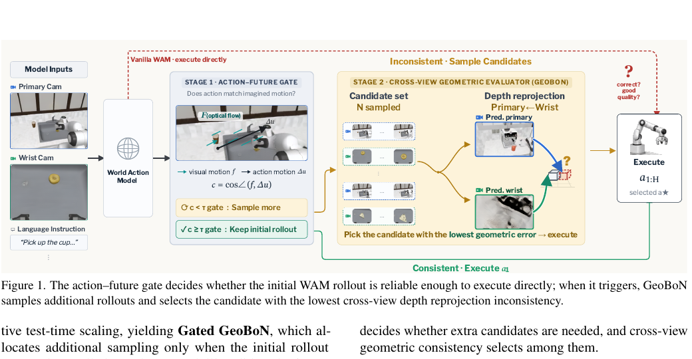
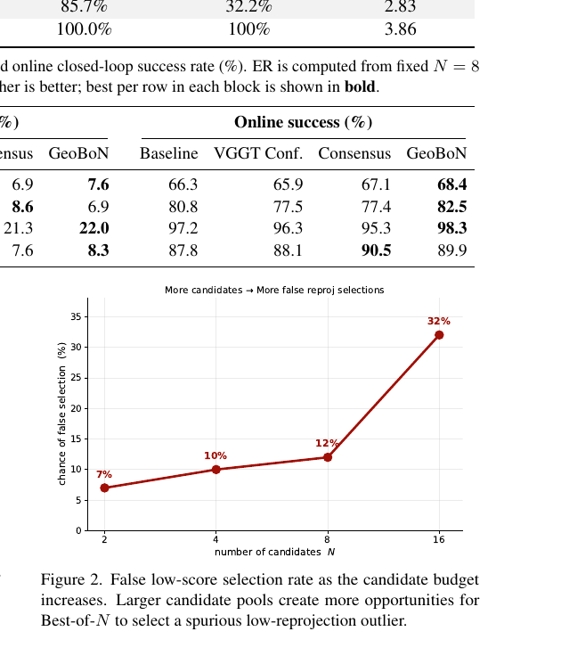
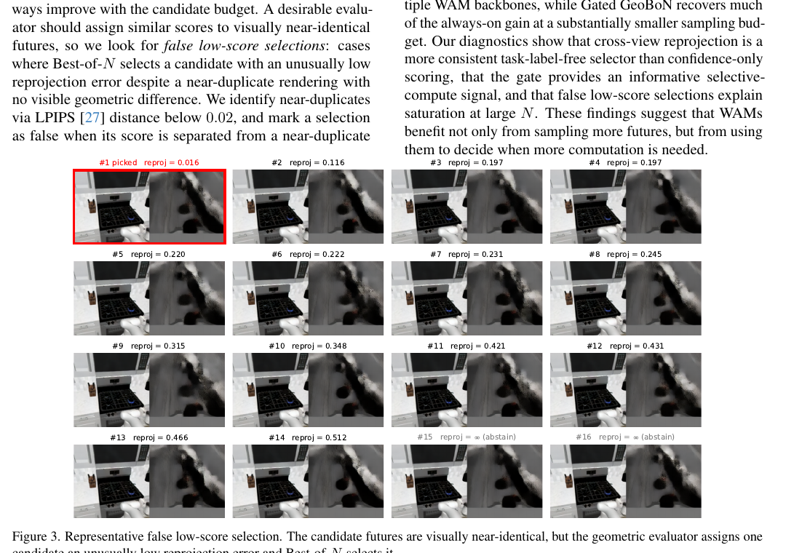

---
tags:
  - papers/world-model
  - papers/robotics
aliases:
  - GeoBoN
  - Gated GeoBoN
  - Test-Time Scaling for WAMs
date: 2026-07-20
doi: 10.48550/arXiv.2607.17454
arxiv_id: 2607.17454v1
zotero_key: 2UT6H548
---

# Test-Time Scaling for World Action Models via Zero-Shot Geometric Evaluation

## 核心信息

- 标题: Test-Time Scaling for World Action Models via Zero-Shot Geometric Evaluation
- 标题翻译: 通过零样本几何评估实现世界动作模型的测试时扩展
- 作者: Zesen Zhao, Minkyoung Cho, Hui Shen, Boyuan Zheng, Kunxiao Gao, Yulong Cao, Z. Morley Mao
- 机构: University of Michigan; NVIDIA
- 发表时间: 2026-07-20
- 发表渠道: arXiv 预印本
- DOI: 10.48550/arXiv.2607.17454
- arXiv: 2607.17454v1
- 论文链接: https://arxiv.org/abs/2607.17454
- 论文类型: 机器人学习方法与评测论文

> [!info] 来源与标题说明
> 本笔记仅以 Zotero 本地附件 `QWZWYPV8` 的 8 页 PDF 为内容依据；文件 SHA256 为 `1fa68da603965ee37506d0bb38f187bb55062132c442b42eaa8fcd226ac7959e`，Zotero 条目键为 `2UT6H548`。PDF 正文渲染标题末词是 **Verification**，而 Zotero 规范标题及附件元数据使用 **Evaluation**。为保持条目、文件夹和笔记索引一致，本文采用 **Evaluation**，同时保留该来源差异。本文不是 RLinf，笔记未混入 RLinf 的方法或实验内容。

## 原文摘要翻译

测试时扩展通过投入额外计算来改善基础模型推理，但机器人控制还必须在执行动作之前判断额外计算是否值得。世界动作模型会同时输出动作块及其预测未来观测，因此天然提供了这一决策所需的信号。本文提出 Gated GeoBoN，一种面向世界动作模型、无需训练且可选择性启用的测试时扩展框架。作者首先构造 GeoBoN：一种固定预算的最佳多样本选择器，依据冻结几何基础模型得到的跨视角深度重投影一致性，对采样轨迹进行排序。随后加入轻量级动作—未来一致性门控；只有初始轨迹在内部不一致时，才调用 GeoBoN。作者在 RoboCasa、LIBERO Long 与 RoboTwin 2.0 的五组基准—骨干配置上评测该框架。固定预算 GeoBoN 在每组配置中均改善 $N=8$ 的任务成功率，例如 Cosmos Policy 在 RoboCasa 的组平均成功率从 66.3% 提高到 68.4%，X-WAM 则从 80.8% 提高到 82.5%。加入门控后，Gated GeoBoN 平均保留始终启用方案 74.8% 的成功增益，而额外采样仅在 26.2% 的决策点触发。离线诊断表明，跨视角重投影是一种较强的无任务标签选择信号；作者还发现，随着 $N$ 增大，错误低分选择会导致性能趋于饱和甚至下降。

## 创新点

1. **把 WAM 的“动作与想象未来”变成推理时自检信号。** 方法不再默认每一步都扩大采样，而是先问初始动作是否与其生成的视觉运动一致，使计算分配与当前决策的不确定性绑定。
2. **提出零样本跨视角几何选择器 GeoBoN。** 它不学习任务价值函数，而以冻结 VGGT-$\Omega$ 的主视角—腕视角深度重投影误差排序候选，使同一个选择器可跨 WAM 骨干和仿真基准复用。
3. **把“是否采样”与“采样后选谁”拆成两级推理链。** 轻量门控负责节省计算，较重的几何评估器负责候选排序；这一分工在 $N_{\max}=8$ 时用 26.2% 的平均触发率保留 74.8% 的固定预算增益。
4. **不仅报告增益，也刻画最佳多样本的失效机制。** 论文用近重复未来帧揭示评估器异常低分，并定量显示错误选择率随候选数从 7% 增至 32%，解释为何测试时计算并不单调转化为控制性能。

## 一句话总结

这篇论文的核心不是“多采样必然更好”，而是让 WAM 先用动作—未来一致性判断**何时值得多采样**，再用跨视角几何一致性决定**哪条想象轨迹更可信**；收益真实但有限，并会受几何评估器极值异常约束。

## 研究问题

世界动作模型在时刻 $t$ 接收多视角观测、本体状态和语言指令，随机生成动作块及其预测未来图像。第 $i$ 条轨迹写作

$$
\tau_i=\left(\hat I_i^{\mathrm{pri}},\hat I_i^{\mathrm{wri}},a_{i,1:H}\right). \tag{1}
$$

这里，$\hat I_i^{\mathrm{pri}}$ 与 $\hat I_i^{\mathrm{wri}}$ 分别是主相机和腕相机的未来帧，$a_{i,1:H}$ 是长度为 $H$ 的动作块。通常的最佳多样本推理固定采样 $N$ 条轨迹，再依赖价值头、奖励模型或内部置信度选择。本文提出两个更贴近 WAM 输出结构的问题：

- 初始动作与初始想象未来是否自洽，值得直接执行吗？
- 若需要更多样本，哪条未来在不同相机视角下形成最一致的三维场景？

这一区分很重要：候选生成与候选验证是两个不同瓶颈。增加 $N$ 只扩大“找到好轨迹”的机会，也同步扩大“遇到评估器异常低分并误选”的机会。

## 数据与任务定义

### 基准、骨干与运行设置

| 基准 | WAM 骨干 | 每任务每种子轨迹数 | 备注 |
|---|---|---:|---|
| RoboCasa | Cosmos Policy、X-WAM | 10 | 任务计数加权组平均 |
| LIBERO Long | Cosmos Policy、LingBotVLA | 50 | 长程操作任务 |
| RoboTwin 2.0 | Motus | 10 | 双臂仿真操作 |

全部实验均为**仿真环境**，使用公开检查点及默认评测设置，不微调；每个基准—骨干设置使用 4 个随机种子，成功率跨种子平均。硬件为 H200 与 RTX Pro 6000 GPU 节点。固定超参数包括：空闲阈值 $\tau_{\mathrm{idle}}=1$ cm、余弦门控阈值 $\tau_{\mathrm{gate}}=-0.2$、胶囊半径 $\rho_{\mathrm{cap}}=30$ 像素、VGGT-$\Omega$ 置信阈值 $\tau_{\mathrm{conf}}=0.5$。论文声称这些阈值跨实验固定。

### 评估轴

1. 固定预算 GeoBoN 是否提高在线任务成功率；
2. 门控能否以较少调用保留固定预算收益；
3. 重投影评分和门控是否优于替代信号；
4. 候选数增大时为何出现饱和或退化。

## 方法主线

### 机制流程

1. **生成初始轨迹。** 输入主视角、腕视角、本体状态和语言指令，WAM 输出 $\tau_1$，其中同时包含动作块 $a_{1,1:H}$ 与两路预测未来帧；它们进入门控，而不是立即默认扩展采样。
2. **执行动作—未来一致性门控。** 用 Farneback 光流从当前主视角到预测主视角估计视觉运动；再把动作导出的末端执行器位移投影到主相机。若二者余弦一致性不低于阈值，就把初始动作直接送往执行器。
3. **按需扩展候选并做几何排序。** 若任一运动机械臂的一致性低于阈值，则额外生成 $N_{\max}-1$ 条轨迹。对每条轨迹，用冻结 VGGT-$\Omega$ 将腕视角三维点重投影到主视角，并计算预测深度的对数差。
4. **闭合选择—执行链。** 将初始轨迹也放入候选集，选择跨视角重投影误差最小的轨迹，执行其动作块 $a_{i^*,1:H}$；下一控制步重新从环境观测开始，而不是把离线代理分数当作任务成功本身。

### 第一级：动作—未来一致性门控

对机械臂 $r$，从本体状态得到当前末端位置 $x_{r,0}$，用前向运动学或累计增量得到动作执行后的 $x_{1,r,H}$。投影到主相机后，动作在像平面的位移为

$$
\Delta u_{1,r}=\pi_{\mathrm{pri}}(x_{1,r,H})-\pi_{\mathrm{pri}}(x_{r,0}). \tag{2}
$$

对位移低于 1 cm 的机械臂做空闲过滤；对运动机械臂，在其投影轨迹周围半径 30 像素的胶囊区域 $\mathcal M_{1,r}$ 内平均 Farneback 稠密光流 $F_1$：

$$
\bar f_{1,r}=\frac{1}{|\mathcal M_{1,r}|}\sum_{p\in\mathcal M_{1,r}}F_1(p). \tag{3}
$$

门控分数是视觉运动与动作投影的余弦一致性：

$$
c_{1,r}=\frac{\bar f_{1,r}^{\top}\Delta u_{1,r}}
{\|\bar f_{1,r}\|_2\|\Delta u_{1,r}\|_2+\epsilon}. \tag{4}
$$

只要任一运动机械臂满足 $c_{1,r}<\tau_{\mathrm{gate}}$，门控就触发；若空闲过滤后没有运动机械臂，则直接执行初始动作。工程上，这个门控检验的是**方向一致性**，不是任务正确性：动作与图像可能一致地朝错误目标运动，因此它适合做计算分配信号，不是成功判别器。

### 第二级：冻结几何模型的跨视角重投影

对候选 $\tau_i$，冻结的 VGGT-$\Omega$ 接收预测主视角与腕视角图像。记主视角直接预测深度为 $d_i^{\mathrm{vggt}}(p)$；根据估计相机几何，把腕视角三维点投影到主视角，得到 $d_i^{\mathrm{proj}}(p)$。评分为

$$
e_{\mathrm{depth}}(\tau_i)=\frac{1}{|\Omega_i|}\sum_{p\in\Omega_i}
\left|\log\frac{d_i^{\mathrm{proj}}(p)}{d_i^{\mathrm{vggt}}(p)}\right|. \tag{5}
$$

$\Omega_i$ 只保留投影落在主图像内、深度为正且 VGGT-$\Omega$ 置信度超过 0.5 的像素。对数比值降低绝对深度尺度的影响；若有效集合为空，候选被赋予大分数。最终执行

$$
i^*=\arg\min_{i\in\mathcal C_N}e_{\mathrm{depth}}(\tau_i).
$$

**X-WAM 是关键例外。** 它原生输出深度，因此 X-WAM 实验直接用其预测深度做重投影评分，不再用外部深度基础模型；其余 WAM 使用冻结 VGGT-$\Omega$。这意味着“统一评估器”的实现并非所有骨干完全同构。

### 三种推理模式

- **基线：** 只生成 $\tau_1$ 并直接执行，不做额外采样或几何评分。
- **GeoBoN：** 每步固定生成 $N$ 个候选并选择最低几何误差者，预算恒定。
- **Gated GeoBoN：** 先检查 $\tau_1$；若门控不触发则直接执行，若触发则补到 $N_{\max}$ 个候选并应用同一几何选择规则。

## 关键结果

### 固定预算：$N=8$ 的五个主设置都提高，但细分类别存在反例

| 基准 / WAM | 基线 | GeoBoN $N=8$ | 增量 | 配对 95% CI |
|---|---:|---:|---:|---|
| RoboCasa / Cosmos Policy（组平均） | 66.3 | 68.4 | +2.1 | $[+0.6,+7.3]$ |
| RoboCasa / X-WAM（组平均） | 80.8 | 82.5 | +1.7 | $[+0.3,+2.6]$ |
| LIBERO Long / Cosmos Policy | 97.5 | 99.3 | +1.8 | $[+0.4,+2.2]$ |
| LIBERO Long / LingBotVLA | 97.2 | 98.3 | +1.1 | $[+0.2,+1.5]$ |
| RoboTwin 2.0 / Motus | 87.8 | 89.9 | +2.1 | $[+0.2,+3.4]$ |

五个主设置在 $N=8$ 均提高，且表中配对区间下界为正。但这不能概括成“每类任务都提高”：X-WAM 的 Door/Drawer Manipulation 从 **96.7 降至 92.1**，而 Coffee Making 从 73.3 升至 83.7，并在 $N=16$ 达到 92.0。几何重排更可能帮助排除明显不可行未来，却可能在强初始策略、窄分布任务中误伤原本正确的高置信轨迹。

另外，收益对 $N$ 不单调：Cosmos Policy 的 RoboCasa 组平均在 $N=8$ 为 68.4，$N=16$ 回落到 68.2；X-WAM 为 82.5 后回落到 82.4；Motus 为 89.9 后回落到 89.5。更多计算扩大候选池，但未改善评估器的排序可靠性。

### 门控：平均节省大部分调用，但恢复比例因域而异

| 基准 / WAM | 基线 | Gated $N_{\max}=8$ | 始终启用 GeoBoN | 增益恢复率 | 触发率 | 平均时延（秒）基线→门控→始终启用 |
|---|---:|---:|---:|---:|---:|---|
| RoboCasa / Cosmos Policy | 66.3 | 67.9 | 68.4 | 76.2% | 24.7% | 0.90→1.29→3.65 |
| RoboCasa / X-WAM | 80.8 | 82.1 | 82.5 | 76.5% | 25.2% | 2.68→3.11→9.67 |
| LIBERO / Cosmos Policy | 97.5 | 98.8 | 99.3 | 72.2% | 14.2% | 0.90→0.96→3.66 |
| LIBERO / LingBotVLA | 97.2 | 97.9 | 98.3 | 63.6% | 34.5% | 2.27→2.83→3.86 |
| RoboTwin / Motus | 87.8 | 89.6 | 89.9 | 85.7% | 32.2% | 2.29→2.83→3.86 |

五项算术平均为 **74.8% 增益恢复率**与 **26.2% 触发率**；单项范围分别为 **63.6%–85.7%** 和 **14.2%–34.5%**。这说明门控确实提供了计算分配信息，而非简单随机降采样，但它不是均匀可靠的：LingBotVLA 触发最多，恢复比例反而最低。

### 选择器诊断：离线 ER 有信息量，但不等于在线控制

表 3 固定使用 $N=8$ 的同一候选转储。离线错误恢复率 ER 把第一候选设为 0，衡量选择器相对第一候选与“事后知道结果的 oracle”之间恢复了多少误差。四项中 GeoBoN 的 ER 为 **7.6、6.9、22.0、8.3**；对应在线成功率为 **68.4、82.5、98.3、89.9**。

关键反例来自 RoboTwin / Motus：Consensus 的在线成功率 **90.5** 高于 GeoBoN 的 **89.9**，尽管其离线 ER **7.6** 低于 GeoBoN 的 **8.3**。因此 ER 只能用于同一候选集上的排序诊断，不能替代闭环成功率。论文也明确将 Consensus 标为依据原文描述的**重新实现**，因为原实现未公开；其比较强度受重现保真度限制。

### 门控消融：相同触发率下优于随机触发

| 设置 | 触发率 | 随机触发帮助率 | GeoBoN 门控帮助率 | 差值 |
|---|---:|---:|---:|---:|
| RoboCasa / X-WAM | 25.2 | 43.2 | 67.2 | +24.0 |
| RoboCasa / Cosmos Policy | 24.7 | 43.2 | 63.5 | +20.3 |
| LIBERO / LingBotVLA | 34.5 | 47.8 | 69.4 | +21.6 |
| RoboTwin / Motus | 32.2 | 71.7 | 75.8 | +4.1 |

在相同触发预算下，门控在四项均优于随机触发；但 RoboTwin 的优势只有 4.1 个百分点，说明该信号的跨域信息量并不均匀。

## 深度分析

### 候选越多，评估器极值异常越容易被选中

作者以 LPIPS 小于 0.02 识别视觉近重复候选；若被选候选的重投影分数与某个近重复候选相差超过评估器重复对变异的第 95 百分位，则记为错误低分选择。其发生率在 $N=2,4,8,16$ 时分别是 **7%、10%、12%、32%**。这是多重比较效应：候选越多，既越可能包含真正更好的轨迹，也越可能出现一个几何评估异常值并被最小值规则放大。

图 3 中多条未来视觉上近乎相同，首个候选却取得 0.016 的异常低重投影误差并被最佳多样本选中。这直接解释了表 1 中 $N=16$ 的非单调现象。可行修正方向不是无限增大 $N$，而是引入稳健聚合、近重复聚类、分数校准、拒选阈值或多个评估信号的联合验证。

### 与价值头路线的比较

表 5 在相同候选预算下比较 GeoBoN 与 Cosmos Policy 自带的模型专用价值头：

| 基准 | 选择器 | $N=2$ | $N=4$ | $N=8$ | $N=16$ |
|---|---|---:|---:|---:|---:|
| RoboCasa | Value Head | 65.2 | 65.5 | 66.1 | 65.9 |
| RoboCasa | GeoBoN | 66.5 | 66.9 | 68.4 | 68.2 |
| LIBERO Long | Value Head | 97.1 | 97.9 | 98.1 | 97.6 |
| LIBERO Long | GeoBoN | 98.2 | 98.6 | 99.3 | 98.9 |

GeoBoN 在 RoboCasa 各预算领先 **1.3–2.3** 个百分点，在接近饱和的 LIBERO 领先 **0.7–1.3** 个百分点。两条路线的差异不是简单的“几何优于学习”：

- **价值头**可学习任务语义和长期回报，但与具体骨干、数据及训练分布绑定；若校准良好，推理可能更轻。
- **GeoBoN**不需要任务标签或重新训练，可跨骨干迁移，但只验证多视角几何自洽，无法直接判断语义目标和长期后果，还要承担冻结几何模型的推理开销。

因此，更合理的结论是：跨视角几何为 WAM 提供了一个强的、可移植的外部验证轴，而不是普遍替代价值估计。未来可将几何一致性、价值和不确定性作为互补信号，而不是二选一。

### 论文证明了什么，尚未证明什么

**已有证据支持：**

- 冻结的跨视角几何评分可在多个 WAM 与三个仿真基准上提供可迁移的候选排序信号；
- 动作—未来门控在相同触发率下通常比随机触发更能定位“追加采样有帮助”的时刻；
- 中等候选预算可小幅提高成功率，但选择器异常会使大预算饱和或退化。

## 局限

**证据尚不足：**

- **没有实体机器人实验。** 相机标定误差、遮挡、运动模糊、深度域偏移和控制时延对门控与重投影的影响没有被验证；结论目前是 simulation-only。
- **“无需训练”不等于“无推理成本”。** 始终启用的平均时延最高从 0.90 秒升至 3.65 秒，或从 2.68 秒升至 9.67 秒；即使门控降低调用频率，VGGT-$\Omega$ 与额外 WAM rollout 仍有显著成本。
- **置信区间方法未说明。** 表 1 给出配对 95% CI，但正文没有交代重采样单位、参数假设或计算程序，难以精确复现统计结论。
- **超参数固定不等于已证明普适。** $-0.2$ 门控阈值、1 cm 空闲阈值、30 像素胶囊半径和 0.5 置信阈值跨实验固定，但没有系统敏感性分析。
- **篇幅边界。** 该 8 页版本含图 1–3、表 1–5、式 1–5 与 29 篇参考文献；无算法框、附录，也无独立的局限性、致谢、可用性、影响或伦理章节。因此，许多实现细节只能从正文重建，不能假定存在补充材料兜底。

## 我的笔记

### 复现与工程清单

1. **锁定候选生成。** 固定 WAM 检查点、动作时域 $H$、随机种子和每步候选预算；确保基线、价值头、Consensus 与 GeoBoN 使用同一候选转储。
2. **复现门控几何。** 明确机械臂运动学、主相机内外参、动作位移投影、Farneback 参数、1 cm 空闲过滤及 30 像素胶囊区域。
3. **区分深度来源。** X-WAM 使用原生预测深度；其余骨干使用冻结 VGGT-$\Omega$。保存有效像素比例、空集合次数和置信阈值过滤统计。
4. **报告完整选择链。** 同时记录门控触发率、额外候选数、选择索引、重投影分数、每步时延和最终在线成功，不能只报告离线 ER。
5. **重建统计程序。** 以任务与种子为明确配对单位，并公开 95% CI 的计算方式；目前论文正文不足以唯一确定该程序。
6. **专门测大 $N$ 异常。** 按近重复候选统计错误低分率，检查 $N=2,4,8,16$ 的非单调性，避免只挑最佳预算。
7. **实体部署前校验。** 对相机标定漂移、遮挡、腕相机剧烈运动、光流失真、VGGT 深度置信度和控制周期做压力测试。

### WJ 研究洞察

#### 洞察一：测试时扩展的核心瓶颈从“生成”转向“验证的尾部风险”

当候选池很小时，主要问题是没有采到更好的轨迹；候选池变大后，主要问题逐渐变成评估器最小值的尾部异常。图 2 的 7%→32% 不是附属现象，而是决定扩展上限的核心统计机制。未来方法应把验证器的**极值稳健性**作为第一类指标，而不只比较平均排序相关性。

#### 洞察二：门控与排序器应分别校准

门控回答“追加计算是否可能有帮助”，排序器回答“候选中执行哪一个”。本文把两者拆开是正确的系统设计，但共同使用几何一致性会引入相关误差：门控误判和排序异常可能同源。更稳健的实现可让门控依赖动作—视觉运动，排序器联合几何、语义价值与候选密度，并分别报告召回率、精确率和条件收益。

#### 洞察三：近重复候选不是冗余垃圾，而是评估器校准样本

视觉近重复轨迹本应获得相近分数。它们可在不需要任务标签的情况下提供局部平滑性约束：若一个候选相对近邻分数异常，应降低其被选概率或触发复核。这可发展为“候选内自校准”，把 Figure 3 的失败检测直接嵌入推理流程。

#### 洞察四：真实机器人上的第一优先级是坐标与时延闭环，而非直接扩大 $N$

门控依赖动作位移、相机投影和图像光流之间的时空对齐；任何标定偏差或执行延迟都会被解释为动作—未来不一致，从而过度触发。实体系统应先建立时间同步和投影误差预算，再讨论候选数量。否则，所谓自适应计算可能退化为由传感噪声驱动的频繁采样。

### 结论

GeoBoN 提供了一条不同于价值头的 WAM 测试时扩展路线：利用模型已经生成的多视角未来，以冻结几何模型做零样本候选验证；Gated GeoBoN 再以动作—未来一致性决定是否支付额外计算。五个主设置的 $N=8$ 增益、门控的 74.8% 平均增益恢复与 26.2% 触发率共同支持这条思路具有工程价值，但幅度总体较小，且大 $N$ 下错误低分率明显上升。最值得保留的结论并不是“采样越多越好”，而是：**测试时扩展必须同时设计计算分配器与稳健验证器，后者的尾部异常最终决定扩展能走多远。**

## 引用

Zhao, Z., Cho, M., Shen, H., Zheng, B., Gao, K., Cao, Y., & Mao, Z. M. (2026). *Test-Time Scaling for World Action Models via Zero-Shot Geometric Evaluation*. arXiv:2607.17454v1. https://doi.org/10.48550/arXiv.2607.17454
