# Video Prediction Policy 2: Predict Better, Act Better

**Authors:** Yanjiang Guo$^{1,2,*}$, Haodong Yan$^{1,3,*}$, Zhide Zhong$^{1,3,*}$, Zhongru Zhang$^{2,*}$, Qingyuan Yang$^{1,2,*}$, Qingzhou Lu$^{1,2}$, Xiaoyu Chen$^2$, Yen-Jen Wang$^4$, Shuying Deng$^{1,2,4}$, Chenghan Yang$^2$, Puzhen Yuan$^{1,2}$, Chenxin Liu$^{1,2}$, Tun Ban$^{1,5}$, Xiang Zhu$^{1,2}$, Yichen Liu$^{1,2}$, Kun Feng$^{1,2}$, Haoang Li$^3$, Jianyu Chen$^{1,2}$  
*Equal Contribution  
$^1$Robotera, $^2$Tsinghua University, $^3$HKUST (GZ), $^4$University of California, Berkeley, $^5$Shanghai Jiaotong University  
**Source PDF:** `/Users/roywangj/journey_wj/research/papers4zotero/zotero1/storage/ZFMEAB8V/Guo 等 - 2026 - Video Prediction Policy 2 Predict Better, Act Better.pdf`  
**Version:** arXiv:2610.10270v2 [cs.CV], 8 Oct 2026; 21 pages  
**Project Page:** https://robert-gyj.github.io/video-prediction-policy-2  

## Page / Section Index

| Pages | Sections |
|---|---|
| 1 | Title; Authors; Abstract; Figure 1 |
| 2–4 | 1 Introduction; 2 Data Processing Pipeline; Table 1; Figure 2; Figure 3 |
| 4–6 | 3 VPP2: A Generalist Policy with Zero-Shot Capability (3.1 Video Prediction Model Training Pipeline; Figure 4; 3.2 Action Modeling; 3.3 VLM for High-Level Planning); Figure 5 |
| 6–9 | 4 Experiments (4.1 Video Prediction Quality Analysis; Table 2; Figure 6; Figure 7; 4.2 Policy Performance Analysis; Figure 8; Table 3; Table 4; Figure 9) |
| 9–10 | 5 Related Works; 6 Conclusion |
| 11 | Acknowledgments; AI Use Statement; Reproducibility Statement |
| 11–17 | References [1]–[48] |
| 18 | Appendix A: Dataset Process Details (A.1 Video Captioning; A.2 Unified Action Space); Table 5 |
| 19 | Appendix B: More Video Prediction Results; Figure 10 |
| 20–21 | Appendix C: Detailed Benchmark Results (C.1 Detailed LIBERO Results; Table 6; C.2 Detailed RoboDojo Results; Table 7; Table 8) |

## Terminology Ledger

| English | 中文 | 说明 |
|---|---|---|
| World Action Model (WAM) | 世界动作模型（WAM） | 将视频生成预测与动作策略联合建模或转化的具身模型 |
| Video Foundation Model | 视频基础模型 | 大规模预训练文本到视频生成模型（如 Wan2.1、Cosmos 等） |
| Event-level Video Pretraining | 事件级视频预训练 | 以完整子任务/事件为粒度跨全过程采样帧并进行视频生成预训练 |
| Chunk-level Video Post-training | 块级视频后训练 | 预测固定时长未来视频块以建立与动作一致的时序尺度 |
| Action Chunk | 动作块 | 一次性预测并执行的连续动作序列片段 |
| Consistency Distillation | 一致性蒸馏 | 将多步扩散/流匹配采样蒸馏为单步前向推理的加速技术 |
| Mixture-of-Transformers (MoT) | 混合 Transformer 架构（MoT） | 视频网络与动作网络解耦且参数隔离的模块化 Transformer 架构 |
| Inverse Dynamics Model | 逆动力学模型 | 根据前后视觉观测或预测未来视觉推断执行动作的模型 |
| Flow Matching | 流匹配 | 基于连续时间速度场的生成式流模型训练目标 |
| Latent Representation | 潜变量表示 | VAE 编码器压缩生成的低维潜空间表征 |
| KV Cache | 键值缓存（KV Cache） | Transformer 自注意力层中保存的历史键值对表示 |
| Workspace Alignment | 工作空间对齐 | 将不同数据集的机器人末端工作空间变换到统一世界参考系 |
| End-Effector Alignment | 末端执行器对齐 | 标准化不同机器人末端执行器的坐标原点与轴向朝向 |
| T-shaped Composite View | T 形复合视角 | 左侧为主视角、右侧上下堆叠两个辅助视角的图像拼接格式 |
| Zero-Shot Manipulation | 零样本操作 | 未经目标任务微调直接在开放式任务与环境中执行操作策略 |
| Compositional Generalization | 组合泛化 | 对物体、空间布局与任务目标的未见组合进行泛化执行的能力 |
| Subtask Planning | 子任务规划 | 利用高层视觉语言模型（VLM）将长程复杂任务分解为明确子任务 |
| Visual Planner | 视觉规划器 | 生成具身未来视觉演化预测以引导底层动作执行的模型 |

## Abstract

> <strong>Para. 1:</strong> World action models (WAMs) have emerged as an important class of generalist robot policies, aiming to transfer video prediction priors to action learning. However, we find that existing WAMs frequently produce incorrect motion predictions in open-ended environments, leading to erroneous actions. We attribute this limitation to two factors: (1) base video models are not optimized for manipulation, and (2) naively incorporating action components into video models can substantially degrade their generalization capabilities. We introduce Video Prediction Policy 2 (VPP2), a WAM that enables strong zero-shot generalization in both video prediction and action generation. First, we curate a large-scale, diverse dataset of manipulation videos to continue pretraining the base video foundation model. We annotate video clips with detailed captions and perform event-level video pretraining to promote generalization across open-ended manipulation tasks. Second, we post-train and distill the video model into a single-step visual planner with a fixed prediction horizon. Finally, we introduce an action module via a mixture-of-transformers (MoT) architecture to learn an implicit inverse dynamics model. Experiments demonstrate three key results: (1) VPP2-14B outperforms Cosmos3-64B by 11.0% points in video prediction instruction-following success rate on open-ended tasks; (2) VPP2 surpasses the strongest baseline by 18.5% points in success rate on real-world zero-shot ALOHA manipulation tasks; and (3) following benchmark-specific post-training, VPP2 achieves the highest success rates among evaluated methods on the challenging LIBERO-Pro, LIBERO-OOD, and RoboDojo benchmarks.

> <strong>Para. 1[CN]:</strong> 世界动作模型（WAM）已成为一类重要的通用机器人策略，旨在将视频预测先验迁移至动作学习。然而，我们发现现有的 WAM 在开放式环境中经常产生错误的运动预测，进而导致错误的动作。我们将这一局限性归因于两个因素：(1) 基础视频模型并未针对操作任务进行优化；(2) 在视频模型中简单直接地引入动作模块会显著损害其泛化能力。为此，我们提出了视频预测策略 2（Video Prediction Policy 2, VPP2），这是一种在视频预测和动作生成两方面均具备强大零样本泛化能力的世界动作模型。首先，我们构建了一个大规模、多样化的操作视频数据集，对基础视频大模型进行持续预训练；我们为视频片段标注了详细的描述文本，并进行事件级视频预训练，以促进跨开放式操作任务的泛化。其次，我们对视频模型进行后训练并蒸馏为一个具有固定预测时域的单步视觉规划器。最后，我们通过混合 Transformer（MoT）架构引入动作模块，以学习隐式逆动力学模型。实验证明了三项关键结果：(1) 在开放式任务上，VPP2-14B 在视频预测指令遵循成功率上比 Cosmos3-64B 高出 11.0 个百分点；(2) 在真实世界 ALOHA 零样本操作任务上，VPP2 的成功率超越最强基线 18.5 个百分点；(3) 在经过特定基准的后训练后，VPP2 在极具挑战性的 LIBERO-Pro、LIBERO-OOD 和 RoboDojo 基准上均取得了所有受评方法中的最高成功率。

### Figure 1. 典型机器人策略与 VPP2 的对比

**Caption:** Figure 1: A typical robot policy maps a simple instruction and an observation into a short action chunk. As datasets scale, this mapping becomes increasingly multimodal and uncertain, leading models to learn spurious short-horizon correlations. VPP2 first establishes consistent semantic-to-trajectory mappings via next event video prediction with detailed captions, then post-trains and distills the model to generate short action chunks.

**Caption[CN]:** 图 1：典型机器人策略将简单指令和观测映射为短期动作块。随着数据集规模扩大，这种映射变得越来越具有多模态性和不确定性，导致模型学习到虚假的短时域相关性。VPP2 首先通过带有详细文本描述的下一事件视频预测建立一致的语义到轨迹映射，然后对模型进行后训练与蒸馏以生成短期动作块。

## 1. Introduction

> <strong>Para. 1:</strong> World action models (WAMs) are developing rapidly and have become an important class of generalist robot policies (Hu et al., 2024; Liao et al., 2025; Kim et al., 2026; Yuan et al., 2026; Ma et al., 2026; Li et al., 2026a;b; AgiBot Research Team et al., 2026; Ye et al., 2026). Many WAMs build on video foundation models (Wan et al., 2025; Agarwal et al., 2025; Yang et al., 2025), aiming to transfer their rich priors about physical dynamics to policy learning. This premise is compelling: accurate, instruction-conditioned video predictions can guide action generation through an explicit or implicit inverse dynamics model (Du et al., 2023; Hu et al., 2024). However, prior work (Zhang et al., 2026b) has found that existing WAMs often perform well only on a narrow set of seen tasks, while producing unreliable future motion predictions in unseen, out-of-distribution scenarios. These prediction failures, in turn, lead to erroneous actions. In recent benchmarks that require generalization, robot policies, including WAMs, with near-perfect success rates on standard evaluation suites suffer substantial performance drops under perturbed task configurations and novel skill compositions (Zhou et al., 2025; Li, 2025; Mishra et al., 2026).

> <strong>Para. 1[CN]:</strong> 世界动作模型（WAM）正在飞速发展，并已成为一类重要的通用机器人策略（Hu 等，2024；Liao 等，2025；Kim 等，2026；Yuan 等，2026；Ma 等，2026；Li 等，2026a,b；AgiBot Research Team 等，2026；Ye 等，2026）。许多 WAM 构建在视频基础模型之上（Wan 等，2025；Agarwal 等，2025；Yang 等，2025），旨在将其关于物理动力学的丰富先验迁移到策略学习中。这一前提极具吸引力：准确的、以指令为条件的视频预测可以通过显式或隐式逆动力学模型引导动作生成（Du 等，2023；Hu 等，2024）。然而，先前的研究（Zhang 等，2026b）发现，现有的 WAM 往往仅在少数见过的任务集上表现良好，而在未见的分布外场景中则会产生不可靠的未来运动预测。这些预测失败反过来又会导致错误的动作。在近期要求泛化能力的基准测试中，包括 WAM 在内的机器人在标准评测集上能够达到近乎完美的成功率，但在扰动的任务配置和新颖的技能组合下性能会大幅下降（Zhou 等，2025；Li，2025；Mishra 等，2026）。

> <strong>Para. 2:</strong> We identify two key factors that limit the generalization of existing WAMs to unseen scenarios. First, base video models are primarily optimized for creative content generation and aesthetic quality rather than precise physical dynamics, and therefore often fail to follow manipulation instructions faithfully (Chen et al., 2025; Zhang et al., 2026b). Second, introducing action-specific components or training objectives into pretrained video foundation models can substantially degrade their generalization capabilities (Mishra et al., 2026).

> <strong>Para. 2[CN]:</strong> 我们指出了限制现有 WAM 泛化至未见场景的两个关键因素。首先，基础视频模型主要针对创意内容生成和美学质量进行优化，而非精确的物理动力学，因此往往无法忠实地遵循操作指令（Chen 等，2025；Zhang 等，2026b）。其次，将动作特定组件或训练目标引入预训练视频基础模型中，会大幅削弱其泛化能力（Mishra 等，2026）。

> <strong>Para. 3:</strong> To address these issues, we introduce Video Prediction Policy 2 (VPP2), a WAM that achieves strong zero-shot generalization in both video prediction and action generation. Our first objective is to train a generalizable video foundation that can faithfully follow instructions and make future predictions grounded in the current observation, without unsupported changes to the scene or task. To this end, we annotate each clip with a detailed caption specifying the manipulation process, active end effector, and target object, and perform event-level video prediction training. As illustrated in Figure 1, detailed captions and complete event-level trajectory prediction substantially reduce uncertainty in future prediction and encourage consistent mappings from semantic descriptions to visual trajectories, improving generalization across diverse instructions. We then post-train the video model to predict fixed-horizon future chunks and apply consistency distillation (Song et al., 2023) to obtain a single-step visual planner for real-time robot execution. Finally, we introduce an action expert through a mixture-of-transformers (MoT) architecture (Liang et al., 2025) to learn an implicit inverse dynamics model conditioned on the predicted future. During policy execution, we pair VPP2 with a VLM planner (Bai et al., 2025; Bytedance Seed, 2026) that translates open-ended instructions into explicit subtask instructions.

> <strong>Para. 3[CN]:</strong> 为解决这些问题，我们提出了视频预测策略 2（VPP2），这是一种在视频预测和动作生成两方面均实现强零样本泛化能力的世界动作模型。我们的首要目标是训练一个具有泛化能力的视频基础模型，该模型能够忠实遵循指令，并在当前观测的基础上做出未来预测，而不对场景或任务进行缺乏依据的擅自更改。为此，我们为每个视频片段标注详细的文本描述，指明操作过程、活动末端执行器及目标物体，并进行事件级视频预测训练。如图 1 所示，详细文本描述和完整的事件级轨迹预测大幅降低了未来预测中的不确定性，并促进了从语义描述到视觉轨迹的一致映射，从而提升了跨多样化指令的泛化能力。随后，我们对视频模型进行后训练以预测固定时域的未来块，并应用一致性蒸馏（Song 等，2023）获得用于实时机器人执行的单步视觉规划器。最后，我们通过混合 Transformer（MoT）架构（Liang 等，2025）引入动作专家，以在预测未来的条件下学习隐式逆动力学模型。在策略执行期间，我们将 VPP2 与 VLM 规划器（Bai 等，2025；Bytedance Seed，2026）配对，由后者将开放式指令转化为明确的子任务指令。

> <strong>Para. 4:</strong> Our experiments demonstrate three key advantages of VPP2. (1) VPP2-14B follows manipulation instructions faithfully, outperforming Cosmos3-64B (Agarwal et al., 2026) by 11% in instruction-following success rate on open-ended tasks. (2) VPP2 exhibits strong zero-shot manipulation capabilities on a real-world ALOHA platform (Zhao et al., 2023), achieving an average success rate of 58.5% across 10 task categories, compared with 40.0% for $\pi_{0.5}$ (Intelligence et al., 2025) and 20.5% for Fast-WAM (Yuan et al., 2026). (3) Following benchmark-specific post-training, VPP2 achieves the highest success rates among evaluated methods on LIBERO-Pro (Zhou et al., 2025) (45.0%, compared with 11.0% for the strongest baseline), LIBERO-OOD (Li, 2025; Mishra et al., 2026) (63.9%), and RoboDojo (Chen et al., 2026) (32.26%, state-of-the-art).

> <strong>Para. 4[CN]:</strong> 我们的实验展示了 VPP2 的三大核心优势：(1) VPP2-14B 能够忠实遵循操作指令，在开放式任务上的指令遵循成功率超越 Cosmos3-64B（Agarwal 等，2026）11 个百分点。(2) VPP2 在真实世界 ALOHA 平台（Zhao 等，2023）上展现出强大的零样本操作能力，在 10 个任务类别上取得了 58.5% 的平均成功率，相比之下 $\pi_{0.5}$（Intelligence 等，2025）为 40.0%，Fast-WAM（Yuan 等，2026）为 20.5%。(3) 在经过基准特定的后训练后，VPP2 在 LIBERO-Pro（Zhou 等，2025）（45.0%，相比之下最强基线仅为 11.0%）、LIBERO-OOD（Li，2025；Mishra 等，2026）（63.9%）以及 RoboDojo（Chen 等，2026）（32.26%，创 SOTA）等评测方法中均取得了最高成功率。

## 2. Data Processing Pipeline

> <strong>Para. 1:</strong> In this section, we describe our data collection and curation pipeline, including how we unify the inputs and outputs across diverse manipulation datasets.

> <strong>Para. 1[CN]:</strong> 在本节中，我们将介绍数据收集与治理流程，包括如何统一样本输入并跨多样化操作数据集对齐输出。

> <strong>Para. 2:</strong> Video Sources. We compile a large-scale, diverse collection of manipulation videos for continued pretraining of an open-source video foundation model (Wan et al., 2025). Our data span three categories: robot manipulation datasets, human activity datasets, and general-purpose video datasets. For general-purpose video datasets, we apply an extensive filtering pipeline similar to that of LVP (Chen et al., 2025) to retain only videos depicting manipulation-related activities. Table 1 summarizes the datasets used for training; full dataset references are provided in Appendix A.

> <strong>Para. 2[CN]:</strong> 视频数据源。我们整理了大规模、多样化的操作视频集合，用于对开源视频基础模型（Wan 等，2025）进行持续预训练。我们的数据涵盖三大类别：机器人操作数据集、人类活动数据集和通用视频数据集。对于通用视频数据集，我们应用了与 LVP（Chen 等，2025）类似的大规模过滤流程，仅保留展示操作相关活动的视频。表 1 总结了用于训练的数据集；完整的数据集参考文献见附录 A。

### Table 1. 训练数据源概览

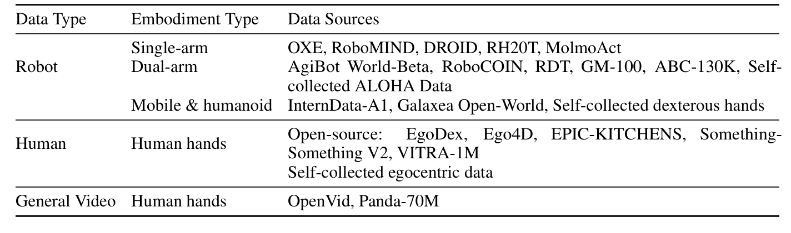

| Data Type | Embodiment Type | Data Sources |
|---|---|---|
| Robot | Single-arm | OXE, RoboMIND, DROID, RH20T, MolmoAct |
| Robot | Dual-arm | AgiBot World-Beta, RoboCOIN, RDT, GM-100, ABC-130K, Self-collected ALOHA Data |
| Robot | Mobile & humanoid | InternData-A1, Galaxea Open-World, Self-collected dexterous hands |
| Human | Human hands | Open-source: EgoDex, Ego4D, EPIC-KITCHENS, Something-Something V2, VITRA-1M; Self-collected egocentric data |
| General Video | Human hands | OpenVid, Panda-70M |

**Caption:** Table 1: Overview of training data sources. Full dataset references are provided in Appendix A, Table 5.

**Caption[CN]:** 表 1：训练数据源概览。完整数据集参考文献见附录 A 表 5。

### Figure 2. 数据处理流程示例

**Caption:** Figure 2: An example of our data processing pipeline. The central objective is to reduce uncertainty in future prediction, thereby encouraging the model to learn a consistent mapping from conditioning information to sub-task trajectories. To this end, each caption includes detailed task descriptions, explicit end-effector identification, a description of the visible target object, and camera-view changes.

**Caption[CN]:** 图 2：我们的数据处理流程示例。核心目标是降低未来预测中的不确定性，从而促使模型学习从条件信息到子任务轨迹的一致映射。为此，每个描述文本都包含详细的任务描述、明确的末端执行器识别、可见目标物体的描述以及相机视角的变换。

> <strong>Para. 3:</strong> Video Filtering, Segmentation and Captioning. We first remove corrupted trajectories, including those with camera failures or abrupt discontinuities, and segment the remaining trajectories into semantically coherent clips lasting 1–12 seconds. We identify candidate boundaries using heuristic cues associated with natural transitions, such as local minima in human-hand or end-effector velocity and moments when the gripper or fingers open or close. A vision-language model (VLM) then refines the segmentation by merging adjacent clips where appropriate and adjusting their start and end points. After segmentation, we generate detailed captions that describe the task, explicitly identify the active end effectors, unambiguously specify the target objects, and characterize the camera views and motion. Figure 2 illustrates an example, and Appendix A.1 provides further details.

> <strong>Para. 3[CN]:</strong> 视频过滤、分段与文本描述生成。我们首先剔除损坏的轨迹，包括相机故障或突发不连续性的轨迹，并将剩余轨迹分割为持续 1–12 秒的语义连贯片段。我们利用与自然过渡相关的启发式线索识别候选边界，例如人手或末端执行器速度的局部极小值，以及夹爪或手指开合的时刻。随后视觉语言模型（VLM）通过在适当时合并相邻片段并微调起止点来完善分段。分段完成后，我们生成详细的文本描述，详细说明任务内容、明确识别活动的末端执行器、清晰指定目标物体并表征相机视角与运动。图 2 给出了一个示例，附录 A.1 提供了进一步的细节。

### Figure 3. 工作空间与末端执行器对齐

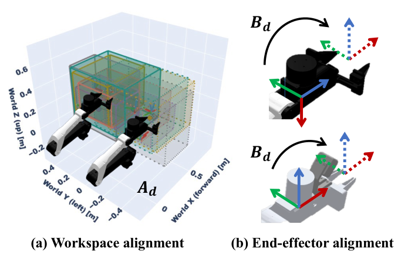

**Caption:** Figure 3: (a) Bounding boxes show the aligned workspaces of different datasets. (b) Aligned end-effector coordinate frames.

**Caption[CN]:** 图 3：(a) 边界框展示了不同数据集对齐后的工作空间。(b) 对齐后的末端执行器坐标系。

> <strong>Para. 4:</strong> Unified Action Space and Unified End-effector Coordinate Systems. Different robot datasets often adopt inconsistent coordinate systems and camera viewpoints, resulting in conflicting action representations for visually similar motions. For example, a leftward motion may correspond to the positive x-direction in one dataset but the negative y-direction in another, making it difficult for the model to learn the semantic meaning of each action dimension.

> <strong>Para. 4[CN]:</strong> 统一动作空间与统一末端执行器坐标系。不同机器人数据集通常采用不一致的坐标系和相机视点，导致视觉上相似的运动产生冲突的动作表示。例如，向左运动在一个数据集中可能对应正 x 方向，而在另一个数据集中则对应负 y 方向，这使得模型难以学习每个动作维度的语义含义。

> <strong>Para. 5:</strong> We focus on egocentric bimanual datasets, including ALOHA-style, humanoid-style, and human egocentric datasets. These datasets account for more than 80% of the total data and share a similar bimanual structure and camera viewpoint. We explicitly align their coordinate systems at two levels: (1) workspace alignment, which applies a world-frame transformation so that different robots have comparable end-effector workspaces; and (2) end-effector alignment, which applies a local transformation to standardize end-effector origins and axis orientations.

> <strong>Para. 5[CN]:</strong> 我们重点关注以第一人称双臂数据集为主的数据，包括 ALOHA 式、人形机器人式和人类第一人称数据集。这些数据集占总数据的 80% 以上，并共享相似的双臂结构和相机视点。我们在两个层面上显式对齐其坐标系：(1) 工作空间对齐，应用世界系变换使不同机器人具有相当的末端工作空间；(2) 末端执行器对齐，应用局部变换标准化末端执行器原点和轴向朝向。

> <strong>Para. 6:</strong> For an arm dataset $d$, let $T_d = {}^{W_d}T_{E_d} \in \mathrm{SE}(3)$ denote the original end-effector pose, where $W_d$ and $E_d$ are the dataset’s world and end-effector frames, respectively. We define the workspace alignment as $A_d = {}^{\bar{W}}T_{W_d}$ and the end-effector alignment as $B_d = {}^{E_d}T_{\bar{E}}$, where $\bar{W}$ and $\bar{E}$ denote the canonical world and end-effector frames. The aligned end-effector pose is given by $\tilde{T}_d = A_d T_d B_d$.

> <strong>Para. 6[CN]:</strong> 对于机械臂数据集 $d$，令 $T_d = {}^{W_d}T_{E_d} \in \mathrm{SE}(3)$ 表示原始末端执行器位姿，其中 $W_d$ 和 $E_d$ 分别是该数据集的世界系与末端系。我们将工作空间对齐定义为 $A_d = {}^{\bar{W}}T_{W_d}$，将末端执行器对齐定义为 $B_d = {}^{E_d}T_{\bar{E}}$，其中 $\bar{W}$ 和 $\bar{E}$ 表示规范的世界系与末端系。对齐后的末端执行器位姿由下式给出：$\tilde{T}_d = A_d T_d B_d$。

> <strong>Para. 7:</strong> Unified T-shape Multi-view Input across Datasets. Robotics datasets commonly contain observations from multiple camera views. We arrange them into a T-shaped composite image, with the primary view on the left and two auxiliary views stacked vertically on the right, as illustrated in the bottom-left panel of Figure 2. When fewer than two auxiliary views are available, we fill the missing slots with black placeholder images.

> <strong>Para. 7[CN]:</strong> 跨数据集的统一 T 形多视角输入。机器人数据集通常包含来自多个相机视角的观测。我们将它们排列成 T 形复合图像，主视角位于左侧，两个辅助视角在右侧垂直堆叠，如图 2 左下面板所示。当辅助视角少于两个时，我们用黑色占位图像填充缺失的位置。

## 3. VPP2: A Generalist Policy with Zero-Shot Capability

> <strong>Para. 1:</strong> Overview. Our large-scale, diverse, and densely annotated dataset enables us to train a policy with strong generalization capabilities. VPP2 builds upon the pretrained Wan2.1-I2V-14B model (Wan et al., 2025) and introduces an action expert via a mixture-of-transformers (MoT) architecture (Liang et al., 2025). Our training objective is twofold: we first adapt the video model to produce generalizable future predictions at real-time inference speed for open-ended manipulation tasks, and then train the action expert conditioned on the KV cache of the video model. To maximize policy generalization, we organize training into the stages summarized in Figure 4.

> <strong>Para. 1[CN]:</strong> 概览。我们的大规模、多样化且密集标注的数据集使我们能够训练出具有强大泛化能力的策略。VPP2 构建在预训练 Wan2.1-I2V-14B 模型（Wan 等，2025）之上，并通过混合 Transformer（MoT）架构（Liang 等，2025）引入动作专家。我们的训练目标是双重的：首先使视频模型适应为开放式操作任务提供具有实时推理速度的泛化未来预测，然后在视频模型 KV 缓存的条件下训练动作专家。为最大化策略泛化能力，我们将训练组织为图 4 中总结的各阶段。

### 3.1 Video Prediction Model Training Pipeline

> <strong>Para. 2:</strong> Stage 1: Event-level Video Model Continued Pre-training. We first adapt a pretrained video generation model to the manipulation domain through event-level continued pre-training. Each training example covers a complete manipulation subtask, aligning the subtask description with the corresponding visual evolution from the initial observation to subtask completion.

> <strong>Para. 2[CN]:</strong> 阶段 1：事件级视频模型持续预训练。我们首先通过事件级持续预训练使预训练视频生成模型适应操作领域。每个训练样本覆盖一个完整的操作子任务，使子任务描述与从初始观测到子任务完成的相应视觉演化保持对齐。

> <strong>Para. 3:</strong> Given a demonstration $\tau = (o_0, o_1, \dots, o_T)$, we uniformly sample $N$ future frames across the entire event:

> <strong>Para. 3[CN]:</strong> 给定一条示教轨迹 $\tau = (o_0, o_1, \dots, o_T)$，我们在整个事件中均匀采样 $N$ 个未来帧：

$$y_{\text{event}} = \left( o_0, o_{\lfloor T/N \rfloor}, o_{\lfloor 2T/N \rfloor}, \dots, o_T \right) \tag{1}$$

> <strong>Para. 4:</strong> where $T$ is the final frame index and $N$ excludes the initial conditioning frame $o_0$. Let $x_1 = \mathcal{E}(y_{\text{event}})$ denote the corresponding video latent representation, where $\mathcal{E}$ is the video encoder. We construct the interpolated latent as

> <strong>Para. 4[CN]:</strong> 其中 $T$ 为末帧索引，$N$ 不包含初始条件帧 $o_0$。令 $x_1 = \mathcal{E}(y_{\text{event}})$ 表示相应的视频潜变量表示，其中 $\mathcal{E}$ 为视频编码器。我们构建插值潜变量：

$$x_s = (1 - s)\epsilon + s x_1, \quad \epsilon \sim \mathcal{N}(0, I), \quad s \in [0, 1] \tag{2}$$

> <strong>Para. 5:</strong> where $s$ denotes flow time, with $s = 0$ corresponding to noise and $s = 1$ to data. The model is optimized with the flow matching objective (Lipman et al., 2023)

> <strong>Para. 5[CN]:</strong> 其中 $s$ 表示流时间，$s = 0$ 对应噪声，$s = 1$ 对应数据。模型通过流匹配目标（Lipman 等，2023）进行优化：

$$\mathcal{L}_{\text{FM}}(\theta) = \mathbb{E}_{(x_1, c), \epsilon, s} \left[ \|v_\theta(x_s, s, c) - (x_1 - \epsilon)\|_2^2 \right] \tag{3}$$

> <strong>Para. 6:</strong> where $v_\theta$ predicts the flow velocity and $c$ includes the subtask instruction and initial observation $o_0$. In this stage, we predict 49 frames at a resolution of $416 \times 240$ and continue pre-training Wan2.1-I2V-14B for 30,000 optimization steps with batch size 1,024 and learning rate 1e-5. Our experiments in Sec. 4.1 show that the resulting model achieves strong instruction following on manipulation tasks, outperforming the 64B Cosmos3-Super-Image2Video model (Agarwal et al., 2026).

> <strong>Para. 6[CN]:</strong> 其中 $v_\theta$ 预测流速度，$c$ 包括子任务指令与初始观测 $o_0$。在此阶段，我们以 $416 \times 240$ 的分辨率预测 49 帧，并在批大小为 1,024、学习率为 1e-5 的设置下对 Wan2.1-I2V-14B 进行 30,000 步优化。我们在第 4.1 节的实验表明，所得模型在操作任务上取得了强大的指令遵循能力，超越了 64B 参数的 Cosmos3-Super-Image2Video 模型（Agarwal 等，2026）。

> <strong>Para. 7:</strong> Stage 2: Chunk-level Video Model Post-training. Event-level continued pre-training enables the model to generalize well to manipulation tasks. However, sampling a fixed number of frames from events of different durations produces variable temporal intervals between predicted frames, complicating their alignment with downstream actions. We therefore further post-train the model to predict a fixed-duration future chunk, establishing a consistent temporal scale for action learning. In experiments, we predict 2 seconds for human-hand manipulation and 8 seconds for robot manipulation.

> <strong>Para. 7[CN]:</strong> 阶段 2：块级视频模型后训练。事件级持续预训练使模型能够很好地泛化到操作任务。然而，从不同持续时间的事件中采样固定数量的帧会导致预测帧之间的时间间隔发生变化，从而使其与下游动作的对齐变得复杂。因此，我们进一步对模型进行后训练以预测固定时长的未来块，从而为动作学习建立一致的时间尺度。在实验中，我们对人手操作预测 2 秒，对机器人操作预测 8 秒。

> <strong>Para. 8:</strong> Let $H$ denote the prediction horizon in seconds and $f$ the dataset frame rate in frames per second (fps). The nominal interval between sampled frames is $\delta = fH/N$, measured in dataset frames. For a chunk starting at frame $t$, the target video is

> <strong>Para. 8[CN]:</strong> 令 $H$ 表示以秒为单位的预测时域，$f$ 为数据集帧率（以每秒帧数 fps 计）。采样帧之间的名义间隔为 $\delta = fH/N$（以数据集帧数计量）。对于从第 $t$ 帧开始的块，目标视频为：

$$y_{\text{chunk}}^{(t)} = \left( o_t, o_{t+\lfloor \delta \rfloor}, o_{t+\lfloor 2\delta \rfloor}, \dots, o_{t+\lfloor N\delta \rfloor} \right) \tag{4}$$

### Figure 4. VPP2 训练流程设计

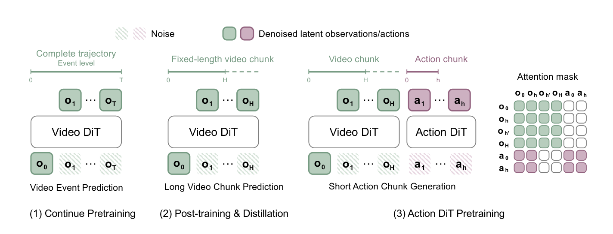

**Caption:** Figure 4: The VPP2 training pipeline is designed to maximize generalization. Stage 1 uses large-scale, event-level video pretraining to learn a generalizable video model for manipulation. Stage 2 post-trains and distills this model to predict long-horizon video chunks spanning 8 seconds in a single forward pass, taking approximately 0.1 seconds. Finally, Stage 3 trains an action expert to generate 2-second action chunks conditioned on the one-step video latents.

**Caption[CN]:** 图 4：VPP2 训练流程旨在最大化泛化能力。第 1 阶段采用大规模事件级视频预训练，为操作任务学习一个具有泛化能力的视频模型。第 2 阶段对该模型进行后训练和蒸馏，以在单次前向传播中预测跨度为 8 秒的长时域视频块，耗时约 0.1 秒。最后，第 3 阶段以单步视频潜变量为条件训练动作专家，以生成 2 秒的动作块。

> <strong>Para. 9:</strong> with conditioning inputs $c$ containing the observation $o_t$ and the corresponding subtask instruction. The index $t + \lfloor fH \rfloor$ is capped at the final frame index $T$, and we optimize the same flow matching objective in Eq. (3), with $x_1 = \mathcal{E}(y_{\text{chunk}}^{(t)})$.

> <strong>Para. 9[CN]:</strong> 条件输入 $c$ 包含观测 $o_t$ 及相应的子任务指令。索引 $t + \lfloor fH \rfloor$ 上限截断在末帧索引 $T$，我们优化式 (3) 中相同的流匹配目标，此时 $x_1 = \mathcal{E}(y_{\text{chunk}}^{(t)})$。

> <strong>Para. 10:</strong> Stage 2: Consistency Distillation. We distill the chunk-level video model for single-step generation (Song et al., 2023) by enforcing consistent terminal predictions at adjacent flow times:

> <strong>Para. 10[CN]:</strong> 阶段 2：一致性蒸馏。我们通过强化相邻流时间处的终点预测一致性，对块级视频模型进行蒸馏以实现单步生成（Song 等，2023）：

$$\mathcal{L}_{\text{CD}} = \mathbb{E} \left[ \lambda(s, s') \|F_\theta(x_s, s, c) - \text{stopgrad}(F_{\bar{\theta}}(\hat{x}_{s'}, s', c))\|_2^2 \right] \tag{5}$$

> <strong>Para. 11:</strong> where $0 \le s < s' \le 1$, $\hat{x}_{s'}$ is obtained by integrating the frozen teacher flow from $(x_s, s)$ to $s'$, and $\bar{\theta}$ denotes the EMA student parameters. The student satisfies $F_\theta(x, 1, c) = x$. To emphasize single-step generation, we sample $s' = 1$ with probability 0.5; otherwise, we sample $s'$ from the remaining flow times. At inference, the video latent is generated in a single forward pass as $F_\theta(\epsilon, 0, c)$.

> <strong>Para. 11[CN]:</strong> 其中 $0 \le s < s' \le 1$，$\hat{x}_{s'}$ 是通过将冻结的教师流从 $(x_s, s)$ 积分到 $s'$ 获得的，$\bar{\theta}$ 表示 EMA 学生参数。学生模型满足 $F_\theta(x, 1, c) = x$。为了突出单步生成能力，我们以 0.5 的概率采样 $s' = 1$；否则从其余流时间中采样 $s'$。在推理时，视频潜变量在单次前向传播中生成为 $F_\theta(\epsilon, 0, c)$。

### 3.2 Action Modeling

> <strong>Para. 12:</strong> Stage 3: Action Pretraining across Datasets. After training a generalizable video model, we train the action expert on our processed bimanual datasets with unified workspace and end-effector coordinate systems. The action expert is a 0.9B-parameter diffusion transformer (DiT) (Peebles & Xie, 2023) with a standard MoT architecture. Since the action expert is newly initialized, we freeze the base parameters of the video DiT during the early stages of action training and adapt the video backbone using only LoRA (Hu et al., 2022). This strategy helps preserve the pretrained video representations while limiting disruption from action-training gradients.

> <strong>Para. 12[CN]:</strong> 阶段 3：跨数据集动作预训练。在训练出泛化视频模型后，我们在经过处理的、具有统一工作空间和末端坐标系的双臂数据集上训练动作专家。动作专家是一个参数量为 0.9B 的扩散 Transformer（DiT）（Peebles & Xie，2023），采用标准的 MoT 架构。由于动作专家是新初始化的，我们在动作训练早期冻结视频 DiT 的基础参数，并仅使用 LoRA（Hu 等，2022）对视频骨干进行自适应调整。该策略有助于保留预训练的视频表示，同时限制动作训练梯度带来的干扰。

> <strong>Para. 13:</strong> Inference Latency. We generate video efficiently by reducing the video input to $17 \times 416 \times 240$ during post-training and distilling the video model for one-step generation, as described in Sec. 3.1. With bfloat16 precision and torch.compile, the video model takes approximately 0.12 seconds. The action expert then generates an action chunk conditioned on the video latents using five denoising steps, taking approximately 0.1 seconds. The total latency per action chunk is therefore approximately 0.22 seconds.

> <strong>Para. 13[CN]:</strong> 推理延迟。我们在后训练期间将视频输入减小至 $17 \times 416 \times 240$，并如第 3.1 节所述蒸馏视频模型以实现单步生成，从而高效生成视频。在 bfloat16 精度和 torch.compile 加速下，视频模型耗时约 0.12 秒。随后，动作专家以视频潜变量为条件，使用 5 个去噪步骤生成动作块，耗时约 0.1 秒。因此，每个动作块的总延迟约为 0.22 秒。

### 3.3 VLM for High-Level Planning

> <strong>Para. 14:</strong> Sub-task Planning. To tackle long-horizon tasks and handle ambiguous human instructions, we adopt a hierarchical architecture in which a VLM generates subtask plans (Shi et al., 2025). The VLM handles high-level reasoning, semantic understanding, and memory, allowing VPP2 to focus on mapping explicit instructions to trajectories. In practice, the VLM can be deployed locally or accessed through an API to a frontier model.

> <strong>Para. 14[CN]:</strong> 子任务规划。为了应对长程任务并处理模糊的人类指令，我们采用分层架构，由 VLM 生成子任务规划（Shi 等，2025）。VLM 处理高层推理、语义理解和记忆，使 VPP2 能够专注于将明确指令映射为轨迹。在实践中，VLM 既可以本地部署，也可以通过 API 调用前沿大模型。

> <strong>Para. 15:</strong> Prompt Enhancement. VLM planning also generates detailed subtask descriptions that match the caption template used during training. Prior work on video generation likewise highlights the importance of detailed captions for generation quality (Wan et al., 2025; Yang et al., 2025).

> <strong>Para. 15[CN]:</strong> 提示词增强。VLM 规划还能生成符合训练时描述模板的详细子任务描述。以往关于视频生成的研究同样强调了详细描述文本对于生成质量的重要性（Wan 等，2025；Yang 等，2025）。

### Figure 5. 人手与机器人操作的视频预测展示

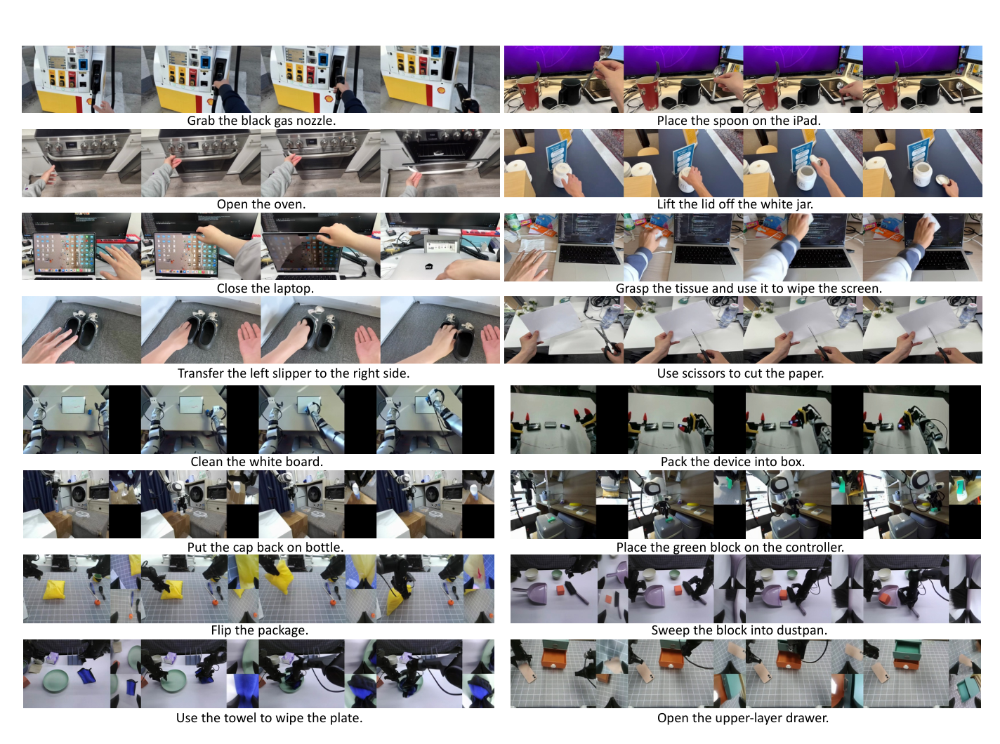

**Caption:** Figure 5: VPP2 video predictions for human-hand and robot manipulation. Trained on large-scale, diverse manipulation datasets, VPP2 generalizes across human hands and a wide range of robot embodiments. For robot manipulation, VPP2 jointly predicts one to three camera views arranged in a T-shaped composite. Due to space constraints, single-step video predictions after distillation are shown in Figure 10 in the appendix.

**Caption[CN]:** 图 5：VPP2 在人手和机器人操作任务中的视频预测结果。在大规模、多样化操作数据集上训练后，VPP2 能够泛化到人手以及广泛的机器人本体。对于机器人操作，VPP2 联合预测排列成 T 形复合图的 1 到 3 个相机视角。由于篇幅限制，蒸馏后的单步视频预测结果在附录图 10 中展示。

## 4. Experiments

> <strong>Para. 1:</strong> In this section, we conduct experiments to answer the following questions: (1) How does the motion quality of VPP2’s video predictions compare with that of state-of-the-art video foundation models on manipulation tasks? (2) How broad are VPP2’s zero-shot manipulation capabilities? (3) How well does VPP2 perform after domain-specific post-training?

> <strong>Para. 1[CN]:</strong> 在本节中，我们通过实验回答以下问题：(1) 在操作任务上，VPP2 视频预测的运动质量与最先进的视频基础模型相比如何？(2) VPP2 的零样本操作能力有多广泛？(3) 在经过特定领域后训练后，VPP2 的表现如何？

### 4.1 Video Prediction Quality Analysis

> <strong>Para. 2:</strong> Video Prediction for Human and Robot Manipulation. Figure 5 visualizes predictions for human-hand manipulation and diverse robot embodiments from the pretrained VPP2 model. To assess generalization, we randomly sample test cases from prior work (Chen et al., 2025; Zhang et al., 2026b) and take photographs in office environments and robot workspaces, pairing them with freely chosen manipulation instructions. Trained on data spanning more than 20 robot embodiments, VPP2 also generalizes to unseen embodiments and tasks, as shown in Figure 5. VPP2 also supports joint prediction across one to three camera views, with the primary view placed on the left and up to two auxiliary views stacked on the right.

> <strong>Para. 2[CN]:</strong> 人手与机器人操作的视频预测。图 5 可视化了预训练 VPP2 模型在人手操作和多样化机器人本体上的预测结果。为评估泛化能力，我们从先前工作（Chen 等，2025；Zhang 等，2026b）中随机抽取测试用例，并在办公室环境和机器人工作空间拍摄照片，将其与自由选择的操作指令配对。在涵盖 20 多种机器人本体的数据上训练后，VPP2 亦能泛化到未见过的本体和任务，如图 5 所示。VPP2 还支持跨 1 到 3 个相机视角的联合预测，主视角位于左侧，最多两个辅助视角垂直堆叠在右侧。

> <strong>Para. 3:</strong> Quantitative Comparisons. We compare VPP2 with four video foundation models and one ablation variant: (1) Wan-2.1-I2V-14B-480p (Wan et al., 2025), our base model; (2) LVP (Chen et al., 2025), which also adapts Wan-2.1-I2V-14B-480p to manipulation tasks; (3) Cosmos3-Nano-16B, which is extensively trained on robot manipulation data; (4) Cosmos3-Super-Image2Video-64B, the strongest model in the Cosmos 3 family (Agarwal et al., 2026); and (5) VPP2-Fixed-Step, an ablation of our method that predicts a fixed-duration future chunk rather than a complete event, potentially misaligning the predicted future with the instruction describing the full event.

> <strong>Para. 3[CN]:</strong> 定量对比。我们将 VPP2 与 4 个视频基础模型和 1 个消融变体进行对比：(1) Wan-2.1-I2V-14B-480p（Wan 等，2025），即我们的基座模型；(2) LVP（Chen 等，2025），其同样使 Wan-2.1-I2V-14B-480p 适应操作任务；(3) Cosmos3-Nano-16B，在大规模机器人操作数据上进行了广泛训练；(4) Cosmos3-Super-Image2Video-64B，Cosmos 3 系列中最强大的模型（Agarwal 等，2026）；以及 (5) VPP2-Fixed-Step，我们方法的消融变体，该变体预测固定时长的未来块而非完整事件，可能会导致预测的未来与描述完整事件的指令之间产生错位。

> <strong>Para. 4:</strong> We randomly collect 50 image–instruction pairs each for human-hand and robot manipulation and generate video predictions for every pair using each model. We first use a GPT-based evaluator to assess instruction-following success rates, reported in Table 2. Human evaluators then compare pairs of predictions to determine which better follows the instruction, yielding VPP2’s pairwise win rates against each baseline in Figure 6. VPP2’s advantages are most pronounced in complex manipulation scenarios requiring spatial understanding, as illustrated in Figure 7. We hypothesize that training with detailed captions encourages more accurate mappings from instructions to trajectories, contributing to these improvements.

> <strong>Para. 4[CN]:</strong> 我们分别为人手和机器人操作随机收集了 50 组图像—指令对，并使用每个模型为每对生成视频预测。我们首先使用基于 GPT 的评估器评估指令遵循成功率，结果列于表 2。随后，人类评估员对预测结果进行两两对比以判断哪一方更符合指令，得出图 6 中 VPP2 相对各基线的两两胜率。VPP2 的优势在需要空间理解的复杂操作场景中最为显著，如图 7 所示。我们推测，采用详细描述文本训练有助于建立从指令到轨迹的更精确映射，从而带来了这些性能提升。

### Table 2. 指令遵循成功率

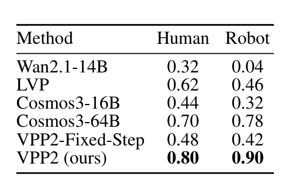

| Method | Human | Robot |
|---|---|---|
| Wan2.1-14B | 0.32 | 0.04 |
| LVP | 0.62 | 0.46 |
| Cosmos3-16B | 0.44 | 0.32 |
| Cosmos3-64B | 0.70 | 0.78 |
| VPP2-Fixed-Step | 0.48 | 0.42 |
| VPP2 (ours) | 0.80 | 0.90 |

**Caption:** Table 2: Instruction following success rates.

**Caption[CN]:** 表 2：指令遵循成功率。

### Figure 6. 视频预测胜率对比

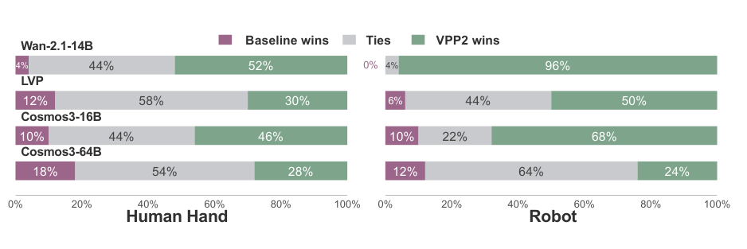

**Caption:** Figure 6: Win rates of the pretrained VPP2 model against different baselines on video prediction tasks.

**Caption[CN]:** 图 6：预训练 VPP2 模型在视频预测任务上相对不同基线模型的胜率。

### Figure 7. 复杂空间指令遵循对比

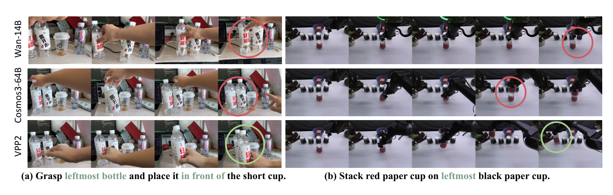

**Caption:** Figure 7: Comparison of instruction-following capabilities among VPP2, Wan-14B, and Cosmos3-64B. VPP2 demonstrates better instruction following on complex tasks requiring spatial understanding.

**Caption[CN]:** 图 7：VPP2、Wan-14B 与 Cosmos3-64B 之间指令遵循能力的对比。VPP2 在需要空间理解的复杂任务上表现出更优越的指令遵循能力。

### 4.2 Policy Performance Analysis

> <strong>Para. 5:</strong> Zero-shot Performance on Real-world Aloha Robot. After pretraining a strong video foundation model for manipulation, we post-train and distill it into a fast, single-step generator to support action learning. With its generalizable video predictions, VPP2 demonstrates strong zero-shot capabilities across open-ended manipulation tasks. We deploy VPP2 directly on a robot embodiment seen during training, without task-specific fine-tuning. For comparison, we train $\pi_{0.5}$ (Intelligence et al., 2025) and the Wan-14B version of Fast-WAM (Yuan et al., 2026) on the same data used in VPP2 training. We evaluate models on 10 different categories of zero-shot tasks and present results in Figure 8. VPP2 achieves an average success rate of 58.5%, compared with 40.0% for $\pi_{0.5}$ and 20.5% for Fast-WAM, and performs best in 9 of the 10 categories.

> <strong>Para. 5[CN]:</strong> 真实世界 ALOHA 机器人的零样本性能。在为操作任务预训练出强大的视频基础模型后，我们对其进行后训练并蒸馏为快速单步生成器以支持动作学习。凭借泛化视频预测，VPP2 在开放式操作任务中展示出强大的零样本能力。我们将 VPP2 直接部署在训练中见过的机器人本体上，无需针对特定任务微调。作为对比，我们在 VPP2 训练使用的相同数据上训练了 $\pi_{0.5}$（Intelligence 等，2025）和 Wan-14B 版本的 Fast-WAM（Yuan 等，2026）。我们在 10 个不同的零样本任务类别上对模型进行评估，并在图 8 中展示结果。VPP2 达到了 58.5% 的平均成功率，相比之下 $\pi_{0.5}$ 为 40.0%，Fast-WAM 为 20.5%，且 VPP2 在 10 个类别中的 9 个均表现最佳。

### Figure 8. 真实世界 ALOHA 零样本成功率

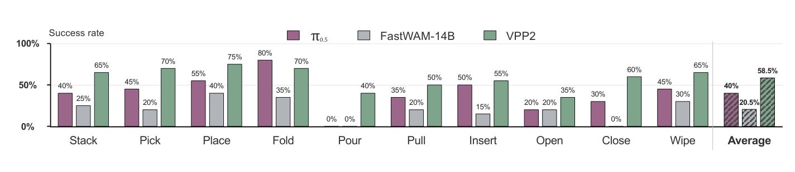

**Caption:** Figure 8: Zero-shot success rates on the real-world ALOHA across 10 randomly selected task categories. For a fair comparison, we finetune π0.5 and FastWAM on all ALOHA datasets exposed in VPP2’s training data and use the 14B variant of FastWAM.

**Caption[CN]:** 图 8：在真实世界 ALOHA 平台上 10 个随机选择的任务类别上的零样本成功率。为了公平对比，我们在 VPP2 训练数据中包含的所有 ALOHA 数据集上对 π0.5 和 FastWAM 进行微调，并使用 FastWAM 的 14B 参数变体。

> <strong>Para. 6:</strong> LIBERO-ID, LIBERO-Pro, and LIBERO-OOD Benchmarks. All models are trained exclusively on the four standard LIBERO suites (Liu et al., 2023) and are evaluated under three complementary settings. LIBERO-ID measures standard in-distribution manipulation performance. To assess generalization beyond the training distribution, we further evaluate on LIBERO-Pro (Zhou et al., 2025) and LIBERO-OOD (Li, 2025) without additional training. Following HarnessVLA (Zhang et al., 2026d), we evaluate the Position and Task perturbations of LIBERO-Pro, which test generalization to changes in object positions and task specifications, respectively. We further follow (Mishra et al., 2026) to evaluate compositional generalization on LIBERO-OOD, which recombines familiar objects, layouts, and goals into unseen task configurations along spatial, object, and goal dimensions. Per-suite LIBERO-ID results are provided in Appendix C.1.

> <strong>Para. 6[CN]:</strong> LIBERO-ID、LIBERO-Pro 和 LIBERO-OOD 基准测试。所有模型仅在四个标准 LIBERO 套件（Liu 等，2023）上训练，并在三种互补设置下进行评估。LIBERO-ID 衡量标准的分布内操作性能。为评估超出训练分布的泛化能力，我们在不进行额外训练的情况下进一步在 LIBERO-Pro（Zhou 等，2025）和 LIBERO-OOD（Li，2025）上进行评估。遵循 HarnessVLA（Zhang 等，2026d），我们评估 LIBERO-Pro 的位置扰动（Position）和任务扰动（Task），分别测试对物体位置变化和任务规格变化的泛化能力。我们进一步遵循（Mishra 等，2026）评估 LIBERO-OOD 上的组合泛化能力，该基准沿空间、物体和目标维度将熟悉的物体、布局和目标重组为未见过的任务配置。LIBERO-ID 各套件的详细结果见附录 C.1。

### Table 3. LIBERO-ID、LIBERO-Pro 和 LIBERO-OOD 后训练对比

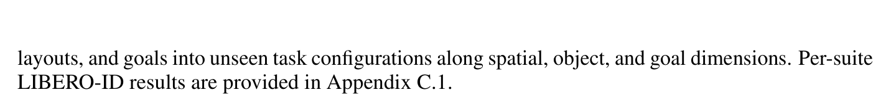

| Method | LIBERO-ID (Overall) | LIBERO-Pro (Position) | LIBERO-Pro (Task) | LIBERO-Pro (Overall) | LIBERO-OOD (Spatial) | LIBERO-OOD (Object) | LIBERO-OOD (Goal) | LIBERO-OOD (Overall) |
|---|---|---|---|---|---|---|---|---|
| π0 (Black et al., 2024) | 94.2 | 0.5 | 0.0 | 0.3 | 0.7 | 0.3 | 4.3 | 1.7 |
| π0.5 (Intelligence et al., 2025) | 96.9 | 20.8 | 1.3 | 11.0 | 36.7 | 2.3 | 41.7 | 26.8 |
| MolmoAct (Lee et al., 2025) | 86.6 | 1.5 | 1.5 | 1.5 | – | – | – | – |
| X-VLA (Zheng et al., 2026) | 98.1 | 0.8 | 6.8 | 3.8 | – | – | – | – |
| AtomVLA (Sun et al., 2026) | 97.0 | 7.3 | 5.3 | 6.3 | – | – | – | – |
| Cosmos-Policy (Kim et al., 2026) | 98.5 | – | – | – | 30.7 | 0.3 | 0.7 | 10.5 |
| Fast-WAM (Yuan et al., 2026) | 97.6 | – | – | – | 12.7 | 0.0 | 15.7 | 9.4 |
| DiT4DiT (Ma et al., 2026) | 98.6 | – | – | – | 9.0 | 0.0 | 10.3 | 6.4 |
| Temporal Ratio (Mishra et al., 2026) | 94.0 | – | – | – | 58.6 | 40.0 | 80.3 | 59.4 |
| VPP2 (Ours) | **98.8** | **42.3** | **47.8** | **45.0** | **59.3** | **44.5** | **87.7** | **63.9** |

**Caption:** Table 3: Post-training on LIBERO-ID, LIBERO-Pro, and LIBERO-OOD benchmarks. All models are trained exclusively on the four standard LIBERO suites (Liu et al., 2023) and are evaluated under three complementary settings.

**Caption[CN]:** 表 3：在 LIBERO-ID、LIBERO-Pro 和 LIBERO-OOD 基准上的后训练结果。所有模型仅在四个标准 LIBERO 套件（Liu et al., 2023）上训练，并在三种互补设置下进行评估。

> <strong>Para. 7:</strong> As shown in Table 3, while most baselines exceed 94% on LIBERO-ID, this in-distribution performance does not transfer to generalization. On LIBERO-Pro, VLA baselines drop to at most 11.0% overall, whereas VPP2 reaches 45.0%, with the largest gain on the Task perturbation (47.8% vs. 6.8%), indicating that VPP2 follows the given instruction rather than replaying memorized trajectories. On LIBERO-OOD, video-based policies such as Cosmos-Policy, Fast-WAM, and DiT4DiT reach at most 10.5%, while VPP2 achieves 63.9%, also surpassing Temporal Ratio (Mishra et al., 2026), which specifically targets this generalization gap. We attribute these gains to next-event video prediction with detailed captions, which establishes consistent mappings from instructions to future trajectories.

> <strong>Para. 7[CN]:</strong> 如表 3 所示，虽然大多数基线在 LIBERO-ID 上的成功率超过 94%，但这种分布内性能并未迁移为泛化能力。在 LIBERO-Pro 上，VLA 基线的总体成功率最高仅为 11.0%，而 VPP2 达到了 45.0%，其中在任务扰动上的提升最为显著（47.8% 对比 6.8%），这表明 VPP2 能够遵循给定指令而非机械复现记忆的轨迹。在 LIBERO-OOD 上，基于视频的策略如 Cosmos-Policy、Fast-WAM 和 DiT4DiT 最高仅达到 10.5%，而 VPP2 达到了 63.9%，同样超越了专门针对此泛化鸿沟提出的 Temporal Ratio（Mishra 等，2026）。我们将这些收益归功于带有详细描述文本的下一事件视频预测，它建立了从指令到未来轨迹的一致映射。

> <strong>Para. 8:</strong> RoboDojo Benchmark. RoboDojo (Chen et al., 2026) is a unified sim-and-real benchmark for evaluating generalist robot manipulation policies. Its simulation benchmark contains 42 bimanual tasks covering five capability dimensions: generalization, memory, precision, long-horizon execution, and open-vocabulary instruction following. We follow the official training and evaluation protocol and report both the success rate and the average score, which captures partial task progress.

> <strong>Para. 8[CN]:</strong> RoboDojo 基准测试。RoboDojo（Chen 等，2026）是一个用于评估通用机器人操作策略的虚实统一基准。其仿真基准包含 42 个双臂任务，涵盖五个能力维度：泛化性、记忆力、精确度、长程执行和开放词汇指令遵循。我们遵循官方训练和评估协议，报告成功率以及反映部分任务进度的平均得分。

> <strong>Para. 9:</strong> As shown in Table 4, VPP2 achieves an average score of 39.26 and a success rate of 32.26%, achieving state-of-the-art performance. It outperforms representative VLAs such as $\pi_{0.5}$ (Intelligence et al., 2025), X-VLA (Zheng et al., 2026), and Xiaomi-Robotics-1 (Guo et al., 2026), world action models such as Fast-WAM (Yuan et al., 2026) and OpenWAM-$\alpha$ (Wang et al., 2026a), and the frontier foundation model GPT-6-Astra (Zhang et al., 2026c) (28.97 / 22.48%). Per-dimension results are provided in Appendix C.2.

> <strong>Para. 9[CN]:</strong> 如表 4 所示，VPP2 取得了 39.26 的平均得分和 32.26% 的成功率，达到最先进性能。它超越了代表性 VLA 模型如 $\pi_{0.5}$（Intelligence 等，2025）、X-VLA（Zheng 等，2026）和 Xiaomi-Robotics-1（Guo 等，2026），世界动作模型如 Fast-WAM（Yuan 等，2026）和 OpenWAM-$\alpha$（Wang 等，2026a），以及前沿基座模型 GPT-6-Astra（Zhang 等，2026c）（28.97 / 22.48%）。各维度的详细结果见附录 C.2。

### Table 4. RoboDojo 仿真基准后训练结果

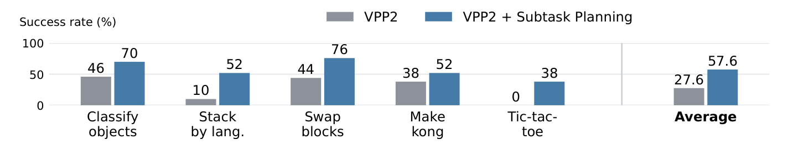

| Metric | π0 | π0.5 | X-VLA | Fast-WAM | OpenWAM-α | Xiaomi-Robotics-1 | GPT-6-Astra | VPP2 (Ours) |
|---|---|---|---|---|---|---|---|---|
| Avg. Score | 3.48 | 11.44 | 10.13 | 3.48 | 17.18 | 20.07 | 28.97 | **39.26** |
| Success Rate (%) | 1.53 | 6.93 | 6.52 | 2.03 | 11.92 | 13.93 | 22.48 | **32.26** |

**Caption:** Table 4: Post-training results on the RoboDojo simulation benchmark. Average score captures partial task progress, and success rate measures binary task completion; both are averaged over the five capability dimensions. Baseline results are taken from the official leaderboard.

**Caption[CN]:** 表 4：在 RoboDojo 仿真基准上的后训练结果。平均得分（Average score）反映部分任务进度，成功率（Success rate）衡量二元任务完成度；两者均在五个能力维度上取平均值。基线结果取自官方排行榜。

> <strong>Para. 10:</strong> VPP2 with Subtask Planning. The VPP2 results in Table 4 use full-task instructions without subtask planning. We further investigate VLM-based subtask planning on five selected RoboDojo task groups covering object classification, block stacking, block swapping, mahjong, and tic-tac-toe. To train the subtask-conditioned policy, we segment demonstrations and pair each segment with a subtask instruction. At test time, a vision-language model (VLM) uses visual observations and execution feedback to select the next subtask for VPP2 to execute.

> <strong>Para. 10[CN]:</strong> 带子任务规划的 VPP2。表 4 中的 VPP2 结果使用的是全任务指令，未使用子任务规划。我们进一步在 5 个精选的 RoboDojo 任务组上研究了基于 VLM 的子任务规划，涵盖物体分类、积木堆叠、积木交换、麻将对决和井字棋。为了训练以子任务为条件的策略，我们将示教分割并将每个片段与子任务指令配对。在测试时，视觉语言模型（VLM）利用视觉观测和执行反馈为 VPP2 选择下一步要执行的子任务。

### Figure 9. 基于 VLM 的子任务规划对比

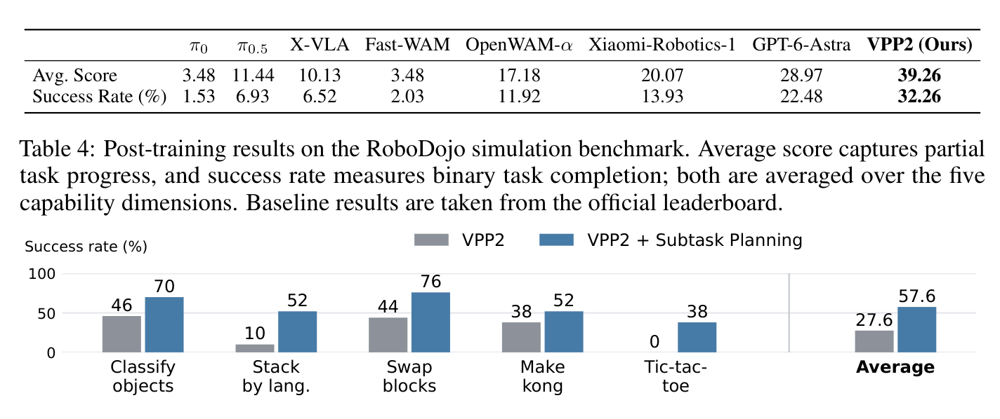

**Caption:** Figure 9: Success rates with and without VLM-based subtask planning (50 trials per task). Average is the five-task mean; the baseline checkpoint matches Table 4.

**Caption[CN]:** 图 9：使用和不使用基于 VLM 的子任务规划时的成功率（每个任务 50 次试验）。Average 为五个任务的均值；基线模型检查点与表 4 一致。

> <strong>Para. 11:</strong> Figure 9 summarizes the results across the five selected task groups. The evaluated planning configurations achieve an average success rate of 57.6%, compared with 27.6% for the baseline. The largest gains occur in language-conditioned block stacking (10% to 52%) and tic-tac-toe (0% to 38%).

> <strong>Para. 11[CN]:</strong> 图 9 总结了所选 5 个任务组的结果。评估的规划配置实现了 57.6% 的平均成功率，相比之下基线为 27.6%。最大的增益出现在语言条件积木堆叠（从 10% 提升至 52%）和井字棋（从 0% 提升至 38%）任务中。

## 5. Related Works

> <strong>Para. 1:</strong> Video Foundation Model. Video generation has advanced rapidly through latent diffusion models (Blattmann et al., 2023b;a) and large-scale diffusion transformer models (Yang et al., 2025; Wan et al., 2025; Agarwal et al., 2025; 2026). Large-scale bidirectional video models provide strong general-purpose video priors; even recent autoregressive generators build on pretrained bidirectional models, using them for initialization or as teachers before causal adaptation and distillation (Yin et al., 2025; Huang et al., 2025). This motivates our strategy of first learning a generalizable video model and then adapting it for efficient prediction. Besides the training strategy, prompt enhancement is an important component of video foundation models (Yang et al., 2025; Wan et al., 2025). Similarly, we use a VLM to produce detailed, manipulation-specific descriptions that reduce ambiguity in these mappings. After establishing this manipulation-focused video prior, we post-train the model for fixed-horizon prediction and distill it for single-step generation to support efficient action learning.

> <strong>Para. 1[CN]:</strong> 视频基础模型。视频生成通过潜在扩散模型（Blattmann 等，2023b,a）和大规模扩散 Transformer 模型（Yang 等，2025；Wan 等，2025；Agarwal 等，2025, 2026）取得了飞速发展。大规模双向视频模型提供了强大的通用视频先验；即使近期的自回归生成器也构建在预训练双向模型之上，在因果适配与蒸馏之前将其用作初始化或教师模型（Yin 等，2025；Huang 等，2025）。这启示了我们的策略：首先学习一个具有泛化能力的视频模型，然后将其适配以实现高效预测。除训练策略外，提示词增强也是视频基础模型的重要组成部分（Yang 等，2025；Wan 等，2025）。类似地，我们使用 VLM 生成详细的操作特定描述，以减少这些映射中的歧义。在建立这种专注于操作的视频先验后，我们对模型进行后训练以进行固定时域预测，并对其进行蒸馏以实现单步生成，从而支持高效的动作学习。

> <strong>Para. 2:</strong> World Action Model. World action models (WAMs) leverage video prediction to facilitate robot policy learning. Early approaches first generate future frames and then infer actions through inverse dynamics (Du et al., 2023; Black et al., 2023; Bharadhwaj et al., 2024; Liang et al., 2024; Feng et al., 2025), but iterative video generation can incur substantial latency for closed-loop control. Hierarchical approaches also combine video-based motion planning with reactive VLA control (Zhang et al., 2026e). More recent approaches condition actions on features from video models (Hu et al., 2024; Liao et al., 2025; Jia et al., 2025; Yan et al., 2026b) or jointly learn visual prediction and action generation (Zhang et al., 2025; Guo et al., 2024; Li et al., 2025b; Zhu et al., 2025; Ma et al., 2026; Kim et al., 2026; Yan et al., 2026a; Ye et al., 2026; Li et al., 2026a; Bi et al., 2026; Motubrain Team et al., 2026). Recent work also explores event-grounded world-action learning (Li et al., 2026b) and large-scale manipulation-specific pretraining (AgiBot Research Team et al., 2026). Nevertheless, action learning can compromise pretrained capabilities, including video-model generalization (Mishra et al., 2026) and VLM semantic understanding (Zhang et al., 2026a). VPP2 emphasizes instruction-aligned future prediction, combining event-level pretraining with detailed captions, fixed-horizon post-training, and single-step distillation to provide an efficient video backbone for action learning.

> <strong>Para. 2[CN]:</strong> 世界动作模型。世界动作模型（WAM）利用视频预测来促进机器人策略学习。早期方法首先生成未来帧，然后通过逆动力学推断动作（Du 等，2023；Black 等，2023；Bharadhwaj 等，2024；Liang 等，2024；Feng 等，2025），但迭代式视频生成在闭环控制中会引入显著延迟。分层方法也将基于视频的运动规划与反应式 VLA 控制相结合（Zhang 等，2026e）。更近期的工作以视频模型的特征为条件生成动作（Hu 等，2024；Liao 等，2025；Jia 等，2025；Yan 等，2026b），或联合学习视觉预测与动作生成（Zhang 等，2025；Guo 等，2024；Li 等，2025b；Zhu 等，2025；Ma 等，2026；Kim 等，2026；Yan 等，2026a；Ye 等，2026；Li 等，2026a；Bi 等，2026；Motubrain Team 等，2026）。近期的研究还探索了事件感知的世界动作学习（Li 等，2026b）和面向操作的大规模预训练（AgiBot Research Team 等，2026）。尽管如此，动作学习可能会损害已预训练的能力，包括视频模型的泛化性（Mishra 等，2026）和 VLM 的语义理解能力（Zhang 等，2026a）。VPP2 强调与指令对齐的未来预测，将带有详细描述文本的事件级预训练、固定时域后训练和单步蒸馏相结合，为动作学习提供了高效的视频骨干网络。

## 6. Conclusion

> <strong>Para. 1:</strong> We presented Video Prediction Policy 2 (VPP2), a world action model that achieves strong zero-shot generalization in both video prediction and action generation. We first continue pretraining the base video model to produce generalizable, instruction-following predictions, then learn a policy while preserving these predictive capabilities. Experiments show that VPP2 follows manipulation instructions more faithfully than substantially larger video foundation models, exhibits strong zero-shot manipulation capabilities on a real-world ALOHA platform, and achieves the highest success rates after post-training on challenging benchmarks. We hope these findings encourage future WAM research to look beyond architectural choices for action modeling and place greater emphasis on learning generalizable video predictions and preserving this generalization during action learning.

> <strong>Para. 1[CN]:</strong> 我们提出了视频预测策略 2（VPP2），这是一种在视频预测和动作生成两方面均实现强零样本泛化能力的世界动作模型。我们首先对基础视频模型进行持续预训练以生成具有泛化性、遵循指令的预测，随后在保留这些预测能力的同时学习动作策略。实验表明，VPP2 相比体量大得多的视频基础模型能够更忠实地遵循操作指令，在真实世界 ALOHA 平台上展示出强大的零样本操作能力，并在极具挑战性的基准测试后训练后取得了最高成功率。我们希望这些发现能激励未来的 WAM 研究不仅关注动作建模的架构选择，更要高度重视学习具有泛化能力的视频预测，并在动作学习过程中保持这种泛化能力。

## Acknowledgments and Statements

### Acknowledgments

> <strong>Para. 1:</strong> We thank Yucheng Hu and Jianke Zhang for insightful discussions that greatly benefited the development of VPP2.

> <strong>Para. 1[CN]:</strong> 我们感谢 Yucheng Hu 和 Jianke Zhang 富有洞见的讨论，这极大地促进了 VPP2 的研发。

### AI Use Statement

> <strong>Para. 2:</strong> We used generative AI tools to assist with language polishing, improve the clarity and readability of the manuscript, and draft portions of the paper. In the research process, these tools were used to suggest experimental parameter settings and assist with searches for relevant literature and technical information. We also used AI tools to annotate human and robotic manipulation datasets at scale for model training. The authors evaluated the suggestions and made the final decisions regarding experimental design and parameter selection. All AI-assisted text was reviewed and revised by the authors, and retrieved information was checked against original sources before use. The authors take full responsibility for the final content of the paper, including its data, claims, results, and references.

> <strong>Para. 2[CN]:</strong> 我们使用生成式 AI 工具辅助进行语言润色、提升文稿清晰度与可读性，并起草了论文的部分内容。在研究过程中，这些工具用于建议实验参数设置，并协助检索相关文献与技术信息。我们还使用 AI 工具大规模标注人类与机器人操作数据集以供模型训练。作者对相关建议进行了评估，并对实验设计和参数选择做出最终决定。所有 AI 辅助生成的文本均由作者审核和修改，检索到的信息在使用前均与原始来源进行了核对。作者对论文的最终内容（包括数据、论点、结果和参考文献）负全部责任。

### Reproducibility Statement

> <strong>Para. 3:</strong> We describe the model architecture, training objectives, and evaluation protocols in the main text, with additional data processing details provided in the appendix. Detailed training configurations, code, and model checkpoints are available on our project website.

> <strong>Para. 3[CN]:</strong> 我们在正文中详细阐述了模型架构、训练目标和评估协议，并在附录中提供了额外的数据处理细节。详细的训练配置、代码以及模型检查点均可在我们的项目网站上获取。

## References

The complete reference list [1]–[48] is retained in searchable bibliographic form below, preserving exact author lists, publication venues, years, and identifiers. Bibliographic citations are maintained in their original published form for academic precision and exact reference chaining.

1. Niket Agarwal, Arslan Ali, Maciej Bala, Yogesh Balaji, Erik Barker, Tiffany Cai, Prithvijit Chattopadhyay, Yongxin Chen, Yin Cui, Yifan Ding, et al. Cosmos world foundation model platform for physical ai. arXiv preprint arXiv:2501.03575, 2025.
2. Niket Agarwal, Arslan Ali, Jon Allen, Martin Antolini, Adeline Aubame, Alisson Azzolini, Junjie Bai, Maciej Bala, Yogesh Balaji, Josh Bapst, et al. Cosmos 3: Omnimodal world models for physical ai. arXiv preprint arXiv:2606.02800, 2026.
3. AgiBot Research Team, Renhang Liu, Wenzhi Zhao, Zhuo Yang, Liliang Chen, Pengfei Zhou, Shengcong Chen, Guanghui Ren, Youlun Peng, Rongjun Jin, et al. GE-Act 2.0: Pretraining and scaling a world-action model for robotic manipulation. arXiv preprint arXiv:2609.05588, 2026.
4. Arthur Allshire, Himanshu Gaurav Singh, Ritvik Singh, Adam Rashid, Hongsuk Choi, David McAllister, Justin Yu, Yiyuan Chen, Huang Huang, Pieter Abbeel, et al. Scalable Behavior Cloning with Open Data, Training, and Evaluation. arXiv preprint arXiv:2606.27375, 2026.
5. Shuai Bai, Yuxuan Cai, Ruizhe Chen, Keqin Chen, Xionghui Chen, Zesen Cheng, Lianghao Deng, Wei Ding, Chang Gao, Chunjiang Ge, et al. Qwen3-vl technical report. arXiv preprint arXiv:2511.21631, 2025.
6. Homanga Bharadhwaj, Debidatta Dwibedi, Abhinav Gupta, Shubham Tulsiani, Carl Doersch, Ted Xiao, Dhruv Shah, Fei Xia, Dorsa Sadigh, and Sean Kirmani. Gen2act: Human video generation in novel scenarios enables generalizable robot manipulation. arXiv preprint arXiv:2409.16283, 2024.
7. Hongzhe Bi, Hengkai Tan, Shenghao Xie, Zeyuan Wang, Shuhe Huang, Haitian Liu, Ruowen Zhao, Yao Feng, Chendong Xiang, Yinze Rong, Hongyan Zhao, Hanyu Liu, Zhizhong Su, Lei Ma, Hang Su, and Jun Zhu. Motus: A unified latent action world model. In Proceedings of the IEEE/CVF Conference on Computer Vision and Pattern Recognition, pp. 35101–35113, 2026.
8. Kevin Black, Mitsuhiko Nakamoto, Pranav Atreya, Homer Walke, Chelsea Finn, Aviral Kumar, and Sergey Levine. Zero-shot robotic manipulation with pretrained image-editing diffusion models. arXiv preprint arXiv:2310.10639, 2023.
9. Kevin Black, Noah Brown, Danny Driess, Adnan Esmail, Michael Equi, Chelsea Finn, Niccolo Fusai, Lachy Groom, Karol Hausman, Brian Ichter, et al. π0: A vision-language-action flow model for general robot control. arXiv preprint arXiv:2410.24164, 2024.
10. Andreas Blattmann, Tim Dockhorn, Sumith Kulal, Daniel Mendelevitch, Maciej Kilian, Dominik Lorenz, Yam Levi, Zion English, Vikram Voleti, Adam Letts, et al. Stable video diffusion: Scaling latent video diffusion models to large datasets. arXiv preprint arXiv:2311.15127, 2023a.
11. Andreas Blattmann, Robin Rombach, Huan Ling, Tim Dockhorn, Seung Wook Kim, Sanja Fidler, and Karsten Kreis. Align your latents: High-resolution video synthesis with latent diffusion models. In Proceedings of the IEEE/CVF Conference on Computer Vision and Pattern Recognition, pp. 22563–22575, 2023b.
12. Qingwen Bu, Jisong Cai, Li Chen, Xiuqi Cui, Yan Ding, Siyuan Feng, Xindong He, Xu Huang, et al. AgiBot World Colosseo: A Large-scale Manipulation Platform for Scalable and Intelligent Embodied Systems. In IEEE/RSJ International Conference on Intelligent Robots and Systems, 2025.
13. Bytedance Seed. Seed2.0 model card: Towards intelligence frontier for real-world complexity. arXiv preprint arXiv:2607.00248, 2026.
14. Boyuan Chen, Tianyuan Zhang, Haoran Geng, Caiyi Zhang, Peihao Li, Kiwhan Song, William T Freeman, Jitendra Malik, Pieter Abbeel, Russ Tedrake, et al. Large video planner enables generalizable robot control. arXiv preprint arXiv:2512.15840, 2025.
15. Tianxing Chen, Yue Chen, Zixuan Li, Junyuan Tang, Kailun Su, Haoran Lu, Weijie Wan, Baijun Chen, Songling Liu, Haowen Yan, et al. Robodojo: A unified sim-and-real benchmark for comprehensive evaluation of generalist robot manipulation policies. arXiv preprint arXiv:2607.04434, 2026.
16. Tsai-Shien Chen, Aliaksandr Siarohin, Willi Menapace, Ekaterina Deyneka, Hsiang-wei Chao, Byung Eun Jeon, Yuwei Fang, Hsin-Ying Lee, Jian Ren, Ming-Hsuan Yang, and Sergey Tulyakov. Panda-70M: Captioning 70m videos with multiple cross-modality teachers. In Proceedings of the IEEE/CVF Conference on Computer Vision and Pattern Recognition, 2024.
17. Dima Damen, Hazel Doughty, Giovanni Maria Farinella, Sanja Fidler, Antonino Furnari, Evangelos Kazakos, Davide Moltisanti, Jonathan Munro, Toby Perrett, Will Price, and Michael Wray. Scaling egocentric vision: The EPIC-KITCHENS dataset. In European Conference on Computer Vision, 2018.
18. Yilun Du, Sherry Yang, Bo Dai, Hanjun Dai, Ofir Nachum, Josh Tenenbaum, Dale Schuurmans, and Pieter Abbeel. Learning universal policies via text-guided video generation. Advances in Neural Information Processing Systems, 36, 2023.
19. Hao-Shu Fang, Hongjie Fang, Zhenyu Tang, Jirong Liu, Chenxi Wang, Junbo Wang, Haoyi Zhu, and Cewu Lu. RH20T: A Comprehensive Robotic Dataset for Learning Diverse Skills in One-Shot. In IEEE International Conference on Robotics and Automation, 2024.
20. Yao Feng, Hengkai Tan, Xinyi Mao, Guodong Liu, Shuhe Huang, Chendong Xiang, Hang Su, and Jun Zhu. Vidar: Embodied video diffusion model for generalist bimanual manipulation. arXiv preprint arXiv:2507.12898, 2025.
21. Raghav Goyal, Samira Ebrahimi Kahou, Vincent Michalski, Joanna Materzynska, Susanne Westphal, Heuna Kim, Valentin Haenel, Ingo Fruend, Peter Yianilos, Moritz Mueller-Freitag, Florian Hoppe, Christian Thurau, Ingo Bax, and Roland Memisevic. The “Something Something” video database for learning and evaluating visual common sense. In Proceedings of the IEEE International Conference on Computer Vision, pp. 5842–5850, 2017.
22. Kristen Grauman, Andrew Westbury, Eugene Byrne, Zachary Chavis, Antonino Furnari, Rohit Girdhar, Jackson Hamburger, Hao Jiang, Miao Liu, Xingyu Liu, et al. Ego4D: Around the world in 3,000 hours of egocentric video. In Proceedings of the IEEE/CVF Conference on Computer Vision and Pattern Recognition, pp. 18995–19012, 2022.
23. Jun Guo, Piaopiao Jin, Jason Li, Peiyan Li, Yingyan Li, Futeng Liu, Wanli Peng, Optimus Qin, Yifei Su, Nan Sun, et al. Xiaomi-robotics-1: Scaling vision-language-action models with over 100k hours of real-world trajectories. arXiv preprint arXiv:2607.15330, 2026.
24. Yanjiang Guo, Yucheng Hu, Jianke Zhang, Yen-Jen Wang, Xiaoyu Chen, Chaochao Lu, and Jianyu Chen. Prediction with action: Visual policy learning via joint denoising process. Advances in Neural Information Processing Systems, 37:112386–112410, 2024.
25. Ryan Hoque, Peide Huang, David J. Yoon, Mouli Sivapurapu, and Jian Zhang. EgoDex: Learning Dexterous Manipulation from Large-Scale Egocentric Video. arXiv preprint arXiv:2505.11709, 2025.
26. Edward J. Hu, Yelong Shen, Phillip Wallis, Zeyuan Allen-Zhu, Yuanzhi Li, Shean Wang, Lu Wang, and Weizhu Chen. LoRA: Low-rank adaptation of large language models. In International Conference on Learning Representations, 2022.
27. Yucheng Hu, Yanjiang Guo, Pengchao Wang, Xiaoyu Chen, Yen-Jen Wang, Jianke Zhang, Koushil Sreenath, Chaochao Lu, and Jianyu Chen. Video prediction policy: A generalist robot policy with predictive visual representations. arXiv preprint arXiv:2412.14803, 2024.
28. Xun Huang, Zhengqi Li, Guande He, Mingyuan Zhou, and Eli Shechtman. Self forcing: Bridging the train-test gap in autoregressive video diffusion. In Advances in Neural Information Processing Systems, volume 38, 2025.
29. Physical Intelligence, Kevin Black, Noah Brown, James Darpinian, Karan Dhabalia, Danny Driess, Adnan Esmail, Michael Equi, Chelsea Finn, Niccolo Fusai, et al. π0.5: a vision-language-action model with open-world generalization. arXiv preprint arXiv:2504.16054, 2025.
30. Yueru Jia, Jiaming Liu, Shengbang Liu, Rui Zhou, Wanhe Yu, Yuyang Yan, Xiaowei Chi, Yandong Guo, Boxin Shi, and Shanghang Zhang. Video2Act: A dual-system video diffusion policy with robotic spat-motional modeling. arXiv preprint arXiv:2512.03044, 2025.
31. Tao Jiang, Tianyuan Yuan, Yicheng Liu, Chenhao Lu, Jianning Cui, Xiao Liu, Shuiqi Cheng, Jiyang Gao, Huazhe Xu, and Hang Zhao. Galaxea Open-World Dataset and G0 Dual-System VLA Model. arXiv preprint arXiv:2509.00576, 2025.
32. Alexander Khazatsky, Karl Pertsch, Suraj Nair, Ashwin Balakrishna, Sudeep Dasari, Siddharth Karamcheti, Soroush Nasiriany, Mohan Kumar Srirama, Lawrence Yunliang Chen, Kirsty Ellis, et al. Droid: A large-scale in-the-wild robot manipulation dataset. arXiv preprint arXiv:2403.12945, 2024.
33. Moo Jin Kim, Yihuai Gao, Tsung-Yi Lin, Yen-Chen Lin, Yunhao Ge, Grace Lam, Percy Liang, Shuran Song, Ming-Yu Liu, Chelsea Finn, and Jinwei Gu. Cosmos policy: Fine-tuning video models for visuomotor control and planning. arXiv preprint arXiv:2601.16163, 2026.
34. Jason Lee, Jiafei Duan, Haoquan Fang, Yuquan Deng, Shuo Liu, Boyang Li, Bohan Fang, Jieyu Zhang, Yi Ru Wang, Sangho Lee, et al. Molmoact: Action reasoning models that can reason in space. arXiv preprint arXiv:2508.07917, 2025.
35. Lin Li, Qihang Zhang, Yiming Luo, Shuai Yang, Ruilin Wang, Fei Han, Mingrui Yu, Zelin Gao, Nan Xue, Xing Zhu, Yujun Shen, and Yinghao Xu. Causal world modeling for robot control. arXiv preprint arXiv:2601.21998, 2026a.
36. Qixiu Li, Yu Deng, Yaobo Liang, Lin Luo, Lei Zhou, Chengtang Yao, Lingqi Zeng, Zhiyuan Feng, Huizhi Liang, Sicheng Xu, Yizhong Zhang, Xi Chen, Hao Chen, Lily Sun, Dong Chen, Jiaolong Yang, and Baining Guo. Scalable vision-language-action model pretraining for robotic manipulation with real-life human activity videos. arXiv preprint arXiv:2510.21571, 2025a.
37. Quanyi Li. Vlas are confined yet capable of generalizing to novel instructions. arXiv preprint arXiv:2505.03500, 2025.
38. Shalfun Li, Victor Yao, Charles Yang, Truth Qu, Regis Cheng, Ryan Yu, Howard Lu, Newton Von, Vincent Chen, Yohann Tang, et al. WALL-WM: Carving world action modeling at the event joints. arXiv preprint arXiv:2606.01955, 2026b.
39. Shuang Li, Yihuai Gao, Dorsa Sadigh, and Shuran Song. Unified video action model. arXiv preprint arXiv:2503.00200, 2025b.
40. Junbang Liang, Ruoshi Liu, Ege Ozguroglu, Sruthi Sudhakar, Achal Dave, Pavel Tokmakov, Shuran Song, and Carl Vondrick. Dreamitate: Real-world visuomotor policy learning via video generation. arXiv preprint arXiv:2406.16862, 2024.
41. Weixin Liang, Lili Yu, Liang Luo, Srinivasan Iyer, Ning Dong, Chunting Zhou, Gargi Ghosh, Mike Lewis, Wen-tau Yih, Luke Zettlemoyer, and Xi Victoria Lin. Mixture-of-Transformers: A sparse and scalable architecture for multi-modal foundation models. Transactions on Machine Learning Research, 2025.
42. Yue Liao, Pengfei Zhou, Siyuan Huang, Donglin Yang, Shengcong Chen, Yuxin Jiang, Yue Hu, Jingbin Cai, Si Liu, Jianlan Luo, et al. Genie envisioner: A unified world foundation platform for robotic manipulation. arXiv preprint arXiv:2508.05635, 2025.
43. Yaron Lipman, Ricky T. Q. Chen, Heli Ben-Hamu, Maximilian Nickel, and Matt Le. Flow matching for generative modeling. In International Conference on Learning Representations, 2023.
44. Bo Liu, Yifeng Zhu, Chongkai Gao, Yihao Feng, Qiang Liu, Yuke Zhu, and Peter Stone. Libero: Benchmarking knowledge transfer for lifelong robot learning. Advances in Neural Information Processing Systems, 36, 2023.
45. Songming Liu, Lingxuan Wu, Bangguo Li, Hengkai Tan, Huayu Chen, Zhengyi Wang, Ke Xu, Hang Su, and Jun Zhu. Rdt-1b: a diffusion foundation model for bimanual manipulation. arXiv preprint arXiv:2410.07864, 2024.
46. Teli Ma, Jia Zheng, Zifan Wang, Chunli Jiang, Andy Cui, Junwei Liang, and Shuo Yang. Dit4dit: Jointly modeling video dynamics and actions for generalizable robot control. arXiv preprint arXiv:2603.10448, 2026.
47. Farzaneh Mahdisoltani, Guillaume Berger, Waseem Gharbieh, David Fleet, and Roland Memisevic. On the effectiveness of task granularity for transfer learning. arXiv preprint arXiv:1804.09235, 2018.
48. Chuning Zhu, Raymond Yu, Siyuan Feng, Benjamin Burchfiel, Paarth Shah, and Abhishek Gupta. Unified world models: Coupling video and action diffusion for pretraining on large robotic datasets. arXiv preprint arXiv:2504.02792, 2025.

## Appendix A: Dataset Process Details

> <strong>Para. 1:</strong> Dataset Sources. Table 5 provides the full dataset references for the training data summarized in Table 1.

> <strong>Para. 1[CN]:</strong> 数据集来源。表 5 提供了表 1 中总结的训练数据的完整数据集参考文献。

### Table 5. 训练数据源及其参考文献

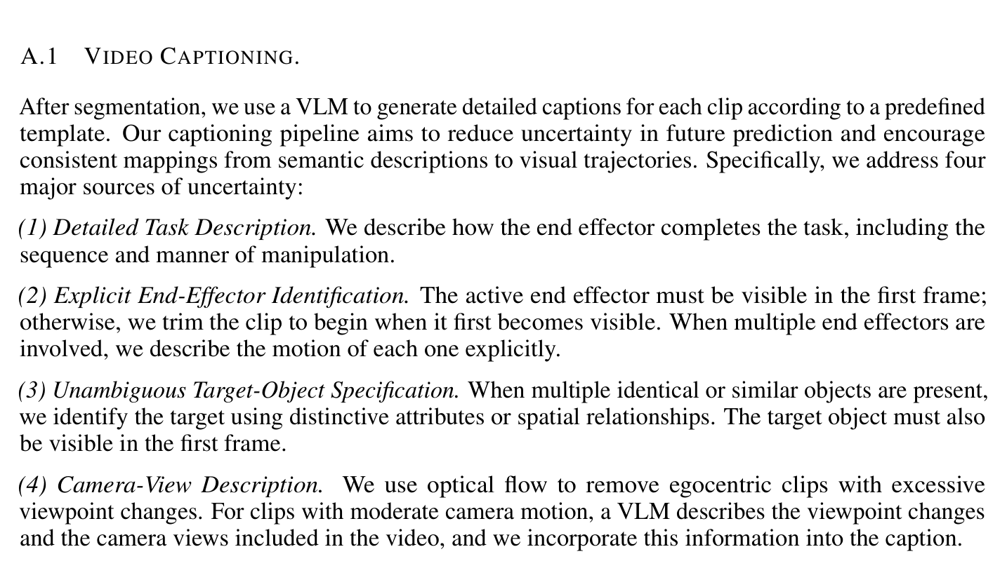

| Data Type | Embodiment Type | Data Sources |
|---|---|---|
| Robot | Single-arm | OXE (Open X-Embodiment Collaboration, 2023), RoboMIND (Wu et al., 2025a), DROID (Khazatsky et al., 2024), RH20T (Fang et al., 2024), MolmoAct (Lee et al., 2025) |
| Robot | Dual-arm | AgiBot World-Beta (Bu et al., 2025), RoboCOIN (Wu et al., 2025b), RDT (Liu et al., 2024), GM-100 (Wang et al., 2026b), ABC-130K (Allshire et al., 2026), Self-collected ALOHA Data |
| Robot | Mobile & humanoid | InternData-A1 (Tian et al., 2025), Galaxea Open-World (Jiang et al., 2025), Self-collected dexterous hands |
| Human | Human hands | Open-source: EgoDex (Hoque et al., 2025), Ego4D (Grauman et al., 2022), EPIC-KITCHENS (Damen et al., 2018), Something-Something V2 (Goyal et al., 2017; Mahdisoltani et al., 2018), VITRA-1M (Li et al., 2025a); Self-collected egocentric data |
| General Video | Human hands | OpenVid (Nan et al., 2025), Panda-70M (Chen et al., 2024) |

**Caption:** Table 5: Training data sources with references to the original datasets. Self-collected datasets are collected as part of this work.

**Caption[CN]:** 表 5：训练数据源及原始数据集的参考文献。自采数据集为本工作收集整理的一部分。

### A.1 Video Captioning

> <strong>Para. 2:</strong> After segmentation, we use a VLM to generate detailed captions for each clip according to a predefined template. Our captioning pipeline aims to reduce uncertainty in future prediction and encourage consistent mappings from semantic descriptions to visual trajectories. Specifically, we address four major sources of uncertainty:
>
> - (1) Detailed Task Description. We describe how the end effector completes the task, including the sequence and manner of manipulation.
> - (2) Explicit End-Effector Identification. The active end effector must be visible in the first frame; otherwise, we trim the clip to begin when it first becomes visible. When multiple end effectors are involved, we describe the motion of each one explicitly.
> - (3) Unambiguous Target-Object Specification. When multiple identical or similar objects are present, we identify the target using distinctive attributes or spatial relationships. The target object must also be visible in the first frame.
> - (4) Camera-View Description. We use optical flow to remove egocentric clips with excessive viewpoint changes. For clips with moderate camera motion, a VLM describes the viewpoint changes and the camera views included in the video, and we incorporate this information into the caption.

> <strong>Para. 2[CN]:</strong> 分段后，我们使用 VLM 按照预定义的模板为每个片段生成详细的描述文本。我们的描述生成流程旨在降低未来预测中的不确定性，并促进从语义描述到视觉轨迹的一致映射。具体而言，我们解决了四个主要的不确定性来源：
>
> - (1) **详细任务描述**：我们描述末端执行器如何完成任务，包括操作的时序顺序和方式。
> - (2) **明确末端执行器识别**：活动末端执行器必须在第一帧可见；否则我们将片段修剪至其首次变为可见的时刻。当涉及多个末端执行器时，我们显式描述每个执行器的运动。
> - (3) **清晰指定目标物体**：当存在多个相同或相似物体时，我们使用显著属性或空间关系来识别目标。目标物体也必须在第一帧中可见。
> - (4) **相机视角描述**：我们使用光流法剔除视点变化过大的人体第一人称片段。对于相机运动适中的片段，VLM 会描述视点变化以及视频中包含的相机视角，我们将此信息整合到描述文本中。

### A.2 Unified Action Space

> <strong>Para. 3:</strong> We focus on egocentric bimanual datasets, including ALOHA-style, humanoid-style, and human egocentric datasets. These datasets account for more than 80% of the total data and share a similar bimanual structure and camera viewpoint. We explicitly align their coordinate systems at two levels: (1) workspace alignment, which applies a world-frame transformation so that different robots have comparable end-effector workspaces; and (2) end-effector alignment, which applies a local transformation to standardize end-effector origins and axis orientations.

> <strong>Para. 3[CN]:</strong> 我们重点关注以第一人称双臂数据集为主的数据，包括 ALOHA 式、人形机器人式和人类第一人称数据集。这些数据集占总数据的 80% 以上，并共享相似的双臂结构和相机视点。我们在两个层面上显式对齐其坐标系：(1) 工作空间对齐，应用世界系变换使不同机器人具有相当的末端工作空间；(2) 末端执行器对齐，应用局部变换标准化末端执行器原点和轴向朝向。

> <strong>Para. 4:</strong> For an arm dataset $d$, let $T_d = {}^{W_d}T_{E_d} \in \mathrm{SE}(3)$ denote the original end-effector pose, where $W_d$ and $E_d$ are the dataset’s world and end-effector frames, respectively. We define the workspace alignment as $A_d = {}^{\bar{W}}T_{W_d}$ and the end-effector alignment as $B_d = {}^{E_d}T_{\bar{E}}$, where $\bar{W}$ and $\bar{E}$ denote the canonical world and end-effector frames. The aligned end-effector pose is given by

> <strong>Para. 4[CN]:</strong> 对于机械臂数据集 $d$，令 $T_d = {}^{W_d}T_{E_d} \in \mathrm{SE}(3)$ 表示原始末端执行器位姿，其中 $W_d$ 和 $E_d$ 分别是该数据集的世界系与末端系。我们将工作空间对齐定义为 $A_d = {}^{\bar{W}}T_{W_d}$，将末端执行器对齐定义为 $B_d = {}^{E_d}T_{\bar{E}}$，其中 $\bar{W}$ 和 $\bar{E}$ 表示规范的世界系与末端系。对齐后的末端执行器位姿由下式给出：

$$\tilde{T}_d = A_d T_d B_d \tag{6}$$

## Appendix B: More Video Prediction Results

### Figure 10. 开放式任务上的额外视频预测结果（蒸馏前后对比）

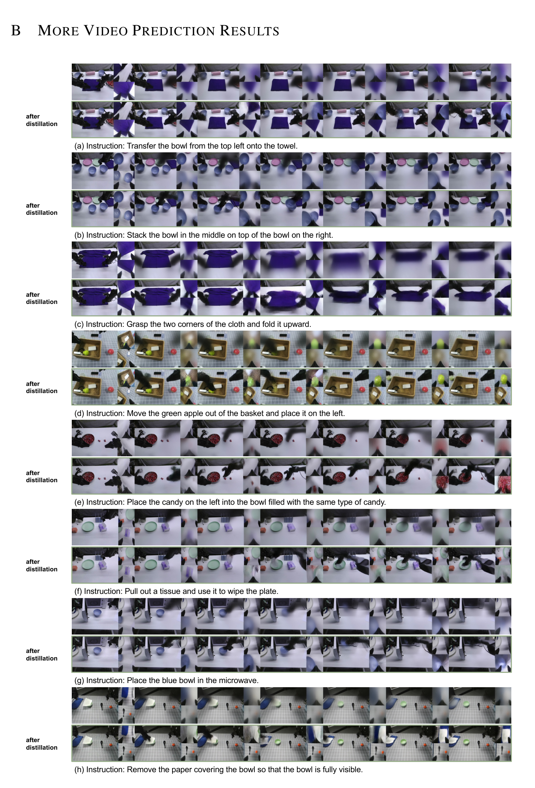

**Caption:** Figure 10: Additional video prediction results on open-ended tasks. We compare single-step video predictions before and after distillation. Distillation enables high-quality video prediction with just one sampling step.

**Caption[CN]:** 图 10：开放式任务上的额外视频预测结果。我们对比了蒸馏前后的单步视频预测。蒸馏使得仅用一个采样步即可实现高质量的视频预测。

## Appendix C: Detailed Benchmark Results

### C.1 Detailed LIBERO Results

> <strong>Para. 1:</strong> Table 6 reports per-suite success rates on the four standard LIBERO suites (Liu et al., 2023), which correspond to the LIBERO-ID results in Table 3. Baseline results are taken from the original papers and from Zhang et al. (2026d) and Mishra et al. (2026).

> <strong>Para. 1[CN]:</strong> 表 6 报告了四个标准 LIBERO 套件（Liu 等，2023）上的各套件成功率，对应表 3 中的 LIBERO-ID 结果。基线结果取自原论文以及 Zhang 等（2026d）和 Mishra 等（2026）。

### Table 6. 标准 LIBERO 基准各套件详细成功率

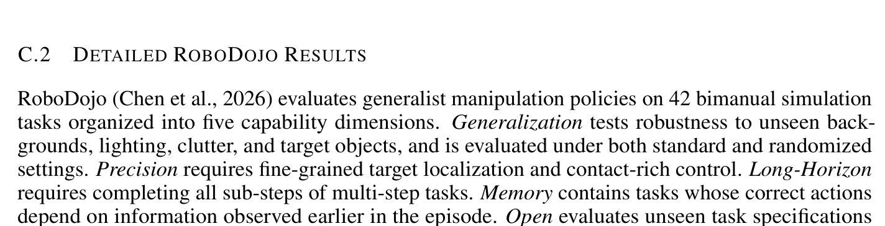

| Method | Spatial | Object | Goal | Long | Avg. |
|---|---|---|---|---|---|
| π0 (Black et al., 2024) | 96.8 | 98.8 | 95.8 | 85.2 | 94.2 |
| π0.5 (Intelligence et al., 2025) | 98.8 | 98.2 | 98.0 | 92.4 | 96.9 |
| MolmoAct (Lee et al., 2025) | 87.0 | 95.4 | 87.6 | 77.2 | 86.6 |
| X-VLA (Zheng et al., 2026) | 98.2 | 98.6 | 97.8 | 97.6 | 98.1 |
| AtomVLA (Sun et al., 2026) | 96.4 | 99.6 | 97.6 | 94.4 | 97.0 |
| Cosmos-Policy (Kim et al., 2026) | 98.1 | 100.0 | 98.2 | 97.6 | 98.5 |
| Fast-WAM (Yuan et al., 2026) | 98.2 | 100.0 | 97.0 | 95.2 | 97.6 |
| DiT4DiT (Ma et al., 2026) | 98.4 | 99.6 | 98.6 | 97.6 | 98.6 |
| Temporal Ratio (Mishra et al., 2026) | 96.3 | 99.6 | 97.6 | 82.6 | 94.0 |
| VPP2 (Ours) | **99.2** | **99.8** | **98.2** | **98.0** | **98.8** |

**Caption:** Table 6: Per-suite success rates (%) on the standard LIBERO benchmark. Best results in each column are in bold.

**Caption[CN]:** 表 6：标准 LIBERO 基准上各套件的成功率（%）。每列中的最佳结果以粗体标出。

### C.2 Detailed RoboDojo Results

> <strong>Para. 2:</strong> RoboDojo (Chen et al., 2026) evaluates generalist manipulation policies on 42 bimanual simulation tasks organized into five capability dimensions. Generalization tests robustness to unseen backgrounds, lighting, clutter, and target objects, and is evaluated under both standard and randomized settings. Precision requires fine-grained target localization and contact-rich control. Long-Horizon requires completing all sub-steps of multi-step tasks. Memory contains tasks whose correct actions depend on information observed earlier in the episode. Open evaluates unseen task specifications whose required skills appear in the training data under different contexts. We follow the official training and evaluation protocol. The average score captures partial task progress, and the success rate measures binary task completion.

> <strong>Para. 2[CN]:</strong> RoboDojo（Chen 等，2026）在组织为五个能力维度的 42 个双臂仿真任务上评估通用操作策略。泛化性（Generalization）测试对未见背景、光照、杂乱环境和目标物体的稳健性，在标准（Std.）和随机（Rand.）设置下进行评估。精确度（Precision）要求细粒度的目标定位和富接触控制。长程执行（Long-Horizon）要求完成多步任务的所有子步骤。记忆力（Memory）包含正确动作取决于回合早期观察到的信息的任务。开放性（Open）评估未见过的任务规格，其所需技能在训练数据中以不同上下文出现。我们遵循官方训练和评估协议。平均得分反映部分任务进度，成功率衡量二元任务完成度。

> <strong>Para. 3:</strong> Tables 7 and 8 report the per-dimension average score and success rate, respectively, complementing Table 4. Baseline results are taken from the official RoboDojo simulation leaderboard as of September 2026.

> <strong>Para. 3[CN]:</strong> 表 7 和表 8 分别报告了各维度的平均得分和成功率，作为表 4 的补充。基线结果取自截至 2026 年 9 月的官方 RoboDojo 仿真排行榜。

### Table 7. RoboDojo 仿真基准各维度平均得分

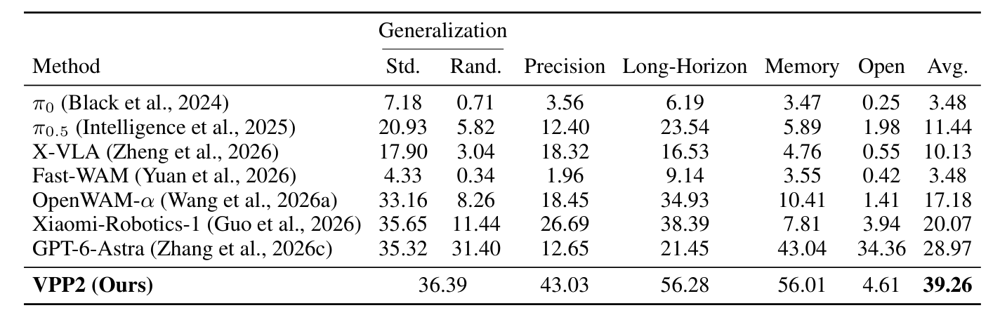

| Method | Generalization (Std.) | Generalization (Rand.) | Precision | Long-Horizon | Memory | Open | Avg. |
|---|---|---|---|---|---|---|---|
| π0 (Black et al., 2024) | 7.18 | 0.71 | 3.56 | 6.19 | 3.47 | 0.25 | 3.48 |
| π0.5 (Intelligence et al., 2025) | 20.93 | 5.82 | 12.40 | 23.54 | 5.89 | 1.98 | 11.44 |
| X-VLA (Zheng et al., 2026) | 17.90 | 3.04 | 18.32 | 16.53 | 4.76 | 0.55 | 10.13 |
| Fast-WAM (Yuan et al., 2026) | 4.33 | 0.34 | 1.96 | 9.14 | 3.55 | 0.42 | 3.48 |
| OpenWAM-α (Wang et al., 2026a) | 33.16 | 8.26 | 18.45 | 34.93 | 10.41 | 1.41 | 17.18 |
| Xiaomi-Robotics-1 (Guo et al., 2026) | 35.65 | 11.44 | 26.69 | 38.39 | 7.81 | 3.94 | 20.07 |
| GPT-6-Astra (Zhang et al., 2026c) | 35.32 | 31.40 | 12.65 | 21.45 | 43.04 | 34.36 | 28.97 |
| VPP2 (Ours) | 36.39 (pooled) | – | 43.03 | 56.28 | 56.01 | 4.61 | **39.26** |

**Caption:** Table 7: Per-dimension average score on the RoboDojo simulation benchmark. Generalization is evaluated under standard (Std.) and randomized (Rand.) settings. Avg. is the mean over the five capability dimensions, where the generalization score is the mean of the Std. and Rand. settings. For VPP2, we report the generalization result pooled over both settings (25 episodes each, following the official protocol), which equals their mean. Baseline results are taken from the official leaderboard.

**Caption[CN]:** 表 7：RoboDojo 仿真基准上各维度的平均得分。泛化能力在标准（Std.）和随机（Rand.）设置下进行评估。Avg. 为五个能力维度的均值，其中泛化得分为 Std. 和 Rand. 设置的均值。对于 VPP2，我们报告了汇集两种设置的结果（根据官方协议，各 25 个回合），其值等于两者的均值。基线结果取自官方排行榜。

### Table 8. RoboDojo 仿真基准各维度成功率

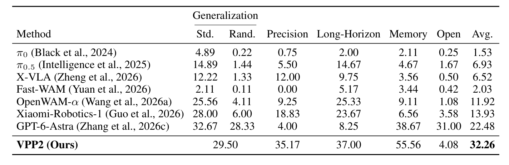

| Method | Generalization (Std.) | Generalization (Rand.) | Precision | Long-Horizon | Memory | Open | Avg. |
|---|---|---|---|---|---|---|---|
| π0 (Black et al., 2024) | 4.89 | 0.22 | 0.75 | 2.00 | 2.11 | 0.25 | 1.53 |
| π0.5 (Intelligence et al., 2025) | 14.89 | 1.44 | 5.50 | 14.67 | 4.67 | 1.67 | 6.93 |
| X-VLA (Zheng et al., 2026) | 12.22 | 1.33 | 12.00 | 9.75 | 3.56 | 0.50 | 6.52 |
| Fast-WAM (Yuan et al., 2026) | 2.11 | 0.11 | 0.00 | 5.17 | 3.44 | 0.42 | 2.03 |
| OpenWAM-α (Wang et al., 2026a) | 25.56 | 4.11 | 9.25 | 25.33 | 9.11 | 1.08 | 11.92 |
| Xiaomi-Robotics-1 (Guo et al., 2026) | 28.00 | 6.00 | 18.83 | 23.67 | 6.56 | 3.58 | 13.93 |
| GPT-6-Astra (Zhang et al., 2026c) | 32.67 | 28.33 | 4.00 | 8.25 | 38.67 | 31.00 | 22.48 |
| VPP2 (Ours) | 29.50 (pooled) | – | 35.17 | 37.00 | 55.56 | 4.08 | **32.26** |

**Caption:** Table 8: Per-dimension success rate (%) on the RoboDojo simulation benchmark, computed in the same way as Table 7.

**Caption[CN]:** 表 8：RoboDojo 仿真基准上各维度的成功率（%），计算方式与表 7 相同。
