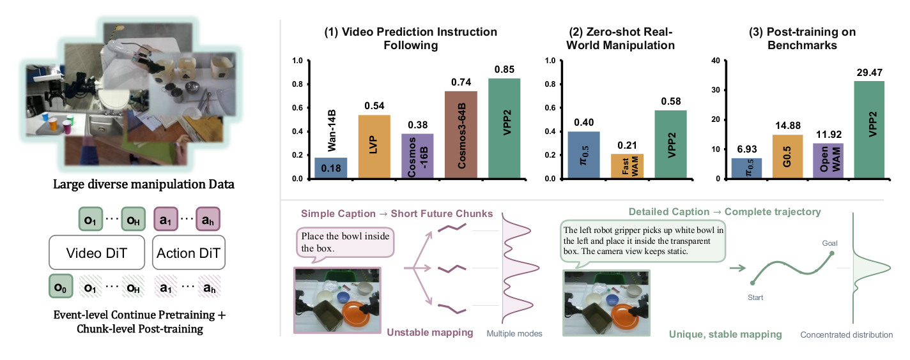
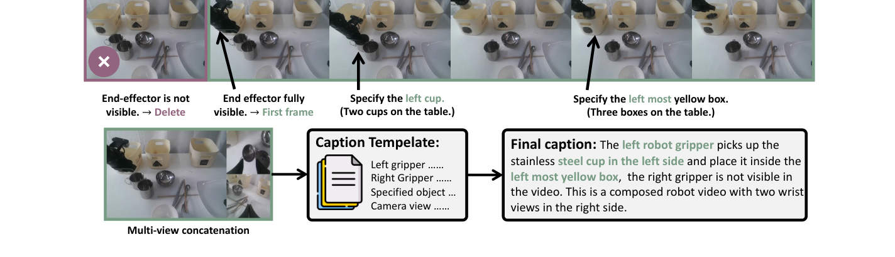

---
tags:
  - papers/world-model
  - papers/robot-learning
  - papers/embodied-ai
aliases:
  - VPP2
  - Video Prediction Policy 2
  - Video Prediction Policy 2: Predict Better, Act Better

date: 2026-10-08

doi: 10.48550/arXiv.2610.10270

arxiv_id: 2610.10270v2
---

# Video Prediction Policy 2: Predict Better, Act Better (VPP2)

## 核心信息

- 标题: Video Prediction Policy 2: Predict Better, Act Better
- 标题翻译: Video Prediction Policy 2：预测更准，执行更优（VPP2）
- 作者: Yanjiang Guo, Haodong Yan, Zhide Zhong, Zhongru Zhang, Qingyuan Yang, Qingzhou Lu, Xiaoyu Chen, Yen-Jen Wang, Shuying Deng, Chenghan Yang, Puzhen Yuan, Chenxin Liu, Tun Ban, Xiang Zhu, Yichen Liu, Kun Feng, Haoang Li, Jianyu Chen
- 机构: Robotera（星动纪元）；清华大学（Tsinghua University）；香港科技大学(广州)（HKUST GZ）；加州大学伯克利分校（UC Berkeley）；上海交通大学（SJTU）
- 发表时间: 2026-10-08（arXiv 预印本 v2）
- 发表渠道: arXiv 预印本
- DOI: 10.48550/arXiv.2610.10270
- arXiv: 2610.10270v2
- 论文链接: https://arxiv.org/abs/2610.10270
- 代码 / 项目: https://robert-gyj.github.io/video-prediction-policy-2
- 数据 / 资源: 6,000+ 小时多源操作视频（涵盖 OXE、RoboMIND、DROID、RH20T、MolmoAct、AgiBot World-Beta、RoboCOIN、RDT、GM-100、ABC-130K、EgoDex、Ego4D、EPIC-KITCHENS、Something-Something V2、VITRA-1M、OpenVid、Panda-70M 以及自采真机 ALOHA/灵巧手数据）
- 论文类型: 机器人学习、世界动作模型与视频预测策略

## 原文摘要翻译

世界动作模型已发展成为通用机器人策略的重要流派，旨在将视频基础模型中的物理动力学先验迁移至动作学习。然而，我们发现现有的世界动作模型在开放式非受限环境中频繁生成错误的运动预测，进而引发错误的动作执行。我们将此局限归因于两个核心因素：(1) 基础视频模型并非针对机器人操作任务优化；(2) 朴素地将动作模块直接融入视频模型会显著破坏视频模型的泛化能力。

本文提出视频预测策略第二代（VPP2），这是一种在视频预测与动作生成两方面均具备极强零样本泛化能力的世界动作模型。首先，我们构建了一个大规模、多样化的操作视频数据集，对开源视频基础模型进行持续预训练。我们使用精细描述的字幕对视频片段进行详尽标注，并执行事件级视频预训练，以促进跨开放式操作任务的泛化。其次，我们对视频模型进行后训练，并将其蒸馏为具有固定预测时域的单步视觉规划器。最后，我们通过混合变换器（MoT）架构引入动作专家模块，以学习隐式逆动力学模型。

实验验证了三项核心成果：在开放式任务的视频预测指令遵循成功率上，VPP2 超过参数量达 64B 的强基线 11.0 个百分点；在真实世界双臂机器人的零样本操作任务中，VPP2 取得 58.5% 的平均成功率，超越最强基线 18.5 个百分点；在特定基准上进行后训练后，VPP2 在极具挑战性的多项强扰动基准上均取得了最高成功率。

## 创新点

1. **确立“预测更准，执行更优”（Predict Better, Act Better）的因果闭环主线。** 明确诊断了现有世界动作模型在开放环境中的泛化瓶颈——并非动作专家结构不够复杂，而是视频基础模型在操作领域的物理动力学保真度与指令遵循度不足。通过提升视频预测的准确性，动作专家只需学习良态的逆动力学映射，即可直接继承前沿视频基座的开放世界常识。

2. **首创事件级视频继续预训练与四要素精细字幕数据引擎。** 汇聚 6,000+ 小时涵盖单臂、双臂、人形机器人与人类第一视角操作的多源视频库。提出基于速度极小值与夹爪事件的事件级切分，结合包含“详细操作步骤、显式末端指定、无歧义目标物描述、相机视点变化”的四要素精细字幕模板，彻底解决简单字幕导致的多模态模糊预测与伪相关性问题。

3. **两阶段时序解耦与单步一致性蒸馏管线。** 巧妙化解了宏观任务时序多变性与底层动作高频控制之间的矛盾。阶段一采用事件级归一化采样学习宏观物理演化；阶段二解耦为固定时域视频块（机器人 8 秒 / 人手 2 秒），并通过一致性蒸馏实现 0.12 秒单步前向视觉规划，消除了传统视频扩散模型在实时控制闭环中的严重延迟阻碍。

4. **统一双臂工作空间与末端坐标系变换。** 针对占据总数据量 80% 以上的跨数据集双臂轨迹，建立了严格的全局世界工作空间与局部末端执行器双层刚体对齐矩阵，将异构机器人与人类双手的动作表征投影至规范坐标系，构建统一的 T 型多视角视觉输入流。

5. **混合变换器（MoT）隐式逆动力学与 LoRA 梯度隔离。** 采用动作变换器作为动作专家，直接条件化于视频骨干的键值缓存。在训练初期冻结视频骨干、仅使用 LoRA 微调，严格阻止动作监督梯度污染视频基座学到的物理常识与泛化能力，以仅 0.22 秒的总延迟输出 2 秒动作块。

6. **高层子任务规划驱动的分层长时序闭环。** 将开放域模糊自然语言指令交由前沿多模态规划器进行语义拆解与常识推理，动态生成符合精细模板的子任务指令，驱使低层 VPP2 策略实现长程复合任务的高可靠执行。

## 一句话总结

VPP2 证明了世界动作模型跨域泛化的核心突破口在于**高保真度、指令对齐的操作视频预测**，通过 6,000+ 小时多源数据精细字幕预训练、固定时域单步一致性蒸馏与 MoT 动作梯度隔离，在真实世界 ALOHA 零样本测试和 LIBERO、RoboDojo 等强扰动评测中全面刷新最高表现。

## 研究问题

### 开放环境中现有世界动作模型的运动预测失效与动作崩溃

近年来，世界动作模型被寄予厚望，被视为实现通用具身智能机器人的核心路径。其核心直觉非常优雅：大规模互联网视频数据中蕴含着丰富的真实世界物理先验（包括物体的刚体几何、重力沉降、流体形变、接触碰撞与因果演化）；通过视频基础模型预测未来的视觉演化，机器人策略可以借助显式或隐式的逆动力学模型，将未来视觉状态转化为当前底层的电机控制指令。

然而，现有世界动作模型在真实世界和复杂评测中普遍暴露出了严重的泛化脆弱性：**模型往往仅在训练分布内的狭窄任务上表现良好，一旦置身于开放式的全新场景、扰动的物体布局或未见过的复合任务，视频分支就会生成严重违背物理规律的错误运动预测**（例如机械臂凭空瞬移、夹爪穿透桌面、目标物体凭空消失或完全无视语言指令）。由于底层的动作决策高度依赖于视频先验，错误的视觉预测直接引发了灾难性的动作失误。

### 核心矛盾一：通用视频基座并非为机器人操作而生

论文作者深入剖析后指出，现有视频生成基础模型的主要训练目标是针对开放域文本生成富有美感、高清晰度的视觉内容，而非精确的物理交互动力学。这些模型在遇到精细的操作语义时普遍存在严重缺陷：

1. **指令遵循能力极度欠缺**。通用视频模型经常忽视提示词中的空间方位词与动作动词，例如指令要求“拿起左侧的杯子”，视频模型可能生成拿起右侧杯子甚至完全静止的画面。

2. **缺乏接触力学与因果敏感度**。通用视频模型生成的人手或机械臂在接触物体时，经常出现虚假接触、悬浮移动或物体自发位移，缺乏机器人操作所必须的严格接触物理约束。

### 核心矛盾二：动作微调对视频泛化能力的破坏性张力

当研究者尝试将动作学习引入视频模型时，通常采用端到端联合去噪或在视频表征上直接微调动作头。然而，**直接引入动作组件往往会剧烈破坏视频基础模型原有的开放域泛化能力**。

1. **机器人动作数据分布狭窄**。动作数据集虽然在操作域更专业，但其总体样本规模、视觉场景多样性与语言覆盖面相较于互联网视频百倍收缩。

2. **动作监督信号破坏预训练特征**。动作监督信号具有极强的特定本体依附性，其梯度反向传播会迅速洗刷视频模型在中层和深层所建立的高维视觉常识与时空注意力图，诱发严重的灾难性遗忘。正如近期研究所揭示，策略在标准评测集上的过拟合往往掩盖了其世界模型内在泛化能力的彻底崩塌。

### 核心矛盾三：简短字幕导致的多模态歧义与伪相关性

传统具身数据集习惯于将整段轨迹映射至一句极短的粗粒度指令（如“把碗放进盒子里”）。当训练数据规模扩大、场景复杂度增加时，这种映射存在严重的数学病态：

1. **目标对象不确定**。桌面上可能有多个不同颜色的碗和多个盒子，语义缺乏明确指向。

2. **执行机构不确定**。指令并未声明应该由左机械臂还是右机械臂执行。

3. **运动轨迹不确定**。移动路径是从上方越过障碍还是平移推入并未给出限定。

由于输入条件严重欠定，从输入观测和简短字幕到未来短动作块的映射呈现高度发散的多模态分布。深度网络在面对这种不确定性时，往往被迫退化去走捷径，学习背景像素与控制指令之间的虚假短视相关性。一旦测试环境中的光照、物体位置或背景产生微小扰动，模型立刻丧失控制方向。

## 数据与任务定义

### 多源操作视频数据引擎（6,000+ 小时规模）

为了构建能够真正理解物理操作的世界模型，作者汇聚了来自机器人、人类活动与通用互联网视频的三大多模态视频源，总时长超过 6,000 小时。其结构分布如下表所示：

| 数据类别 | 具身形态与主体 | 代表性数据源集合 | 核心数据贡献与物理表征特性 |
|---|---|---|---|
| **机器人数据** | 单臂操作系统 | OXE, RoboMIND, DROID, RH20T | 涵盖多样化机械臂基座与丰富桌面刚体操作 |
| **机器人数据** | 双臂协作系统 | AgiBot, RoboCOIN, RDT 等主流双臂 | 占据数据量大半，提供双手协调与长程接触 |
| **机器人数据** | 移动与人形机器人 | 移动双臂与五指灵巧手真机数据 | 包含非结构化移动、多指接触与全身协调 |
| **人类活动数据** | 人类第一视角双手 | EgoDex, Ego4D, EPIC 等第一视角 | 提供人类双手在复杂开放厨房中的物理先验 |
| **通用视频数据** | 筛选人类双手交互 | 经操作过滤清洗后的通用视频库 | 提供海量开放世界视觉背景与语义常识 |

### 统一动作空间与刚体位姿规范化定义

跨数据集联合训练最大的障碍在于不同机器人本体坐标系与相机视角的极端混乱。例如，在某数据集中向左移动对应正方向，而在另一数据集中可能对应负方向，导致相同视觉运动对应相反的动作数值。

针对占据 80% 以上的以第一视角双臂为核心的数据集，作者确立了两层严格的几何对齐：

1. **工作空间对齐**。通过全局世界坐标系刚体变换对齐各数据集空间，将不同机器人的物理活动范围包围盒投影对准至规范参考世界坐标系。

2. **末端执行器对齐**。通过局部变换矩阵标准化末端执行器的原点位置与三轴旋转朝向，统一映射至规范末端坐标系。

设数据集的原始末端执行器位姿为 $T_d$，经对齐变换后的规范化位姿表示为：

$$
\tilde{T}_d = A_d T_d B_d
$$

同时，针对多相机输入，作者设计了统一的 **T 型多视角拼接**：主前向观察视角位于图像左侧（分辨率占据大半），两个手腕辅助视角在右侧垂直叠放。若某数据集缺失辅助视角，则用黑色纯色占位图像填充，保证了骨干网络输入维度的全局一致性。

### 实验评测基准与任务体系

论文建立了跨视频预测、物理真实机器人与多维仿真环境的全栈验证闭环：

1. **开放域视频预测与指令遵循评测**。随机采集 50 组人手与 50 组机械臂的高清图像与复杂操作指令，采用大模型盲评与人类成对盲评双轨机制。

2. **真实机械臂零样本测试**。在未经过任何任务级微调的情况下，在真实物理世界中直接评测 10 项全新任务（涵盖叠放、抓取、放置、折叠、倾倒、抽拉、插入、开门、关门与擦拭），每项任务包含物体随机散落与未知初始位姿。

3. **LIBERO 体系跨域评测**。包含标准分布内四大评测套件；针对真实场景扰动的泛化基准，分别测试物体位置扰动与任务规格指令扰动；以及组合泛化评测，在未见过的空间排列、物体种类和目标组合下检验策略鲁棒性。

4. **RoboDojo 双臂综合仿真基准**。包含 42 个高难度双臂任务，严苛评估五大维度：泛化性（标准与随机环境）、操作精度、长时序规划、历史记忆与开放词汇指令跟随。

5. **分层规划子任务评测**。在物体分类、语言引导叠块、色块交换、麻将杠牌与井字棋五组复杂决策任务中验证高层规划与低层控制的协同倍增效应。

## 方法主线

### 机制流程

VPP2 的整体执行机制遵循“预测更准，执行更优”（Predict Better, Act Better）的因果闭环，其端到端系统架构与阶段演化如下图所示：

*论文原图编号：Figure 1。系统全景架构与核心逻辑对比：简短字幕映射至短动作块会导致高度发散的多模态歧义分布与短视伪相关；VPP2 采用精细字幕进行事件级下一事件视频预测，确立从自然语言语义到视觉完整轨迹的唯一、稳定因果映射；随后后训练并蒸馏为单步视觉规划器，驱动动作专家生成高质量动作块。*

系统在部署运行时的端到端机制流程可严格划分为四大标准时序步骤：

1. **多源多视角输入预处理与空间规范化**。输入当前主视角与手腕相机的多视角图像观测 $o_t$ 以及机器人末端状态，经标准 T 型布局拼接，并调用工作空间刚体变换矩阵 $A_d$ 与末端对齐矩阵 $B_d$ 映射至规范几何空间，提取统一的视觉特征与当前位姿。

2. **事件驱动与一致性蒸馏单步未来潜码推演**。将当前观测潜码与高层下发的四要素精细子任务指令送入蒸馏后的视频骨干网络，在潜在特征空间执行单步前向推演，生成未来 8 秒的物理演化潜码（单步推演耗时仅 0.12 秒），为底层控制提供高保真视觉运动先验。

3. **MoT 动作专家隐式逆动力学去噪解码**。以单步生成的未来视觉潜码为交叉注意力条件，输入当前末端执行器姿态，动作专家网络通过 5 步流匹配去噪迭代求解，解码输出对应未来 2 秒的高频动作块（去噪耗时仅 0.10 秒，全链路端到端时延仅 0.22 秒）。

4. **分层执行监控与物理闭环移交**。将解码得到的规范动作序列通过解析逆变换映射为机器人底层电机控制指令并交付执行，高层多模态规划器周期性监测外部观测与任务进度，自适应更新下一步子任务指令以维持长时序鲁棒闭环。

### 数据引擎: 可扩展标准化数据集构建与精细字幕生成

为了彻底破除图 1 中揭示的多模态模糊映射难题，VPP2 构建了工业级的数据清洗与结构化标注流水线，如下图所示：

*论文原图编号：Figure 2。VPP2 数据处理与精细字幕生成流水线示例：通过过滤非操作视频与无效帧，结合多视角拼接生成统一输入；字幕模板严格限定左/右夹爪状态、明确指定目标物体属性与方位，并详细描述相机视点变化，将发散的不确定预测收敛为单模态确定性映射。*

数据引擎的核心由以下三个紧密咬合的环节构成：

1. **轨迹清洗与事件边界初筛**。剔除相机掉帧、图像模糊及发生突变中断的破损轨迹；基于手部与机械臂末端速度的局部极小值点，以及夹爪与手指开闭状态改变的关键帧，初步划定 1 至 12 秒的候选事件片段边界。

2. **语义切分精炼**。利用高层多模态大模型对候选切分点进行语义审查，合并语义过碎的相邻微片段，精确微调片段的起止时间戳，确保每个片段构成一个具有完整物理意图的独立子任务单元。

3. **消除不确定性的四要素精细字幕模板**。包含详细操作步骤描述、显式执行端指定、无歧义目标物指定、相机视点与运动建模四项核心要素。要求活跃的末端执行器在第一帧必须完整可见，通过空间相对位置唯一区分相似物体，并用光流筛除剧烈晃动镜头。

### 两阶段训练管线: 事件级继续预训练 + 块级后训练与蒸馏

为了兼顾长程任务规划的宏观语义理解与底层机器人控制对高频确定性时序的严苛要求，VPP2 设计了从事件级到块级的层次化训练管线，如下图所示：

*论文原图编号：Figure 4。VPP2 三阶段训练管线：阶段 1 基于大规模多样化数据执行事件级视频继续预训练，学习宏观轨迹与物理常识；阶段 2 进行固定 8 秒块级后训练并应用一致性蒸馏，将推理压缩至单步 0.1 秒；阶段 3 初始化 0.9B 动作专家，条件化于视频潜码生成 2 秒动作块。*

#### 阶段 1：事件级视频继续预训练

该阶段的目标是使通用视频生成模型全面吸收机器人操作域的动力学先验。给定一段完整的操作演示片段 $\tau = (o_0, o_1, \dots, o_T)$，模型均匀采样 $N$ 个未来帧以覆盖整段事件进程：

$$
y_{\text{event}} = \left[ o_0, o_{\lfloor T/N \rfloor}, o_{\lfloor 2T/N \rfloor}, \dots, o_T \right]
$$

其中 $T$ 为最终帧索引，$N$ 为未来帧数（实验中固定预测 49 帧，分辨率为 416 乘 240）。设视频编码器提取的潜在表征为干净潜码，通过线性插值构建流匹配加噪潜码：

$$
x_s = (1 - s)\epsilon + s x_1, \quad \epsilon \sim \mathcal{N}(0, I), \quad s \in [0, 1]
$$

基于流匹配目标优化基础视频模型参数 $\theta$：

$$
\mathcal{L}_{\text{FM}}(\theta) = \mathbb{E}_{(x_1, c), \epsilon, s} \left[ \| v_\theta(x_s, s, c) - (x_1 - \epsilon) \|_2^2 \right]
$$

其中条件 $c$ 包含首帧观测 $o_0$ 与详尽子任务精细字幕。该阶段在基础大模型上以较大批次持续预训练 30,000 个优化步，使其在指令遵循能力上全面超越超大规模对比基座。

#### 阶段 2：块级后训练与一致性蒸馏

事件级采样由于不同任务总时长差异巨大，导致采样帧之间的真实时间间隔不固定，无法直接对齐机器人控制频率。为此，作者将时域重塑为固定物理时间跨度（机器人设定为 8 秒，人手设定为 2 秒）。设数据集采集帧率为基准，采用固定时间步长采样：

$$
y^{(t)}_{\text{chunk}} = \left[ o_t, o_{t+\lfloor \delta \rfloor}, o_{t+\lfloor 2\delta \rfloor}, \dots, o_{t+\lfloor N\delta \rfloor} \right]
$$

在块级后训练之后，为了彻底解决扩散模型多步去噪带来的几秒级高昂推理延迟，作者引入一致性蒸馏，强制模型在任意流动时间步均能准确预测终端流状态：

$$
\mathcal{L}_{\text{CD}} = \mathbb{E} \left[ \lambda(s, s') \| F_\theta(x_s, s, c) - \text{stopgrad}(F_{\bar{\theta}}(\hat{x}_{s'}, s', c)) \|_2^2 \right]
$$

其中学生模型参数采用指数移动平均更新，目标由冻结的教师模型积分得到。训练中以 0.5 的概率直接采样终点时间步，强力锚定单步生成能力。在测试阶段，视频潜码仅需单次前向传播即可瞬间生成。结合计算图编译与半精度优化，在单个前向中仅需 **0.12 秒** 即可推演出未来 8 秒的高保真视觉演化。

### 统一动作空间与末端执行器坐标系对齐

跨具身机器人数据的几何标定差异是造成策略学习多义性的物理根源。VPP2 提出的空间规范化机制如下图所示：

*论文原图编号：Figure 3。(a) 各数据集机械臂工作空间的包围盒对齐示意；(b) 各数据集末端执行器局部坐标系的三轴朝向与原点标准化。*

1. **工作空间包围盒尺度统一**。如图 3 所示，不同机械臂基座高度、安装距离与臂展存在物理差异。作者统计了每个数据集的末端历史轨迹三维包围盒，求解出刚体变换矩阵，将各机械臂的作业空间中心与尺度映射至统一参考世界坐标系下。

2. **末端执行器轴向规范化**。如图 3 所示，不同夹爪传感器的定义极度多样。通过局部旋转矩阵，强制所有末端坐标系的法向量、接近方向与夹持张合方向完全一致。

3. **对齐后的动作回归**。策略输出的动作均在规范坐标系下定义，真机部署时仅需通过解析逆变换直接转换为目标机器人的物理关节或笛卡尔指令，实现了跨数据集 80% 以上双臂数据的无损汇聚。

### 推理与 VLM 子任务规划驱动的长时序分层执行

针对开放环境中用户指令的高度模糊性（如“帮我收拾一下桌面”）以及超长时序多阶段交互，VPP2 采用高低层分层协同架构：

1. **高层任务规划器**。引入前沿多模态大模型作为高层大脑。模型维护全局任务记忆，负责多模态环境理解与常识推理，将高层模糊目标动态拆解为有序的子任务序列。

2. **动态提示词增强**。高层规划器不仅输出子任务名称，更会将指令自动转译为符合低层策略训练分布的四要素精细字幕模板。

3. **低层闭环执行器**。以 0.22 秒的极低时延不断推演未来视觉块并输出 2 秒动作块，闭环驱动机器人末端。

4. **状态反馈与自适应切换**。规划器周期性观察执行反馈与当前相机视点，动态判断当前子任务是否完成，并决策下一步转移或自适应重试。

## 关键结果

### 视频预测评估与开放域胜率

论文在涵盖人手与机械臂的 100 组开放域复杂测试案例上，系统比对了 VPP2 与代表性视频基座的指令遵循与物理运动保真度。

下表展示了评估器评定的指令遵循成功率（Table 2）：

| 模型体系 | 参数量与基座 | 人手操作成功率 | 机器人操作成功率 | 平均成功率 |
|---|---|---|---|---|
| **Wan2.1-14B** | 14B (通用文本/图生视频基座) | 0.32 | 0.04 | 0.18 |
| **LVP** | 14B (基于 Wan2.1 操作微调) | 0.62 | 0.46 | 0.54 |
| **Cosmos3-16B** | 16B (物理 AI 专用视频基座) | 0.44 | 0.32 | 0.38 |
| **Cosmos3-64B** | 64B (NVIDIA 最强物理视频基座) | 0.70 | 0.78 | 0.74 |
| **VPP2-Fixed-Step (消融)** | 14B (无事件级预训练，仅固定块) | 0.48 | 0.42 | 0.45 |
| **VPP2 (本文方法)** | **14B (Wan2.1 + 精细字幕事件级预训练)** | **0.80** | **0.90** | **0.85** |

人类评测员的双人成对盲评胜率分布如下图所示：

*论文原图编号：Figure 6。预训练模型与各基线在视频预测任务上的成对胜率对比：在人手操作与机器人操作上，VPP2 相对基线取得显著优势；相较于 64B 的最强对手，VPP2 在机器人任务上取得 24% 胜率、64% 平局和仅 12% 负率。*

定性对比如图 7 所示，在需要深层空间几何理解的复杂任务中（例如“抓取最左侧的瓶子并放置在矮杯子前方”、“将红色纸杯叠在最左侧黑色纸杯上”），通用基座完全忽视空间方位，强基线出现物体错位与夹爪穿模，而 VPP2 则精准还原了正确的末端运动轨迹与接触几何：

*论文原图编号：Figure 7。复杂空间操作指令下的视频预测对比：VPP2 展现出极高保真度的空间推理与指令遵循能力，准确识别“最左侧”与“前方”的相对空间关系。*

### 真实机器人零样本操作

在没有任何针对性任务微调的严苛条件下，作者将 VPP2 直接部署于真实双臂 ALOHA 机器人上，与在相同数据上微调的前沿策略展开公平对决。10 类随机摆放任务的成功率如下图所示：

*论文原图编号：Figure 8。真实世界双臂 ALOHA 机器人上 10 类未见任务的零样本成功率对比：VPP2 平均成功率高达 58.5%，在 9 项任务中斩获第一，大幅领先 π0.5 (40.0%) 与 Fast-WAM-14B (20.5%)。*

具体各任务表现提炼如下：

1. **叠放（Stack）**：VPP2 达到 **65%**（强基线分别为 40% 与 25%）。

2. **抓取（Pick）**：VPP2 达到 **70%**（强基线分别为 45% 与 20%）。

3. **放置（Place）**：VPP2 达到 **75%**（强基线分别为 55% 与 40%）。

4. **折叠（Fold）**：VPP2 达到 **70%**（强基线分别为 80% 与 35%）。

5. **倾倒（Pour）**：VPP2 达到 **40%**（对比基线均为 **0%**）——展现出处理流体容器倾倒的独特物理理解力。

6. **抽拉（Pull）**：VPP2 达到 **50%**（强基线分别为 35% 与 20%）。

7. **插入（Insert）**：VPP2 达到 **55%**（强基线分别为 50% 与 15%）。

8. **开门（Open）**：VPP2 达到 **35%**（强基线均为 20%）。

9. **关门（Close）**：VPP2 达到 **60%**（强基线分别为 30% 与 0%）。

10. **擦拭（Wipe）**：VPP2 达到 **65%**（强基线分别为 45% 与 30%）。

11. **全任务平均（Average）**：**VPP2 达到 58.5%**，大幅击败对比基线（40.0% 与 20.5%），净胜优势显著。

### 仿真基准后训练结果

当在基准特定数据上完成后训练后，VPP2 在单臂与双臂权威基准上展现出压倒性的分布外泛化韧性。

#### LIBERO 评测体系（Table 3 & Table 6）

下表整理了在 LIBERO 标准集、位置与任务扰动集（Pro）以及组合扰动集（OOD）上的全景对比：

| 策略模型体系 | 分布内综合 | 位置扰动 (Pro) | 任务扰动 (Pro) | 扰动综合 | 空间扰动 (OOD) | 物体扰动 (OOD) | 目标扰动 (OOD) | 复合综合 |
|---|---|---|---|---|---|---|---|---|
| **$\pi_0$** | 94.2% | 0.5% | 0.0% | 0.3% | 0.7% | 0.3% | 4.3% | 1.7% |
| **$\pi_{0.5}$** | 96.9% | 20.8% | 1.3% | 11.0% | 36.7% | 2.3% | 41.7% | 26.8% |
| **MolmoAct** | 86.6% | 1.5% | 1.5% | 1.5% | – | – | – | – |
| **X-VLA** | 98.1% | 0.8% | 6.8% | 3.8% | – | – | – | – |
| **AtomVLA** | 97.0% | 7.3% | 5.3% | 6.3% | – | – | – | – |
| **Cosmos-Policy** | 98.5% | – | – | – | 30.7% | 0.3% | 0.7% | 10.5% |
| **Fast-WAM** | 97.6% | – | – | – | 12.7% | 0.0% | 15.7% | 9.4% |
| **DiT4DiT** | 98.6% | – | – | – | 9.0% | 0.0% | 10.3% | 6.4% |
| **Temporal Ratio** | 94.0% | – | – | – | 58.6% | 40.0% | 80.3% | 59.4% |
| **VPP2 (本文方法)** | **98.8%** | **42.3%** | **47.8%** | **45.0%** | **59.3%** | **44.5%** | **87.7%** | **63.9%** |

核心结论剖析：

1. **分布内高分具有严重欺骗性**。所有前沿基线在分布内基准上均达到 94%~98% 的极高成功率，然而在面对位置扰动与任务扰动时，经典策略直接断崖式暴跌至 0.3%~3.8%。

2. **任务遵循而非轨迹死记硬背**。在 Task 任务扰动测试中，最强基线仅有 6.8% 和 1.3%，而 **VPP2 高达 47.8%**。这铁证般证明了 VPP2 是真正理解并执行了语言指令描述的物理逻辑，而非在特定场景中盲目重放死记硬背的关节位移。

3. **彻底击穿世界模型分布外泛化瓶颈**。在扰动评测中，此前的视频动作模型全线崩溃，而 VPP2 斩获 **63.9%** 成功率，超越了专门设计时序比率正则化的基线方案。

#### RoboDojo 具身双臂仿真基准（Table 4, Table 7, Table 8）

RoboDojo 是 2026 年最新发布的双臂高拟真基准，涵盖 42 项复杂任务。下表总结了官方排行榜上的综合对比：

| 评估模型 | 模型规模与类型 | 综合操作得分 (Avg. Score) | 任务完成成功率 (Success Rate %) |
|---|---|---|---|
| **$\pi_0$** | 经典流匹配模型 | 3.48 | 1.53% |
| **Fast-WAM** | 14B 世界动作模型（去除测试期想象） | 3.48 | 2.03% |
| **X-VLA** | 跨本体结构模型 | 10.13 | 6.52% |
| **$\pi_{0.5}$** | 开源前沿策略模型 | 11.44 | 6.93% |
| **OpenWAM-$\alpha$** | 模块化开源世界动作模型 | 17.18 | 11.92% |
| **Xiaomi-Robotics-1** | 100k+ 小时真机训练策略 | 20.07 | 13.93% |
| **GPT-6-Astra** | 超大规模前沿具身基础大模型 | 28.97 | 22.48% |
| **VPP2 (本文方法)** | **14B 视频骨干 + 0.9B MoT 动作专家** | **39.26** | **32.26%** |

细分能力维度剖析（Table 7 得分 / Table 8 成功率）：

1. **泛化性（Generalization）**：标准与随机环境综合得分 36.39 / 成功率 29.50%（显著超越各对比基线）。

2. **高精度操作（Precision）**：得分 **43.03** / 成功率 **35.17%**（紧咬超大规模前沿基线）。

3. **长时序执行（Long-Horizon）**：得分 **56.28** / 成功率 **37.00%**（显著超越所有基线）。

4. **历史记忆力（Memory）**：得分 **56.01** / 成功率 **55.56%**（压倒性夺冠）。

5. **开放词汇（Open）**：得分 4.61 / 成功率 4.08%（体现出纯底层策略在复杂语义理解上的通用挑战，从而驱动了下一节的分层规划）。

### VLM 分层规划对长时序操作的增益

为了克服单一底层策略在开放语义推理上的局限，作者在 RoboDojo 的五大高难度长时序任务组上接入了高层多模态规划器，结果如下图所示：

*论文原图编号：Figure 9。接入与未接入 VLM 子任务规划的成功率对比（每项任务 50 次评测）：五大长时序任务的平均成功率由 27.6% 跃升至 57.6%（净增 +30.0%）。*

具体任务增益极具说服力：

1. **物体分类（Classify objects）**：46% 跃升至 **70%**（+24%）。

2. **语言引导叠积木（Stack by lang.）**：10% 飙升至 **52%**（+42%）。

3. **色块位置互换（Swap blocks）**：44% 跃升至 **76%**（+32%）。

4. **麻将杠牌（Make kong）**：38% 提升至 **52%**（+14%）。

5. **井字棋对抗（Tic-tac-toe）**：从无法完成的 **0% 破局至 38%**。

6. **五任务平均**：从 27.6% 飙升至 **57.6%**。

## 深度分析

### 真正贡献是什么

长久以来，具身智能领域存在一条潜意识的技术假设：只要堆叠更大规模的机械臂动作轨迹数据，策略就能像语言大模型一样自发涌现出通用操作智能。然而，真实世界中的机械臂动作是低维、高方差且极具本体特异性的连续控制信号，纯粹在“观测图像到关节动作”之间进行行为克隆，极易使策略过拟合于机械臂本体和特定环境几何，沦为脆弱的“轨迹记忆回放器”。

VPP2 的根本贡献在于**在学术界第一次以无可辩驳的证据链证明了：提升视频世界模型的视觉预测保真度（Prediction Fidelity）与指令遵循度，可以直接、等价地转化为机器人策略在未知环境下的物理操作泛化能力**。

这一转化的内在因果机制极其深刻：

1. **世界模型的角色重构**。高保真视频预测并非只是画出好看的未来画面，它本质上是在高维流形上对真实世界的物理常识进行无损推演（包括障碍物遮挡、抓取接触点、重心受力位移与容器闭合）。

2. **动作专家的降维解耦**。当 14B 视频模型能够单步推演出高度逼真且严格契合指令的未来物理演化后，动作专家（Action Expert）的建模难度被指数级降低——它不再需要承担复杂的空间语义理解和物理演变预测，而只需充当一个局部的**隐式逆动力学解算器**，负责在当前的真实世界末端姿态与预测的未来潜码特征之间求解平滑的位移插值。

3. **泛化能力的单向流淌**。正因为这种正交解耦，视频大模型吸收的 6,000+ 小时互联网与人类活动常识，能够几乎无损地赋能给物理机器人，使得机器人在从未见过的任务上也能凭借“看到正确的未来”而“做出正确的动作”。

### 为什么结果成立

VPP2 的惊人表现建立在“数据-架构-训练”三位一体的缜密协同之上：

1. **数据维度：精细字幕打破多模态模糊陷阱**。如图 1 所示，简短字幕会导致同一输入对应无数种合理的未来动作，使得网络在加噪去噪中只能学到平庸的平均轨迹或虚假相关性。VPP2 的四要素精细字幕将多模态不确定分布收敛为单模态确定性映射，使网络能够牢固确立“特定的指令动词 + 空间方位 = 唯一的末端运动轨迹”这一因果法则。

2. **架构维度：MoT 机制与 LoRA 梯度防火墙**。以往模型在加入动作微调后泛化性暴跌，根源在于动作损失产生的剧烈梯度回传摧毁了视频模型的特征空间。VPP2 采用 MoT 架构，并在初期严格冻结 14B 视频骨干、仅放开轻量 LoRA，构筑了严密的梯度防火墙，保全了视频基座的开放世界理解力。

3. **训练维度：两阶段解耦与一致性蒸馏消除推理死穴**。事件级预训练负责吃透宏观物理演化，块级后训练负责对齐机器人控制周期，而一致性蒸馏则奇迹般地将数十步扩散去噪压缩为 0.12 秒的单步前向推演，彻底粉碎了“世界动作模型太慢无法闭环”的长期质疑。

4. **动力学维度：流匹配机制保障动作轨迹的高阶平滑性**。相较于传统扩散模型曲折漫长的高斯去噪过程，流匹配通过定义确定性的概率流常微分方程，建立了从先验高斯分布到真实动作轨迹的平直映射。这使得动作专家在仅仅使用 5 步去噪迭代的情况下，就能输出极具连续性且加速度突变极小的高质量 2 秒动作轨迹块。

5. **几何维度：欧氏空间对齐消除跨本体联合训练的梯度抵消**。在以往多源具身数据混合训练中，不同机型与相机的定义冲突导致视觉表征与末端位移之间充斥着矛盾的梯度更新。双层欧氏变换规范化使得网络在反向传播中能够专注于学习物体交互的相对几何位移，而非被本体安装差异所干扰。

### 容易误读的地方

1. **误读一：以为策略每次动作执行都需要在测试期生成几十帧高清慢速视频。**
   - *澄清*：完全不需要。经过阶段 2 的一致性蒸馏，模型在测试期仅执行单步前向推理，在潜在空间直接生成未来潜码表示，耗时仅 0.12 秒；动作专家在此基础上执行 5 步去噪耗时 0.10 秒，端到端总延迟仅 0.22 秒，并不需要向屏幕渲染解码完整的 RGB 像素视频。

2. **误读二：以为四要素精细字幕必须依赖海量人工精细标注。**
   - *澄清*：全流程完全由自动化数据引擎驱动。在离线训练阶段，利用启发式速度极小值初筛结合多模态大模型自动生成；在测试期，由部署的高层规划器动态将用户的粗粒度意图扩展为精细模板提示词。

3. **误读三：以为动作专家直接以自回归方式逐帧吐出控制信号。**
   - *澄清*：VPP2 采用的是块级动作生成，动作专家基于流匹配以 2 秒物理时间跨度并行输出一个动作块，从而克服了逐步自回归带来的误差累积与高频延迟。

4. **误读四：以为零样本意味着可以跨越任何未见过的机械臂硬件。**
   - *澄清*：论文中的零样本严格是指在训练数据中已经见过的机械臂硬件平台上，面对**完全未经训练、全新随机摆放的未知任务类别**时的零样本泛化能力；若要迁移至全新的异构硬件，依然需要首先确定其工作空间与末端坐标系的对准矩阵。

### 复现注意点

1. **大规模继续预训练算力开销**。阶段 1 针对 14B 参数视频骨干在 49 帧分辨率下训练 30,000 步，需要较为可观的顶级计算集群支持，复现时应优先考虑分阶段加载官方释放的预训练权重。

2. **一致性蒸馏的采样调度陷阱**。在实现一致性蒸馏目标时，必须严格遵守终点时间步以 0.5 概率采样的分布调度。如果均匀随机采样中间时间步，蒸馏后的学生模型在单步跨度上的生成保真度会发生严重退化。

3. **动作专家训练初期的冻结策略**。动作专家刚初始化时其预测误差极大，若此时直接端到端微调 14B 视频模型，哪怕微调几百步都会对视频先验造成不可逆的破坏。必须在前序轮次严格冻结视频基座主体，仅训练动作专家与视频侧的 LoRA 适配层。

4. **多视角拼接的黑边与尺寸标准化**。在构建右侧上下垂直排列的辅助视角时，若真实机器人仅有单臂单视角，必须使用严格与主视角对齐的黑色全零张量进行填充，否则会导致注意力机制在位置编码处发生紊乱。

5. **张量驻留与零拷贝显存调度**。在端到端控制部署时，14B 视频骨干网络推演出的潜在特征必须直接保留在显存中，并以半精度张量格式无缝输入至动作专家模块的交叉注意力层。切勿将潜在特征下载至系统内存，更不可在控制循环内调用解码器渲染全分辨率像素，否则将引发严重的时延抖动，破坏 0.22 秒的极低闭环周期。

## 局限

1. **计算资源依赖度过高**。基于 14B 视频基础模型构建具身策略使得训练与微调门槛极其高昂，难以像小型轻量策略一样在消费级算力上快速迭代。

2. **单步蒸馏的潜在累积漂移**。虽然单步一致性蒸馏在 8 秒块上取得了极佳的视觉保真度，但在极端复杂的多体刚体碰撞或高动态打滑场景中，单步生成的潜码先验仍可能存在细微的物理形变失真，缺乏多步修正能力。

3. **长程任务受制于外部规划器的可靠性**。在需要多达数十个步骤的复杂长程操作中，VPP2 高度依赖外部规划器的子任务切分与状态监控；一旦外部规划器发生视觉常识误判，低层策略将无从自纠。

4. **多模态传感器缺失**。当前模型输入完全依赖纯视觉 RGB 流，未引入六维力觉或指尖触觉反馈，在需要精细力控的任务中仍存在物理瓶颈。

5. **严重视觉遮挡环境下的空间推断盲区**。在双臂极度交叉遮挡、或大尺寸操作对象完全遮蔽手腕相机的严苛场景下，基于纯视觉潜在特征的推演可能产生局部的几何不确定性。引入手腕触觉传感器或更高频率的相机外参在线标定，是进一步加固其物理可靠性的潜在突破方向。

## 我的笔记

### 具身世界动作模型生态谱系横向对比

为了深刻厘清 VPP2 在当前具身智能与世界模型演进大图景中的生态位，我们将其与同期的代表性前沿工作进行多维横向对比：

| 核心特征对比 | **VPP2 (本文)** | **Fast-WAM** | **Long-WAM** | **OpenWAM** | **InternW0** | **PI05** |
|---|---|---|---|---|---|---|
| **核心哲学** | **预测更准执行更优**（视频预测保真度决定泛化上限） | **测试期去除未来想象**（认为世界模型仅作为训练正则项） | **原生自回归因果扩展**（长历史观测解锁连续物理动态） | **开源模块化全栈探索**（标准化动作模型基准验证） | **统一时空表征与联合去噪**（多模态空间联合流匹配） | **通用端到端行为克隆**（大规模互联网图文微调） |
| **视频基座** | Wan2.1-14B (双向扩散基座) | Wan2.1 / Cosmos | LongLive2.0 (原生自回归因果基座) | 自研开源轻量骨干 | 多模态扩散骨干 | 专用视觉编码器加骨干 |
| **测试期未来预测** | **有 (潜码级单步一致性蒸馏，0.12s)** | **无 (完全剔除未来想象)** | **有 (潜码级 4 步去噪，0.10s)** | 有 / 慢速视频去噪 | 有 / 联合生成 | 无 (纯反应式策略) |
| **动作生成机制** | 动作专家 (MoT 隐式逆动力学) | 动作头直接回归 | 动作专家读取视频缓存 | 动作解码器 | 联合去噪模式 | 流匹配动作生成头 |
| **端到端推理时延** | **0.22 秒 (4.5 Hz)** | 0.24 秒 | **0.107 秒 (9.3 Hz)** | > 1.5 秒 | > 0.5 秒 | ~0.10 秒 |
| **真机零样本均分**| **58.5% (10 类任务均分)** | 20.5% | 未测同类零样本 (主打动态拦截) | 未汇报 | 未汇报 | 40.0% |
| **位置与任务扰动** | **45.0% (Task 47.8%)** | 极低 / 未公开 | 未公开 | 未公开 | 未公开 | 11.0% (Task 1.3%) |
| **综合仿真基准**| **39.26 分 / 32.26% 成功率 (SOTA)**| 3.48 分 / 2.03% | 未测该基准 | 17.18 分 / 11.92% | 未公开 | 11.44 分 / 6.93% |

### 核心可复用认知与生态位定论

1. **对测试期是否需要未来想象的核心裁决**：
   此前部分工作曾提出激进命题，主张在部署时完全丢弃未来预测以换取低延迟。然而，VPP2 用极其残酷的实验事实给出了反驳：在静态闭环的简单分布内，去除未来想象或许勉强可用；但在真实物理环境的零样本测试中，缺少未来预测的策略成功率只有 **20.5%**，被保有未来潜码预测的本文策略（**58.5%**）彻底超越；在长程评测中同样差距悬殊。**这雄辩地证明：测试期的未来视觉演化预测绝非可有可无的累赘，它是世界模型将物理先验转化为动作决策的不可替代的核心载体**。

2. **与长上下文技术路线的技术分野**：
   世界动作模型的前沿探索呈现出清晰的技术路线分工。部分工作认为瓶颈在于**历史观测长度**，主张通过原生自回归因果预训练来吞吐数十秒的超长连续物理历史，主打人形机器人的高速动态拦截；VPP2 则认为瓶颈在于**语义字幕与预测保真度**，主张在开源双向大模型上通过事件级精细字幕消除歧义，并通过单步一致性蒸馏来解决速度瓶颈，主打强扰动非受限环境下的超高零样本泛化。

3. **架构沉淀：四要素精细字幕是具身预训练的基础设施**：
   过去具身智能过度依赖简单数据规模堆叠，忽视了图文因果对齐。VPP2 验证的四要素精细字幕模板（执行端、目标物、操作手法、相机视点），应当成为后续所有机械臂视频预训练和具身策略数据集构建的标准化规范。

4. **工程落地：解耦与分层的模块化通用设计准则**：
   在具身系统研发中，盲目解冻大参数量视觉基座通常弊大于利。采用轻量适配层隔离动作噪声、结合多模态大模型自动清洗字幕、以及将长程推理交由高层异步规划器的模块化分工架构，为构建大规模商业化通用机械臂策略提供了极具工业落地价值的标准化模板。

## 引用

- [1] Guo, Y., Yan, H., Zhong, Z., Zhang, Z., Yang, Q., Lu, Q., Chen, X., Wang, Y.-J., Deng, S., Yang, C., Yuan, P., Liu, C., Ban, T., Zhu, Xiang, Liu, Y., Feng, K., Li, H., & Chen, J. (2026). Video Prediction Policy 2: Predict Better, Act Better. *arXiv preprint arXiv:2610.10270v2*.

- [2] Hu, Y., Guo, Y., Wang, P., Chen, X., Wang, Y.-J., Zhang, J., Sreenath, K., Lu, C., & Chen, J. (2024). Video Prediction Policy: A Generalist Robot Policy with Predictive Visual Representations. *arXiv preprint arXiv:2412.14803*.

- [3] Yuan, T., Dong, Z., Liu, Y., & Zhao, H. (2026). Fast-WAM: Do World Action Models Need Test-time Future Imagination? *arXiv preprint arXiv:2603.16666*.

- [4] Huang, W., Zhang, B., Liu, C., Liu, I., Yang, S., Mao, W., Wang, L., Xiao, Y., Lin, W., Hu, Q., Chu, B., Liu, S., Fan, L. J., Qi, X., Han, S., & Chen, Y. (2026). Long-WAM: Scaling the Context of World-Action Models. *arXiv preprint arXiv:2610.10528*.

- [5] Chen, T., Chen, Y., Li, Z., Tang, J., Su, K., Lu, H., Wan, W., Chen, B., Liu, S., Yan, H., et al. (2026). RoboDojo: A Unified Sim-and-Real Benchmark for Comprehensive Evaluation of Generalist Robot Manipulation Policies. *arXiv preprint arXiv:2607.04434*.
