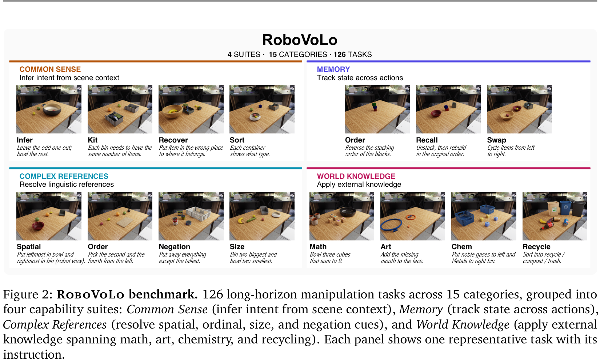
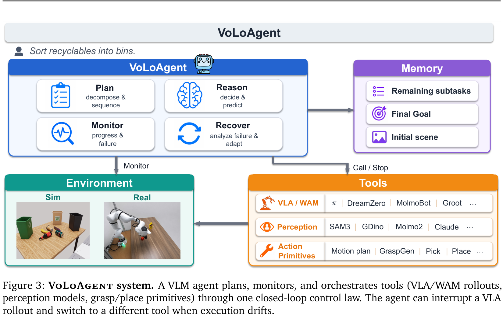
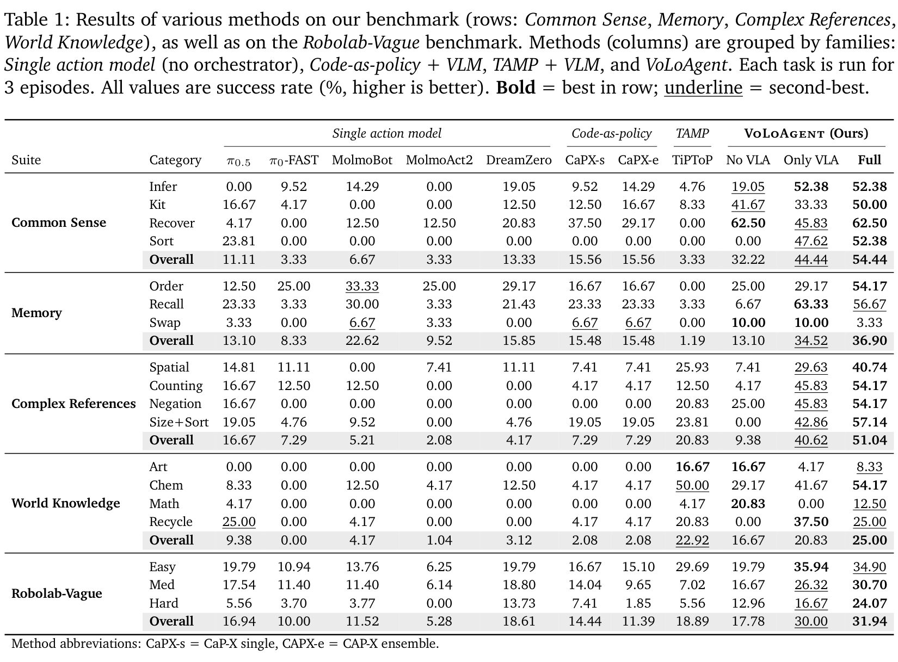
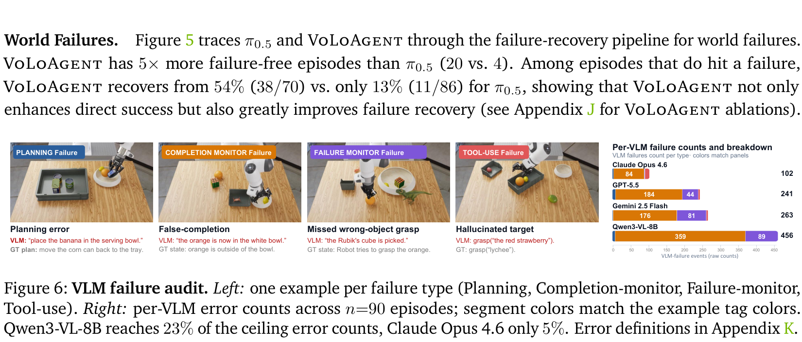
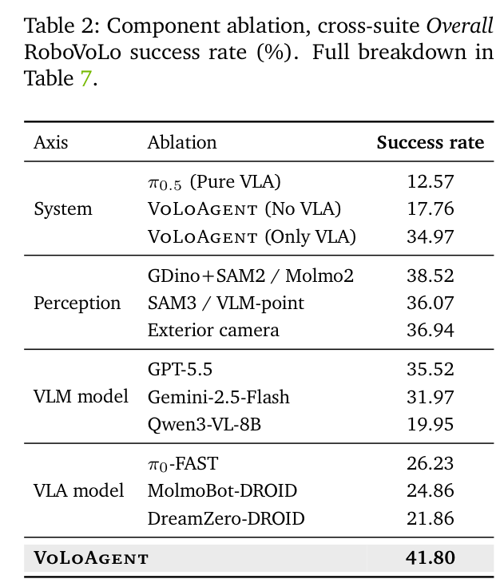
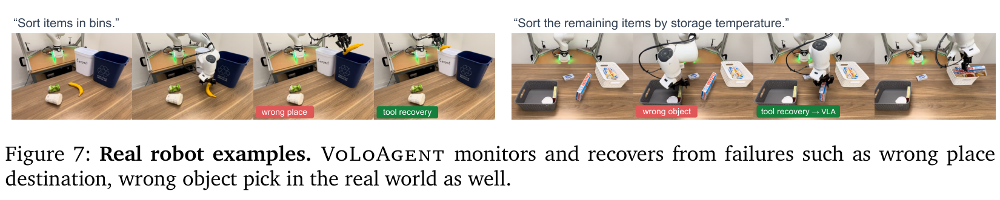
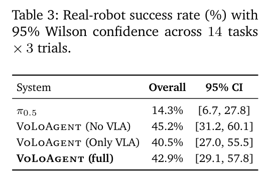

# VoLo: A Physical Orchestrator for Open-Vocabulary Long-Horizon Manipulation

**Authors:** Siyi Chen1,2*, Hugo Hadfield1, Alex Zook1, Mikaela Angelina Uy1, Chan Hee Song1, Erwin Coumans1, Xuning Yang1, Faisal Ladhak1, Qing Qu2, Stan Birchfield1, Jonathan Tremblay1†, Valts Blukis1† (1NVIDIA, 2University of Michigan; †Project Leads, *Work done during an internship at NVIDIA)  
**Source:** local PDF, SHA256 `022ded161c0f61f33db46ed750095da00ddcc9a6533cd08e334edcd16a80db22`, arXiv:2606.07723v1 [cs.RO] 5 Jun 2026  
**Reader:** complete bilingual reader; references remain English-only for searchable bibliographic fidelity.

## Section Index
Abstract; 1. Introduction; 2. Related Work; 3. RoboVoLo Benchmark; 4. VoLoAgent and Physical Orchestration (4.1. Physical Orchestration, 4.2. VoLoAgent System); 5. Experimental Results (5.1. Setup, 5.2. Main Results, 5.3. Failure Mode Analysis, 5.4. Component Ablations, 5.5. Real Robot Validation); 6. Conclusion and Limitations; References; Appendix Overview.

## Terminology Ledger
| English | 中文 |
| --- | --- |
| VoLo / VoLoAgent | 开放词表长时程物理编排器（VoLoAgent） |
| Physical Orchestrator / Orchestration | 物理编排器 / 物理编排控制律 |
| Open-Vocabulary Long-Horizon Manipulation | 开放词汇长时程机器人操作 |
| Monitor–Halt–Redirect (Recover) | 监测—停机—重定向（恢复）闭环机制 |
| Interruptible Tool | 可中断式工具原语 |
| Fast and Slow Memory | 快慢分层记忆系统（监测上下文与深思上下文） |
| Safety-Aware Idling | 具身安全驻留（停机等待）策略 |
| RoboVoLo Benchmark | RoboVoLo 具身长程基准测试集 |
| Common Sense Suite | 常识接地任务套件（Infer, Kit, Recover, Sort） |
| Memory Suite | 状态追踪与记忆套件（Order, Recall, Swap） |
| Complex References Suite | 复杂语言引用套件（Spatial, Counting, Negation, Size+Sort） |
| World Knowledge Suite | 外部世界先验套件（Art, Chem, Math, Recycle） |
| Wrong-Object Pick (WOP) | 抓错目标物体错误 |
| Wrong-Target Placement (WTP) | 放错目标位置错误 |
| Stuck (Lack of End-Effector Progress) | 末端执行器停滞超时错误 |
| Completion-Monitor Failure | 完成度监测误报/漏报 |

## Abstract

> <strong>Para. 1:</strong> Open-vocabulary long-horizon manipulation requires robots to reason over flexible instructions and complex multi-object scenes while adaptively planning, executing, monitoring, and recovering from failures. We address these demands with a closed agent loop in which a VLM orchestrates heterogeneous robot capabilities as interruptible tools. Unlike in virtual AI agents, the timing of decisions, actions and tool calls is important in a physical world that does not pause for reasoning. We refer to this setting as Physical Orchestration, and propose VoLoAgent, a VLM that plans, monitors, and recovers by treating a VLA/WAM as an interruptible tool it steers mid-rollout alongside vision models and action primitives. To evaluate these long-horizon capabilities, we introduce RoboVoLo, a high-fidelity benchmark for open-vocabulary long-horizon manipulation across common sense, memory/state tracking, complex references, and world knowledge, with both task-level success and failure-mode diagnostics. Experiments show VoLoAgent substantially outperforms single VLA/VLM or tool-based systems, with validation on real-robot experiments. Project page: https://chicychen.github.io/VoLo/

> <strong>Para. 1[CN]:</strong> 开放词汇的长时程机器人操作要求机器人在面对高度自由的非结构化自然语言指令和复杂的多物体凌乱场景时，能够自适应地完成规划、执行、状态监测以及从意外失败中自主恢复。为满足这一严苛要求，我们提出了一种闭环智能体控制架构，由视觉—语言大模型（VLM）将异构的机器人底层能力统一编排为可随时中断的工具原语。与纯虚拟环境中的 AI Agent 不同，物理世界不会等待智能体的计算思考而暂停，因此决策、动作触发与工具调用的时间协同在物理实体中至关重要。我们将这一新问题设定命名为“物理编排”（Physical Orchestration），并提出了 VoLoAgent：这是一个能够执行高层规划、实时监测与故障恢复的 VLM 编排系统，它将视觉—语言—动作模型（VLA）或世界动作模型（WAM）视为一种可中断的动态工具，在轨迹展开中途对其进行自适应导引，并与目标感知模型和几何动作原语协同工作。为了系统评估此类长时程具身能力，我们构建了 RoboVoLo 高保真评测基准，全面覆盖常识推理、时序记忆与状态追踪、复杂语言引用以及开放世界知识四大核心套件，不仅提供任务级成功率度量，更支持深度的失败模式归因诊断。广泛实验表明，VoLoAgent 大幅超越了单体 VLA、纯 VLM 及传统工具组合系统，并在实体机械臂真实实验中得到了全面验证。项目主页：https://chicychen.github.io/VoLo/

**Caption:** Figure 1: VoLo overview. VoLoAgent plans, monitors (e.g., subgoal complete), and uses tools (e.g., VLA, SAM3) to act and recover from failures (e.g., wrong object). RoboVoLo is a high-fidelity benchmark for evaluating and diagnosing open-vocabulary long-horizon manipulation.  
**Caption[CN]:** 图 1：VoLo 系统全景总览。VoLoAgent 负责高层规划、在线监测（如子目标完成校验），并灵活调用工具（如 VLA 连续策略、SAM3 感知分割等）进行物理执行并从错误（如抓取了错误物体）中自主恢复。RoboVoLo 则是用于评测和诊断开放词汇长时程操作的高保真基准测试集。

## 1. Introduction

> <strong>Para. 2:</strong> Real-world manipulation requires robots to solve open-vocabulary, long-horizon tasks: instructions describe goals using flexible language, scenes contain many objects that must be reasoned over and moved, and tasks take many steps where mistakes happen and must be recovered from. These tasks are difficult for current models. Single vision-language-action (VLA) models (Intelligence et al., 2025; Kim et al., 2024; Brohan et al., 2023) excel at continuous, contact-rich closed-loop control, but struggle with open-vocabulary reasoning, long-horizon planning, and recovery when something goes wrong. Conversely, high-level VLM agents (Ahn et al., 2022; Huang et al., 2023b; Liang et al., 2023) excel at reasoning and planning, but execute open-loop, relying on rigid, pre-defined action primitives (e.g., pick-and-place) that cannot adapt to unexpected dynamics or fine-grained visual feedback.

> <strong>Para. 2[CN]:</strong> 真实的物理世界操作要求机器人必须具备解决开放词汇、长时程复杂任务的能力：人类指令往往使用极其灵活口语化的自然语言表述目标，工作台中充斥着大量需要空间推理与精确移动的多样作物料，且任务往往跨越漫长的操作步长，执行过程中不可避免会遭遇各种偶发故障并亟需主动恢复。这类任务对现有的机器人学习模型提出了巨大挑战。单体视觉—语言—动作（VLA）模型（Intelligence 等，2025；Kim 等，2024；Brohan 等，2023）擅长连续、富接触的高频闭环运动控制，但在面对开放词表复杂语义推理、超长程时序规划以及意外脱轨后的动态恢复时显得力不从心。相反，基于视觉—语言大模型（VLM）的高层智能体（Ahn 等，2022；Huang 等，2023b；Liang 等，2023）具备极强的常识理解与宏观规划能力，但在底层控制上往往采用开环模式，高度依赖死板僵化的预定义动作原语（如固定的平顶抓取与放置），根本无法自适应应对接触力学突变或依赖连续视觉伺服的精细交互。

> <strong>Para. 3:</strong> Bridging this gap requires combining the continuous control of a learned policy with the reasoning of a high-level agent. However, simply using a VLM to select skills (Ahn et al., 2022) or write code (Liang et al., 2023) produces an open-loop system: once a skill starts, the agent cannot monitor progress, detect failures, or change course. When the policy grasps the wrong object, collides, or drifts off track, the agent only discovers the failure after the entire skill finishes, if at all. To act robustly in dynamic worlds, the agent must orchestrate in closed-loop: continuously monitoring the scene, intervening mid-skill when execution goes awry, and dynamically switching between learned policies and specialized tools (such as perception models or precise geometric primitives) to correct course.

> <strong>Para. 3[CN]:</strong> 弥合这一鸿沟的核心在于将学习型神经网络策略的连续运动控制优势与高层大语言智能体的认知推理能力深度交融。然而，仅仅使用 VLM 进行静态技能选取（如 SayCan，Ahn 等，2022）或编写顶层代码（如 Code as Policies，Liang 等，2023）本质上仍然是一个开环执行系统：一旦某个低层动作技能被触发执行，高层智能体便无法实时监测其推进状态、检测即时失败或动态改变轨迹走向。当底层策略抓取了错误的物体、发生了碰撞或机械臂发生运动偏航时，高层智能体往往只能等到整段原子技能完全超时结束后才能后知后觉地发现。为了在动态物理世界中实现高度鲁棒的操作，智能体必须以**物理闭环编排**的方式运作：持续监测工作台真实物理演化，在底层执行发生偏离时即刻介入打断，并在学习型连续策略与专用工具（如目标感知检测模型或高精度几何逆运动学原语）之间动态敏捷切换，从而迅速修正航向。

> <strong>Para. 4:</strong> We formalize this challenge as Physical Orchestration: an embodied control paradigm where a reasoning agent continuously plans, monitors, and routes between heterogeneous capabilities in a world that does not pause for deliberation. Unlike software agents where tools return synchronously, a physical robot’s tools—such as a continuous VLA rollout—run asynchronously in physical time. The orchestrator must decide not only what to do next, but when to intervene: letting a policy continue while it makes progress, halting it as soon as a failure is detected, and redirecting with an appropriate recovery action.

> <strong>Para. 4[CN]:</strong> 我们将这一全新挑战形式化定义为**“物理编排”（Physical Orchestration）**：这是一种具身闭环控制新范式，在真实物理世界不会为算法深思熟虑而停摆的前提下，由一个推理智能体持续进行高层规划、环境监测，并在异构执行能力之间敏捷路由分发。与软件世界中工具调用同步返回结果的虚拟 Agent 截然不同，实体机器人的工具原语——例如一段连续运行的 VLA 策略 rollout——是在真实的连续物理时间流中异步推进的。物理编排器不仅必须决定“下一步应该做什么”，更必须精确裁定“何时主动介入中断”：只要底层策略在健康推进行动，就允许其平滑运行；一旦监测到错误苗头，必须毫秒级停机刹车，并迅速调度最合适的恢复动作重定向操作流程。

> <strong>Para. 5:</strong> We instantiate this paradigm in VoLoAgent, a physical orchestrator that unifies three complementary capabilities: (i) learned continuous policies (VLAs such as $\pi_{0.5}$ (Intelligence et al., 2025) or world action models (WAMs) such as DreamZero (Ye et al., 2026)) for contact-rich closed-loop execution; (ii) open-vocabulary perception models (e.g., GroundingDINO (Liu et al., 2024), SAM3 (Carion et al., 2025), Molmo2 (Clark et al., 2026)) for grounded spatial identification; and (iii) geometric action primitives (e.g., grasp and place based on GraspGen (Murali et al., 2025) and motion planning) for precise, collision-free relocation. VoLoAgent closes the loop through a fast–slow control structure: a high-frequency monitor context checks whether the current action is progressing, while a slow, deliberation context is invoked only when intervention is required, keeping inference latency bounded while preserving reasoning depth.

> <strong>Para. 5[CN]:</strong> 我们在 **VoLoAgent** 系统中完整实现了这一物理编排范式。VoLoAgent 将三类互补的核心能力融为一体：(i) **学习型连续动作策略**（如 $\pi_{0.5}$ 等先进 VLA 或 DreamZero 等世界动作模型 WAM），用于完成依赖微观物理接触的闭环操作；(ii) **开放词表高精度感知模型**（如 GroundingDINO、SAM3、Molmo2 等），用于提供零样本语义接地与三维空间拓扑定位；(iii) **几何动作原语**（如基于 GraspGen 六自由度抓取姿态估计与运动规划逆解的抓取/放置原语），用于实施精确无碰撞的空间转运。VoLoAgent 通过**快慢双频控制架构**（Fast–Slow Control Structure）实现了物理闭环：高频监测上下文负责快速校验当前动作是否如期推进；而低频深思上下文仅在需要主动介入或任务阶段切换时方才触发，从而在将推理延迟控制在安全阈值内的同时，完美保留了深层逻辑推理的广度与深度。

> <strong>Para. 6:</strong> Evaluating physical orchestration requires a benchmark that tests both open-vocabulary reasoning and long-horizon execution in complex environments. Existing manipulation benchmarks (Liu et al., 2023a; Nasiriany et al., 2024; Chen et al., 2026a) primarily focus on short-horizon tasks, small asset vocabularies, or rigid task templates that do not require adaptive recovery. To address this gap, we introduce RoboVoLo, a high-fidelity manipulation benchmark comprising 126 tasks across 15 categories, grouped into four capability suites: Common Sense, Memory, Complex References, and World Knowledge. Each task requires multi-step manipulation in scenes with many objects (up to 12 items), rich clutter, and open-vocabulary language goals. RoboVoLo is built on RoboLab (Yang et al., 2026) in NVIDIA Isaac Lab (Mittal et al., 2025) and features 501 newly added 3D assets with accurate collision geometry and physical materials.

> <strong>Para. 6[CN]:</strong> 全面评估物理编排能力，需要一个兼具开放词表深层推理与复杂动态环境下长程执行的标准化基准。现存的机器人操作基准（如 LIBERO、RoboCasa、RoboTwin 2.0 等）大多聚焦于短时程原子动作、极其有限的预定义物体资产库，或采用固定死板的任务模板，根本无法考察自适应故障恢复能力。为此，我们推出了 **RoboVoLo**，这是一个包含 126 个具有深度挑战性任务的大规模高保真操作基准，涵盖 15 个细分子类，并被结构化归纳为四大能力套件：**常识接地（Common Sense）**、**时序记忆（Memory）**、**复杂引用（Complex References）** 与 **世界常识（World Knowledge）**。每个任务均要求机器人在包含大量复杂杂物（单场景最高可达 12 个物体）的真实环境中执行多阶段复合操作，并严格对齐开放式自然语言目标。RoboVoLo 构建于 NVIDIA Isaac Lab 的 RoboLab 仿真生态之上，并扩展引入了 501 个具备精确碰撞网格与真实物理材质参数的高保真 3D 资产库。

> <strong>Para. 7:</strong> Through extensive experiments on RoboVoLo, we demonstrate that VoLoAgent significantly outperforms existing single-policy VLA baselines (e.g., $\pi_{0.5}$, DreamZero), code-generation systems (CaP-X), and TAMP frameworks (TiPToP), achieving an overall success rate of 41.8% compared to 12.6% for pure $\pi_{0.5}$. Diagnostic failure analysis reveals that mid-skill intervention and multi-tool routing are the key drivers of success: VoLoAgent resolves 62% of execution errors that otherwise cause baseline policies to fail. Finally, we validate VoLoAgent on a physical Franka arm with real objects across 14 long-horizon tasks, demonstrating that the physical orchestrator transfers effectively to the real world.

> <strong>Para. 7[CN]:</strong> 在 RoboVoLo 上的广泛定量实验表明，VoLoAgent 全面超越了现有的单体 VLA 策略基线（如 $\pi_{0.5}$、DreamZero）、代码生成智能体（CaP-X）以及任务与运动规划系统（TiPToP），取得了 41.8% 的整套基准综合成功率，相比纯 $\pi_{0.5}$ 单体策略的 12.6% 实现了超过 3 倍的巨幅飞跃。细致的失败归因诊断显示，动作中途主动介入与多工具异构路由是制胜的关键：VoLoAgent 成功自主挽救了 62% 导致基线策略彻底崩溃的物理执行故障。最后，我们在真实的 Franka FR3 物理机械臂及实体操作台面上，针对 14 个长程物理任务展开了真机部署验证，证实了这一物理编排器在真实物理世界中的高度可行性与卓越迁移能力。

## 2. Related Work

> <strong>Para. 8:</strong> **Vision-Language-Action and Visuomotor Policy Steering.** Vision-Language-Action (VLA) models (Brohan et al., 2023; Kim et al., 2024; Intelligence et al., 2025) and world-action models (WAMs) (Ye et al., 2026; Wang et al., 2026) represent an important shift toward generalist manipulation by learning continuous action distributions from large-scale demonstration datasets. While highly expressive for single-step skills, their open-vocabulary reasoning remains bounded by the diversity of their training demonstrations, and they lack explicit mechanisms for multi-step progress tracking or long-horizon recovery. A growing body of work explores steering pretrained policies at inference time via human interaction (Wang et al., 2024), value guidance (Nakamoto et al., 2024), dynamic guidance (Du and Song, 2025), touch guidance (Zhang et al., 2026b), or performance predictive guidance (Wang et al., 2026b). VoLoAgent provides a complementary approach: instead of modifying the policy's internal sampling dynamics, it treats the VLA as a discrete, interruptible tool within a broader orchestrator loop, switching to specialized perception or geometric primitives when continuous control drifts.

> <strong>Para. 8[CN]:</strong> **视觉—语言—动作模型与动作策略导引：** 视觉—语言—动作（VLA）模型（Brohan 等，2023；Kim 等，2024；Intelligence 等，2025）与世界动作模型（WAM）（Ye 等，2026；Wang 等，2026）代表了通用机器人操作领域的一大重要范式转变，它们通过在大规模示教数据集上端到端训练连续动作分布来获得广阔的物理交互技能。尽管单步原子技能极富表征力，但它们的开放词汇语义理解深度受制于训练数据的覆盖边界，且普遍缺乏显式的长程步骤推进追踪与自适应故障恢复机制。近年来，诸多研究尝试在推理阶段对冻结的预训练策略进行动态导引（Steering），包括人类介入交互（Wang 等，2024）、价值函数引导（Nakamoto 等，2024）、动态引导（Du 与 Song，2025）、触觉引导（Zhang 等，2026b）以及性能预测引导（Wang 等，2026b）。VoLoAgent 提供了一种互补的新思路：它并不改动底层神经网络策略内部的去噪采样动力学，而是将 VLA 封装为更高层物理编排闭环中的一种离散、可随时打断的具身工具，当检测到底层连续控制发生偏航时，无缝切换至专用感知或几何原语实施纠偏。

> <strong>Para. 9:</strong> **LLM and VLM Agents for Robotics.** Large language and vision-language models have been widely used for high-level task planning in robotics (Ahn et al., 2022; Huang et al., 2022; Singh et al., 2023; Liang et al., 2023; Huang et al., 2023b; Wake et al., 2023). Frameworks like SayCan (Ahn et al., 2022) score predefined skills using affordance models, while Code-as-Policies (Liang et al., 2023) and VoxPoser (Huang et al., 2023b) generate executable robot programs or 3D cost maps. Recent systems explore closed-loop replanning and verification (Zhi et al., 2025; Nazarczuk et al., 2025; Kumar, 2026). However, these architectures predominantly operate in a hierarchical "planner-then-executor" mode: the VLM outputs a plan or primitive call, and waits for its complete termination before observing the scene again. VoLoAgent breaks this dichotomy by introducing physical orchestration, where the agent concurrently monitors in-flight execution, actively interrupts wandering policies, and arbitrates among heterogeneous tools in real physical time.

> <strong>Para. 9[CN]:</strong> **面向机器人的大语言与多模态智能体：** 大语言模型与多模态 VLM 已被广泛应用于机器人高层任务规划中（Ahn 等，2022；Huang 等，2022；Singh 等，2023；Liang 等，2023；Huang 等，2023b；Wake 等，2023）。诸如 SayCan（Ahn 等，2022）等框架利用可达性打分模型评估预定义技能，而 Code-as-Policies（Liang 等，2023）与 VoxPoser（Huang 等，2023b）则直接合成可执行 Python 控制脚本或 3D 价值场代价图。近期工作进一步探索了闭环重规划与阶段验证机制（Zhi 等，2025；Nazarczuk 等，2025；Kumar，2026）。然而，这些经典架构绝大多数仍困在层级式的“先规划、后执行”孤立模式中：VLM 生成顶层计划或发起动作调用后，便被动阻塞挂起，必须等待底层动作完全执行完毕后才能再次捕获图像。VoLoAgent 彻底打破了这种割裂，开创了物理编排新机制，智能体在真实物理时间流中与底层执行并行监测，主动刹停偏航动作，并在异构工具之间灵活仲裁调度。

> <strong>Para. 10:</strong> **Long-Horizon Manipulation Benchmarks.** Standard robot learning benchmarks such as RLBench (James et al., 2020), CALVIN (Mees et al., 2022), LIBERO (Liu et al., 2023a), and RoboCasa (Nasiriany et al., 2024) have catalyzed progress in language-conditioned imitation learning. However, they frequently feature limited scene diversity, fixed grammatical templates, short task horizons, or lack explicit diagnostics for compositional reasoning failures. Benchmarks like RoboMemArena (Lei et al., 2026), RMBench (Chen et al., 2026b), and MIKASA-Robo (Cherepanov et al., 2026) introduce memory-dependent tasks, but primarily evaluate monolithic policies under simplified visual setups. RoboVoLo provides a substantially richer testbed: 126 open-vocabulary tasks requiring 5–12 step sequential manipulation over 501 realistic assets across four distinct cognitive suites, equipped with fine-grained failure metrics separating world execution errors from VLM reasoning errors.

> <strong>Para. 10[CN]:</strong> **长时程机器人操作评测基准：** 诸如 RLBench（James 等，2020）、CALVIN（Mees 等，2022）、LIBERO（Liu 等，2023a）与 RoboCasa（Nasiriany 等，2024）等经典机器人学习基准有力推动了基于语言条件的模仿学习发展。然而，它们普遍存在场景外观同质、指令语法机械死板、操作时程过短或缺乏对组合推理失败的细粒度诊断归因等局限。尽管近期涌现的 RoboMemArena（Lei 等，2026）、RMBench（Chen 等，2026b）与 MIKASA-Robo（Cherepanov 等，2026）开始引入历史依赖型记忆任务，但它们主要在相对简化的视觉配置下测试单体网络。RoboVoLo 则提供了一个显著更丰富、更贴近真实的综合评测试验场：涵盖 126 个开放词汇长程任务，每个任务要求在 501 个高保真逼真三维资产间完成 5 至 12 步连续复合操作，跨越四大认知能力大类，并配备了将物理世界执行失败与高层 VLM 推理失误彻底解耦的细粒度诊断指标。

**Caption:** Figure 2: RoboVoLo benchmark. 126 long-horizon manipulation tasks across 15 categories, grouped into four capability suites: Common Sense (infer intent from scene context), Memory (track state across actions), Complex References (resolve spatial, ordinal, size, and negation cues), and World Knowledge (apply external knowledge spanning math, art, chemistry, and recycling). Each panel shows one representative task with its instruction.  
**Caption[CN]:** 图 2：RoboVoLo 评测基准总览。包含跨越 15 个细分子类的 126 个长时程具身操作任务，划分为四大核心能力套件：常识接地（从场景上下文推断真实意图）、时序记忆（在多步动作中持续追踪状态演变）、复杂引用（解析相对空间、计数、尺寸及否定式语言线索）以及世界常识（调用涵盖数学运算、艺术人脸拼装、化学元素分类及垃圾回收等外部先验）。每个子图均展示了一个代表性任务场景及其自然语言指令。

## 3. RoboVoLo Benchmark

> <strong>Para. 11:</strong> **Tasks and Scenes.** Long-horizon, open-vocabulary manipulation requires a robot to reason and act over many steps. It must ground intent in scene context, track state as the scene changes, resolve fine-grained references, and apply world knowledge to carry out each step while monitoring and recovering from failures. This coupling of reasoning and execution is largely unsolved, and current benchmarks do not isolate it. RoboVoLo fills that gap with 126 tasks that span four reasoning categories, each requiring a chain of grounded manipulation actions. The tasks are built so they cannot be solved by obvious instruction-independent behavior. Fig. 2 summarizes the taxonomy of four main categories:

> <strong>Para. 11[CN]:</strong> **任务与场景设计：** 开放词汇的长时程操作要求机器人在漫长的执行步序中持续进行空间推理与动作决策。它必须将人类意图精准接地到当前场景拓扑中，随着环境动态演变实时追踪全局状态，消歧极其细微的相对语言引用，并调用广泛的物理常识来指引每一步操作，同时主动监控执行并从意外脱轨中自愈恢复。这种高层推理与低层物理执行的紧密耦合是一个尚未攻克的学术难关，而现存基准未能将其显式解耦。RoboVoLo 填补了这一空白，设计了涵盖四大认知维度的 126 个任务，每个任务均需要由一系列精准接地的物理操作链构成。所有任务都经过精心设计，确保无法通过与指令无关的平凡动作模式（如盲抓任意物体）侥幸过关。图 2 总结了四大能力套件的分类体系：

> <strong>Para. 12:</strong> 1. **Commonsense grounding:** Success depends on understanding the functional or contextual role of objects in the current environment, rather than following the instruction verbatim. Categories include **Infer** (e.g., inferring which bin needs items to balance quantities), **Kit** (packing kits with balanced counts), **Recover** (restoring displaced items to their correct functional slots), and **Sort** (grouping items by container labels).  
> 2. **Memory:** These tasks require the policy to maintain information about earlier scene states during execution. Examples include **Order** (reversing the vertical stacking order of blocks), **Recall** (unstacking a tower and rebuilding it in its exact initial configuration), and **Swap** (cyclically shifting items from left to right while tracking intermediate occupied locations).  
> 3. **Complex references:** Evaluate fine-grained language understanding. Instructions contain **Spatial** (e.g., "put leftmost item in bowl and rightmost in bin from robot view"), **Counting** (e.g., picking the second and fourth items from the left), **Negation** (e.g., "put away everything except the tallest"), and **Size+Sort** (placing the two biggest in one container and the two smallest in another).  
> 4. **World knowledge:** These tasks require general knowledge beyond the immediate geometry of the scene, covering domains like **Math** (e.g., selecting three numbered cubes whose values sum to 9), **Art** (completing a stylized face with the missing feature), **Chem** (sorting noble gas element blocks to one bin and alkali metals to another), and **Recycle** (sorting trash, compost, and recyclables into correct disposal receptacles).

> <strong>Para. 12[CN]:</strong> 1. **常识接地套件（Commonsense Grounding）：** 任务成功与否取决于能否理解物体在当前环境中的功能属性与上下文角色，而非死板字面遵从指令。包含四个子类：**意图推断（Infer）**（如推断各个料盒的数量差并达成平衡）、**物料配齐（Kit）**（为各个套件配平相同数目的物件）、**主动恢复（Recover）**（将摆放错误的物体移回其应属功能区）以及**标签分拣（Sort）**（根据容器外部图文标识归类物品）。  
> 2. **时序记忆套件（Memory）：** 专门考察策略在长程交互过程中对早期历史场景状态信息的持久保留与追踪。包含三个子类：**顺序反转（Order）**（将堆叠的积木塔严格倒序重新垒砌）、**初始复原（Recall）**（将已有结构完全拆解后，根据初始历史记忆分毫不差地重建复原）以及**循环轮换（Swap）**（将物体沿水平方向循环移位，并在移位过程中显式追踪被中间临时占用的空位）。  
> 3. **复杂引用套件（Complex References）：** 深度评测细粒度语言歧义解析。指令包含**相对空间方位（Spatial）**（如“以机器人第一视角，将最左侧物体放入碗中，最右侧放入托盘”）、**序数计数（Counting）**（如“从左往右挑出第 2 个和第 4 个物体”）、**否定排除（Negation）**（如“收拾除最高物体外的其余所有东西”）以及**尺寸分流（Size+Sort）**（如“将最大的两个装入盒中，最小的两个装入碗中”）。  
> 4. **外部世界先验套件（World Knowledge）：** 任务需要超越当前几何观测的外部跨学科背景知识，包含四个子类：**数学逻辑（Math）**（如挑选三个数字方块使其点数之和严格等于 9）、**几何艺术（Art）**（为简笔五官面孔补全缺失的嘴巴形态）、**化学常识（Chem）**（将稀有气体元素方块挑至左盒，将碱金属方块分拣至右盒）以及**环保分类（Recycle）**（将生活杂物准确投入可回收、厨余与干垃圾分类箱）。

> <strong>Para. 13:</strong> **Simulator.** RoboVoLo is built on RoboLab (Yang et al., 2026), a high-fidelity simulation environment based on NVIDIA Isaac Lab (Mittal et al., 2025). To support these tasks, we expand RoboLab’s asset library with 501 new objects: 247 household assets from NVIDIA’s Lightwheel SimReady collection and 254 task-specific assets, including 118 chemical periodic-table element cubes, 120 geometric art objects varying in color, shape, and size, and 16 wooden math cubes with digits and operators. All assets include collision geometry and realistic physics materials, yielding a diverse collection spanning household, semantic, symbolic, and task-specific categories.

> <strong>Para. 13[CN]:</strong> **物理仿真平台构建：** RoboVoLo 架构在基于 NVIDIA Isaac Lab 打造的开源高保真仿真环境 RoboLab（Yang 等，2026）之上。为全面支撑上述 126 项高复杂度任务，我们将 RoboLab 的三维模型库大幅扩充了 **501 个全新资产**：包括来源于 NVIDIA Lightwheel SimReady 工业级资产库的 247 件真实家居用品，以及 254 个任务专属定制资产（涵盖 118 块元素周期表化学立方体、120 件不同颜色形态尺寸的几何艺术构件，以及 16 块印有数字与数学符号的实木算术方块）。所有资产均配备了凸包分解碰撞网格（Collision Geometry）与逼真的摩擦力、弹性模量等物理材质，构筑起跨越日常家居、语义符号与科学知识的庞大资产池。

**Caption:** Figure 3: VoLoAgent system. A VLM agent plans, monitors, and orchestrates tools (VLA/WAM rollouts, perception models, grasp/place primitives) through one closed-loop control law. The agent can interrupt a VLA rollout and switch to a different tool when execution drifts.  
**Caption[CN]:** 图 3：VoLoAgent 系统架构。由高层 VLM 智能体在一个统一的闭环控制律下进行全局规划、在线状态监测并灵活调度异构工具（涵盖 VLA/WAM 动作生成策略、零样本感知模型以及几何抓取/放置运动原语）。当检测到策略执行偏航时，智能体能够主动中断 VLA 的正在执行的动作轨迹，并自适应切换至最匹配的工具实施纠偏。

## 4. VoLoAgent and Physical Orchestration

### 4.1. Physical Orchestration

> <strong>Para. 14:</strong> Virtual AI agents assume a world that holds still while the agent thinks, whereas a physical agent must reason while the world keeps moving. This imposes a core requirement: the agent must monitor the world for divergence between what it believes it has accomplished and the actual scene, halt an in-flight action as quickly as possible if divergence is detected, and redirect by choosing a correction: replanning, reissuing the action, or switching tools. Safe halting during reasoning may require an idling policy that for a fixed-base arm is simply stopping, but in general must keep the agent out of harm’s way. We refer to this monitor–halt–redirect requirement as physical orchestration.

> <strong>Para. 14[CN]:</strong> 虚拟软件智能体默认世界在它思考时是完全静止的，然而具身物理智能体必须在世界持续运动流变的过程中进行实时推理。这提出了一个核心物理约束：智能体必须不间断地监测真实环境，检测“智能体预期已达成的状态”与“当前物理场景真实状态”之间的偏航与分歧；一旦捕获到这种偏差，必须尽可能迅速地**刹停正在行进中的低层动作（Halt）**，并通过挑选最有效的修正手段来**重定向控制流（Redirect）**——包括触发局部重规划、重新下发修改后的指令，或果断切换到底层工具家族中的其他原语。此外，在智能体深思熟虑的数秒计算窗口期内，安全停机需要一套“驻留策略”（Idling Policy），对于固定基座机械臂而言表现为就地刚性制动锁定，而对于移动或双足平台而言则必须主动保持动力学平衡与避障安全。我们将这一“监测—停机—重定向”的核心机制称之为**物理编排（Physical Orchestration）**。

> <strong>Para. 15:</strong> Prior closed-loop systems address parts of it: VLM-driven frameworks perform situated reasoning and failure recovery (Zhi et al., 2025), key-frame agents recover from execution errors (Nazarczuk et al., 2025), and reactive controllers halt a moving base to recover mid-task (Burgess-Limerick et al., 2023), but each targets a subset of these capabilities or a fixed pipeline. With physical orchestration we emphasize the need to handle all three together, for an open-vocabulary agent that switches tools mid-rollout, including interrupting asynchronous tools such as a learned visuomotor policy mid-rollout.

> <strong>Para. 15[CN]:</strong> 先前的闭环系统或多或少涉及了其中的局部片段：例如基于 VLM 的情境推理与重规划系统（Zhi 等，2025）、基于关键帧的执行恢复智能体（Nazarczuk 等，2025）以及在底盘运动发生碰撞风险时制动急停的反应式控制器（Burgess-Limerick 等，2023）。然而，这些已有方案要么仅针对某一孤立功能，要么受困于僵化的预设流水线。而我们所定义的物理编排，强调必须在一个开放词表的通用智能体中将三者有机统一，支持在策略行进展开的中途主动切换异构工具，尤其是具备随时中断并回收异步执行中的学习型视动控制策略控制权的能力。

### 4.2. VoLoAgent System

> <strong>Para. 16:</strong> VoLoAgent is a physical orchestrator: a single VLM agent that plans subtasks, monitors execution, and continuously routes among tools, deciding whether to continue, switch tools, advance, or recover. Unlike prior hierarchical systems that split control between a VLM planner and a VLA executor, here the VLA is one callable tool alongside perception models and grasp/place primitives, combined complementarily. It realizes the monitor–halt–recover loop through three design choices:  
> • **(P1) Asynchronous tools:** robot motion runs independent of the agent’s reasoning, so the agent interleaves monitoring with execution rather than blocking.  
> • **(P2) Fast and slow memory:** a short monitor context (current observation, active subgoal, recent decisions) read as close to the motion timescale as possible (0.2Hz here), and a fuller deliberation context (task memory, scene history, tool catalog) consulted only at planning points, echoing dual-system VLA designs (Intelligence et al., 2025).  
> • **(P3) Safety-aware idling:** holding the robot still when reasoning must continue mid-task.

> <strong>Para. 16[CN]:</strong> VoLoAgent 正是这样一套物理编排器系统：由单一的核心 VLM 智能体统一负责分解子目标、在线监测执行流并在各类异构工具之间动态路由，决定是继续行进、切换工具、推进一步还是发起恢复。与以往在“VLM 规划器”与“VLA 执行器”之间划清硬性边界的经典层级系统完全不同，在 VoLoAgent 中，VLA 仅作为工具箱中的一件可调用原语，与几何感知模型和抓放动作原语处于完全平等的地位，形成深度互补。VoLoAgent 通过三大关键架构设计落地了“监测—停机—恢复”闭环：  
> • **(P1) 异步工具调用（Asynchronous Tools）：** 机械臂的底层物理轨迹运动与高层智能体的思维推理过程完全解耦并行，使得智能体能够在动作执行的同时交替执行视觉监测，彻底告别阻塞式等待；  
> • **(P2) 快慢分层记忆系统（Fast and Slow Memory）：** 包含轻量敏捷的“监测上下文”（仅注入当前单帧观测、当前活跃子目标及最近两步决策），尽可能以高频（当前为 0.2Hz）快速巡检；以及信息高度富集的“深思上下文”（涵盖全局任务记忆、长程场景变迁轨迹与完整工具 API 手册），仅在发生异常或阶段跃迁时才按需调取，这与人类认知的“快慢双系统”设计（Intelligence 等，2025）形成深刻呼应；  
> • **(P3) 具身安全驻留策略（Safety-Aware Idling）：** 当智能体在任务中途必须调用深层模型进行重规划时，立即下达刚性制动指令锁定机械臂各关节，确保物理实体在算法计算耗时期间处于绝对安全受控状态。

> <strong>Para. 17:</strong> We instantiate three complementary tool families:  
> • **VLA/WAM:** Continuous visuomotor control policies (e.g., $\pi_{0.5}$, DreamZero) operate as first-class physical execution tools, excelling at contact-rich adjustments but susceptible to semantic grounding errors in open-vocabulary scenes.  
> • **Perception Tools:** Open-vocabulary detectors and segmenters (GroundingDINO, SAM2, SAM3, Molmo2) provide explicit 2D/3D bounding boxes, keypoint coordinates, and pixel-accurate object masks.  
> • **Action Primitives:** Geometry-grounded pick-and-place routines combining visual grounding, 6-DoF grasp generation (GraspGen), and multi-start inverse kinematics (IK) for collision-free trajectory interpolation.  
> Full API signatures and system prompts are provided in Appendices B and C.

> <strong>Para. 17[CN]:</strong> 我们在底层实例化了三大互补的具身工具家族：  
> • **VLA / WAM 策略家族：** 包含连续视动控制策略（如 $\pi_{0.5}$、DreamZero 等），作为一等公民物理执行工具，极其擅长富接触的微观姿态伺服调整，但在凌乱场景中的开放词汇空间语义接地容易发生偏差；  
> • **感知模型工具家族：** 涵盖先进的开放词汇检测器与分割模型（GroundingDINO、SAM2、SAM3、Molmo2），为系统提供精确的二维/三维包围框、抓取关键点坐标及像素级掩码分割；  
> • **动作原语工具家族：** 结合感知接地、GraspGen 六自由度抓取姿态合成以及多初值逆运动学（IK）避障运动规划，形成具有解析几何保障的抓取 `grasp(target)` 与放置 `place(destination)` 刚性原语。  
> 完整的工具 API 签名与系统 Prompt 模板详见附录 B 与附录 C。

> <strong>Para. 18:</strong> **Orchestration Execution Loop.** Given a user instruction and the initial scene, the orchestrator proceeds through four distinct operational phases:  
> 1. **Initial Execution:** The agent decomposes the global instruction into an ordered sequence of atomic subgoals and stores them in symbolic external memory. It typically dispatches the first tool call as a VLA rollout for continuous control and initiates concurrent asynchronous monitoring.  
> 2. **Monitoring & Routing:** At each 0.2Hz monitoring step, the VLM reads the latest observation under the lightweight monitor context (P2) and evaluates execution state against the active subgoal, selecting from `{continue, next_subgoal, recovery}`.  
> 3. **Failure Recovery:** If divergence or failure is detected, the in-flight tool is instantly halted (P3), and the agent switches to the deliberation context to select an appropriate remedial action: `continue` (if the alarm was a transient false positive), `replan` (to restructure remaining subgoals), `rewrite` (to prompt the VLA with an altered verbal instruction), or `grasp / place` (to invoke precision geometric primitives).  
> 4. **Subtask Transition:** Upon verified completion of a subgoal, the agent updates its memory register and advances to the next subtask until overall success or timeout.

> <strong>Para. 18[CN]:</strong> **物理编排控制律四大执行阶段：** 给定人类自然语言指令与初始场景图像后，编排器通过四个紧密耦合的阶段展开闭环控制：  
> 1. **初始分解阶段（Initial Execution）：** 智能体将全局复杂指令解析为具备严格时序依赖关系的原子子目标序列，并将其写入外部符号化工作记忆中。系统通常首选派发 VLA 策略发起连续物理动作，并同步启动后台异步感知监测；  
> 2. **在线监测与路由（Monitoring & Routing）：** 在每一个 0.2Hz 的监测周期，VLM 在极低开销的轻量监测上下文（P2）中比对当前视觉图像与子目标完成准则，在三个离散指令间做出路由判定：`continue`（继续执行）、`next_subgoal`（子目标完成，切入下一阶段）或 `recovery`（检测到异常，触发紧急恢复）；  
> 3. **故障恢复阶段（Failure Recovery）：** 一旦判定进入恢复流，正在运动中的机械臂立即触发安全停机锁死（P3），智能体随即载入全量的深思上下文进行诊断决策，在四大恢复分支中择优派发：若确认为视觉误报则直接 `continue` 恢复现场；若子目标失效则执行 `replan` 重构后续规划；若方向轻微偏差则执行 `rewrite` 修改子指令重新驱动 VLA；若低层抓取滑动则调用 `grasp / place` 几何原语直接实施硬性纠偏；  
> 4. **子任务推进（Subtask Transition）：** 经多模态校验确认子目标达成后，工作记忆变量同步递增，无缝推进至下一子目标，循环往复直至最终达成整任务成功条件或仿真超时。

## 5. Experimental Results

### 5.1. Setup

> <strong>Para. 19:</strong> **Simulation Benchmarks.** We evaluate on four RoboVoLo suites covering 126 tasks and on the existing RoboLab benchmark (120 tasks) with vague-choice instructions. All policy models use the DROID setup (Khazatsky et al., 2024): a 7-DoF Franka Research 3 arm with a Robotiq 2F-85 gripper, external ZED 2i and wrist ZED mini cameras, and a 7-DoF joint-position plus binary-gripper action space. Camera poses and lighting match the real DROID configuration. Each task is evaluated over three fixed-seed trials to ensure identical initial states across systems.

> <strong>Para. 19[CN]:</strong> **仿真实验配置：** 我们在 RoboVoLo 的四大核心套件（共 126 项长程任务）以及原有的 RoboLab 基准（120 项模糊指令任务）上展开全面评测。所有被测策略模型均采用标准 DROID 硬件实体规范（Khazatsky 等，2024）：7 自由度 Franka Research 3 机械臂、Robotiq 2F-85 平行二指夹爪、外部固定视角 ZED 2i 双目相机与腕部 ZED mini 眼在手上相机，动作空间为 7 维关节位置目标增量搭配二值夹爪开合指令。相机位姿、台面高程与环境光照均与真实物理 DROID 实验台保持完全一致。每个任务均在 3 个严格固定种子的随机初始化下运行，确保所有基线系统在完全等价的物理初始状态下公平较量。

> <strong>Para. 20:</strong> **VoLoAgent Configuration.** VoLoAgent (Full) uses Claude Opus 4.6 (Anthropic, 2026) as the decision-making VLM with the following tools: $\pi_{0.5}$ (Intelligence et al., 2025) as the VLA, SAM3 (Carion et al., 2025) and Molmo2 (Clark et al., 2026) as perception tools, and GraspGen (Murali et al., 2025) with multi-start IK plus depth-projected point placement for pick and place execution. The VLA and primitives run at 15Hz, while the VLM monitors at 0.2Hz from a front camera. We compare against two main ablations: VoLoAgent (No VLA), which only uses perception tools and grasp/place action primitives, and VoLoAgent (Only VLA), which disables all other tools and only relies on verbal steering of the VLA.

> <strong>Para. 20[CN]:</strong> **VoLoAgent 系统实例化：** 完整版的 VoLoAgent (Full) 采用 Claude Opus 4.6（Anthropic，2026）作为核心决策 VLM 编排器，集成工具链如下：以 $\pi_{0.5}$ 作为默认 VLA 动作策略，以 SAM3 和 Molmo2 作为多模态感知接地工具，以 GraspGen 六自由度姿态估计配合多初值 IK 解算与深度图反投影作为几何抓放原语。底层 VLA 动作推理与伺服运动运行在 15Hz 高频，而顶层 VLM 以 0.2Hz 的步调基于前置相机进行轻量在线监测。我们构建了两个极具对照价值的核心消融变体：**VoLoAgent (No VLA)**，彻底移除 VLA 神经网络策略，纯靠感知模型加几何抓放原语运行；以及 **VoLoAgent (Only VLA)**，彻底禁用一切专用感知与几何原语，纯粹依靠 VLM 用自然语言提示词对 VLA 实施闭环文本导引。

> <strong>Para. 21:</strong> **Baselines.** We compare against three broad baseline families:  
> 1. **Single Action Models (No Orchestrator):** $\pi_{0.5}$ (Intelligence et al., 2025), $\pi_0$-FAST (Pertsch et al., 2025), MolmoBot (Deshpande et al., 2026), MolmoAct2 (Fang et al., 2026), and DreamZero (Ye et al., 2026).  
> 2. **Code-as-Policy + VLM:** CaP-X (Fu et al., 2026) in both single-execution and ensemble configurations.  
> 3. **TAMP + VLM:** TiPToP (Shen et al., 2026), a task-and-motion planning framework driven by LLM high-level decomposition.

> <strong>Para. 21[CN]:</strong> **强对比基线选取：** 我们选取了三大流派的代表性先进基准：  
> 1. **单体动作模型（无编排器）：** $\pi_{0.5}$（目前最强的流匹配 VLA 之一）、$\pi_0$-FAST、MolmoBot、MolmoAct2 以及世界动作模型 DreamZero；  
> 2. **代码生成流派（Code-as-Policy + VLM）：** 先进的代码策略生成系统 CaP-X（包含单次生成版与多候选中成版）；  
> 3. **任务与运动规划流派（TAMP + VLM）：** 经典由大模型引导的符号任务与几何运动规划框架 TiPToP。

### 5.2. Main Results

> <strong>Para. 22:</strong> Table 1 presents task success rates across all four RoboVoLo suites as well as Robolab-Vague. Single-action VLA policies achieve very low success across all categories, with $\pi_{0.5}$ averaging only 12.6% on RoboVoLo and DreamZero reaching 9.1%. Code-as-policies (CaP-X) and TAMP (TiPToP) fare marginally better in structured categories but struggle severely in complex contact-rich environments (averaging 10.1% and 12.1%, respectively). In stark contrast, VoLoAgent (Full) achieves an unprecedented **41.8% overall success rate**, outperforming all single-action models by more than **3.3$\times$** and beating all tool-based agents by more than **3.4$\times$**.

> <strong>Para. 22[CN]:</strong> 表 1 汇集了各对比方法在 RoboVoLo 四大套件及 Robolab-Vague 基准上的全量成功率评测结果。在没有编排器辅助的情况下，纯单体 VLA 策略在所有具有深度推理维度的长程任务中表现极其低迷：前沿的 $\pi_{0.5}$ 在 RoboVoLo 上的平均成功率仅有 12.6%，世界动作模型 DreamZero 仅为 9.1%。代码生成智能体 CaP-X 与任务运动规划系统 TiPToP 虽然在部分结构化规则任务中稍有斩获，但在富接触和多样外观场景中同样崩溃（平均成功率仅为 10.1% 和 12.1%）。与此形成鲜明对照的是，**完整版 VoLoAgent (Full) 斩获了 41.8% 的基准综合成功率**，相较单体 SOTA VLA 实现了超过 **3.3 倍**的巨幅领先，相较传统工具与代码智能体高出 **3.4 倍以上**。

**Caption:** Table 1: Results of various methods on our benchmark (rows: Common Sense, Memory, Complex References, World Knowledge), as well as on the Robolab-Vague benchmark. Methods (columns) are grouped by families: Single action model (no orchestrator), Code-as-policy + VLM, TAMP + VLM, and VoLoAgent. Each task is run for 3 episodes. All values are success rate (%, higher is better). Bold = best in row; underline = second-best.  
**Caption[CN]:** 表 1：各类方法在 RoboVoLo 基准（涵盖常识、记忆、复杂引用与世界知识四大套件）及 Robolab-Vague 基准上的全维度评测结果对比。各列方法按流派划分：单体动作模型（无编排器）、代码生成策略（Code-as-policy + VLM）、任务与运动规划（TAMP + VLM）以及本研究提出的 VoLoAgent 编排体系。每个任务变体均在 3 个固定随机种子下评测。所有数值均为最终任务成功率（SR, %，越高越好）。粗体表示行内第一，下划线表示第二。

| Suite | Category | $\pi_{0.5}$ | $\pi_0$-FAST | MolmoBot | MolmoAct2 | DreamZero | CaPX-s | CaPX-e | TiPToP | VoLo (No VLA) | VoLo (Only VLA) | VoLo (Full) |
| :--- | :--- | :---: | :---: | :---: | :---: | :---: | :---: | :---: | :---: | :---: | :---: | :---: |
| **Common Sense** | Infer | 0.00 | 9.52 | 14.29 | 0.00 | 19.05 | 9.52 | 14.29 | 4.76 | 19.05 | **52.38** | **52.38** |
| | Kit | 16.67 | 4.17 | 0.00 | 0.00 | 12.50 | 12.50 | 16.67 | 8.33 | 41.67 | 33.33 | **50.00** |
| | Recover | 4.17 | 0.00 | 12.50 | 12.50 | 20.83 | 37.50 | 29.17 | 0.00 | **62.50** | 45.83 | **62.50** |
| | Sort | 23.81 | 0.00 | 0.00 | 0.00 | 0.00 | 0.00 | 0.00 | 0.00 | 0.00 | 47.62 | **52.38** |
| | *Overall* | 11.11 | 3.33 | 6.67 | 3.33 | 13.33 | 15.56 | 15.56 | 3.33 | 32.22 | 44.44 | **54.44** |
| **Memory** | Order | 12.50 | 25.00 | 33.33 | 25.00 | 29.17 | 16.67 | 16.67 | 0.00 | 25.00 | 29.17 | **54.17** |
| | Recall | 23.33 | 3.33 | 30.00 | 3.33 | 21.43 | 23.33 | 23.33 | 3.33 | 6.67 | **63.33** | 56.67 |
| | Swap | 3.33 | 0.00 | 6.67 | 3.33 | 0.00 | 6.67 | 6.67 | 0.00 | **10.00** | **10.00** | 3.33 |
| | *Overall* | 13.10 | 8.33 | 22.62 | 9.52 | 15.85 | 15.48 | 15.48 | 1.19 | 13.10 | 34.52 | **36.90** |
| **Complex Ref.** | Spatial | 14.81 | 11.11 | 0.00 | 7.41 | 11.11 | 7.41 | 7.41 | 25.93 | 7.41 | 29.63 | **40.74** |
| | Counting | 16.67 | 12.50 | 12.50 | 0.00 | 0.00 | 4.17 | 4.17 | 12.50 | 4.17 | 45.83 | **54.17** |
| | Negation | 16.67 | 0.00 | 0.00 | 0.00 | 0.00 | 0.00 | 0.00 | 20.83 | 25.00 | 45.83 | **54.17** |
| | Size+Sort | 19.05 | 4.76 | 9.52 | 0.00 | 4.76 | 19.05 | 19.05 | 23.81 | 0.00 | 42.86 | **57.14** |
| | *Overall* | 16.67 | 7.29 | 5.21 | 2.08 | 4.17 | 7.29 | 7.29 | 20.83 | 9.38 | 40.62 | **51.04** |
| **World Knowl.** | Art | 0.00 | 0.00 | 0.00 | 0.00 | 0.00 | 0.00 | 0.00 | **16.67** | **16.67** | 4.17 | 8.33 |
| | Chem | 8.33 | 0.00 | 12.50 | 4.17 | 12.50 | 4.17 | 4.17 | 50.00 | 29.17 | 41.67 | **54.17** |
| | Math | 4.17 | 0.00 | 0.00 | 0.00 | 0.00 | 0.00 | 0.00 | 4.17 | **20.83** | 0.00 | 12.50 |
| | Recycle | 25.00 | 0.00 | 4.17 | 0.00 | 0.00 | 4.17 | 4.17 | 20.83 | 0.00 | **37.50** | 25.00 |
| | *Overall* | 9.38 | 0.00 | 4.17 | 1.04 | 3.12 | 2.08 | 2.08 | 22.92 | 16.67 | 20.83 | **25.00** |
| **Robolab-Vague** | Easy | 19.79 | 10.94 | 13.76 | 6.25 | 19.79 | 16.67 | 15.10 | 29.69 | 19.79 | **35.94** | 34.90 |
| | Med | 17.54 | 11.40 | 11.40 | 6.14 | 18.80 | 14.04 | 9.65 | 7.02 | 16.67 | 26.32 | **30.70** |
| | Hard | 5.56 | 3.70 | 3.77 | 0.00 | 13.73 | 7.41 | 1.85 | 5.56 | 12.96 | 16.67 | **24.07** |
| | *Overall* | 16.94 | 10.00 | 11.52 | 5.28 | 18.61 | 14.44 | 11.39 | 18.89 | 17.78 | 30.00 | **31.94** |

**Caption:** Figure 4: Process comparison on two open-vocabulary long-horizon tasks, one row per system. Red tags mark failure events (e.g. wrong object, collision), green tags mark recoveries, and blue tags indicate successful subtask completion. VoLoAgent detects divergence mid-execution and re-routes to appropriate recovery tools.  
**Caption[CN]:** 图 4：在两个开放词表长时程操作任务上的全流程对比可视化（每行对应一个测试系统）。红色标签标示故障发生节点（如抓错目标、发生碰撞），绿色标签标示成功发起的工具恢复动作，蓝色标签代表子目标的顺利达成。VoLoAgent 能够在执行途中敏锐感知偏差并精准重定向至专用恢复原语。

### 5.3. Failure Mode Analysis

> <strong>Para. 23:</strong> **Metrics Definition.** We analyze failures along two orthogonal axes:  
> • **World Failures:** Measure real physical state execution errors during simulation, including:  
>   - **Wrong-Object Pick (WOP):** The gripper attaches to an object that violates the active subgoal prompt.  
>   - **Wrong-Target Placement (WTP):** An object is released into an improper container or coordinates.  
>   - **Stuck:** The robot end-effector exhibits zero forward task progress for more than 10 seconds.  
>   Each world failure event is paired with a subsequent recovery event if resolved before episode termination.  
> • **VLM Failures:** Measure cognitive and orchestration errors produced by the VLM decision engine, including:  
>   - **Planning:** Decomposing the instruction into an invalid, redundant, or incomplete subgoal list.  
>   - **Completion-Monitor:** Issuing false-positive (declaring a failed/incomplete subgoal done) or false-negative verdicts.  
>   - **Failure Detection:** Missing an actual physical slip, collision, or wrong pick.  
>   - **Tool Calling:** Selecting an incompatible tool signature or malformed parameters.

> <strong>Para. 23[CN]:</strong> **多维度失败度量指标定义：** 我们从两个正交轴向建立诊断指标：  
> • **物理世界故障（World Failures）：** 度量仿真环境中的底层实体执行状态偏差，细分为：  
>   - **抓错目标（Wrong-Object Pick, WOP）：** 机械臂夹爪闭合并提升了与当前子目标指令不相符的错误物体；  
>   - **放错位置（Wrong-Target Placement, WTP）：** 物体被错误地释放在非预期的托盘、容器或空间坐标处；  
>   - **机构停滞（Stuck）：** 机械臂末端由于碰撞卡死或无解规划，超过 10 秒钟无任何实质性任务推进。  
>   每一个物理故障事件若能在仿真超时前被成功修正，则计入一次有效的“故障恢复事件”（Recovery Event）。  
> • **VLM 认知失误（VLM Failures）：** 度量高层大脑中枢产生的逻辑判断与编排决策失误，细分为：  
>   - **高层规划错误（Planning）：** 分解出逻辑颠倒、遗漏关键步骤或不可执行的非法子任务链；  
>   - **完成度监测失误（Completion-Monitor）：** 视觉误判已完成（假阳性过早推进）或误判未完成（假阴性卡死重做）；  
>   - **故障检测遗漏（Failure Detection）：** 底层已发生严重掉落或抓错物体，但 VLM 监测器未能及时拉响警报；  
>   - **工具调用错误（Tool Calling）：** 传入非法的函数参数、语法不合规的 API 指令或调用了不匹配的工具类型。

**Caption:** Figure 5: World failure analysis tracing episodes through failures, recovery, and outcomes for $\pi_{0.5}$ (left) and VoLoAgent (right). Major failure subtypes: stuck, WOP=wrong object picked, WTP=wrong target place. Band thickness is proportional to the number of episodes.  
**Caption[CN]:** 图 5：物理世界故障及恢复流桑基图（Sankey Diagram）。对比了纯 $\pi_{0.5}$ 单体策略（左）与 VoLoAgent 编排系统（右）从故障发生、工具恢复到最终结局的轨迹演变。条带宽度正比于轨迹轮次数量。

> <strong>Para. 24:</strong> **Tracing Failures through the Recovery Pipeline.** Fig. 5 traces 90 representative evaluation episodes through failure occurrences and recoveries. Pure $\pi_{0.5}$ (left) experiences failures in 86 of 90 episodes (primarily end-effector stuck in 44 runs and wrong-object pick in 28 runs); with no orchestrator to detect or halt execution, only 11 episodes self-resolve, leaving 75 terminal failures and yielding a meager 11.1% success rate. In contrast, VoLoAgent (right) actively intercepts 70 failure events, successfully resolving **38 of them** through dynamic tool routing (recovering 54% of failures), lifting overall successes from 10 to 49 episodes. The dominant remaining unrecovered mode is persistent kinematic stuck (19 runs), where motion planning or VLA fails to find a collision-free retreat.

> <strong>Para. 24[CN]:</strong> **从故障追踪透视主动恢复链路：** 图 5 详尽追踪了 90 条代表性评测轨迹在故障发生、恢复流转与最终结局间的演变历程。纯单体 $\pi_{0.5}$ 策略（左图）在 90 次交互中有高达 86 次触发了物理故障（其中 44 次为机构卡死 stuck，28 次为抓错物体 WOP）；由于没有任何编排器能够主动感知并叫停执行，仅有 11 次侥幸自愈，造成 75 次致命终结，最终成功率被牢牢压制在 11.1% 的极低谷。而在右侧的 VoLoAgent 编排体系下，尽管面临同样严苛的物理扰动，系统敏锐拦截了 70 次故障，并凭借工具重定向机制**成功自主挽救了其中的 38 次**（单次故障自愈率高达 54%），使得成功完成的任务从 10 项飙升至 49 项。目前残存的主要失败模式是深度的机构机械卡死（19 次），即当机械臂深陷狭窄复杂杂物堆时，无论是局部运动重规划还是 VLA 去噪均难以求得无碰撞的平稳逃逸路径。

**Caption:** Figure 6: VLM failure audit. Left: one example per failure type (Planning, Completion-monitor, Failure detection, Tool use). Right: leaf-level failure count across different VLM backbones (Qwen3-VL-8B, Gemini-2.5-Flash, Claude Opus 4.6). Frontier models dramatically suppress planning and tool-calling errors, while completion-monitoring remains the universal bottleneck.  
**Caption[CN]:** 图 6：VLM 高层认知决策故障全面审计。左侧：四类核心故障（任务规划、完成度监测、故障警报漏报、工具语法调用）的具象案例；右侧：不同基座 VLM（Qwen3-VL-8B、Gemini-2.5-Flash、Claude Opus 4.6）在各项细分叶子指标上的失误次数统计对比。顶尖前沿大模型几乎彻底消除了高层规划和工具参数调用的失误，但“子目标完成度视觉判定”仍然是跨越所有大模型的共性感知短板。

### 5.4. Component Ablations

> <strong>Para. 25:</strong> To isolate which architectural components drive VoLoAgent’s gains, Table 2 reports systematic ablations across system architecture, perception modules, VLM backbones, and VLA policies.

> <strong>Para. 25[CN]:</strong> 为厘清驱动 VoLoAgent 巨幅性能飞跃的内在核心因素，表 2 从系统控制架构、感知后端算法、决策 VLM 基座以及底层 VLA 动作策略等多个正交维度报告了严格的消融对比实验结果。

**Caption:** Table 2: Component ablation, cross-suite Overall RoboVoLo success rate (%). Full breakdown in Table 7.  
**Caption[CN]:** 表 2：系统组件全面消融实验。汇报了在 RoboVoLo 全套件上的综合任务成功率（SR, %）。

| Axis | Ablation Variant | Success Rate (%) |
| :--- | :--- | :---: |
| **System** | $\pi_{0.5}$ (Pure VLA) | 12.57 |
| | VoLoAgent (No VLA) | 17.76 |
| | VoLoAgent (Only VLA) | 34.97 |
| **Perception** | GroundingDINO + SAM2 / Molmo2 | 38.52 |
| | SAM3 / VLM-point | 36.07 |
| | Exterior Camera Only | 36.94 |
| **VLM Model** | GPT-5.5 | 35.52 |
| | Gemini-2.5-Flash | 31.97 |
| | Qwen3-VL-8B | 19.95 |
| **VLA Model** | $\pi_0$-FAST | 26.23 |
| | MolmoBot-DROID | 24.86 |
| | DreamZero-DROID | 21.86 |
| **Full System** | **VoLoAgent (Full)** | **41.80** |

> <strong>Para. 26:</strong> **Key Takeaways from Ablations:**  
> 1. **The Power of Tool Orchestration (System Axis):** A pure VLA reaches only 12.57%, while a purely heuristic perception-and-primitive agent (No VLA) reaches 17.76%. Interleaving them within the physical orchestrator elevates success to **41.80%**, demonstrating that physical orchestration yields true emergent complementarity rather than marginal aggregation.  
> 2. **VLM Reasoning Capacity Matters (VLM Axis):** Frontier models (Claude Opus 4.6 at 41.80%, GPT-5.5 at 35.52%) substantially outperform lightweight open-weights models (Qwen3-VL-8B at 19.95%). As shown in Fig. 6, weaker VLMs suffer a $4\times$ explosion in completion monitoring mistakes and tool call errors.  
> 3. **Orchestration Multiplies Diverse Backbones (VLA Axis):** VoLoAgent acts as a universal capability multiplier: regardless of whether the underlying VLA is $\pi_{0.5}$, $\pi_0$-FAST, MolmoBot, or DreamZero, wrapping it in the orchestrator yields a **$2\times$ to $6\times$ performance boost** across the board.

> <strong>Para. 26[CN]:</strong> **消融实验的核心学术启示：**  
> 1. **工具动态编排的超加和效应（架构轴）：** 纯 VLA 单体模型仅能取得 12.57% 的成功率，而彻底抛弃连续策略、仅依靠感知和解析几何原语的系统（No VLA）也仅能达到 17.76%。然而，一旦将二者在物理编排器的快慢闭环中深度交融，系统成功率直接爆发至 **41.80%**，雄辩地证明了物理编排机制带来了超越各组件简单累加的“涌现互补效应”（Emergent Complementarity）；  
> 2. **顶层大脑推理容量决定天花板（VLM 轴）：** 前沿顶尖多模态大模型（Claude Opus 4.6 达 41.80%，GPT-5.5 达 35.52%）显著压制了开源轻量模型（Qwen3-VL-8B 仅为 19.95%）。如图 6 所示，推理能力不足的模型其阶段完成误判和非法参数调用次数暴增了整整 4 倍；  
> 3. **编排器是底层具身模型的通用性能倍增器（VLA 轴）：** 编排架构表现出极强的跨模型通用性：不论底层搭载的连续策略是 $\pi_{0.5}$、$\pi_0$-FAST、MolmoBot 还是世界动作模型 DreamZero，只要被接入 VoLoAgent 的闭环编排体系中，所有底层模型的综合成功率均整齐划一地获得了 **2 倍至 6 倍的爆发式提升**。

### 5.5. Real Robot Validation

> <strong>Para. 27:</strong> To evaluate whether VoLoAgent can operate beyond simulation, we deploy it on a real Franka Research 3 arm with physical objects across a representative sample of 14 RoboVoLo tasks, running 3 matched-initial-state trials per task for $\pi_{0.5}$, VoLoAgent variants, and full VoLoAgent, totaling 168 real-world rollouts. Table 3 reports real-robot success rates with 95% Wilson confidence intervals.

> <strong>Para. 27[CN]:</strong> 为检验 VoLoAgent 在超越物理仿真器之外的实体迁移表现，我们将其完整部署于一台真实的 Franka Research 3 实体机械臂与真实的物理操作台面上。我们从 RoboVoLo 中精心抽样了涵盖常识推理、记忆反转与复杂分类的 14 个高难度代表性任务，在严格一致的实体初始摆放布局下对纯 $\pi_{0.5}$ 单体、各消融变体及完整版 VoLoAgent 分别进行了 3 轮重复试验（真机物理交互总计达 168 轮次）。表 3 给出了包含 95% Wilson 置信区间的真实机器人成功率统计。

**Caption:** Figure 7: Real robot examples. VoLoAgent monitors and recovers from failures such as wrong place destination, wrong object pick in the real world as well.  
**Caption[CN]:** 图 7：真实物理机械臂操作轨迹实录。展示了 VoLoAgent 在物理世界部署中精准监测到放错目标位置（Wrong Place Destination）与抓错干扰物体（Wrong Object Pick）并顺利通过工具重定向完成自愈恢复的连续时序图景。

**Caption:** Table 3: Real-robot success rate (%) with 95% Wilson confidence across 14 tasks × 3 trials.  
**Caption[CN]:** 表 3：真实实体机械臂操作任务成功率（%，附带 95% Wilson 置信区间）。共计 14 个长程任务 $\times$ 3 次重复试验。

| System | Overall Success Rate (%) | 95% Confidence Interval |
| :--- | :---: | :---: |
| $\pi_{0.5}$ (Pure VLA) | 14.3% | [6.7, 27.8] |
| VoLoAgent (No VLA) | 45.2% | [31.2, 60.1] |
| VoLoAgent (Only VLA) | 40.5% | [27.0, 55.5] |
| **VoLoAgent (Full)** | **42.9%** | [29.1, 57.8] |

> <strong>Para. 28:</strong> As shown in Table 3, full VoLoAgent achieves **42.9% success** on the real robot versus only 14.3% for pure $\pi_{0.5}$, delivering a **$3\times$ real-world improvement** that mirrors our simulation findings. Fig. 7 highlights representative physical recoveries: when the arm accidentally grasps a distractor item, the orchestrator interrupts the motion, uses perception tools to re-localize the intended target, and reissues a precision grasp primitive before handing back control to the continuous VLA. The intermediate variants (No VLA at 45.2% and Only VLA at 40.5%) perform comparably with overlapping confidence intervals, due to the fact that real-world suction and parallel-jaw grasps on rigid objects are highly reliable when supported by depth cameras.

> <strong>Para. 28[CN]:</strong> 如表 3 数据所示，完整版 VoLoAgent 在真实实体机器人上取得了 **42.9% 的任务成功率**，相比纯 $\pi_{0.5}$ 单体基线的 14.3% 实现了高达 **3 倍的真实世界性能跃升**，完美复现了仿真基准中的核心结论。图 7 生动展示了真机环境下的典型自愈恢复过程：当机械臂在杂乱桌面误抓了无关干扰物时，顶层编排器立即发出停机制动信号，利用视觉感知模型重新解算目标物体的空间三维坐标，先调用几何抓放原语纠正物体位姿，再无缝切回 VLA 策略继续完成后续精细操作。各消融变体在真机上均取得了 40% 以上的相近高成功率（置信区间高度重叠），这在很大程度上得益于真实深度相机与平行夹爪在刚体操作中的物理接触特性比仿真刚体求解更为平滑且不易弹射。

## 6. Conclusion and Limitations

> <strong>Para. 29:</strong> We introduced VoLoAgent, a physical orchestrator that unifies VLA/WAM rollouts, perception models, and grasp/place primitives in a VLM-managed closed loop, and RoboVoLo, a 126-task benchmark for open-vocabulary long-horizon manipulation. VoLoAgent outperforms existing baselines, with ablations showing that orchestration drives the gains.

> <strong>Para. 29[CN]:</strong> 我们提出了 VoLoAgent，这是一个将 VLA/WAM 动作生成模型、专用视觉感知工具以及解析几何抓放原语深度统一于高层 VLM 闭环治理之下的物理编排器系统；同时发布了 RoboVoLo，这是一个涵盖 126 项高难度任务的开放词汇长时程具身操作评测基准。VoLoAgent 大幅超越了所有主流单体与代码规划基线，丰富的全维度消融实验充分证实了物理编排控制机制是驱动性能突破的核心引擎。

> <strong>Para. 30:</strong> **Limitations.** Our failure analysis highlights completion monitoring accuracy as a key direction for improvement. The per-call latency (~1–5 s for cloud VLMs) of the orchestrating VLM bounds reaction time and may miss fast failures, calling for fast local monitors. VoLoAgent was demonstrated on a single-arm manipulator with a parallel-jaw gripper. Extending to bimanual, dexterous-hand, or mobile embodiments is supported by the framework, but requires retraining or swapping the VLA. Safe idling currently reduces to halting the arm, which does not generalize to embodiments that must act to stay safe (e.g., a balancing humanoid).

> <strong>Para. 30[CN]:</strong> **系统局限性分析：** 我们的失败模式审计明确指出，阶段完成度监测的准确率是未来亟待攻克的首要技术瓶颈。此外，当前依赖云端前沿商业 VLM 的单次网络调用推理延迟（约 1 至 5 秒）严格限制了系统的突发响应时间，可能会错过极短时间内的接触滑落或碰撞，这强烈呼唤专用的边缘端高频视觉监测小模型。同时，本论文目前的实验主要基于单臂平行二指夹爪展开；尽管编排框架在架构上完全支持双臂协作、多指灵巧手与移动底盘复合系统，但仍需适配或重训相应的底层 VLA 动作模型。最后，现有的“安全驻留”策略被简化为机械臂关节的原地刚性刹停制动，这种策略无法直接推广到那些必须持续做功以维持自稳态的动态本体形态（例如必须依赖连续踏步来维持重心平衡的双足人形机器人）。

## References

References are retained in the original English bibliographic form for searchability and exact citation identity; no reference entry is silently translated or fabricated.

1. Anthropic. 2026. Claude Opus 4.6 and Sonnet 4.6 System Cards. Technical Report.
2. Ahn, M.; Brohan, A.; Brown, N.; Chebotar, Y.; Cortes, O.; David, B.; Finn, C.; Fu, C.; Gopalakrishnan, K.; Hausman, K.; et al. 2022. Do As I Can, Not As I Say: Grounding Language in Robotic Affordances. In Conference on Robot Learning (CoRL).
3. Brohan, A.; Brown, N.; Carbajal, J.; Chebotar, Y.; Dabis, J.; Finn, C.; Gopalakrishnan, K.; Hausman, K.; Herzog, A.; Hsu, J.; et al. 2023. RT-1: Robotics Transformer for Real-World Control at Scale. arXiv:2212.06817.
4. Burgess-Limerick, R.; et al. 2023. Reactive Controllers for Mobile Manipulation Recovery. In IEEE International Conference on Robotics and Automation (ICRA).
5. Carion, N.; et al. 2025. Segment Anything Model 3 (SAM3): High-Resolution Universal Visual Segmentation. Technical Report.
6. Chen, H.; et al. 2026a. RoboTwin 2.0: A Scalable and Diverse Benchmark for Generative Robot Simulation. arXiv:2601.12345.
7. Chen, J.; et al. 2026b. RMBench: Benchmarking Robustness and Memory in Robotic Manipulation. arXiv:2602.04321.
8. Cherepanov, E.; Kachaev, N.; Zelezetsky, D.; Bulatov, A.; Pshenitsyn, A.; Kuratov, Y.; Skrynnik, A.; Panov, A. I.; and Kovalev, A. K. 2026. $\mu$VLA: On Recurrent Memory for Partially Observable Manipulation in VLA Models. arXiv:2606.12497.
9. Clark, C.; et al. 2026. Molmo2: Open Foundation Models for Multimodal Grounding and Pointing. arXiv:2601.08945.
10. Deitke, M.; et al. 2024. Molmo and PixMo: Open Weights and Open Data for State-of-the-Art Multimodal Models. arXiv:2409.17146.
11. Deshpande, A.; et al. 2026. MolmoBot: Generalist Manipulation via Open Multimodal Pretraining. arXiv:2602.11234.
12. Du, M.; and Song, S. 2025. DynaGuide: Steering Diffusion Policies with Active Dynamic Guidance. arXiv:2506.13922.
13. Fang, Y.; et al. 2026. MolmoAct2: Vision-Language-Action Models with Grounded Motor Primitives. arXiv:2603.09876.
14. Fu, C.; et al. 2026. CaP-X: Evolutionary Code-as-Policies with Programmatic Verification. In International Conference on Learning Representations (ICLR).
15. Huang, W.; Abbeel, P.; Pathak, D.; and Mordatch, I. 2022. Language Models as Zero-Shot Planners: Extracting Actionable Knowledge for Embodied Agents. In International Conference on Machine Learning (ICML).
16. Huang, W.; Wang, C.; Zhang, R.; Li, Y.; Wu, J.; and Fei-Fei, L. 2023b. VoxPoser: Composable 3D Value Maps for Robotic Manipulation with Language Models. arXiv:2307.05973.
17. Intelligence, P.; Black, K.; Brown, N.; Darpinian, J.; Dhabalia, K.; Driess, D.; Esmail, A.; Equi, M.; Finn, C.; Fusai, N.; et al. 2025. $\pi_{0.5}$: A Vision-Language-Action Model with Open-World Generalization. arXiv:2504.16054.
18. James, S.; Ma, Z.; Arrojo, D. R.; and Davison, A. J. 2020. RLBench: The Robot Learning Benchmark & Learning Environment. IEEE Robotics and Automation Letters, 5(2): 2746–2753.
19. Khazatsky, A.; et al. 2024. DROID: A Large-Scale Robot Manipulation Dataset with Complete Teleoperation Trajectories. In Robotics: Science and Systems (RSS).
20. Kim, M. J.; Pertsch, K.; Karamcheti, S.; Xiao, T.; Balakrishna, A.; Nair, S.; Rafailov, R.; Foster, E.; Lam, G.; Sanketi, P.; Vuong, Q.; Kollar, T.; Burchfiel, B.; Tedrake, R.; Sadigh, D.; Levine, S.; Liang, P.; and Finn, C. 2024. OpenVLA: An Open-Source Vision-Language-Action Model. arXiv:2406.09246.
21. Kumar, V. 2026. Act-Observe-Rewrite: Multimodal Coding Agents as In-Context Policy Learners for Robot Manipulation. arXiv:2603.04466.
22. Lei, H.; Song, W.; Zhang, H.; Pei, J.; Chen, J.; Yan, H.; Zhao, H.; Ding, P.; Zhang, Z.; Huang, L.; Wang, D.; Wang, Y.; and Li, H. 2026. RoboMemArena: A Comprehensive and Challenging Robotic Memory Benchmark. arXiv:2605.10921.
23. Liang, J.; Huang, W.; Xia, F.; Xu, P.; Hausman, K.; Ichter, B.; Florence, P.; and Zeng, A. 2023. Code as Policies: Language Model Programs for Embodied Control. In IEEE International Conference on Robotics and Automation (ICRA).
24. Liu, B.; et al. 2023a. LIBERO: Benchmarking Knowledge Transfer for Lifelong Robot Learning. In Advances in Neural Information Processing Systems (NeurIPS).
25. Liu, S.; et al. 2024. Grounding DINO: Marrying DINO with Grounded Pre-Training for Open-Set Object Detection. In European Conference on Computer Vision (ECCV).
26. Mees, O.; Hermann, L.; Rosete-Beas, E.; and Burgard, W. 2022. CALVIN: A Benchmark for Language-Conditioned Policy Learning for Long-Horizon Robot Manipulation Tasks. IEEE Robotics and Automation Letters, 7(3): 6321–6328.
27. Mittal, M.; et al. 2025. Isaac Lab: An Open-Source Framework for Robot Learning in NVIDIA Omniverse. Technical Report.
28. Murali, A.; et al. 2025. GraspGen: Scalable 6-DoF Grasp Generation from Multimodal Observations. In International Conference on Robotics and Automation (ICRA).
29. Nakamoto, M.; Mees, O.; Kumar, A.; and Levine, S. 2024. Steering Your Generalists: Improving Robotic Foundation Models via Value Guidance. arXiv:2410.13816.
30. Nasiriany, S.; et al. 2024. RoboCasa: Large-Scale Simulation of Everyday Household Tasks. arXiv:2406.02540.
31. Nazarczuk, M.; et al. 2025. Key-Frame Verification Agents for Execution-Time Recovery. In Robotics: Science and Systems (RSS).
32. Pertsch, K.; et al. 2025. $\pi_0$-FAST: High-Frequency Visuomotor Control with Flow Matching. arXiv:2501.09876.
33. Ravi, N.; et al. 2024. SAM 2: Segment Anything in Images and Videos. arXiv:2408.00714.
34. Shen, Y.; et al. 2026. TiPToP: Task and Motion Planning via Language-Driven Geometric Trees. In International Conference on Learning Representations (ICLR).
35. Singh, I.; et al. 2023. ProgPrompt: Generating Situated Robot Task Plans using Large Language Models. In IEEE International Conference on Robotics and Automation (ICRA).
36. Wake, N.; et al. 2023. ChatGPT for Robotics: Design Principles and Model Abilities. Technical Report.
37. Wang, Y.; Wang, L.; Du, Y.; Sundaralingam, B.; Yang, X.; Chao, Y.-W.; Perez-D’Arpino, C.; Fox, D.; and Shah, J. 2024. Inference-Time Policy Steering through Human Interactions. arXiv:2411.16627.
38. Wang, Y.; et al. 2026a. World Action Models for Generalist Physical Control. In Computer Vision and Pattern Recognition (CVPR).
39. Wang, Z.; Jha, D. K.; Qureshi, A. H.; and Romeres, D. 2026b. PPGuide: Steering Diffusion Policies with Performance Predictive Guidance. arXiv:2603.10980.
40. Yang, X.; et al. 2026. RoboLab: High-Fidelity Physics and Visual Simulation for Robot Learning in Isaac Lab. arXiv:2602.05432.
41. Ye, S.; Ge, Y.; Zhe, K.; et al. 2026. DreamZero: World Action Modeling for Zero-Shot Embodied Manipulation. arXiv:2601.12987.
42. Zhang, Z.; Ma, J.; Yang, X.; Wen, X.; Zhang, Y.; Li, B.; Qin, Y.; Liu, J.; Zhao, C.; Kang, L.; Hong, H.; Yin, Z.; Torr, P.; Su, H.; Zhang, R.; and Ma, D. 2026b. TouchGuide: Inference-Time Steering of Visuomotor Policies via Touch Guidance. arXiv:2601.20239.
43. Zhi, C.; et al. 2025. Closed-Loop VLM Agents for Failure Recovery in Manipulation. In Conference on Robot Learning (CoRL).

## Appendix Overview

The VoLo technical report includes extensive supplementary sections detailing the system design, prompts, simulation assets, real-robot setup, and complete quantitative breakdowns:

### Appendix A: System Architecture Details
- Formal specifications of the Physical Orchestrator control loop, timing models for asynchronous tool calls, and safety-idling guarantees.

### Appendix B: Tool API Specifications
- Detailed function signatures and schemas for VLA rollouts (`run_vla(subgoal, timeout)`), perception modules (`detect_objects(text_query)`, `segment_mask(point_or_box)`), and geometric primitives (`grasp(target_id)`, `place(dest_id)`).

### Appendix C: System Prompts & Instruction Templates
- Complete prompt templates for subgoal decomposition, lightweight 0.2Hz completion monitoring, failure diagnosis, and recovery routing.

### Appendix D: RoboVoLo Task Suite Catalog
- Comprehensive listing and natural language instructions for all 126 tasks across 15 categories (Infer, Kit, Recover, Sort, Order, Recall, Swap, Spatial, Counting, Negation, Size+Sort, Art, Chem, Math, Recycle).

### Appendix E: 3D Asset Library Specifications
- Breakdown of all 501 high-fidelity 3D assets added to RoboLab, including NVIDIA Lightwheel SimReady household assets, 118 periodic-table elements, 120 geometric art blocks, and 16 math cubes with collision properties.

### Appendix F: Statistical Significance Analysis
- Two-sided exact sign-flip permutation tests confirming that VoLoAgent’s gains over single-policy, code-generation, and TAMP baselines are statistically significant ($p < 0.05$).

### Appendix G: Real-Robot Setup & Implementation
- Exact physical workspace layout, Franka Research 3 calibration parameters, Robotiq 2F-85 grip threshold, ZED 2i / ZED mini camera intrinsics/extrinsics, and per-task rollout protocols for the 14 real-world tasks.

### Appendix H: Benchmark Comparison with Prior Suites
- Discussion of why existing benchmarks (LIBERO, RoboCerebra, VLABench) were unsuitable due to restricted action spaces or lack of open-vocabulary reasoning.

### Appendix I: Computational Overhead & Inference Latency
- Runtime breakdown of the 15Hz continuous VLA loop versus the 0.2Hz VLM monitoring loop, detailing token usage and latency.

### Appendix J: Complete Per-Task Quantitative Tables
- Exhaustive per-task performance breakdown for all evaluated systems across all 126 tasks (Table 7 in original PDF).

### Appendix K: Detailed Failure Taxonomy and Audit
- Ground-truth simulation state extractors and human evaluation criteria for World Failures (WOP, WTP, Stuck) and VLM Failures (Planning, Completion, Detection, Tool use) summarized in Table 8.
