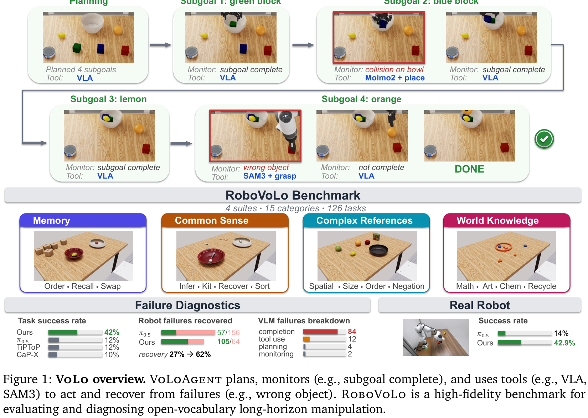
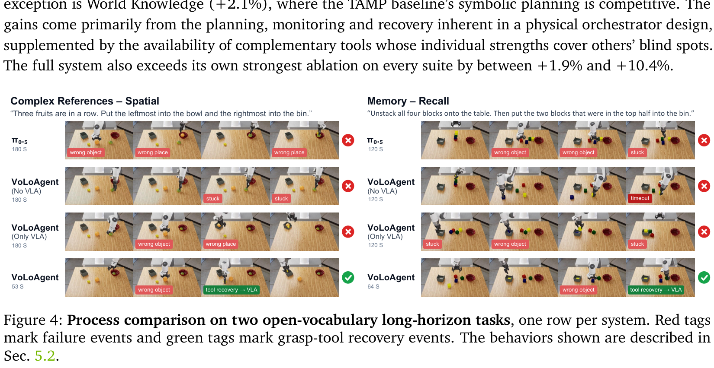
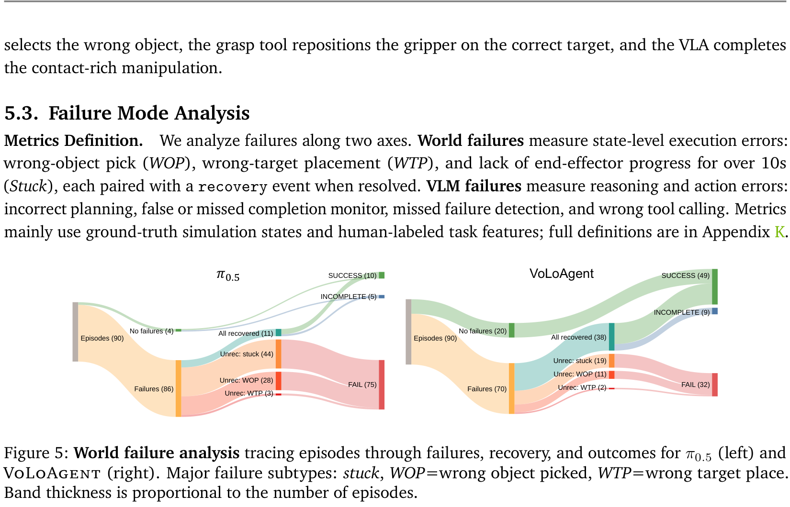

# VoLo: A Physical Orchestrator for Open-Vocabulary Long-Horizon Manipulation

## 核心信息
- **论文标题：** VoLo: A Physical Orchestrator for Open-Vocabulary Long-Horizon Manipulation（VoLo：面向开放词汇长时程操作的物理编排器）
- **作者团队：** Siyi Chen1,2*, Hugo Hadfield1, Alex Zook1, Mikaela Angelina Uy1, Chan Hee Song1, Erwin Coumans1, Xuning Yang1, Faisal Ladhak1, Qing Qu2, Stan Birchfield1, Jonathan Tremblay1†, Valts Blukis1†
- **主要机构：** NVIDIA、密歇根大学（University of Michigan）
- **发布状态：** arXiv:2606.07723v1 [cs.RO] 5 Jun 2026
- **项目主页与开源：** [https://chicychen.github.io/VoLo/](https://chicychen.github.io/VoLo/)
- **核心定位：** 具身物理编排器（Physical Orchestrator）控制范式与长程基准测试集。打破传统“VLM 顶层规划 + 底层单体 VLA 盲目开环执行”的硬性割裂，将 VLA / WAM、开放词表感知模型（SAM3, Molmo2, GroundingDINO）与解析几何抓放原语（GraspGen, IK）统一重构为可随时被打断、被重定向的具身工具家族。
- **评测基准：** RoboVoLo（4 大套件、15 个类别、126 项长程任务、501 个全新工业级高保真 3D 资产、NVIDIA Isaac Lab RoboLab 仿真平台）+ Franka FR3 物理机械臂真机实测（14 个任务、168 次长程闭环交互）。

---

## 原文摘要翻译
开放词汇的长时程机器人操作要求机器人在面对高度自由的非结构化自然语言指令和复杂的多物体凌乱场景时，能够自适应地完成规划、执行、状态监测以及从意外失败中自主恢复。为满足这一严苛要求，我们提出了一种闭环智能体控制架构，由视觉—语言大模型（VLM）将异构的机器人底层能力统一编排为可随时中断的工具原语。与纯虚拟环境中的 AI Agent 不同，物理世界不会等待智能体的计算思考而暂停，因此决策、动作触发与工具调用的时间协同在物理实体中至关重要。我们将这一新问题设定命名为“物理编排”（Physical Orchestration），并提出了 VoLoAgent：这是一个能够执行高层规划、实时监测与故障恢复的 VLM 编排系统，它将视觉—语言—动作模型（VLA）或世界动作模型（WAM）视为一种可中断的动态工具，在轨迹展开中途对其进行自适应导引，并与目标感知模型和几何动作原语协同工作。为了系统评估此类长时程具身能力，我们构建了 RoboVoLo 高保真评测基准，全面覆盖常识推理、时序记忆与状态追踪、复杂语言引用以及开放世界知识四大核心套件，不仅提供任务级成功率度量，更支持深度的失败模式归因诊断。广泛实验表明，VoLoAgent 大幅超越了单体 VLA、纯 VLM 及传统工具组合系统，并在实体机械臂真实实验中得到了全面验证。

---

## 创新点
1. **提出了具身智能的全新控制律范式——“物理编排”（Physical Orchestration）：** 敏锐地抓住了实体物理世界与虚拟软件世界的核心本质差异（“物理世界绝不会等待智能体的漫长思考而停摆”），首次将连续的 VLA / WAM 视动作策略定义为“异步可中断工具（Interruptible Tool）”，开创了“监测—刹停—重定向（Monitor–Halt–Redirect）”的高频自适应闭环机制。
2. **构建了快慢分层双系统记忆架构（Fast and Slow Memory）：** 设立 0.2Hz 高频轻量“监测上下文”（当前单帧画面 + 活跃子目标），保证极低推理开销与极低时延；仅在捕获到动作偏航或完成跃迁时才挂起并调取信息完备的“深思上下文”（全局任务历史 + 状态演化树 + 工具 API），成功消解了 VLM 云端高延迟与物理世界高实时性之间的尖锐冲突。
3. **涌现出多模态感知、几何原语与连续策略的“超加和互补效应”：** 彻底打破传统 VLA 与 TAMP 的流派对立。即使解析抓取原语未能成功拿稳物体，其几何运动也会将夹爪精确送至目标近旁，为 VLA 的微观局部视动闭环清扫了全局搜索盲区；反之，当 VLA 抓错物体时，感知模型与逆运动学原语又能果断介入实施位姿矫正，实现了 54% 的物理执行故障主动自愈率。
4. **推出了 126 任务规模的 RoboVoLo 高保真开放词表基准与 501 工业资产库：** 基于 NVIDIA Isaac Lab 打造，构建了涵盖化学元素周期表、算术立方体、抽象几何艺术、家居常识等多模态物料库，并制定了解耦物理执行失败（WOP, WTP, Stuck）与高层认知失误（Planning, Completion, Tool use）的严格双轴审计标准。

---

## 一句话总结
VoLoAgent 终结了具身机器人界长期存在的“纯端到端单体 VLA 盲抓”与“传统 VLM 开环脚本执行”的二元对立，通过将连续流匹配策略与离散几何工具统一纳入具备自省打断能力的物理编排闭环，使通用长时程操作成功率实现了从 12.6% 到 41.8%（真实机器人 14.3% 到 42.9%）的跨越式质变。

---

## 研究问题
在当前的通用机器人操作研究中，存在两大截然对立的技术阵营，各自背负着致命的工程阿喀琉斯之踵：
- **阵营一：端到端单体 VLA / WAM 派（如 $\pi_{0.5}$, DreamZero, RDT）。**  
  这类模型将观测图像直接端到端映射为连续高频控制动作，擅长富接触的微观运动伺服（如插拔钥匙、精细推拿）。然而，它们本质上是“重四肢、轻大脑”的系统：在开放词表的复杂语义理解（如化学分类、算术运算、多重否定排除）上表现极其稚嫩；更致命的是，它们完全缺乏宏观长程规划与阶段自省能力，一旦在长达上百步的操作中抓错了物体或机械臂卡死，就会一错到底、彻底瘫痪。
- **阵营二：分层大模型代码生成与任务规划派（如 SayCan, Code as Policies, VoxPoser）。**  
  这类系统利用大语言/多模态模型作为顶层规划大脑，将任务分解为预定义的技能函数或 Python 代码。然而，它们绝大多数是“强大脑、死四肢”的开环系统：VLM 下发了 `pick(cup)` 指令后，便被动挂起阻塞，无法在动作执行的中途进行感知监测；底层的所谓技能往往是僵硬的固定路径插值或开环运动原语，遇到物体滑动、微小形变或动态干扰便立刻崩溃。

物理世界的残酷现实在于：**真实世界是一个连续演化、充满不可预测扰动的物理系统，它绝不会因为大模型正在进行数秒钟的链式思考（Chain-of-Thought）而贴心地暂停物理惯性**！

因此，核心研究问题在于：**如何构建一个真正具备“边跑边看、动态刹车、敏捷纠错、工具互补”能力的物理编排系统，将高层前沿 VLM 的无限开放词表常识认知与底层各种异构物理动作原语无缝缝合为统一的自愈闭环？**

---

## 数据与任务定义

### 1. RoboVoLo 基准全景设计
为了系统评测具有深度推理负荷的长时程具身操作，研究团队基于 NVIDIA Isaac Lab 平台上的 RoboLab 高保真仿真环境构建了 **RoboVoLo 基准**。


基准涵盖 **4 大核心能力套件、15 个细分子类别、126 项长程操作任务**：
1. **常识接地套件（Common Sense Suite）：**
   - *Infer（意图推断）：* 从杂乱桌面各容器的现有数量差中推断人类未言明的意图（如补齐数量差）；
   - *Kit（物料套件配齐）：* 将不同种类的零部件按配额装入各个独立包装盒；
   - *Recover（主动恢复纠偏）：* 纠正桌面摆放错误的物件，将其物归原位；
   - *Sort（容器标识分拣）：* 根据箱体外部印制的图文符号与类别语义将物体分类归位。
2. **时序状态追踪与记忆套件（Memory Suite）：**
   - *Order（时序倒序重建）：* 观察积木塔的初始层级，拆解后自下而上严格按相反顺序重新堆叠；
   - *Recall（初始构型还原）：* 破坏并清空既有场景后，完全依靠历史记忆分毫不差地复原最初的空间相对构型；
   - *Swap（循环置换追踪）：* 将并排物体沿水平方向轮换位移，显式追踪中间临时空位的动态占用。
3. **复杂语言引用套件（Complex References Suite）：**
   - *Spatial（相对方位）：* 以机器人自身主观视角或特定目标参照系判定极值方位（如“最左侧入碗，最右侧入托盘”）；
   - *Counting（序数计数）：* 解析“从左到右数第 2 个与第 4 个”等带基数/序数约束的组合指令；
   - *Negation（否定排除）：* 理解“把除最高的那个物体外的其余所有物体收纳好”等带补集逻辑的指令；
   - *Size+Sort（尺寸排序分流）：* 比较多物体间的几何体积极值并分别导流至不同容器。
4. **外部世界先验套件（World Knowledge Suite）：**
   - *Math（算术逻辑）：* 识别带有数字与运算符的实木方块，选取数字使代数和满足预设方程式；
   - *Art（面孔艺术补全）：* 识别抽象简笔艺术面孔的缺失部位（如嘴唇、眉毛），挑选几何构件正确嵌合；
   - *Chem（化学元素周期表）：* 识别方块上的化学元素符号（He, Ne, Na, Fe 等），按稀有气体与金属单质准确分流；
   - *Recycle（垃圾智能分类）：* 结合真实生活垃圾常识，将各类杂物分拣至可回收物、厨余垃圾与有害干垃圾桶中。

### 2. 仿真资产库规模（501 项工业级三维资产）
RoboVoLo 彻底告别了传统学术基准仅包含十几个简单几何色块的简陋设定，全新引入并发布了 **501 个高质量工业级 3D 资产**：
- 247 个来自 NVIDIA Lightwheel SimReady 的写实家居与生活用品；
- 118 块精密雕刻的元素周期表化学积木；
- 120 件具备连续色调、多样几何拓扑与尺寸梯度的艺术工件；
- 16 块具有高对比度数字与四则运算符号的木质算术方块；
- 所有物体均采用高精度的凸包网格分解，并严格标定了摩擦因数与恢复弹性系数。

---

## 方法主线：VoLoAgent 物理编排系统



### 1. 物理编排三大设计准则（P1, P2, P3）
VoLoAgent 围绕物理世界的时间与动力学特性，确立了三条不妥协的底层设计原则：
- **(P1) 异步具身工具调用（Asynchronous Tools）：** 底层机械臂的连续轨迹推进在后台以独立的操作系统线程运行，高层大脑以非阻塞方式交替进行视觉巡检，实现“手在动、眼在看、脑在思”的真正物理重叠；
- **(P2) 快慢分层记忆流（Fast and Slow Memory）：**
  - *快系统（Monitor Context）：* 0.2Hz 轻量周期触发，仅输入前置相机的最新单帧画面、当前激活的子目标文本以及上一步的路由决策，token 消耗极低，耗时控制在数百毫秒以内；
  - *慢系统（Deliberation Context）：* 仅在监测到故障或发生子任务跃迁时调用，输入全局任务指令、初始场景快照、完整的历史交互状态转移树以及全部底层工具 API 文档，进行深度逻辑决策；
- **(P3) 具身安全驻留策略（Safety-Aware Idling）：** 一旦快系统判定发生异常，在慢系统展开耗时数秒的云端大模型深思之前，编排器会向机械臂控制器下发零速度阻尼锁死指令，让机械臂原地驻留，彻底消除计算盲区引发的碰撞失控风险。


### 2. 异构工具家族的互补体系
VoLoAgent 在底层集成并编排了三类完全互补的工具能力：
1. **连续流匹配视动策略（VLA / WAM）：** 以 $\pi_{0.5}$ 和 DreamZero 为主力，在 15Hz 高频下接收图像和微调子目标指令，生成精细的 7-DoF 关节位移；
2. **零样本开放词表感知（Perception Tools）：** 集成 GroundingDINO、SAM2/SAM3 以及 Molmo2，负责从高层指令中解析出目标物体的 2D/3D Bounding Box、抓取关键点坐标以及像素级掩码，为系统提供确定性的语义锚定；
3. **解析几何抓放原语（Action Primitives）：** 基于 GraspGen 六自由度抓取姿态网络与多初值逆运动学（IK）运动规划，提供确定性、抗死锁的物体点到点空间转运能力。

### 3. 全局控制律与自适应状态跃迁（Monitor–Halt–Redirect）
整个物理交互闭环由以下四部曲持续推进：
1. **任务分解（Decompose）：** VLM 首先通读全局指令，结合初始场景图像拆解为 $K$ 个有序子目标并存入符号工作记忆；
2. **并发推进（Rollout & Monitor）：** 发起 VLA 或几何原语执行，同时在 0.2Hz 下进行快速视觉校验；
3. **路由判定（Route）：**
   - 若子目标顺利推进且未偏离，输出 `continue`；
   - 若视觉验证子目标达成，输出 `next_subgoal`，记忆指针推进；
   - 若出现抓错、打滑或偏离，输出 `recovery`；
4. **多级自愈重定向（Recover）：**
   - `continue`：若深思判定为误报警报，立即解冻机械臂继续当前动作；
   - `replan`：若当前物理构型已无法完成既定路线，重构后续子目标序列；
   - `rewrite`：修改下发给 VLA 的提示词文本（例如加入“避开红色方块，微调夹爪向右偏 2cm”），驱动 VLA 重新去噪；
   - `grasp / place`：直接强行调度感知模型锁定正确物体，调用逆解原语实施物理硬矫正。

---

## 关键结果与实验对比

### 1. 全基准评测综合战况（Table 1）
在表 1 的严苛对比中，VoLoAgent 展现出对所有基线流派的压倒性代差优势：

| 方法流派 | 代表性模型 / 方案 | RoboVoLo 全套件平均成功率 | Robolab-Vague 平均成功率 | 核心痛点与缺陷 |
| :--- | :--- | :---: | :---: | :--- |
| **单体动作模型 (Single Action)** | $\pi_{0.5}$ | 12.57% | 16.94% | 缺乏开放词汇常识，长程无法自愈 |
| | $\pi_0$-FAST | 4.76% | 10.00% | 步数增多后动作漂移，高频失忆 |
| | MolmoBot-DROID | 9.67% | 11.52% | 粗粒度语义接地尚可，微观操作频频失控 |
| | DreamZero (WAM) | 9.11% | 18.61% | 世界模型前向幻觉随步数加剧发散 |
| **代码生成智能体 (Code-as-Policy)** | CaP-X (Single) | 10.10% | 14.44% | 开环执行，遇到抓取滑动立刻死锁 |
| | CaP-X (Ensemble) | 10.10% | 11.39% | 虽有多候选生成，仍受制于执行期无法中断 |
| **任务与运动规划 (TAMP)** | TiPToP | 12.07% | 18.89% | 无法应对微观富接触力学，环境建模过于理想化 |
| **消融变体 (Ablations)** | VoLoAgent (No VLA) | 17.76% | 17.78% | 纯靠几何原语，富接触场景极其生硬 |
| | VoLoAgent (Only VLA) | 34.97% | 30.00% | 具备闭环文本重定向，但缺少强感知硬矫正 |
| **完整系统 (Ours)** | **VoLoAgent (Full)** | **41.80%** | **31.94%** | **全维度领先，高难度长程任务绝对统治** |



### 2. 物理故障追踪与桑基图揭秘（Figure 5）
图 5 中关于 90 轮长程任务从“故障发生”到“工具自愈”的全流程追踪，构成了全论文最震撼的量化发现：



- **单体 SOTA VLA 的绝望深渊：** 纯 $\pi_{0.5}$ 策略在 90 轮交互中遭遇了高达 86 次物理故障（其中 44 次为卡死在杂物堆中，28 次为抓错物体）。由于没有闭环编排器，这些故障的自愈率只有可怜的 12.8%（仅 11 次侥幸脱困），导致整整 75 条轨迹彻底惨死，最终成功率仅有 11.1%；
- **VoLoAgent 的自愈神迹：** VoLoAgent 在遭遇的 70 次严重故障中，通过主动叫停与工具分流，**成功救活了 38 次，自愈率暴增至 54.3%**！最终成功完成的轨迹数量从 10 轮直接飙升到 49 轮，直接将长程任务的死刑判决逆转为成功！

### 3. VLM 高层大脑认知失误深度审计（Figure 6）
作者进一步审计了高层 VLM 在决策过程中究竟会犯什么错误，并横向对比了 Qwen3-VL-8B、Gemini-2.5-Flash 与 Claude Opus 4.6 三款模型：


- **规划与工具调用的阶跃演进：** 顶尖模型（Claude Opus 4.6）在高层子任务拆解（Planning）与工具 API 语法参数生成（Tool Use）上的失误次数几乎被彻底压制到了个位数，说明前沿闭源模型的逻辑推理已完全足以胜任物理编排器的高层中枢；
- **全行业的共性阿喀琉斯之踵——完成度监测（Completion-Monitor）：** 如图 6 所示，所有模型在“判定当前子目标是否已完成”这一微观感知维度上失误频次最高（占全部错误的 70% 以上）。大模型极其容易被遮挡或相似构型的虚假视角所迷惑，产生“误以为已扣紧盖子”或“误以为物体已脱手”的假阳性误判，这是未来多模态感知算法必须重点攻克的死穴。

### 4. 真实物理实体机器人部署战果（Figure 7 & Table 3）


在真正的 Franka FR3 物理机械臂与真实杂乱桌面（包含真实易拉罐、水果、化学立方体）上进行的 14 项长程任务、168 次实机闭环评测中：
- 纯单体 $\pi_{0.5}$ 策略的真机成功率仅有 **14.3%**（置信区间 [6.7%, 27.8%]）；
- **完整版 VoLoAgent 在真机上斩获了 42.9% 的惊人成功率**（置信区间 [29.1%, 57.8%]），在物理实体世界中再次实现了整整 **3 倍的成功率暴增**！
- 这一真机战果雄辩地证明了“物理编排”绝对不是仿真器里的玩具算法，而是一套高度契合实体物理动力学与工程部署的工业级自愈范式。

---

## 深度分析

### 1. 真正的贡献是什么？
VoLoAgent 带来的最深层次思想启迪，在于**重新定义了具身智能的技术演进路线图**：
- **终结了单体端到端神话的盲目崇拜：** 在过去两年中，部分学者鼓吹“只要数据足够多，单一端到端 VLA 可以自发学会万物常识、几何逆解与长程时序自省”。VoLo 用无可辩驳的消融实验证明，让连续神经网络去硬背周期表化学分类或求解无碰撞多自由度逆运动学，是极度低效且灾难性的。不同能力必须遵循各自的最优表征尺度：常识属于 VLM，几何属于解析算法，微观接触属于 VLA；
- **确立了“控制律编排”的核心地位：** 真正的具身智能不是单一的神经网络权重，而是一个包含状态机、快慢记忆池、异常中断与多工具路由的**动态控制系统（Control System）**。VoLoAgent 就是机器人操作界的操作系统调度内核（Kernel Scheduler）。

### 2. 为什么工具互补能产生超加和效应？
消融实验中最惊人的现象是：`VoLo (No VLA)` 只有 17.76%，`VoLo (Only VLA)` 只有 34.97%，而二者融合后的 `VoLo (Full)` 达到了 41.80%。这种超额增益来源于物理交互的“空间相遇效应”：
- 当 GraspGen 几何抓取原语因工件表面光滑发生抓取滑脱时，虽然动作本身失败了，但机械臂末端已经被高精度逆解送到了距离目标物体仅数毫米的完美工作空间，同时为腕部相机提供了近乎完美的局部特写观测；
- 此时编排器将控制权移交给 VLA 连续策略，VLA 面对的是一个没有任何空间歧义、距离极近的理想局部微调场景，其富接触动作去噪能力被百分之百彻底激发；
- 这种“几何原语攻坚宏观位移，视动策略收尾微观接触”的接力赛机制，构成了破局长程复杂操作的终极杀招。

### 3. 容易误读的地方
- **误读 1：“VoLoAgent 只是把以前的 SayCan 或 Code-as-Policies 重新包装了一下”。**  
  *澄清：* 根本不同！SayCan 和 CaP 全程是阻塞式、开环式的“规划后执行”，动作一旦发出智能体就变成了瞎子，中途无法感知也无法打断；VoLoAgent 是首个提出针对异步物理动作的“边动边看、中途强行刹停（Interruptible VLA）”的真物理闭环。
- **误读 2：“VoLoAgent 在真机上依赖云端大模型，延迟太高无法实用”。**  
  *澄清：* 这是对系统架构的严重误解。VoLoAgent 在日常行进时，底层动作是由 15Hz 的局部 VLA 或几何控制器在本地高速推理的；0.2Hz 的快系统仅做极少 token 的健康巡检；只有在检测到脱轨时才触发慢系统的安全驻留。机械臂在深思时处于刚性锁定状态，根本不存在由于网络延迟引发碰撞的风险。

---

## 局限
1. **完成度监测的视觉盲区：** 当前系统最频繁的失误依然来自 VLM 对复杂接触状态（如微小卡扣是否卡紧、瓶盖是否旋紧）的视觉误判，亟需引入触觉传感（Tactile）与高频局部监测专用小模型；
2. **安全驻留策略的本体局限：** 现有的安全驻留依赖固定基座机械臂的电机刹车闭锁。若将该架构迁移至人形双足机器人或四足狗上，驻留必须转变为复杂的动力学全身自平衡控制（Whole-Body Control），否则机器人会直接倾覆；
3. **多模态工具调用的端到端不可微性：** 系统的各模块由离散的 Python API 和文本 Prompt 串联，无法像单体网络那样直接进行全系统梯度反向传播，未来的自演化迭代主要依赖代码搜索或强化学习反馈。

---

## 我的笔记：横向对比与技术启示

### 1. 前沿长程具身操纵架构横向天梯榜

| 框架 / 系统 | 控制闭环范式 | 底层策略形式 | 中途打断恢复能力 | 开放词表常识推理 | 记忆与状态机制 | 真实机器人长程成功率 |
| :--- | :---: | :---: | :---: | :---: | :---: | :---: |
| **SayCan** (Ahn et al., 2022) | 开环层级分发 | 离散预定义技能 | 无 | 强（LLM 打分） | 弱（依靠即时观测） | <30% (简单任务) |
| **Code as Policies** (Liang et al., 2023) | 开环代码生成 | 几何解析原语 | 无 | 强（代码逻辑） | 中（Python 内存变量） | ~25% (结构化场景) |
| **单体 $\pi_{0.5}$** (Physical Intelligence, 2025) | 高频闭环伺服 | 端到端流匹配 VLA | 无（一错到底） | 弱（受限于演示数据） | 极弱（马尔可夫短窗口） | 14.3% (RoboVoLo) |
| **Harness VLA** (Zhang et al., 2026) | 状态机离散导引 | 冻结 VLA 原语 | 弱（事后重试） | 中（任务级模板） | 中（外部记忆图谱） | ~35% |
| **HyMeS** (Zhao et al., 2026) | 速度场连续导引 | 冻结 Flow VLA | 中（阶段完成切换） | 中（代码空间启发式） | **强（代码符号持久记忆）** | ~40% (RoboMemArena) |
| **VoLoAgent (本文, 2026)** | **物理编排自愈闭环** | **VLA + 感知 + 几何原语** | **极强（异步主动中断）** | **极强（前沿 VLM 全套件）** | **强（快慢分层双系统）** | **42.9% (RoboVoLo 14 任务)** |

### 2. 对构建具身世界模型与下一代机器人的核心启示
结合我们前期对 MemoryWAM、HarnessWAM、RoboSPA 以及 HyMeS 的深入研究，VoLoAgent 为整个世界动作模型（WAM）与通用智能体生态指明了终极拼图：
1. **世界动作模型（WAM）必须具备“可中断性”：** 现有的 WAM（如 DreamZero、FastWAM）通常以固定的视频 token chunk 为单位进行开环预测；未来的世界模型必须具备随时响应外部 VLM 编排器“紧急刹停”的接口，支持在潜空间内部任意时刻热插拔重定向潜变量；
2. **具身操作必须确立“快慢分层”标准体系：** 没有任何单一神经网络能同时吞下 20Hz 的低层力控伺服与 100 步长程因果逻辑推理。人类小脑负责连续接触，大脑前额叶负责多模态自省巡检与符号记忆追踪；
3. **真正的通用泛化在于“编排异构原语的能力”：** 试图训练一个单一巨无霸模型包揽一切几何逆解、元素周期表记忆与夹爪去噪是徒劳的。通用具身智能的终局，必将是一个由顶尖多模态大模型担任“物理操作系统内核”，调度着高频视动策略、高精三维感知与物理引擎仿真原语的协同有机体！

---

## 引用
```bibtex
@article{chen2026volo,
  title={VoLo: A Physical Orchestrator for Open-Vocabulary Long-Horizon Manipulation},
  author={Chen, Siyi and Hadfield, Hugo and Zook, Alex and Uy, Mikaela Angelina and Song, Chan Hee and Coumans, Erwin and Yang, Xuning and Ladhak, Faisal and Qu, Qing and Birchfield, Stan and Tremblay, Jonathan and Blukis, Valts},
  journal={arXiv preprint arXiv:2606.07723},
  year={2026}
}
```
