# WAM4D: Fast 4D World Action Model via Spatial Register Tokens

**Authors:** Ying Li, Xiaobao Wei, Jiajun Cao, Hao Wang, Xiaowei Chi, Chengyu Bai, Qianpu Sun, Jiajun Li, Xiaojie Zhang, Peidong Jia, Jian Tang, Sirui Han, Shanghang Zhang  
**Source:** canonical local PDF, arXiv:2606.14048v3  
**Detected source format:** selectable-text PDF (`pdf-text`)  
**Reader type:** complete paragraph-aligned Chinese–English reader with source figures/tables.

## Page / Section Index

| Pages | Content |
|---|---|
| 1 | Abstract; Introduction begins |
| 2–3 | Introduction; Related Work |
| 3–7 | Method (backbone, registers, attention, objectives, implementation) |
| 7–10 | Experimental setup; simulation and real-world results |
| 11–13 | Ablations and analysis |
| 14–15 | Qualitative rollout, failure, compute, conclusion/limitation |
| 16–19 | References |

## Terminology Ledger

| Canonical term | Chinese | Definition / decision |
|---|---|---|
| world action model (WAM) | 世界动作模型 | Jointly predicts future observations and executable actions. |
| 4D | 四维 | In this paper: time-indexed RGB-D / point-cloud scene evolution, not a persistent explicit 4D scene representation at deployment. |
| spatial register tokens | 空间寄存器 token | Learnable grid queries copied across future-depth timesteps and aligned to mosaic cells. |
| causal mixture attention | 因果混合注意力 | Modality-specific visibility over video, action, and register token groups. |
| geometry readout | 几何读出 | Training-time register/depth branch built around a pretrained DA3 head. |
| history video tokens | 历史视频 token | Causal RGB context features available to registers and action prediction. |
| future video noise tokens | 未来视频噪声 token | Flow-matching states and prediction targets, masked from future actions. |
| action chunk | 动作块 | A predicted horizon of 32 actions by default. |
| RoboTwin clean / randomized | RoboTwin 简洁 / 随机化设置 | Correspond respectively to Easy / Hard in Table 3. |

## Abstract

> <strong>Para. 1:</strong> World action models (WAMs) have recently shown promise in jointly modeling future observations and executable robot actions. However, most existing WAMs still operate in 2D video or latent spaces, where visually plausible rollouts miss the 3D spatial constraints and occluded contact geometry required for precise manipulation. While geometric foundation models offer strong priors for recovering dense 3D structure and motion from visual observations, forcing WAMs to predict the dense 4D representation introduces costly geometric decoding and slows down causal action generation. To address the trade-off, we present WAM4D, a fast 4D world action model that uses lightweight spatial register tokens as training-time future-depth readouts to transfer pretrained geometric priors into a causal video-action transformer, then removes the register branch for lightweight action inference. To prevent non-causal shortcuts, we further design causal mixture attention for the Mixture-of-Transformers (MoT) WAM backbone, defining modality-specific visibility among video, action, and geometry tokens. Comprehensive experiments on RoboTwin 2.0 and challenging real-world manipulation tasks show that WAM4D improves spatial consistency and achieves competitive action prediction while maintaining efficient inference.

> <strong>Para. 1[CN]:</strong> 世界动作模型（WAM）近期在联合建模未来观测与可执行机器人动作方面展现出潜力。然而，现有大多数 WAM 仍运行在二维视频或潜空间中；这类视觉上合理的展开会遗漏精确操作所需的三维空间约束与被遮挡的接触几何。几何基础模型虽能从视觉观测恢复稠密三维结构和运动的强先验，但强迫 WAM 预测稠密四维表征会引入昂贵的几何解码，并拖慢因果动作生成。为权衡二者，我们提出 WAM4D：一种快速四维世界动作模型，它以轻量空间寄存器 token 作为训练时的未来深度读出，将预训练几何先验迁移到因果视频—动作 Transformer 中，并在轻量动作推理时移除寄存器分支。为避免非因果捷径，我们还为 Mixture-of-Transformers（MoT）WAM 骨干设计了因果混合注意力，规定视频、动作与几何 token 之间按模态区分的可见性。RoboTwin 2.0 与具有挑战性的真实世界操作任务上的综合实验表明，WAM4D 在维持高效推理的同时改善了空间一致性，并取得有竞争力的动作预测性能。

> <strong>Para. 2:</strong> **Date:** July 8, 2026
> Code: https://github.com/myendless1/wam4d
> **Keywords:** World Action Model, 4D World Modeling, Robot Manipulation

> <strong>Para. 2[CN]:</strong> **日期：** 2026 年 7 月 8 日
> 代码：https://github.com/myendless1/wam4d
> **关键词：** 世界动作模型、四维世界建模、机器人操作

## 1 Introduction

> <strong>Para. 1:</strong> World models have been viewed as a foundation for embodied intelligence by predicting how the physical environment evolves under interaction (Wan et al., 2025; Yang et al., 2025; Ding et al., 2025). With the rapid progress of video generative models, this predictive capability has begun to transfer from general video modeling to embodied domains (Chi et al., 2025; Li et al., 2026a,b; Zeng et al., 2026; Chen et al., 2026). As robotic simulators of future scene evolution, world models support data generation and policy evaluation (Fan et al., 2026; Zhou et al., 2024; Yu et al., 2025; Wu et al., 2026). The generated videos are further converted into executable actions using inverse dynamics models.

> <strong>Para. 1[CN]:</strong> 世界模型通过预测物理环境在交互下如何演化，被视为具身智能的基础（Wan et al., 2025; Yang et al., 2025; Ding et al., 2025）。随着视频生成模型快速发展，这种预测能力已开始从通用视频建模迁移到具身领域（Chi et al., 2025; Li et al., 2026a,b; Zeng et al., 2026; Chen et al., 2026）。作为未来场景演化的机器人模拟器，世界模型支持数据生成与策略评估（Fan et al., 2026; Zhou et al., 2024; Yu et al., 2025; Wu et al., 2026），生成的视频再通过逆动力学模型转换成可执行动作。

> <strong>Para. 2:</strong> VLA policies have become a dominant route for robot control by directly mapping visual observations and language instructions to actions (Brohan et al., 2022; Black et al., 2024; Physical Intelligence et al., 2025; Cao et al., 2026; Intelligence et al., 2026). However, manipulation is not a simple observation to action mapping. It requires reasoning about scene geometry, contacts, and object dynamics. Current VLAs learn these factors mainly from action supervision, which leads to weak generalization ability (Zhang et al., 2026). Recent spatially grounded VLAs address this issue by injecting 3D inputs or geometric foundation priors into policy learning (Qu et al., 2025; Li et al., 2026; Sun et al., 2025; Li et al., 2025; Wang et al., 2026). These methods improve the spatial representation of direct policies, but future scene evolution and robot dynamics remain implicit in the action prediction objective. Therefore, recent works have turned to world action models (WAMs). WAMs extend world models from robotic video generation to joint prediction of future observations and executable robot actions (Li et al., 2026; Yuan et al., 2026; Team et al., 2026; Zhang et al., 2026). By using the priors of video generative foundation models, this end-to-end formulation couples imagination and control in one pipeline. It learns an implicit transition model that predicts how the scene and robot may evolve from the initial observation and task instruction.

> <strong>Para. 2[CN]:</strong> VLA 策略通过把视觉观测和语言指令直接映射为动作，已成为机器人控制的主流路线（Brohan et al., 2022; Black et al., 2024; Physical Intelligence et al., 2025; Cao et al., 2026; Intelligence et al., 2026）。然而，操作并非简单的观测到动作映射，而需要推理场景几何、接触与物体动力学。现有 VLA 主要从动作监督学习这些因素，因而泛化能力较弱（Zhang et al., 2026）。近期具备空间落地能力的 VLA 通过向策略学习注入三维输入或几何基础先验来解决这一问题（Qu et al., 2025; Li et al., 2026; Sun et al., 2025; Li et al., 2025; Wang et al., 2026）。这些方法改善了直接策略的空间表征，但未来场景演化和机器人动力学在动作预测目标中仍是隐式的。因此，近期工作转向世界动作模型（WAM）。WAM 将世界模型从机器人视频生成扩展为联合预测未来观测与可执行机器人动作（Li et al., 2026; Yuan et al., 2026; Team et al., 2026; Zhang et al., 2026）。借助视频生成基础模型的先验，该端到端形式在同一流水线中耦合想象与控制，并学习一个隐式转移模型，以预测场景和机器人可能如何从初始观测与任务指令演化。

### Figure 1. Representative 4D WAM designs

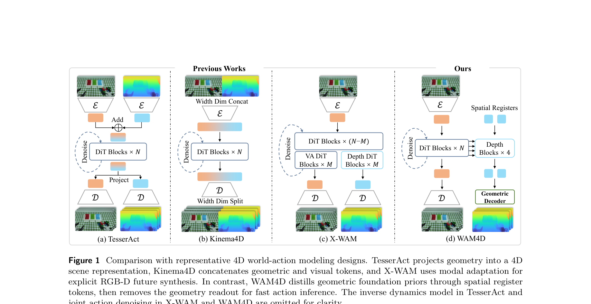

**Caption:** Comparison with representative 4D world-action modeling designs. TesserAct projects geometry into a 4D scene representation, Kinema4D concatenates geometric and visual tokens, and X-WAM uses modal adaptation for explicit RGB-D future synthesis. In contrast, WAM4D distills geometric foundation priors through spatial register tokens, then removes the geometry readout for fast action inference. The inverse dynamics model in TesserAct and joint action denoising in X-WAM and WAM4D are omitted for clarity.

**Caption[CN]:** 与代表性四维世界—动作建模设计的比较。TesserAct 将几何投影为四维场景表征，Kinema4D 拼接几何与视觉 token，X-WAM 通过模态适配显式合成未来 RGB-D。相比之下，WAM4D 经由空间寄存器 token 蒸馏几何基础先验，再移除几何读出以实现快速动作推理。为清晰起见，图中省略了 TesserAct 的逆动力学模型，以及 X-WAM 与 WAM4D 的联合动作去噪。

> <strong>Para. 3:</strong> Despite this progress, most WAMs represent future states in 2D video or latent spaces. Such rollouts are useful for learning visual dynamics, but they provide an incomplete physical state for manipulation (Ai et al., 2025). Precise manipulation requires reasoning over object extent, occluded surfaces, free space, contacts, and robot motion across future steps. A visually plausible rollout hides errors in contact geometry, which directly affect spatially precise robotic manipulation. Recent 4D embodied world models address this limitation by augmenting future prediction with depth maps, surface normals, point clouds, or point maps (Guo et al., 2026; Wang et al., 2026; Xu et al., 2026; Zhen et al., 2025; Tian et al., 2026). These representations make predicted futures more aligned with the physical state needed for action inference. However, existing designs often treat dense 4D geometry as an explicit inference target. These methods improve reconstruction fidelity but require dense geometry decoding or optimization during action inference, which increases deployment costs and latency. More fundamentally, explicit 4D prediction may shift the WAM objective toward geometric reconstruction. Current methods do not ensure that geometric priors strengthen the causal coupling between video prediction and action generation.

> <strong>Para. 3[CN]:</strong> 尽管已有进展，多数 WAM 仍以二维视频或潜空间表示未来状态。这类展开有助于学习视觉动力学，却只能为操作提供不完整的物理状态（Ai et al., 2025）。精确操作要求跨未来时刻推理物体范围、遮挡表面、自由空间、接触和机器人运动。视觉上合理的展开会掩盖接触几何错误，而这些错误会直接影响空间精确的机器人操作。近期四维具身世界模型通过为未来预测增加深度图、表面法线、点云或点图来处理这一局限（Guo et al., 2026; Wang et al., 2026; Xu et al., 2026; Zhen et al., 2025; Tian et al., 2026），使预测未来更贴近动作推理所需的物理状态。然而，已有设计常把稠密四维几何作为显式推理目标；虽提高重建保真度，却要求动作推理期间进行稠密几何解码或优化，从而增加部署成本与时延。更根本地，显式四维预测可能把 WAM 目标推向几何重建。现有方法并不能保证几何先验会增强视频预测与动作生成间的因果耦合。

> <strong>Para. 4:</strong> To address these issues, we propose WAM4D, a fast 4D world action model that uses spatial register tokens as a compact bridge between 2D WAM latents and geometric priors. WAM4D uses geometry as a training-time readout target rather than an additional sensory input or inference-time output: spatial registers query history video tokens, decode depth through a pretrained geometric head, and backpropagate the depth loss into the history video features used for action prediction. At deployment, the geometric head and depth readout are removed, so the policy keeps the same lightweight 2D observation-to-action interface.

> <strong>Para. 4[CN]:</strong> 为解决这些问题，我们提出 WAM4D：一种以空间寄存器 token 作为二维 WAM 潜变量与几何先验之间紧凑桥梁的快速四维世界动作模型。WAM4D 不把几何作为额外感知输入或推理时输出，而将其作为训练时读出目标：空间寄存器查询历史视频 token，经预训练几何头解码深度，并把深度损失反向传播至动作预测所用的历史视频特征。部署时移除几何头与深度读出，因此策略保留同样轻量的二维观测到动作接口。

> <strong>Para. 5:</strong> Our main contributions are:
>
> - We propose WAM4D, a fast 4D world action model that brings geometric foundation priors into a causal video-action model through a compact spatial-register interface.
> - We design causal mixture attention for Mixture-of-Transformers (MoT). It defines visibility across video, action and spatial register tokens, enabling geometry supervision during training and lightweight inference at deployment.
> - We evaluate WAM4D on RoboTwin 2.0 and real-world long-horizon tasks. Experiments show improved spatial consistency and success rates while preserving efficient causal action inference.

> <strong>Para. 5[CN]:</strong> 主要贡献如下：
>
> - 我们提出 WAM4D：一种通过紧凑空间寄存器接口，将几何基础先验引入因果视频—动作模型的快速四维世界动作模型。
> - 我们为 Mixture-of-Transformers（MoT）设计因果混合注意力。它定义视频、动作与空间寄存器 token 之间的可见性，使训练时几何监督与部署时轻量推理得以兼顾。
> - 我们在 RoboTwin 2.0 与真实世界长时程任务上评估 WAM4D。实验表明，它在保持高效因果动作推理的同时改善了空间一致性与成功率。

## 2 Related Work

> <strong>Para. 1:</strong> **Embodied World Models.** Video generative models have made strong progress in modeling temporal visual dynamics (Ho et al., 2022; Blattmann et al., 2023; Wan et al., 2025; Yang et al., 2025; Seedance et al., 2026). This progress has motivated embodied world models that use video generation as learned simulators for interactive environments (Chi et al., 2025; Li et al., 2026a,b; Zeng et al., 2026; Chen et al., 2026). Several works learn interactive world models from mixed embodied data and Internet videos (Yang et al., 2023; Yin et al., 2026). Other works predict robotic videos and convert them into actions with inverse dynamics models (Du et al., 2023; Zhou et al., 2024; Wang et al., 2025). These works show that video priors can model future scene evolution, but future prediction and action generation are separated. Recent world action models jointly model future observations and executable robot actions (Wang et al., 2026; Bi et al., 2025; Team et al., 2026; Li et al., 2026; Yuan et al., 2026; Guo et al., 2026). In contrast, WAM4D uses lightweight spatial registers to transfer 4D geometric priors into video-action representations.

> <strong>Para. 1[CN]:</strong> **具身世界模型。** 视频生成模型在时间视觉动力学建模上取得显著进展（Ho et al., 2022; Blattmann et al., 2023; Wan et al., 2025; Yang et al., 2025; Seedance et al., 2026），推动了用视频生成充当交互环境学习式模拟器的具身世界模型（Chi et al., 2025; Li et al., 2026a,b; Zeng et al., 2026; Chen et al., 2026）。一些工作从混合具身数据与互联网视频学习交互式世界模型（Yang et al., 2023; Yin et al., 2026），另一些预测机器人视频并用逆动力学模型将其转换为动作（Du et al., 2023; Zhou et al., 2024; Wang et al., 2025）。这些工作说明视频先验能够建模未来场景演化，但未来预测与动作生成彼此分离。近期 WAM 则联合建模未来观测与可执行机器人动作（Wang et al., 2026; Bi et al., 2025; Team et al., 2026; Li et al., 2026; Yuan et al., 2026; Guo et al., 2026）。WAM4D 与之不同：它用轻量空间寄存器把四维几何先验迁移到视频—动作表征中。

> <strong>Para. 2:</strong> **Geometric Foundation Models.** Explicit geometry provides important priors for embodied perception and control. One line of work represents scenes with optimized 3D structures, such as neural radiance fields and 3D Gaussian primitives, which support view synthesis, planning, data generation, and manipulation (Mildenhall et al., 2020; Kerbl et al., 2023; Ze et al., 2023; Lu et al., 2024; Shorinwa et al., 2024; Duan et al., 2024; Huang et al., 2024; Wei et al., 2025, 2026). Another line develops feed-forward geometric foundation models that recover depth, point maps, camera poses, and dense correspondence directly from images (Wang et al., 2024, 2025; Lin et al., 2025; Wang et al., 2025; Wei et al., 2025; Wang et al., 2025; Wu et al., 2026; Wang et al., 2026). These models enable scalable geometric supervision from large-scale robot videos. Recent embodied world models further inject geometry into future prediction by generating RGBD videos, normals, point maps, 3D trajectories, or 4D robot world interactions (Zhen et al., 2025; Shen et al., 2026; Huang et al., 2026; Yang et al., 2026; Xu et al., 2026; Tian et al., 2026; Tu et al., 2026). Collectively, these methods indicate that explicit geometry improves physical consistency and spatial reasoning. However, they often require geometry to appear as an input, output, or reconstructed scene state during generation. WAM4D instead uses future depth as a training signal through spatial registers.

> <strong>Para. 2[CN]:</strong> **几何基础模型。** 显式几何为具身感知与控制提供重要先验。一条路线用优化的三维结构表示场景，例如神经辐射场与三维高斯基元，以支持新视角合成、规划、数据生成和操作（Mildenhall et al., 2020; Kerbl et al., 2023; Ze et al., 2023; Lu et al., 2024; Shorinwa et al., 2024; Duan et al., 2024; Huang et al., 2024; Wei et al., 2025, 2026）。另一条路线发展前馈几何基础模型，直接从图像恢复深度、点图、相机姿态和稠密对应（Wang et al., 2024, 2025; Lin et al., 2025; Wang et al., 2025; Wei et al., 2025; Wang et al., 2025; Wu et al., 2026; Wang et al., 2026），使大规模机器人视频能够提供可扩展几何监督。近期具身世界模型进一步通过生成 RGB-D 视频、法线、点图、三维轨迹或四维机器人—世界交互，把几何注入未来预测（Zhen et al., 2025; Shen et al., 2026; Huang et al., 2026; Yang et al., 2026; Xu et al., 2026; Tian et al., 2026; Tu et al., 2026）。总体上，这些方法表明显式几何改善物理一致性与空间推理，但常要求几何在生成时作为输入、输出或重建场景状态出现。WAM4D 则通过空间寄存器把未来深度用作训练信号。

> <strong>Para. 3:</strong> **Robotic Manipulation Policy.** Robot manipulation policies commonly learn a direct mapping from observations to actions. Early methods model action sequences from demonstrations (Zhao et al., 2023; Chi et al., 2025). Recent policies scale this paradigm with large language models. RT series formulate robot control as sequence prediction over visual, language, and action tokens (Brohan et al., 2022; Zitkovich et al., 2023). Several works provide open generalist policies trained on large robot datasets (Kim et al., 2024; Team et al., 2024; Liu et al., 2026). Pi series further improve cross-embodiment generalization with larger training mixtures and stronger action modeling (Liu et al., 2025; Black et al., 2024; Physical Intelligence et al., 2025; Intelligence et al., 2026). Recent spatially grounded VLAs further improve action prediction by injecting geometric foundation priors (Qu et al., 2025; Li et al., 2026; Sun et al., 2025; Li et al., 2025; Wang et al., 2026). However, they usually learn geometry, contacts, and dynamics only through action labels. In contrast, WAMs turn video generative models into robot policies by jointly modeling future observations and executable actions.

> <strong>Para. 3[CN]:</strong> **机器人操作策略。** 机器人操作策略通常学习从观测到动作的直接映射。早期方法从示范建模动作序列（Zhao et al., 2023; Chi et al., 2025），近期策略则借助大语言模型扩展这一范式。RT 系列把机器人控制表述为视觉、语言和动作 token 上的序列预测（Brohan et al., 2022; Zitkovich et al., 2023）。若干工作提供在大型机器人数据集上训练的开放通用策略（Kim et al., 2024; Team et al., 2024; Liu et al., 2026）；Pi 系列借助更大训练混合与更强动作建模进一步改善跨具身泛化（Liu et al., 2025; Black et al., 2024; Physical Intelligence et al., 2025; Intelligence et al., 2026）。近期空间落地 VLA 注入几何基础先验以进一步改善动作预测（Qu et al., 2025; Li et al., 2026; Sun et al., 2025; Li et al., 2025; Wang et al., 2026），但它们通常仅通过动作标签学习几何、接触与动力学。相比之下，WAM 通过联合建模未来观测和可执行动作，把视频生成模型转化为机器人策略。

## 3 Method

### 3.1 WAM4D Backbone

> <strong>Para. 1:</strong> WAM4D builds on the causal video-action backbone of LingBot-VA (Li et al., 2026). At decision step $t$, the model conditions on a language instruction $l$, multi-view RGB history, and a queue of historical actions. Let $O_t^{hist}$ denote the history RGB mosaic sequence, $O_t^{fut}$ the future RGB targets used during training, and $a_{i:j}$ the action sequence from step $i$ to $j$. With historical action length $L_a$ and action prediction horizon $H_a$, the causal context is

> <strong>Para. 1[CN]:</strong> WAM4D 基于 LingBot-VA 的因果视频—动作骨干（Li et al., 2026）。在决策时刻 $t$，模型以语言指令 $l$、多视角 RGB 历史和历史动作队列为条件。令 $O_t^{hist}$ 表示历史 RGB 拼图序列，$O_t^{fut}$ 表示训练时使用的未来 RGB 目标，$a_{i:j}$ 表示从时刻 $i$ 到 $j$ 的动作序列。给定历史动作长度 $L_a$ 与动作预测时域 $H_a$，因果上下文为

$$
C_t=\{l,O_t^{hist},a_{t-L_a:t-1}\}. \tag{1}
$$

### Figure 2. Architecture and visibility

**Caption:** WAM4D architecture and causal visibility pattern.

**Caption[CN]:** WAM4D 架构与因果可见性模式。

> <strong>Para. 2:</strong> Future RGB frames and future actions are prediction targets rather than additional causal inputs. The noised future video and action tokens are still included in the transformer sequence only as flow-matching states, so that the model can predict their corresponding flow targets.

> <strong>Para. 2[CN]:</strong> 未来 RGB 帧和未来动作是预测目标，而不是额外因果输入。加噪未来视频与动作 token 仍被纳入 Transformer 序列，但仅作为流匹配状态，使模型能够预测相应流目标。

> <strong>Para. 3:</strong> For the video stream, a video VAE encodes the RGB sequence and splits the resulting latents into history tokens and clean future targets:

> <strong>Para. 3[CN]:</strong> 对视频流，视频 VAE 编码 RGB 序列，并将所得潜变量拆分为历史 token 与干净未来目标：

$$
[Z_t^{hist},Z_t^{fut}]=E_{vae}([O_t^{hist},O_t^{fut}]). \tag{2}
$$

> <strong>Para. 4:</strong> During flow-matching training, the future video tokens fed to the backbone are noised states of these clean future targets, denoted as $\widetilde Z_t^{fut}$.

> <strong>Para. 4[CN]:</strong> 在流匹配训练中，送入骨干的未来视频 token 是这些干净未来目标的加噪状态，记作 $\widetilde Z_t^{fut}$。

> <strong>Para. 5:</strong> The action stream is embedded in the same way:

> <strong>Para. 5[CN]:</strong> 动作流以相同方式嵌入：

$$
A_t^{hist}=E_a(a_{t-L_a:t-1}),\qquad \widetilde A_t^{fut}=E_a(\widetilde a_{t:t+H_a-1}), \tag{3}
$$

> <strong>Para. 6:</strong> where $E_a$ is a lightweight action embedding layer, and $\widetilde a_{t:t+H_a-1}$ denotes the flow-matching state of the future action chunk.

> <strong>Para. 6[CN]:</strong> 其中 $E_a$ 是轻量动作嵌入层，$\widetilde a_{t:t+H_a-1}$ 表示未来动作块的流匹配状态。

> <strong>Para. 7:</strong> WAM4D then follows causal WAMs (Li et al., 2026) by jointly modeling future video latents and future actions in one video-action token sequence:

> <strong>Para. 7[CN]:</strong> 随后 WAM4D 遵循因果 WAM（Li et al., 2026），在同一视频—动作 token 序列中联合建模未来视频潜变量与未来动作：

$$
X_t^{(0)}=[Z_t^{hist},\widetilde Z_t^{fut},A_t^{hist},\widetilde A_t^{fut}]. \tag{4}
$$

> <strong>Para. 8:</strong> The sequence is processed by a video-action Mixture-of-Transformers (MoT) backbone:

> <strong>Para. 8[CN]:</strong> 该序列由视频—动作 Mixture-of-Transformers（MoT）骨干处理：

$$
X_t^{(\ell+1)}=\operatorname{VABlock}_{\ell}(X_t^{(\ell)};M_{VA}). \tag{5}
$$

> <strong>Para. 9:</strong> Here $M_{VA}$ is the causal visibility mask for the main video-action stream. The video and action heads predict flow targets for the noised future video and action tokens, respectively. The clean future video latents $Z_t^{fut}$ and the clean future action chunk $a_{t:t+H_a-1}$ are used to construct the corresponding training targets. This main video-action path follows the causal WAM formulation, while our contribution lies in attaching a training-time geometry readout to its intermediate history video features.

> <strong>Para. 9[CN]:</strong> 其中 $M_{VA}$ 是主视频—动作流的因果可见性掩码。视频头和动作头分别预测加噪未来视频 token 与加噪未来动作 token 的流目标。干净未来视频潜变量 $Z_t^{fut}$ 和干净未来动作块 $a_{t:t+H_a-1}$ 用于构造对应的训练目标。这条主视频—动作路径遵循因果 WAM 的建模形式，而我们的贡献在于把训练时几何读出连接到其中间历史视频特征。

### 3.2 Spatial Register Distillation

> <strong>Para. 1:</strong> We introduce spatial register tokens as learnable geometry queries that extract future geometric information from causal video features. Before being fed into the depth branch, a shared register grid is copied over the future depth timesteps and aligned with the multi-view RGB mosaic. Since multi-camera observations are tiled into a single RGB canvas before VAE encoding, each register corresponds to a spatial region in the mosaic.

> <strong>Para. 1[CN]:</strong> 我们引入空间寄存器 token，将其作为可学习几何查询，从因果视频特征提取未来几何信息。送入深度分支前，共享寄存器网格会沿未来深度时刻复制，并与多视角 RGB 拼图对齐。由于多相机观测在 VAE 编码前被铺成单个 RGB 画布，每个寄存器对应拼图中的一个空间区域。

> <strong>Para. 2:</strong> Let $R^{\star}$ denote the learnable register grid, and let $T_t$ denote the future depth supervision timesteps paired with the prediction targets. The input registers are constructed as

> <strong>Para. 2[CN]:</strong> 令 $R^{\star}$ 表示可学习寄存器网格，$T_t$ 表示与预测目标配对的未来深度监督时刻。输入寄存器构造为

$$
R_t^0=\operatorname{Repeat}_{\tau\in T_t}(R^{\star}). \tag{6}
$$

> <strong>Para. 3:</strong> Each copied register is associated with a target timestep and a mosaic pixel position.

> <strong>Para. 3[CN]:</strong> 每个复制的寄存器都关联一个目标时刻与一个拼图像素位置。

> <strong>Para. 4:</strong> Let $R_t^{\ell}$ denote register tokens at layer $\ell$, and $Z_t^{hist,\ell}$ the valid history video tokens from the video-action backbone at the same layer. At selected layers $\ell\in\mathcal L_r$, registers are updated by a depth extraction block. Registers are queries, while the key-value set contains the registers themselves and history video tokens:

> <strong>Para. 4[CN]:</strong> 令 $R_t^{\ell}$ 表示第 $\ell$ 层寄存器 token，$Z_t^{hist,\ell}$ 表示视频—动作骨干同层的有效历史视频 token。在选定层 $\ell\in\mathcal L_r$，寄存器由深度提取块更新。寄存器充当查询，键值集合则包含寄存器自身与历史视频 token：

$$
R_t^{\ell+1}=\operatorname{DepthBlock}_{\ell}\bigl(Q=R_t^{\ell},K,V=[R_t^{\ell},Z_t^{hist,\ell}]\bigr). \tag{7}
$$

> <strong>Para. 5:</strong> A standard RoPE encoding is applied inside the block using the target timestep and mosaic coordinates of register and video tokens. This update combines self-attention among registers with cross-attention from registers to history video features.

> <strong>Para. 5[CN]:</strong> 块内采用标准 RoPE 编码，使用寄存器和视频 token 的目标时刻及拼图坐标。该更新结合寄存器间自注意力与寄存器到历史视频特征的交叉注意力。

> <strong>Para. 6:</strong> The updated register features are projected to the input space of a pretrained geometric head:

> <strong>Para. 6[CN]:</strong> 更新后的寄存器特征被投影至预训练几何头的输入空间：

$$
G_t=P_g(\{R_t^{\ell+1}\}_{\ell\in\mathcal L_r}),\qquad \widehat D_t^{fut}=G_{\phi}(G_t). \tag{8}
$$

> <strong>Para. 7:</strong> Here $P_g$ is a lightweight projection layer, $G_{\phi}$ is the pretrained geometric head, and $\widehat D_t^{fut}$ is the predicted future depth sequence.

> <strong>Para. 7[CN]:</strong> 其中 $P_g$ 是轻量投影层，$G_{\phi}$ 是预训练几何头，$\widehat D_t^{fut}$ 是预测的未来深度序列。

> <strong>Para. 8:</strong> The register branch is used only during training. It predicts future depth from history video features, and the depth loss backpropagates into the shared video-action backbone. By requiring future depth to be decoded from these register features, the pretrained geometric teacher distills its spatial priors into the history video features used by the backbone.

> <strong>Para. 8[CN]:</strong> 寄存器分支仅在训练时使用。它从历史视频特征预测未来深度，深度损失反向传播至共享视频—动作骨干。通过要求从这些寄存器特征解码未来深度，预训练几何教师把空间先验蒸馏进骨干所用的历史视频特征。

> <strong>Para. 9:</strong> Our default readout places depth blocks after layers 12, 14, 16, and 18, and initializes the geometric head from Depth Anything V3 (Lin et al., 2025).

> <strong>Para. 9[CN]:</strong> 默认读出把深度块置于第 12、14、16、18 层之后，并以 Depth Anything V3（Lin et al., 2025）初始化几何头。

### 3.3 Causal Mixture Attention

> <strong>Para. 1:</strong> The model structure and causal visibility rules are summarized in Fig. 2. Text instructions are injected through cross attention and are visible to both video and action tokens. The main video-action stream follows a causal visibility pattern centered on future action prediction. At each denoising step, future action tokens can attend to history video tokens, history action tokens, and their own noised future action tokens. This gives the action predictor access to causal observation and action context while allowing interaction among action tokens being denoised.

> <strong>Para. 1[CN]:</strong> 图 2 汇总了模型结构与因果可见性规则。文本指令通过交叉注意力注入，并且对视频 token 和动作 token 均可见。主视频—动作流遵循一种以未来动作预测为中心的因果可见性模式。在每个去噪步骤，未来动作 token 可以关注历史视频 token、历史动作 token，以及自身的加噪未来动作 token。这样既让动作预测器能够访问因果观测与动作上下文，也允许正在去噪的动作 token 之间发生交互。

> <strong>Para. 2:</strong> To avoid non-causal shortcuts, future action tokens are masked from future video tokens and spatial registers. Future video tokens remain prediction targets for the video objective rather than causal inputs for action generation. Spatial registers are also kept outside the policy path. They attend only to themselves and valid history video tokens, so the depth objective can shape causal video features without exposing auxiliary geometry tokens to the action predictor.

> <strong>Para. 2[CN]:</strong> 为避免非因果捷径，掩码禁止未来动作 token 关注未来视频 token 与空间寄存器。未来视频 token 仍然是视频目标的预测对象，而不是动作生成的因果输入。空间寄存器同样被隔离在策略路径之外。它们只能关注自身和有效历史视频 token，因此深度目标能够塑造因果视频特征，而不会把辅助几何 token 暴露给动作预测器。

> <strong>Para. 3:</strong> At inference, registers, depth blocks, and the geometric head are removed. The model reduces to a pure observation-to-action generation path. Training and inference paths are shown in Fig. 3.

> <strong>Para. 3[CN]:</strong> 推理时，寄存器、深度块和几何头均被移除。模型因此简化为纯粹的观测到动作生成路径。训练路径与推理路径见图 3。

### Figure 3. Training and inference paths

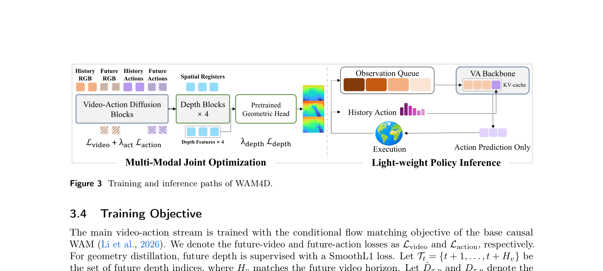

**Caption:** Training and inference paths of WAM4D.

**Caption[CN]:** WAM4D 的训练与推理路径。

### 3.4 Training Objective

> <strong>Para. 1:</strong> The main video-action stream is trained with the conditional flow matching objective of the base causal WAM (Li et al., 2026). We denote future-video and future-action losses as $\mathcal L_{video}$ and $\mathcal L_{action}$. For geometry distillation, future depth is supervised with a SmoothL1 loss. Let $T_t=\{t+1,\ldots,t+H_v\}$ be the set of future depth indices, where $H_v$ matches the future video horizon. Let $\widehat D_{\tau,p}$ and $D_{\tau,p}$ denote predicted and target depth at time $\tau$ and pixel $p$, and let $\Omega_\tau$ denote valid depth pixels.

> <strong>Para. 1[CN]:</strong> 主视频—动作流采用基础因果 WAM（Li et al., 2026）的条件流匹配目标训练。未来视频与未来动作损失分别记为 $\mathcal L_{video}$ 和 $\mathcal L_{action}$。几何蒸馏采用 SmoothL1 损失监督未来深度。令 $T_t=\{t+1,\ldots,t+H_v\}$ 为未来深度索引集合，其中 $H_v$ 与未来视频时域一致；$\widehat D_{\tau,p}$ 与 $D_{\tau,p}$ 分别表示时刻 $\tau$、像素 $p$ 的预测与目标深度，$\Omega_\tau$ 表示有效深度像素集合。

$$
\mathcal L_{depth}=\frac{1}{\sum_{\tau\in T_t}|\Omega_\tau|}\sum_{\tau\in T_t}\sum_{p\in\Omega_\tau}\operatorname{SmoothL1}(\widehat D_{\tau,p},D_{\tau,p}). \tag{9}
$$

> <strong>Para. 2:</strong> The final objective is

> <strong>Para. 2[CN]:</strong> 最终目标为

$$
\mathcal L=\mathcal L_{video}+\lambda_{act}\mathcal L_{action}+\lambda_{depth}\mathcal L_{depth}. \tag{10}
$$

> <strong>Para. 3:</strong> We set $\lambda_{act}=1$ and $\lambda_{depth}=1$. The depth loss updates the video-action backbone, spatial registers, depth blocks, projection layer, and geometric head.

> <strong>Para. 3[CN]:</strong> 取 $\lambda_{act}=1$、$\lambda_{depth}=1$。深度损失更新视频—动作骨干、空间寄存器、深度块、投影层与几何头。

### 3.5 Implementation Details

> <strong>Para. 1:</strong> **Frame sampling strategy.** The video-action backbone is initialized from the pretrained LingBot-VA base model and uses the Wan2.2 video VAE. We sample at most 17 frames from each sequence. A start frame id is randomly sampled over the sequence; when enough preceding frames are available, the history context contains 1, 5, or 9 frames. After the start frame, 8 video-prediction target frames are sampled every 4 collected steps to match the VAE temporal stride. If the remaining sequence is shorter than 8 target frames, the targets are padded to length 8. For the latent video loss, only slots that can be encoded as valid VAE latents contribute to the loss, and latent slots containing padding frames are masked. Depth targets use the same timestamps as the sampled video targets; unlike the latent-level video loss, depth supervision is frame-level, so every valid depth frame contributes to the depth loss. The default action chunk size is 32. For RoboTwin and AstriBot S1 experiments, the input is represented as a three-view mosaic consisting of one head camera and two wrist cameras. The main view is resized to $256\times320$, and each wrist view is resized to $128\times160$.

> <strong>Para. 1[CN]:</strong> **帧采样策略。** 视频—动作骨干由预训练 LingBot-VA base 模型初始化，并使用 Wan2.2 视频 VAE。我们从每个序列中最多采样 17 帧。首先在序列中随机采样一个起始帧编号；当此前有足够帧可用时，历史上下文包含 1、5 或 9 帧。起始帧之后，每隔 4 个采集步采样一个视频预测目标帧，共采样 8 帧，以匹配 VAE 的时间步幅。如果剩余序列不足 8 个目标帧，则把目标补齐到长度 8。对潜变量视频损失而言，只有能够编码为有效 VAE 潜变量的槽位才贡献损失，包含补齐帧的潜变量槽位会被掩码。深度目标采用与所采样视频目标相同的时间戳；与潜变量级视频损失不同，深度监督在帧级进行，因此每个有效深度帧都会贡献深度损失。默认动作块大小为 32。在 RoboTwin 和 AstriBot S1 实验中，输入表示为由一个头部相机与两个腕部相机构成的三视角拼图。主视角缩放至 $256\times320$，每个腕部视角缩放至 $128\times160$。

> <strong>Para. 2:</strong> **Action Prediction.** The policy predicts only the absolute end-effector poses of the left and right arms. Each arm is represented by a 3D position, a quaternion, and one gripper open/close value, giving a 16-dimensional action vector in total. Position channels are normalized with percentile-based min–max normalization, i.e., quantile min–max normalization, using dataset-level q01 and q99 statistics. Quaternion and gripper-opening channels use fixed lower and upper bounds of $-1$ and $1$. All normalized action channels are represented in the range $[-1,1]$.

> <strong>Para. 2[CN]:</strong> **动作预测。** 策略只预测左右臂的绝对末端执行器位姿。每条手臂由三维位置、一个四元数和一个夹爪开合值表示，因此动作向量总计 16 维。位置通道采用基于百分位数的最小—最大归一化，即使用数据集级 q01 与 q99 统计量进行分位数最小—最大归一化。四元数和夹爪开合通道采用固定的下界 $-1$ 与上界 $1$。所有归一化动作通道均表示在 $[-1,1]$ 范围内。

> <strong>Para. 3:</strong> **View layout strategy.** Spatial registers are aligned with the pixel layout of the mosaic. Given the VAE spatial stride of 16 and the WAM transformer's $2\times2$ latent grouping, each register corresponds to a $32\times32$ cell in the input image. The main view contributes an $8\times10$ register grid, each wrist view contributes a $4\times5$ register grid, and the tiled three-view mosaic forms a $12\times10$ register grid per future depth frame. With 8 future-indexed depth frames, the default three-view model uses 960 spatial register tokens. Unless stated otherwise, register cross-attention is applied after transformer layers 12, 14, 16, and 18. Registers attend only to valid history video tokens and registers themselves, not to action tokens or future-video tokens.

> <strong>Para. 3[CN]:</strong> **视角布局策略。** 寄存器与拼图像素布局对齐。VAE 空间步幅为 16，WAM Transformer 采用 $2\times2$ 潜变量分组，因此每个寄存器对应输入图像中的一个 $32\times32$ 单元。主视角贡献 $8\times10$ 网格，每个腕部视角贡献 $4\times5$ 网格，铺排后的三视角拼图在每个未来深度帧形成 $12\times10$ 网格。八个未来索引深度帧下，默认三视角模型使用 960 个空间寄存器 token。寄存器交叉注意力置于第 12、14、16、18 层后；寄存器仅关注有效历史视频 token 与自身，不关注动作或未来视频 token。

> <strong>Para. 4:</strong> **Geometric readout.** The geometric readout uses a pretrained DA3-GIANT-1.1 any-view DualDPT head. Four learned linear adapters map WAM hidden states to the geometric head input dimension.

> <strong>Para. 4[CN]:</strong> **几何读出。** 几何读出使用预训练 DA3-GIANT-1.1 任意视角 DualDPT 头；四个可学习线性适配器把 WAM 隐状态映射到几何头输入维度。

> <strong>Para. 5:</strong> **Attention mask.** The transformer sequence is partitioned into history-video tokens, future-video noise tokens, history-action tokens, future-action noise tokens, and register tokens. The allowed self-attention pattern is:
>
> | Query token group | Allowed key/value token groups |
> |---|---|
> | Future action noise | History video, history action, future action noise |
> | Register | Register, history video |
> | Future video noise | History video, future video noise |
> | History video | History video |
> | History action | History action |

> <strong>Para. 5[CN]:</strong> **注意力掩码。** Transformer 序列划分为历史视频 token、未来视频噪声 token、历史动作 token、未来动作噪声 token 与寄存器 token。允许的自注意力模式为：
>
> | 查询 token 组 | 允许的键/值 token 组 |
> |---|---|
> | 未来动作噪声 | 历史视频、历史动作、未来动作噪声 |
> | 寄存器 | 寄存器、历史视频 |
> | 未来视频噪声 | 历史视频、未来视频噪声 |
> | 历史视频 | 历史视频 |
> | 历史动作 | 历史动作 |

> <strong>Para. 6:</strong> **Inference procedure.** At deployment, the geometry path is removed and the policy maintains an observation queue and an executed-action history. The inference loop is:
>
> **Algorithm 1: Deployment inference loop**
>
> 1. $Q_{obs}\leftarrow\varnothing, A_{hist}\leftarrow\varnothing$
> 2. while policy is running do
> 3. &nbsp;&nbsp;&nbsp;&nbsp;if $Q_{obs}=\varnothing$ then capture the current observation and enqueue it into $Q_{obs}$
> 4. &nbsp;&nbsp;&nbsp;&nbsp;Encode $Q_{obs}$ with the VAE to obtain video-context latents
> 5. &nbsp;&nbsp;&nbsp;&nbsp;Replace the video portion of the KV cache with the context latents
> 6. &nbsp;&nbsp;&nbsp;&nbsp;if $A_{hist}\neq\varnothing$ then encode it and fill the action KV cache
> 7. &nbsp;&nbsp;&nbsp;&nbsp;Denoise future action tokens to obtain an action chunk
> 8. &nbsp;&nbsp;&nbsp;&nbsp;Execute the action chunk
> 9. &nbsp;&nbsp;&nbsp;&nbsp;During execution, capture one observation every 4 actions and enqueue it into $Q_{obs}$
> 10. &nbsp;&nbsp;&nbsp;&nbsp;$A_{hist}\leftarrow$ executed actions
> 11. end while

> <strong>Para. 6[CN]:</strong> **推理过程。** 部署时移除几何路径，策略维护观测队列与已执行动作历史。推理循环如下：
>
> **算法 1：部署推理循环**
>
> 1. $Q_{obs}\leftarrow\varnothing, A_{hist}\leftarrow\varnothing$
> 2. 当策略运行时循环
> 3. &nbsp;&nbsp;&nbsp;&nbsp;若 $Q_{obs}=\varnothing$，则捕获当前观测并将其加入 $Q_{obs}$
> 4. &nbsp;&nbsp;&nbsp;&nbsp;使用 VAE 编码 $Q_{obs}$，得到视频上下文潜变量
> 5. &nbsp;&nbsp;&nbsp;&nbsp;用上下文潜变量替换 KV cache 的视频部分
> 6. &nbsp;&nbsp;&nbsp;&nbsp;若 $A_{hist}\neq\varnothing$，则编码它并填充动作 KV cache
> 7. &nbsp;&nbsp;&nbsp;&nbsp;对未来动作 token 去噪，得到一个动作块
> 8. &nbsp;&nbsp;&nbsp;&nbsp;执行该动作块
> 9. &nbsp;&nbsp;&nbsp;&nbsp;执行期间每 4 个动作捕获一次观测，并将其加入 $Q_{obs}$
> 10. &nbsp;&nbsp;&nbsp;&nbsp;$A_{hist}\leftarrow$ 已执行动作
> 11. 结束循环

> <strong>Para. 7:</strong> **Training Hyperparameters.** Unless stated otherwise, the loss weights are set to $\lambda_{act}=1$ and $\lambda_{depth}=1$. Training uses AdamW with learning rate $2\times10^{-5}\sqrt N$, where $N$ is the number of machines used for multi-machine parallel training, 10 warmup steps, gradient clipping at 2.0, bf16 parameters, a 50k-step budget for the main experiments, and a 10k-step budget for ablation experiments.

> <strong>Para. 7[CN]:</strong> **训练超参数。** 除非另有说明，损失权重设为 $\lambda_{act}=1$ 和 $\lambda_{depth}=1$。训练采用 AdamW，学习率为 $2\times10^{-5}\sqrt N$，其中 $N$ 是多机并行训练所使用的机器数量；同时采用 10 个 warmup 步、2.0 的梯度裁剪阈值和 bf16 参数。主实验的训练预算为 50k 步，消融实验的训练预算为 10k 步。

## 4 Experiments

### 4.1 Experimental Setup

> <strong>Para. 1:</strong> **Datasets and Tasks.** We evaluate WAM4D across simulation control, video and geometry quality, and real-world manipulation.

> <strong>Para. 1[CN]:</strong> **数据集与任务。** WAM4D 的评估覆盖仿真控制、视频与几何质量，以及真实世界操作。

> <strong>Para. 2:</strong> **RoboTwin 2.0.** A unified policy is trained on the complete RoboTwin 2.0 task suite. The clean setting comprises relatively uncluttered scenes, whereas the randomized setting varies clutter, illumination, background, tabletop height, object placement, and language instruction. Geometry-supervised training uses re-collected demonstrations with depth annotations. Each task contains 50 clean trajectories and 500 randomized trajectories.

> <strong>Para. 2[CN]:</strong> **RoboTwin 2.0。** 在完整 RoboTwin 2.0 任务套件上训练一个统一策略。简洁设置包含相对无杂乱的场景，随机化设置则改变杂乱程度、照明、背景、桌面高度、物体放置与语言指令。几何监督训练使用重新采集并带深度标注的 RoboTwin 示范；每个任务含 50 条简洁轨迹和 500 条随机化轨迹。

> <strong>Para. 3:</strong> **Real-world tasks.** Evaluation uses the AstriBot S1 robot on plate lifting, bottle placement, pen-cap removal, and LEGO sorting. The dataset contains 100 demonstrations per task, 400 total. Each method is evaluated with 10 physical rollouts per task. Real-world depth supervision is obtained with Depth Anything 3 using the same offline pseudo-depth pipeline.

> <strong>Para. 3[CN]:</strong> **真实世界任务。** 在 AstriBot S1 机器人上评估抬盘、放瓶、移除笔帽和 LEGO 分类四项任务。每任务 100 条示范，共 400 条；每种方法每任务执行 10 次物理 rollout。真实世界示范的深度监督同样由 Depth Anything 3 按相同离线伪深度流程获得。

> <strong>Para. 4:</strong> **Baselines.** RoboTwin compares WAM4D with VLA baselines ($\pi_0$, $\pi_{0.5}$) and video-action models Motus, LingBot-VA, and Fast-WAM. Whenever possible, reproduced baselines use the same splits, camera configuration, and training budget. Latency comparisons use 10 action-denoising steps; video-action models use five video-denoising steps when applicable. WAM4D deployment removes geometry and predicts actions only.

> <strong>Para. 4[CN]:</strong> **基线。** RoboTwin 对比 VLA 基线（$\pi_0$、$\pi_{0.5}$）以及 Motus、LingBot-VA、Fast-WAM 等视频—动作模型。条件允许时，复现基线采用相同数据划分、相机配置与训练预算。时延比较统一使用 10 个动作去噪步；适用的视频—动作模型使用 5 个视频去噪步。WAM4D 部署时移除几何路径，仅预测动作。

> <strong>Para. 5:</strong> **Metrics.** Policy performance is reported as the fraction of successful rollouts. For real-world tasks, sub-action success records whether each task-specific intermediate goal is completed. Video quality is evaluated with FVD, PSNR, SSIM, and LPIPS. FVD measures the distribution gap between generated and ground-truth videos in a learned video-feature space; lower values indicate more realistic temporal generation. PSNR measures pixel-level reconstruction fidelity, SSIM measures structural image similarity, and LPIPS measures perceptual distance in deep visual features. Depth quality is evaluated with AbsRel and threshold accuracy $\delta_1$ and $\delta_2$ with respect to the available reference depth. AbsRel is the mean relative absolute depth error, so lower is better. $\delta_1$ and $\delta_2$ report the fraction of pixels whose predicted depth is within fixed multiplicative error thresholds of the target depth, so higher is better. For point-cloud metrics, predicted and target depth maps are back-projected using a fixed dataset-level camera intrinsic matrix. This protocol yields comparable point clouds for all methods. $CD_1$ and $CD_2$ denote L1 and L2 Chamfer Distance variants between predicted and target point clouds. F-score measures thresholded point-cloud overlap with the target geometry, while F-score-T measures the temporal consistency of this overlap across predicted future frames.

> <strong>Para. 5[CN]:</strong> **指标。** 策略性能以成功 rollout 所占比例报告。对于真实世界任务，子动作成功率记录每个任务特定的中间目标是否完成。视频质量采用 FVD、PSNR、SSIM 和 LPIPS 评估。FVD 在学习得到的视频特征空间中度量生成视频与真实视频之间的分布差距；数值越低表示时间生成越逼真。PSNR 度量像素级重建保真度，SSIM 度量图像结构相似性，LPIPS 度量深层视觉特征中的感知距离。深度质量相对于可用参考深度，采用 AbsRel 以及阈值准确率 $\delta_1$ 和 $\delta_2$ 评估。AbsRel 是平均相对绝对深度误差，因此越低越好。$\delta_1$ 与 $\delta_2$ 报告预测深度落在目标深度固定乘法误差阈值内的像素比例，因此越高越好。对点云指标，使用固定的数据集级相机内参矩阵，把预测深度图和目标深度图反投影为点云。该协议为所有方法生成可比较的点云。$CD_1$ 与 $CD_2$ 分别表示预测点云和目标点云之间的 L1、L2 Chamfer Distance 变体。F-score 度量与目标几何的阈值化点云重叠，而 F-score-T 度量这种重叠在各个预测未来帧之间的时间一致性。

### Table 1. RoboTwin aggregate results

**Caption:** RoboTwin 2.0 full-task success rate. Action generation latency and VRAM are reported.

**Caption[CN]:** RoboTwin 2.0 全任务成功率，并报告动作生成时延和显存。

| Method | Clean | Randomized | Avg. | Latency (ms) | VRAM (GiB) |
|---|---:|---:|---:|---:|---:|
| $\pi_0$ | 65.9 | 58.4 | 62.2 | 64.16 ± 0.06 | 8.45 |
| $\pi_{0.5}$ | 82.7 | 76.8 | 79.8 | 72.03 ± 0.06 | 8.45 |
| Motus | 88.7 | 87.0 | 87.9 | 1516.30 ± 10.64 | 11.55 |
| LingBot-VA | 92.9 | 91.6 | 92.3 | 843.57 ± 11.55 | 12.97 |
| Fast-WAM | 91.9 | 91.8 | 91.8 | 425.53 ± 6.01 | 11.55 |
| WAM4D | 93.8 | 89.9 | 91.8 | 525.43 ± 5.64 | 9.71 |

### Table 2. Real-robot sub-action success

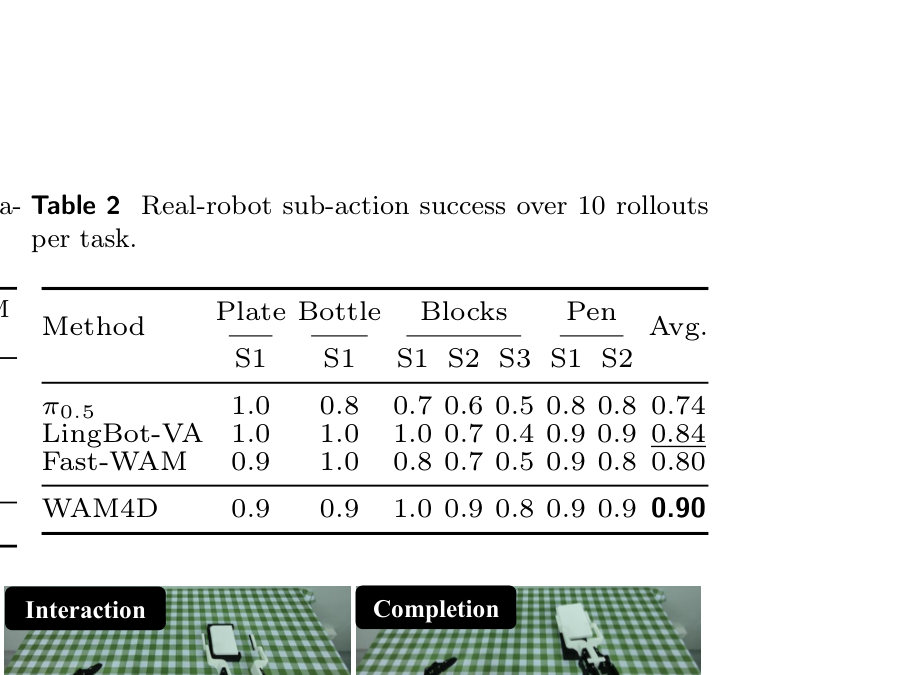

**Caption:** Real-robot sub-action success over 10 rollouts per task.

**Caption[CN]:** 每项任务 10 次 rollout 的真实机器人子动作成功率。

| Method | Plate S1 | Bottle S1 | Blocks S1 | S2 | S3 | Pen S1 | S2 | Avg. |
|---|---:|---:|---:|---:|---:|---:|---:|---:|
| $\pi_{0.5}$ | 1.0 | 0.8 | 0.7 | 0.6 | 0.5 | 0.8 | 0.8 | 0.74 |
| LingBot-VA | 1.0 | 1.0 | 1.0 | 0.7 | 0.4 | 0.9 | 0.9 | 0.84 |
| Fast-WAM | 0.9 | 1.0 | 0.8 | 0.7 | 0.5 | 0.9 | 0.8 | 0.80 |
| WAM4D | 0.9 | 0.9 | 1.0 | 0.9 | 0.8 | 0.9 | 0.9 | 0.90 |

### Figure 4. AstriBot S1 real-world tasks

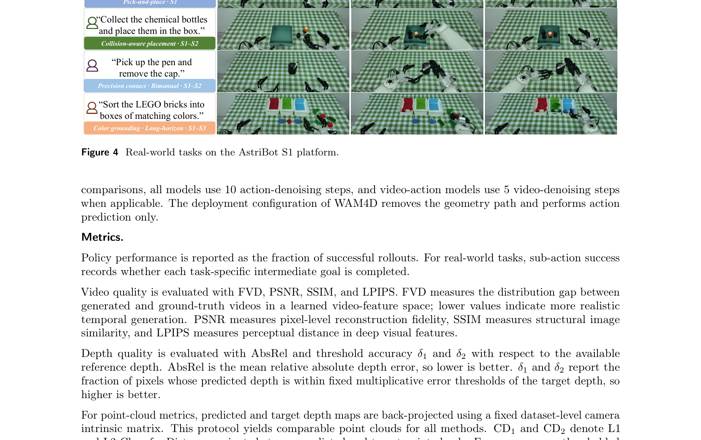

**Caption:** Real-world tasks on the AstriBot S1 platform.

**Caption[CN]:** AstriBot S1 平台上的真实世界任务。

### 4.2 Simulation Results on RoboTwin 2.0

> <strong>Para. 1:</strong> We evaluate WAM4D on the full RoboTwin 2.0 task suite and report the average success rate over 50 tasks under both clean and randomized settings. The full per-task success rates are reported in Tab. 3. We compare WAM4D with strong VLA baselines and recent video-action models. The overall success rate is reported in Tab. 1. WAM4D achieves competitive performance while maintaining low inference cost. For a fair comparison, latency is measured under a unified inference setting with 10 action denoising steps and 5 video denoising steps for all applicable models. VRAM is reported as the peak allocated memory of the video-action backbone during inference.

> <strong>Para. 1[CN]:</strong> 我们在完整 RoboTwin 2.0 任务套件上评估 WAM4D，并分别报告简洁设置与随机化设置下 50 个任务的平均成功率。完整的逐任务成功率见表 3。我们将 WAM4D 与强 VLA 基线及近期视频—动作模型进行比较。总体成功率见表 1。WAM4D 在保持较低推理成本的同时取得了有竞争力的性能。为了公平比较，所有适用模型均在统一推理设置下测量时延，其中采用 10 个动作去噪步和 5 个视频去噪步。VRAM 报告为推理过程中视频—动作骨干的峰值已分配显存。

> <strong>Para. 2:</strong> **Full per-task results.** We evaluate WAM4D on the full RoboTwin 2.0 task suite and compare it with advanced baselines, including Fast-WAM, LingBot-VA, $\pi_0$, $\pi_{0.5}$, and Motus. Table 3 reports the per-task success rates over 50 tasks under both Easy and Hard settings, corresponding to the clean and randomized evaluation protocols, respectively. This full table complements the aggregate results in Tab. 1 and shows the task-level behavior of each method. Baseline results are taken from the full LingBot-VA RoboTwin 2.0 report (Li et al., 2026) and the Fast-WAM paper (Yuan et al., 2026).

> <strong>Para. 2[CN]:</strong> **完整逐任务结果。** 我们在完整 RoboTwin 2.0 任务套件上评估 WAM4D，并将其与 Fast-WAM、LingBot-VA、$\pi_0$、$\pi_{0.5}$ 和 Motus 等先进基线比较。表 3 报告了 50 个任务在 Easy 与 Hard 两种设置下的逐任务成功率；二者分别对应简洁与随机化评估协议。这张完整表格以各方法的任务级行为补充表 1 的汇总结果。 基线结果取自完整的 LingBot-VA RoboTwin 2.0 报告（Li et al., 2026）和 Fast-WAM 论文（Yuan et al., 2026）。

### Table 3. Per-task RoboTwin 2.0 results

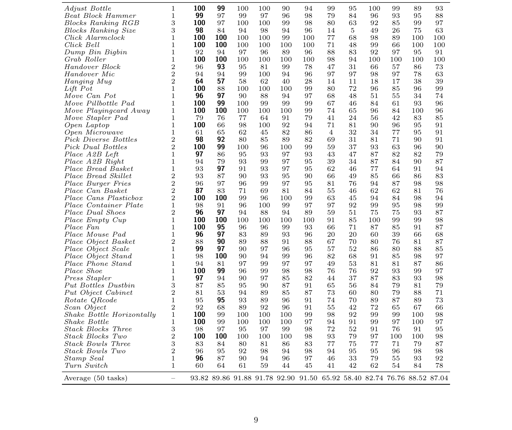

**Caption:** Per-task RoboTwin 2.0 success rates. All entries are percentages. Easy and Hard correspond to clean and randomized settings, respectively. Baseline results are taken from the full LingBot-VA RoboTwin 2.0 report and the Fast-WAM paper.

**Caption[CN]:** RoboTwin 2.0 逐任务成功率，所有条目均为百分比。Easy 与 Hard 分别对应简洁和随机化设置；基线结果取自 LingBot-VA 完整 RoboTwin 2.0 报告和 Fast-WAM 论文。

| Simulation Task | Horizon | WAM4D E | WAM4D H | Fast-WAM E | Fast-WAM H | LingBot-VA E | LingBot-VA H | π0 E | π0 H | π0.5 E | π0.5 H | Motus E | Motus H |
|---|---:|---:|---:|---:|---:|---:|---:|---:|---:|---:|---:|---:|---:|
| Adjust Bottle | 1 | 100 | 99 | 100 | 100 | 90 | 94 | 99 | 95 | 100 | 99 | 89 | 93 |
| Beat Block Hammer | 1 | 99 | 97 | 99 | 97 | 96 | 98 | 79 | 84 | 96 | 93 | 95 | 88 |
| Blocks Ranking RGB | 3 | 100 | 97 | 100 | 100 | 99 | 98 | 80 | 63 | 92 | 85 | 99 | 97 |
| Blocks Ranking Size | 3 | 98 | 84 | 94 | 98 | 94 | 96 | 14 | 5 | 49 | 26 | 75 | 63 |
| Click Alarmclock | 1 | 100 | 100 | 100 | 100 | 99 | 100 | 77 | 68 | 98 | 89 | 100 | 100 |
| Click Bell | 1 | 100 | 100 | 100 | 100 | 100 | 100 | 71 | 48 | 99 | 66 | 100 | 100 |
| Dump Bin Bigbin | 1 | 92 | 94 | 97 | 96 | 89 | 96 | 88 | 83 | 92 | 97 | 95 | 91 |
| Grab Roller | 1 | 100 | 100 | 100 | 100 | 100 | 100 | 98 | 94 | 100 | 100 | 100 | 100 |
| Handover Block | 2 | 96 | 93 | 95 | 81 | 99 | 78 | 47 | 31 | 66 | 57 | 86 | 73 |
| Handover Mic | 2 | 94 | 94 | 99 | 100 | 94 | 96 | 97 | 97 | 98 | 97 | 78 | 63 |
| Hanging Mug | 2 | 64 | 57 | 58 | 62 | 40 | 28 | 14 | 11 | 18 | 17 | 38 | 39 |
| Lift Pot | 1 | 100 | 88 | 100 | 100 | 100 | 99 | 80 | 72 | 96 | 85 | 96 | 99 |
| Move Can Pot | 1 | 96 | 97 | 90 | 88 | 94 | 97 | 68 | 48 | 51 | 55 | 34 | 74 |
| Move Pillbottle Pad | 1 | 100 | 99 | 100 | 99 | 99 | 99 | 67 | 46 | 84 | 61 | 93 | 96 |
| Move Playingcard Away | 1 | 100 | 100 | 100 | 100 | 100 | 99 | 74 | 65 | 96 | 84 | 100 | 96 |
| Move Stapler Pad | 1 | 79 | 76 | 77 | 64 | 91 | 79 | 41 | 24 | 56 | 42 | 83 | 85 |
| Open Laptop | 1 | 100 | 66 | 98 | 100 | 92 | 94 | 71 | 81 | 90 | 96 | 95 | 91 |
| Open Microwave | 1 | 61 | 65 | 62 | 45 | 82 | 86 | 4 | 32 | 34 | 77 | 95 | 91 |
| Pick Diverse Bottles | 2 | 98 | 92 | 80 | 85 | 89 | 82 | 69 | 31 | 81 | 71 | 90 | 91 |
| Pick Dual Bottles | 2 | 100 | 99 | 100 | 96 | 100 | 99 | 59 | 37 | 93 | 63 | 96 | 90 |
| Place A2B Left | 1 | 97 | 86 | 95 | 93 | 97 | 93 | 43 | 47 | 87 | 82 | 82 | 79 |
| Place A2B Right | 1 | 94 | 79 | 93 | 99 | 97 | 95 | 39 | 34 | 87 | 84 | 90 | 87 |
| Place Bread Basket | 1 | 93 | 97 | 91 | 93 | 97 | 95 | 62 | 46 | 77 | 64 | 91 | 94 |
| Place Bread Skillet | 2 | 93 | 87 | 90 | 93 | 95 | 90 | 66 | 49 | 85 | 66 | 86 | 83 |
| Place Burger Fries | 2 | 96 | 97 | 96 | 99 | 97 | 95 | 81 | 76 | 94 | 87 | 98 | 98 |
| Place Can Basket | 2 | 87 | 83 | 71 | 69 | 81 | 84 | 55 | 46 | 62 | 62 | 81 | 76 |
| Place Cans Plasticbox | 2 | 100 | 100 | 99 | 96 | 100 | 99 | 63 | 45 | 94 | 84 | 98 | 94 |
| Place Container Plate | 1 | 98 | 91 | 96 | 100 | 99 | 97 | 97 | 92 | 99 | 95 | 98 | 99 |
| Place Dual Shoes | 2 | 96 | 97 | 94 | 88 | 94 | 89 | 59 | 51 | 75 | 75 | 93 | 87 |
| Place Empty Cup | 1 | 100 | 100 | 100 | 100 | 100 | 100 | 91 | 85 | 100 | 99 | 99 | 98 |
| Place Fan | 1 | 100 | 95 | 96 | 96 | 99 | 93 | 66 | 71 | 87 | 85 | 91 | 87 |
| Place Mouse Pad | 1 | 96 | 97 | 83 | 89 | 93 | 96 | 20 | 20 | 60 | 39 | 66 | 68 |
| Place Object Basket | 2 | 88 | 90 | 89 | 88 | 91 | 88 | 67 | 70 | 80 | 76 | 81 | 87 |
| Place Object Scale | 1 | 99 | 97 | 90 | 97 | 96 | 95 | 57 | 52 | 86 | 80 | 88 | 85 |
| Place Object Stand | 1 | 98 | 100 | 90 | 94 | 99 | 96 | 82 | 68 | 91 | 85 | 98 | 97 |
| Place Phone Stand | 1 | 94 | 81 | 97 | 99 | 97 | 97 | 49 | 53 | 81 | 81 | 87 | 86 |
| Place Shoe | 1 | 100 | 99 | 96 | 99 | 98 | 98 | 76 | 76 | 92 | 93 | 99 | 97 |
| Press Stapler | 1 | 97 | 94 | 90 | 97 | 85 | 82 | 44 | 37 | 87 | 83 | 93 | 98 |
| Put Bottles Dustbin | 3 | 87 | 85 | 95 | 90 | 87 | 91 | 65 | 56 | 84 | 79 | 81 | 79 |
| Put Object Cabinet | 2 | 81 | 53 | 94 | 89 | 85 | 87 | 73 | 60 | 80 | 79 | 88 | 71 |
| Rotate QRcode | 1 | 95 | 95 | 93 | 89 | 96 | 91 | 74 | 70 | 89 | 87 | 89 | 73 |
| Scan Object | 2 | 92 | 68 | 89 | 92 | 96 | 91 | 55 | 42 | 72 | 65 | 67 | 66 |
| Shake Bottle Horizontally | 1 | 100 | 99 | 100 | 100 | 100 | 99 | 98 | 92 | 99 | 99 | 100 | 98 |
| Shake Bottle | 1 | 100 | 99 | 100 | 100 | 100 | 97 | 94 | 91 | 99 | 97 | 100 | 97 |
| Stack Blocks Three | 3 | 98 | 97 | 95 | 97 | 99 | 98 | 72 | 52 | 91 | 76 | 91 | 95 |
| Stack Blocks Two | 2 | 100 | 100 | 100 | 100 | 100 | 98 | 93 | 79 | 97 | 100 | 100 | 98 |
| Stack Bowls Three | 3 | 83 | 84 | 80 | 81 | 86 | 83 | 77 | 75 | 77 | 71 | 79 | 87 |
| Stack Bowls Two | 2 | 96 | 95 | 92 | 98 | 94 | 98 | 94 | 95 | 95 | 96 | 98 | 98 |
| Stamp Seal | 1 | 96 | 87 | 90 | 94 | 96 | 97 | 46 | 33 | 79 | 55 | 93 | 92 |
| Turn Switch | 1 | 60 | 64 | 61 | 59 | 44 | 45 | 41 | 42 | 62 | 54 | 84 | 78 |
| Average (50 tasks) | – | 93.82 | 89.86 | 91.88 | 91.78 | 92.90 | 91.50 | 65.92 | 58.40 | 82.74 | 76.76 | 88.52 | 87.04 |

### 4.3 Real-World Results

> <strong>Para. 1:</strong> WAM4D is evaluated on four AstriBot S1 scenarios. Figure 4 shows the setup, Table 4 defines sub-actions, and Table 2 reports results. WAM4D has the best overall performance across all four evaluations, covering contact-rich, geometry-sensitive, and long-horizon manipulation. LingBot-VA performs worse; its default implementation anchors action predictions to initial action history, which may cause global drift when the initial configuration changes, while a long history may introduce stale actions conflicting with current observations. In these tests, $\pi_{0.5}$ and Fast-WAM have a narrower effective workspace and fail more when objects move farther from nominal positions.

> <strong>Para. 1[CN]:</strong> WAM4D 在四种 AstriBot S1 场景上评估。图 4 展示设置，表 4 定义子动作，表 2 报告结果。WAM4D 在四项评估上总体最佳，覆盖接触密集、几何敏感与长时程操作。LingBot-VA 表现较低；其默认实现把动作预测锚定于初始动作历史，初始配置变化时可能造成全局轨迹漂移，较长历史还可能引入与当前观测冲突的陈旧动作信息。在作者测试中，$\pi_{0.5}$ 与 Fast-WAM 的有效工作空间更窄，物体远离标称区域时更易失败。

> <strong>Para. 2:</strong> **Sub-action definitions.** Table 4 defines the sub-actions used for real-robot evaluation on the AstriBot S1 platform. During each rollout, a sub-action is counted as successful when the robot completes the corresponding intermediate goal. Because the tasks are sequential, if any sub-action fails, subsequent sub-actions are not attempted and are recorded as 0.

> <strong>Para. 2[CN]:</strong> **子动作定义。** 表 4 定义了 AstriBot S1 平台真实机器人评估所使用的子动作。在每次 rollout 中，当机器人完成对应的中间目标时，该子动作计为成功。由于这些任务按顺序执行，如果任一子动作失败，后续子动作将不再尝试并记为 0。

### Table 4. AstriBot S1 sub-action definitions

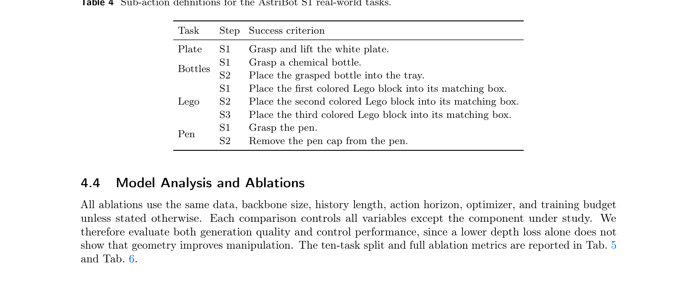

**Caption:** Sub-action definitions for the AstriBot S1 real-world tasks.

**Caption[CN]:** AstriBot S1 真实世界任务的子动作定义。

| Task | Step | Success criterion |
|---|---|---|
| Plate | S1 | Grasp and lift the white plate. |
| Bottles | S1 | Grasp a chemical bottle. |
| Bottles | S2 | Place the grasped bottle into the tray. |
| LEGO | S1 | Place the first colored Lego block into its matching box. |
| LEGO | S2 | Place the second colored Lego block into its matching box. |
| LEGO | S3 | Place the third colored Lego block into its matching box. |
| Pen | S1 | Grasp the pen. |
| Pen | S2 | Remove the pen cap from the pen. |

### 4.4 Model Analysis and Ablations

> <strong>Para. 1:</strong> All ablations use the same data, backbone size, history length, action horizon, optimizer, and training budget unless stated otherwise. Each comparison changes only the studied component. Both generation quality and control are evaluated because a lower depth loss alone does not show that geometry improves manipulation. The ten-task split and full metrics are in Tables 5 and 6.

> <strong>Para. 1[CN]:</strong> 除非另有说明，所有消融实验均使用相同的数据、骨干规模、历史长度、动作时域、优化器与训练预算。每项比较都控制除所研究组件以外的所有变量。因此，我们同时评估生成质量与控制性能，因为仅有更低的深度损失并不能说明几何确实改善了操作。十任务划分与完整消融指标分别见表 5 和表 6。

### Table 5. Ten-task ablation split

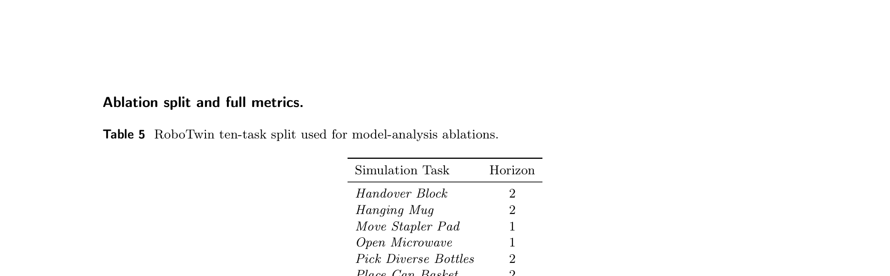

**Caption:** RoboTwin ten-task split used for model-analysis ablations.

**Caption[CN]:** 模型分析消融所用 RoboTwin 十任务划分。

| Task | Horizon |
|---|---:|
| Handover Block | 2 |
| Hanging Mug | 2 |
| Move Stapler Pad | 1 |
| Open Microwave | 1 |
| Pick Diverse Bottles | 2 |
| Place Can Basket | 2 |
| Press Stapler | 1 |
| Put Object Cabinet | 2 |
| Stack Bowls Three | 3 |
| Turn Switch | 1 |

### Table 6. Full ten-task ablation metrics

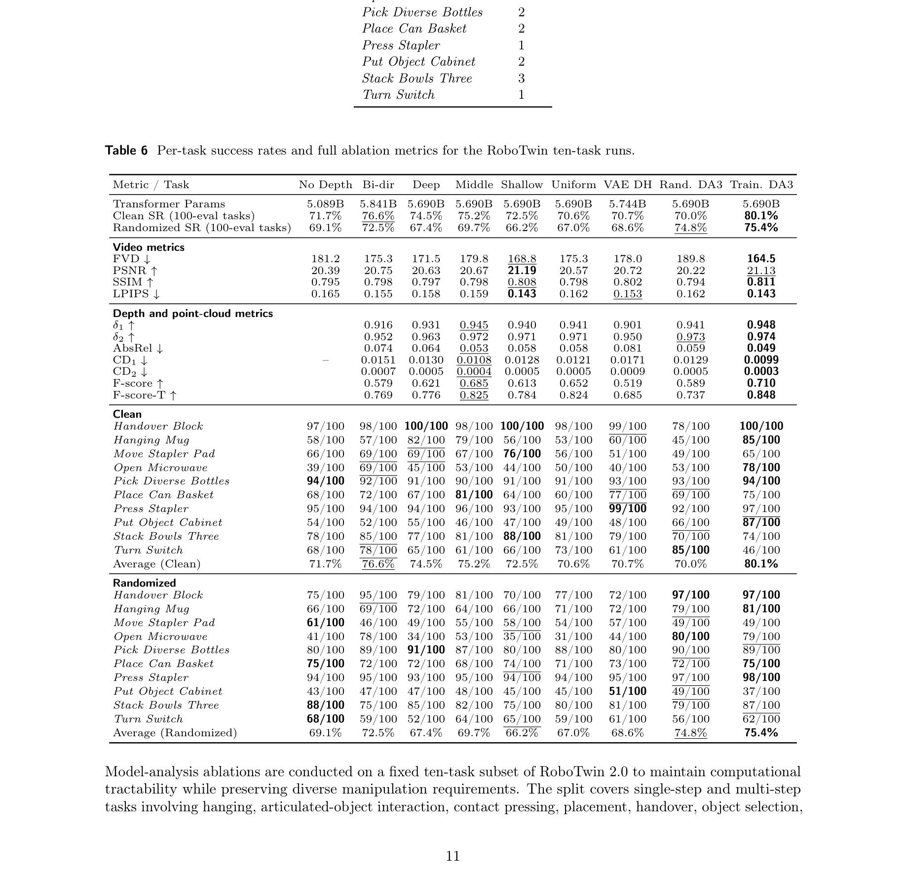

**Caption:** Per-task success rates and full ablation metrics for the RoboTwin ten-task runs.

**Caption[CN]:** RoboTwin 十任务实验的逐任务成功率及完整消融指标。

| Metric / Task | No Depth | Bi-dir | Deep | Middle | Shallow | Uniform | VAE DH | Rand. DA3 | Train. DA3 |
|---|---:|---:|---:|---:|---:|---:|---:|---:|---:|
| Transformer Params | 5.089B | 5.841B | 5.690B | 5.690B | 5.690B | 5.690B | 5.744B | 5.690B | 5.690B |
| Clean SR (100-eval tasks) | 71.7% | 76.6% | 74.5% | 75.2% | 72.5% | 70.6% | 70.7% | 70.0% | **80.1%** |
| Randomized SR (100-eval tasks) | 69.1% | 72.5% | 67.4% | 69.7% | 66.2% | 67.0% | 68.6% | <u>74.8%</u> | **75.4%** |
| **Video metrics** |  |  |  |  |  |  |  |  |  |
| FVD ↓ | 181.2 | 175.3 | 171.5 | 179.8 | <u>168.8</u> | 175.3 | 178.0 | 189.8 | **164.5** |
| PSNR ↑ | 20.39 | 20.75 | 20.63 | 20.67 | **21.19** | 20.57 | 20.72 | 20.22 | <u>21.13</u> |
| SSIM ↑ | 0.795 | 0.798 | 0.797 | 0.798 | <u>0.808</u> | 0.798 | 0.802 | 0.794 | **0.811** |
| LPIPS ↓ | 0.165 | 0.155 | 0.158 | 0.159 | **0.143** | 0.162 | <u>0.153</u> | 0.162 | **0.143** |
| **Depth and point-cloud metrics** |  |  |  |  |  |  |  |  |  |
| $\delta_1$ ↑ | – | 0.916 | 0.931 | <u>0.945</u> | 0.940 | 0.941 | 0.901 | 0.941 | **0.948** |
| $\delta_2$ ↑ | – | 0.952 | 0.963 | 0.972 | 0.971 | 0.971 | 0.950 | <u>0.973</u> | **0.974** |
| AbsRel ↓ | – | 0.074 | 0.064 | <u>0.053</u> | 0.058 | 0.058 | 0.081 | 0.059 | **0.049** |
| CD1 ↓ | – | 0.0151 | 0.0130 | <u>0.0108</u> | 0.0128 | 0.0121 | 0.0171 | 0.0129 | **0.0099** |
| CD2 ↓ | – | 0.0007 | 0.0005 | <u>0.0004</u> | 0.0005 | 0.0005 | 0.0009 | 0.0005 | **0.0003** |
| F-score ↑ | – | 0.579 | 0.621 | <u>0.685</u> | 0.613 | 0.652 | 0.519 | 0.589 | **0.710** |
| F-score-T ↑ | – | 0.769 | 0.776 | <u>0.825</u> | 0.784 | 0.824 | 0.685 | 0.737 | **0.848** |
| **Clean** |  |  |  |  |  |  |  |  |  |
| Handover Block | 97/100 | 98/100 | **100/100** | 98/100 | **100/100** | 98/100 | <u>99/100</u> | 78/100 | **100/100** |
| Hanging Mug | 58/100 | 57/100 | <u>82/100</u> | 79/100 | 56/100 | 53/100 | 60/100 | 45/100 | **85/100** |
| Move Stapler Pad | 66/100 | 69/100 | 69/100 | 67/100 | **76/100** | 56/100 | 51/100 | 49/100 | 65/100 |
| Open Microwave | 39/100 | 69/100 | 45/100 | 53/100 | 44/100 | 50/100 | 40/100 | 53/100 | **78/100** |
| Pick Diverse Bottles | **94/100** | <u>92/100</u> | 91/100 | 90/100 | 91/100 | 91/100 | <u>93/100</u> | <u>93/100</u> | **94/100** |
| Place Can Basket | 68/100 | 72/100 | 67/100 | **81/100** | 64/100 | 60/100 | <u>77/100</u> | 69/100 | 75/100 |
| Press Stapler | 95/100 | 94/100 | 94/100 | 96/100 | 93/100 | 95/100 | **99/100** | 92/100 | <u>97/100</u> |
| Put Object Cabinet | 54/100 | 52/100 | 55/100 | 46/100 | 47/100 | 49/100 | 48/100 | <u>66/100</u> | **87/100** |
| Stack Bowls Three | 78/100 | <u>85/100</u> | 77/100 | 81/100 | **88/100** | 81/100 | 79/100 | 70/100 | 74/100 |
| Turn Switch | 68/100 | <u>78/100</u> | 65/100 | 61/100 | 66/100 | 73/100 | 61/100 | **85/100** | 46/100 |
| Average (Clean) | 71.7% | <u>76.6%</u> | 74.5% | 75.2% | 72.5% | 70.6% | 70.7% | 70.0% | **80.1%** |
| **Randomized** |  |  |  |  |  |  |  |  |  |
| Handover Block | 75/100 | 95/100 | 79/100 | 81/100 | 70/100 | <u>77/100</u> | 72/100 | **97/100** | **97/100** |
| Hanging Mug | 66/100 | 69/100 | 72/100 | 64/100 | 66/100 | 71/100 | 72/100 | <u>79/100</u> | **81/100** |
| Move Stapler Pad | **61/100** | 46/100 | 49/100 | 55/100 | <u>58/100</u> | 54/100 | 57/100 | 49/100 | 49/100 |
| Open Microwave | 41/100 | 78/100 | 34/100 | 53/100 | 35/100 | 31/100 | 44/100 | **80/100** | <u>79/100</u> |
| Pick Diverse Bottles | 80/100 | 89/100 | **91/100** | 87/100 | 80/100 | 88/100 | 80/100 | <u>90/100</u> | 89/100 |
| Place Can Basket | **75/100** | 72/100 | 72/100 | 68/100 | <u>74/100</u> | 71/100 | 73/100 | 72/100 | **75/100** |
| Press Stapler | 94/100 | 95/100 | 93/100 | 95/100 | 94/100 | 94/100 | 95/100 | <u>97/100</u> | **98/100** |
| Put Object Cabinet | 43/100 | 47/100 | 47/100 | 48/100 | 45/100 | 45/100 | **51/100** | <u>49/100</u> | 37/100 |
| Stack Bowls Three | **88/100** | 75/100 | 85/100 | 82/100 | 75/100 | 80/100 | 81/100 | <u>79/100</u> | 87/100 |
| Turn Switch | **68/100** | 59/100 | 52/100 | 64/100 | <u>65/100</u> | 59/100 | 61/100 | 56/100 | 62/100 |
| Average (Randomized) | 69.1% | 72.5% | 67.4% | 69.7% | 66.2% | 67.0% | 68.6% | <u>74.8%</u> | **75.4%** |

> <strong>Para. 2:</strong> Model-analysis ablations are conducted on a fixed ten-task subset of RoboTwin 2.0 to maintain computational tractability while preserving diverse manipulation requirements. The split covers single-step and multi-step tasks involving hanging, articulated-object interaction, contact pressing, placement, handover, object selection, and stacking. Table 5 lists the tasks and horizons used by all ablation runs. Table 6 consolidates per-task success rates, model size, and full video/geometry metrics for the nine ten-task ablation runs. No Depth is an otherwise identical model trained under the same conditions without any depth branch or depth loss. VAE DH discretizes depth into 0–255 values and uses the VAE as a depth head to decode depth latents; its depth readout is taken from the output of the layer-26 VA block. All remaining variants use Spatial Registers as the depth readout interface. For the layer configurations, Shallow, Middle, Deep, and Uniform registers insert cross-attention after layers 2/4/6/8, 12/14/16/18, 22/24/26/28, and 6/12/18/24, respectively; Bi-dir uses layers 6/12/18/24 with bidirectional visibility. Rand. DA3 and Train. DA3 use the default middle-layer Spatial Register interface with the DA3 head trained from random and pretrained initialization, respectively. Within each summary or per-task row, the best entry is bolded and the second-best entry is underlined, with ties marked together.

> <strong>Para. 2[CN]:</strong> 模型分析消融在 RoboTwin 2.0 的一个固定十任务子集上进行，以便在保持多样化操作要求的同时维持计算可处理性。该划分覆盖涉及悬挂、关节物体交互、接触按压、放置、交接、物体选择与堆叠的单步及多步任务。表 5 列出了所有消融运行所使用的任务与时域。表 6 汇总了九个十任务消融运行的逐任务成功率、模型规模，以及完整的视频与几何指标。No Depth 是在相同条件下训练、但不含任何深度分支或深度损失的其他部分完全相同模型。VAE DH 将深度离散为 0–255，并使用 VAE 作为深度头来解码深度潜变量；其深度读出取自第 26 层 VA block 的输出。其余所有变体均使用 Spatial Registers 作为深度读出接口。在层配置方面，Shallow、Middle、Deep 和 Uniform registers 分别在第 2/4/6/8、12/14/16/18、22/24/26/28 和 6/12/18/24 层后插入交叉注意力；Bi-dir 在第 6/12/18/24 层采用双向可见性。Rand. DA3 与 Train. DA3 使用默认的中层 Spatial Register 接口，其中 DA3 头分别从随机初始化与预训练初始化开始训练。在每个汇总行或逐任务行中，最佳条目加粗、次佳条目加下划线，并列项则共同标记。

### Figure 5. Register attention

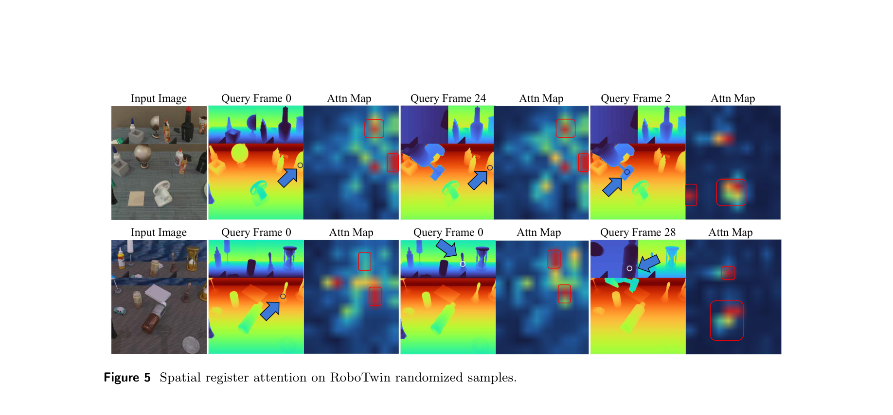

**Caption:** Spatial register attention on RoboTwin randomized samples.

**Caption[CN]:** RoboTwin 随机化样本上的空间寄存器注意力。

#### 4.4.1 Spatial Register Attention Analysis

> <strong>Para. 1:</strong> We visualize register-to-history attention on RoboTwin randomized samples in Fig. 5. The attention maps are extracted from selected transformer layers and averaged over heads. They show which history image regions are queried by spatial registers when predicting future depth. The visualizations show that spatial registers capture meaningful geometric cues from the history context. Object-related registers often attend to the same object across views, while background-related registers focus on geometrically consistent static regions. Gripper-related registers show strong attention around the initial gripper pose, suggesting that the model uses early action-history cues to predict future geometry.

> <strong>Para. 1[CN]:</strong> 我们在图 5 中可视化了 RoboTwin 随机化样本上的寄存器到历史注意力。注意力图从选定 Transformer 层提取，并在各注意力头上取平均。它们展示了预测未来深度时，空间寄存器会查询哪些历史图像区域。可视化结果表明，空间寄存器能够从历史上下文捕获有意义的几何线索。与物体相关的寄存器经常跨视角关注同一个物体，而与背景相关的寄存器则聚焦于几何一致的静态区域。与夹爪相关的寄存器在初始夹爪位姿周围呈现强注意力，这表明模型使用早期动作历史线索来预测未来几何。

#### 4.4.2 Spatial Register Design Ablation

> <strong>Para. 1:</strong> Tab. 7 studies three design choices: the depth readout interface, the register insertion layers, and the visibility between registers and the main video-action stream. Adding a direct depth head to future VAE latents improves RGB generation over the no-depth baseline, but its geometry metrics remain weaker than the spatial-register variants. This is likely because RGB VAE latents are not designed for accurate metric depth encoding and decoding without retraining the VAE. In contrast, spatial registers query only history video tokens, so the depth objective directly shapes the history video features used by action prediction. The pretrained geometric head also provides a more precise depth readout than a lightweight VAE-latent decoder.

> <strong>Para. 1[CN]:</strong> 表 7 研究三个设计选择：深度读出接口、寄存器插入层，以及寄存器与主视频—动作流之间的可见性。在未来 VAE 潜变量上添加直接深度头，相较无深度基线改善了 RGB 生成，但其几何指标仍弱于空间寄存器变体。一个可能原因是，如果不重新训练 VAE，RGB VAE 潜变量并非为精确的度量深度编码与解码而设计。相比之下，空间寄存器只查询历史视频 token，因此深度目标会直接塑造动作预测所使用的历史视频特征。预训练几何头也能提供比轻量 VAE 潜变量解码器更精确的深度读出。

> <strong>Para. 2:</strong> Register placement reveals different trade-offs between visual synthesis and geometric distillation. Shallow registers achieve the best RGB metrics, possibly because early geometry regularization encourages the denoising backbone to extract useful structure from noisy features, which benefits the overall denoising process. However, they provide weaker control and geometry quality than middle-layer registers. Middle-layer registers achieve the best balance between geometric distillation and visual feature preservation, leading to the strongest unidirectional control performance and the best overall geometry quality. Deep and uniform placements are less effective, likely because late features are more specialized for denoising output prediction, while uniform insertion spreads the geometric readout across layers with different abstraction levels.

> <strong>Para. 2[CN]:</strong> 寄存器放置位置揭示了视觉合成与几何蒸馏之间的不同权衡。浅层寄存器取得最佳 RGB 指标，可能是因为早期几何正则化促使去噪骨干从带噪特征中提取有用结构，从而有益于整体去噪过程。然而，其控制性能与几何质量都弱于中层寄存器。中层寄存器在几何蒸馏与视觉特征保留之间取得最佳平衡，因此获得最强的单向控制性能与最佳的整体几何质量。深层与均匀放置的效果较差，可能是因为后期特征更专门用于去噪输出预测，而均匀插入则把几何读出分散到抽象层级不同的各层。

> <strong>Para. 3:</strong> The bidirectional variant obtains the highest success rate, but it requires the main video-action stream to read register features, introducing additional computation and model complexity. It also degrades most geometry metrics compared with the middle-layer unidirectional setting. Therefore, we choose unidirectional registers at layers 12, 14, 16, and 18 as the default design. This setting balances geometric distillation with visual feature preservation, while also providing a practical trade-off between control performance and training cost.

> <strong>Para. 3[CN]:</strong> 双向变体取得最高成功率，但它要求主视频—动作流读取寄存器特征，从而引入额外计算与模型复杂度。与中层单向设置相比，它还使多数几何指标下降。因此，我们选择在第 12、14、16 和 18 层使用单向寄存器作为默认设计。该设置在几何蒸馏与视觉特征保留之间取得平衡，同时也在控制性能与训练成本之间提供实用折中。

### Table 7. Register design ablations

**Caption:** Ablation of depth readout interface, register placement, and register visibility on the RoboTwin 10-task split with the depth head fixed. Selected quality metrics are reported.

**Caption[CN]:** 在固定深度头的 RoboTwin 十任务划分上，消融深度读出接口、寄存器位置与可见性，并报告选定质量指标。

| Variant | Depth readout | Layers | Clean SR | FVD ↓ | PSNR ↑ | LPIPS ↓ | AbsRel ↓ | $\delta_1$ ↑ | CD1 ↓ | F-score ↑ | F-score-T ↑ |
|---|---|---|---:|---:|---:|---:|---:|---:|---:|---:|---:|
| No depth | None | – | 71.7 | 181.2 | 20.39 | 0.165 | – | – | – | – | – |
| VAE depth head | Future video hiddens | 27,28,29,30 | 70.7 | 178.0 | 20.72 | 0.153 | 0.081 | 0.901 | 0.0171 | 0.519 | 0.685 |
| Shallow registers | Spatial registers | 2,4,6,8 | 72.5 | 168.8 | 21.19 | 0.143 | 0.058 | 0.940 | 0.0128 | 0.613 | 0.784 |
| Middle registers | Spatial registers | 12,14,16,18 | 75.2 | 179.8 | 20.67 | 0.159 | 0.053 | 0.945 | 0.0108 | 0.685 | 0.825 |
| Deep registers | Spatial registers | 22,24,26,28 | 74.5 | 171.5 | 20.63 | 0.158 | 0.064 | 0.931 | 0.0130 | 0.621 | 0.776 |
| Uniform registers | Spatial registers | 6,12,18,24 | 70.6 | 175.3 | 20.57 | 0.162 | 0.058 | 0.941 | 0.0121 | 0.652 | 0.824 |
| Bidirectional registers | Spatial registers | 6,12,18,24 | 76.6 | 175.3 | 20.75 | 0.155 | 0.074 | 0.916 | 0.0151 | 0.579 | 0.769 |

#### 4.4.3 Geometric Head Ablation

> <strong>Para. 1:</strong> We compare different depth supervision paths with the same register interface. A randomly initialized depth head tests whether ordinary depth prediction is sufficient. A tuned pretrained geometric head tests whether adaptation is needed. A fixed pretrained geometric head tests whether geometric foundation knowledge is sufficient without adaptation.

> <strong>Para. 1[CN]:</strong> 我们在相同寄存器接口下比较不同的深度监督路径。随机初始化深度头用于检验普通深度预测是否已经足够。经过调优的预训练几何头用于检验是否需要适配。固定的预训练几何头用于检验在不进行适配时，仅有几何基础知识是否足够。

> <strong>Para. 2:</strong> Tab. 8 shows that initializing the geometric head from pretrained weights and allowing it to adapt during training gives the strongest generation quality, with the best selected video, depth, and point-cloud consistency metrics. In contrast, fully random initialization causes a clear drop in both video and geometry quality, suggesting that depth supervision alone is not sufficient without a strong geometric prior. The fixed pretrained geometric head lies between these two settings in generation quality: it retains useful geometric priors and improves substantially over random initialization, but lacks the adaptation capacity of the trainable pretrained geometric head. We therefore use the trainable pretrained geometric head as the final setting.

> <strong>Para. 2[CN]:</strong> 表 8 表明，以预训练权重初始化几何头并允许其在训练中适配，可获得最强的生成质量，并在所选视频、深度与点云一致性指标上取得最佳结果。相比之下，完全随机初始化会使视频与几何质量都明显下降，这表明缺少强几何先验时，仅靠深度监督并不足够。固定预训练几何头的生成质量介于上述两种设置之间：它保留了有用的几何先验，相比随机初始化有显著改善，但缺少可训练预训练几何头的适配能力。因此，我们最终采用可训练的预训练几何头。

### Table 8. Geometric-head ablations

**Caption:** Geometric head ablations on the RoboTwin 10-task split.

**Caption[CN]:** RoboTwin 十任务划分上的几何头消融。

| Variant | Clean SR | FVD ↓ | PSNR ↑ | LPIPS ↓ | AbsRel ↓ | $\delta_1$ ↑ | CD1 ↓ | F-score ↑ | F-score-T ↑ |
|---|---:|---:|---:|---:|---:|---:|---:|---:|---:|
| w/o depth | 71.7 | 181.2 | 20.39 | 0.165 | – | – | – | – | – |
| Trainable random init | 70.0 | 189.8 | 20.22 | 0.162 | 0.059 | 0.941 | 0.0129 | 0.589 | 0.737 |
| Trainable pretrained | 80.1 | 164.5 | 21.13 | 0.143 | 0.049 | 0.948 | 0.0099 | 0.710 | 0.848 |
| Fixed pretrained | 75.2 | 179.8 | 20.67 | 0.159 | 0.053 | 0.945 | 0.0108 | 0.685 | 0.825 |

### 4.5 Qualitative 4D Rollout Visualization

> <strong>Para. 1:</strong> Although the spatial-register depth branch is introduced primarily as an auxiliary training objective to regularize causal video features with geometric supervision, it can also be retained for qualitative analysis. In this setting, WAM4D has an interpretable 4D rollout capability: starting from only the first observed frame, the model autoregressively predicts future RGB frames and depth maps, and the generated RGB-D frames can be back-projected into point clouds. Fig. 6 visualizes this process. This analysis path is separate from the default deployment path, where the depth branch is removed and the policy interacts with the environment through lightweight action generation.

> <strong>Para. 1[CN]:</strong> 尽管空间寄存器深度分支主要是作为辅助训练目标引入，以利用几何监督正则化因果视频特征，但也可以保留它进行定性分析。在这种设置下，WAM4D 具有可解释的四维 rollout 能力：模型仅从第一个观测帧出发，自回归预测未来 RGB 帧与深度图，并可将生成的 RGB-D 帧反投影为点云。图 6 对这一过程进行了可视化。该分析路径与默认部署路径相互独立；默认部署会移除深度分支，策略仅通过轻量动作生成与环境交互。

### Figure 6. RGB-D and point-cloud rollout

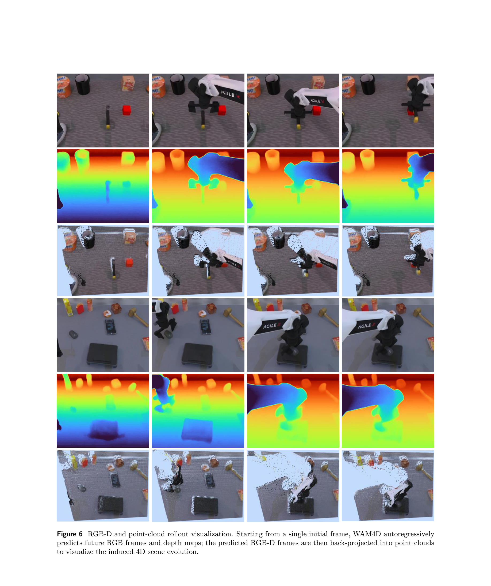

**Caption:** RGB-D and point-cloud rollout visualization. Starting from a single initial frame, WAM4D autoregressively predicts future RGB frames and depth maps; the predicted RGB-D frames are then back-projected into point clouds to visualize the induced 4D scene evolution.

**Caption[CN]:** RGB-D 与点云 rollout 可视化。WAM4D 从单个初始帧出发，自回归预测未来 RGB 帧和深度图，再把预测 RGB-D 帧反投影为点云，以呈现由此诱导的四维场景演化。

### 4.6 Failure Analysis

> <strong>Para. 1:</strong> Fig. 7 shows a representative failure case in long autoregressive rollout. Because WAM4D does not introduce an explicit long-term memory, objects that become occluded or leave the visible context may be completed as different objects when the model continues rolling out the scene. This limitation affects closed-loop visualization of generated futures, but it does not compromise the policy success rate in our evaluation: during control, the model continuously receives fresh observations from the real environment or simulator, rather than relying solely on its own generated rollout.

> <strong>Para. 1[CN]:</strong> 图 7 展示了长自回归 rollout 中的一个代表性失败案例。由于 WAM4D 没有引入显式长期记忆，当物体被遮挡或离开可见上下文后，模型继续展开场景时可能会把它们补全成不同物体。该局限会影响生成未来的闭环可视化，但并不会损害作者评估中的策略成功率：控制期间，模型会持续从真实环境或模拟器接收新观测，而不是只依赖自身生成的 rollout。

### Figure 7. Long-rollout failure

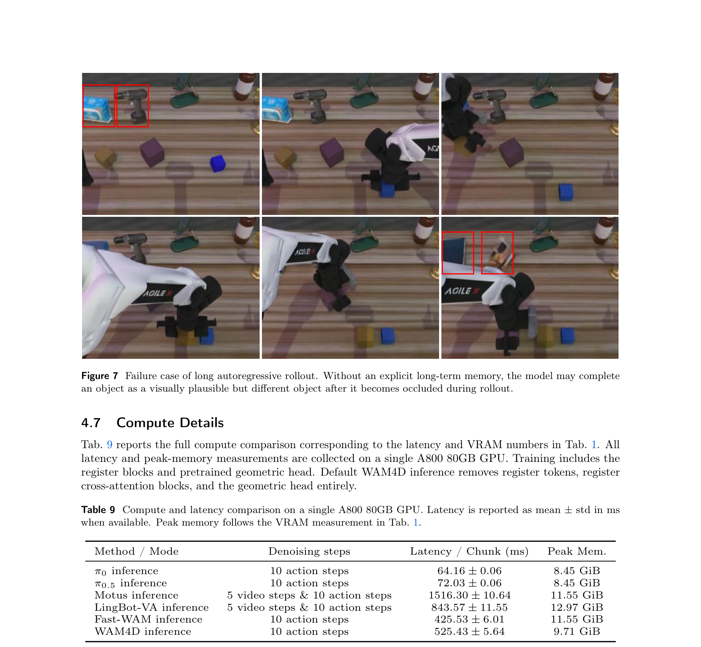

**Caption:** Failure case of long autoregressive rollout. Without an explicit long-term memory, the model may complete an object as a visually plausible but different object after it becomes occluded during rollout.

**Caption[CN]:** 长自回归 rollout 失败案例。没有显式长期记忆时，物体在 rollout 中被遮挡后，模型可能把它补全为视觉上合理但不同的物体。

### 4.7 Compute Details

> <strong>Para. 1:</strong> Tab. 9 reports the full compute comparison corresponding to the latency and VRAM numbers in Tab. 1. All latency and peak-memory measurements are collected on a single A800 80GB GPU. Training includes the register blocks and pretrained geometric head. Default WAM4D inference removes register tokens, register cross-attention blocks, and the geometric head entirely.

> <strong>Para. 1[CN]:</strong> 表 9 报告了与表 1 中时延和 VRAM 数值相对应的完整计算比较。所有时延与峰值内存测量均在单张 A800 80GB GPU 上完成。训练包含寄存器块与预训练几何头。默认 WAM4D 推理会完整移除寄存器 token、寄存器交叉注意力块和几何头。

### Table 9. Compute and latency

**Caption:** Compute and latency comparison on a single A800 80GB GPU. Latency is reported as mean ± std in ms when available. Peak memory follows the VRAM measurement in Table 1.

**Caption[CN]:** 单张 A800 80GB GPU 上的计算与时延比较；可用时以毫秒报告均值 ± 标准差，峰值内存沿用表 1 的 VRAM 测量。

| Method / Mode | Denoising steps | Latency / chunk (ms) | Peak memory |
|---|---|---:|---:|
| $\pi_0$ inference | 10 action | 64.16 ± 0.06 | 8.45 GiB |
| $\pi_{0.5}$ inference | 10 action | 72.03 ± 0.06 | 8.45 GiB |
| Motus inference | 5 video & 10 action | 1516.30 ± 10.64 | 11.55 GiB |
| LingBot-VA inference | 5 video & 10 action | 843.57 ± 11.55 | 12.97 GiB |
| Fast-WAM inference | 10 action | 425.53 ± 6.01 | 11.55 GiB |
| WAM4D inference | 10 action | 525.43 ± 5.64 | 9.71 GiB |

## 5 Conclusion and Limitation

> <strong>Para. 1:</strong> We present WAM4D, a fast 4D world action model that transfers geometric foundation priors into causal video-action representations through spatial register distillation. Experiments show that WAM4D improves spatial consistency and action prediction across simulation and real-world long-horizon tasks. While WAM is still slower than VLA at present, we aim to further boost its speed in future work.

> <strong>Para. 1[CN]:</strong> 本文提出 WAM4D，通过空间寄存器蒸馏把几何基础先验迁移到因果视频—动作表征。实验显示，WAM4D 在仿真与真实世界长时程任务上改善空间一致性与动作预测。作者承认当前 WAM 仍慢于 VLA，并计划进一步提升速度。

> <strong>Para. 2:</strong> WAM4D improves geometry-aware video-action representations without requiring dense geometry during policy deployment. However, the model does not maintain explicit long-term object memory during autoregressive rollout. This can lead to identity-inconsistent completions after severe occlusion in qualitative generated futures. Future work could add persistent object memory or scene-state tracking while preserving the lightweight observation-to-action deployment path.

> <strong>Para. 2[CN]:</strong> WAM4D 无需在策略部署期间使用稠密几何，即可改善几何感知的视频—动作表征。然而，如第 4.6 节所述，模型在自回归 rollout 期间不维护显式长期物体记忆。这可能导致定性生成未来在严重遮挡之后出现物体身份不一致的补全。未来工作可以加入持久物体记忆或场景状态跟踪，同时保留轻量的观测到动作部署路径。

## References

References are preserved as searchable English-only entries from the canonical PDF (pp. 16–19); bibliography entries are not translated line by line.

1. T. Wan, A. Wang, B. Ai, B. Wen, C. Mao, C.-W. Xie, D. Chen, F. Yu, H. Zhao, J. Yang, et al. Wan: Open and advanced large-scale video generative models. arXiv preprint arXiv:2503.20314, 2025.
2. Z. Yang, J. Teng, W. Zheng, M. Ding, S. Huang, J. Xu, Y. Yang, W. Hong, X. Zhang, G. Feng, et al. Cogvideox: Text-to-video diffusion models with an expert transformer. In International Conference on Learning Representations, volume 2025, pages 83048–83077, 2025.
3. J. Ding, Y. Zhang, Y. Shang, Y. Zhang, Z. Zong, J. Feng, Y. Yuan, H. Su, N. Li, N. Sukiennik, et al. Understanding world or predicting future? a comprehensive survey of world models. ACM Computing Surveys, 58(3):1–38, 2025.
4. X. Chi, P. Jia, C.-K. Fan, X. Ju, W. Mi, K. Zhang, Z. Qin, W. Tian, K. Ge, H. Li, et al. Wow: Towards a world omniscient world model through embodied interaction. arXiv preprint arXiv:2509.22642, 2025.
5. Y. Li, X. Wei, X. Chi, Y. Li, Z. Zhao, H. Wang, N. Ma, M. Lu, and S. Zhang. Manipdreamer: Boosting robotic manipulation world model with action tree and visual guidance. In ICASSP 2026-2026 IEEE International Conference on Acoustics, Speech and Signal Processing (ICASSP), pages 12027–12031. IEEE, 2026a.
6. Y. Li, X. Wei, X. Chi, Y. Li, Z. Zhao, H. Wang, N. Ma, M. Lu, and S. Han. Manipdreamer3d: Synthesizing plausible robotic manipulation video with occupancy-aware 3d trajectory. In Proceedings of the AAAI Conference on Artificial Intelligence, volume 40, pages 6644–6652, 2026b.
7. K. Zeng, Z. Wu, K. Xiong, X. Wei, X. Guo, Z. Zhu, K. Ho, L. Zhou, B. Zeng, M. Lu, H. Sun, B. WANG, G. Chen, H. Ye, and W. Zhang. Rethinking driving world model as synthetic data generator for perception tasks. In The Fourteenth International Conference on Learning Representations, 2026. URL https://openreview.net/forum?id=z3cFADf6zZ.
8. Y. Chen, R. Chen, D. Huo, Y. Yang, D. Qi, H. Liu, T. Lin, S. Zeng, J. Xiao, X. Chang, et al. Abot-physworld: Interactive world foundation model for robotic manipulation with physics alignment. arXiv preprint arXiv:2603.23376, 2026.
9. C.-K. Fan, X. Chi, X. Ju, H. Li, Y. Bao, Y.-K. Wang, L. Chen, Z. Jiang, K. Ge, Y. Li, et al. Wow, wo, val! a comprehensive embodied world model evaluation turing test. arXiv preprint arXiv:2601.04137, 2026.
10. S. Zhou, Y. Du, J. Chen, Y. Li, D.-Y. Yeung, and C. Gan. Robodreamer: Learning compositional world models for robot imagination. arXiv preprint arXiv:2404.12377, 2024.
11. T. Yu, G. Lu, Z. Yang, H. Deng, S. S. Chen, J. Lu, W. Ding, G. Hu, Y. Tang, and Z. Wang. Manigaussian++: General robotic bimanual manipulation with hierarchical gaussian world model. In 2025 IEEE/RSJ International Conference on Intelligent Robots and Systems (IROS), pages 12232–12239. IEEE, 2025.
12. D. Wu, J. Hu, K.-H. Hui, X. Wei, C. Luo, J. Li, and Z. Liu. Phymix: Towards physically consistent single-image 3d indoor scene generation with implicit–explicit optimization. arXiv preprint arXiv:2604.10125, 2026.
13. A. Brohan, N. Brown, J. Carbajal, Y. Chebotar, X. Chen, K. Choromanski, T. Ding, D. Driess, A. Dubey, C. Finn, et al. RT-1: Robotics transformer for real-world control at scale. arXiv preprint arXiv:2212.06817, 2022.
14. K. Black, N. Brown, D. Driess, A. Esmail, M. Equi, C. Finn, N. Fusai, L. Groom, K. Hausman, B. Ichter, et al. π0: A vision-language-action flow model for general robot control. arXiv preprint, 2024.
15. Physical Intelligence, K. Black, N. Brown, J. Darpinian, K. Dhabalia, D. Driess, A. Esmail, M. Equi, C. Finn, N. Fusai, et al. π0.5: A vision-language-action model with open-world generalization. arXiv preprint arXiv:2504.16054, 2025.
16. J. Cao, Q. Zhang, P. Jia, X. Zhao, B. Lan, X. Zhang, X. Wei, S. Chen, L. Li, X. Liu, et al. Fastdrivevla: Efficient end-to-end driving via plug-and-play reconstruction-based token pruning. In Proceedings of the AAAI Conference on Artificial Intelligence, volume 40, pages 2571–2579, 2026.
17. P. Intelligence, B. Ai, A. Amin, R. Aniceto, A. Balakrishna, G. Balke, K. Black, G. Bokinsky, S. Cao, T. Charbonnier, et al. Pi0.7: a steerable generalist robotic foundation model with emergent capabilities. arXiv preprint arXiv:2604.15483, 2026.
18. J. Zhang, X. Chen, Q. Wang, M. Li, Y. Guo, Y. Hu, J. Zhang, S. Bai, J. Lin, and J. Chen. Vlm4vla: Revisiting vision-language-models in vision-language-action models. arXiv preprint arXiv:2601.03309, 2026.
19. D. Qu, H. Song, Q. Chen, Y. Yao, X. Ye, Y. Ding, Z. Wang, J. Gu, B. Zhao, D. Wang, et al. Spatialvla: Exploring spatial representations for visual-language-action model. arXiv preprint arXiv:2501.15830, 2025.
20. C. Li, J. Wen, Y. Peng, Y. Peng, and Y. Zhu. Pointvla: Injecting the 3d world into vision-language-action models. IEEE Robotics and Automation Letters, 11(3):2506–2513, 2026.
21. L. Sun, B. Xie, Y. Liu, H. Shi, T. Wang, and J. Cao. Geovla: Empowering 3d representations in vision-language-action models. arXiv preprint arXiv:2508.09071, 2025.
22. F. Li, W. Song, H. Zhao, J. Wang, P. Ding, D. Wang, L. Zeng, and H. Li. Spatial forcing: Implicit spatial representation alignment for vision-language-action model. arXiv preprint arXiv:2510.12276, 2025.
23. H. Wang, X. Wei, J. He, C. Bai, C.-K. Fan, J. Cao, J. Chen, Y. Li, S. Rong, M. Lu, et al. Vega: Visual encoder grounding alignment for spatially-aware vision-language-action models. arXiv preprint arXiv:2605.10485, 2026.
24. L. Li, Q. Zhang, Y. Luo, S. Yang, R. Wang, F. Han, M. Yu, Z. Gao, N. Xue, X. Zhu, et al. Causal world modeling for robot control. arXiv preprint arXiv:2601.21998, 2026.
25. T. Yuan, Z. Dong, Y. Liu, and H. Zhao. Fast-WAM: Do world action models need test-time future imagination? arXiv preprint arXiv:2603.16666, 2026.
26. M. Team, C. Xiang, F. Bao, H. Liu, H. Tan, H. Bi, J. Li, J. Liu, J. Pang, K. Jing, et al. Motubrain: An advanced world action model for robot control. arXiv preprint arXiv:2604.27792, 2026.
27. Y. Zhang, Y. Chen, C. Liu, Z. Ding, J. Xu, S. Zou, J. Liao, J. Hu, X. Ren, X. Zhang, et al. Pelican-unified 1.0: A unified embodied intelligence model for understanding, reasoning, imagination and action. arXiv preprint arXiv:2605.15153, 2026.
28. B. Ai, S. Tian, H. Shi, Y. Wang, T. Pfaff, C. Tan, H. I. Christensen, H. Su, J. Wu, and Y. Li. A review of learning-based dynamics models for robotic manipulation. Science Robotics, 10(106):eadt1497, 2025.
29. J. Guo, Q. Li, P. Li, Z. Chen, N. Sun, Y. Su, H. Wang, Y. Zhang, X. Li, and H. Liu. Unified 4D world action modeling from video priors with asynchronous denoising. arXiv preprint arXiv:2604.26694, 2026.
30. J. Wang, Y. Jiang, T. He, J. Sun, Q. Zhang, J. He, J. Cao, Z. Gan, M. Sun, Q. Shao, et al. Mvista-4d: View-consistent 4d world model with test-time action inference for robotic manipulation. arXiv preprint arXiv:2602.09878, 2026.
31. M. Xu, T. Zhang, T. Liu, Z. Chen, X. Han, and Z. Liu. Kinema4d: Kinematic 4d world modeling for spatiotemporal embodied simulation. arXiv preprint arXiv:2603.16669, 2026.
32. H. Zhen, Q. Sun, H. Zhang, J. Li, S. Zhou, Y. Du, and C. Gan. TesserAct: Learning 4D embodied world models. arXiv preprint arXiv:2504.20995, 2025.
33. Y. Tian, Y. Jin, B. Yu, Y. Shi, H. Wu, C. H. Liu, K. Chen, and C. Huang. Starry: Spatial-temporal action-centric world modeling for robotic manipulation. arXiv preprint arXiv:2604.26848, 2026.
34. J. Ho, W. Chan, C. Saharia, J. Whang, R. Gao, A. Gritsenko, D. P. Kingma, B. Poole, M. Norouzi, D. J. Fleet, et al. Imagen video: High definition video generation with diffusion models. arXiv preprint arXiv:2210.02303, 2022.
35. A. Blattmann, T. Dockhorn, S. Kulal, D. Mendelevitch, M. Kilian, D. Lorenz, Y. Levi, Z. English, V. Voleti, A. Letts, et al. Stable video diffusion: Scaling latent video diffusion models to large datasets. arXiv preprint arXiv:2311.15127, 2023.
36. T. Seedance, D. Chen, L. Chen, X. Chen, Y. Chen, Z. Chen, Z. Chen, F. Cheng, T. Cheng, Y. Cheng, et al. Seedance 2.0: Advancing video generation for world complexity. arXiv preprint arXiv:2604.14148, 2026.
37. Z. Yang, Y. Chen, J. Wang, S. Manivasagam, W.-C. Ma, A. J. Yang, and R. Urtasun. Unisim: A neural closed-loop sensor simulator. In Proceedings of the IEEE/CVF Conference on Computer Vision and Pattern Recognition, pages 1389–1399, 2023.
38. C. Yin, D. Huang, D. Yang, J. Wang, N. Zhao, C. Xu, W. Sun, L. Hou, Z. Li, J. Wu, et al. Genie sim 3.0: A high-fidelity comprehensive simulation platform for humanoid robot. arXiv preprint arXiv:2601.02078, 2026.
39. Y. Du, S. Yang, B. Dai, H. Dai, O. Nachum, J. Tenenbaum, D. Schuurmans, and P. Abbeel. Learning universal policies via text-guided video generation. Advances in neural information processing systems, 36:9156–9172, 2023.
40. B. Wang, N. Sridhar, C. Feng, M. Van der Merwe, A. Fishman, N. Fazeli, and J. J. Park. This&that: Language-gesture controlled video generation for robot planning. In 2025 IEEE International Conference on Robotics and Automation (ICRA), pages 12842–12849. IEEE, 2025.
41. S. Wang, J. Shi, Z. Fu, X. He, F. Liu, C. Yang, Y. Zhou, Z. Fei, J. Gong, J. Fu, et al. World action models: The next frontier in embodied ai. arXiv preprint arXiv:2605.12090, 2026.
42. H. Bi, H. Tan, S. Xie, Z. Wang, S. Huang, H. Liu, R. Zhao, Y. Feng, C. Xiang, Y. Rong, et al. Motus: A unified latent action world model. arXiv preprint arXiv:2512.13030, 2025.
43. B. Mildenhall, P. P. Srinivasan, M. Tancik, J. T. Barron, R. Ramamoorthi, and R. Ng. NeRF: Representing scenes as neural radiance fields for view synthesis. In European Conference on Computer Vision, 2020.
44. B. Kerbl, G. Kopanas, T. Leimkühler, and G. Drettakis. 3D Gaussian Splatting for real-time radiance field rendering. ACM Transactions on Graphics, 42(4), 2023.
45. Y. Ze, G. Yan, Y.-H. Wu, A. Macaluso, Y. Ge, J. Ye, N. Hansen, L. E. Li, and X. Wang. GNFactor: Multi-task real robot learning with generalizable neural feature fields. Conference on Robot Learning, 2023.
46. G. Lu, S. Zhang, Z. Wang, C. Liu, J. Lu, and Y. Tang. ManiGaussian: Dynamic gaussian splatting for multi-task robotic manipulation. arXiv preprint arXiv:2403.08321, 2024.
47. O. Shorinwa, J. Tucker, A. Smith, A. Swann, T. Chen, R. Firoozi, M. Kennedy III, and M. Schwager. Splat-MOVER: Multi-stage, open-vocabulary robotic manipulation via editable gaussian splatting. arXiv preprint arXiv:2405.04378, 2024.
48. J. Duan, W. Yuan, W. Pumacay, Y. R. Wang, K. Ehsani, D. Fox, and R. Krishna. Manipulate-Anything: Automating real-world robots using vision-language models. arXiv preprint arXiv:2406.18915, 2024.
49. N. Huang, X. Wei, W. Zheng, P. An, M. Lu, W. Zhan, M. Tomizuka, K. Keutzer, and S. Zhang. S3gaussian: Self-supervised street gaussians for autonomous driving. arXiv preprint arXiv:2405.20323, 2024.
50. X. Wei, Q. Wuwu, Z. Zhao, Z. Wu, N. Huang, M. Lu, N. Ma, and S. Zhang. Emd: Explicit motion modeling for high-quality street gaussian splatting. In Proceedings of the IEEE/CVF international conference on computer vision, pages 28462–28472, 2025.
51. X. Wei, Z. Ye, Y. Gu, Z. Zhu, Y. Guo, Y. Shen, S. Zhao, M. Lu, H. Sun, B. Wang, et al. Parkgaussian: Surround-view 3d gaussian splatting for autonomous parking. arXiv preprint arXiv:2601.01386, 2026.
52. S. Wang, V. Leroy, Y. Cabon, B. Chidlovskii, and J. Revaud. Dust3r: Geometric 3d vision made easy. In Proceedings of the IEEE/CVF conference on computer vision and pattern recognition, pages 20697–20709, 2024.
53. J. Wang, M. Chen, N. Karaev, A. Vedaldi, C. Rupprecht, and D. Novotny. Vggt: Visual geometry grounded transformer. In Proceedings of the Computer Vision and Pattern Recognition Conference, pages 5294–5306, 2025.
54. H. Lin, S. Chen, J. Liew, D. Y. Chen, Z. Li, G. Shi, J. Feng, and B. Kang. Depth anything 3: Recovering the visual space from any views. arXiv preprint arXiv:2511.10647, 2025.
55. Y. Wang, J. Zhou, H. Zhu, W. Chang, Y. Zhou, Z. Li, J. Chen, J. Pang, C. Shen, and T. He. Pi3: Permutation-equivariant visual geometry learning. arXiv preprint arXiv:2507.13347, 2025.
56. X. Wei, P. Chen, G. Li, M. Lu, H. Chen, and F. Tian. Gazegaussian: High-fidelity gaze redirection with 3d gaussian splatting. In Proceedings of the IEEE/CVF International Conference on Computer Vision, pages 13293–13303, 2025.
57. H. Wang, X. Wei, X. Zhang, J. Li, C. Bai, Y. Li, M. Lu, W. Zheng, and S. Zhang. Embodiedocc++: Boosting embodied 3d occupancy prediction with plane regularization and uncertainty sampler. In Proceedings of the 33rd ACM International Conference on Multimedia, pages 925–934, 2025.
58. D. Wu, Z. Li, T. Hua, Y. Ren, X. Wei, R. Qin, and W. Zhao. Feed-forward gaussian splatting from sparse aerial views. arXiv preprint arXiv:2605.19949, 2026.
59. J. Wang, M. Chen, S. Zhang, N. Karaev, J. Schönberger, P. Labatut, P. Bojanowski, D. Novotny, A. Vedaldi, and C. Rupprecht. Vggt-omega. arXiv preprint arXiv:2605.15195, 2026.
60. T. Shen, S. Bahmani, K. He, S. G. Srinivasan, T. Cao, J. Ren, R. Li, Z. Wang, N. Sharp, Z. Gojcic, et al. Lyra 2.0: Explorable generative 3d worlds. arXiv preprint arXiv:2604.13036, 2026.
61. S. Huang, L. Chen, P. Zhou, S. Chen, Y. Liao, Z. Jiang, Y. Hu, P. Gao, H. Li, M. Yao, et al. Enerverse: Envisioning embodied future space for robotics manipulation. Advances in Neural Information Processing Systems, 38:37693–37720, 2026.
62. Y. Yang, L. Fan, Z. Shi, J. Peng, F. Wang, and Z. Zhang. Neoverse: Enhancing 4d world model with in-the-wild monocular videos. arXiv preprint arXiv:2601.00393, 2026.
63. P. Tu, H. Zhu, J. Sun, S. Ren, C. Wang, J. Luo, X. Cheng, and Z. Chen. Embody4d: A generalist 4d world model for embodied ai. arXiv preprint arXiv:2605.01799, 2026.
64. T. Z. Zhao, V. Kumar, S. Levine, and C. Finn. Learning fine-grained bimanual manipulation with low-cost hardware. arXiv preprint arXiv:2304.13705, 2023.
65. C. Chi, Z. Xu, S. Feng, E. Cousineau, Y. Du, B. Burchfiel, R. Tedrake, and S. Song. Diffusion policy: Visuomotor policy learning via action diffusion. The International Journal of Robotics Research, 44(10-11):1684–1704, 2025.
66. B. Zitkovich, T. Yu, S. Xu, P. Xu, T. Xiao, F. Xia, J. Wu, P. Wohlhart, S. Welker, A. Wahid, et al. Rt-2: Vision-language-action models transfer web knowledge to robotic control. In Conference on Robot Learning, pages 2165–2183. PMLR, 2023.
67. M. J. Kim, K. Pertsch, S. Karamcheti, T. Xiao, A. Balakrishna, S. Nair, R. Rafailov, E. Foster, G. Lam, P. Sanketi, et al. Openvla: An open-source vision-language-action model. arXiv preprint arXiv:2406.09246, 2024.
68. O. M. Team, D. Ghosh, H. Walke, K. Pertsch, K. Black, O. Mees, S. Dasari, J. Hejna, T. Kreiman, C. Xu, et al. Octo: An open-source generalist robot policy. arXiv preprint arXiv:2405.12213, 2024.
69. Z. Liu, J. Liu, H. Chen, J. Yu, Z. Guo, C. Hou, C. Gu, X. Mi, R. Zhang, K. Wu, et al. Last $\pi_0$: Latent spatio-temporal chain-of-thought for robotic vision-language-action model. arXiv preprint arXiv:2601.05248, 2026.
70. S. Liu, L. Wu, B. Li, H. Tan, H. Chen, Z. Wang, K. Xu, H. Su, and J. Zhu. Rdt-1b: a diffusion foundation model for bimanual manipulation. In International Conference on Learning Representations, volume 2025, pages 29982–30009, 2025.

## Source Coverage Audit

| Section | Base source groups | Bilingual pairs | Continuation fragments | Figures | Tables | Equations |
|---|---:|---:|---:|---:|---:|---:|
| Abstract / homepage metadata | 2 | 2 | 0 | 0 | 0 | 0 |
| Introduction | 5 | 5 | 0 | 1 | 0 | 0 |
| Related Work | 3 | 3 | 0 | 0 | 0 | 0 |
| Method 3.1 | 9 | 9 | 0 | 1 | 0 | 5 |
| Method 3.2 | 9 | 9 | 0 | 0 | 0 | 3 |
| Method 3.3 | 3 | 3 | 0 | 1 | 0 | 0 |
| Method 3.4 | 3 | 3 | 0 | 0 | 0 | 2 |
| Method 3.5 | 7 | 7 | 0 | 0 | 0 | 0 |
| Experiments 4.1 | 5 | 5 | 0 | 1 | 2 | 0 |
| Experiments 4.2 | 2 | 2 | 0 | 0 | 1 | 0 |
| Experiments 4.3 | 2 | 2 | 0 | 0 | 1 | 0 |
| Experiments 4.4 | 10 | 10 | 0 | 1 | 4 | 0 |
| Experiments 4.5–4.7 | 3 | 3 | 0 | 2 | 1 | 0 |
| Conclusion / Limitation | 2 | 2 | 0 | 0 | 0 | 0 |
| **Total source groups** | **63** | **63** | **0** | **7** | **9** | **10** |

The count treats each source paragraph, source list, or source-native homepage metadata/availability block as one base group. Display equations are standalone and do not create continuation fragments. Algorithm 1 is preserved as one paired introductory source group plus its exact 11-step list.

## Critical Reading Notes

- “4D” is evidenced as time-indexed RGB-D and induced point-cloud evolution; the deployed policy does not retain or decode a persistent dense 4D representation.
- The paper supports geometry as useful training supervision, but does not isolate whether every control gain comes from geometric prior rather than auxiliary regularization or DA3 pseudo-label properties.
- Table 1 does not show a higher overall average than LingBot-VA: WAM4D is 91.8 versus 92.3, though it uses less peak memory and lower latency. It ties Fast-WAM in average success but is slower.
- RoboTwin uses one unified policy over the complete 50-task suite; this is not a LIBERO experiment, and the paper provides no evidence about whether LIBERO suites should be merged or trained separately.
- The code URL is printed in the paper. Reproducibility still depends on access to re-collected depth-annotated demonstrations, LingBot-VA initialization, Wan2.2 VAE, DA3-GIANT-1.1 head, robot calibration, and evaluation scripts.
