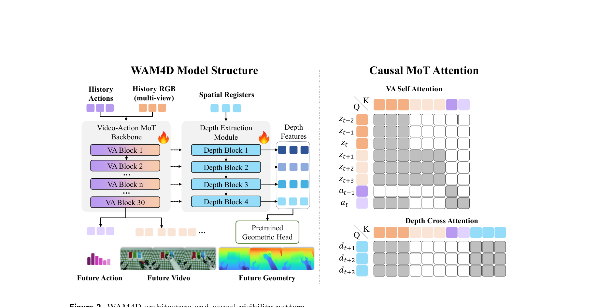
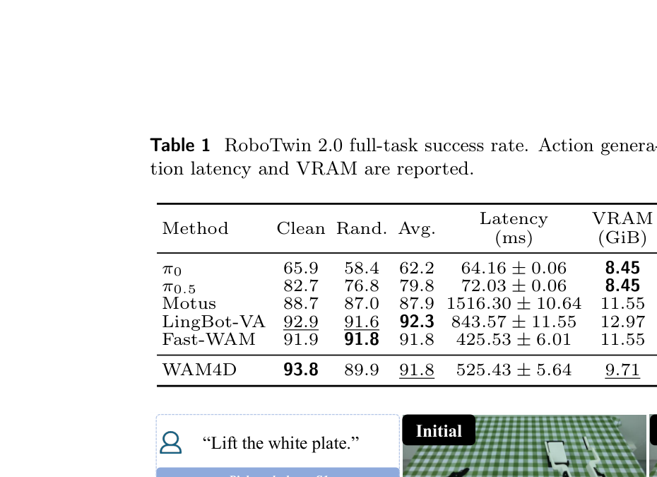
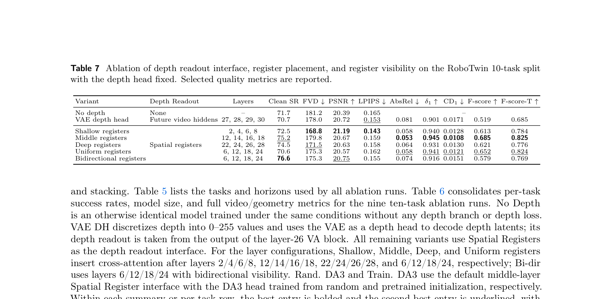
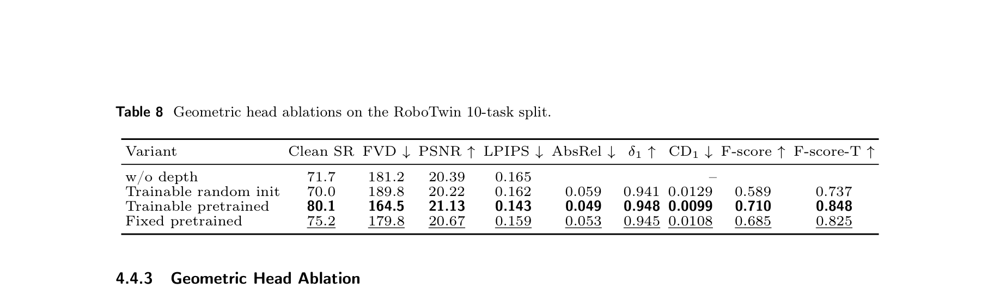
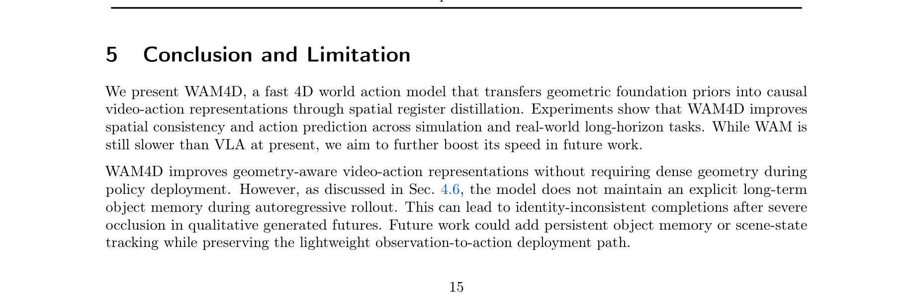

---
tags:
  - papers/embodied-ai
  - papers/world-model
aliases:
  - WAM4D
  - Fast 4D World Action Model
arxiv_id: "2606.14048"
date: 2026-07-08
---

# WAM4D: Fast 4D World Action Model via Spatial Register Tokens

## 核心信息

- 标题: WAM4D: Fast 4D World Action Model via Spatial Register Tokens
- 标题翻译: WAM4D：基于空间寄存器 Token 的快速四维世界动作模型
- 作者: Ying Li, Xiaobao Wei, Jiajun Cao, Hao Wang, Xiaowei Chi, Chengyu Bai, Qianpu Sun, Jiajun Li, Xiaojie Zhang, Peidong Jia, Jian Tang, Sirui Han, Shanghang Zhang
- 机构: Peking University; The Hong Kong University of Science and Technology; Beijing Innovation Center of Humanoid Robotics
- 发表时间: 2026-07-08
- 发表渠道: arXiv preprint
- arXiv: 2606.14048v3
- 论文链接: https://arxiv.org/abs/2606.14048
- 代码 / 项目: https://github.com/myendless1/wam4d
- 数据 / 资源: RoboTwin 2.0；作者重采集的带深度标注示范；AstriBot S1 真实机器人数据
- 论文类型: 世界动作模型与机器人操作方法论文

## 原文摘要翻译

世界动作模型最近在联合建模未来观测与可执行机器人动作方面展现出潜力。然而，多数现有方法仍在二维视频或潜空间中运行，视觉上合理的展开会遗漏精确操作所需的三维空间约束与被遮挡接触几何。几何基础模型可从视觉观测恢复稠密三维结构与运动先验，但强制世界动作模型预测稠密四维表征会带来昂贵的几何解码，并减慢因果动作生成。为解决这一权衡，论文提出 WAM4D：用轻量空间寄存器 token 作为训练时未来深度读出，把预训练几何先验迁移至因果视频—动作 Transformer，再在动作推理时移除寄存器分支。为阻断非因果捷径，论文还为 Mixture-of-Transformers 骨干设计因果混合注意力，规定视频、动作与几何 token 间的模态特定可见性。RoboTwin 2.0 与真实世界操作实验表明，该方法在保持高效推理的同时改善空间一致性，并取得有竞争力的动作预测结果。

## 创新点

1. **把几何从部署输出改成训练读出。** 不是让策略在测试时持续生成稠密 RGB-D 或显式四维场景，而是要求一组空间寄存器从因果历史视频特征解码未来深度。这样，几何损失能够塑造动作使用的历史特征，而几何分支可以在部署时完全删除。
2. **空间寄存器是有明确时空坐标的查询网格。** 它不是一个无结构的全局 token 池，而是把共享可学习网格复制到八个未来深度时刻，并与三视角拼图的 $12\times10$ 空间单元对齐，默认共 960 个 token。
3. **用可见性设计保护因果性。** 未来动作不能读取未来视频噪声或寄存器；寄存器只能读取自身和有效历史视频。因而几何监督进入共享骨干，但辅助 token 不成为动作预测时的捷径。
4. **将“几何更准”与“控制更好”分开验证。** 论文同时报告视频、深度、点云和控制指标，并比较寄存器层位、可见性与几何头初始化，避免只凭深度损失宣称控制收益。

## 一句话总结

WAM4D 的核心不是在部署时显式维护四维世界，而是用训练期可删除的时空对齐寄存器，把 DA3 的未来深度先验蒸馏到因果历史视频特征中，再以纯观测到动作路径执行策略。

## 研究问题

普通 WAM 的未来视频潜变量能学习视觉动力学，却未必保留精确操作所需的物体尺度、遮挡表面、自由空间与接触几何。直接把稠密四维几何变成推理目标虽然更显式，却增加几何解码成本，还可能把训练重点推向重建而非动作生成。

论文因此研究一个更窄但实用的问题：**能否让几何基础模型只在训练时充当读出教师，把空间先验写进因果视频—动作表示，同时让部署接口和动作路径保持轻量？**

这里的“4D”要严格理解：模型可以在保留分析分支时，从单帧开始自回归生成未来 RGB 与深度，并把 RGB-D 反投影为随时间变化的点云；但默认控制部署并不保留持久、显式、稠密的四维场景表示。

## 数据与任务定义

| 场景 | 训练/评估设置 | 数据量 | 评估 |
|---|---|---:|---|
| RoboTwin 2.0 | 完整 50 任务统一策略；简洁与随机化设置 | 每任务 50 条简洁轨迹、500 条随机化轨迹 | 每任务成功率、50 任务平均；视频/深度/点云指标 |
| RoboTwin 消融 | 固定 10 任务子集 | 与各消融共同控制，训练预算 10k 步 | 每设置 100 次简洁与随机化评估任务 |
| AstriBot S1 | 抬盘、放瓶、去笔帽、LEGO 分类 | 每任务 100 示范，共 400 | 每方法每任务 10 次物理 rollout；顺序子动作成功率 |

真实世界和 RoboTwin 的几何监督来自离线 Depth Anything 3 伪深度流程。论文不包含 LIBERO，因此不存在“LIBERO 各 suite 合并还是分开训练”的论文内答案；把任何 LIBERO 结论归给 WAM4D 都越过证据边界。

## 方法主线

### 机制流程

1. **构造因果视频—动作状态。** 语言、多视角历史 RGB 拼图和历史动作组成上下文；未来视频与动作以流匹配噪声状态进入序列，但都是预测目标，而非额外真实未来输入。
2. **从历史视频特征写入寄存器。** 在第 12、14、16、18 层后，空间寄存器以自身为查询，以自身和有效历史视频 token 为键值；RoPE 同时编码目标未来时刻和拼图坐标。
3. **经几何头读出并反向蒸馏。** 四组寄存器特征经线性适配器送入预训练 DA3-GIANT-1.1 DualDPT 头，预测八个未来深度帧；SmoothL1 深度损失反向更新共享骨干、寄存器、深度块、适配器和几何头。
4. **部署时剪除读出。** 推理移除全部寄存器、深度交叉注意力块和几何头，仅编码观测队列、刷新视频/动作 KV cache，并用 10 步动作去噪生成长度 32 的动作块。

### 空间寄存器的定义、形状与生命周期

三视角输入由 $256\times320$ 主视角和两个 $128\times160$ 腕部视角拼成。Wan2.2 VAE 的空间步幅为 16，Transformer 又按 $2\times2$ 潜变量分组，所以一个寄存器对应输入中的 $32\times32$ 单元。主视角对应 $8\times10$，两个腕部视角各对应 $4\times5$，合成每个未来帧 $12\times10=120$ 个寄存器；八个未来深度时刻共 960 个。

初始化源是共享的可学习网格 $R^\star$，不是从图像特征直接池化而来。训练样本中，它沿未来时刻复制：

$$
R_t^0=\operatorname{Repeat}_{\tau\in T_t}(R^\star).
$$

写入发生在四个 DepthBlock：寄存器既做自注意力，也交叉读取历史视频；更新后的四层特征被线性映射至几何头输入空间。读出是未来深度序列。部署时这整个 token 生命周期不存在，不会跨动作块缓存寄存器，也不会把寄存器写回主策略 KV cache。

### 注意力路由与因果边界

| 查询组 | 允许读取 |
|---|---|
| 未来动作噪声 | 历史视频、历史动作、未来动作噪声 |
| 空间寄存器 | 空间寄存器、历史视频 |
| 未来视频噪声 | 历史视频、未来视频噪声 |
| 历史视频 | 历史视频 |
| 历史动作 | 历史动作 |

文本通过交叉注意力对视频与动作可见。关键是未来动作看不到未来视频与寄存器；因此论文所谓“联合视频—动作建模”并不意味着动作在同一步读取已知未来视觉。多相机之间并非各自独立建模，而是先铺成一张 RGB 拼图，再由寄存器的拼图坐标维持视角内空间对应；图 5 显示一些物体寄存器跨视角关注同一对象，但这是相关性可视化，不是跨视角几何一致性的因果证明。

### 目标函数与可训练模块

主分支采用基础因果 WAM 的条件流匹配视频损失与动作损失；几何分支为有效深度像素上的 SmoothL1：

$$
\mathcal L=\mathcal L_{video}+\lambda_{act}\mathcal L_{action}+\lambda_{depth}\mathcal L_{depth},
\qquad \lambda_{act}=\lambda_{depth}=1.
$$

论文明确深度损失更新视频—动作骨干、空间寄存器、深度块、投影层和几何头。默认最终设置中的 DA3 头是**预训练初始化后可训练**，不是冻结教师；固定预训练只是消融设置。视频骨干由预训练 LingBot-VA 初始化，视频 VAE 使用 Wan2.2。论文没有把训练过程描述为冻结 VAE 与否的完整参数清单，因此复现时需要代码确认 VAE 的优化器参与状态，不能从“uses Wan2.2 video VAE”推断其一定训练或冻结。

### 推理与缓存

部署循环维护观测队列和已执行动作历史。观测由 VAE 编成上下文潜变量，并替换 KV cache 的视频部分；动作历史编码后填入动作 cache；未来动作 token 经 10 步去噪生成动作块。执行期间每四个动作采集一次新观测并入队。

默认推理不进行未来视频或未来深度解码，也不使用五步视频去噪。表 1 中“适用模型使用五个视频去噪步”是统一比较协议的一部分，而表 9 明确 WAM4D 模式只有 10 个动作去噪步。未来 RGB-D rollout 是可选定性分析路径，不应和默认策略部署混为一谈。

## 关键结果

### 主结果与强基线

| 方法 | Clean | Randomized | 平均 | 时延/块 | 峰值显存 |
|---|---:|---:|---:|---:|---:|
| $\pi_{0.5}$ | 82.7 | 76.8 | 79.8 | 72.03 ms | 8.45 GiB |
| Motus | 88.7 | 87.0 | 87.9 | 1516.30 ms | 11.55 GiB |
| LingBot-VA | 92.9 | 91.6 | **92.3** | 843.57 ms | 12.97 GiB |
| Fast-WAM | 91.9 | **91.8** | 91.8 | **425.53 ms** | 11.55 GiB |
| WAM4D | **93.8** | 89.9 | 91.8 | 525.43 ms | **9.71 GiB** |

这张表不能解读成 WAM4D 全面击败强基线：它在 Clean 最好，但 Randomized 低于 LingBot-VA 和 Fast-WAM；平均 91.8 与 Fast-WAM 持平、低于 LingBot-VA 的 92.3。它相对 LingBot-VA 的直接优势是时延约降低 37.7%、峰值显存降低约 25.1%，同时平均成功率低 0.5 点。相对 Fast-WAM，成功率持平但时延高约 23.5%，显存低约 15.9%。论文没有报告 FLOPs，因此不能把时延/显存差异改写成 FLOPs 改进。

真实机器人上，WAM4D 子动作平均成功率为 0.90，高于 LingBot-VA 0.84、Fast-WAM 0.80 和 $\pi_{0.5}$ 0.74。优势主要出现在长时程 LEGO：三阶段为 1.0/0.9/0.8；但抬盘和放瓶首阶段并非最好。每任务只有 10 次物理 rollout，离散成功率的方差与置信区间未报告，因此应把 0.06–0.16 的均值差视为有支持但样本较小的结果。

### 逐任务异质性

50 任务平均掩盖明显差异。WAM4D 在 `Blocks Ranking Size` 的 Hard 为 84，低于 Fast-WAM 98 和 LingBot-VA 96；`Open Laptop` Hard 为 66，而 Fast-WAM 为 100；`Put Object Cabinet` Hard 为 53，而 Fast-WAM 为 89。相反，WAM4D 在 `Handover Block` Hard 为 93，明显高于 Fast-WAM 81 和 LingBot-VA 78；`Hanging Mug` 为 57，也高于 LingBot-VA 28。证据更支持“不同任务族存在收益与退化并存”，而不是几何监督普遍提高随机化泛化。

### 消融到底说明了什么

| 设置 | Clean SR | FVD ↓ | AbsRel ↓ | F-score ↑ | F-score-T ↑ |
|---|---:|---:|---:|---:|---:|
| 无深度 | 71.7 | 181.2 | – | – | – |
| 浅层寄存器 | 72.5 | **168.8** | 0.058 | 0.613 | 0.784 |
| 中层寄存器 | 75.2 | 179.8 | **0.053** | **0.685** | **0.825** |
| 深层寄存器 | 74.5 | 171.5 | 0.064 | 0.621 | 0.776 |
| 均匀寄存器 | 70.6 | 175.3 | 0.058 | 0.652 | 0.824 |
| 双向寄存器 | **76.6** | 175.3 | 0.074 | 0.579 | 0.769 |

中层单向寄存器并非控制成功率最高，双向设置高 1.4 点；作者选择中层单向，是因为它几何质量更好、推理可删除、结构更简单。浅层设置的 RGB 指标最好，提示视觉生成质量、几何质量和控制并非单调一致。因而合理结论是存在层位与目标间权衡，而不是“越准确的深度一定带来越高控制成功率”。

几何头消融更强地支持“预训练先验重要”：可训练预训练头的 Clean SR 80.1、AbsRel 0.049、F-score-T 0.848；随机初始化分别为 70.0、0.059、0.737。不过这仍是单个十任务、10k 步消融，且预训练后可训练设置同时改变初始化与优化轨迹，不能严格拆分“知识迁移”与更有利优化的贡献。

## 深度分析

### 真正贡献是什么

真正贡献是一个**可删除的几何监督接口**，而非新的四维场景表示。空间寄存器把几何头所需的时空结构外置为查询，主骨干只需让历史视频特征变得可被这些查询读出。因果掩码进一步确保动作不依赖辅助 token，因此训练—部署切换有明确结构保证，而不是事后剪枝。

工程组合也很明显：LingBot-VA 因果骨干、Wan2.2 VAE、DA3 DualDPT 头、流匹配动作去噪都来自已有组件。创新主要落在这些组件间的信息路由、时空网格设计和训练/推理解耦。

### 已证实、相关与解释

- **论文直接证实：** 默认部署删除几何路径；完整 50 任务平均成功率 91.8；真实机器人子动作平均 0.90；单 A800 上 525.43 ms/动作块、9.71 GiB；中层寄存器与预训练可训练 DA3 在选定几何指标上最好。
- **观察到的相关性：** 图 5 中物体、背景和夹爪寄存器呈现语义上合理的注意区域；几何指标较好的若干设置常伴随更好控制，但并不单调。
- **研究者解释：** 深度目标通过寄存器迫使历史视频特征编码动作相关空间结构；中层兼顾抽象程度与视觉保真；随机 DA3 较差说明预训练先验有用。这些解释合理且受消融支持，但注意力图与任务相关性都不是机制因果证明。

### 与邻近 WAM 的关系：跨论文综合

以下仅是基于 WAM4D 文本中的定位，不导入其他论文未在本文出现的细节：

- **Fast-WAM：** 本文将其作为“测试时只做动作生成”的高效基线。WAM4D 同样避免默认未来视频解码，但增加训练期未来深度读出。结果上两者 RoboTwin 平均同为 91.8，WAM4D 显存更低但时延更高。
- **Light-WAM、ImageWAM、MemoryWAM：** WAM4D 正文没有提供这些名称对应方法的机制或直接实验。不能据此声称 WAM4D 使用图像编辑、轻量世界分支或记忆模块。尤其本文明确没有显式长期记忆，图 7 正是这一缺口的失败案例。

### 速度与公平分母

计算表的硬证据只包括时延与峰值显存，没有 FLOPs、吞吐或端到端控制频率。硬件为单张 A800 80GB。动作统一 10 步去噪；Motus 与 LingBot-VA 还使用 5 步视频去噪，Fast-WAM 与 WAM4D 表 9 均只列 10 步动作。这个协议对“默认推理成本”有意义，但不同模型的动作块维度、缓存实现、内核和代码优化程度未被完全展开，因此不能把时延差简单归因于空间寄存器。

### 复现要求与证据边界

复现至少需要：LingBot-VA base 初始化、Wan2.2 VAE、DA3-GIANT-1.1 any-view DualDPT、三视角拼图与相机标定、RoboTwin 重采集深度示范、AstriBot S1 数据/控制栈、q01/q99 动作统计、50k/10k 训练配置、深度与点云评估脚本，以及部署 KV-cache 更新逻辑。

论文打印了 GitHub 地址，这是“项目声称可用”的证据，但本笔记未联网检查权重、数据和脚本是否齐全。训练超参数给出 AdamW、$2\times10^{-5}\sqrt N$、10 步 warmup、梯度裁剪 2.0、bf16；batch size、机器/GPU 数、训练时长、VAE 是否冻结等仍需代码确认。

## 局限

1. “4D”容易被过度解读。默认策略不显式生成或维护四维场景，四维 rollout 是保留深度分支后的分析模式。
2. 完整 50 任务结果并未统一胜过 LingBot-VA；随机化平均还低于两条 WAM 基线，任务间退化明显。
3. 真实机器人每任务仅 10 次 rollout，未报告统计区间；四项任务都在同一 AstriBot S1 平台，不能外推到更广 embodiment。
4. 深度来自 DA3 伪标签，论文没有隔离伪标签系统误差、相机内参误差与真实度量深度之间的影响。
5. 长自回归没有显式物体记忆，严重遮挡后会发生身份漂移。作者认为持续真实观测使控制评估不受影响，但没有专门的遮挡控制实验验证该边界。
6. 没有 FLOPs、训练总成本和不同硬件结果；“fast”主要由单卡时延和删除几何路径支撑。

## 我的笔记

这篇工作的可复用思想是：如果某个昂贵基础模型的能力只需要成为主模型的表示偏置，不必让它成为部署图的一部分，可以设计一个**只能读因果主干、不能被决策头读取**的训练读出。空间寄存器同时解决了三件事：给稠密目标提供固定数量查询、绑定时空坐标、用掩码隔离辅助路径。

后续值得验证的不是再堆一个几何指标，而是做更直接的机制实验：遮挡接触任务上的历史特征线性探针；用真实传感器深度替换 DA3 伪标签；控制相同参数量的非几何辅助头；在动作难例上比较寄存器注意与失败模式；以及让持久对象 token 只服务于可选 rollout、仍不进入动作捷径。

## 引用

Li, Y., Wei, X., Cao, J., et al. *WAM4D: Fast 4D World Action Model via Spatial Register Tokens*. arXiv:2606.14048v3 (2026). Code: https://github.com/myendless1/wam4d
