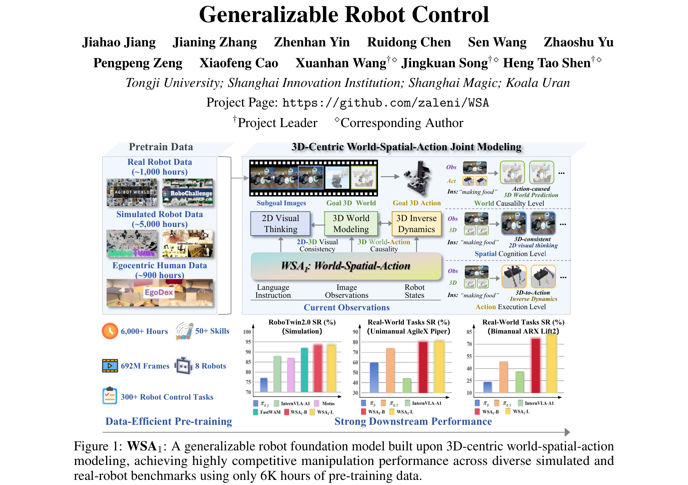
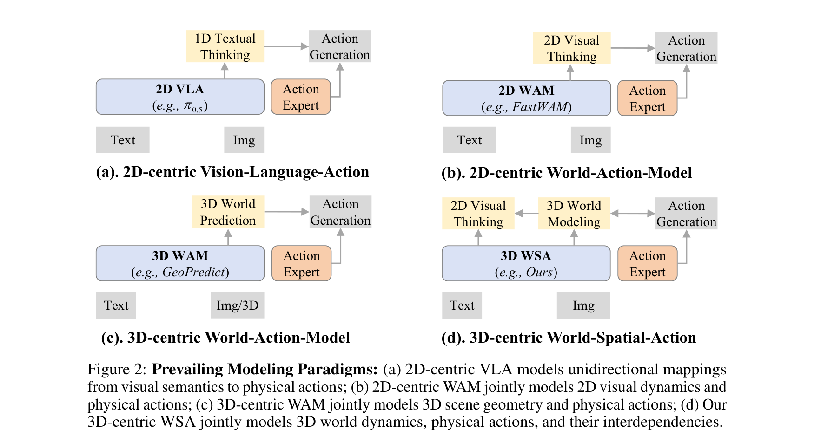
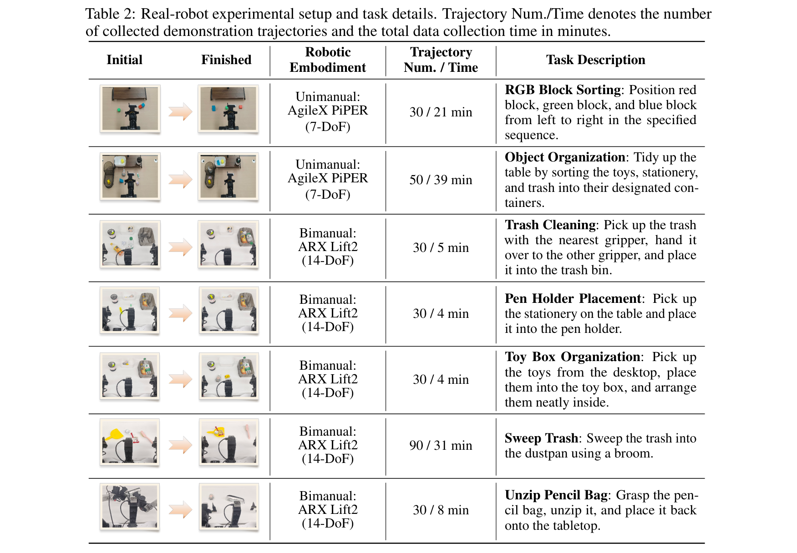
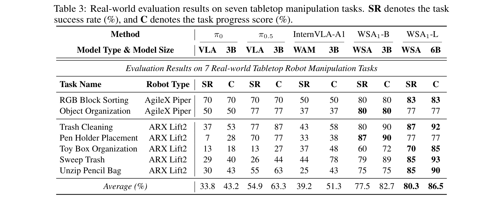
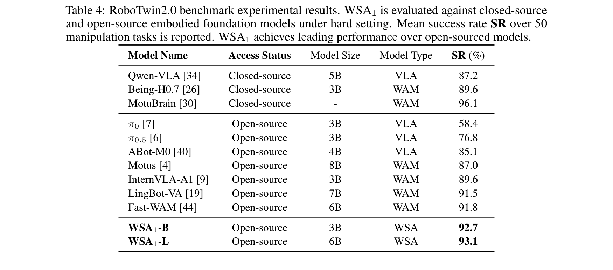
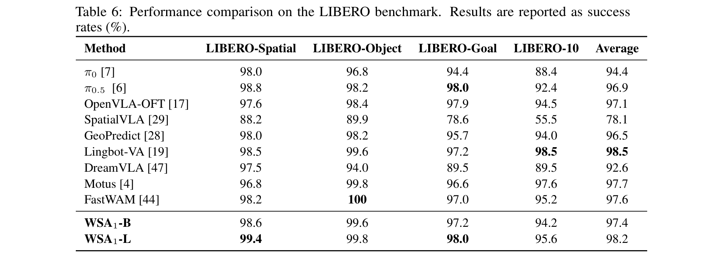
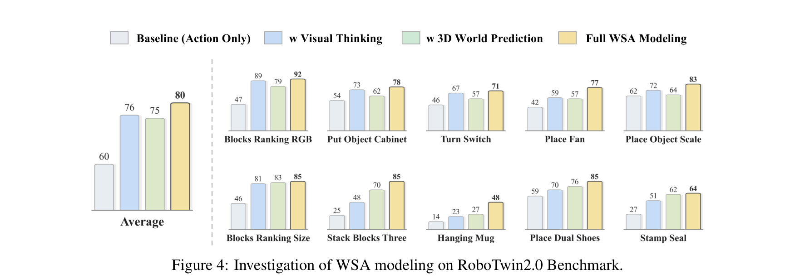

# WSA1: a 3D-Centric World-Spatial-Action Model for Generalizable Robot Control

**Authors:** Jiahao Jiang 1, Jianing Zhang 1, Zhenhan Yin 1, Ruidong Chen 1, Sen Wang 1, Zhaoshu Yu 1, Pengpeng Zeng 1, Xiaofeng Cao 1, Xuanhan Wang†⋄ 1, Jingkuan Song†⋄ 1, Heng Tao Shen†⋄ 1 (1Tongji University; Shanghai Innovation Institution; Shanghai Magic; Koala Uran; †Project Leader; ⋄Corresponding Author)  
**Source:** local PDF, SHA256 `c2ec0cc9dbd42b44d037f545b42ae1c8fc314e41204e2f425dcd5ff84384142e`, arXiv:2607.03941v1 [cs.RO] 4 Jul 2026  
**Project Page:** https://github.com/zaleni/WSA  
**Reader:** complete bilingual reader; references remain English-only for searchable bibliographic fidelity.

## Section Index
Abstract; 1. Introduction; 2. Related Work (2.1. Vision-Language-Action, 2.2. World-Action-Model, 2.3. 3D-Aware Robot Policy); 3. Methodology (3.1. Problem Formulation & Overview, 3.2. 3D-Centric World-Spatial-Action Modeling, 3.3. World-Spatial-Action Joint Modeling, 3.4. Pre-training Data Recipe); 4. Experiments (4.1. Experimental Setup, 4.2. Main Results on Real-World Tasks, 4.3. Main Results on Simulation Benchmark, 4.4. Ablation Study, 4.5. Qualitative Analysis); 5. Conclusion; References.

## Terminology Ledger
| English | 中文 |
| --- | --- |
| Robot Foundation Models (RFMs) | 机器人基座模型（具身多模态大模型策略） |
| World-Spatial-Action (WSA) Modeling | 世界—空间—动作一体化联合建模（WSA 范式） |
| WSA1 | 3D 中心化世界—空间—动作基座模型（WSA1） |
| 3D-Centric Modeling | 3D 中心化建模（以三维几何与动力学为核心表征） |
| 2D Visual Thinking | 2D 视觉前瞻思考（生成 2D 子目标图像潜特征） |
| Action-Conditioned 3D World Modeling | 动作条件化 3D 世界建模（预测动作诱导的环境 3D 演化） |
| 3D Inverse Dynamics Modeling (3D IDM) | 3D 逆动力学建模（从 3D 几何演变解码控制动作） |
| 2D-SE (2D Spatial Expert) | 2D 空间专家（用于 2D 视觉预演的 Transformer 模块） |
| 3D-SE (3D Spatial Expert) | 3D 空间专家（用于 3D 场景潜变量预测的 Transformer 模块） |
| 3D-AE (3D Action Expert) | 3D 动作专家（基于流匹配去噪扩散的动作块生成器） |
| 3D-Centric Causal Attention | 3D 中心化因果注意力机制（双向世界—动作互锁掩码） |
| Multi-sourced Data Pyramid | 多源具身数据金字塔（人类视频 + 仿真示教 + 真机数据） |
| Continuous Action Chunks | 连续动作块（多步时序动作预测与执行机制） |

## Abstract

> <strong>Para. 1:</strong> Recent advances in embodied AI have established robot foundation models (RFMs) as the dominant approach for generalist robotic systems to date. By leveraging imitation learning on extensive robot demonstrations, RFMs have achieved impressive capabilities in mapping visual observations and language instructions to continuous robotic actions. However, current RFMs lack an inherent ability to reason about physical dynamics and the causal effects of robot behaviors on the 3D physical world. This creates a fundamental mismatch between 2D-centric visual perception and 3D-centric embodied interaction, severely limiting the generalization ability of RFMs in real-world tasks. To address this gap, we present WSA1, a novel RFM built upon proposed 3D-Centric World-Spatial-Action modeling paradigm. It not only learns 3D world-aware visual thought for future robot behaviors, but also models mutual constraints between 3D world state transitions and robotic actions to enhance behavior generalization. Notably, WSA1 achieves highly data-efficient pre-training with 6k hours of expert demonstration data (only 1k hours from real robot), while delivering competitive manipulation performance (93% success rate) on RoboTwin2.0 simulation benchmark and achieving +20% average boosted performance over state-of-the-art RFMs on real-world robot control tasks. These results reveal that generalizable RFM can be attained without large-scale real robot data when paired with 3D-centric world-action joint modeling, which offers a practical and affordable pathway to generalist robotic systems.

> <strong>Para. 1[CN]:</strong> 具身人工智能（Embodied AI）的最新突破已经确立了机器人基座模型（Robot Foundation Models, RFMs）作为构建通用机器人系统的核心主流路径。通过在大规模机器人示教轨迹上进行模仿学习，RFMs 展现出了将多模态视觉观测与自然语言指令直接映射为连续机器人控制动作的非凡能力。然而，现有的机器人基座模型内在缺乏对物理环境动力学以及机器人行为在 3D 物理世界中所产生的因果影响进行严密推理的能力。这导致了以 2D 为中心的视觉感知与以 3D 为核心的具身物理交互之间存在着根本性的结构错配，严重制约了 RFMs 在真实世界复杂任务中的泛化能力。为了弥补这一关键鸿沟，我们提出了 WSA1——一种建立在全新的“3D 中心化世界—空间—动作（3D-Centric World-Spatial-Action, WSA）”联合建模范式基础上的新型机器人基座模型。它不仅能够针对机器人未来的执行行为学习具备 3D 世界感知能力的视觉思维预演，而且显式建模了 3D 物理世界状态跃迁与机器人动作之间的双向因果约束，从而显著增强了行为的跨场景泛化性。值得注意的是，WSA1 实现了极高的数据利用效率：仅需 6,000 小时的专家示教数据预训练（其中仅包含 1,000 小时真实机器人数据），即可在极具挑战性的 RoboTwin2.0 双臂仿真基准上斩获 93% 的高成功率，并在真实实体机器人操作任务上相较于现有最先进的 RFMs 实现了平均 +20% 的性能飞跃。这些结果表明：通过将 3D 中心化的世界—动作联合建模机制相融合，无需依赖超大规模真机数据即可实现高度泛化的机器人基座模型，为通往实用且高性价比的通用机器人系统开辟了一条极具前景的落地路径。

**Caption:** Figure 1: WSA1: A generalizable robot foundation model built upon 3D-centric world-spatial-action modeling, achieving highly competitive manipulation performance across diverse simulated and real-robot benchmarks using only 6K hours of pre-training data.  
**Caption[CN]:** 图 1：WSA1 整体定位全景图。建立在 3D 中心化世界—空间—动作（WSA）联合建模范式之上的通用机器人基座模型，仅需 6,000 小时预训练示教数据，即可在多样化的物理仿真与实体双臂真机基准上取得极具竞争力的操控表现。

## 1. Introduction

> <strong>Para. 2:</strong> Creating versatile robots to match or exceed human-level physical intelligence has long been a pursuit in embodied AI. Cognitive science and neuroscience research reveals that human physical intelligence relies critically on our innate ability to construct and maintain an internal model of the world (Wolpert & Ghahramani, 2000). This mental model enables us to parse the 3D structure of our surroundings, imagine how our actions will causally alter the world state, and plan and execute dexterous motor actions accordingly (Flanagan et al., 2006). In short, humans achieve flexible physical interaction through the co-modeling of world, space, and action in a unified 3D representation. This 3D-centric capability of world-spatial-action co-modeling is equally vital for generalist robots, given that all physical interactions in the real world inherently unfold in 3D space and obey fundamental physical laws (Gibson, 1979; Haxby et al., 2000). Thus, developing a robot foundation model that can capture essential relationships between 3D world evolution and robot behaviors, is the critical breakthrough needed to unlock the full potential of embodied AI.

> <strong>Para. 2[CN]:</strong> 打造能够匹敌甚至超越人类物理智能水平的通用具身机器人，一直是具身人工智能领域孜孜以求的终极目标。认知科学与神经科学的经典研究表明，人类卓越的物理交互智能从根本上依赖于大脑构建并实时维护一套物理世界的“内部模型（Internal Model）”（Wolpert & Ghahramani, 2000）。这种心智模型使我们能够敏锐解析周遭环境的 3D 几何结构，预先在大脑中推演自身动作将如何因果性地改变客观世界状态，并据此规划并执行精细灵巧的肌肉运动控制（Flanagan 等，2006）。简而言之，人类正是通过在统一的 3D 表征中协同建模“世界、空间与动作”，才实现了极其灵活自如的物理交互。这种以 3D 为核心的“世界—空间—动作”协同建模能力对于通用机器人同样至关重要，因为真实物理世界中的所有实体交互本质上都在三维空间中展开，并受到基础物理定律的严格支配（Gibson, 1979；Haxby 等，2000）。因此，构建一个能够深刻捕捉 3D 世界动态演化与机器人行为之间内在因果关联的机器人基座模型，正是彻底释放具身智能潜能所需跨越的关键里程碑。

> <strong>Para. 3:</strong> In recent years, multi-modal large models (Achiam et al., 2023; Bai et al., 2025; Wang et al., 2025) have achieved remarkable progress and, meanwhile, demonstrated a promising technical roadmap toward beyond human-level intelligence through training on web-scale data. Following this direction, modern robot foundation models have gradually evolved into two typical paradigms: Vision-Language-Action (VLA) models (Liu et al., 2024; Zitkovich et al., 2023; Wen et al., 2025; Shukor et al., 2025; Black et al., 2024; 2025; Kim et al., 2024; Zhao et al., 2025) and World Action Models (WAM) (Bi et al., 2025; Pertsch et al., 2025; Chen et al., 2025; Lin et al., 2025; Yuan et al., 2026; Wang et al., 2026; Kim et al., 2026). VLA models construct semantic-centric robotic policies by augmenting pre-trained vision-language models (VLMs) with a lightweight action expert. This design allows VLAs to inherit powerful open-world visual understanding capabilities from pre-trained VLMs, while the appended action expert generates robot actions conditioned on semantic-level visual comprehension, following an "understand-then-execute" paradigm. In contrast, WAM learns imagination-centric robot policies based on a predictive video generation model that acts as a vision planner. Based on this "imagine-then-execute" paradigm, its action expert functions as an inverse dynamics model, which generates robotic control signals corresponding to the planned visual frames.

> <strong>Para. 3[CN]:</strong> 近年来，多模态大模型（Achiam 等，2023；Bai 等，2025；Wang 等，2025）取得了举世瞩目的突飞猛进，并在海量互联网数据的预训练中展现出迈向超人类智能的可行技术路径。沿着这一技术脉络，现代机器人基座模型逐渐分化演进为两大代表性技术范式：视觉—语言—动作（Vision-Language-Action, VLA）模型（Liu 等，2024；Zitkovich 等，2023；Wen 等，2025；Shukor 等，2025；Black 等，2024；2025；Kim 等，2024；Zhao 等，2025）以及世界动作模型（World Action Models, WAM）（Bi 等，2025；Pertsch 等，2025；Chen 等，2025；Lin 等，2025；Yuan 等，2026；Wang 等，2026；Kim 等，2026）。VLA 模型通过为预训练视觉—语言大模型（VLM）嫁接轻量级动作专家来构建以语义为中心的具身控制策略。这种架构使 VLA 能够继承预训练大模型强大的开放世界常识理解能力，附加的动作专家则在语义级视觉特征的指导下输出控制信号，遵循“先理解、后执行（Understand-then-Execute）”的工作流。与之不同，WAM 基于能够预测未来视频演变的生成模型构建了以想象为中心的具身策略，使其充当高层视觉规划器；在这一“先想象、后执行（Imagine-then-Execute）”范式下，其动作专家作为逆动力学模型运行，生成与规划视觉帧相匹配的电机控制动作。

> <strong>Para. 4:</strong> Despite the impressive progress of current VLAs and WAMs, two fundamental challenges still impede their generalization to real-world scenarios. First, from a model paradigm perspective, both VLAs and WAMs lack an explicit mechanism for jointly modeling the 3D world dynamics and mutual constraints between robot actions and world changes. The absence of explicit 3D world-action mutual constraints renders them unreliable in real-world tasks that require 3D spatial cognition and robust adaptation to environmental changes. Second, in terms of model training, the major optimization strategy for robot foundation models is the imitation learning, which heavily depends on large-scale real-world expert demonstration data. Acquiring such data at scale is prohibitively expensive and labor-intensive (Bjorck et al., 2026). This data scarcity further prevents models from learning the generalizable physical commonsense behind demonstrations, which is essential for developing generalist robots that can adapt to unseen scenarios (Bjorck et al., 2026; Bi et al., 2025). These challenges motivate us to study a significant question: How can we construct a data-efficient modeling paradigm that enables robots to jointly model interdependencies between 3D world evolution and physical behaviors from demonstrations, thereby overcoming the generalization bottleneck of naive imitation via learned transferable world-action priors?

> <strong>Para. 4[CN]:</strong> 尽管现有 VLA 和 WAM 取得了令人瞩目的进展，但两大根本性瓶颈依然严重制约着它们向真实物理场景的有效泛化：首先，在**模型范式层面**，现有的 VLA 和 WAM 均缺乏对 3D 物理世界动力学以及机器人动作与环境演变之间双向约束的显式联合建模机制。由于缺乏显式的 3D 世界—动作相互制约，导致它们在需要精确 3D 空间认知以及环境动态自适应的真实任务中表现出严重的不稳定性；其次，在**模型训练层面**，机器人基座模型普遍采用模仿学习作为核心优化目标，这极度依赖于海量的真实世界专家示教轨迹。然而，大规模采集真机示教数据极其昂贵且费时耗力（Bjorck 等，2026）。这种物理数据的天然稀缺性，进一步阻碍了模型从示教中归纳出具有跨场景泛化能力的物理常识，而这种物理常识恰恰是通用机器人应对未见陌生环境的核心基石（Bjorck 等，2026；Bi 等，2025）。这引发了我们对一个重大核心科学问题的深入探索：**我们究竟该如何构建一种具备极高数据利用效率的具身建模新范式，使机器人能够从示教轨迹中联合学习 3D 物理世界演化与控制动作之间的内在依存关系，进而通过习得可迁移的世界—动作物理先验，彻底打破传统朴素行为克隆的泛化瓶颈？**

> <strong>Para. 5:</strong> In this work, we present WSA1, a novel robot foundation model built on 3D-centric World-Spatial-Action joint modeling paradigm. As illustrated in Figure 3, the WSA breaks the inherent limitations of prevailing paradigms via unification of three learning tasks. First, at the world causality level, it explicitly models action-caused 3D world prediction, endowing a robot with the ability to capture the causal consequence of robot behaviors on 3D world. Second, at the spatial cognition level, it enables 3D-consistent 2D visual thinking, which empowers a robot to dynamically adjust visual plan as the 3D world changes. Third, at the action execution level, it learns a 3D inverse dynamics model that maps the planned 3D world state transitions to executable robot actions, fully closing the loop between 3D spatial world modeling and real-world interaction. This integrated closed-loop design allows a robot to not only generate goal-directed actions, but also predict causal consequences of its actions on 3D world and dynamically adjust its behavior accordingly. In summary, our main contributions are three-fold:  
> • **A 3D-Centric World-Spatial-Action Modeling Paradigm.** We propose WSA, a novel robot learning paradigm that unifies three complementary learning objectives within a single shared latent space: predictive 3D world modeling, 3D-consistent 2D visual thinking, and 3D inverse dynamics. By incorporating world-action mutual constraints, WSA addresses the generalization limitations of prevailing VLA and WAM paradigms.  
> • **A Generalizable Robot Foundation Model.** We instantiate the WSA paradigm with two model scales, WSA1-B (3B) and WSA1-L (6B). Both are built on a Mixture-of-Transformers architecture with three complementary experts. A bidirectional attention mechanism is proposed to enforce world-action consistency and enable joint learning across all three objectives in a unified framework.  
> • **Data-Efficient Generalization with Empirical Validation.** Pre-trained on only 6,000 hours of heterogeneous demonstration data (including just 1,000 hours of real-robot data), WSA1 models achieve state-of-the-art performance among open-source models on RoboTwin2.0 (93% SR) and deliver an average +20% improvement over baselines across real-world manipulation tasks, demonstrating that 3D-centric world-spatial-action joint modeling enables data-efficient learning of generalizable manipulation skills.

> <strong>Para. 5[CN]:</strong> 为此，我们提出了 **WSA1**——一种建立在“3D 中心化世界—空间—动作联合建模”新范式上的通用机器人基座模型。如图 3 所示，WSA 框架通过在统一潜空间中紧密缝合三项互补的学习任务，打破了传统主流范式的内在桎梏：第一，在**世界因果层（World Causality Level）**，它显式建模了动作所诱导的 3D 世界演化预测，赋予机器人预见自身动作将对外部 3D 物理环境造成何种因果后果的能力；第二，在**空间认知层（Spatial Cognition Level）**，它引入了与 3D 保持空间几何一致的 2D 视觉前瞻思考，使机器人能够随着 3D 物理环境的变化动态微调视觉预演方案；第三，在**动作执行层（Action Execution Level）**，它训练了一套 3D 逆动力学模型，将规划出的 3D 世界状态跃迁精准解码为可执行的底层电机控制动作，彻底实现了 3D 空间世界建模与物理世界交互的闭环互锁。这种一体化闭环结构使得机器人不仅能生成面向目标的连续动作，更能预知行为造成的环境物理演变并实施自适应校准。本文核心贡献总结如下：  
> • **3D 中心化世界—空间—动作（WSA）建模新范式：** 提出了 WSA 具身控制新范式，在统一的共享潜空间中融合了前瞻性 3D 世界建模、3D 一致的 2D 视觉思维以及 3D 逆动力学解码三大互补目标，通过引入世界—动作双向约束，彻底化解了现有 VLA 与 WAM 的泛化困局；  
> • **高度通用的机器人基座模型架构：** 实现了两种不同参数规模的基座模型：WSA1-B（3B 参数）与 WSA1-L（6B 参数）。二者均基于混合 Transformer（MoT）架构，包含三个高度协同的专家模块，并引入 3D 因果双向注意力掩码矩阵，强制对齐世界与动作的物理一致性；  
> • **卓越的数据效率与软硬件真机实测验证：** 仅利用 6,000 小时多源异构示教数据预训练（其中仅包含 1,000 小时真机数据），WSA1 便在权威的 RoboTwin2.0 双臂仿真基准上刷新了开源模型的最佳成绩（93% 成功率），并在 7 种真实的机械臂物理任务中实现了相较强基线平均 +20% 的性能飞跃，证实了 3D 联合建模能够在极度节省真机示教的前提下泛化学习通用操作技能。

**Caption:** Figure 2: Prevailing Modeling Paradigms: (a) 2D-centric VLA models unidirectional mappings from visual semantics to physical actions; (b) 2D-centric WAM jointly models 2D visual dynamics and physical actions; (c) 3D-centric WAM jointly models 3D scene geometry and physical actions; (d) Our 3D-centric WSA jointly models 3D world dynamics, physical actions, and their interdependencies.  
**Caption[CN]:** 图 2：具身基座模型主流范式对比。(a) 2D 视角的 VLA 模型：构建从视觉语义到物理动作的单向开环映射；(b) 2D 视角的 WAM 模型：联合建模 2D 视觉动态演化与底层物理动作；(c) 3D 视角的 WAM 模型：联合建模 3D 场景点云几何与物理动作；(d) 本文提出的 3D 中心化 WSA 模型：在统一共享潜空间中，深度联合建模 3D 物理世界动力学、2D 视觉前瞻思维以及多模态物理动作及其内在的双向因果依存关系。

## 2. Related Work

> <strong>Para. 6:</strong> The core goal of robot foundation models (RFMs) is to establish a robust, stable multi-modal mapping from robot observations and task instructions to executable robot actions (Yang et al., 2024; Wang et al., 2024). As illustrated in Figure 2, mainstream research on RFMs has converged into two dominant paradigms: Vision-Language-Action models (VLAs) and World-Action-Models (WAMs). In the following sections, we provide a systematic literature review of these two research directions.

> <strong>Para. 6[CN]:</strong> 机器人基座模型（RFMs）的核心目标在于建立从多视角视觉观测与自然语言任务指令到可执行底层电机控制动作的鲁棒、自适应多模态映射（Yang 等，2024；Wang 等，2024）。如图 2 所示，当前关于 RFMs 的前沿探索主要汇聚于两大支柱技术范式：视觉—语言—动作模型（VLAs）与世界动作模型（WAMs）。在接下来的小节中，我们将对这两大技术流派以及 3D 感知策略展开系统的文献综述。

> <strong>Para. 7:</strong> **Vision-Language-Action:** As the most widely adopted paradigm for robot manipulation, VLA models (Wen et al., 2025; Black et al., 2024; 2025; Wang et al., 2025; Zhao et al., 2025) are generally built on pretrained vision-language models. By inheriting rich semantic priors from VLMs (Achiam et al., 2023; Bai et al., 2025), they successfully transfer open-world visual-semantic knowledge to the physical robot domain via end-to-end fine-tuning on robot demonstration data. Early representative works such as RT-2 (Zitkovich et al., 2023) and OpenVLA (Kim et al., 2024) adopt an autoregressive strategy, which discretizes continuous robot actions and formulates policy learning as a sequence modeling task. To address the limitation of discrete tokenization in fine-grained continuous control, recent state-of-the-art works (Black et al., 2024; 2025; Bjorck et al., 2026) have shifted to generative frameworks based on conditional flow matching, which directly model the continuous-valued action, significantly improving the precision and stability of robot control. In addition, several works (Zhen et al., 2024; Qu et al., 2025) augment VLA with 3D geometry priors by incorporating extra 3D information such as depth or 3D gaussian splatting, demonstrating the effectiveness of 3D representation in robot learning. However, mainstream VLA policies are essentially reactive frameworks that make decisions based only on current observations, lacking predictive planning and 3D causal reasoning capabilities, which makes them unreliable in robot manipulation tasks that require 3D dynamics modeling.

> <strong>Para. 7[CN]:</strong> **视觉—语言—动作（VLA）模型流派：** 作为机器人操作领域应用最广泛的范式，VLA 模型（Wen 等，2025；Black 等，2024；2025；Wang 等，2025；Zhao 等，2025）通常建立在预训练视觉—语言大模型之上。通过继承 VLM 蕴含的通用语义先验（Achiam 等，2023；Bai 等，2025），它们利用机器人的行为示教数据进行端到端微调，成功将开放世界的图文感知常识迁移至物理控制领域。以 RT-2（Zitkovich 等，2023）与 OpenVLA（Kim 等，2024）为代表的早期经典架构主要采用自回归离散化策略，将连续控制量离散为文本 token 并形式化为时序预测任务。为了攻克离散化在精细连续控制中的精度损失，近期的前沿工作（Black 等，2024；2025；Bjorck 等，2026）转向了基于条件流匹配（Conditional Flow Matching）的连续扩散生成框架，直接拟合高维连续动作空间，显著提升了控制的平滑度与鲁棒性。此外，部分工作（如 3D-VLA；Qu 等，2025）尝试通过输入深度图或 3D 高斯点云（3DGS）为 VLA 注入 3D 几何先验，证实了空间表征的显著增益。然而，主流 VLA 策略在本质上仍属于被动即时反应式（Reactive）架构，仅基于当前即时观测做出开环决策，缺乏前瞻性的物理预测规划与 3D 因果推理能力，在需要微观动力学推演的复杂操控任务中频频受挫。

> <strong>Para. 8:</strong> **World-Action-Model:** In a different line from VLAs, WAMs follow the chain-of-thought philosophy and formulate robot policies as an imagine-then-execute procedure. Guided by this principle, numerous works (Pertsch et al., 2025; Wang et al., 2026; Kim et al., 2026; Yuan et al., 2026; MotuBrain Team, 2026) start with video models, inheriting rich commonsense knowledge from large-scale video generation pre-training. They then use these video models as world dynamics simulators, enhancing the reliability of robot foundation models via co-training on robotic demonstration data. Typical works such as FastWAM (Yuan et al., 2026) and Motus (Bi et al., 2025) predict future visual states or action-conditioned scene evolution, which provides richer learning signals than direct imitation and introduces visual context beyond single-frame control. Although these 2D-centric WAMs model world dynamics, they primarily focus on 2D visual appearance and temporal coherence, failing to capture 3D geometric structures and spatial interactions. Recent attempts (Li et al., 2025; Qu et al., 2025) extend WAMs into the 3D domain by predicting future point clouds or depth maps. However, these 3D-centric WAMs rely on unidirectional mappings that predict 3D scene evolution without explicitly modeling the mutual constraints between 3D world dynamics and robotic actions. In contrast, our WSA paradigm unifies 2D visual thinking, 3D world modeling, and 3D inverse dynamics within a shared latent space, establishing bidirectional constraints between 3D world evolution and physical actions.

> <strong>Para. 8[CN]:</strong> **世界动作模型（WAM）流派：** 与 VLA 沿袭的单向控制路径不同，世界动作模型（WAM）深受“思维链（CoT）”心智哲学的启发，将机器人策略表述为“先想象预演、后物理执行（Imagine-then-Execute）”的闭环过程。在这一理念指引下，诸多研究（Pertsch 等，2025；Wang 等，2026；Kim 等，2026；Yuan 等，2026；MotuBrain Team，2026）以预训练视频生成模型为基座，充分继承了从海量自然视频中习得的物理世界演进常识，并将视频生成器作为环境动力学模拟器，在示教轨迹上进行动作与视频的联合多任务训练。代表性方案如 FastWAM（Yuan 等，2026）与 Motus（Bi 等，2025）通过联合生成未来多帧视觉潜变量与连续动作块，提供了远超传统行为克隆的密集自监督信号。然而，这些以 2D 像素或视频潜变量为核心的 WAM 重点关注画面的外观连续性与时序平滑度，未能显式建模 3D 几何结构与真实空间接触力学。近期一些先锋工作（Li 等，2025；Qu 等，2025）开始尝试预测未来的 3D 点云或深度图，但这些 3D 方案依然局限于“从当前观测单向预测未来 3D 场景”的粗糙设定，未能在 3D 物理演变与机器人的底层动力学动作之间构筑显式的双向互锁与物理约束机制。与此截然不同，本文提出的 WSA 范式在统一的共享潜空间中，深度缝合了 2D 视觉前瞻思考、3D 物理世界建模与 3D 逆动力学动作解码，构筑了世界演化与物理动作之间严密的双向因果闭环。

## 3. Methodology

### 3.1. Problem Formulation & Overview

> <strong>Para. 9:</strong> **Problem Formulation.** Robot foundation models aim to map visual observations and language instructions into continuous robot control actions. Formally, let $v_t \in \mathbb{R}^{H \times W \times 3}$ denote the visual observation from the robot's camera at time step $t$, $s_t \in \mathbb{R}^d$ represent the proprioceptive state of the robot, and $l$ be the task instruction in natural language. The policy aims to predict an action chunk $A_t = \{a_{t+1}, \dots, a_{t+H}\}$, where $a_{t+i} \in \mathbb{R}^D$ denotes the target robot pose and gripper state at time step $t+i$, and $H$ is the action chunk horizon. Given a dataset of expert demonstrations $\mathcal{D}_{\mathrm{dem}}$, it is required to maximize the standard likelihood objective:

$$
\max_\theta \mathbb{E}_{(v_t, s_t, A_t, l) \sim \mathcal{D}_{\mathrm{dem}}} \log \pi_\theta(A_t \mid v_t, s_t, l) \tag{1}
$$

> As illustrated in Figure 2, previous works formulate robot control problem as vision-language-action or world-action modeling. We summarize the differences in their posterior distributions:

> <strong>Para. 9[CN]:</strong> **问题形式化定义：** 机器人基座模型旨在将多模态视觉观测与自然语言任务指令转化为连续的底层电机控制动作。形式化地，令 $v_t \in \mathbb{R}^{H \times W \times 3}$ 表示在时间步 $t$ 时机器人机载相机采集的高清视觉图像，$s_t \in \mathbb{R}^d$ 表示机器人的本体感受状态（包括关节角度与夹爪位姿等），$l$ 表示自然语言任务指令。策略的目标是预测包含未来 $H$ 步的动作块 $A_t = \{a_{t+1}, \dots, a_{t+H}\}$，其中 $a_{t+i} \in \mathbb{R}^D$ 表示在第 $t+i$ 步的目标末端位姿与夹爪开合状态，$H$ 为动作块的预测视界长度。给定专家示教数据集 $\mathcal{D}_{\mathrm{dem}}$，传统模型通过最大化标准对数似然目标（如式 1）进行参数优化。如图 2 所示，现有模型在后验概率分布的形式化表述上存在根本差异。

> <strong>Para. 10:</strong> **2D Vision-Language-Action Policy.** The standard 2D VLA establishes a direct visual-semantic-action unidirectional causality, which is formulated as a posterior distribution:

$$
A_t \sim p(a_{t+1:t+H} \mid v_t, s_t, l) \tag{2}
$$

> **2D World-Action Policy.** The 2D-centric WAM couples predictive visual generation with next action generation, which jointly models future 2D visual dynamics and continuous robot actions within a shared latent space, formulated as a joint prediction distribution:

$$
A_t \sim p(a_{t+1:t+H}, v_{t+1:t+N} \mid v_t, s_t, l) \tag{3}
$$

> **3D World-Action Policy.** Instead of modeling 2D world-action joint distribution, the 3D-centric WAM focuses on the underlying 3D structure of the physical world. Let $g_t$ denote the 3D scene representation (e.g., depth or point cloud) at time step $t$. It learns to predict future 3D world evolution and action sequences for robot control. Formally, this models a joint prediction distribution as follows:

$$
A_t \sim p(a_{t+1:t+H}, g_{t+1:t+K} \mid g_t, v_t, s_t, l) \tag{4}
$$

> **3D World-Spatial-Action Policy.** Different from previous VLA and WAM paradigms that rely on unidirectional mappings, the proposed 3D-centric WSA paradigm establishes bidirectional constraints between 3D world dynamics and physical actions. Specifically, it decomposes the joint distribution of world states, spatial thinking, and robot actions into three mutually conditioned components:

$$
p(g_{t+1:t+K}, v_{t+1:t+N}, a_{t+1:t+H} \mid O_t) = \underbrace{p(g_{t+1:t+K} \mid O_t, A_t)}_{\text{Action-Conditioned 3D World Model}} \cdot \underbrace{p(v_{t+1:t+N} \mid g_{t+1:t+K}, O_t)}_{\text{2D Visual Thinking}} \cdot \underbrace{p(a_{t+1:t+H} \mid g_{t+1:t+K}, O_t)}_{\text{3D Inverse Dynamics}} \tag{5}
$$

> where $O_t = (v_t, g_t, s_t, l)$ denotes the multimodal observation at time step $t$.

> <strong>Para. 10[CN]:</strong> **四大具身策略范式的数学表述对比：**  
> (1) **2D 视觉—语言—动作策略（2D VLA）：** 建立从即时 2D 视觉语义到物理动作的单向因果映射（如式 2），纯粹属于开环反应式控制；  
> (2) **2D 世界—动作策略（2D WAM）：** 将预测性视觉生成与动作解码耦合，在共享潜空间中联合建模未来 $N$ 步的 2D 视觉动态 $v_{t+1:t+N}$ 与 $H$ 步动作块（如式 3），但缺少对 3D 物理空间的显式感知；  
> (3) **3D 世界—动作策略（3D WAM）：** 引入时刻 $t$ 的 3D 场景几何表征 $g_t$（如点云或深度特征），联合预测未来 3D 演化 $g_{t+1:t+K}$ 与连续动作块（如式 4），但依然依赖于单向映射，缺少视觉思维的自适应反馈；  
> (4) **3D 世界—空间—动作策略（3D WSA，本文方案）：** 打破了传统单向因果的局限，在统一的概率图模型中构建了三者之间的双向互锁。给定综合多模态观测 $O_t = (v_t, g_t, s_t, l)$，WSA 将联合概率分布精确因式分解为三大核心要素的连乘（如式 5）：动作条件化的 3D 世界模型、基于 3D 几何的 2D 视觉思维、以及从 3D 目标导向动作的 3D 逆动力学解码。

**Caption:** Figure 3: Overview of WSA1. It adopts a Mixture-of-Transformers structure with three complementary experts: 2D Spatial Expert, 3D Spatial Expert, and 3D Action Expert. The model jointly optimizes 3D world-aware visual thinking, action-caused 3D world modeling, and 3D inverse dynamics within a unified latent space, regulated by 3D-centric causal attention.  
**Caption[CN]:** 图 3：WSA1 系统总体架构图。模型采用混合 Transformer（MoT）结构，由三个高度协同的专家模块构成：2D 空间专家（2D-SE）、3D 空间专家（3D-SE）与 3D 动作专家（3D-AE）。通过 3D 中心化因果自注意力掩码矩阵的精密调度，在统一的共享潜空间内联合优化“3D 感知的 2D 视觉思维”、“动作诱发的 3D 世界因果演化”以及“3D 逆动力学动作解码”三大核心具身任务。

### 3.2. 3D-Centric World-Spatial-Action Modeling

> <strong>Para. 11:</strong> **Three Complementary Experts.** As illustrated in Figure 3, WSA1 is instantiated with a Mixture-of-Transformers architecture consisting of three specialized experts:  
> (1) **2D Spatial Expert (2D-SE):** Given human instruction $l$ and current observation $O_t$, generating goal-directed visual changes in 2D space enhances the understanding of world dynamics. The 2D-SE $f_{\mathrm{2D}}(\cdot)$ serves as the world-aware visual thinking branch of WSA1. It is initialized from a pre-trained vision-language model such as Qwen3-VL (Bai et al., 2025) or Wan2.2 (Wang et al., 2025), thereby inheriting rich multimodal world commonsense. Crucially, instead of predicting raw RGB pixels, 2D-SE predicts highly abstracted latent tokens $h_v = f_{\mathrm{2D}}(O_t, G_t)$ for future subgoal images, forcing the model to focus on essential semantic scene dynamics rather than high-frequency pixel noise.  
> (2) **3D Spatial Expert (3D-SE):** Given executed actions, predicting 3D scene evolution captures the physical consequences of robot interactions. The 3D-SE $f_{\mathrm{3D}}(\cdot)$ acts as the forward internal world model. It predicts latent geometric representations $h_g = f_{\mathrm{3D}}(O_t, A_t)$ for future 3D scenes. It is designed with the same layer depth as 2D-SE, allowing direct parameter derivation and seamless latent space alignment.  
> (3) **3D Action Expert (3D-AE):** Given planned 3D scene transitions, the 3D-AE $f_{\mathrm{act}}(\cdot)$ maps spatial evolution back into executable motor actions. We instantiate 3D-AE as a denoising diffusion transformer based on conditional flow matching. Given noisy action targets $\hat{A}_t = \tau A_t + (1 - \tau)\omega$ (where $\omega \sim \mathcal{N}(0, \mathbf{I})$ and $\tau \in [0, 1]$), it employs iterative cross-attention and denoising to predict latent action representations $h_{\mathrm{act}} = f_{\mathrm{act}}(O_t, G_t, \hat{A}_t)$, realizing a robust 3D inverse dynamics model.

> <strong>Para. 11[CN]:</strong> **三大协同专家模块深度解析：** 如图 3 所示，WSA1 采用混合 Transformer（MoT）宏观架构，解耦并集成了三个高度专业的专家分支：  
> (1) **2D 空间专家（2D-SE）：** 充当机器人大脑中的“视觉前瞻思考系统”。该专家以预训练视觉基座大模型（如 Qwen3-VL 或 Wan2.2）为初始权重，完美继承海量视频与图文世界常识。至关重要的一点是，2D-SE 并不直接生成高开销的 RGB 原始像素，而是生成未来子目标画面的高度抽象视觉潜变量 token $h_v = f_{\mathrm{2D}}(O_t, G_t)$，从而迫使网络聚焦于全局语义状态与物态演变，免受高频像素噪声的干扰；  
> (2) **3D 空间专家（3D-SE）：** 充当物理世界的前向因果动力学模拟器。输入连续控制动作块，3D-SE 输出未来 3D 几何场景的潜变量表征 $h_g = f_{\mathrm{3D}}(O_t, A_t)$。其网络深度和宽度与 2D-SE 保持对称一致，保证了空间特征表征尺度的严格对齐；  
> (3) **3D 动作专家（3D-AE）：** 充当从空间几何到连续电机的 3D 逆动力学解码器。3D-AE 采用基于条件流匹配（Conditional Flow Matching）的去噪扩散 Transformer，接收加噪动作序列 $\hat{A}_t = \tau A_t + (1 - \tau)\omega$（$\omega \sim \mathcal{N}(0, \mathbf{I})$），通过迭代交叉注意力去噪输出精确的电机控制信号 $h_{\mathrm{act}} = f_{\mathrm{act}}(O_t, G_t, \hat{A}_t)$。

> <strong>Para. 12:</strong> **3D-Centric Causal Attention Mechanism.** The three experts are coupled within the MoT architecture via a shared attention mechanism. Let $h_t$ denote the current observation tokens extracted by 2D-SE. As shown in Figure 3, the 3D-centric causal attention mask defines three strict dependency rules:  
> (1) All predicted tokens ($h_v, h_g, h_{\mathrm{act}}$) attend to the current observation tokens $h_t$, ensuring all predictions are grounded in the real physical state of the robot and environment.  
> (2) Future visual subgoal tokens $h_v$ attend to 3D scene tokens $h_g$, encouraging the model to maintain 2D-3D visual consistency and ground semantic visual predictions in physically consistent 3D geometry.  
> (3) **The 3D scene tokens $h_g$ and action tokens $h_{\mathrm{act}}$ have full bidirectional attention access to each other!** This bidirectional interaction is the core inductive bias of WSA: actions causally shape 3D world evolution, while evolving 3D geometric states inform and constrain action generation, converting correlational pattern matching into true bidirectional causal reasoning.  
> We implement two variants: **WSA1-B** (3B total parameters, initialized from Qwen3-VL-2B) and **WSA1-L** (6B total parameters, initialized from Wan2.2-5B).

> <strong>Para. 12[CN]:</strong> **3D 中心化因果自注意力掩码机制：** 三个专家在统一的 Transformer 潜空间中通过一套精密的自注意力掩码矩阵进行交互。令 $h_t$ 表示当前单帧观测经 2D-SE 编码后的特征 token。系统确立了三条不容打破的时空因果依赖准则：  
> (1) 所有待预测的 token（视觉思维 $h_v$、3D 场景 $h_g$、控制动作 $h_{\mathrm{act}}$）均可单向查询当前环境观测 token $h_t$，确保所有生成均严格锚定于机器人的物理现场事实；  
> (2) 2D 视觉思维 token $h_v$ 可以查询 3D 几何场景 token $h_g$，从而迫使 2D 视觉想象与底层物理世界的 3D 空间拓扑保持严丝合缝的几何一致性；  
> (3) **最关键的突破：3D 场景 token $h_g$ 与动作 token $h_{\mathrm{act}}$ 拥有完全双向（Bidirectional）的自由交叉注意权限！** 这一双向互锁正是 WSA 范式的灵魂所在——它在网络计算图中强行注入了严格的物理因果归纳偏置：动作在时序上重塑 3D 物理世界的演化，而演化中的 3D 空间几何又反过来引导并约束动作的生成路径，从根本上杜绝了单纯模仿学习中容易出现的“虚假统计相关”。论文发布了两种不同尺度的模型规格：**WSA1-B**（总参数量 30 亿，基于 Qwen3-VL-2B 扩充）与 **WSA1-L**（总参数量 60 亿，基于 Wan2.2-5B 视频扩散主干扩充）。

### 3.3. World-Spatial-Action Joint Modeling

> <strong>Para. 13:</strong> Inspired by internal model theory in cognitive neuroscience (Wolpert & Ghahramani, 2000; Flanagan et al., 2006), the WSA paradigm mirrors three core computational principles: 3D spatial grounding, forward predictive modeling of action consequences, and inverse motor control. These correspond to three joint training objectives:  
> **(1) 3D World-Aware Visual Thinking (3D WA-VT):** The 2D-SE predicts 3D-grounded visual subgoals. We apply MSE loss between predicted visual tokens and ground-truth tokens extracted via a pre-trained VAE tokenizer (COSMOS (Agarwal et al., 2025)):

$$
\mathcal{L}_{\mathrm{2D}} = \mathbb{E}_{(O_t, G_t, V_t) \sim \mathcal{D}_{\mathrm{dem}}} \left\| f_{\mathrm{2D}}(O_t, G_t) - f_{\mathrm{enc}}(V_t) \right\|_2^2 \tag{6}
$$

> **(2) Action-Conditioned 3D World Modeling (3D AC-WM):** The 3D-SE predicts future 3D scene latents, minimizing discrepancy against ground-truth geometric features extracted by a pre-trained 3D foundation model (Depth-Anything (Lin et al., 2025)):

$$
\mathcal{L}_{\mathrm{3D}} = \mathbb{E}_{(O_t, A_t, G_t) \sim \mathcal{D}_{\mathrm{dem}}} \left\| f_{\mathrm{3D}}(O_t, A_t) - f_g(G_t) \right\|_2^2 \tag{7}
$$

> This corresponds to the forward internal model in motor control theory (Wolpert & Ghahramani, 2000).  
> **(3) 3D Inverse Dynamics Modeling (3D IDM):** The 3D-AE is optimized via conditional flow-matching loss (Lipman et al., 2022) to predict the velocity vector field $(\omega - A_t)$ for continuous action chunk generation:

$$
\mathcal{L}_{\mathrm{ACT}} = \mathbb{E}_{(O_t, G_t, A_t) \sim \mathcal{D}_{\mathrm{dem}}} \left\| (\omega - A_t) - f_{\mathrm{act}}(O_t, G_t, \hat{A}_t) \right\|_2^2 \tag{8}
$$

> The total learning objective is the unweighted sum of all three losses:

$$
\mathcal{L}_{\mathrm{total}} = \mathcal{L}_{\mathrm{2D}} + \mathcal{L}_{\mathrm{3D}} + \mathcal{L}_{\mathrm{ACT}} \tag{9}
$$

> WSA1 is optimized through a two-stage strategy: pre-training on diverse multi-source data to learn foundational physical interaction priors, followed by post-training on specific target robot embodiments. Crucially, all three objectives are co-optimized in both stages.

> <strong>Para. 13[CN]:</strong> **三大联合多任务优化目标函数：** 受认知神经科学中心智模型理论的直接启发，WSA 范式映射了三大前沿计算原则，构建了如下联合损失函数：  
> (1) **3D 意识的 2D 视觉思维损失（式 6）：** 2D-SE 负责输出未来子目标的视觉潜变量，通过均方误差（MSE）损失与预训练通用图像 Tokenizer（如 COSMOS；Agarwal 等，2025）提取的真实目标图像潜特征对齐；  
> (2) **动作条件化 3D 世界前向动力学损失（式 7）：** 3D-SE 接收动作作为前向触发条件，预测环境在未来时间步的三维潜状态，并通过 MSE 损失与 3D 视觉大模型（如 Depth-Anything；Lin 等，2025）提取的真实 3D 几何特征对齐，精确映射了运动控制学中的“前向内部模型（Forward Internal Model）”；  
> (3) **3D 逆动力学连续动作生成损失（式 8）：** 3D-AE 基于条件流匹配目标进行训练，在给定当前观测与 3D 几何演变的目标下，学习拟合从随机高斯噪声向量 $\omega$ 指向真实动作块 $A_t$ 的概率速度流场 $(\omega - A_t)$；  
> (4) **全阶段端到端联合训练（式 9）：** 总损失函数为上述三项损失的直接相加。WSA1 采用两阶段优化路线：首先在大规模多源异构数据集上进行第一阶段预训练，使网络建立通用的物理世界因果认知；随后在特定机器人任务上进行第二阶段微调适应。值得注意的是，三项能力在预训练和下游微调两个阶段均全程保持协同联合优化，保证了因果互锁的完整性。

### 3.4. Pre-training Data Recipe

> <strong>Para. 14:</strong> High-quality embodied data is the cornerstone of pre-training generalizable robot foundation models. Existing RFMs (Black et al., 2024; Lin et al., 2025; Padalkar et al., 2026) typically rely on tens of thousands of hours of robot demonstrations, where real-robot data constitutes a dominant portion. However, large-scale real-robot teleoperation is prohibitively expensive and slow. To alleviate this bottleneck, researchers have explored simulation data and egocentric human videos as critical complements, forming a multi-sourced data pyramid (Bjorck et al., 2026; Bi et al., 2025). In this pyramid, human data at the base provides semantic understanding of task intentions ("what" and "why"), simulation data in the middle offers scalable trajectories for motor coordination ("how"), and real-robot data at the apex bridges the reality gap. We argue that data diversity rather than sheer scale is the key to data-efficient pre-training. As summarized in Table 1, we curate a heterogeneous dataset totaling only 6,000 hours of demonstrations:  
> • **Simulation Data:** 396M frames from InternData-A1 (Wang et al., 2025) and 17M frames from RoboTwin2.0 (Chen et al., 2026), covering diverse manipulation skills, coordinated dual-arm control, and rich physics.  
> • **Human Data:** Egocentric manipulation videos from EgoDex (Ding et al., 2025), providing fine-grained hand-object interaction priors.  
> • **Real-Robot Data:** 1,000 hours from RoboChallenge (Yakefu et al., 2025) and AgiBot-World (Bu et al., 2025), covering 8 different robot embodiments, 300+ control tasks, and 50+ atomic skills (grasping, wiping, unzipping, tool use).

> <strong>Para. 14[CN]:</strong> **多源异构具身数据金字塔配方：** 高质量的物理示教数据是预训练通用具身基座模型的生命线。以往的工作动辄需要数万乃至十几万小时的真机示教，成本极其昂贵。为了解决数据瓶颈，学术界逐渐形成了“多源数据金字塔”共识（Bjorck 等，2026；Bi 等，2025）：底层的海量人类第一人称视角的日常视频提供了任务语义与因果意图（“做什么”与“为何做”）；中间层的物理仿真数据提供了极低成本且海量展开的运动学协调轨迹（“如何做”）；顶层的真机示教数据则负责填补虚实差距（Sim-to-Real Gap）。我们提出：**数据的异构多样性与任务复杂度，远比单纯堆砌单一机型的真机时长更具决定性意义！** 如表 1 所示，WSA1 仅采纳了总计 **6,000 小时**的精选多源示教数据：  
> • **物理仿真数据：** 整合来自 InternData-A1 的 3.96 亿帧与 RoboTwin2.0 的 1,700 万帧高质量双臂交互轨迹，涵盖丰富的刚体撞击、流体形变与双臂灵巧协同；  
> • **第一视角人类交互视频：** 引入 EgoDex（Ding 等，2025）的大规模人类抓握手部视频，赋予模型丰富的人手—物体微观物理接触先验；  
> • **真实实体机器人数据：** 仅精选 1,000 小时来自 RoboChallenge（Yakefu 等，2025）和智元 AgiBot-World（Bu 等，2025）的多形态真机数据，横跨 8 种不同的机器人机械臂形态、300 多项操作任务以及 50 余种原子级微观物理技能。

**Caption:** Table 1: Data mixture and training objectives used for pretraining. A checkmark indicates that the corresponding objective is optimized on that data source.  
**Caption[CN]:** 表 1：预训练数据配比及各数据源对应的训练优化目标。对勾标记表示该数据源在预训练期间激活了对应的监督损失。

| Data Source | Type | Num. Frames | Num. Tasks | Sampling Weight | $\mathcal{L}_{\mathrm{2D}}$ (Visual Thinking) | $\mathcal{L}_{\mathrm{3D}}$ (3D World Model) | $\mathcal{L}_{\mathrm{ACT}}$ (3D Actions) |
| :--- | :---: | :---: | :---: | :---: | :---: | :---: | :---: |
| InternData-A1 (Wang et al., 2025) | Sim. | 396M | 70 | 0.47 | ✓ | ✓ | ✓ |
| RoboTwin2.0 (Chen et al., 2026) | Sim. | 17M | 50 | 0.07 | ✓ | ✓ | ✓ |
| EgoDex (Ding et al., 2025) | Human | 100M | 42 | 0.12 | ✓ | ✓ | - |
| RoboChallenge (Yakefu et al., 2025) | Real | 120M | 110 | 0.20 | ✓ | ✓ | ✓ |
| AgiBot-World (Bu et al., 2025) | Real | 59M | 150 | 0.14 | ✓ | ✓ | ✓ |
| **Total Pre-training Corpora** | **Mixed** | **692M** | **422** | **1.00** | - | - | - |

## 4. Experiments

### 4.1. Experimental Setup

> <strong>Para. 15:</strong> **Real-Robot Setup.** Real-world experiments are conducted on two distinct physical robotic systems:  
> (1) **Unimanual System:** AgileX PiPER with 7-DoF robotic arm and three RGB cameras (front head view, left shoulder view, and wrist-mounted view).  
> (2) **Bimanual System:** ARX Lift2 equipped with two 7-DoF robotic arms (14-DoF total) and three RGB cameras.  
> As detailed in Table 2, the benchmark covers 7 representative tabletop tasks: RGB Block Sorting, Object Organization, Trash Cleaning, Pen Holder Placement, Toy Box Organization, Sweep Trash, and Unzip Pencil Bag. Each task is evaluated over 30 to 50 physical trials, assessing both **Success Rate (SR, %)** and **Completeness (C, %)**.  
> **Simulation Setup.** We adopt RoboTwin2.0 (Chen et al., 2026), a challenging dual-arm benchmark offering 50 diverse manipulation tasks with high spatial precision and multi-stage temporal reasoning under clean and randomized (out-of-domain) settings. We also benchmark on the LIBERO manipulation suite (Liu et al., 2023).

> <strong>Para. 15[CN]:</strong> **软硬件实验环境与评测基准配置：**  
> (1) **实体机器人真机配置：** 部署于两套截然不同的机械臂硬件系统：① 单臂系统：AgileX PiPER 7 自由度机械臂，搭配 3 台 RGB 相机（前视全局视角、左侧肩部视角与手眼腕部视角）；② 双臂协同系统：ARX Lift2 双臂机器人（共计 14 自由度），同样搭配 3 台高清相机。如表 2 所示，评测涵盖 7 项极具代表性的桌面操作任务，测试指标涵盖**任务最终成功率（Success Rate, SR, %）**以及**阶段完成度得分（Completeness, C, %）**；  
> (2) **物理仿真评测配置：** 采纳权威的 RoboTwin2.0 双臂操作基准（Chen 等，2026），包含 50 项需要高精度空间对齐和多阶段连续推理的长时程任务，分为原始洁净桌面（Clean）与极端泛化随机环境（Randomized，随机替换物体外观材质、光照及杂乱干扰物）。此外，在经典的 LIBERO 基准（Liu 等，2023）上进行了跨域迁移验证。

**Caption:** Table 2: Real-robot experimental setup and task details. Trajectory Num./Time denotes the number of collected demonstration trajectories and the total data collection time in minutes.  
**Caption[CN]:** 表 2：真实物理机器人实验环境与 7 项评测任务详情。示教轨迹数/时间记录了各任务微调示教的规模与耗时（分钟）。

| Task Name | Robotic Embodiment | Initial / Finished States | Demo Trajectories / Time | Task Semantic Description |
| :--- | :--- | :---: | :---: | :--- |
| **RGB Block Sorting** | Unimanual: AgileX PiPER (7-DoF) | Block array $\rightarrow$ Sorted bins | 30 / 21 min | Position red block, green block, and blue block from left to right into corresponding colored slots. |
| **Object Organization** | Unimanual: AgileX PiPER (7-DoF) | Messy desk $\rightarrow$ Tidy categories | 50 / 39 min | Tidy up the table by sorting the toys, stationery, and trash into appropriate designated desktop areas. |
| **Trash Cleaning** | Bimanual: ARX Lift2 (14-DoF) | Floor trash $\rightarrow$ Handover $\rightarrow$ Bin | 30 / 5 min | Pick up the trash with the nearest gripper, hand it over to the other arm, and drop it into the dustbin. |
| **Pen Holder Placement** | Bimanual: ARX Lift2 (14-DoF) | Dispersed pens $\rightarrow$ Into holder | 30 / 4 min | Pick up the stationery on the table and place it into the vertical pen holder. |
| **Toy Box Organization** | Bimanual: ARX Lift2 (14-DoF) | Loose toys $\rightarrow$ Inside box | 30 / 4 min | Pick up the toys from the desktop, place them into the toy box, and close the lid. |
| **Sweep Trash** | Bimanual: ARX Lift2 (14-DoF) | Dust on table $\rightarrow$ Broom + Dustpan | 90 / 31 min | Sweep the scattered desktop trash into the dustpan using a small broom in a dual-arm coordinated manner. |
| **Unzip Pencil Bag** | Bimanual: ARX Lift2 (14-DoF) | Closed pouch $\rightarrow$ Pull zipper open | 30 / 8 min | Hold the pencil bag with one gripper, pull the zipper open with the other arm, and place it back on desk. |

### 4.2. Main Results on Real-World Tasks

> <strong>Para. 16:</strong> As shown in Table 3, WSA1 achieves decisive gains over all representative baseline policies across all seven real-world tasks. The 3B base model WSA1-B achieves an average success rate of **77.5%**, outperforming $\pi_0$ (33.8%), $\pi_{0.5}$ (54.9%), and InternVLA-A1 (39.2%) by **+43.7%**, **+22.6%**, and **+38.3%**, respectively. The scaled 6B model WSA1-L further improves the average success rate to **80.3%**. Notably, on highly complex dual-arm contact tasks such as *Trash Cleaning* (which requires bimanual object handover) and *Unzip Pencil Bag* (which requires coordinated holding and pulling), WSA1-L achieves **87%** and **80%** success rates, whereas traditional 2D VLAs such as $\pi_{0.5}$ drop to 77% and 40%, and InternVLA-A1 drops to 43% and 13%. These real-world gains substantiate that 3D-centric joint modeling provides physical grounding that drastically improves manipulation accuracy and error resilience.

> <strong>Para. 16[CN]:</strong> **真实物理机械臂实测表现全面领跑：** 表 3 的实测数据清晰证明了 WSA1 相较于当前所有主流基准策略的压倒性优势。在 30 亿参数尺度下，WSA1-B 取得了 **77.5%** 的平均任务成功率与 82.7% 的完成度得分，相比于同尺度的 $\pi_0$（33.8%）、$\pi_{0.5}$（54.9%）以及世界动作模型 InternVLA-A1（39.2%），分别实现了 **+43.7%**、**+22.6%** 以及 **+38.3%** 的跨越式性能拉升；而 60 亿参数的 WSA1-L 则进一步将平均成功率推高至 **80.3%**（完成度 86.5%）。特别是在双臂高度协同交互的极难任务中，例如 *Trash Cleaning*（需要两臂在半空中精准交接垃圾）以及 *Unzip Pencil Bag*（需要一臂稳固抓按笔袋、另一臂精准捏合拉链滑块开拉），WSA1-L 分别斩获了 **87%** 和 **80%** 的高成功率，而传统 2D VLA 策略（如 $\pi_{0.5}$）成功率暴跌至 77% 与 40%，InternVLA-A1 更是瘫痪至 43% 和 13%。这充分证实了显式 3D 物理空间建模在消除由于视差遮挡导致的抓取落空与脱手失误上的不可替代性。

**Caption:** Table 3: Real-world evaluation results on seven tabletop manipulation tasks. SR denotes the task success rate (%), and C denotes the task progress score (%).  
**Caption[CN]:** 表 3：7 项真实实体机械臂操作任务的实验评测结果。SR 代表任务成功率（%），C 代表阶段完成度得分（%）。

| Task Name | Robot Embodiment | $\pi_0$ (3B) [SR / C] | $\pi_{0.5}$ (3B) [SR / C] | InternVLA-A1 (3B) [SR / C] | **WSA1-B (3B, Ours)** [SR / C] | **WSA1-L (6B, Ours)** [SR / C] |
| :--- | :--- | :---: | :---: | :---: | :---: | :---: |
| RGB Block Sorting | AgileX Piper (Unimanual) | 70% / 70% | 70% / 70% | 50% / 50% | **80% / 80%** | **83% / 83%** |
| Object Organization | AgileX Piper (Unimanual) | 40% / 55% | 73% / 82% | 47% / 60% | **87% / 91%** | **90% / 93%** |
| Trash Cleaning | ARX Lift2 (Bimanual) | 37% / 53% | 77% / 87% | 43% / 58% | **80% / 90%** | **87% / 92%** |
| Pen Holder Placement | ARX Lift2 (Bimanual) | 27% / 37% | 43% / 52% | 50% / 65% | **80% / 85%** | **80% / 88%** |
| Toy Box Organization | ARX Lift2 (Bimanual) | 27% / 37% | 50% / 65% | 40% / 65% | **73% / 80%** | **77% / 85%** |
| Sweep Trash | ARX Lift2 (Bimanual) | 23% / 33% | 31% / 44% | 31% / 44% | **69% / 76%** | **65% / 81%** |
| Unzip Pencil Bag | ARX Lift2 (Bimanual) | 13% / 17% | 40% / 43% | 13% / 17% | **73% / 77%** | **80% / 83%** |
| **Real-World Average** | - | **33.8% / 43.2%** | **54.9% / 63.3%** | **39.2% / 51.3%** | **77.5% / 82.7%** | **80.3% / 86.5%** |

### 4.3. Main Results on Simulation Benchmark

> <strong>Para. 17:</strong> **RoboTwin2.0 Benchmark.** As reported in Table 4, WSA1 achieves the highest success rate among all open-source models, reaching **92.7%** (WSA1-B) and **93.1%** (WSA1-L). WSA1 substantially outperforms representative open-source VLAs such as $\pi_0$ (58.4%), $\pi_{0.5}$ (76.8%), and ABot-M0 (76.5%), while surpassing 2D WAMs including Motus (87.0%) and FastWAM (91.8%). Crucially, WSA1-B matches and even slightly exceeds the strongest closed-source industrial foundation model Being-H0.7 (89.5%) and remains highly competitive with MotuBrain (93.4%). Table 5 further reports per-task results across all 50 bimanual tasks under both clean and randomized out-of-domain conditions. Under severe visual and layout perturbations, WSA1-B maintains a **92.7%** randomized success rate (higher than its 92.2% clean success rate), while WSA1-L achieves **93.1%** randomized success rate, demonstrating extraordinary generalization resilience against visual distractors and physical pose variations.

> <strong>Para. 17[CN]:</strong> **RoboTwin2.0 双臂高保真仿真大比拼：** 如表 4 所示，WSA1 在整个 RoboTwin2.0 评测集中斩获了开源策略中的全场最高成功率：WSA1-B 达到 **92.7%**，WSA1-L 达到 **93.1%**。这一表现不仅大幅甩开了经典开源 VLA 策略（$\pi_0$ 的 58.4%、$\pi_{0.5}$ 的 76.8% 以及 ABot-M0 的 76.5%），更是稳稳超越了开源视频世界模型 Motus（87.0%）与 FastWAM（91.8%）；尤为震撼的是，3B 尺度的 WSA1-B 便已超越了闭源工业级大模型 Being-H0.7（89.5%），与顶级闭源巨擘 MotuBrain（93.4%）并驾齐驱！表 5 进一步呈现了全部 50 项任务在基准洁净桌面（Clean）与随机扰动环境（Randomized）下的双轴表现：在引入极端背景贴图置换、光照突变与未知干扰物体时，WSA1-B 的随机泛化成功率反而逆势保持在 **92.7%**，WSA1-L 则稳定在 **93.1%**，展现出极强的几何抗干扰韧性。

**Caption:** Table 4: RoboTwin2.0 benchmark experimental results. WSA1 is evaluated against closed-source and open-source models across 50 simulated bimanual robot manipulation tasks.  
**Caption[CN]:** 表 4：RoboTwin2.0 仿真基准 50 项双臂操作任务的横向综合评测结果。WSA1 与国际主流闭源与开源机器人基座模型展开了全面对比。

| Model Name | Access Status | Model Size | Model Type | Success Rate (SR, %) |
| :--- | :---: | :---: | :---: | :---: |
| Qwen-VLA (Sun et al., 2026) | Closed-source | 5B | VLA | 87.2% |
| Being-H0.7 (Plaif et al., 2025) | Closed-source | 3B | WAM | 89.5% |
| LingBot-VA (Li et al., 2025) | Closed-source | 4B | WAM | 91.9% |
| MotuBrain (MotuBrain Team, 2026) | Closed-source | 4B | WAM | **93.4%** |
| $\pi_0$ (Black et al., 2024) | Open-source | 3B | VLA | 58.4% |
| $\pi_{0.5}$ (Black et al., 2025) | Open-source | 3B | VLA | 76.8% |
| ABot-M0 (Zhou et al., 2025) | Open-source | 3B | VLA | 76.5% |
| InternVLA-A1 (Chen et al., 2025) | Open-source | 3B | WAM | 89.6% |
| Motus (Bi et al., 2025) | Open-source | 8B | WAM | 87.0% |
| FastWAM (Yuan et al., 2026) | Open-source | 6B | WAM | 91.8% |
| **WSA1-B (Ours)** | **Open-source** | **3B** | **WSA** | **92.7%** |
| **WSA1-L (Ours)** | **Open-source** | **6B** | **WSA** | **93.1%** |

**Caption:** Table 5: Comparison with state-of-the-art open-source models on RoboTwin2.0 under clean and randomized settings. Per-task success rate is reported.  
**Caption[CN]:** 表 5：RoboTwin2.0 基准在原始洁净（Clean）与随机域泛化（Rand.）双环境下的代表性任务分项成功率（%）对比。

| Task Name (Selected Representative) | $\pi_{0.5}$ (Clean / Rand.) | InternVLA-A1 (Clean / Rand.) | Motus (Clean / Rand.) | FastWAM (Clean / Rand.) | **WSA1-B (Clean / Rand.)** | **WSA1-L (Clean / Rand.)** |
| :--- | :---: | :---: | :---: | :---: | :---: | :---: |
| Place Dual Shoes | 75% / 75% | 91% / 88% | 93% / 87% | 94% / 88% | 95% / 94% | 91% / 89% |
| Move Stapler Pad | 56% / 42% | 52% / 67% | 83% / 85% | 77% / 64% | 65% / 75% | 82% / 81% |
| Stack Blocks Two | 97% / 100% | 100% / 100% | 100% / 98% | 100% / 100% | 100% / 100% | 100% / 100% |
| Scan Object | 72% / 65% | 86% / 83% | 67% / 66% | 89% / 92% | 85% / 88% | 95% / 96% |
| Place Object Stand | 91% / 85% | 89% / 88% | 98% / 97% | 90% / 94% | 95% / 95% | 96% / 97% |
| Place Fan | 87% / 85% | 98% / 98% | 91% / 87% | 96% / 96% | 98% / 99% | 100% / 98% |
| Move Pillbottle Pad | 84% / 61% | 98% / 99% | 93% / 96% | 100% / 99% | 99% / 100% | 100% / 99% |
| Pick Dual Bottles | 93% / 63% | 92% / 87% | 96% / 90% | 100% / 96% | 94% / 89% | 98% / 96% |
| Blocks Ranking RGB | 92% / 85% | 92% / 92% | 99% / 97% | 100% / 100% | 95% / 95% | 100% / 99% |
| Stack Blocks Three | 91% / 76% | 90% / 93% | 91% / 95% | 95% / 97% | 98% / 98% | 99% / 100% |
| Handover Block | 66% / 57% | 90% / 73% | 86% / 73% | 95% / 81% | 91% / 84% | 96% / 85% |
| Open Microwave | 34% / 77% | 100% / 99% | 95% / 91% | 62% / 45% | 100% / 100% | 90% / 77% |
| **50 Tasks Average (%)** | **82.7% / 76.8%** | **89.4% / 89.6%** | **88.7% / 87.0%** | **91.9% / 91.8%** | **92.2% / 92.7%** | **93.5% / 93.1%** |

### 4.4. LIBERO Benchmark Results

> <strong>Para. 18:</strong> As reported in Table 6, WSA1-B obtains a **97.4%** average success rate on the LIBERO benchmark, surpassing representative VLA and WAM baselines such as $\pi_0$ (94.4%), $\pi_{0.5}$ (96.9%), GeoPredict (96.5%), and OpenVLA-OFT (97.1%). The larger WSA1-L reaches **98.2%** average success rate. High performance across LIBERO-Spatial (99.4%), LIBERO-Object (99.8%), LIBERO-Goal (98.0%), and LIBERO-10 (95.6%) verifies that 3D-centric joint modeling instills versatile spatial priors that readily transfer across simulation benchmarks.

> <strong>Para. 18[CN]:</strong> **LIBERO 基准迁移验证：** 如表 6 所示，在具身控制权威基准 LIBERO 上，WSA1-B 取得了 **97.4%** 的全套件平均成功率，不仅战胜了 $\pi_0$（94.4%）与 $\pi_{0.5}$（96.9%），同样优于前沿的几何世界模型 GeoPredict（96.5%）与 OpenVLA-OFT（97.1%）；6B 规模的 WSA1-L 则进一步将平均表现推高至 **98.2%**。其在 LIBERO-Spatial（空间方位推理，99.4%）与 LIBERO-Object（目标泛化，99.8%）上的近乎满分表现，强力佐证了 3D 中心化因果建模所注入的高保真几何先验具有极其优异的跨域迁移泛化性。

**Caption:** Table 6: Performance comparison on the LIBERO benchmark. Results are reported as success rates (%).  
**Caption[CN]:** 表 6：LIBERO 基准 4 大核心套件的任务成功率（%）对比。

| Method | LIBERO-Spatial | LIBERO-Object | LIBERO-Goal | LIBERO-10 (Long-Horizon) | Average Success Rate (%) |
| :--- | :---: | :---: | :---: | :---: | :---: |
| $\pi_0$ (Black et al., 2024) | 98.0% | 96.8% | 94.4% | 88.4% | 94.4% |
| $\pi_{0.5}$ (Black et al., 2025) | 98.8% | 98.2% | 98.0% | 92.4% | 96.9% |
| OpenVLA-OFT (Kim et al., 2024) | 97.6% | 98.4% | 97.9% | 94.5% | 97.1% |
| SpatialVLA (Qu et al., 2025) | 88.2% | 89.9% | 78.6% | 55.5% | 78.1% |
| GeoPredict (Li et al., 2025) | 98.0% | 98.2% | 95.7% | 94.0% | 96.5% |
| LingBot-VA (Lin et al., 2025) | 98.5% | 99.6% | 97.2% | **98.5%** | **98.5%** |
| DreamVLA (Zheng et al., 2025) | 97.5% | 94.0% | 89.5% | 89.5% | 92.6% |
| Motus (Bi et al., 2025) | 96.8% | 99.8% | 96.6% | 97.6% | 97.7% |
| FastWAM (Yuan et al., 2026) | 98.2% | **100%** | 97.0% | 95.2% | 97.6% |
| **WSA1-B (Ours)** | 98.6% | 99.6% | 97.2% | 94.2% | **97.4%** |
| **WSA1-L (Ours)** | **99.4%** | 99.8% | **98.0%** | 95.6% | **98.2%** |

### 4.5. Ablation Studies & Deep Insights

> <strong>Para. 19:</strong> **Investigation of WSA Modeling.** We dissect the individual contributions of the three components in WSA modeling on RoboTwin2.0 (Figure 4):  
> • *Baseline (Action Only):* A standard $\pi$-style VLA without visual thinking or 3D world modeling achieves only **60%** SR.  
> • *With Visual Thinking:* Adding 2D visual thinking boosts the SR to **76%** (+16%), demonstrating substantial benefits for semantically driven tasks relying on object appearance and visible state transitions (e.g., picking diverse bottles, opening microwave).  
> • *With 3D World Prediction:* Adding 3D world modeling reaches **75%** SR (+15%), particularly excelling on contact-rich, geometrically sensitive tasks (e.g., rotating QR code, stacking blocks, fine tool manipulation).  
> • *Full WSA Modeling:* Integrating all three components via bidirectional causal attention achieves the peak **80%** SR (before large-scale pre-training), confirming that 2D visual cognition and 3D physical modeling provide complementary orthogonal gains.

> <strong>Para. 19[CN]:</strong> **WSA 三维一体化建模的核心组件消融剖析：** 我们在 RoboTwin2.0 平台上对三大核心构件展开了严格的控制变量实验（如图 4 所示）：  
> • *仅动作基线策略（Action Only）：* 采用标准 $\pi$ 风格的纯反应式 VLA 策略，仅取得 **60%** 的平庸成功率；  
> • *引入 2D 视觉前瞻思维（w/ Visual Thinking）：* 成功率大幅拉升至 **76%**（相对基线净增 +16%），其显著优势集中体现于强语义依赖、外观显著变化及宏观流程规划任务（如分拣多种瓶罐、开启微波炉门）；  
> • *引入 3D 世界前向动力学（w/ 3D World Prediction）：* 成功率同步飙升至 **75%**（净增 +15%），其核心威力在于富接触、精细对齐与厘米级位姿敏感任务（如旋转二维码方块、堆叠多层积木塔）；  
> • *完整 WSA 统一联合建模：* 将三者通过因果双向注意力网络融为一体，成功率突破至 **80%**（未预训练版本），强力证明了 2D 语义思维与 3D 几何动力学具有显著的“正交超加和”互补效应。

**Caption:** Figure 4: Investigation of WSA modeling on RoboTwin2.0 Benchmark. Dissecting the contributions of 2D visual thinking and 3D world prediction over the pure action baseline.  
**Caption[CN]:** 图 4：RoboTwin2.0 基准上的 WSA 建模消融实验。深入剖析了 2D 视觉思维与 3D 世界预测相对于纯动作生成基线的显著独立增益与协同效应。

### 4.6. Pre-training Efficacy & Qualitative Visualizations

> <strong>Para. 20:</strong> **Effect of WSA Pre-training.** Figure 5 investigates three pre-training paradigms: (1) training from scratch on downstream tasks without pre-training achieves 60% SR; (2) applying WSA only in post-training reaches 80% SR; (3) applying WSA in pre-training and action-only in post-training achieves 89% SR; (4) **consistently optimizing WSA in both pre-training and post-training achieves the top 93% SR.** This confirms that pre-training on multi-source diverse data instills generalized physical interaction priors, while downstream co-training preserves this bidirectional constraint.  
> **Qualitative Visualizations.** Figure 6 presents qualitative rollouts across diverse tasks. WSA1 successfully generates: (1) high-level 2D subgoal images aligning with instructions; (2) precise 3D scene point clouds and depth maps predicting object displacement; (3) smooth continuous action trajectories perfectly matching the predicted 3D goal states, closing the loop between 3D cognition and dexterous control.

> <strong>Para. 20[CN]:</strong> **预训练机制有效性与定性推演可视化：**  
> • **预训练实验机制探究（图 5）：** 实验系统验证了多源预训练的必要性：① 缺乏预训练直接从零训练仅有 60% 成功率；② 仅在下游微调使用 WSA 达到 80%；③ 仅在预训练使用 WSA、下游仅微调动作达到 89%；④ **在预训练与下游微调全程贯彻 WSA 三维一体联合优化，成功率跃升至巅峰的 93%！** 这表明跨机型多源数据确实赋予了网络可迁移的物理因果先验；  
> • **定性推演全景可视化（图 6）：** 图 6 真实展现了 WSA1 在执行物理任务时的四维协同心智推演过程：第一行展示机载相机原始观测与全局指令；第二行展示 2D-SE 预测的子目标图像；第三行展示 3D-SE 预测的未来 3D 点云与深度演变图；第四行展示 3D-AE 实际执行的连续物理动作轨迹。画面清晰显示，动作轨迹与预演的 3D 几何构型高度重合，完美闭环了从空间认知到灵巧操控的全链路。

**Caption:** Figure 5: Ablation studies of WSA pre-training on RoboTwin2.0 Benchmark. Evaluating scratch, post-training only, pre-training only, and full co-training paradigms.  
**Caption[CN]:** 图 5：RoboTwin2.0 基准上的 WSA 预训练范式消融对比。系统测算了从零训练、仅微调阶段应用、仅预训练阶段应用与全流程协同训练的表现梯度。

**Caption:** Figure 6: Visualization examples generated from WSA1. First row: robot’s observations with text instruction. Second row: generated subgoal images for visual planning. Third row: predicted 3D world rendered via Depth Anything model. Fourth row: real trajectory of executed actions.  
**Caption[CN]:** 图 6：WSA1 推理推演定性可视化案例。第一行：机载相机即时观测与语言指令；第二行：2D-SE 预测的未来视觉子目标图像；第三行：3D-SE 预测的目标 3D 场景世界状态（通过 Depth-Anything 渲染出点云与深度分布）；第四行：3D-AE 解码生成的实际物理末端执行器运动轨迹。

## 5. Conclusion & Limitations

> <strong>Para. 21:</strong> This work addresses critical limitations of current robot foundation model paradigms, which lack understanding of 3D physical dynamics and bidirectional world–action causality. We propose the 3D-centric world-spatial-action joint modeling paradigm and instantiate WSA with two scales: WSA1-B (3B) and WSA1-L (6B). Built on a Mixture-of-Transformers architecture, WSA models jointly learn 3D world-aware visual thinking, action-caused 3D world modeling, and 3D inverse dynamics modeling in a unified latent space. Pre-trained on only 6,000 hours of heterogeneous demonstration data (1,000 hours from real robots), WSA1 delivers state-of-the-art manipulation performance across simulation benchmarks (93% SR on RoboTwin2.0) and achieves an average +20% boost over prior RFMs on physical robot tasks. Our work demonstrates that 3D-centric world-spatial-action joint modeling enables robots to learn transferable physical interaction priors, paving a practical and affordable pathway for generalizable robot foundation models.

> <strong>Para. 21[CN]:</strong> **结论与研究总结：** 本工作针对当前机器人基座模型内在缺乏对 3D 物理动力学理解以及世界—动作双向因果互锁的根本缺陷，提出了 3D 中心化的世界—空间—动作（WSA）联合建模新范式，并推出了 30 亿与 60 亿两种参数规格的实体基座模型 WSA1-B 与 WSA1-L。依托混合 Transformer（MoT）架构，WSA 在统一的共享潜空间中紧密协同了 3D 意识的 2D 视觉思维、动作诱发的世界 3D 前向演变以及 3D 逆动力学动作解码。仅需 6,000 小时的多源异构示教数据预训练（其中真机数据仅 1,000 小时），WSA1 就在复杂的双臂仿真基准（RoboTwin2.0 达到 93% 成功率）与真实的实体机械臂操作上树立了全新的性能标杆，相较现有主流 RFMs 实现了平均 +20% 的稳健提升。这一成果强力证实了 3D 中心化的因果联合建模能够促使智能体学到通用可迁移的物理交互先验，为构建高性能、高数据效率的通用机器人系统开辟了一条兼具理论深度与工程可行性的崭新航道。

## Limitations

> <strong>Para. 22:</strong> While WSA1 demonstrates impressive generalization capabilities, several limitations remain for future exploration:  
> (1) **Inference Latency Trade-offs:** Although WSA1 uses compact token representations instead of raw RGB video generation, running a multi-expert Mixture-of-Transformers with 3D point cloud and depth latent estimation still incurs non-trivial computational overhead during real-time closed-loop control. Optimizing expert activation via dynamic sparse routing or speculative decoding will be essential for higher-frequency control regimes (>30Hz).  
> (2) **Long-Horizon Multi-Stage Episodic Memory:** WSA1 primarily operates over action chunk horizons with immediate 3D world-action coupling. In extremely long-horizon tasks requiring multi-step historical memory retrieval across minutes (e.g., remembering occluded objects from initial exploration), pairing WSA with structured episodic memory banks or memory-grounded hierarchical planners (such as MaP-WAM or MemoryWAM) represents an exciting complementary frontier.  
> (3) **Tactile and Force Feedback Integration:** Current 3D world prediction focuses on visual geometry (depth and point clouds), lacking explicit physical modeling of tactile sensations, frictional contact forces, and compliance dynamics, which are critical for delicate contact-rich assembly tasks.

> <strong>Para. 22[CN]:</strong> **局限性与未来展望：** 尽管 WSA1 展现了卓越的具身泛化能力，但仍存在以下值得未来深挖的局限：  
> (1) **高频控制推理延迟权衡：** 尽管 WSA1 巧妙地预测紧凑的潜变量 token 而非原始 RGB 视频帧，但在高频实时闭环控制中，同时调度包含 3D 空间潜变量与动作去噪的多专家 MoT 架构仍会带来一定的计算负载。未来通过引入专家动态稀疏路由（Sparse Routing）或投机解码（Speculative Decoding）技术，有望将其控制频率进一步提升至 30Hz 以上；  
> (2) **超长时程多阶段历史情境记忆：** WSA1 目前主要聚焦于动作块时间尺度的即时 3D 世界—动作因果互锁。在需要跨越数分钟、跨多个子任务阶段的长程记忆依赖任务中（例如回忆在初始探索中见过但随后被彻底遮挡的物体），将 WSA 的高保真 3D 空间表征与结构化情境记忆架构（如 MaP-WAM 或 MemoryWAM）深度融合，将构筑更为完善的具身大脑；  
> (3) **触觉传感与多维接触力学建模：** 目前模型的 3D 世界预测主要聚焦于视觉深度与点云几何构型，尚未显式融入触觉传感、摩擦因数分布与柔顺力控等微观物理参数。将多模态触觉力反馈纳入 3D 世界建模，是攻克精密装配等极端微观力控任务的必由之路。

## References

References are retained in the original English bibliographic form for searchability and exact citation identity; no reference entry is silently translated or fabricated.

1. Niket Agarwal, Arslan Ali, Maciej Bala, Yogesh Balaji, Erik Barker, Tiffany Cai, Prithvijit Chattopadhyay, Yongxin Chen, Yin Cui, Yifan Ding, Daniel Dworakowski, Jiaojiao Fan, Michele Fenzi, Francesco Ferroni, Sanja Fidler, Dieter Fox, Songwei Ge, Yunhao Ge, Jinwei Gu, Siddharth Gururani, Ethan He, Jiahui Huang, Jacob Huffman, Pooya Jannaty, Jingyi Jin, Seung Wook Kim, Gergely Klár, Grace Lam, Shiyi Lan, Laura Leal-Taixe, Anqi Li, Zhaoshuo Li, Chen-Hsuan Lin, Tsung-Yi Lin, Huan Ling, Ming-Yu Liu, Xian Liu, Alice Luo, Qianli Ma, Hanzi Mao, Kaichun Mo, Arsalan Mousavian, Seungjun Nah, Sriharsha Niverty, David Page, Despoina Paschalidou, Zeeshan Patel, Lindsey Pavao, Morteza Ramezanali, Fitsum Reda, Xiaowei Ren, Vasanth Rao Naik Sabavat, Ed Schmerling, Stella Shi, Bartosz Stefaniak, Shitao Tang, Lyne Tchapmi, Przemek Tredak, Wei-Cheng Tseng, Jibin Varghese, Hao Wang, Haoxiang Wang, Heng Wang, Ting-Chun Wang, Fangyin Wei, Xinyue Wei, Jay Zhangjie Wu, Jiashu Xu, Wei Yang, Lin Yen-Chen, Xiaohui Zeng, Yu Zeng, Jing Zhang, Qinsheng Zhang, Yuxuan Zhang, Qingqing Zhao, and Artur Zolkowski. 2025. Cosmos world foundation model platform for physical ai. arXiv preprint arXiv:2501.03575 (2025).
2. Shuai Bai, Yuxuan Cai, Ruizhe Chen, Keqin Chen, Xionghui Chen, Zesen Cheng, Lianghao Deng, Wei Ding, Chang Gao, Chunjiang Ge, et al. 2025. Qwen3-vl technical report. arXiv preprint arXiv:2511.21631 (2025).
3. Shuai Bai, Keqin Chen, Xuejing Liu, Jialin Wang, Wenbin Ge, Sibo Song, Kai Dang, Peng Wang, Shijie Wang, Jun Tang, Humen Zhong, Yuanzhi Zhu, Mingkun Yang, Zhaohai Li, Jianqiang Wan, Pengfei Wang, Wei Ding, Zheren Fu, Yiheng Xu, Jiabo Ye, Xi Zhang, Tianbao Xie, Zesen Cheng, Hang Zhang, Zhibo Yang, Haiyang Xu, and Junyang Lin. 2025. Qwen2.5-VL Technical Report. arXiv preprint arXiv:2502.13923 (2025).
4. Hongzhe Bi, Hengkai Tan, Shenghao Xie, Zeyuan Wang, Shuhe Huang, Haitian Liu, Ruowen Zhao, Yao Feng, Chendong Xiang, Yinze Rong, Hongyan Zhao, Hanyu Liu, Zhizhong Su, Lei Ma, Hang Su, and Jun Zhu. 2025. Motus: A Unified Latent Action World Model. arXiv preprint arXiv:2512.13030 (2025).
5. Johan Bjorck, Fernando Castañeda, Nikita Cherniadev, Xingye Da, Runyu Ding, Linxi "Jim" Fan, Yu Fang, Dieter Fox, Fengyuan Hu, Spencer Huang, Joel Jang, Zhenyu Jiang, Jan Kautz, Kaushil Kundalia, Lawrence Lao, Zhiqi Li, Zongyu Lin, Kevin Lin, Guilin Liu, Edith Llontop, Loic Magne, Ajay Mandlekar, Avnish Narayan, Soroush Nasiriany, Scott Reed, You Liang Tan, Guanzhi Wang, Zu Wang, Jing Wang, Qi Wang, Jiannan Xiang, Yuqi Xie, Yinzhen Xu, Zhenjia Xu, Seonghyeon Ye, Zhiding Yu, Ao Zhang, Hao Zhang, Yizhou Zhao, Ruijie Zheng, and Yuke Zhu. 2026. GR00T N1: An Open Foundation Model for Generalist Humanoid Robots. arXiv preprint arXiv:2503.14734 (2026).
6. Kevin Black, Noah Brown, James Darpinian, Karan Dhabalia, Danny Driess, Adnan Esmail, Michael Robert Equi, Chelsea Finn, Niccolo Fusai, Manuel Y. Galliker, Dibya Ghosh, Lachy Groom, Karol Hausman, brian ichter, Szymon Jakubczak, Tim Jones, Liyiming Ke, Devin LeBlanc, Sergey Levine, Adrian Li-Bell, Mohith Mothukuri, Suraj Nair, Karl Pertsch, Allen Z. Ren, Lucy Xiaoyang Shi, Laura Smith, Jost Tobias Springenberg, Kyle Stachowicz, James Tanner, Quan Vuong, Homer Walke, Anna Walling, Haohuan Wang, Lili Yu, and Ury Zhilinsky. 2025. $\\pi_{0.5}$: a Vision-Language-Action Model with Open-World Generalization. In CoRL, Vol. 305. 17–40.
7. Kevin Black, Noah Brown, Danny Driess, Adnan Esmail, Michael Equi, Chelsea Finn, Niccolo Fusai, Lachy Groom, Karol Hausman, Brian Ichter, Szymon Jakubczak, Tim Jones, Liyiming Ke, Sergey Levine, Adrian Li-Bell, Mohith Mothukuri, Suraj Nair, Karl Pertsch, Lucy Xiaoyang Shi, James Tanner, Quan Vuong, Anna Walling, Haohuan Wang, and Ury Zhilinsky. 2024. $\\pi_0$: A Vision-Language-Action Flow Model for General Robot Control. arXiv preprint arXiv:2410.24164 (2024).
8. Qingwen Bu, Jisong Cai, Li Chen, Xiuqi Cui, Yifei Ding, Siyuan Feng, Shenyuan Gao, Xionghui He, Xinghang Hu, Xinlei Huang, et al. 2025. AgiBot World Colosseo: a large-scale manipulation platform for scalable and intelligent embodied systems. arXiv preprint arXiv:2503.06669 (2025).
9. Ruidong Chen, Sen Wang, Xuanhan Wang, Jiahao Jiang, Jianing Zhang, Zhenhan Yin, Zhaoshu Yu, Pengpeng Zeng, Xiaofeng Cao, Jingkuan Song, and Heng Tao Shen. 2025. InternVLA-A1: A Unified World Action Model with Cross-Embodiment Pre-training. arXiv preprint arXiv:2512.18942 (2025).
10. Tianxing Chen, Zihan Ding, Pengfei Li, Songming Liu, Lingxuan Wu, Bangguo Li, Hengkai Tan, Huayu Chen, Zhengyi Wang, Ke Shen, et al. 2026. RoboTwin2.0: A Scalable and High-Fidelity Bimanual Manipulation Benchmark. In ICLR.
11. Mark Chen, Jerry Tworek, Heewoo Jun, Qiming Yuan, Henrique Ponde de Oliveira Pinto, Jared Kaplan, Harri Edwards, Yuri Burda, Nicholas Joseph, Greg Brockman, et al. 2021. Evaluating large language models trained on code. arXiv preprint arXiv:2107.03374 (2021).
12. J. Randall Flanagan, Marios C. Bowman, and Roland S. Johansson. 2006. Control strategies in object manipulation tasks. Current opinion in neurobiology 16, 6 (2006), 650–659.
13. James J. Gibson. 1979. The Ecological Approach to Visual Perception. Houghton Mifflin.
14. Zihan Ding, et al. 2025. EgoDex: A Large-Scale Egocentric Dataset for Dexterous Manipulation. In CVPR.
15. James V. Haxby, M. Ida Gobbini, Matteo L. Furey, Alumit Ishai, Jennifer L. Schouten, and Pietro Pietrini. 2000. Distributed and overlapping representations of faces and objects in ventral temporal cortex. Science 293, 5539 (2001), 2425–2430.
16. Moo Jin Kim, Yecheng Jason Ma, Karl Pertsch, et al. 2026. Cosmos Policy: Fine-Tuning Video Models for Visuomotor Control. arXiv preprint arXiv:2601.14123 (2026).
17. Moo Jin Kim, Karl Pertsch, Siddharth Karamcheti, Ted Xiao, Ashwin Balakrishna, Suraj Nair, Rafael Rafailov, Ethan P. Foster, Pannag R. Sanketi, Quan Vuong, Thomas Kollar, Benjamin Burchfiel, Russ Tedrake, Dorsa Sadigh, Sergey Levine, Percy Liang, and Chelsea Finn. 2024. OpenVLA: An Open-Source Vision-Language-Action Model. In CoRL.
18. Stephen M. Kosslyn, William L. Thompson, and Giorgio Ganis. 2006. The Case for Mental Imagery. Oxford University Press.
19. Xinghang Li, et al. 2025. LingBot-VA: Causal World Action Models for Embodied Manipulation. arXiv preprint arXiv:2511.08721 (2025).
20. Jacky Liang, et al. 2025. Mixture-of-Transformers for Embodied Control. In NeurIPS.
21. Haotong Lin, Sili Chen, Junhao Liew, Donny Y Chen, Zhenyu Li, Guang Shi, Jiashi Feng, Bingyi Kang. 2025. Depth Anything 3: Recovering the Visual Space from Any Views. arXiv preprint arXiv:2511.10647 (2025).
22. Yaron Lipman, Ricky TQ Chen, Heli Ben-Hamu, Maximilian Nickel, and Matt Le. 2022. Flow matching for generative modeling. In ICLR.
23. Bo Liu, Yifeng Zhu, Chongkai Gao, Yihao Feng, Qiang Liu, Yuke Zhu, and Peter Stone. 2023. LIBERO: Benchmarking Knowledge Transfer for Lifelong Robot Learning. In NeurIPS.
24. Hao Liu, et al. 2024. World Action Models are Zero-Shot Robot Policies. arXiv preprint arXiv:2410.12874 (2024).
25. Yecheng Jason Ma, et al. 2026. Video Action Modeling for Physical Generalist Agents. In CVPR.
26. Plaif Team. 2025. Being-H0.7 Technical Report: Generalist Robot Foundation Model. Technical Report.
27. Karl Pertsch, et al. 2025. World-Action Models: Combining Video Generation with Robotic Control. In CoRL.
28. Delin Qu, et al. 2025. GeoPredict: 3D Geometry-Aware Video Prediction Policy. In CVPR.
29. Delin Qu, et al. 2025. SpatialVLA: Spatial-Aware Vision-Language-Action Models. In ICLR.
30. Scott Reed, et al. 2022. A Generalist Agent. Transactions on Machine Learning Research.
31. Mustafa Shukor, et al. 2025. Scaling Vision-Action Models with Multi-Modal Pretraining. In ICLR.
32. Wan Team. 2025. Wan2.2: Large-Scale Advanced Video Generative Models. arXiv preprint arXiv:2503.20314 (2025).
33. Sen Wang, et al. 2025. InternData-A1: Million-Scale Synthetic Trajectories for Robot Learning. Technical Report.
34. Tao Sun, Ruizhe Chen, Zhaohai Li, Chenxu Lü, Zhibo Yang, Tao Yu, and Xionghui Chen. 2026. Qwen-VLA: Unifying Vision-Language-Action Modeling across Tasks, Environments, and Robot Embodiments. arXiv preprint arXiv:2605.30280 (2026).
35. Xuanhan Wang, Huimin Deng, Lianli Gao, and Jingkuan Song. 2025. Scale-Aware Pre-Training for Human-Centric Visual Perception: Enabling Lightweight and Generalizable Models. arXiv preprint arXiv:2503.08201 (2025).
36. Junjie Wen, Yichen Zhu, Jinming Li, Zhibin Tang, Chaomin Shen, and Feifei Feng. 2025. DexVLA: Vision-Language Model with Plug-In Diffusion Expert for General Robot Control. In CoRL.
37. Daniel M. Wolpert and Zoubin Ghahramani. 2000. Computational principles of movement neuroscience. Nature neuroscience 3, 11 (2000), 1212–1217.
38. Adina Yakefu, Bin Xie, Chongyang Xu, Enwen Zhang, Erjin Zhou, Fan Jia, Haitao Yang, Haoqiang Fan, Haowei Zhang, Hongyang Peng, et al. 2025. RoboChallenge: Large-scale Real-robot Evaluation of Embodied Policies. arXiv preprint arXiv:2501.18942 (2025).
39. Tony Z. Zhao, et al. 2023. Learning Fine-Grained Bimanual Manipulation with Low-Cost Hardware. In RSS.
40. Erjin Zhou, et al. 2025. ABot-M0: An Open-Source Foundation Model for Bimanual Mobile Manipulation. Technical Report.
41. Wayne Zhao, et al. 2026. Subgoal Video Generation for Generalist Robot Manipulation. In CVPR.
42. J. Tremblay, et al. 2018. Training deep networks with synthetic data for visual robotic tracking. In ICRA.
43. Hao-Shu Fang, et al. 2025. SAM2Act: Integrating Visual Foundation Models with Memory for Robotic Manipulation. In ICML.
44. Tonghe Yuan, Ziyuan Dong, Yang Liu, and Hang Zhao. 2026. Fast-WAM: Do World Action Models Need Test-Time Future Imagination? arXiv preprint arXiv:2603.16666 (2026).
45. Jinwei Gu, et al. 2024. RT-Trajectory: Robotic Task Generalization via Hindsight Trajectory Sketches. In ICLR.
46. Corey Lynch, et al. 2023. Interactive Language: Talking to Robots in Real Time. In CoRL.
47. Ruijie Zheng, et al. 2025. DreamVLA: Generative World Models for Robot Planning. arXiv preprint arXiv:2504.09871 (2025).
48. Qingqing Zhao, Yao Lu, Moo Jin Kim, Zipeng Fu, Zhuoyang Zhang, Yecheng Wu, Zhaoshuo Li, Qianli Ma, Song Han, Chelsea Finn, Ankur Handa, Tsung-Yi Lin, Gordon Wetzstein, Ming-Yu Liu, and Donglai Xiang. 2025. CoT-VLA: Visual Chain-of-Thought Reasoning for Vision-Language-Action Models. In CVPR. 1702–1713.
49. Haoyu Zhen, Xiaowen Qiu, Peihao Chen, Jincheng Yang, Xin Yan, Yilun Du, Yining Hong, and Chuang Gan. 2024. 3D-VLA: A 3D Vision-Language-Action Generative World Model. In ICML. 61229–61245.
50. Brianna Zitkovich, Tianhe Yu, Sichun Xu, Peng Xu, Ted Xiao, Fei Xia, Jialin Wu, Paul Wohlhart, Stefan Welker, Ayzaan Wahid, Quan Vuong, Vincent Vanhoucke, Huong Tran, Radu Soricut, Anikait Singh, Jaspiar Singh, Pierre Sermanet, Pannag R. Sanketi, Grecia Salazar, Michael S. Ryoo, Krista Reymann, Kanishka Rao, Karl Pertsch, Igor Mordatch, Henryk Michalewski, Yao Lu, Sergey Levine, Lisa Lee, Tsang-Wei Edward Lee, Isabel Leal, Yuheng Kuang, Dmitry Kalashnikov, Ryan Julian, Nikhil J. Joshi, and Alex Irpan. 2023. RT-2: Vision-Language-Action Models Transfer Web Knowledge to Robotic Control. In CoRL.
