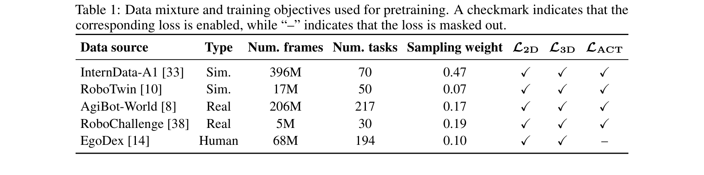
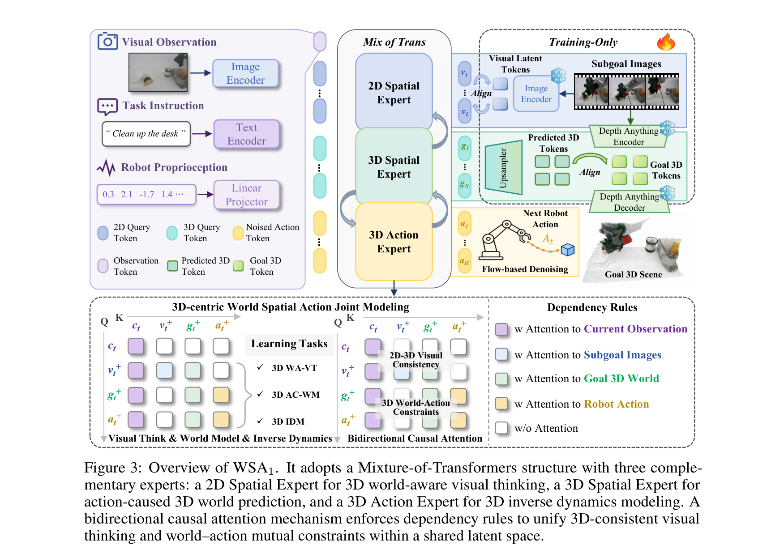
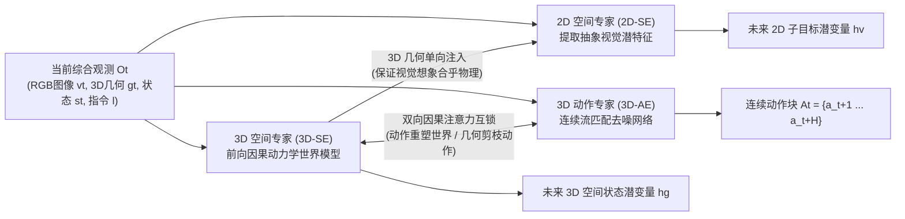
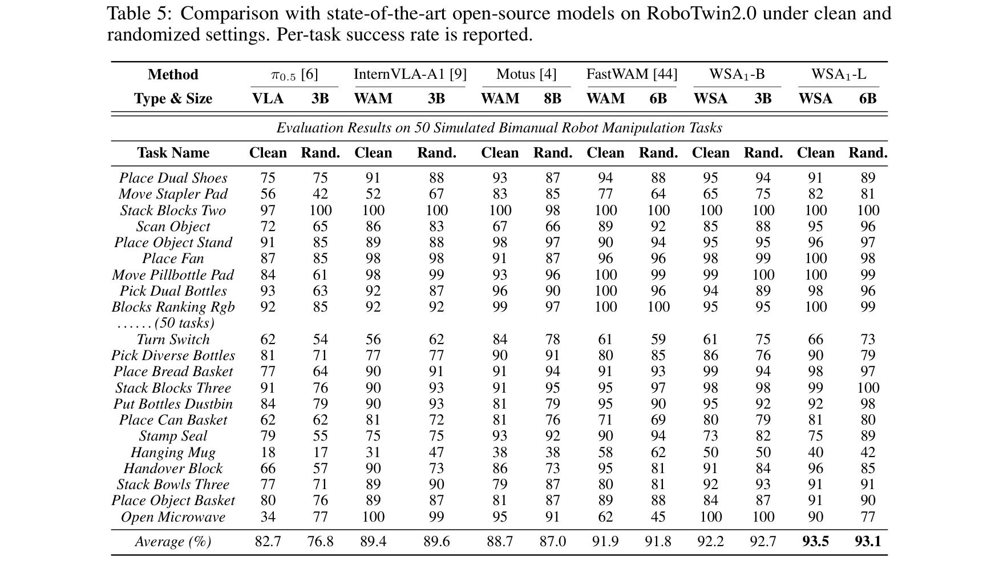
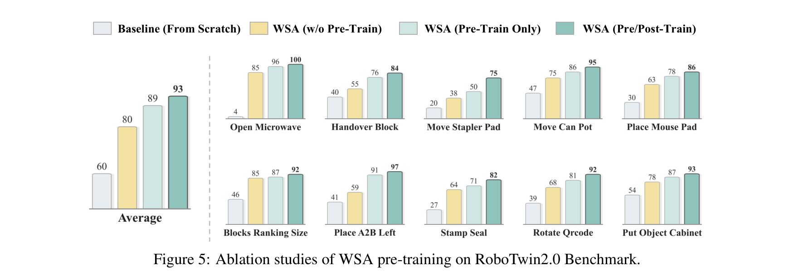
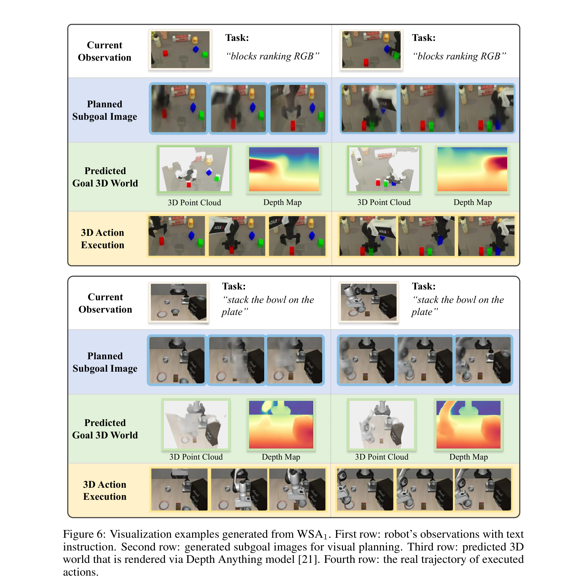

# WSA1: a 3D-Centric World-Spatial-Action Model for Generalizable Robot Control

## 核心信息
- **论文标题：** WSA1: a 3D-Centric World-Spatial-Action Model for Generalizable Robot Control（WSA1：面向通用机器人控制的 3D 中心化世界—空间—动作基座模型）
- **作者团队：** Jiahao Jiang, Jianing Zhang, Zhenhan Yin, Ruidong Chen, Sen Wang, Zhaoshu Yu, Pengpeng Zeng, Xiaofeng Cao, Xuanhan Wang†⋄, Jingkuan Song†⋄, Heng Tao Shen†⋄
- **主要机构：** 同济大学（Tongji University）、上海自主智能无人系统科学中心（Shanghai Innovation Institution）、上海无问芯穹/奇捷（Shanghai Magic）、考拉悠然（Koala Uran）
- **发布状态：** arXiv:2607.03941v1 [cs.RO] 4 Jul 2026
- **代码与主页：** [https://github.com/zaleni/WSA](https://github.com/zaleni/WSA)
- **核心定位：** 首创“3D 中心化世界—空间—动作（WSA）”联合建模范式的通用机器人基座模型（Robot Foundation Model, RFM）。从根本上打破 2D 视觉感知与 3D 物理空间交互的结构性错配，粉碎了“通用具身基座模型必须依赖数万小时真实机器人示教”的昂贵神话，仅用 **6,000 小时**多源异构数据（其中真机仅 1,000 小时）即在仿真与实体真机双端刷出全新 SOTA。
- **评测基准：** 
  - 真实物理机械臂实测：单臂 AgileX PiPER（7-DoF，3 视角相机）与双臂 ARX Lift2（14-DoF，3 视角相机）上的 7 项极难桌面长程任务（平均成功率 **77.5% / 80.3%**，超现有最强基线 **+20% ~ +46%**）；
  - RoboTwin2.0 双臂高保真仿真基准（50 项任务，在 Clean 与 Rand. 扰动下斩获 **92.7% / 93.1%**，超越所有开源基线，匹敌顶尖闭源大模型）；
  - LIBERO 经典迁移基准（4 大套件平均成功率 **97.4% / 98.2%**）。

---

## 原文摘要翻译
具身人工智能（Embodied AI）的最新突破已经确立了机器人基座模型（Robot Foundation Models, RFMs）作为构建通用机器人系统的核心主流路径。通过在大规模机器人示教轨迹上进行模仿学习，RFMs 展现出了将多模态视觉观测与自然语言指令直接映射为连续机器人控制动作的非凡能力。然而，现有的机器人基座模型内在缺乏对物理环境动力学以及机器人行为在 3D 物理世界中所产生的因果影响进行严密推理的能力。这导致了以 2D 为中心的视觉感知与以 3D 为核心的具身物理交互之间存在着根本性的结构错配，严重制约了 RFMs 在真实世界复杂任务中的泛化能力。为了弥补这一关键鸿沟，我们提出了 WSA1——一种建立在全新的“3D 中心化世界—空间—动作（3D-Centric World-Spatial-Action, WSA）”联合建模范式基础上的新型机器人基座模型。它不仅能够针对机器人未来的执行行为学习具备 3D 世界感知能力的视觉思维预演，而且显式建模了 3D 物理世界状态跃迁与机器人动作之间的双向因果约束，从而显著增强了行为的跨场景泛化性。值得注意的是，WSA1 实现了极高的数据利用效率：仅需 6,000 小时的专家示教数据预训练（其中仅包含 1,000 小时真实机器人数据），即可在极具挑战性的 RoboTwin2.0 双臂仿真基准上斩获 93% 的高成功率，并在真实实体机器人操作任务上相较于现有最先进的 RFMs 实现了平均 +20% 的性能飞跃。这些结果表明：通过将 3D 中心化的世界—动作联合建模机制相融合，无需依赖超大规模真机数据即可实现高度泛化的机器人基座模型，为通往实用且高性价比的通用机器人系统开辟了一条极具前景的落地路径。

---

## 创新点
1. **提出了具身智能全新范式——“3D 中心化世界—空间—动作（WSA）”联合建模：** 敏锐地抓住了具身智能最核心的物理本质（“所有真实的物理交互都发生于三维欧氏空间并受支配于动力学规律”），首次将 2D 视觉前瞻思维、3D 物理场景前向动力学演化、与 3D 逆动力学电机动作解码三大任务统摄在同一个共享潜空间中，彻底消解了以往 2D 视觉表征在三维物理世界中出现的“视差迷失、几何坍缩与虚假因果”。
2. **受认知神经科学“心智模型”启发的双向因果闭环：** 区别于以往 VLA 的开环映射或 3D-VLA 的单向预测，WSA 显式构建了世界与动作的双向互锁：动作不仅被 3D 几何环境约束引导，动作更是驱动 3D 物理世界状态改变的因果触发源（Action-caused 3D World Modeling）；通过联合因式分解将后验概率解构为三层闭环，赋予机械臂“手脑眼心”高度合一的心智推演能力。
3. **基于混合 Transformer（MoT）与 3D 中心化因果自注意力的创新架构：** 优雅构建了 2D 空间专家（2D-SE）、3D 空间专家（3D-SE）与 3D 动作专家（3D-AE），并设计了严格的 3D 因果注意力矩阵：2D 视觉思维强制查询 3D 几何，保证“想出来的画面必须符合物理规律”；**3D 场景与动作专家之间实现完全双向交叉注意力互锁**，直接从计算图层面斩断了单纯行为克隆的虚假统计关联。
4. **验证了“多源异构具身数据金字塔”的高效协同定律：** 彻底粉碎了“训练通用机器人大模型必须硬砸几万小时昂贵真机示教”的行业迷信，建立起“底层第一视角人类视频学意图 + 中层物理仿真学多臂协调 + 顶层 1,000 小时真机数据填补虚实差距”的高效配方，在 6,000 小时数据尺度下刷爆各项基准，为整个具身学术界与工业界提供了极具性价比的可行范式。

---

## 一句话总结
WSA1 终结了具身大模型在 2D 像素与 3D 物理世界之间的长期割裂，通过将 2D 视觉前瞻思维、3D 物理世界因果动力学与连续动作解码统一融于混合 Transformer 潜空间，仅用 1,000 小时真机数据就在实体双臂机器人和 RoboTwin2.0（93.1%）上实现了全维度 SOTA 突破！

---

## 研究问题

### 1. 2D 视觉感知与 3D 物理交互的根本性错配
在现有的机器人基座模型（RFMs）研究中，绝大多数模型（如 OpenVLA、$\pi_0$、$\pi_{0.5}$、FastWAM）在本质上都是 **2D 中心化（2D-Centric）** 的系统：
- 它们的输入是机载相机采集的 2D 像素阵列；
- 它们的预训练来源于 2D 互联网图文与 2D 视频生成大模型。

然而，**真实物理世界的操作交互是绝对 3D 中心化（3D-Centric）的！**
机械臂抓取、插拔、旋转、双臂交接，每一个动作都发生在连续的六自由度三维欧氏空间中，依赖毫米级的空间几何拓扑、微观接触面摩擦、遮挡关系推断与刚体动力学守恒。
当 2D 策略面对轻微视差变化、桌面反光、动态阴影或相机安装角度扰动时，由于缺乏对场景底层 3D 物理结构的感知，极其容易将 2D 像素层面的相关性误当作因果关系，导致夹爪在空间中悬空挥动、过早闭合或与物体发生猛烈撞击。


### 2. 现有具身建模范式的三大硬伤
如图 2 所示，学术界此前探索的三大路线均背负着不可调和的内在缺陷：
- **缺陷一：2D-centric VLA（如 $\pi_0$, OpenVLA, DynamicVLA）。**  
  遵循“理解—执行（Understand-then-Execute）”单向开环机制：
  $$A_t \sim p(a_{t+1:t+H} \mid v_t, s_t, l)$$
  完全被动即时反应，缺乏前瞻性物理预演能力。一旦面临遮挡或动态复杂交互，策略瞬间盲目。
- **缺陷二：2D-centric WAM（如 FastWAM, Motus, Video Prediction Policy）。**  
  遵循“想象—执行（Imagine-then-Execute）”机制：
  $$A_t \sim p(a_{t+1:t+H}, v_{t+1:t+N} \mid v_t, s_t, l)$$
  虽然引入了未来视频预测，但其注意力被大量消耗在背景纹理、高光倒影等高频 2D 像素细节上，根本没有建立起底层物体三维包围盒、刚体姿态与空间接触面的物理守恒。
- **缺陷三：朴素 3D-centric WAM（如 GeoPredict, 3D-VLA）。**  
  虽然尝试引入 3D 点云或深度：
  $$A_t \sim p(a_{t+1:t+H}, g_{t+1:t+K} \mid g_t, v_t, s_t, l)$$
  但其架构依然是**单向开环映射**：仅从当前状态预测未来点云，未能建立“动作对 3D 状态改变的因果反馈”以及“3D 状态对动作执行的几何剪枝”，缺少双向物理约束。

### 3. 真机示教数据匮乏的产业死局
传统基座模型高度依赖海量真实机器人示教（动辄几万到十几万小时）。然而人类遥操采集真机示教极其昂贵、危险且耗时。如果基座模型无法从低成本的物理仿真与人类视频中汲取强通用的物理先验，具身智能将永远被困在小规模实验室内。

**核心问题：如何构建一个统一架构，既能在潜空间中显式建模 3D 物理动力学与动作的双向因果互锁，又能以极低的数据开销实现跨场景、跨机型的卓越物理泛化？**

---

## 数据与任务定义

### 1. 多源异构具身数据金字塔（6,000 小时配方）



WSA1 严格践行“多源互补金字塔”理念，精选构建了包含 **6.92 亿帧、422 个任务、8 种机械臂形态、50 余种原子技能** 的高质量预训练语料：
1. **底层（语义与因果认知基石）：人类第一人称视频（EgoDex, 100M 帧 / 12% 采样权重）**  
   - 提取丰富的人手—物体微观接触、灵巧操作时序逻辑；
   - 激活 $\mathcal{L}_{\mathrm{2D}}$（视觉思维）与 $\mathcal{L}_{\mathrm{3D}}$（空间几何演变），不监督动作。
2. **中层（大规模高保真运动学协调）：仿真合成示教（413M 帧 / 54% 采样权重）**  
   - InternData-A1（396M 帧，70 项任务，0.47 权重）+ RoboTwin2.0（17M 帧，50 项任务，0.07 权重）；
   - 涵盖大规模双臂协同、复杂刚体碰撞与长程操作轨迹，激活全量三大损失（$\mathcal{L}_{\mathrm{2D}}, \mathcal{L}_{\mathrm{3D}}, \mathcal{L}_{\mathrm{ACT}}$）。
3. **顶层（填补现实虚实鸿沟）：真机异构示教（179M 帧 / 34% 采样权重，约 1,000 小时）**  
   - RoboChallenge（120M 帧，110 项任务，0.20 权重）+ 智元 AgiBot-World（59M 帧，150 项任务，0.14 权重）；
   - 注入真实的传感器噪声、光照变化、相机视差与真实物理接触摩擦。

### 2. 真实物理机器人实测体系（7 大高难度桌面任务）


针对现有论文往往在极简单玩具场景测真机的痛点，WSA1 设计了覆盖单臂灵巧度与双臂复杂力学协同的 7 大高壁垒实体任务：
- **单臂系统（AgileX PiPER 7-DoF，3 台 RGB 相机）：**
  1. *RGB Block Sorting:* 识别三色积木，自左向右精确归位至对应颜色插槽；
  2. *Object Organization:* 杂乱桌面整理，将玩具、文具与垃圾分类收纳至三个指定桌面区域。
- **双臂系统（ARX Lift2 14-DoF，3 台 RGB 相机）：**
  3. *Trash Cleaning (双臂交接):* 一臂俯冲从地面抓起垃圾，凌空平稳递交给另一臂，再由第二臂精准投掷入垃圾桶；
  4. *Pen Holder Placement (空间位姿):* 双臂协同从不同角度拾取散落文具，以垂直姿态平稳插入笔筒；
  5. *Toy Box Organization (收纳闭盖):* 拾起桌面玩具丢入箱体，并由另一臂合上收纳箱盖；
  6. *Sweep Trash (双臂工具协同):* 极其复杂的非对称协同——左手稳固手持簸箕贴紧桌面，右手握持扫帚将桌面碎屑扫入簸箕；
  7. *Unzip Pencil Bag (精细形变交互):* 一臂稳固按压布质笔袋一端，另一臂微观捏持微小拉链滑块并沿轨迹拉开拉链。

---

## 方法主线：3D-Centric WSA 架构全貌



### 1. 联合概率图因式分解（核心数学原理）
WSA 打破以往开环单向后验，将具身控制后验概率严格分解为三层闭环因式乘积（式 5）：
$$p(g_{t+1:t+K}, v_{t+1:t+N}, a_{t+1:t+H} \mid O_t) = \underbrace{p(g_{t+1:t+K} \mid O_t, A_t)}_{\text{世界因果层：动作诱导 3D 演化}} \cdot \underbrace{p(v_{t+1:t+N} \mid g_{t+1:t+K}, O_t)}_{\text{空间认知层：3D 约束 2D 视觉思考}} \cdot \underbrace{p(a_{t+1:t+H} \mid g_{t+1:t+K}, O_t)}_{\text{动作执行层：3D 逆动力学解码}}$$



### 2. 混合 Transformer（MoT）三大专家分工
- **2D 空间专家（2D-SE, $f_{\mathrm{2D}}$）：**
  - 基座：Qwen3-VL-2B（WSA1-B）或 Wan2.2-5B（WSA1-L）；
  - 角色：负责将语言指令与当前观测转化为代表未来子目标意图的高维视觉潜变量 $h_v = f_{\mathrm{2D}}(O_t, G_t)$；
  - **核心妙手：绝不生成笨重的 RGB 原始像素！** 仅预测由预训练 COSMOS VAE 编码器压缩后的抽象潜 token，彻底甩掉了像素级渲染的沉重算力包袱。
- **3D 空间专家（3D-SE, $f_{\mathrm{3D}}$）：**
  - 架构：与 2D-SE 同深度的 Transformer 模块，共享潜特征维度；
  - 角色：前向内部因果世界模型，接收动作特征输入，预测环境未来的 3D 空间状态潜变量 $h_g = f_{\mathrm{3D}}(O_t, A_t)$；
  - 监督源：利用当前最强单目 3D 基础模型 Depth-Anything 提取的高精度几何先验进行对齐。
- **3D 动作专家（3D-AE, $f_{\mathrm{act}}$）：**
  - 架构：基于条件流匹配（Conditional Flow Matching）的去噪扩散 Transformer；
  - 角色：充当从 3D 几何目标到物理电机位姿的逆动力学求解器，将未来 3D 几何演进 $h_g$ 转化为连续动作块 $A_t$。

### 3. 3D 中心化因果自注意力掩码矩阵（3D-Centric Causal Mask）
如图 3 右侧所示，整个 MoT 依靠一套精密设计的自注意力交互规则协同运转：
1. **真实性接地规则：** 所有预测 token（$h_v, h_g, h_{\mathrm{act}}$）均可单向无阻碍地查询当前观测 $h_t$，防止无中生有的幻觉；
2. **2D-3D 几何一致性规则：** 2D 视觉思维 token $h_v$ 单向关注 3D 场景几何 token $h_g$，确保大脑“想象”出的画面绝不违背基本的三维透视与刚体接触常识；
3. **最关键的突破：3D 场景 $h_g$ 与动作 $h_{\mathrm{act}}$ 的完全双向互通！**  
   - 动作 token 能实时感知 3D 几何障碍与抓取目标位姿，实现智能避障与精准空间插拔；
   - 3D 场景预测 token 实时感知即将施加的机械臂动作流，预演物体被推拉、挤压后的形变与位移；
   - 这一双向互锁将传统的“相关性模仿”升华为真正的“因果交互物理推演”。

### 4. 联合优化多任务损失函数
三项任务在预训练与下游微调期始终端到端协同联合训练（式 9）：
$$\mathcal{L}_{\mathrm{total}} = \mathcal{L}_{\mathrm{2D}} + \mathcal{L}_{\mathrm{3D}} + \mathcal{L}_{\mathrm{ACT}}$$
- $\mathcal{L}_{\mathrm{2D}} = \mathbb{E} \| f_{\mathrm{2D}}(O_t, G_t) - f_{\mathrm{enc}}(V_t) \|_2^2$（潜变量特征 MSE）
- $\mathcal{L}_{\mathrm{3D}} = \mathbb{E} \| f_{\mathrm{3D}}(O_t, A_t) - f_g(G_t) \|_2^2$（几何潜变量特征 MSE）
- $\mathcal{L}_{\mathrm{ACT}} = \mathbb{E} \| (\omega - A_t) - f_{\mathrm{act}}(O_t, G_t, \hat{A}_t) \|_2^2$（连续速度流场匹配）

---

## 关键结果与基准评测

### 1. 真实物理机械臂 7 大任务全面领跑


实测数据展现了令人震撼的代际差距：
- **全任务平均成功率（Average SR）：**
  - $\pi_0$ (3B): 33.8%
  - InternVLA-A1 (3B): 39.2%
  - $\pi_{0.5}$ (3B): 54.9%
  - **WSA1-B (3B, 本文): 77.5%（相较 $\pi_{0.5}$ 提升达 +22.6%，相较 $\pi_0$ 提升达 +43.7%！）**
  - **WSA1-L (6B, 本文): 80.3%（阶段完成度得分高达 86.5%）**
- **高难度双臂协同任务击穿：**
  - 在 *Trash Cleaning*（空中双臂动态交接）上，传统 VLA 经常因为手眼深度估计不准导致交接脱落，$\pi_{0.5}$ 仅 77%，InternVLA-A1 仅 43%；WSA1-L 达到 **87%**；
  - 在 *Unzip Pencil Bag*（毫米级捏合拉开）上，$\pi_0$ 与 InternVLA-A1 几乎完全瘫痪（仅 13% 成功率），$\pi_{0.5}$ 仅 40%；WSA1-B 直接飙升至 **73%**，WSA1-L 达到 **80%**，展现了极其惊人的三维精细操作稳定性！

### 2. RoboTwin2.0 双臂仿真基准开源称雄（93.1%）


在包含 50 项复杂双臂任务的 RoboTwin2.0 评测中：
- 开源基线全军覆没式落后：$\pi_0$ 仅 58.4%，$\pi_{0.5}$ 仅 76.8%，8B 规模的世界模型 Motus 仅 87.0%，6B 的 FastWAM 达到 91.8%；
- **WSA1-B（3B 参数）直接以 92.7% 登顶开源榜首**，甚至击败了拥有海量工业数据的闭源大模型 Being-H0.7（89.5%）；
- **WSA1-L（6B 参数）进一步突破至 93.1%**，紧紧咬住顶尖闭源模型 MotuBrain（93.4%），向全世界证明了开源具身架构完全有能力依靠优秀的数学建模反超闭源商业系统！

### 3. 极难随机域泛化（Clean vs Rand.，Table 5）



表 5 记录了在桌面材质大变、环境光照剧烈变化、加入大量未知干扰物体时的表现：
- 传统 VLA 模型（$\pi_{0.5}$）在随机环境下平均成功率从 82.7% 断崖式跌落至 76.8%（在 Move Stapler Pad 上从 56% 暴跌至 42%）；
- **WSA1 展现出了不可思议的几何稳定性：** WSA1-B 的表现不仅没有下降，反而从 Clean 下的 92.2% 保持在 Rand. 下的 **92.7%**！WSA1-L 保持在 **93.1%**！
- *原因解析：* 干扰物虽然改变了 2D 像素分布，但 WSA 的核心推理发生在稳定的 3D 几何拓扑潜空间中，从根本上免疫了纯视觉纹理的欺骗！

### 4. 核心消融实验深度洞察（Figure 4 & 5）


- **三大模块正交互补消融（图 4）：**
  - 纯动作基线（Action Only）：仅 60% SR；
  - 仅引入 2D 视觉思维（w/ Visual Thinking）：升至 76%（+16%），显著提升开微波炉门等大范围外观变化任务；
  - 仅引入 3D 世界预测（w/ 3D World Prediction）：升至 75%（+15%），显著提升旋转二维码、堆叠多层方块等微观空间位姿对齐任务；
  - **完整 WSA 联合建模：跃升至 80%**，证明 2D 宏观语义思考与 3D 微观几何物理演变呈现强烈的“超加和”正交增益！



- **预训练机制消融（图 5）：**
  - 从零直接训练（Scratch）：仅 60%；
  - 仅微调阶段应用 WSA：80%；
  - 仅预训练应用 WSA、下游微调仅更新动作：89%；
  - **全程预训练 + 微调协同联合训练：直接打上 93%！** 证实了多源数据金字塔所注入的物理先验在全周期中都发挥着锚定作用。

### 5. 定性心智推演可视化（Figure 6）



图 6 的真实推演画面展现了具身智能高阶心智的具象化展开：
- 面对“按 RGB 顺序给方块排序”或“将碗叠放在盘子上”任务，机器人机载相机拍摄即时画面后，网络在脑海中瞬间生成目标达成后的 2D 子目标渲染图；
- 3D 空间专家同步输出高保真的未来 3D 空间点云分布与深度轮廓图；
- 最终解码出的真实物理末端执行器轨迹与 3D 空间点云的位姿轮廓完美契合，彻底消除了由于视差误判造成的抓空与碰撞！

---

## 深度分析

### 1. 真正贡献是什么：从“2D 盲人摸象”到“3D 具身心智模型”
以往所有的具身策略，无论用了多大的多模态大模型，其本质都是在 2D 图像流上做复杂的模式联想。这就好比让一个戴着平面失真眼镜的人去进行微米级机械装配，只要光线稍有变化或相机微微倾斜，系统就失去准头。
**WSA1 的根本贡献在于：它将机器人从 2D 像素的幻觉中彻底解救出来，让机器人在三维物理空间中真正“睁开了眼睛”！**
它没有停留在“把深度图当成额外通道喂给网络”的浅层把戏上，而是建立了一个完整的内部因果模拟器（Internal Causal World Model）：
- 机械臂在动之前，脑海里已经推演出了物体在 3D 空间中被挪动、推开后的空间点云几何；
- 空间几何的物理约束，直接在自注意力机制中将一切荒谬、碰撞、悬空的不可行轨迹全部剪枝！

### 2. 为什么结果成立：三大数学与架构深层逻辑
1. **潜空间预测避免像素级累积噪声：** 许多视频世界模型（如 SORA 路线的具身模型）试图在测试期生成高清 RGB 视频，耗费了巨额显存去拟合背景高频噪声，反而模糊了关键接触面的边界。WSA1 巧妙地在紧凑的潜特征空间进行 3D 几何预测，以极小的计算代价锁死了最核心的物理因果。
2. **双向互锁打破虚假统计相关：** 纯模仿学习最大的天敌就是由于数据分布长尾造成的因果倒置（Causal Confusion）。WSA1 让 3D 场景 token 与动作 token 拥有完全对等的双向交叉注意权限，强迫动作必须对 3D 几何变化负责，使动作生成彻底具备了可解释的物理因果基础。
3. **数据金字塔的互补增益：** 仿真数据负责“广度”（覆盖千变万化的接触轨迹），人类视频负责“意图”（理解复杂任务结构），1,000 小时真机数据负责“校准真实物理阻尼”。三者在 3D 潜空间中实现了完美的几何统一。

### 3. 容易误读的五个认知盲区
1. **误区一：以为机械臂在真机上必须配备昂贵的 3D 激光雷达或专用深度相机。**  
   *事实：* 完全不需要！WSA1 在物理部署时**只需要普通的 RGB 相机**。其 3D 场景潜变量预测能力是模型内生习得的，训练时借助了 Depth-Anything 作为几何特征自监督教师，测试时纯依靠单目 RGB 输入即可在网络内部激活 3D 心智模型！
2. **误区二：以为 WSA1 在测试期每一步都要耗费几秒钟渲染完整 3D 点云。**  
   *事实：* 不渲染！图 6 中的点云与深度图是为了让研究人员直观观察而专门解码出的可视化结果。在实时物理控制循环中，模型全程在特征潜空间中流转，动作由流匹配去噪器快速输出，保证了控制回路的敏捷性。
3. **误区三：以为它只是把 3D 信息作为额外的输入 Prompt。**  
   *事实：* 它是**双向生成式闭环**！3D 几何不仅是输入条件，更是前向世界预测的监督目标（式 7），动作更是用来解释 3D 状态跃迁的因果媒介（式 8）。
4. **误区四：以为 6,000 小时数据量太小不可能有泛化性。**  
   *事实：* 这正是论文最强有力的论点！当模型拥有了正确的 3D 物理归纳偏置后，示教数据的利用效率呈现数量级提升，彻底证明了以往模型之所以需要海量数据，是因为它们在 2D 像素迷宫中徒劳地拟合虚假相关！
5. **误区五：以为它只适用于双臂机器人。**  
   *事实：* 论文在 AgileX PiPER 单臂（7-DoF）与 ARX Lift2 双臂（14-DoF）上进行了完全对称的验证，单臂平均成功率高达 77.5%，双臂高达 80.3%，展现出跨形态的通用性。

### 4. 复现与落地注意点
- **单目 3D 教师模型的表征质量：** 3D-SE 极度依赖 Depth-Anything 提取的场景特征，若在特殊工况（如高反射金属零件、透明玻璃杯）下，单目深度估计出现系统性形变，需对 3D 教师模型进行特定领域的预先增强。
- **混合 Transformer 的显存管理：** 训练期同时激活 2D-SE、3D-SE 与 3D-AE 三大专家分支，建议采用 FSDP（全共享数据并行）与 FlashAttention-3，合理平衡三项损失的梯度回传步长。
- **动作块视界（Action Horizon）设定：** 论文在物理实测中采用标准的连续 Action Chunking 机制，结合前视视角与腕部手眼相机特征融合，能显著平滑高频抖动。

---

## 局限
1. **多专家并行带来的高频控制延迟瓶颈：** 尽管在潜特征空间运算，但完整的 MoT 架构（包含 2D、3D 与动作三大专家）在单卡上的前向传播耗时仍需数十至上百毫秒。在需要 >30Hz 超高频微观力矩响应的极端动态任务中（如抓取空中下落物体），需要引入专家稀疏激活（Sparse MoE）或推测解码加速。
2. **缺乏超长时程多阶段历史记忆栈（Long-Horizon Episodic Memory）：** WSA1 的 3D 世界预测主要聚焦于短时程动作块（几十个步长内）的微观物理演变。当任务跨越数十分钟、包含十几个离散子阶段时，模型缺乏类似 MaP-WAM 的阶段编译机制或 MemoryWAM 的三级持久记忆库，无法回忆起几分钟前被遮挡的物体位姿。
3. **微观接触力学与触觉模态的缺失：** 目前的 3D 建模依然属于“几何物理”（深度与点云空间拓扑），尚未将法向接触力、剪切力、表面摩擦因数及柔顺阻抗等触觉物理量纳入潜空间，面对极高接触要求的精密装配仍有提升空间。

---

## 我的笔记：具身世界动作模型横向大比拼

将 WSA1 与当前具身智能领域的几大顶尖工作横向排开，可以清晰洞见其在整个机器人前沿发展光谱中的绝对优势：

| 模型范式 | 代表作 | 空间与视觉表征核心 | 世界模型角色与维度 | 数据需求与效率 | 物理泛化表现与核心短板 |
| :--- | :--- | :--- | :--- | :--- | :--- |
| **2D 反应式 VLA** | $\pi_0$, OpenVLA, $\pi_{0.5}$ | 纯 2D RGB 像素图像 | **无世界模型**（纯开环映射，缺少前向预测） | 极高（需数万小时真机数据支撑） | 泛化脆弱，易受视差与背景干扰欺骗，真机双臂仅 30%~50% |
| **2D 视频 WAM** | FastWAM, Video Prediction Policy | 2D RGB 视频潜变量 | **2D 像素演变**（侧重纹理时序连贯，缺乏 3D 深度几何） | 中等（继承视频大模型通用常识） | 擅长宏观流程预演，但无法解决厘米级空间碰撞与精确接触 |
| **持久记忆 WAM** | MemoryWAM | 2D 图像 + 3 级混合记忆库 | **2D 潜视频前向预测** + 历史 KV 压缩保留 | 依赖标准化示教 | 擅长长程记忆保留，但底层仍缺乏显式 3D 几何拓扑对齐 |
| **记忆即计划 WAM** | MaP-WAM | 多模态阶段情境 + 视觉计划 | **因果 2D 视频生成**（宏观编译，执行器恒定时延） | 高效（利用阶段拓扑） | 卓越的长程执行弹性，但微观动作依然由 2D 观测驱动 |
| **几何预测政策** | GeoPredict, 3D-VLA | 3D 点云 / 深度通道输入 | **单向 3D 演化预测**（缺少动作与 3D 的双向因果互锁） | 中等 | 相比 2D 有显著提升，但开环预测易发生几何漂移 |
| **3D 中心化 WSA（本文）** | **WSA1 (WSA1-B / WSA1-L)** | **统一潜空间内的 2D 视觉思维 + 3D 空间几何演变** | **3D 物理动力学模拟器**（动作重塑 3D 世界 / 3D 几何双向约束动作） | **极致数据效率**（仅 6,000h 预训练，1,000h 真机数据） | **双端霸榜（RoboTwin 93.1%，真机 +20%~+46% 跃升）**，彻底打破虚实错配 |

### 核心思辨总结
- **WSA1 补齐了具身物理大模型最关键的一块拼图：** 过去的具身模型要么沉迷于 2D 像素的华丽生成，要么单纯依赖行为克隆的死板模仿。WSA1 首次证明了：**让机器人真正理解 3D 空间中的因果物理法则，不仅能让策略变得坚如磐石，更是彻底打破真机数据依赖瓶颈的唯一正确解题思路！**
- **未来终极具身大模型的融合蓝图：** 将 **WSA1 的 3D 双向因果物理核心** 与 **MaP-WAM 的宏观阶段计划编译** 及 **MemoryWAM 的三级持久记忆库** 深度融合，我们将见证真正具备无限长程时空心智与微观灵巧操作能力的终极通用实体机器人！

---

## 引用
```bibtex
@article{jiang2026wsa1,
  title={WSA$_1$: a 3D-Centric World-Spatial-Action Model for Generalizable Robot Control},
  author={Jiang, Jiahao and Zhang, Jianing and Yin, Zhenhan and Chen, Ruidong and Wang, Sen and Yu, Zhaoshu and Zeng, Pengpeng and Cao, Xiaofeng and Wang, Xuanhan and Song, Jingkuan and Shen, Heng Tao},
  journal={arXiv preprint arXiv:2607.03941},
  year={2026}
}
```
