# World Action Models are Zero-shot Policies

**Authors:** Seonghyeon Ye et al.  
**Source:** `/Users/roywangj/journey_wj/research/papers4zotero/zotero1/storage/WZ3FYLNE/Ye 等 - 2026 - World Action Models are Zero-shot Policies.pdf`  
**Detected source format:** selectable-text PDF (`pdf-text`)  
**Reader type:** full-paper Chinese-English Markdown reader with figure/table assets.

## Page / Section Index

| Pages | Section | Reader anchor |
|---:|---|---|
| 1–2 | Title, overview, abstract | [Abstract](#abstract) |
| 2–4 | 1. Introduction | [Introduction](#1-introduction) |
| 4–6 | 2. Related Work | [Related Work](#2-related-work) |
| 6–10 | 3. DreamZero | [DreamZero](#3-dreamzero) |
| 10–13 | 4. Experimental Setup | [Experimental Setup](#4-experimental-setup) |
| 13–18 | 5. Experimental Results | [Results](#5-experimental-results) |
| 18–19 | 6. Discussion and Future Work | [Discussion](#6-discussion-and-future-work) |
| 19–30 | Appendices A–H | [Appendices](#appendices) |
| 30–36 | References | [References](#references) |

## Terminology Ledger

| Canonical term | 中文约定 | First-use definition / note |
|---|---|---|
| Vision-Language-Action model (VLA) | 视觉—语言—动作模型 | 由 VLM 扩展动作预测的机器人策略 |
| World Action Model (WAM) | 世界动作模型 | 联合预测未来世界状态与动作的策略 |
| DreamZero | DreamZero | 本文 14B 自回归 WAM |
| inverse dynamics model (IDM) | 逆动力学模型 | 从视觉状态变化映射到动作 |
| embodiment | 机器人形态 | 保留英文以避免与“具身”泛称混淆 |
| task progress | 任务进度 | 按阶段完成比例计分，不等同 success rate |
| action chunk | 动作块 | 一次预测并异步执行的连续动作序列 |
| flow matching | 流匹配 | 视频与动作的联合去噪训练目标 |
| KV cache | KV 缓存 | 保存自回归视觉历史并由真实观测刷新 |
| DreamZero-Flash | DreamZero-Flash | 面向单步推理的解耦噪声训练版本 |

### Figure 1. Overview

**Caption:** By jointly predicting video and action, WAMs inherit world-physics priors that support diverse-data learning, open-world generalization, cross-embodiment video learning, and few-shot adaptation.

**Caption[CN]:** 通过联合预测视频与动作，WAM 继承世界物理先验，从而支持多样低重复数据学习、开放世界泛化、跨机器人形态视频学习，以及对新机器人的少样本适配。

**Reading note:** 这张总览把全文四条证据链放在同一图中；裁切包含首页标题区，但完整保留了图和原始图注。

## Abstract

> <strong>Para. 1:</strong> State-of-the-art Vision-Language-Action models excel at semantic generalization but struggle with unseen physical motions in novel environments. DreamZero is a World Action Model built on a pretrained video diffusion backbone. It jointly predicts future world states and actions, learns effectively from heterogeneous robot data, and more than doubles generalization over state-of-the-art VLAs in real-robot experiments. A 14B autoregressive video diffusion model runs closed-loop control at 7 Hz. Video-only demonstrations from robots or humans improve unseen-task performance by more than 42% with 10–20 minutes of data, while 30 minutes of play data enables adaptation to a new embodiment.

> <strong>Para. 1[CN]:</strong> 最先进的视觉—语言—动作模型擅长语义泛化，却难以在新环境中执行未见过的物理动作。DreamZero 是建立在预训练视频扩散骨干上的世界动作模型，它联合预测未来世界状态和动作，能够从异构机器人数据中有效学习，并在真实机器人实验中把新任务和新环境泛化能力提高到最先进 VLA 的两倍以上。一个 140 亿参数的自回归视频扩散模型由此可以 7 Hz 进行闭环控制。来自机器人或人类的 10–20 分钟纯视频示范可使未见任务表现相对提高 42% 以上，而 30 分钟自由操作数据即可适配新机器人形态。

## 1. Introduction

> <strong>Para. 1:</strong> Vision-Language-Action models extend pretrained VLMs to motor actions. They inherit linguistic priors and can manipulate diverse objects from language instructions, yet their generalization to new environments and especially to new motions remains limited. A VLA may connect web knowledge about “Taylor Swift” to a learned move skill, but it fails at “untie the shoelace” if that motion never appeared in robot training data. VLM priors encode what to do semantically, not how to execute it with geometry, dynamics, and motor control.

> <strong>Para. 1[CN]:</strong> 视觉—语言—动作模型把预训练 VLM 扩展到运动控制。它们继承语言先验，因此能依据指令操作不同物体，但对新环境、特别是新动作的泛化仍然有限。VLA 可以把关于 “Taylor Swift” 的网络知识连接到已学会的搬运动作，却会在训练数据从未出现“解鞋带”时失败。VLM 先验在语义层面编码“做什么”，却没有自动编码如何依据几何、动力学和运动控制精确执行。

> <strong>Para. 2:</strong> DreamZero is a 14B robot foundation model initialized from Wan2.1 image-to-video diffusion. The paper calls it a World Action Model: it predicts visual future states and actions in an aligned manner. This shifts action learning from dense state-action imitation toward inverse dynamics, where motor commands are aligned to a predicted visual future. The authors expect this to support heterogeneous data, zero-shot task and environment generalization, and cross-embodiment transfer.

> <strong>Para. 2[CN]:</strong> DreamZero 是从 Wan2.1 图生视频扩散模型初始化的 14B 机器人基础模型。论文称其为世界动作模型：它以对齐方式同时预测视觉未来状态与动作。这使动作学习从密集的状态—动作模仿转向逆动力学，即把电机命令同预测的视觉未来对齐。作者据此期待模型能利用异构数据、零样本泛化到新任务和新环境，并支持跨机器人形态迁移。

### Figure 2. Joint video and action prediction

**Caption:** DreamZero jointly generates video and action on tasks absent from the robot training distribution.

**Caption[CN]:** DreamZero 在机器人训练分布之外的任务上联合生成视频和动作。

**Reading note:** 重点观察 generated future 与 executed action 的时间对应关系；论文后文称多数失败来自生成视频本身，而非动作跟随该视频的能力。

> <strong>Para. 3:</strong> The claimed advances are: generalization beyond prior VLAs and WAMs; effective learning from diverse, non-repetitive robot data; a 38× inference speedup that makes 14B video diffusion reactive; video-only transfer from humans or other robots; and few-shot adaptation to a new embodiment. These are evaluated in unseen environments by default, rather than in the data-collection sites.

> <strong>Para. 3[CN]:</strong> 论文主张的推进包括：超过既有 VLA 与 WAM 的任务、环境和机器人形态泛化；从多样、低重复机器人数据中有效学习；以 38 倍加速使 14B 视频扩散模型具备反应性；只用人类或其他机器人视频进行迁移；以及少样本适配新机器人形态。默认评测都在训练数据采集地点之外的新环境进行。

### Figure 3. Free-form evaluation

**Caption:** DreamZero follows natural-language prompts for a broad set of free-form behaviors beyond the structured benchmark.

**Caption[CN]:** 除结构化 benchmark 外，DreamZero 还能依据自然语言提示执行大量自由形式行为。

**Reading note:** 这些 100+ free-form task 主要提供定性覆盖，不应与严格统计的 structured evaluation 混为一谈。

## 2. Related Work

> <strong>Para. 1:</strong> Prior VLA scaling focuses on larger pretrained VLMs, larger robot datasets, or language-conditioned motion primitives. The authors argue that episode-level language and direct action prediction underuse heterogeneous trajectories: video prediction learns from every consecutive frame pair and can import physical dynamics from web-scale pretraining.

> <strong>Para. 1[CN]:</strong> 既有 VLA 扩展主要依赖更大的预训练 VLM、更大的机器人数据集，或语言条件化运动 primitive。作者认为，episode 级语言与直接动作预测没有充分利用异构轨迹：视频预测可以从每一对连续帧中学习，还能从 web-scale 预训练继承物理动力学。

> <strong>Para. 2:</strong> Video generation has been used for robot trajectory synthesis, inverse dynamics, optical-flow correspondence, and high-level planning. A newer line jointly models video and actions, either from scratch, from VLAs, or from pretrained video diffusion. This paper groups them as WAMs because video is one possible world-modeling target; future WAMs could instead predict tactile signals, force, or learned latent states.

> <strong>Para. 2[CN]:</strong> 视频生成已被用于合成机器人轨迹、学习逆动力学、建立光流稠密对应，以及高层规划。更新的一条路线联合建模视频和动作，可能从零训练、从 VLA 初始化，或利用预训练视频扩散模型。本文把它们统称为 WAM，因为视频只是世界建模目标的一种；未来 WAM 也可以预测触觉、力反馈或学习到的 latent state。

> <strong>Para. 3:</strong> Compared with latent world models that learn compact dynamics from scratch, video-backbone WAMs begin with internet-scale spatiotemporal priors. Compared with two-stage video planning plus an IDM, DreamZero trains one end-to-end model to integrate both modalities. Its distinctive emphasis is not merely the joint objective, but data diversity and scale, autoregressive long-horizon alignment, real-time deployment, and two forms of embodiment transfer.

> <strong>Para. 3[CN]:</strong> 与从零学习紧凑动力学的 latent world model 相比，基于视频骨干的 WAM 从互联网规模时空先验出发；与两阶段视频规划加 IDM 相比，DreamZero 用单一端到端模型深度整合两种模态。它的重点不只是联合目标，还包括数据多样性与规模、自回归长时对齐、实时部署，以及两种机器人形态迁移。

## 3. DreamZero

### Figure 4. Model architecture

**Caption:** Visual context, language, and proprioception enter an autoregressive DiT that jointly predicts future video and actions. During inference, real observations refresh the KV cache after asynchronous execution.

**Caption[CN]:** 视觉上下文、语言和本体状态进入自回归 DiT，联合预测未来视频与动作；异步执行后，真实观测刷新 KV 缓存。

**Reading note:** 图左是 teacher-forced joint flow matching，右侧是真实机器人闭环；“用真实帧替换预测帧”是避免误差累积的关键。

> <strong>Para. 1:</strong> DreamZero jointly predicts video $o_{l:l+H}$ and actions $a_{l:l+H}$ conditioned on language $c$, proprioception $q_l$, and observation history $o_{0:l}$. The factorization is video prediction followed by an inverse-dynamics term:

$$
\pi(o_{l:l+H},a_{l:l+H}\mid o_{0:l},c,q_l)
=
\pi(o_{l:l+H}\mid o_{0:l},c,q_l)
\pi(a_{l:l+H}\mid o_{0:l+H},q_l).
$$

> <strong>Para. 1[CN]:</strong> DreamZero 在语言 $c$、本体状态 $q_l$ 和观测历史 $o_{0:l}$ 条件下，联合预测未来视频 $o_{l:l+H}$ 与动作 $a_{l:l+H}$。上式把它分解成视频预测项与基于完整视觉未来的逆动力学项；论文并不用两个独立模型实现分解，而是以同一个 DiT 联合学习。

> <strong>Para. 2:</strong> The architecture adds minimal robot-specific parameters to the video model: state and action encoders plus action decoders. Multiple camera views are concatenated into one frame. Autoregressive generation preserves native frame rate, supports variable-length context through KV caching, and avoids the fixed-window subsampling of bidirectional video diffusion. Only video is autoregressive across chunks; actions are predicted per closed-loop chunk to avoid action-error propagation.

> <strong>Para. 2[CN]:</strong> 架构只给视频模型增加少量机器人专用参数：状态/动作 encoder 和动作 decoder。多个相机视角直接拼到一帧。自回归生成保留原生帧率，通过 KV 缓存支持变长上下文，并避免 bidirectional 视频扩散固定窗口带来的重采样。只有视频跨 chunk 自回归；动作按闭环 chunk 预测，以免控制误差跨轮累积。

> <strong>Para. 3:</strong> Training uses flow matching with teacher forcing. Video and action in a chunk share one denoising timestep in standard DreamZero, and the current noisy chunk attends to clean previous chunks. The joint velocity target is optimized at trajectory level with a causal attention mask.

> <strong>Para. 3[CN]:</strong> 训练采用 flow matching 与 teacher forcing。标准 DreamZero 让同一 chunk 的视频和动作共享去噪 timestep，当前 noisy chunk 可以注意此前 clean chunk。模型以因果 attention mask 在完整轨迹级别优化联合 velocity target。

### Figure 14. Attention strategy

**Caption:** Training uses a causal QKV mask across clean context and noisy current chunks; inference reuses cached history and updates it with real observations.

**Caption[CN]:** 训练阶段通过因果 QKV mask 连接 clean 历史与 noisy 当前 chunk；推理阶段复用缓存历史，并以真实观测更新。

**Reading note:** 该图对应 Appendix C，也是复现 variable-length chunk 训练时最容易出错的实现点。

> <strong>Para. 4:</strong> At inference, the model jointly denoises video and action chunks with KV caching. After an action chunk is executed, the generated frames in the cache are replaced by the ground-truth observation. The policy therefore retains history but is repeatedly re-anchored to the real world.

> <strong>Para. 4[CN]:</strong> 推理时，模型利用 KV 缓存联合去噪视频和动作 chunk。动作 chunk 执行后，缓存中的生成帧被真实观测替换。因此策略既保留历史，又在每个闭环周期重新锚定真实世界。

### Figure 13. Bidirectional versus autoregressive WAMs

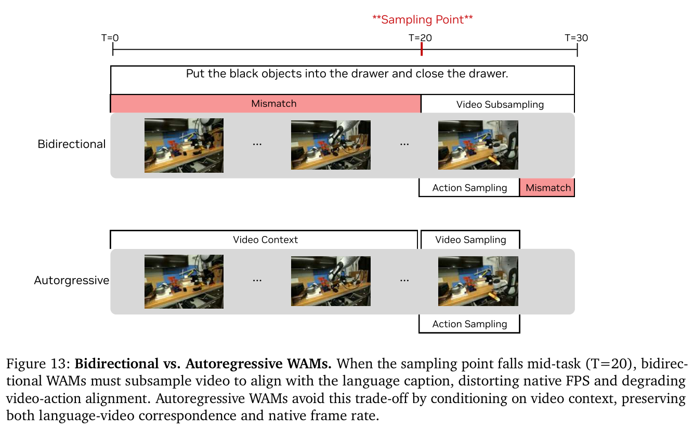

**Caption:** Mid-task sampling can force bidirectional WAMs to subsample video and misalign language, frames, and actions; autoregressive conditioning preserves native temporal alignment.

**Caption[CN]:** 当采样点落在任务中段时，bidirectional WAM 可能被迫重采样视频并造成语言、帧与动作错位；自回归条件化保留原生时间对齐。

### Real-time execution

> <strong>Para. 1:</strong> A naive 14B implementation needs about 5.7 seconds per action chunk because of 16 diffusion steps, the DiT cost, and sequential execution. DreamZero asynchronously executes the most recent 48-step action chunk at 30 Hz while inferring from the latest observation. This changes the deadline from “finish before motion starts” to “finish before the 1.6-second chunk expires.”

> <strong>Para. 1[CN]:</strong> 朴素 14B 实现每个动作块约需 5.7 秒，瓶颈来自 16 次扩散去噪、DiT 计算和串行执行。DreamZero 在 30 Hz 下异步执行最近生成的 48-step action chunk，同时依据最新观测推理。这把 deadline 从“机器人运动前必须完成”放宽为“当前 1.6 秒 chunk 结束前完成”。

> <strong>Para. 2:</strong> System optimizations distribute the conditional and unconditional CFG passes over two GPUs and cache DiT velocities when successive flow directions are similar. Implementation optimizations use torch.compile, CUDA Graphs, cuDNN attention, GPU-side schedulers, and mixed NVFP4/FP8/FP16 quantization on Blackwell.

> <strong>Para. 2[CN]:</strong> 系统层优化把 CFG 的 conditional 与 unconditional 两次 forward 分到两张 GPU，并在相邻 flow velocity 方向相似时复用 DiT 计算。实现层进一步采用 `torch.compile`、CUDA Graph、cuDNN attention、GPU scheduler，以及 Blackwell 上的 NVFP4/FP8/FP16 混合量化。

### Table 1. Cumulative inference speedups

**Caption:** Cumulative speedups reach 9.6× on H100, 16.6× on GB200 after quantization, and 38× on GB200 with DreamZero-Flash.

**Caption[CN]:** 累计优化在 H100 达到 9.6 倍，在 GB200 量化后达到 16.6 倍，加入 DreamZero-Flash 后达到 38 倍。

> <strong>Para. 3:</strong> DreamZero-Flash decouples the video and action noise schedules. Standard training sees both modalities at the same noise level, but one-step inference must recover clean actions while video remains noisy. Flash samples video toward high-noise states using $t_{video}=1-\eta$, $\eta\sim\mathrm{Beta}(7,1)$, while keeping action timesteps uniform.

> <strong>Para. 3[CN]:</strong> DreamZero-Flash 解耦视频与动作噪声日程。标准训练总让两种模态处在相同噪声水平，但单步推理必须在视频仍然 noisy 时恢复 clean action。Flash 令 $t_{video}=1-\eta$ 且 $\eta\sim\mathrm{Beta}(7,1)$，使视频偏向高噪声状态，同时保持动作 timestep 均匀。

### Figure 5. Decoupled noise schedules

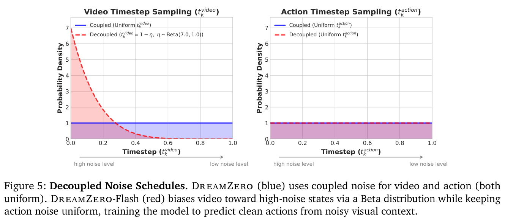

**Caption:** Flash biases video toward high-noise conditions while leaving action noise uniform, matching the state encountered during few-step inference.

**Caption[CN]:** Flash 让视频偏向高噪声条件、动作噪声保持均匀，以匹配少步推理实际遇到的跨模态状态。

## 4. Experimental Setup

> <strong>Para. 1:</strong> Models are pretrained separately for AgiBot G1 and Franka. Baselines are GR00T N1.6 and $\pi_{0.5}$, each evaluated from a VLM-only scratch initialization and from official robot-pretrained checkpoints. All methods then train on identical embodiment data and comparable batch size and gradient steps.

> <strong>Para. 1[CN]:</strong> 模型分别在 AgiBot G1 与 Franka 上预训练，并未训练统一 multi-embodiment policy。基线为 GR00T N1.6 与 $\pi_{0.5}$，各自包含只从 VLM 初始化的 scratch 版本和官方 robot-pretrained checkpoint。之后所有方法使用相同目标 embodiment 数据，并匹配总 batch size 与 gradient steps。

> <strong>Para. 2:</strong> The AgiBot corpus contains about 500 hours across 22 homes, restaurants, supermarkets, coffee shops, and offices. Its 7,193 episodes average 4.4 minutes and 42.4 subtasks. DreamZero uses Wan2.1-I2V-14B-480P, trains 100K steps with global batch 128, updates DiT and robot-specific encoders/decoders, and freezes the text encoder, image encoder, and VAE.

> <strong>Para. 2[CN]:</strong> AgiBot 数据约 500 小时，覆盖 22 个住宅、餐厅、超市、咖啡店与办公室。7193 个 episode 平均持续 4.4 分钟、包含 42.4 个 subtask。DreamZero 使用 Wan2.1-I2V-14B-480P，训练 100K steps、global batch 128；更新 DiT 与机器人专用 encoder/decoder，冻结 text encoder、image encoder 和 VAE。

### Figure 6. AgiBot corpus statistics

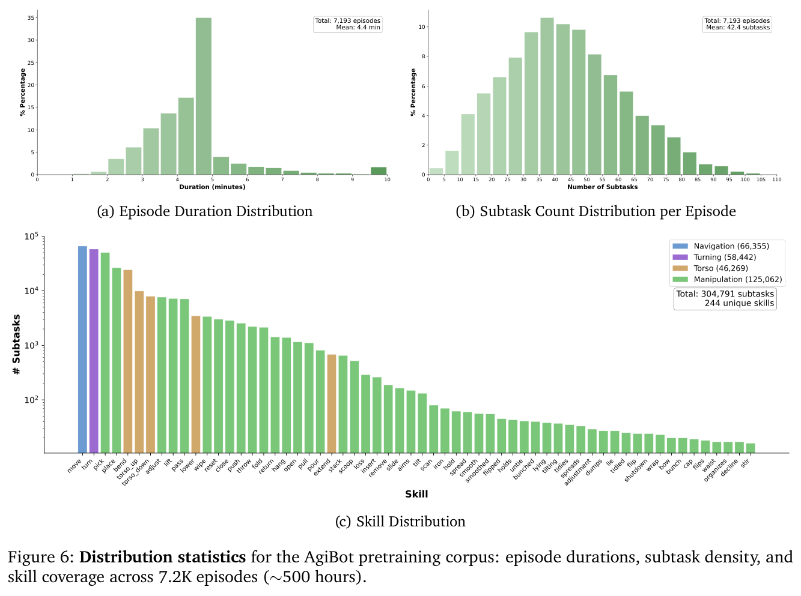

**Caption:** Episode duration, subtask density, and skill distribution for 7.2K AgiBot episodes.

**Caption[CN]:** 约 7200 个 AgiBot episode 的时长、subtask 密度与技能分布。

### Figure 7. Evaluation setup

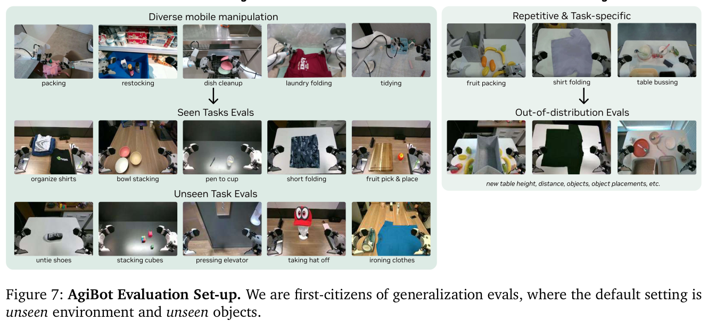

**Caption:** Evaluation defaults to unseen environments and objects, with separate seen-motion and unseen-motion task groups.

**Caption[CN]:** 默认在未见环境与物体上评测，并把已见 motion 和未见 motion 任务分组。

> <strong>Para. 3:</strong> AgiBot seen tasks include ten motions from pretraining, evaluated with different objects and environments; unseen tasks include ten absent motions such as ironing, painting, pulling a cart, cube stacking, removing a hat, and untying shoelaces. Each group uses 80 rollouts. DROID uses 20 seen and 20 unseen verbs with two rollouts per task.

> <strong>Para. 3[CN]:</strong> AgiBot seen tasks 选取十个训练中出现的 motion，但更换物体与环境；unseen tasks 包含十个训练中没有的动作，例如熨衣、绘画、拉车、叠方块、摘帽和解鞋带。两组各进行 80 次 rollout。DROID 则包含 20 个 seen 与 20 个 unseen verb，每个 task 两次 rollout。

### Figure 15. Data collection environments

**Caption:** Teleoperation data were collected in 22 diverse real-world environments rather than one standardized laboratory.

**Caption[CN]:** 遥操作数据来自 22 个多样真实环境，而非单一标准实验室。

### Tables 5–6. AgiBot task definitions

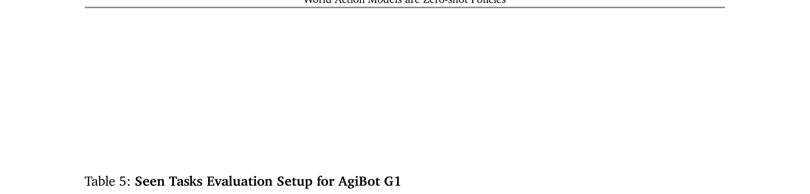

**Caption:** Seen-task prompts and initial configurations.

**Caption[CN]:** seen-task 的提示词与初始配置。

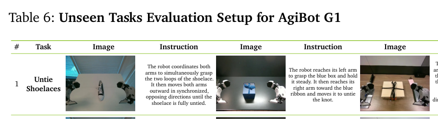

**Caption:** Unseen-task prompts and initial configurations.

**Caption[CN]:** unseen-task 的提示词与初始配置。

## 5. Experimental Results

### Figure 8. Seen-task evaluation

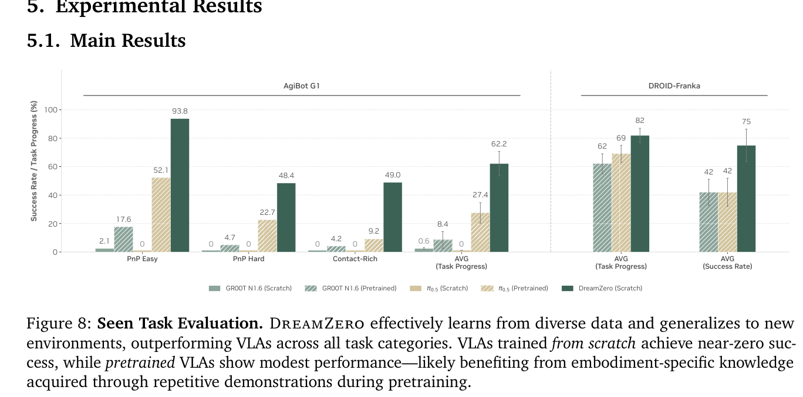

**Caption:** DreamZero reaches 62.2% average task progress on AgiBot seen motions in unseen environments, versus 27.4% for the strongest pretrained VLA.

**Caption[CN]:** 在新环境的 AgiBot seen motion 上，DreamZero 平均任务进度为 62.2%，最强 pretrained VLA 为 27.4%。

> <strong>Para. 1:</strong> Scratch VLAs achieve near-zero progress on AgiBot, whereas DreamZero reaches 62.2% average progress, more than twice the best pretrained VLA at 27.4%. A similar pattern appears on DROID-Franka. The authors attribute this to a video-generation prior that lets WAMs learn from heterogeneous trajectories instead of requiring repeated action demonstrations.

> <strong>Para. 1[CN]:</strong> scratch VLA 在 AgiBot 上几乎没有进度，DreamZero 则达到 62.2%，超过最强 pretrained VLA 27.4% 的两倍。DROID-Franka 也出现相同趋势。作者把差距归因于视频生成先验：WAM 能从异构轨迹学习，而不要求大量重复动作示范。

### Figure 9. Zero-shot unseen tasks

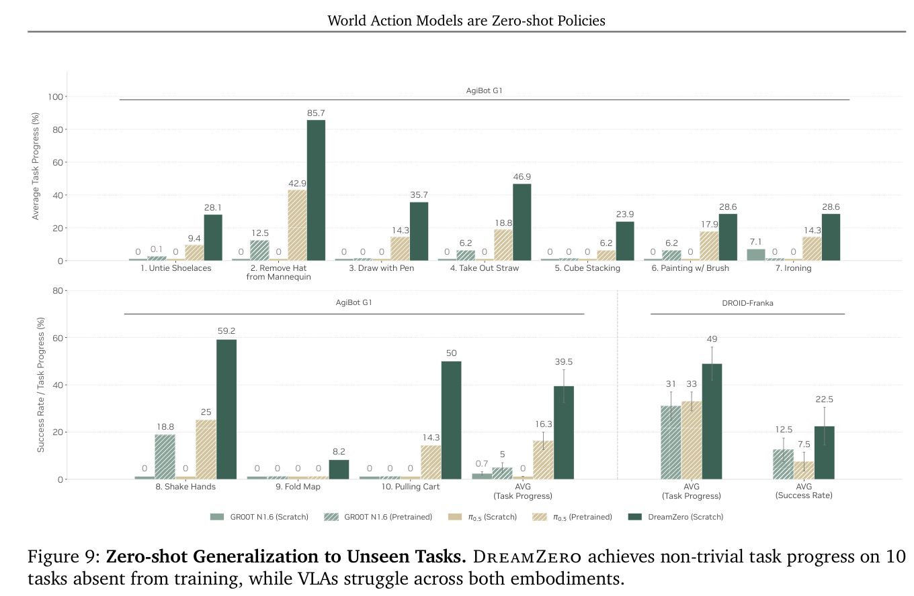

**Caption:** On ten motions absent from AgiBot training, DreamZero averages 39.5% task progress; on DROID-Franka unseen tasks it reaches 49% progress and 22.5% success.

**Caption[CN]:** 在 AgiBot 训练中没有的十种 motion 上，DreamZero 平均任务进度为 39.5%；在 DROID-Franka unseen task 上达到 49% 进度与 22.5% 成功率。

> <strong>Para. 2:</strong> On AgiBot unseen tasks, scratch VLAs remain below 1%, DreamZero reaches 39.5%, and the best pretrained VLA reaches 16.3%. DreamZero scores 85.7% on removing a hat and 59.2% on shaking hands. On DROID-Franka it obtains 49% progress and 22.5% success, compared with 31%/12.5% for GR00T N1.6 and 33%/7.5% for $\pi_{0.5}$.

> <strong>Para. 2[CN]:</strong> 在 AgiBot unseen task 上，scratch VLA 低于 1%，DreamZero 达到 39.5%，最强 pretrained VLA 为 16.3%。其中摘下人台帽子为 85.7%，握手为 59.2%。在 DROID-Franka 上，DreamZero 为 49% 进度与 22.5% 成功率；GR00T N1.6 为 31%/12.5%，$\pi_{0.5}$ 为 33%/7.5%。

> <strong>Para. 3:</strong> Pretrained VLAs often reach for and grasp objects regardless of the instruction, suggesting overfitting to dominant pick-and-place behavior. DreamZero instead produces a visual plan for novel motions. However, most of its failures arise when the generated video is wrong; the action prediction often faithfully executes that incorrect future.

> <strong>Para. 3[CN]:</strong> pretrained VLA 常常无视指令而直接伸手抓物，说明它们可能过拟合占主导的 pick-and-place 行为。DreamZero 会为新动作生成视觉计划；但多数失败也来自视频生成错误，动作预测往往会忠实执行那个错误未来。

### Figure 16. Generated and executed pairs

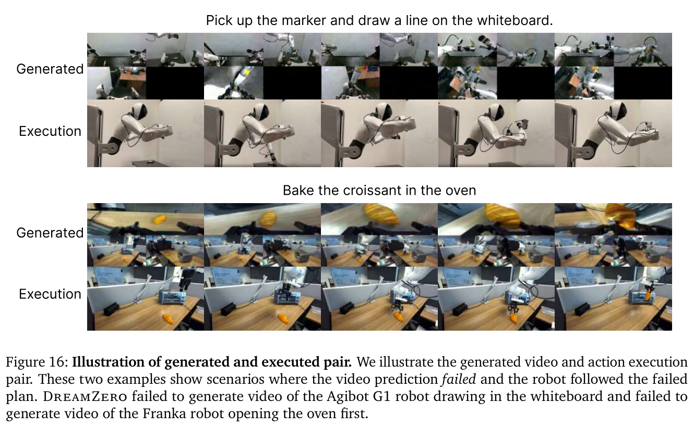

**Caption:** Qualitative generated-video and real-execution pairs used to inspect video-action alignment.

**Caption[CN]:** 用于检查视频—动作对齐的生成视频与真实执行配对。

### Figure 10. Post-training

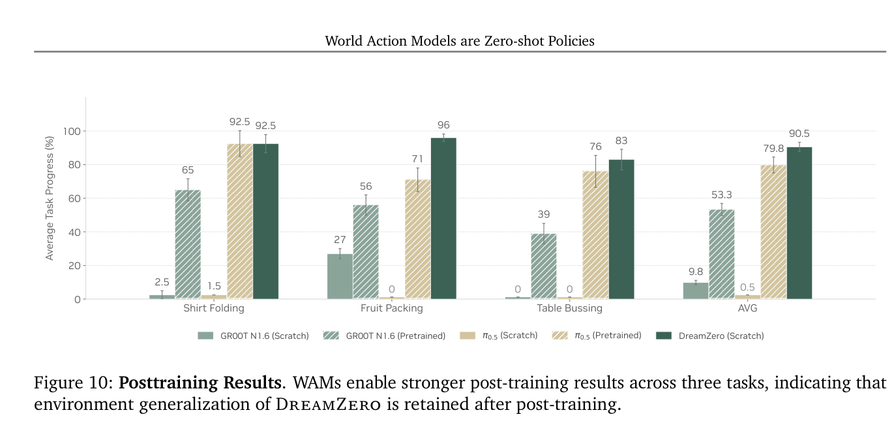

**Caption:** After task-specific training, DreamZero matches or exceeds pretrained VLAs on shirt folding, fruit packing, and table bussing in OOD environments.

**Caption[CN]:** 经任务专用训练后，DreamZero 在 OOD 环境的叠衬衫、水果装袋和清理餐桌上达到或超过 pretrained VLA。

> <strong>Para. 4:</strong> Post-training uses 33 hours for shirt folding, 12 hours for fruit packing, and 40 hours for table bussing, with 50K steps per task. DreamZero averages 90.5% progress across the three OOD evaluations, compared with 79.8% for pretrained $\pi_{0.5}$ and 53.3% for pretrained GR00T N1.6. The largest difference is fruit packing.

> <strong>Para. 4[CN]:</strong> post-training 分别使用 33 小时叠衬衫、12 小时水果装袋和 40 小时清理餐桌数据，每个 task 训练 50K steps。DreamZero 在三个 OOD 评测上的平均进度为 90.5%，pretrained $\pi_{0.5}$ 为 79.8%，pretrained GR00T N1.6 为 53.3%；最大差距来自水果装袋。

### Figure 11 and Table 2. Cross-embodiment video transfer

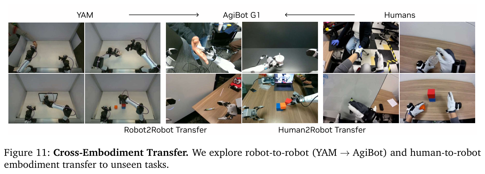

**Caption:** Robot-to-robot transfer uses YAM video; human-to-robot transfer uses egocentric human video.

**Caption[CN]:** Robot2Robot 使用 YAM 视频，Human2Robot 使用人类第一视角视频。

**Caption:** Video-only transfer raises unseen-task progress from 38.3% to 54.3% with human video and 55.4% with YAM video.

**Caption[CN]:** 纯视频迁移把未见任务进度从 38.3% 提高到人类视频的 54.3% 和 YAM 视频的 55.4%。

> <strong>Para. 5:</strong> Each transfer setting uses 72 trajectories over nine unseen tasks: eight videos per task, totaling 20 minutes for YAM and 12 minutes for humans. Cross-embodiment data receive only a video-prediction objective and are mixed 1:1 with AgiBot data for 10K steps. Robot2Robot improves 38.3% to 55.4%; Human2Robot improves it to 54.3%.

> <strong>Para. 5[CN]:</strong> 两种迁移各覆盖九个 unseen task、共 72 条轨迹，即每个 task 八条视频；YAM 总计 20 分钟，人类视频 12 分钟。跨机器人形态数据只使用视频预测目标，并与 AgiBot 数据按 1:1 混合训练 10K steps。Robot2Robot 把 38.3% 提高到 55.4%，Human2Robot 提高到 54.3%。

### Figure 12. Few-shot embodiment adaptation

**Caption:** A DreamZero-AgiBot checkpoint adapts to YAM using 55 trajectories from 11 tasks, about 30 minutes of play data, while retaining language-conditioned generalization to unseen objects.

**Caption[CN]:** DreamZero-AgiBot checkpoint 仅用 11 个 task 的 55 条轨迹、约 30 分钟 play data 适配 YAM，并保持对未见物体的语言条件化泛化。

> <strong>Para. 6:</strong> The authors hypothesize that few-shot embodiment adaptation is efficient because AgiBot and YAM have similar bimanual parallel grippers and because the model only needs to learn a new mapping from visual futures to actions. Failures again appear to be dominated by video-prediction errors.

> <strong>Para. 6[CN]:</strong> 作者认为少样本机器人形态适配高效有两个原因：AgiBot 与 YAM 都是双臂平行夹爪，形态相近；模型主要需要学习从视觉未来到新动作空间的映射。失败仍主要表现为视频预测错误。

### Tables 3–4. Flash and ablations

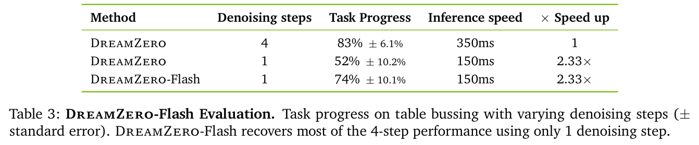

**Caption:** Four-step DreamZero scores 83% at 350 ms; direct one-step falls to 52% at 150 ms; one-step DreamZero-Flash recovers to 74%.

**Caption[CN]:** 四步 DreamZero 在 350 ms 时为 83%；直接单步在 150 ms 时降到 52%；单步 DreamZero-Flash 恢复到 74%。

**Caption:** Diverse data improves 33% to 50%; 14B improves over 5B from 21% to 50%; AR and bidirectional variants both reach 50% on PnP Easy.

**Caption[CN]:** diverse data 把 33% 提高到 50%；14B 相对 5B 从 21% 提高到 50%；AR 与 bidirectional 在 PnP Easy 上都为 50%。

> <strong>Para. 7:</strong> DreamZero-Flash recovers most but not all of the one-step degradation. In data ablations, 500 hours of diverse trajectories outperform 500 hours of repetitive demonstrations, 50% versus 33%. Model scaling is decisive for WAMs, 50% for 14B versus 21% for 5B, while matched VLA variants remain at 0%. AR and bidirectional WAMs tie in task progress, but AR produces smoother motion and runs 3–4× faster through KV caching.

> <strong>Para. 7[CN]:</strong> DreamZero-Flash 恢复了单步退化的大部分、但并非全部性能。数据消融中，同为 500 小时，多样轨迹以 50% 超过重复示范的 33%。模型规模对 WAM 至关重要：14B 为 50%，5B 为 21%；匹配构造的 VLA 变体仍为 0%。AR 与 bidirectional WAM 在任务进度上打平，但 AR 运动更平滑，并因 KV 缓存快 3–4 倍。

## 6. Discussion and Future Work

> <strong>Para. 1:</strong> The paper does not establish a scaling law, although larger video backbones and diverse data both help. It proposes future work on model/data/compute scaling, large in-the-wild egocentric video, and smaller video backbones. Current 7 Hz execution needs two GB200 GPUs, whereas some VLAs exceed 20 Hz on consumer hardware.

> <strong>Para. 1[CN]:</strong> 尽管更大的视频骨干和更多样数据都带来收益，论文尚未建立 scaling law。作者提出继续研究模型/数据/计算规模、大规模野外第一视角视频，以及更小的视频骨干。当前 7 Hz 执行需要两张 GB200，而部分 VLA 可在消费级硬件上超过 20 Hz。

> <strong>Para. 2:</strong> DreamZero is primarily a System 1 model with roughly six seconds of visual context. It has a mechanism for visual history but is not evaluated on tasks that require memory. Robust long-horizon behavior may need a System 2 planner or substantially longer WAM context.

> <strong>Para. 2[CN]:</strong> DreamZero 主要是一个 System 1 模型，视觉上下文约六秒。它具备保存视觉历史的机制，却没有在必须使用记忆才能完成的任务上评测。可靠长时执行可能需要 System 2 planner，或显著扩展 WAM 上下文。

> <strong>Para. 3:</strong> “Zero-shot” is defined relative to motions absent from embodiment-specific robot training, not to all visual pretraining. The experiments support strong transfer under this definition, but they do not prove universal WAM superiority, consumer-hardware practicality, or reliable open-world deployment.

> <strong>Para. 3[CN]:</strong> 文中的“零样本”是相对于目标机器人训练中没有的 motion，而不是相对于全部视觉预训练。实验在这个定义下支持强迁移，但没有证明 WAM 普遍优于 VLA、能在消费级硬件实用部署，或已经具备可靠开放世界能力。

## Appendices

> <strong>Para. 1:</strong> Appendix A contrasts video-space WAMs with latent, 3D point-cloud, and other world-model formulations. Video provides dense, interpretable supervision and pretrained dynamics, but pixel generation is computationally expensive. The paper treats video as the current practical world target rather than the only possible one.

> <strong>Para. 1[CN]:</strong> Appendix A 比较视频空间 WAM、latent world model、3D point-cloud 等形式。视频提供稠密、可解释的监督和预训练动力学，但像素生成计算昂贵。论文把视频视为当前可行的世界建模目标，而不是唯一选择。

> <strong>Para. 2:</strong> Appendices B–D explain why autoregressive sampling preserves temporal alignment, specify the modality-specific QKV mask, and provide training and closed-loop inference pseudocode. These details show that action tokens do not simply trail a generated movie; video, language, proprioception, and actions obey a carefully designed causal information pattern.

> <strong>Para. 2[CN]:</strong> Appendices B–D 解释自回归采样为何保留时间对齐，给出各模态 QKV mask，以及训练和闭环推理伪代码。这些细节说明动作 token 并非简单跟随生成影片，而是视频、语言、本体状态与动作遵守精心设计的因果信息流。

> <strong>Para. 3:</strong> Appendix E documents teleoperation across 22 environments, camera and robot configurations, action normalization, filtering, and training details. Relative joint positions are the default action representation; idle actions are filtered; multi-view images are concatenated; LoRA was tested but underperformed full DiT updating.

> <strong>Para. 3[CN]:</strong> Appendix E 记录 22 个环境的遥操作、相机与机器人配置、动作归一化、过滤和训练细节。默认动作表征为 relative joint position；idle action 被过滤；多视角图像直接拼接；作者尝试 LoRA，但表现不如更新完整 DiT。

> <strong>Para. 4:</strong> Appendices F–G enumerate AgiBot and DROID evaluation prompts, initial configurations, partial-progress scoring, and additional per-task results. These details are necessary because “task progress” differs across folding stages, packed objects, cleared items, and other behaviors.

> <strong>Para. 4[CN]:</strong> Appendices F–G 列出 AgiBot 与 DROID 的评测提示、初始配置、部分进度计分和逐任务结果。由于“任务进度”在折叠阶段、装袋物体数、清理物体数和其他行为之间定义不同，这些细节是解释数字的必要条件。

> <strong>Para. 5:</strong> The appendix also makes the reproducibility boundary clear: DROID checkpoints and inference code are released for PolaRiS simulation, while the full in-house AgiBot corpus is planned for a later release. The headline real-robot result is therefore not yet independently reproducible end to end.

> <strong>Para. 5[CN]:</strong> 附录也明确了复现边界：作者已发布 DROID checkpoint 与 PolaRiS 仿真的 inference code，但完整 AgiBot 私有数据计划后续开放。因此，标题对应的真实机器人主结果当前还不能被外部端到端独立复现。

## References

The bibliography occupies pages 30–36 and is preserved in the source PDF. Following the reader contract, individual entries are not translated line by line. The central lineages covered in the body are VLA robot foundation models, video generation for planning and inverse dynamics, joint video-action models, pretrained video diffusion, latent world models, flow matching, diffusion acceleration, and cross-embodiment learning.

参考文献位于 PDF 第 30–36 页。按阅读器约定，不逐条翻译 bibliography；正文已经保留与本文论证直接相关的 VLA 机器人基础模型、视频规划与逆动力学、联合 video-action model、预训练视频扩散、latent world model、flow matching、扩散加速和跨机器人形态学习等技术谱系。

## Critical Reading Notes

- DreamZero 的最强证据是多个 setting 下方向一致，而非单一 benchmark 峰值：AgiBot/DROID、seen/unseen、pretraining/post-training 都支持 WAM 的泛化优势。
- 论文没有完全分离 14B video backbone、joint objective、异构数据和系统 recipe 的贡献；“WAM 胜过 VLA”仍应理解为当前受控比较中的结果。
- task progress 是部分完成度，跨任务数值不一定同尺度；部署可靠性应更多看 success rate、failure mode 与安全回退。
- video-only cross-embodiment transfer 是最有扩展潜力的结论，但当前只有 12–20 分钟实验室数据和较大的标准误。
- 7 Hz 是 2×GB200 上的系统结果。它证明大视频模型可以进入闭环，不代表已经达到低成本实时策略。
- 失败主要来自生成视频这一观察提示新的安全问题：WAM 可能把视觉 hallucination 直接转成动作，需要 future verifier 或拒绝机制。
