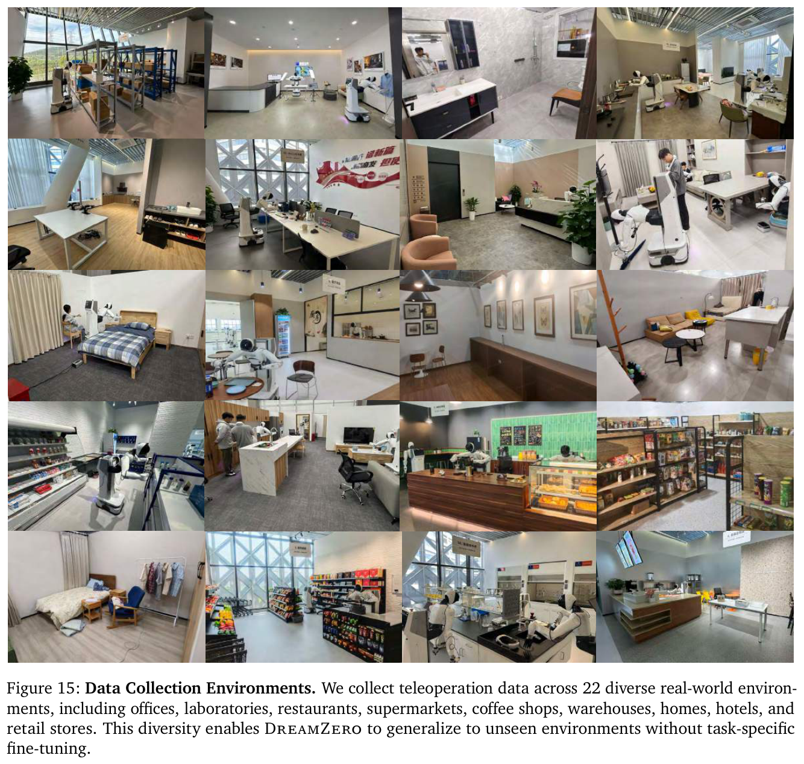
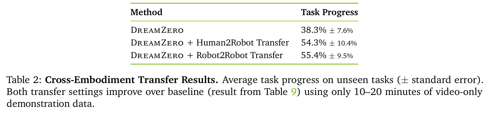
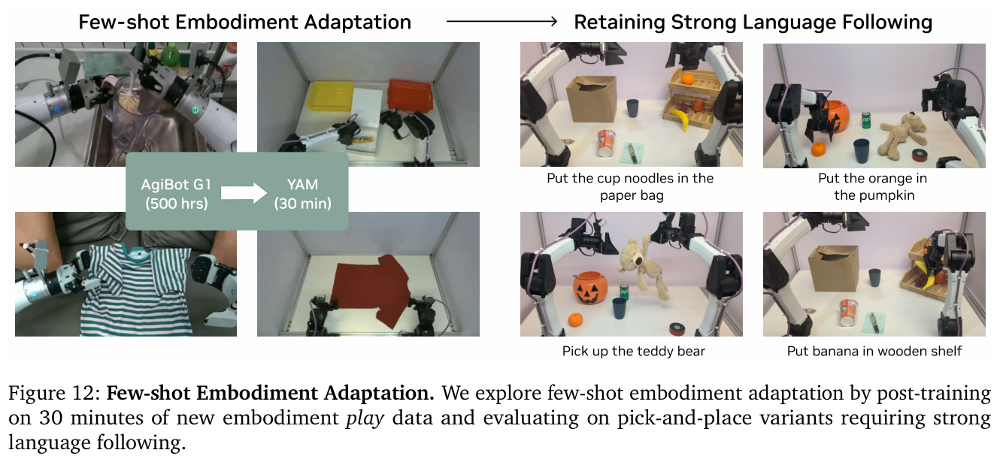

---
tags:
  - papers/WorldModel
  - robotics
  - world-action-model
aliases:
  - DreamZero
  - World Action Models
  - 世界动作模型即零样本策略
date: 2026-02-17
doi: 10.48550/arXiv.2602.15922
arxiv_id: 2602.15922
---

# World Action Models are Zero-shot Policies

## 核心信息

- 标题: World Action Models are Zero-shot Policies
- 标题翻译: 世界动作模型即零样本策略
- 作者: Seonghyeon Ye, Yunhao Ge, Kaiyuan Zheng, Shenyuan Gao, Sihyun Yu, George Kurian, Suneel Indupuru, You Liang Tan, Chuning Zhu, Jiannan Xiang, Ayaan Malik, Kyungmin Lee, William Liang, Nadun Ranawaka, Jiasheng Gu, Yinzhen Xu, Guanzhi Wang, Fengyuan Hu, Avnish Narayan, Johan Bjorck, Jing Wang, Gwanghyun Kim, Dantong Niu, Ruijie Zheng, Yuqi Xie, Jimmy Wu, Qi Wang, Ryan Julian, Danfei Xu, Yilun Du, Yevgen Chebotar, Scott Reed, Jan Kautz, Yuke Zhu, Linxi “Jim” Fan, Joel Jang
- 机构: NVIDIA
- 发表时间: 2026-02-17
- 发表渠道: arXiv 预印本
- DOI: 10.48550/arXiv.2602.15922
- arXiv: 2602.15922
- 论文链接: https://arxiv.org/abs/2602.15922
- 代码 / 项目: https://dreamzero0.github.io；https://github.com/dreamzero0/dreamzero
- 数据 / 资源: DROID；约 500 小时 AgiBot G1 遥操作数据（作者计划后续开放）
- 论文类型: 机器人基础模型 / AI 方法论文

## 原文摘要翻译

最先进的视觉—语言—动作模型在语义泛化方面表现出色，但难以在新环境中泛化到未见过的物理动作。本文提出 DreamZero：一种建立在预训练视频扩散骨干之上的世界动作模型。不同于视觉—语言—动作模型，世界动作模型通过预测未来世界状态与动作来学习物理动力学，并以视频作为世界如何演化的稠密表征。通过联合建模视频和动作，DreamZero 能够从异构机器人数据中有效学习多样技能，而不依赖重复示范。在真实机器人实验中，它对新任务和新环境的泛化能力相较最先进视觉—语言—动作模型提升超过两倍。通过模型与系统优化，作者进一步使一个 140 亿参数的自回归视频扩散模型能够以 7 Hz 进行实时闭环控制。最后，论文展示两种跨机器人形态迁移：来自其他机器人或人类的纯视频示范，只需 10–20 分钟数据，便能使未见任务表现相对提高超过 42%；DreamZero 还可仅用 30 分钟自由操作数据适配新机器人形态，同时保留零样本泛化能力。

## 创新点

1. **把 WAM 从辅助预测目标推到可执行策略。** DreamZero 不是在 VLA 旁边附加一个视频头，而是以同一自回归 DiT 联合去噪未来视频与动作；未来视频充当隐式视觉规划器，动作头则学习由视觉未来到控制量的 inverse dynamics。
2. **利用闭环条件修复自回归世界模型的固有弱点。** 每个 action chunk 执行后，真实观测替换生成帧写回 KV cache。于是模型可以保留自回归历史和原生帧率，却不必承受纯 open-loop 视频生成的长期误差累积。
3. **把 14B 视频扩散模型压到机器人可用时延。** 异步执行、CFG 并行、DiT 缓存、编译与计算图、定制算子、NVFP4 量化，以及 DreamZero-Flash 单步去噪共同将约 5.7 秒降至约 150 毫秒。
4. **把跨 embodiment 学习转化为无动作标注的视频学习。** 其他机器人或人类数据只施加视频预测目标，目标机器人数据仍施加联合视频—动作目标；这提供了一条利用大量 human video 扩展机器人技能的路径。

*Fig. 1：论文总览同时串起多样低重复数据、零样本任务泛化、纯视频跨机器人形态迁移和 30 分钟新形态适配；裁切包含首页标题区，但图体与原始图注完整。*

## 一句话总结

这篇论文真正有分量的地方，是把“视频模型懂物理”变成了一条有真实机器人主结果、跨 embodiment 迁移和实时系统支撑的策略学习路线；但它证明的是特定 14B backbone、私有异构数据和昂贵硬件组合下的强结果，还不是 WAM 普遍优于 VLA 的定律。

## 研究问题

现有 VLA 继承了 VLM 的语言和语义知识，因此能识别“把可乐罐移到 Taylor Swift”中的目标，却未必知道从未在机器人数据中出现的“解鞋带”应该如何产生精确的几何接触与连续运动。语义先验回答的是“做什么”，机器人控制还需要“怎样做”，后者依赖空间、动力学、接触和动作时序。

作者的核心假设是：web-scale 视频预训练已经编码了比静态视觉—语言预训练更丰富的时空与物理先验。若策略显式预测未来视频，再从视频未来中提取动作，那么机器人数据不必为每个任务收集大量重复 demonstration；更广的状态—动作对应关系反而更有价值。

这带来三个具体技术问题：视频未来与动作如何紧密对齐；bidirectional 和 autoregressive 架构谁更适合闭环；以及 14B 视频扩散模型如何从每个 action chunk 约 5.7 s 降到可以反应的时延。

## 数据与任务定义

### 数据版图

主训练分别覆盖两种 embodiment，并没有做统一 multi-embodiment policy：

| 数据 / embodiment | 规模与用途 | 关键特征 |
|---|---:|---|
| AgiBot G1 | 约 500 小时，7193 episodes，22 个真实环境 | 每 episode 平均 4.4 分钟、42.4 个 subtask；强调多样、长时、低重复 |
| DROID-Franka | 公开 DROID 数据 | 验证异构公开数据上的趋势与部分可复现性 |
| YAM 视频 | 9 个未见任务，共 20 分钟 | 仅视频目标，用于 Robot2Robot transfer |
| 人类第一视角视频 | 9 个未见任务，共 12 分钟 | 仅视频目标，用于 Human2Robot transfer |
| YAM 自由操作数据 | 55 条轨迹、11 个任务、约 30 分钟 | 从 AgiBot 检查点适配新机器人形态 |

*Fig. 15：AgiBot 遥操作数据覆盖的 22 个办公室、住宅、餐饮、超市与零售等真实环境；图片裁切清晰、身份匹配。*

### 评测怎样定义“未见”

已见任务允许物体外观、尺寸和环境改变，只要所需动作模式与训练任务相同；未见任务则要求动作模式本身不在训练分布，例如解鞋带、熨衣、用刷子作画、握手和拉车。AgiBot 每个检查点的已见与未见任务各进行 80 次试验；DROID-Franka 在 20 个已见和 20 个未见任务上各做 2 次，共 80 次。

默认评测地点与训练数据的地理位置不同，因此环境、物体和布局也同时处于分布外。这使基准很难，但也意味着任务分布外与环境分布外并未完全正交拆开。核心指标“任务进度”按任务阶段完成比例计分，并不总等同于整条轨迹成功。

## 方法主线

### 机制流程

1. **输入 → 编码 → 联合潜变量。** 当前与历史图像经 VAE 编码，语言经文本编码器处理，本体状态经状态编码器处理；动作和视频潜变量加噪后进入同一个因果 DiT。
2. **联合流匹配 → 视觉未来与动作块。** 模型以共享时序条件联合预测视频和动作速度场；视频解码器生成未来帧，动作解码器输出连续动作块。
3. **异步执行 → 真实机器人。** 控制器持续执行最近生成的 48-step action chunk，推理线程同时处理最新观测，避免机器人等待模型。
4. **真实观测回填 → 下一轮 KV cache。** chunk 执行后用真实帧替换预测帧，下一轮从真实世界状态继续；这把自回归误差限制在单个闭环周期内。

*Fig. 4：DreamZero 的联合训练与闭环推理链。裁切完整展示了 teacher forcing、两个 decoder、异步执行和真实观测回填。*

### 联合视频—动作分解

作者把联合策略写成未来视频预测与 inverse dynamics 的乘积：

$$
\pi(o_{l:l+H},a_{l:l+H}\mid o_{0:l},c,q_l)
=
\pi(o_{l:l+H}\mid o_{0:l},c,q_l)
\pi(a_{l:l+H}\mid o_{0:l+H},q_l).
$$

与“先生成视频，再交给另一个 IDM”不同，DreamZero 用一个模型端到端学习两个因子。其工程含义是：动作标记能在 DiT 内部直接读取未来视频表征，而不是只接收冻结或离散化的规划器输出。

### 训练目标与 chunk-wise 自回归

每个动作块的干净视频潜变量 $z_1^k$ 与动作 $a_1^k$ 分别同高斯噪声 $z_0^k,a_0^k$ 做线性插值。标准 DreamZero 对视频和动作共享时间步：

$$
z_t^k=t_k z_1^k+(1-t_k)z_0^k,\qquad a_t^k=t_k a_1^k+(1-t_k)a_0^k.
$$

模型预测联合速度场 $v^k=[z_1^k,a_1^k]-[z_0^k,a_0^k]$：

$$
\mathcal{L}(\theta)=
\mathbb{E}\left[
w(t_k)\left\|
u_\theta([z_t^k,a_t^k];\mathcal{C}_k,c,q_k,t_k)-v^k
\right\|_2^2
\right].
$$

教师强制使带噪的当前动作块只能注意干净的历史动作块。视频按块自回归，动作则不跨闭环动作块自回归，以免动作误差沿控制循环传播。

> [!figure] Algorithm 1：DreamZero 训练（流匹配）
> 建议位置：训练目标与动作块自回归
> 放置原因：原算法给出噪声采样、注意力掩码与联合速度目标的伪代码。
> 当前状态：人工检查发现自动裁切混入 Algorithm 2 和大段正文，未形成独立可靠图块；保留占位，关键步骤已在正文转写。

> [!figure] Algorithm 2：DreamZero 闭环推理
> 建议位置：机制流程
> 放置原因：原算法明确 KV 缓存初始化、动作块执行和真实观测回填顺序。
> 当前状态：人工检查发现自动裁切只有标题附近窄条且混入 Algorithm 1 标识，未插入不可靠图片；执行链已在四步流程中转写。

### 为什么选 autoregressive

双向视频扩散通常处理固定长度片段。若试验的采样点落在任务中间，为匹配整段语言描述就可能重采样视频并破坏原生帧率，造成视频—动作时间错位。自回归模型直接以前序视觉上下文条件化下一动作块，既能保留原生帧率，也支持 KV 缓存。

*Fig. 13：bidirectional WAM 在任务中点采样时的视频—动作错配，以及 autoregressive WAM 的上下文条件化方案。*

值得注意的是，表 4 中 AR 与 BD 在简单抓放任务上的任务进度都是 50%；论文对 AR 的直接证据主要是运动更平滑和推理快 3–4 倍，而非该消融上的准确率提升。

### DreamZero-Flash

标准模型在少步推理时会遇到训练—测试错配：训练时视频和动作处在相同噪声水平，但单步推理需要在视频仍很噪时产出接近干净的动作。Flash 让动作时间步继续均匀采样，同时令视频时间步偏向高噪声，具体采用下式：

$$
\eta\sim\mathrm{Beta}(7,1),\qquad t_{video}=1-\eta.
$$

于是模型在训练中反复学习“从 noisy visual context 恢复 clean action”。这不是普通蒸馏，而是改变跨模态噪声联合分布，使训练条件直接匹配单步部署条件。

### 实时系统

异步执行首先把“推理必须立即结束”放宽为“推理需在当前动作块用完前完成”。AgiBot 的动作块为 48 步、控制频率 30 Hz，即约 1.6 秒；系统目标则进一步设在约 200 毫秒，以保留平滑重叠。

*Table 1：从 CFG 并行、DiT caching 到 NVFP4 和 Flash 的累计加速；表格清晰且包含硬件差异。*

逐层加速不能被简单理解为全都“无损”。CFG 并行、编译、CUDA 计算图与算子调整在数学上等价；DiT 缓存和 NVFP4 量化可能改变数值行为；Flash 则改变训练分布，并用任务结果验证速度—精度折中。

## 关键结果

### 主结果与强基线

| 设置 | DreamZero | 最强 pretrained VLA | 解释 |
|---|---:|---:|---|
| AgiBot seen task，平均进度 | 62.2% | 27.4% | 超过 2 倍；scratch VLA 近乎失效 |
| AgiBot unseen task，平均进度 | 39.5% | 16.3% | 新 motion 与新环境同时出现 |
| DROID-Franka unseen，进度 / 成功率 | 49% / 22.5% | 33% / 12.5% 或 31% / 12.5% | 在公开异构数据上趋势一致 |
| post-training 三任务平均进度 | 90.5% | 79.8% | 在新地理环境中仍保留泛化 |

这里最值得重视的不是某个单任务峰值，而是同一差距在 AgiBot 与 DROID、已见与未见任务、预训练与任务后训练后均出现。它降低了“只适配某一个基准”的可能性，但仍没有排除 14B 视频骨干与数据配方的联合影响。

*Fig. 10：叠衬衫、水果装袋与清理餐桌在任务后训练后的分布外结果；DreamZero 平均 90.5%。*

### 跨 embodiment

*Fig. 11：YAM→AgiBot 与 Human→AgiBot 的纯视频迁移设置。*

*Table 2：9 个未见任务的平均进度；Human2Robot 为 54.3%，Robot2Robot 为 55.4%，baseline 为 38.3%。*

Robot2Robot 的绝对提升为 17.1 点，Human2Robot 为 16.0 点；若按基线计算，相对提升约 44.6% 和 41.8%。但每个设置只有 72 条视频、9 个任务，标准误在 7.6%–10.4% 之间。这是有吸引力的早期信号，而不是“大规模人类视频已解决机器人数据瓶颈”的证据。

*Fig. 12：仅用 30 分钟 YAM 自由操作数据进行新机器人形态适配，并在南瓜、玩具熊、杯面等未见物体上保持语言条件化。*

### Flash 的速度—精度

| 模型 | 去噪步数 | Table-bussing 进度 | 时延 |
|---|---:|---:|---:|
| DreamZero | 4 | $83\%\pm6.1\%$ | 350 ms |
| DreamZero | 1 | $52\%\pm10.2\%$ | 150 ms |
| DreamZero-Flash | 1 | $74\%\pm10.1\%$ | 150 ms |

Flash 恢复了直接单步推理丢失的 22 个百分点，但仍比四步基线低 9 点。论文用“性能损失很小”描述整体部署效果略显乐观；在该单项任务上，这个差距对高可靠操作并不小。

### 消融到底说明了什么

*Table 4：数据多样性、模型规模和 AR/BD 架构消融；裁切清晰且数值完整。*

- diverse data 将进度从 33% 提高到 50%，说明覆盖广泛 state-action correspondence 比同任务重复更适合 WAM 的 IDM 学习。
- 14B 相对 5B 从 21% 提高到 50%，支持 video backbone 容量对 WAM 至关重要；作者观察 5B 更容易产生视觉 hallucination。
- 同样的 5B/14B VLA 在 diverse data 下均为 0%，说明单纯扩大 VLA 容量不能解决异构数据学习，但该 VLA 构造是作者自行匹配的架构，并非所有大 VLA 的普遍结论。
- AR 与 BD 都是 50%，因此该实验没有证明 AR 更准；它证明的是 AR 可在相近任务结果下获得更平滑动作和 3–4× 更快推理。

## 深度分析

### 真正贡献是什么

论文的范式贡献是把动作学习拆成“生成可执行的视觉未来”与“从视觉未来提取动作”，同时仍保持一个端到端模型。此前视频规划器加 IDM 已存在，联合视频—动作也不是首次出现；DreamZero 的新意在于把这条路线扩展到 14B、500 小时异构数据、真实机器人分布外场景、新技能、跨机器人形态纯视频和 7 Hz 闭环，并让这些证据互相支撑。

工程贡献同样重要。若没有异步动作块执行、缓存、并行、编译、算子、量化和 Flash，14B 视频扩散模型只是一个耗时 5.7 秒的离线规划器。论文标题强调“零样本策略”，真正把世界模型变成策略的恰恰是这一整套系统。

### 为什么结果成立

第一，视频提供比 action label 更稠密的监督。每相邻帧都包含对象运动、接触结果和场景变化，而 VLA 的 action objective 必须从高方差异构轨迹中直接拟合控制量。

第二，预训练视频骨干已经具备通用运动先验，机器人训练更像是在学习形态专用的逆动力学。这个视角也解释了 30 分钟 YAM 适配：当形态相近时，模型主要补齐“这个视觉未来对应哪些新关节动作”。

第三，闭环真值回填改变了自回归视频模型的误差性质。它不是要求模型准确模拟几十秒，而是每个 chunk 都重新锚定真实世界；预测只需在局部 horizon 内足够好。

### 容易误读的地方

“zero-shot”不是从未见过相关视觉概念。Wan2.1 的互联网视频预训练可能已经包含解鞋带、握手或熨衣；真正未见的是目标 robot 数据中的 task motion。论文证明的是视觉知识向机器人控制的迁移，不是无先验地发明物理技能。

“大多数失败来自视频生成”也不等于动作抽取已被完全解决。作者的判断来自生成—执行对齐的定性观察，缺少系统化 error taxonomy；视频与动作共享 backbone，错误源在内部未必能严格分离。

### 复现注意点

1. 骨干为 Wan2.1-I2V-14B-480P；更新全部 DiT 模块、状态/动作编码器与动作解码器，冻结文本编码器、图像编码器和 VAE。
2. AgiBot 与 DROID 均训练 100K 步、全局批量 128；消融为 50K 步、批量 32，不能直接与完整模型数值横比。
3. 多视角输入直接拼成单帧；默认 action 为 relative joint position，并过滤 idle action。
4. 动作时域为 48、控制频率为 30 Hz；异步调度、观测时间戳与动作块重叠必须严格复现。
5. CFG 并行需要两张 GPU；完整 150 毫秒结果依赖 GB200、NVFP4 和定制算子，不应拿普通 H100 或消费卡时延直接比较。
6. action chunk 先上采样 2×，经 Savitzky–Golay filter 平滑，再下采样；这部分会影响高频控制与复现轨迹质量。
7. 私有 AgiBot 数据尚未完整开放；当前最现实的复现入口是 DROID checkpoint、inference code 与 PolaRiS 仿真。

## 局限

1. **算力与部署成本高。** 7 Hz 依赖 2×GB200；即使算法成立，也难直接成为轻量 System 1 policy。
2. **主数据暂不完全公开。** AgiBot 500 小时数据是多项关键结论的基础，独立复现仍受限。
3. **评测因素纠缠。** 地理 OOD、环境 OOD、物体 OOD 与 task OOD 同时发生，难以判断每个因素的独立贡献。
4. **成功率仍有限。** AgiBot unseen 平均进度 39.5%，DROID unseen 成功率 22.5%，跨 embodiment 后进度约 55%；距离可靠机器人部署还有明显差距。
5. **长期记忆没有被验证。** 虽然 KV 缓存保存视觉历史，但作者明确未评测必须依赖记忆才能完成的任务；现有上下文约 6 秒。
6. **跨 embodiment 证据仍小规模。** human video 只有 12 分钟且为实验室第一视角，不能代表互联网视频的噪声、视角和任务分布。
7. **因果消融不充分。** joint objective、video pretraining、参数规模、数据多样性和系统 recipe 高度耦合；当前实验无法精确分配收益。

## 我的笔记

- 对世界模型研究最重要的启示：不要只问“预测未来是否降低策略损失”，要问预测模态能否成为跨数据源、跨机器人形态的公共接口。DreamZero 的纯视频迁移是比主榜单更值得追踪的方向。
- Flash 的思路很通用：多模态 diffusion 在 few-step 推理时，各模态的有效噪声水平未必同步。训练时显式采样部署会遇到的异步噪声状态，可能适用于 video-action、vision-tactile 或 audio-motion。
- 下一步实验应做严格的同骨干对照：同一个 Wan DiT、相同 14B、相同数据和预算，只切换纯动作、视频辅助、联合分解三种目标，才能回答 WAM 的净贡献。
- 如果要落地，优先做 generated-future verifier。视频错误会被 action head 忠实执行，因此系统需要在 chunk 执行前检查几何穿透、目标漂移、接触不一致或运动不可达，并能拒绝或重新采样。
- 在本地研究地图中，这篇工作属于“以生成式世界预测承担低层隐式规划的具身基础策略”，和显式三维世界模型、潜在动力学模型、工具代理是互补而非替代关系。

## 引用

Ye, S. et al. *World Action Models are Zero-shot Policies*. arXiv:2602.15922 (2026). DOI: 10.48550/arXiv.2602.15922.
