# World-Language-Action Model for Unified World Modeling, Language Reasoning, and Action Synthesis

**中文题名：** 世界—语言—动作模型：统一世界建模、语言推理与动作合成
**Authors:** Yi Yang, Zhihong Liu, Siqi Kou, Yiyang Chen, Yanzhe Hu, Jianbo Zhou, Boyuan Zhao, Zhijie Wei, Xiao Xia, Xueqi Li, Pengfei Liu, Zhijie Deng
**Source:** `/Users/roywangj/journey_wj/research/papers4zotero/zotero1/storage/QQYHMR5W/Yang 等 - 2026 - World-Language-Action Model for Unified World Modeling, Language Reasoning, and Action Synthesis.pdf`
**Detected source format:** selectable-text PDF (`pdf-text`)
**Reader type:** complete paragraph-level English–Chinese detailed reader with searchable tables and local assets.
**Version:** arXiv:2606.05979v1, 19 PDF pages, dated June 5, 2026.
**Code:** https://github.com/SJTU-DENG-Lab/WLA

## Page / Section Index

| PDF pages | Content |
|---|---|
| 1–2 | Abstract; 1 Introduction; Figure 1; 2 Related Work |
| 3–5 | 3 Methodology; Figure 2; equations (3.1)–(3.5); Table 1; 3.2 Inference Optimization; 4.1 Implementation Details |
| 6–8 | Tables 2–3; 4.2 Simulation; Figure 3; 4.3 Real World; 4.4 Video Learning; Figure 4 |
| 9–12 | 5 Conclusion; 6 Limitations; References [1]–[60] |
| 13–19 | Appendix A–D; Tables 4–7; Figures 5–10 |

## Terminology Ledger

| Canonical term | 中文统一译法 | Note |
|---|---|---|
| World-Language-Action model (WLA) | 世界—语言—动作模型 | Unified model family |
| World Action Model (WAM) | 世界—动作模型 | World-model-based action model |
| Vision-Language-Action model (VLA) | 视觉—语言—动作模型 | Language-conditioned action model |
| textual intention / subtask | 文本意图 / 文本子任务 | Semantic next-state representation |
| physical dynamics | 物理动力学 | Fine-grained transition representation |
| World Expert | 世界专家 | Future target-frame predictor |
| Action Expert | 动作专家 | Robot action generator |
| meta-query | 元查询 | Shared conditioning/query mechanism |
| latent action | 潜动作 | Minimal transition information |
| test-time scaling (TTS) | 测试时扩展 | Candidate imagination plus value selection |
| value model | 价值模型 | Scores imagined future states |
| flow matching | 流匹配 | Action/world training and inference objective |
| CUDA Graph Capture | CUDA 图捕获 | Deployment acceleration |
| operator fusion | 算子融合 | Triton-kernel optimization |
| cross-embodiment | 跨本体 | Transfer across robot embodiments |
| human egocentric video | 人类第一视角视频 | Human video source in Appendix D |

---

> <strong>Authors:</strong> Yi Yang$^{1,2,\dagger}$, Zhihong Liu$^{1,\dagger}$, Siqi Kou$^{1,\dagger}$, Yiyang Chen$^1$, Yanzhe Hu$^3$, Jianbo Zhou$^4$, Boyuan Zhao$^5$, Zhijie Wei$^6$, Xiao Xia$^1$, Xueqi Li$^{2,7}$, Pengfei Liu$^{1,2}$, Zhijie Deng$^{1,\ddagger}$

> <strong>作者：</strong> Yi Yang（杨毅）$^{1,2,\dagger}$、Zhihong Liu（刘志宏）$^{1,\dagger}$、Siqi Kou（寇思齐）$^{1,\dagger}$、Yiyang Chen（陈一扬）$^1$、Yanzhe Hu（胡彦哲）$^3$、Jianbo Zhou（周建波）$^4$、Boyuan Zhao（赵博远）$^5$、Zhijie Wei（魏志杰）$^6$、Xiao Xia（夏潇）$^1$、Xueqi Li（李雪琪）$^{2,7}$、Pengfei Liu（刘鹏飞）$^{1,2}$、Zhijie Deng（邓志杰）$^{1,\ddagger}$

> <strong>Affiliations:</strong> $^1$SJTU, $^2$SII, $^3$HUST, $^4$SCUT, $^5$ECUST, $^6$SHU, $^7$NJUPT. $^\dagger$Equal Contribution, $^\ddagger$Corresponding Author.

> <strong>单位与贡献说明：</strong> $^1$上海交通大学（SJTU），$^2$上海人工智能实验室（SII），$^3$华中科技大学（HUST），$^4$华南理工大学（SCUT），$^5$华东理工大学（ECUST），$^6$上海大学（SHU），$^7$南京邮电大学（NJUPT）。$^\dagger$同等贡献，$^\ddagger$通讯作者。

> <strong>Source metadata:</strong> arXiv:2606.05979v1 [cs.RO], 4 Jun 2026. Date: June 5, 2026. Code: https://github.com/SJTU-DENG-Lab/WLA

> <strong>来源信息：</strong> arXiv:2606.05979v1 [cs.RO]，2026 年 6 月 4 日。文稿日期：2026 年 6 月 5 日。代码：https://github.com/SJTU-DENG-Lab/WLA

## Abstract / 摘要

> <strong>Para. 1:</strong> We propose world-language-action (WLA) models as a new class of embodied foundation models. WLA takes textual instructions, images, and robot states as inputs to jointly predict textual subtasks, subgoal images, and robot actions, conjoining the world modeling interface to learn from extensive egocentric videos as in the world-action model (WAM) and the language reasoning capacities to solve complex long-horizon tasks as in vision-language-action (VLA) models. At the core of WLA lies an autoregressive (AR) Transformer backbone, instead of a bidirectional diffusion Transformer as in WAMs, to predict the next state, comprising the semantic-level textual intention and complementary fine-grained physical dynamics. The physical dynamics are supervised by the world modeling objective based on a dedicated World Expert, and are leveraged to ease the characterization of the state-action correlation for the Action Expert. WLA leverages meta-queries to make the world prediction implicitly impact the action generation so that the former can be disabled during inference. The world prediction can also be activated to enable test-time scaling for improved robot control. Our WLA-0 prototype, with 2B active parameters, achieves 40 ms per inference on an NVIDIA RTX 5090. Evaluations across simulated and real-world environments demonstrate that WLA-0 achieves state-of-the-art multi-task and long-horizon learning abilities, e.g., 92.94% success rate on RoboTwin2.0 Clean and 56.5% success rate on RMBench. WLA-0 also holds the promise to learn novel tasks directly from cross-embodiment robot videos without action annotations.

> <strong>Para. 1[CN]:</strong> 我们提出世界—语言—动作（world-language-action，WLA）模型，将其作为一类新的具身基础模型。WLA 以文本指令、图像和机器人状态为输入，联合预测文本子任务、子目标图像和机器人动作：它一方面结合世界—动作模型（world-action model，WAM）中的世界建模接口，以便从大规模第一视角视频中学习；另一方面结合视觉—语言—动作（vision-language-action，VLA）模型的语言推理能力，以解决复杂的长时程任务。WLA 的核心是一个自回归（autoregressive，AR）Transformer 骨干网络，而不是 WAM 所采用的双向扩散 Transformer；该骨干用于预测下一状态，其中既包含语义层面的文本意图，也包含与之互补的细粒度物理动力学。物理动力学由一个专门的世界专家（World Expert）基于世界建模目标进行监督，并被用于帮助动作专家（Action Expert）刻画状态与动作之间的相关性。WLA 利用元查询（meta-queries），使世界预测以隐式方式影响动作生成，从而可在推理期间禁用世界预测模块。世界预测也可以被启用，以支持测试时扩展（test-time scaling），进而改善机器人控制。我们的 WLA-0 原型在仅激活 2B 参数的情况下，于 NVIDIA RTX 5090 上实现了每次推理 40 ms 的速度。在仿真和真实世界环境中的评估表明，WLA-0 具备最先进的多任务与长时程学习能力，例如在 RoboTwin2.0 Clean 上取得 92.94% 的成功率，在 RMBench 上取得 56.5% 的成功率。WLA-0 还有望直接从不含动作标注的跨本体机器人视频中学习新任务。

# 1 Introduction / 引言

> <strong>Para. 1:</strong> World models (WMs) [1, 7, 9, 21] aim to model physical dynamics and underpin physical AI. Recently, world-action models (WAMs) [28, 40, 52] have emerged as a compelling paradigm that integrates WMs for embodied control. The world modeling interface enables WAMs to benefit from large-scale pretraining on egocentric videos. The prediction of physical dynamics provides strong future-state priors that facilitate effective action prediction. However, current methods focus almost exclusively on predicting the next visual state, burdening models with low-level details and restricting their capacity for semantic reasoning and extrapolation.

> <strong>Para. 1[CN]:</strong> 世界模型（world models，WMs）[1, 7, 9, 21] 旨在对物理动力学进行建模，并为物理人工智能奠定基础。近年来，世界—动作模型（WAMs）[28, 40, 52] 已成为一种颇具吸引力的范式，它将世界模型集成到具身控制之中。世界建模接口使 WAM 能够受益于在大规模第一视角视频上的预训练。对物理动力学的预测能够提供强有力的未来状态先验，从而促进有效的动作预测。然而，当前方法几乎完全专注于预测下一个视觉状态，这不仅使模型背负了大量底层细节，也限制了其语义推理与外推能力。

> <strong>Para. 2:</strong> To bridge this gap, our key insight is that the next state should comprise both high-level textual intention and low-level physical dynamics. Specifically, the former offers a compact, highly generalizable abstract representation of future states, which can be readily obtained given the prevalence of large language models (LLMs) [8]. The latter serves as a bridge between high-level intention and fine-grained motion control, but it differs from the high-resolution visual state in that it only describes the transitions between such states.

> <strong>Para. 2[CN]:</strong> 为弥合这一差距，我们的关键洞见是：下一状态应同时包含高层文本意图与底层物理动力学。具体而言，前者为未来状态提供了一种紧凑且具有高度泛化能力的抽象表示；鉴于大语言模型（large language models，LLMs）[8] 已广泛普及，这种表示可以很容易地获得。后者充当高层意图与细粒度运动控制之间的桥梁；但与高分辨率视觉状态不同，它仅描述这些状态之间发生的转变。

> <strong>Para. 3:</strong> We propose world-language-action (WLA) models, a new family of embodied foundation models, to connect such next-state prediction to action synthesis. WLA adopts an autoregressive (AR) Transformer capable of text generation as the backbone, which stands in stark contrast to existing WAMs built upon bidirectional diffusion Transformers (DiT) [42, 46]. In practice, WLA confines the high-level intention to textual subtasks decomposed from the original instructions, and opts to inherit the language modeling abilities and context management schemes of existing vision-language models (VLMs) [2, 35]. Compared with vision-language-action (VLA) models [27, 60], WLA adopts the high-level intention to guide the generation of both physical dynamics and action prediction — whereas VLA rarely does so for action prediction. Accordingly, WLA can exploit heterogeneous data, including cross-embodiment robot videos, with or without action annotations.

> <strong>Para. 3[CN]:</strong> 我们提出世界—语言—动作（WLA）模型这一新的具身基础模型家族，以便将上述下一状态预测与动作合成连接起来。WLA 采用具备文本生成能力的自回归（AR）Transformer 作为骨干网络，这与现有 WAM 基于双向扩散 Transformer（diffusion Transformer，DiT）[42, 46] 的设计形成鲜明对比。在实践中，WLA 将高层意图限定为从原始指令中分解出的文本子任务，并选择继承现有视觉—语言模型（vision-language models，VLMs）[2, 35] 的语言建模能力与上下文管理机制。与视觉—语言—动作（VLA）模型 [27, 60] 相比，WLA 使用高层意图同时引导物理动力学的生成与动作预测，而 VLA 很少将高层意图用于指导动作预测。因此，WLA 可以利用异构数据，其中包括带有或不带动作标注的跨本体机器人视频。

### Figure 1

**Caption:** (a) VLA architecture. (b) WAM architecture. (c) WLA uses an autoregressive (AR) Transformer backbone to predict the next state from two complementary representations: high-level textual intention and low-level physical dynamics. (d) WLA-0 achieves strong performance with only 2B active parameters and no embodied pretraining.

**Caption[CN]:** （a）VLA 架构。（b）WAM 架构。（c）WLA 使用自回归（AR）Transformer 骨干网络，根据两种互补表示预测下一状态：高层文本意图和底层物理动力学。（d）WLA-0 仅激活 2B 参数，且无需具身预训练，便取得了强劲性能。

> <strong>Para. 4:</strong> Enabling the AR backbone to predict the low-level physical dynamics can be non-trivial due to the absence of ground truth. WLA addresses this by introducing a dedicated World Expert to predict the subsequent visual state based on the current state as well as the physical dynamics yielded by the backbone. Such a world modeling objective lifts the burden of visual detail prediction to the World Expert, allowing the backbone to predict only the core information driving the transition of visual states, which is also known as the latent action. Unlike existing methods with explicit latent action learning [5, 10, 15, 51], our framework is trained in an end-to-end manner rather than following a two-stage pipeline. The implementation is based on a simple meta-query [41] architecture on top of the AR backbone. The outputs of meta-queries act as conditioning signals for the World Expert, and also guide the Action Expert to produce executable actions.

> <strong>Para. 4[CN]:</strong> 由于缺乏真实标注，使 AR 骨干网络预测底层物理动力学并非易事。WLA 通过引入一个专门的世界专家来解决这一问题：世界专家根据当前状态以及骨干网络生成的物理动力学，预测后续视觉状态。这样的世界建模目标把预测视觉细节的负担转移给世界专家，使骨干网络只需预测驱动视觉状态转变的核心信息，这种信息也称为潜动作（latent action）。与显式学习潜动作的现有方法 [5, 10, 15, 51] 不同，我们的框架以端到端方式训练，而非采用两阶段流水线。具体实现是在 AR 骨干网络之上构建一个简单的元查询 [41] 架构。元查询的输出既作为世界专家的条件信号，也引导动作专家生成可执行动作。

> <strong>Para. 5:</strong> We have identified several crucial design insights to preserve the efficiency of WLA. We find that equipping the World Expert with a lightweight diffusion Transformer such as SANA-600M [50] and predicting only static future visual frames rather than full video clips suffices to capture valid physical dynamics. Because the world prediction influences the action generation via implicit parameter updates rather than explicit conditional modeling, the World Expert can be disabled during inference. Our first version, WLA-0, achieves $\sim$40 ms inference latency on an RTX 5090, enabling real-time adaptation in dynamic environments.

> <strong>Para. 5[CN]:</strong> 为保持 WLA 的效率，我们总结出了几项至关重要的设计洞见。我们发现，为世界专家配备 SANA-600M [50] 这类轻量级扩散 Transformer，并且只预测静态未来视觉帧而非完整视频片段，便足以捕获有效的物理动力学。由于世界预测是通过隐式参数更新、而非显式条件建模来影响动作生成，因此可以在推理期间禁用世界专家。我们的首个版本 WLA-0 在 RTX 5090 上实现了约 $\sim$40 ms 的推理延迟，从而能够在动态环境中进行实时适应。

> <strong>Para. 6:</strong> Extensive experiments show that WLA-0 substantially improves generalization, inference efficiency, and long-horizon task performance. Despite having only 2B running parameters and no pretraining, it matches leading WAMs on simulation benchmarks [13, 34], with test-time scaling yielding further performance gains. Real-world evaluations demonstrate robustness in dynamic and out-of-distribution (OOD) settings; on Stack Cup, WLA-0 halves the completion time of the baseline WAM, highlighting its suitability for latency-sensitive control. On RMBench [14], a long-horizon, memory-dependent benchmark, WLA-0 sets a new state-of-the-art (SOTA) by leveraging language-based planning, memory use, and error correction, nearly doubling the performance of the best baseline. Furthermore, WLA-0 can learn new tasks from cross-embodiment videos without action annotations, demonstrating promising steerability and cross-embodiment generalization.

> <strong>Para. 6[CN]:</strong> 大量实验表明，WLA-0 显著提升了泛化能力、推理效率和长时程任务性能。尽管它仅有 2B 运行参数且未经预训练，但在仿真基准 [13, 34] 上仍可比肩领先的 WAM；测试时扩展还能带来进一步的性能增益。真实世界评估表明，它在动态和分布外（out-of-distribution，OOD）场景中具有稳健性；在 Stack Cup 任务上，WLA-0 将基线 WAM 的完成时间缩短了一半，突显了其对延迟敏感型控制的适用性。在长时程、依赖记忆的 RMBench [14] 基准上，WLA-0 利用基于语言的规划、记忆使用和错误纠正，创下新的最先进（state-of-the-art，SOTA）结果，性能几乎达到最佳基线的两倍。此外，WLA-0 可以从无动作标注的跨本体视频中学习新任务，展现出颇具前景的可操控性和跨本体泛化能力。

# 2 Related Work / 相关工作

## 2.1 World Modeling for Policy Learning / 面向策略学习的世界建模

> <strong>Para. 1:</strong> Recently, a growing body of work has incorporated world modeling with embodied control to enhance policy learning, typically by predicting future visual states [12, 37, 49]. Early methods generally rely on explicit inverse dynamics to infer actions from current observations and predicted future states [19, 20, 30], whereas later approaches treat visual prediction as an intermediate chain-of-thought (CoT) [48] reasoning step for action generation [47, 56, 57]. More recent methods further exploit the internal representations of video diffusion models to guide action prediction through implicit inverse dynamics [23, 40]. The convergence of world modeling and action generation has spurred the emergence of World Action Models (WAMs). Some WAMs build on pretrained video generation models (VGMs), leveraging their learned physical priors to improve policy learning [28, 31]. Others adopt Mixture-of-Transformers (MoT) architectures [33] to jointly model task understanding, video prediction, and robot control [5, 38, 53]. By training on large-scale web and egocentric video data, WAMs acquire rich interaction priors that enhance downstream generalization and data efficiency [52]. Nevertheless, most WAMs rely on VGM backbones lacking language generation capabilities, limiting high-level planning and reasoning. WLA addresses this with a VLM backbone that preserves native language functionality for language-guided reasoning and planning.

> <strong>Para. 1[CN]:</strong> 近年来，越来越多的工作将世界建模引入具身控制，以增强策略学习；这些工作通常通过预测未来视觉状态来实现这一目标 [12, 37, 49]。早期方法通常依赖显式逆动力学，根据当前观测和预测的未来状态推断动作 [19, 20, 30]；后续方法则将视觉预测视为动作生成过程中的一个中间思维链（chain-of-thought，CoT）[48] 推理步骤 [47, 56, 57]。更近期的方法进一步利用视频扩散模型的内部表示，通过隐式逆动力学来引导动作预测 [23, 40]。世界建模与动作生成的融合推动了世界—动作模型（WAM）的兴起。一些 WAM 建立在预训练视频生成模型（video generation models，VGMs）之上，利用其已经学到的物理先验来改善策略学习 [28, 31]。另一些方法采用 Transformer 混合（Mixture-of-Transformers，MoT）架构 [33]，对任务理解、视频预测和机器人控制进行联合建模 [5, 38, 53]。通过在大规模网络视频和第一视角视频数据上训练，WAM 获得了丰富的交互先验，从而提升下游泛化能力与数据效率 [52]。然而，大多数 WAM 依赖缺乏语言生成能力的 VGM 骨干网络，这限制了高层规划与推理。WLA 使用能够保留原生语言功能的 VLM 骨干网络来解决这一问题，从而支持语言引导的推理与规划。

## 2.2 Language-Guided Embodied Control / 语言引导的具身控制

> <strong>Para. 1:</strong> Language provides a natural interface for instruction following, high-level planning, and behavioral steering in embodied agents. By leveraging the rich perceptual and linguistic representations of pretrained VLMs [4, 18, 26], VLA models enable robots to follow human commands tightly and extend beyond reactive control policies [59, 60]. Subsequent work further shows that language bridges the gap between high-level goals and low-level control in long-horizon tasks: through CoT reasoning and hierarchical planning, models decompose complex instructions into structured subtasks and translate them into executable action sequences [24, 39, 54]. More recent advances frame language as a flexible conditioning mechanism for steerable control, improving generalization to unseen environments and compositional tasks [25]. Despite recent advances, existing methods still struggle to capture physical dynamics, while the lack of visual supervision leads to insufficient training signals, thereby constraining the model’s capabilities [32]. Instead, WLA unifies world modeling, language-guided planning, and action prediction within a single framework.

> <strong>Para. 1[CN]:</strong> 对具身智能体而言，语言为指令遵循、高层规划和行为操控提供了一种自然接口。通过利用预训练 VLM [4, 18, 26] 丰富的感知与语言表示，VLA 模型使机器人能够紧密遵循人类命令，并突破反应式控制策略的局限 [59, 60]。后续工作进一步表明，在长时程任务中，语言能够弥合高层目标与底层控制之间的鸿沟：模型通过 CoT 推理与分层规划，将复杂指令分解成结构化子任务，再将其转化为可执行的动作序列 [24, 39, 54]。更近期的进展将语言视为一种面向可操控控制的灵活条件机制，从而提升模型对未见环境和组合任务的泛化能力 [25]。尽管近期取得了这些进展，现有方法仍难以捕获物理动力学；与此同时，视觉监督的缺失会造成训练信号不足，进而限制模型能力 [32]。与之不同，WLA 在单一框架内统一了世界建模、语言引导的规划和动作预测。

# 3 Methodology / 方法

> <strong>Para. 1:</strong> This paper aims to develop a unified foundation model for physical AI that maps multimodal inputs (images, text, and robot states) to multimodal outputs (images, text, and robot actions). This formulation supports heterogeneous supervision, including image-text pairs, robot demonstrations, and egocentric videos, thereby combining the strengths of WAMs and VLAs. At each time step $t$, the model processes the current observation $\mathbf{o}_t$, a historical observation $\mathbf{o}_{t-h}$, the proprioceptive state $\mathbf{q}_t$, and the instruction $\ell$, predicting an $n$-step action chunk $\mathbf{a}_{t:t+n}$, which is preceded by textual intention $\hat{\ell}$ and the future visual state $\mathbf{o}_{t+n}$. Executing $\mathbf{a}_{t:t+n}$ advances the environment toward $\mathbf{o}_{t+n}$ in a receding-horizon manner, repeating until task completion.

> <strong>Para. 1[CN]:</strong> 本文旨在为物理人工智能开发一个统一基础模型，将多模态输入（图像、文本和机器人状态）映射为多模态输出（图像、文本和机器人动作）。这一形式支持异构监督，包括图文对、机器人示范和第一视角视频，因而能够结合 WAM 与 VLA 的优势。在每个时间步 $t$，模型处理当前观测 $\mathbf{o}_t$、历史观测 $\mathbf{o}_{t-h}$、本体感知状态 $\mathbf{q}_t$ 和指令 $\ell$，并预测一个包含 $n$ 步的动作块 $\mathbf{a}_{t:t+n}$；在预测该动作块之前，模型会先生成文本意图 $\hat{\ell}$ 和未来视觉状态 $\mathbf{o}_{t+n}$。执行 $\mathbf{a}_{t:t+n}$ 会以滚动时域方式推动环境趋向 $\mathbf{o}_{t+n}$，如此反复，直至任务完成。

## 3.1 World-Language-Action Models / 世界—语言—动作模型

> <strong>Para. 1:</strong> As shown in Figure 2, WLA employs an AR Transformer backbone to predict the next state through two complementary representations: high-level textual intention and low-level physical dynamics. This is in stark contrast to existing WAMs, which leverage bidirectional DiTs [42] to predict purely visual states. The textual intention stream provides a semantic blueprint of state evolution, offering global guidance for robot behavior. In parallel, the physical dynamics capture state transitions, effectively grounding high-level directives in low-level motion patterns. We expand the details below.

> <strong>Para. 1[CN]:</strong> 如图 2 所示，WLA 使用 AR Transformer 骨干网络，通过两种互补表示来预测下一状态：高层文本意图与底层物理动力学。这与现有 WAM 形成鲜明对比，后者利用双向 DiT [42] 来预测纯视觉状态。文本意图流提供状态演化的语义蓝图，为机器人行为提供全局指导。与此同时，物理动力学捕获状态转变，从而有效地将高层指令落实到底层运动模式之中。下面将展开介绍具体细节。

> <strong>Para. 2:</strong> For robot control, high-level intentions are naturally textual subtasks decomposed from the original user instructions, offering compact and faithful descriptions of future robot actions. In this sense, WLA initializes the backbone $f$ with a pretrained VLM to leverage its rich contextual representations. For training, we first construct a sequence of intermediate subtasks $\hat{\mathcal{L}}=\{\hat{\ell}_1,\hat{\ell}_2,\ldots,\hat{\ell}_N\}$ corresponding to $\ell$, where each subtask $\hat{\ell}_k$ is associated with a temporal segment $[s_k,e_k]$. WLA is trained to predict a contiguous subtask window $S_t=\{\hat{\ell}_{k_t},\ldots,\hat{\ell}_{k_{t+n}}\}\subseteq\hat{\mathcal{L}}$ that spans the upcoming action horizon $[t,t+n]$ (i.e., $s_{k_t}\leq t$ and $e_{k_{t+n}}\geq t+n$):

> <strong>Para. 2[CN]:</strong> 对机器人控制而言，高层意图天然可以表示为从原始用户指令中分解出的文本子任务；这些子任务能够紧凑且忠实地描述机器人未来的动作。基于这一认识，WLA 使用预训练 VLM 来初始化骨干网络 $f$，以利用其丰富的上下文表示。训练时，我们首先构造一个与 $\ell$ 对应的中间子任务序列 $\hat{\mathcal{L}}=\{\hat{\ell}_1,\hat{\ell}_2,\ldots,\hat{\ell}_N\}$，其中每个子任务 $\hat{\ell}_k$ 都关联一个时间片段 $[s_k,e_k]$。WLA 被训练为预测一个连续的子任务窗口 $S_t=\{\hat{\ell}_{k_t},\ldots,\hat{\ell}_{k_{t+n}}\}\subseteq\hat{\mathcal{L}}$，该窗口覆盖即将到来的动作时域 $[t,t+n]$（即 $s_{k_t}\leq t$ 且 $e_{k_{t+n}}\geq t+n$）：

$$
S_t=f(\mathbf{o}_{t-h},\mathbf{o}_t,\ell,\mathcal{M}). \tag{3.1}
$$

> <strong>Para. 3:</strong> $\mathcal{M}$ denotes a memory buffer to serve as historical context for subsequent predictions for long-horizon tasks. It will be updated by $\mathcal{M}\leftarrow\mathcal{M}\oplus[\hat{\ell}_{k_t},\ldots,\hat{\ell}_{k_{t+n}-1}]$ recursively.

> <strong>Para. 3[CN]:</strong> $\mathcal{M}$ 表示一个记忆缓冲区，在长时程任务中充当后续预测所需的历史上下文。它通过 $\mathcal{M}\leftarrow\mathcal{M}\oplus[\hat{\ell}_{k_t},\ldots,\hat{\ell}_{k_{t+n}-1}]$ 进行递归更新。

### Figure 2

**Caption:** (a) WLA comprises three components: an AR Transformer backbone for next-state prediction, a World Expert for forecasting future observations, and an Action Expert for action generation. (b) In test-time scaling mode, WLA executes the action chunk with the highest predicted value.

**Caption[CN]:** （a）WLA 包含三个组成部分：用于下一状态预测的 AR Transformer 骨干网络、用于预测未来观测的世界专家，以及用于动作生成的动作专家。（b）在测试时扩展模式下，WLA 执行预测价值最高的动作块。

> <strong>Para. 4:</strong> To model the physical dynamics with the AR backbone, we employ a World Expert $f_{\mathrm{wm}}$ and optimize it with a world modeling objective. Specifically, we append a set of meta-queries $Q$ [41] to the context of the AR backbone, allowing them to aggregate contextual information through causal attention, and use the outputs to define the physical dynamics $\mathbf{h}_t$, i.e.,

> <strong>Para. 4[CN]:</strong> 为了使用 AR 骨干网络对物理动力学建模，我们引入世界专家 $f_{\mathrm{wm}}$，并使用世界建模目标对其进行优化。具体而言，我们向 AR 骨干网络的上下文中附加一组元查询 $Q$ [41]，使其能够通过因果注意力聚合上下文信息，再使用元查询的输出定义物理动力学 $\mathbf{h}_t$，即：

$$
\mathbf{h}_t=f(\mathbf{o}_{t-h},\mathbf{o}_t,\ell,\mathcal{M},S_t,Q). \tag{3.2}
$$

> <strong>Para. 5:</strong> The World Expert $f_{\mathrm{wm}}$ then accepts both $\mathbf{h}_t$ and the representation of the original state $\mathbf{o}_t$ (e.g., yielded by the vision encoder of the used VLM) to predict the future visual state $\mathbf{o}_{t+n}$:

> <strong>Para. 5[CN]:</strong> 随后，世界专家 $f_{\mathrm{wm}}$ 同时接收 $\mathbf{h}_t$ 与原始状态 $\mathbf{o}_t$ 的表示（例如，由所使用 VLM 的视觉编码器生成），以预测未来视觉状态 $\mathbf{o}_{t+n}$：

$$
\mathbf{o}_{t+n}=f_{\mathrm{wm}}(\mathbf{h}_t,\mathbf{o}_t). \tag{3.3}
$$

> <strong>Para. 6:</strong> WLA keeps $\mathbf{h}_t$ compact so that it captures only the core visual transitions, while leaving fine-grained detail prediction to $f_{\mathrm{wm}}$. Rather than directly predicting $\mathbf{o}_{t+n}$, $f_{\mathrm{wm}}$ predicts its VAE [29] feature representation. We use VAE features instead of semantic features such as DINO [11] or JEPA [3], since the physical dynamics in our framework are already modeled at the semantic level and require no additional semantic inductive bias. We further design $f_{\mathrm{wm}}$ to predict only the target frame $\mathbf{o}_{t+n}$ rather than the full video clip $\mathbf{o}_{t:t+n}$. This is motivated by experimental evidence that full-clip supervision slows training without improving performance (Appendix B). The model can optionally predict depth maps alongside $\mathbf{o}_{t+n}$ to enhance spatial supervision.

> <strong>Para. 6[CN]:</strong> WLA 让 $\mathbf{h}_t$ 保持紧凑，使其只捕获核心视觉转变，而将细粒度细节的预测交给 $f_{\mathrm{wm}}$。$f_{\mathrm{wm}}$ 并不直接预测 $\mathbf{o}_{t+n}$，而是预测它的 VAE [29] 特征表示。我们使用 VAE 特征，而不是 DINO [11] 或 JEPA [3] 等语义特征，这是因为本框架中的物理动力学已经在语义层面完成建模，不需要额外的语义归纳偏置。我们进一步将 $f_{\mathrm{wm}}$ 设计为只预测目标帧 $\mathbf{o}_{t+n}$，而非完整视频片段 $\mathbf{o}_{t:t+n}$。这一设计源于实验发现：完整片段监督会减慢训练，却无法改善性能（附录 B）。模型还可以选择在预测 $\mathbf{o}_{t+n}$ 的同时预测深度图，以增强空间监督。

> <strong>Para. 7:</strong> $\mathbf{h}_t$ can be interpreted as a latent action [5, 15, 51]. The key distinction from prior work is that existing methods adopt pretrained action quantizers, while our framework is trained end-to-end and thus avoids suboptimal optimization. Intuitively, $\mathbf{h}_t$ contains the minimal sufficient information for steering the Action Expert $f_{\mathrm{act}}$ to generate explicit actions. I.e., there is:

> <strong>Para. 7[CN]:</strong> $\mathbf{h}_t$ 可以解释为潜动作 [5, 15, 51]。与先前工作的关键区别在于，现有方法采用预训练动作量化器，而我们的框架采用端到端训练，因此避免了次优优化。直观而言，$\mathbf{h}_t$ 包含引导动作专家 $f_{\mathrm{act}}$ 生成显式动作所需的最小充分信息。也就是说：

$$
\mathbf{a}_{t:t+n}=f_{\mathrm{act}}(\mathbf{h}_t,\mathbf{q}_t). \tag{3.4}
$$

> <strong>Para. 8:</strong> Overall, the world modeling objective guides action generation via shared parameter learning during training, rather than requiring the action model to condition on explicitly predicted future images at test time. Such an implicit paradigm enables $f_{\mathrm{wm}}$ to be entirely discarded during inference. This departs from the traditional “image-then-act” WAM, significantly reducing test-time latency.

> <strong>Para. 8[CN]:</strong> 总体而言，世界建模目标在训练期间通过共享参数学习来引导动作生成，而不要求动作模型在测试时以显式预测的未来图像为条件。这种隐式范式使 $f_{\mathrm{wm}}$ 可以在推理期间被完全移除。它有别于传统的“先生成图像、再执行动作”（image-then-act）WAM，并显著降低了测试时延迟。

> <strong>Para. 9:</strong> The model is jointly trained with a cross-entropy loss $\mathcal{L}_{\mathrm{lang}}$ for subtask generation and two flow-matching losses, $\mathcal{L}_{\mathrm{wm}}$ and $\mathcal{L}_{\mathrm{act}}$, for world modeling and action prediction:

> <strong>Para. 9[CN]:</strong> 模型进行联合训练：使用交叉熵损失 $\mathcal{L}_{\mathrm{lang}}$ 监督子任务生成，并使用两个流匹配损失 $\mathcal{L}_{\mathrm{wm}}$ 和 $\mathcal{L}_{\mathrm{act}}$ 分别监督世界建模与动作预测：

$$
\mathcal{L}=\mathcal{L}_{\mathrm{act}}+\alpha\mathcal{L}_{\mathrm{wm}}+\beta\mathcal{L}_{\mathrm{lang}}. \tag{3.5}
$$

> <strong>Para. 10:</strong> where $\alpha$ and $\beta$ weight the auxiliary world-modeling and language losses, respectively.

> <strong>Para. 10[CN]:</strong> 其中，$\alpha$ 和 $\beta$ 分别用于加权辅助世界建模损失与语言损失。

### Table 1 / 表 1

**Caption:** Comparison on RoboTwin 2.0 and LIBERO benchmark. WLA-0 achieves performance comparable to state-of-the-art WAM baselines, while activating only 2B parameters during inference and requiring no embodied pretraining. Bold and Italics indicate the best and second-best results, respectively. $-\mathcal{L}_{\mathrm{wm}}$ denotes the variant without the World Expert loss, and $+TTS$ denotes test-time scaling mode.

**Caption[CN]:** RoboTwin 2.0 与 LIBERO 基准上的比较。WLA-0 在推理时仅激活 2B 参数，且不需要具身预训练，便取得了可与最先进 WAM 基线相媲美的性能。粗体和斜体分别表示最佳与次佳结果。$-\mathcal{L}_{\mathrm{wm}}$ 表示移除世界专家损失的变体，$+TTS$ 表示测试时扩展模式。

| Method / 方法 | Active Params / 激活参数量 | Embodied Pretraining / 具身预训练 | RoboTwin 2.0 Clean | RoboTwin 2.0 Rand. | LIBERO Spatial | LIBERO Object | LIBERO Goal | LIBERO Long | LIBERO Avg. |
|---|---:|:---:|---:|---:|---:|---:|---:|---:|---:|
| $\pi_0$ [6] | 3B | ✓ | 65.92 | 58.40 | 96.8 | 98.8 | 95.8 | 85.2 | 94.2 |
| $\pi_{0.5}$ [24] | 3B | ✓ | 82.74 | 76.76 | 98.8 | 98.2 | *98.0* | 92.4 | 96.9 |
| Motus [5] | 8B | ✓ | 88.66 | 87.02 | 96.8 | *99.8* | 96.6 | 97.6 | 97.7 |
| Lingbot-VA [31] | 5B | ✓ | *92.90* | *91.50* | 98.5 | 99.6 | 97.2 | **98.5** | 98.5 |
| Fast-WAM [53] | 6B | ✗ | 91.88 | **91.78** | 98.2 | **100.0** | 97.0 | 95.2 | 97.6 |
| WLA-0 | 2B | ✗ | **92.94** | 90.02 | *99.0* | **100.0** | 97.8 | 97.6 | *98.6* |
| $-\mathcal{L}_{\mathrm{wm}}$ | 2B | ✗ | 90.98 | 89.34 | 98.4 | 99.6 | 97.0 | 96.4 | 97.9 |
| $+TTS$ | 2B | ✗ | – | – | **99.2** | **100.0** | **98.4** | *97.8* | **98.9** |

## 3.2 Inference Optimization / 推理优化

> <strong>Para. 1:</strong> We additionally contribute a novel test-time scaling (TTS) paradigm for robot control. We describe the original inference scheme (i.e., efficient mode) and the TTS mode of WLA below.

> <strong>Para. 1[CN]:</strong> 我们还为机器人控制提出了一种新的测试时扩展（test-time scaling，TTS）范式。下面分别介绍 WLA 的原始推理方案（即高效模式）和 TTS 模式。

> <strong>Para. 2:</strong> By default, WLA disables the World Expert during inference, as described above. We further improve deployment efficiency through several acceleration techniques in Appendix A. Together, these designs allow WLA to achieve real-time action prediction with $\sim$40 ms inference latency on an RTX 5090.

> <strong>Para. 2[CN]:</strong> 如上所述，WLA 默认在推理期间禁用世界专家。我们还通过附录 A 中的若干加速技术进一步提升部署效率。这些设计共同使 WLA 能够实现实时动作预测，在 RTX 5090 上的推理延迟约为 $\sim$40 ms。

> <strong>Para. 3:</strong> When more computation is affordable, WLA can switch to the test-time scaling mode to further improve action prediction, as shown in Fig. 2 (b). Given the current observation, we sample $K$ candidate action chunks by varying the random seed. For each candidate $k$, the World Expert predicts the corresponding future static frame $\hat{\mathbf{o}}_{t+n}^{(k)}$, which represents the imagined visual state after executing the candidate action chunk $\hat{\mathbf{a}}_{t:t+n}^{(k)}$. A value model then scores these imagined future states, and WLA executes the action chunk with the highest predicted value. This allows WLA to reject potentially failing trajectories in the imagined space before they affect the real environment. The imagination horizon can be extended by autoregressively using the predicted future frame as the next input.

> <strong>Para. 3[CN]:</strong> 当算力预算较为充足时，WLA 可以切换到测试时扩展模式，以进一步改善动作预测，如图 2（b）所示。给定当前观测，我们通过改变随机种子采样 $K$ 个候选动作块。对于每个候选项 $k$，世界专家预测对应的未来静态帧 $\hat{\mathbf{o}}_{t+n}^{(k)}$，它表示执行候选动作块 $\hat{\mathbf{a}}_{t:t+n}^{(k)}$ 后想象得到的视觉状态。随后，价值模型对这些想象的未来状态进行评分，WLA 执行预测价值最高的动作块。这使 WLA 能够先在想象空间中拒绝可能失败的轨迹，避免它们对真实环境造成影响。还可以将预测的未来帧自回归地用作下一次输入，从而延长想象时域。

> <strong>Para. 4:</strong> The value model is trained using rollouts from the fine-tuned WLA-0. Each rollout contains the task instruction $\ell$, a sequence of World-Expert-predicted future frames $\{\hat{\mathbf{o}}_{in}\}_{i=1}^{\lfloor T/n\rfloor}$, and a binary success indicator $y\in\{0,1\}$, where $T$ is the episode length. For a predicted future frame at time step $t$, we assign the discounted value label as $v_t=y\cdot\gamma^{T-t}$, where $\gamma<1$ is the discount factor. The value model is then trained to estimate this label from the task instruction and the predicted future frame.

> <strong>Para. 4[CN]:</strong> 价值模型使用微调后 WLA-0 生成的回合轨迹进行训练。每条轨迹都包含任务指令 $\ell$、由世界专家预测的未来帧序列 $\{\hat{\mathbf{o}}_{in}\}_{i=1}^{\lfloor T/n\rfloor}$，以及二值成功指示变量 $y\in\{0,1\}$，其中 $T$ 为回合长度。对于时间步 $t$ 的预测未来帧，我们将其折扣价值标签设为 $v_t=y\cdot\gamma^{T-t}$，其中 $\gamma<1$ 为折扣因子。随后训练价值模型，使其根据任务指令和预测的未来帧来估计该标签。

# 4 Experiments / 实验

## 4.1 Implementation Details / 实现细节

> <strong>Para. 1:</strong> We instantiate WLA-0 (3.4B total parameters) using RynnBrain-2B [17] (2.1B) as the backbone, SANA-600M [50] (900M including the VAE) as the World Expert, and a flow-matching head [16] (390M) as the Action Expert. Each expert has 28 layers. We set the number of meta-queries to 64, the action chunk size to 8 for the LIBERO [34] benchmark and 32 elsewhere. For efficient distributed training, we leverage DeepSpeed [43] and optimize the model using AdamW [36] (weight decay $1\times10^{-8}$, gradient clipping 1.0). The learning rate follows a cosine schedule (base LR $5\times10^{-5}$, min LR $5\times10^{-6}$ with 1,000 warm-up steps). The loss weights in Eq. 3.5 are set to $\alpha=0.1$ and $\beta=0.005$.

> <strong>Para. 1[CN]:</strong> 我们使用 RynnBrain-2B [17]（2.1B）作为骨干网络、SANA-600M [50]（包括 VAE 在内共 900M）作为世界专家，并使用一个流匹配头 [16]（390M）作为动作专家，以此实例化总参数量为 3.4B 的 WLA-0。每个专家均包含 28 层。元查询数量设为 64；在 LIBERO [34] 基准上，动作块大小设为 8，在其他场景中设为 32。为实现高效的分布式训练，我们采用 DeepSpeed [43]，并使用 AdamW [36] 优化模型（权重衰减为 $1\times10^{-8}$，梯度裁剪为 1.0）。学习率采用余弦调度策略（基础学习率为 $5\times10^{-5}$，最小学习率为 $5\times10^{-6}$，预热步数为 1,000）。公式 3.5 中的损失权重设为 $\alpha=0.1$、$\beta=0.005$。

---

## Table 2. Comparison on RMBench | 表 2. RMBench 对比

**Caption:** **Table 2. Comparison on RMBench.** WLA-0 achieves the best performance on long-horizon, memory-dependent bimanual manipulation tasks. **Bold** and *Italics* denote the best and second-best results, respectively. $-L_{\mathrm{lang}}$ denotes the variant without the language-based subtask prediction loss.

**Caption[CN]:** **表 2. RMBench 上的对比。** WLA-0 在长时程、依赖记忆的双臂操作任务上取得了最佳性能。**粗体**和*斜体*分别表示最佳和次佳结果。$-L_{\mathrm{lang}}$ 表示移除基于语言的子任务预测损失后的变体。

| Method / 方法 | Battery Try | Blocks Ranking Try | Cover Blocks | Press Button | Average / 平均 |
|---|---:|---:|---:|---:|---:|
| $\pi_{0.5}$ | 16% | 6% | 0% | 0% | 5.5% |
| X-VLA | 26% | 1% | 2% | 0% | 7.3% |
| Mem-0 | 28% | 18% | *68%* | 0% | *28.5%* |
| Fast-WAM | 16% | **37%** | 0% | 0% | 13.3% |
| WLA-0 | **45%** | *23%* | **84%** | **74%** | **56.5%** |
| $-L_{\mathrm{lang}}$ | *38%* | 12% | 18% | *1%* | 17.3% |

---

## 4.2 Evaluation in Simulation Environment | 4.2 仿真环境评估

> <strong>Para. 1:</strong> **RoboTwin 2.0.** RoboTwin 2.0 [13] is a challenging bimanual manipulation benchmark comprising 50 tasks requiring coordinated dual-arm control. Following prior multi-task training protocols [5, 31, 53], we train WLA-0 on a mixed demonstration dataset with 2,500 clean-scene trajectories and 25,000 strongly randomized trajectories for 100k steps with a global batch size of 256. Language-based subtask prediction is disabled due to the benchmark’s short task horizons. Discarding the World Expert at inference leaves $\sim$2B active parameters. To quantify the World Expert’s impact, we evaluate an ablation “$-L_{\mathrm{wm}}$” trained solely with action loss. Table 1 reports the average success rates over 100 trials per task. WLA-0 achieves a 92.94% success rate in clean environments, remains highly robust under domain randomization, and matches or outperforms prior pipelines while using significantly fewer parameters and no embodied pretraining. Furthermore, the World Expert ablation confirms that future-state prediction effectively refines action generation.

> <strong>Para. 1[CN]:</strong> **RoboTwin 2.0。** RoboTwin 2.0 [13] 是一个具有挑战性的双臂操作基准，包含 50 个需要双臂协同控制的任务。遵循此前的多任务训练协议 [5, 31, 53]，我们在一个混合演示数据集上训练 WLA-0：该数据集包含 2,500 条干净场景轨迹和 25,000 条强随机化轨迹；模型训练 100k 步，全局批大小为 256。由于该基准中的任务时程较短，因此禁用基于语言的子任务预测。在推理时舍弃 World Expert 后，仍有约 2B 个活跃参数。为了量化 World Expert 的影响，我们评估了一个仅使用动作损失进行训练的消融变体“$-L_{\mathrm{wm}}$”。表 1 报告了每个任务进行 100 次试验后的平均成功率。WLA-0 在干净环境中取得 92.94% 的成功率，在域随机化条件下仍保持很强的鲁棒性；与此同时，它使用显著更少的参数且不采用具身预训练，其表现仍可持平或优于已有流程。此外，针对 World Expert 的消融实验表明，未来状态预测能够有效优化动作生成。

> <strong>Para. 2:</strong> **LIBERO.** We train WLA-0 on all four LIBERO [34] suites, i.e., Spatial, Object, Goal, and Long, each containing 10 tasks with 50 demonstrations per task. A single model is trained across all suites for 100k steps with a batch size of 256 and evaluated over 50 trials per task. In practice, we observe strong performance after only 30k training steps, highlighting the training efficiency of WLA-0. As shown in Table 1, WLA-0 achieves 98.6% average success, outperforming all WAM and VLA baselines. Given RoboTwin’s high evaluation cost, we evaluate test-time scaling mainly on LIBERO. With test-time scaling using 6 candidates and an imagination horizon of 2, the average success rate further improves to 98.9%.

> <strong>Para. 2[CN]:</strong> **LIBERO。** 我们在 LIBERO [34] 的全部四个套件上训练 WLA-0，即 Spatial、Object、Goal 和 Long；每个套件包含 10 个任务，每个任务有 50 个演示。单个模型跨所有套件训练 100k 步，批大小为 256，并在每个任务的 50 次试验上进行评估。在实践中，我们观察到模型仅训练 30k 步便已取得很强的性能，这凸显了 WLA-0 的训练效率。如表 1 所示，WLA-0 的平均成功率达到 98.6%，优于所有 WAM 和 VLA 基线。鉴于 RoboTwin 的评估成本较高，我们主要在 LIBERO 上评估测试时扩展。采用 6 个候选结果、想象时域为 2 的测试时扩展后，平均成功率进一步提升至 98.9%。

> <strong>Para. 3:</strong> **RMBench.** RMBench [14] is a long-horizon, memory-dependent benchmark for bimanual manipulation. We evaluate WLA-0 on its $M(n)$ subset, whose four tasks require repeated exploration, trial-and-error recovery, long-term memory, and inference of the currently executable subtask from interaction history. These properties make RMBench well suited for assessing WLA-0’s language-based reasoning and memory utilization. Following the RMBench protocol, we adopt a single-task training setup, training one model per task for 30k steps with a global batch size of 448. During inference, WLA-0 predicts textual subtasks conditioned on the instruction, initial frame, current observation, and accumulated subtask history; these predicted subtasks serve as memory traces that guide subsequent action generation.

> <strong>Para. 3[CN]:</strong> **RMBench。** RMBench [14] 是一个面向双臂操作的长时程、依赖记忆的基准。我们在其 $M(n)$ 子集上评估 WLA-0；该子集中的四个任务要求模型反复探索、通过试错完成恢复、利用长期记忆，并根据交互历史推断当前可执行的子任务。这些特性使 RMBench 非常适合评估 WLA-0 基于语言的推理能力与记忆利用能力。遵循 RMBench 协议，我们采用单任务训练设置：每个任务分别训练一个模型，训练 30k 步，全局批大小为 448。在推理期间，WLA-0 以指令、初始帧、当前观测以及累积的子任务历史为条件，预测文本形式的子任务；这些预测出的子任务充当记忆轨迹，用于指导后续的动作生成。

> <strong>Para. 4:</strong> We compare WLA-0 with representative baselines, including VLA baselines $\pi_{0.5}$ [24] and X-VLA [58], the memory-based baseline Mem-0 [14], and the WAM baseline Fast-WAM [53]. To assess the effect of subtask supervision, we also train an ablated variant, “$-L_{\mathrm{lang}}$”, which removes the subtask prediction loss. As shown in Table 2, WLA-0 achieves the best average success rate of 56.5%, substantially outperforming Fast-WAM and nearly doubling Mem-0. This result highlights the advantage of augmenting WAM-style action generation with language-level subtask reasoning and explicit memory tracking. The ablation result further confirms the importance of subtask supervision: removing the subtask prediction loss reduces the average success rate from 56.5% to 17.25%. These results show that semantic-level textual subtasks provide an effective interface for long-horizon progress tracking and action generation in memory-dependent manipulation. We provide a more detailed analysis and additional results for the simulation benchmarks in Appendix B.

> <strong>Para. 4[CN]:</strong> 我们将 WLA-0 与具有代表性的基线进行比较，包括 VLA 基线 $\pi_{0.5}$ [24] 和 X-VLA [58]、基于记忆的基线 Mem-0 [14]，以及 WAM 基线 Fast-WAM [53]。为了评估子任务监督的作用，我们还训练了一个移除子任务预测损失的消融变体“$-L_{\mathrm{lang}}$”。如表 2 所示，WLA-0 取得了 56.5% 的最佳平均成功率，显著优于 Fast-WAM，并且几乎达到 Mem-0 的两倍。这一结果凸显了在 WAM 风格的动作生成中加入语言层面的子任务推理和显式记忆追踪所带来的优势。消融结果进一步证实了子任务监督的重要性：移除子任务预测损失会使平均成功率从 56.5% 降至 17.25%。这些结果表明，语义层面的文本子任务能够为依赖记忆的操作任务提供一个有效接口，以支持长时程进度追踪和动作生成。附录 B 给出了针对仿真基准的更详细分析和更多结果。

---

## Figure 3. Real-World Experiments | 图 3. 真实世界实验

**Caption:** **Figure 3. Real-World Experiments.** (a) Illustrations of the four long-horizon tasks. (b) Examples of OOD Object and OOD Scenario tasks. (c) Success count comparison. Bar colors, from light to dark, denote the standard setup, OOD object, and OOD scenario, respectively. (d) Inference efficiency comparison. The left y-axis shows task completion time (s), and the right y-axis shows inference latency (ms).

**Caption[CN]:** **图 3. 真实世界实验。** (a) 四个长时程任务的示意图。(b) OOD Object 与 OOD Scenario 任务示例。(c) 成功次数对比。柱形颜色由浅至深分别表示标准设置、OOD 物体和 OOD 场景。(d) 推理效率对比。左侧 y 轴表示任务完成时间（秒），右侧 y 轴表示推理延迟（毫秒）。

**Figure text transcription / 图中文字转录**

- **(a)** Unscrew Cap; Pack Object; Stack Cup; Dispose Trash (Rotating).
- **(b)** OOD Object; OOD Scenario.
- **(c)** Legend: WLA-0 (Ours), $\pi_{0.5}$, Motus. Categories: Unscrew Cap, Pack Object, Stack Cup, Dispose Trash, Average. Vertical-axis ticks: 0, 10, 20, 30. Bar colors from light to dark correspond to standard setup, OOD object, and OOD scenario.
- **(d)** Completion time (s): WLA-0 **25.8**, $\pi_{0.5}$ **29.0**, Motus **61.8**. Inference latency (ms): WLA-0 **37.7**, $\pi_{0.5}$ **190.1**, Motus **1529.8**. Left-axis ticks: 0, 20, 40, 60, 80; right-axis ticks: 0, 400, 800, 1200, 1600.

---

## 4.3 Real-World Experiments | 4.3 真实世界实验

> <strong>Para. 1:</strong> **Task Setup.** We designed four long-horizon tasks to evaluate the real-world performance of WLA-0 (Fig. 3 (a)). *Unscrew Cap* and *Pack Object* evaluate fine-grained manipulation, while *Stack Cup* and *Dispose Trash* assess inference efficiency. In *Dispose Trash*, the robot must grasp scattered paper balls and place them into a trash bin rotating at varying speeds, requiring accurate trajectory prediction and low-latency control. For each task, we collect 60 demonstrations using the AgilexRobotics Piper dual-arm platform. Each task is evaluated under three settings: (1) standard setup, (2) out-of-distribution (OOD) objects with novel shapes or colors (Fig. 3 (b) left), and (3) OOD scenarios with novel clutter or backgrounds (Fig. 3 (b) right).

> <strong>Para. 1[CN]:</strong> **任务设置。** 我们设计了四个长时程任务，用于评估 WLA-0 在真实世界中的性能（图 3(a)）。*Unscrew Cap* 和 *Pack Object* 用于评估精细操作，而 *Stack Cup* 和 *Dispose Trash* 则用于评估推理效率。在 *Dispose Trash* 中，机器人必须抓取散落的纸团，并将它们放入一个以不同速度旋转的垃圾桶中；该任务要求准确的轨迹预测与低延迟控制。对于每个任务，我们使用 AgilexRobotics Piper 双臂平台采集 60 个演示。每个任务均在三种设置下进行评估：(1) 标准设置；(2) 具有新颖形状或颜色的分布外（OOD）物体（图 3(b) 左）；以及 (3) 具有新颖杂物布局或背景的 OOD 场景（图 3(b) 右）。

> <strong>Para. 2:</strong> **Success Count Comparison.** We compare WLA-0 (trained from scratch) with two pretrained baselines, $\pi_{0.5}$ [24] and Motus [5]. All models are trained for 50k steps with a global batch size of 256. Inference is performed on a single NVIDIA RTX 5090 GPU under a synchronous execution mode, ensuring the robot executes actions only after the inference cycle completes. We report the average success count over 10 trials for each setting. As shown in Fig. 3 (c), WLA-0 performs comparably to the pretrained baselines, and demonstrates robust generalization across OOD Object and Scenario settings despite lacking pretraining. Notably, WLA-0 achieves the highest success rate on the dynamic *Dispose Trash* task. This performance is attributed to its integration of historical context and future state prediction, which enables accurate environmental modeling. Combined with low inference latency, WLA-0 effectively adapts to real-time environmental changes. In contrast, Motus loses track of the rotating bin due to high inference latency, while $\pi_{0.5}$ misestimates the turntable velocity due to the absence of history conditioning, leading to task failure.

> <strong>Para. 2[CN]:</strong> **成功次数对比。** 我们将从头训练的 WLA-0 与两个预训练基线 $\pi_{0.5}$ [24] 和 Motus [5] 进行比较。所有模型均训练 50k 步，全局批大小为 256。推理在单张 NVIDIA RTX 5090 GPU 上以同步执行模式完成，以确保机器人仅在一个推理周期结束后才执行动作。我们报告每种设置下 10 次试验的平均成功次数。如图 3(c) 所示，WLA-0 的表现可与预训练基线相媲美；尽管没有经过预训练，它仍在 OOD Object 和 OOD Scenario 设置下展现出稳健的泛化能力。尤其值得注意的是，WLA-0 在动态的 *Dispose Trash* 任务上取得了最高成功率。这一性能归因于其对历史上下文和未来状态预测的整合，从而能够准确地对环境建模。再结合较低的推理延迟，WLA-0 可以有效适应实时环境变化。相比之下，Motus 因推理延迟较高而无法持续追踪旋转中的垃圾桶；$\pi_{0.5}$ 则因缺少历史条件信息而错误估计转台速度，最终导致任务失败。

> <strong>Para. 3:</strong> **Inference Efficiency Evaluation.** To evaluate inference efficiency, we compare WLA-0, $\pi_{0.5}$, and Motus on the *Stack Cup* task using two metrics: *completion time* (s), measured from motion onset to task completion and averaged over 10 successful rollouts, and *inference latency* (ms), averaged across all inference calls in those rollouts. All models use 10 flow-matching inference steps and an action chunk size of 32; to reduce GPU memory usage, Motus generates only one frame per inference call. As shown in Figure 3 (d), Motus exhibits the highest inference latency and the longest completion time, exceeding 60 seconds. In contrast, WLA-0 achieves the lowest completion time and inference latency, consistently outperforming the VLA baseline $\pi_{0.5}$. Notably, WLA-0 reduces inference latency by $\sim 40\times$ relative to Motus, highlighting its suitability for real-time deployment, where high throughput and rapid reactivity are critical. See Appendix C for details.

> <strong>Para. 3[CN]:</strong> **推理效率评估。** 为评估推理效率，我们在 *Stack Cup* 任务上使用两个指标比较 WLA-0、$\pi_{0.5}$ 和 Motus：其一是*完成时间*（秒），即从动作开始到任务完成所用的时间，并在 10 次成功执行上取平均；其二是*推理延迟*（毫秒），即这些执行过程中所有推理调用的平均耗时。所有模型均采用 10 个流匹配推理步和大小为 32 的动作块；为了降低 GPU 显存占用，Motus 每次推理调用仅生成一帧。如图 3(d) 所示，Motus 的推理延迟最高、完成时间最长，超过 60 秒。相比之下，WLA-0 取得了最低的完成时间和推理延迟，始终优于 VLA 基线 $\pi_{0.5}$。值得注意的是，与 Motus 相比，WLA-0 将推理延迟降低了约 $40\times$，突显出它对实时部署的适用性——在此类场景中，高吞吐量和快速响应能力至关重要。更多细节见附录 C。

---

## Table 3. Comparison on Five Unseen RoboTwin 2.0 Tasks | 表 3. 五个未见 RoboTwin 2.0 任务上的对比

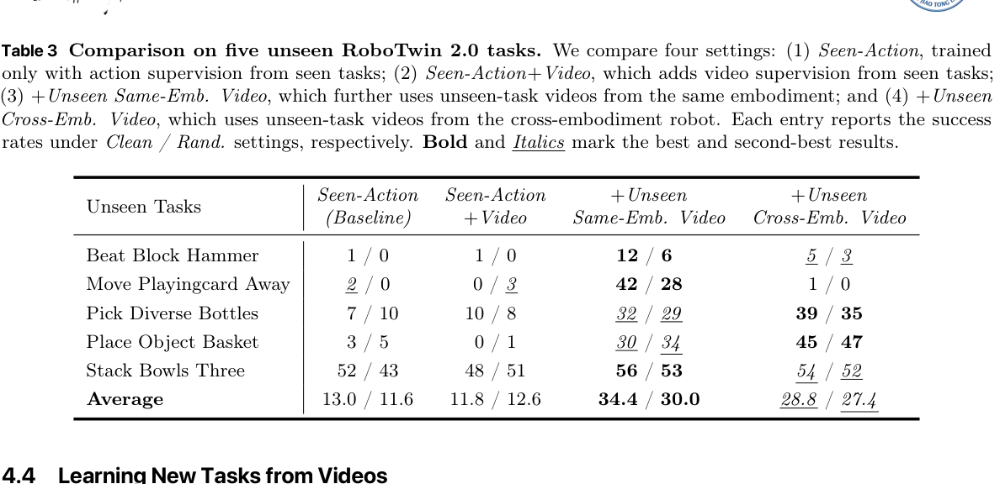

**Caption:** **Table 3. Comparison on five unseen RoboTwin 2.0 tasks.** We compare four settings: (1) *Seen-Action*, trained only with action supervision from seen tasks; (2) *Seen-Action+Video*, which adds video supervision from seen tasks; (3) *+Unseen Same-Emb. Video*, which further uses unseen-task videos from the same embodiment; and (4) *+Unseen Cross-Emb. Video*, which uses unseen-task videos from the cross-embodiment robot. Each entry reports the success rates under *Clean / Rand.* settings, respectively. **Bold** and *Italics* mark the best and second-best results.

**Caption[CN]:** **表 3. 五个未见 RoboTwin 2.0 任务上的对比。** 我们比较四种设置：(1) *Seen-Action*，仅使用已见任务的动作监督进行训练；(2) *Seen-Action+Video*，在此基础上加入已见任务的视频监督；(3) *+Unseen Same-Emb. Video*，进一步使用来自同一具身平台的未见任务视频；以及 (4) *+Unseen Cross-Emb. Video*，使用来自跨具身机器人的未见任务视频。每个条目分别报告 *Clean / Rand.* 设置下的成功率。**粗体**和*斜体*分别表示最佳和次佳结果。

| Unseen Tasks / 未见任务 | Seen-Action (Baseline) | Seen-Action +Video | +Unseen Same-Emb. Video | +Unseen Cross-Emb. Video |
|---|---:|---:|---:|---:|
| Beat Block Hammer | 1 / 0 | 1 / 0 | **12 / 6** | *5 / 3* |
| Move Playingcard Away | *2 / 0* | 0 / 3 | **42 / 28** | 1 / 0 |
| Pick Diverse Bottles | 7 / 10 | 10 / 8 | *32 / 29* | **39 / 35** |
| Place Object Basket | 3 / 5 | 0 / 1 | *30 / 34* | **45 / 47** |
| Stack Bowls Three | 52 / 43 | 48 / 51 | **56 / 53** | *54 / 52* |
| **Average / 平均** | 13.0 / 11.6 | 11.8 / 12.6 | **34.4 / 30.0** | *28.8 / 27.4* |

---

## 4.4 Learning New Tasks from Videos | 4.4 从视频中学习新任务

> <strong>Para. 1:</strong> The high cost of collecting action-annotated trajectories for specific robots bottlenecks dataset scalability. A scalable alternative instead learns novel skills from action-free videos of heterogeneous robots. To evaluate whether WLA-0 exhibits this capability, we conduct experiments on the 50 tasks in RoboTwin2.0. We partition the tasks into 45 seen tasks and 5 unseen tasks, with each task containing 50 clean trajectories and 500 randomized trajectories. The unseen tasks cover five distinct action patterns, as summarized in Table 3. We train models under four settings: (1) *Seen-Action* is the baseline, using only action supervision from seen tasks. (2) *Seen-Action+Video* additionally uses video supervision from the seen tasks. Building on this setting, (3) *+Unseen Same-Emb. Video* further incorporates video supervision from the five unseen tasks under the same embodiment, Aloha-AgileX. In contrast, (4) *+Unseen Cross-Emb. Video* uses video supervision from unseen tasks under a cross-embodiment robot, ARX-X5.

> <strong>Para. 1[CN]:</strong> 为特定机器人采集带动作标注轨迹的高昂成本，成为限制数据集规模扩展的瓶颈。一种可扩展的替代方案是从异构机器人的无动作标注视频中学习新技能。为了评估 WLA-0 是否具备这种能力，我们在 RoboTwin2.0 的 50 个任务上开展实验。我们将这些任务划分为 45 个已见任务和 5 个未见任务，每个任务包含 50 条干净轨迹和 500 条随机化轨迹。如表 3 所总结，这些未见任务涵盖五种不同的动作模式。我们在四种设置下训练模型：(1) *Seen-Action* 为基线，仅使用已见任务提供的动作监督；(2) *Seen-Action+Video* 额外使用已见任务提供的视频监督；在该设置的基础上，(3) *+Unseen Same-Emb. Video* 进一步加入来自同一具身平台 Aloha-AgileX 的五个未见任务的视频监督；与之相对，(4) *+Unseen Cross-Emb. Video* 使用由跨具身机器人 ARX-X5 提供的未见任务视频监督。

> <strong>Para. 2:</strong> As reported in Table 3, the *Seen-Action* baseline and *Seen-Action+Video* struggle significantly, failing almost entirely on tasks like *Beat Block Hammer* and *Move Playingcard Away*. In contrast, *+Unseen Same-Emb. Video* nearly triples the baseline success rate to achieve the best overall results. Remarkably, the model acquires the novel “beat” action solely from video observations. In *Beat Block Hammer*, for instance, it correctly grasps the hammer and attempts to strike the target, whereas the baseline erroneously attempts to grasp the block directly, as shown in Fig. 4. Furthermore, *+Unseen Cross-Emb. Video* maintains a highly competitive success rate, highlighting WLA-0’s ability to align visual observations with actionable control knowledge, demonstrating robust cross-embodiment transfer, cross-modal learning, and task generalization. Demos and additional studies on learning from human egocentric videos are detailed in Appendix D.

> <strong>Para. 2[CN]:</strong> 如表 3 所示，*Seen-Action* 基线和 *Seen-Action+Video* 表现得非常吃力，在 *Beat Block Hammer* 和 *Move Playingcard Away* 等任务上几乎完全失败。相比之下，*+Unseen Same-Emb. Video* 将基线成功率提高到近三倍，取得了最佳的总体结果。尤其值得注意的是，模型仅通过视频观测便习得了新颖的“敲击（beat）”动作。例如，在 *Beat Block Hammer* 中，模型能够正确抓住锤子并尝试敲击目标；而如图 4 所示，基线却错误地尝试直接抓取方块。此外，*+Unseen Cross-Emb. Video* 仍保持了极具竞争力的成功率，这凸显了 WLA-0 将视觉观测与可执行控制知识对齐的能力，并展现出稳健的跨具身迁移、跨模态学习和任务泛化能力。关于从人类第一视角视频中学习的演示及其他研究详见附录 D。

---

## Figure 4. Beat Block Hammer Execution | 图 4. Beat Block Hammer 任务执行

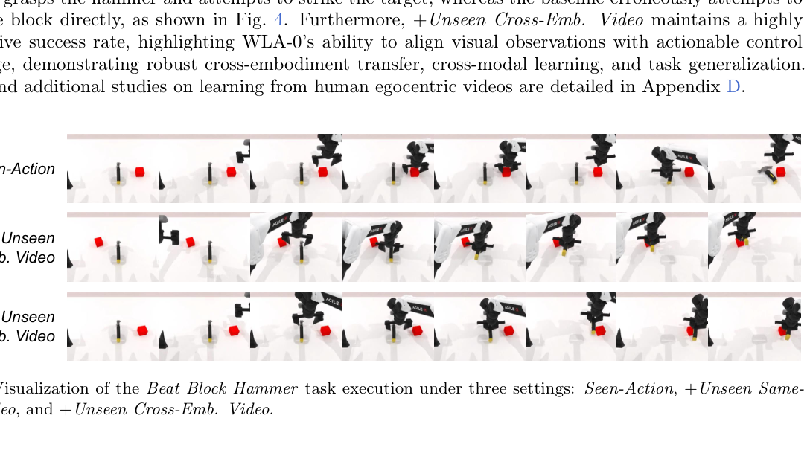

**Caption:** **Figure 4.** Visualization of the *Beat Block Hammer* task execution under three settings: *Seen-Action*, *+Unseen Same-Emb. Video*, and *+Unseen Cross-Emb. Video*.

**Caption[CN]:** **图 4.** 三种设置下 *Beat Block Hammer* 任务执行过程的可视化：*Seen-Action*、*+Unseen Same-Emb. Video* 和 *+Unseen Cross-Emb. Video*。

**Figure row labels / 图中行标签**

1. *Seen-Action*
2. *+ Unseen Same-Emb. Video*
3. *+ Unseen Cross-Emb. Video*

---

---

## 5 Conclusion / 结论

> <strong>Para. 1:</strong> We introduced WLA, a unified embodied framework that integrates world modeling, language reasoning, and action synthesis. Using an autoregressive language backbone with the World Expert and Action Expert, WLA models semantic-level textual subtasks and fine-grained physical dynamics, enabling effective long-horizon reasoning and real-time robot control. Extensive experiments show that WLA-0 achieves strong multi-task performance, state-of-the-art results on memory-dependent manipulation tasks, and favorable inference efficiency. Moreover, its ability to learn new tasks from action-free videos suggests a promising direction for scalable cross-embodiment robot learning.

> <strong>Para. 1[CN]:</strong> 我们提出了 WLA：一个统一的具身智能框架，将世界建模、语言推理与动作合成整合于一体。WLA 以自回归语言模型为骨干，并结合世界专家（World Expert）和动作专家（Action Expert），同时建模语义层面的文本子任务与细粒度物理动力学，从而实现有效的长时程推理和实时机器人控制。大量实验表明，WLA-0 具有强劲的多任务性能，在依赖记忆的操作任务上取得了当前最佳结果，并展现出良好的推理效率。此外，它能够从无动作标注视频中学习新任务，这为可扩展的跨本体机器人学习指出了一个很有前景的方向。

## 6 Limitations / 局限性

> <strong>Para. 1:</strong> Despite its promising results, WLA has several limitations. First, the real-world experiments are currently limited to a small set of bimanual tasks on a single robot platform; broader evaluations across diverse embodiments and task domains are needed to further establish its generality. In addition, our video-based task learning experiments rely on simulated robot videos for supervision.

> <strong>Para. 1[CN]:</strong> 尽管 WLA 已取得令人鼓舞的结果，但它仍存在若干局限。首先，目前的真实世界实验仅覆盖单一机器人平台上的少量双臂任务；仍需在更多样的机器人本体与任务领域中开展更广泛的评估，以进一步验证其通用性。此外，我们基于视频的任务学习实验依赖仿真机器人视频作为监督信号。

## References / 参考文献

> **中文说明：** 为确保作者、题名、出版信息、页码及 arXiv 标识等书目信息准确且可检索，以下参考文献 [1]–[60] 均完整保留原始书目形式，不翻译书目条目。每条后的中文段仅说明这一保留原则。

> <strong>Para. 1:</strong> [1] Niket Agarwal, Arslan Ali, Maciej Bala, Yogesh Balaji, Erik Barker, Tiffany Cai, Prithvijit Chattopadhyay, Yongxin Chen, Yin Cui, Yifan Ding, et al. Cosmos world foundation model platform for physical ai. arXiv preprint arXiv:2501.03575, 2025.

> <strong>Para. 1[CN]:</strong> 参考文献 [1]：为保持书目信息准确并便于精确检索，本条完整保留原始书目形式，不作翻译。

> <strong>Para. 2:</strong> [2] Jinze Bai, Shuai Bai, Yunfei Chu, Zeyu Cui, Kai Dang, Xiaodong Deng, Yang Fan, Wenbin Ge, Yu Han, Fei Huang, et al. Qwen technical report. arXiv preprint arXiv:2309.16609, 2023.

> <strong>Para. 2[CN]:</strong> 参考文献 [2]：为保持书目信息准确并便于精确检索，本条完整保留原始书目形式，不作翻译。

> <strong>Para. 3:</strong> [3] Adrien Bardes, Quentin Garrido, Jean Ponce, Xinlei Chen, Michael Rabbat, Yann LeCun, Mahmoud Assran, and Nicolas Ballas. Revisiting feature prediction for learning visual representations from video. arXiv preprint arXiv:2404.08471, 2024.

> <strong>Para. 3[CN]:</strong> 参考文献 [3]：为保持书目信息准确并便于精确检索，本条完整保留原始书目形式，不作翻译。

> <strong>Para. 4:</strong> [4] Lucas Beyer, Andreas Steiner, André Susano Pinto, Alexander Kolesnikov, Xiao Wang, Daniel Salz, Maxim Neumann, Ibrahim Alabdulmohsin, Michael Tschannen, Emanuele Bugliarello, et al. Paligemma: A versatile 3b vlm for transfer. arXiv preprint arXiv:2407.07726, 2024.

> <strong>Para. 4[CN]:</strong> 参考文献 [4]：为保持书目信息准确并便于精确检索，本条完整保留原始书目形式，不作翻译。

> <strong>Para. 5:</strong> [5] Hongzhe Bi, Hengkai Tan, Shenghao Xie, Zeyuan Wang, Shuhe Huang, Haitian Liu, Ruowen Zhao, Yao Feng, Chendong Xiang, Yinze Rong, et al. Motus: A unified latent action world model. arXiv preprint arXiv:2512.13030, 2025.

> <strong>Para. 5[CN]:</strong> 参考文献 [5]：为保持书目信息准确并便于精确检索，本条完整保留原始书目形式，不作翻译。

> <strong>Para. 6:</strong> [6] Kevin Black, Noah Brown, Danny Driess, Adnan Esmail, Michael Equi, Chelsea Finn, Niccolo Fusai, Lachy Groom, Karol Hausman, Brian Ichter, et al. π0 : A vision-language-action flow model for general robot control. arXiv preprint arXiv:2410.24164, 2024.

> <strong>Para. 6[CN]:</strong> 参考文献 [6]：为保持书目信息准确并便于精确检索，本条完整保留原始书目形式，不作翻译。

> <strong>Para. 7:</strong> [7] Tim Brooks, Bill Peebles, Connor Holmes, Will DePue, Yufei Guo, Leo Jing, David Schnurr, Joe Taylor, Troy Luhman, Eric Luhman, et al. Video generation models as world simulators. OpenAI Blog, 1(8):1, 2024.

> <strong>Para. 7[CN]:</strong> 参考文献 [7]：为保持书目信息准确并便于精确检索，本条完整保留原始书目形式，不作翻译。

> <strong>Para. 8:</strong> [8] Tom Brown, Benjamin Mann, Nick Ryder, Melanie Subbiah, Jared D Kaplan, Prafulla Dhariwal, Arvind Neelakantan, Pranav Shyam, Girish Sastry, Amanda Askell, et al. Language models are few-shot learners. Advances in neural information processing systems, 33:1877–1901, 2020.

> <strong>Para. 8[CN]:</strong> 参考文献 [8]：为保持书目信息准确并便于精确检索，本条完整保留原始书目形式，不作翻译。

> <strong>Para. 9:</strong> [9] Jake Bruce, Michael D Dennis, Ashley Edwards, Jack Parker-Holder, Yuge Shi, Edward Hughes, Matthew Lai, Aditi Mavalankar, Richie Steigerwald, Chris Apps, et al. Genie: Generative interactive environments. In Forty-first International Conference on Machine Learning, 2024.

> <strong>Para. 9[CN]:</strong> 参考文献 [9]：为保持书目信息准确并便于精确检索，本条完整保留原始书目形式，不作翻译。

> <strong>Para. 10:</strong> [10] Qingwen Bu, Yanting Yang, Jisong Cai, Shenyuan Gao, Guanghui Ren, Maoqing Yao, Ping Luo, and Hongyang Li. Univla: Learning to act anywhere with task-centric latent actions. arXiv preprint arXiv:2505.06111, 2025.

> <strong>Para. 10[CN]:</strong> 参考文献 [10]：为保持书目信息准确并便于精确检索，本条完整保留原始书目形式，不作翻译。

> <strong>Para. 11:</strong> [11] Mathilde Caron, Hugo Touvron, Ishan Misra, Hervé Jégou, Julien Mairal, Piotr Bojanowski, and Armand Joulin. Emerging properties in self-supervised vision transformers. In Proceedings of the IEEE/CVF international conference on computer vision, pages 9650–9660, 2021.

> <strong>Para. 11[CN]:</strong> 参考文献 [11]：为保持书目信息准确并便于精确检索，本条完整保留原始书目形式，不作翻译。

> <strong>Para. 12:</strong> [12] Chi-Lam Cheang, Guangzeng Chen, Ya Jing, Tao Kong, Hang Li, Yifeng Li, Yuxiao Liu, Hongtao Wu, Jiafeng Xu, Yichu Yang, et al. Gr-2: A generative video-language-action model with web-scale knowledge for robot manipulation. arXiv preprint arXiv:2410.06158, 2024.

> <strong>Para. 12[CN]:</strong> 参考文献 [12]：为保持书目信息准确并便于精确检索，本条完整保留原始书目形式，不作翻译。

> <strong>Para. 13:</strong> [13] Tianxing Chen, Zanxin Chen, Baijun Chen, Zijian Cai, Yibin Liu, Zixuan Li, Qiwei Liang, Xianliang Lin, Yiheng Ge, Zhenyu Gu, et al. Robotwin 2.0: A scalable data generator and benchmark with strong domain randomization for robust bimanual robotic manipulation. arXiv preprint arXiv:2506.18088, 2025.

> <strong>Para. 13[CN]:</strong> 参考文献 [13]：为保持书目信息准确并便于精确检索，本条完整保留原始书目形式，不作翻译。

> <strong>Para. 14:</strong> [14] Tianxing Chen, Yuran Wang, Mingleyang Li, Yan Qin, Hao Shi, Zixuan Li, Yifan Hu, Yingsheng Zhang, Kaixuan Wang, Yue Chen, et al. Rmbench: Memory-dependent robotic manipulation benchmark with insights into policy design. arXiv preprint arXiv:2603.01229, 2026.

> <strong>Para. 14[CN]:</strong> 参考文献 [14]：为保持书目信息准确并便于精确检索，本条完整保留原始书目形式，不作翻译。

> <strong>Para. 15:</strong> [15] Yi Chen, Yuying Ge, Weiliang Tang, Yizhuo Li, Yixiao Ge, Mingyu Ding, Ying Shan, and Xihui Liu. Moto: Latent motion token as the bridging language for learning robot manipulation from videos. In Proceedings of the IEEE/CVF International Conference on Computer Vision, pages 19752–19763, 2025.

> <strong>Para. 15[CN]:</strong> 参考文献 [15]：为保持书目信息准确并便于精确检索，本条完整保留原始书目形式，不作翻译。

> <strong>Para. 16:</strong> [16] StarVLA Community. Starvla: A lego-like codebase for vision-language-action model developing. arXiv preprint arXiv:2604.05014, 2026.

> <strong>Para. 16[CN]:</strong> 参考文献 [16]：为保持书目信息准确并便于精确检索，本条完整保留原始书目形式，不作翻译。

> <strong>Para. 17:</strong> [17] Ronghao Dang, Jiayan Guo, Bohan Hou, Sicong Leng, Kehan Li, Xin Li, Jiangpin Liu, Yunxuan Mao, Zhikai Wang, Yuqian Yuan, et al. Rynnbrain: Open embodied foundation models. arXiv preprint arXiv:2602.14979, 2026.

> <strong>Para. 17[CN]:</strong> 参考文献 [17]：为保持书目信息准确并便于精确检索，本条完整保留原始书目形式，不作翻译。

> <strong>Para. 18:</strong> [18] Danny Driess, Fei Xia, Mehdi SM Sajjadi, Corey Lynch, Aakanksha Chowdhery, Brian Ichter, Ayzaan Wahid, Jonathan Tompson, Quan Vuong, Tianhe Yu, et al. Palm-e: An embodied multimodal language model. arXiv preprint arXiv:2303.03378, 2023.

> <strong>Para. 18[CN]:</strong> 参考文献 [18]：为保持书目信息准确并便于精确检索，本条完整保留原始书目形式，不作翻译。

> <strong>Para. 19:</strong> [19] Yilun Du, Sherry Yang, Bo Dai, Hanjun Dai, Ofir Nachum, Josh Tenenbaum, Dale Schuurmans, and Pieter Abbeel. Learning universal policies via text-guided video generation. Advances in neural information processing systems, 36:9156–9172, 2023.

> <strong>Para. 19[CN]:</strong> 参考文献 [19]：为保持书目信息准确并便于精确检索，本条完整保留原始书目形式，不作翻译。

> <strong>Para. 20:</strong> [20] Yao Feng, Hengkai Tan, Xinyi Mao, Chendong Xiang, Guodong Liu, Shuhe Huang, Hang Su, and Jun Zhu. Vidar: Embodied video diffusion model for generalist manipulation. arXiv preprint arXiv:2507.12898, 2025.

> <strong>Para. 20[CN]:</strong> 参考文献 [20]：为保持书目信息准确并便于精确检索，本条完整保留原始书目形式，不作翻译。

> <strong>Para. 21:</strong> [21] David Ha and Jürgen Schmidhuber. World models. arXiv preprint arXiv:1803.10122, 2(3):440, 2018.

> <strong>Para. 21[CN]:</strong> 参考文献 [21]：为保持书目信息准确并便于精确检索，本条完整保留原始书目形式，不作翻译。

> <strong>Para. 22:</strong> [22] Dan Hendrycks and Kevin Gimpel. Gaussian error linear units (gelus). arXiv preprint arXiv:1606.08415, 2016.

> <strong>Para. 22[CN]:</strong> 参考文献 [22]：为保持书目信息准确并便于精确检索，本条完整保留原始书目形式，不作翻译。

> <strong>Para. 23:</strong> [23] Yucheng Hu, Yanjiang Guo, Pengchao Wang, Xiaoyu Chen, Yen-Jen Wang, Jianke Zhang, Koushil Sreenath, Chaochao Lu, and Jianyu Chen. Video prediction policy: A generalist robot policy with predictive visual representations. arXiv preprint arXiv:2412.14803, 2024.

> <strong>Para. 23[CN]:</strong> 参考文献 [23]：为保持书目信息准确并便于精确检索，本条完整保留原始书目形式，不作翻译。

> <strong>Para. 24:</strong> [24] Physical Intelligence, Kevin Black, Noah Brown, James Darpinian, Karan Dhabalia, Danny Driess, Adnan Esmail, Michael Equi, Chelsea Finn, Niccolo Fusai, et al. π0.5 : a vision-language-action model with open-world generalization. arXiv preprint arXiv:2504.16054, 2025.

> <strong>Para. 24[CN]:</strong> 参考文献 [24]：为保持书目信息准确并便于精确检索，本条完整保留原始书目形式，不作翻译。

> <strong>Para. 25:</strong> [25] Physical Intelligence, Bo Ai, Ali Amin, Raichelle Aniceto, Ashwin Balakrishna, Greg Balke, Kevin Black, George Bokinsky, Shihao Cao, Thomas Charbonnier, et al. pi0.7 : a steerable generalist robotic foundation model with emergent capabilities. arXiv preprint arXiv:2604.15483, 2026.

> <strong>Para. 25[CN]:</strong> 参考文献 [25]：为保持书目信息准确并便于精确检索，本条完整保留原始书目形式，不作翻译。

> <strong>Para. 26:</strong> [26] Siddharth Karamcheti, Suraj Nair, Ashwin Balakrishna, Percy Liang, Thomas Kollar, and Dorsa Sadigh. Prismatic vlms: Investigating the design space of visually-conditioned language models. In Forty-first International Conference on Machine Learning, 2024.

> <strong>Para. 26[CN]:</strong> 参考文献 [26]：为保持书目信息准确并便于精确检索，本条完整保留原始书目形式，不作翻译。

> <strong>Para. 27:</strong> [27] Moo Jin Kim, Karl Pertsch, Siddharth Karamcheti, Ted Xiao, Ashwin Balakrishna, Suraj Nair, Rafael Rafailov, Ethan Foster, Grace Lam, Pannag Sanketi, et al. Openvla: An open-source vision-language-action model. arXiv preprint arXiv:2406.09246, 2024.

> <strong>Para. 27[CN]:</strong> 参考文献 [27]：为保持书目信息准确并便于精确检索，本条完整保留原始书目形式，不作翻译。

> <strong>Para. 28:</strong> [28] Moo Jin Kim, Yihuai Gao, Tsung-Yi Lin, Yen-Chen Lin, Yunhao Ge, Grace Lam, Percy Liang, Shuran Song, Ming-Yu Liu, Chelsea Finn, et al. Cosmos policy: Fine-tuning video models for visuomotor control and planning. arXiv preprint arXiv:2601.16163, 2026.

> <strong>Para. 28[CN]:</strong> 参考文献 [28]：为保持书目信息准确并便于精确检索，本条完整保留原始书目形式，不作翻译。

> <strong>Para. 29:</strong> [29] Diederik P Kingma and Max Welling. Auto-encoding variational bayes. arXiv preprint arXiv:1312.6114, 2013.

> <strong>Para. 29[CN]:</strong> 参考文献 [29]：为保持书目信息准确并便于精确检索，本条完整保留原始书目形式，不作翻译。

> <strong>Para. 30:</strong> [30] Po-Chen Ko, Jiayuan Mao, Yilun Du, Shao-Hua Sun, and Joshua B Tenenbaum. Learning to act from actionless videos through dense correspondences. In International Conference on Learning Representations, volume 2024, pages 40938–40958, 2024.

> <strong>Para. 30[CN]:</strong> 参考文献 [30]：为保持书目信息准确并便于精确检索，本条完整保留原始书目形式，不作翻译。

> <strong>Para. 31:</strong> [31] Lin Li, Qihang Zhang, Yiming Luo, Shuai Yang, Ruilin Wang, Fei Han, Mingrui Yu, Zelin Gao, Nan Xue, Xing Zhu, et al. Causal world modeling for robot control. arXiv preprint arXiv:2601.21998, 2026.

> <strong>Para. 31[CN]:</strong> 参考文献 [31]：为保持书目信息准确并便于精确检索，本条完整保留原始书目形式，不作翻译。

> <strong>Para. 32:</strong> [32] Yingyan Li, Shuyao Shang, Weisong Liu, Bing Zhan, Haochen Wang, Yuqi Wang, Yuntao Chen, Xiaoman Wang, Yasong An, Chufeng Tang, et al. Drivevla-w0: World models amplify data scaling law in autonomous driving. arXiv preprint arXiv:2510.12796, 2025.

> <strong>Para. 32[CN]:</strong> 参考文献 [32]：为保持书目信息准确并便于精确检索，本条完整保留原始书目形式，不作翻译。

> <strong>Para. 33:</strong> [33] Weixin Liang, Lili Yu, Liang Luo, Srinivasan Iyer, Ning Dong, Chunting Zhou, Gargi Ghosh, Mike Lewis, Wen-tau Yih, Luke Zettlemoyer, et al. Mixture-of-transformers: A sparse and scalable architecture for multi-modal foundation models. arXiv preprint arXiv:2411.04996, 2024.

> <strong>Para. 33[CN]:</strong> 参考文献 [33]：为保持书目信息准确并便于精确检索，本条完整保留原始书目形式，不作翻译。

> <strong>Para. 34:</strong> [34] Bo Liu, Yifeng Zhu, Chongkai Gao, Yihao Feng, Qiang Liu, Yuke Zhu, and Peter Stone. Libero: Benchmarking knowledge transfer for lifelong robot learning. Advances in Neural Information Processing Systems, 36:44776–44791, 2023.

> <strong>Para. 34[CN]:</strong> 参考文献 [34]：为保持书目信息准确并便于精确检索，本条完整保留原始书目形式，不作翻译。

> <strong>Para. 35:</strong> [35] Haotian Liu, Chunyuan Li, Qingyang Wu, and Yong Jae Lee. Visual instruction tuning. Advances in neural information processing systems, 36:34892–34916, 2023.

> <strong>Para. 35[CN]:</strong> 参考文献 [35]：为保持书目信息准确并便于精确检索，本条完整保留原始书目形式，不作翻译。

> <strong>Para. 36:</strong> [36] Ilya Loshchilov and Frank Hutter. Decoupled weight decay regularization. arXiv preprint arXiv:1711.05101, 2017.

> <strong>Para. 36[CN]:</strong> 参考文献 [36]：为保持书目信息准确并便于精确检索，本条完整保留原始书目形式，不作翻译。

> <strong>Para. 37:</strong> [37] Hao Luo, Yicheng Feng, Wanpeng Zhang, Sipeng Zheng, Ye Wang, Haoqi Yuan, Jiazheng Liu, Chaoyi Xu, Qin Jin, and Zongqing Lu. Being-h0: vision-language-action pretraining from large-scale human videos. arXiv preprint arXiv:2507.15597, 2025.

> <strong>Para. 37[CN]:</strong> 参考文献 [37]：为保持书目信息准确并便于精确检索，本条完整保留原始书目形式，不作翻译。

> <strong>Para. 38:</strong> [38] Teli Ma, Jia Zheng, Zifan Wang, Chunli Jiang, Andy Cui, Junwei Liang, and Shuo Yang. Dit4dit: Jointly modeling video dynamics and actions for generalizable robot control. arXiv preprint arXiv:2603.10448, 2026.

> <strong>Para. 38[CN]:</strong> 参考文献 [38]：为保持书目信息准确并便于精确检索，本条完整保留原始书目形式，不作翻译。

> <strong>Para. 39:</strong> [39] Yao Mu, Qinglong Zhang, Mengkang Hu, Wenhai Wang, Mingyu Ding, Jun Jin, Bin Wang, Jifeng Dai, Yu Qiao, and Ping Luo. Embodiedgpt: Vision-language pre-training via embodied chain of thought. Advances in Neural Information Processing Systems, 36:25081–25094, 2023.

> <strong>Para. 39[CN]:</strong> 参考文献 [39]：为保持书目信息准确并便于精确检索，本条完整保留原始书目形式，不作翻译。

> <strong>Para. 40:</strong> [40] Jonas Pai, Liam Achenbach, Victoriano Montesinos, Benedek Forrai, Oier Mees, and Elvis Nava. mimic-video: Video-action models for generalizable robot control beyond vlas. arXiv preprint arXiv:2512.15692, 2025.

> <strong>Para. 40[CN]:</strong> 参考文献 [40]：为保持书目信息准确并便于精确检索，本条完整保留原始书目形式，不作翻译。

> <strong>Para. 41:</strong> [41] Xichen Pan, Satya Narayan Shukla, Aashu Singh, Zhuokai Zhao, Shlok Kumar Mishra, Jialiang Wang, Zhiyang Xu, Jiuhai Chen, Kunpeng Li, Felix Juefei-Xu, et al. Transfer between modalities with metaqueries. arXiv preprint arXiv:2504.06256, 2025.

> <strong>Para. 41[CN]:</strong> 参考文献 [41]：为保持书目信息准确并便于精确检索，本条完整保留原始书目形式，不作翻译。

> <strong>Para. 42:</strong> [42] William Peebles and Saining Xie. Scalable diffusion models with transformers. In Proceedings of the IEEE/CVF international conference on computer vision, pages 4195–4205, 2023.

> <strong>Para. 42[CN]:</strong> 参考文献 [42]：为保持书目信息准确并便于精确检索，本条完整保留原始书目形式，不作翻译。

> <strong>Para. 43:</strong> [43] Jeff Rasley, Samyam Rajbhandari, Olatunji Ruwase, and Yuxiong He. Deepspeed: System optimizations enable training deep learning models with over 100 billion parameters. In Proceedings of the 26th ACM SIGKDD international conference on knowledge discovery & data mining, pages 3505–3506, 2020.

> <strong>Para. 43[CN]:</strong> 参考文献 [43]：为保持书目信息准确并便于精确检索，本条完整保留原始书目形式，不作翻译。

> <strong>Para. 44:</strong> [44] Noam Shazeer. Glu variants improve transformer. arXiv preprint arXiv:2002.05202, 2020.

> <strong>Para. 44[CN]:</strong> 参考文献 [44]：为保持书目信息准确并便于精确检索，本条完整保留原始书目形式，不作翻译。

> <strong>Para. 45:</strong> [45] Jianlin Su, Murtadha Ahmed, Yu Lu, Shengfeng Pan, Wen Bo, and Yunfeng Liu. Roformer: Enhanced transformer with rotary position embedding. Neurocomputing, 568:127063, 2024.

> <strong>Para. 45[CN]:</strong> 参考文献 [45]：为保持书目信息准确并便于精确检索，本条完整保留原始书目形式，不作翻译。

> <strong>Para. 46:</strong> [46] Team Wan, Ang Wang, Baole Ai, Bin Wen, Chaojie Mao, Chen-Wei Xie, Di Chen, Feiwu Yu, Haiming Zhao, Jianxiao Yang, et al. Wan: Open and advanced large-scale video generative models. arXiv preprint arXiv:2503.20314, 2025.

> <strong>Para. 46[CN]:</strong> 参考文献 [46]：为保持书目信息准确并便于精确检索，本条完整保留原始书目形式，不作翻译。

> <strong>Para. 47:</strong> [47] Yuqi Wang, Xinghang Li, Wenxuan Wang, Junbo Zhang, Yingyan Li, Yuntao Chen, Xinlong Wang, and Zhaoxiang Zhang. Unified vision-language-action model. arXiv preprint arXiv:2506.19850, 2025.

> <strong>Para. 47[CN]:</strong> 参考文献 [47]：为保持书目信息准确并便于精确检索，本条完整保留原始书目形式，不作翻译。

> <strong>Para. 48:</strong> [48] Jason Wei, Xuezhi Wang, Dale Schuurmans, Maarten Bosma, Fei Xia, Ed Chi, Quoc V Le, Denny Zhou, et al. Chain-of-thought prompting elicits reasoning in large language models. Advances in neural information processing systems, 35:24824–24837, 2022.

> <strong>Para. 48[CN]:</strong> 参考文献 [48]：为保持书目信息准确并便于精确检索，本条完整保留原始书目形式，不作翻译。

> <strong>Para. 49:</strong> [49] Hongtao Wu, Ya Jing, Chilam Cheang, Guangzeng Chen, Jiafeng Xu, Xinghang Li, Minghuan Liu, Hang Li, and Tao Kong. Unleashing large-scale video generative pre-training for visual robot manipulation. In International Conference on Learning Representations, volume 2024, pages 10641–10662, 2024.

> <strong>Para. 49[CN]:</strong> 参考文献 [49]：为保持书目信息准确并便于精确检索，本条完整保留原始书目形式，不作翻译。

> <strong>Para. 50:</strong> [50] Enze Xie, Junsong Chen, Junyu Chen, Han Cai, Haotian Tang, Yujun Lin, Zhekai Zhang, Muyang Li, Ligeng Zhu, Yao Lu, et al. Sana: Efficient high-resolution image synthesis with linear diffusion transformers. arXiv preprint arXiv:2410.10629, 2024.

> <strong>Para. 50[CN]:</strong> 参考文献 [50]：为保持书目信息准确并便于精确检索，本条完整保留原始书目形式，不作翻译。

> <strong>Para. 51:</strong> [51] Seonghyeon Ye, Joel Jang, Byeongguk Jeon, Se June Joo, Jianwei Yang, Baolin Peng, Ajay Mandlekar, Reuben Tan, Yu-Wei Chao, Bill Yuchen Lin, et al. Latent action pretraining from videos. In International Conference on Learning Representations, volume 2025, pages 28213–28239, 2025.

> <strong>Para. 51[CN]:</strong> 参考文献 [51]：为保持书目信息准确并便于精确检索，本条完整保留原始书目形式，不作翻译。

> <strong>Para. 52:</strong> [52] Seonghyeon Ye, Yunhao Ge, Kaiyuan Zheng, Shenyuan Gao, Sihyun Yu, George Kurian, Suneel Indupuru, You Liang Tan, Chuning Zhu, Jiannan Xiang, et al. World action models are zero-shot policies. arXiv preprint arXiv:2602.15922, 2026.

> <strong>Para. 52[CN]:</strong> 参考文献 [52]：为保持书目信息准确并便于精确检索，本条完整保留原始书目形式，不作翻译。

> <strong>Para. 53:</strong> [53] Tianyuan Yuan, Zibin Dong, Yicheng Liu, and Hang Zhao. Fast-wam: Do world action models need test-time future imagination? arXiv preprint arXiv:2603.16666, 2026.

> <strong>Para. 53[CN]:</strong> 参考文献 [53]：为保持书目信息准确并便于精确检索，本条完整保留原始书目形式，不作翻译。

> <strong>Para. 54:</strong> [54] Michał Zawalski, William Chen, Karl Pertsch, Oier Mees, Chelsea Finn, and Sergey Levine. Robotic control via embodied chain-of-thought reasoning. arXiv preprint arXiv:2407.08693, 2024.

> <strong>Para. 54[CN]:</strong> 参考文献 [54]：为保持书目信息准确并便于精确检索，本条完整保留原始书目形式，不作翻译。

> <strong>Para. 55:</strong> [55] Biao Zhang and Rico Sennrich. Root mean square layer normalization. Advances in neural information processing systems, 32, 2019.

> <strong>Para. 55[CN]:</strong> 参考文献 [55]：为保持书目信息准确并便于精确检索，本条完整保留原始书目形式，不作翻译。

> <strong>Para. 56:</strong> [56] Wenyao Zhang, Hongsi Liu, Zekun Qi, Yunnan Wang, Xinqiang Yu, Jiazhao Zhang, Runpei Dong, Jiawei He, He Wang, Zhizheng Zhang, et al. Dreamvla: a vision-language-action model dreamed with comprehensive world knowledge. Advances in Neural Information Processing Systems, 38:24195–24228, 2026.

> <strong>Para. 56[CN]:</strong> 参考文献 [56]：为保持书目信息准确并便于精确检索，本条完整保留原始书目形式，不作翻译。

> <strong>Para. 57:</strong> [57] Qingqing Zhao, Yao Lu, Moo Jin Kim, Zipeng Fu, Zhuoyang Zhang, Yecheng Wu, Zhaoshuo Li, Qianli Ma, Song Han, Chelsea Finn, et al. Cot-vla: Visual chain-of-thought reasoning for vision-language-action models. In Proceedings of the Computer Vision and Pattern Recognition Conference, pages 1702–1713, 2025.

> <strong>Para. 57[CN]:</strong> 参考文献 [57]：为保持书目信息准确并便于精确检索，本条完整保留原始书目形式，不作翻译。

> <strong>Para. 58:</strong> [58] Jinliang Zheng, Jianxiong Li, Zhihao Wang, Dongxiu Liu, Xirui Kang, Yuchun Feng, Yinan Zheng, Jiayin Zou, Yilun Chen, Jia Zeng, et al. X-vla: Soft-prompted transformer as scalable cross-embodiment vision-language-action model. arXiv preprint arXiv:2510.10274, 2025.

> <strong>Para. 58[CN]:</strong> 参考文献 [58]：为保持书目信息准确并便于精确检索，本条完整保留原始书目形式，不作翻译。

> <strong>Para. 59:</strong> [59] Zhongyi Zhou, Yichen Zhu, Minjie Zhu, Junjie Wen, Ning Liu, Zhiyuan Xu, Weibin Meng, Yaxin Peng, Chaomin Shen, Feifei Feng, et al. Chatvla: Unified multimodal understanding and robot control with vision-language-action model. In Proceedings of the 2025 Conference on Empirical Methods in Natural Language Processing, pages 5377–5395, 2025.

> <strong>Para. 59[CN]:</strong> 参考文献 [59]：为保持书目信息准确并便于精确检索，本条完整保留原始书目形式，不作翻译。

> <strong>Para. 60:</strong> [60] Brianna Zitkovich, Tianhe Yu, Sichun Xu, Peng Xu, Ted Xiao, Fei Xia, Jialin Wu, Paul Wohlhart, Stefan Welker, Ayzaan Wahid, et al. Rt-2: Vision-language-action models transfer web knowledge to robotic control. In Conference on Robot Learning, pages 2165–2183. PMLR, 2023.

> <strong>Para. 60[CN]:</strong> 参考文献 [60]：为保持书目信息准确并便于精确检索，本条完整保留原始书目形式，不作翻译。

---

# Appendix A. Acceleration Techniques / 附录 A：加速技术

> <strong>Para. 1:</strong> WLA-0’s inference latency is dominated by Python dispatch overhead and the cost of launching many small CUDA kernels, especially in the iterative DiT denoising loop. We address these bottlenecks with three complementary optimizations, reducing latency from $\sim116$ ms to under 40 ms.

> <strong>Para. 1[CN]:</strong> WLA-0 的推理延迟主要由 Python 调度开销以及大量小型 CUDA 核函数的启动成本所主导，这一问题在迭代式 DiT 去噪循环中尤其明显。我们通过三种互补的优化来解决这些瓶颈，将延迟从约 $116$ ms 降低至 40 ms 以下。

## CUDA Graph Capture / CUDA 图捕获

> <strong>Para. 1:</strong> We replace eager execution with CUDA Graph replay. Specifically, we capture the forward pass once using fixed-address GPU buffers and replay the captured graph for subsequent inference calls. This removes per-step Python dispatch and substantially reduces kernel-launch overhead, which is especially beneficial for the multi-step DiT head.

> <strong>Para. 1[CN]:</strong> 我们用 CUDA Graph 重放取代即时执行（eager execution）。具体而言，我们使用地址固定的 GPU 缓冲区对前向传播进行一次捕获，并在后续推理调用中重放所捕获的计算图。这样可以消除每一步的 Python 调度，并显著减少核函数启动开销，对多步 DiT 头尤其有利。

## Operator Fusion / 算子融合

> <strong>Para. 1:</strong> We implement custom Triton kernels to fuse frequently adjacent operations, reducing both launch overhead and intermediate memory traffic. In the VLM, we fuse RMSNorm [55], QKV projection with per-head RMSNorm and RoPE [45], the SwiGLU [44] branch, and decoder-layer computations. In the DiT, we fuse AdaLayerNorm [42], merged-QKV self-attention, cross-attention with cached K/V, position-embedding addition, and the GELU [22] feed-forward block.

> <strong>Para. 1[CN]:</strong> 我们实现了自定义 Triton 核函数，以融合经常相邻执行的操作，从而同时减少启动开销和中间内存流量。在 VLM 中，我们融合了 RMSNorm [55]、带逐头 RMSNorm 与 RoPE [45] 的 QKV 投影、SwiGLU [44] 分支以及解码器层计算。在 DiT 中，我们融合了 AdaLayerNorm [42]、合并 QKV 的自注意力、使用缓存 K/V 的交叉注意力、位置嵌入加法，以及 GELU [22] 前馈块。

## Precomputation and Caching / 预计算与缓存

> <strong>Para. 1:</strong> We precompute quantities that remain invariant across inference calls or denoising steps. In the VLM, these include token embeddings, causal masks, RoPE sine/cosine tables, and image-placeholder indices. In the DiT, they include sinusoidal action-time encodings, timestep-MLP outputs, and AdaLN scale/shift parameters. We also cache cross-attention K/V tensors and reuse them across all denoising steps for a given prediction.

> <strong>Para. 1[CN]:</strong> 我们预先计算在不同推理调用之间或不同去噪步骤之间保持不变的量。在 VLM 中，这些量包括 token 嵌入、因果掩码、RoPE 正弦/余弦表以及图像占位符索引。在 DiT 中，这些量包括正弦动作时间编码、时间步 MLP 输出以及 AdaLN 的缩放/偏移参数。我们还缓存交叉注意力的 K/V 张量，并在一次给定预测的所有去噪步骤中重复使用它们。

---

# Appendix B. Simulation Benchmarks / 附录 B：仿真基准

## B.1 RoboTwin 2.0

> <strong>Para. 1:</strong> In Table 1, LingBot-VA [31] is evaluated under the seen instructions setting, whereas the other methods use the unseen instructions setting. Per-task results are reported in Table 7. For WLA-0, we use 32 flow-matching inference steps, as preliminary experiments showed that fewer steps can induce robotic-arm jitter. Actions are represented by the absolute end-effector position.

> <strong>Para. 1[CN]:</strong> 在表 1 中，LingBot-VA [31] 在已见指令设置下进行评估，而其他方法采用未见指令设置。逐任务结果见表 7。对于 WLA-0，我们使用 32 个流匹配推理步骤，因为初步实验表明，更少的步骤可能引发机械臂抖动。动作由末端执行器的绝对位置表示。

## B.2 LIBERO

> <strong>Para. 1:</strong> We conducted preliminary experiments to examine how the World Expert’s prediction target (single-frame or multi-frame) affects action learning. For $n=32$, the single-frame model predicts only $o_{t+32}$, while the multi-frame model jointly predicts $o_{t+8}$, $o_{t+16}$, $o_{t+24}$, and $o_{t+32}$. Both models were trained for 30k steps with a global batch size of 256. As shown in Table 4, multi-frame prediction achieves a substantially lower success rate than single-frame prediction, suggesting that overly dense visual supervision may slow convergence and interfere with action learning.

> <strong>Para. 1[CN]:</strong> 我们进行了初步实验，以考察世界专家的预测目标（单帧或多帧）如何影响动作学习。当 $n=32$ 时，单帧模型仅预测 $o_{t+32}$，而多帧模型联合预测 $o_{t+8}$、$o_{t+16}$、$o_{t+24}$ 和 $o_{t+32}$。两个模型均以全局批大小 256 训练 30k 步。如表 4 所示，多帧预测的成功率显著低于单帧预测，这表明过于密集的视觉监督可能会减慢收敛并干扰动作学习。

### Table 4. Comparison of single-frame and multi-frame prediction on LIBERO / LIBERO 上单帧与多帧预测的比较

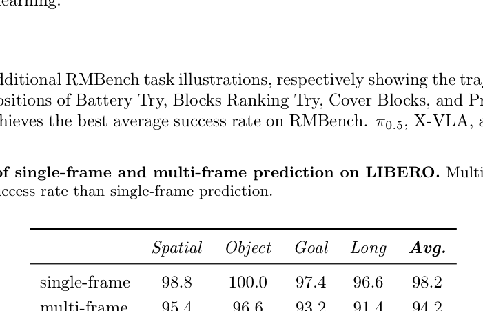

**Caption:** Comparison of single-frame and multi-frame prediction on LIBERO. Multi-frame prediction yields a substantially lower success rate than single-frame prediction.

**Caption[CN]:** LIBERO 上单帧预测与多帧预测的比较。多帧预测的成功率显著低于单帧预测。

| Prediction target / 预测目标 | Spatial / 空间 | Object / 物体 | Goal / 目标 | Long / 长程 | Avg. / 平均 |
|---|---:|---:|---:|---:|---:|
| single-frame / 单帧 | 98.8 | 100.0 | 97.4 | 96.6 | 98.2 |
| multi-frame / 多帧 | 95.4 | 96.6 | 93.2 | 91.4 | 94.2 |

## B.3 RMBench

> <strong>Para. 1:</strong> Figures 6–9 provide additional RMBench task illustrations, respectively showing the trajectories and language-level subtask decompositions of Battery Try, Blocks Ranking Try, Cover Blocks, and Press Button. As shown in Table 2, WLA-0 achieves the best average success rate on RMBench. $\pi_{0.5}$, X-VLA, and Fast-WAM mainly generate actions from visual observations and instructions, but lack explicit memory traces and language-level progress planning. Therefore, they struggle to infer the current executable subtask when the next action depends on previous trials.

> <strong>Para. 1[CN]:</strong> 图 6–9 提供了更多 RMBench 任务示例，分别展示 Battery Try、Blocks Ranking Try、Cover Blocks 和 Press Button 的任务轨迹与语言层级子任务分解。如表 2 所示，WLA-0 在 RMBench 上取得了最佳平均成功率。$\pi_{0.5}$、X-VLA 和 Fast-WAM 主要根据视觉观测与指令生成动作，但缺少显式记忆轨迹和语言层级的进度规划。因此，当下一步动作依赖先前尝试时，它们难以推断当前可执行的子任务。

> <strong>Para. 2:</strong> Compared with Mem-0, the advantage of WLA-0 mainly comes from tighter synchronization between progress tracking and action generation. Mem-0 relies on a separate Subtask End Classifier to detect visually subtle subtask transitions; if the classifier makes an incorrect transition decision, the memory can be updated too early or too late, leading to incorrect subtask switching and affecting subsequent action generation. In contrast, WLA-0 repeatedly infers the current executable subtask before action generation, leading to more stable progress tracking.

> <strong>Para. 2[CN]:</strong> 与 Mem-0 相比，WLA-0 的优势主要来自进度跟踪与动作生成之间更紧密的同步。Mem-0 依赖一个独立的子任务结束分类器来检测视觉上细微的子任务转换；如果分类器做出错误的转换判断，记忆就可能过早或过晚更新，从而导致错误的子任务切换，并影响后续动作生成。相比之下，WLA-0 会在动作生成前反复推断当前可执行的子任务，因此能够实现更稳定的进度跟踪。

---

# Appendix C. Real-World Experiments / 附录 C：真实世界实验

> <strong>Para. 1:</strong> For real-world robot experiments, actions are represented by the robot arm’s joint angles, and flow-matching inference is performed with 10 steps. The full results are reported in Table 5. We further visualize the images generated by the World Expert during inference in Figure 10.

> <strong>Para. 1[CN]:</strong> 对于真实世界机器人实验，动作由机械臂的关节角表示，流匹配推理采用 10 个步骤。完整结果见表 5。我们还在图 10 中可视化了世界专家在推理期间生成的图像。

### Table 5. Evaluation under standard and OOD settings on four real-world tasks / 四项真实世界任务在标准与 OOD 设置下的评估

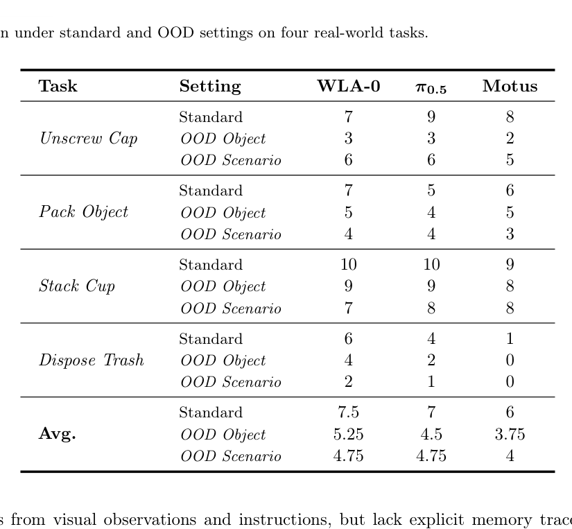

**Caption:** Evaluation under standard and OOD settings on four real-world tasks.

**Caption[CN]:** 在四项真实世界任务的标准设置与分布外（OOD）设置下进行评估。

| Task / 任务 | Setting / 设置 | WLA-0 | $\pi_{0.5}$ | Motus |
|---|---|---:|---:|---:|
| Unscrew Cap / 拧开瓶盖 | Standard / 标准 | 7 | 9 | 8 |
| Unscrew Cap / 拧开瓶盖 | OOD Object / OOD 物体 | 3 | 3 | 2 |
| Unscrew Cap / 拧开瓶盖 | OOD Scenario / OOD 场景 | 6 | 6 | 5 |
| Pack Object / 装入物体 | Standard / 标准 | 7 | 5 | 6 |
| Pack Object / 装入物体 | OOD Object / OOD 物体 | 5 | 4 | 5 |
| Pack Object / 装入物体 | OOD Scenario / OOD 场景 | 4 | 4 | 3 |
| Stack Cup / 堆叠杯子 | Standard / 标准 | 10 | 10 | 9 |
| Stack Cup / 堆叠杯子 | OOD Object / OOD 物体 | 9 | 9 | 8 |
| Stack Cup / 堆叠杯子 | OOD Scenario / OOD 场景 | 7 | 8 | 8 |
| Dispose Trash / 丢弃垃圾 | Standard / 标准 | 6 | 4 | 1 |
| Dispose Trash / 丢弃垃圾 | OOD Object / OOD 物体 | 4 | 2 | 0 |
| Dispose Trash / 丢弃垃圾 | OOD Scenario / OOD 场景 | 2 | 1 | 0 |
| Avg. / 平均 | Standard / 标准 | 7.5 | 7 | 6 |
| Avg. / 平均 | OOD Object / OOD 物体 | 5.25 | 4.5 | 3.75 |
| Avg. / 平均 | OOD Scenario / OOD 场景 | 4.75 | 4.75 | 4 |

---

# Appendix D. Learning New Tasks from Videos / 附录 D：从视频中学习新任务

> <strong>Para. 1:</strong> For training in the +Unseen Same-Emb. Video and +Unseen Cross-Emb. Video settings, we set the loss weight for videos from unseen tasks to 0.1 and sample data from seen tasks and unseen-task videos at a 1:1 ratio in each forward pass. All models are trained for 50k steps with a global batch size of 256.

> <strong>Para. 1[CN]:</strong> 在 +Unseen Same-Emb. Video 和 +Unseen Cross-Emb. Video 设置下训练时，我们将未见任务视频的损失权重设为 0.1，并在每次前向传播中以 1:1 的比例采样已见任务数据和未见任务视频。所有模型均以全局批大小 256 训练 50k 步。

> <strong>Para. 2:</strong> We further investigated whether WLA-0 can learn unseen tasks from human egocentric videos. We collected a set of real-world props that resemble the objects in the RoboTwin 2.0 simulation environment and recorded 100 human egocentric manipulation videos for each of the five unseen tasks, as shown in Figure 5. We then mixed these videos with data from the seen tasks for training. The results are reported in Table 6.

> <strong>Para. 2[CN]:</strong> 我们进一步研究了 WLA-0 能否从人类第一视角视频中学习未见任务。我们收集了一组与 RoboTwin 2.0 仿真环境中物体相似的真实世界道具，并为五项未见任务中的每一项录制了 100 段人类第一视角操作视频，如图 5 所示。随后，我们将这些视频与已见任务的数据混合用于训练。结果见表 6。

> <strong>Para. 3:</strong> However, adding human egocentric videos did not enable the model to learn the new tasks. We conjecture that this failure is primarily due to the domain gap between real-world human videos and the simulation environment. In future work, we plan to better align human-video data with robot data and further validate this hypothesis.

> <strong>Para. 3[CN]:</strong> 然而，加入人类第一视角视频并未使模型学会这些新任务。我们推测，这一失败主要源于真实世界人类视频与仿真环境之间的领域差异。未来，我们计划更好地对齐人类视频数据与机器人数据，并进一步验证这一假设。

### Table 6. Comparison on five unseen RoboTwin 2.0 tasks / 五项未见 RoboTwin 2.0 任务上的比较

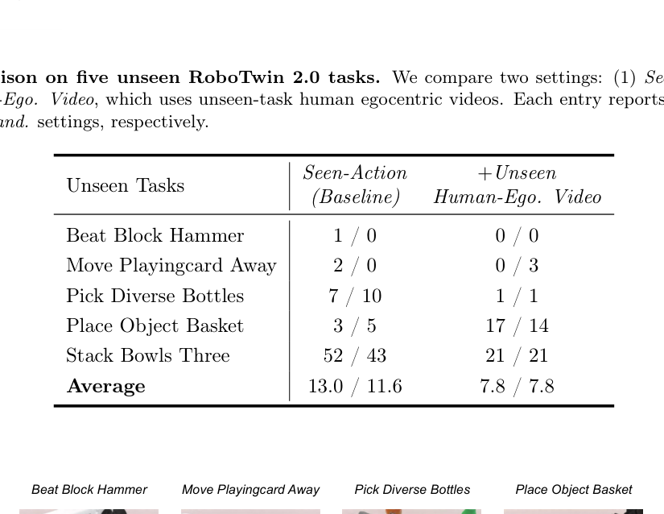

**Caption:** Comparison on five unseen RoboTwin 2.0 tasks. We compare two settings: (1) Seen-Action and (2) +Unseen Human-Ego. Video, which uses unseen-task human egocentric videos. Each entry reports the success rates under Clean / Rand. settings, respectively.

**Caption[CN]:** 五项未见 RoboTwin 2.0 任务上的比较。我们比较两种设置：(1) Seen-Action；(2) +Unseen Human-Ego. Video，后者使用未见任务的人类第一视角视频。每个单元格分别报告 Clean / Rand. 设置下的成功率。

| Unseen Tasks / 未见任务 | Seen-Action (Baseline) / 已见动作（基线） Clean / Rand. | +Unseen Human-Ego. Video / +未见人类第一视角视频 Clean / Rand. |
|---|---:|---:|
| Beat Block Hammer / 用锤敲击方块 | 1 / 0 | 0 / 0 |
| Move Playingcard Away / 移开扑克牌 | 2 / 0 | 0 / 3 |
| Pick Diverse Bottles / 拿取不同瓶子 | 7 / 10 | 1 / 1 |
| Place Object Basket / 将物体放入篮筐 | 3 / 5 | 17 / 14 |
| Stack Bowls Three / 堆叠三个碗 | 52 / 43 | 21 / 21 |
| Average / 平均 | 13.0 / 11.6 | 7.8 / 7.8 |

---

# Figures 5–10 / 图 5–10

## Figure 5. Unseen tasks and human egocentric videos / 未见任务与人类第一视角视频

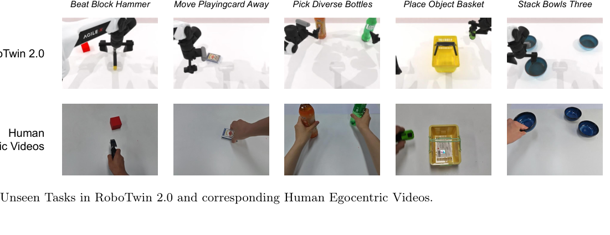

**Caption:** Unseen Tasks in RoboTwin 2.0 and corresponding Human Egocentric Videos.

**Caption[CN]:** RoboTwin 2.0 中的未见任务及其对应的人类第一视角视频。

**In-figure labels / 图内标签（逐项可检索转录）:**

| English label | 中文 |
|---|---|
| Beat Block Hammer | 用锤敲击方块 |
| Move Playingcard Away | 移开扑克牌 |
| Pick Diverse Bottles | 拿取不同瓶子 |
| Place Object Basket | 将物体放入篮筐 |
| Stack Bowls Three | 堆叠三个碗 |
| RoboTwin 2.0 | RoboTwin 2.0 |
| Human Egocentric Videos | 人类第一视角视频 |

## Figure 6. Battery Try

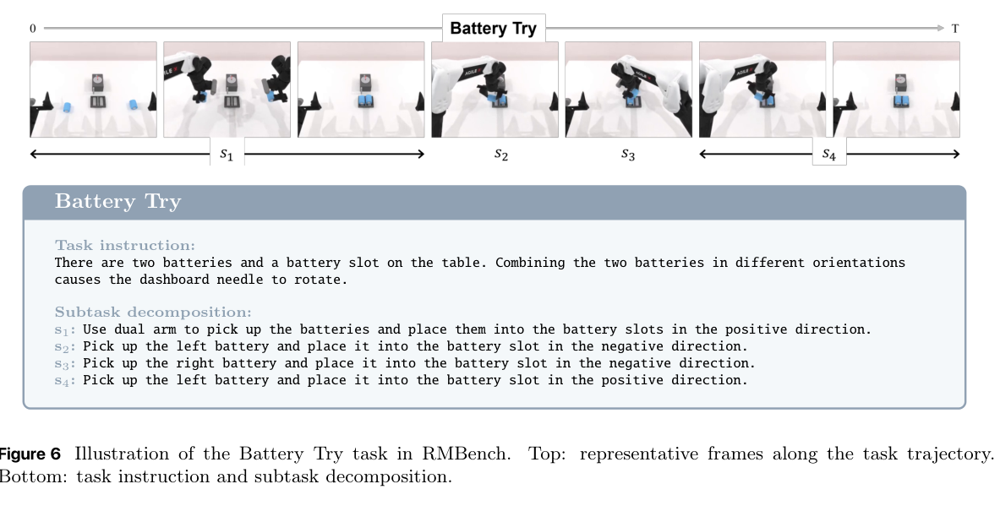

**Caption:** Illustration of the Battery Try task in RMBench. Top: representative frames along the task trajectory. Bottom: task instruction and subtask decomposition.

**Caption[CN]:** RMBench 中 Battery Try 任务的示意图。上：任务轨迹中的代表性帧。下：任务指令与子任务分解。

### Auditable in-figure text / 可审计图内文本

> <strong>Para. 1:</strong> **Task instruction:** There are two batteries and a battery slot on the table. Combining the two batteries in different orientations causes the dashboard needle to rotate.

> <strong>Para. 1[CN]:</strong> **任务指令：** 桌上有两节电池和一个电池槽。以不同方向组合两节电池会使仪表盘指针转动。

> <strong>Para. 2:</strong> **Subtask decomposition:**  
> $s_1$: Use dual arm to pick up the batteries and place them into the battery slots in the positive direction.  
> $s_2$: Pick up the left battery and place it into the battery slot in the negative direction.  
> $s_3$: Pick up the right battery and place it into the battery slot in the negative direction.  
> $s_4$: Pick up the left battery and place it into the battery slot in the positive direction.

> <strong>Para. 2[CN]:</strong> **子任务分解：**  
> $s_1$：使用双臂拿起电池，并以正向将它们放入电池槽。  
> $s_2$：拿起左侧电池，并以负向将其放入电池槽。  
> $s_3$：拿起右侧电池，并以负向将其放入电池槽。  
> $s_4$：拿起左侧电池，并以正向将其放入电池槽。

## Figure 7. Blocks Ranking Try

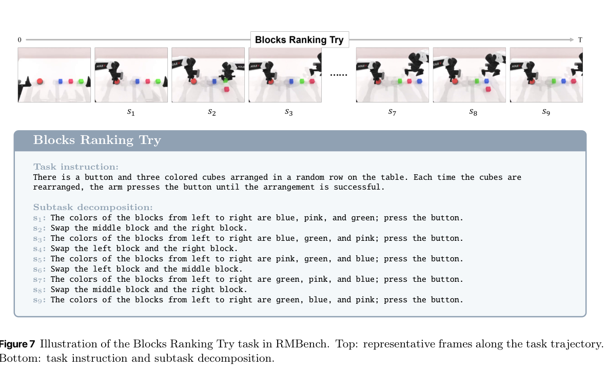

**Caption:** Illustration of the Blocks Ranking Try task in RMBench. Top: representative frames along the task trajectory. Bottom: task instruction and subtask decomposition.

**Caption[CN]:** RMBench 中 Blocks Ranking Try 任务的示意图。上：任务轨迹中的代表性帧。下：任务指令与子任务分解。

### Auditable in-figure text / 可审计图内文本

> <strong>Para. 1:</strong> **Task instruction:** There is a button and three colored cubes arranged in a random row on the table. Each time the cubes are rearranged, the arm presses the button until the arrangement is successful.

> <strong>Para. 1[CN]:</strong> **任务指令：** 桌上有一个按钮和三个随机排成一行的彩色方块。每次重新排列方块后，机械臂都按下按钮，直至排列成功。

> <strong>Para. 2:</strong> **Subtask decomposition:**  
> $s_1$: The colors of the blocks from left to right are blue, pink, and green; press the button.  
> $s_2$: Swap the middle block and the right block.  
> $s_3$: The colors of the blocks from left to right are blue, green, and pink; press the button.  
> $s_4$: Swap the left block and the right block.  
> $s_5$: The colors of the blocks from left to right are pink, green, and blue; press the button.  
> $s_6$: Swap the left block and the middle block.  
> $s_7$: The colors of the blocks from left to right are green, pink, and blue; press the button.  
> $s_8$: Swap the middle block and the right block.  
> $s_9$: The colors of the blocks from left to right are green, blue, and pink; press the button.

> <strong>Para. 2[CN]:</strong> **子任务分解：**  
> $s_1$：方块从左到右的颜色为蓝色、粉色和绿色；按下按钮。  
> $s_2$：交换中间方块与右侧方块。  
> $s_3$：方块从左到右的颜色为蓝色、绿色和粉色；按下按钮。  
> $s_4$：交换左侧方块与右侧方块。  
> $s_5$：方块从左到右的颜色为粉色、绿色和蓝色；按下按钮。  
> $s_6$：交换左侧方块与中间方块。  
> $s_7$：方块从左到右的颜色为绿色、粉色和蓝色；按下按钮。  
> $s_8$：交换中间方块与右侧方块。  
> $s_9$：方块从左到右的颜色为绿色、蓝色和粉色；按下按钮。

## Figure 8. Cover Blocks

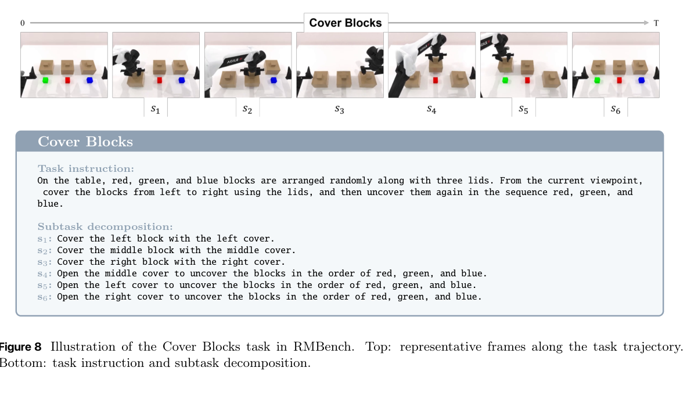

**Caption:** Illustration of the Cover Blocks task in RMBench. Top: representative frames along the task trajectory. Bottom: task instruction and subtask decomposition.

**Caption[CN]:** RMBench 中 Cover Blocks 任务的示意图。上：任务轨迹中的代表性帧。下：任务指令与子任务分解。

### Auditable in-figure text / 可审计图内文本

> <strong>Para. 1:</strong> **Task instruction:** On the table, red, green, and blue blocks are arranged randomly along with three lids. From the current viewpoint, cover the blocks from left to right using the lids, and then uncover them again in the sequence red, green, and blue.

> <strong>Para. 1[CN]:</strong> **任务指令：** 桌上随机摆放着红色、绿色和蓝色方块以及三个盖子。从当前视角出发，使用盖子从左到右盖住方块，然后再按照红色、绿色、蓝色的顺序将它们揭开。

> <strong>Para. 2:</strong> **Subtask decomposition:**  
> $s_1$: Cover the left block with the left cover.  
> $s_2$: Cover the middle block with the middle cover.  
> $s_3$: Cover the right block with the right cover.  
> $s_4$: Open the middle cover to uncover the blocks in the order of red, green, and blue.  
> $s_5$: Open the left cover to uncover the blocks in the order of red, green, and blue.  
> $s_6$: Open the right cover to uncover the blocks in the order of red, green, and blue.

> <strong>Para. 2[CN]:</strong> **子任务分解：**  
> $s_1$：用左侧盖子盖住左侧方块。  
> $s_2$：用中间盖子盖住中间方块。  
> $s_3$：用右侧盖子盖住右侧方块。  
> $s_4$：打开中间盖子，以按照红、绿、蓝的顺序揭开方块。  
> $s_5$：打开左侧盖子，以按照红、绿、蓝的顺序揭开方块。  
> $s_6$：打开右侧盖子，以按照红、绿、蓝的顺序揭开方块。

## Figure 9. Press Button

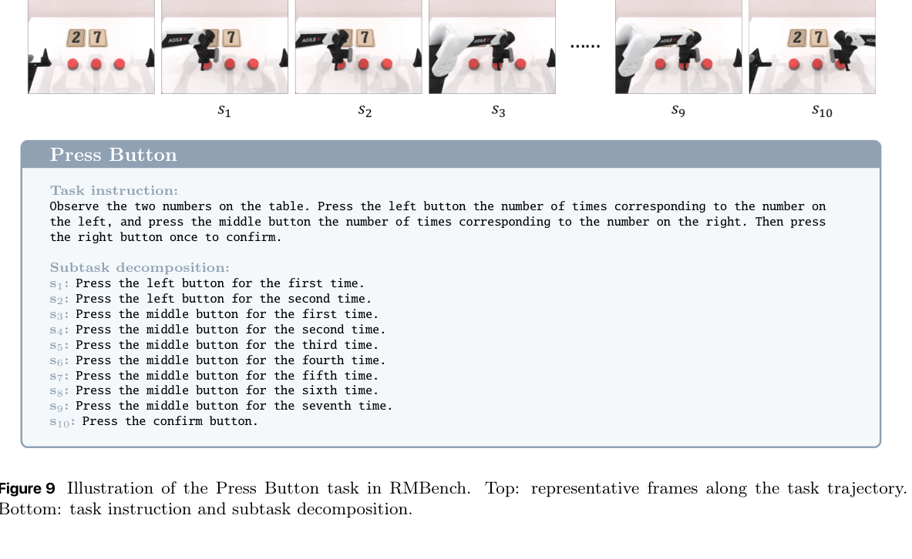

**Caption:** Illustration of the Press Button task in RMBench. Top: representative frames along the task trajectory. Bottom: task instruction and subtask decomposition.

**Caption[CN]:** RMBench 中 Press Button 任务的示意图。上：任务轨迹中的代表性帧。下：任务指令与子任务分解。

### Auditable in-figure text / 可审计图内文本

> <strong>Para. 1:</strong> **Task instruction:** Observe the two numbers on the table. Press the left button the number of times corresponding to the number on the left, and press the middle button the number of times corresponding to the number on the right. Then press the right button once to confirm.

> <strong>Para. 1[CN]:</strong> **任务指令：** 观察桌上的两个数字。按照左侧数字所表示的次数按左侧按钮，并按照右侧数字所表示的次数按中间按钮。然后按一次右侧按钮以确认。

> <strong>Para. 2:</strong> **Subtask decomposition:**  
> $s_1$: Press the left button for the first time.  
> $s_2$: Press the left button for the second time.  
> $s_3$: Press the middle button for the first time.  
> $s_4$: Press the middle button for the second time.  
> $s_5$: Press the middle button for the third time.  
> $s_6$: Press the middle button for the fourth time.  
> $s_7$: Press the middle button for the fifth time.  
> $s_8$: Press the middle button for the sixth time.  
> $s_9$: Press the middle button for the seventh time.  
> $s_{10}$: Press the confirm button.

> <strong>Para. 2[CN]:</strong> **子任务分解：**  
> $s_1$：第一次按左侧按钮。  
> $s_2$：第二次按左侧按钮。  
> $s_3$：第一次按中间按钮。  
> $s_4$：第二次按中间按钮。  
> $s_5$：第三次按中间按钮。  
> $s_6$：第四次按中间按钮。  
> $s_7$：第五次按中间按钮。  
> $s_8$：第六次按中间按钮。  
> $s_9$：第七次按中间按钮。  
> $s_{10}$：按下确认按钮。

## Figure 10. Predicted and ground-truth images during inference / 推理期间的预测图像与真值图像

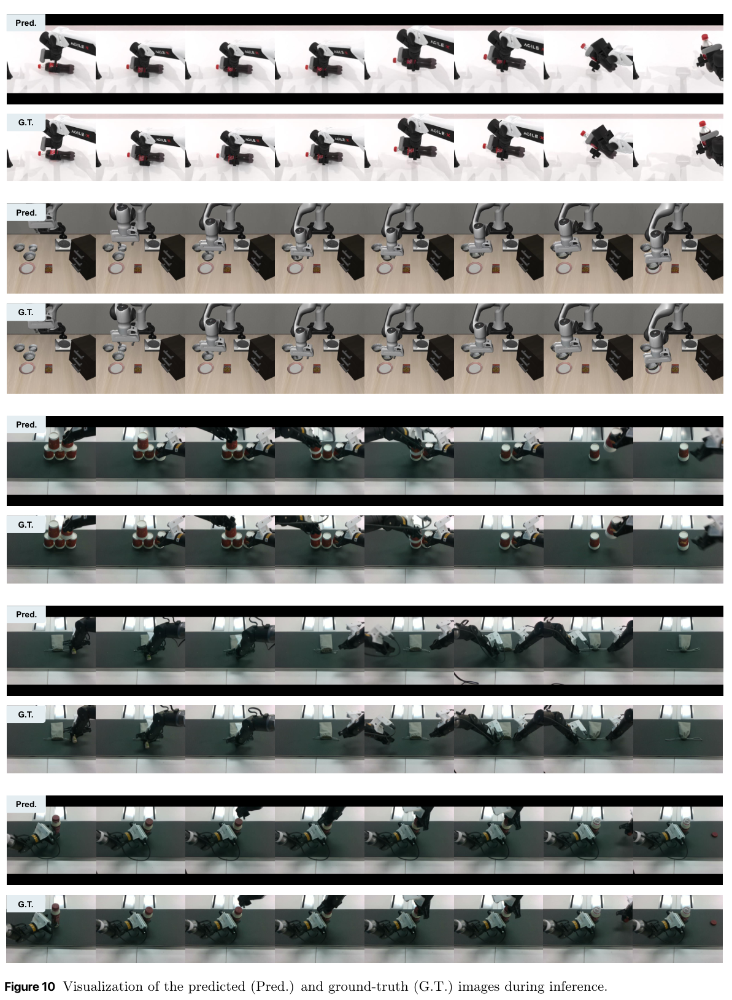

**Caption:** Visualization of the predicted (Pred.) and ground-truth (G.T.) images during inference.

**Caption[CN]:** 推理期间预测图像（Pred.）与真值图像（G.T.）的可视化。

**In-figure labels / 图内标签:**

| Label | Meaning / 中文含义 |
|---|---|
| Pred. | Predicted images / 预测图像 |
| G.T. | Ground-truth images / 真值图像 |

---

# Table 7. Per-task success rates on RoboTwin 2.0 / RoboTwin 2.0 逐任务成功率

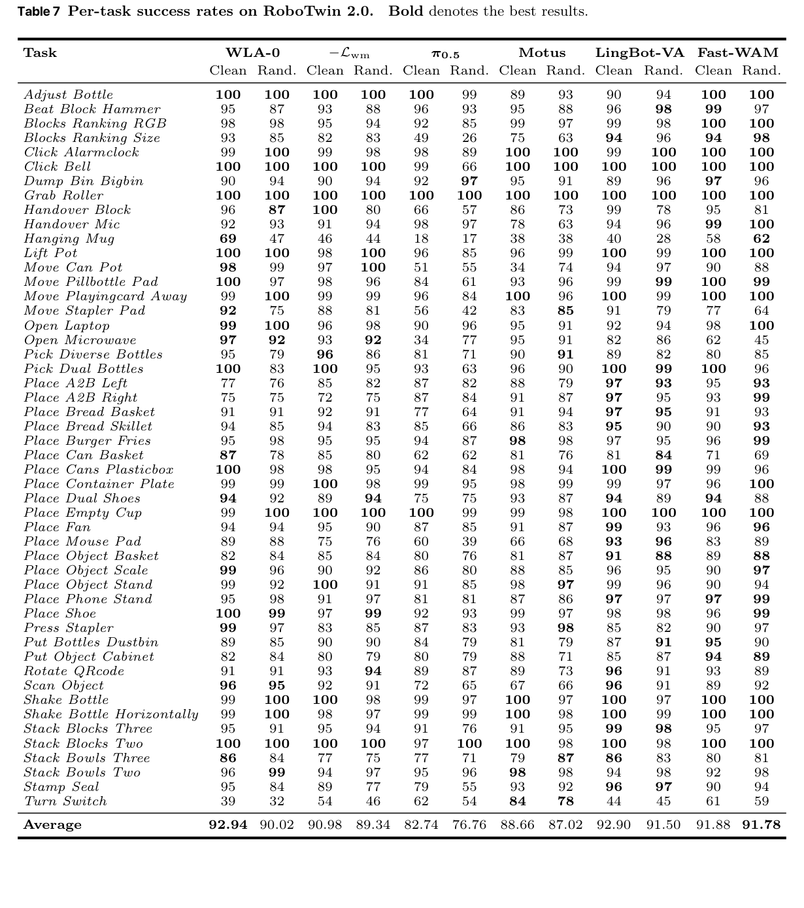

**Caption:** Per-task success rates on RoboTwin 2.0. Bold denotes the best results.

**Caption[CN]:** RoboTwin 2.0 上的逐任务成功率。粗体表示最佳结果。

> **Column order / 列顺序:** Each model has **Clean** then **Rand.**. Values below are fully transcribed in the exact source row order. Task names are preserved verbatim for searchability; the adjacent Chinese column supplies bilingual alignment.

| Task | Task[CN] | WLA-0 Clean | WLA-0 Rand. | −$L_{wm}$ Clean | −$L_{wm}$ Rand. | $\pi_{0.5}$ Clean | $\pi_{0.5}$ Rand. | Motus Clean | Motus Rand. | LingBot-VA Clean | LingBot-VA Rand. | Fast-WAM Clean | Fast-WAM Rand. |
|---|---|---:|---:|---:|---:|---:|---:|---:|---:|---:|---:|---:|---:|
| Adjust Bottle | 调整瓶子 | 100 | 100 | 100 | 100 | 100 | 99 | 89 | 93 | 90 | 94 | 100 | 100 |
| Beat Block Hammer | 用锤敲击方块 | 95 | 87 | 93 | 88 | 96 | 93 | 95 | 88 | 96 | 98 | 99 | 97 |
| Blocks Ranking RGB | 按 RGB 颜色排序方块 | 98 | 98 | 95 | 94 | 92 | 85 | 99 | 97 | 99 | 98 | 100 | 100 |
| Blocks Ranking Size | 按尺寸排序方块 | 93 | 85 | 82 | 83 | 49 | 26 | 75 | 63 | 94 | 96 | 94 | 98 |
| Click Alarmclock | 点击闹钟 | 99 | 100 | 99 | 98 | 98 | 89 | 100 | 100 | 99 | 100 | 100 | 100 |
| Click Bell | 按铃 | 100 | 100 | 100 | 100 | 99 | 66 | 100 | 100 | 100 | 100 | 100 | 100 |
| Dump Bin Bigbin | 将小箱倒入大箱 | 90 | 94 | 90 | 94 | 92 | 97 | 95 | 91 | 89 | 96 | 97 | 96 |
| Grab Roller | 抓取滚筒 | 100 | 100 | 100 | 100 | 100 | 100 | 100 | 100 | 100 | 100 | 100 | 100 |
| Handover Block | 递交方块 | 96 | 87 | 100 | 80 | 66 | 57 | 86 | 73 | 99 | 78 | 95 | 81 |
| Handover Mic | 递交麦克风 | 92 | 93 | 91 | 94 | 98 | 97 | 78 | 63 | 94 | 96 | 99 | 100 |
| Hanging Mug | 悬挂杯子 | 69 | 47 | 46 | 44 | 18 | 17 | 38 | 38 | 40 | 28 | 58 | 62 |
| Lift Pot | 提起锅 | 100 | 100 | 98 | 100 | 96 | 85 | 96 | 99 | 100 | 99 | 100 | 100 |
| Move Can Pot | 将罐子移到锅中 | 98 | 99 | 97 | 100 | 51 | 55 | 34 | 74 | 94 | 97 | 90 | 88 |
| Move Pillbottle Pad | 将药瓶移到垫子上 | 100 | 97 | 98 | 96 | 84 | 61 | 93 | 96 | 99 | 99 | 100 | 99 |
| Move Playingcard Away | 移开扑克牌 | 99 | 100 | 99 | 99 | 96 | 84 | 100 | 96 | 100 | 99 | 100 | 100 |
| Move Stapler Pad | 将订书机移到垫子上 | 92 | 75 | 88 | 81 | 56 | 42 | 83 | 85 | 91 | 79 | 77 | 64 |
| Open Laptop | 打开笔记本电脑 | 99 | 100 | 96 | 98 | 90 | 96 | 95 | 91 | 92 | 94 | 98 | 100 |
| Open Microwave | 打开微波炉 | 97 | 92 | 93 | 92 | 34 | 77 | 95 | 91 | 82 | 86 | 62 | 45 |
| Pick Diverse Bottles | 拿取不同瓶子 | 95 | 79 | 96 | 86 | 81 | 71 | 90 | 91 | 89 | 82 | 80 | 85 |
| Pick Dual Bottles | 拿取两个瓶子 | 100 | 83 | 100 | 95 | 93 | 63 | 96 | 90 | 100 | 99 | 100 | 96 |
| Place A2B Left | 从 A 放至左侧 B | 77 | 76 | 85 | 82 | 87 | 82 | 88 | 79 | 97 | 93 | 95 | 93 |
| Place A2B Right | 从 A 放至右侧 B | 75 | 75 | 72 | 75 | 87 | 84 | 91 | 87 | 97 | 95 | 93 | 99 |
| Place Bread Basket | 将面包放入篮筐 | 91 | 91 | 92 | 91 | 77 | 64 | 91 | 94 | 97 | 95 | 91 | 93 |
| Place Bread Skillet | 将面包放入煎锅 | 94 | 85 | 94 | 83 | 85 | 66 | 86 | 83 | 95 | 90 | 90 | 93 |
| Place Burger Fries | 放置汉堡和薯条 | 95 | 98 | 95 | 95 | 94 | 87 | 98 | 98 | 97 | 95 | 96 | 99 |
| Place Can Basket | 将罐子放入篮筐 | 87 | 78 | 85 | 80 | 62 | 62 | 81 | 76 | 81 | 84 | 71 | 69 |
| Place Cans Plasticbox | 将罐子放入塑料盒 | 100 | 98 | 98 | 95 | 94 | 84 | 98 | 94 | 100 | 99 | 99 | 96 |
| Place Container Plate | 将容器放到盘子上 | 99 | 99 | 100 | 98 | 99 | 95 | 98 | 99 | 99 | 97 | 96 | 100 |
| Place Dual Shoes | 放置两只鞋 | 94 | 92 | 89 | 94 | 75 | 75 | 93 | 87 | 94 | 89 | 94 | 88 |
| Place Empty Cup | 放置空杯 | 99 | 100 | 100 | 100 | 100 | 99 | 99 | 98 | 100 | 100 | 100 | 100 |
| Place Fan | 放置风扇 | 94 | 94 | 95 | 90 | 87 | 85 | 91 | 87 | 99 | 93 | 96 | 96 |
| Place Mouse Pad | 将鼠标放到垫子上 | 89 | 88 | 75 | 76 | 60 | 39 | 66 | 68 | 93 | 96 | 83 | 89 |
| Place Object Basket | 将物体放入篮筐 | 82 | 84 | 85 | 84 | 80 | 76 | 81 | 87 | 91 | 88 | 89 | 88 |
| Place Object Scale | 将物体放到秤上 | 99 | 96 | 90 | 92 | 86 | 80 | 88 | 85 | 96 | 95 | 90 | 97 |
| Place Object Stand | 将物体放到支架上 | 99 | 92 | 100 | 91 | 91 | 85 | 98 | 97 | 99 | 96 | 90 | 94 |
| Place Phone Stand | 将手机放到支架上 | 95 | 98 | 91 | 97 | 81 | 81 | 87 | 86 | 97 | 97 | 97 | 99 |
| Place Shoe | 放置鞋子 | 100 | 99 | 97 | 99 | 92 | 93 | 99 | 97 | 98 | 98 | 96 | 99 |
| Press Stapler | 按压订书机 | 99 | 97 | 83 | 85 | 87 | 83 | 93 | 98 | 85 | 82 | 90 | 97 |
| Put Bottles Dustbin | 将瓶子放入垃圾桶 | 89 | 85 | 90 | 90 | 84 | 79 | 81 | 79 | 87 | 91 | 95 | 90 |
| Put Object Cabinet | 将物体放入柜子 | 82 | 84 | 80 | 79 | 80 | 79 | 88 | 71 | 85 | 87 | 94 | 89 |
| Rotate QRcode | 旋转二维码 | 91 | 91 | 93 | 94 | 89 | 87 | 89 | 73 | 96 | 91 | 93 | 89 |
| Scan Object | 扫描物体 | 96 | 95 | 92 | 91 | 72 | 65 | 67 | 66 | 96 | 91 | 89 | 92 |
| Shake Bottle | 摇晃瓶子 | 99 | 100 | 100 | 98 | 99 | 97 | 100 | 97 | 100 | 97 | 100 | 100 |
| Shake Bottle Horizontally | 水平摇晃瓶子 | 99 | 100 | 98 | 97 | 99 | 99 | 100 | 98 | 100 | 99 | 100 | 100 |
| Stack Blocks Three | 堆叠三个方块 | 95 | 91 | 95 | 94 | 91 | 76 | 91 | 95 | 99 | 98 | 95 | 97 |
| Stack Blocks Two | 堆叠两个方块 | 100 | 100 | 100 | 100 | 97 | 100 | 100 | 98 | 100 | 98 | 100 | 100 |
| Stack Bowls Three | 堆叠三个碗 | 86 | 84 | 77 | 75 | 77 | 71 | 79 | 87 | 86 | 83 | 80 | 81 |
| Stack Bowls Two | 堆叠两个碗 | 96 | 99 | 94 | 97 | 95 | 96 | 98 | 98 | 94 | 98 | 92 | 98 |
| Stamp Seal | 盖章 | 95 | 84 | 89 | 77 | 79 | 55 | 93 | 92 | 96 | 97 | 90 | 94 |
| Turn Switch | 拨动开关 | 39 | 32 | 54 | 46 | 62 | 54 | 84 | 78 | 44 | 45 | 61 | 59 |
| **Average** | **平均** | **92.94** | **90.02** | **90.98** | **89.34** | **82.74** | **76.76** | **88.66** | **87.02** | **92.90** | **91.50** | **91.88** | **91.78** |

---

## Critical Reading Notes / 阅读提示

- WLA 的核心不是显式地“先生成图像、再据图动作”，而是通过共享的物理动力学潜表示和世界建模损失，让 World Expert 在训练时隐式塑造 Action Expert；高效模式推理时可关闭 World Expert。
- TTS 模式重新启用 World Expert，对多个候选动作块预测目标帧，再由 value model 选择，形成效率与性能之间的可切换折中。
- 跨本体机器人视频带来明显收益，但人类第一视角视频实验失败，论文将其归因于真实人类视频与仿真机器人域之间的差距；这是方法当前最重要的数据对齐限制。
