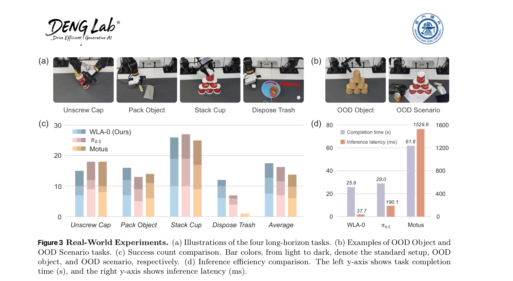
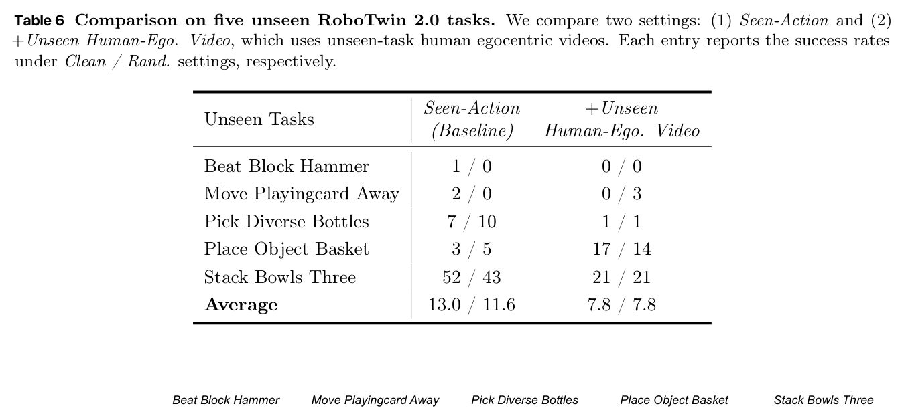

---
tags:
  - papers/embodied-ai
  - papers/世界模型
  - papers/robot-learning
aliases:
  - WLA
  - WLA-0
  - World-Language-Action Model
arxiv_id: "2606.05979"
doi: 10.48550/arXiv.2606.05979
date: 2026-06-04
---

# World-Language-Action Model for Unified World Modeling, Language Reasoning, and Action Synthesis

## 核心信息

- 标题: World-Language-Action Model for Unified World Modeling, Language Reasoning, and Action Synthesis
- 标题翻译: 面向统一世界建模、语言推理与动作合成的世界—语言—动作模型
- 作者: Yi Yang, Zhihong Liu, Siqi Kou, Yiyang Chen, Yanzhe Hu, Jianbo Zhou, Boyuan Zhao, Zhijie Wei, Xiao Xia, Xueqi Li, Pengfei Liu, Zhijie Deng
- 机构: 上海交通大学、上海人工智能实验室、华中科技大学、华南理工大学、华东理工大学、上海大学、南京邮电大学
- 发表时间: 2026-06-04
- 发表渠道: arXiv 预印本
- DOI: 10.48550/arXiv.2606.05979
- arXiv: 2606.05979v1
- 论文链接: https://arxiv.org/abs/2606.05979
- 代码 / 项目: https://github.com/SJTU-DENG-Lab/WLA
- 数据 / 资源: 机器人双生 2.0、LIBERO 基准、机器人记忆基准；Piper 双臂真机示范；ARX-X5 机器人 跨具身模拟视频；人类第一视角视频
- 论文类型: 具身智能方法论文 / 统一世界—语言—动作模型

## 原文摘要翻译

> 本文提出世界—语言—动作模型（WLA），把它定义为一类新的具身基础模型。
>
> WLA 接收文本指令、图像和机器人状态，联合预测文本子任务、子目标图像和机器人动作：它既保留世界—动作模型通过世界建模接口从大规模第一视角视频中学习的能力，也吸收视觉—语言—动作模型解决复杂长程任务所需的语言推理能力。
>
> WLA 的核心不再是世界—动作模型常用的双向扩散 变换器，而是自回归 变换器；它预测的“下一状态”由语义层文本意图和互补的细粒度物理动态组成。
>
> 专门的 世界专家 以世界建模目标监督物理动态，所得动态表征又帮助 动作专家 建模状态—动作关系。
>
> WLA 通过 元查询 让世界预测以隐式方式影响动作生成，因而可在推理时关闭 世界专家；也可重新启用世界预测，通过测试时扩展改善机器人控制。
>
> 原型 WLA-0 在推理时激活约 20 亿参数，在 RTX 5090 上单次推理约 40 毫秒。
>
> 模拟与真实环境评估显示，WLA-0 在多任务和长程学习上取得很强结果，例如 机器人双生 2.0 干净场景 成功率 92.94%，机器人记忆基准 成功率 56.5%。
>
> 结果还表明，WLA-0 有可能直接从不带动作标注的跨具身机器人视频中学习新任务。
>
> （PDF 第1）。

## 创新点

1. **把“下一状态”拆成语言意图与物理动态，而不是把未来等同于像素视频。** 自回归 视觉语言模型 主干承担可组合、可记忆的语义规划；元查询 隐变量 承担动作所需的状态转移信息；世界专家 再负责补齐视觉细节。这是论文最有价值的接口设计，而不是简单把 视觉语言动作模型 与视频生成网络并排连接。（图 1，PDF 第2；式 3.1–3.4，PDF 第3–5）

2. **以训练期 世界损失 约束共享 隐变量，部署时不必走“先生成图、再动作”的链路。** $L_{wm}$ 经 世界专家 回传到共享主干和 元查询，使 动作专家 看到的 $h_t$ 同时对未来状态和动作有用；因为动作头不以生成图像为输入，高效模式可直接删除 世界专家。（图 2a，PDF 第4；式 3.2–3.5，PDF 第4–5）

3. **把语言子任务窗口变成长程控制的显式记忆接口。** 模型不是只输出一个固定技能标签，而是预测与下一动作块时间对齐的连续子任务窗口，并把已执行部分写回 记忆。机器人记忆基准 上去掉语言损失后平均成功率从 56.5% 降至 17.3%，这是全文最强的组件证据。（表 2，PDF 第6；附录 B.3，PDF 第13）

4. **同一 世界专家 服务两种部署预算。** 默认关闭它以获得约 40 毫秒 延迟；预算充足时则为 $K$ 个动作候选想象终点帧，再由 价值模型 排序。其思想清楚，但 LIBERO 基准 仅从 98.6 提到 98.9，成本—收益尚未充分交代。（图 2b，PDF 第4；§3.2，PDF 第5；表 1，PDF 第5）

5. **用无动作视频给未见任务提供世界监督。** 同具身与跨具身机器人视频都能在部分 机器人双生 未见任务上提升目标机器人策略；但人类第一视角视频反而退化，说明“异构视频可扩展学习”仍是有限证据而非已解决能力。（表 3，PDF 第8；表 6，PDF 第15；附录 D）

## 一句话总结

WLA 真正做对的是把语言计划、共享物理 隐变量 和像素世界监督组织成一个**训练时统一、推理时可拆**的接口；它不是证明“一个模型已经统一了物理智能”，而是给出了一套兼顾长程记忆、动作监督和低延迟部署的可信工程原型。

## 研究问题

主流 视觉语言动作模型 与 世界动作模型 各自解决一半问题。视觉语言动作模型 的 自回归视觉语言 主干擅长指令理解、文本生成和长上下文，却通常直接从视觉表征到动作，缺少明确的未来状态监督；世界动作模型 通过视频预测学习动力学，却往往由双向 扩散变换器 驱动，把大量容量和推理时间消耗在像素细节上，同时缺少原生语言生成与长程记忆。（§1–2，PDF 第1–3）

WLA 的问题意识不是“是否生成未来”，而是：**动作到底需要什么层级的未来表征？** 作者的答案是两级 下一状态：文本意图提供跨场景泛化的语义蓝图，物理动态 $h_t$ 表示低层状态转移；未来 VAE 特征 只是训练 $h_t$ 的监督目标，不一定是在线动作生成的必经输入。（§3.1，PDF 第3–5）

*图 1（PDF 第2）。视觉语言动作模型 直接由 自回归 变换器 产生动作；典型 世界动作模型 以 扩散变换器 预测视觉未来；WLA 则把 自回归主干 的 下一状态 表征拆成 文本意图 与 物理动态，并分别连接 世界专家 和 动作专家。图中“2B/无具身预训练”必须结合总参数和初始化方式解释。*

## 数据与任务定义

### 统一输入输出

> 统一映射的输入是历史和当前观测、本体状态与语言指令；输出是文本子任务窗口、动作块终点的未来视觉状态和 $n$ 步动作块。
>
> 执行动作块后以滚动时域方式再次预测，直至任务结束。
>
> 这个定义允许图文对、带动作机器人示范、无动作的同/跨具身视频进入同一模型，但不同数据显然只监督其中一部分输出。
>
> （§3，PDF 第3）。

### 三类模拟评测

- **机器人双生 2.0**：50 个双臂任务；2,500 条 干净场景 与 25,000 条强随机化轨迹；训练 100k 步、全局批量 256，每任务每设置 100 次评测。任务较短，因此关闭语言子任务预测。动作块 $n=32$，附录 B.1 说明使用 32 个 流匹配 推理步，较少步数会引发机械臂抖动；动作表示为末端执行器绝对位置。（§4.1–4.2，PDF 第5–6；附录 B.1，PDF 第13）
- **LIBERO 基准**：空间、物体、目标、长程 四套件，每套 10 个任务、每任务 50 示范；一个模型混合训练 100k 步、批量 256，每任务 50 次评测。动作块 $n=8$；作者称约 30k 步 已达到很强性能。（§4.2，PDF 第6）
- **机器人记忆基准 M(n)**：电池试错、积木排序试错、覆盖积木、按键 四个长程记忆任务；每任务单独训练 30k 步、全局批量 448。它们分别要求方向试错、排列搜索、遮挡/揭盖顺序记忆和计数确认，因而能检验语言子任务与 记忆 是否真的参与闭环。（§4.2，PDF 第6–7；图 6–9，PDF 第15–17）

### 真机与视频迁移

> 真机使用 Agilex Robotics Piper 双臂平台，设计 拧开瓶盖、包装物体、叠杯、丢弃垃圾 四项长程任务；每项收集 60 条示范，并在标准、分布外物体、分布外场景 三种条件下各做 10 次测试。
>
> 丢弃垃圾 的目标垃圾桶持续旋转，特别考验历史条件和低延迟反应。
>
> （图 3，PDF 第7；§4.3，PDF 第7–8；附录 C，PDF 第14）。

新任务视频实验把 机器人双生 的 50 项任务划成 45 已见 与 5 未见；每项含 50 干净场景、500 随机化轨迹。已见任务提供动作监督；未见任务只加入 Aloha-AgileX 机器人 同具身视频或 ARX-X5 机器人 跨具身视频。未见视频 损失 权重 0.1，每次 前向计算 以 1:1 采样 已见 数据和 未见 视频，训练 50k 步、批量 256。（§4.4，PDF 第8–9；附录 D，PDF 第14–15）

## 方法主线

### 机制流程

1. **预测与动作 时间范围 对齐的语言窗口。** 原指令被分解为带时间区间 $[s_k,e_k]$ 的子任务序列 $\hat L$；模型输出覆盖 $[t,t+n]$ 的连续窗口：

$$
S_t=f(o_{t-h},o_t,\ell,M).
$$

> 窗口首项必须在 $t$ 前开始，末项必须覆盖到 $t+n$。
>
> 执行后，把本窗口中已经完成、且不是末项的子任务追加到记忆缓冲区。
>
> 这使语言不是旁路解释，而是与动作块同步的进度状态。
>
> （式 3.1，PDF 第3–4）。

2. **用 元查询 汇聚物理状态转移。** 在 自回归主干 的上下文后附加 64 个 元查询 $Q$，通过 因果注意力 汇聚历史观测、当前观测、指令、记忆 和文本窗口：

$$
h_t=f(o_{t-h},o_t,\ell,M,S_t,Q).
$$

作者把紧凑的 $h_t$ 解释为 隐变量 动作：它应保留足以驱动动作的状态转移，而不负责重建全部纹理。（式 3.2，PDF 第4）

3. **同一 $h_t$ 分流到两个 专家。** 世界专家 结合当前视觉表征预测动作块终点的未来 VAE 特征，动作专家 则结合本体状态生成动作：

$$
o_{t+n}=f_{wm}(h_t,o_t),\qquad a_{t:t+n}=f_{act}(h_t,q_t).
$$

世界专家 使用 SANA-600M 扩散变换器，连同 VAE 约 0.9B；动作专家 是 0.39B 流匹配 头；自回归主干 为 RynnBrain-2B，实际 2.1B。（式 3.3–3.4，PDF 第4–5；§4.1，PDF 第5–6）

4. **联合训练、按预算部署。** 总目标为：

$$
\mathcal L=\mathcal L_{act}+\alpha\mathcal L_{wm}+\beta\mathcal L_{lang},
\quad \alpha=0.1,\ \beta=0.005.
$$

$L_{lang}$ 是子任务交叉熵，$L_{wm}$ 与 $L_{act}$ 是 流匹配 损失。高效模式只保留产生 $h_t$ 和动作所需的路径；测试时扩展 模式再启用 世界专家 和 价值模型。（式 3.5，PDF 第4–5；§3.2，PDF 第5）

*图 2（PDF 第4）。左图是训练/高效推理架构；右图是测试时扩展。注意 动作专家 的条件是 $h_t,q_t$，不是 世界专家 输出的图像，这正是 世界专家 可被关闭的计算图依据。*

### 世界损失 为什么能隐式影响 动作

> 这部分容易被一句“共享参数”带过。
>
> 更精确地看，$h_t$ 是 自回归主干/元查询 的输出，同时进入 $f_{wm}$ 和 $f_{act}$。
>
> 因此 $L_{wm}$ 的梯度沿 $f_{wm}\rightarrow h_t\rightarrow f$ 回传，迫使动作头同样可见的 $h_t$ 编码可预测的视觉转移；$L_{act}$ 又要求它对控制有用。
>
> 训练形成的是**共享 隐变量 上的多任务约束**，而非测试时“图像先生成、动作再读取”的显式因果链。
>
> （式 3.2–3.5，PDF 第4–5）。

证据强度有限但方向一致：去掉 $L_{wm}$ 后，机器人双生 干净场景 从 92.94 降至 90.98，随机场景 从 90.02 降至 89.34；LIBERO 基准 从 98.6 降至 97.9。（表 1，PDF 第5）这支持 世界监督 有帮助，却不能证明 $h_t$ 已是作者所称的“最小充分”物理动态；论文没有 隐变量 探测实验、信息瓶颈测量或针对 $h_t$ 的因果干预。

### 单帧监督为什么反而更好

> 世界专家 默认只预测 $o_{t+n}$，不预测完整 $o_{t:t+n}$。
>
> 在 $n=32$ 的受控实验中，单帧模型只预测 $o_{t+32}$；多帧模型同时预测 $o_{t+8},o_{t+16},o_{t+24},o_{t+32}$。
>
> 两者训练 30k 步、批量 256，LIBERO 基准 平均分别为 98.2 与 94.2。
>
> （表 4，PDF 第13；附录 B.2）。

作者解释“过密视觉监督减慢收敛并干扰 动作 learning”是合理假说：共享 隐变量 容量有限，多时间点像素目标会要求它保留更多轨迹细节，而 动作专家 只需下一动作块的充分统计量。但当前实验只比较两个目标密度，没有等收敛计算量曲线、损失权重 扫描实验 或容量控制，因此不能推广成“所有 世界动作模型 都只需一帧”。

### 高效模式与 测试时扩展 模式

> 高效模式关闭约 0.9B 的 世界专家。
>
> 附录 A 把延迟从约 116 毫秒 压到 40 毫秒 以下：一是用固定地址 缓冲区 捕获 CUDA 计算图，重放 视觉语言模型 与多步 扩散变换器 前向计算，去除 Python 调度；二是用 特里同 融合 均方根归一化、查询—键—值/旋转位置编码、门控线性单元、自适应层归一化、自/交叉注意力和 高斯误差线性单元 等相邻算子；三是预计算 词元嵌入、因果掩码、旋转位置编码 表、图像占位索引、动作时间编码和 自适应层归一化 参数，并缓存每次预测中跨 去噪 步 复用的 交叉注意力 键值。
>
> （附录 A，PDF 第13）。

> 测试时扩展 模式以不同随机种子采样 $K$ 个动作块；世界专家 为每个候选预测执行后的静态帧，价值模型 依据“指令 + 想象帧”评分，选最高值动作。
>
> 价值标签来自 WLA-0 执行轨迹：若整段成功 $y=1$，时刻 $t$ 的标签为 $v_t=y\gamma^{T-t}$；预测帧还可递归作为下一输入延伸 想象范围。
>
> （§3.2，PDF 第5）LIBERO 基准 使用 $K=6$、时间范围 2，平均由 98.6 升至 98.9。
>
> （§4.2，PDF 第6）。

## 关键结果

### 模拟多任务与强基线

| 方法 | 激活参数 | 具身预训练 | 机器人双生 干净场景 | 机器人双生 随机场景 | LIBERO 基准 平均 |
|---|---:|:---:|---:|---:|---:|
| $\pi_0$ | 3B | 是 | 65.92 | 58.40 | 94.2 |
| $\pi_{0.5}$ | 3B | 是 | 82.74 | 76.76 | 96.9 |
| Motus | 8B | 是 | 88.66 | 87.02 | 97.7 |
| LingBot 视觉动作模型 | 5B | 是 | 92.90 | 91.50 | 98.5 |
| 快速世界动作模型 | 6B | 否 | 91.88 | **91.78** | 97.6 |
| WLA-0 | 2B | 否 | **92.94** | 90.02 | **98.6** |
| WLA-0 去 $L_{wm}$ | 2B | 否 | 90.98 | 89.34 | 97.9 |
| WLA-0 + 测试时扩展 | 2B | 否 | — | — | 98.9 |

（表 1，PDF 第5）WLA-0 的 干净场景 与 LIBERO 基准 结果很强，但“全面 最佳”并不准确：机器人双生 随机场景 低于 快速世界动作模型 和 LingBot 视觉动作模型；且 附录 B.1 指出 LingBot 视觉动作模型 用 已见指令，其他方法用 未见指令，列内协议并非完全齐平。世界损失带来的增益约 0.7–2.0 点，是稳定的辅助收益，不是压倒性机制证明。

### 机器人记忆基准：语言记忆是最有说服力的结果

*表 2（PDF 第6页）。机器人记忆基准主结果与语言子任务损失消融。*

| 方法 | 电池试错 | 积木排序试错 | 覆盖积木 | 按键 | 平均 |
|---|---:|---:|---:|---:|---:|
| $\pi_{0.5}$ | 16 | 6 | 0 | 0 | 5.5 |
| X-视觉语言动作模型 | 26 | 1 | 2 | 0 | 7.3 |
| Mem-0 | 28 | 18 | 68 | 0 | 28.5 |
| 快速世界动作模型 | 16 | **37** | 0 | 0 | 13.3 |
| WLA-0 | **45** | 23 | **84** | **74** | **56.5** |
| WLA-0 去 $L_{lang}$ | 38 | 12 | 18 | 1 | 17.3 |

（表 2，PDF 第6）去语言损失造成 39.2 点绝对下降，尤其 覆盖积木 从 84 到 18、按键 从 74 到 1。图 6–9 展示四任务的完整子任务分解：电池试错 记录电池方向试错；积木排序试错 交替排列和按键验证；覆盖积木 先按空间顺序覆盖再按颜色顺序揭开；按键 需要计数后确认。（PDF 第15–17）这说明语言 轨迹 对**离散进度状态**特别有效。

但该消融同时移除了 子任务监督，继而改变预测文本、记忆 内容和动作条件，无法把收益进一步拆成“语言表征”“显式 记忆”“子任务标注质量”三项独立因果贡献。附录 B.3 对 Mem-0 的解释也主要是机制叙述：Mem-0 的独立 子任务结束分类器 可能早/晚切换，而 WLA 每步重新推断当前可执行子任务；论文没有提供对应 分类器错误 的直接统计。（PDF 第13–14）

### 真机：低延迟对动态任务确实有闭环价值

*图 3（PDF 第7页）。四项真机任务、分布外设置、成功次数与推理效率。*

表 5 给出每个真实条件的成功次数：

| 任务 | 设置 | WLA-0 | $\pi_{0.5}$ | Motus |
|---|---|---:|---:|---:|
| 拧开瓶盖 | Standard / 分布外 Object / 分布外 Scenario | 7 / 3 / 6 | 9 / 3 / 6 | 8 / 2 / 5 |
| 包装物体 | Standard / 分布外 Object / 分布外 Scenario | 7 / 5 / 4 | 5 / 4 / 4 | 6 / 5 / 3 |
| 叠杯 | Standard / 分布外 Object / 分布外 Scenario | 10 / 9 / 7 | 10 / 9 / 8 | 9 / 8 / 8 |
| 丢弃垃圾 | Standard / 分布外 Object / 分布外 Scenario | 6 / 4 / 2 | 4 / 2 / 1 | 1 / 0 / 0 |
| 四任务平均 | Standard / 分布外 Object / 分布外 Scenario | **7.5 / 5.25 / 4.75** | 7 / 4.5 / 4.75 | 6 / 3.75 / 4 |

（表 5，PDF 第14）WLA-0 并非每项都赢，但在旋转垃圾桶 丢弃垃圾 上优势明确。作者把它归因于历史观测、未来状态监督和低延迟；这个解释符合任务结构，但没有分别消融 history 与 世界损失 的真机影响。

叠杯 的成功 执行轨迹 中，WLA-0 任务完成时间 / 推理延迟 为 **25.8 秒 / 37.7 毫秒**，$\pi_{0.5}$ 为 **29.0 秒 / 190.1 毫秒**，Motus 为 **61.8 秒 / 1529.8 毫秒**。（图 3d，PDF 第7）比较统一使用 10 个 流匹配 步 和 动作块长度 32，且同步执行；但为节省显存，Motus 每次只生成一帧。这说明 WLA-0 部署链路确实快，却也意味着对 Motus 的数字受实现和内存约束影响，不能当作纯架构理论速度比。

### 从机器人视频学习未见任务

*表 3（PDF 第8页）。五项未见任务上的动作监督、同具身视频与跨具身视频比较。*

表 3（PDF 第8）显示：已见任务动作监督 基线平均为 13.0/11.6（干净场景/随机场景）；只给 已见任务 增加视频监督反而是 11.8/12.6；加入未见任务同具身视频后升至 **34.4/30.0**；跨具身视频为 **28.8/27.4**。因此，有效因素不是泛化的“多看视频”，而是**视频必须包含目标任务行为**。

逐任务差异比均值更关键：跨具身视频在 拾取多种瓶子 达 39/35、将物体放入篮中 达 45/47，优于同具身；但 锤击方块 仅 5/3、移走扑克牌 仅 1/0，远逊同具身的 12/6 和 42/28。图 4（PDF 第8–9）给出 hammer 任务定性轨迹，跨具身模型会抓锤并尝试敲击，而 已见任务动作监督 直接抓取方块；这证明行为语义有所迁移，但不等于稳定完成技能。

### 附录 D 的负结果不能藏起来

作者为五个未见任务各录制 100 段真实人类第一视角视频，混入模拟 已见任务 数据。表 6 的平均结果从 已见任务动作监督 的 13.0/11.6 降至 **7.8/7.8**：锤击方块 0/0、移走扑克牌 0/3、拾取多种瓶子 1/1、将物体放入篮中 17/14、堆叠三个碗 21/21。（图 5、表 6，PDF 第15）作者推测主因是真实人类视频与模拟环境的 域差异；这一推测尚未通过外观对齐、姿态 重定向 或同域人类 化身 对照验证。

*表 6（PDF 第15页）。加入人类第一视角视频后的失败结果。*

### 表 7：平均数掩盖了哪些任务

> 附录 B.1 的 表 7（PDF 第18）完整列出 机器人双生 50 项任务。
>
> WLA-0 的平均成绩来自大量接近满分的任务，但长尾仍明显：拨动开关只有 **39/32**，悬挂杯子为 **69/47**，左右两项从 A 放到 B 的任务分别为 **75/75** 与 **77/76**。
>
> 与此同时，WLA 在 按尺寸排列积木（93/85）、将罐子移入锅中（98/99）、打开微波炉（97/92）等任务明显强于部分 视觉语言动作模型 基线。
>
> 更稳妥的结论是：世界监督隐变量 对若干动态/空间转换任务有帮助，但没有消除接触、悬挂和开关类难点。

## 深度分析

### 真正贡献：不是三个名词统一，而是接口统一

“世界 + 语言 + 动作”本身并不新：视觉语言动作模型 可输出语言，世界动作模型 可预测未来，层级 规划器 也能给 策略 子任务。WLA 的实质贡献是把三者压到两个共享变量上：可读的 $S_t/M$ 与不可读的 $h_t$。前者负责离散任务进度，后者负责连续状态转移；两个 专家 从同一主干分流。这样，语言可直接参与长程循环，世界监督 可在训练期塑造动作 隐变量，而昂贵的像素分支不必成为常规部署依赖。（图 1–2，PDF 第2、4）

### 工程组合：哪些部分并非概念创新

> RynnBrain 视觉语言模型、SANA 扩散变换器、流匹配动作头、元查询、CUDA 计算图、特里同 融合、键值缓存和价值重排 都是已知组件。
>
> 论文的价值不应包装成每个模块的新颖性，而在于组合后的**预算可切换计算图**：同一 世界专家 既是训练辅助头，又能按需成为测试时想象器。
>
> 其工程完成度由 37.7–40 毫秒 真机延迟支撑，但缺少代码版本、核函数 逐项消融和端到端吞吐/显存表，复现仍需谨慎。
>
> （§4.1；附录 A、C）。

### 与 视觉语言动作模型、世界动作模型、快速世界动作模型、Motus 的位置

- **相对 视觉语言动作模型**：$\pi_0/\pi_{0.5}$ 一类模型直接把多模态上下文映射到动作；WLA 增加语言子任务和 future-state auxiliary 损失。机器人记忆基准 的巨大语言消融支持长程优势，但 机器人双生 已关闭语言分支，短任务成绩主要来自物理 隐变量 与工程实现。（图 1a；§4.2）
- **相对典型 扩散变换器 世界动作模型**：WLA 不让大 扩散变换器 成为唯一 主干，也不要求测试时完整生成视频；自回归视觉语言 保留文本能力，SANA 只补视觉细节。它对“世界模型 必须在线 执行轨迹”给出否定答案，但 测试时扩展 又承认高预算规划时显式想象可能有用。（图 1b–c；图 2）
- **相对 快速世界动作模型**：两者都把动作从昂贵未来生成中解耦。WLA 新增语言记忆和可选 基于价值的 测试时扩展；但 表 1 中 快速世界动作模型 在 机器人双生 随机场景 更高，表 2 中它在 积木排序试错 也以 37 超过 WLA 的 23，说明 WLA 的优势主要集中在需要显式进度表示的任务，而非所有 世界动作模型 场景。
- **相对 Motus**：Motus 以 隐变量 动作 统一世界和动作，WLA 则声称端到端学习 $h_t$，不依赖预训练 动作量化器。当前比较混合了参数量、预训练数据和实现差异，尚不能把 WLA 的优势单独归因于端到端 隐变量。（§1–2；表 1；图 3）

### 测试时扩展 的公平计算成本

测试时扩展 的概念是有意义的：先在 想象空间 淘汰明显失败候选，再执行真实动作。但当前主结果接近天花板，6 候选、两步 时间范围 只换来 LIBERO 基准 0.3 点。论文欠缺 测试时扩展 的端到端延迟、世界专家 调用是否批处理、价值模型 参数量、显存、候选相关性、能耗，也没有与“增加 动作 去噪 步”“六次独立 策略集成”“直接动作价值评估”做等算力比较。（§3.2、§4.2，PDF 第5–6）因此，“新的测试时扩展范式”可以接受为系统设计，却不足以证明这是最优的测试计算分配。

### 容易误读的地方

1. **“2B 模型”不准确。** WLA-0 是 3.4B 总参数：RynnBrain 2.1B + 世界专家 0.9B + 动作专家 0.39B；约 2B 只表示关闭 世界专家 后的 激活/运行 参数，而且 2.1B + 0.39B 的精确口径与“2B”本身也只是约数。（§4.1，PDF 第5–6）

2. **“无预训练 / 从头训练”不等于随机初始化。** §3.1 明确用 预训练 视觉语言模型 初始化 主干，实例又采用 RynnBrain-2B；SANA 也是现成生成架构。准确说法是**无额外 具身预训练**，而不是无视觉—语言或生成先验。（图 1 caption；§3.1、§4.3）

3. **跨具身学习不是跨具身直接控制。** ARX-X5 机器人 视频只提供未见任务的 世界监督，最终仍在 Aloha-AgileX 机器人/机器人双生 目标 具身形态 上输出动作；这证明视觉行为迁移，不证明一个 动作 头 可零样本控制任意机器人。（表 3）

4. **图 10 是可视化，不是 世界模型 精度评测。** 附录 C 展示推理时 预测/真值 图像，但缺少 FVD、LPIPS、几何误差或“预测质量—动作成功”相关性，因此不能用它证明 世界专家 已具备高保真物理模拟。（图 10，PDF 第19）

### 图 4–10 与 附录 A–D 覆盖账本

- **图 4（第8–9）**：锤击方块 的 已见任务动作监督、同具身视频、跨具身视频轨迹；支持“学到敲击意图”，不证明稳定成功。
- **图 5（第15）**：五项模拟未见任务与对应人类第一视角视频；与 表 6 的失败结果共同界定 域差异。
- **图 6–9（第15–17）**：机器人记忆基准 四任务轨迹及完整 子任务分解；分别对应方向试错、排列搜索、遮盖顺序和计数确认，是语言 记忆 设计的任务证据。
- **图 10（第19）**：世界专家 的 predicted/G.T. 帧定性比较；无定量世界模型指标。
- **附录 A（第13）**：CUDA 计算图、特里同 算子融合、预计算与缓存，把约 116 毫秒 压到 40 毫秒 以下。
- **附录 B（第13–18）**：机器人双生 协议与 表 7 全任务结果；LIBERO 基准 单/多帧消融 表 4；机器人记忆基准 与 Mem-0 的机制比较及 图 6–9。
- **附录 C（第14、19）**：真机使用 关节角动作、10 个 流匹配 步；表 5 完整 分布外 成绩和 图 10 预测帧。
- **附录 D（第14–15）**：未见视频 损失 0.1、已见/未见 1:1 sampling、50k 步/批量 256；每任务 100 条 human-第一视角 视频及 表 6 负结果。

### 复现注意点

- 模型规模：RynnBrain-2B 2.1B；SANA-600M + VAE 0.9B；动作专家 0.39B；64 元查询；组件均为 28 layers。（§4.1）
- 优化：DeepSpeed、AdamW，权重衰减 $10^{-8}$、梯度裁剪 1.0；余弦学习率，初始值 $5\times10^{-5}$、最小值 $5\times10^{-6}$、1,000 预热 步；$\alpha=0.1,\beta=0.005$。（§4.1）
- 动作块：LIBERO 基准 为 8，其余为 32。机器人双生 用 32 个 流匹配 推理 步；真机用 10 个；动作表示在 机器人双生 是 末端执行器绝对位置，真机是 关节角。（§4.1；附录 B.1、C）
- 测试时扩展：LIBERO 基准 的公开设置是 $K=6$、想象范围 2，但 价值模型 架构、规模、$\gamma$ 数值与 执行轨迹 数量缺少，是关键复现缺口。（§3.2、§4.2）
- 子任务标签：论文说明由原指令分解并带时间段，却未充分披露标注/生成流程、质量控制和成本；机器人记忆基准 的 39.2 点消融使这一缺口尤其重要。（§3.1；图 6–9）
- 加速：约 40 毫秒 依赖 RTX 5090、CUDA 计算图 固定 形状与地址、定制 特里同 核函数 和 缓存；未使用这些优化时约 116 毫秒，不能把架构本身等同于 40 毫秒。（附录 A）

## 局限

1. **真机外推窄。** 只有一个 Piper 双臂平台、四项任务、每项 60 示范；分布外 仍是受控物体/背景变化。作者在 §6 也承认需扩展到更多 具身形态 与 任务域。（PDF 第9）

2. **“物理动态”缺少独立验证。** $h_t$ 是否编码接触、速度、物体恒常性或多模态未来没有 探测实验；图 10 只是定性预测，世界损失 增益也较小。

3. **语言模块的强结果依赖子任务监督。** 论文没有说明自动分解器、人工标注比例和错误鲁棒性；去 $L_{lang}$ 的消融把 监督、输出和 记忆 一起移除，无法确定瓶颈。

4. **测试时扩展 成本与公平性不足。** 六候选加两步 imagination 的完整计算开销缺少，0.3 点增益可能不适合实时闭环。

5. **跨具身结论仍任务依赖。** 同具身视频总体优于跨具身；人类 第一视角 视频 7.8/7.8 明确失败。模拟机器人视频到现实人类视频之间的 domain/具身形态 gap 尚未解决。（表 3、6）

6. **基线协议并不完全统一。** 具身预训练、激活 参数、已见/未见 instruction、Motus 单帧设置和硬件实现存在差异；“更少参数且无预训练”容易被宣传语言放大。

7. **表 7 的难任务尾部明显。** 拨动开关、悬挂杯子 等任务远低于均值，说明统一接口并未解决精细接触与困难状态估计。

## 我的笔记

这篇值得保留，不是因为 WLA 宣布了一个新三字母统一范式，而是它给 世界监督 找到了一个更实用的位置：**训练时当作 动作 隐变量 的正则器，推理时按预算选择是否实例化为想象器。** 这比固定的 先预测图像再动作 更适合实时机器人，也比纯 视觉语言动作模型 多了可利用无动作视频的接口。

最值得后续复用的研究问题有三个：

- 把 $S_t/M$ 与 $h_t$ 做正交消融：文本计划、显式 记忆、世界损失、历史帧各自贡献多少？
- 在等总 浮点运算量 下比较 高效模式 WLA、测试时扩展、快速世界动作模型、直接 动作价值重排，确认“想象帧”是否真是 价值模型 的必要媒介。
- 对 $h_t$ 做可干预诊断：交换不同动作的 隐变量、预测接触/速度/终态、测量 世界 error 与 动作 success 的相关性，才能把“物理动态”从命名变成可证伪主张。

总体判断：**方法接口有真贡献，系统实现也扎实；但“统一基础模型”“无预训练”“跨具身视频学习”和“测试时扩展 改善控制”都需要带限定词使用。**

## 引用

- Yang, Y. et al. *World-Language-Action Model for Unified World Modeling, Language Reasoning, and Action Synthesis*. arXiv:2606.05979v1 (2026). DOI: 10.48550/arXiv.2606.05979.
- 本笔记已核对论文完整 19 页，包含正文、图 1–10、表 1–7、附录 A–D 和原文参考文献 [1]–[60]。邻近方法定位主要对应原文引用：$\pi_0$ [6]、$\pi_{0.5}$ [24]、Motus [5]、LingBot 视觉动作模型 [31]、快速世界动作模型 [53]、机器人记忆基准/Mem-0 [14]、机器人双生 2.0 [13]、LIBERO 基准 [34]、元查询 [41]、SANA [50]。
