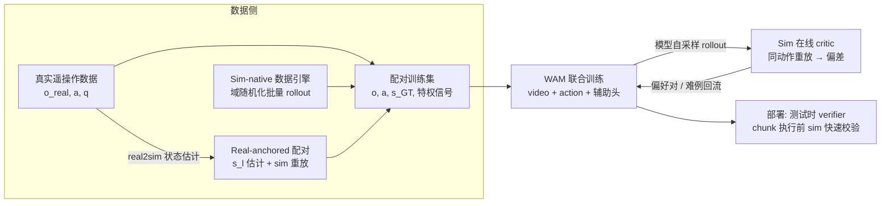

---
tags:
  - papers/WorldModel
  - insight
  - world-action-model
  - sim-anchored
aliases:
  - Sim-anchored WAM
  - 仿真器约束的世界动作模型
date: 2026-07-16
status: research-design
---

# Insight：用仿真器轨迹作为 GT 约束 video model，训练 Sim-anchored World Action Model

## 一句话结论

**可行，且已有多条工作侧面验证了这条路线的各个环节**；真正的设计难点不在"能不能"，而在三件事：(1) 监督信号选在像素空间还是状态空间；(2) 仿真器放在 pipeline 的哪个位置（离线数据引擎 / 在线 critic / 测试时 verifier）；(3) 如何避免 video model 被 sim 的视觉风格和物理近似"带偏"。下面逐一给出设计。

## 1. 问题动机

Video model（如 Wan、Cosmos 一类的视频扩散骨干）生成的轨迹存在系统性物理错误：物体穿透、目标漂移、接触不一致、物体凭空消失/复制、运动学不可达。[[World Action Models are Zero-shot Policies]]（DreamZero）中作者自己承认"大多数失败来自视频生成"，且视频错误会被 action head 忠实执行。

仿真器的性质恰好互补：给定相同的初始状态和相同的动作序列，仿真器 rollout 出的轨迹**物理上严格自洽**（刚体范围内），并且附带 video model 拿不到的特权信息（物体位姿、接触事件、力、穿透检测）。

因此核心构想是：**把同一条动作轨迹同时喂给仿真器和 video model，以仿真器 rollout 作为 ground truth，约束 video model 的未来预测**，得到一个物理一致性显著更强的 world action model（WAM）。

## 2. 可行性判断

**结论：可行，属于"有充分前证、但组合方式尚未被做透"的方向。** 分环节看：

| 环节 | 前证 | 说明 |
|---|---|---|
| 引擎轨迹能训出好的动作条件视频模型 | GameNGen、Genie 系列 | GameNGen 直接用游戏引擎 rollout 训 neural game engine，证明"引擎 GT → 动作条件视频"这条监督链成立 |
| 仿真数据能改善视频世界模型的物理性 | NVIDIA Cosmos（Isaac/Omniverse 合成数据 post-training） | 但 Cosmos 主要把 sim 当**数据源**，没有把 sim 当**在线约束/critic** |
| 视频模型 + 动作 → 可执行策略 | DreamZero、UniSim、IRASim | WAM 范式本身已被验证；DreamZero 已给出 14B 级别的真机主结果 |
| sim 作为评测/验证器 | PolaRiS（DreamZero 复现入口之一） | sim 用于闭环评测已是社区默认做法 |

**尚未被做透、也就是你的切入点**：把 sim 从"离线数据源"升级为**训练中的在线物理 critic** —— 对 video model 自己生成的轨迹，用 sim 重放同一动作序列，把两者的偏差变成训练信号（偏好对、状态一致性损失）。这正好落在 DreamZero 笔记"我的笔记"一节提出的 generated-future verifier 的训练时版本。

**两个必须诚实面对的限制**（决定了后面所有设计）：

1. **视觉域差**：sim 渲染 ≠ 真实视频。如果无脑用 sim 渲染帧做像素级 GT，模型会学成"sim 风格的视频生成器"，丢掉 web 视频预训练的视觉通用性。
2. **sim 物理保真度有边界**：刚体/关节体内 sim 可信；柔性体、流体、复杂接触（系鞋带、熨衣——恰好是 DreamZero 的 unseen 任务）sim 自己就不准。**sim GT 只能当"约束先验"，不能当绝对真理**，损失要带置信度权重。

## 3. Input / Output 定义

### 3.1 符号

- $o$：观测帧（真实或渲染），$z$：VAE 潜变量
- $s$：仿真器完整物理状态（物体位姿+速度、机器人关节状态）
- $a_{l:l+H}$：动作块（对齐 DreamZero 设定：relative joint position，chunk 长度 $H$，如 48 步 @ 30 Hz）
- $c$：语言指令，$q$：本体感知
- $\phi$：sim 物理参数（摩擦、质量等，可域随机化）

### 3.2 Video model（WAM）侧

| 方向 | 内容 |
|---|---|
| **Input** | 上下文帧 $o_{0:l}$（VAE 编码为 $z_{0:l}$）、本体状态 $q_l$、**动作块 $a_{l:l+H}$（关键：动作条件化，而非语言条件化——这样才能和 sim 喂同一条轨迹）**、可选语言 $c$ |
| **Output** | 未来帧潜变量 $\hat z_{l+1:l+H}$；**辅助头**：物体位姿 $\hat s$、深度 $\hat d$、接触 logits $\hat e$（辅助头是把 sim 特权信息接进来的接口，详见 §4.3） |

### 3.3 仿真器侧

| 方向 | 内容 |
|---|---|
| **Input** | 初始物理状态 $s_l$（与 $o_l$ 对齐，见 §4.1 两种对齐模式）、**同一条动作块 $a_{l:l+H}$**、物理参数 $\phi$ |
| **Output（= GT 监督包）** | ① 状态轨迹 $s_{l+1:l+H}$（物体 6D 位姿、关节角）② 渲染帧 $\tilde o_{l+1:l+H}$ ③ 特权信号：GT 深度图、光流、分割 mask、接触事件序列、穿透/碰撞标志、任务成功谓词 |

### 3.4 对齐约定（不做对齐这事就废了）

- **时间**：sim 控制频率 = 数据控制频率（30 Hz），sim 内部 substep 独立设置；video 帧率与动作块按 DreamZero 方式共享时序条件，一个 latent 帧对应固定数量的动作步。
- **动作空间**：sim 执行器输入与数据集动作定义严格一致（relative joint position + 同样的平滑/上下采样处理），否则 sim rollout 和真实轨迹本身就对不上，GT 无从谈起。
- **初始状态**：见 §4.1。

## 4. Pipeline：仿真器怎么正确加进来

总体结构是**双分支数据 + 三个 sim 插入点**：

### 4.1 插入点一：Sim 作为数据引擎（离线，最先做）

两种配对模式，**同时要**：

**模式 A —— Sim-native（稠密 GT，便宜，量大）**
1. 在 sim 里程序化生成场景（域随机化：布局、光照、纹理、物理参数 $\phi$）；
2. 用脚本策略 / 遥操作回放 / RL 策略产生动作轨迹 $a$；
3. sim rollout 得到完整监督包（§3.3）；
4. 渲染帧作为模型输入和像素 GT。
→ 该分支上**全部损失都可用**（像素 + 状态 + 几何 + 接触）。

**模式 B —— Real-anchored（稀疏 GT，贵，但治本）**
1. 取真实数据的一条轨迹 $(o_{real}, a)$；
2. real2sim：对 $o_l$ 做物体位姿估计/数字孪生重建，得到 sim 初始状态 $\hat s_l$（带估计置信度 $w$）；
3. sim 从 $\hat s_l$ 重放同一动作 $a_{l:l+H}$，得到状态级 GT $s_{l+1:l+H}$；
4. **只在状态/几何空间监督，绝不做像素监督**（sim 渲染和真实外观本来就不同），且损失乘以置信度 $w$。
→ 这一分支让物理约束作用在真实视觉分布上，是防止"sim 风格化"的关键。

### 4.2 插入点二：Sim 作为在线 critic（训练中，核心创新点）

这是把 DAgger 思想搬到世界模型训练：**监督信号要覆盖模型自己会犯的错，而不只是覆盖数据分布**。

循环（异步进行，不阻塞主训练）：
1. 周期性地从当前 checkpoint 采样：给定 $(o_l, a_{l:l+H})$，生成未来视频 $\hat o$；
2. sim 从对齐的 $s_l$ 重放**同一条动作**，得到 $s^{GT}$；
3. 用冻结的感知头从 $\hat o$ 提取物体位姿 $\hat s$，计算偏差 $\Delta = d(\hat s, s^{GT})$，并跑穿透/漂移/消失检测；
4. 偏差的用法（两选一或并用）：
   - **偏好对**：(sim 一致的 rollout ≻ 模型幻觉 rollout)，做 flow-matching 版 DPO；这不需要偏差可微，工程上最稳；
   - **难例回流**：$\Delta$ 大的场景/动作模式加权重采样，形成"模型哪里幻觉、就在哪里加监督"的课程。

> 工程可行性：GPU 并行 sim（Isaac Lab / ManiSkill3）单卡每秒可做数千 env step，重放 48 步动作块的成本相对 14B 扩散训练完全可以忽略；瓶颈在模型自采样，所以采样用低步数（Flash 式单步）即可——反正只是拿去让 sim 挑错。

### 4.3 插入点三：辅助头 + 损失设计

总损失（$\lambda$ 按分支开关）：

$$
\mathcal{L}=\underbrace{\mathcal{L}_{FM}}_{\text{视频+动作流匹配}}
+\lambda_s\underbrace{\|g_\theta(\hat z)-s^{GT}\|}_{\text{状态一致性}}
+\lambda_g\underbrace{\mathcal{L}_{depth/flow}}_{\text{几何一致性}}
+\lambda_e\underbrace{\mathcal{L}_{contact}}_{\text{接触事件}}
+\lambda_p\underbrace{\mathcal{L}_{pref}}_{\text{sim 裁决偏好}}
$$

- $\mathcal{L}_{FM}$：DreamZero 原目标；像素级 GT 只在 sim-native 分支用 sim 渲染帧，真实分支照常用真实帧（**真实数据永远在场，这是防风格漂移的第二道闸**——类比 DreamZero 用 video-only objective 吃 human video 的做法）。
- 状态一致性 $\lambda_s$：辅助头 $g_\theta$ 从生成潜变量回归物体 6D 位姿/关节角，逼着**潜变量内部编码真实动力学**而不只是好看的像素。这是整个方案最核心的一项。
- 几何一致性 $\lambda_g$：深度/光流对 sim 渲染是"外观无关"的，所以 real-anchored 分支也能用（sim GT 深度差主要来自状态差而非纹理差）。
- 接触 $\lambda_e$：接触时序是操作任务的语义骨架，sim 免费给出，video model 最容易错。
- 偏好 $\lambda_p$：来自 §4.2 在线 critic。
- **置信度加权**：所有 sim-GT 项乘以 $w(\text{real2sim 置信度}) \times u(\text{sim 保真度先验})$——柔性体/流体场景 $u\to 0$，刚体抓放 $u\to 1$。

### 4.4 训练分阶段

| 阶段 | 数据 | 目标 | 说明 |
|---|---|---|---|
| S0 | web 视频（已完成） | 预训练骨干 | 直接用 Wan2.1 类 checkpoint |
| S1 | sim-native 大规模配对 | $\mathcal{L}_{FM}+\lambda_s+\lambda_g+\lambda_e$ | 学"动作→物理后果"的稠密对应 |
| S2 | 真实数据 + real-anchored 配对混合（关键超参：混合比） | 全损失，sim 项按置信度加权 | 视觉回到真实分布，物理约束保留 |
| S3 | 在线 critic 循环 | $+\lambda_p$ 偏好/难例 | 针对模型自身错误分布收尾 |

## 5. 评测设计（没有这个说服不了任何人）

1. **物理一致性（本方案的直接目标）**：给定同一 $(o_l, a)$，模型生成 vs sim 重放——位姿误差（ADD）、穿透率、物体漂移/消失率、接触时序 F1。对照组：不加 sim 约束的同骨干模型。
2. **动作跟随保真度**：生成视频是否真的执行了条件动作（用独立 IDM 从生成视频反推动作，和输入动作比）。
3. **下游硬指标**：按 DreamZero 协议做 zero-shot policy 评测（可从 PolaRiS + DROID checkpoint 入口起步）——物理一致性提升必须转化为任务进度提升，否则只是"视频更整齐"。
4. **视觉通用性回归测试**：真实分布上的 FVD 不显著变差——检验没被 sim 风格带偏。

## 6. 最小可行实验（MVP，建议 4–6 周量级）

- **骨干**：先用小模型快速迭代（如 5B 级 I2V），别一上来 14B；
- **Sim**：ManiSkill3 或 Isaac Lab（GPU 并行 + 现成渲染管线 + 位姿/接触 API 全）；
- **任务域**：刚体抓放 + 推动（sim 保真度最高的区间，先在 sim 可信区证明方法有效）；
- **消融**（回答"sim GT 的净贡献"，呼应 DreamZero 笔记里对同骨干对照的强调）：
  1. baseline：仅真实/仅视频目标；
  2. +sim-native 配对数据（sim 只当数据源，= Cosmos 式用法）；
  3. +状态一致性辅助头（sim 当结构化监督）；
  4. +在线 critic 偏好（sim 当训练时裁判）。
  若 3、4 相对 2 有增益，就证明了"sim 作为约束 > sim 作为数据"这一核心主张——**这是这个 idea 区别于现有工作的可发表点**。

## 7. 主要风险与对策速查

| 风险 | 对策 |
|---|---|
| 模型学成 sim 风格视频生成器 | 真实数据始终在混合中；real 分支只做状态/几何空间监督；监控真实分布 FVD |
| sim 物理近似误差被当成 GT 学进去 | 保真度先验 $u$ 加权；MVP 限定刚体域；柔性体任务只用真实数据 |
| real2sim 状态估计不准污染监督 | 置信度门控 $w$；低置信样本退化为纯视频目标 |
| 在线 critic 拖慢训练 | 异步 + 低步数采样 + GPU 并行 sim；critic 频率作为超参 |
| 动作/时序错位导致 GT 系统性偏移 | §3.4 对齐约定作为硬工程规范先行验证：真实轨迹在 sim 重放的终态误差要先压到阈值以下，再开始训练 |

## 8. 与本地研究地图的连接

- 本方案 = 把 [[World Action Models are Zero-shot Policies]] "我的笔记"中 generated-future verifier 从**测试时拒绝采样**前移为**训练时约束**，两者可共存：训练时 sim-critic 降低幻觉率，部署时 sim-verifier 兜底残余错误。
- DreamZero 证明了 WAM 的上限由视频预测质量决定（"大多数失败来自视频生成"）——本方案正是打这个瓶颈，属于其笔记中"显式三维世界模型与生成式世界预测互补"论断的一个具体实现路径。
