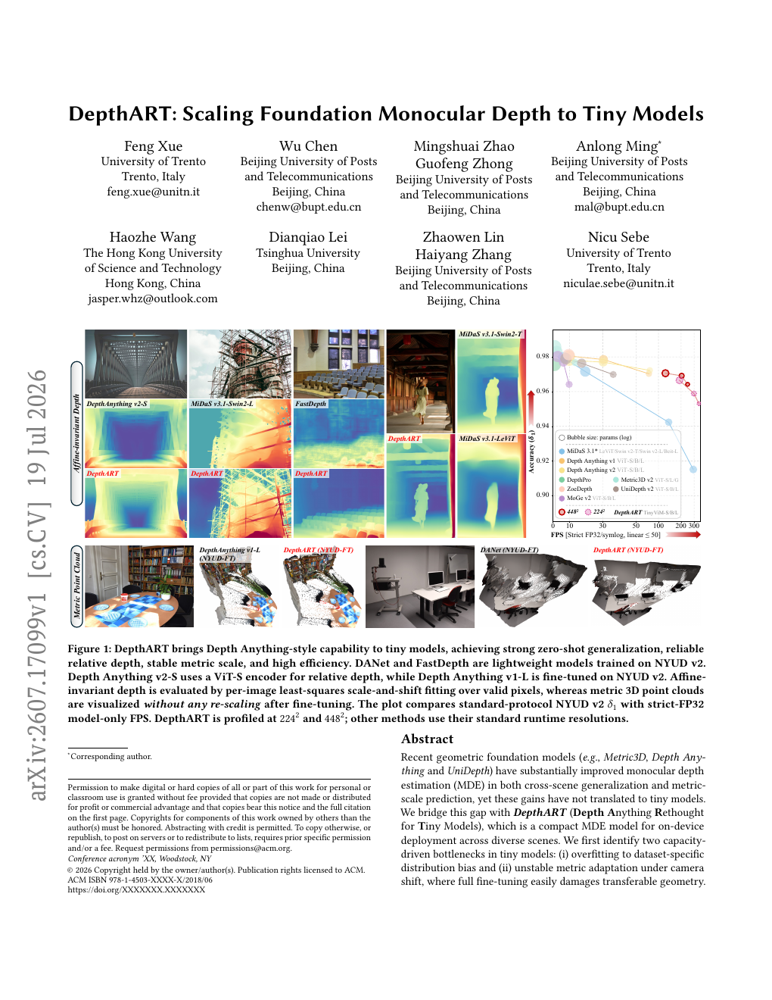
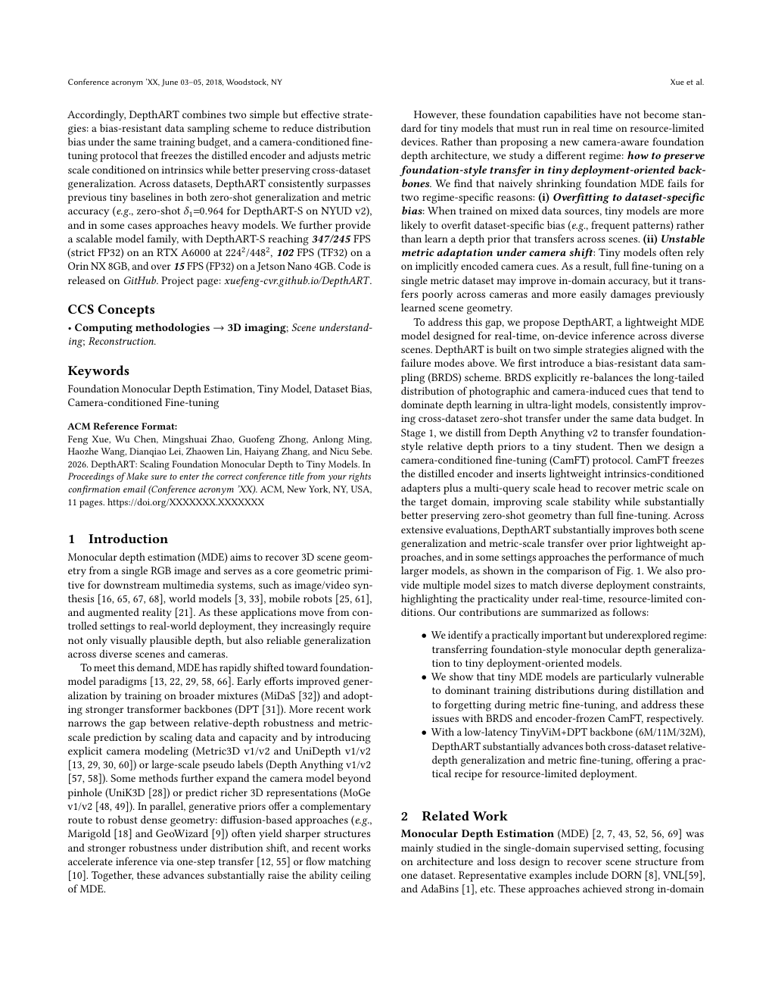
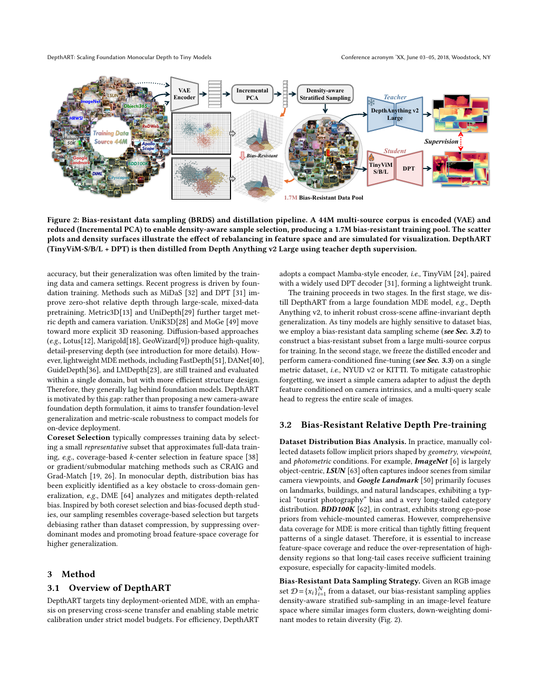
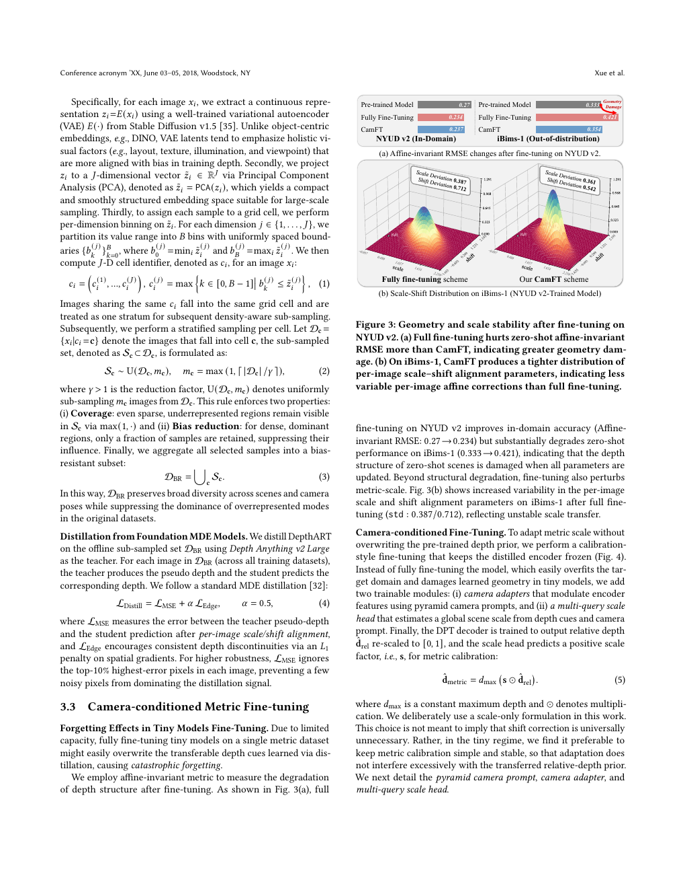
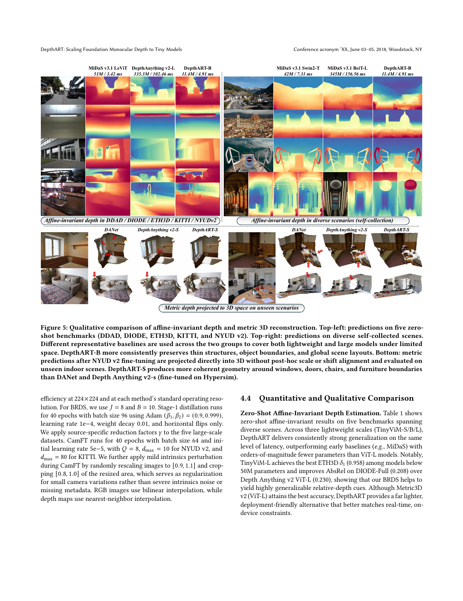
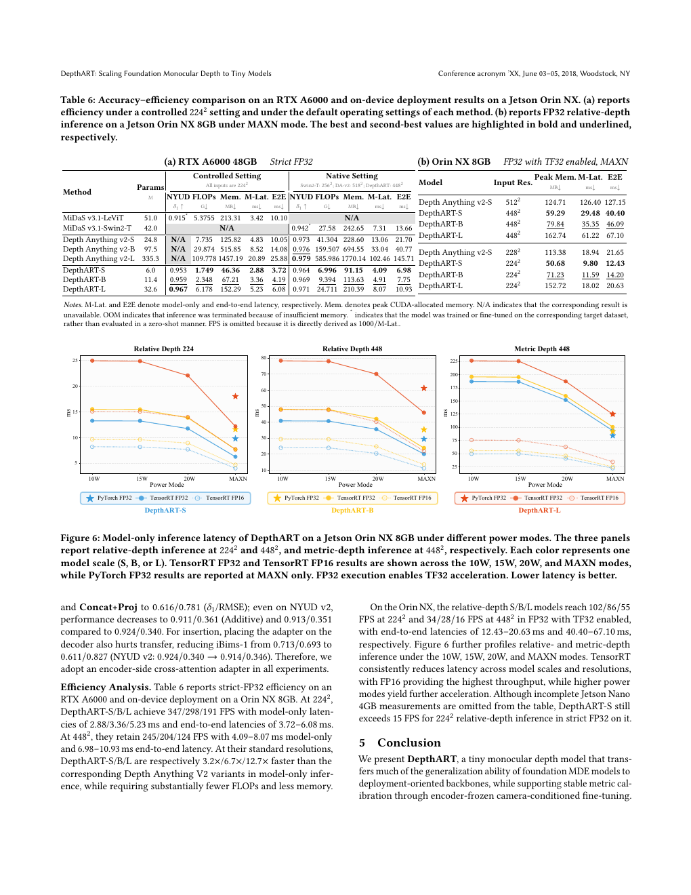

# DepthART: Scaling Foundation Monocular Depth to Tiny Models

**Authors:** Feng Xue, Wu Chen, Mingshuai Zhao, Guofeng Zhong, Anlong Ming, Haozhe Wang, Dianqiao Lei, Zhaowen Lin, Haiyang Zhang, Nicu Sebe  
**Source:** `/Users/roywangj/journey_wj/research/papers4zotero/zotero1/storage/EZEJ6U4I/Xue 等 - 2026 - DepthART Scaling Foundation Monocular Depth to Tiny Models.pdf`  
**Version:** arXiv:2607.17099v1, 19 July 2026; 11 pages.  
**Reader type:** Complete paragraph-level English–Chinese detailed reader. All 11 source pages were extracted and rendered to `assets/page-01.png` … `assets/page-11.png`; references remain searchable in original bibliographic form.

## Page / Section Index

| Pages | Sections |
|---|---|
| 1–2 | Abstract, Introduction |
| 2 | Related Work |
| 2–4 | Method: Overview, BRDS, distillation, CamFT |
| 4–9 | Experiments, Tables 1–6, Figures 5–6 |
| 9 | Conclusion, Limitations and Future Work |
| 9–11 | References [1]–[69] |

## Terminology Ledger

| English | 中文 |
|---|---|
| MDE | 单目深度估计 |
| affine-invariant depth | 仿射不变深度（逐图像 scale–shift 对齐的相对深度） |
| metric depth | 度量深度 |
| foundation MDE | 几何基础深度模型 |
| tiny model | 面向部署的低容量模型 |
| BRDS | Bias-Resistant Data Sampling，抗偏置数据采样 |
| CamFT | Camera-conditioned Fine-Tuning，相机条件化微调 |
| MQSH | Multi-Query Scale Head，多查询尺度头 |
| AbsRel / RMSE | 绝对相对误差 / 均方根误差 |
| $\delta_1$ | 标准深度比阈值下的准确率 |

## Abstract

> <strong>Para. 1:</strong> Recent geometric foundation models (e.g., Metric3D, Depth Anything and UniDepth) have substantially improved monocular depth estimation (MDE) in both cross-scene generalization and metric-scale prediction, yet these gains have not translated to tiny models.

> <strong>Para. 1[CN]:</strong> 近期几何基础模型（例如 Metric3D、Depth Anything 和 UniDepth）显著提升了单目深度估计（MDE）的跨场景泛化与度量尺度预测，但这些收益尚未转化到 tiny model 上。

> <strong>Para. 2:</strong> We bridge this gap with DepthART (Depth Anything Rethought for Tiny Models), a compact MDE model for on-device deployment across diverse scenes. We identify two capacity-driven bottlenecks: (i) overfitting to dataset-specific distribution bias and (ii) unstable metric adaptation under camera shift, where full fine-tuning easily damages transferable geometry.

> <strong>Para. 2[CN]:</strong> 我们提出 DepthART（Depth Anything Rethought for Tiny Models，面向 tiny model 重新思考的 Depth Anything），以弥合这一差距。它是面向多样场景设备端部署的紧凑型 MDE 模型。我们识别出两个由容量驱动的瓶颈：（i）过拟合数据集特有的分布偏置；（ii）相机变化下的度量适配不稳定，完整微调很容易破坏可迁移几何。

> <strong>Para. 3:</strong> Accordingly, DepthART combines a bias-resistant data sampling scheme to reduce distribution bias under the same training budget with a camera-conditioned fine-tuning protocol that freezes the distilled encoder and adjusts metric scale conditioned on intrinsics while preserving cross-dataset generalization.

> <strong>Para. 3[CN]:</strong> 因此，DepthART 将抗偏置数据采样与相机条件化微调结合起来：前者在相同训练预算下减少分布偏置，后者冻结蒸馏编码器、依据相机内参调整度量尺度，并更好保持跨数据集泛化。

> <strong>Para. 4:</strong> Across datasets, DepthART consistently surpasses previous tiny baselines in zero-shot generalization and metric accuracy (for example, zero-shot $\delta_1=0.964$ for DepthART-S on NYUD v2), and in some cases approaches heavy models.

> <strong>Para. 4[CN]:</strong> 在多个数据集上，DepthART 在 zero-shot 泛化和度量精度方面稳定超过此前 tiny baseline（例如 DepthART-S 在 NYUD v2 上的 zero-shot $\delta_1=0.964$），并在某些情况下接近大型模型。

> <strong>Para. 5:</strong> The scalable family reaches 347/245 FPS for DepthART-S (strict FP32, RTX A6000, $224^2/448^2$), 102 FPS on an Orin NX 8GB with TF32, and over 15 FPS on a Jetson Nano 4GB with FP32. Code is released on GitHub; project page: `xuefeng-cvr.github.io/DepthART`.

> <strong>Para. 5[CN]:</strong> 可伸缩模型系列中，DepthART-S 在 RTX A6000、严格 FP32、$224^2/448^2$ 下达到 347/245 FPS；在 8GB Orin NX 上以 TF32 达到 102 FPS；在 4GB Jetson Nano 上以 FP32 超过 15 FPS。代码已发布到 GitHub；项目主页为 `xuefeng-cvr.github.io/DepthART`。

## Figure 1 and front matter

**Caption:** DepthART brings Depth Anything-style capability to tiny models, achieving strong zero-shot generalization, reliable relative depth, stable metric scale, and high efficiency. DANet and FastDepth are lightweight models trained on NYUD v2. Depth Anything v2-S uses a ViT-S encoder for relative depth, while Depth Anything v1-L is fine-tuned on NYUD v2. Affine-invariant depth uses per-image least-squares scale-and-shift fitting over valid pixels; metric 3D point clouds are visualized without re-scaling after fine-tuning. The plot compares standard NYUD v2 $\delta_1$ with strict-FP32 model-only FPS; DepthART is profiled at $224^2$ and $448^2$.

**Caption[CN]:** DepthART 将 Depth Anything 风格的能力带到 tiny model，取得强 zero-shot 泛化、可靠相对深度、稳定度量尺度和高效率。DANet 与 FastDepth 是在 NYUD v2 上训练的轻量模型。Depth Anything v2-S 使用 ViT-S 编码器进行相对深度，Depth Anything v1-L 在 NYUD v2 上微调。仿射不变深度在有效像素上逐图像进行最小二乘 scale–shift 拟合；度量 3D 点云展示微调后未再缩放的结果。图比较标准 NYUD v2 $\delta_1$ 与严格 FP32 仅模型 FPS；DepthART 在 $224^2$ 和 $448^2$ 下测量。

**ACM template literals:** `Conference acronym ’XX, Woodstock, NY`; `© 2026 Copyright held by the owner/author(s). Publication rights licensed to ACM.`; `ACM ISBN 978-1-4503-XXXX-X/2018/06`; `https://doi.org/XXXXXXX.XXXXXXX`; permission text and `permissions@acm.org` are retained in the rendered `assets/page-01.png`.

## 1 Introduction

> <strong>Para. 1:</strong> Monocular depth estimation (MDE) aims to recover 3D scene geometry from a single RGB image and serves as a core geometric primitive for image/video synthesis [16, 65, 67, 68], world models [3, 33], mobile robots [25, 61], and augmented reality [21]. Real-world deployment requires not only plausible depth but reliable generalization across scenes and cameras.

> <strong>Para. 1[CN]:</strong> 单目深度估计旨在从单张 RGB 图像恢复 3D 场景几何，是图像/视频合成 [16, 65, 67, 68]、世界模型 [3, 33]、移动机器人 [25, 61] 与增强现实 [21] 的核心几何原语。真实部署不仅需要视觉上合理的深度，还需要跨场景、跨相机可靠泛化。

> <strong>Para. 2:</strong> MDE has shifted toward foundation-model paradigms [13, 22, 29, 58, 60, 66]. MiDaS [32] uses broad mixtures and DPT [31] uses stronger transformer backbones. Metric3D v1/v2 and UniDepth v1/v2 [13, 29, 30, 60] explicitly model cameras, while Depth Anything v1/v2 [57, 58] use large-scale pseudo labels. UniK3D [28] extends beyond pinhole cameras, MoGe [48, 49] predicts richer 3D representations, and diffusion approaches such as Marigold [18] and GeoWizard [9] provide sharp geometry under distribution shift; one-step transfer [12, 55] and flow matching [10] accelerate them.

> <strong>Para. 2[CN]:</strong> MDE 已转向 foundation-model 范式 [13, 22, 29, 58, 60, 66]。MiDaS [32] 使用广泛数据混合，DPT [31] 使用更强 Transformer backbone。Metric3D v1/v2 与 UniDepth v1/v2 [13, 29, 30, 60] 显式建模相机；Depth Anything v1/v2 [57, 58] 使用大规模伪标签。UniK3D [28] 超越针孔相机模型，MoGe [48, 49] 预测更丰富的 3D 表示；Marigold [18]、GeoWizard [9] 等扩散方法在分布偏移下提供锐利几何，而 one-step transfer [12, 55] 与 flow matching [10] 进一步加速推理。

> <strong>Para. 3:</strong> These capabilities have not become standard for tiny models running in real time on resource-limited devices. We therefore study how to preserve foundation-style transfer in tiny deployment-oriented backbones rather than proposing another camera-aware foundation architecture.

> <strong>Para. 3[CN]:</strong> 对于必须在资源受限设备上实时运行的 tiny model，这些能力还没有成为标准。因而我们研究如何在面向部署的 tiny backbone 中保留 foundation 式迁移，而不是再提出一个相机感知 foundation 架构。

> <strong>Para. 4:</strong> Naive shrinking fails because tiny models overfit dataset-specific bias in mixed-source training, learning frequent patterns rather than transferable priors, and because they rely on implicit camera cues. Full fine-tuning on one metric dataset may improve in-domain accuracy but transfers poorly across cameras and damages learned geometry.

> <strong>Para. 4[CN]:</strong> 直接缩小失败的原因是：tiny model 在混合数据源训练中会过拟合数据集偏置，学习高频模式而不是可迁移先验；同时它们依赖隐式相机线索。在单个度量数据集上完整微调虽可提高域内精度，却难以跨相机迁移并破坏已有几何。

> <strong>Para. 5:</strong> We introduce Bias-Resistant Data Sampling (BRDS) to rebalance long-tailed photographic and camera-induced cues. Stage 1 distills from Depth Anything v2 using BRDS. Stage 2 uses Camera-conditioned Fine-Tuning (CamFT): the encoder is frozen and lightweight intrinsics-conditioned adapters plus a multi-query scale head recover metric scale while preserving zero-shot geometry.

> <strong>Para. 5[CN]:</strong> 我们提出 Bias-Resistant Data Sampling（BRDS）来重新平衡摄影与相机诱导线索的长尾分布。阶段 1 使用 BRDS 从 Depth Anything v2 蒸馏；阶段 2 使用 Camera-conditioned Fine-Tuning（CamFT）：冻结编码器，通过轻量内参条件化 adapter 与 multi-query scale head 恢复度量尺度，同时保留 zero-shot 几何。

> <strong>Para. 6:</strong> Contributions: (1) we identify the underexplored regime of transferring foundation-style MDE generalization to tiny deployment models; (2) we diagnose distribution-dominance overfitting and metric-fine-tuning forgetting and address them with BRDS and encoder-frozen CamFT; (3) with a 6M/11M/32M TinyViM+DPT family, we advance cross-dataset relative-depth generalization and metric fine-tuning for resource-limited deployment.

> <strong>Para. 6[CN]:</strong> 贡献为：（1）确定将 foundation 式 MDE 泛化迁移到 tiny 部署模型这一尚未充分探索的区间；（2）诊断训练分布主导导致的过拟合与度量微调遗忘，并分别用 BRDS 和冻结编码器的 CamFT 解决；（3）以 6M/11M/32M 的 TinyViM+DPT 系列推进资源受限部署下的跨数据集相对深度泛化与度量微调。

## 2 Related Work

> <strong>Para. 1:</strong> Classical MDE [2, 7, 43, 52, 56, 69] focused on single-domain supervision, architecture, and loss design; DORN [8], VNL [59], and AdaBins [1] obtained strong in-domain results but limited generalization.

> <strong>Para. 1[CN]:</strong> 经典 MDE [2, 7, 43, 52, 56, 69] 聚焦单域监督、架构和损失设计；DORN [8]、VNL [59] 与 AdaBins [1] 域内效果强，但泛化有限。

> <strong>Para. 2:</strong> Foundation training drives current progress: MiDaS [32]/DPT [31] improve zero-shot relative depth; Metric3D [13]/UniDepth [29] target metric depth and camera variation; UniK3D [28]/MoGe [49] pursue explicit 3D reasoning; Lotus [12], Marigold [18], and GeoWizard [9] use diffusion priors. Lightweight methods FastDepth [51], DANet [40], GuideDepth [36], and LMDepth [23] are efficient but generally single-domain and behind foundation models. DepthART transfers foundation-level generalization and metric-scale robustness instead of proposing a new foundation formulation.

> <strong>Para. 2[CN]:</strong> 当前进展由 foundation training 驱动：MiDaS/DPT 改善 zero-shot 相对深度；Metric3D/UniDepth 面向度量深度和相机变化；UniK3D/MoGe 追求显式 3D 推理；Lotus、Marigold、GeoWizard 使用扩散先验。FastDepth、DANet、GuideDepth 和 LMDepth 效率高，但通常是单域方法，整体落后于 foundation model。DepthART 的目标是迁移 foundation 级泛化和度量尺度鲁棒性，而非提出新 foundation formulation。

> <strong>Para. 3:</strong> Coreset selection compresses data with representative subsets, including k-center [38], CRAIG, and Grad-Match [19, 26]. DME [64] identifies distribution bias as an obstacle to cross-domain depth generalization. Our BRDS resembles coverage selection but explicitly suppresses dominant modes and seeks debiasing rather than mere compression.

> <strong>Para. 3[CN]:</strong> Coreset selection 通过代表性子集压缩数据，包括 k-center [38]、CRAIG 和 Grad-Match [19, 26]。DME [64] 将分布偏置确定为跨域深度泛化的障碍。BRDS 类似覆盖选择，但明确抑制主导模式，目标是去偏而非单纯压缩。

## 3 Method

### 3.1 Overview of DepthART

> <strong>Para. 1:</strong> DepthART combines a TinyViM [24] compact Mamba-style encoder with the DPT decoder [31]. Stage 1 distills relative-depth priors from Depth Anything v2 on a BRDS subset. Stage 2 freezes the distilled encoder and performs CamFT on NYUD v2 or KITTI, adding a camera adapter and a multi-query scale head to avoid catastrophic forgetting while recovering metric scale.

> <strong>Para. 1[CN]:</strong> DepthART 将 TinyViM [24] 紧凑 Mamba 风格编码器与 DPT decoder [31] 结合。阶段 1 在 BRDS 子集上从 Depth Anything v2 蒸馏相对深度先验；阶段 2 冻结蒸馏编码器，在 NYUD v2 或 KITTI 上进行 CamFT，通过 camera adapter 与 multi-query scale head 避免灾难性遗忘并恢复度量尺度。

**Caption:** A 44M multi-source corpus is VAE-encoded and reduced with Incremental PCA; density-aware selection produces a 1.7M bias-resistant pool, from which TinyViM-S/B/L+DPT is distilled from Depth Anything v2 Large.

**Caption[CN]:** 44M 多源语料先经 VAE 编码与 Incremental PCA 降维；密度感知选择产生 1.7M 抗偏置数据池，再从 Depth Anything v2 Large 蒸馏 TinyViM-S/B/L+DPT。

### 3.2 Bias-Resistant Relative Depth Pre-training

> <strong>Para. 2:</strong> Dataset collections encode implicit geometry, viewpoint, and photometric priors: ImageNet is object-centric, LSUN has repeated indoor viewpoints, Google Landmark has tourist-photography and long-tailed category bias, and BDD100K has vehicle ego-pose bias. MDE needs broad coverage more than a tight fit to frequent patterns, so high-density regions should be down-weighted and long-tail cases exposed to capacity-limited students.

> <strong>Para. 2[CN]:</strong> 数据集集合编码了几何、视点和光度隐式先验：ImageNet 以物体为中心，LSUN 有重复室内视点，Google Landmark 具有游客摄影和长尾类别偏置，BDD100K 具有车辆自我姿态偏置。MDE 更需要广覆盖而不是紧密拟合高频模式，因此应降低高密度区域权重，让容量受限 student 接触长尾案例。

> <strong>Para. 3:</strong> For $D=\{x_i\}_{i=1}^{N}$, we obtain VAE latents $z_i=E(x_i)$ from Stable Diffusion v1.5 [35], use VAE rather than object-centric DINO features to emphasize layout, texture, illumination, and viewpoint, then project with PCA: $\tilde z_i=\mathrm{PCA}(z_i)\in\mathbb{R}^{J}$. Each dimension is split into $B$ uniform bins, with $b_0^{(j)}=\min_i\tilde z_i^{(j)}$ and $b_B^{(j)}=\max_i\tilde z_i^{(j)}$.

> <strong>Para. 3[CN]:</strong> 对 $D=\{x_i\}_{i=1}^{N}$，我们从 Stable Diffusion v1.5 [35] 得到 VAE latent $z_i=E(x_i)$；相比物体中心的 DINO 特征，VAE 更强调布局、纹理、光照和视点；随后通过 PCA 得到 $\tilde z_i=\mathrm{PCA}(z_i)\in\mathbb{R}^{J}$。每一维切分为 $B$ 个均匀 bin，边界为 $b_0^{(j)}=\min_i\tilde z_i^{(j)}$ 和 $b_B^{(j)}=\max_i\tilde z_i^{(j)}$。

<strong>Equation 1:</strong> $$c_i=(c_i^{(1)},\ldots,c_i^{(J)}),\quad c_i^{(j)}=\max\{k\in[0,B-1]:b_k^{(j)}\leq\tilde z_i^{(j)}\}.$$ Images with the same $c_i$ form stratum $D_c=\{x_i\mid c_i=c\}$.

<strong>Equation 1[CN]:</strong> $$c_i=(c_i^{(1)},\ldots,c_i^{(J)}),\quad c_i^{(j)}=\max\{k\in[0,B-1]:b_k^{(j)}\leq\tilde z_i^{(j)}\}.$$ 具有相同 $c_i$ 的图像组成 strata $D_c=\{x_i\mid c_i=c\}$。

<strong>Equation 2–3:</strong> $$S_c\sim U(D_c,m_c),\quad m_c=\max(1,\lceil|D_c|/\gamma\rceil),\qquad D_{BR}=\bigcup_cS_c.$$ $\gamma>1$ reduces dense cells; $\max(1,\cdot)$ keeps sparse cells visible.

<strong>Equation 2–3[CN]:</strong> $$S_c\sim U(D_c,m_c),\quad m_c=\max(1,\lceil|D_c|/\gamma\rceil),\qquad D_{BR}=\bigcup_cS_c.$$ $\gamma>1$ 缩减稠密单元，而 $\max(1,\cdot)$ 保证稀疏单元仍可见。

> <strong>Para. 4:</strong> We distill on $D_{BR}$ with Depth Anything v2 Large as teacher. The teacher supplies pseudo depth and the student predicts it using $L_{Distill}=L_{MSE}+\alpha L_{Edge}$ with $\alpha=0.5$. $L_{MSE}$ is computed after per-image scale/shift alignment, $L_{Edge}$ is an $L_1$ spatial-gradient penalty, and the highest-error 10% pixels are ignored to prevent noisy pixels dominating.

> <strong>Para. 4[CN]:</strong> 我们在 $D_{BR}$ 上以 Depth Anything v2 Large 为 teacher 蒸馏。teacher 提供伪深度，student 以 $L_{Distill}=L_{MSE}+\alpha L_{Edge}$（$\alpha=0.5$）预测它。$L_{MSE}$ 在逐图像 scale/shift 对齐后计算，$L_{Edge}$ 是空间梯度的 $L_1$ 惩罚，并忽略误差最高的 10% 像素，防止噪声像素支配训练。

### 3.3 Camera-conditioned Metric Fine-tuning

> <strong>Para. 5:</strong> Full fine-tuning of a tiny model on one metric dataset overwrites transferable cues. On NYUD v2 it improves affine-invariant RMSE from $0.27$ to $0.234$ but worsens iBims-1 from $0.333$ to $0.421$; scale/shift variability on iBims-1 also increases (std $0.387/0.712$).

> <strong>Para. 5[CN]:</strong> 在一个度量数据集上完整微调 tiny model 会覆盖可迁移线索。在 NYUD v2 上它将仿射不变 RMSE 从 $0.27$ 提升到 $0.234$，但使 iBims-1 从 $0.333$ 恶化到 $0.421$；iBims-1 上 scale/shift 变化性也增加（std $0.387/0.712$）。

**Caption:** Geometry and scale stability after fine-tuning on NYUD v2. Full fine-tuning damages zero-shot affine-invariant RMSE more than CamFT and produces more variable per-image scale–shift alignment parameters on iBims-1.  
**Caption[CN]:** 在 NYUD v2 上微调后的几何与尺度稳定性。完整微调比 CamFT 更损害 zero-shot 仿射不变 RMSE，并在 iBims-1 上产生变化更大的逐图像 scale–shift 对齐参数。

> <strong>Para. 6:</strong> CamFT freezes the distilled encoder, inserts pyramid-intrinsics camera adapters, and adds a multi-query scale head. The DPT decoder outputs $\hat d_{rel}\in[0,1]$ and the head predicts positive $s$:

$$\hat d_{metric}=d_{max}s\odot\hat d_{rel}.$$ 

> <strong>Para. 6[CN]:</strong> CamFT 冻结蒸馏编码器，插入金字塔内参 camera adapter，并增加 multi-query scale head。DPT decoder 输出 $\hat d_{rel}\in[0,1]$，head 预测正尺度 $s$。选择仅尺度校准是为了简单稳定，并非断言 shift correction 在任何情况下都不必要。

> <strong>Para. 7:</strong> Intrinsics $K=(f_x,f_y,c_x,c_y)$ are converted to a per-pixel ray field and Fourier-encoded. Prompts $C^{(s)}\in\mathbb{R}^{C_s\times H/s\times W/s}$ are made for $s\in\{4,8,16,32\}$, matching TinyViM downsampling. Fine prompts guide shallow local structure; coarse prompts guide deep global scale.

> <strong>Para. 7[CN]:</strong> 将内参 $K=(f_x,f_y,c_x,c_y)$ 转为逐像素射线场并进行 Fourier encoding。针对 $s\in\{4,8,16,32\}$ 构造 $C^{(s)}\in\mathbb{R}^{C_s\times H/s\times W/s}$，匹配 TinyViM 的下采样。细粒度 prompt 引导浅层局部结构，粗粒度 prompt 引导深层全局尺度。

<strong>Equation 6:</strong>

$$\bar F^{(l)}=F^{(l)}+\mathrm{CA}(F^{(l)},\mathrm{Proj}(C^{(s)})).$$

CA is one-layer/one-head cross-attention; projection is $3\times3$ depthwise convolution plus $1\times1$ projection, without activation or normalization.

<strong>Equation 6[CN]:</strong> CA 是一层单头 cross-attention；projection 是 $3\times3$ depthwise convolution 加 $1\times1$ projection，不含 activation 或 normalization。

> <strong>Para. 8:</strong> A single global scale from a tiny backbone is unstable, so the scale head concatenates deepest feature $\bar F^{(4)}$ and aligned $C^{(32)}$ as $X$, then uses a two-layer, four-head Transformer decoder with $Q\in\mathbb{R}^{Q\times128}$: $Z=\mathrm{Dec}(Q,X)$ and $s=\frac1Q\sum_{q=1}^{Q}\sigma(\mathrm{MLP}(Z_{q,:}))$. The MLP is $128\rightarrow128\rightarrow1$ with ReLU; different queries attend to complementary cues and averaging reduces variance.

> <strong>Para. 8[CN]:</strong> 由于 tiny backbone 的单一全局尺度不稳定，scale head 将最深特征 $\bar F^{(4)}$ 与对齐的 $C^{(32)}$ 拼接为 $X$，再用带 $Q\in\mathbb{R}^{Q\times128}$、两层四头 Transformer decoder 计算 $Z=\mathrm{Dec}(Q,X)$ 和 $s=\frac1Q\sum_{q=1}^{Q}\sigma(\mathrm{MLP}(Z_{q,:}))$。MLP 为带 ReLU 的 $128\rightarrow128\rightarrow1$；不同 query 关注互补线索，平均降低方差。

<strong>Equation 8:</strong> CamFT uses standard supervision on one dataset:

$$L_{ft}=L_{SiLog}(\hat d_{metric},d)+\lambda L_{Edge}(\hat d_{metric},d).$$

It freezes the encoder and updates adapters, MQSH, and DPT.

<strong>Equation 8[CN]:</strong> CamFT 在一个数据集上使用标准监督。它冻结编码器，更新 adapter、MQSH 和 DPT。

**Caption:** Frozen distilled encoder, pyramid camera prompts, encoder-side adapters, DPT relative-depth decoder, and multi-query scale head.  
**Caption[CN]:** 冻结的蒸馏编码器、金字塔相机 prompt、encoder-side adapter、DPT 相对深度 decoder 与 multi-query scale head。

## 4 Experiments

### 4.1 Dataset

> <strong>Para. 1:</strong> Relative-depth pre-training aggregates ApolloScapeExtra [15], BDD100K [62], Cityscapes [5], DIML-indoor [4], GoogleLandmark [50], Holopix50K [14], HRWSI [54], ImageNet21K [6], LSUN [63], Objects365 [39], and ReDWeb [53]. BRDS is applied to BDD100K, GoogleLandmark, ImageNet21K, LSUN, and Objects365, producing 1.7M images. Zero-shot affine-invariant evaluation uses NYUD v2 (Eigen crop) [41], KITTI (Eigen crop) [45], ETH3D [37], DIODE [46], and DDAD [11]. Metric fine-tuning uses NYUD v2 or KITTI; zero-shot metric transfer uses iBims-1 [20], SUN RGB-D [42], DIODE, DDAD, and ETH3D.

> <strong>Para. 1[CN]:</strong> 相对深度预训练聚合 ApolloScapeExtra、BDD100K、Cityscapes、DIML-indoor、GoogleLandmark、Holopix50K、HRWSI、ImageNet21K、LSUN、Objects365 和 ReDWeb 共 11 个来源。对 BDD100K、GoogleLandmark、ImageNet21K、LSUN、Objects365 使用 BRDS，得到 1.7M 图像。zero-shot 仿射不变评估使用 NYUD v2（Eigen crop）、KITTI（Eigen crop）、ETH3D、DIODE 和 DDAD；度量微调使用 NYUD v2 或 KITTI；zero-shot 度量迁移使用 iBims-1、SUN RGB-D、DIODE、DDAD 和 ETH3D。

### 4.2 Baselines and fair-comparison scope

> <strong>Para. 2:</strong> Affine-invariant baselines are MiDaS v3.1, Metric3D v2, Depth Anything v2, and AnyDepth. AnyDepth speed is not reported because full model code is unavailable. Diffusion and self-supervised methods are excluded because their speed or training paradigm is different. Metric baselines are FastDepth, DANet, GuideDepth, and the heavy Depth Anything v1-L. TuMDE, LightDepth, and METER are excluded because only partial code is available and reproduced results are substantially worse than reported.

> <strong>Para. 2[CN]:</strong> 仿射不变 baseline 包括 MiDaS v3.1、Metric3D v2、Depth Anything v2 和 AnyDepth。由于 AnyDepth 没有完整模型代码，不报告其速度；扩散方法和自监督方法因速度或训练范式不同而排除。度量 baseline 为 FastDepth、DANet、GuideDepth 以及大型 Depth Anything v1-L。TuMDE、LightDepth 和 METER 因只公开部分代码且复现结果显著差于报告值而排除。

> <strong>Para. 3:</strong> UniDepth and Metric3D are not strict direct baselines for metric transfer because their training data, capacity, and fine-tuning settings differ. The evaluation asks whether useful metric transfer survives strict deployment constraints.

> <strong>Para. 3[CN]:</strong> UniDepth 和 Metric3D 不是度量迁移的严格直接 baseline，因为训练数据、容量与微调设置不同。这里的评估问题是：在严格部署约束下，有用的度量迁移能否保留下来。

### 4.3 Implementation Details

> <strong>Para. 4:</strong> Training uses an A800. Desktop latency uses batch size 1 on an RTX A6000, strict FP32, and TF32 disabled; main comparisons use $448\times448$. BRDS uses $J=8$, $B=10$. Stage-1 distillation is 40 epochs, batch size 96, Adam $(0.9,0.999)$, learning rate $1e{-4}$, weight decay 0.01, horizontal flips only. CamFT is 40 epochs, batch size 64, learning rate $5e{-5}$, $Q=8$, $d_{max}=10$ (NYUD v2) or $80$ (KITTI). Mild perturbation rescales to $[0.9,1.1]$ and crops $[0.8,1.0]$; RGB uses bilinear and depth nearest-neighbor interpolation.

> <strong>Para. 4[CN]:</strong> 训练使用 A800。桌面延迟在 RTX A6000、batch size 1、严格 FP32、禁用 TF32 下测量；主要比较使用 $448\times448$。BRDS 使用 $J=8,B=10$。阶段 1 蒸馏 40 个 epoch、batch size 96、Adam $(0.9,0.999)$、学习率 $1e{-4}$、weight decay 0.01，仅水平翻转。CamFT 40 个 epoch、batch size 64、学习率 $5e{-5}$、$Q=8$，$d_{max}$ 在 NYUD v2/KITTI 分别为 10/80。轻微扰动将图像缩放至 $[0.9,1.1]$ 并裁剪 $[0.8,1.0]$；RGB 双线性插值、深度最近邻插值。

### 4.4 Results

> <strong>Para. 5:</strong> Table 1 evaluates zero-shot affine-invariant depth across five diverse benchmarks. DepthART-S/B/L are consistently strong at tiny-model latency. DepthART-L obtains ETH3D $\delta_1=0.958$ below 50M parameters and DIODE-Full AbsRel $=0.208$, better than Depth Anything v2-L's $0.230$; Metric3D v2-L remains the accuracy leader but is much larger and slower.

> <strong>Para. 5[CN]:</strong> 表 1 在五个多样 benchmark 上评估 zero-shot 仿射不变深度。DepthART-S/B/L 在 tiny-model 延迟下持续强劲。DepthART-L 在参数量低于 50M 时取得 ETH3D $\delta_1=0.958$，DIODE-Full AbsRel 为 $0.208$，优于 Depth Anything v2-L 的 $0.230$；Metric3D v2-L 仍是精度领导者，但大得多、慢得多。

> <strong>Para. 6:</strong> Table 2 reports in-domain and zero-shot metric depth without re-scaling. Scaling S→B/L generally helps. NYUD fine-tuning gives DepthART-L iBims-1 $0.747/0.646$, SUN RGB-D $0.847/0.326$, and DIODE Indoor $\delta_1=0.298$; DepthART-S has DIODE Indoor RMSE 1.687. KITTI fine-tuning gives DepthART-L DDAD $0.867/6.340$, ETH3D Outdoor $0.258/5.794$, and DIODE Outdoor RMSE 8.823.

> <strong>Para. 6[CN]:</strong> 表 2 报告不再缩放的域内和 zero-shot 度量深度。规模从 S 扩展到 B/L 通常有益。NYUD 微调后，DepthART-L 在 iBims-1 为 $0.747/0.646$、SUN RGB-D 为 $0.847/0.326$、DIODE Indoor 的 $\delta_1=0.298$；DepthART-S 在 DIODE Indoor 的 RMSE 为 1.687。KITTI 微调后，DepthART-L 在 DDAD 为 $0.867/6.340$、ETH3D Outdoor 为 $0.258/5.794$、DIODE Outdoor RMSE 为 8.823。

**Caption:** Qualitative affine-invariant predictions on DDAD, DIODE, ETH3D, KITTI, NYUD v2 and self-collected scenes; metric point-cloud projections after NYUD v2 fine-tuning. DepthART-B preserves thin structures, boundaries, and layout; DepthART-S gives coherent unseen-indoor geometry.  
**Caption[CN]:** DDAD、DIODE、ETH3D、KITTI、NYUD v2 和自采集场景的仿射不变预测，以及 NYUD v2 微调后的度量点云投影。DepthART-B 保留细结构、边界和布局；DepthART-S 在未见室内场景上给出连贯几何。

> <strong>Para. 7:</strong> In Fig. 5, DepthART-B produces coherent layouts and cleaner local structures than lightweight models and is visually competitive with Depth Anything v2-L. It preserves thin structures, boundaries, and relative depth in difficult regions. After metric fine-tuning, DepthART-S has less window/windowsill distortion and cleaner wooden-door and chair geometry than DANet and Depth Anything v2-S.

> <strong>Para. 7[CN]:</strong> 图 5 中，DepthART-B 比轻量模型产生更连贯布局和更干净局部结构，在视觉上可与 Depth Anything v2-L 竞争；它在困难区域保留细结构、边界和相对深度。度量微调后，DepthART-S 的窗户/窗台变形更小，木门和椅子几何比 DANet 与 Depth Anything v2-S 更干净。

### 4.5 Ablations and efficiency

> <strong>Para. 8:</strong> BRDS is compared with Random and K-Means at 0.5M, 1.0M, and 1.7M. At 1.7M it obtains NYUD $0.964/0.059$ and KITTI $0.930/0.082$ ($\delta_1$/AbsRel). At 0.5M it improves KITTI over Random from $0.891/0.117$ to $0.919/0.090$. At that smallest budget K-Means can win some metrics, but BRDS is consistently superior at 1.0M+.

> <strong>Para. 8[CN]:</strong> BRDS 与 Random、K-Means 在 0.5M、1.0M、1.7M 下比较。1.7M 时取得 NYUD $0.964/0.059$、KITTI $0.930/0.082$（$\delta_1$/AbsRel）；0.5M 时将 KITTI 相对 Random 从 $0.891/0.117$ 提升到 $0.919/0.090$。最小预算时 K-Means 可在部分指标胜出，但在 1.0M+ 时 BRDS 稳定更优。

> <strong>Para. 9:</strong> CamFT ablations show that freezing is essential for transfer. Full fine-tuning reaches NYUD $0.928/0.328$ but iBims $0.572/0.844$; frozen encoder plus CamAdp+MQSH gives NYUD $0.924/0.340$ and iBims $0.713/0.693$. Removing either module causes large iBims degradation.

> <strong>Para. 9[CN]:</strong> CamFT 消融表明冻结对迁移至关重要。完整微调达到 NYUD $0.928/0.328$，但 iBims 仅 $0.572/0.844$；冻结编码器并使用 CamAdp+MQSH 得到 NYUD $0.924/0.340$ 与 iBims $0.713/0.693$。移除任一模块都会使 iBims 大幅退化。

> <strong>Para. 10:</strong> Cross-attention is better than additive or Concat+Proj fusion, especially under shift: iBims is $0.713/0.693$ versus $0.568/0.840$ and $0.616/0.781$. Encoder-side insertion is better than decoder-side ($0.713/0.693$ versus $0.611/0.827$). Thus all experiments use encoder-side cross-attention.

> <strong>Para. 10[CN]:</strong> Cross-attention 优于 additive 或 Concat+Proj，尤其在域偏移下明显：iBims 为 $0.713/0.693$，而两者分别是 $0.568/0.840$、$0.616/0.781$。encoder-side 插入优于 decoder-side（$0.713/0.693$ 对 $0.611/0.827$）。因此所有实验使用 encoder-side cross-attention。

> <strong>Para. 11:</strong> Table 6 shows RTX A6000 strict-FP32 throughput. At $224^2$, S/B/L achieve 347/298/191 FPS; at $448^2$, 245/204/124 FPS. Orin NX reaches 102/86/55 FPS at $224^2$ and 34/28/16 FPS at $448^2$ with TF32 enabled. TensorRT and FP16 reduce latency further; DepthART-S exceeds 15 FPS at $224^2$ strict FP32 on Jetson Nano 4GB.

> <strong>Para. 11[CN]:</strong> 表 6 显示 RTX A6000 严格 FP32 吞吐：$224^2$ 下 S/B/L 为 347/298/191 FPS，$448^2$ 下为 245/204/124 FPS。Orin NX 在启用 TF32 时，$224^2$ 为 102/86/55 FPS，$448^2$ 为 34/28/16 FPS。TensorRT 与 FP16 可进一步降低延迟；DepthART-S 在 4GB Jetson Nano 上 $224^2$ 严格 FP32 仍超过 15 FPS。

**Caption:** Jetson Orin NX 8GB model-only latency under 10W, 15W, 20W, and MAXN for relative depth at $224^2$, relative depth at $448^2$, and metric depth at $448^2$; TensorRT FP16 is fastest and lower is better.  
**Caption[CN]:** 8GB Jetson Orin NX 在 10W、15W、20W、MAXN 下的仅模型延迟，分别对应 $224^2$ 相对深度、$448^2$ 相对深度和 $448^2$ 度量深度；TensorRT FP16 最快，延迟越低越好。

## 5 Conclusion

> <strong>Para. 12:</strong> We present DepthART, a tiny monocular depth model transferring much foundation-MDE generalization to deployment backbones while supporting stable metric calibration through encoder-frozen camera-conditioned fine-tuning.

> <strong>Para. 12[CN]:</strong> 我们提出 DepthART，将 foundation MDE 的大量泛化能力迁移到部署 backbone，并通过冻结编码器的相机条件化微调实现稳定度量校准。

> <strong>Para. 13:</strong> Combining bias-resistant sampling and camera-conditioned fine-tuning improves zero-shot generalization and metric accuracy over lightweight baselines while maintaining high efficiency across a scalable family.

> <strong>Para. 13[CN]:</strong> 结合抗偏置采样和相机条件化微调后，DepthART 超过轻量 baseline 的 zero-shot 泛化与度量精度，并在可伸缩系列中保持高效率。

### Limitations and Future Work

> <strong>Para. 14:</strong> (1) CamFT still follows the Depth Anything fine-tuning setting. Large-scale metric-depth training, in the spirit of UniDepth/Metric3D, is a key step to strengthen metric-scale reliability.

> <strong>Para. 14[CN]:</strong> （1）CamFT 仍遵循 Depth Anything 微调设置。类似 UniDepth/Metric3D 的大规模度量深度训练，是增强度量尺度可靠性的关键一步。

> <strong>Para. 15:</strong> (2) CamFT assumes known camera intrinsics. The authors will explore intrinsics estimation, e.g., GeoCalib [47], to reduce this reliance and enable metric depth without metadata.

> <strong>Para. 15[CN]:</strong> （2）CamFT 假设相机内参已知。作者将探索内参估计（例如 GeoCalib [47]），以减少这一依赖，使模型在没有元数据时也能输出度量深度。

## References

The complete original reference list [1]–[69], including authors, titles, venues, years, pages, arXiv identifiers, and DOI where present, is retained verbatim in the source-render assets `assets/page-10.png` and `assets/page-11.png` and indexed below by citation key. References are intentionally not translated line by line so that bibliographic search remains exact.

[1] Bhat et al. 2021. AdaBins: Depth estimation using adaptive bins. CVPR.  
[2] Bhat et al. 2023. ZoeDepth: Zero-Shot Transfer by Combining Relative and Metric Depth. arXiv:2302.12288.  
[3] Chai et al. 2023. Persistent Nature: A Generative Model of Unbounded 3D Worlds. CVPR.  
[4] Cho et al. 2021. DIML/CVL RGB-D Dataset. arXiv:2110.11590.  
[5] Cordts et al. 2016. The Cityscapes Dataset. CVPR.  
[6] Deng et al. 2009. ImageNet. CVPR.  
[7] Eigen and Fergus. 2015. Predicting Depth, Surface Normals and Semantic Labels. ICCV.  
[8] Fu et al. 2018. Deep Ordinal Regression Network. CVPR.  
[9] Fu et al. 2024. GeoWizard. ECCV.  
[10] Gui et al. 2025. DepthFM. AAAI.  
[11] Guizilini et al. 2020. 3D Packing. CVPR.  
[12] He et al. 2025. Lotus-2. arXiv:2512.01030.  
[13] Hu et al. 2024. Metric3D v2. TPAMI 46(12):10579–10596.  
[14] Hua et al. 2020. Holopix50k. arXiv:2003.11172.  
[15] Huang et al. 2018. ApolloScape. CVPR workshop.  
[16] Kang et al. 2025. Look Beyond. ACM MM:9375–9384.  
[17] Karimi et al. 2024. LightDepth. RAS 181:104784.  
[18] Ke et al. 2024. Repurposing Diffusion-Based Image Generators. CVPR.  
[19] Killamsetty et al. 2021. GRAD-MATCH. ICML.  
[20] Koch et al. 2018. Evaluation of CNN-Based Single-Image Depth. ECCV Workshops.  
[21] Lee et al. 2025. ImaginateAR. UIST.  
[22] Liu et al. 2024. SM4Depth. ACM MM.  
[23] Long and Zhou. 2025. LMDepth. arXiv:2505.00980.  
[24] Ma et al. 2025. TinyViM. ICCV.  
[25] Merrill et al. 2024. Learned Single-View Depth-aided Visual-Inertial Initialization. IJRR 43(2):237–257.  
[26] Mirzasoleiman et al. 2020. Coresets. ICML.  
[27] Papa et al. 2023. METER. TCSVT 33(10):5882–5893.  
[28] Piccinelli et al. 2025. UniK3D. CVPR.  
[29] Piccinelli et al. 2025. UniDepthV2. TPAMI.  
[30] Piccinelli et al. 2024. UniDepth. CVPR.  
[31] Ranftl et al. 2021. Vision Transformers for Dense Prediction. ICCV:12179–12188.  
[32] Ranftl et al. 2022. Towards Robust Monocular Depth Estimation. TPAMI 44(3):1623–1637.  
[33] Ren et al. 2025. GEN3C. CVPR.  
[34] Ren et al. 2026. AnyDepth. arXiv:2601.02760.  
[35] Rombach et al. 2022. High-Resolution Image Synthesis with Latent Diffusion Models. CVPR.  
[36] Rudolph et al. 2022. Lightweight Monocular Depth Estimation through Guided Decoding. ICRA.  
[37] Schöps et al. 2017. Multi-View Stereo Benchmark. CVPR.  
[38] Sener and Savarese. 2018. Active Learning for CNNs. ICLR.  
[39] Shao et al. 2019. Objects365. ICCV.  
[40] Sheng et al. 2022. Monocular Depth Distribution Alignment. ICRA.  
[41] Silberman et al. 2012. Indoor Segmentation and Support Inference. ECCV.  
[42] Song et al. 2015. SUN RGB-D. CVPR.  
[43] Su et al. 2019. Monocular Depth as Regression of Classification. ACM MM:2161–2169.  
[44] Tu et al. 2021. Efficient Monocular Depth Estimation for Edge Devices. TII 17(4):2821–2832.  
[45] Uhrig et al. 2017. Sparsity Invariant CNNs. 3DV.  
[46] Vasiljevic et al. 2019. DIODE. arXiv:1908.00463.  
[47] Veicht et al. 2024. GeoCalib. ECCV.  
[48] Wang et al. 2025. MoGe. CVPR.  
[49] Wang et al. 2025. MoGe-2. arXiv:2507.02546.  
[50] Weyand et al. 2020. Google Landmarks Dataset v2. CVPR.  
[51] Wofk et al. 2019. FastDepth. ICRA.  
[52] Wu et al. 2023. V2Depth. ACM MM:688–697.  
[53] Xian et al. 2018. Monocular Relative Depth Perception with Web Stereo. CVPR.  
[54] Xian et al. 2020. Structure-Guided Ranking Loss. CVPR.  
[55] Xu et al. 2025. What Matters When Repurposing Diffusion Models. ICLR.  
[56] Xue et al. 2021. Boundary-Induced and Scene-Aggregated Network. Pattern Recognition 115:107901.  
[57] Yang et al. 2024. Depth Anything. CVPR.  
[58] Yang et al. 2024. Depth Anything V2. NeurIPS 37:21875–21911.  
[59] Yin et al. 2021. Virtual Normal. TPAMI 44(10):7282–7295.  
[60] Yin et al. 2023. Metric3D. ICCV:9009–9019.  
[61] Yokoyama et al. 2024. Vision-Language Frontier Maps. ICRA.  
[62] Yu et al. 2020. BDD100K. CVPR.  
[63] Yu et al. 2015. LSUN. arXiv:1506.03365.  
[64] Yu et al. 2024. DME. AAAI.  
[65] Zavadski et al. 2024. ControlNet-XS. ECCV.  
[66] Zeng et al. 2025. DepthDark. ACM MM:11239–11248.  
[67] Zhang et al. 2023. Adding Conditional Control to Text-to-Image Diffusion Models. ICCV.  
[68] Zhang et al. 2018. Depth Structure Preserving Scene Image Generation. ACM MM:727–736.  
[69] Zheng et al. 2018. LANet. ACM MM:1381–1388.

## Completeness and extraction note

The source has 11 pages and no appendix or supplementary section. All sections, equations (1)–(8), six figures, six tables, limitations, ACM front matter, and references [1]–[69] are represented. Because the PDF is two-column and several composite tables/figures interrupt text flow, each original page is retained as a local audit image; searchable table transcriptions preserve the reported values. The generic conference/DOI placeholders are source-native literals, not inferred metadata.
