# Self Gradient Forcing: Native Long Video Extrapolation
> **Source identity:** Junhao Zhuang, Shiyi Zhang, Yuxuan Bian, Yaowei Li, Yawen Luo, Yijun Liu, Weiyang Jin, Songchun Zhang, Xianglong He, Xuying Zhang, Haoran Li, Haoyang Huang, Zeyue Xue, and Nan Duan; Joy Future Academy, JD. arXiv:2607.20368v2 [cs.CV], 24 July 2026.

> **Reader policy:** This file preserves the supplied PDF in source order. Every substantive prose block is followed immediately by a Chinese translation; mathematical notation, identifiers, URLs, numerical values, table values, and bibliographic literals are retained. References are kept searchable in their original bibliographic form and paired with Chinese title-level translations.

## Contents and terminology
> <span style="color:#3B82F6"><strong>Para. M-1:</strong></span> Major sections: Abstract; 1 Introduction; 2 Related Work; 3 Method (3.1 Historical Context-Gradient Gap, 3.2 Direct Differentiable Cache, 3.3 Self Gradient Forcing, 3.4 Gradient Boundary, 3.5 Streaming Context Policy); 4 Experiments (4.1 Experimental Setup, 4.2 Long Video Generation, 4.3 User Study, 4.4 Qualitative Results, 4.5 Training Feasibility); 5 Conclusion; References; Appendices A–H.

> <span style="color:#F59E0B"><strong>Para. M-1[CN]:</strong></span> 主要章节：摘要；1 引言；2 相关工作；3 方法（3.1 历史上下文梯度缺口，3.2 直接可微缓存，3.3 Self Gradient Forcing，3.4 梯度边界，3.5 流式上下文策略）；4 实验（4.1 实验设置，4.2 长视频生成，4.3 用户研究，4.4 定性结果，4.5 训练可行性）；5 结论；参考文献；附录 A–H。

> <span style="color:#3B82F6"><strong>Para. M-2:</strong></span> Terminology ledger: Self Forcing (SF) = 自强制；Self Gradient Forcing (SGF) = 自梯度强制；Teacher-Forcing (TF) = 教师强制；consistency distillation (CD) = 一致性蒸馏；distribution-matching distillation (DMD) = 分布匹配蒸馏；causal DiT = 因果扩散 Transformer；key/value (K/V) cache = 键/值缓存；sink latents = 汇聚潜变量；FIFO = first-in-first-out recent-context window; native long-video extrapolation = 原生长视频外推。

> <span style="color:#F59E0B"><strong>Para. M-2[CN]:</strong></span> 术语表：Self Forcing（SF）译为“自强制”；Self Gradient Forcing（SGF）译为“自梯度强制”；Teacher-Forcing（TF）译为“教师强制”；consistency distillation（CD）译为“一致性蒸馏”；distribution-matching distillation（DMD）译为“分布匹配蒸馏”；causal DiT 译为“因果扩散 Transformer”；key/value（K/V）cache 译为“键/值缓存”；sink latents 译为“汇聚潜变量”；FIFO 表示先进先出的近期上下文窗口；native long-video extrapolation 表示“原生长视频外推”。

# Abstract
> <span style="color:#3B82F6"><strong>Para. 1:</strong></span> Recent autoregressive video diffusion methods are increasingly built upon Self Forcing, where the student is trained on histories produced by its own rollout rather than ground-truth video contexts. This reduces exposure bias, but the historical key-value cache is still used by future frames only as frozen rollout state.

> <span style="color:#F59E0B"><strong>Para. 1[CN]:</strong></span> 近期的自回归视频扩散方法越来越多地建立在 Self Forcing 之上：学生模型使用自身滚动生成的历史，而不是真实视频上下文进行训练。这能够减轻暴露偏差，但历史键值缓存对于未来帧仍仅作为冻结的滚动状态使用。

> <span style="color:#3B82F6"><strong>Para. 2:</strong></span> As a result, future losses cannot supervise how earlier generated latents should be written into more useful keys and values for later video-latent generation. We call this the historical context-gradient gap.

> <span style="color:#F59E0B"><strong>Para. 2[CN]:</strong></span> 因此，未来损失无法监督早先生成的潜变量应如何写入更有用的键和值，以服务后续视频潜变量生成。我们将这一问题称为“历史上下文梯度缺口”。

> <span style="color:#3B82F6"><strong>Para. 3:</strong></span> We propose Self Gradient Forcing (SGF), a two-pass training strategy that restores this missing supervision signal without backpropagating through the full serial rollout. Pass 1 performs a no-gradient autoregressive rollout matching inference and, at a sampled denoising exit step, records both the self-generated context and the noisy latents fed to the model. Pass 2 performs parallel context-gradient reconstruction for the recorded exit step.

> <span style="color:#F59E0B"><strong>Para. 3[CN]:</strong></span> 我们提出 Self Gradient Forcing（SGF），一种双遍训练策略，在不通过完整串行滚动反向传播的情况下恢复这一缺失的监督信号。第一遍执行与推理一致的无梯度自回归滚动，并在采样的去噪退出步记录自生成上下文和输入模型的噪声潜变量。第二遍针对所记录的退出步执行并行的上下文梯度重建。

> <span style="color:#3B82F6"><strong>Para. 4:</strong></span> The generated context is used as stop-gradient clean-latent input, while the model recomputes the context KV representations and future-to-context causal attention. Thus, SGF provides the missing memory-writing supervision within the native autoregressive training objective, using losses on future video latents to train the model to encode context into more effective causal memory.

> <span style="color:#F59E0B"><strong>Para. 4[CN]:</strong></span> 生成上下文被用作停止梯度的干净潜变量输入，同时模型重新计算上下文 KV 表示以及从未来到上下文的因果注意力。这样，SGF 在原生自回归训练目标内部提供缺失的记忆写入监督，利用未来视频潜变量上的损失训练模型，将上下文编码为更有效的因果记忆。

> <span style="color:#3B82F6"><strong>Para. 5:</strong></span> Across extensive long-horizon frame-wise and chunk-wise experiments under different initializations, SGF achieves stronger native long-video extrapolation than Self Forcing, especially in subject identity, background/layout consistency, and temporal stability. Remarkably, using only a 5-second training window, SGF can extrapolate to videos lasting several minutes. Code and models will be released on the project page https://zhuang2002.github.io/SelfGradientForcing.

> <span style="color:#F59E0B"><strong>Para. 5[CN]:</strong></span> 在不同初始化以及逐帧和分块两种设置下的大量长时域实验中，SGF 比 Self Forcing 实现了更强的原生长视频外推，尤其体现在主体身份、背景/布局一致性和时间稳定性方面。值得注意的是，仅使用 5 秒训练窗口，SGF 就能外推到持续数分钟的视频。代码和模型将发布在项目页面 https://zhuang2002.github.io/SelfGradientForcing。

# 1 Introduction
> <span style="color:#3B82F6"><strong>Para. 6:</strong></span> Long-form autoregressive video generation requires scenes, objects, layouts, and dynamics to remain coherent as generation extends far beyond the training window. In autoregressive video diffusion, this coherence depends on extrapolating from the model’s generated history: once rollout begins, each new frame or chunk is conditioned on the prompt and previously generated content.

> <span style="color:#F59E0B"><strong>Para. 6[CN]:</strong></span> 长篇幅自回归视频生成要求场景、物体、布局和动态在生成远超训练窗口时仍保持连贯。在自回归视频扩散中，这种连贯性依赖于从模型生成的历史进行外推：滚动开始后，每个新帧或新块都以提示词和此前生成的内容为条件。

> <span style="color:#3B82F6"><strong>Para. 7:</strong></span> However, in Teacher-Forcing (TF) training, the model is conditioned on ground-truth video contexts, whereas at inference it is conditioned on self-generated histories. This training–inference mismatch creates exposure bias and makes native long-video extrapolation difficult.

> <span style="color:#F59E0B"><strong>Para. 7[CN]:</strong></span> 然而，在 Teacher-Forcing（TF）训练中，模型以真实视频上下文为条件，而推理时以自身生成的历史为条件。这种训练—推理不匹配造成暴露偏差，使原生长视频外推变得困难。

> <span style="color:#3B82F6"><strong>Para. 8:</strong></span> Self Forcing (Huang et al., 2025) mitigates the mismatch by training the student on histories produced by its own autoregressive rollout, using distribution-matching distillation (DMD) supervision from a bidirectional video model. This self-rollout recipe has become an increasingly common training paradigm for autoregressive video diffusion (Huang et al., 2025; Liu et al., 2025; Cui et al., 2025; Yang et al., 2025; Chen et al., 2026b;a; Xu et al., 2026a; Ji et al., 2026; Tian et al., 2026; Hu et al., 2026; Meng et al., 2026).

> <span style="color:#F59E0B"><strong>Para. 8[CN]:</strong></span> Self Forcing（Huang 等，2025）通过让学生模型在自身自回归滚动产生的历史上训练，并使用双向视频模型提供的分布匹配蒸馏（DMD）监督来缓解这种不匹配。这种自滚动配方已经成为自回归视频扩散中日益普遍的训练范式（Huang 等，2025；Liu 等，2025；Cui 等，2025；Yang 等，2025；Chen 等，2026b、a；Xu 等，2026a；Ji 等，2026；Tian 等，2026；Hu 等，2026；Meng 等，2026）。

> <span style="color:#3B82F6"><strong>Para. 9:</strong></span> However, to make self-rollout training feasible, these methods typically inherit a crucial computational constraint: cross-chunk gradient flow through the historical KV cache is truncated. The consequence is that Self Forcing exposes the model to self-generated history, but does not let future losses train how that history should be written as future-readable memory.

> <span style="color:#F59E0B"><strong>Para. 9[CN]:</strong></span> 然而，为了使自滚动训练可行，这些方法通常继承一个关键计算约束：穿过历史 KV 缓存的跨块梯度流被截断。结果是，Self Forcing 让模型接触自生成历史，却不允许未来损失训练这些历史应如何写成未来可读取的记忆。

### Figure 1. Long-horizon consistency with Self Gradient Forcing

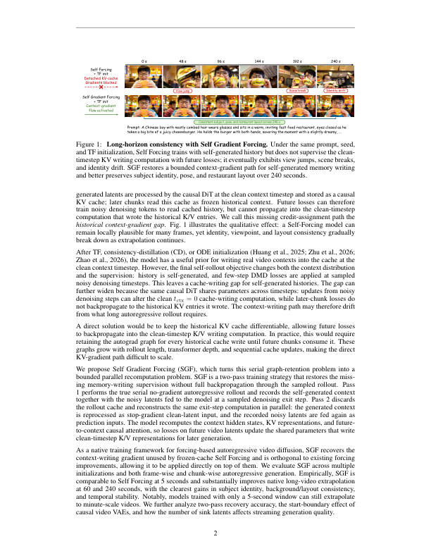

**Caption:** Long-horizon consistency with Self Gradient Forcing. Under the same prompt, seed, and TF initialization, Self Forcing trains with self-generated history but does not supervise the clean-timestep KV writing computation with future losses; it eventually exhibits view jumps, scene breaks, and identity drift. SGF restores a bounded context-gradient path for self-generated memory writing and better preserves subject identity, pose, and restaurant layout over 240 seconds.

**Caption[CN]:** 使用自梯度强制实现长时域一致性。在相同提示词、随机种子和 TF 初始化下，Self Forcing 使用自生成历史训练，但未来损失不监督干净时间步的 KV 写入计算；最终会出现视角跳变、场景断裂和身份漂移。SGF 为自生成记忆写入恢复有界的上下文梯度路径，在 240 秒内更好地保持主体身份、姿态和餐厅布局。

> <span style="color:#3B82F6"><strong>Para. 10:</strong></span> During rollout, generated latents are processed by the causal DiT at the clean context timestep and stored as a causal KV cache; later chunks read this cache as frozen historical context. Future losses can therefore train noisy denoising tokens to read cached history, but cannot propagate into the clean-timestep computation that wrote the historical K/V entries. We call this missing credit-assignment path the historical context-gradient gap. Fig. 1 illustrates the qualitative effect: a Self-Forcing model can remain locally plausible for many frames, yet identity, viewpoint, and layout consistency gradually break down as extrapolation continues.

> <span style="color:#F59E0B"><strong>Para. 10[CN]:</strong></span> 在滚动过程中，生成的潜变量在干净上下文时间步由因果 DiT 处理，并作为因果 KV 缓存保存；后续块把该缓存作为冻结的历史上下文读取。因此，未来损失可以训练噪声去噪 token 读取缓存历史，却不能传回产生历史 K/V 条目的干净时间步计算。我们将这一缺失的信用分配路径称为历史上下文梯度缺口。图 1 展示了定性影响：Self Forcing 模型在许多帧中仍可局部合理，但随着外推继续，身份、视角和布局一致性逐渐崩溃。

> <span style="color:#3B82F6"><strong>Para. 11:</strong></span> After TF, consistency-distillation (CD), or ODE initialization (Huang et al., 2025; Zhu et al., 2026; Zhao et al., 2026), the model has a useful prior for writing real video contexts into the cache at the clean context timestep. However, the final self-rollout objective changes both the context distribution and the supervision: history is self-generated, and few-step DMD losses are applied at sampled noisy denoising timesteps. This leaves a cache-writing gap for self-generated histories.

> <span style="color:#F59E0B"><strong>Para. 11[CN]:</strong></span> 在 TF、一致性蒸馏（CD）或 ODE 初始化之后（Huang 等，2025；Zhu 等，2026；Zhao 等，2026），模型已经具有在干净上下文时间步把真实视频上下文写入缓存的有用先验。然而，最终的自滚动目标同时改变了上下文分布和监督方式：历史由模型自行生成，少步 DMD 损失施加在采样的噪声去噪时间步上。这为自生成历史留下了缓存写入缺口。

> <span style="color:#3B82F6"><strong>Para. 12:</strong></span> The gap can further widen because the same causal DiT shares parameters across timesteps: updates from noisy denoising steps can alter the clean tctx = 0 cache-writing computation, while later-chunk losses do not backpropagate to the historical KV entries it wrote. The context-writing path may therefore drift from what long autoregressive rollout requires.

> <span style="color:#F59E0B"><strong>Para. 12[CN]:</strong></span> 由于同一个因果 DiT 在不同时间步共享参数，该缺口还可能扩大：噪声去噪步的更新会改变干净的 tctx = 0 缓存写入计算，而后续块损失不会反向传播到它所写入的历史 KV 条目。因此，上下文写入路径可能偏离长自回归滚动所需要的行为。

> <span style="color:#3B82F6"><strong>Para. 13:</strong></span> A direct solution would be to keep the historical KV cache differentiable, allowing future losses to backpropagate into the clean-timestep K/V writing computation. In practice, this would require retaining the autograd graph for every historical cache write until future chunks consume it. These graphs grow with rollout length, transformer depth, and sequential cache updates, making the direct KV-gradient path difficult to scale.

> <span style="color:#F59E0B"><strong>Para. 13[CN]:</strong></span> 直接的解决方案是保持历史 KV 缓存可微，使未来损失能够反向传播到干净时间步的 K/V 写入计算。实际上，这要求一直保留每次历史缓存写入的自动微分图，直到未来块消费它。随着滚动长度、Transformer 深度和串行缓存更新次数增长，这些计算图会增长，使直接 KV 梯度路径难以扩展。

> <span style="color:#3B82F6"><strong>Para. 14:</strong></span> We propose Self Gradient Forcing (SGF), which turns this serial graph-retention problem into a bounded parallel recomputation problem. SGF is a two-pass training strategy that restores the missing memory-writing supervision without full backpropagation through the sampled rollout. Pass 1 performs the true serial no-gradient autoregressive rollout and records the self-generated context together with the noisy latents fed to the model at a sampled denoising exit step. Pass 2 discards the rollout cache and reconstructs the same exit-step computation in parallel: the generated context is reprocessed as stop-gradient clean-latent input, and the recorded noisy latents are fed again as prediction inputs. The model recomputes the context hidden states, KV representations, and future-to-context causal attention, so losses on future video latents update the shared parameters that write clean-timestep K/V representations for later generation.

> <span style="color:#F59E0B"><strong>Para. 14[CN]:</strong></span> 我们提出 Self Gradient Forcing（SGF），把串行计算图保留问题转化为有界的并行重计算问题。SGF 是一种双遍训练策略，在不通过采样滚动完整反向传播的情况下恢复缺失的记忆写入监督。第一遍执行真实的串行无梯度自回归滚动，并记录自生成上下文以及在采样去噪退出步输入模型的噪声潜变量。第二遍丢弃滚动缓存，并行重建同一退出步计算：生成上下文作为停止梯度的干净潜变量输入重新处理，记录的噪声潜变量再次作为预测输入。模型重新计算上下文隐藏状态、KV 表示和未来到上下文的因果注意力，使未来视频潜变量上的损失能够更新负责在干净时间步写入 K/V 表示的共享参数。

> <span style="color:#3B82F6"><strong>Para. 15:</strong></span> As a native training framework for forcing-based autoregressive video diffusion, SGF recovers the context-writing gradient unused by frozen-cache Self Forcing and is orthogonal to existing forcing improvements, allowing it to be applied directly on top of them. We evaluate SGF across multiple initializations and both frame-wise and chunk-wise autoregressive generation. Empirically, SGF is comparable to Self Forcing at 5 seconds and substantially improves native long-video extrapolation at 60 and 240 seconds, with the clearest gains in subject identity, background/layout consistency, and temporal stability. Notably, models trained with only a 5-second window can still extrapolate to minute-scale videos. We further analyze two-pass recovery accuracy, the start-boundary effect of causal video VAEs, and how the number of sink latents affects streaming generation quality.

> <span style="color:#F59E0B"><strong>Para. 15[CN]:</strong></span> 作为面向 forcing 自回归视频扩散的原生训练框架，SGF 恢复了冻结缓存 Self Forcing 未使用的上下文写入梯度，并且与现有 forcing 改进正交，因此可以直接叠加使用。我们在多种初始化以及逐帧和分块自回归生成中评估 SGF。实验上，SGF 在 5 秒时与 Self Forcing 相当，在 60 秒和 240 秒时显著提升原生长视频外推，最明显的收益体现在主体身份、背景/布局一致性和时间稳定性。值得注意的是，仅用 5 秒窗口训练的模型仍可外推到分钟级视频。我们还分析双遍恢复精度、因果视频 VAE 的起始边界效应，以及汇聚潜变量数量对流式生成质量的影响。

**Contributions / 贡献。**

> <span style="color:#3B82F6"><strong>Para. 16:</strong></span> We identify the historical context-gradient gap in frozen-cache Self Forcing, where future losses supervise cache reading but not the clean context-writing computation that writes self-generated history into K/V memory; as shared DiT parameters are updated at other timesteps during few-step DMD, this unsupervised path can drift.

> <span style="color:#F59E0B"><strong>Para. 16[CN]:</strong></span> 我们识别出冻结缓存 Self Forcing 中的历史上下文梯度缺口：未来损失监督缓存读取，却不监督将自生成历史写入 K/V 记忆的干净上下文写入计算；由于少步 DMD 会在其他时间步更新共享 DiT 参数，这条无监督路径可能发生漂移。

> <span style="color:#3B82F6"><strong>Para. 17:</strong></span> We introduce SGF, a two-pass training strategy whose serial Pass 1 records the self-generated rollout state and whose parallel Pass 2 performs context-gradient reconstruction of the sampled exit-step computation with gradients through self-generated context KV representations and future-to-context causal attention.

> <span style="color:#F59E0B"><strong>Para. 17[CN]:</strong></span> 我们提出 SGF：串行第一遍记录自生成滚动状态，并行第二遍对采样退出步计算进行上下文梯度重建，使梯度穿过自生成上下文 KV 表示和未来到上下文的因果注意力。

> <span style="color:#3B82F6"><strong>Para. 18:</strong></span> We conduct extensive experiments on frame-wise and chunk-wise generation under different initializations at 5s, 60s, and 240s, showing that SGF matches Self Forcing at 5s and substantially improves long-video extrapolation at 60s and 240s. We study two-pass recovery accuracy, causal VAE boundary diagnostics, and the effect of sink latents on streaming generation quality.

> <span style="color:#F59E0B"><strong>Para. 18[CN]:</strong></span> 我们在不同初始化下开展逐帧和分块生成实验，评估 5s、60s 和 240s，结果表明 SGF 在 5s 与 Self Forcing 相当，并在 60s 和 240s 显著改善长视频外推。我们还研究双遍恢复精度、因果 VAE 边界诊断以及汇聚潜变量对流式生成质量的影响。

# 2 Related Work
> <span style="color:#3B82F6"><strong>Para. 19:</strong></span> Autoregressive video diffusion. Modern video generation builds on diffusion objectives, accelerated samplers, latent diffusion, and diffusion transformers, which provide the modeling and scaling principles used by image and video generators (Ho et al., 2020; Song et al., 2021; Rombach et al., 2022; Peebles & Xie, 2023). Video diffusion systems extend these foundations with 3D denoising, cascaded generation, latent video modeling, motion modules, space-time architectures, and multimodal autoregressive token modeling (Ho et al., 2022b;a; Singer et al., 2023; Blattmann et al., 2023b;a; Guo et al., 2024; Chen et al., 2024b; Bar-Tal et al., 2024; Kondratyuk et al., 2024). For long-form generation, however, the key distinction is the causal use of generated history: each generated latent frame or chunk becomes part of the context for later generation. Diffusion Forcing (Chen et al., 2024a) connects next-token prediction and diffusion by independently noising sequence elements, and CausVid (Yin et al., 2025) distills bidirectional video diffusion into a fast autoregressive student with causal caching. SGF follows this autoregressive video diffusion interface and asks whether self-generated history, once written into causal KV state, receives future supervision as future-readable memory.

> <span style="color:#F59E0B"><strong>Para. 19[CN]:</strong></span> 自回归视频扩散。现代视频生成建立在扩散目标、加速采样器、潜空间扩散和扩散 Transformer 之上，这些技术提供了图像与视频生成器所使用的建模和扩展原则（Ho 等，2020；Song 等，2021；Rombach 等，2022；Peebles 与 Xie，2023）。视频扩散系统进一步加入 3D 去噪、级联生成、潜视频建模、运动模块、时空架构和多模态自回归 token 建模（Ho 等，2022b、a；Singer 等，2023；Blattmann 等，2023b、a；Guo 等，2024；Chen 等，2024b；Bar-Tal 等，2024；Kondratyuk 等，2024）。但对于长篇幅生成，关键区别在于对生成历史的因果使用：每个生成的潜变量帧或块都会成为后续生成的上下文。Diffusion Forcing（Chen 等，2024a）通过独立地给序列元素加噪连接下一 token 预测与扩散；CausVid（Yin 等，2025）将双向视频扩散蒸馏为带因果缓存的快速自回归学生模型。SGF 遵循这一自回归视频扩散接口，追问自生成历史一旦写入因果 KV 状态，是否作为未来可读记忆获得来自未来的监督。

> <span style="color:#3B82F6"><strong>Para. 20:</strong></span> Forcing objectives for self-generated histories. Teacher-forcing trains on ground-truth prefixes, whereas autoregressive inference conditions on self-generated histories. Self Forcing (Huang et al., 2025) directly reduces this exposure bias by training the student on histories produced by its own rollout, using distribution-matching distillation supervision from a bidirectional teacher. Subsequent forcing methods build on this self-rollout training paradigm. Causal Forcing (Zhu et al., 2026) and Causal Forcing++ (Zhao et al., 2026) address a complementary initialization mismatch: a causal student should not depend on bidirectional teacher trajectories whose flow map is unavailable at inference. Rolling Forcing (Liu et al., 2025), Self-Forcing++ (Cui et al., 2025), Matrixgame3 (Wang et al., 2026), and ShotStream (Luo et al., 2026) further extend rollout exposure through longer segments and windowed denoising. Video-Mirai (Yu et al., 2026) and Next Forcing (Xu et al., 2026b) make a related observation that next-step supervision can discard information needed by later frames, and introduce future-aware or multi-chunk supervision. These methods improve the history distribution, causal initialization, or temporal reach of the supervision. SGF addresses a remaining gap in frozen-cache self-rollout training: future losses can supervise how later noisy denoising tokens read cached history, but not how the clean-timestep computation writes self-generated history into KV memory.

> <span style="color:#F59E0B"><strong>Para. 20[CN]:</strong></span> 自生成历史的 forcing 目标。教师强制在真实前缀上训练，而自回归推理以自生成历史为条件。Self Forcing（Huang 等，2025）让学生在自身滚动生成的历史上训练，并使用双向教师的分布匹配蒸馏监督，直接降低暴露偏差。后续 forcing 方法沿用这一自滚动训练范式。Causal Forcing（Zhu 等，2026）和 Causal Forcing++（Zhao 等，2026）处理互补的初始化不匹配：因果学生不应依赖推理时无法获得其流映射的双向教师轨迹。Rolling Forcing（Liu 等，2025）、Self-Forcing++（Cui 等，2025）、Matrixgame3（Wang 等，2026）和 ShotStream（Luo 等，2026）通过更长片段和窗口化去噪进一步扩大滚动暴露。Video-Mirai（Yu 等，2026）与 Next Forcing（Xu 等，2026b）提出相关观察，即下一步监督可能丢弃后续帧所需的信息，并引入面向未来或多块的监督。这些方法改进历史分布、因果初始化或监督的时间覆盖范围。SGF 处理冻结缓存自滚动训练中的剩余缺口：未来损失可以监督后续噪声去噪 token 如何读取缓存历史，却不能监督干净时间步计算如何把自生成历史写入 KV 记忆。

> <span style="color:#3B82F6"><strong>Para. 21:</strong></span> Long-horizon context and cache design. A line of work improves long-horizon generation by changing which context is available, how it is positioned, or how it is retained. Gen-L-Video performs overlapping temporal co-denoising for long multi-text videos (Wang et al., 2023); FreeNoise reschedules noise and fuses windowed temporal attention (Qiu et al., 2024); FIFO-Diffusion maintains a frame queue at different noise levels (Kim et al., 2024); and StreamingT2V combines short-term and long-term memory in an autoregressive pipeline (Henschel et al., 2025). Recurrent sequence modeling and efficient attention study segment recurrence (Dai et al., 2019), rotary position embeddings (Su et al., 2021), attention sinks (Xiao et al., 2024), cache retention (Zhang et al., 2023; Li et al., 2024), streaming long tuning (Yang et al., 2025; Chen et al., 2026b), long-context supervision (Chen et al., 2026a), trainable sparse attention (Xu et al., 2026a; Zhuang et al., 2026), KV compression (Ji et al., 2026), head-wise cache behavior (Tian et al., 2026), retrieval-augmented latent history (Hu et al., 2026), and gated recall with trusted alignment (Meng et al., 2026). These methods change the memory exposed to the generator. SGF is orthogonal to this direction: for a given context and cache design, it improves how self-generated content is written into future-readable KV representations. We evaluate SGF across frame-wise and chunk-wise generation, multiple initializations, and extrapolation horizons, showing that better KV memory writing improves long-horizon autoregressive video generation even under short-window forcing training.

> <span style="color:#F59E0B"><strong>Para. 21[CN]:</strong></span> 长时域上下文与缓存设计。一系列工作通过改变可用上下文、上下文位置或保留方式来改善长时域生成。Gen-L-Video 对长多文本视频执行重叠的时间协同去噪（Wang 等，2023）；FreeNoise 重新调度噪声并融合窗口化时间注意力（Qiu 等，2024）；FIFO-Diffusion 在不同噪声水平维护帧队列（Kim 等，2024）；StreamingT2V 在自回归管线中结合短期与长期记忆（Henschel 等，2025）。循环序列建模与高效注意力研究片段递归（Dai 等，2019）、旋转位置嵌入（Su 等，2021）、注意力汇聚（Xiao 等，2024）、缓存保留（Zhang 等，2023；Li 等，2024）、流式长调优（Yang 等，2025；Chen 等，2026b）、长上下文监督（Chen 等，2026a）、可训练稀疏注意力（Xu 等，2026a；Zhuang 等，2026）、KV 压缩（Ji 等，2026）、按注意力头的缓存行为（Tian 等，2026）、检索增强潜变量历史（Hu 等，2026）以及带可信对齐的门控召回（Meng 等，2026）。这些方法改变生成器所暴露的记忆。SGF 与这一方向正交：在给定上下文和缓存设计下，它改善自生成内容被写入未来可读 KV 表示的方式。我们在逐帧和分块生成、多种初始化和不同外推时域上评估 SGF，表明即使在短窗口 forcing 训练下，更好的 KV 记忆写入也能改善长时域自回归视频生成。

# 3 Method
## 3.1 Historical Context-Gradient Gap
> <span style="color:#3B82F6"><strong>Para. 22:</strong></span> Autoregressive video diffusion generates latent blocks sequentially. At block j, the causal generator denoises z_j^t while attending to a historical K/V cache, rather than to raw past latents. After block i < j is generated, its predicted clean latent x̃_i is processed at the clean context timestep t_ctx = 0, and the resulting K/V entries are appended to the cache. Thus, later blocks condition on the clean-timestep memory representation written from x̃_i, not on x̃_i directly.

> <span style="color:#F59E0B"><strong>Para. 22[CN]:</strong></span> 自回归视频扩散按顺序生成潜变量块。在块 j 处，因果生成器在读取历史 K/V 缓存的同时对 $z_j^t$ 去噪，而不是直接读取过去的原始潜变量。生成块 $i<j$ 后，其预测的干净潜变量 $	ilde{x}_i$ 在干净上下文时间步 $t_{ctx}=0$ 处理，所得 K/V 条目追加到缓存。因此，后续块以由 $	ilde{x}_i$ 写入的干净时间步记忆表示为条件，而不是直接以 $	ilde{x}_i$ 为条件。

$$\mathrm{KV}^{0}_{i}(\theta)=C_{\theta}(\tilde{x}_{i},t_{ctx};\mathrm{KV}^{0}_{<i}),\qquad t_{ctx}=0. \tag{1}$$

> <span style="color:#3B82F6"><strong>Para. 23:</strong></span> Let Cθ denote the cache-writing computation induced by the causal generator at the clean context timestep. In a serial rollout, this update is recurrent: the model reads the existing cache and writes the next historical K/V entry.

> <span style="color:#F59E0B"><strong>Para. 23[CN]:</strong></span> 令 $C_	heta$ 表示因果生成器在干净上下文时间步诱导的缓存写入计算。在串行滚动中，该更新是递归的：模型读取已有缓存并写入下一条历史 K/V。

> <span style="color:#3B82F6"><strong>Para. 24:</strong></span> The new entry KV0_i then becomes part of the state used by later blocks, including subsequent cache updates. If future losses could differentiate through this historical entry, they would assign credit to the clean-context computation that encoded x̃_i into K/V memory. This would train not only how later noisy tokens read self-generated history, but also how earlier generated latents should be written into memory for future denoising.

> <span style="color:#F59E0B"><strong>Para. 24[CN]:</strong></span> 新条目 $\mathrm{KV}^{0}_{i}$ 随后成为后续块使用状态的一部分，也参与后续缓存更新。如果未来损失能够穿过该历史条目求导，就会把信用分配给将 $	ilde{x}_i$ 编码进 K/V 记忆的干净上下文计算。这样训练的不仅是后续噪声 token 如何读取自生成历史，也包括早先生成的潜变量应如何写入记忆以服务未来去噪。

> <span style="color:#3B82F6"><strong>Para. 25:</strong></span> Frozen-cache Self Forcing removes this memory-writing signal. It trains on self-generated histories, reducing the mismatch between training and inference, and later-block losses can still update the target-side denoising computation that reads the recorded cache. However, the historical K/V entries are treated as detached rollout state. Consequently, future losses do not supervise the t_ctx = 0 computation that produced those entries.

> <span style="color:#F59E0B"><strong>Para. 25[CN]:</strong></span> 冻结缓存 Self Forcing 移除了这一记忆写入信号。它在自生成历史上训练，减小训练与推理之间的不匹配，后续块损失仍可更新读取所记录缓存的目标侧去噪计算。然而，历史 K/V 条目被视为脱离梯度的滚动状态。因此，未来损失不会监督产生这些条目的 $t_{ctx}=0$ 计算。

> <span style="color:#3B82F6"><strong>Para. 26:</strong></span> This omission becomes problematic during final Self Forcing because the same DiT parameters are shared across noisy denoising and clean-context cache writing. DMD losses at noisy timesteps update the shared parameters,

> <span style="color:#F59E0B"><strong>Para. 26[CN]:</strong></span> 这一遗漏在最终 Self Forcing 阶段会产生问题，因为同一组 DiT 参数同时用于噪声去噪和干净上下文缓存写入。噪声时间步上的 DMD 损失会更新共享参数，

$$\theta_{r+1}=\theta_r-\eta\nabla_\theta L_{SF}(\theta_r),\qquad \mathrm{KV}^{0}_{i}(\theta_{r+1})\not\equiv\mathrm{KV}^{0}_{i}(\theta_r)\quad\text{in general}.\tag{2}$$

> <span style="color:#3B82F6"><strong>Para. 27:</strong></span> Thus, training can change the clean-context cache writer, but frozen-cache Self Forcing provides no future-loss correction for how self-generated latents are encoded into K/V memory. We call this missing supervision path the historical context-gradient gap. Figure 2 illustrates how SGF restores this missing path by replacing frozen-cache reconstruction with context-gradient reconstruction.

> <span style="color:#F59E0B"><strong>Para. 27[CN]:</strong></span> 因此，训练可以改变干净上下文缓存写入器，但冻结缓存 Self Forcing 不提供未来损失校正，来指导自生成潜变量应如何编码进 K/V 记忆。我们将这一缺失监督路径称为历史上下文梯度缺口。图 2 说明 SGF 如何用上下文梯度重建替代冻结缓存重建，从而恢复这一路径。

## 3.2 Direct Differentiable Cache
> <span style="color:#3B82F6"><strong>Para. 28:</strong></span> A direct way to close the gap is to keep the serial historical K/V cache differentiable. Then future losses could backpropagate through the cached K/V entries into the earlier clean-context calls that produced them. However, this requires retaining the backward graph for every cache write until all later blocks that consume it have been processed. Because autoregressive rollout repeatedly writes, reads, and extends the cache across denoising steps and transformer layers, the graph grows with rollout length rather than remaining a fixed-window computation. The bottleneck is therefore not the storage of K/V tensors alone, but the saved activations attached to the recurrent cache trajectory. This makes direct differentiable-cache training impractical for long-horizon self-rollout.

> <span style="color:#F59E0B"><strong>Para. 28[CN]:</strong></span> 弥合缺口的一种直接方式是保持串行历史 K/V 缓存可微。这样未来损失就能穿过缓存的 K/V 条目，反向传播到产生它们的早先干净上下文调用。然而，这要求保留每次缓存写入的反向图，直到所有消费它的后续块都处理完。由于自回归滚动会跨去噪步和 Transformer 层反复写入、读取并扩展缓存，计算图随滚动长度增长，而不是保持固定窗口。瓶颈因此不仅是 K/V 张量的存储，还包括附着在递归缓存轨迹上的保存激活。这使直接可微缓存训练对长时域自滚动并不实际。

## 3.3 Self Gradient Forcing
### Figure 2. From frozen-cache Self Forcing to Self Gradient Forcing

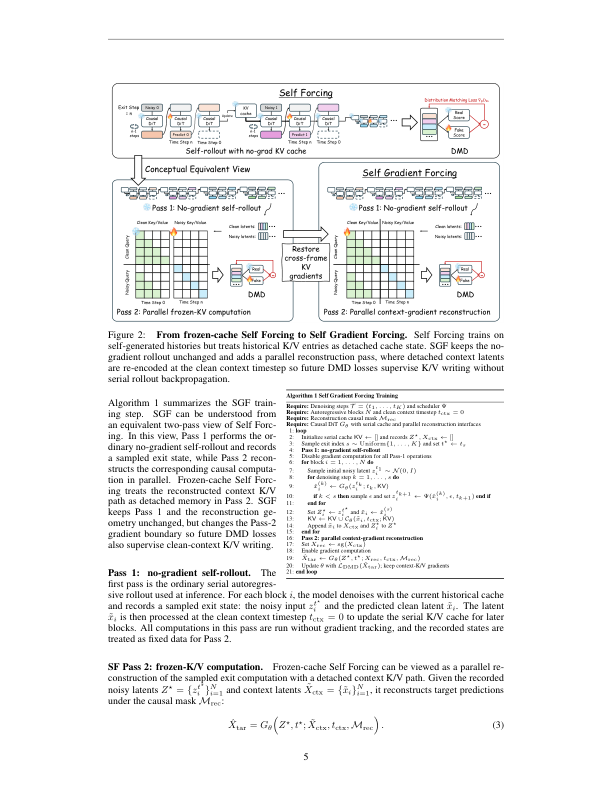

**Caption:** From frozen-cache Self Forcing to Self Gradient Forcing. Self Forcing trains on self-generated histories but treats historical K/V entries as detached cache state. SGF keeps the no-gradient rollout unchanged and adds a parallel reconstruction pass, where detached context latents are re-encoded at the clean context timestep so future DMD losses supervise K/V writing without serial rollout backpropagation.

**Caption[CN]:** 从冻结缓存 Self Forcing 到 Self Gradient Forcing。Self Forcing 在自生成历史上训练，但将历史 K/V 条目视为脱离梯度的缓存状态。SGF 保持无梯度滚动不变，并增加并行重建遍历：脱离梯度的上下文潜变量在干净上下文时间步重新编码，使未来 DMD 损失监督 K/V 写入，同时无需对串行滚动反向传播。

> <span style="color:#3B82F6"><strong>Para. 29:</strong></span> Algorithm 1 summarizes the SGF training step. SGF can be understood from an equivalent two-pass view of Self Forcing. In this view, Pass 1 performs the ordinary no-gradient self-rollout and records a sampled exit state, while Pass 2 reconstructs the corresponding causal computation in parallel. Frozen-cache Self Forcing treats the reconstructed context K/V path as detached memory in Pass 2. SGF keeps Pass 1 and the reconstruction geometry unchanged, but changes the Pass-2 gradient boundary so future DMD losses also supervise clean-context K/V writing.

> <span style="color:#F59E0B"><strong>Para. 29[CN]:</strong></span> 算法 1 总结 SGF 的训练步骤。可以从 Self Forcing 的等价双遍视角理解 SGF：第一遍执行普通的无梯度自滚动并记录采样的退出状态，第二遍并行重建对应的因果计算。冻结缓存 Self Forcing 在第二遍把重建的上下文 K/V 路径视为脱离梯度的记忆。SGF 保持第一遍和重建几何不变，但改变第二遍的梯度边界，使未来 DMD 损失也监督干净上下文 K/V 写入。

**Algorithm 1. Self Gradient Forcing Training / 自梯度强制训练**

```text
Require: Denoising steps T = (t1, …, tK) and scheduler Ψ
Require: Autoregressive blocks N and clean context timestep tctx = 0
Require: Reconstruction causal mask Mrec
Require: Causal DiT Gθ with serial cache and parallel reconstruction interfaces
1: loop
2:   Initialize serial cache KV ← [] and records Z⋆, Xctx ← []
3:   Sample exit index s ∼ Uniform{1, …, K} and set t⋆ ← ts
4:   Pass 1: no-gradient self-rollout
5:   Disable gradient computation for all Pass-1 operations
6:   for block i = 1, …, N do
7:     Sample initial noisy latent zi^t1 ∼ N(0, I)
8:     for denoising step k = 1, …, s do
9:       x̂i^(k) ← Gθ(zi^tk; tk, KV)
10:      if k < s then sample ε and set zi^(tk+1) ← Ψ(x̂i^(k), ε, tk+1) end if
11:    end for
12:    Set Zi⋆ ← zi^ts and x̃i ← x̂i^(s)
13:    KV ← KV ∪ Cθ(x̃i, tctx; KV)
14:    Append x̃i to Xctx and Zi⋆ to Z⋆
15: end for
16: Pass 2: parallel context-gradient reconstruction
17: Set Xrec ← sg(Xctx)
18: Enable gradient computation
19: X̂tar ← Gθ(Z⋆, t⋆; Xrec, tctx, Mrec)
20: Update θ with LDMD(X̂tar); keep context/K-V gradients
21: end loop
```

> <span style="color:#3B82F6"><strong>Para. 30:</strong></span> Pass 1: no-gradient self-rollout. The first pass is the ordinary serial autoregressive rollout used at inference. For each block i, the model denoises with the current historical cache and records a sampled exit state: the noisy input z_i^{t⋆} and the predicted clean latent x̃_i. The latent x̃_i is then processed at the clean context timestep t_ctx = 0 to update the serial K/V cache for later blocks. All computations in this pass are run without gradient tracking, and the recorded states are treated as fixed data for Pass 2.

> <span style="color:#F59E0B"><strong>Para. 30[CN]:</strong></span> 第一遍：无梯度自滚动。第一遍就是推理时使用的普通串行自回归滚动。对每个块 i，模型读取当前历史缓存进行去噪，并记录采样的退出状态：噪声输入 $z_i^{t^\star}$ 和预测的干净潜变量 $	ilde{x}_i$。随后，$	ilde{x}_i$ 在干净上下文时间步 $t_{ctx}=0$ 处理，以更新供后续块使用的串行 K/V 缓存。第一遍的所有计算都不跟踪梯度，所记录状态在第二遍被视为固定数据。

> <span style="color:#3B82F6"><strong>Para. 31:</strong></span> SF Pass 2: frozen-K/V computation. Frozen-cache Self Forcing can be viewed as a parallel reconstruction of the sampled exit computation with a detached context K/V path. Given the recorded noisy latents Z⋆ = {z_i^{t⋆}}_{i=1}^N and context latents X̃_ctx = {x̃_i}_{i=1}^N, it reconstructs target predictions under the causal mask M_rec:

> <span style="color:#F59E0B"><strong>Para. 31[CN]:</strong></span> SF 第二遍：冻结 K/V 计算。冻结缓存 Self Forcing 可以看作在脱离梯度的上下文 K/V 路径下，对采样退出计算进行并行重建。给定记录的噪声潜变量 $Z^\star=\{z_i^{t^\star}\}_{i=1}^N$ 与上下文潜变量 $	ilde{X}_{ctx}=\{	ilde{x}_i\}_{i=1}^N$，它在因果掩码 $M_{rec}$ 下重建目标预测：

$$\hat{X}_{tar}=G_\theta(Z^\star,t^\star;\tilde{X}_{ctx},t_{ctx},M_{rec}).\tag{3}$$

> <span style="color:#3B82F6"><strong>Para. 32:</strong></span> The mask M_rec reproduces the sink-plus-window attention relation induced by the serial cache. In frozen-cache Self Forcing, however, the K/V entries produced by the clean-context side are treated as detached memory when noisy target tokens attend to them. Thus, DMD losses train how future noisy tokens read self-generated history, but not how that history is encoded into K/V memory.

> <span style="color:#F59E0B"><strong>Para. 32[CN]:</strong></span> 掩码 $M_{rec}$ 复现串行缓存诱导的汇聚加窗口注意力关系。然而在冻结缓存 Self Forcing 中，当噪声目标 token 注意到干净上下文侧产生的 K/V 条目时，这些条目被视为脱离梯度的记忆。因此，DMD 损失训练未来噪声 token 如何读取自生成历史，却不训练这些历史如何编码进 K/V 记忆。

> <span style="color:#3B82F6"><strong>Para. 33:</strong></span> SGF Pass 2: context-gradient reconstruction. SGF keeps Pass 1 and the reconstruction geometry unchanged, but removes the stop-gradient boundary on the reconstructed context K/V path. The context latents X̃_ctx themselves remain stop-gradient inputs, so SGF does not optimize the sampled rollout trajectory. Instead, the model re-encodes these fixed self-generated latents at t_ctx = 0, and the resulting K/V entries remain differentiable when future target tokens attend to them:

> <span style="color:#F59E0B"><strong>Para. 33[CN]:</strong></span> SGF 第二遍：上下文梯度重建。SGF 保持第一遍和重建几何不变，但移除重建上下文 K/V 路径上的停止梯度边界。上下文潜变量 $	ilde{X}_{ctx}$ 本身仍是停止梯度输入，因此 SGF 不优化采样的滚动轨迹。相反，模型在 $t_{ctx}=0$ 重新编码这些固定的自生成潜变量，当未来目标 token 注意到这些条目时，所得 K/V 条目仍保持可微：

$$\nabla_\theta L_{DMD}(\hat{X}_{tar})\supset\frac{\partial L_{DMD}}{\partial \mathrm{KV}^{rec}_{ctx}}\frac{\partial \mathrm{KV}^{rec}_{ctx}}{\partial\theta}.\tag{4}$$

> <span style="color:#3B82F6"><strong>Para. 34:</strong></span> Therefore, future DMD losses supervise both target-side denoising and clean-context K/V writing. The Pass-2 reconstruction is designed to recover the sampled exit computation from Pass 1. With deterministic layers, matched positional indices, and the same causal reconstruction geometry, X̂_tar is theoretically identical to the recorded predicted context latents X̃_ctx for the corresponding exit state. In practice, small deviations may still appear due to floating-point and implementation-level effects. Appendix D verifies this recovery fidelity empirically.

> <span style="color:#F59E0B"><strong>Para. 34[CN]:</strong></span> 因此，未来 DMD 损失同时监督目标侧去噪和干净上下文 K/V 写入。第二遍重建被设计为恢复第一遍的采样退出计算。在层为确定性、位置索引匹配且因果重建几何相同的条件下，对于对应退出状态，$\hat{X}_{tar}$ 理论上与记录的预测上下文潜变量 $	ilde{X}_{ctx}$ 相同。实践中，浮点数和实现层面的影响仍可能造成小偏差。附录 D 对这一恢复保真度进行了实证验证。

> <span style="color:#3B82F6"><strong>Para. 35:</strong></span> This two-pass design avoids the memory blow-up of a direct differentiable cache. Pass 1 is serial but no-gradient; Pass 2 is gradient-enabled but fixed-window and parallel under M_rec. SGF therefore recovers the missing memory-writing supervision without opening a recurrent autograd graph through the full self-rollout.

> <span style="color:#F59E0B"><strong>Para. 35[CN]:</strong></span> 这一双遍设计避免了直接可微缓存的内存爆炸。第一遍是串行但无梯度的；第二遍启用梯度，却在 $M_{rec}$ 下采用固定窗口并行执行。因此，SGF 恢复了缺失的记忆写入监督，而无需打开穿过完整自滚动的递归自动微分图。

## 3.4 Gradient Boundary
> <span style="color:#3B82F6"><strong>Para. 36:</strong></span> SGF is a bounded reconstruction of the sampled exit computation, not full rollout BPTT. The recorded context latents X̃_ctx, noise samples, scheduler states, and Pass-1 serial cache trajectory are all stop-gradient. Gradients flow only through the Pass-2 reconstruction: the clean-context forward, K/V projections, future-to-context attention, and target-side denoising computation. This boundary recovers memory-writing supervision while keeping the training graph fixed-window and parallel.

> <span style="color:#F59E0B"><strong>Para. 36[CN]:</strong></span> SGF 是采样退出计算的有界重建，而不是完整滚动 BPTT。记录的上下文潜变量 $	ilde{X}_{ctx}$、噪声样本、调度器状态和第一遍串行缓存轨迹全部停止梯度。梯度只穿过第二遍重建：干净上下文前向、K/V 投影、未来到上下文的注意力以及目标侧去噪计算。该边界恢复记忆写入监督，同时让训练图保持固定窗口并行。

## 3.5 Streaming Context Policy
> <span style="color:#3B82F6"><strong>Para. 37:</strong></span> For frame-wise streaming generation, both Self Forcing and SGF use the same sink-plus-FIFO context policy. We keep a fixed sink prefix and a FIFO window of recent latents, so the evaluation isolates the effect of SGF rather than context selection. For the Wan video VAE, we use four sink latents to preserve the temporal boundary prefix induced by its asymmetric grouping pattern. Appendix E provides the boundary diagnostic and sink-number ablation.

> <span style="color:#F59E0B"><strong>Para. 37[CN]:</strong></span> 对于逐帧流式生成，Self Forcing 与 SGF 使用相同的汇聚加 FIFO 上下文策略。我们保留固定汇聚前缀和近期潜变量 FIFO 窗口，使评估隔离 SGF 的影响，而不是上下文选择的影响。对于 Wan 视频 VAE，我们使用四个汇聚潜变量，以保留其非对称分组模式产生的时间边界前缀。附录 E 给出边界诊断与汇聚数量消融。

# 4 Experiments
> <span style="color:#3B82F6"><strong>Para. 38:</strong></span> We evaluate whether SGF improves native long-video extrapolation without sacrificing short-horizon quality. The appendix provides full 5s VBench tables, two-pass recovery fidelity, sink/context ablations, and additional qualitative comparisons (Appendix B, D, E, and H).

> <span style="color:#F59E0B"><strong>Para. 38[CN]:</strong></span> 我们评估 SGF 是否能够在不牺牲短时域质量的情况下改善原生长视频外推。附录给出完整的 5s VBench 表、双遍恢复保真度、汇聚/上下文消融以及额外定性对比（附录 B、D、E 和 H）。

## 4.1 Experimental Setup
> <span style="color:#3B82F6"><strong>Para. 39:</strong></span> All models are trained with the same 5-second training window; 60s and 240s results therefore test native extrapolation beyond the training horizon. Following prior long-video extrapolation practice (Yesiltepe et al., 2025), we compare SGF with matched Self Forcing baselines at 5s, 60s, and 240s. Each matched pair shares the same initialization, prompt set, random seed, sink/FIFO policy, sliding window, chunking strategy, and sampling configuration. The only change is whether the sampled exit loss reads a frozen historical KV cache, as in Self Forcing, or reconstructs the self-generated context with gradients, as in SGF. For frame-wise generation, we use sink 4, FIFO 16, and current chunk 1; for chunk-wise generation, we use sink 3, FIFO 6, current chunk 3, and chunk size 3.

> <span style="color:#F59E0B"><strong>Para. 39[CN]:</strong></span> 所有模型使用相同的 5 秒训练窗口；因此，60s 和 240s 结果检验的是超出训练时域的原生外推。遵循既有长视频外推实践（Yesiltepe 等，2025），我们在 5s、60s 和 240s 比较 SGF 与匹配的 Self Forcing 基线。每个匹配对具有相同初始化、提示词集合、随机种子、汇聚/FIFO 策略、滑动窗口、分块策略和采样配置。唯一变化是采样退出损失读取冻结历史 KV 缓存（Self Forcing），还是带梯度重建自生成上下文（SGF）。逐帧生成使用 sink 4、FIFO 16、当前块 1；分块生成使用 sink 3、FIFO 6、当前块 3、块大小 3。

> <span style="color:#3B82F6"><strong>Para. 40:</strong></span> The 5s evaluation follows the standard VBench protocol and serves as a short-horizon sanity check. Full 5s VBench results are reported in Appendix B, where SGF and Self Forcing are broadly comparable across frame-wise and chunk-wise settings. We therefore focus the main paper on 60s and 240s extrapolation, where memory-writing errors have time to accumulate.

> <span style="color:#F59E0B"><strong>Para. 40[CN]:</strong></span> 5s 评估遵循标准 VBench 协议，作为短时域合理性检查。附录 B 报告完整 5s VBench 结果，其中 SGF 与 Self Forcing 在逐帧和分块设置下总体相当。因此，正文聚焦于 60s 和 240s 外推，因为在这些时域中记忆写入误差有时间累积。

> <span style="color:#3B82F6"><strong>Para. 41:</strong></span> The 60s setting uses VBench-Long prompts, and the 240s setting uses 128 randomly sampled MovieGen prompts (Polyak et al., 2024). For both long horizons, we report the official VBench-Long metrics: aesthetic quality, background consistency, dynamic degree, imaging quality, motion smoothness, subject consistency, and flickering. Higher is better after VBench orientation. GSB human-preference results are reported separately as paired comparisons.

> <span style="color:#F59E0B"><strong>Para. 41[CN]:</strong></span> 60s 设置使用 VBench-Long 提示词，240s 设置使用随机采样的 128 个 MovieGen 提示词（Polyak 等，2024）。对于两个长时域，我们报告官方 VBench-Long 指标：审美质量、背景一致性、动态程度、成像质量、运动平滑度、主体一致性和闪烁度。经过 VBench 方向统一后，数值越高越好。GSB 人类偏好结果以成对比较形式单独报告。

## 4.2 Long Video Generation (60s and 240s)
> <span style="color:#3B82F6"><strong>Para. 42:</strong></span> Quantitative results. Tables 1 and 2 report long-horizon automatic metrics for frame-wise and chunk-wise autoregressive generation. All comparisons are controlled within each generation setting and should be read pairwise by initialization. Across both generation granularities and both long horizons, SGF improves over matched Self Forcing baselines on most quality and consistency metrics. The gains are especially consistent for aesthetic quality, background consistency, imaging quality, motion smoothness, subject consistency, and flickering. These metrics directly reflect the failure mode targeted by SGF: whether self-generated latents are written into memory representations that remain useful throughout long extrapolation.

> <span style="color:#F59E0B"><strong>Para. 42[CN]:</strong></span> 定量结果。表 1 和表 2 报告逐帧与分块自回归生成的长时域自动指标。每种生成设置内部的比较均受到控制，应按初始化逐对阅读。在两种生成粒度和两个长时域上，SGF 在多数质量与一致性指标上都优于匹配的 Self Forcing 基线。审美质量、背景一致性、成像质量、运动平滑度、主体一致性和闪烁度的增益尤其一致。这些指标直接反映 SGF 所针对的失败模式：自生成潜变量是否被写入在整个长外推过程中仍然有用的记忆表示。

> <span style="color:#3B82F6"><strong>Para. 43:</strong></span> Dynamic degree is the main exception, where Self Forcing can obtain a higher score. This does not necessarily indicate better motion quality: Appendix H shows that long Self Forcing rollouts often contain scene jumps, broken camera geometry, and object deformation, which create large but incoherent apparent motion and can inflate dynamic degree. By contrast, SGF maintains more stable image quality and more plausible camera evolution, so its lower dynamic-degree score in these cases is not evidence of worse generation quality.

> <span style="color:#F59E0B"><strong>Para. 43[CN]:</strong></span> 动态程度是主要例外，Self Forcing 有时获得更高分。这并不一定意味着运动质量更好：附录 H 表明，长时间 Self Forcing 滚动经常包含场景跳变、破损的相机几何和物体变形，产生幅度很大但不连贯的表观运动，从而可能抬高动态程度。相反，SGF 保持更稳定的图像质量和更可信的相机演化，因此在这些情况下较低的动态程度分数并不是生成质量更差的证据。

### Table 1. Frame-wise 60-second and 240-second long-horizon metrics

**Table title[CN]:** 表 1。逐帧 60 秒与 240 秒长时域指标。

| Horizon | Metric↑ | Causal ODE init SF | Causal ODE init SGF | Causal CD init SF | Causal CD init SGF | TF init SF | TF init SGF |
|---|---|---:|---:|---:|---:|---:|---:|
| 60s | Aesthetics | 0.543 | 0.606 | 0.608 | 0.630 | 0.650 | 0.653 |
| 60s | Background | 0.947 | 0.966 | 0.969 | 0.973 | 0.970 | 0.974 |
| 60s | Dynamics | 0.867 | 0.566 | 0.489 | 0.267 | 0.647 | 0.730 |
| 60s | Imaging | 0.657 | 0.715 | 0.684 | 0.708 | 0.704 | 0.714 |
| 60s | Motion | 0.975 | 0.986 | 0.984 | 0.988 | 0.985 | 0.982 |
| 60s | Subject | 0.928 | 0.971 | 0.974 | 0.983 | 0.976 | 0.983 |
| 60s | Flickering | 0.971 | 0.987 | 0.992 | 0.992 | 0.988 | 0.991 |
| 240s | Aesthetics | 0.510 | 0.543 | 0.533 | 0.584 | 0.614 | 0.619 |
| 240s | Background | 0.943 | 0.966 | 0.964 | 0.971 | 0.965 | 0.968 |
| 240s | Dynamics | 0.840 | 0.556 | 0.599 | 0.385 | 0.669 | 0.648 |
| 240s | Imaging | 0.648 | 0.698 | 0.632 | 0.690 | 0.701 | 0.718 |
| 240s | Motion | 0.971 | 0.985 | 0.981 | 0.986 | 0.980 | 0.982 |
| 240s | Subject | 0.936 | 0.969 | 0.967 | 0.976 | 0.965 | 0.972 |
| 240s | Flickering | 0.937 | 0.972 | 0.971 | 0.977 | 0.967 | 0.968 |

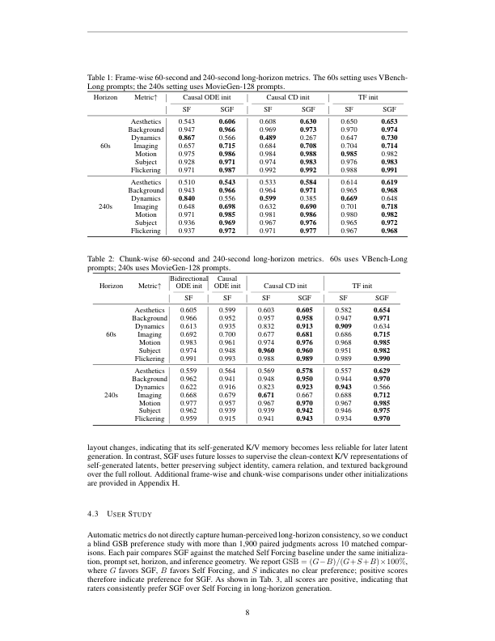

**Caption:** Frame-wise 60-second and 240-second long-horizon metrics. The 60s setting uses VBench-Long prompts; the 240s setting uses MovieGen-128 prompts.

**Caption[CN]:** 逐帧 60 秒和 240 秒长时域指标。60s 设置使用 VBench-Long 提示词；240s 设置使用 MovieGen-128 提示词。

### Table 2. Chunk-wise 60-second and 240-second long-horizon metrics

**Table title[CN]:** 表 2。分块 60 秒与 240 秒长时域指标。

| Horizon | Metric↑ | BiODE SF | Causal ODE SF | Causal CD SF | Causal CD SGF | TF SF | TF SGF |
|---|---|---:|---:|---:|---:|---:|---:|
| 60s | Aesthetics | 0.605 | 0.599 | 0.603 | 0.605 | 0.582 | 0.654 |
| 60s | Background | 0.966 | 0.952 | 0.957 | 0.958 | 0.947 | 0.971 |
| 60s | Dynamics | 0.613 | 0.935 | 0.832 | 0.913 | 0.909 | 0.634 |
| 60s | Imaging | 0.692 | 0.700 | 0.677 | 0.681 | 0.686 | 0.715 |
| 60s | Motion | 0.983 | 0.961 | 0.974 | 0.976 | 0.968 | 0.985 |
| 60s | Subject | 0.974 | 0.948 | 0.960 | 0.960 | 0.951 | 0.982 |
| 60s | Flickering | 0.991 | 0.993 | 0.988 | 0.989 | 0.989 | 0.990 |
| 240s | Aesthetics | 0.559 | 0.564 | 0.569 | 0.578 | 0.557 | 0.629 |
| 240s | Background | 0.962 | 0.941 | 0.948 | 0.950 | 0.944 | 0.970 |
| 240s | Dynamics | 0.622 | 0.916 | 0.823 | 0.923 | 0.943 | 0.566 |
| 240s | Imaging | 0.668 | 0.679 | 0.671 | 0.667 | 0.688 | 0.712 |
| 240s | Motion | 0.977 | 0.957 | 0.967 | 0.970 | 0.967 | 0.985 |
| 240s | Subject | 0.962 | 0.939 | 0.939 | 0.942 | 0.946 | 0.975 |
| 240s | Flickering | 0.959 | 0.915 | 0.941 | 0.943 | 0.934 | 0.970 |


**Caption:** Chunk-wise 60-second and 240-second long-horizon metrics. 60s uses VBench-Long prompts; 240s uses MovieGen-128 prompts.

**Caption[CN]:** 分块 60 秒和 240 秒长时域指标。60s 使用 VBench-Long 提示词；240s 使用 MovieGen-128 提示词。

> <span style="color:#3B82F6"><strong>Para. 44:</strong></span> Qualitative results. Figure 3 shows a representative 240-second frame-wise comparison under TF initialization. Both methods use the same prompts, seeds, horizon, and inference geometry, so the visual differences reflect the training objective rather than sampling variation. Self Forcing remains locally plausible early in the rollout, but gradually accumulates identity drift, crop drift, and layout changes, indicating that its self-generated K/V memory becomes less reliable for later latent generation. In contrast, SGF uses future losses to supervise the clean-context K/V representations of self-generated latents, better preserving subject identity, camera relation, and textured background over the full rollout. Additional frame-wise and chunk-wise comparisons under other initializations are provided in Appendix H.

> <span style="color:#F59E0B"><strong>Para. 44[CN]:</strong></span> 定性结果。图 3 展示 TF 初始化下具有代表性的 240 秒逐帧对比。两种方法使用相同提示词、随机种子、时域和推理几何，因此视觉差异反映的是训练目标，而非采样变化。Self Forcing 在滚动早期局部上仍然合理，但逐步积累身份漂移、裁剪漂移和布局变化，说明其自生成 K/V 记忆对后续潜变量生成变得不可靠。相比之下，SGF 使用未来损失监督自生成潜变量的干净上下文 K/V 表示，在整个滚动过程中更好地保留主体身份、相机关系和纹理背景。附录 H 提供其他初始化下的逐帧与分块对比。

### Figure 3. Frame-wise 240-second comparison under TF initialization

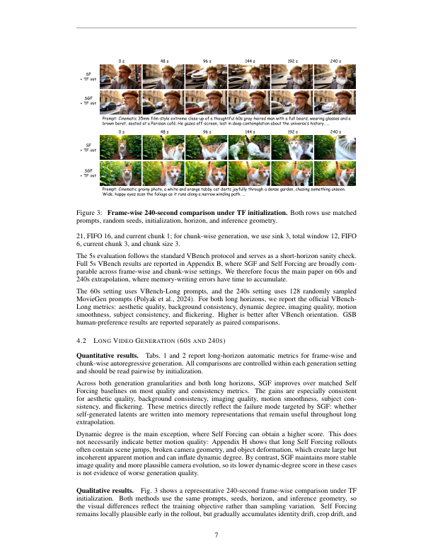

**Caption:** Frame-wise 240-second comparison under TF initialization. Both rows use matched prompts, random seeds, initialization, horizon, and inference geometry.

**Caption[CN]:** TF 初始化下的逐帧 240 秒对比。两行使用匹配的提示词、随机种子、初始化、时域和推理几何。

## 4.3 User Study
> <span style="color:#3B82F6"><strong>Para. 45:</strong></span> Automatic metrics do not directly capture human-perceived long-horizon consistency, so we conduct a blind GSB preference study with more than 1,900 paired judgments across 10 matched comparisons. Each pair compares SGF against the matched Self Forcing baseline under the same initialization, prompt set, horizon, and inference geometry. We report GSB = (G−B)/(G+S+B)×100%, where G favors SGF, B favors Self Forcing, and S indicates no clear preference; positive scores therefore indicate preference for SGF. As shown in Table 3, all scores are positive, indicating that raters consistently prefer SGF over Self Forcing in long-horizon generation.

> <span style="color:#F59E0B"><strong>Para. 45[CN]:</strong></span> 自动指标不能直接捕捉人类感知的长时域一致性，因此我们进行盲法 GSB 偏好研究，在 10 个匹配比较中收集超过 1,900 次成对判断。每一对都在相同初始化、提示词集合、时域和推理几何下比较 SGF 与匹配的 Self Forcing 基线。我们报告 $GSB=(G-B)/(G+S+B)	imes100\%$，其中 G 表示偏好 SGF，B 表示偏好 Self Forcing，S 表示没有明确偏好；因此正分表示偏好 SGF。如表 3 所示，所有分数均为正，说明评价者在长时域生成中一致偏好 SGF。

### Table 3. Long-horizon GSB preference scores

**Table title[CN]:** 表 3。长时域 GSB 偏好分数。

| Setting | Horizon | Causal ODE init | Causal CD init | TF init |
|---|---|---:|---:|---:|
| Frame-wise | 60s | 29.6% | 36.8% | 45.1% |
| Frame-wise | 240s | 38.6% | 35.9% | 48.7% |
| Chunk-wise | 60s | – | 32.9% | 37.5% |
| Chunk-wise | 240s | – | 34.3% | 44.9% |

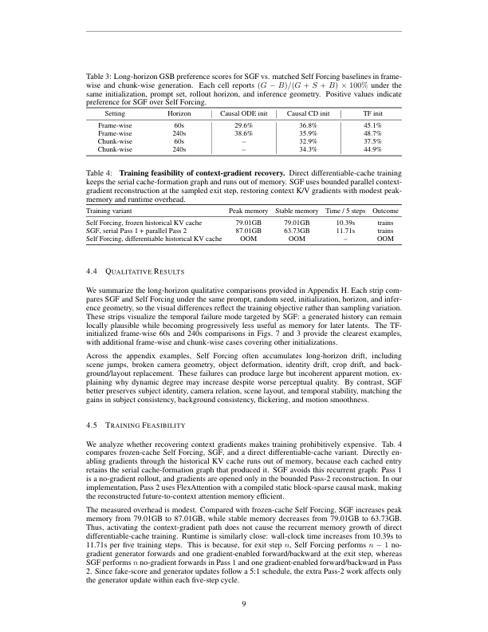

**Caption:** Long-horizon GSB preference scores for SGF vs. matched Self Forcing baselines in frame-wise and chunk-wise generation. Each cell reports (G − B)/(G + S + B) × 100% under the same initialization, prompt set, rollout horizon, and inference geometry. Positive values indicate preference for SGF over Self Forcing.

**Caption[CN]:** 逐帧和分块生成中 SGF 与匹配 Self Forcing 基线的长时域 GSB 偏好分数。每个单元格在相同初始化、提示词集合、滚动时域和推理几何下报告 (G − B)/(G + S + B) × 100%。正值表示偏好 SGF 而非 Self Forcing。

## 4.4 Qualitative Results
> <span style="color:#3B82F6"><strong>Para. 46:</strong></span> We summarize the long-horizon qualitative comparisons provided in Appendix H. Each strip compares SGF and Self Forcing under the same prompt, random seed, initialization, horizon, and inference geometry, so the visual differences reflect the training objective rather than sampling variation. These strips visualize the temporal failure mode targeted by SGF: a generated history can remain locally plausible while becoming progressively less useful as memory for later latents. The TF-initialized frame-wise 60s and 240s comparisons in Figures 7 and 3 provide the clearest examples, with additional frame-wise and chunk-wise cases covering other initializations.

> <span style="color:#F59E0B"><strong>Para. 46[CN]:</strong></span> 我们总结附录 H 中的长时域定性对比。每个条带在相同提示词、随机种子、初始化、时域和推理几何下比较 SGF 与 Self Forcing，因此视觉差异反映训练目标而非采样变化。这些条带可视化 SGF 所针对的时间失败模式：生成历史可以保持局部合理，却逐步变得不再适合作为后续潜变量的记忆。图 7 和图 3 中 TF 初始化的逐帧 60s 与 240s 对比给出了最清晰的例子，其他初始化还由额外逐帧和分块案例覆盖。

> <span style="color:#3B82F6"><strong>Para. 47:</strong></span> Across the appendix examples, Self Forcing often accumulates long-horizon drift, including scene jumps, broken camera geometry, object deformation, identity drift, crop drift, and background/layout replacement. These failures can produce large but incoherent apparent motion, explaining why dynamic degree may increase despite worse perceptual quality. By contrast, SGF better preserves subject identity, camera relation, scene layout, and temporal stability, matching the gains in subject consistency, background consistency, flickering, and motion smoothness.

> <span style="color:#F59E0B"><strong>Para. 47[CN]:</strong></span> 在附录示例中，Self Forcing 经常积累长时域漂移，包括场景跳变、破损相机几何、物体变形、身份漂移、裁剪漂移和背景/布局替换。这些失败可能产生幅度很大但不连贯的表观运动，解释了为何动态程度可能上升而感知质量反而更差。相反，SGF 更好地保持主体身份、相机关系、场景布局和时间稳定性，与主体一致性、背景一致性、闪烁度和运动平滑度的增益一致。

## 4.5 Training Feasibility
> <span style="color:#3B82F6"><strong>Para. 48:</strong></span> We analyze whether recovering context gradients makes training prohibitively expensive. Table 4 compares frozen-cache Self Forcing, SGF, and a direct differentiable-cache variant. Directly enabling gradients through the historical KV cache runs out of memory, because each cached entry retains the serial cache-formation graph that produced it. SGF avoids this recurrent graph: Pass 1 is a no-gradient rollout, and gradients are opened only in the bounded Pass-2 reconstruction. In our implementation, Pass 2 uses FlexAttention with a compiled static block-sparse causal mask, making the reconstructed future-to-context attention memory efficient.

> <span style="color:#F59E0B"><strong>Para. 48[CN]:</strong></span> 我们分析恢复上下文梯度是否会使训练成本高到不可接受。表 4 比较冻结缓存 Self Forcing、SGF 和直接可微缓存变体。直接启用穿过历史 KV 缓存的梯度会耗尽内存，因为每个缓存条目都保留了产生它的串行缓存形成计算图。SGF 避免了这一递归图：第一遍是无梯度滚动，仅在有界的第二遍重建中开启梯度。在我们的实现中，第二遍使用 FlexAttention 和编译后的静态块稀疏因果掩码，使重建的未来到上下文注意力具有较高内存效率。

> <span style="color:#3B82F6"><strong>Para. 49:</strong></span> The measured overhead is modest. Compared with frozen-cache Self Forcing, SGF increases peak memory from 79.01GB to 87.01GB, while stable memory decreases from 79.01GB to 63.73GB. Thus, activating the context-gradient path does not cause the recurrent memory growth of direct differentiable-cache training. Runtime is similarly close: wall-clock time increases from 10.39s to 11.71s per five training steps. This is because, for exit step n, Self Forcing performs n−1 no-gradient generator forwards and one gradient-enabled forward/backward at the exit step, whereas SGF performs n no-gradient forwards in Pass 1 and one gradient-enabled forward/backward in Pass 2. Since fake-score and generator updates follow a 5:1 schedule, the extra Pass-2 work affects only the generator update within each five-step cycle.

> <span style="color:#F59E0B"><strong>Para. 49[CN]:</strong></span> 测得的开销是适度的。与冻结缓存 Self Forcing 相比，SGF 将峰值内存从 79.01GB 增加到 87.01GB，同时稳定内存从 79.01GB 降至 63.73GB。因此，激活上下文梯度路径不会带来直接可微缓存训练的递归内存增长。运行时间也接近：每五个训练步的墙钟时间从 10.39s 增加到 11.71s。这是因为在退出步 n 时，Self Forcing 执行 n−1 次无梯度生成器前向，并在退出步执行一次启用梯度的前向/反向；而 SGF 在第一遍执行 n 次无梯度前向，在第二遍执行一次启用梯度的前向/反向。由于假分数和生成器更新遵循 5:1 调度，额外的第二遍工作只影响每五步周期中的生成器更新。

### Table 4. Training feasibility of context-gradient recovery

**Table title[CN]:** 表 4。上下文梯度恢复的训练可行性。

| Training variant | Peak memory | Stable memory | Time / 5 steps | Outcome |
|---|---:|---:|---:|---|
| Self Forcing, frozen historical KV cache | 79.01GB | 79.01GB | 10.39s | trains |
| SGF, serial Pass 1 + parallel Pass 2 | 87.01GB | 63.73GB | 11.71s | trains |
| Self Forcing, differentiable historical KV cache | OOM | OOM | – | OOM |


**Caption:** Training feasibility of context-gradient recovery. Direct differentiable-cache training keeps the serial cache-formation graph and runs out of memory. SGF uses bounded parallel context-gradient reconstruction at the sampled exit step, restoring context K/V gradients with modest peak-memory and runtime overhead.

**Caption[CN]:** 上下文梯度恢复的训练可行性。直接可微缓存训练保留串行缓存形成图并耗尽内存。SGF 在采样退出步使用有界并行上下文梯度重建，以适度的峰值内存和运行时间开销恢复上下文 K/V 梯度。

# 5 Conclusion
> <span style="color:#3B82F6"><strong>Para. 50:</strong></span> We presented Self Gradient Forcing (SGF), a two-pass training strategy that closes the historical context-gradient gap in frozen-cache Self Forcing. By keeping the serial self-rollout no-gradient and reconstructing the sampled exit computation in parallel, SGF lets future losses supervise how self-generated histories are written into K/V memory without full rollout backpropagation. Across frame-wise and chunk-wise generation, multiple initializations, and 5s, 60s, and 240s horizons, SGF preserves short-horizon quality while improving long-video identity, layout consistency, and temporal stability. These gains are confirmed by qualitative comparisons and human preference, and future work can combine SGF with stronger initialization, long-context tuning, retrieval, and cache-compression techniques.

> <span style="color:#F59E0B"><strong>Para. 50[CN]:</strong></span> 我们提出了 Self Gradient Forcing（SGF），一种弥合冻结缓存 Self Forcing 中历史上下文梯度缺口的双遍训练策略。通过保持串行自滚动无梯度，并行重建采样退出计算，SGF 使未来损失能够监督自生成历史如何写入 K/V 记忆，而不需要完整滚动反向传播。在逐帧和分块生成、多种初始化以及 5s、60s 和 240s 时域上，SGF 保持短时域质量，同时改善长视频的身份、布局一致性和时间稳定性。定性比较和人类偏好均证实了这些增益；未来工作可以将 SGF 与更强初始化、长上下文调优、检索和缓存压缩技术结合。

# References
> <span style="color:#3B82F6"><strong>Para. R-1:</strong></span> Omer Bar-Tal, Hila Chefer, Omer Tov, Charles Herrmann, Roni Paiss, Shiran Zada, Ariel Ephrat, Junhwa Hur, Guanghui Liu, Amit Raj, Yuanzhen Li, Michael Rubinstein, Tomer Michaeli, Oliver Wang, Deqing Sun, Tali Dekel, and Inbar Mosseri. Lumiere: A space-time diffusion model for video generation. arXiv preprint arXiv:2401.12945, 2024.

> <span style="color:#F59E0B"><strong>Para. R-1[CN]:</strong></span> Lumiere：用于视频生成的时空扩散模型。arXiv 预印本 arXiv:2401.12945，2024。

> <span style="color:#3B82F6"><strong>Para. R-2:</strong></span> Andreas Blattmann, Tim Dockhorn, Sumith Kulal, Daniel Mendelevitch, Maciej Kilian, Dominik Lorenz, Yam Levi, Zion English, Vikram Voleti, Adam Letts, Varun Jampani, and Robin Rombach. Stable video diffusion: Scaling latent video diffusion models to large datasets. arXiv preprint arXiv:2311.15127, 2023a.

> <span style="color:#F59E0B"><strong>Para. R-2[CN]:</strong></span> Stable Video Diffusion：将潜视频扩散扩展到大规模数据集。arXiv 预印本 arXiv:2311.15127，2023a。

> <span style="color:#3B82F6"><strong>Para. R-3:</strong></span> Andreas Blattmann, Robin Rombach, Huan Ling, Tim Dockhorn, Seung Wook Kim, Sanja Fidler, and Karsten Kreis. Align your latents: High-resolution video synthesis with latent diffusion models. arXiv preprint arXiv:2304.08818, 2023b.

> <span style="color:#F59E0B"><strong>Para. R-3[CN]:</strong></span> 对齐你的潜变量：使用潜扩散模型进行高分辨率视频合成。arXiv 预印本 arXiv:2304.08818，2023b。

> <span style="color:#3B82F6"><strong>Para. R-4:</strong></span> Boyuan Chen, Diego Marti Monso, Yilun Du, Max Simchowitz, Russ Tedrake, and Vincent Sitzmann. Diffusion forcing: Next-token prediction meets full-sequence diffusion. arXiv preprint arXiv:2407.01392, 2024a.

> <span style="color:#F59E0B"><strong>Para. R-4[CN]:</strong></span> Diffusion Forcing：下一 token 预测与全序列扩散相遇。arXiv 预印本 arXiv:2407.01392，2024a。

> <span style="color:#3B82F6"><strong>Para. R-5:</strong></span> Haoxin Chen, Yong Zhang, Xiaodong Cun, Menghan Xia, Xintao Wang, Chao Weng, and Ying Shan. Videocrafter2: Overcoming data limitations for high-quality video diffusion models. In IEEE/CVF Conference on Computer Vision and Pattern Recognition, 2024b.

> <span style="color:#F59E0B"><strong>Para. R-5[CN]:</strong></span> VideoCrafter2：克服高质量视频扩散模型的数据限制。发表于 IEEE/CVF 计算机视觉与模式识别会议，2024b。

> <span style="color:#3B82F6"><strong>Para. R-6:</strong></span> Shuo Chen, Cong Wei, Sun Sun, Tiancheng Shen, Ping Nie, Kai Zou, Ge Zhang, Ming-Hsuan Yang, and Wenhu Chen. Context forcing: Consistent autoregressive video generation with long context. In International Conference on Machine Learning, 2026a.

> <span style="color:#F59E0B"><strong>Para. R-6[CN]:</strong></span> Context Forcing：使用长上下文实现一致的自回归视频生成。发表于国际机器学习会议，2026a。

> <span style="color:#3B82F6"><strong>Para. R-7:</strong></span> Yukang Chen, Luozhou Wang, Wei Huang, Shuai Yang, Bohan Zhang, Yicheng Xiao, Ruihang Chu, Weian Mao, Qixin Hu, Shaoteng Liu, Yuyang Zhao, Huizi Mao, Ying-Cong Chen, Enze Xie, Xiaojuan Qi, and Song Han. Longlive-2.0: An nvfp4 parallel infrastructure for long video generation. arXiv preprint arXiv:2605.18739, 2026b.

> <span style="color:#F59E0B"><strong>Para. R-7[CN]:</strong></span> LongLive-2.0：用于长视频生成的 nvfp4 并行基础设施。arXiv 预印本 arXiv:2605.18739，2026b。

> <span style="color:#3B82F6"><strong>Para. R-8:</strong></span> Justin Cui, Jie Wu, Ming Li, Tao Yang, Xiaojie Li, Rui Wang, Andrew Bai, Yuanhao Ban, and Cho-Jui Hsieh. Self-forcing++: Towards minute-scale high-quality video generation. arXiv preprint arXiv:2510.02283, 2025.

> <span style="color:#F59E0B"><strong>Para. R-8[CN]:</strong></span> Self-Forcing++：迈向分钟级高质量视频生成。arXiv 预印本 arXiv:2510.02283，2025。

> <span style="color:#3B82F6"><strong>Para. R-9:</strong></span> Zihang Dai, Zhilin Yang, Yiming Yang, Jaime Carbonell, Quoc V. Le, and Ruslan Salakhutdinov. Transformer-XL: Attentive language models beyond a fixed-length context. In Annual Meeting of the Association for Computational Linguistics, 2019.

> <span style="color:#F59E0B"><strong>Para. R-9[CN]:</strong></span> Transformer-XL：超越固定长度上下文的注意力语言模型。发表于语言学协会年会，2019。

> <span style="color:#3B82F6"><strong>Para. R-10:</strong></span> Yuwei Guo, Ceyuan Yang, Anyi Rao, Zhengyang Liang, Yaohui Wang, Yu Qiao, Maneesh Agrawala, Dahua Lin, and Bo Dai. AnimateDiff: Animate your personalized text-to-image diffusion models without specific tuning. In International Conference on Learning Representations, 2024.

> <span style="color:#F59E0B"><strong>Para. R-10[CN]:</strong></span> AnimateDiff：无需特定调优即可动画化个性化文生图扩散模型。发表于国际学习表征会议，2024。

> <span style="color:#3B82F6"><strong>Para. R-11:</strong></span> Roberto Henschel, Levon Khachatryan, Hayk Poghosyan, Daniil Hayrapetyan, Vahram Tadevosyan, Zhangyang Wang, Shant Navasardyan, and Humphrey Shi. StreamingT2V: Consistent, dynamic, and extendable long video generation from text. In IEEE/CVF Conference on Computer Vision and Pattern Recognition, 2025.

> <span style="color:#F59E0B"><strong>Para. R-11[CN]:</strong></span> StreamingT2V：从文本生成一致、动态且可扩展的长视频。发表于 IEEE/CVF 计算机视觉与模式识别会议，2025。

> <span style="color:#3B82F6"><strong>Para. R-12:</strong></span> Jonathan Ho, Ajay Jain, and Pieter Abbeel. Denoising diffusion probabilistic models. In Advances in Neural Information Processing Systems, 2020.

> <span style="color:#F59E0B"><strong>Para. R-12[CN]:</strong></span> 去噪扩散概率模型。发表于神经信息处理系统进展，2020。

> <span style="color:#3B82F6"><strong>Para. R-13:</strong></span> Jonathan Ho, William Chan, Chitwan Saharia, Jay Whang, Ruiqi Gao, Alexey Gritsenko, Diederik P. Kingma, Ben Poole, Mohammad Norouzi, David J. Fleet, and Tim Salimans. Imagen Video: High definition video generation with diffusion models. arXiv preprint arXiv:2210.02303, 2022a.

> <span style="color:#F59E0B"><strong>Para. R-13[CN]:</strong></span> Imagen Video：使用扩散模型进行高清晰度视频生成。arXiv 预印本 arXiv:2210.02303，2022a。

> <span style="color:#3B82F6"><strong>Para. R-14:</strong></span> Jonathan Ho, William Chan, Chitwan Saharia, Jay Whang, Ruiqi Gao, Alexey Gritsenko, Diederik P. Kingma, Ben Poole, Mohammad Norouzi, David J. Fleet, and Tim Salimans. Video diffusion models. arXiv preprint arXiv:2204.03458, 2022b.

> <span style="color:#F59E0B"><strong>Para. R-14[CN]:</strong></span> 视频扩散模型。arXiv 预印本 arXiv:2204.03458，2022b。

> <span style="color:#3B82F6"><strong>Para. R-15:</strong></span> Qixin Hu, Shuai Yang, Wei Huang, Song Han, and Yukang Chen. LongLive-RAG: A general retrieval-augmented framework for long video generation. arXiv preprint arXiv:2606.02553, 2026.

> <span style="color:#F59E0B"><strong>Para. R-15[CN]:</strong></span> LongLive-RAG：长视频生成的通用检索增强框架。arXiv 预印本 arXiv:2606.02553，2026。

> <span style="color:#3B82F6"><strong>Para. R-16:</strong></span> Xun Huang, Zhengqi Li, Guande He, Mingyuan Zhou, and Eli Shechtman. Self Forcing: Bridging the train-test gap in autoregressive video diffusion. arXiv preprint arXiv:2506.08009, 2025.

> <span style="color:#F59E0B"><strong>Para. R-16[CN]:</strong></span> Self Forcing：弥合自回归视频扩散中的训练—测试缺口。arXiv 预印本 arXiv:2506.08009，2025。

> <span style="color:#3B82F6"><strong>Para. R-17:</strong></span> Yicheng Ji, Zhizhou Zhong, Jun Zhang, Qin Yang, Xitai Jin, Ying Qin, Wenhan Luo, Shuiyang Mao, Wei Liu, and Huan Li. Forcing-KV: Hybrid KV cache compression for efficient autoregressive video diffusion models. arXiv preprint arXiv:2605.09681, 2026.

> <span style="color:#F59E0B"><strong>Para. R-17[CN]:</strong></span> Forcing-KV：高效自回归视频扩散模型的混合 KV 缓存压缩。arXiv 预印本 arXiv:2605.09681，2026。

> <span style="color:#3B82F6"><strong>Para. R-18:</strong></span> Jihwan Kim, Junoh Kang, Jinyoung Choi, and Bohyung Han. FIFO-Diffusion: Generating infinite videos from text without training. In Advances in Neural Information Processing Systems, 2024.

> <span style="color:#F59E0B"><strong>Para. R-18[CN]:</strong></span> FIFO-Diffusion：无需训练从文本生成无限视频。发表于神经信息处理系统进展，2024。

> <span style="color:#3B82F6"><strong>Para. R-19:</strong></span> Dan Kondratyuk, Lijun Yu, Xiuye Gu, José Lezama, Jonathan Huang, Grant Schindler, Rachel Hornung, Vighnesh Birodkar, Jimmy Yan, Ming Chuang, David Ross, Irfan Essa, Yonatan Bisk, Mohammad Norouzi, Gerard de Melo, and Bryan Seybold. VideoPoet: A large language model for zero-shot video generation. In International Conference on Machine Learning, 2024.

> <span style="color:#F59E0B"><strong>Para. R-19[CN]:</strong></span> VideoPoet：用于零样本视频生成的大语言模型。发表于国际机器学习会议，2024。

> <span style="color:#3B82F6"><strong>Para. R-20:</strong></span> Yuhong Li, Yingbing Huang, Bowen Yang, Bharat Venkitesh, Acyr Locatelli, Hanchen Ye, Tianle Cai, Patrick Lewis, and Deming Chen. SnapKV: LLM knows what you are looking for before generation. In Advances in Neural Information Processing Systems, 2024.

> <span style="color:#F59E0B"><strong>Para. R-20[CN]:</strong></span> SnapKV：大语言模型在生成前就知道你要寻找什么。发表于神经信息处理系统进展，2024。

> <span style="color:#3B82F6"><strong>Para. R-21:</strong></span> Kunhao Liu, Wenbo Hu, Jiale Xu, Ying Shan, and Shijian Lu. Rolling Forcing: Autoregressive long video diffusion in real time. arXiv preprint arXiv:2509.25161, 2025.

> <span style="color:#F59E0B"><strong>Para. R-21[CN]:</strong></span> Rolling Forcing：实时自回归长视频扩散。arXiv 预印本 arXiv:2509.25161，2025。

> <span style="color:#3B82F6"><strong>Para. R-22:</strong></span> Yawen Luo, Xiaoyu Shi, Junhao Zhuang, Yutian Chen, Quande Liu, Xintao Wang, Pengfei Wan, and Tianfan Xue. ShotStream: Streaming multi-shot video generation for interactive storytelling. arXiv preprint arXiv:2603.25746, 2026.

> <span style="color:#F59E0B"><strong>Para. R-22[CN]:</strong></span> ShotStream：用于交互式叙事的流式多镜头视频生成。arXiv 预印本 arXiv:2603.25746，2026。

> <span style="color:#3B82F6"><strong>Para. R-23:</strong></span> Yu Meng, Xiangyang Luo, Letian Li, Wenyuan Jiang, Chen Gao, Xinlei Chen, Yong Li, and Xiao-Ping Zhang. TetherCache: Stabilizing autoregressive long-form video generation with gated recall and trusted alignment. arXiv preprint arXiv:2606.13035, 2026.

> <span style="color:#F59E0B"><strong>Para. R-23[CN]:</strong></span> TetherCache：通过门控召回和可信对齐稳定自回归长篇视频生成。arXiv 预印本 arXiv:2606.13035，2026。

> <span style="color:#3B82F6"><strong>Para. R-24:</strong></span> William Peebles and Saining Xie. Scalable diffusion models with transformers. In IEEE/CVF International Conference on Computer Vision, 2023.

> <span style="color:#F59E0B"><strong>Para. R-24[CN]:</strong></span> 使用 Transformer 的可扩展扩散模型。发表于 IEEE/CVF 国际计算机视觉会议，2023。

> <span style="color:#3B82F6"><strong>Para. R-25:</strong></span> Adam Polyak, Amit Zohar, Andrew Brown, Andros Tjandra, Animesh Sinha, Ann Lee, Apoorv Vyas, Bowen Shi, Chih-Yao Ma, Ching-Yao Chuang, et al. Movie Gen: A cast of media foundation models. arXiv preprint arXiv:2410.13720, 2024.

> <span style="color:#F59E0B"><strong>Para. R-25[CN]:</strong></span> Movie Gen：一组媒体基础模型。arXiv 预印本 arXiv:2410.13720，2024。

> <span style="color:#3B82F6"><strong>Para. R-26:</strong></span> Haonan Qiu, Menghan Xia, Yong Zhang, Yingqing He, Xintao Wang, Ying Shan, and Ziwei Liu. FreeNoise: Tuning-free longer video diffusion via noise rescheduling. In International Conference on Learning Representations, 2024.

> <span style="color:#F59E0B"><strong>Para. R-26[CN]:</strong></span> FreeNoise：通过噪声重调度实现无需调优的更长视频扩散。发表于国际学习表征会议，2024。

> <span style="color:#3B82F6"><strong>Para. R-27:</strong></span> Robin Rombach, Andreas Blattmann, Dominik Lorenz, Patrick Esser, and Björn Ommer. High-resolution image synthesis with latent diffusion models. In IEEE/CVF Conference on Computer Vision and Pattern Recognition, 2022.

> <span style="color:#F59E0B"><strong>Para. R-27[CN]:</strong></span> 使用潜扩散模型进行高分辨率图像合成。发表于 IEEE/CVF 计算机视觉与模式识别会议，2022。

> <span style="color:#3B82F6"><strong>Para. R-28:</strong></span> Georgy Savva, Oscar Michel, Daohan Lu, Suppakit Waiwitlikhit, Timothy Meehan, Dhairya Mishra, Srivats Poddar, Jack Lu, and Saining Xie. Solaris: Building a multiplayer video world model in Minecraft. arXiv preprint arXiv:2602.22208, 2026.

> <span style="color:#F59E0B"><strong>Para. R-28[CN]:</strong></span> Solaris：在 Minecraft 中构建多人视频世界模型。arXiv 预印本 arXiv:2602.22208，2026。

> <span style="color:#3B82F6"><strong>Para. R-29:</strong></span> Uriel Singer, Adam Polyak, Thomas Hayes, Xi Yin, Jie An, Songyang Zhang, Qiyuan Hu, Harry Yang, Oron Ashual, Oran Gafni, Devi Parikh, Sonal Gupta, and Yaniv Taigman. Make-A-Video: Text-to-video generation without text-video data. In International Conference on Learning Representations, 2023.

> <span style="color:#F59E0B"><strong>Para. R-29[CN]:</strong></span> Make-A-Video：无需文本—视频数据的文生视频生成。发表于国际学习表征会议，2023。

> <span style="color:#3B82F6"><strong>Para. R-30:</strong></span> Jiaming Song, Chenlin Meng, and Stefano Ermon. Denoising diffusion implicit models. In International Conference on Learning Representations, 2021.

> <span style="color:#F59E0B"><strong>Para. R-30[CN]:</strong></span> 去噪扩散隐式模型。发表于国际学习表征会议，2021。

> <span style="color:#3B82F6"><strong>Para. R-31:</strong></span> Jianlin Su, Yu Lu, Shengfeng Pan, Ahmed Murtadha, Bo Wen, and Yunfeng Liu. RoFormer: Enhanced transformer with rotary position embedding. arXiv preprint arXiv:2104.09864, 2021.

> <span style="color:#F59E0B"><strong>Para. R-31[CN]:</strong></span> RoFormer：带旋转位置嵌入的增强 Transformer。arXiv 预印本 arXiv:2104.09864，2021。

> <span style="color:#3B82F6"><strong>Para. R-32:</strong></span> Jiahao Tian, Yiwei Wang, Gang Yu, and Chi Zhang. Head Forcing: Long autoregressive video generation via head heterogeneity. arXiv preprint arXiv:2605.14487, 2026.

> <span style="color:#F59E0B"><strong>Para. R-32[CN]:</strong></span> Head Forcing：通过注意力头异质性实现长自回归视频生成。arXiv 预印本 arXiv:2605.14487，2026。

> <span style="color:#3B82F6"><strong>Para. R-33:</strong></span> Fu-Yun Wang, Wenshuo Chen, Guanglu Song, Han-Jia Ye, Yu Liu, and Hongsheng Li. Gen-L-Video: Multi-text to long video generation via temporal co-denoising. arXiv preprint arXiv:2305.18264, 2023.

> <span style="color:#F59E0B"><strong>Para. R-33[CN]:</strong></span> Gen-L-Video：通过时间协同去噪从多文本生成长视频。arXiv 预印本 arXiv:2305.18264，2023。

> <span style="color:#3B82F6"><strong>Para. R-34:</strong></span> Zile Wang, Zexiang Liu, Jiaxing Li, Kaichen Huang, Baixin Xu, Fei Kang, Mengyin An, Peiyu Wang, Biao Jiang, Yichen Wei, Yidan Xietian, Jiangbo Pei, Liang Hu, Boyi Jiang, Hua Xue, Zidong Wang, Haofeng Sun, Wei Li, Wanli Ouyang, Xianglong He, Yang Liu, Yangguang Li, and Yahui Zhou. Matrix-Game 3.0: Real-time and streaming interactive world model with long-horizon memory. arXiv preprint arXiv:2604.08995, 2026.

> <span style="color:#F59E0B"><strong>Para. R-34[CN]:</strong></span> Matrix-Game 3.0：带长时域记忆的实时流式交互世界模型。arXiv 预印本 arXiv:2604.08995，2026。

> <span style="color:#3B82F6"><strong>Para. R-35:</strong></span> Guangxuan Xiao, Yuandong Tian, Beidi Chen, Song Han, and Mike Lewis. Efficient streaming language models with attention sinks. In International Conference on Learning Representations, 2024.

> <span style="color:#F59E0B"><strong>Para. R-35[CN]:</strong></span> 带注意力汇聚的高效流式语言模型。发表于国际学习表征会议，2024。

> <span style="color:#3B82F6"><strong>Para. R-36:</strong></span> Boxun Xu, Yuming Du, Zichang Liu, Siyu Yang, Ziyang Jiang, Siqi Yan, Rajasi Saha, Albert Pumarola, Wenchen Wang, and Peng Li. Sparse Forcing: Native trainable sparse attention for real-time autoregressive diffusion video generation. arXiv preprint arXiv:2604.21221, 2026a.

> <span style="color:#F59E0B"><strong>Para. R-36[CN]:</strong></span> Sparse Forcing：用于实时自回归扩散视频生成的原生可训练稀疏注意力。arXiv 预印本 arXiv:2604.21221，2026a。

> <span style="color:#3B82F6"><strong>Para. R-37:</strong></span> Gangwei Xu, Qihang Zhang, Jiaming Zhou, Xing Zhu, Yujun Shen, Xin Yang, and Yinghao Xu. Next Forcing: Causal world modeling with multi-chunk prediction. arXiv preprint arXiv:2606.11187, 2026b.

> <span style="color:#F59E0B"><strong>Para. R-37[CN]:</strong></span> Next Forcing：使用多块预测的因果世界建模。arXiv 预印本 arXiv:2606.11187，2026b。

> <span style="color:#3B82F6"><strong>Para. R-38:</strong></span> Shuai Yang, Wei Huang, Ruihang Chu, Yicheng Xiao, Yuyang Zhao, Xianbang Wang, Muyang Li, Enze Xie, Yingcong Chen, Yao Lu, Song Han, and Yukang Chen. LongLive: Real-time interactive long video generation. arXiv preprint arXiv:2509.22622, 2025.

> <span style="color:#F59E0B"><strong>Para. R-38[CN]:</strong></span> LongLive：实时交互式长视频生成。arXiv 预印本 arXiv:2509.22622，2025。

> <span style="color:#3B82F6"><strong>Para. R-39:</strong></span> Hidir Yesiltepe, Tuna Han Salih Meral, Adil Kaan Akan, Kaan Oktay, and Pinar Yanardag. Infinity-RoPE: Action-controllable infinite video generation emerges from autoregressive self-rollout. arXiv preprint arXiv:2511.20649, 2025.

> <span style="color:#F59E0B"><strong>Para. R-39[CN]:</strong></span> Infinity-RoPE：可控动作的无限视频生成源于自回归自滚动。arXiv 预印本 arXiv:2511.20649，2025。

> <span style="color:#3B82F6"><strong>Para. R-40:</strong></span> Tianwei Yin, Qiang Zhang, Richard Zhang, William T. Freeman, Fredo Durand, Eli Shechtman, and Xun Huang. From slow bidirectional to fast autoregressive video diffusion models. In IEEE/CVF Conference on Computer Vision and Pattern Recognition, 2025.

> <span style="color:#F59E0B"><strong>Para. R-40[CN]:</strong></span> 从慢速双向视频扩散模型到快速自回归视频扩散模型。发表于 IEEE/CVF 计算机视觉与模式识别会议，2025。

> <span style="color:#3B82F6"><strong>Para. R-41:</strong></span> Yonghao Yu, Lang Huang, Runyi Li, Zerun Wang, and Toshihiko Yamasaki. Video-Mirai: Autoregressive video diffusion models need foresight. arXiv preprint arXiv:2606.03971, 2026.

> <span style="color:#F59E0B"><strong>Para. R-41[CN]:</strong></span> Video-Mirai：自回归视频扩散模型需要前瞻性。arXiv 预印本 arXiv:2606.03971，2026。

> <span style="color:#3B82F6"><strong>Para. R-42:</strong></span> Zhenyu Zhang, Ying Sheng, Tianyi Zhou, Tianlong Chen, Lianmin Zheng, Ruisi Cai, Zhao Song, Yuandong Tian, Christopher Ré, Clark Barrett, Zhangyang Wang, and Beidi Chen. H2O: Heavy-hitter oracle for efficient generative inference of large language models. In Advances in Neural Information Processing Systems, 2023.

> <span style="color:#F59E0B"><strong>Para. R-42[CN]:</strong></span> H2O：用于大语言模型高效生成推理的重击者预言机。发表于神经信息处理系统进展，2023。

> <span style="color:#3B82F6"><strong>Para. R-43:</strong></span> Min Zhao, Hongzhou Zhu, Kaiwen Zheng, Zihan Zhou, Bokai Yan, Xinyuan Li, Xiao Yang, Chongxuan Li, and Jun Zhu. Causal Forcing++: Scalable few-step autoregressive diffusion distillation for real-time interactive video generation. arXiv preprint arXiv:2605.15141, 2026.

> <span style="color:#F59E0B"><strong>Para. R-43[CN]:</strong></span> Causal Forcing++：用于实时交互式视频生成的可扩展少步自回归扩散蒸馏。arXiv 预印本 arXiv:2605.15141，2026。

> <span style="color:#3B82F6"><strong>Para. R-44:</strong></span> Hongzhou Zhu, Min Zhao, Guande He, Hang Su, Chongxuan Li, and Jun Zhu. Causal Forcing: Autoregressive diffusion distillation done right for high-quality real-time interactive video generation. arXiv preprint arXiv:2602.02214, 2026.

> <span style="color:#F59E0B"><strong>Para. R-44[CN]:</strong></span> Causal Forcing：为高质量实时交互式视频生成正确完成自回归扩散蒸馏。arXiv 预印本 arXiv:2602.02214，2026。

> <span style="color:#3B82F6"><strong>Para. R-45:</strong></span> Junhao Zhuang, Shi Guo, Xin Cai, Xiaohui Li, Yihao Liu, Chun Yuan, and Tianfan Xue. FlashVSR: Towards real-time diffusion-based streaming video super-resolution. In IEEE/CVF Conference on Computer Vision and Pattern Recognition, 2026.

> <span style="color:#F59E0B"><strong>Para. R-45[CN]:</strong></span> FlashVSR：迈向实时扩散式流式视频超分辨率。发表于 IEEE/CVF 计算机视觉与模式识别会议，2026。

# Appendix A. Additional Experimental Details
> <span style="color:#3B82F6"><strong>Para. A-1:</strong></span> Benchmark protocol. We evaluate matched Self Forcing and SGF pairs at 5s, 60s, and 240s. The 5-second setting follows the standard VBench protocol and reports all 16 quality and semantic dimensions. The 60-second setting uses the VBench-Long protocol, while the 240-second setting uses 128 randomly sampled MovieGen prompts with the same VBench-Long quality metrics. For long-horizon evaluation, we omit text-alignment metrics and focus on visual persistence under autoregressive extrapolation.

> <span style="color:#F59E0B"><strong>Para. A-1[CN]:</strong></span> 基准协议。我们在 5s、60s 和 240s 评估匹配的 Self Forcing 与 SGF 对。5 秒设置遵循标准 VBench 协议并报告全部 16 个质量和语义维度；60 秒设置使用 VBench-Long 协议；240 秒设置使用 128 个随机采样的 MovieGen 提示词，并采用相同的 VBench-Long 质量指标。长时域评估省略文本对齐指标，聚焦自回归外推下的视觉持久性。

> <span style="color:#3B82F6"><strong>Para. A-2:</strong></span> Self Forcing checkpoint provenance. The frame-wise and chunk-wise causal-ODE Self Forcing baselines use the released Causal Forcing checkpoints (Zhu et al., 2026). The chunk-wise bidirectional-ODE Self Forcing baseline uses the released Self Forcing checkpoint (Huang et al., 2025). All other Self Forcing checkpoints in our tables are reproduced by us under the same training setting as the corresponding SGF checkpoints; evaluation prompts, seeds, sampling configuration, and inference context geometry are matched within each comparison.

> <span style="color:#F59E0B"><strong>Para. A-2[CN]:</strong></span> Self Forcing 检查点来源。逐帧和分块的因果 ODE Self Forcing 基线使用已发布的 Causal Forcing 检查点（Zhu 等，2026）。分块双向 ODE Self Forcing 基线使用已发布的 Self Forcing 检查点（Huang 等，2025）。表中其他 Self Forcing 检查点均由我们在与对应 SGF 检查点相同的训练设置下复现；每项比较内部的评估提示词、随机种子、采样配置和推理上下文几何均匹配。

## A.1 Frame-wise Configuration
> <span style="color:#3B82F6"><strong>Para. A-3:</strong></span> For frame-wise training, we use the full 5-second training window without sliding-window eviction. Accordingly, the Pass-2 reconstruction uses a standard teacher-forcing-style causal mask over the recorded frame sequence, rather than a sink-plus-FIFO sliding-window mask. This mask matches the full-context causal relation used by the frame-wise Pass-1 training rollout.

> <span style="color:#F59E0B"><strong>Para. A-3[CN]:</strong></span> 对于逐帧训练，我们使用完整的 5 秒训练窗口，不执行滑动窗口驱逐。因此，第二遍重建在记录的帧序列上使用标准教师强制式因果掩码，而不是汇聚加 FIFO 滑动窗口掩码。该掩码匹配逐帧第一遍训练滚动使用的全上下文因果关系。

> <span style="color:#3B82F6"><strong>Para. A-4:</strong></span> At inference and long-horizon evaluation time, frame-wise generation is run in streaming mode with sink 4, FIFO 16, and current chunk 1, giving a total context window of 21 latent frames. This streaming policy is shared by Self Forcing and SGF; within each matched pair, the prompt set, random seed, sampling configuration, initialization, and inference context policy are held fixed. The only intended difference is the gradient boundary of the sampled exit loss: Self Forcing consumes the historical KV cache as frozen rollout state, whereas SGF reconstructs the self-generated context with gradients through the clean-context K/V path. The corresponding 5-second results are reported in Table 5, and the 60-second and 240-second results are reported in Table 1.

> <span style="color:#F59E0B"><strong>Para. A-4[CN]:</strong></span> 在推理和长时域评估时，逐帧生成以流式模式运行，使用 sink 4、FIFO 16 和当前块 1，总上下文窗口为 21 个潜变量帧。Self Forcing 与 SGF 共享这一流式策略；每个匹配对内部固定提示词集合、随机种子、采样配置、初始化和推理上下文策略。唯一预期差异是采样退出损失的梯度边界：Self Forcing 将历史 KV 缓存作为冻结滚动状态消费，而 SGF 通过干净上下文 K/V 路径带梯度重建自生成上下文。对应的 5 秒结果见表 5，60 秒和 240 秒结果见表 1。

## A.2 Chunk-wise Configuration
> <span style="color:#3B82F6"><strong>Para. A-5:</strong></span> For chunk-wise training, we use a sliding-window context during the Pass-1 rollout. The window contains sink 3, FIFO 6, and current chunk 3, with chunk size 3. The Pass-2 reconstruction mask is built to match this Pass-1 sliding-window cache relation, so the context-gradient recovery follows the same attention geometry used during the sampled rollout.

> <span style="color:#F59E0B"><strong>Para. A-5[CN]:</strong></span> 对于分块训练，第一遍滚动期间使用滑动窗口上下文。窗口包含 sink 3、FIFO 6 和当前块 3，块大小为 3。第二遍重建掩码被构造为匹配第一遍的滑动窗口缓存关系，因此上下文梯度恢复遵循采样滚动期间使用的相同注意力几何。

> <span style="color:#3B82F6"><strong>Para. A-6:</strong></span> The same chunk-wise context policy is used for inference and long-horizon evaluation. We include released bidirectional-ODE Self Forcing and causal-ODE Self Forcing checkpoints as reference baselines. The controlled SGF comparisons are the matched causal-CD and TF pairs, where Self Forcing and SGF share the same initialization and inference geometry. This setting tests whether the context-gradient signal remains useful when memory is updated at a coarser temporal granularity. The 5-second chunk-wise results are reported in Table 6, and the 60-second and 240-second results in Table 2. Human preference scores are reported separately in Table 3.

> <span style="color:#F59E0B"><strong>Para. A-6[CN]:</strong></span> 推理和长时域评估使用相同的分块上下文策略。我们将已发布的双向 ODE Self Forcing 和因果 ODE Self Forcing 检查点作为参考基线。受控的 SGF 比较是匹配的因果 CD 对和 TF 对，其中 Self Forcing 与 SGF 共享相同初始化和推理几何。该设置检验当记忆以更粗时间粒度更新时，上下文梯度信号是否仍有用。5 秒分块结果见表 6，60 秒和 240 秒结果见表 2；人类偏好分数单独见表 3。

# Appendix B. Full Metric Tables
> <span style="color:#3B82F6"><strong>Para. B-1:</strong></span> This appendix reports the complete 5-second VBench results. Metrics are rows and model variants are columns, and boldface marks the better value within each matched Self Forcing–SGF pair. These short-horizon results are used as a sanity check: SGF is designed to improve long autoregressive extrapolation, so it should not degrade standard 5-second video quality. The long-horizon 60s and 240s results are reported in the main paper.

> <span style="color:#F59E0B"><strong>Para. B-1[CN]:</strong></span> 本附录报告完整的 5 秒 VBench 结果。指标为行，模型变体为列；粗体表示每个匹配 Self Forcing–SGF 对中的较优值。这些短时域结果用于合理性检查：SGF 的设计目标是改善长自回归外推，因此不应降低标准 5 秒视频质量。长时域 60s 和 240s 结果在正文报告。

### Table 5. Frame-wise 5-second VBench metrics

**Table title[CN]:** 表 5。逐帧 5 秒 VBench 指标。

| Metric | Causal ODE SF | Causal ODE SGF | Causal CD SF | Causal CD SGF | TF SF | TF SGF |
|---|---:|---:|---:|---:|---:|---:|
| Aesthetics | 0.651 | 0.665 | 0.663 | 0.672 | 0.667 | 0.671 |
| Background | 0.928 | 0.956 | 0.963 | 0.968 | 0.959 | 0.959 |
| Dynamics | 0.989 | 0.703 | 0.616 | 0.375 | 0.633 | 0.653 |
| Imaging | 0.694 | 0.713 | 0.711 | 0.714 | 0.698 | 0.713 |
| Motion | 0.972 | 0.985 | 0.983 | 0.989 | 0.986 | 0.983 |
| Subject | 0.911 | 0.963 | 0.953 | 0.976 | 0.961 | 0.968 |
| Flickering | 0.947 | 0.984 | 0.993 | 0.993 | 0.988 | 0.990 |
| Object | 0.938 | 0.951 | 0.955 | 0.960 | 0.941 | 0.950 |
| Multiple | 0.789 | 0.865 | 0.861 | 0.883 | 0.849 | 0.855 |
| Action | 0.968 | 0.962 | 0.954 | 0.950 | 0.962 | 0.958 |
| Color | 0.842 | 0.863 | 0.885 | 0.883 | 0.847 | 0.882 |
| Spatial | 0.732 | 0.778 | 0.771 | 0.780 | 0.781 | 0.739 |
| Scene | 0.563 | 0.567 | 0.574 | 0.584 | 0.538 | 0.547 |
| Appearance | 0.206 | 0.204 | 0.199 | 0.204 | 0.204 | 0.203 |
| Temporal | 0.246 | 0.250 | 0.242 | 0.242 | 0.239 | 0.239 |
| Consistency | 0.264 | 0.262 | 0.263 | 0.263 | 0.262 | 0.264 |

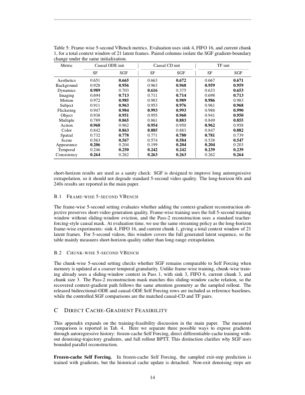

**Caption:** Frame-wise 5-second VBench metrics. Evaluation uses sink 4, FIFO 16, and current chunk 1, for a total context window of 21 latent frames. Paired columns isolate the SGF gradient-boundary change under the same initialization.

**Caption[CN]:** 逐帧 5 秒 VBench 指标。评估使用 sink 4、FIFO 16 和当前块 1，总上下文窗口为 21 个潜变量帧。成对列在相同初始化下隔离 SGF 的梯度边界变化。

## B.1 Frame-wise 5-second VBench
> <span style="color:#3B82F6"><strong>Para. B-2:</strong></span> The frame-wise 5-second setting evaluates whether adding the context-gradient reconstruction objective preserves short-video generation quality. Frame-wise training uses the full 5-second training window without sliding-window eviction, and the Pass-2 reconstruction uses a standard teacher-forcing-style causal mask. At evaluation time, we use the same streaming policy as the long-horizon frame-wise experiments: sink 4, FIFO 16, and current chunk 1, giving a total context window of 21 latent frames. For 5-second videos, this window covers the full generated latent sequence, so the table mainly measures short-horizon quality rather than long-range extrapolation.

> <span style="color:#F59E0B"><strong>Para. B-2[CN]:</strong></span> 逐帧 5 秒设置评估增加上下文梯度重建目标是否能保持短视频生成质量。逐帧训练使用完整 5 秒训练窗口，不进行滑动窗口驱逐；第二遍重建使用标准教师强制式因果掩码。评估时使用与长时域逐帧实验相同的流式策略：sink 4、FIFO 16、当前块 1，总上下文窗口为 21 个潜变量帧。对 5 秒视频而言，该窗口覆盖完整生成潜变量序列，因此该表主要衡量短时域质量而非远距离外推。

## B.2 Chunk-wise 5-second VBench
> <span style="color:#3B82F6"><strong>Para. B-3:</strong></span> The chunk-wise 5-second setting checks whether SGF remains comparable to Self Forcing when memory is updated at a coarser temporal granularity. Unlike frame-wise training, chunk-wise training already uses a sliding-window context in Pass 1, with sink 3, FIFO 6, current chunk 3, and chunk size 3. The Pass-2 reconstruction mask matches this sliding-window cache relation, so the recovered context-gradient path follows the same attention geometry as the sampled rollout. The released bidirectional-ODE and causal-ODE Self Forcing rows are included as reference baselines, while the controlled SGF comparisons are the matched causal-CD and TF pairs.

> <span style="color:#F59E0B"><strong>Para. B-3[CN]:</strong></span> 分块 5 秒设置检查当记忆以更粗的时间粒度更新时，SGF 是否仍与 Self Forcing 相当。不同于逐帧训练，分块训练在第一遍已经使用滑动窗口上下文，包括 sink 3、FIFO 6、当前块 3 和块大小 3。第二遍重建掩码匹配这一滑动窗口缓存关系，因此恢复的上下文梯度路径遵循采样滚动的同一注意力几何。已发布的双向 ODE 和因果 ODE Self Forcing 行作为参考基线，受控的 SGF 比较是匹配的因果 CD 对和 TF 对。

### Table 6. Chunk-wise 5-second VBench metrics

**Table title[CN]:** 表 6。分块 5 秒 VBench 指标。

| Metric | BiODE SF | Causal ODE SF | Causal CD SF | Causal CD SGF | TF SF | TF SGF |
|---|---:|---:|---:|---:|---:|---:|
| Aesthetics | 0.659 | 0.660 | 0.661 | 0.663 | 0.663 | 0.678 |
| Background | 0.961 | 0.959 | 0.945 | 0.958 | 0.948 | 0.964 |
| Dynamics | 0.647 | 0.836 | 0.753 | 0.875 | 0.908 | 0.692 |
| Imaging | 0.694 | 0.705 | 0.699 | 0.699 | 0.695 | 0.706 |
| Motion | 0.984 | 0.974 | 0.978 | 0.975 | 0.976 | 0.985 |
| Subject | 0.955 | 0.955 | 0.946 | 0.956 | 0.938 | 0.970 |
| Flickering | 0.991 | 0.982 | 0.979 | 0.981 | 0.978 | 0.988 |
| Object | 0.952 | 0.958 | 0.951 | 0.958 | 0.958 | 0.958 |
| Multiple | 0.863 | 0.866 | 0.844 | 0.816 | 0.852 | 0.861 |
| Action | 0.968 | 0.956 | 0.962 | 0.952 | 0.950 | 0.964 |
| Color | 0.880 | 0.879 | 0.880 | 0.890 | 0.872 | 0.875 |
| Spatial | 0.811 | 0.791 | 0.741 | 0.752 | 0.779 | 0.802 |
| Scene | 0.574 | 0.558 | 0.560 | 0.557 | 0.542 | 0.551 |
| Appearance | 0.203 | 0.205 | 0.200 | 0.199 | 0.202 | 0.203 |
| Temporal | 0.244 | 0.247 | 0.245 | 0.244 | 0.241 | 0.242 |
| Consistency | 0.268 | 0.267 | 0.265 | 0.265 | 0.266 | 0.265 |

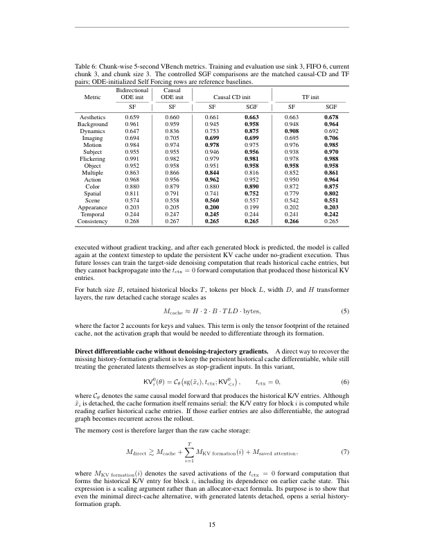

**Caption:** Chunk-wise 5-second VBench metrics. Training and evaluation use sink 3, FIFO 6, current chunk 3, and chunk size 3. The controlled SGF comparisons are the matched causal-CD and TF pairs; ODE-initialized Self Forcing rows are reference baselines.

**Caption[CN]:** 分块 5 秒 VBench 指标。训练和评估使用 sink 3、FIFO 6、当前块 3 和块大小 3。受控 SGF 比较是匹配的因果 CD 对和 TF 对；ODE 初始化的 Self Forcing 行是参考基线。

# Appendix C. Direct Cache-Gradient Feasibility
> <span style="color:#3B82F6"><strong>Para. C-1:</strong></span> This appendix expands on the training-feasibility discussion in the main paper. The measured comparison is reported in Table 4. Here we separate three possible ways to expose gradients through autoregressive history: frozen-cache Self Forcing, direct differentiable-cache training without denoising-trajectory gradients, and full rollout BPTT. This distinction clarifies why SGF uses bounded parallel reconstruction.

> <span style="color:#F59E0B"><strong>Para. C-1[CN]:</strong></span> 本附录扩展正文中的训练可行性讨论。测量比较见表 4。这里区分三种让梯度穿过自回归历史的方式：冻结缓存 Self Forcing、不包含去噪轨迹梯度的直接可微缓存训练，以及完整滚动 BPTT。该区分解释了 SGF 为什么采用有界并行重建。

> <span style="color:#3B82F6"><strong>Para. C-2:</strong></span> Frozen-cache Self Forcing. In frozen-cache Self Forcing, the sampled exit-step prediction is trained with gradients, but the historical cache update is detached. Non-exit denoising steps are executed without gradient tracking, and after each generated block is predicted, the model is called again at the context timestep to update the persistent KV cache under no-gradient execution. Thus future losses can train the target-side denoising computation that reads historical cache entries, but they cannot backpropagate into the tctx = 0 forward computation that produced those historical KV entries.

> <span style="color:#F59E0B"><strong>Para. C-2[CN]:</strong></span> 冻结缓存 Self Forcing。在冻结缓存 Self Forcing 中，采样退出步预测带梯度训练，但历史缓存更新被脱离梯度。非退出去噪步不跟踪梯度；每个生成块预测后，模型再次在上下文时间步调用，在无梯度执行下更新持久 KV 缓存。因此，未来损失可以训练读取历史缓存条目的目标侧去噪计算，却不能反向传播到产生这些历史 KV 条目的 $t_{ctx}=0$ 前向计算。

$$M_{cache}\approx H\cdot2\cdot B\cdot TLD\cdot\text{bytes}.\tag{5}$$

> <span style="color:#3B82F6"><strong>Para. C-3:</strong></span> For batch size B, retained historical blocks T, tokens per block L, width D, and H transformer layers, the raw detached cache storage scales as Eq. (5), where the factor 2 accounts for keys and values. This term is only the tensor footprint of the retained cache, not the activation graph that would be needed to differentiate through its formation.

> <span style="color:#F59E0B"><strong>Para. C-3[CN]:</strong></span> 对于批大小 $B$、保留历史块数 $T$、每块 token 数 $L$、宽度 $D$ 和 $H$ 个 Transformer 层，原始脱离梯度缓存存储按式（5）缩放，其中因子 2 对应键和值。该项只是保留缓存的张量占用，不包括对缓存形成求导所需的激活图。

> <span style="color:#3B82F6"><strong>Para. C-4:</strong></span> Direct differentiable cache without denoising-trajectory gradients. A direct way to recover the missing history-formation gradient is to keep the persistent historical cache differentiable, while still treating the generated latents themselves as stop-gradient inputs. In this variant, KV0_i(θ) = Cθ(sg(x̃_i), tctx; KV0_<i), tctx = 0. Although x̃_i is detached, the cache formation itself remains serial: the K/V entry for block i is computed while reading earlier historical cache entries. If those earlier entries are also differentiable, the autograd graph becomes recurrent across the rollout.

> <span style="color:#F59E0B"><strong>Para. C-4[CN]:</strong></span> 不含去噪轨迹梯度的直接可微缓存。恢复缺失历史形成梯度的一种直接方式是保持持久历史缓存可微，同时仍将生成潜变量本身视为停止梯度输入。在该变体中，$\mathrm{KV}^{0}_{i}(	heta)=C_	heta(\mathrm{sg}(	ilde{x}_i),t_{ctx};\mathrm{KV}^{0}_{<i})$，且 $t_{ctx}=0$。尽管 $	ilde{x}_i$ 已脱离梯度，缓存形成仍是串行的：块 i 的 K/V 条目在读取更早历史缓存条目的同时计算。如果更早条目也可微，自动微分图就会在滚动过程中递归。

$$M_{direct}\gtrsim M_{cache}+\sum_{i=1}^{T}M_{KV\ formation}(i)+M_{saved\ attention}.\tag{7}$$

> <span style="color:#3B82F6"><strong>Para. C-5:</strong></span> The memory cost is therefore larger than raw cache storage: M_direct ≳ M_cache + Σ_i M_KV formation(i) + M_saved attention. Here M_KV formation(i) denotes saved activations of the tctx = 0 forward computation that forms the historical K/V entry for block i, including its dependence on earlier cache state. This is a scaling argument rather than an allocator-exact formula; its purpose is to show that even the minimal direct-cache alternative with generated latents detached opens a serial history-formation graph.

> <span style="color:#F59E0B"><strong>Para. C-5[CN]:</strong></span> 因此，内存成本大于原始缓存存储：$M_{direct}\gtrsim M_{cache}+\sum_i M_{KV\ formation}(i)+M_{saved\ attention}$。其中 $M_{KV\ formation}(i)$ 表示形成块 i 历史 K/V 条目的 $t_{ctx}=0$ 前向计算所保存的激活，包括其对早先缓存状态的依赖。这是缩放论证而非精确的分配器公式；其目的在于说明，即使在生成潜变量脱离梯度的最小直接缓存替代方案中，也会打开串行历史形成图。

> <span style="color:#3B82F6"><strong>Para. C-6:</strong></span> Full rollout BPTT. A still stronger alternative is full rollout BPTT, where the generated latents are not detached. Then the historical K/V entry for block i depends not only on the tctx = 0 K/V-forming forward, but also on the denoising trajectory that produced x̃_i. The memory cost further includes the saved activations of the denoising steps:

> <span style="color:#F59E0B"><strong>Para. C-6[CN]:</strong></span> 完整滚动 BPTT。更强的替代方案是完整滚动 BPTT，其中生成潜变量不脱离梯度。此时，块 i 的历史 K/V 条目不仅依赖 $t_{ctx}=0$ 的 K/V 形成前向，还依赖产生 $	ilde{x}_i$ 的去噪轨迹。内存成本还要包含去噪步骤的保存激活：

$$M_{full\text{-}BPTT}\gtrsim M_{direct}+\sum_{i=1}^{T}\sum_{s=1}^{K_i}M_{denoise}(i,s).\tag{8}$$

> <span style="color:#3B82F6"><strong>Para. C-7:</strong></span> where K_i is the number of denoising steps used for block i, and M_denoise(i,s) denotes the activation footprint of the generator forward at denoising step s. Full rollout BPTT therefore grows across both rollout length and denoising depth, making it strictly more demanding than the direct differentiable-cache variant above.

> <span style="color:#F59E0B"><strong>Para. C-7[CN]:</strong></span> 其中 $K_i$ 是块 i 使用的去噪步数，$M_{denoise}(i,s)$ 表示去噪步 s 的生成器前向激活占用。因此，完整滚动 BPTT 同时随滚动长度和去噪深度增长，严格来说比上述直接可微缓存变体要求更高。

> <span style="color:#3B82F6"><strong>Para. C-8:</strong></span> SGF bounded reconstruction. SGF avoids retaining either serial graph. Pass 1 performs the true autoregressive rollout under no-gradient execution and records the self-generated context latents X̃_ctx together with the sampled noisy exit states Z⋆_t. Pass 2 discards the persistent rollout cache and performs one bounded parallel reconstruction: M_SGF ≈ M_pass1 cache data + M_records(X̃_ctx, Z⋆_t) + M_parallel window(N), where N is the fixed reconstruction-window length. The recovered gradient passes through the context-side forward at tctx = 0, the K/V projections, and the future-to-context attention relation in Pass 2. It does not backpropagate through the denoising trajectory that produced the recorded latents, nor through the serial persistent-cache updates from Pass 1.

> <span style="color:#F59E0B"><strong>Para. C-8[CN]:</strong></span> SGF 的有界重建。SGF 避免保留上述任一串行图。第一遍在无梯度执行下进行真实自回归滚动，并记录自生成上下文潜变量 $	ilde{X}_{ctx}$ 以及采样噪声退出状态 $Z^\star_t$。第二遍丢弃持久滚动缓存，并执行一次有界并行重建：$M_{SGF}pprox M_{pass1\ cache\ data}+M_{records}(	ilde{X}_{ctx},Z^\star_t)+M_{parallel\ window}(N)$，其中 $N$ 是固定重建窗口长度。恢复的梯度穿过第二遍的 $t_{ctx}=0$ 上下文侧前向、K/V 投影及未来到上下文注意力关系，但不穿过产生记录潜变量的去噪轨迹，也不穿过第一遍的串行持久缓存更新。

$$M_{SGF}<M_{direct}<M_{full\text{-}BPTT}.\tag{10}$$

> <span style="color:#3B82F6"><strong>Para. C-9:</strong></span> Interpretation. The middle term refers to direct differentiable-cache training with stop-gradient generated latents, not the frozen-cache Self Forcing baseline. Frozen-cache Self Forcing can be cheaper because it leaves the historical K/V formation path detached, but that is exactly the missing gradient SGF is designed to recover. The measured results in Table 4 are consistent with this picture: direct differentiable-cache training runs out of memory in our setting, while SGF restores the context-gradient path through a bounded exit-step replay.

> <span style="color:#F59E0B"><strong>Para. C-9[CN]:</strong></span> 解释。中间项指生成潜变量停止梯度的直接可微缓存训练，而不是冻结缓存 Self Forcing 基线。冻结缓存 Self Forcing 可能更便宜，因为它让历史 K/V 形成路径脱离梯度，但这正是 SGF 设计用于恢复的缺失梯度。表 4 的测量结果与这一图景一致：在我们的设置中，直接可微缓存训练耗尽内存，而 SGF 通过有界的退出步重放恢复上下文梯度路径。

# Appendix D. Two-pass Recovery Fidelity
> <span style="color:#3B82F6"><strong>Para. D-1:</strong></span> SGF relies on Pass 2 being a faithful replay of the sampled exit computation from Pass 1. This appendix verifies that assumption at the forward level. The goal is not to claim equivalence to full rollout BPTT, but to check that the parallel reconstruction reproduces the same local causal relation as the serial no-gradient rollout, up to the numerical differences expected from mixed-precision execution.

> <span style="color:#F59E0B"><strong>Para. D-1[CN]:</strong></span> SGF 依赖第二遍忠实重放第一遍的采样退出计算。本附录在前向层面验证这一假设。目标不是声称它等价于完整滚动 BPTT，而是检查并行重建是否复现与串行无梯度滚动相同的局部因果关系，允许混合精度执行预期的数值差异。

> <span style="color:#3B82F6"><strong>Para. D-2:</strong></span> Protocol. We evaluate recovery fidelity on 24 prompts and four exit steps, t⋆ ∈ {1000, 750, 500, 250}, giving 96 prompt/exit comparisons. For each comparison, Pass 1 performs the serial self-rollout under no-gradient execution and records the sampled noisy input together with the corresponding exit-step prediction. Pass 2 then performs one parallel reconstruction using the recorded noisy states and detached self-generated context under the matched teacher-forcing attention mask. We compare the Pass-1 and Pass-2 latent predictions before VAE decoding.

> <span style="color:#F59E0B"><strong>Para. D-2[CN]:</strong></span> 协议。我们在 24 个提示词和四个退出步 $t^\star\in\{1000,750,500,250\}$ 上评估恢复保真度，共 96 个提示词/退出步比较。每次比较中，第一遍在无梯度执行下进行串行自滚动，并记录采样噪声输入及相应退出步预测。随后第二遍在匹配的教师强制注意力掩码下，使用记录的噪声状态和脱离梯度的自生成上下文进行一次并行重建。我们在 VAE 解码前比较第一遍和第二遍的潜变量预测。

> <span style="color:#3B82F6"><strong>Para. D-3:</strong></span> Metrics. Let x^(1) denote the Pass-1 exit prediction and x^(2) denote the corresponding Pass-2 reconstruction. We report mean squared error, root mean squared error, mean absolute error, maximum absolute error, relative ℓ2 error, and cosine similarity:

> <span style="color:#F59E0B"><strong>Para. D-3[CN]:</strong></span> 指标。令 $x^{(1)}$ 表示第一遍退出预测，$x^{(2)}$ 表示对应的第二遍重建。我们报告均方误差、均方根误差、平均绝对误差、最大绝对误差、相对 $\ell_2$ 误差和余弦相似度：

$$\mathrm{RMSE}=\sqrt{\mathrm{mean}(x^{(2)}-x^{(1)})^2}.\tag{11}$$

$$\mathrm{RelL2}=\frac{\lVert x^{(2)}-x^{(1)}\rVert_2}{\max(\lVert x^{(1)}\rVert_2,10^{-12})}.\tag{12}$$

$$\mathrm{Cosine}=\frac{\langle x^{(1)},x^{(2)}\rangle}{\lVert x^{(1)}\rVert_2\lVert x^{(2)}\rVert_2}.\tag{13}$$

### Table 7. Pass-1 versus Pass-2 latent recovery fidelity

**Table title[CN]:** 表 7。第一遍与第二遍潜变量恢复保真度。

| Exit step | # comparisons | MSE | RMSE | Mean abs. | Max abs. | Rel. L2 | Rel. L2 / ε_bf16 | Cosine |
|---:|---:|---:|---:|---:|---:|---:|---:|---:|
| 1000 | 24 | 3.123e-4 | 0.01745 | 0.01093 | 0.58396 | 0.02133 | 2.73 | 0.999766 |
| 750 | 24 | 2.148e-4 | 0.01449 | 0.00884 | 0.58189 | 0.01566 | 2.00 | 0.999874 |
| 500 | 24 | 1.141e-4 | 0.01064 | 0.00693 | 0.49110 | 0.01125 | 1.44 | 0.999936 |
| 250 | 24 | 6.041e-5 | 0.00774 | 0.00535 | 0.29028 | 0.00812 | 1.04 | 0.999967 |
| Overall | 96 | 1.754e-4 | 0.01258 | 0.00801 | 0.48681 | 0.01409 | 1.80 | 0.999886 |

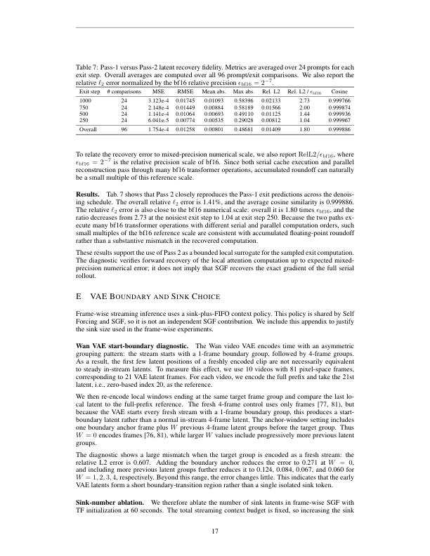

**Caption:** Pass-1 versus Pass-2 latent recovery fidelity. Metrics are averaged over 24 prompts for each exit step. Overall averages are computed over all 96 prompt/exit comparisons. We also report the relative ℓ2 error normalized by the bf16 relative precision ε_bf16 = 2−7.

**Caption[CN]:** 第一遍与第二遍潜变量恢复保真度。每个退出步的指标在 24 个提示词上取平均。总体平均值在全部 96 个提示词/退出步比较上计算。我们还报告按 bf16 相对精度 ε_bf16 = 2−7 归一化的相对 ℓ2 误差。

> <span style="color:#3B82F6"><strong>Para. D-4:</strong></span> To relate the recovery error to mixed-precision numerical scale, we also report RelL2/ε_bf16, where ε_bf16 = 2−7 is the relative precision scale of bf16. Since both serial cache execution and parallel reconstruction pass through many bf16 transformer operations, accumulated roundoff can naturally be a small multiple of this reference scale.

> <span style="color:#F59E0B"><strong>Para. D-4[CN]:</strong></span> 为将恢复误差与混合精度数值尺度联系起来，我们还报告 $RelL2/\epsilon_{bf16}$，其中 $\epsilon_{bf16}=2^{-7}$ 是 bf16 的相对精度尺度。由于串行缓存执行和并行重建都要经过许多 bf16 Transformer 运算，累积舍入误差自然可能是该参考尺度的小倍数。

> <span style="color:#3B82F6"><strong>Para. D-5:</strong></span> Results. Table 7 shows that Pass 2 closely reproduces the Pass-1 exit predictions across the denoising schedule. The overall relative ℓ2 error is 1.41%, and the average cosine similarity is 0.999886. The relative ℓ2 error is also close to the bf16 numerical scale: overall it is 1.80 times ε_bf16, and the ratio decreases from 2.73 at the noisiest exit step to 1.04 at exit step 250. Because the two paths execute many bf16 transformer operations with different serial and parallel computation orders, such small multiples of the bf16 reference scale are consistent with accumulated floating-point roundoff rather than a substantive mismatch in the recovered computation. These results support the use of Pass 2 as a bounded local surrogate for the sampled exit computation. The diagnostic verifies forward recovery of the local attention computation up to expected mixed-precision numerical error; it does not imply that SGF recovers the exact gradient of the full serial rollout.

> <span style="color:#F59E0B"><strong>Para. D-5[CN]:</strong></span> 结果。表 7 表明第二遍在整个去噪调度上都能紧密复现第一遍退出预测。总体相对 ℓ2 误差为 1.41%，平均余弦相似度为 0.999886。相对 ℓ2 误差也接近 bf16 数值尺度：总体为 $\epsilon_{bf16}$ 的 1.80 倍，比例从最噪退出步的 2.73 降至退出步 250 的 1.04。由于两条路径经过许多 bf16 Transformer 运算，且串行与并行计算顺序不同，这种 bf16 参考尺度的小倍数更符合累积浮点舍入，而不是恢复计算存在实质不匹配。这些结果支持将第二遍用作采样退出计算的有界局部替代。该诊断验证了局部注意力计算在预期混合精度数值误差内的前向恢复；它并不意味着 SGF 恢复了完整串行滚动的精确梯度。

### Figure 4. Decoded Pass-1 and Pass-2 recovery comparison


**Caption:** Decoded Pass-1 and Pass-2 recovery comparison. Rows show paired decoded outputs from Pass 1 and Pass 2 at exit steps 1000, 750, 500, and 250. The decoded pairs are visually nearly indistinguishable, matching the latent-space recovery results in Table 7.

**Caption[CN]:** 第一遍与第二遍解码恢复对比。各行展示退出步 1000、750、500 和 250 的第一遍与第二遍解码输出对。解码对在视觉上几乎不可区分，与表 7 的潜空间恢复结果一致。

# Appendix E. VAE Boundary and Sink Choice
> <span style="color:#3B82F6"><strong>Para. E-1:</strong></span> Frame-wise streaming inference uses a sink-plus-FIFO context policy. This policy is shared by Self Forcing and SGF, so it is not an independent SGF contribution. We include this appendix to justify the sink size used in the frame-wise experiments.

> <span style="color:#F59E0B"><strong>Para. E-1[CN]:</strong></span> 逐帧流式推理使用汇聚加 FIFO 上下文策略。Self Forcing 和 SGF 共享该策略，因此它不是独立的 SGF 贡献。我们加入本附录以论证逐帧实验所用的汇聚大小。

> <span style="color:#3B82F6"><strong>Para. E-2:</strong></span> Wan VAE start-boundary diagnostic. The Wan video VAE encodes time with an asymmetric grouping pattern: the stream starts with a 1-frame boundary group, followed by 4-frame groups. As a result, the first few latent positions of a freshly encoded clip are not necessarily equivalent to steady in-stream latents. To measure this effect, we use 10 videos with 81 pixel-space frames, corresponding to 21 VAE latent frames. For each video, we encode the full prefix and take the 21st latent, i.e., zero-based index 20, as the reference.

> <span style="color:#F59E0B"><strong>Para. E-2[CN]:</strong></span> Wan VAE 起始边界诊断。Wan 视频 VAE 使用非对称分组模式编码时间：流以一个 1 帧边界组开始，随后是 4 帧组。因此，新鲜编码片段的前几个潜变量位置不一定等价于稳定流内潜变量。为测量这一效应，我们使用 10 个包含 81 个像素空间帧的视频，对应 21 个 VAE 潜变量帧。对每个视频，我们编码完整前缀，并取第 21 个潜变量（即从零开始的索引 20）作为参考。

> <span style="color:#3B82F6"><strong>Para. E-3:</strong></span> We then re-encode local windows ending at the same target frame group and compare the last local latent to the full-prefix reference. The fresh 4-frame control uses only frames [77, 81), but because the VAE starts every fresh stream with a 1-frame boundary group, this produces a start-boundary latent rather than a normal in-stream 4-frame latent. The anchor-window setting includes one boundary anchor frame plus W previous 4-frame latent groups before the target group. Thus W = 0 encodes frames [76, 81), while larger W values include progressively more previous latent groups.

> <span style="color:#F59E0B"><strong>Para. E-3[CN]:</strong></span> 随后，我们重新编码以同一目标帧组结束的局部窗口，并将最后一个局部潜变量与完整前缀参考进行比较。新鲜 4 帧控制只使用帧 [77, 81)，但由于 VAE 每个新流都以 1 帧边界组开始，它产生的是起始边界潜变量，而不是普通的流内 4 帧潜变量。锚点窗口设置在目标组之前包含一个边界锚点帧和 W 个此前的 4 帧潜变量组。因此，W = 0 编码帧 [76, 81)，更大的 W 逐步纳入更多此前潜变量组。

> <span style="color:#3B82F6"><strong>Para. E-4:</strong></span> The diagnostic shows a large mismatch when the target group is encoded as a fresh stream: the relative L2 error is 0.607. Adding the boundary anchor reduces the error to 0.271 at W = 0, and including more previous latent groups further reduces it to 0.124, 0.084, 0.067, and 0.060 for W = 1, 2, 3, 4, respectively. Beyond this range, the error changes little. This indicates that the early VAE latents form a short boundary-transition region rather than a single isolated sink token.

> <span style="color:#F59E0B"><strong>Para. E-4[CN]:</strong></span> 诊断显示，当目标组作为新流编码时存在较大不匹配：相对 L2 误差为 0.607。加入边界锚点后，W = 0 时误差降至 0.271；加入更多此前潜变量组后，W = 1、2、3、4 时误差进一步降至 0.124、0.084、0.067 和 0.060。超过这一范围后误差变化很小。这表明 VAE 早期潜变量构成一个短的边界过渡区域，而非单个孤立汇聚 token。

> <span style="color:#3B82F6"><strong>Para. E-5:</strong></span> Sink-number ablation. We therefore ablate the number of sink latents in frame-wise SGF with TF initialization at 60 seconds. The total streaming context budget is fixed, so increasing the sink size preserves more prefix latents but leaves fewer slots for recent FIFO context. The relevant trend is therefore not strict monotonic improvement, but whether a small sink can cover the VAE boundary region without unnecessarily reducing the recent-context budget. Table 8 shows that sink 1 is weaker on aesthetic quality and flickering, while sink 4 reaches the stable range suggested by the VAE boundary diagnostic. Sink 8 gives only marginal additional gains on some metrics and consumes more of the fixed context budget. We therefore use sink 4 in the frame-wise long-horizon experiments as the smallest sink size that covers the observed boundary-transition prefix.

> <span style="color:#F59E0B"><strong>Para. E-5[CN]:</strong></span> 汇聚数量消融。因此，我们在 TF 初始化的逐帧 SGF 60 秒设置中消融汇聚潜变量数量。总流式上下文预算固定，所以增大汇聚大小会保留更多前缀潜变量，却给近期 FIFO 上下文留下更少槽位。因此，相关趋势不是严格单调改善，而是一个小汇聚是否能覆盖 VAE 边界区域，同时不过度减少近期上下文预算。表 8 显示 sink 1 在审美质量和闪烁度上较弱，而 sink 4 达到 VAE 边界诊断所建议的稳定范围。sink 8 在部分指标上只有边际额外增益，却消耗更多固定上下文预算。因此，在逐帧长时域实验中我们使用 sink 4，将其作为覆盖观测边界过渡前缀的最小汇聚大小。

### Table 8. Sink ablation in frame-wise SGF

**Table title[CN]:** 表 8。逐帧 SGF 的汇聚消融。

| Metric | Sink 1 | Sink 2 | Sink 4 | Sink 8 |
|---|---:|---:|---:|---:|
| Aesthetics | 0.627 | 0.645 | 0.653 | 0.655 |
| Background | 0.970 | 0.974 | 0.974 | 0.976 |
| Dynamics | 0.743 | 0.733 | 0.730 | 0.728 |
| Imaging | 0.715 | 0.713 | 0.714 | 0.714 |
| Motion | 0.982 | 0.982 | 0.982 | 0.983 |
| Subject | 0.983 | 0.982 | 0.983 | 0.983 |
| Flickering | 0.990 | 0.990 | 0.991 | 0.992 |

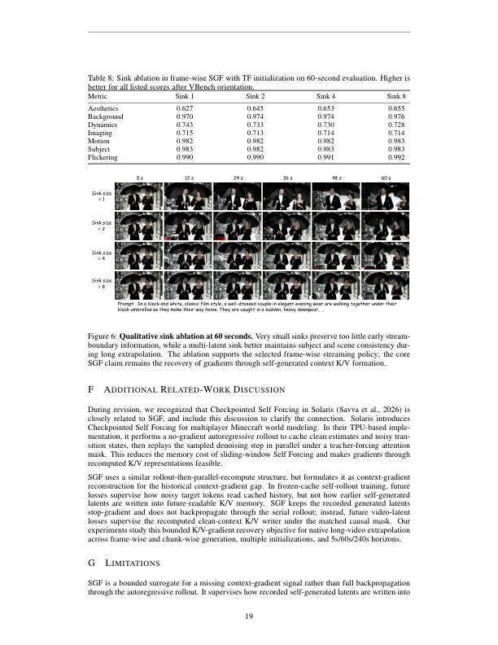

**Caption:** Sink ablation in frame-wise SGF with TF initialization on 60-second evaluation. Higher is better for all listed scores after VBench orientation.

**Caption[CN]:** TF 初始化下逐帧 SGF 在 60 秒评估中的汇聚消融。经过 VBench 方向统一后，所有列出的分数均为越高越好。

### Figure 5. VAE boundary and sink-latent choice

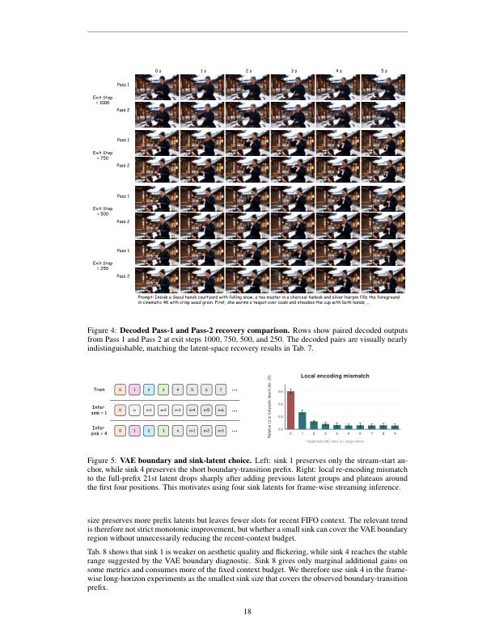

**Caption:** VAE boundary and sink-latent choice. Left: sink 1 preserves only the stream-start anchor, while sink 4 preserves the short boundary-transition prefix. Right: local re-encoding mismatch to the full-prefix 21st latent drops sharply after adding previous latent groups and plateaus around the first four positions. This motivates using four sink latents for frame-wise streaming inference.

**Caption[CN]:** VAE 边界与汇聚潜变量选择。左：sink 1 只保留流起始锚点，而 sink 4 保留短边界过渡前缀。右：加入此前潜变量组后，局部重编码与完整前缀第 21 个潜变量的失配快速下降，并在前四个位置附近趋于平稳。这支持逐帧流式推理使用四个汇聚潜变量。

# Appendix F. Additional Related-Work Discussion
> <span style="color:#3B82F6"><strong>Para. F-1:</strong></span> During revision, we recognized that Checkpointed Self Forcing in Solaris (Savva et al., 2026) is closely related to SGF, and include this discussion to clarify the connection. Solaris introduces Checkpointed Self Forcing for multiplayer Minecraft world modeling. In their TPU-based implementation, it performs a no-gradient autoregressive rollout to cache clean estimates and noisy transition states, then replays the sampled denoising step in parallel under a teacher-forcing attention mask. This reduces the memory cost of sliding-window Self Forcing and makes gradients through recomputed K/V representations feasible.

> <span style="color:#F59E0B"><strong>Para. F-1[CN]:</strong></span> 在修订过程中，我们认识到 Solaris（Savva 等，2026）中的 Checkpointed Self Forcing 与 SGF 密切相关，因此加入本讨论以澄清联系。Solaris 为多人 Minecraft 世界建模提出 Checkpointed Self Forcing。在其基于 TPU 的实现中，方法先执行无梯度自回归滚动以缓存干净估计和噪声转移状态，然后在教师强制注意力掩码下并行重放采样的去噪步。这降低了滑动窗口 Self Forcing 的内存成本，并使穿过重新计算的 K/V 表示的梯度成为可能。

> <span style="color:#3B82F6"><strong>Para. F-2:</strong></span> SGF uses a similar rollout-then-parallel-recompute structure, but formulates it as context-gradient reconstruction for the historical context-gradient gap. In frozen-cache self-rollout training, future losses supervise how noisy target tokens read cached history, but not how earlier self-generated latents are written into future-readable K/V memory. SGF keeps the recorded generated latents stop-gradient and does not backpropagate through the serial rollout; instead, future video-latent losses supervise the recomputed clean-context K/V writer under the matched causal mask. Our experiments study this bounded K/V-gradient recovery objective for native long-video extrapolation across frame-wise and chunk-wise generation, multiple initializations, and 5s/60s/240s horizons.

> <span style="color:#F59E0B"><strong>Para. F-2[CN]:</strong></span> SGF 使用类似的“滚动后并行重计算”结构，但将其表述为针对历史上下文梯度缺口的上下文梯度重建。在冻结缓存自滚动训练中，未来损失监督噪声目标 token 如何读取缓存历史，却不监督更早的自生成潜变量如何写入未来可读的 K/V 记忆。SGF 保持记录的生成潜变量停止梯度，不通过串行滚动反向传播；相反，未来视频潜变量损失在匹配的因果掩码下监督重新计算的干净上下文 K/V 写入器。我们的实验在逐帧和分块生成、多种初始化以及 5s/60s/240s 时域上研究这一有界 K/V 梯度恢复目标，以实现原生长视频外推。

# Appendix G. Limitations
> <span style="color:#3B82F6"><strong>Para. G-1:</strong></span> SGF is a bounded surrogate for a missing context-gradient signal rather than full backpropagation through the autoregressive rollout. It supervises how recorded self-generated latents are written into future-readable memory, but it does not update the sampled latents themselves through future losses, nor does it optimize the sequence of denoising decisions that produced them. We therefore do not claim to recover the exact gradient of the full serial rollout.

> <span style="color:#F59E0B"><strong>Para. G-1[CN]:</strong></span> SGF 是缺失上下文梯度信号的有界替代，而不是穿过自回归滚动的完整反向传播。它监督记录的自生成潜变量如何写入未来可读记忆，但不会通过未来损失更新采样潜变量本身，也不优化产生它们的去噪决策序列。因此，我们不声称恢复了完整串行滚动的精确梯度。

> <span style="color:#3B82F6"><strong>Para. G-2:</strong></span> SGF also assumes that the parallel Pass-2 reconstruction faithfully reproduces the serial context relation at the sampled exit step. If the teacher-forcing mask, sink positions, FIFO window, RoPE handling, context timestep, or chunk alignment deviates from inference, SGF may recover gradients for the wrong attention relation and thus train a different writer. This alignment is especially important at the clean context timestep, precisely because that cache-writing call is shared with, but not directly supervised by, the noisy exit-step losses in frozen-cache training.

> <span style="color:#F59E0B"><strong>Para. G-2[CN]:</strong></span> SGF 还假设并行第二遍重建能够忠实复现采样退出步的串行上下文关系。如果教师强制掩码、汇聚位置、FIFO 窗口、RoPE 处理、上下文时间步或块对齐偏离推理，SGF 可能为错误的注意力关系恢复梯度，从而训练出不同的写入器。这种对齐在干净上下文时间步尤其重要，正因为该缓存写入调用与噪声退出步损失共享参数，却没有在冻结缓存训练中获得直接监督。

> <span style="color:#3B82F6"><strong>Para. G-3:</strong></span> Finally, SGF is not a replacement for other long-video techniques. Streaming long-rollout tuning, retrieval-augmented memory, sparse attention, stronger causal initialization, and long-context teachers all target complementary parts of the system. Our claim is narrower: self-rollout training uses generated history as context but leaves a specific history-formation gradient unused, and SGF offers a practical way to recover it. A natural next step is to combine SGF with long-rollout exposure or retrieval, so that the model both writes better short-window memory and can access richer long-range context.

> <span style="color:#F59E0B"><strong>Para. G-3[CN]:</strong></span> 最后，SGF 不是其他长视频技术的替代品。流式长滚动调优、检索增强记忆、稀疏注意力、更强的因果初始化和长上下文教师都针对系统的互补部分。我们的主张更为有限：自滚动训练使用生成历史作为上下文，却留下特定的历史形成梯度未被使用；SGF 提供了恢复该梯度的实用方式。自然的下一步是将 SGF 与长滚动暴露或检索结合，使模型既能写入更好的短窗口记忆，也能访问更丰富的长距离上下文。

# Appendix H. Additional Qualitative Results
> <span style="color:#3B82F6"><strong>Para. H-1:</strong></span> This appendix provides additional long-horizon qualitative comparisons for the frame-wise and chunk-wise experiments. The strips are intended to complement the quantitative tables by showing the temporal failure modes behind the aggregate scores. Each comparison should be read within a matched setting: Self Forcing and SGF use the same prompt, seed, initialization, horizon, sampling configuration, and inference context geometry. We focus on memory-related drift, including view changes, crop drift, scene replacement, subject identity changes, object disappearance, and collapse into unrelated textures.

> <span style="color:#F59E0B"><strong>Para. H-1[CN]:</strong></span> 本附录为逐帧和分块实验提供额外长时域定性对比。条带旨在补充定量表，展示聚合分数背后的时间失败模式。每个比较都应在匹配设置内阅读：Self Forcing 与 SGF 使用相同提示词、随机种子、初始化、时域、采样配置和推理上下文几何。我们聚焦与记忆有关的漂移，包括视角变化、裁剪漂移、场景替换、主体身份变化、物体消失以及塌缩为无关纹理。

## H.1 Frame-wise Comparisons
> <span style="color:#3B82F6"><strong>Para. H-2:</strong></span> Frame-wise generation writes each generated latent frame back into the historical context, so errors in historical K/V formation can accumulate at the finest temporal granularity. Across TF, causal CD, and causal ODE initializations, Self Forcing often remains locally plausible in early frames but gradually changes the subject, camera distance, object layout, or background. Under weaker initializations, the drift can become severe, producing cropped fragments, color blocks, or unrelated scene textures. SGF consistently reduces these failure modes: it better preserves the subject-scene relation, camera framing, and object layout over both 60-second and 240-second rollouts.

> <span style="color:#F59E0B"><strong>Para. H-2[CN]:</strong></span> 逐帧生成将每个生成的潜变量帧写回历史上下文，因此历史 K/V 形成中的误差能以最细的时间粒度积累。在 TF、因果 CD 和因果 ODE 初始化下，Self Forcing 通常在早期帧局部合理，却逐渐改变主体、相机距离、物体布局或背景。在较弱初始化下，漂移可能变得严重，产生裁剪碎片、色块或无关场景纹理。SGF 持续减少这些失败模式：在 60 秒和 240 秒滚动中更好保持主体—场景关系、相机取景和物体布局。

### Figure 7. Frame-wise 60-second comparison under TF initialization

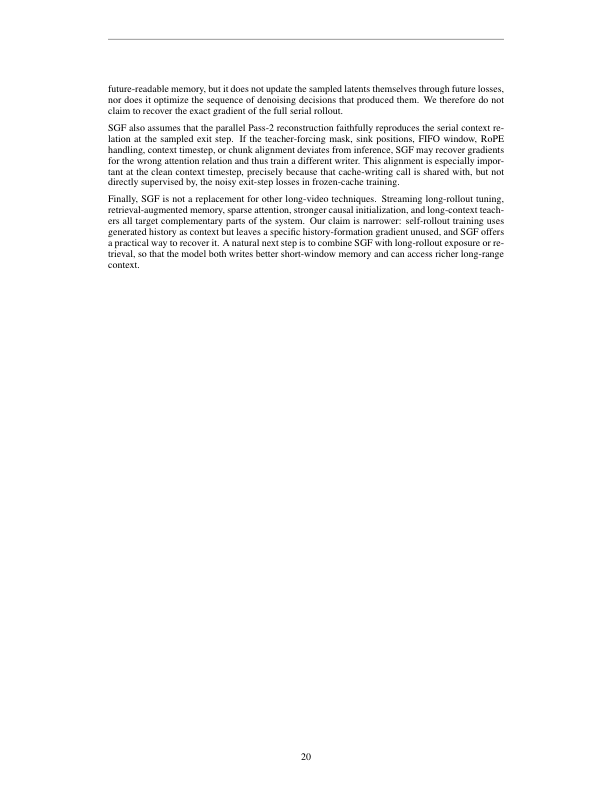

**Caption:** Frame-wise 60-second comparison under TF initialization. In the car-and-motorcycle prompt, both methods remain plausible, but SGF keeps the car position, road geometry, and motorcycle relation more fixed. In the squatting-person prompt, Self Forcing changes the subject pose, identity, and framing over time, whereas SGF maintains a consistent squatting action and park background.

**Caption[CN]:** TF 初始化下逐帧 60 秒对比。在汽车与摩托车提示词中，两种方法都保持合理，但 SGF 更固定汽车位置、道路几何和摩托车关系。在公园蹲姿人物提示词中，Self Forcing 随时间改变主体姿态、身份和取景，而 SGF 保持一致的蹲姿动作和公园背景。

### Figure 8. Frame-wise 60-second comparison under causal CD initialization

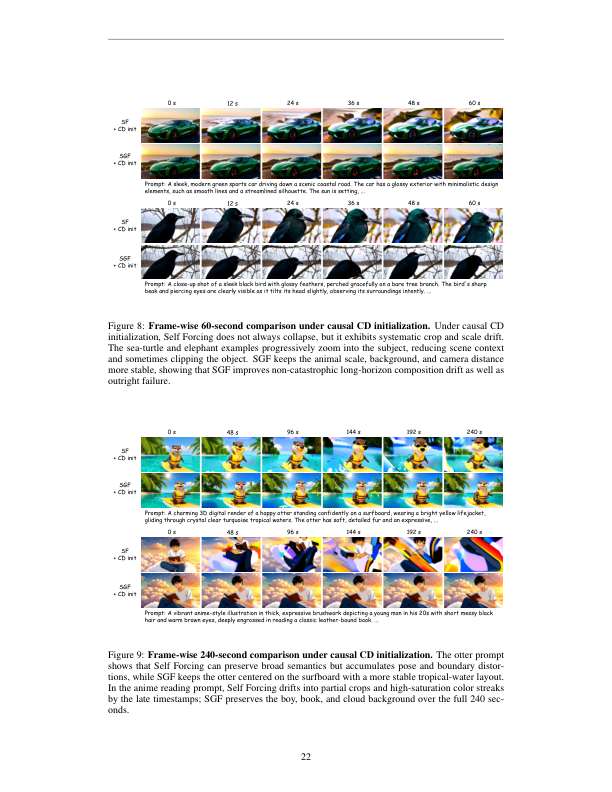

**Caption:** Frame-wise 60-second comparison under causal CD initialization. Under causal CD initialization, Self Forcing does not always collapse, but it exhibits systematic crop and scale drift. The sea-turtle and elephant examples progressively zoom into the subject, reducing scene context and sometimes clipping the object. SGF keeps the animal scale, background, and camera distance more stable, showing that SGF improves non-catastrophic long-horizon composition drift as well as outright failure.

**Caption[CN]:** 因果 CD 初始化下逐帧 60 秒对比。在因果 CD 初始化下，Self Forcing 并不总是崩溃，但会出现系统性的裁剪和尺度漂移。海龟与大象示例逐渐放大主体，减少场景上下文，有时还裁掉物体。SGF 更稳定地保持动物尺度、背景和相机距离，说明它既改善非灾难性的长时域构图漂移，也改善彻底失败。

### Figure 9. Frame-wise 240-second comparison under causal CD initialization

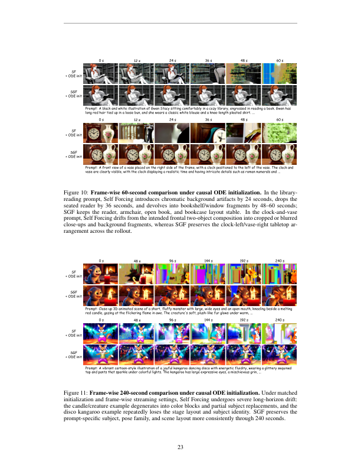

**Caption:** Frame-wise 240-second comparison under causal CD initialization. The otter prompt shows that Self Forcing can preserve broad semantics but accumulates pose and boundary distortions, while SGF keeps the otter centered on the surfboard with a more stable tropical-water layout. In the anime reading prompt, Self Forcing drifts into partial crops and high-saturation color streaks by the late timestamps; SGF preserves the boy, book, and cloud background over the full 240 seconds.

**Caption[CN]:** 因果 CD 初始化下逐帧 240 秒对比。水獭提示词表明 Self Forcing 可以保留大致语义，却积累姿态和边界变形；SGF 让水獭保持在冲浪板中央，并使热带水域布局更稳定。在动漫阅读提示词中，Self Forcing 到后期漂移为局部裁剪和高饱和色带；SGF 在完整 240 秒内保留男孩、书和云朵背景。

### Figure 10. Frame-wise 60-second comparison under causal ODE initialization

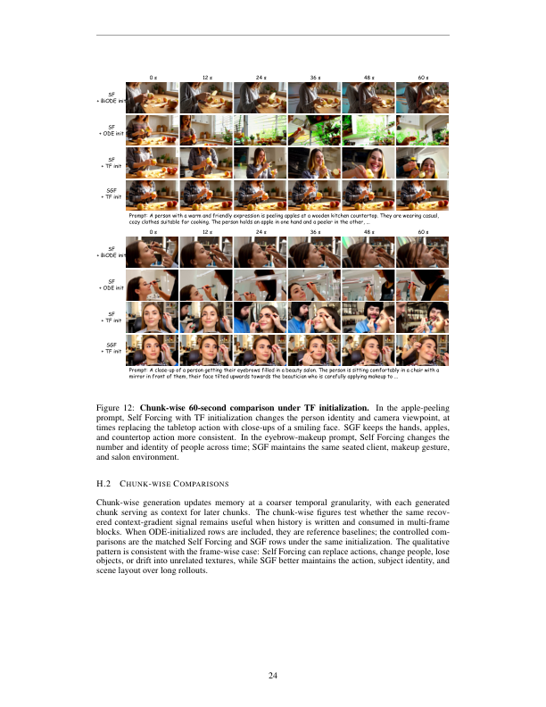

**Caption:** Frame-wise 60-second comparison under causal ODE initialization. In the library-reading prompt, Self Forcing introduces chromatic background artifacts by 24 seconds, drops the seated reader by 36 seconds, and devolves into bookshelf/window fragments by 48–60 seconds; SGF keeps the reader, armchair, open book, and bookcase layout stable. In the clock-and-vase prompt, Self Forcing drifts from the intended frontal two-object composition into cropped or blurred close-ups and background fragments, whereas SGF preserves the clock-left/vase-right tabletop arrangement across the rollout.

**Caption[CN]:** 因果 ODE 初始化下逐帧 60 秒对比。在图书馆阅读提示词中，Self Forcing 到 24 秒引入彩色背景伪影，36 秒丢失坐着的读者，48–60 秒退化为书架/窗户碎片；SGF 保持读者、扶手椅、打开的书和书柜布局稳定。在时钟与花瓶提示词中，Self Forcing 从预期的正面双物体构图漂移为裁剪或模糊特写及背景碎片，而 SGF 在滚动中保留时钟在左、花瓶在右的桌面布局。

### Figure 11. Frame-wise 240-second comparison under causal ODE initialization

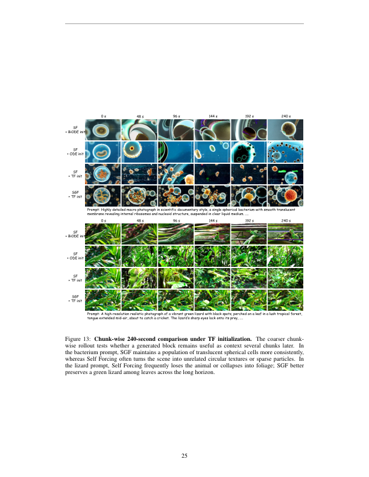

**Caption:** Frame-wise 240-second comparison under causal ODE initialization. Under matched initialization and frame-wise streaming settings, Self Forcing undergoes severe long-horizon drift: the candle/creature example degenerates into color blocks and partial subject replacements, and the disco kangaroo example repeatedly loses the stage layout and subject identity. SGF preserves the prompt-specific subject, pose family, and scene layout more consistently through 240 seconds.

**Caption[CN]:** 因果 ODE 初始化下逐帧 240 秒对比。在匹配初始化和逐帧流式设置下，Self Forcing 经历严重长时域漂移：蜡烛/生物示例退化为色块和局部主体替换，迪斯科袋鼠示例反复丢失舞台布局和主体身份。SGF 在 240 秒中更一致地保持提示词指定的主体、姿态族和场景布局。

## H.2 Chunk-wise Comparisons
> <span style="color:#3B82F6"><strong>Para. H-3:</strong></span> Chunk-wise generation updates memory at a coarser temporal granularity, with each generated chunk serving as context for later chunks. The chunk-wise figures test whether the same recovered context-gradient signal remains useful when history is written and consumed in multi-frame blocks. When ODE-initialized rows are included, they are reference baselines; the controlled comparisons are the matched Self Forcing and SGF rows under the same initialization. The qualitative pattern is consistent with the frame-wise case: Self Forcing can replace actions, change people, lose objects, or drift into unrelated textures, while SGF better maintains the action, subject identity, and scene layout over long rollouts.

> <span style="color:#F59E0B"><strong>Para. H-3[CN]:</strong></span> 分块生成以更粗的时间粒度更新记忆，每个生成块都作为后续块的上下文。分块图检验当历史以多帧块写入和消费时，相同的恢复上下文梯度信号是否仍有用。包含 ODE 初始化的行是参考基线；受控比较是在相同初始化下匹配的 Self Forcing 和 SGF 行。定性模式与逐帧情况一致：Self Forcing 可能替换动作、改变人物、丢失物体或漂移到无关纹理，而 SGF 在长滚动中更好保持动作、主体身份和场景布局。

### Figure 12. Chunk-wise 60-second comparison under TF initialization

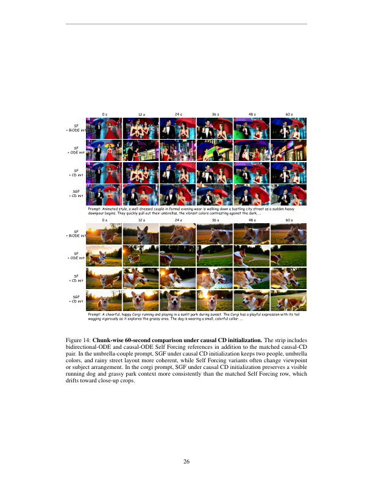

**Caption:** Chunk-wise 60-second comparison under TF initialization. In the apple-peeling prompt, Self Forcing with TF initialization changes the person identity and camera viewpoint, at times replacing the tabletop action with close-ups of a smiling face. SGF keeps the hands, apples, and countertop action more consistent. In the eyebrow-makeup prompt, Self Forcing changes the number and identity of people across time; SGF maintains the same seated client, makeup gesture, and salon environment.

**Caption[CN]:** TF 初始化下分块 60 秒对比。在削苹果提示词中，TF 初始化的 Self Forcing 改变人物身份和相机视角，有时将桌面动作替换成笑脸特写。SGF 更一致地保持手、苹果和台面动作。在眉妆提示词中，Self Forcing 随时间改变人物数量和身份；SGF 保持相同的坐着的顾客、化妆手势和沙龙环境。

### Figure 13. Chunk-wise 240-second comparison under TF initialization

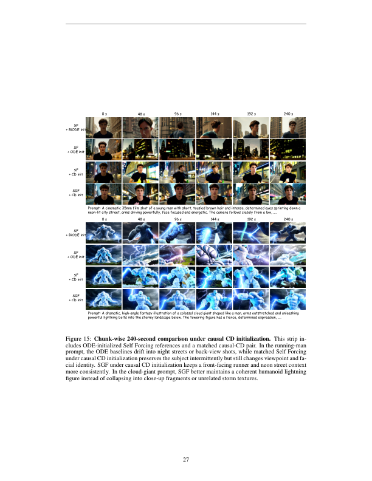

**Caption:** Chunk-wise 240-second comparison under TF initialization. The coarser chunk-wise rollout tests whether a generated block remains useful as context several chunks later. In the bacterium prompt, SGF maintains a population of translucent spherical cells more consistently, whereas Self Forcing often turns the scene into unrelated circular textures or sparse particles. In the lizard prompt, Self Forcing frequently loses the animal or collapses into foliage; SGF better preserves a green lizard among leaves across the long horizon.

**Caption[CN]:** TF 初始化下分块 240 秒对比。更粗粒度的分块滚动检验生成块在数个块之后是否仍作为上下文有用。在细菌提示词中，SGF 更一致地保持半透明球形细胞群，而 Self Forcing 经常将场景变成无关的圆形纹理或稀疏粒子。在蜥蜴提示词中，Self Forcing 经常丢失动物或塌缩为树叶；SGF 在长时域中更好地保持叶片间的绿色蜥蜴。

### Figure 14. Chunk-wise 60-second comparison under causal CD initialization


**Caption:** Chunk-wise 60-second comparison under causal CD initialization. The strip includes bidirectional-ODE and causal-ODE Self Forcing references in addition to the matched causal-CD pair. In the umbrella-couple prompt, SGF under causal CD initialization keeps two people, umbrella colors, and rainy street layout more coherent, while Self Forcing variants often change viewpoint or subject arrangement. In the corgi prompt, SGF under causal CD initialization preserves a visible running dog and grassy park context more consistently than the matched Self Forcing row, which drifts toward close-up crops.

**Caption[CN]:** 因果 CD 初始化下分块 60 秒对比。除匹配的因果 CD 对外，该条带还包含双向 ODE 和因果 ODE Self Forcing 参考。在雨伞情侣提示词中，因果 CD 初始化的 SGF 更连贯地保持两个人、雨伞颜色和雨街布局，而 Self Forcing 变体经常改变视角或主体排列。在柯基提示词中，因果 CD 初始化的 SGF 比匹配的 Self Forcing 行更一致地保留可见的奔跑狗和草地公园上下文，后者漂移为特写裁剪。

### Figure 15. Chunk-wise 240-second comparison under causal CD initialization


**Caption:** Chunk-wise 240-second comparison under causal CD initialization. This strip includes ODE-initialized Self Forcing references and a matched causal-CD pair. In the running-man prompt, the ODE baselines drift into night streets or back-view shots, while matched Self Forcing under causal CD initialization preserves the subject intermittently but still changes viewpoint and facial identity. SGF under causal CD initialization keeps a front-facing runner and neon street context more consistently. In the cloud-giant prompt, SGF better maintains a coherent humanoid lightning figure instead of collapsing into close-up fragments or unrelated storm textures.

**Caption[CN]:** 因果 CD 初始化下分块 240 秒对比。该条带包含 ODE 初始化的 Self Forcing 参考和匹配的因果 CD 对。在奔跑男子提示词中，ODE 基线漂移到夜间街道或背影镜头；因果 CD 初始化的匹配 Self Forcing 间歇性保留主体，但仍改变视角和面部身份。因果 CD 初始化的 SGF 更一致地保持正面奔跑者和霓虹街道上下文。在云巨人提示词中，SGF 更好维持连贯的人形闪电巨人，而不是塌缩为特写碎片或无关风暴纹理。

## End of source-ordered bilingual reader

**Coverage note / 覆盖说明:** The supplied PDF contains 27 pages and no supplementary section beyond Appendices A–H. Figure strips are preserved as low-resolution full-page source renders in `assets/`; searchable table values are transcribed above.
