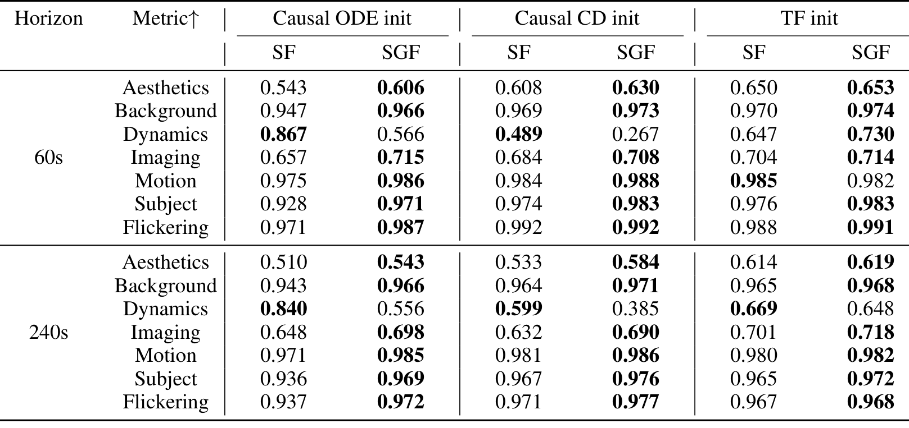
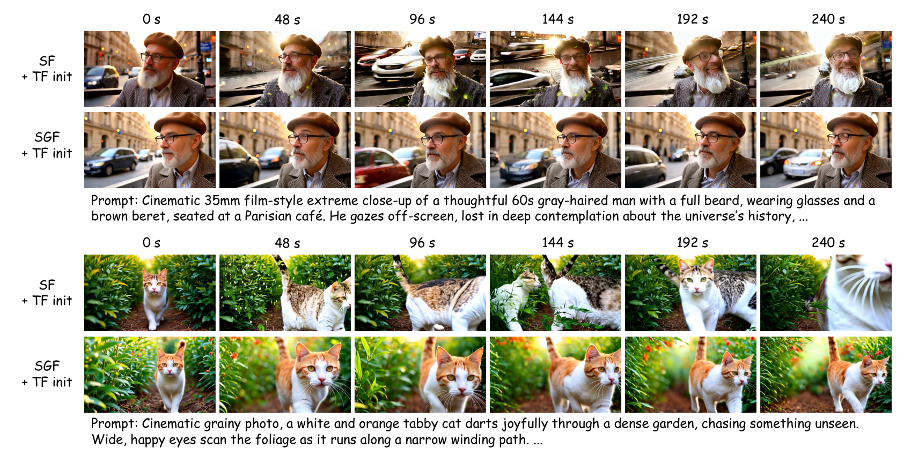
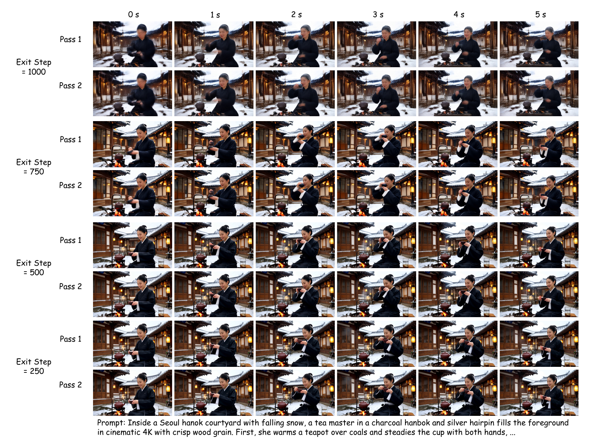

---
tags:
  - papers/video-generation
  - papers/long-video
  - papers/AI-method
aliases:
  - Self Gradient Forcing
  - SGF
  - Native Long Video Extrapolation
date: 2026-08-25
arxiv_id: "2607.20368"
---

# Self Gradient Forcing: Native Long Video Extrapolation

## 核心信息
- 标题: Self Gradient Forcing: Native Long Video Extrapolation
- 标题翻译: 自梯度强制：原生长视频外推
- 作者: Junhao Zhuang, Shiyi Zhang, Yuxuan Bian, Yaowei Li, Yawen Luo, Yijun Liu, Weiyang Jin, Songchun Zhang, Xianglong He, Xuying Zhang, Haoran Li, Haoyang Huang, Zeyue Xue, Nan Duan
- 机构: Joy Future Academy, JD
- 发表时间: arXiv:2607.20368v2，2026-07-24
- 发表渠道: arXiv（cs.CV）
- arXiv: 2607.20368
- 论文链接: https://arxiv.org/abs/2607.20368
- 代码 / 项目: https://zhuang2002.github.io/SelfGradientForcing
- 数据 / 资源: VBench、VBench-Long、128 个随机采样的 MovieGen 提示词；论文称代码和模型将发布
- 论文类型: AI_method

## 原文摘要翻译

近年来的自回归视频扩散方法越来越多地建立在 Self Forcing 之上：学生模型不再使用真实视频上下文，而是在自身 滚动生成 产生的历史上训练。这种做法减轻了 暴露偏差，但历史 键值 缓存 对未来帧而言仍然只是冻结的 滚动生成 状态。因此，未来损失无法监督早期生成的 潜变量 应该如何写入更适合后续视频 潜变量 生成的 key 和 value。我们将这一问题称为 historical 上下文梯度 gap。

我们提出 Self Gradient Forcing（SGF），一种双阶段训练策略，在不对完整串行 滚动生成 反向传播的情况下恢复缺失的监督信号。第一阶段执行与推理相匹配的、无梯度的自回归 滚动生成，并在采样的去噪退出步记录自生成上下文以及输入模型的 带噪 潜变量。第二阶段针对这个记录的退出步执行并行的 上下文梯度 重建。生成的上下文作为停止梯度的 干净-潜变量 输入，而模型重新计算上下文 KV 表示以及 未来到上下文 因果注意力。这样，SGF 在原生自回归训练目标中提供缺失的记忆写入监督：利用未来视频 潜变量 上的损失训练模型，把上下文编码成更有效的因果记忆。

在不同初始化方式下的长时域 逐帧 和 分块 实验中，SGF 相比 Self Forcing 获得更强的原生长视频外推，尤其体现在主体身份、背景/布局一致性和时间稳定性上。值得注意的是，只用 5 秒训练窗口，SGF 仍能外推到持续数分钟的视频。代码和模型将发布在项目页面。

## 创新点

1. **把问题定位为“记忆写入”而不只是暴露偏差。** Self Forcing 已经把训练历史换成自生成历史，但其未来损失只能更新读取历史 KV 的带噪去噪分支，不能更新在干净上下文时间步 $t_{ctx}=0$ 把历史潜变量写成 KV 的分支。论文把这条被截断的信用分配路径明确命名为历史上下文梯度缺口。
2. **用双阶段局部重建替代串行 滚动生成 反传。** Pass 1 保持真实推理几何的无梯度串行 滚动生成；Pass 2 丢弃串行 缓存，在采样的退出步以匹配的因果 掩码 并行重算上下文 KV 和目标 去噪。关键不是让自生成 潜变量 本身可导，而是让“固定的自生成 潜变量 如何被写入 KV”可导。
3. **把恢复的梯度边界嵌入强制目标。** SGF 不改变 Self Forcing 的提示词、随机种子、初始化、窗口或采样协议，只改变采样退出损失是否穿过重算的干净上下文 KV 路径，因此可以与因果初始化、窗口化上下文等其他强制训练改进正交组合。
4. **在同一 5 秒训练窗内验证分钟级外推。** 主实验固定 5 秒训练窗口，将 60 秒和 240 秒作为真正超出训练 时域 的外推测试，并同时覆盖 逐帧、分块 以及 TF、causal CD、causal ODE 初始化。

## 一句话总结

SGF 的实质贡献是：在保持 self-滚动生成 状态不可导、避免 full-滚动生成 BPTT 的前提下，让未来视频损失重新监督“自生成历史写入未来可读 KV 记忆”的共享 DiT 计算；实验说明这条局部梯度对 60–240 秒身份、布局和稳定性有持续收益，但它不是完整串行 滚动生成 梯度，也不是单独解决长视频记忆容量问题的方案。

## 研究问题

### 问题的精确定义

长视频自回归扩散在生成后续块时，不直接读取原始过去潜变量，而是读取历史键值缓存。过去块生成干净潜变量后，模型在干净上下文时间步调用上下文写入计算，把它变成历史缓存。后续生成依赖的是这个表示，而不是原始潜变量本身。因此，长期一致性不仅取决于每个潜变量当下是否合理，还取决于它被写进记忆后是否仍然适合未来读取。

Teacher-Forcing 使用真实前缀，推理使用自生成前缀，产生暴露偏差。Self Forcing 用自身滚动生成历史训练，解决了历史分布不匹配，但为了可行性把历史缓存当作脱离梯度状态。于是，未来 DMD 损失能训练“未来带噪标记如何读历史”，却不能训练“过去潜变量如何写进历史”。论文要回答的是：能否只恢复这条上下文写入梯度，而不保存跨整个长滚动生成的循环自动微分图？

### 与邻近方向的关系

论文把自身放在三条研究线的交叉点上：自回归视频扩散与强制训练、长上下文记忆设计、以及让监督看得更远的未来感知目标。相关代表工作包括 Self Forcing、Video-Mirai 和 Next Forcing。SGF 不增加上下文内容，也不改变缓存保留策略，而是改进给定缓存设计下的记忆写入信用分配。因此它更像训练信号层的补丁，而不是新的长时域记忆结构。

## 数据与任务定义

### 训练与外推协议

所有模型使用同一个 5 秒训练窗口。5 秒评测遵循标准 VBench；60 秒评测使用 VBench-Long 提示词；240 秒评测使用 128 个随机采样的 MovieGen 提示词，并沿用 VBench-Long 的视觉质量指标、去掉文本对齐指标。这样，60 秒和 240 秒不是把训练视频简单延长，而是考察模型在训练窗口之外的 native extrapolation。

每个匹配的 Self Forcing–SGF 对固定相同的初始化、提示词集合、随机种子、sink/FIFO 策略、滑动窗口、分块方式和采样配置，唯一预期差别是采样退出损失的梯度边界。长时域指标包括审美、背景一致性、动态程度、成像质量、运动平滑度、主体一致性和闪烁；方向统一为越高越好。另有盲测 GSB 偏好分数。

### 两种生成粒度

- **逐帧：** 训练时使用完整 5 秒窗口、不做滑动窗口驱逐；推理时使用 sink 4、FIFO 16、当前分块 1，总上下文窗口为 21 个潜变量帧。
- **分块：** 分块大小为 3；sink 3、FIFO 6、当前分块 3，总上下文关系与训练时的滑动窗口保持一致。

VAE 边界诊断使用 10 个、每个 81 个像素帧的视频，对应 21 个 潜变量 frame；以完整前缀编码得到的第 21 个 潜变量（zero-based index 20）为参照，比较不同局部重编码窗口的末端 潜变量。该诊断服务于 逐帧 sink 选择，而非 SGF 本身的核心贡献。

## 方法主线

### 机制流程

1. **输入：自回归训练状态。** 对每个生成块从噪声初始化，按推理时的因果 DiT、调度器、历史 KV 和采样去噪步进行串行生成；均匀采样一个退出索引。

$$s\in\{1,\ldots,K\}$$
2. **第一阶段：无梯度自滚动生成。** 在每个生成块的第 $s$ 个去噪步记录带噪状态和预测干净潜变量，再以干净上下文时间步将其写入串行键值缓存。所有滚动生成缓存、调度器状态、噪声和生成潜变量都作为停止梯度数据。
3. **第二阶段：并行上下文梯度重建。** 将记录的干净上下文作为停止梯度输入，丢弃第一阶段缓存，并用匹配的重建因果掩码重新计算干净上下文隐藏状态、键值投影和未来到上下文注意力，同时输入记录的带噪状态与时间步。
4. **输出：更新共享参数。** 对 Pass 2 的目标预测计算 DMD loss $L_{DMD}$。梯度穿过重算的上下文 KV 与目标 去噪 路径，但不穿过 Pass 1 的 去噪 轨迹或历史 缓存 形成图，从而以固定窗口和并行计算恢复记忆写入监督。

### 历史 上下文梯度 gap

令 $C_\theta$ 表示 干净 context time步 的 缓存-writing computation，则串行 滚动生成 的历史写入为

$$
KV_i^0(\theta)=C_\theta\left(\tilde{x}_i,t_{ctx};KV_{<i}^0\right),\qquad t_{ctx}=0.
$$

在冻结缓存的 Self Forcing 中，$KV_i^0$ 被视作脱离梯度状态。虽然目标标记对历史 KV 的读取可以收到未来损失的梯度，但梯度在 $KV_i^0$ 处截断。与此同时，带噪去噪与干净上下文写入共享 DiT 参数，Self Forcing 更新为

$$
\theta_{r+1}=\theta_r-\eta\nabla_\theta L_{SF}(\theta_r),
$$

更新后一般有 $KV_i^0(\theta_{r+1})\not\equiv KV_i^0(\theta_r)$，但 frozen-缓存 目标没有提供未来损失来校正新 缓存 writer。SGF 针对的正是这条被遗漏的路径。

### SGF 的梯度边界

SGF 不优化采样得到 $\tilde{X}_{ctx}$ 的 去噪 轨迹，因此不是 full 滚动生成 BPTT。其梯度包含

$$
\nabla_\theta L_{DMD}(\hat{X}_{tar})\supset
\frac{\partial L_{DMD}}{\partial KV^{rec}_{ctx}}
\frac{\partial KV^{rec}_{ctx}}{\partial\theta},
$$

其中 $KV^{rec}_{ctx}$ 是 Pass 2 对 停止梯度 干净 潜变量 重新编码得到的 KV。未来损失因而同时训练目标侧 去噪 与上下文侧 KV 写入。

论文强调三种方案的差别：冻结缓存的 Self Forcing 最省但缺少写入梯度；直接可微缓存即使把生成潜变量脱离梯度，仍须保存串行缓存形成图；完整滚动生成 BPTT 还要保存产生每个干净潜变量的去噪轨迹。SGF 只保留无梯度 Pass 1 的记录，并在 Pass 2 打开固定窗口的图，目标内存顺序为

$$
M_{SGF}<M_{直接}<M_{full\text{-}BPTT}.
$$

这里是论文给出的 scaling interpretation，不是 allocator 精确公式。

### 流式上下文与 sink

逐帧推理共用首部缓存加先进先出策略，SGF 与 Self Forcing 使用同一上下文政策，以隔离训练梯度边界的影响。Wan 的时间分组从一个 1 帧边界组开始，随后是 4 帧组；新鲜局部编码的开头不是普通的流内稳态潜变量。实验据此选首部缓存 4，而不是把它当作 SGF 的独立创新。分块则使用首部缓存 3、先进先出 6、当前分块 3。

## 关键结果

### 主结果与强基线

下面的数值来自表 1；每一列中的 SF 是匹配的 Self Forcing，SGF 是只改变梯度边界的模型。加粗方向按论文的“越高越好”，但动态程度需要单独解释。


*图注：60 秒使用 VBench-Long 提示词，240 秒使用 MovieGen-128 提示词；每个初始化下成对比较 Self Forcing 与 SGF。*

| Horizon / metric | Causal ODE SF | Causal ODE SGF | Causal CD SF | Causal CD SGF | TF SF | TF SGF |
|---|---:|---:|---:|---:|---:|---:|
| 60s aesthetics | 0.543 | **0.606** | 0.608 | **0.630** | 0.650 | **0.653** |
| 60s background | 0.947 | **0.966** | 0.969 | **0.973** | 0.970 | **0.974** |
| 60s dynamics | **0.867** | 0.566 | **0.489** | 0.267 | 0.647 | **0.730** |
| 60s imaging | 0.657 | **0.715** | 0.684 | **0.708** | 0.704 | **0.714** |
| 60s motion | 0.975 | **0.986** | 0.984 | **0.988** | **0.985** | 0.982 |
| 60s subject | 0.928 | **0.971** | 0.974 | **0.983** | 0.976 | **0.983** |
| 60s flickering | 0.971 | **0.987** | 0.992 | **0.992** | 0.988 | **0.991** |
| 240s aesthetics | 0.510 | **0.543** | 0.533 | **0.584** | 0.614 | **0.619** |
| 240s background | 0.943 | **0.966** | 0.964 | **0.971** | 0.965 | **0.968** |
| 240s dynamics | **0.840** | 0.556 | **0.599** | 0.385 | **0.669** | 0.648 |
| 240s imaging | 0.648 | **0.698** | 0.632 | **0.690** | 0.701 | **0.718** |
| 240s motion | 0.971 | **0.985** | 0.981 | **0.986** | 0.980 | **0.982** |
| 240s subject | 0.936 | **0.969** | 0.967 | **0.976** | 0.965 | **0.972** |
| 240s flickering | 0.937 | **0.972** | 0.971 | **0.977** | 0.967 | **0.968** |

总体模式不是“所有指标、所有初始化都提升”。SGF 在 60 秒逐帧的 21 个受控比较单元中，除动态程度和 TF 运动外几乎都更高或持平；240 秒逐帧的动态程度也反向。论文解释，Self Forcing 的场景跳变、相机几何破坏和物体变形会带来更大的表面运动，反而抬高动态程度；因此这个指标不能单独作为运动质量的代理。更合理的证据链是：SGF 提高主体一致性、背景一致性、运动平滑度、成像质量与闪烁，并在图像条带中减少身份、裁剪、布局和相机漂移。


*图注：在相同提示词、随机种子、初始化和推理几何下，Self Forcing 与 SGF 的 240 秒逐帧对比；SGF 更好保持主体身份与场景布局。*

图 3 的两个提示词都固定随机种子、初始化和推理几何。Self Forcing 早期仍局部合理，但中后期出现裁剪漂移、身份漂移或主体关系变化；SGF 更能保持人物/猫的外观、构图和背景关系。该图不能证明每个提示词都成功，只能说明在匹配设置下，视觉差异不是采样随机性造成的。

### 主观偏好与训练成本

GSB 盲测包含超过 1,900 个成对判断，覆盖 10 组匹配比较。所有 GSB 都为正：逐帧 60 秒下因果 ODE/CD/TF 分别为 29.6%、36.8%、45.1%；逐帧 240 秒为 38.6%、35.9%、48.7%；分块 60 秒为 32.9%、37.5%；分块 240 秒为 34.3%、44.9%。这支持“人类更偏好 SGF 的长时域一致性”，但不是无偏的绝对质量分数，且论文没有在正文给出每组样本数量、置信区间或评审者的更细统计。

| 训练变体 | 峰值显存 | 稳态显存 | 每 5 步 时间 | 结果 |
|---|---:|---:|---:|---|
| Self Forcing，冻结历史 KV | 79.01 GB | 79.01 GB | 10.39 s | 可训练 |
| SGF，串行 Pass 1 + 并行 Pass 2 | 87.01 GB | 63.73 GB | 11.71 s | 可训练 |
| Self Forcing，历史 KV 可微 | OOM | OOM | OOM | 不可训练 |

SGF 的峰值显存比冻结缓存增加 8.00 GB，约为 10.1%；每 5 步增加 1.32 秒，约为 12.7%。论文指出，伪分数与生成器更新为 5:1，额外 Pass 2 只影响生成器更新，因此平均训练开销受限于该调度。这里的测量是作者自己的实现设置，不足以推导不同硬件、批大小或模型宽度下的普适开销。

### 消融到底说明了什么

**短时域 合理性检查。** 5 秒 VBench 的定位是确保 SGF 不牺牲短视频质量；主文只说 逐帧 与 分块 大体可比，完整数值在 附录 B。它支持的是“不明显破坏短时域”，不是短时域全面优于 Self Forcing。

**恢复精度。** 论文在 24 个提示词、4 个退出步 $\{1000,750,500,250\}$ 上做 96 个比较，比较潜变量预测而非变分自编码器解码图像。总体均方误差为 $1.754\times10^{-4}$，均方根误差 0.01258，平均绝对误差 0.00801，最大绝对误差 0.48681，相对 L2 为 0.01409，相对 L2/$\epsilon_{bf16}$ 为 1.80，余弦相似度为 0.999886。各退出步的相对 L2 从 0.02133、0.01566、0.01125、0.00812 下降；这说明并行重建在数值上接近串行退出状态，但论文明确说它不等价于完整滚动生成梯度。


*图注：在四个退出步和匹配上下文下，Pass 1 与 Pass 2 的解码视频几乎不可区分，与表 7 的潜变量恢复误差和余弦相似度结果一致。*

**时间编码边界与首部缓存。** 以新鲜 4 帧控制样本编码目标窗口时，相对 L2 误差为 0.607；加入边界锚点后 $W=0$ 时降到 0.271；加入更多历史潜变量组后依次降到 0.124、0.084、0.067、0.060（$W=1,2,3,4$），之后变化很小。逐帧 SGF 的首部缓存消融在 60 秒 TF 初始化下，审美为 1/2/4/8 的 0.627/0.645/0.653/0.655，背景为 0.970/0.974/0.974/0.976，主体为 0.983/0.982/0.983/0.983，闪烁为 0.990/0.990/0.991/0.992。首部缓存 4 被选为覆盖边界过渡区且不显著侵蚀先进先出预算的最小设置；8 只带来边际收益。

## 深度分析

### 真正贡献是什么

真正的贡献不是“多跑一次前向计算”本身，而是把长时域信用分配的对象从“生成潜变量的整个历史轨迹”缩小为“固定自生成潜变量的上下文写入函数”。Self Forcing 的核心优点——训练时看到推理分布的历史——被保留；它的核心缺口——历史写入 KV 不收到未来损失——被局部修补。这个切分同时解释了为什么 SGF 能在 5 秒训练窗口上影响 240 秒外推：即使训练监督没有直接覆盖整段长序列，模型每次采样退出步都在学习让短窗内的历史表示对未来读取更有用，误差积累因而可能减慢。

### 为什么结果成立

1. **监督对象正好对应失败模式。** 论文定性结果中的视角跳变、裁剪漂移、主体替换、背景/布局替换都是历史逐步变得不可用的表现；SGF 的未来到上下文梯度直接更新历史的编码方式，因而在主体一致性、背景一致性、闪烁和运动平滑度上形成一致增益。
2. **匹配的推理几何减少了替代解释。** 同一 提示词、seed、初始化、窗口与采样配置下的 paired comparison，使“SGF 只是换了更强初始化或更宽上下文”的解释不成立。
3. **并行重建确实接近串行状态。** 0.999886 的平均余弦和 1.41% 相对 L2 误差支持 Pass 2 是合理的局部前向替代，而不是完全不同的教师强制任务。
4. **成本结果符合计算图结构。** 直接可微历史缓存需要保留循环缓存形成图，确实 OOM；SGF 的稳定显存反而为 63.73 GB，且只把峰值提高到 87.01 GB，和“把梯度限制在固定窗口”的解释一致。

### 容易误读的地方

- “SGF 恢复上下文梯度”不等于“恢复完整训练梯度”。生成的 $\tilde{X}_{ctx}$、噪声、调度器状态和 Pass 1 缓存都停止梯度；未来损失不能改变早期去噪决策。
- “240 秒视频”是外推 时域，不是 240 秒 ground-truth 训练监督。所有模型都只训练 5 秒窗口。
- “动态程度更低”在若干 SGF 行中不是负面证据。论文认为 Self Forcing 的不连贯跳变会制造虚高运动；应与主体一致性、运动平滑度和视觉条带一起读。
- sink 4 是针对 Wan VAE boundary 的上下文策略，不应被当作 SGF 的主要创新或跨 VAE 的默认超参。
- GSB 为正说明偏好 SGF，但没有给出完整置信区间、评审者分层或绝对质量校准，不能从中推出普适的人类质量提升。

### 复杂度与扩展性

SGF 的优势依赖第二阶段的重建窗口、静态生成块稀疏因果掩码和高效注意力实现。它消除了随滚动生成长度增长的自动微分图，但没有消除第一阶段串行滚动生成的墙钟时间成本，也没有让长期上下文容量变大。若 $N$、上下文窗口、变换器深度或去噪步大幅增长，并行重建窗口仍会变贵；论文只在一个实现规模上报告了 79–87 GB 显存和 10.39–11.71 秒/5 步。

### 复现注意点

1. 需要能复现因果 DiT 的串行缓存与并行重建两套接口，以及与推理完全一致的 RoPE、sink 位置、FIFO 驱逐、分块对齐和干净时间步。
2. 退出步 $s$ 从去噪调度中均匀采样；论文算法中的 $T=(t_1,\ldots,t_K)$、调度器 $\Psi$、掩码 $M_{rec}$ 都是训练语义的一部分，不应随意改成固定最后一步。
3. 逐帧训练 Pass 2 是完整 5 秒序列的教师强制式因果掩码；推理却是 sink 4 + FIFO 16 + 当前分块 1 的 21 个潜变量流式策略。分块训练和推理都要匹配 sink 3 + FIFO 6 + 当前分块 3。
4. 评测基线检查点的来源并不完全统一：逐帧/分块因果 ODE 使用公开的因果强制训练检查点；分块双向 ODE 使用公开的 Self Forcing 检查点；其余检查点由作者按对应 SGF 设置复现。复现时必须区分已发布基线与复现实验基线。
5. 需要记录 DMD fake-分数/生成器 的 5:1 更新调度，否则无法直接比较论文的时间开销。
6. 论文称代码和模型“将会发布”，但当前 PDF 本身没有提供可验证的仓库提交、训练脚本、权重下载或完整提示词/随机种子清单；仅有项目页链接，复现风险仍高。

## 局限

1. **不是 full 滚动生成 BPTT。** SGF 不让未来损失回到产生 $\tilde{x}_i$ 的去噪决策，因此无法处理“早期 潜变量 本身生成错了”这一类错误，只能改善其写入记忆后的可读性。
2. **依赖几何严格对齐。** 如果 Pass 2 的教师强制掩码、sink/FIFO、RoPE、上下文时间步或分块对齐与真实推理不同，模型会学习错误的记忆写入器。论文承认这一点是最关键的假设。
3. **长程容量问题未解决。** 检索、稀疏注意力、KV 压缩、长上下文教师和长滚动生成调优仍然是互补需求。SGF 让短窗口记忆写得更好，但没有让 21 或 12 个潜变量的上下文变成无限记忆。
4. **评测覆盖有限。** 长时域主结果主要是 VBench-Long 指标与 128 个 MovieGen 提示词；没有给出更广泛的真实视频、动作可控任务、交互式条件或跨模型架构验证。
5. **数值与人类评测的统计细节不足。** GSB 只报告总体分数，没有完整的置信区间或显著性检验；恢复精度在 24 提示词 和 4 exit 步 上测量，足以支持局部 forward fidelity，但不等于所有 提示词、模型尺度和混合精度设置都稳定。
6. **工程成本可能随规模改变。** 87.01 GB 峰值显存已接近大模型训练的硬件门槛；论文没有给出 batch size、GPU 型号、分辨率、参数量和总训练时长的完整组合，难以外推 SGF 的性价比。

## 我的笔记

这篇论文值得保留，因为它把长视频“慢慢坏掉”的原因从模糊的 暴露偏差 进一步拆成了一个可操作的计算图问题：Self Forcing 让模型看到自己的历史，却把历史写入 KV 的路径冻结了。这个诊断比单纯再延长 滚动生成 或再扩大窗口更有解释力，也给出了一个能在现有 forcing pipeline 上插入的局部修复。

我最认同的证据是三件事的闭环：第一，方法层面明确区分冻结缓存与上下文梯度；第二，Pass 2 与 Pass 1 的潜变量余弦为 0.999886，说明重建不是凭空造出的训练任务；第三，在 TF、因果 CD、因果 ODE 和逐帧/分块两种粒度上，主体一致性、背景一致性、闪烁等与长期一致性直接相关的指标普遍改善。反过来，动态程度的反例也很重要：它提醒我们，长视频基准的“运动量”可能奖励不连贯跳变，评价必须同时看稳定性和语义保持。

从研究路线看，SGF 处在“训练信号修正”而不是“记忆架构替换”这一层。下一步不应只做更多 提示词，而应做能区分三类梯度贡献的实验：

1. **梯度位置对照。** 比较冻结缓存、仅上下文-KV 梯度、仅目标侧梯度、短窗口完整 BPTT，以及可行范围内的直接可微缓存。报告每种方案在相同计算预算下的长期一致性和显存，验证收益是否真的来自 KV 写入器，而不是额外前向计算或正则化。
2. **退出步与 时域 对照。** 将均匀采样 exit 步 改为早、中、晚分层采样，观察哪一段 去噪 的 上下文梯度 最关键；再以 5/10/20 秒训练窗和 60/240/600 秒 时域 画出收益随外推距离的曲线。
3. **错误类型分解。** 设计主体身份、相机几何、背景布局、动作连续性和物体持久性的独立自动评测，检验 SGF 主要修复的是 记忆 aliasing、空间布局还是 temporal dynamics，而不是把 VBench 的相关指标当作机制证据。
4. **跨编码器与跨架构验证。** 在不同时间分组的时空编码器、不同缓存组织和不同因果扩散变换器上复现首部缓存与边界诊断，验证首部缓存 4 的结论是否只是当前编码器的特例。
5. **与长上下文方法组合。** SGF 与检索、KV 压缩、稀疏注意力、Next Forcing 或长滚动生成暴露偏差的组合应采用正交消融，分别测“写得更好”和“看得更多”的边际收益。
6. **更严格的人类评测。** 提供每个 pair 的置信区间、评审者一致性、提示类别分层和失败率，而不只报告 GSB。长视频最关键的失败往往是低频 catastrophic drift，均值指标可能掩盖它。

如果要把这篇工作用于自己的视频生成研究，最可迁移的抽象是：当一个自回归系统把历史压缩成脱离梯度状态时，要检查未来损失是否只训练状态的读取，而没有训练状态的形成；若完整 BPTT 不可行，可以尝试记录停止梯度状态，再对关键边界做并行重放。这个模式不局限于视频，也可能适用于带循环缓存、记忆标记或工具状态的多模态智能体，但跨领域迁移前必须重新验证重放几何与真实推理状态的一致性。

## 引用

```bibtex
@article{zhuang2026selfgradientforcing, title={Self Gradient Forcing: Native Long Video Extrapolation}, author={Zhuang, Junhao and Zhang, Shiyi and Bian, Yuxuan and Li, Yaowei and Luo, Yawen and Liu, Yijun and Jin, Weiyang and Zhang, Songchun and He, Xianglong and Zhang, Xuying and Li, Haoran and Huang, Haoyang and Xue, Zeyue and Duan, Nan}, journal={arXiv preprint arXiv:2607.20368}, year={2026}}
```

> 注：本笔记依据用户提供的 27 页 PDF（arXiv:2607.20368v2，文本提取覆盖 27/27 页）撰写。论文中的参考文献列表未逐条展开；所有方法、数值、实验协议和局限判断均以该 PDF 的正文与附录为依据。
