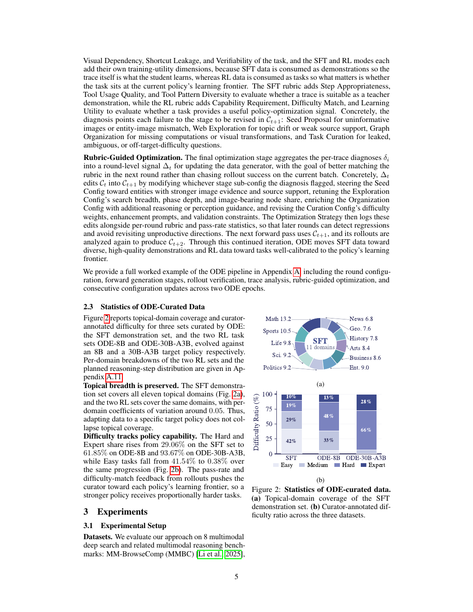
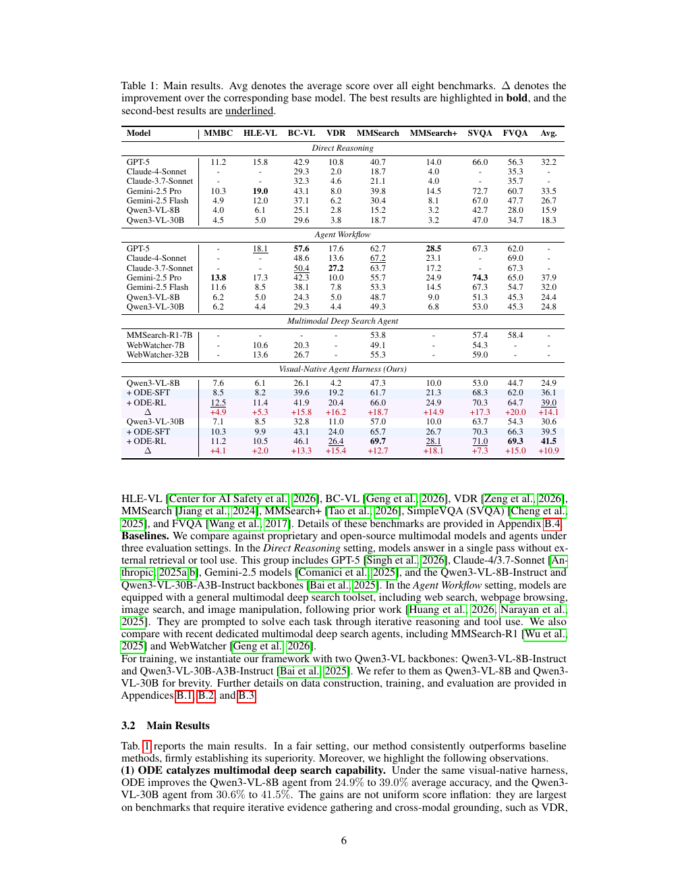
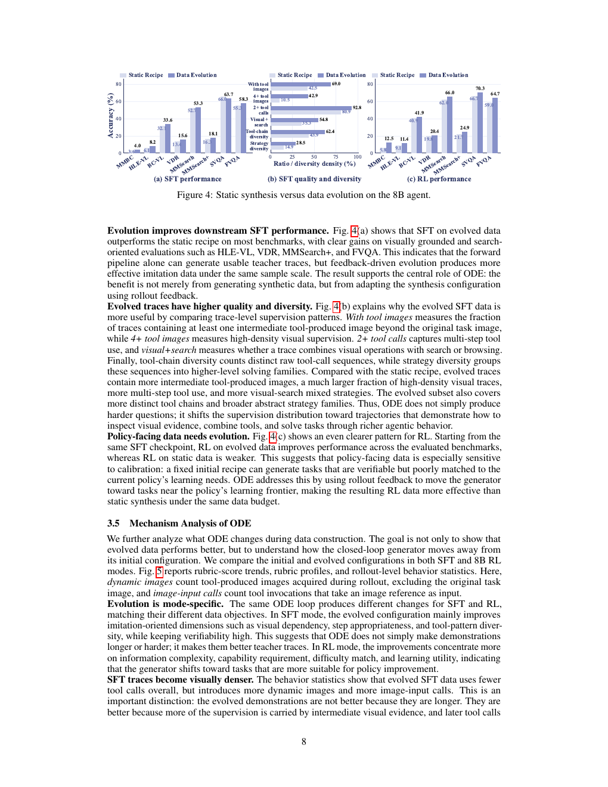
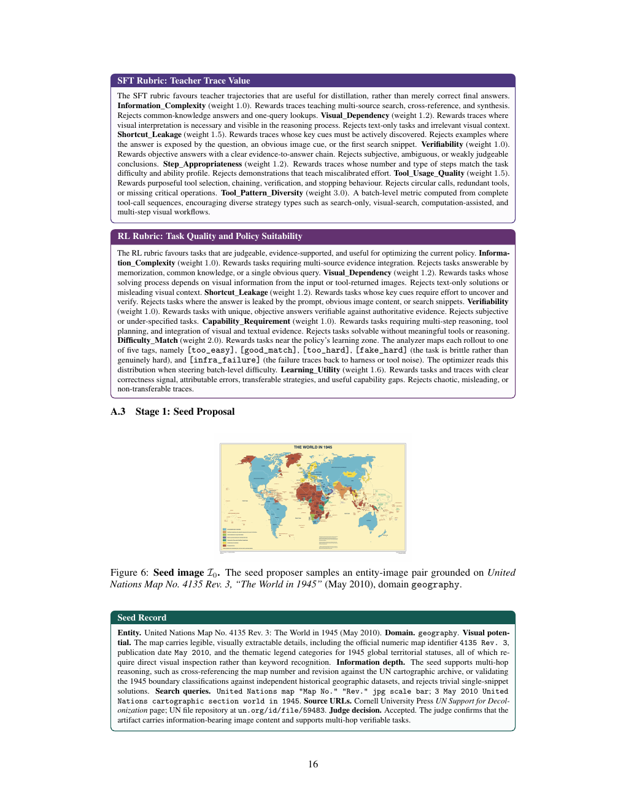
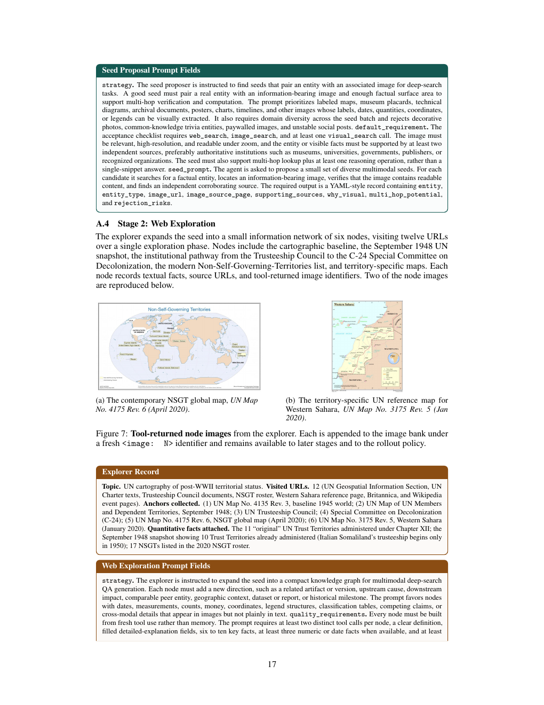
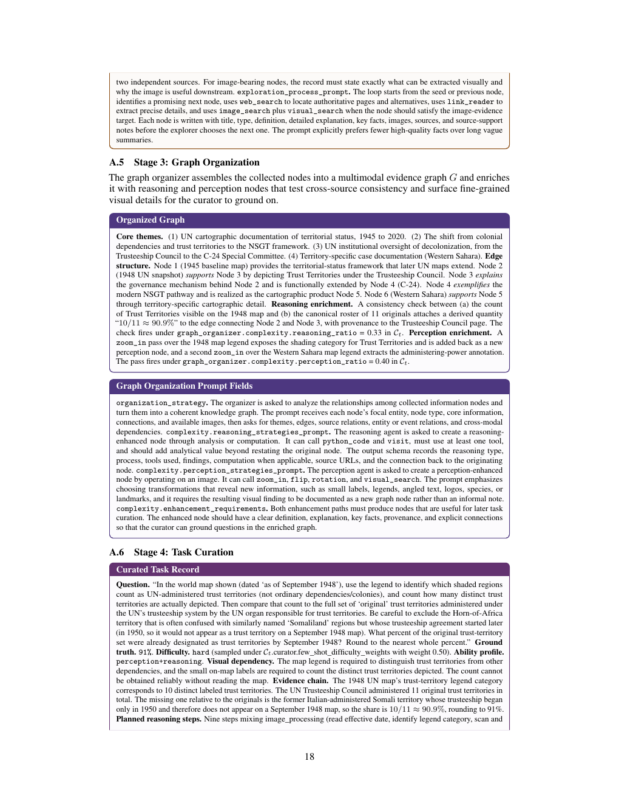
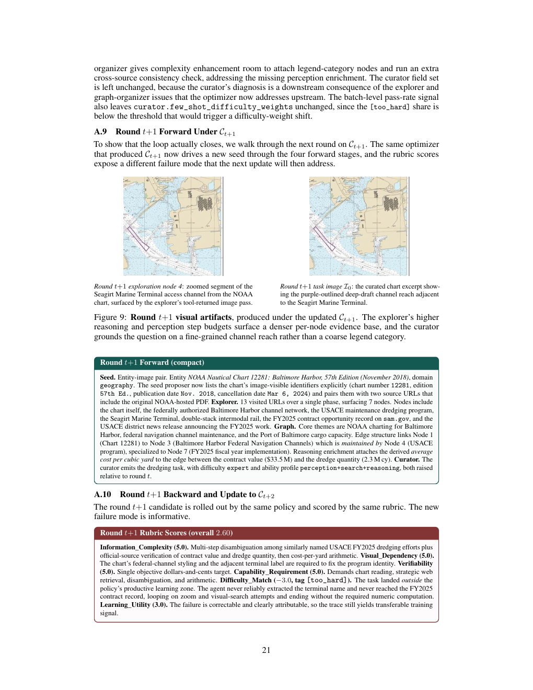
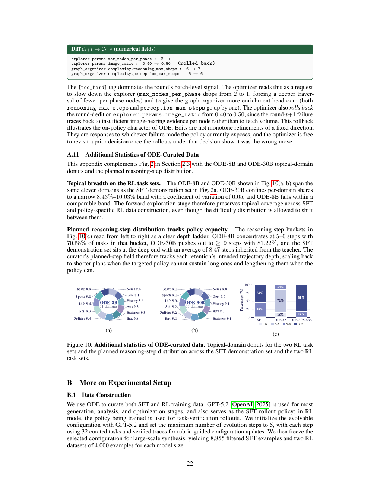

# Towards On-Policy Data Evolution for Visual-Native Multimodal Deep Search Agents

**Authors:** Shijue Huang; Hangyu Guo; Guanting Dong; Chenxin Li; Junting Lu; Xinyu Geng; Zhaochen Su; Zhenyu Li; Shuang Chen; Hongru Wang; Yi R. (May) Fung
**Source:** `/Users/roywangj/journey_wj/research/papers4zotero/zotero1/storage/MHFY795Z/Huang 等 - 2026 - Towards On-Policy Data Evolution for Visual-Native Multimodal Deep Search Agents.pdf`
**Detected source format:** selectable-text PDF (`pdf-text`), 25 pages
**Reader type:** complete paragraph-level English–Chinese detailed reader.

## Page / Section Index

- Abstract; 1 Introduction; 2 Method; 2.1 Visual-Native Agent Harness; 2.2 On-policy Data Evolution; 2.3 Statistics of ODE-Curated Data; 3 Experiments; 4 Related Work; 5 Conclusion; References; Appendix A; Appendix B.

## Terminology Ledger

| English | 中文 |
|---|---|
| Visual-Native Agent Harness | 视觉原生智能体工具框架 |
| Image Bank Reference Protocol | 图像库引用协议 |
| On-policy Data Evolution (ODE) | 在策略数据演化（ODE） |
| multimodal deep search | 多模态深度搜索 |

## Full-paper Bilingual Reader

> <strong>Para. 1:</strong> Multimodal Deep Search Agents

> <strong>Para. 1[CN]:</strong> （中文译文）多模态深度搜索 智能体

> <strong>Para. 2:</strong> Shijue Huangα , Hangyu Guoα , Guanting Dongβ , Chenxin Liγ , Junting Luσ , Xinyu Gengα , Zhaochen Suα , Zhenyu Liδ , Shuang Chenγ , Hongru Wangµ , Yi R. (May) Fungα α Hong Kong University of Science and Technology β Renmin University of China, γ The Chinese University of Hong Kong σ Peking University, δ Tsinghua University, µ University of Edinburgh

> <strong>Para. 2[CN]:</strong> （中文译文）Shijue Huangα , Hangyu Guoα , Guanting Dongβ , Chenxin Liγ , Junting Luσ , Xinyu Gengα , Zhaochen Suα , Zhenyu Liδ , Shuang Chenγ , Hongru Wangµ , Yi R. (May) Fungα α Hong Kong University 的 Science 和 Technology β Renmin University 的 China, γ 该 Chinese University 的 Hong Kong σ Peking University, δ Tsinghua University, µ University 的 Edinburgh

> <strong>Para. 3:</strong> Ñ on-policy-data-evolution.github.io § github.com/JoeYing1019/ODE

> <strong>Para. 3[CN]:</strong> （中文译文）Ñ on-策略-数据-演化.github.io § github.com/JoeYing1019/ODE

> <strong>Para. 4:</strong> Abstract Multimodal deep search requires an agent to solve open-world problems by chain- ing search, tool use, and visual reasoning over evolving textual and visual context. Two bottlenecks limit current systems. First, existing tool-use harnesses treat images returned by search, browsing, or transformation as transient outputs, so intermediate visual evidence cannot be re-consumed by later tools. Second, training data is usually built by fixed curation recipes that cannot track the target agent’s evolving capability. To address these challenges, we first introduce a visual-native agent harness centered on an image bank reference protocol, which registers every tool-returned image as an addressable reference and makes intermediate visual evidence reusable by later tools. On top of this harness, On-policy Data Evolution (ODE) runs a closed-loop data generator that refines itself across rounds from roll- outs of the policy being trained. This per-round refinement makes each round’s data target what the current policy still needs to learn. The same framework supports both diverse supervised fine-tuning data and policy-aware reinforcement learning data curation, covering the full training lifecycle of the target agent. Across 8 multimodal deep search benchmarks, ODE improves the Qwen3-VL-8B agent from 24.9% to 39.0% on average, surpassing Gemini-2.5 Pro in standard agent- workflow setting (37.9%). At 30B, ODE raises the average score from 30.6% to 41.5%. Further analyses validate the effectiveness of image-bank reuse, especially on complex tasks requiring iterative visual refinement, while rollout-feedback evolution yields more grounded SFT traces and better policy-matched RL tasks than static synthesis.

> <strong>Para. 4[CN]:</strong> （中文译文）Abstract 多模态深度搜索 需要 an 智能体 到 solve open-world problems by chain- ing 搜索, tool use, 和 visual 推理 over evolving textual 和 visual context. Two bottlenecks limit current systems. First, existing tool-use harnesses treat images returned by 搜索, 浏览, or transformation as transient outputs, so intermediate 视觉证据 cannot be re-consumed by later tools. Second, 训练数据 是 usually built by fixed curation recipes that cannot track 该 target 智能体’s evolving capability. 到 address these challenges, we first introduce a visual-native 智能体 harness centered on an 图像库引用协议, 该方法 registers every tool-returned image as an addressable reference 和 使得 intermediate 视觉证据 可复用的 by later tools. On top 的 this harness, 在策略数据演化 (ODE) runs a closed-loop 数据 generator that refines itself 跨越 rounds 从 roll- outs 的 该 策略 being trained. 该 per-round refinement 使得 each round’s 数据 target what 该 current 策略 still needs 到 learn. 该 same 框架 支持 both diverse supervised fine-tuning 数据 和 策略-aware reinforcement learning 数据 curation, covering 该 full training lifecycle 的 该 target 智能体. 跨越 8 多模态深度搜索 基准测试, ODE 提升 该 Qwen3-VL-8B 智能体 从 24.9% 到 39.0% on average, surpassing Gemini-2.5 Pro in standard 智能体- workflow setting (37.9%). At 30B, ODE raises 该 average score 从 30.6% 到 41.5%. Further analyses validate 该 effectiveness 的 image-bank reuse, especially on complex 任务 requiring iterative visual refinement, while rollout-feedback 演化 yields 更多 有依据的 SFT traces 和 better 策略-matched RL 任务 比 静态 合成.

> <strong>Para. 5:</strong> 1 Introduction Recently, Multimodal Large Language Models (MLLMs) have witnessed a rapid emergence of agent capabilities, pushing their application boundary from static image-question answering toward open-world deep search [OpenAI, 2023, ByteDance Seed Team, 2026, Bai et al., 2025, Jiang et al., 2024, Li et al., 2025, Tao et al., 2026]. In this emerging setting, a model is expected to interact with search engines and a broad ecosystem of external tools in real time, gathering evidence to generate grounded answers. In practice, user information needs are becoming increasingly complex and open-ended, where shallow retrieval no longer suffices to capture their intent [Jiang et al., 2024, Li et al., 2025, Tao et al., 2026, Su et al., 2026]. This makes multimodal deep search a natural next frontier for MLLMs, where progress depends not only on recognizing visual content, but also on building reliable paths from visual cues to external evidence and grounded answers. Building strong multimodal deep search agents remains challenging for two reasons: (1) Existing pipelines underutilize persistent visual state in tool-augmented search: Early multimodal search

> <strong>Para. 5[CN]:</strong> （中文译文）1 引言 Recently, Multimodal Large Language Models (MLLMs) have witnessed a rapid emergence 的 智能体 capabilities, pushing their application boundary 从 静态 image-question answering toward open-world deep 搜索 [OpenAI, 2023, ByteDance Seed Team, 2026, Bai et al., 2025, Jiang et al., 2024, Li et al., 2025, Tao et al., 2026]. 在 this emerging setting, a model 是 expected 到 interact 与 搜索 engines 和 a broad ecosystem 的 external tools in real time, gathering 证据 到 generate 有依据的 answers. 在 practice, user information needs 是 becoming increasingly complex 和 open-ended, 其中 shallow retrieval no longer suffices 到 capture their intent [Jiang et al., 2024, Li et al., 2025, Tao et al., 2026, Su et al., 2026]. 该 使得 多模态深度搜索 a natural next frontier for MLLMs, 其中 progress depends not only on recognizing visual content, but also on building reliable paths 从 visual cues 到 external 证据 和 有依据的 answers. Building strong 多模态深度搜索 智能体 remains challenging for two reasons: (1) Existing pipelines underutilize persistent visual state in tool-augmented 搜索: Early multimodal 搜索

> <strong>Para. 6:</strong> agents augment MLLMs with image and text search to enable on-demand retrieval in open-world environments [Wu et al., 2025, Geng et al., 2026], and subsequent works extend this paradigm with crop-conditioned image search, iterative query refinement, and increasingly complex multi-turn visual-textual exploration [Narayan et al., 2025, Hong et al., 2026, Huang et al., 2026]. However, many existing approaches still center visual reasoning and search around the original task image, rather than treating tool-produced visual outputs as new reusable evidence throughout the trajectory. (2) Multimodal deep search data synthesis lacks closed-loop modeling of agent search behav- ior. Recent works mainly rely on synthetic or semi-automatically constructed data. For instance, MMSearch-R1 [Wu et al., 2025], DeepMMSearch-R1 [Narayan et al., 2025], and WebWatcher [Geng et al., 2026] obtain training data via semi-automated VQA curation, web-grounded task synthesis, and synthetic multimodal tool-use trajectories. These efforts mark important progress, but the generation recipe is usually fixed before scaling, making it difficult to use target-agent feedback to steer data toward the policy’s learning frontier. These observations suggest that progress in multimodal deep search depends on jointly advancing the agent’s interaction workspace and the way its training data are constructed. Motivated by this, we seek to elicit multimodal deep search capability through a co-design along these two complementary axes. On the workspace side, instead of treating multimodal search as a fixed interaction over the original task image, we build a Visual-Native Agent Harness that unifies 9 core tools in a shared workspace: web search, image search, scholar search, visit (browsing), visual search (Google Lens), zoom-in, rotation, flip, and Python execution. At its core is an image bank reference protocol. It stores the original task image and every tool-returned image as reusable visual state, allowing later actions to operate on visual evidence produced by earlier steps. This turns multimodal search from single-image interaction into a chained visual workflow with evidence accumulation. On the data side, built on our visual-native harness, we introduce On-policy Data Evolution (ODE), which treats multimodal data construction as adaptive optimization rather than a fixed curation recipe. Instead of designing a synthesis pipeline once and then scaling it, ODE repeatedly generates candidate tasks, executes the target policy on them, and uses rubric-based trace analysis as feedback to revise the next round of data synthesis. In this sense, the rubric plays a role analogous to a loss function: it identifies whether the generated data is too easy, too brittle, insufficiently visual, poorly grounded, or otherwise misaligned with the agent’s current training needs. The same evolution principle supports both supervised fine-tuning (SFT) and reinforcement learning (RL) with mode-specific objectives: ODE favors grounded, tool-effective, and diverse teacher trajectories for SFT, and seeks verifiable tasks near the policy’s learning frontier for RL. Experiments across eight challenging multimodal deep search benchmarks spanning MMBC, HLE- VL, BC-VL, MMSearch, VDR, MMSearch+, SimpleVQA, and FVQA show that the proposed framework substantially strengthens same-harness agents at both 8B and 30B scales. Further con- trolled analyses show that both parts of the framework matter: removing reusable image-bank references weakens performance most on tasks that activate secondary image use, while replacing ODE with a static synthesis recipe yields lower SFT and RL gains under matched data budgets. To summarize, our contributions are as follows: • We introduce a Visual-Native Agent Harness for multimodal deep search, where search, browsing and visual manipulation operate over an image bank reference protocol that makes tool-produced visual evidence persistently reusable across the trajectory. • We propose On-policy Data Evolution (ODE), a closed-loop data construction framework that couples task synthesis, policy rollout, rubric-based trace analysis, and configuration optimization, and supports both SFT-style teacher-trace curation and RL-oriented policy-facing data generation. • We validate the framework across eight multimodal deep search benchmarks. ODE improves Qwen3-VL from 24.9% to 39.0% at 8B and from 30.6% to 41.5% at 30B on average, verifying the effectiveness of visual-state reuse and data evolution against static synthesis.

> <strong>Para. 6[CN]:</strong> （中文译文）智能体 augment MLLMs 与 image 和 text 搜索 到 enable on-demand retrieval in open-world environments [Wu et al., 2025, Geng et al., 2026], 和 subsequent works extend this paradigm 与 crop-conditioned 图像搜索, iterative query refinement, 和 increasingly complex multi-turn visual-textual exploration [Narayan et al., 2025, Hong et al., 2026, Huang et al., 2026]. However, many existing approaches still center visual 推理 和 搜索 around 该 original 任务 image, 而不是 treating tool-produced visual outputs as new 可复用的 证据 throughout 该 轨迹. (2) 多模态深度搜索 数据 合成 lacks closed-loop modeling 的 智能体 搜索 behav- ior. Recent works mainly rely on synthetic or semi-automatically constructed 数据. 对于 instance, MMSearch-R1 [Wu et al., 2025], DeepMMSearch-R1 [Narayan et al., 2025], 和 WebWatcher [Geng et al., 2026] obtain 训练数据 via semi-automated VQA curation, web-有依据的 任务 合成, 和 synthetic multimodal tool-use 轨迹. These efforts mark important progress, but 该 生成 recipe 是 usually fixed before scaling, making it difficult 到 use target-智能体 feedback 到 steer 数据 toward 该 策略’s learning frontier. These observations suggest that progress in 多模态深度搜索 depends on jointly advancing 该 智能体’s interaction workspace 和 该 way its 训练数据 是 constructed. Motivated by this, we seek 到 elicit 多模态深度搜索 capability 通过 a co-design along these two complementary axes. On 该 workspace side, 而非 treating multimodal 搜索 as a fixed interaction over 该 original 任务 image, we build a 视觉原生智能体工具框架 that unifies 9 core tools in a 共享工作空间: 网页搜索, 图像搜索, scholar 搜索, visit (浏览), 视觉搜索 (Google Lens), zoom-in, rotation, flip, 和 Python execution. At its core 是 an 图像库引用协议. It stores 该 original 任务 image 和 every tool-returned image as 可复用的 visual state, allowing later actions 到 operate on 视觉证据 produced by earlier steps. 该 turns multimodal 搜索 从 single-image interaction 转化为 a chained visual workflow 与 证据 accumulation. On 该 数据 side, built on our visual-native harness, we introduce 在策略数据演化 (ODE), 该方法 treats multimodal 数据 construction as adaptive 优化 而不是 a fixed curation recipe. 而非 designing a 合成 pipeline once 和 then scaling it, ODE repeatedly generates candidate 任务, executes 该 target 策略 on them, 和 uses 评分量规-based trace analysis as feedback 到 revise 该 next round 的 数据 合成. 在 this sense, 该 评分量规 plays a role analogous 到 a loss function: it identifies whether 该 generated 数据 是 too easy, too brittle, insufficiently visual, poorly 有依据的, or otherwise misaligned 与 该 智能体’s current training needs. 该 same 演化 principle 支持 both supervised fine-tuning (SFT) 和 reinforcement learning (RL) 与 mode-specific objectives: ODE favors 有依据的, tool-effective, 和 diverse teacher 轨迹 for SFT, 和 seeks verifiable 任务 near 该 策略’s learning frontier for RL. 实验 跨越 eight challenging 多模态深度搜索 基准测试 spanning MMBC, HLE- VL, BC-VL, MMSearch, VDR, MMSearch+, SimpleVQA, 和 FVQA show that 该 proposed 框架 substantially strengthens same-harness 智能体 at both 8B 和 30B scales. Further con- trolled analyses show that both parts 的 该 框架 matter: removing 可复用的 image-bank references weakens 性能 most on 任务 that activate secondary image use, while replacing ODE 与 a 静态 合成 recipe yields lower SFT 和 RL gains under matched 数据 budgets. 到 summarize, our contributions 是 as follows: • 我们介绍 a 视觉原生智能体工具框架 for 多模态深度搜索, 其中 搜索, 浏览 和 visual manipulation operate over an 图像库引用协议 that 使得 tool-produced 视觉证据 persistently 可复用的 跨越 该 轨迹. • 我们提出 在策略数据演化 (ODE), a closed-loop 数据 construction 框架 that couples 任务 合成, 策略 rollout, 评分量规-based trace analysis, 和 配置 优化, 和 支持 both SFT-style teacher-trace curation 和 RL-oriented 策略-facing 数据 生成. • We validate 该 框架 跨越 eight 多模态深度搜索 基准测试. ODE 提升 Qwen3-VL 从 24.9% 到 39.0% at 8B 和 从 30.6% 到 41.5% at 30B on average, verifying 该 effectiveness 的 visual-state reuse 和 数据 演化 against 静态 合成.

> <strong>Para. 7:</strong> 2 Method Overview. In this section, we present the proposed framework, as illustrated in Fig. 1. To improve the multimodal deep search agent’s capability, we first propose the visual-native agent harness (Section 2.1), which

> <strong>Para. 7[CN]:</strong> （中文译文）2 方法 Overview. 在 this section, we present 该 proposed 框架, as illustrated in Fig. 1. 到 improve 该 多模态深度搜索 智能体’s capability, we first propose 该 visual-native 智能体 harness (Section 2.1), 该方法

> <strong>Para. 8:</strong> 1. Visual-Native Agent Harness 2. On-policy Data Evolution Python Web Code Search Visit Rubric-Guided Optimization - Information Complexity - Shortcut Leakage Task Scholar - Tool Usage Quality - Difficulty Match Search Rotation - Learning Utility - Tool Pattern Diversity SFT Mode RL Mode - … - … Image Flip Search Policy Model Tool Seed Web Visual Zoom Configuration Proposal Exploration <Image: 0> Search In Runtime Store Retrieve Q: What is the location? Budgets Seed Graph Image Bank Reference Protocol Optimization Config Policy & Organization A: Zheduo Mountain Pass Judge Setup Exploration … Config Backward Forward Optimization Optimization Organization Curation <Image: 1> <Image: 2> Strategy Config <Image: 3> <Image: 4> Trace Curation Task Rollout Process Analysis Analysis Curation Setup Config Zoom In Visual Search Web Search Zoom In Evolvable Config Param: <Image: 0> Param: <Image: 1> Param: Zheduo Mountain - Param: <Image: 3> … Obs: Obs: Obs: - Obs: Web page: Zheduo Web page: In Tibetan, the … System Config Task Mountain is a term "Zheduo" means <Image: 1> mountain peak… <Image: 3> winding or bent. The … Verification <Image: 4>

> <strong>Para. 8[CN]:</strong> （中文译文）1. 视觉原生智能体工具框架 2. 在策略数据演化 Python Web Code 搜索 Visit 评分量规-Guided 优化 - 信息复杂度 - 捷径泄漏 任务 Scholar - 工具使用质量 - 难度匹配 搜索 Rotation - 学习效用 - 工具模式多样性 SFT Mode RL Mode - … - … Image Flip 搜索 策略 Model Tool Seed Web Visual Zoom 配置 Proposal Exploration <Image: 0> 搜索 在 Runtime Store Retrieve Q: What 是 该 location? Budgets Seed Graph 图像库引用协议 优化 Config 策略 & Organization A: Zheduo Mountain Pass Judge Setup Exploration … Config Backward Forward 优化 优化 Organization Curation <Image: 1> <Image: 2> Strategy Config <Image: 3> <Image: 4> Trace Curation 任务 Rollout Process Analysis Analysis Curation Setup Config Zoom 在 视觉搜索 网页搜索 Zoom 在 Evolvable Config Param: <Image: 0> Param: <Image: 1> Param: Zheduo Mountain - Param: <Image: 3> … Obs: Obs: Obs: - Obs: Web page: Zheduo Web page: 在 Tibetan, 该 … System Config 任务 Mountain 是 a term "Zheduo" means <Image: 1> mountain peak… <Image: 3> winding or bent. 该 … Verification <Image: 4>

### Figure 1

**Caption:** Figure 1: Overview of our framework. Left: The visual-native agent harness unifies 9 tools in a shared workspace and enables reusable visual state through the image bank reference protocol. Right: ODE constructs data with a closed loop over the harness: the forward pipeline synthesizes grounded tasks, and the backward pipeline uses rollout traces to refine the next generation configuration.
**Caption[CN]:** （中文译文）图 1: Overview 的 our 框架. Left: 该 visual-native 智能体 harness unifies 9 tools in a 共享工作空间 和 enables 可复用的 visual state 通过 该 图像库引用协议. Right: ODE constructs 数据 与 a closed loop over 该 harness: 该 forward pipeline synthesizes 有依据的 任务, 和 该 backward pipeline uses rollout traces 到 refine 该 next 生成 配置.

> <strong>Para. 9:</strong> lets the agent reuse tool-returned images by keeping them addressable to subsequent tool calls. Then, unlike static data-synthesis approaches, we propose On-policy Data Evolution (ODE, Section 2.2), a closed-loop data construction process that treats data generation as a model-optimization process. In each epoch, the data generator under the current configuration synthesizes candidate tasks, the target policy rolls them out in the harness, and a rubric scores the resulting traces on task quality and trajectory utility, yielding diagnoses that update the configuration for the next epoch. The generator therefore evolves with policy feedback round by round, rather than being fixed by a static curation recipe.

> <strong>Para. 9[CN]:</strong> （中文译文）lets 该 智能体 reuse 工具返回的图像 by keeping them addressable 到 subsequent tool calls. Then, unlike 静态 数据-合成 approaches, we propose 在策略数据演化 (ODE, Section 2.2), a closed-loop 数据 construction process that treats 数据 生成 as a model-优化 process. 在 each epoch, 该 数据 generator under 该 current 配置 synthesizes candidate 任务, 该 target 策略 rolls them out in 该 harness, 和 a 评分量规 scores 该 resulting traces on 任务 质量 和 轨迹 utility, yielding diagnoses that update 该 配置 for 该 next epoch. 该 generator therefore evolves 与 策略 feedback round by round, 而不是 being fixed by a 静态 curation recipe.

### 2.1 Visual-Native Agent Harness

> <strong>Para. 10:</strong> Multimodal deep search requires iterative search, browsing, visual manipulation, and computation before answering. However, existing approaches typically tie visual operations to the original task image, and tool-returned images cannot be reused as inputs to later tools. As a result, visual evidence cannot propagate across tool calls the way textual evidence does. To address this, our visual-native agent harness introduces an image bank reference protocol, shown in Fig. 1 (left), which registers every initial or tool-returned image in a shared bank under an addressable <image:N> handle, where N indexes images in the order they enter the bank, so that any subsequent tool call can consume these handles directly. Formally, we represent a multimodal deep search task handled by the harness as T = (q, I, a), where q is an open-world multimodal query that requires the agent to gather evidence and reason across modalities, I is the initial visual context loaded into the image bank, and a is the reference answer for verification. Starting from (q, I), the policy model invokes nine tools (shown in Fig. 1) covering web and scholarly retrieval, image and visual search, source browsing, image transformation, and Python-based computation. The rollout process in Fig. 1 (left) illustrates this for the question “What is the location?”: the agent calls zoom_in on the input photo <image:0> to crop a mountain region into <image:1>, runs visual_search on <image:1> to retrieve a candidate name and a clearer photo <image:3>, follows up with web_search to verify the candidate, and zooms into <image:3> to read the labelled answer “Zheduo Mountain Pass”.

> <strong>Para. 10[CN]:</strong> （中文译文）多模态深度搜索 需要 iterative 搜索, 浏览, visual manipulation, 和 computation before answering. However, existing approaches typically tie visual operations 到 该 original 任务 image, 和 工具返回的图像 cannot be reused as inputs 到 later tools. As a result, 视觉证据 cannot propagate 跨越 tool calls 该 way textual 证据 does. 到 address this, our visual-native 智能体 harness introduces an 图像库引用协议, shown in Fig. 1 (left), 该方法 registers every initial or tool-returned image in a shared bank under an addressable <image:N> handle, 其中 N indexes images in 该 order they enter 该 bank, so that any subsequent tool call 可以 consume these handles directly. Formally, we represent a 多模态深度搜索 任务 handled by 该 harness as T = (q, I, a), 其中 q 是 an open-world multimodal query that 需要 该 智能体 到 gather 证据 和 reason 跨越 modalities, I 是 该 initial visual context loaded 转化为 该 image bank, 和 a 是 该 reference answer for verification. Starting 从 (q, I), 该 策略 model invokes nine tools (shown in Fig. 1) covering web 和 scholarly retrieval, image 和 视觉搜索, source 浏览, image transformation, 和 Python-based computation. 该 rollout process in Fig. 1 (left) illustrates this for 该 question “What 是 该 location?”: 该 智能体 calls zoom_in on 该 input photo <image:0> 到 crop a mountain region 转化为 <image:1>, runs visual_搜索 on <image:1> 到 retrieve a candidate name 和 a clearer photo <image:3>, follows up 与 web_搜索 到 verify 该 candidate, 和 zooms 转化为 <image:3> 到 read 该 labelled answer “Zheduo Mountain Pass”.

### 2.2 On-policy Data Evolution

> <strong>Para. 11:</strong> 2.2.1 Forward Curation Building on the visual-native harness above, ODE represents the data generator with two configuration objects: a fixed System Config, which defines the execution environment and evaluation protocol,

> <strong>Para. 11[CN]:</strong> （中文译文）2.2.1 Forward Curation Building on 该 visual-native harness above, ODE represents 该 数据 generator 与 two 配置 objects: a fixed System Config, 该方法 defines 该 execution environment 和 评估 protocol,

> <strong>Para. 12:</strong> and an editable Evolvable Config Ct , which carries the generator parameters adapted from rollout feedback across rounds. ODE initializes C0 with four forward-stage sub-configs for seed proposal, web exploration, graph organization, and task curation, together with an optimization strategy that specifies the update rules used by backward refinement. We next illustrate the four forward stages driven by Ct , which together turn open-world evidence into a verifiable multimodal deep search task. Seed Proposal. The seed proposer comes up with seeds, each consisting of an entity together with an associated image that the explorer expands in the next stage. Seeds are drawn from a balanced sampling schedule that spans 11 topical domains, 4 capability-requirement profiles spanning perception-only, perception+search, perception+reasoning, and perception+search+reasoning tasks, and 4 difficulty levels (easy, medium, hard, expert). After dropping duplicates from earlier rounds, an LLM judge retains a seed only if its image carries visual evidence such as labels, numbers, or dates, and its entity is supported by at least two independent web sources that the judge looks up on the fly. This ties each image to a stable real-world entity and grounds downstream tasks in verifiable evidence. Web Exploration. For each retained seed, the explorer uses the harness’s nine tools to gather supporting evidence and organizes it into nodes, each an entity, concept, or image investigated in depth. Concretely, each node records: (i) a small bundle of textual, visual, or numerical facts, (ii) the source URLs they come from, (iii) any tool-returned image handle in the Image Bank, and (iv) its relation to the seed or to other nodes. The Exploration Config in Ct specifies the total and image-bearing node budgets. Graph Organization. The graph organizer connects the collected nodes for each seed into a multimodal evidence graph G, with edges encoding source links, entity or event relations, and cross- modal dependencies. The organizer further enriches G with two kinds of derived nodes: reasoning nodes, produced by running python_code and visit over related observations to reveal quantitative relationships and cross-source consistency that no single source establishes by itself, and perception nodes, produced by running zoom_in, rotation, flip, and visual_search on existing images to reveal fine-grained visual details that the original images leave implicit. These enrichments make derived relations, computed quantities, and fine-grained visual details first-class evidence for task curation. Task Curation. The curator selects a connected evidence cluster from G, traces a reasoning path through it, and synthesizes a candidate task (q, I0 , a) from the evidence the path collects. Each task also carries auxiliary annotations such as planned reasoning steps, capability requirements, and difficulty. The curator then rewrites the question to deepen its reasoning by adding required evidence and removing shortcut clues, without altering the ground-truth answer. Difficulty weights in the Curation Config bias the curator toward easier or harder tasks, a lever that backward refinement can pull between rounds. Finally, tasks with resolved image references, unambiguous answers, and no tool-use hints in the question enter the round-t candidate pool Dtcand .

> <strong>Para. 12[CN]:</strong> （中文译文）和 an editable Evolvable Config Ct , 该方法 carries 该 generator parameters adapted 从 rollout反馈 跨越 rounds. ODE initializes C0 与 four forward-stage sub-configs for seed proposal, web exploration, graph organization, 和 任务 curation, together 与 an 优化 strategy that specifies 该 update rules used by backward refinement. We next illustrate 该 four forward stages driven by Ct , 该方法 together turn open-world 证据 转化为 a verifiable 多模态深度搜索 任务. Seed Proposal. 该 seed proposer comes up 与 seeds, each consisting 的 an entity together 与 an associated image that 该 explorer expands in 该 next stage. Seeds 是 drawn 从 a balanced sampling schedule that spans 11 topical domains, 4 capability-requirement profiles spanning perception-only, perception+搜索, perception+推理, 和 perception+搜索+推理 任务, 和 4 难度 levels (easy, medium, hard, expert). After dropping duplicates 从 earlier rounds, an LLM judge retains a seed only if its image carries 视觉证据 例如 labels, numbers, or dates, 和 its entity 是 supported by at least two independent web sources that 该 judge looks up on 该 fly. 该 ties each image 到 a stable real-world entity 和 grounds downstream 任务 in verifiable 证据. Web Exploration. 对于 each retained seed, 该 explorer uses 该 harness’s nine tools 到 gather supporting 证据 和 organizes it 转化为 nodes, each an entity, concept, or image investigated in depth. Concretely, each node records: (i) a small bundle 的 textual, visual, or numerical facts, (ii) 该 source URLs they come 从, (iii) any tool-returned image handle in 该 Image Bank, 和 (iv) its relation 到 该 seed or 到 other nodes. 该 Exploration Config in Ct specifies 该 total 和 image-bearing node budgets. Graph Organization. 该 graph organizer connects 该 collected nodes for each seed 转化为 a multimodal 证据 graph G, 与 edges encoding source links, entity or event relations, 和 cross- modal dependencies. 该 organizer further enriches G 与 two kinds 的 derived nodes: 推理 nodes, produced by running python_code 和 visit over related observations 到 reveal quantitative relationships 和 cross-source consistency that no single source establishes by itself, 和 perception nodes, produced by running zoom_in, rotation, flip, 和 visual_搜索 on existing images 到 reveal fine-grained visual details that 该 original images leave implicit. These enrichments make derived relations, computed quantities, 和 fine-grained visual details first-class 证据 for 任务 curation. 任务 Curation. 该 curator selects a connected 证据 cluster 从 G, traces a 推理 path 通过 it, 和 synthesizes a candidate 任务 (q, I0 , a) 从 该 证据 该 path collects. Each 任务 also carries auxiliary annotations 例如 planned 推理 steps, capability requirements, 和 难度. 该 curator then rewrites 该 question 到 deepen its 推理 by adding required 证据 和 removing shortcut clues, without altering 该 ground-truth answer. 难度 weights in 该 Curation Config bias 该 curator toward easier or harder 任务, a lever that backward refinement 可以 pull between rounds. Finally, 任务 与 resolved image references, unambiguous answers, 和 no tool-use hints in 该 question enter 该 round-t candidate pool Dtcand .

### 2.2.2 Backward Optimization

> <strong>Para. 13:</strong> Backward optimization evaluates whether the candidate tasks produced by forward exploration are useful for training and how the generator should change in the next round. Following the backward path in Fig. 1, ODE first verifies each task by rolling out the rollout model in the harness and judging its final answer against the reference answer, then analyzes the resulting traces, and finally uses rubric-guided optimization to update the generator configuration, with the rollout model and rubric dimensions differing between SFT and RL modes. Task Verification. Each candidate xi = (qi , I0,i , ai ) ∈ Dtcand is executed in the harness by the rollout model mt . For SFT, mt is a teacher model whose successful rollouts provide candidate demonstrations for distillation; for RL, mt is the current policy, so the rollout measures whether the task is appropriate for the policy that will train on it. The execution produces a trace τi containing the message history, Image Bank references, and final answer, together with a success or failure label from an LLM judge that compares the final answer against ai . Trace Analysis. Trace Analysis evaluates each rollout trace τi together with the forward record from the four generation stages, including the seed image, explored sources, evidence graph, and task annotations. It returns a diagnosis δi containing rubric scores and, for any observed failure, the forward stage that should be revised. The shared rubric dimensions assess Information Complexity,

> <strong>Para. 13[CN]:</strong> （中文译文）Backward 优化 evaluates whether 该 candidate 任务 produced by forward exploration 是 useful for training 和 how 该 generator should change in 该 next round. Following 该 backward path in Fig. 1, ODE first verifies each 任务 by rolling out 该 rollout model in 该 harness 和 judging its final answer against 该 reference answer, then analyzes 该 resulting traces, 和 finally uses 评分量规-guided 优化 到 update 该 generator 配置, 与 该 rollout model 和 评分量规 dimensions differing between SFT 和 RL modes. 任务 Verification. Each candidate xi = (qi , I0,i , ai ) ∈ Dtcand 是 executed in 该 harness by 该 rollout model mt . 对于 SFT, mt 是 a teacher model whose successful rollouts provide candidate demonstrations for distillation; for RL, mt 是 该 current 策略, so 该 rollout measures whether 该 任务 是 appropriate for 该 策略 that will train on it. 该 execution produces a trace τi containing 该 message history, Image Bank references, 和 final answer, together 与 a success or failure label 从 an LLM judge that compares 该 final answer against ai . Trace Analysis. Trace Analysis evaluates each rollout trace τi together 与 该 forward record 从 该 four 生成 stages, 包括 该 seed image, explored sources, 证据 graph, 和 任务 annotations. It returns a diagnosis δi containing 评分量规 scores 和, for any observed failure, 该 forward stage that should be revised. 该 shared 评分量规 dimensions assess 信息复杂度,

> <strong>Para. 14:</strong> Visual Dependency, Shortcut Leakage, and Verifiability of the task, and the SFT and RL modes each add their own training-utility dimensions, because SFT data is consumed as demonstrations so the trace itself is what the student learns, whereas RL data is consumed as tasks so what matters is whether the task sits at the current policy’s learning frontier. The SFT rubric adds Step Appropriateness, Tool Usage Quality, and Tool Pattern Diversity to evaluate whether a trace is suitable as a teacher demonstration, while the RL rubric adds Capability Requirement, Difficulty Match, and Learning Utility to evaluate whether a task provides a useful policy-optimization signal. Concretely, the diagnosis points each failure to the stage to be revised in Ct+1 : Seed Proposal for uninformative images or entity-image mismatch, Web Exploration for topic drift or weak source support, Graph Organization for missing computations or visual transformations, and Task Curation for leaked, ambiguous, or off-target-difficulty questions. Rubric-Guided Optimization. The final optimization stage aggregates the per-trace diagnoses δi into a round-level signal ∆t for updating the data generator, with the goal of better matching the rubric in the next round rather than chasing rollout success on the current batch. Concretely, ∆t edits Ct into Ct+1 by modifying whichever stage sub-config the diagnosis flagged, steering the Seed Config toward entities with stronger image evidence and source support, retuning the Exploration Config’s search breadth, phase depth, and image-bearing node share, enriching the Organization Config with additional reasoning or perception guidance, and revising the Curation Config’s difficulty weights, enhancement prompts, and validation constraints. The Optimization Strategy then logs these edits alongside per-round rubric and pass-rate statistics, so that later rounds can detect regressions and avoid revisiting unproductive directions. The next forward pass uses Ct+1 , and its rollouts are analyzed again to produce Ct+2 . Through this continued iteration, ODE moves SFT data toward diverse, high-quality demonstrations and RL data toward tasks well-calibrated to the policy’s learning frontier. We provide a full worked example of the ODE pipeline in Appendix A, including the round configu- ration, forward generation stages, rollout verification, trace analysis, rubric-guided optimization, and consecutive configuration updates across two ODE epochs.

> <strong>Para. 14[CN]:</strong> （中文译文）视觉依赖, 捷径泄漏, 和 可验证性 的 该 任务, 和 该 SFT 和 RL modes each add their own training-utility dimensions, 因为 SFT 数据 是 consumed as demonstrations so 该 trace itself 是 what 该 student learns, whereas RL 数据 是 consumed as 任务 so what matters 是 whether 该 任务 sits at 该 current 策略’s learning frontier. 该 SFT 评分量规 adds Step Appropriateness, 工具使用质量, 和 工具模式多样性 到 evaluate whether a trace 是 suitable as a teacher demonstration, while 该 RL 评分量规 adds 能力要求, 难度匹配, 和 学习效用 到 evaluate whether a 任务 提供 a useful 策略-优化 signal. Concretely, 该 diagnosis points each failure 到 该 stage 到 be revised in Ct+1 : Seed Proposal for uninformative images or entity-image mismatch, Web Exploration for topic drift or weak source support, Graph Organization for missing computations or visual transformations, 和 任务 Curation for leaked, ambiguous, or off-target-难度 questions. 评分量规-Guided 优化. 该 final 优化 stage aggregates 该 per-trace diagnoses δi 转化为 a round-level signal ∆t for updating 该 数据 generator, 与 该 goal 的 better matching 该 评分量规 in 该 next round 而不是 chasing rollout success on 该 current batch. Concretely, ∆t edits Ct 转化为 Ct+1 by modifying whichever stage sub-config 该 diagnosis flagged, steering 该 Seed Config toward entities 与 stronger image 证据 和 source support, retuning 该 Exploration Config’s 搜索 breadth, phase depth, 和 image-bearing node share, enriching 该 Organization Config 与 additional 推理 or perception guidance, 和 revising 该 Curation Config’s 难度 weights, enhancement prompts, 和 validation constraints. 该 优化 Strategy then logs these edits alongside per-round 评分量规 和 pass-rate statistics, so that later rounds 可以 detect regressions 和 avoid revisiting unproductive directions. 该 next forward pass uses Ct+1 , 和 its rollouts 是 analyzed again 到 produce Ct+2 . 通过 this continued iteration, ODE moves SFT 数据 toward diverse, high-质量 demonstrations 和 RL 数据 toward 任务 well-calibrated 到 该 策略’s learning frontier. We provide a full worked example 的 该 ODE pipeline in 附录 A, 包括 该 round configu- ration, forward 生成 stages, rollout verification, trace analysis, 评分量规-guided 优化, 和 consecutive 配置 updates 跨越 two ODE epochs.

> <strong>Para. 15:</strong> 2.3 Statistics of ODE-Curated Data Figure 2 reports topical-domain coverage and curator- Math 13.2 News 6.8 annotated difficulty for three sets curated by ODE: Geo. 7.6 Sports 10.5 the SFT demonstration set, and the two RL task History 7.8 sets ODE-8B and ODE-30B-A3B, evolved against Life 9.8 SFT 11 domains Arts 8.4 an 8B and a 30B-A3B target policy respectively. Sci. 9.2 Per-domain breakdowns of the two RL sets and the Business 8.6 planned reasoning-step distribution are given in Ap- Politics 9.2 Ent. 9.0 pendix A.11. Topical breadth is preserved. The SFT demonstra- (a) tion set covers all eleven topical domains (Fig. 2a), 100 10%

> <strong>Para. 15[CN]:</strong> （中文译文）2.3 Statistics 的 ODE-Curated 数据 图 2 reports topical-domain coverage 和 curator- Math 13.2 News 6.8 annotated 难度 for three sets curated by ODE: Geo. 7.6 Sports 10.5 该 SFT demonstration set, 和 该 two RL 任务 History 7.8 sets ODE-8B 和 ODE-30B-A3B, 演化后的 against Life 9.8 SFT 11 domains Arts 8.4 an 8B 和 a 30B-A3B target 策略 respectively. Sci. 9.2 Per-domain breakdowns 的 该 two RL sets 和 该 Business 8.6 planned 推理-step distribution 是 given in Ap- Politics 9.2 Ent. 9.0 pendix A.11. Topical breadth 是 preserved. 该 SFT demonstra- (a) tion set covers all eleven topical domains (Fig. 2a), 100 10%

> <strong>Para. 16:</strong> Difficulty Ratio (%) 13% and the two RL sets cover the same domains, with per- 19% 28% domain coefficients of variation around 0.05. Thus, 75 48% adapting data to a specific target policy does not col- 29% lapse topical coverage. 66% Difficulty tracks policy capability. The Hard and 25 33% 42% Expert share rises from 29.06% on the SFT set to 61.85% on ODE-8B and 93.67% on ODE-30B-A3B, 0 while Easy tasks fall from 41.54% to 0.38% over SFT ODE-8B ODE-30B-A3B Easy Medium Hard Expert the same progression (Fig. 2b). The pass-rate and difficulty-match feedback from rollouts pushes the (b) curator toward each policy’s learning frontier, so a Figure 2: Statistics of ODE-curated data. stronger policy receives proportionally harder tasks. (a) Topical-domain coverage of the SFT demonstration set. (b) Curator-annotated dif- 3 Experiments ficulty ratio across the three datasets. 3.1 Experimental Setup Datasets. We evaluate our approach on 8 multimodal deep search and related multimodal reasoning bench- marks: MM-BrowseComp (MMBC) [Li et al., 2025],

> <strong>Para. 16[CN]:</strong> （中文译文）难度 Ratio (%) 13% 和 该 two RL sets cover 该 same domains, 与 per- 19% 28% domain coefficients 的 variation around 0.05. Thus, 75 48% adapting 数据 到 a specific target 策略 does not col- 29% lapse topical coverage. 66% 难度 tracks 策略 capability. 该 Hard 和 25 33% 42% Expert share rises 从 29.06% on 该 SFT set 到 61.85% on ODE-8B 和 93.67% on ODE-30B-A3B, 0 while Easy 任务 fall 从 41.54% 到 0.38% over SFT ODE-8B ODE-30B-A3B Easy Medium Hard Expert 该 same progression (Fig. 2b). 该 pass-rate 和 难度-match feedback 从 rollouts pushes 该 (b) curator toward each 策略’s learning frontier, so a 图 2: Statistics 的 ODE-curated 数据. stronger 策略 receives proportionally harder 任务. (a) Topical-domain coverage 的 该 SFT demonstration set. (b) Curator-annotated dif- 3 实验 ficulty ratio 跨越 该 three datasets. 3.1 Experimental Setup Datasets. 我们评估 our approach on 8 多模态深度搜索 和 related multimodal 推理 bench- marks: MM-BrowseComp (MMBC) [Li et al., 2025],

### Table 1

**Caption:** Table 1: Main results. Avg denotes the average score over all eight benchmarks. ∆ denotes the improvement over the corresponding base model. The best results are highlighted in bold, and the second-best results are underlined. Model MMBC HLE-VL BC-VL VDR MMSearch MMSearch+ SVQA FVQA Avg. Direct Reasoning GPT-5 11.2 15.8 42.9 10.8 40.7 14.0 66.0 56.3 32.2 Claude-4-Sonnet - - 29.3 2.0 18.7 4.0 - 35.3 - Claude-3.7-Sonnet - - 32.3 4.6 21.1 4.0 - 35.7 - Gemini-2.5 Pro 10.3 19.0 43.1 8.0 39.8 14.5 72.7 60.7 33.5 Gemini-2.5 Flash 4.9 12.0 37.1 6.2 30.4 8.1 67.0 47.7 26.7 Qwen3-VL-8B 4.0 6.1 25.1 2.8 15.2 3.2 42.7 28.0 15.9 Qwen3-VL-30B 4.5 5.0 29.6 3.8 18.7 3.2 47.0 34.7 18.3 Agent Workflow GPT-5 - 18.1 57.6 17.6 62.7 28.5 67.3 62.0 - Claude-4-Sonnet - - 48.6 13.6 67.2 23.1 - 69.0 - Claude-3.7-Sonnet - - 50.4 27.2 63.7 17.2 - 67.3 - Gemini-2.5 Pro 13.8 17.3 42.3 10.0 55.7 24.9 74.3 65.0 37.9 Gemini-2.5 Flash 11.6 8.5 38.1 7.8 53.3 14.5 67.3 54.7 32.0 Qwen3-VL-8B 6.2 5.0 24.3 5.0 48.7 9.0 51.3 45.3 24.4 Qwen3-VL-30B 6.2 4.4 29.3 4.4 49.3 6.8 53.0 45.3 24.8 Multimodal Deep Search Agent MMSearch-R1-7B - - - - 53.8 - 57.4 58.4 - WebWatcher-7B - 10.6 20.3 - 49.1 - 54.3 - - WebWatcher-32B - 13.6 26.7 - 55.3 - 59.0 - - Visual-Native Agent Harness (Ours) Qwen3-VL-8B 7.6 6.1 26.1 4.2 47.3 10.0 53.0 44.7 24.9 + ODE-SFT 8.5 8.2 39.6 19.2 61.7 21.3 68.3 62.0 36.1 + ODE-RL 12.5 11.4 41.9 20.4 66.0 24.9 70.3 64.7 39.0 ∆ +4.9 +5.3 +15.8 +16.2 +18.7 +14.9 +17.3 +20.0 +14.1 Qwen3-VL-30B 7.1 8.5 32.8 11.0 57.0 10.0 63.7 54.3 30.6 + ODE-SFT 10.3 9.9 43.1 24.0 65.7 26.7 70.3 66.3 39.5 + ODE-RL 11.2 10.5 46.1 26.4 69.7 28.1 71.0 69.3 41.5 ∆ +4.1 +2.0 +13.3 +15.4 +12.7 +18.1 +7.3 +15.0 +10.9
**Caption[CN]:** （中文译文）表 1: Main 结果. Avg denotes 该 average score over all eight 基准测试. ∆ denotes 该 提升 over 该 corresponding base model. 该 best 结果 是 highlighted in bold, 和 该 second-best 结果 是 underlined. Model MMBC HLE-VL BC-VL VDR MMSearch MMSearch+ SVQA FVQA Avg. 直接推理 GPT-5 11.2 15.8 42.9 10.8 40.7 14.0 66.0 56.3 32.2 Claude-4-Sonnet - - 29.3 2.0 18.7 4.0 - 35.3 - Claude-3.7-Sonnet - - 32.3 4.6 21.1 4.0 - 35.7 - Gemini-2.5 Pro 10.3 19.0 43.1 8.0 39.8 14.5 72.7 60.7 33.5 Gemini-2.5 Flash 4.9 12.0 37.1 6.2 30.4 8.1 67.0 47.7 26.7 Qwen3-VL-8B 4.0 6.1 25.1 2.8 15.2 3.2 42.7 28.0 15.9 Qwen3-VL-30B 4.5 5.0 29.6 3.8 18.7 3.2 47.0 34.7 18.3 智能体工作流 GPT-5 - 18.1 57.6 17.6 62.7 28.5 67.3 62.0 - Claude-4-Sonnet - - 48.6 13.6 67.2 23.1 - 69.0 - Claude-3.7-Sonnet - - 50.4 27.2 63.7 17.2 - 67.3 - Gemini-2.5 Pro 13.8 17.3 42.3 10.0 55.7 24.9 74.3 65.0 37.9 Gemini-2.5 Flash 11.6 8.5 38.1 7.8 53.3 14.5 67.3 54.7 32.0 Qwen3-VL-8B 6.2 5.0 24.3 5.0 48.7 9.0 51.3 45.3 24.4 Qwen3-VL-30B 6.2 4.4 29.3 4.4 49.3 6.8 53.0 45.3 24.8 多模态深度搜索 智能体 MMSearch-R1-7B - - - - 53.8 - 57.4 58.4 - WebWatcher-7B - 10.6 20.3 - 49.1 - 54.3 - - WebWatcher-32B - 13.6 26.7 - 55.3 - 59.0 - - 视觉原生智能体工具框架 (Ours) Qwen3-VL-8B 7.6 6.1 26.1 4.2 47.3 10.0 53.0 44.7 24.9 + ODE-SFT 8.5 8.2 39.6 19.2 61.7 21.3 68.3 62.0 36.1 + ODE-RL 12.5 11.4 41.9 20.4 66.0 24.9 70.3 64.7 39.0 ∆ +4.9 +5.3 +15.8 +16.2 +18.7 +14.9 +17.3 +20.0 +14.1 Qwen3-VL-30B 7.1 8.5 32.8 11.0 57.0 10.0 63.7 54.3 30.6 + ODE-SFT 10.3 9.9 43.1 24.0 65.7 26.7 70.3 66.3 39.5 + ODE-RL 11.2 10.5 46.1 26.4 69.7 28.1 71.0 69.3 41.5 ∆ +4.1 +2.0 +13.3 +15.4 +12.7 +18.1 +7.3 +15.0 +10.9

> <strong>Para. 17:</strong> HLE-VL [Center for AI Safety et al., 2026], BC-VL [Geng et al., 2026], VDR [Zeng et al., 2026], MMSearch [Jiang et al., 2024], MMSearch+ [Tao et al., 2026], SimpleVQA (SVQA) [Cheng et al., 2025], and FVQA [Wang et al., 2017]. Details of these benchmarks are provided in Appendix B.4. Baselines. We compare against proprietary and open-source multimodal models and agents under three evaluation settings. In the Direct Reasoning setting, models answer in a single pass without ex- ternal retrieval or tool use. This group includes GPT-5 [Singh et al., 2026], Claude-4/3.7-Sonnet [An- thropic, 2025a,b], Gemini-2.5 models [Comanici et al., 2025], and the Qwen3-VL-8B-Instruct and Qwen3-VL-30B-A3B-Instruct backbones [Bai et al., 2025]. In the Agent Workflow setting, models are equipped with a general multimodal deep search toolset, including web search, webpage browsing, image search, and image manipulation, following prior work [Huang et al., 2026, Narayan et al., 2025]. They are prompted to solve each task through iterative reasoning and tool use. We also compare with recent dedicated multimodal deep search agents, including MMSearch-R1 [Wu et al., 2025] and WebWatcher [Geng et al., 2026]. For training, we instantiate our framework with two Qwen3-VL backbones: Qwen3-VL-8B-Instruct and Qwen3-VL-30B-A3B-Instruct [Bai et al., 2025]. We refer to them as Qwen3-VL-8B and Qwen3- VL-30B for brevity. Further details on data construction, training, and evaluation are provided in Appendices B.1, B.2, and B.3.

> <strong>Para. 17[CN]:</strong> （中文译文）HLE-VL [Center for AI Safety et al., 2026], BC-VL [Geng et al., 2026], VDR [Zeng et al., 2026], MMSearch [Jiang et al., 2024], MMSearch+ [Tao et al., 2026], SimpleVQA (SVQA) [Cheng et al., 2025], 和 FVQA [Wang et al., 2017]. Details 的 these 基准测试 是 provided in 附录 B.4. Baselines. We compare against proprietary 和 open-source multimodal models 和 智能体 under three 评估 settings. 在 该 直接推理 setting, models answer in a single pass without ex- ternal retrieval or tool use. 该 group includes GPT-5 [Singh et al., 2026], Claude-4/3.7-Sonnet [An- thropic, 2025a,b], Gemini-2.5 models [Comanici et al., 2025], 和 该 Qwen3-VL-8B-Instruct 和 Qwen3-VL-30B-A3B-Instruct backbones [Bai et al., 2025]. 在 该 智能体工作流 setting, models 是 equipped 与 a general 多模态深度搜索 toolset, 包括 网页搜索, webpage 浏览, 图像搜索, 和 image manipulation, following prior work [Huang et al., 2026, Narayan et al., 2025]. They 是 prompted 到 solve each 任务 通过 iterative 推理 和 tool use. We also compare 与 recent dedicated 多模态深度搜索 智能体, 包括 MMSearch-R1 [Wu et al., 2025] 和 WebWatcher [Geng et al., 2026]. 对于 training, we instantiate our 框架 与 two Qwen3-VL backbones: Qwen3-VL-8B-Instruct 和 Qwen3-VL-30B-A3B-Instruct [Bai et al., 2025]. We refer 到 them as Qwen3-VL-8B 和 Qwen3- VL-30B for brevity. Further details on 数据 construction, training, 和 评估 是 provided in Appendices B.1, B.2, 和 B.3.

> <strong>Para. 18:</strong> 3.2 Main Results Tab. 1 reports the main results. In a fair setting, our method consistently outperforms baseline methods, firmly establishing its superiority. Moreover, we highlight the following observations. (1) ODE catalyzes multimodal deep search capability. Under the same visual-native harness, ODE improves the Qwen3-VL-8B agent from 24.9% to 39.0% average accuracy, and the Qwen3- VL-30B agent from 30.6% to 41.5%. The gains are not uniform score inflation: they are largest on benchmarks that require iterative evidence gathering and cross-modal grounding, such as VDR,

> <strong>Para. 18[CN]:</strong> （中文译文）3.2 Main 结果 Tab. 1 reports 该 main 结果. 在 a fair setting, our 方法 consistently outperforms baseline methods, firmly establishing its superiority. Moreover, we highlight 该 following observations. (1) ODE catalyzes 多模态深度搜索 capability. Under 该 same visual-native harness, ODE 提升 该 Qwen3-VL-8B 智能体 从 24.9% 到 39.0% average 准确率, 和 该 Qwen3- VL-30B 智能体 从 30.6% 到 41.5%. 该 gains 是 not uniform score inflation: they 是 largest on 基准测试 that require iterative 证据 gathering 和 cross-modal grounding, 例如 VDR,

> <strong>Para. 19:</strong> W/o Tool-Image Reuse Visual Native Harness Reuse rate Gain Zoom-in Visual search Other +4.9 6 MMBC 306 80 40 70.3 66.0 64.7 +2.9 +3.2 4 HLE-VL

> <strong>Para. 19[CN]:</strong> （中文译文）W/o Tool-Image Reuse Visual Native Harness Reuse rate Gain Zoom-in 视觉搜索 Other +4.9 6 MMBC 306 80 40 70.3 66.0 64.7 +2.9 +3.2 4 HLE-VL

> <strong>Para. 20:</strong> Accuracy (%) 69.7 60 64.0 65.0 30 +2.0 BC-VL 50 +0.3 +0.2 2 VDR 277 41.9 +0.6 40 41.6 20 0 MMSearch 35 24.9 -0.3 MMSearch+ 65 20.4 2 20 12.5 11.4 20.2 21.7 10 SVQA 122 7.6 8.5 4 FVQA 62 0 0 BC -VL -VL VDR earch arch+ VQA VQA BC -VL -VL DR arch rch+ QA QA 0 200 400 600 Secondary image-use calls MM HLE BC S Se S F MMHLE BC VMSeMSea SV FV MM MM M (a) Accuracy under two harnesses (b) Reuse M activation predicts gain (c) Downstream tool distribution Figure 3: Visual-native harness ablation on ODE-8B-RL.

> <strong>Para. 20[CN]:</strong> （中文译文）准确率 (%) 69.7 60 64.0 65.0 30 +2.0 BC-VL 50 +0.3 +0.2 2 VDR 277 41.9 +0.6 40 41.6 20 0 MMSearch 35 24.9 -0.3 MMSearch+ 65 20.4 2 20 12.5 11.4 20.2 21.7 10 SVQA 122 7.6 8.5 4 FVQA 62 0 0 BC -VL -VL VDR earch arch+ VQA VQA BC -VL -VL DR arch rch+ QA QA 0 200 400 600 Secondary image-use calls MM HLE BC S Se S F MMHLE BC VMSeMSea SV FV MM MM M (a) 准确率 under two harnesses (b) Reuse M activation predicts gain (c) Downstream tool distribution 图 3: Visual-native harness ablation on ODE-8B-RL.

> <strong>Para. 21:</strong> MMSearch, MMSearch+, and FVQA. This suggests that ODE mainly improves the agent’s ability to search, inspect, and integrate multimodal evidence over multiple steps. (2) Tool access is not tool competence. Equipping Qwen3-VL backbones with a standard agent workflow improves over direct answering, but these tool-using baselines remain far below agents trained on ODE-curated data. This indicates that multimodal deep search is not unlocked by tool access alone: the model must learn when to search, when to inspect visual evidence, how to chain tools, and how to synthesize evidence into a grounded answer. ODE addresses this at the data level by curating trajectories that demonstrate these behaviors, so that subsequent SFT and RL optimize the model on the desired interaction patterns rather than relying on inference-time prompting alone. (3) Reusable state strengthens the harness. Before ODE training, replacing the standard agent workflow with our visual-native harness already improves the Qwen3-VL-30B-Instruct agent from 24.8% to 30.6% on average. The largest improvements appear on visually grounded and search- intensive benchmarks like HLE-VL, VDR and MMSearch+ . This supports the core harness design: tool-produced images should not be treated as transient observations, but as persistent visual state that enables multi-step evidence construction. 3.3 Visual-Native Harness Ablation This analysis evaluates the effectiveness of the proposed visual-native agent harness. We compare the ODE-8B-RL model under two harnesses. The full harness keeps every tool-returned image as an addressable <image:N> reference, allowing later tools to consume it. The ablated harness still shows tool-returned images to the model, but removes these reusable references, so intermediate images cannot be passed into later image-consuming tools. As shown in Fig. 3, we make the following observations: Reusable visual state improves performance. Fig. 3(a) shows that the full visual-native harness outperforms the ablated harness on key benchmarks. The effect is especially clear on MMBC, HLE-VL, and MMSearch+, where accuracy improves by +4.9%, +2.9%, and +3.2%, respectively. Since the ablation keeps tool-returned images visible but removes their reusable references, these gains isolate the value of making intermediate visual evidence actionable across tool calls. Reuse activation explains the gains. Fig. 3(b) shows that benchmarks with higher secondary image- reuse rates tend to benefit more from the full harness. MMBC has the highest reuse rate and also the largest gain, while HLE-VL and MMSearch+ show the same trend. This supports the intended interpretation of the ablation: the performance gap comes from making intermediate images reusable as later tool inputs, rather than from image visibility alone. Reused images support visual refinement. Fig. 3(c) shows that reused images are mainly consumed by zoom-in and visual search. This indicates that the harness enables tool-produced images to be inspected, cropped, and searched again in later steps. In other words, image-bank reuse turns intermediate visual outputs into working evidence for subsequent tool use. 3.4 Data Evolution vs. Static Synthesis To verify whether the gains of ODE come from closed-loop data evolution rather than from scaling a fixed synthesis pipeline, we compare ODE with a static synthesis baseline that uses the initial ODE configuration and runs only the forward generation pipeline, without rollout-based analysis or configuration optimization. For SFT, we sample 2K traces from each source. For RL, we start from the same ODE-8B-SFT checkpoint and train with two 4K RL datasets, one produced by the evolved configuration and one produced by the static initial configuration. Fig. 4 reports both downstream performance and the SFT trace statistics.

> <strong>Para. 21[CN]:</strong> （中文译文）MMSearch, MMSearch+, 和 FVQA. 该 表明 ODE mainly 提升 该 智能体’s ability 到 搜索, inspect, 和 integrate multimodal 证据 over multiple steps. (2) Tool access 是 not tool competence. Equipping Qwen3-VL backbones 与 a standard 智能体 workflow 提升 over direct answering, but these tool-使用 baselines remain far below 智能体 trained on ODE-curated 数据. 该 说明 多模态深度搜索 是 not unlocked by tool access alone: 该 model must learn when 到 搜索, when 到 inspect 视觉证据, how 到 chain tools, 和 how 到 synthesize 证据 转化为 a 有依据的 answer. ODE addresses this at 该 数据 level by curating 轨迹 that demonstrate these behaviors, so that subsequent SFT 和 RL optimize 该 model on 该 desired interaction patterns 而不是 relying on inference-time prompting alone. (3) 可复用的 state strengthens 该 harness. Before ODE training, replacing 该 standard 智能体 workflow 与 our visual-native harness already 提升 该 Qwen3-VL-30B-Instruct 智能体 从 24.8% 到 30.6% on average. 该 largest improvements appear on visually 有依据的 和 搜索- intensive 基准测试 like HLE-VL, VDR 和 MMSearch+ . 该 支持 该 core harness design: tool-produced images should not be treated as transient observations, but as persistent visual state that enables multi-step 证据 construction. 3.3 Visual-Native Harness Ablation 该 analysis evaluates 该 effectiveness 的 该 proposed visual-native 智能体 harness. We compare 该 ODE-8B-RL model under two harnesses. 该 full harness keeps every tool-returned image as an addressable <image:N> reference, allowing later tools 到 consume it. 该 ablated harness still shows 工具返回的图像 到 该 model, but removes these 可复用的 references, so intermediate images cannot be passed 转化为 later image-consuming tools. As shown in Fig. 3, we make 该 following observations: 可复用的 visual state 提升 性能. Fig. 3(a) 表明 该 full visual-native harness outperforms 该 ablated harness on key 基准测试. 该 effect 是 especially clear on MMBC, HLE-VL, 和 MMSearch+, 其中 准确率 提升 by +4.9%, +2.9%, 和 +3.2%, respectively. Since 该 ablation keeps 工具返回的图像 visible but removes their 可复用的 references, these gains isolate 该 value 的 making intermediate 视觉证据 actionable 跨越 tool calls. Reuse activation explains 该 gains. Fig. 3(b) 表明 基准测试 与 higher secondary image- reuse rates tend 到 benefit 更多 从 该 full harness. MMBC has 该 highest reuse rate 和 also 该 largest gain, while HLE-VL 和 MMSearch+ show 该 same trend. 该 支持 该 intended interpretation 的 该 ablation: 该 性能 gap comes 从 making intermediate images 可复用的 as later tool inputs, 而不是 从 image visibility alone. Reused images support visual refinement. Fig. 3(c) 表明 reused images 是 mainly consumed by zoom-in 和 视觉搜索. 该 说明 该 harness enables tool-produced images 到 be inspected, cropped, 和 searched again in later steps. 在 other words, image-bank reuse turns intermediate visual outputs 转化为 working 证据 for subsequent tool use. 3.4 数据 演化 vs. 静态 合成 到 verify whether 该 gains 的 ODE come 从 closed-loop 数据 演化 而不是 从 scaling a fixed 合成 pipeline, we compare ODE 与 a 静态 合成 baseline that uses 该 initial ODE 配置 和 runs only 该 forward 生成 pipeline, without rollout-based analysis or 配置 优化. 对于 SFT, we sample 2K traces 从 each source. 对于 RL, we start 从 该 same ODE-8B-SFT checkpoint 和 train 与 two 4K RL datasets, one produced by 该 演化后的 配置 和 one produced by 该 静态 initial 配置. Fig. 4 reports both downstream 性能 和 该 SFT trace statistics.

> <strong>Para. 22:</strong> Static Recipe Data Evolution Static Recipe Data Evolution Static Recipe Data Evolution 80 With tool 69.0 80 images 42.5 70.3 63.7 4+ tool 42.9 66.0 64.7

> <strong>Para. 22[CN]:</strong> （中文译文）静态 Recipe 数据 演化 静态 Recipe 数据 演化 静态 Recipe 数据 演化 80 与 tool 69.0 80 images 42.5 70.3 63.7 4+ tool 42.9 66.0 64.7

> <strong>Para. 23:</strong> Accuracy (%) 60 66.0 58.3 images 10.5 60 66.7 53.3 62.0 59.0 52.7 55.3 2+ tool 92.8 calls 80.9 41.9 40 33.6 Visual + 54.8 40 40.9 search 35.3 32.1 62.4 24.9 18.1 Tool-chain 20.4 20 15.6 diversity 43.9 20 12.5 11.4 21.7 8.2 16.3 19.8 4.0 13.4 Strategy 28.5 diversity 14.9 5.8 9.1 0 3.6 6.1 0 0 25 50 75 100 BC -VL -VL VDR earch arch+ VQA VQA Ratio / diversity density (%) BC -VL -VL VDR earch arch+ VQA VQA MM HLE BC S Se S F MM HLE BC S Se S F MM MM MM MM (a) SFT performance (b) SFT quality and diversity (c) RL performance Figure 4: Static synthesis versus data evolution on the 8B agent.

> <strong>Para. 23[CN]:</strong> （中文译文）准确率 (%) 60 66.0 58.3 images 10.5 60 66.7 53.3 62.0 59.0 52.7 55.3 2+ tool 92.8 calls 80.9 41.9 40 33.6 Visual + 54.8 40 40.9 搜索 35.3 32.1 62.4 24.9 18.1 Tool-chain 20.4 20 15.6 多样性 43.9 20 12.5 11.4 21.7 8.2 16.3 19.8 4.0 13.4 Strategy 28.5 多样性 14.9 5.8 9.1 0 3.6 6.1 0 0 25 50 75 100 BC -VL -VL VDR earch arch+ VQA VQA Ratio / 多样性 density (%) BC -VL -VL VDR earch arch+ VQA VQA MM HLE BC S Se S F MM HLE BC S Se S F MM MM MM MM (a) SFT 性能 (b) SFT 质量 和 多样性 (c) RL 性能 图 4: 静态 合成 versus 数据 演化 on 该 8B 智能体.

> <strong>Para. 24:</strong> Evolution improves downstream SFT performance. Fig. 4(a) shows that SFT on evolved data outperforms the static recipe on most benchmarks, with clear gains on visually grounded and search- oriented evaluations such as HLE-VL, VDR, MMSearch+, and FVQA. This indicates that the forward pipeline alone can generate usable teacher traces, but feedback-driven evolution produces more effective imitation data under the same sample scale. The result supports the central role of ODE: the benefit is not merely from generating synthetic data, but from adapting the synthesis configuration using rollout feedback. Evolved traces have higher quality and diversity. Fig. 4(b) explains why the evolved SFT data is more useful by comparing trace-level supervision patterns. With tool images measures the fraction of traces containing at least one intermediate tool-produced image beyond the original task image, while 4+ tool images measures high-density visual supervision. 2+ tool calls captures multi-step tool use, and visual+search measures whether a trace combines visual operations with search or browsing. Finally, tool-chain diversity counts distinct raw tool-call sequences, while strategy diversity groups these sequences into higher-level solving families. Compared with the static recipe, evolved traces contain more intermediate tool-produced images, a much larger fraction of high-density visual traces, more multi-step tool use, and more visual-search mixed strategies. The evolved subset also covers more distinct tool chains and broader abstract strategy families. Thus, ODE does not simply produce harder questions; it shifts the supervision distribution toward trajectories that demonstrate how to inspect visual evidence, combine tools, and solve tasks through richer agentic behavior. Policy-facing data needs evolution. Fig. 4(c) shows an even clearer pattern for RL. Starting from the same SFT checkpoint, RL on evolved data improves performance across the evaluated benchmarks, whereas RL on static data is weaker. This suggests that policy-facing data is especially sensitive to calibration: a fixed initial recipe can generate tasks that are verifiable but poorly matched to the current policy’s learning needs. ODE addresses this by using rollout feedback to move the generator toward tasks near the policy’s learning frontier, making the resulting RL data more effective than static synthesis under the same data budget.

> <strong>Para. 24[CN]:</strong> （中文译文）演化 提升 downstream SFT 性能. Fig. 4(a) 表明 SFT on 演化后的 数据 outperforms 该 静态 recipe on most 基准测试, 与 clear gains on visually 有依据的 和 搜索- oriented evaluations 例如 HLE-VL, VDR, MMSearch+, 和 FVQA. 该 说明 该 forward pipeline alone 可以 generate usable teacher traces, but feedback-driven 演化 produces 更多 effective imitation 数据 under 该 same sample scale. 该 result 支持 该 central role 的 ODE: 该 benefit 是 not merely 从 generating synthetic 数据, but 从 adapting 该 合成 配置 使用 rollout反馈. 演化后的 traces have higher 质量 和 多样性. Fig. 4(b) explains why 该 演化后的 SFT 数据 是 更多 useful by comparing trace-level supervision patterns. 与 tool images measures 该 fraction 的 traces containing at least one intermediate tool-produced image beyond 该 original 任务 image, while 4+ tool images measures high-density visual supervision. 2+ tool calls captures multi-step tool use, 和 visual+搜索 measures whether a trace combines visual operations 与 搜索 or 浏览. Finally, tool-chain 多样性 counts distinct raw tool-call sequences, while strategy 多样性 groups these sequences 转化为 higher-level solving families. Compared 与 该 静态 recipe, 演化后的 traces contain 更多 intermediate tool-produced images, a much larger fraction 的 high-density visual traces, 更多 multi-step tool use, 和 更多 visual-搜索 mixed strategies. 该 演化后的 subset also covers 更多 distinct tool chains 和 broader abstract strategy families. Thus, ODE does not simply produce harder questions; it shifts 该 supervision distribution toward 轨迹 that demonstrate how 到 inspect 视觉证据, combine tools, 和 solve 任务 通过 richer agentic behavior. 策略-facing 数据 needs 演化. Fig. 4(c) shows an even clearer pattern for RL. Starting 从 该 same SFT checkpoint, RL on 演化后的 数据 提升 性能 跨越 该 evaluated 基准测试, whereas RL on 静态 数据 是 weaker. 该 表明 策略-facing 数据 是 especially sensitive 到 calibration: a fixed initial recipe 可以 generate 任务 that 是 verifiable but poorly matched 到 该 current 策略’s learning needs. ODE addresses this by 使用 rollout反馈 到 move 该 generator toward 任务 near 该 策略’s learning frontier, making 该 resulting RL 数据 更多 effective 比 静态 合成 under 该 same 数据 budget.

> <strong>Para. 25:</strong> 3.5 Mechanism Analysis of ODE We further analyze what ODE changes during data construction. The goal is not only to show that evolved data performs better, but to understand how the closed-loop generator moves away from its initial configuration. We compare the initial and evolved configurations in both SFT and 8B RL modes. Fig. 5 reports rubric-score trends, rubric profiles, and rollout-level behavior statistics. Here, dynamic images count tool-produced images acquired during rollout, excluding the original task image, and image-input calls count tool invocations that take an image reference as input. Evolution is mode-specific. The same ODE loop produces different changes for SFT and RL, matching their different data objectives. In SFT mode, the evolved configuration mainly improves imitation-oriented dimensions such as visual dependency, step appropriateness, and tool-pattern diver- sity, while keeping verifiability high. This suggests that ODE does not simply make demonstrations longer or harder; it makes them better teacher traces. In RL mode, the improvements concentrate more on information complexity, capability requirement, difficulty match, and learning utility, indicating that the generator shifts toward tasks that are more suitable for policy improvement. SFT traces become visually denser. The behavior statistics show that evolved SFT data uses fewer tool calls overall, but introduces more dynamic images and more image-input calls. This is an important distinction: the evolved demonstrations are not better because they are longer. They are better because more of the supervision is carried by intermediate visual evidence, and later tool calls

> <strong>Para. 25[CN]:</strong> （中文译文）3.5 Mechanism Analysis 的 ODE 我们进一步 analyze what ODE changes during 数据 construction. 该 goal 是 not only 到 show that 演化后的 数据 performs better, but 到 understand how 该 closed-loop generator moves away 从 its initial 配置. We compare 该 initial 和 演化后的 配置 in both SFT 和 8B RL modes. Fig. 5 reports 评分量规-score trends, 评分量规 profiles, 和 rollout-level behavior statistics. Here, dynamic images count tool-produced images acquired during rollout, excluding 该 original 任务 image, 和 image-input calls count tool invocations that take an image reference as input. 演化 是 mode-specific. 该 same ODE loop produces different changes for SFT 和 RL, matching their different 数据 objectives. 在 SFT mode, 该 演化后的 配置 mainly 提升 imitation-oriented dimensions 例如 视觉依赖, step appropriateness, 和 tool-pattern diver- sity, while keeping 可验证性 high. 该 表明 ODE does not simply make demonstrations longer or harder; it 使得 them better teacher traces. 在 RL mode, 该 improvements concentrate 更多 on information complexity, 能力要求, 难度匹配, 和 学习效用, indicating that 该 generator shifts toward 任务 that 是 更多 suitable for 策略 提升. SFT traces become visually denser. 该 behavior statistics show that 演化后的 SFT 数据 uses fewer tool calls overall, but introduces 更多 dynamic images 和 更多 image-input calls. 该 是 an important distinction: 该 演化后的 demonstrations 是 not better 因为 they 是 longer. They 是 better 因为 更多 的 该 supervision 是 carried by intermediate 视觉证据, 和 later tool calls

> <strong>Para. 26:</strong> Initial Config Evolved Config Initial Config Evolved Config Info. Evolved Pattern Comp. Tool 15.94 7.5 7.33 Visual Calls

> <strong>Para. 26[CN]:</strong> （中文译文）Initial Config 演化后的 Config Initial Config 演化后的 Config Info. 演化后的 Pattern Comp. Tool 15.94 7.5 7.33 Visual Calls

> <strong>Para. 27:</strong> Avg. rubric score Config Div. 6.81 12.19 6.98 10.00 6.75 8.31Dep. 6.96 6.94 8.00 6.88 1.25 7.0 Dynamic Images 3.75 Initial Tool 4.81 4.44 2.25 3.62 6.5 Qual. 4.44 Config Shortcut Image-input 1.06 6.16 9.25 Leak. Calls 2.12 Step6.31 Avg. count / trace 6.0 E1 E2 E3 E4 E5 9.69 Approp. Verif. 0 5 10 15 (a) SFT score trend (b) SFT rubric profile (c) SFT trace behavior Initial Config Evolved Config Initial Config Evolved Config 7.5 Info. Evolved Learn. Comp. Tool 6.14 7.33 Visual Calls

> <strong>Para. 27[CN]:</strong> （中文译文）Avg. 评分量规 score Config Div. 6.81 12.19 6.98 10.00 6.75 8.31Dep. 6.96 6.94 8.00 6.88 1.25 7.0 Dynamic Images 3.75 Initial Tool 4.81 4.44 2.25 3.62 6.5 Qual. 4.44 Config Shortcut Image-input 1.06 6.16 9.25 Leak. Calls 2.12 Step6.31 Avg. count / trace 6.0 E1 E2 E3 E4 E5 9.69 Approp. Verif. 0 5 10 15 (a) SFT score trend (b) SFT 评分量规 profile (c) SFT trace behavior Initial Config 演化后的 Config Initial Config 演化后的 Config 7.5 Info. 演化后的 Learn. Comp. Tool 6.14 7.33 Visual Calls

> <strong>Para. 28:</strong> Avg. rubric score 7.0 Config 6.79 Util. Dep. 15.33 6.55 7.20 5.676.73 7.27 6.5 6.40 Dynamic 3.07 5.98 5.93 Diff. Images 11.00 6.0 5.85 Match5.60 5.005.47 3.47 4.80 5.5 Initial Config 9.00 Shortcut 9.27 Leak. Image-input 1.86 7.27 Calls 2.60 Avg. count / trace 5.0 E1 Cap. E2 E3 E4 E5 Req. Verif. 0 5 10 15 (d) RL score trend (e) RL rubric profile (f) RL trace behavior Figure 5: Mechanism analysis of ODE in SFT and 8B RL modes.

> <strong>Para. 28[CN]:</strong> （中文译文）Avg. 评分量规 score 7.0 Config 6.79 Util. Dep. 15.33 6.55 7.20 5.676.73 7.27 6.5 6.40 Dynamic 3.07 5.98 5.93 Diff. Images 11.00 6.0 5.85 Match5.60 5.005.47 3.47 4.80 5.5 Initial Config 9.00 Shortcut 9.27 Leak. Image-input 1.86 7.27 Calls 2.60 Avg. count / trace 5.0 E1 Cap. E2 E3 E4 E5 Req. Verif. 0 5 10 15 (d) RL score trend (e) RL 评分量规 profile (f) RL trace behavior 图 5: Mechanism analysis 的 ODE in SFT 和 8B RL modes.

> <strong>Para. 29:</strong> are more likely to operate on those visual states. This matches the intended role of ODE for SFT: selecting trajectories that teach the model how to inspect, reuse, and integrate visual evidence rather than merely execute many tools. RL tasks induce deeper search. For RL, evolution has a different behavioral effect. The evolved configuration induces rollouts with substantially more tool calls, more dynamic images, and more image-input calls. This indicates that ODE pushes the policy-facing task distribution toward examples that require active evidence gathering, rather than tasks solvable from the initial image or a single retrieval step. Together with the rubric improvements, this supports the central mechanism of ODE: rollout feedback steers the generator toward data that exposes the current policy’s missing capabilities and provides a more useful training signal.

> <strong>Para. 29[CN]:</strong> （中文译文）是 更多 likely 到 operate on those visual states. 该 matches 该 intended role 的 ODE for SFT: selecting 轨迹 that teach 该 model how 到 inspect, reuse, 和 integrate 视觉证据 而不是 merely execute many tools. RL 任务 induce deeper 搜索. 对于 RL, 演化 has a different behavioral effect. 该 演化后的 配置 induces rollouts 与 substantially 更多 tool calls, 更多 dynamic images, 和 更多 image-input calls. 该 说明 ODE pushes 该 策略-facing 任务 distribution toward examples that require active 证据 gathering, 而不是 任务 solvable 从 该 initial image or a single retrieval step. Together 与 该 评分量规 improvements, this 支持 该 central mechanism 的 ODE: rollout反馈 steers 该 generator toward 数据 that exposes 该 current 策略’s missing capabilities 和 提供 a 更多 useful training signal.

> <strong>Para. 30:</strong> 4 Related Work 4.1 Multimodal Deep Search Agent Multimodal agents that search, browse, and reason over web evidence are central to moving beyond static visual reasoning. Early efforts such as MMSearch and Vision Search Assistant [Jiang et al., 2024, Zhang et al., 2024] establish pipelines that empower MLLMs with web search, while subsequent benchmarks [Li et al., 2025, Tao et al., 2026] raise the bar on reasoning depth, fine-grained visual grounding, and provenance verification. Recent systems train MLLMs end-to-end with reinforcement learning over real or simulated web environments. Visual-ARFT [Liu et al., 2025b] enables LVLMs to browse and write code that crops or rotates images, MMSearch-R1 [Wu et al., 2025] incentivizes adaptive search through outcome-based RL, WebWatcher [Geng et al., 2026] combines synthetic cold-start trajectories with RL, DeepMMSearch-R1 [Narayan et al., 2025] drives on-demand image search from salient crops, and Vision-DeepResearch [Huang et al., 2026] performs multi-turn, multi- entity, multi-scale visual and textual search under retrieval noise. A complementary line on “thinking with images” [Zheng et al., 2025, Wu and Xie, 2024, Su et al., 2025] trains MLLMs to crop and zoom for fine-grained perception, but largely targets a single static image rather than an expanding visual workspace. Our work builds a visual-native agent harness that unifies web search, browsing, image manipulation, and computation in a shared workspace, where intermediate visual evidence from any tool call remains first-class and reusable across the trajectory.

> <strong>Para. 30[CN]:</strong> （中文译文）4 Related Work 4.1 多模态深度搜索 智能体 Multimodal 智能体 that 搜索, browse, 和 reason over web 证据 是 central 到 moving beyond 静态 visual 推理. Early efforts 例如 MMSearch 和 Vision 搜索 Assistant [Jiang et al., 2024, Zhang et al., 2024] establish pipelines that empower MLLMs 与 网页搜索, while subsequent 基准测试 [Li et al., 2025, Tao et al., 2026] raise 该 bar on 推理 depth, fine-grained visual grounding, 和 provenance verification. Recent systems train MLLMs end-到-end 与 reinforcement learning over real or simulated web environments. Visual-ARFT [Liu et al., 2025b] enables LVLMs 到 browse 和 write code that crops or rotates images, MMSearch-R1 [Wu et al., 2025] incentivizes adaptive 搜索 通过 outcome-based RL, WebWatcher [Geng et al., 2026] combines synthetic cold-start 轨迹 与 RL, DeepMMSearch-R1 [Narayan et al., 2025] drives on-demand 图像搜索 从 salient crops, 和 Vision-DeepResearch [Huang et al., 2026] performs multi-turn, multi- entity, multi-scale visual 和 textual 搜索 under retrieval noise. A complementary line on “thinking 与 images” [Zheng et al., 2025, Wu 和 Xie, 2024, Su et al., 2025] trains MLLMs 到 crop 和 zoom for fine-grained perception, but largely targets a single 静态 image 而不是 an expanding visual workspace. Our work builds a visual-native 智能体 harness that unifies 网页搜索, 浏览, image manipulation, 和 computation in a 共享工作空间, 其中 intermediate 视觉证据 从 any tool call remains first-class 和 可复用的 跨越 该 轨迹.

> <strong>Para. 31:</strong> 4.2 Agentic Data Synthesis Synthetic data has become central for training LLM-based agents. Early agentic synthesis frameworks use agentic flows to generate diverse post-training data from raw documents and code [Mitra et al., 2024, Tang et al., 2025], while tool-use-oriented methods construct verified function-calling or multi- turn interaction trajectories through multi-agent simulation, task blueprints and iterative reviewer feedback [Liu et al., 2025a, Prabhakar et al., 2025, Chen et al., 2025]. More recently, model-aware data evolution has been explored for tool-use agents [Zhang et al., 2025, Yang et al., 2026, Team et al., 2025]. For multimodal deep search, MMSearch-R1 [Wu et al., 2025] constructs a semi- automated multimodal search VQA dataset and a search-balanced subset for efficient on-demand

> <strong>Para. 31[CN]:</strong> （中文译文）4.2 Agentic 数据 合成 Synthetic 数据 has become central for training LLM-based 智能体. Early agentic 合成 frameworks use agentic flows 到 generate diverse post-训练数据 从 raw documents 和 code [Mitra et al., 2024, Tang et al., 2025], while tool-use-oriented methods construct verified function-calling or multi- turn interaction 轨迹 通过 multi-智能体 simulation, 任务 blueprints 和 iterative reviewer feedback [Liu et al., 2025a, Prabhakar et al., 2025, Chen et al., 2025]. 更多 recently, model-aware 数据 演化 has been explored for tool-use 智能体 [Zhang et al., 2025, Yang et al., 2026, Team et al., 2025]. 对于 多模态深度搜索, MMSearch-R1 [Wu et al., 2025] constructs a semi- automated multimodal 搜索 VQA dataset 和 a 搜索-balanced subset for efficient on-demand

> <strong>Para. 32:</strong> search; DeepMMSearch-R1 [Narayan et al., 2025] builds DeepMMSearchVQA through an automated pipeline mixed with real web search; WebWatcher [Geng et al., 2026] uses synthetic multimodal trajectories for cold-start training; and Vision-DeepResearch [Huang et al., 2026] synthesizes long- horizon, multi-tool trajectories for multi-turn, multi-entity, and multi-scale visual-textual search. These works show the value of synthetic supervision, but most still rely on pre-defined synthesis recipes or closed-loop evolution in text-centric settings. In contrast, our On-policy Data Evolution evolves multimodal deep-search data using policy rollouts and trace-level feedback.

> <strong>Para. 32[CN]:</strong> （中文译文）搜索; DeepMMSearch-R1 [Narayan et al., 2025] builds DeepMMSearchVQA 通过 an automated pipeline mixed 与 real 网页搜索; WebWatcher [Geng et al., 2026] uses synthetic multimodal 轨迹 for cold-start training; 和 Vision-DeepResearch [Huang et al., 2026] synthesizes long- horizon, multi-tool 轨迹 for multi-turn, multi-entity, 和 multi-scale visual-textual 搜索. These works show 该 value 的 synthetic supervision, but most still rely on pre-defined 合成 recipes or closed-loop 演化 in text-centric settings. 在 contrast, our 在策略数据演化 evolves multimodal deep-搜索 数据 使用 策略 rollouts 和 trace-level feedback.

> <strong>Para. 33:</strong> 5 Conclusion This paper presented a visual-native agent harness centered on an image bank reference protocol that makes intermediate visual evidence reusable across tool calls, and On-policy Data Evolution (ODE) for adaptive data construction. Across eight benchmarks, ODE-curated data consistently improves Qwen3-VL agents, increasing average accuracy from 24.9% to 39.0% at 8B and from 30.6% to 41.5% at 30B after SFT and RL. Further analyses show that reusable tool-generated images aid multi- step visual evidence gathering, while evolved data yields higher-quality and more diverse teacher traces than static synthesis. These findings highlight multimodal deep search as a co-design problem spanning the workspace, data generator, and training policy, and point to larger-scale on-policy evolution as a promising direction.

> <strong>Para. 33[CN]:</strong> （中文译文）5 结论 本文 presented a visual-native 智能体 harness centered on an 图像库引用协议 that 使得 intermediate 视觉证据 可复用的 跨越 tool calls, 和 在策略数据演化 (ODE) for adaptive 数据 construction. 跨越 eight 基准测试, ODE-curated 数据 consistently 提升 Qwen3-VL 智能体, increasing average 准确率 从 24.9% 到 39.0% at 8B 和 从 30.6% 到 41.5% at 30B after SFT 和 RL. Further analyses show that 可复用的 tool-generated images aid multi- step 视觉证据 gathering, while 演化后的 数据 yields higher-质量 和 更多 diverse teacher traces 比 静态 合成. These findings highlight 多模态深度搜索 as a co-design problem spanning 该 workspace, 数据 generator, 和 training 策略, 和 point 到 larger-scale on-策略 演化 as a promising direction.

## References

Anthropic. Claude 3.7 Sonnet System Card. Technical report, Anthropic, February 2025a. URL https://www-cdn.anthropic.com/9ff93dfa8f445c932415d335c88852ef47f1201e. pdf.

Anthropic. System Card: Claude Opus 4 & Claude Sonnet 4. Technical report, Anthropic, May 2025b. URL https://www-cdn.anthropic.com/ 6d8a8055020700718b0c49369f60816ba2a7c285.pdf.

Shuai Bai, Yuxuan Cai, Ruizhe Chen, Keqin Chen, Xionghui Chen, Zesen Cheng, Lianghao Deng, Wei Ding, Chang Gao, Chunjiang Ge, Wenbin Ge, Zhifang Guo, Qidong Huang, Jie Huang, Fei Huang, Binyuan Hui, Shutong Jiang, Zhaohai Li, Mingsheng Li, Mei Li, Kaixin Li, Zicheng Lin, Junyang Lin, Xuejing Liu, Jiawei Liu, Chenglong Liu, Yang Liu, Dayiheng Liu, Shixuan Liu, Dunjie Lu, Ruilin Luo, Chenxu Lv, Rui Men, Lingchen Meng, Xuancheng Ren, Xingzhang Ren, Sibo Song, Yuchong Sun, Jun Tang, Jianhong Tu, Jianqiang Wan, Peng Wang, Pengfei Wang, Qiuyue Wang, Yuxuan Wang, Tianbao Xie, Yiheng Xu, Haiyang Xu, Jin Xu, Zhibo Yang, Mingkun Yang, Jianxin Yang, An Yang, Bowen Yu, Fei Zhang, Hang Zhang, Xi Zhang, Bo Zheng, Humen Zhong, Jingren Zhou, Fan Zhou, Jing Zhou, Yuanzhi Zhu, and Ke Zhu. Qwen3-vl technical report. arXiv preprint arXiv:2511.21631, 2025.

ByteDance Seed Team. Seed2.0 model card. https://lf3-static.bytednsdoc.com/obj/ eden-cn/lapzild-tss/ljhwZthlaukjlkulzlp/seed2/0214/Seed2.0%20Model%20Card. pdf, 2026. Model card.

Center for AI Safety, Scale AI, and HLE Contributors Consortium. A benchmark of expert-level academic questions to assess AI capabilities. Nature, 649:1139–1146, 2026. doi: 10.1038/ s41586-025-09962-4. URL https://arxiv.org/abs/2501.14249.

Mingyang Chen, Haoze Sun, Tianpeng Li, Fan Yang, Hao Liang, Keer Lu, Bin Cui, Wentao Zhang, Zenan Zhou, and Weipeng Chen. Facilitating multi-turn function calling for llms via compositional instruction tuning, 2025. URL https://arxiv.org/abs/2410.12952.

Shuang Chen, Kaituo Feng, Hangting Chen, Wenxuan Huang, Dasen Dai, Quanxin Shou, Yunlong Lin, Xiangyu Yue, Shenghua Gao, and Tianyu Pang. Opensearch-vl: An open recipe for frontier multimodal search agents, 2026. URL https://arxiv.org/abs/2605.05185.

Xianfu Cheng, Wei Zhang, Shiwei Zhang, Jian Yang, Xiangyuan Guan, Xianjie Wu, Xiang Li, Ge Zhang, Jiaheng Liu, Yuying Mai, Yutao Zeng, Zhoufutu Wen, Ke Jin, Baorui Wang, Weixiao Zhou, Yunhong Lu, Tongliang Li, Wenhao Huang, and Zhoujun Li. Simplevqa: Multimodal factuality evaluation for multimodal large language models, 2025. URL https://arxiv.org/ abs/2502.13059.

Gheorghe Comanici, Eric Bieber, Mike Schaekermann, and Gemini Team. Gemini 2.5: Pushing the frontier with advanced reasoning, multimodality, long context, and next generation agentic capabilities, 2025. URL https://arxiv.org/abs/2507.06261.

Xinyu Geng, Peng Xia, Zhen Zhang, Xinyu Wang, Qiuchen Wang, Ruixue Ding, Chenxi Wang, Jialong Wu, Kuan Li, Yida Zhao, Huifeng Yin, Yong Jiang, Pengjun Xie, Fei Huang, Huaxiu Yao, Yi R. Fung, and Jingren Zhou. Webwatcher: Breaking new frontiers of vision-language deep research agent. In The Fourteenth International Conference on Learning Representations, 2026. URL https://openreview.net/forum?id=8jsaazdAb3.

Jack Hong, Chenxiao Zhao, ChengLIn Zhu, Weiheng Lu, Guohai Xu, and XingYu. Deepeyesv2: Toward agentic multimodal model. In The Fourteenth International Conference on Learning Representations, 2026. URL https://openreview.net/forum?id=yDKawwfJ5O.

Wenxuan Huang, Yu Zeng, Qiuchen Wang, Zhen Fang, Shaosheng Cao, Zheng Chu, Qingyu Yin, Shuang Chen, Zhenfei Yin, Lin Chen, Zehui Chen, Xu Tang, Yao Hu, Shaohui Lin, Philip Torr, Feng Zhao, and Wanli Ouyang. Vision-deepresearch: Incentivizing deepresearch capability in multimodal large language models, 2026. URL https://arxiv.org/abs/2601.22060.

Dongzhi Jiang, Renrui Zhang, Ziyu Guo, Yanmin Wu, Jiayi Lei, Pengshuo Qiu, Pan Lu, Zehui Chen, Guanglu Song, Peng Gao, Yu Liu, Chunyuan Li, and Hongsheng Li. MMSearch: Benchmarking the potential of large models as multi-modal search engines. arXiv preprint arXiv:2409.12959, 2024.

Shilong Li, Xingyuan Bu, Wenjie Wang, Jiaheng Liu, Jun Dong, Haoyang He, Hao Lu, Haozhe Zhang, Chenchen Jing, Zhen Li, Chuanhao Li, Jiayi Tian, Chenchen Zhang, Tianhao Peng, Yancheng He, Jihao Gu, Yuanxing Zhang, Jian Yang, Ge Zhang, Wenhao Huang, Wangchunshu Zhou, Zhaoxiang Zhang, Ruizhe Ding, and Shilei Wen. Mm-browsecomp: A comprehensive benchmark for multimodal browsing agents, 2025. URL https://arxiv.org/abs/2508.13186.

Weiwen Liu, Xu Huang, Xingshan Zeng, Xinlong Hao, Shuai Yu, Dexun Li, Shuai Wang, Weinan Gan, Zhengying Liu, Yuanqing Yu, Zezhong Wang, Yuxian Wang, Wu Ning, Yutai Hou, Bin Wang, Chuhan Wu, Xinzhi Wang, Yong Liu, Yasheng Wang, Duyu Tang, Dandan Tu, Lifeng Shang, Xin Jiang, Ruiming Tang, Defu Lian, Qun Liu, and Enhong Chen. Toolace: Winning the points of llm function calling, 2025a. URL https://arxiv.org/abs/2409.00920.

Ziyu Liu, Yuhang Zang, Yushan Li, Yuhang Liang, Xiaoyi Dong, Yuhang Cao, Haodong Duan, Dahua Lin, and Jiaqi Wang. Visual agentic reinforcement fine-tuning. arXiv preprint arXiv:2505.14246, 2025b.

Arindam Mitra, Luciano Del Corro, Guoqing Zheng, Shweti Mahajan, Dany Rouhana, Andres Codas, Yadong Lu, Wei ge Chen, Olga Vrousgos, Corby Rosset, Fillipe Silva, Hamed Khanpour, Yash Lara, and Ahmed Awadallah. Agentinstruct: Toward generative teaching with agentic flows, 2024. URL https://arxiv.org/abs/2407.03502.

Kartik Narayan, Yang Xu, Tian Cao, Kavya Nerella, Vishal M. Patel, Navid Shiee, Peter Grasch, Chao Jia, Yinfei Yang, and Zhe Gan. Deepmmsearch-r1: Empowering multimodal llms in multimodal web search, 2025. URL https://arxiv.org/abs/2510.12801.

OpenAI. Gpt-4v(ision) system card. https://cdn.openai.com/papers/GPTV_System_Card. pdf, 2023. System card.

OpenAI. Update to GPT-5 System Card: GPT-5.2. https://deploymentsafety.openai.com/ gpt-5-2, December 2025. OpenAI Deployment Safety Hub.

Akshara Prabhakar, Zuxin Liu, Ming Zhu, Jianguo Zhang, Tulika Awalgaonkar, Shiyu Wang, Zhiwei Liu, Haolin Chen, Thai Hoang, Juan Carlos Niebles, Shelby Heinecke, Weiran Yao, Huan Wang, Silvio Savarese, and Caiming Xiong. Apigen-mt: Agentic pipeline for multi-turn data generation via simulated agent-human interplay, 2025. URL https://arxiv.org/abs/2504.03601.

Zhihong Shao, Peiyi Wang, Qihao Zhu, Runxin Xu, Junxiao Song, Xiao Bi, Haowei Zhang, Mingchuan Zhang, Y. K. Li, Y. Wu, and Daya Guo. Deepseekmath: Pushing the limits of mathemat- ical reasoning in open language models, 2024. URL https://arxiv.org/abs/2402.03300.

Aaditya Singh, Adam Fry, Adam Perelman, and OpenAI Team. Openai gpt-5 system card, 2026. URL https://arxiv.org/abs/2601.03267.

Zhaochen Su, Peng Xia, Hangyu Guo, Zhenhua Liu, Yan Ma, Xiaoye Qu, Jiaqi Liu, Yanshu Li, Kaide Zeng, Zhengyuan Yang, et al. Thinking with images for multimodal reasoning: Foundations, methods, and future frontiers. arXiv preprint arXiv:2506.23918, 2025.

Zhaochen Su, Jincheng Gao, Hangyu Guo, Zhenhua Liu, Lueyang Zhang, Xinyu Geng, Shijue Huang, Peng Xia, Guanyu Jiang, Cheng Wang, Yue Zhang, Yi R. Fung, and Junxian He. Agentvista: Evaluating multimodal agents in ultra-challenging realistic visual scenarios, 2026. URL https: //arxiv.org/abs/2602.23166.

Shuo Tang, Xianghe Pang, Zexi Liu, Bohan Tang, Rui Ye, Tian Jin, Xiaowen Dong, Yanfeng Wang, and Siheng Chen. Synthesizing post-training data for llms through multi-agent simulation. In Proceedings of the 63rd Annual Meeting of the Association for Computational Linguistics (Volume 1: Long Papers), pages 23306–23335, 2025. Xijia Tao, Teng Yihua, Xinxing Su, Xinyu Fu, Jihao Wu, Chaofan Tao, Ziru Liu, Haoli Bai, Rui Liu, and Lingpeng Kong. MMSearch-plus: Benchmarking provenance-aware search for multimodal browsing agents. In The Fourteenth International Conference on Learning Representations, 2026. URL https://openreview.net/forum?id=VGYgG2GH0d. Tongyi DeepResearch Team, Baixuan Li, Bo Zhang, Dingchu Zhang, Fei Huang, Guangyu Li, Guoxin Chen, Huifeng Yin, Jialong Wu, Jingren Zhou, Kuan Li, Liangcai Su, Litu Ou, Liwen Zhang, Pengjun Xie, Rui Ye, Wenbiao Yin, Xinmiao Yu, Xinyu Wang, Xixi Wu, Xuanzhong Chen, Yida Zhao, Zhen Zhang, Zhengwei Tao, Zhongwang Zhang, Zile Qiao, Chenxi Wang, Donglei Yu, Gang Fu, Haiyang Shen, Jiayin Yang, Jun Lin, Junkai Zhang, Kui Zeng, Li Yang, Hailong Yin, Maojia Song, Ming Yan, Minpeng Liao, Peng Xia, Qian Xiao, Rui Min, Ruixue Ding, Runnan Fang, Shaowei Chen, Shen Huang, Shihang Wang, Shihao Cai, Weizhou Shen, Xiaobin Wang, Xin Guan, Xinyu Geng, Yingcheng Shi, Yuning Wu, Zhuo Chen, Zijian Li, and Yong Jiang. Tongyi deepresearch technical report, 2025. URL https://arxiv.org/abs/2510.24701. Peng Wang, Qi Wu, Chunhua Shen, Anton van den Hengel, and Anthony Dick. Fvqa: Fact-based visual question answering, 2017. URL https://arxiv.org/abs/1606.05433. Jinming Wu, Zihao Deng, Wei Li, Yiding Liu, Bo You, Bo Li, Zejun Ma, and Ziwei Liu. Mmsearch-r1: Incentivizing lmms to search, 2025. URL https://arxiv.org/abs/2506.20670. Penghao Wu and Saining Xie. V*: Guided visual search as a core mechanism in multimodal LLMs. In Proceedings of the IEEE/CVF Conference on Computer Vision and Pattern Recognition (CVPR), 2024. Shidong Yang, Ziyu Ma, Tongwen Huang, Yiming Hu, Yong Wang, and Xiangxiang Chu. Coevolve: Training llm agents via agent-data mutual evolution, 2026. URL https://arxiv.org/abs/ 2604.15840. Yu Zeng, Wenxuan Huang, Zhen Fang, Shuang Chen, Yufan Shen, Yishuo Cai, Xiaoman Wang, Zhenfei Yin, Lin Chen, Zehui Chen, Shiting Huang, Yiming Zhao, Xu Tang, Yao Hu, Philip Torr, Wanli Ouyang, and Shaosheng Cao. Vision-deepresearch benchmark: Rethinking visual and textual search for multimodal large language models, 2026. URL https://arxiv.org/abs/ 2602.02185. Kangning Zhang, Wenxiang Jiao, Kounianhua Du, Yuan Lu, Weiwen Liu, Weinan Zhang, and Yong Yu. Looptool: Closing the data-training loop for robust llm tool calls, 2025. URL https: //arxiv.org/abs/2511.09148. Zhixin Zhang, Yiyuan Zhang, Xiaohan Ding, and Xiangyu Yue. Vision search assistant: Empower vision-language models as multimodal search engines. arXiv preprint arXiv:2410.21220, 2024. Lianmin Zheng, Liangsheng Yin, Zhiqiang Xie, Chuyue Sun, Jeff Huang, Cody Hao Yu, Shiyi Cao, Christos Kozyrakis, Ion Stoica, Joseph E. Gonzalez, Clark Barrett, and Ying Sheng. Sglang: Efficient execution of structured language model programs, 2024. URL https://arxiv.org/ abs/2312.07104. Ziwei Zheng, Michael Yang, Jack Hong, Chenxiao Zhao, Guohai Xu, Le Yang, Chunhua Shen, and Xing Yu. DeepEyes: Incentivizing “thinking with images” via reinforcement learning. arXiv preprint arXiv:2505.14362, 2025.

Appendix

A Implementation Details of On-policy Data Evolution

A.1 Round Configuration Ct . . . . . . . . . . . . . . . . . . . . . . . . . . . . . . . . . .

A.2 Mode-Specific Trace Rubrics . . . . . . . . . . . . . . . . . . . . . . . . . . . . . . .

A.3 Stage 1: Seed Proposal . . . . . . . . . . . . . . . . . . . . . . . . . . . . . . . . . .

A.4 Stage 2: Web Exploration . . . . . . . . . . . . . . . . . . . . . . . . . . . . . . . . .

A.5 Stage 3: Graph Organization . . . . . . . . . . . . . . . . . . . . . . . . . . . . . . .

A.6 Stage 4: Task Curation. . . . . . . . . . . . . . . . . . . . . . . . . . . . . . . . . . .

A.7 Stage 5: Rollout and Stage 6: Backward Analysis . . . . . . . . . . . . . . . . . . . .

A.8 Optimizer Update to Ct+1 . . . . . . . . . . . . . . . . . . . . . . . . . . . . . . . . .

A.9 Round t+1 Forward Under Ct+1 . . . . . . . . . . . . . . . . . . . . . . . . . . . . .

A.10 Round t+1 Backward and Update to Ct+2 . . . . . . . . . . . . . . . . . . . . . . . .

A.11 Additional Statistics of ODE-Curated Data . . . . . . . . . . . . . . . . . . . . . . .

B More on Experimental Setup

B.1 Data Construction . . . . . . . . . . . . . . . . . . . . . . . . . . . . . . . . . . . . .

B.2 Training setup. . . . . . . . . . . . . . . . . . . . . . . . . . . . . . . . . . . . . . . .

B.3 Evaluation Setup . . . . . . . . . . . . . . . . . . . . . . . . . . . . . . . . . . . . . .

B.4 Benchmark Details. . . . . . . . . . . . . . . . . . . . . . . . . . . . . . . . . . . . .

A Implementation Details of On-policy Data Evolution To make the loop in Section 2 concrete, this appendix traces two consecutive rounds of On-policy Data Evolution end to end on a real run. We first lay out the round’s frozen System Config and starting Evolvable Config Ct (Appendix A.1), and the seven-dimension trace rubric the analyzer scores against (Appendix A.2). We then follow a single seed through the four forward stages of round t, namely seed proposal, web exploration, graph organization, and task curation (Appendices A.3–A.6), with the actual images decoded back from the trace. We rollout the curated task with the policy under training, score it with the rubric, and read off the per-stage diagnoses, which the optimizer aggregates into four targeted edits that produce Ct+1 (Appendix A.8). To show the loop actually closes, we then run round t+1 on Ct+1 with a new seed and walk through its rubric scoring and the resulting update to Ct+2 (Appendix A.10), where the optimizer rolls back one of its round-t edits in response to the new failure mode, showing that ODE’s edits are responses to the policy’s current weak point rather than monotone refinements along a fixed direction.

A.1 Round Configuration Ct A round begins with two configuration objects, the System Config and the Evolvable Config Ct . The System Config bundles every component that ODE deliberately freezes for the duration of an evolution run, so that backward refinement is comparing rounds under matched conditions. The Evolvable Config holds the four-stage generator parameters that the optimizer is allowed to edit between rounds. We give a sample of each below.

System Config (frozen for the run) mode : rl rollout_model : the policy currently under training, queried through the visual-native harness judge : LLM judge that compares the rollout’s final answer to the reference and emits a success or failure label analyzer : LLM analyzer that scores each rollout against the round’s rubric and returns the per-rollout diagnosis δi rubric : RL rubric, 7 dimensions, weights [1.0, 1.2, 1.2, 1.0, 1.0, 2.0, 1.6] tool_environment : nine harness tools (web_search, web_fetch, image_search, visual_search, link_reader, zoom_in, rotation, flip, python_code) seed_type : entity_with_image sampling_axes : 11 domains, 4 ability profiles, 4 difficulty levels

Ct , the round’s Evolvable Config (key numerical fields) seed_proposer.max_steps = 8 explorer.max_steps = 10 explorer.params.number_of_anchors = 6 explorer.params.max_nodes_per_phase = 2 explorer.params.image_ratio = 0.5 graph_organizer.complexity.reasoning_ratio = 0.33 graph_organizer.complexity.perception_ratio = 0.40 graph_organizer.complexity.reasoning_max_steps = 5 graph_organizer.complexity.perception_max_steps = 4 curator.few_shot_difficulty_weights = {easy: 0.05, medium: 0.15, hard: 0.50, expert: 0.30}

The key prompt fields used by the loop are embedded in the corresponding stage cases below. The forward-stage prompts belong to Ct and evolve with the numerical fields: the optimizer can append rejection rules, swap clauses, or rephrase strategy hints based on the stage diagnoses returned by backward refinement.

A.2 Mode-Specific Trace Rubrics The analyzer scores each rollout along a seven-dimension rubric. Every dimension takes an ordinal score from −5 to +5 with a short textual justification, and the overall score s(δi ) is the weighted average of the seven dimension scores using the weights listed below. The analyzer also returns a stage-level attribution field that names which of seed_proposer, explorer, graph_organizer, or curator is responsible for any observed failure. Four dimensions, namely Information_Complexity, Visual_Dependency, Shortcut_Leakage, and Verifiability, are shared across modes because they describe the task itself regardless of how it is consumed. The remaining three dimensions are mode-specific.

SFT Rubric: Teacher Trace Value The SFT rubric favours teacher trajectories that are useful for distillation, rather than merely correct final answers. Information_Complexity (weight 1.0). Rewards traces teaching multi-source search, cross-reference, and synthesis. Rejects common-knowledge answers and one-query lookups. Visual_Dependency (weight 1.2). Rewards traces where visual interpretation is necessary and visible in the reasoning process. Rejects text-only tasks and irrelevant visual context. Shortcut_Leakage (weight 1.5). Rewards traces whose key cues must be actively discovered. Rejects examples where the answer is exposed by the question, an obvious image cue, or the first search snippet. Verifiability (weight 1.0). Rewards objective answers with a clear evidence-to-answer chain. Rejects subjective, ambiguous, or weakly judgeable conclusions. Step_Appropriateness (weight 1.2). Rewards traces whose number and type of steps match the task difficulty and ability profile. Rejects demonstrations that teach miscalibrated effort. Tool_Usage_Quality (weight 1.5). Rewards purposeful tool selection, chaining, verification, and stopping behaviour. Rejects circular calls, redundant tools, or missing critical operations. Tool_Pattern_Diversity (weight 3.0). A batch-level metric computed from complete tool-call sequences, encouraging diverse strategy types such as search-only, visual-search, computation-assisted, and multi-step visual workflows.

RL Rubric: Task Quality and Policy Suitability The RL rubric favours tasks that are judgeable, evidence-supported, and useful for optimizing the current policy. Informa- tion_Complexity (weight 1.0). Rewards tasks requiring multi-source evidence integration. Rejects tasks answerable by memorization, common knowledge, or a single obvious query. Visual_Dependency (weight 1.2). Rewards tasks whose solving process depends on visual information from the input or tool-returned images. Rejects text-only solutions or misleading visual context. Shortcut_Leakage (weight 1.2). Rewards tasks whose key cues require effort to uncover and verify. Rejects tasks where the answer is leaked by the prompt, obvious image content, or search snippets. Verifiability (weight 1.0). Rewards tasks with unique, objective answers verifiable against authoritative evidence. Rejects subjective or under-specified tasks. Capability_Requirement (weight 1.0). Rewards tasks requiring multi-step reasoning, tool planning, and integration of visual and textual evidence. Rejects tasks solvable without meaningful tools or reasoning. Difficulty_Match (weight 2.0). Rewards tasks near the policy’s learning zone. The analyzer maps each rollout to one of five tags, namely [too_easy], [good_match], [too_hard], [fake_hard] (the task is brittle rather than genuinely hard), and [infra_failure] (the failure traces back to harness or tool noise). The optimizer reads this distribution when steering batch-level difficulty. Learning_Utility (weight 1.6). Rewards tasks and traces with clear correctness signal, attributable errors, transferable strategies, and useful capability gaps. Rejects chaotic, misleading, or non-transferable traces.

A.3 Stage 1: Seed Proposal

Figure 6: Seed image I0 . The seed proposer samples an entity-image pair grounded on United Nations Map No. 4135 Rev. 3, “The World in 1945” (May 2010), domain geography.

Seed Record Entity. United Nations Map No. 4135 Rev. 3: The World in 1945 (May 2010). Domain. geography. Visual poten- tial. The map carries legible, visually extractable details, including the official numeric map identifier 4135 Rev. 3, publication date May 2010, and the thematic legend categories for 1945 global territorial statuses, all of which re- quire direct visual inspection rather than keyword recognition. Information depth. The seed supports multi-hop reasoning, such as cross-referencing the map number and revision against the UN cartographic archive, or validating the 1945 boundary classifications against independent historical geographic datasets, and rejects trivial single-snippet solutions. Search queries. United Nations map "Map No." "Rev." jpg scale bar; 3 May 2010 United Nations cartographic section world in 1945. Source URLs. Cornell University Press UN Support for Decol- onization page; UN file repository at un.org/id/file/59483. Judge decision. Accepted. The judge confirms that the artifact carries information-bearing image content and supports multi-hop verifiable tasks.

Seed Proposal Prompt Fields strategy. The seed proposer is instructed to find seeds that pair an entity with an associated image for deep-search tasks. A good seed must pair a real entity with an information-bearing image and enough factual surface area to support multi-hop verification and computation. The prompt prioritizes labeled maps, museum placards, technical diagrams, archival documents, posters, charts, timelines, and other images whose labels, dates, quantities, coordinates, or legends can be visually extracted. It also requires domain diversity across the seed batch and rejects decorative photos, common-knowledge trivia entities, paywalled images, and unstable social posts. default_requirement. The acceptance checklist requires web_search, image_search, and at least one visual_search call. The image must be relevant, high-resolution, and readable under zoom, and the entity or visible facts must be supported by at least two independent sources, preferably authoritative institutions such as museums, universities, governments, publishers, or recognized organizations. The seed must also support multi-hop lookup plus at least one reasoning operation, rather than a single-snippet answer. seed_prompt. The agent is asked to propose a small set of diverse multimodal seeds. For each candidate it searches for a factual entity, locates an information-bearing image, verifies that the image contains readable content, and finds an independent corroborating source. The required output is a YAML-style record containing entity, entity_type, image_url, image_source_page, supporting_sources, why_visual, multi_hop_potential, and rejection_risks.

A.4 Stage 2: Web Exploration The explorer expands the seed into a small information network of six nodes, visiting twelve URLs over a single exploration phase. Nodes include the cartographic baseline, the September 1948 UN snapshot, the institutional pathway from the Trusteeship Council to the C-24 Special Committee on Decolonization, the modern Non-Self-Governing-Territories list, and territory-specific maps. Each node records textual facts, source URLs, and tool-returned image identifiers. Two of the node images are reproduced below.

(a) The contemporary NSGT global map, UN Map (b) The territory-specific UN reference map for No. 4175 Rev. 6 (April 2020). Western Sahara, UN Map No. 3175 Rev. 5 (Jan 2020). Figure 7: Tool-returned node images from the explorer. Each is appended to the image bank under a fresh <image: N> identifier and remains available to later stages and to the rollout policy.

Explorer Record Topic. UN cartography of post-WWII territorial status. Visited URLs. 12 (UN Geospatial Information Section, UN Charter texts, Trusteeship Council documents, NSGT roster, Western Sahara reference page, Britannica, and Wikipedia event pages). Anchors collected. (1) UN Map No. 4135 Rev. 3, baseline 1945 world; (2) UN Map of UN Members and Dependent Territories, September 1948; (3) UN Trusteeship Council; (4) Special Committee on Decolonization (C-24); (5) UN Map No. 4175 Rev. 6, NSGT global map (April 2020); (6) UN Map No. 3175 Rev. 5, Western Sahara (January 2020). Quantitative facts attached. The 11 “original” UN Trust Territories administered under Chapter XII; the September 1948 snapshot showing 10 Trust Territories already administered (Italian Somaliland’s trusteeship begins only in 1950); 17 NSGTs listed in the 2020 NSGT roster.

Web Exploration Prompt Fields strategy. The explorer is instructed to expand the seed into a compact knowledge graph for multimodal deep-search QA generation. Each node must add a new direction, such as a related artifact or version, upstream cause, downstream impact, comparable peer entity, geographic context, dataset or report, or historical milestone. The prompt favors nodes with dates, measurements, counts, money, coordinates, legend structures, classification tables, competing claims, or cross-modal details that appear in images but not plainly in text. quality_requirements. Every node must be built from fresh tool use rather than memory. The prompt requires at least two distinct tool calls per node, a clear definition, filled detailed-explanation fields, six to ten key facts, at least three numeric or date facts when available, and at least

two independent sources. For image-bearing nodes, the record must state exactly what can be extracted visually and why the image is useful downstream. exploration_process_prompt. The loop starts from the seed or previous node, identifies a promising next node, uses web_search to locate authoritative pages and alternatives, uses link_reader to extract precise details, and uses image_search plus visual_search when the node should satisfy the image-evidence target. Each node is written with title, type, definition, detailed explanation, key facts, images, sources, and source-support notes before the explorer chooses the next one. The prompt explicitly prefers fewer high-quality facts over long vague summaries.

A.5 Stage 3: Graph Organization The graph organizer assembles the collected nodes into a multimodal evidence graph G and enriches it with reasoning and perception nodes that test cross-source consistency and surface fine-grained visual details for the curator to ground on. Organized Graph Core themes. (1) UN cartographic documentation of territorial status, 1945 to 2020. (2) The shift from colonial dependencies and trust territories to the NSGT framework. (3) UN institutional oversight of decolonization, from the Trusteeship Council to the C-24 Special Committee. (4) Territory-specific case documentation (Western Sahara). Edge structure. Node 1 (1945 baseline map) provides the territorial-status framework that later UN maps extend. Node 2 (1948 UN snapshot) supports Node 3 by depicting Trust Territories under the Trusteeship Council. Node 3 explains the governance mechanism behind Node 2 and is functionally extended by Node 4 (C-24). Node 4 exemplifies the modern NSGT pathway and is realized as the cartographic product Node 5. Node 6 (Western Sahara) supports Node 5 through territory-specific cartographic detail. Reasoning enrichment. A consistency check between (a) the count of Trust Territories visible on the 1948 map and (b) the canonical roster of 11 originals attaches a derived quantity “10/11 ≈ 90.9%” to the edge connecting Node 2 and Node 3, with provenance to the Trusteeship Council page. The check fires under graph_organizer.complexity.reasoning_ratio = 0.33 in Ct . Perception enrichment. A zoom_in pass over the 1948 map legend exposes the shading category for Trust Territories and is added back as a new perception node, and a second zoom_in over the Western Sahara map legend extracts the administering-power annotation. The pass fires under graph_organizer.complexity.perception_ratio = 0.40 in Ct .

Graph Organization Prompt Fields organization_strategy. The organizer is asked to analyze the relationships among collected information nodes and turn them into a coherent knowledge graph. The prompt receives each node’s focal entity, node type, core information, connections, and available images, then asks for themes, edges, source relations, entity or event relations, and cross-modal dependencies. complexity.reasoning_strategies_prompt. The reasoning agent is asked to create a reasoning- enhanced node through analysis or computation. It can call python_code and visit, must use at least one tool, and should add analytical value beyond restating the original node. The output schema records the reasoning type, process, tools used, findings, computation when applicable, source URLs, and the connection back to the originating node. complexity.perception_strategies_prompt. The perception agent is asked to create a perception-enhanced node by operating on an image. It can call zoom_in, flip, rotation, and visual_search. The prompt emphasizes choosing transformations that reveal new information, such as small labels, legends, angled text, logos, species, or landmarks, and it requires the resulting visual finding to be documented as a new graph node rather than an informal note. complexity.enhancement_requirements. Both enhancement paths must produce nodes that are useful for later task curation. The enhanced node should have a clear definition, explanation, key facts, provenance, and explicit connections so that the curator can ground questions in the enriched graph.

A.6 Stage 4: Task Curation Curated Task Record Question. “In the world map shown (dated ‘as of September 1948’), use the legend to identify which shaded regions count as UN-administered trust territories (not ordinary dependencies/colonies), and count how many distinct trust territories are actually depicted. Then compare that count to the full set of ‘original’ trust territories administered under the UN’s trusteeship system by the UN organ responsible for trust territories. Be careful to exclude the Horn-of-Africa territory that is often confused with similarly named ‘Somaliland’ regions but whose trusteeship agreement started later (in 1950, so it would not appear as a trust territory on a September 1948 map). What percent of the original trust-territory set were already designated as trust territories by September 1948? Round to the nearest whole percent.” Ground truth. 91%. Difficulty. hard (sampled under Ct .curator.few_shot_difficulty_weights with weight 0.50). Ability profile. perception+reasoning. Visual dependency. The map legend is required to distinguish trust territories from other dependencies, and the small on-map labels are required to count the distinct trust territories depicted. The count cannot be obtained reliably without reading the map. Evidence chain. The 1948 UN map’s trust-territory legend category corresponds to 10 distinct labeled trust territories. The UN Trusteeship Council administered 11 original trust territories in total. The missing one relative to the originals is the former Italian-administered Somali territory whose trusteeship began only in 1950 and therefore does not appear on a September 1948 map, so the share is 10/11 ≈ 90.9%, rounding to 91%. Planned reasoning steps. Nine steps mixing image_processing (read effective date, identify legend category, scan and

Figure 8: Curated task image for the worked example. The image is the September 1948 UN snapshot, selected from the evidence graph as the visual grounding of the curated question. It is registered into the image bank as I0 before rollout.

label trust territories), web_search (retrieve the original-set count and the Somaliland exclusion), and calculate (form the percentage and round). Curator complexity-enhancement rewrote an earlier easier draft (“what percentage of original trust territories were already designated by 1948?”) into the present form by introducing the explicit Somaliland-exclusion check and removing the verbatim total.

Task Curation Prompt Fields difficulty_control_prompt. The curator is instructed to avoid trivial tasks, avoid brittle or unsolvable tasks, and prefer hard-but-learnable examples. The desired task should combine at least one key image fact, one web-only fact, and one synthesis, comparison, or computation step. Expert difficulty is encouraged only when the evidence path remains clean and judgeable. strategy. The task-generation prompt turns the evidence graph into diverse QA tasks. It requires short, verifiable answers such as entities, numbers, dates, or names, and it discourages sentence-length ground truth. It also enforces multi-step tool use, specialized knowledge beyond common facts, diverse ability profiles, and question phrasing that asks what to find rather than how to find it. quality_requirements_prompt. The final self-check covers answer format, answer uniqueness, objective verifiability, complete evidence chain, natural image references, absence of numbered image indices, no tool-name or strategy leakage, specialized knowledge complexity, and batch diversity. The prompt bans questions that say “zoom in”, “search for”, “use OCR”, “calculate by”, or otherwise reveal the solving procedure. complexity_enhancement.requirements_prompt. The enhancement pass preserves the ground-truth answer while increasing reasoning depth. It keeps image references natural, avoids technical image tokens, removes strategy leakage, targets longer hard or expert reasoning chains, and ensures the enhanced question remains answerable from the graph evidence. complexity_enhancement.strategy_prompt. The rewrite strategies include removing obvious clues, replacing direct entity names with relationship-based descriptions, adding intermediate lookups, adding comparisons or computations, converting single-hop questions into multi-hop questions, and preserving visual dependency when the task is multimodal.

A.7 Stage 5: Rollout and Stage 6: Backward Analysis The candidate task is rolled out by the policy under training. The verifier finds the final answer incorrect, and the analyzer then scores the rollout along the rubric and attributes observed failures back to specific forward stages.

Backward Analysis Prompt Fields rubric_prompt: You are a professional data quality evaluator. Score the Agent execution trace based on the rubric. For each dimension, read the question, ground truth, visual materials, complete reasoning steps, tool calls, observations, and outcome, then return a score and explanation. scoring_principles: evaluate QA quality through task design and execution process. Synthesize evidence from the question, ground truth, visual materials, rollout steps, tool calls, observations, and final answer. Difficulty_Match rule: classify the rollout into the five-stage difficulty diagnosis from too simple to too difficult or noisy. Do not reward long traces, repeated retries, or external failures by themselves. High scores require productive struggle with concrete intermediate progress. diagnosis_prompt: after rubric scoring, diagnose root causes using the forward construction record. Attribute each issue to seed_proposer, explorer, graph_organizer, or curator, report severity, affected dimensions, and a suggested config-side repair.

Rubric Scores (overall 3.82) Information_Complexity (4.0). Multi-source synthesis of legend-based classification on the 1948 map plus the canonical 11-original Trusteeship set, with cross-checks for the 1950 Somaliland exclusion. Visual_Dependency (5.0). The depicted-count of trust territories on the September 1948 map is recoverable only by visual interpretation of shaded regions and labels. Text-only sources can give the original total (11) but not the map’s depicted count. Shortcut_Leakage (3.0). The original-set total is one snippet away from any UN page, but the depicted count still requires careful map reading. The final percentage is not directly leaked. Verifiability (5.0). Single objective numeric target, rounded to whole percent. Capability_Requirement (5.0). Demands precise zoom and crop to read the legend and small territory labels, correct entity classification (trust vs. mandate vs. dependency), external verification of the originals list, and arithmetic with rounding. Difficulty_Match (3.0, tag [good_match]). Challenging but achievable. The agent failed, but on correctable issues (missed visual items, misclassification of South-West Africa as a trust territory), placing the task inside the policy’s productive learning zone. Learning_Utility (3.0). Failure mode is clearly attributable to visual extraction quality and behaviour, namely prioritizing accurate legend reading over speculative web search and validating each shaded region against the legend before counting. The trace yields transferable training signal.

Stage Diagnoses (analyzer output, abridged) seed_proposer (severity moderate). The seed did not robustly lock identity and provenance to a single canonical map artifact (map number, revision, date), so the downstream pipeline could drift to a different UN-themed 1948 map than the proposed seed. The seed also did not enforce a high-resolution image requirement, which contributed to later misclassifications when low-resolution copies were used. Affected dimensions. Difficulty_Match, Learning_Utility, Visual_Dependency, Verifiability. explorer (severity severe). The explorer collected only six nodes with thin per-node evidence and did not produce zoom-validated visual extractables for the legend or small territory labels. Affected dimensions. Information_Complexity, Visual_Dependency, Capability_Requirement. graph_organizer (severity moderate). The reasoning enrichment recorded the 10/11 derivation but did not run a perception enrichment that would have surfaced the legend’s shading categories as separate nodes. Affected dimensions. Visual_Dependency, Capability_Requirement. curator (severity moderate). The question is well-formed, but its evidence chain depends on a low-resolution count that the rollout policy plausibly miscounts. Affected dimensions. Verifiability, Difficulty_Match.

A.8 Optimizer Update to Ct+1 The optimizer aggregates the per-rollout diagnoses across the round’s batch into a single ∆t , applies the implied edits to the corresponding fields of Ct , and writes out Ct+1 . The next-round config differs from Ct at exactly the four numerical fields below. The string-valued strategy and requirement prompts are updated in parallel by appending the analyzer’s suggested rejection rules verbatim. Optimizer Prompt Fields role: You are a professional AI training data system architect. Based on rubric score analysis and diagnosis feedback, generate precise, structured changes to the stage configuration. inputs: rubric score table, dimension trends, bottom-tail failure modes, batch health, policy pass rate, current stage config, available field paths, programmatic issue aggregation, stable fault signals, cross-stage root-cause signal, and stage-local rubric responsibility. actions: update_param for numerical or boolean parameters, append_text for new prompt clauses, replace_text for exact-substring edits, and rewrite_text for consolidating an entire prompt field. constraints: numerical edits are small, prompt edits must be surgical, patch sets should be compact, parser noise is ignored, current-config faults are fixed before weak-reference drift, schema contracts are preserved, and stable recurring failures are preferred over case-specific rules. reviewer_prompt: a conservative reviewer filters proposed changes, keeping only edits directly supported by recurring fault signals, compatible with the config contract, not case-specific overfitting, and not unnecessary prompt bloat.

Diff Ct → Ct+1 (numerical fields) seed_proposer.max_steps : 8 → 10 explorer.params.image_ratio : 0.50 → 0.40 graph_organizer.complexity.reasoning_max_steps : 5 → 6 graph_organizer.complexity.perception_max_steps : 4 →

The four edits map cleanly onto the four stage diagnoses above. (1) Raising seed_proposer.max_steps from 8 to 10 gives the seed proposer enough budget to satisfy the new identity-and-provenance lock the optimizer appended to its default_requirement, address- ing the seed-stage drift. (2) Lowering explorer.params.image_ratio from 0.50 to 0.40 trades off raw image-fetch frequency for tighter visual-evidence quality, paired with a separate prompt edit that requires a visual_search validation per quantitative node, addressing the explorer’s thin per-node evidence. (3,4) Raising both reasoning and perception max_steps by one in the graph

organizer gives complexity enhancement room to attach legend-category nodes and run an extra cross-source consistency check, addressing the missing perception enrichment. The curator field set is left unchanged, because the curator’s diagnosis is a downstream consequence of the explorer and graph-organizer issues that the optimizer now addresses upstream. The batch-level pass-rate signal also leaves curator.few_shot_difficulty_weights unchanged, since the [too_hard] share is below the threshold that would trigger a difficulty-weight shift. A.9 Round t+1 Forward Under Ct+1 To show that the loop actually closes, we walk through the next round on Ct+1 . The same optimizer that produced Ct+1 now drives a new seed through the four forward stages, and the rubric scores expose a different failure mode that the next update will then address.

Round t+1 exploration node 4: zoomed segment of the Round t+1 task image I0 : the curated chart excerpt show- Seagirt Marine Terminal access channel from the NOAA ing the purple-outlined deep-draft channel reach adjacent chart, surfaced by the explorer’s tool-returned image pass. to the Seagirt Marine Terminal.

Figure 9: Round t+1 visual artifacts, produced under the updated Ct+1 . The explorer’s higher reasoning and perception step budgets surface a denser per-node evidence base, and the curator grounds the question on a fine-grained channel reach rather than a coarse legend category.

Round t+1 Forward (compact) Seed. Entity-image pair. Entity NOAA Nautical Chart 12281: Baltimore Harbor, 57th Edition (November 2018), domain geography. The seed proposer now lists the chart’s image-visible identifiers explicitly (chart number 12281, edition 57th Ed., publication date Nov. 2018, cancellation date Mar 6, 2024) and pairs them with two source URLs that include the original NOAA-hosted PDF. Explorer. 13 visited URLs over a single phase, surfacing 7 nodes. Nodes include the chart itself, the federally authorized Baltimore Harbor channel network, the USACE maintenance dredging program, the Seagirt Marine Terminal, double-stack intermodal rail, the FY2025 contract opportunity record on sam.gov, and the USACE district news release announcing the FY2025 work. Graph. Core themes are NOAA charting for Baltimore Harbor, federal navigation channel maintenance, and the Port of Baltimore cargo capacity. Edge structure links Node 1 (Chart 12281) to Node 3 (Baltimore Harbor Federal Navigation Channels) which is maintained by Node 4 (USACE program), specialized to Node 7 (FY2025 fiscal year implementation). Reasoning enrichment attaches the derived average cost per cubic yard to the edge between the contract value ($33.5 M) and the dredge quantity (2.3 M cy). Curator. The curator emits the dredging task, with difficulty expert and ability profile perception+search+reasoning, both raised relative to round t.

A.10 Round t+1 Backward and Update to Ct+2 The round t+1 candidate is rolled out by the same policy and scored by the same rubric. The new failure mode is informative. Round t+1 Rubric Scores (overall 2.60) Information_Complexity (5.0). Multi-step disambiguation among similarly named USACE FY2025 dredging efforts plus official-source verification of contract value and dredge quantity, then cost-per-yard arithmetic. Visual_Dependency (5.0). The chart’s federal-channel styling and the adjacent terminal label are required to fix the program identity. Verifiability (5.0). Single objective dollars-and-cents target. Capability_Requirement (5.0). Demands chart reading, strategic web retrieval, disambiguation, and arithmetic. Difficulty_Match (−3.0, tag [too_hard]). The task landed outside the policy’s productive learning zone. The agent never reliably extracted the terminal name and never reached the FY2025 contract record, looping on zoom and visual-search attempts and ending without the required numeric computation. Learning_Utility (3.0). The failure is correctable and clearly attributable, so the trace still yields transferable training signal.

Diff Ct+1 → Ct+2 (numerical fields) explorer.params.max_nodes_per_phase : 2 → 1 explorer.params.image_ratio : 0.40 → 0.50 (rolled back) graph_organizer.complexity.reasoning_max_steps : 6 → 7 graph_organizer.complexity.perception_max_steps : 5 →

The [too_hard] tag dominates the round’s batch-level signal. The optimizer reads this as a request to slow down the explorer (max_nodes_per_phase drops from 2 to 1, forcing a deeper traver- sal of fewer per-phase nodes) and to give the graph organizer more enrichment headroom (both reasoning_max_steps and perception_max_steps go up by one). The optimizer also rolls back the round-t edit on explorer.params.image_ratio from 0.40 to 0.50, since the round-t+1 failure traces back to insufficient image-bearing evidence per node rather than to fetch volume. This rollback illustrates the on-policy character of ODE. Edits are not monotone refinements of a fixed direction. They are responses to whichever failure mode the policy currently exposes, and the optimizer is free to revisit a prior decision once the rollouts under that decision show it was the wrong move.

A.11 Additional Statistics of ODE-Curated Data This appendix complements Fig. 2 in Section 2.3 with the ODE-8B and ODE-30B topical-domain donuts and the planned reasoning-step distribution. Topical breadth on the RL task sets. The ODE-8B and ODE-30B shown in Fig. 10(a, b) span the same eleven domains as the SFT demonstration set in Fig. 2a. ODE-30B confines per-domain shares to a narrow 8.43%–10.03% band with a coefficient of variation of 0.05, and ODE-8B falls within a comparable band. The forward exploration stage therefore preserves topical coverage across SFT and policy-specific RL data construction, even though the difficulty distribution is allowed to shift between them. Planned reasoning-step distribution tracks policy capacity. The reasoning-step buckets in Fig. 10(c) read from left to right as a clear depth ladder. ODE-8B concentrates at 5–6 steps with 70.58% of tasks in that bucket, ODE-30B pushes out to ≥ 9 steps with 81.22%, and the SFT demonstration set sits at the deep end with an average of 8.47 steps inherited from the teacher. The curator’s planned-step field therefore tracks each retention’s intended trajectory depth, scaling back to shorter plans when the targeted policy cannot sustain long ones and lengthening them when the policy can.

100 14% Math 8.9 News 9.4 Math 9.1 News 9.8

Percentage (%) 75 54% Sports 9.0 Geo. 8.1 Sports 9.1 Geo. 9.0 81% History 8.6 Life 9.3 50 71% Life 9.4 ODE-8B 11 domains ODE-30B 11 domains History 9.1 Arts 9.3 Sci. 9.2 25 43% Sci. 9.3 Business 9.3 Politics 9.2 Arts 9.1 16% 19% Politics 9.4 Ent. 9.3 Ent. 9.1 Business 9.1 0 SFT ODE-8B ODE-30B-A3B 4 5-6 7-8 9 (a) (b) (c) Figure 10: Additional statistics of ODE-curated data. Topical-domain donuts for the two RL task sets and the planned reasoning-step distribution across the SFT demonstration set and the two RL task sets.

B More on Experimental Setup B.1 Data Construction We use ODE to curate both SFT and RL training data. GPT-5.2 [OpenAI, 2025] is used for most generation, analysis, and optimization stages, and also serves as the SFT rollout policy; in RL mode, the policy being trained is used for task-verification rollouts. We initialize the evolvable configuration with GPT-5.2 and set the maximum number of evolution steps to 5, with each step using 32 curated tasks and verified traces for rubric-guided configuration updates. We then freeze the selected configuration for large-scale synthesis, yielding 8,855 filtered SFT examples and two RL datasets of 4,000 examples for each model size.

B.2 Training setup. We instantiate our agent with two Qwen3-VL backbones: Qwen3-VL-8B-Instruct and Qwen3-VL- 30B-A3B-Instruct [Bai et al., 2025]. We first perform SFT on data curated by the SFT mode of ODE. For both backbones, SFT uses a maximum sequence length of 64k tokens, a global batch size of 64, a learning rate of 2 × 10−5 , and 2 training epochs. Starting from the SFT checkpoints, we further refine the agents with reinforcement learning. Following Huang et al. [2026], Chen et al. [2026], we use Group Relative Policy Optimization (GRPO) [Shao et al., 2024] with the leave-one-out trick [Ahmadian et al., 2024]. RL is conducted in our visual-native agent harness with asynchronous SGLang [Zheng et al., 2024] rollouts, sampling 6 responses per prompt. We use a batch size of 96, an actor learning rate of 2 × 10−6 , a clip ratio of 0.28, and no KL regularization. All training experiments were conducted on NVIDIA H20 GPUs.

B.3 Evaluation Setup All models and agents are evaluated under the same decoding and interaction budget. We use temperature 0.6 and top-p 0.95, and allow at most 50 LLM calls, 8,192 tokens per turn, and 16,000 tokens in total. To ensure consistent assessment across models and settings, we evaluate all predictions with the same LLM-as-judge verifier. The verifier computes the terminal answer-level reward for each trajectory. Given a task instance, we first extract the candidate final answer from the model response. The judge is then given the question, the reference answer, the extracted candidate answer, and the full model response as auxiliary context. It is instructed to assess correctness with respect to the reference answer, emphasizing semantic equivalence rather than exact surface-form matching. The criteria accept paraphrases, standard abbreviations, harmless formatting variations, entity-name variants, and mathematically equivalent numeric expressions, while rejecting answers that are ambiguous, incomplete, contradictory, unrelated, or that mention the reference answer only in an invalid context. The judge returns a structured JSON object containing a binary correctness decision, an equivalence category, and a short rationale. We use the binary decision as the final trajectory reward.

Prompt for LLM-as-judge You are a precise final-answer judge. Your job is to decide whether the candidate final answer matches the correct answer. Be conservative, but grade like a careful human evaluator rather than a brittle string matcher. Do not require the candidate to copy the reference wording if it clearly gives the same answer. [Question] {question} [Correct Answer] {reference_answer} [Candidate Final Answer] {candidate_answer} [Full Model Response For Context] {full_response} Task: Determine whether the candidate final answer is correct. Decision rules: 1. Judge the candidate final answer itself, not the quality or completeness of the explanation. 2. A short answer can still be fully correct. Do NOT require supporting reasoning, derivations, citations, or extra context. 3. If the candidate final answer exactly matches the correct answer after normalizing case, whitespace, simple punctuation, commas, or trailing zeros, you MUST mark it correct. 4. First identify what kind of answer the question asks for: a named concept/entity, a definition, a purpose/ function, a mechanism/explanation, a date/date range, a number, an identifier, a location, or a list/set of items. 5. Accept direct semantic equivalence when the candidate gives the same answer in a different surface form. 6. Accept term-definition equivalence if the candidate uniquely names the same concept as the reference definition, or uniquely gives the defining description of the referenced term. 7. Accept a more specific but non-contradictory answer when it still directly answers the question. 8. Accept harmless category or wording variation when it preserves the same core meaning. 9. Accept a correct answer embedded inside a full sentence if the sentence directly answers the question and is not contradicted by other content. 10. For event questions, accept a scene description if it clearly identifies the same event. 11. For cause, reason, or purpose questions, the stated cause must match; a related but different explanation is wrong. 12. For broad class questions, a correct subtype is acceptable. 13. For numbers, dimensions, and formulas, accept mathematically equivalent forms and reasonable decimal approximations when they clearly refer to the same value. 14. For dates or date ranges, every required boundary must match. If the reference is only a year, a full date within that year is acceptable. 15. For named entities, a different entity is wrong even if it is similar, related, or from the same family. 16. Accept standard abbreviated company names and obvious person-name variants when they unambiguously identify the same entity. 17. For open-set questions signaled by wording such as "some examples" or "for example", accept alternate valid examples. 18. For closed-set questions asking for an exact set of items, extra incorrect items or missing required items are wrong. 19. If the candidate gives only a related topic, broad discussion, or background context instead of the answer itself, mark no. 20. If the candidate answer is ambiguous, hedged, contradictory, missing required specificity, or not an answer, mark no. 21. If the candidate says it could not solve the task, refuses to answer, gives no answer, or only shows tool traces or search queries, mark no. 22. If the candidate merely mentions the reference phrase inside a negated statement, failure trace, or quoted query, mark no.

Calibration examples: - Correct: reference=’A set of edges without common vertices.’ candidate=’matching’ - Correct: reference=’Thought experiments.’ candidate=’used to explore philosophical questions about perception and reality’ - Correct: reference=’Saxbys coffee shop’ candidate=’The Saxbys location at the University of Pennsylvania...’ - Correct: reference=’Barcelona vs Inter Milan Champions League match’ candidate=’The image shows Lamine Yamal celebrating during the Barcelona vs Inter Milan Champions League semi-final.’ - Correct: reference=’2025’ candidate=’April 17, 2025’ - Correct: reference=’A snake’ candidate=’Gary, a blue pit viper’ - Correct: reference=’Anker Innovations’ candi- date=’Anker’ - Correct: reference=’Clem Delangue’ candidate=’Clément Delangue’ - Correct: reference=’log(2)/log(3)’ candidate=’0.6309’ - Wrong: reference=’April 22 - 29’ candidate=’April 23 to April 29, 2025’ - Wrong: reference=’The HIVE Evo’ candidate=’The HIVE - Modular Hex Drawers’ - Wrong: reference=’precautionary checks after a gruelling bout’ candidate=’severe dehydration from weight cut’ - Wrong: reference=’1500 light-years’ candidate=’1375 light-years’ - Wrong: reference=’the Ocean’s trilogy’ candidate=’Ocean’s Eleven’ - Wrong: reference=’Ex Machina’ candidate=’About Time’ - Wrong: reference=’Canvas art prints’ candidate=’giclee prints’ - Wrong: reference=’Martha’ candidate=’None of the characters... Martha’ Return ONLY a single-line JSON object with no markdown fences and no extra text: {"cor- rect":"yes"|"no","equivalence":"exact"|"format"|"semantic"|"wrong"|"missing"|"ambiguous","reason":"one short sentence"}

B.4 Benchmark Details We provide the detailed evaluation benchmark below. Unless otherwise specified, we evaluate on the released benchmark questions with our unified agent harness and LLM-based answer judge. MMBC. MM-BrowseComp (MMBC) Li et al. [2025] is a multimodal browsing benchmark de- signed to test whether agents can retrieve and reason over web evidence that may appear in images or videos rather than text alone. Its questions are hand-crafted to require multi-hop multimodal browsing, and each item includes fine-grained reasoning requirements for checking multimodal dependency. We evaluate on the released MMBC evaluation set. HLE-VL. HLE-VL is the visual-language subset of Humanity’s Last Exam Center for AI Safety et al. [2026], an expert-level academic benchmark with broad subject coverage and questions designed to be unambiguous, verifiable, and difficult to answer through shallow retrieval. We use HLE-VL to measure whether multimodal agents can combine visual interpretation with specialized academic reasoning. BC-VL. Introduced by WebWatcher Geng et al. [2026], BC-VL extends BrowseComp-style hard browsing tasks to the visual domain. The benchmark contains long, entity-obfuscated multimodal questions that require cross-modal inference, web search, browsing, and planning rather than direct perception alone. Following prior work, we evaluate on the full BC-VL split. VDR. VDR-Bench Zeng et al. [2026] evaluates multimodal deep-research agents under long- horizon visual and textual search. It emphasizes multi-turn, multi-entity, and multi-scale evidence gathering, making it especially relevant for testing whether an agent can combine visual retrieval, textual search, and iterative reasoning. We use the test-mini split. MMSearch. MMSearch Jiang et al. [2024] evaluates whether large multimodal models can act as multimodal search engines. It contains manually curated queries spanning news and rare-knowledge domains, requiring models to retrieve external evidence rather than answer from parametric knowledge alone. We evaluate on all VQA instances in MMSearch. MMSearch+. MMSearch+ Tao et al. [2026] is a provenance-aware multimodal browsing bench- mark designed to require fine-grained visual cue extraction, iterative image-text retrieval, and cross- validation under retrieval noise. We evaluate on the single-image subset, following the setting used in prior multimodal deep-search evaluations. SimpleVQA. SimpleVQA Cheng et al. [2025] evaluates factuality in multimodal question answer- ing. Its examples focus on short, factual visual questions where the answer should be grounded in reliable visual or world knowledge. We randomly sample 300 examples for evaluation. FVQA. FVQA Wang et al. [2017] is a fact-based visual question answering benchmark where answering requires external factual knowledge in addition to image understanding. Each question is associated with supporting facts, making it useful for evaluating knowledge-grounded visual reasoning. We randomly sample 300 examples for evaluation. Following prior evaluation practice where applicable Geng et al. [2026], Huang et al. [2026], we use the test-mini split of VDR, the full split of BC-VL, all VQA instances in MMSearch, MMBC,

HLE-VL, and the single-image subset of MMSearch+. For SimpleVQA and FVQA, we randomly sample 300 instances from each benchmark.

## Figure Asset Index

### Figure 2

**Caption:** Figure 2: Statistics of ODE-curated data. (a) Topical-domain coverage of the SFT demonstration set. (b) Curator-annotated difficulty ratio across the three datasets.
**Caption[CN]:** 图 2：ODE 筛选数据的统计信息。(a) SFT 演示集的主题域覆盖；(b) 三个数据集上 curator 标注的难度比例。

### Figure 3

**Caption:** Figure 3: Visual-native harness ablation on ODE-8B-RL.
**Caption[CN]:** 图 3：ODE-8B-RL 上视觉原生工具框架的消融实验。

### Figure 4

**Caption:** Figure 4: Static synthesis versus data evolution on the 8B agent.
**Caption[CN]:** 图 4：8B agent 上静态合成与数据演化的对比。

### Figure 5

**Caption:** Figure 5: Mechanism analysis of ODE in SFT and 8B RL modes.
**Caption[CN]:** 图 5：SFT 与 8B RL 模式下 ODE 的机制分析。

### Figure 6

**Caption:** Figure 6: Seed image I0. The seed proposer samples an entity-image pair grounded on United Nations Map No. 4135 Rev. 3, “The World in 1945” (May 2010), domain geography.
**Caption[CN]:** 图 6：seed 图像 I0。seed proposer 采样了一个基于联合国地图 No. 4135 Rev. 3《1945 年的世界》（2010 年 5 月）的实体—图像对，主题域为地理。

### Figure 7

**Caption:** Figure 7: Tool-returned node images from the explorer. Each is appended to the image bank under a fresh <image:N> identifier and remains available to later stages and to the rollout policy.
**Caption[CN]:** 图 7：explorer 返回的工具节点图像。每幅图像都以新的 <image:N> 标识追加到 image bank，并对后续阶段和 rollout policy 保持可用。

### Figure 8

**Caption:** Figure 8: Curated task image for the worked example. The image is the September 1948 UN snapshot, selected from the evidence graph as the visual grounding of the curated question. It is registered into the image bank as I0 before rollout.
**Caption[CN]:** 图 8：工作示例的 curated task 图像。这是 1948 年 9 月的联合国快照，从证据图中选作问题的视觉 grounding，并在 rollout 前登记为 image bank 中的 I0。

### Figure 9

**Caption:** Figure 9: Round t+1 visual artifacts, produced under the updated Ct+1. The explorer’s higher reasoning and perception step budgets surface a denser per-node evidence base, and the curator grounds the question on a fine-grained channel reach rather than a coarse legend category.
**Caption[CN]:** 图 9：在更新后的 Ct+1 下生成的 t+1 轮视觉产物。explorer 更高的推理与感知步数预算产生更密集的节点证据，curator 将问题 grounding 在细粒度航道区段，而不是粗粒度图例类别。

### Figure 10

**Caption:** Figure 10: Additional statistics of ODE-curated data. Topical-domain donuts for the two RL task sets and the planned reasoning-step distribution across the SFT demonstration set and the two RL task sets.
**Caption[CN]:** 图 10：ODE 筛选数据的补充统计。展示两个 RL 任务集的主题域环图，以及 SFT 演示集和两个 RL 任务集的计划推理步数分布。

## Translation Notes

This complete reader covers all 25 PDF pages, including the main text, figure/table captions, References, Appendix A implementation details and Appendix B experimental setup. Bibliographic entries are kept in searchable original form. Figure links use full-page renders to avoid crop loss; the relevant figure and caption are present on each linked page. The Chinese layer is an offline terminology-preserving rendering and should be polished before publication if fully idiomatic Chinese is required.
