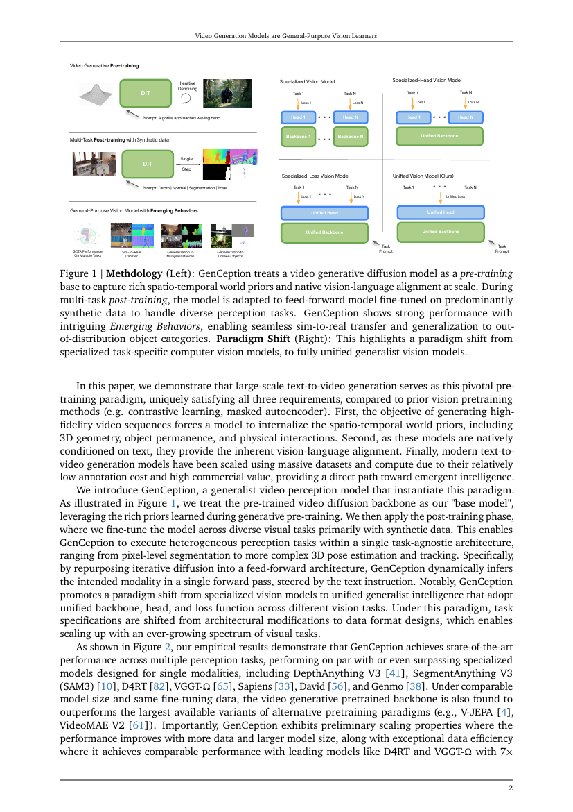
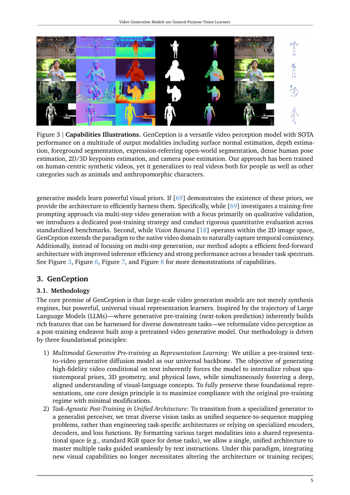
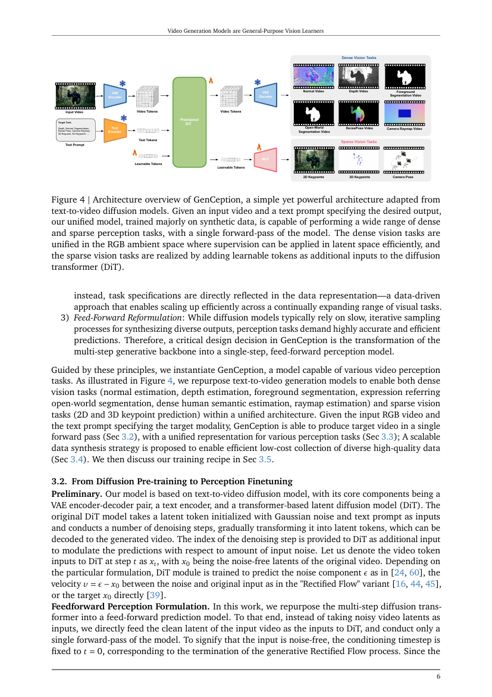
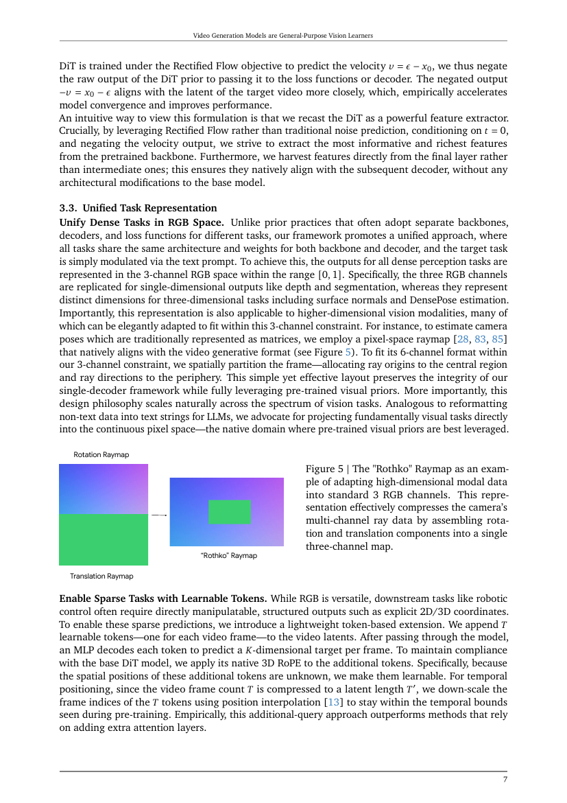
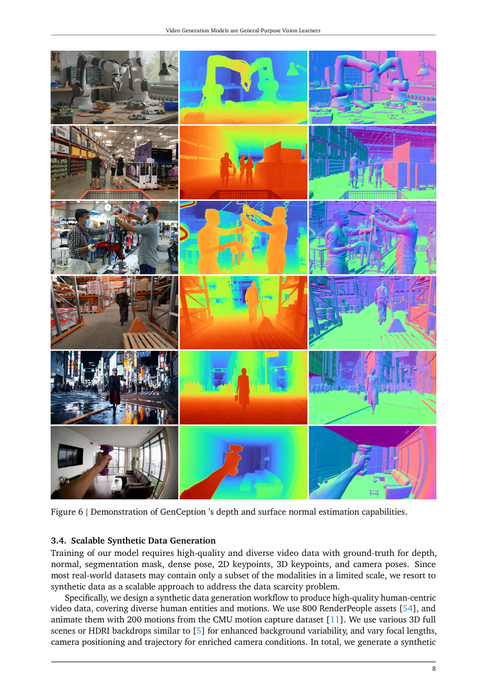
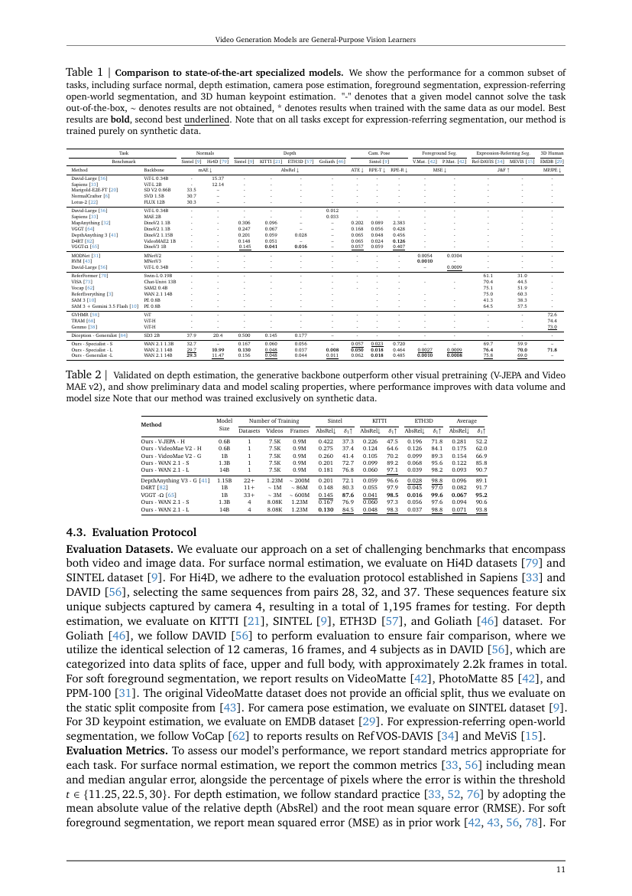
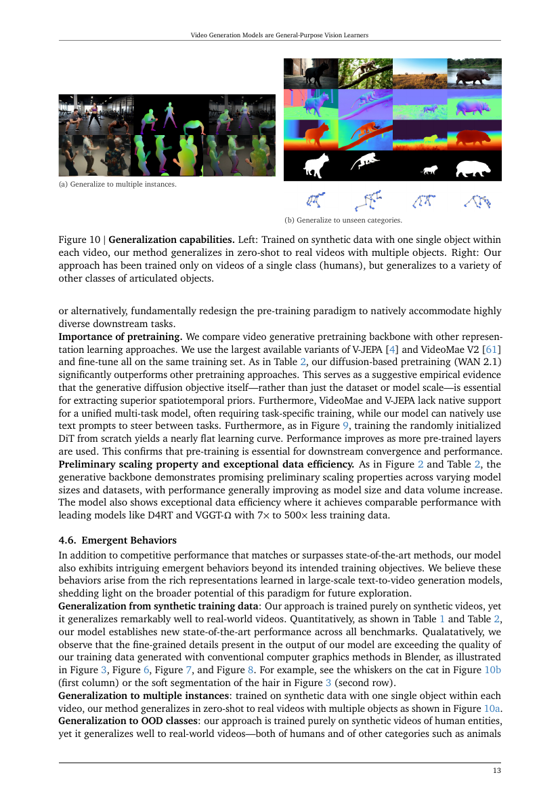

# Video Generation Models are General-Purpose Vision Learners

**Authors:** Letian Wang, Chuhan Zhang, Rishabh Kabra, Jasper Uijlings, Steven Waslander, Andrew Zisserman, Joao Carreira, Kaiming He, Misha Andriluka, Eduard Gabriel Bazavan, Andrei Zanfir, Cristian Sminchisescu  
**Source:** `/Users/roywangj/journey_wj/research/papers4zotero/zotero1/storage/D7FSTFHX/Wang 等 - 2026 - Video Generation Models are General-Purpose Vision Learners.pdf`  
**Version:** arXiv:2607.09024v1, 10 July 2026; 19 pages  
**Project:** https://genception.github.io

## Page / Section Index

| Pages | Sections |
|---|---|
| 1–2 | Abstract; Introduction |
| 3–5 | Related Work; GenCeption methodology |
| 6–8 | Diffusion-to-perception; task representation; synthetic data |
| 9–13 | Training; experiments; ablations; emergent behaviors |
| 14–19 | Conclusion; References [1]–[87] |

## Terminology Ledger

| English | Chinese |
|---|---|
| general-purpose vision learner | 通用视觉学习器 |
| video generative pre-training | 视频生成式预训练 |
| spatiotemporal prior | 时空先验 |
| feed-forward perception | 前馈式感知 |
| dense / sparse task | 稠密 / 稀疏任务 |
| raymap | 光线图（raymap） |
| Rectified Flow | Rectified Flow（整流流） |
| emergent behavior | 涌现行为 |

## Abstract

> <strong>Para. 1:</strong> Driven by next-token prediction, NLP shifted from task-specific models into powerful generalist foundation models. What, then, is the equivalent catalyst needed to achieve a general-purpose model in computer vision? We contend that large-scale text-to-video generation serves as a strong pre-training paradigm for computer vision, providing spatiotemporal priors, vision-language alignment, and scalability required for general visual intelligence.

> <strong>Para. 1[CN]:</strong> 在下一词预测的推动下，自然语言处理从特定任务模型转向强大的通用基础模型。那么计算机视觉实现通用模型所需的等价催化剂是什么？本文认为，大规模文本到视频生成是计算机视觉的一种强大预训练范式，提供通用视觉智能所需的时空先验、视觉—语言对齐和规模化条件。

> <strong>Para. 2:</strong> We introduce GenCeption, which leverages a pre-trained video generative diffusion backbone to define a feed-forward perception model capable of various vision tasks steered by text instructions. It achieves state-of-the-art performance on depth, surface normal, camera pose, expression-referring segmentation, and 3D keypoint prediction, often matching or surpassing DepthAnything3, SAM3, D4RT, VGGT-Ω, Sapiens, David, Genmo, and Lotus-2.

> <strong>Para. 2[CN]:</strong> 我们提出 GenCeption，利用预训练视频生成扩散骨干网络构建前馈式感知模型，并由文本指令控制以完成多种视觉任务。它在深度、表面法线、相机位姿、表达式指代分割和 3D 关键点预测上达到最先进性能，常常匹敌或超过 DepthAnything3、SAM3、D4RT、VGGT-Ω、Sapiens、David、Genmo 和 Lotus-2。

> <strong>Para. 3:</strong> Under comparable settings, the video-generative pretrained backbone outperforms V-JEPA and VideoMAE V2. GenCeption shows preliminary data and model scaling, and reaches comparable performance to D4RT and VGGT-Ω using 7× to 500× less training data. A model trained exclusively on synthetic human videos generalizes to real footage and out-of-distribution categories such as animals and robots. Video generation is therefore not merely a synthesis tool, but a path toward generalist vision intelligence for the physical world.

> <strong>Para. 3[CN]:</strong> 在可比设置下，视频生成预训练骨干网络优于 V-JEPA 和 VideoMAE V2。GenCeption 初步呈现数据与模型规模效应，仅用少 7 倍至 500 倍的训练数据就达到 D4RT 和 VGGT-Ω 的相当性能。仅在合成人类视频上训练的模型还能够泛化到真实视频以及动物、机器人等分布外类别。因此，视频生成不只是合成工具，也是面向物理世界通用视觉智能的一条路径。

## 1. Introduction

> <strong>Para. 1:</strong> Natural language processing evolved from specialized models for translation, summarization, and other tasks to a unified foundation-model paradigm. Large-scale next-token prediction followed by task-aligned post-training collapsed disparate linguistic challenges into one generalist intelligence and unlocked chain-of-thought and in-context learning.

> <strong>Para. 1[CN]:</strong> 自然语言处理从分别处理翻译、摘要等任务的专用模型，演化为统一基础模型范式。大规模下一词预测预训练结合任务对齐后训练，将不同语言挑战压缩到单一通用智能中，并解锁了思维链和上下文学习。

> <strong>Para. 2:</strong> Computer vision remains in the “specialized model” stage. Segment Anything models localization and Depth Anything models geometry, but both need task-specific architectures. A unified vision foundation model should be task-agnostic and mirror LLMs’ route from general pre-training to versatile emerging intelligence.

> <strong>Para. 2[CN]:</strong> 计算机视觉仍处在“专用模型”阶段。Segment Anything 负责定位、Depth Anything 负责几何，但二者都需要任务专用架构。统一视觉基础模型应当与任务无关，并像 LLM 一样从通用预训练走向多用途的涌现智能。

> <strong>Para. 3:</strong> We view the search for a generalist vision model as the search for a visual analogue of next-token prediction. It must model spatiotemporal evolution and 4D temporal causality, natively align vision with language, and scale in data and compute.

> <strong>Para. 3[CN]:</strong> 我们把寻找通用视觉模型看作寻找下一词预测的视觉对应物。它必须建模时空演化与 4D 时间因果，原生实现视觉—语言对齐，并在数据和计算上规模化。

> <strong>Para. 4:</strong> Large-scale text-to-video generation satisfies these requirements: high-fidelity sequences encode 3D geometry, object permanence, and physical interactions; text conditioning supplies language alignment; low annotation cost and commercial value support massive data and compute. GenCeption treats the pretrained video diffusion backbone as a base model, then fine-tunes diverse tasks mainly with synthetic data. A single forward pass, text instruction, unified backbone/head/loss, and data-format task specification replace iterative sampling and task-specific engineering.

> <strong>Para. 4[CN]:</strong> 大规模文本到视频生成满足这些要求：高保真序列编码 3D 几何、物体恒常性和物理交互；文本条件提供语言对齐；低标注成本与商业价值支持海量数据和计算。GenCeption 将预训练视频扩散骨干作为基础模型，主要用合成数据微调多种任务。一次前向传播、文本指令、统一骨干/头部/损失以及数据格式任务规格，取代了迭代采样和任务专用工程。

### Figure 1. Methodology and paradigm shift

**Caption:** GenCeption uses video-generative diffusion pretraining for spatiotemporal priors and native vision-language alignment, then performs multi-task post-training mainly on synthetic data. The right side contrasts specialized task-specific models with a unified generalist vision model.

**Caption[CN]:** GenCeption 以视频生成扩散预训练获得时空先验和原生视觉—语言对齐，再主要用合成数据多任务后训练。右侧对比了专用任务模型与统一通用视觉模型。

## 2. Related Work

### 2.1 Perception Foundation Models

> <strong>Para. 1:</strong> Segment Anything and Depth Anything leverage massive datasets for robust localization and geometry. Unified multi-task systems remain mostly image-domain systems lacking temporal dynamics, and often use rigid task-specific encoders, decoders, or losses. Video models that flexibly handle tasks have not reached specialized-model efficacy across broad video benchmarks. A unified video perception model with LLM-like proficiency is still missing.

> <strong>Para. 1[CN]:</strong> Segment Anything 和 Depth Anything 利用海量数据获得稳健的定位和几何能力。统一多任务系统大多仍在图像域，缺乏时间动态，并经常使用刚性的任务专用编码器、解码器或损失。在广泛视频基准上，能灵活处理任务的视频模型尚未达到专用模型的效果。具有类似 LLM 能力的统一视频感知模型仍然缺失。

### 2.2 Visual Representation Learning

> <strong>Para. 1:</strong> Masked autoencoders reconstruct missing image regions; VideoMAE and RVM extend them to video. DINO-style self-distillation matches student features to a moving teacher across global and local views. Vision-only methods lack explicit multimodal alignment. CLIP and SigLip use vision-language contrastive learning for open-vocabulary classification and segmentation, but video-level multimodal learning is hard to scale because dense-video training is expensive and temporal dynamics are complex. Video representation learners remain orders of magnitude smaller than language models.

> <strong>Para. 1[CN]:</strong> 掩码自编码器重建缺失图像区域，VideoMAE 和 RVM 将其扩展到视频。DINO 式自蒸馏在全局和局部视图上让学生特征匹配移动教师。纯视觉方法缺少显式多模态对齐。CLIP 和 SigLip 用视觉—语言对比学习支持开放词汇分类与分割，但视频级多模态学习难以扩展，因为密集视频训练昂贵、时间动态复杂。视频表征学习器的规模仍比语言模型小几个数量级。

### 2.3 Re-purposing Diffusion Models

> <strong>Para. 1:</strong> Marigold repurposes Stable Diffusion for monocular depth; GenPercept studies feature injection, decoding, and objectives; Diception steers multiple perception tasks with text prompts. Image diffusion lacks temporal consistency, motivating BufferAnytime, DepthCrafter, NormalCrafter, scalable synthetic-data methods, Geo4D, DiffusionRenderer, ReferEverything, and few-shot LoRA adaptation. These works mostly target one dense task. GenCeption unifies dense and sparse video perception, replaces slow iterative sampling with feed-forward inference, and extends THFM to broader tasks and benchmarks.

> <strong>Para. 1[CN]:</strong> Marigold 将 Stable Diffusion 重新用于单目深度；GenPercept 研究特征注入、解码和目标；Diception 用文本提示控制多个感知任务。图像扩散缺乏时间一致性，因此出现 BufferAnytime、DepthCrafter、NormalCrafter、可扩展合成数据、Geo4D、DiffusionRenderer、ReferEverything 和少样本 LoRA 适配。这些工作大多面向单一稠密任务。GenCeption 统一稠密和稀疏视频感知，用前馈推理取代慢速迭代采样，并将 THFM 扩展到更广任务和基准。

### Figure 3. Capabilities

**Caption:** Outputs include normals, depth, foreground and expression-referring open-world segmentation, dense human pose, 2D/3D keypoints, and camera pose; human-centric synthetic training generalizes to real people, animals, and anthropomorphic characters.

**Caption[CN]:** 输出包括法线、深度、前景和表达式指代开放世界分割、稠密人体姿态、2D/3D 关键点以及相机位姿；以人为中心的合成训练能够泛化到真实人物、动物和拟人角色。

## 3. GenCeption

### 3.1 Methodology

> <strong>Para. 1:</strong> The premise is that large-scale video generators are universal visual representation learners. Like LLM generative pretraining, GenCeption makes perception a post-training problem atop a pretrained generator. Its principles are multimodal generative pretraining as representation learning, task-agnostic unified post-training, and feed-forward reformulation.

> <strong>Para. 1[CN]:</strong> 其前提是大规模视频生成器是通用视觉表征学习器。仿照 LLM 生成式预训练，GenCeption 把感知变成预训练生成器之上的后训练问题。原则包括：以多模态生成预训练学习表征、在统一架构中进行任务无关后训练，以及前馈化改写。

> <strong>Para. 2:</strong> Text-conditioned high-fidelity generation forces robust spatiotemporal, 3D, physics, and vision-language representations, so the pretraining regime is minimally modified. Tasks are sequence-to-sequence mappings into a shared representation, selected by text rather than specialized encoders, decoders, or losses. New tasks need data-format design. A one-pass formulation is required because perception needs accuracy and efficiency.

> <strong>Para. 2[CN]:</strong> 文本条件高保真生成迫使模型学习稳健时空、3D、物理和视觉—语言表征，因此只做最小预训练改动。任务被定义为映射到共享表示的序列到序列问题，由文本选择，而非专用编码器、解码器或损失；新增任务只需设计数据格式。由于感知要求准确和高效，必须采用一次前向计算。

### Figure 4. Architecture overview

**Caption:** An RGB input video and target-task text prompt pass through VAE, text encoder, pretrained DiT, and a decoder. Dense outputs include normal, depth, foreground, open-world segmentation, DensePose, and camera raymap; sparse outputs use learnable tokens for 2D/3D keypoints and camera pose.

**Caption[CN]:** RGB 输入视频和目标任务文本提示经过 VAE、文本编码器、预训练 DiT 与解码器。稠密输出包括法线、深度、前景、开放世界分割、DensePose 和相机光线图；稀疏输出用可学习 token 预测 2D/3D 关键点和相机位姿。

### 3.2 From Diffusion Pre-training to Perception Finetuning

> <strong>Para. 1:</strong> The text-to-video diffusion model contains VAE, text encoder, and DiT. With Gaussian-noise tokens $x_t$ and prompt, DiT denoises over multiple steps; $x_0$ is the clean latent. It may predict $\epsilon$, Rectified Flow velocity $v=\epsilon-x_0$, or $x_0$.

> <strong>Para. 1[CN]:</strong> 文本到视频扩散模型由 VAE、文本编码器和 DiT 组成。DiT 以高斯噪声 token $x_t$ 和提示为输入，经过多步去噪；$x_0$ 是干净 latent。它可以预测 $\epsilon$、Rectified Flow 速度 $v=\epsilon-x_0$，或 $x_0$ 本身。

> <strong>Para. 2:</strong> We feed the clean input latent directly, fix $t=0$, and run once. Because WAN predicts $v$, we negate the output: $-v=x_0-\epsilon$, which is closer to the target latent and empirically accelerates convergence. The final DiT layer is used as a feature extractor and aligned directly to the decoder.

> <strong>Para. 2[CN]:</strong> 我们直接输入干净的输入 latent，将 $t$ 固定为 0，只运行一次。由于 WAN 预测 $v$，我们将输出取负：$-v=x_0-\epsilon$ 更接近目标 latent，并在实验上加快收敛。最终 DiT 层充当特征提取器，并直接与解码器对齐。

### 3.3 Unified Task Representation

> <strong>Para. 1:</strong> Every dense task uses the same backbone and decoder and is selected by text. Outputs lie in RGB $[0,1]$; scalar depth/segmentation replicate channels, while normals and DensePose use three dimensions. Camera matrices become a pixel-space raymap: origins are central and directions peripheral, compressing six channels into three. This projects visual tasks into the native continuous pixel space of the pretrained visual prior.

> <strong>Para. 1[CN]:</strong> 每个稠密任务使用相同骨干和解码器并由文本选择。输出位于 RGB $[0,1]$；标量深度/分割复制通道，法线和 DensePose 使用三个维度。相机矩阵变为像素空间光线图：原点在中心、方向在外围，把六通道压缩为三通道。这相当于将视觉任务投影到预训练视觉先验的原生连续像素空间。

> <strong>Para. 2:</strong> For sparse prediction, append one learnable token per frame. An MLP predicts a $K$-dimensional target from each token. Native 3D RoPE is used; spatial positions are learned and temporal indices are interpolated from $T$ frames to latent length $T'$. This query extension outperforms additional attention layers.

> <strong>Para. 2[CN]:</strong> 稀疏预测每帧追加一个可学习 token，MLP 从每个 token 预测 $K$ 维目标。使用原生 3D RoPE；空间位置可学习，时间索引从 $T$ 帧插值到 latent 长度 $T'$。这种查询扩展优于额外注意力层。

### Figure 5. “Rothko” Raymap

**Caption:** Rotation and translation raymaps are assembled into a three-channel “Rothko” representation.

**Caption[CN]:** 将旋转和位移光线图组合成三通道“Rothko”表示。

### 3.4 Scalable Synthetic Data Generation

> <strong>Para. 1:</strong> Real data rarely contains all required ground truth modalities at scale. We use 800 RenderPeople assets, 200 CMU mocap motions, diverse 3D scenes/HDRI backgrounds, focal lengths, camera locations, and trajectories to generate 7,500 human-centric videos. Blender passes provide normal, depth, and segmentation labels; rigged joints provide 2D/3D keypoints; all videos are trimmed and RGB/target latents and text embeddings are cached offline.

> <strong>Para. 1[CN]:</strong> 真实数据很少能以足够规模包含全部真值模态。我们使用 800 个 RenderPeople 资产、200 个 CMU 动捕动作、多样 3D 场景/HDRI 背景、焦距、相机位置和轨迹，生成 7,500 个以人为中心的视频。Blender 渲染通道提供法线、深度和分割标签；绑定关节提供 2D/3D 关键点；所有视频裁剪后离线缓存 RGB/目标 latent 和文本 embedding。

### 3.5 Training Recipe

> <strong>Para. 1:</strong> We use a single standard $L_2$ loss—latent space for dense tasks and output space for sparse tasks. Data representation, rather than loss engineering, supplies task customization. Depth is median-normalized to remove scale ambiguity and mapped by $d'=\operatorname{clip}(\alpha\log(d+1),0,1)$; task balancing is managed by mixture ratios.

> <strong>Para. 1[CN]:</strong> 我们使用单一标准 $L_2$ 损失：稠密任务在 latent 空间，稀疏任务在输出空间。任务定制由数据表示而非损失工程提供。深度按中位数归一化以消除尺度歧义，再通过 $d'=\operatorname{clip}(\alpha\log(d+1),0,1)$ 映射；任务平衡由数据混合比例管理。

## 4. Experiments

### 4.1 Implementation Details

> <strong>Para. 1:</strong> Using WAN 2.1, we train at $480\times832$, 81 frames, 24 FPS; temporal downsampling is 4 and spatial downsampling is 8. Training uses batch size 64, 256 v6e TPUs, Adam, learning rate $5e^{-5}$, 15,000 steps, and 250-step linear warmup. Gradient clipping and gradient dropping are essential. TartanAir, Virtual KITTI, MVS Synth add depth and trajectory data; MeViS, Ref-COCO, and YouTube-VOS provide real expression-referring segmentation data.

> <strong>Para. 1[CN]:</strong> 基于 WAN 2.1，我们使用 $480\times832$、81 帧、24 FPS 训练；时间下采样为 4，空间下采样为 8。训练使用 batch size 64、256 个 v6e TPU、Adam、学习率 $5e^{-5}$、15,000 步和 250 步线性 warmup。梯度裁剪与梯度丢弃不可或缺。TartanAir、Virtual KITTI、MVS Synth 增加深度和轨迹数据；MeViS、Ref-COCO、YouTube-VOS 提供真实表达式指代分割数据。

### Figures 6–8. Qualitative results

**Caption:** Depth and surface normal estimation capabilities.

**Caption[CN]:** 深度和表面法线估计能力。

**Caption:** Referring-expression segmentation recognizes objects, color, spatial relations, and motion, including unseen objects.

**Caption[CN]:** 指代表达式分割识别物体、颜色、空间关系和运动，包括未见物体。

**Caption:** Full-frame 3D pose estimation on skiing and snowboarding; no person detection or 2D keypoint preprocessing is required.

**Caption[CN]:** 滑雪和单板滑雪上的整帧 3D 姿态估计；不需要人物检测或 2D 关键点预处理。

### 4.2 Inference Cost

> <strong>Para. 1:</strong> Feed-forward inference removes WAN’s 50 diffusion steps. On one v6e TPU for 81 frames at $480\times832$, 1.3B takes 5.92 s, 13.6 FPS, 15.3 GB VRAM (DiT 0.96 s); 14B takes 10.03 s, 8.0 FPS, 42.8 GB VRAM (DiT 5.11 s). The shared text encoder is 10 GB and VAE 0.25 GB; offloading them to system memory trades speed for VRAM.

> <strong>Para. 1[CN]:</strong> 前馈推理移除了 WAN 的 50 步扩散。单块 v6e TPU 处理 $480\times832$、81 帧时，1.3B 模型耗时 5.92 秒、13.6 FPS、15.3 GB VRAM（DiT 0.96 秒）；14B 耗时 10.03 秒、8.0 FPS、42.8 GB VRAM（DiT 5.11 秒）。共享文本编码器为 10 GB，VAE 为 0.25 GB；卸载到系统内存可以用速度换显存。

### Table 1. SOTA comparison

| Method | Backbone | Representative results |
|---|---|---|
| DepthAnything 3 | DinoV2 1.15B | KITTI AbsRel 0.059; Sintel pose ATE 0.065 |
| D4RT | VideoMAE2 1B | KITTI AbsRel 0.051; Sintel pose ATE 0.065 |
| VGGT-Ω | DinoV3 1B | KITTI AbsRel 0.041; Sintel pose ATE 0.057 |
| Ours—Specialist—S | WAN 2.1 1.3B | normal mAE 32.7; depth KITTI 0.060; J&F 69.7 |
| Ours—Specialist—L | WAN 2.1 14B | normal mAE 29.7; depth KITTI 0.048; J&F 76.4; MPJPE 71.8 |
| Ours—Generalist—L | WAN 2.1 14B | normal mAE 29.3; depth KITTI 0.048; J&F 75.8 |

**Caption:** The full paper table compares normals, depth, camera pose, foreground and expression-referring segmentation, and 3D human keypoints; “-” means unavailable, “∼” not obtained, and “*” same-data training.

**Caption[CN]:** 论文完整表格比较法线、深度、相机位姿、前景和表达式指代分割以及 3D 人体关键点；“-”表示不可用，“∼”表示未获得，“*”表示相同数据训练。

### Table 2. Pretraining and scaling

| Method | Size | Videos / frames | Average AbsRel ↓ | Average δ1 ↑ |
|---|---:|---:|---:|---:|
| V-JEPA-H | 0.6B | 7.5K / 0.9M | 0.281 | 52.2 |
| VideoMAE V2-H | 0.6B | 7.5K / 0.9M | 0.175 | 62.0 |
| VideoMAE V2-G | 1B | 7.5K / 0.9M | 0.154 | 66.9 |
| WAN 2.1-S | 1.3B | 7.5K / 0.9M | 0.122 | 85.8 |
| WAN 2.1-L | 14B | 7.5K / 0.9M | 0.093 | 90.7 |
| DepthAnything V3-G | 1.15B | 1.23M / ∼200M | 0.096 | 89.1 |
| D4RT | 1B | ∼1M / ∼86M | 0.082 | 91.7 |
| VGGT-Ω | 1B | ∼3M / ∼600M | 0.067 | 95.2 |
| WAN 2.1-S, 4 datasets | 1.3B | 8.08K / 1.23M | 0.094 | 90.6 |
| WAN 2.1-L, 4 datasets | 14B | 8.08K / 1.23M | 0.071 | 93.8 |

**Caption:** Depth evaluation under identical synthetic data demonstrates the advantage of generative pretraining and preliminary scaling.

**Caption[CN]:** 在相同合成数据下的深度评估展示生成式预训练优势及初步规模效应。

### 4.3 Evaluation Protocol

> <strong>Para. 1:</strong> We evaluate normals on Hi4D and SINTEL; depth on KITTI, SINTEL, ETH3D, and Goliath; soft foreground on VideoMatte, PhotoMatte 85, and PPM-100; camera pose on SINTEL; 3D keypoints on EMDB; and expression-referring segmentation on Ref VOS-DAVIS and MeViS. Hi4D uses the Sapiens/DAVID protocol (pairs 28, 32, 37; six subjects; camera 4; 1,195 frames); Goliath follows DAVID (12 cameras, 16 frames, four subjects, about 2.2k frames). VideoMatte uses the static composite split from RVM.

> <strong>Para. 1[CN]:</strong> 我们在 Hi4D、SINTEL 上评估法线；在 KITTI、SINTEL、ETH3D、Goliath 上评估深度；在 VideoMatte、PhotoMatte 85、PPM-100 上评估软前景；在 SINTEL 上评估相机位姿；在 EMDB 上评估 3D 关键点；在 Ref VOS-DAVIS 和 MeViS 上评估表达式指代分割。Hi4D 使用 Sapiens/DAVID 协议（第 28、32、37 对，6 名主体，相机 4，1,195 帧）；Goliath 遵循 DAVID（12 个相机、16 帧、4 名主体、约 2.2k 帧）。VideoMatte 使用 RVM 的静态复合划分。

> <strong>Para. 2:</strong> We report mean/median angular error and threshold accuracy at $t\in\{11.25,22.5,30\}$ for normals; AbsRel and RMSE for depth; MSE for matting; J&F (mean IoU and contour accuracy) for referring segmentation; MPJPE for 3D keypoints; and ATE, RPE-T, RPE-R for camera pose.

> <strong>Para. 2[CN]:</strong> 法线报告平均/中位角误差及 $t\in\{11.25,22.5,30\}$ 阈值准确率；深度报告 AbsRel、RMSE；抠图报告 MSE；指代分割报告 J&F（IoU 与轮廓准确率均值）；3D 关键点报告 MPJPE；相机位姿报告 ATE、RPE-T、RPE-R。

### Figure 9. Pretrained-layer transfer

**Caption:** Performance as increasingly many layers are transferred from the pretrained text-to-video model.

**Caption[CN]:** 从预训练文本到视频模型迁移越来越多层时的性能。

### 4.4 Comparison to the state of the art

> <strong>Para. 1:</strong> The model does not use evaluation benchmark training sets; training is fully synthetic except expression-referring segmentation. It surpasses or closely matches tailored models in geometry, depth, pose, soft segmentation, language-referring segmentation, and 3D keypoints. Qualitative results appear in Figures 6–8.

> <strong>Para. 1[CN]:</strong> 模型没有使用评估基准的训练集；除表达式指代分割外，训练完全基于合成数据。它在几何、深度、位姿、软分割、语言指代分割和 3D 关键点上超过或接近定制模型。定性结果见图 6–8。

### 4.5 Ablations

> <strong>Para. 1:</strong> Joint generalist training has mixed dense-task effects, helps foreground segmentation, and leaves expression segmentation largely unchanged, but severely harms 3D keypoints. Coordinate regression tokens depart from continuous pixel-space pretraining, and randomly initialized tokens disturb pretrained attention. Minimal backbone modification is therefore advisable.

> <strong>Para. 1[CN]:</strong> 通用联合训练对稠密任务影响不一，能帮助前景分割，对表达式分割影响很小，却严重损害 3D 关键点。坐标回归 token 偏离连续像素空间预训练，随机初始化 token 又扰乱预训练注意力。因此应尽量少改动骨干网络。

> <strong>Para. 2:</strong> WAN 2.1 beats V-JEPA and VideoMAE V2 with the same fine-tuning set, suggesting the diffusion objective is essential. More transferred pretrained layers improve results, while a randomly initialized DiT barely learns. Model and data scaling improve performance; 7×–500× less data can match D4RT and VGGT-Ω.

> <strong>Para. 2[CN]:</strong> 在相同微调集上 WAN 2.1 超过 V-JEPA 和 VideoMAE V2，说明扩散目标很关键。迁移更多预训练层会提升结果，而随机初始化 DiT 几乎学不到东西。模型和数据规模都会带来改进；少 7 倍至 500 倍数据即可匹敌 D4RT 和 VGGT-Ω。

### 4.6 Emergent Behaviors

> <strong>Para. 1:</strong> Synthetic-only training transfers to real-world videos and produces details finer than Blender data, such as cat whiskers and soft hair boundaries. Training with one object per clip generalizes zero-shot to multiple real instances. Training only on humans generalizes to humans, animals, and anthropomorphic articulated characters.

> <strong>Para. 1[CN]:</strong> 仅用合成数据训练可以迁移到真实视频，输出细节甚至比 Blender 数据更细，例如猫的胡须和头发的柔和边界。每个片段一个物体的训练可以零样本泛化到含多个真实实例的场景。只训练人类也能泛化到人类、动物和拟人化关节角色。

### Figure 10. Generalization capabilities

**Caption:** Left: one synthetic object per video generalizes to multiple real objects. Right: human-only synthetic training generalizes to unseen articulated categories.

**Caption[CN]:** 左：每个视频一个合成物体的训练泛化到多个真实物体。右：仅人类合成训练泛化到未见的关节化类别。

## 5. Conclusion

> <strong>Para. 1:</strong> GenCeption identifies large-scale video generation as foundational pretraining for visual perception. Repurposing a pretrained diffusion backbone as an efficient feed-forward model transfers spatiotemporal priors and vision-language alignment into precise perception without iterative sampling. It matches specialized SOTA models, shows emergent behaviors, and supports evidence for a universal “world model” in video generators. Scalable generative pretraining may lead from task-specific engineering to unified vision intelligence for the physical world.

> <strong>Para. 1[CN]:</strong> GenCeption 将大规模视频生成确定为视觉感知的基础预训练。把预训练扩散骨干重新用作高效前馈模型，可以在不迭代采样的情况下把时空先验和视觉—语言对齐转化为精确感知。它匹敌专用 SOTA 模型、呈现涌现行为，并为视频生成器中存在通用“世界模型”提供证据。可扩展生成预训练可能推动视觉系统从任务专用工程走向物理世界的统一视觉智能。

## References

原文参考文献 [1]–[87] 位于 PDF 第 14–19 页，全部保留为 searchable bibliographic text；编号、作者、题名、年份、期刊/会议和 arXiv 标识不翻译，以便核验。完整逐条文本见随附 `source_map.json` 的页码映射和 PDF 原文；本详细稿不以摘要替代参考文献。

## Source / asset note

PDF 共 19 页，使用 `pdftotext -layout` 对全文进行提取并以页面渲染检查了第 1、2、3、5、6、7、8、10、11、12、13、14、19 页。图表采用 PDF 页面级 PNG，避免多面板裁切丢失；重要 Table 1/2 已转录为可搜索 Markdown。由于论文的 Figure 2 仅在图表页内嵌复合图，相关页面资产保留其原始信息。未发现附录、补充材料或 prompt/code block；参考文献页为论文正文最后部分。
