# Video-DeepResearch: Towards the Next-Generation Multimodal Deepresearch Agent

**Authors:** Zhen Fang, Yu Zeng, Wenxuan Huang, Yiming Zhao, Shiting Huang, Tianfei Ren, Qi Lu, Qingnan Ren, Qisheng Su, Lionel Z. Wang, Qingyu Yin, Shuang Chen, Zehui Chen, Lin Chen, Zhenfei Yin, Yao Hu, Shaohui Lin, Wanli Ouyang, Shaosheng Cao, Feng Zhao (Video-Deepresearch Team)
**Source:** `/Users/roywangj/journey_wj/research/papers4zotero/zotero1/storage/9FZK7FJH/Fang 等 - 2026 - Video-DeepResearch Towards the Next-Generation Multimodal Deepresearch Agent.pdf`
**Detected source format:** selectable-text PDF (`pdf-text`), 20 pages
**Reader type:** complete paragraph-level English–Chinese detailed reader.
**Code:** https://github.com/Osilly/Vision-DeepResearch
**arXiv:** 2608.03979v1 [cs.CV] 4 Aug 2026

## Page / Section Index

| Source location | Section | Notes |
|---|---|---|
| p.1 | Title, Abstract, §1 Introduction (start) | Two-column A4; left column finishes the abstract and starts §1; right column continues §1 |
| p.2 | §1 contributions; Figure 1; §2 start; Problem Formulation; Eq. (1) | Figure 1 occupies the left column |
| p.3 | Figure 2; Eq. (1) continuation; Empirical Study; Table 1; Finding 1/2; §3 start; §3.1 Step 0 | Figure 2 is full-width |
| p.4 | Figure 3 (four-phase overview); §3.1 Step 0–1 continuation | Figure 3 is full-width |
| p.5 | §3.1 Step 2; §3.2; §3.3 SFT + Eq. (2); GRPO start | |
| p.6 | Eq. (3); §3.4 VideoDR-Bench; Table 2; §4.1; §4.2 start | Table 2 in the right column |
| p.7 | Table 3; §4.2 main results | Table 3 is full-width |
| p.8 | §4.2 News/scaling; §4.3 Table 4; §4.4 Table 5 | |
| p.9 | Ablation discussion; §4.5; §5.1 | |
| p.10 | §5.2; §6 Conclusion; Author Information; Limitation | |
| p.11–13 | References | Bibliographic form retained; not translated entry-by-entry |
| p.13–14 | Appendix B Training Details; C Data Details; D Annotation Details | p.14 is left-column remainder |
| p.15–19 | Figures 4–8 (exact prompts) | Literals preserved |
| p.20 | Table 6 tools | |

## Terminology Ledger

| English | Chinese | Notes |
|---|---|---|
| Video-DeepResearch / VIDEO-DEEPRESEARCH | Video-DeepResearch | Method/framework name; PDF small-caps rendered as VIDEO-DEEPRESEARCH |
| Video-DR | Video-DR | Task paradigm: video deep research |
| VideoDR / VIDEO-DR | VideoDR | Existing benchmark of Liu et al., 2026; table headers mix Video-DR / VideoDR / VIDEO-DR |
| VideoDR-Bench / VIDEODR-BENCH | VideoDR-Bench | Authors' benchmark |
| Vision-DeepResearch | Vision-DeepResearch | Prior image-centric system (Huang et al., 2026) |
| modality bias | 模态偏向 | Agents prefer text tools over visual tools |
| parametric knowledge leakage | 参数知识泄漏 | Answering from internal memory without tools |
| decoupled perception-exploration pipeline | 解耦的感知–探索流水线 | Stage-wise visual grounding then web search |
| stage-wise tool unlocking | 分阶段工具解锁 | Vision-only first, then Search/Visit |
| Select_Keyframe | Select_Keyframe | Temporal tool identifier |
| Crop_Search | Crop_Search | Spatial crop + visual search tool |
| Text_Search / Search | Text_Search / Search | Text web search |
| Visit | Visit | Page-visit tool |
| select_crop_search | select_crop_search | Joint tool name in prompts/Table 6 |
| GRPO | GRPO (Group Relative Policy Optimization) | 组相对策略优化 |
| SFT | SFT（监督微调） | Supervised Fine-Tuning |
| VQA | VQA（视觉问答） | Visual question answering |
| keyframe | 关键帧 | |
| bounding box / bbox | 边界框 / bbox | Keep `bbox` in formulas and JSON |
| reverse-image search | 以图搜图 / 反向图像搜索 | |
| Pass@4 | Pass@4 | Four rollouts; retain instances with score in $(0,1)$ |
| reject sampling / rejection sampling | 拒绝采样 | Source mixes “reject sampling” (Fig. 3) and “rejection sampling” (body) |
| KNL / ENT / DLY / G&S / NWS / OTH | 知识 / 娱乐 / 日常 / 游戏与体育 / 新闻 / 其他 | VideoDR-Bench category abbreviations |
| Agentic setting | Agentic 设定 | Full visual + text tool suite |
| Direct setting | Direct 设定 | Tool-free baseline named in Table 3 caption |
| Qwen3.5-35B-A3B | Qwen3.5-35B-A3B | Foundation of the 35B variant |
| Qwen3.5-397B-A17B / A13B / A3B | Qwen3.5-397B-A17B 等 | PDF naming is inconsistent across sections; transcribe locally |
| Qwen3-VL-30B-A3B-Instruct | Qwen3-VL-30B-A3B-Instruct | Foundation of the 30B variant |
| Claude-4.5-Sonnet | Claude-4.5-Sonnet | |
| GPT-5 | GPT-5 | |
| Gemini 2.5 Pro | Gemini 2.5 Pro | |
| Kimi K2.5 | Kimi K2.5 | |
| CLIP / CLIP-ViT-L/14@336px | CLIP / CLIP-ViT-L/14@336px | |
| VDR | VDR | Text-only QA source from Huang et al., 2026 |
| VIDEOHUNT | VIDEOHUNT | Name used in Appendix D; not reconciled with VideoDR-Bench |
| Drafting Agent / QA Generation Agent / Ranking Agent | Drafting Agent / QA Generation Agent / Ranking Agent | Keep English identifiers |
| Megatron-LM | Megatron-LM | |
| MoE | MoE（混合专家） | Mixture-of-Experts |

## Abstract

> <strong>Para. 1:</strong> We introduce Video-DeepResearch (Video-DR), extending multimodal agents from static images to continuous video streams, a setting that demands dense spatiotemporal grounding coupled with open-web exploration.

> <strong>Para. 1[CN]:</strong> 我们提出 Video-DeepResearch（Video-DR），把多模态智能体从静态图像扩展到连续视频流。这一设定同时要求稠密的时空定位，以及面向开放网络的探索。

> <strong>Para. 2:</strong> Preliminary evaluations reveal two critical bottlenecks in current models: (1) modality bias, where agents bypass visual tools in favor of textual search, and (2) parametric knowledge leakage, where models rely on internal memory rather than genuine tool-augmented execution.

> <strong>Para. 2[CN]:</strong> 初步评估揭示了当前模型的两个关键瓶颈：（1）模态偏向，即智能体绕过视觉工具、转而依赖文本搜索；（2）参数知识泄漏，即模型依赖内部记忆，而不是真正借助工具来执行任务。

> <strong>Para. 3:</strong> To address these challenges, we propose VIDEO-DEEPRESEARCH, featuring a decoupled perception-exploration pipeline with stage-wise tool unlocking that compels exhaustive cross-frame visual grounding prior to web retrieval.

> <strong>Para. 3[CN]:</strong> 为应对这些挑战，我们提出 VIDEO-DEEPRESEARCH：它采用解耦的感知–探索流水线，并配合分阶段工具解锁，迫使模型在进行网页检索之前，先完成穷尽式的跨帧视觉定位。

> <strong>Para. 4:</strong> Our framework adopts a two-stage training recipe—supervised fine-tuning followed by Group Relative Policy Optimization (GRPO)—enabling autonomous exploration that breaks the imitation-learning ceiling.

> <strong>Para. 4[CN]:</strong> 该框架采用两阶段训练配方——先做监督微调，再做 Group Relative Policy Optimization（GRPO）——从而支持自主探索，并突破模仿学习的上限。

> <strong>Para. 5:</strong> Furthermore, we curate VIDEODR-BENCH, a human-AI collaborative benchmark comprising 200 complex, multi-hop VQA instances.

> <strong>Para. 5[CN]:</strong> 此外，我们构建了 VIDEODR-BENCH：这是一个人机协同标注的基准，包含 200 道复杂的多跳 VQA 实例。

> <strong>Para. 6:</strong> Empirical results demonstrate that our Video-DeepResearch-35B-A3B establishes a new state-of-the-art of 64.0% average accuracy, surpassing proprietary Claude-4.5-Sonnet (59.0%) by 5.0 points and significantly outperforming GPT-5 (52.5%) and Gemini 2.5 Pro (57.5%).

> <strong>Para. 6[CN]:</strong> 实验结果表明，我们的 Video-DeepResearch-35B-A3B 以 64.0% 的平均准确率达到新的最优水平，比专有模型 Claude-4.5-Sonnet（59.0%）高出 5.0 个百分点，并明显优于 GPT-5（52.5%）和 Gemini 2.5 Pro（57.5%）。

> <strong>Para. 7:</strong> The 30B-A3B variant achieves 59.3%, competitive with Claude-4.5-Sonnet and demonstrating the effectiveness of our training paradigm even at compact scale.

> <strong>Para. 7[CN]:</strong> 30B-A3B 变体达到 59.3%，与 Claude-4.5-Sonnet 相当，说明即使在更紧凑的模型规模上，该训练范式依然有效。

## 1 Introduction

> <strong>Para. 1:</strong> Executing long-horizon tasks through active interaction marks a critical milestone in the pursuit of AGI, a capability epitomized by the recent rise of deep research agents (Li et al., 2025b; Wu et al., 2025a; Tao et al., 2025).

> <strong>Para. 1[CN]:</strong> 通过主动交互来执行长程任务，是迈向 AGI 的一个关键里程碑；近期兴起的深度研究智能体，正集中体现了这一能力（Li et al., 2025b; Wu et al., 2025a; Tao et al., 2025）。

> <strong>Para. 2:</strong> Leveraging advanced VLMs (Bai et al., 2025; Team, 2026; Comanici et al., 2025), research agents have advanced into unstructured, vision-rich digital wildernesses (Chen et al., 2026; Huang et al., 2026; Ma et al., 2025; Wu et al., 2025b; Feng et al., 2026).

> <strong>Para. 2[CN]:</strong> 借助先进的视觉–语言模型（Bai et al., 2025; Team, 2026; Comanici et al., 2025），研究型智能体已经进入非结构化、视觉信息丰富的数字荒野（Chen et al., 2026; Huang et al., 2026; Ma et al., 2025; Wu et al., 2025b; Feng et al., 2026）。

> <strong>Para. 3:</strong> This transition shifts the agent’s workload from processing clean textual inputs to decoupling critical insights from noisy, heavily redundant multimedia web layouts, redefining the complexity of autonomous exploration.

> <strong>Para. 3[CN]:</strong> 这一转变把智能体的工作负荷，从处理干净的文本输入，变成从嘈杂、高度冗余的多媒体网页布局中解耦出关键信息，从而重新定义了自主探索的复杂度。

> <strong>Para. 4:</strong> Previous literature addressing these challenges generally tracks a multi-modal trajectory.

> <strong>Para. 4[CN]:</strong> 此前应对这些挑战的文献，大体沿着一条多模态演进路线展开。

> <strong>Para. 5:</strong> Text-based web agents, notably WebGPT (Nakano et al., 2021) and AutoGPT (Yang et al., 2023), established the foundations of iterative knowledge synthesis through programmatic search.

> <strong>Para. 5[CN]:</strong> 基于文本的网页智能体，尤其是 WebGPT（Nakano et al., 2021）和 AutoGPT（Yang et al., 2023），通过程序化搜索奠定了迭代式知识综合的基础。

> <strong>Para. 6:</strong> To accommodate rich visual layouts, subsequent paradigms shifted toward sensory interfaces; frameworks like WebWatcher (Geng et al., 2025) introduced various vision tools for better search, and recent Vision-DeepResearch (Huang et al., 2026) expanded this frontier to execute multi-step, exhaustive search across highly dense and complex visual contexts.

> <strong>Para. 6[CN]:</strong> 为了适应丰富的视觉布局，后续范式转向了感官接口：WebWatcher（Geng et al., 2025）等框架引入了多种视觉工具以改善搜索；最近的 Vision-DeepResearch（Huang et al., 2026）则把这一前沿推进到在高度稠密、复杂的视觉上下文中执行多步、穷尽式搜索。

> <strong>Para. 7:</strong> Despite these advances, current literature bypasses an ecologically valid yet far more formidable setting: **Video-DeepResearch (Video-DR)**.

> <strong>Para. 7[CN]:</strong> 尽管已有这些进展，现有文献仍绕开了一个生态上更真实、同时也严峻得多的设定：**Video-DeepResearch（Video-DR）**。

> <strong>Para. 8:</strong> This paradigm shifts the focus from isolated modalities to a holistic environment where text-based synthesis and dense visual tracking are deeply intertwined, fundamentally redefining the cognitive workload of autonomous agents.

> <strong>Para. 8[CN]:</strong> 该范式把焦点从彼此隔离的模态，转向一个整体环境：文本综合与稠密视觉追踪在其中深度缠绕，从而从根本上重新定义了自主智能体的认知负荷。

> <strong>Para. 9:</strong> Pioneering this Video-DR frontier entails two fundamental bottlenecks that existing methodologies fail to address.

> <strong>Para. 9[CN]:</strong> 开拓 Video-DR 这一前沿，会碰到现有方法未能解决的两个根本瓶颈。

> <strong>Para. 10:</strong> First, on the data synthesis front, it remains largely elusive how to construct effective training pipelines that align with the intrinsic properties of video-based deep research.

> <strong>Para. 10[CN]:</strong> 第一，在数据合成方面，如何构建与视频深度研究内在属性相匹配的有效训练流水线，目前在很大程度上仍不清楚。

> <strong>Para. 11:</strong> Conventional video datasets focus on localized captions or short-term action labels; conversely, Video-DR requires generative data curation that couples long-horizon decision trajectories with dense, time-varying textual and visual evidence.

> <strong>Para. 11[CN]:</strong> 传统视频数据集关注局部化字幕或短时动作标签；相反，Video-DR 需要生成式数据策展，把长程决策轨迹与稠密、随时间变化的文本和视觉证据耦合在一起。

> <strong>Para. 12:</strong> Second, from an evaluation perspective, establishing a rigorous and high-fidelity benchmark presents a formidable challenge.

> <strong>Para. 12[CN]:</strong> 第二，从评估角度看，建立一套严格且高保真的基准本身就是一项艰巨挑战。

> <strong>Para. 13:</strong> Standard visual question-answering metrics are insufficient for measuring an agent’s multi-step strategic execution, creating an urgent need for multi-dimensional evaluation protocols that can accurately quantify long-term reasoning consistency and error-recovery behavior under continuous temporal dynamics.

> <strong>Para. 13[CN]:</strong> 标准视觉问答指标不足以衡量智能体的多步策略执行，因此迫切需要多维评估协议，以便在连续时间动态下准确量化长期推理一致性与错误恢复行为。

> <strong>Para. 14:</strong> To tackle these challenges, we first conduct an empirical investigation into the fundamental failure modes of current agents when directly applied to Video-DR.

> <strong>Para. 14[CN]:</strong> 为应对这些挑战，我们首先对现有智能体直接用于 Video-DR 时的根本失败模式做了实证考察。

> <strong>Para. 15:</strong> By evaluating three representative models on an existing benchmark (Liu et al., 2026), we uncover two striking findings: (i) severe modality bias, where even the strongest open-source model averages only 0.10 visual tool invocations per task while heavily relying on text search (1.27 calls), indicating a systematic aversion to active visual exploration; and (ii) parametric knowledge leakage, where GPT-5 attains a competitive accuracy of 57% with virtually zero tool calls, suggesting that existing evaluations are largely solvable through memorized world knowledge alone.

> <strong>Para. 15[CN]:</strong> 通过在已有基准（Liu et al., 2026）上评估三个代表性模型，我们发现了两个突出结果：（i）严重的模态偏向——即便最强的开源模型，每个任务平均也只调用 0.10 次视觉工具，却大量依赖文本搜索（1.27 次），说明模型系统性地回避主动视觉探索；（ii）参数知识泄漏——GPT-5 几乎不调用工具，却能达到 57% 的有竞争力准确率，表明现有评测在很大程度上单靠记忆中的世界知识就能解。

> <strong>Para. 16:</strong> These findings motivate a holistic rethinking of both the training and evaluation paradigms for Video-DR agents.

> <strong>Para. 16[CN]:</strong> 这些发现促使我们从整体上重新思考 Video-DR 智能体的训练范式与评估范式。

> <strong>Para. 17:</strong> Building on these insights, we propose VIDEO-DEEPRESEARCH, a unified framework that jointly addresses the data, training, and evaluation challenges of Video-DR.

> <strong>Para. 17[CN]:</strong> 基于上述认识，我们提出 VIDEO-DEEPRESEARCH：这是一个统一框架，同时应对 Video-DR 在数据、训练和评估上的挑战。

> <strong>Para. 18:</strong> Our contributions are summarized as follows:

> <strong>Para. 18[CN]:</strong> 我们的贡献概括如下：

> <strong>Para. 19:</strong> A scalable data engine that produces 30K video-grounded QA pairs and 7K curated trajectories through a decoupled perception-exploration pipeline with stage-wise tool unlocking, directly countering the modality bias revealed in our preliminary study.

> <strong>Para. 19[CN]:</strong> 一套可扩展的数据引擎：它通过解耦的感知–探索流水线与分阶段工具解锁，生成 30K 条视频锚定的问答对和 7K 条精选轨迹，直接针对初步研究中揭示的模态偏向。

> <strong>Para. 20:</strong> A two-stage training recipe combining supervised fine-tuning with GRPO, enabling compact models to outperform far larger proprietary systems. Our Video-DeepResearch-35B-A3B (64.0%) establishes a new state-of-the-art, surpassing Claude-4.5-Sonnet (59.0%) by 5.0 points; the 30B variant (59.3%) achieves competitive performance with the proprietary baseline while demonstrating strong open-source capability.

> <strong>Para. 20[CN]:</strong> 一套两阶段训练配方，把监督微调与 GRPO 相结合，使紧凑模型能够超过规模大得多的专有系统。我们的 Video-DeepResearch-35B-A3B（64.0%）达到新的最优水平，比 Claude-4.5-Sonnet（59.0%）高出 5.0 个百分点；30B 变体（59.3%）与该专有基线相当，同时展现出很强的开源能力。

> <strong>Para. 21:</strong> VIDEODR-BENCH, a 200-instance multi-hop VQA benchmark built via scalable human–AI collaborative annotation, where every question provably requires both visual search and external knowledge reasoning.

> <strong>Para. 21[CN]:</strong> VIDEODR-BENCH：一个含 200 个实例的多跳 VQA 基准，通过可扩展的人机协同标注构建；其中每一道题都可证明同时需要视觉搜索和外部知识推理。

## 2 A Naive Attempt: From Image DeepResearch to Video DeepResearch

### Figure 1. 从图像深度研究到视频深度研究的流程对照

**Caption:** Figure 1: Overview of the VIDEO-DEEPRESEARCH pipeline.

**Caption[CN]:** 图 1：VIDEO-DEEPRESEARCH 流程总览。

> <strong>Para. 1:</strong> As shown in Fig. 1, we conceptualize video as a **temporal composition of key entity trajectories**.

> <strong>Para. 1[CN]:</strong> 如图 1 所示，我们把视频概念化为**关键实体轨迹的时间组合**。

> <strong>Para. 2:</strong> Consequently, our key insight is that Video-DR can be formulated as a sequential grounding pipeline: identifying critical temporal frames, performing localized visual search, and synthesizing findings via subsequent text retrieval.

> <strong>Para. 2[CN]:</strong> 因此，我们的关键洞见是：Video-DR 可以表述为一条顺序定位流水线——识别关键时间帧，执行局部视觉搜索，再通过后续文本检索综合所得证据。

> <strong>Para. 3:</strong> To operationalize this workflow and bridge the gap from image-centric research, we equip the agent with two fundamental tools: `Select_Keyframe` and `Crop_Search`.

> <strong>Para. 3[CN]:</strong> 为把这一工作流落地，并弥合从以图像为中心的研究到视频设定的差距，我们给智能体配备了两个基本工具：`Select_Keyframe` 和 `Crop_Search`。

> <strong>Para. 4:</strong> Specifically, the agent first uses `Select_Keyframe` to isolate informative moments from the continuous stream, and then applies `Crop_Search` on salient entities to construct precise visual queries, which firmly anchors the downstream text-based exploration.

> <strong>Para. 4[CN]:</strong> 具体而言，智能体首先用 `Select_Keyframe` 从连续视频流中分离出有信息量的时刻，再对显著实体调用 `Crop_Search` 以构造精确的视觉查询，从而把下游的文本探索牢固锚定下来。

### Problem Formulation

> <strong>Para. 5:</strong> **Problem Formulation.** Formally, given a complex research query $Q$ and a visual input $V = \{v_1, v_2, \ldots, v_T\}$ (which can be either a continuous video stream or a sequence of pre-sampled keyframes), the goal of a Video-DR agent is to synthesize a comprehensive response $R$.

> <strong>Para. 5[CN]:</strong> **问题形式化。** 形式地说，给定复杂研究查询 $Q$ 和视觉输入 $V = \{v_1, v_2, \ldots, v_T\}$（既可以是连续视频流，也可以是预采样关键帧序列），Video-DR 智能体的目标是综合出一份完整回答 $R$。

> <strong>Para. 6:</strong> We formulate this as a sequential decision-making process. At step $i$, the agent generates an action $a_i \in \mathcal{A}$ based on the historical trajectory $\mathcal{H}_i = [Q, V, a_1, o_1, \ldots, a_{i-1}, o_{i-1}]$:

> <strong>Para. 6[CN]:</strong> 我们把它表述为一个顺序决策过程。在第 $i$ 步，智能体根据历史轨迹 $\mathcal{H}_i = [Q, V, a_1, o_1, \ldots, a_{i-1}, o_{i-1}]$ 生成动作 $a_i \in \mathcal{A}$：

$$
a_i \sim \pi_\theta(a \mid \mathcal{H}_i) \qquad (1)
$$

> <strong>Para. 7:</strong> where $\pi_\theta$ denotes the multi-modal policy and $o$ is the execution observation from the environment.

> <strong>Para. 7[CN]:</strong> 其中 $\pi_\theta$ 表示多模态策略，$o$ 是来自环境的执行观测。

> <strong>Para. 8:</strong> To operationalize the spatiotemporal grounding pipeline, the action space $\mathcal{A}$ encompasses our defined tools alongside standard web operations: $\mathcal{A} = \{\texttt{Select\_Keyframe}, \texttt{Crop\_Search}, \texttt{Text\_Search}, \ldots\}$.

> <strong>Para. 8[CN]:</strong> 为把时空定位流水线落地，动作空间 $\mathcal{A}$ 既包含我们定义的工具，也包含标准网页操作：$\mathcal{A} = \{\texttt{Select\_Keyframe}, \texttt{Crop\_Search}, \texttt{Text\_Search}, \ldots\}$。

> <strong>Para. 9:</strong> Specifically, the temporal tool selects a specific index $t \in \{1, \ldots, T\}$ to isolate an informative frame $v_t$. Subsequently, the spatial tool takes $v_t$ and a bounding box $B \in \mathbb{R}^4$ to crop a target entity, yielding a localized visual context $c_{\mathrm{vis}} = \mathrm{Crop}(v_t, B)$ for downstream search.

> <strong>Para. 9[CN]:</strong> 具体而言，时间工具选择一个特定索引 $t \in \{1, \ldots, T\}$，以分离出信息量充足的帧 $v_t$。随后，空间工具以 $v_t$ 和一个边界框 $B \in \mathbb{R}^4$ 裁剪目标实体，得到用于下游搜索的局部视觉上下文 $c_{\mathrm{vis}} = \mathrm{Crop}(v_t, B)$。

> <strong>Para. 10:</strong> Alternatively, these two tools can be encapsulated into a single joint operation.

> <strong>Para. 10[CN]:</strong> 或者，这两个工具也可以封装成一次联合操作。

### Empirical Study

> <strong>Para. 11:</strong> **Empirical Study.** To empirically evaluate this naive formulation, we instantiate the agent with three representative models on a VideoDR (Liu et al., 2026) benchmark, specifically tracking the execution frequencies of each tool to analyze their behavioral patterns.

> <strong>Para. 11[CN]:</strong> **实证研究。** 为实证评估这一朴素形式化，我们在 VideoDR（Liu et al., 2026）基准上，用三个代表性模型实例化智能体，并专门追踪每种工具的执行频次，以分析其行为模式。

### Figure 2. VideoDR-Bench 的六个视频领域总览

**Caption:** Figure 2: Overview of VIDEODR-BENCH. The benchmark spans six video domains: Knowledge (29.5%), Entertainment (22.0%), Daily Life (18.5%), Game & Sports (14.5%), News (12.0%), and Others (3.5%). Every instance requires joint visual grounding and multi-hop external knowledge reasoning.

**Caption[CN]:** 图 2：VIDEODR-BENCH 总览。该基准覆盖六个视频领域：知识（29.5%）、娱乐（22.0%）、日常生活（18.5%）、游戏与体育（14.5%）、新闻（12.0%）以及其他（3.5%）。每个实例都需要联合进行视觉定位和多跳外部知识推理。

### Table 1. 朴素设定下的准确率与工具调用次数

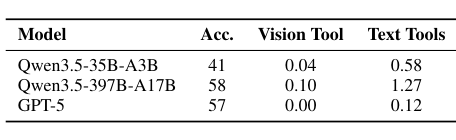

| Model | Acc. | Vision Tool | Text Tools |
|---|---:|---:|---:|
| Qwen3.5-35B-A3B | 41 | 0.04 | 0.58 |
| Qwen3.5-397B-A17B | 58 | 0.10 | 1.27 |
| GPT-5 | 57 | 0.00 | 0.12 |

**Caption:** Table 1: Comparison of Accuracy and Average Tool Invocation Counts between Models on VideoDR (Liu et al., 2026).

**Caption[CN]:** 表 1：各模型在 VideoDR（Liu et al., 2026）上的准确率与平均工具调用次数比较。

> <strong>Para. 12:</strong> As shown in Table 1, our preliminary evaluation yields two critical findings:

> <strong>Para. 12[CN]:</strong> 如表 1 所示，初步评估得到两项关键发现：

> <strong>Para. 13:</strong> **Finding 1: Severe Modality Bias and Visual Tool Aversion.** Current models exhibit an inherent reluctance to invoke visual tools. Even the most capable open-source model, Qwen3.5-397B-A17B, executes an average of only 0.10 visual operations per task, overwhelmingly favoring text tools (1.27). This indicates that agents predominantly default to textual search, completely bypassing the intended active visual exploration.

> <strong>Para. 13[CN]:</strong> **发现 1：严重的模态偏向与视觉工具回避。** 当前模型对调用视觉工具有内在抵触。即便能力最强的开源模型 Qwen3.5-397B-A17B，每个任务平均也只执行 0.10 次视觉操作，却压倒性地偏好文本工具（1.27 次）。这表明智能体大多默认走文本搜索，完全绕开了本应进行的主动视觉探索。

> <strong>Para. 14:</strong> **Finding 2: Susceptibility to Parametric Knowledge Leakage.** Existing evaluation setups suffer from severe prior knowledge leakage. Notably, GPT-5 achieves a highly competitive score of 57 while making virtually zero tool calls (0.00 for vision and 0.12 for text). This suggests that the model bypasses the multi-step grounding process entirely, relying solely on its vast internal memory to hallucinate or directly guess the correct answers.

> <strong>Para. 14[CN]:</strong> **发现 2：易受参数知识泄漏影响。** 现有评估设定存在严重的先验知识泄漏。值得注意的是，GPT-5 几乎不调用工具（视觉 0.00 次、文本 0.12 次），却拿到了极具竞争力的 57 分。这表明模型完全绕开了多步定位过程，只依赖其庞大的内部记忆去幻觉或直接猜出正确答案。

## 3 VIDEO-DEEPRESEARCH

> <strong>Para. 1:</strong> We first detail a generative pipeline for synthesizing Video QA data (Sec. 3.1), which serves as the foundation for constructing high-quality execution trajectories (Sec. 3.2). Building on this curated data, we then describe the multi-modal training procedure for our agent (Sec. 3.3), and finally establish a robust benchmark to evaluate Video-DR capabilities (Sec. 3.4).

> <strong>Para. 1[CN]:</strong> 我们首先详述用于合成视频问答数据的生成流水线（第 3.1 节），它是构造高质量执行轨迹的基础（第 3.2 节）。基于这些策展数据，我们再描述智能体的多模态训练流程（第 3.3 节），最后建立一套稳健基准来评估 Video-DR 能力（第 3.4 节）。

### Figure 3. VIDEO-DEEPRESEARCH 四阶段总览

**Caption:** Figure 3: Overview of VIDEO-DEEPRESEARCH. Phase I: Raw videos from diverse sources are filtered via rule-based and agent-based stages. Phase II: Keyframes are selected, entities are cropped for visual search, and VQA pairs are synthesized through single- and multi-entity patterns with parametric-leakage filtering. Phase III: Trajectories are constructed via a decoupled perception-exploration pipeline: the agent first grounds entities across frames using Select_Keyframe and Crop_Search, then the action space expands to Search and Visit for web exploration; only correct trajectories survive reject sampling.

**Caption[CN]:** 图 3：VIDEO-DEEPRESEARCH 总览。阶段 I：来自多样来源的原始视频经过基于规则和基于智能体的两级过滤。阶段 II：选择关键帧，裁剪实体以进行视觉搜索，再通过单实体和多实体模式合成 VQA，并过滤参数泄漏。阶段 III：通过解耦的感知–探索流水线构造轨迹：智能体先用 Select_Keyframe 和 Crop_Search 跨帧定位实体，随后动作空间扩展为 Search 和 Visit 以进行网页探索；只有答对的轨迹能通过拒绝采样保留下来。

### 3.1 VQA Generation

> <strong>Para. 1:</strong> Given the absence of dedicated datasets for Video-DR, we initiate our pipeline by synthesizing foundational Video QA pairs. This procedure transforms raw videos into explicit VQA pairs. To ensure high data quality, we annotate intermediate evidence for each instance, thereby ensuring the visual groundability and answerability of the generated queries.

> <strong>Para. 1[CN]:</strong> 由于缺乏专为 Video-DR 设计的数据集，我们从合成基础视频问答对开始搭建流水线。该过程把原始视频转成显式 VQA 对。为确保数据质量，我们为每个实例标注中间证据，从而保证生成问题的视觉可定位性与可回答性。

> <strong>Para. 2:</strong> **Step 0: Multi-Domain Video Filtering.** We begin by curating a diverse collection of raw videos across multiple domains. These videos are sourced from both established video datasets (Ben-Ami et al., 2025; Ataallah et al., 2025; Wu et al., 2024; Wang et al., 2025; Tao et al., 2026; Li et al., 2024, 2025a; Goel et al., 2026; Li et al., 2026; Cheng et al., 2025a; Fu et al., 2025a; Hu et al., 2025; Yang et al., 2025a; Hong et al., 2026; Yang et al., 2025b; Wang and Yang, 2026) and real-world streaming platforms.$^1$ Footnote 1 on page 4 identifies the platform as YouTube.

> <strong>Para. 2[CN]:</strong> **步骤 0：多领域视频过滤。** 我们首先跨多个领域策展一批多样的原始视频。这些视频既来自已有视频数据集（Ben-Ami et al., 2025; Ataallah et al., 2025; Wu et al., 2024; Wang et al., 2025; Tao et al., 2026; Li et al., 2024, 2025a; Goel et al., 2026; Li et al., 2026; Cheng et al., 2025a; Fu et al., 2025a; Hu et al., 2025; Yang et al., 2025a; Hong et al., 2026; Yang et al., 2025b; Wang and Yang, 2026），也来自真实世界的流媒体平台。$^1$ 第 4 页脚注 1 标明该平台为 YouTube。

> <strong>Para. 3:</strong> These videos subsequently undergo a two-stage filtering process. First, a rule-based filter discards instances falling outside predefined duration thresholds. Second, we introduce an agentic filtering stage where Qwen3.5-35B-A3B (Team, 2026) assesses content complexity, eliminating videos that are uninformative or overly simplistic. Subsequently, this curated dataset is partitioned into a training set for constructing training trajectories and a test set for establishing the evaluation benchmark.

> <strong>Para. 3[CN]:</strong> 随后，这些视频经过两阶段过滤。第一，基于规则的过滤器丢弃超出预设时长阈值的样本。第二，我们引入智能体过滤阶段，由 Qwen3.5-35B-A3B（Team, 2026）评估内容复杂度，剔除信息量不足或过于简单的视频。之后，这批策展数据被划分为训练集（用于构造训练轨迹）和测试集（用于建立评估基准）。

> <strong>Para. 4:</strong> **Step 1: Keyframe Selection and Visual Search.** We subsequently initiate an agent-driven metadata curation process. Specifically, after proposing candidate frames via CLIP-based inter-frame similarity, we deploy Qwen3.5-397B-A17B (Team, 2026) to finalize the selection of keyframes $v_t$.

> <strong>Para. 4[CN]:</strong> **步骤 1：关键帧选择与视觉搜索。** 随后我们启动由智能体驱动的元数据策展。具体来说，先通过基于 CLIP 的帧间相似度提出候选帧，再部署 Qwen3.5-397B-A17B（Team, 2026）最终选定关键帧 $v_t$。

> <strong>Para. 5:</strong> For each $v_t$, the same model predicts bounding boxes $B$ to localize distinct entities $e$. These entities are then cropped and used to execute visual search queries. To ensure data fidelity, a secondary model (Qwen3.5-35B-A3B) verifies the semantic alignment between the cropped region and the retrieved results. Upon successful verification, we compile the video metadata, structured as a tuple: $\langle v_t, B, \text{entity name}, \text{search summary}\rangle$.

> <strong>Para. 5[CN]:</strong> 对每个 $v_t$，同一模型预测边界框 $B$，以定位不同实体 $e$。这些实体随后被裁剪，并用于执行视觉搜索查询。为确保数据保真度，第二个模型（Qwen3.5-35B-A3B）核验裁剪区域与检索结果之间的语义对齐。核验通过后，我们把视频元数据整理为元组：$\langle v_t, B, \text{实体名}, \text{搜索摘要}\rangle$。

> <strong>Para. 6:</strong> **Step 2: VQA Generation and Verification.** Finally, we synthesize QA pairs from the curated metadata via two generation patterns: (1) *Single-entity*: sampling one entity to formulate fact-based questions, and (2) *Multi-entity*: sampling $n$ entities to construct compositional questions requiring cross-entity reasoning. In both settings, we explicitly penalize superficial visual attribute queries.

> <strong>Para. 6[CN]:</strong> **步骤 2：VQA 生成与核验。** 最后，我们从策展元数据出发，通过两种生成模式合成问答对：（1）*单实体*：采样一个实体，构造基于事实的问题；（2）*多实体*：采样 $n$ 个实体，构造需要跨实体推理的组合问题。在两种设定下，我们都显式惩罚只问表层视觉属性的查询。

> <strong>Para. 7:</strong> Post-generation, we rigorously filter out instances prone to parametric memory leakage. Specifically, we conduct four tool-free rollouts for each question; if the agent answers correctly in any attempt, the instance is permanently discarded, guaranteeing that the remaining tasks strictly require external tool utilization. Ultimately, we obtained 30k vqa pairs.

> <strong>Para. 7[CN]:</strong> 生成之后，我们严格过滤容易发生参数记忆泄漏的样本。具体做法是：对每个问题做四次无工具 rollout；只要智能体在任意一次尝试中答对，该样本就被永久丢弃，从而保证留下的任务严格需要外部工具。最终我们得到 30k 条 VQA 对。

### 3.2 Trajectory Generation

> <strong>Para. 1:</strong> Given the synthesized VQA pairs, we proceed to construct execution trajectories for agent training. As observed in Sec. 2, current Video-DR agents exhibit an inherent reluctance to invoke visual tools, often bypassing them in favor of text-only search.

> <strong>Para. 1[CN]:</strong> 在合成 VQA 对之后，我们接着为智能体训练构造执行轨迹。如第 2 节所观察，当前 Video-DR 智能体对调用视觉工具有内在抵触，常常绕过它们、转而只做文本搜索。

> <strong>Para. 2:</strong> To overcome this modality bias, we propose a decoupled trajectory construction pipeline that explicitly separates visual perception from web exploration. Specifically, we generate trajectories using Qwen3.5-397B-A17B and apply rejection sampling.

> <strong>Para. 2[CN]:</strong> 为克服这一模态偏向，我们提出解耦的轨迹构造流水线，把视觉感知与网页探索显式分开。具体而言，我们用 Qwen3.5-397B-A17B 生成轨迹，并做拒绝采样。

> <strong>Para. 3:</strong> To operationalize the decoupling, we employ a stage-wise tool unlocking strategy. In the initial phase, the agent is restricted to a vision-only action space, comprising solely `Select_Keyframe` and `Crop_Search`. Instead of rushing to an answer, the agent is forced to execute extensive visual retrieval by cropping distinct entities across multiple keyframes.

> <strong>Para. 3[CN]:</strong> 为把解耦落到实处，我们采用分阶段工具解锁策略。在初始阶段，智能体被限制在仅含视觉的动作空间，只包括 `Select_Keyframe` 和 `Crop_Search`。智能体不能急于作答，而必须通过在多个关键帧上裁剪不同实体，执行大量视觉检索。

> <strong>Para. 4:</strong> Once the agent determines the visual context is sufficient—or a predefined maximum perception horizon is reached—we expand the action space to include textual tools (`Search` and `Visit`) and prompt the agent to derive the final answer. This two-stage paradigm compels the model to conduct exhaustive cross-frame, cross-entity visual grounding prior to web exploration.

> <strong>Para. 4[CN]:</strong> 一旦智能体判定视觉上下文已经足够——或达到预设的最大感知步数——我们再把动作空间扩展为包含文本工具（`Search` 和 `Visit`），并提示智能体给出最终答案。这一两阶段范式迫使模型在网页探索之前，先完成穷尽式的跨帧、跨实体视觉定位。

> <strong>Para. 5:</strong> Finally, we retain only the successfully resolved trajectories for downstream policy training. Ultimately, we obtained 7k correct trajectories.

> <strong>Para. 5[CN]:</strong> 最后，我们只保留成功解出的轨迹，用于下游策略训练。最终得到 7k 条正确轨迹。

### 3.3 Training

> <strong>Para. 1:</strong> We adopt a two-stage training paradigm. We select Qwen3-VL-30B-A3B-Instruct (Bai et al., 2025) as our base model for Video-DeepResearch-30B-A3B, given its widespread adoption as an open-source VLM and its robust AI infrastructure support. For Video-DeepResearch-35B-A3B, we adopt Qwen3.5-35B-A3B (Team, 2026) as the foundation model, following the same training recipe. Both variants undergo identical training procedures.

> <strong>Para. 1[CN]:</strong> 我们采用两阶段训练范式。对于 Video-DeepResearch-30B-A3B，我们选择 Qwen3-VL-30B-A3B-Instruct（Bai et al., 2025）作为基座模型，因为它作为开源视觉–语言模型被广泛采用，并且具备稳健的 AI 基础设施支持。对于 Video-DeepResearch-35B-A3B，我们采用 Qwen3.5-35B-A3B（Team, 2026）作为基础模型，并沿用同一套训练配方。两个变体的训练流程完全相同。

> <strong>Para. 2:</strong> In the first stage, we perform Supervised Fine-Tuning (SFT) to establish a cold start. This phase aims to align the model with the desired decoupled perception-exploration workflow, enabling it to internalize the correct multi-modal reasoning syntax. In the second stage, we apply Group Relative Policy Optimization (GRPO) to further refine the policy. By actively generating rollouts and receiving rewards for successful trajectories, the agent is encouraged to autonomously explore the action space, thereby surpassing the performance ceiling of the initial SFT phase.

> <strong>Para. 2[CN]:</strong> 第一阶段做监督微调（SFT）以完成冷启动。这一阶段旨在让模型对齐所期望的解耦感知–探索工作流，使其内化正确的多模态推理句法。第二阶段再用 Group Relative Policy Optimization（GRPO）进一步精炼策略。通过主动生成 rollout，并对成功轨迹给予奖励，智能体被鼓励自主探索动作空间，从而超越初始 SFT 阶段的性能上限。

> <strong>Para. 3:</strong> Experiments are conducted on a compute cluster comprising four NVIDIA H800 (80GB) GPU nodes. More details are detailed in Appendix. B.

> <strong>Para. 3[CN]:</strong> 实验在由四个 NVIDIA H800（80GB）GPU 节点组成的计算集群上进行。更多细节见附录 B。

> <strong>Para. 4:</strong> **SFT.** For the SFT phase, we utilize the 7K high-quality trajectories synthesized in Sec. 3.2, enabling the model to internalize the decoupled perception-exploration paradigm. Furthermore, to address the under-utilization of text tools observed in Table ??, we augment our training corpus with an additional 7K text-only QA instances from VDR (Huang et al., 2026). This mixed-training strategy explicitly reinforces the agent’s fundamental deep research capabilities. The same data recipe is applied for both the 30B and 35B variants.

> <strong>Para. 4[CN]:</strong> **SFT。** 在 SFT 阶段，我们使用第 3.2 节合成的 7K 条高质量轨迹，让模型内化解耦的感知–探索范式。此外，为解决表 ?? 中观察到的文本工具利用不足，我们用 VDR（Huang et al., 2026）中额外 7K 条纯文本问答实例扩充训练语料。这种混合训练策略显式强化智能体的基础深度研究能力。30B 与 35B 变体采用同一套数据配方。

> <strong>Para. 5:</strong> Formally, given the mixed dataset $\mathcal{D}$, where each instance consists of a context $x$ (including the system prompt, visual inputs, and interaction history) and the target output sequence $y = \{y_1, \ldots, y_N\}$, the SFT objective is to minimize the standard auto-regressive negative log-likelihood:

> <strong>Para. 5[CN]:</strong> 形式化地，给定混合数据集 $\mathcal{D}$，其中每个实例由上下文 $x$（包括系统提示、视觉输入和交互历史）以及目标输出序列 $y = \{y_1, \ldots, y_N\}$ 组成，SFT 目标是最小化标准自回归负对数似然：

$$
\mathcal{L}_{\mathrm{SFT}} = -\mathbb{E}_{(x,y)\sim\mathcal{D}}\left[\sum_{i=1}^{|y|}\log\pi_\theta(y_i \mid x, y_{<i})\right] \qquad (2)
$$

> <strong>Para. 6:</strong> where $\pi_\theta$ represents the policy of the base model and $y_{<i}$ denotes the preceding tokens.

> <strong>Para. 6[CN]:</strong> 其中 $\pi_\theta$ 表示基座模型的策略，$y_{<i}$ 表示此前的 token。

> <strong>Para. 7:</strong> **RL.** To push the agent beyond static SFT imitation and incentivize endogenous exploration, we employ Group Relative Policy Optimization (GRPO) (Shao et al., 2024). GRPO computes advantages via intra-group relative rewards, efficiently eliminating the memory overhead of a separate value network.

> <strong>Para. 7[CN]:</strong> **RL。** 为把智能体推到静态 SFT 模仿之外，并激励内生探索，我们采用 Group Relative Policy Optimization（GRPO）（Shao et al., 2024）。GRPO 通过组内相对奖励计算优势，从而高效消除单独价值网络带来的显存开销。

> <strong>Para. 8:</strong> We construct a 2K moderate-difficulty RL dataset by executing four rollouts per trajectory (Sec. 3.2) and strictly retaining instances with a Pass@4 score between 0 and 1. We apply a sparse binary reward, assigning $r = 1$ for correct answers (judged by Qwen3-VL-30B-A3B-Instruct) and $r = 0$ otherwise.

> <strong>Para. 8[CN]:</strong> 我们为每条轨迹执行四次 rollout（第 3.2 节），并严格保留 Pass@4 分数介于 0 与 1 之间的样本，从而构造出 2K 条中等难度的 RL 数据集。我们采用稀疏二值奖励：答案正确时（由 Qwen3-VL-30B-A3B-Instruct 判定）赋 $r = 1$，否则 $r = 0$。

> <strong>Para. 9:</strong> To prevent formatting violations or repetitive loops from dominating the updates, we compute the corresponding advantage $\hat{A}$ but down-sample their negative gradients, applying them with only a 20% probability. The objective is defined as:

> <strong>Para. 9[CN]:</strong> 为防止格式违规或重复循环主导更新，我们仍计算对应优势 $\hat{A}$，但对其负梯度做降采样，仅以 20% 的概率应用这些梯度。目标定义为：

$$
\mathcal{L}_{\mathrm{GRPO}} = \frac{1}{G}\sum_{i=1}^{G}\left[\min\left(\frac{\pi_\theta(o_i)}{\pi_{\mathrm{old}}(o_i)}\hat{A}_i,\ \mathrm{clip}\left(\frac{\pi_\theta(o_i)}{\pi_{\mathrm{old}}(o_i)}, 1-\epsilon, 1+\epsilon\right)\hat{A}_i\right)\right] - \beta\mathbb{D}_{\mathrm{KL}} \qquad (3)
$$

### 3.4 VIDEODR-BENCH

> <strong>Para. 1:</strong> To establish our evaluation benchmark, we sample a subset from the rigorously filtered video pool. Since a robust benchmark strictly necessitates both answerability and high data fidelity, we introduce a scalable human-in-the-loop annotation framework to finalize the curation.

> <strong>Para. 1[CN]:</strong> 为建立评估基准，我们从经过严格过滤的视频池中采样一个子集。由于稳健基准严格要求可回答性与高数据保真度，我们引入可扩展的人机闭环标注框架来完成最终策展。

> <strong>Para. 2:</strong> Specifically, given a video and an optional source URL, human annotators are instructed to pause at critical timestamps. They then utilize the `Crop_Search` tool to query salient visual entities, strictly verifying the consistency between the retrieved external evidence and the original frame. Based on these verified results, annotators formulate several seed VQA pairs per video. Subsequently, these seeds are fed into a multi-agent framework to synthesize complex, multi-hop reasoning questions.

> <strong>Para. 2[CN]:</strong> 具体而言，给定一段视频和可选的来源 URL，人工标注者被要求在关键时间戳暂停。他们随后使用 `Crop_Search` 工具查询显著视觉实体，并严格核验检索到的外部证据与原始帧是否一致。基于这些核验结果，标注者为每个视频构造若干种子 VQA 对。随后，这些种子被送入多智能体框架，以合成复杂的多跳推理问题。

> <strong>Para. 3:</strong> Specifically, the multi-agent pipeline operates as follows. First, a **Drafting Agent** brainstorms semantic directions to expand the seed VQA (e.g., expanding a base answer like “LeBron James” into related keywords such as his team, spouse, or MVP awards). These generated keywords are subsequently queried via a search engine. Next, a **QA Generation Agent** utilizes the retrieved web contexts to formulate novel multi-hop questions. To strictly enforce external tool dependency, we filter out any questions that the model can answer correctly without tool access (i.e., parametric knowledge leakage). Human annotators then manually verify the answerability of the remaining candidates based on the retrieved evidence. Following this, a **Ranking Agent** scores the validated questions, retaining only the highest-rated instance. Crucially, this top-ranked VQA can recursively serve as a new seed, enabling an iterative loop to synthesize increasingly complex, higher-hop reasoning tasks.

> <strong>Para. 3[CN]:</strong> 多智能体流水线具体如下。首先，**Drafting Agent** 头脑风暴语义方向以扩展种子 VQA（例如，把“LeBron James”这样的基础答案扩展成其球队、配偶或 MVP 奖项等相关关键词）。这些生成的关键词随后通过搜索引擎查询。接下来，**QA Generation Agent** 利用检索到的网页上下文构造新的多跳问题。为严格强制对外部工具的依赖，我们过滤掉模型在无工具访问时就能答对的问题（即参数知识泄漏）。人工标注者再基于检索证据，手动核验剩余候选的可回答性。此后，**Ranking Agent** 对已核验问题打分，只保留评分最高的实例。关键的是，这个排名最高的 VQA 可以递归地作为新种子，形成一个迭代回路，从而合成越来越复杂、跳数更高的推理任务。

### Table 2. VIDEODR-BENCH 的视频时长分布

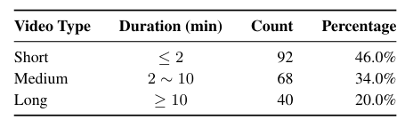

| Video Type | Duration (min) | Count | Percentage |
|---|---|---:|---:|
| Short | $\le 2$ | 92 | 46.0% |
| Medium | $2 \sim 10$ | 68 | 34.0% |
| Long | $\ge 10$ | 40 | 20.0% |

**Caption:** Table 2: Video Length Distribution of VIDEODR-BENCH.

**Caption[CN]:** 表 2：VIDEODR-BENCH 的视频时长分布。

## 4 Experiments

### 4.1 Experimental Setups

> <strong>Para. 1:</strong> We evaluate various Vision–Language Models (VLMs), including Gemini 2.5 Pro (Comanici et al., 2025), GPT-5 (OpenAI., 2025), Claude-4.5-Sonnet (Anthropic, 2025), Qwen3-VL-30B-A3B-Instruct (Bai et al., 2025), Qwen3.5-35B-A3B (Team, 2026), Qwen3.5-397B-A3B (Team, 2026) and Kimi K2.5 (Team et al., 2026), on VIDEODR-BENCH and VideoDR (Liu et al., 2026).

> <strong>Para. 1[CN]:</strong> 我们在 VIDEODR-BENCH 和 VideoDR（Liu et al., 2026）上评估多种视觉–语言模型（VLM），包括 Gemini 2.5 Pro（Comanici et al., 2025）、GPT-5（OpenAI., 2025）、Claude-4.5-Sonnet（Anthropic, 2025）、Qwen3-VL-30B-A3B-Instruct（Bai et al., 2025）、Qwen3.5-35B-A3B（Team, 2026）、Qwen3.5-397B-A3B（Team, 2026）以及 Kimi K2.5（Team et al., 2026）。

> <strong>Para. 2:</strong> VIDEODR-BENCH is an evaluation benchmark comprising 100 human-annotated VQA pairs, designed to assess an agent’s complex reasoning capabilities by integrating video contexts with open-web exploration.

> <strong>Para. 2[CN]:</strong> VIDEODR-BENCH 是一个包含 100 对人工标注 VQA 的评估基准，旨在通过把视频上下文与开放网络探索结合起来，评估智能体的复杂推理能力。

> <strong>Para. 3:</strong> We evaluate the models under the **Agentic** setting: where the model is equipped with the full suite of visual and text tools as shown in Table 6. Under identical interaction constraints for fairness, we extract the final prediction from the trajectory’s last step. Correctness is then evaluated by Qwen3-VL-30B-A3B-Instruct, adopting the official judge prompt from Tongyi DeepResearch (Team et al., 2025).

> <strong>Para. 3[CN]:</strong> 我们在 **Agentic** 设定下评估模型：模型配备表 6 所示的全套视觉与文本工具。为公平起见，各方遵守相同的交互约束，我们从轨迹最后一步提取最终预测。正确性再由 Qwen3-VL-30B-A3B-Instruct 判定，并采用 Tongyi DeepResearch（Team et al., 2025）的官方裁判提示。

### 4.2 Main Results

> <strong>Para. 1:</strong> The main evaluation results are summarized in Table 3. Our proposed VIDEO-DEEPRESEARCH demonstrates exceptional deep research capabilities across multiple model scales.

> <strong>Para. 1[CN]:</strong> 主要评估结果汇总于表 3。我们所提出的 VIDEO-DEEPRESEARCH 在多个模型规模上都展现出突出的深度研究能力。

### Table 3. 主实验结果

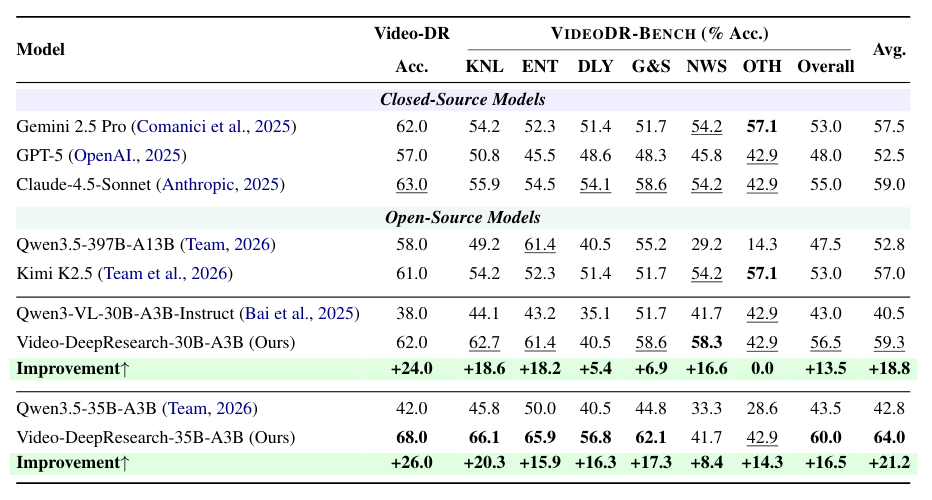

| Model | Video-DR Acc. | KNL | ENT | DLY | G&S | NWS | OTH | Overall | Avg. |
|---|---:|---:|---:|---:|---:|---:|---:|---:|---:|
| **Closed-Source Models** | | | | | | | | | |
| Gemini 2.5 Pro (Comanici et al., 2025) | 62.0 | 54.2 | 52.3 | 51.4 | 51.7 | 54.2 | **57.1** | 53.0 | 57.5 |
| GPT-5 (OpenAI., 2025) | 57.0 | 50.8 | 45.5 | 48.6 | 48.3 | 45.8 | 42.9 | 48.0 | 52.5 |
| Claude-4.5-Sonnet (Anthropic, 2025) | 63.0 | 55.9 | 54.5 | 54.1 | 58.6 | 54.2 | 42.9 | 55.0 | 59.0 |
| **Open-Source Models** | | | | | | | | | |
| Qwen3.5-397B-A13B (Team, 2026) | 58.0 | 49.2 | 61.4 | 40.5 | 55.2 | 29.2 | 14.3 | 47.5 | 52.8 |
| Kimi K2.5 (Team et al., 2026) | 61.0 | 54.2 | 52.3 | 51.4 | 51.7 | 54.2 | **57.1** | 53.0 | 57.0 |
| Qwen3-VL-30B-A3B-Instruct (Bai et al., 2025) | 38.0 | 44.1 | 43.2 | 35.1 | 51.7 | 41.7 | 42.9 | 43.0 | 40.5 |
| Video-DeepResearch-30B-A3B (Ours) | 62.0 | 62.7 | 61.4 | 40.5 | 58.6 | **58.3** | 42.9 | 56.5 | 59.3 |
| Improvement↑ | **+24.0** | **+18.6** | **+18.2** | **+5.4** | **+6.9** | **+16.6** | **0.0** | **+13.5** | **+18.8** |
| Qwen3.5-35B-A3B (Team, 2026) | 42.0 | 45.8 | 50.0 | 40.5 | 44.8 | 33.3 | 28.6 | 43.5 | 42.8 |
| Video-DeepResearch-35B-A3B (Ours) | **68.0** | **66.1** | **65.9** | **56.8** | **62.1** | 41.7 | 42.9 | **60.0** | **64.0** |
| Improvement↑ | **+26.0** | **+20.3** | **+15.9** | **+16.3** | **+17.3** | **+8.4** | **+14.3** | **+16.5** | **+21.2** |

**Caption:** Table 3: Main Results on Video Deep-Research Agent Benchmarks. We evaluate various state-of-the-art Vision–Language Models (VLMs) under two distinct execution settings: Direct (tool-free baseline) and Agentic (equipped with the full suite of visual and text tools). Performance is reported across VIDEO-DR (Acc.) and the six fine-grained categories within our proposed VIDEODR-BENCH benchmark, alongside the overall average score. Column abbreviations for VIDEODR-BENCH denote the corresponding video categories: **KNL** for *knowledge*, **ENT** for *Entertainment*, **DLY** for *daily*, **G&S** for *game&sports*, **NWS** for *news*, and **OTH** for *other*.

**Caption[CN]:** 表 3：视频深度研究智能体基准上的主结果。我们在两种执行设定下评估多种先进视觉–语言模型（VLM）：Direct（无工具基线）与 Agentic（配备全套视觉和文本工具）。指标覆盖 VIDEO-DR（Acc.）、我们所提出的 VIDEODR-BENCH 中的六个细分类别，以及总体平均分。VIDEODR-BENCH 列缩写对应的视频类别为：**KNL** 表示知识，**ENT** 表示娱乐，**DLY** 表示日常，**G&S** 表示游戏与体育，**NWS** 表示新闻，**OTH** 表示其他。

> <strong>Para. 2:</strong> **Video-DeepResearch-35B-A3B.** Establishing a new state-of-the-art among all evaluated models with an overall average accuracy of 64.0%, our 35B variant surpasses the leading closed-source model, Claude-4.5-Sonnet (59.0%) by 5.0 percentage points. Compared to its foundation model (Qwen3.5-35B-A3B), VIDEO-DEEPRESEARCH-35B demonstrates a remarkable +21.2% improvement, with particularly strong gains across knowledge-intensive (KNL: +20.3%) and entertainment (ENT: +15.9%) categories. Notably, VIDEO-DEEPRESEARCH-35B achieves the highest score on VIDEODR-BENCH (65.4%) among all evaluated models.

> <strong>Para. 2[CN]:</strong> **Video-DeepResearch-35B-A3B。** 我们的 35B 变体以 64.0% 的总体平均准确率，在全部评估模型中达到新的最优水平，比领先的闭源模型 Claude-4.5-Sonnet（59.0%）高出 5.0 个百分点。与其基础模型（Qwen3.5-35B-A3B）相比，VIDEO-DEEPRESEARCH-35B 取得了显著的 +21.2% 提升，在知识密集型（KNL：+20.3%）和娱乐（ENT：+15.9%）类别上增益尤为突出。值得注意的是，VIDEO-DEEPRESEARCH-35B 在 VIDEODR-BENCH 上取得全部评估模型中的最高分（65.4%）。

> <strong>Para. 3:</strong> **Video-DeepResearch-30B-A3B.** The 30B variant achieves 59.3% average accuracy, competitive with Claude-4.5-Sonnet (59.0%) and significantly eclipsing GPT-5 (52.5%) and Gemini 2.5 Pro (57.5%). Compared to its foundation model (Qwen3-VL-30B-A3B-Instruct), VIDEO-DEEPRESEARCH-30B achieves substantial absolute improvements: a +24.0% surge on the VideoDR benchmark and a +13.5% gain on VIDEODR-BENCH. This explicit performance leap rigorously validates the efficacy of our trajectory synthesis and RL optimization pipeline even at compact scale.

> <strong>Para. 3[CN]:</strong> **Video-DeepResearch-30B-A3B。** 30B 变体达到 59.3% 平均准确率，与 Claude-4.5-Sonnet（59.0%）相当，并明显超过 GPT-5（52.5%）和 Gemini 2.5 Pro（57.5%）。与其基础模型（Qwen3-VL-30B-A3B-Instruct）相比，VIDEO-DEEPRESEARCH-30B 取得了可观的绝对提升：在 VideoDR 基准上跃升 +24.0%，在 VIDEODR-BENCH 上提升 +13.5%。这一明确的性能跃迁严格验证了：即便在紧凑规模上，我们的轨迹合成与强化学习优化流水线依然有效。

> <strong>Para. 4:</strong> **Comparison with Proprietary Models.** Despite their massive parameter counts and extensive training, proprietary models exhibit notable limitations on Video-DR tasks. GPT-5 (52.5%) lags significantly behind, likely due to insufficient optimization for visual tool usage. Gemini 2.5 Pro (57.5%) shows competitive performance but still falls short of both our variants. These results underscore that raw model scale alone does not guarantee effective Video-DR capability; specialized training pipelines are essential.

> <strong>Para. 4[CN]:</strong> **与专有模型的比较。** 尽管参数规模庞大、训练充分，专有模型在 Video-DR 任务上仍有明显局限。GPT-5（52.5%）明显落后，很可能是因为对视觉工具使用优化不足。Gemini 2.5 Pro（57.5%）表现有竞争力，但仍不及我们的两个变体。这些结果说明：单靠原始模型规模并不能保证有效的 Video-DR 能力，专门的训练流水线不可或缺。

> <strong>Para. 5:</strong> **Fine-Grained Category Analysis.** On the fine-grained level, our models exhibit distinct strengths across different video domains:

> <strong>Para. 5[CN]:</strong> **细分类别分析。** 在细粒度层面上，我们的模型在不同视频领域表现出不同优势：

> <strong>Para. 6:</strong> **Knowledge (KNL):** VIDEO-DEEPRESEARCH-35B achieves 66.1%, demonstrating superior capability in factual reasoning over video-grounded knowledge queries.

> <strong>Para. 6[CN]:</strong> **知识（KNL）：** VIDEO-DEEPRESEARCH-35B 达到 66.1%，表明它在面向视频锚定知识查询的事实推理上能力更强。

> <strong>Para. 7:</strong> **Entertainment (ENT):** Both variants excel (61.4% and 65.9% respectively), outperforming all proprietary models.

> <strong>Para. 7[CN]:</strong> **娱乐（ENT）：** 两个变体都表现出色（分别为 61.4% 和 65.9%），超过所有专有模型。

> <strong>Para. 8:</strong> **Daily Life (DLY):** VIDEO-DEEPRESEARCH-35B significantly improves to 56.8% (+16.3% over base), indicating better generalization to common scenarios.

> <strong>Para. 8[CN]:</strong> **日常生活（DLY）：** VIDEO-DEEPRESEARCH-35B 显著提升到 56.8%（相对基座 +16.3%），说明对常见场景的泛化更好。

> <strong>Para. 9:</strong> **News (NWS):** VIDEO-DEEPRESEARCH-30B shows particular robustness (58.3%), though VIDEO-DEEPRESEARCH-35B (41.7%) suggests potential domain transfer challenges for the larger variant.

> <strong>Para. 9[CN]:</strong> **新闻（NWS）：** VIDEO-DEEPRESEARCH-30B 在该类别上尤其稳健（58.3%）；不过 VIDEO-DEEPRESEARCH-35B（41.7%）提示，更大变体可能存在领域迁移方面的挑战。

> <strong>Para. 10:</strong> **Scaling Insight.** A critical observation emerges from our experiments: the improvement margins are not uniform across model sizes. While VIDEO-DEEPRESEARCH-30B achieves +18.8% over its base, VIDEO-DEEPRESEARCH-35B achieves +21.2%. This suggests that our training pipeline synergizes better with increased model capacity, particularly for complex multi-hop reasoning tasks. However, the relatively smaller improvement on News category (8.4% vs. 16.6% for 30B) indicates potential brittleness on temporally dynamic content that warrants further investigation.

> <strong>Para. 10[CN]:</strong> **规模洞察。** 实验中出现一个关键观察：提升幅度在不同模型规模上并不均匀。VIDEO-DEEPRESEARCH-30B 相对其基座提升 +18.8%，而 VIDEO-DEEPRESEARCH-35B 达到 +21.2%。这表明我们的训练流水线与更大模型容量协同更好，尤其是在复杂多跳推理任务上。不过，新闻类别上的提升相对更小（8.4%，而 30B 为 16.6%），说明在时间动态内容上可能存在脆弱性，值得进一步研究。

### 4.3 Tool Usage Analysis

### Table 4. 视觉工具与文本工具的平均调用次数

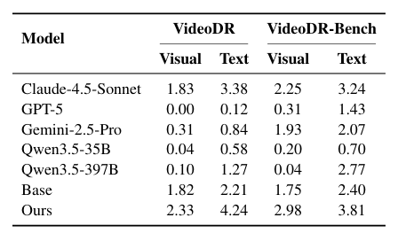

| Model | VideoDR Visual | VideoDR Text | VideoDR-Bench Visual | VideoDR-Bench Text |
|---|---:|---:|---:|---:|
| Claude-4.5-Sonnet | 1.83 | 3.38 | 2.25 | 3.24 |
| GPT-5 | 0.00 | 0.12 | 0.31 | 1.43 |
| Gemini-2.5-Pro | 0.31 | 0.84 | 1.93 | 2.07 |
| Qwen3.5-35B | 0.04 | 0.58 | 0.20 | 0.70 |
| Qwen3.5-397B | 0.10 | 1.27 | 0.04 | 2.77 |
| Base | 1.82 | 2.21 | 1.75 | 2.40 |
| Ours | 2.33 | 4.24 | 2.98 | 3.81 |

**Caption:** Table 4: Average number of visual and text tool usages on VideoDR and our benchmarks.

**Caption[CN]:** 表 4：各模型在 VideoDR 与我们的基准上平均使用视觉工具和文本工具的次数。

> <strong>Para. 1:</strong> To understand the behavioral patterns underlying our performance gains, we profile the tool invocation frequencies across different evaluation sets in Table 4.

> <strong>Para. 1[CN]:</strong> 为理解性能提升背后的行为模式，我们在表 4 中刻画了不同评估集上的工具调用频次。

> <strong>Para. 2:</strong> **Benchmark Characteristics.** From the benchmark perspective, VIDEODR-BENCH rigorously compels models to execute significantly more visual and textual operations compared to VideoDR. For instance, GPT-5 increases visual tool calls from 0.00 to 0.31 and text calls from 0.12 to 1.43. This explicitly demonstrates that our benchmark circumvents parametric knowledge leakage prevalent in existing datasets, successfully enforcing genuine multi-step, tool-augmented open-web exploration.

> <strong>Para. 2[CN]:</strong> **基准特性。** 从基准角度看，与 VideoDR 相比，VIDEODR-BENCH 更严格地迫使模型执行显著更多的视觉和文本操作。例如，GPT-5 的视觉工具调用从 0.00 增至 0.31，文本调用从 0.12 增至 1.43。这明确说明我们的基准绕开了现有数据集中普遍存在的参数知识泄漏，并成功强制模型进行真正的多步、工具增强的开放网络探索。

> <strong>Para. 3:</strong> **Methodological Analysis.** Our proposed VIDEO-DEEPRESEARCH exhibits a profound shift in tool utilization compared to baseline models:

> <strong>Para. 3[CN]:</strong> **方法分析。** 与基线模型相比，我们所提出的 VIDEO-DEEPRESEARCH 在工具使用上发生了深刻转变：

> <strong>Para. 4:</strong> **Modality Bias Correction:** Baseline Qwen3.5-397B executes only 0.10 visual operations per task while heavily favoring text tools (1.27). In contrast, VIDEO-DEEPRESEARCH-30B achieves 2.33 visual and 4.24 text tool invocations on VideoDR, representing a fundamental restructuring of the agent’s exploration strategy.

> <strong>Para. 4[CN]:</strong> **模态偏向校正：** 基线 Qwen3.5-397B 每个任务只执行 0.10 次视觉操作，却严重偏向文本工具（1.27 次）。相比之下，VIDEO-DEEPRESEARCH-30B 在 VideoDR 上达到 2.33 次视觉调用和 4.24 次文本调用，意味着智能体探索策略发生了根本性重构。

> <strong>Para. 5:</strong> **Balanced Multimodal Search:** Driven by our carefully curated trajectory pipeline, VIDEO-DEEPRESEARCH internalizes active spatiotemporal perception. Augmented by mixed-text training data, this leads to a highly balanced and exhaustive multimodal search strategy that dynamically overcomes the modality bias observed in baseline models.

> <strong>Para. 5[CN]:</strong> **均衡的多模态搜索：** 在精心策展的轨迹流水线驱动下，VIDEO-DEEPRESEARCH 内化了主动的时空感知。再辅以混合文本训练数据，它形成高度均衡且穷尽的多模态搜索策略，能够动态克服基线模型中观察到的模态偏向。

> <strong>Para. 6:</strong> **Scale-Appropriate Efficiency:** Notably, VIDEO-DEEPRESEARCH-30B achieves higher tool usage than even the 397B baseline, confirming that training methodology outweighs raw parameter count in determining agentic capability.

> <strong>Para. 6[CN]:</strong> **与规模相称的效率：** 值得注意的是，VIDEO-DEEPRESEARCH-30B 的工具使用甚至高于 397B 基线，说明在决定智能体能力时，训练方法比原始参数量更重要。

> <strong>Para. 7:</strong> **Key Insight.** The strong correlation between tool usage diversity and task performance validates our core hypothesis: effective Video-DR agents must overcome the modality bias that causes models to rely on parametric knowledge. Our training pipeline successfully instills this capability, as evidenced by both the quantitative performance gains and the behavioral shift toward more exhaustive exploration.

> <strong>Para. 7[CN]:</strong> **关键洞见。** 工具使用多样性与任务表现之间的强相关，验证了我们的核心假设：有效的 Video-DR 智能体必须克服导致模型依赖参数知识的模态偏向。我们的训练流水线成功注入了这一能力，定量性能提升以及朝向更穷尽探索的行为转变都说明了这一点。

### 4.4 Ablation Study

### Table 5. 30B 变体的训练阶段消融

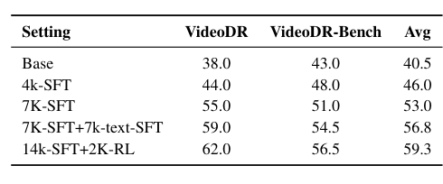

| Setting | VideoDR | VideoDR-Bench | Avg |
|---|---:|---:|---:|
| Base | 38.0 | 43.0 | 40.5 |
| 4k-SFT | 44.0 | 48.0 | 46.0 |
| 7K-SFT | 55.0 | 51.0 | 53.0 |
| 7K-SFT+7k-text-SFT | 59.0 | 54.5 | 56.8 |
| 14k-SFT+2K-RL | 62.0 | 56.5 | 59.3 |

**Caption:** Table 5: Performance comparison of different models on VideoDR and our benchmarks.

**Caption[CN]:** 表 5：不同设定在 VideoDR 与我们的基准上的性能比较。

> <strong>Para. 1:</strong> To meticulously disentangle the contribution of each data curation and training phase, we conduct an ablation study on VIDEO-DEEPRESEARCH-30B, as detailed in Table 5.

> <strong>Para. 1[CN]:</strong> 为细致拆解每个数据策展与训练阶段的贡献，我们对 VIDEO-DEEPRESEARCH-30B 做了消融研究，详见表 5。

> <strong>Para. 2:</strong> **Video-Centric SFT (Base → 7K-SFT).** Starting from the baseline (40.5%), introducing 4K synthesized Video-DR trajectories immediately yields a +5.5% average gain. Scaling this multimodal corpus to 7K further propels the performance to 53.0%. This explicit +12.5% trajectory-driven surge confirms that our visual grounding data is strictly necessary for the agent to internalize the foundational perception-exploration paradigm. Interestingly, the improvement is more pronounced on VIDEODR-BENCH (51.0% vs. 43.0% base) than on VideoDR (55.0% vs. 38.0% base), suggesting that visual grounding is particularly crucial for benchmark-quality evaluations.

> <strong>Para. 2[CN]:</strong> **以视频为中心的 SFT（Base → 7K-SFT）。** 从基线（40.5%）出发，引入 4K 条合成的 Video-DR 轨迹立刻带来 +5.5% 的平均增益。把这一多模态语料扩展到 7K 后，性能进一步推到 53.0%。这一由轨迹驱动的明确 +12.5% 跃升证实：视觉定位数据对于智能体内化基础感知–探索范式是严格必要的。有趣的是，提升在 VIDEODR-BENCH 上更明显（51.0% 对比基线 43.0%），超过 VideoDR（55.0% 对比基线 38.0%），说明视觉定位对基准质量的评估尤为关键。

> <strong>Para. 3:</strong> **Text-Augmented SFT (+7k-text-SFT).** Subsequently, incorporating 7K text-only QA instances results in an additional +3.8% improvement (56.8%). This directly validates our hypothesis: explicitly injecting textual exploration data effectively mitigates the agent’s initial tool-invocation bias, thereby enforcing a more comprehensive open-web search capability. The cross-modal transfer effect suggests that textual deep research skills complement and enhance visual grounding behaviors.

> <strong>Para. 3[CN]:</strong> **文本增强 SFT（+7k-text-SFT）。** 随后加入 7K 条纯文本问答实例，又带来 +3.8% 的提升（56.8%）。这直接验证了我们的假设：显式注入文本探索数据，能有效缓解智能体最初的工具调用偏向，从而强制形成更全面的开放网络搜索能力。跨模态迁移效应表明，文本深度研究技能可以补充并增强视觉定位行为。

> <strong>Para. 4:</strong> **RL Optimization (+2K-RL).** Finally, applying GRPO on the 2K moderate-difficulty dataset achieves the peak overall accuracy of 59.3%. This final +2.5% performance leap underscores the necessity of reinforcement learning—pushing the model beyond static imitation to execute robust, self-driven exploration trajectories. The RL phase particularly benefits VIDEODR-BENCH performance (+2.0% to 56.5%), indicating that the learned exploration strategy generalizes well to benchmark-quality tasks.

> <strong>Para. 4[CN]:</strong> **RL 优化（+2K-RL）。** 最后，在 2K 中等难度数据集上应用 GRPO，达到 59.3% 的峰值总体准确率。这最后 +2.5% 的性能跃升强调了强化学习的必要性——把模型推到静态模仿之外，去执行稳健、自我驱动的探索轨迹。RL 阶段尤其有利于 VIDEODR-BENCH 表现（+2.0%，至 56.5%），说明学到的探索策略能较好泛化到基准质量的任务。

> <strong>Para. 5:</strong> **Cumulative Design Insight.** The incremental improvements from each training phase reveal an important principle: Video-DR capability emerges from the synergistic combination of visual grounding (trajectory SFT), textual deep research skills (mixed SFT), and autonomous exploration (RL). Neither component alone achieves optimal performance, and the full pipeline is essential for state-of-the-art results.

> <strong>Para. 5[CN]:</strong> **累积设计洞见。** 各训练阶段的增量提升揭示了一条重要原则：Video-DR 能力来自视觉定位（轨迹 SFT）、文本深度研究技能（混合 SFT）与自主探索（RL）的协同组合。单独任一组件都达不到最优表现，完整流水线对于取得最优结果不可或缺。

### 4.5 Discussion: Beyond Benchmarks

> <strong>Para. 1:</strong> The experimental results prompt deeper reflections on the nature of video intelligence.

> <strong>Para. 1[CN]:</strong> 实验结果促使我们更深入地思考视频智能的本质。

> <strong>Para. 2:</strong> **Emergence Over Scaling.** Our findings challenge the prevailing assumption that sufficient model scale alone will yield emergent capabilities. The 397B parameter Qwen3.5-397B-A13B, despite its massive capacity, performs comparably to our 30B model trained with our specialized pipeline. This suggests that Video-DR capability is not merely a function of model size, but rather an emergent property that requires deliberate curriculum design—specifically, the decoupled perception-exploration paradigm we introduce. The agent must learn *when* to perceive and *when* to retrieve, a temporal coordination that cannot be extracted from static corpora alone.

> <strong>Para. 2[CN]:</strong> **涌现优先于规模。** 我们的发现挑战了“只要模型规模足够，能力就会涌现”这一流行假设。397B 参数的 Qwen3.5-397B-A13B 尽管容量巨大，表现却与用我们专门流水线训练的 30B 模型相当。这说明 Video-DR 能力并不只是模型规模的函数，而更像是一种需要刻意课程设计才能出现的涌现性质——具体就是我们引入的解耦感知–探索范式。智能体必须学会*何时*去感知、*何时*去检索，这种时间上的协调无法单从静态语料中抽取出来。

> <strong>Para. 3:</strong> **Active Grounding as a Test of True Understanding.** A provocative interpretation of our results concerns what tool usage actually measures. The parametric knowledge leakage observed in GPT-5 (achieving competitive accuracy with zero tool calls) reveals that benchmark performance alone can be decoupled from genuine video understanding. Our approach, by enforcing exhaustive visual grounding prior to web retrieval, effectively operationalizes a principle: *understanding a video means being able to act upon it*. The shift in tool invocation patterns (from 0.10 to 2.33 visual operations) thus represents not merely behavioral modification, but a fundamental restructuring of the agent’s epistemic strategy—from passive recall to active verification.

> <strong>Para. 3[CN]:</strong> **主动定位作为真正理解的检验。** 对结果的一种颇具挑衅性的解释，关乎工具使用究竟在衡量什么。GPT-5 中观察到的参数知识泄漏（零工具调用却能取得有竞争力的准确率）表明，单看基准表现可以与真正的视频理解脱钩。我们的方法通过在网页检索之前强制穷尽视觉定位，实际上把一条原则操作化了：*理解一段视频，意味着能够据此行动*。因此，工具调用模式的转变（从 0.10 次到 2.33 次视觉操作）并不只是行为修饰，而是智能体认知策略的根本重构——从被动回忆转向主动核验。

> <strong>Para. 4:</strong> **The Parity of Modalities.** Perhaps the most counterintuitive finding is that training methodology can outweigh model scale by nearly an order of magnitude. Our 30B model achieves higher tool diversity than the 397B baseline, suggesting that modality bias is not an architectural limitation but a distributional artifact of training data. This implies that achieving true multimodal parity requires not just architectural unification, but data and training paradigm alignment—a more nuanced requirement than simply scaling model parameters.

> <strong>Para. 4[CN]:</strong> **模态对等。** 或许最反直觉的发现是：训练方法可以在接近一个数量级的尺度上压过模型规模。我们的 30B 模型比 397B 基线达到更高的工具多样性，说明模态偏向并不是架构限制，而是训练数据的分布产物。这意味着，要实现真正的多模态对等，需要的不只是架构统一，还有数据与训练范式的对齐——这比单纯放大模型参数更为细致。

## 5 Related Work

### 5.1 Video Understanding.

> <strong>Para. 1:</strong> Early Video-LLMs typically rely on uniform frame sampling for single-turn inference (Lin et al., 2024a,b; Zhang et al., 2024). Lacking dynamic visual querying mechanisms, they are prone to error accumulation and hallucinations. While recent agentic frameworks introduce interactive tools for active fine-grained perception (Yang et al., 2025b; Zhang et al., 2025; Tian et al., 2025), they remain confined to closed-world video contexts. Consequently, they struggle with knowledge-intensive tasks that require external, verifiable evidence (Wang et al., 2017; Fu et al., 2025b).

> <strong>Para. 1[CN]:</strong> 早期 Video-LLM 通常依赖均匀帧采样来做单轮推理（Lin et al., 2024a,b; Zhang et al., 2024）。由于缺乏动态视觉查询机制，它们容易误差累积并产生幻觉。尽管近期的智能体框架引入了交互式工具以进行主动细粒度感知（Yang et al., 2025b; Zhang et al., 2025; Tian et al., 2025），它们仍局限于封闭世界的视频上下文。因此，它们难以处理需要外部、可核验证据的知识密集型任务（Wang et al., 2017; Fu et al., 2025b）。

> <strong>Para. 2:</strong> To address this, we introduce VIDEO-DEEPRESEARCH, a video deep research framework that couples internal video-grounding with iterative open-web exploration. By transitioning from closed-world parametric memory to an open-world collaborative verification loop, VIDEO-DEEPRESEARCH enables highly robust, multi-source deep reasoning.

> <strong>Para. 2[CN]:</strong> 为解决这一问题，我们引入 VIDEO-DEEPRESEARCH：一个把内部视频定位与迭代开放网络探索耦合起来的视频深度研究框架。通过从封闭世界的参数记忆，转向开放世界的协同核验回路，VIDEO-DEEPRESEARCH 能够进行高度稳健的多源深度推理。

### 5.2 Multimodal-DeepResearch Systems.

> <strong>Para. 1:</strong> Autonomous deep research agents have rapidly evolved from text-only systems (Team et al., 2025; Wu et al., 2025a; Li et al., 2025b; Tao et al., 2025) to image-centric Vision-DR frameworks. Recent efforts employ reverse image search (Geng et al., 2025), GRPO optimization (Wu et al., 2025b; Shao et al., 2024), and entity-level cropping (Narayan et al., 2025) to navigate static visual contexts. However, this trajectory entirely bypasses the continuous video modality. Unlike static images, Video-DR requires agents to decouple dense, spatiotemporal dynamics and conduct multi-step verification across noisy frames, presenting a distinctly more formidable challenge.

> <strong>Para. 1[CN]:</strong> 自主深度研究智能体已从纯文本系统（Team et al., 2025; Wu et al., 2025a; Li et al., 2025b; Tao et al., 2025）迅速演进到以图像为中心的 Vision-DR 框架。近期工作采用以图搜图（Geng et al., 2025）、GRPO 优化（Wu et al., 2025b; Shao et al., 2024）以及实体级裁剪（Narayan et al., 2025）来在静态视觉上下文中导航。然而，这条轨迹完全绕开了连续视频模态。与静态图像不同，Video-DR 要求智能体解耦稠密的时空动态，并在嘈杂帧上做多步核验，挑战明显更为严峻。

> <strong>Para. 2:</strong> Concurrently, establishing rigorous evaluations for this new frontier remains elusive. While current benchmarks broadly assess static multimodal factuality (Cheng et al., 2025b), external knowledge grounding (Wang et al., 2017; Chen et al., 2023; Fu et al., 2025b), and image-based search workflows (Jiang et al.; Geng et al., 2025), they are inherently insufficient for video streams. Moreover, the scarce efforts to establish dedicated Video-DR benchmarks suffer from a critical bottleneck: a severe reliance on labor-intensive, unscalable manual annotation. To overcome this, we introduce a highly scalable, human-AI collaborative annotation framework for robust Video-DR evaluation.

> <strong>Para. 2[CN]:</strong> 与此同时，为这一新前沿建立严格评估仍然困难。尽管现有基准广泛评估静态多模态事实性（Cheng et al., 2025b）、外部知识定位（Wang et al., 2017; Chen et al., 2023; Fu et al., 2025b）以及基于图像的搜索工作流（Jiang et al.; Geng et al., 2025），它们对视频流本质上并不充分。此外，少数专门建立 Video-DR 基准的努力也面临关键瓶颈：严重依赖劳动密集、难以扩展的人工标注。为克服这一点，我们引入高度可扩展的人机协同标注框架，用于稳健的 Video-DR 评估。

## 6 Conclusion

> <strong>Para. 1:</strong> We present VIDEO-DEEPRESEARCH, the first unified framework for Video-DeepResearch that bridges scalable data synthesis, agent training, and rigorous evaluation. A preliminary study on existing agents reveals two critical failure modes: systematic visual tool aversion and parametric knowledge leakage, both of which undermine faithful assessment of Video-DR capabilities.

> <strong>Para. 1[CN]:</strong> 我们提出 VIDEO-DEEPRESEARCH，这是首个把可扩展数据合成、智能体训练与严格评估贯通起来的 Video-DeepResearch 统一框架。对现有智能体的初步研究揭示了两种关键失败模式：系统性的视觉工具回避，以及参数知识泄漏；二者都会损害对 Video-DR 能力的忠实评估。

> <strong>Para. 2:</strong> VIDEO-DEEPRESEARCH addresses these issues through a decoupled perception-exploration pipeline with stage-wise tool unlocking, producing 30K video-grounded QA pairs and 7K curated trajectories. Combined with a two-stage SFT–GRPO training recipe, our Video-DeepResearch-35B-A3B achieves 64.0% (SOTA), while the 30B-A3B variant achieves 59.3%, competitive with Claude-4.5-Sonnet.

> <strong>Para. 2[CN]:</strong> VIDEO-DEEPRESEARCH 通过解耦的感知–探索流水线与分阶段工具解锁来应对这些问题，产出 30K 条视频锚定问答对和 7K 条精选轨迹。结合两阶段 SFT–GRPO 训练配方，我们的 Video-DeepResearch-35B-A3B 达到 64.0%（SOTA），30B-A3B 变体达到 59.3%，与 Claude-4.5-Sonnet 相当。

> <strong>Para. 3:</strong> We further introduce VIDEODR-BENCH, a 200-instance multi-hop VQA benchmark where every question provably demands both visual search and external knowledge reasoning. We hope this work lays a solid foundation for next-generation video deep research agents.

> <strong>Para. 3[CN]:</strong> 我们进一步引入 VIDEODR-BENCH：一个含 200 个实例的多跳 VQA 基准，其中每一道题都可证明同时需要视觉搜索和外部知识推理。我们希望这项工作能为下一代视频深度研究智能体奠定坚实基础。

## Author Information

> <strong>Para. 1:</strong> **Full Author List:** Zhen Fang^{1}, Yu Zeng^{1}, Wenxuan Huang, Yiming Zhao^{1}, Shiting Huang^{1}, Tianfei Ren^{1}, Qi Lu^{1}, Qingnan Ren^{1}, Qisheng Su^{1}, Lionel Z. Wang^{4}, Qingyu Yin^{5}, Shuang Chen^{6}, Zehui Chen^{1}, Lin Chen^{1}, Zhenfei Yin^{7}, Yao Hu^{2}, Shaohui Lin^{8}, Wanli Ouyang^{3}, Shaosheng Cao^{2,9}, Feng Zhao^{1}.

> <strong>Para. 1[CN]:</strong> **完整作者名单：** Zhen Fang^{1}，Yu Zeng^{1}，Wenxuan Huang，Yiming Zhao^{1}，Shiting Huang^{1}，Tianfei Ren^{1}，Qi Lu^{1}，Qingnan Ren^{1}，Qisheng Su^{1}，Lionel Z. Wang^{4}，Qingyu Yin^{5}，Shuang Chen^{6}，Zehui Chen^{1}，Lin Chen^{1}，Zhenfei Yin^{7}，Yao Hu^{2}，Shaohui Lin^{8}，Wanli Ouyang^{3}，Shaosheng Cao^{2,9}，Feng Zhao^{1}。

> <strong>Para. 2:</strong> **Affiliations:** ^{1}USTC, ^{2}Xiaohongshu Inc., ^{3}CUHK, ^{4}The Hong Kong Polytechnic University, ^{5}ZJU, ^{6}UCLA, ^{7}Oxford, ^{8}ECNU, ^{9}THU.

> <strong>Para. 2[CN]:</strong> **单位：** ^{1}中国科学技术大学（USTC），^{2}小红书（Xiaohongshu Inc.），^{3}香港中文大学（CUHK），^{4}香港理工大学（The Hong Kong Polytechnic University），^{5}浙江大学（ZJU），^{6}加州大学洛杉矶分校（UCLA），^{7}牛津大学（Oxford），^{8}华东师范大学（ECNU），^{9}清华大学（THU）。

> <strong>Para. 3:</strong> The first authors with equal contribution are **Zhen Fang, Yu Zeng, Wenxuan Huang, and Yiming Zhao**. Yu Zeng and Wenxuan Huang serve as the project leaders. The corresponding authors are **Wenxuan Huang, Shaosheng Cao and Feng Zhao**.

> <strong>Para. 3[CN]:</strong> 共同一作是 **Zhen Fang、Yu Zeng、Wenxuan Huang 和 Yiming Zhao**。Yu Zeng 与 Wenxuan Huang 担任项目负责人。通讯作者是 **Wenxuan Huang、Shaosheng Cao 和 Feng Zhao**。

## Limitation

> <strong>Para. 1:</strong> While VIDEO-DEEPRESEARCH pioneers the first comprehensive pipeline integrating data construction and model training for the complex Video-DR task, this rigorous approach introduces certain trade-offs. Primarily, achieving our current level of performance incurs considerable computational overhead. To ensure high-quality data synthesis and robust model training, the framework demands substantial GPU resources, largely due to the concurrent requirements of large-scale model deployment and dynamic web search operations.

> <strong>Para. 1[CN]:</strong> 尽管 VIDEO-DEEPRESEARCH 率先给出了把数据构造与模型训练整合在一起、面向复杂 Video-DR 任务的完整流水线，这种严格做法也带来了若干权衡。首先，达到当前性能水平需要相当可观的计算开销。为确保高质量数据合成和稳健模型训练，该框架需要大量 GPU 资源，主要是因为大规模模型部署与动态网页搜索必须同时进行。

> <strong>Para. 2:</strong> Furthermore, to guarantee accurate and reliable evaluation, the construction of our benchmark currently relies on meticulous human annotation. While this ensures high fidelity of the evaluation standard, it restricts the rapid scalability of the dataset. In future work, we aim to mitigate these constraints by exploring computationally efficient pipelines, lightweight architectures, and automated LLM-based evaluation metrics to reduce human dependency.

> <strong>Para. 2[CN]:</strong> 此外，为了保证评估准确可靠，当前基准构建仍依赖细致的人工标注。这保证了评估标准的高保真度，但也限制了数据集的快速扩展。在未来工作中，我们希望通过探索计算更高效的流水线、轻量架构，以及基于 LLM 的自动化评估指标，来减轻这些约束并降低对人的依赖。

## References

> <strong>Para. 1:</strong> Bibliographic entries are retained in their original English form below and are not translated entry-by-entry. Numbering follows two-column reading order (left column, then right column) on pages 11–13.

> <strong>Para. 1[CN]:</strong> 参考文献保留英文书目形式，不逐条翻译。编号按第 11–13 页双栏阅读顺序（先左栏、后右栏）排列。

1. Anthropic. 2025. Introducing claude sonnet 4.5. https://www.anthropic.com/news/claude-sonnet-4-5.
2. Kirolos Ataallah, Eslam Mohamed Bakr, Mahmoud Ahmed, Chenhui Gou, Khushbu Pahwa, Jian Ding, and Mohamed Elhoseiny. 2025. Infinibench: A benchmark for large multi-modal models in long-form movies and tv shows. In *Proceedings of the 2025 Conference on Empirical Methods in Natural Language Processing*, pages 19496–19523.
3. Shuai Bai, Yuxuan Cai, Ruizhe Chen, Keqin Chen, Xionghui Chen, Zesen Cheng, Lianghao Deng, Wei Ding, Chang Gao, Chunjiang Ge, and 1 others. 2025. Qwen3-vl technical report. *arXiv preprint arXiv:2511.21631*.
4. Dan Ben-Ami, Gabriele Serussi, Kobi Cohen, and Chaim Baskin. 2025. Herbench: A benchmark for multi-evidence integration in video question answering. *arXiv preprint arXiv:2512.14870*.
5. Shuang Chen, Kaituo Feng, Hangting Chen, Wenxuan Huang, Dasen Dai, Quanxin Shou, Yunlong Lin, Xiangyu Yue, Shenghua Gao, and Tianyu Pang. 2026. Opensearch-vl: An open recipe for frontier multimodal search agents. *arXiv preprint arXiv:2605.05185*.
6. Yang Chen, Hexiang Hu, Yi Luan, Haitian Sun, Soravit Changpinyo, Alan Ritter, and Ming-Wei Chang. 2023. Can pre-trained vision and language models answer visual information-seeking questions? *arXiv preprint arXiv:2302.11713*.
7. Junhao Cheng, Yuying Ge, Teng Wang, Yixiao Ge, Jing Liao, and Ying Shan. 2025a. Video-holmes: Can mllm think like holmes for complex video reasoning? *arXiv preprint arXiv:2505.21374*.
8. Xianfu Cheng, Wei Zhang, Shiwei Zhang, Jian Yang, Xiangyuan Guan, Xianjie Wu, Xiang Li, Ge Zhang, Jiaheng Liu, Yuying Mai, and 1 others. 2025b. Simplevqa: Multimodal factuality evaluation for multimodal large language models. In *Proceedings of the IEEE/CVF International Conference on Computer Vision*, pages 4637–4646.
9. Gheorghe Comanici, Eric Bieber, Mike Schaekermann, Ice Pasupat, Noveen Sachdeva, Inderjit Dhillon, Marcel Blistein, Ori Ram, Dan Zhang, Evan Rosen, and 1 others. 2025. Gemini 2.5: Pushing the frontier with advanced reasoning, multimodality, long context, and next generation agentic capabilities. *arXiv preprint arXiv:2507.06261*.
10. Kaituo Feng, Manyuan Zhang, Shuang Chen, Yunlong Lin, Kaixuan Fan, Yilei Jiang, Hongyu Li, Dian Zheng, Chenyang Wang, and Xiangyu Yue. 2026. Gen-searcher: Reinforcing agentic search for image generation. *arXiv preprint arXiv:2603.28767*.
11. Chaoyou Fu, Yuhan Dai, Yongdong Luo, Lei Li, Shuhuai Ren, Renrui Zhang, Zihan Wang, Chenyu Zhou, Yunhang Shen, Mengdan Zhang, and 1 others. 2025a. Video-mme: The first-ever comprehensive evaluation benchmark of multi-modal llms in video analysis. In *Proceedings of the IEEE/CVF conference on computer vision and pattern recognition*, pages 24108–24118.
12. Mingyang Fu, Yuyang Peng, Benlin Liu, Yao Wan, and Dongping Chen. 2025b. Livevqa: Live visual knowledge seeking. *arXiv preprint arXiv:2504.05288*.
13. Xinyu Geng, Peng Xia, Zhen Zhang, Xinyu Wang, Qiuchen Wang, Ruixue Ding, Chenxi Wang, Jialong Wu, Yida Zhao, Kuan Li, and 1 others. 2025. Webwatcher: Breaking new frontier of vision-language deep research agent. *arXiv preprint arXiv:2508.05748*.
14. Arushi Goel, Sreyan Ghosh, Vatsal Agarwal, Nishit Anand, Kaousheik Jayakumar, Lasha Koroshinadze, Yao Xu, Katie Lyons, James Case, Karan Sapra, and 1 others. 2026. Mmou: A massive multi-task omni understanding and reasoning benchmark for long and complex real-world videos. *arXiv preprint arXiv:2603.14145*.
15. Jack Hong, Shilin Yan, Jiayin Cai, Xiaolong Jiang, Yao Hu, and Weidi Xie. 2026. Worldsense: Evaluating real-world omnimodal understanding for multimodal llms. *Preprint, arXiv:2502.04326*.
16. Kairui Hu, Penghao Wu, Fanyi Pu, Wang Xiao, Yuanhan Zhang, Xiang Yue, Bo Li, and Ziwei Liu. 2025. Video-mmmu: Evaluating knowledge acquisition from multi-discipline professional videos. *arXiv preprint arXiv:2501.13826*.
17. Wenxuan Huang, Yu Zeng, Qiuchen Wang, Zhen Fang, Shaosheng Cao, Zheng Chu, Qingyu Yin, Shuang Chen, Zhenfei Yin, Lin Chen, and 1 others. 2026. Vision-deepresearch: Incentivizing deepresearch capability in multimodal large language models. *arXiv preprint arXiv:2601.22060*.
18. Dongzhi Jiang, Renrui Zhang, Ziyu Guo, Yanmin Wu, Pengshuo Qiu, Pan Lu, Zehui Chen, Guanglu Song, Peng Gao, Yu Liu, and 1 others. Mmsearch: Unveiling the potential of large models as multi-modal search engines. In *The Thirteenth International Conference on Learning Representations*.
19. Caorui Li, Yu Chen, Yiyan Ji, Jin Xu, Zhenyu Cui, Shihao Li, Yuanxing Zhang, Wentao Wang, Zhenghao Song, Dingling Zhang, and 1 others. 2025a. Omnivideobench: Towards audio-visual understanding evaluation for omni mllms. *arXiv preprint arXiv:2510.10689*.
20. Kuan Li, Zhongwang Zhang, Huifeng Yin, Liwen Zhang, Litu Ou, Jialong Wu, Wenbiao Yin, Baixuan Li, Zhengwei Tao, Xinyu Wang, and 1 others. 2025b. Websailor: Navigating super-human reasoning for web agent. *arXiv preprint arXiv:2507.02592*.
21. Kunchang Li, Yali Wang, Yinan He, Yizhuo Li, Yi Wang, Yi Liu, Zun Wang, Jilan Xu, Guo Chen, Ping Luo, and 1 others. 2024. Mvbench: A comprehensive multi-modal video understanding benchmark. In *Proceedings of the IEEE/CVF Conference on Computer Vision and Pattern Recognition*, pages 22195–22206.
22. Zhen Li, Chuanhao Li, Xiaofeng Mao, Shaoheng Lin, Ming Li, Shitian Zhao, Zhaopan Xu, Xinyue Li, Yukang Feng, Jianwen Sun, and 1 others. 2026. Sekai: A video dataset towards world exploration. *Advances in Neural Information Processing Systems*, 38.
23. Bin Lin, Yang Ye, Bin Zhu, Jiaxi Cui, Munan Ning, Peng Jin, and Li Yuan. 2024a. Video-llava: Learning united visual representation by alignment before projection. In *Proceedings of the 2024 conference on empirical methods in natural language processing*, pages 5971–5984.
24. Ji Lin, Hongxu Yin, Wei Ping, Pavlo Molchanov, Mohammad Shoeybi, and Song Han. 2024b. Vila: On pre-training for visual language models. In *Proceedings of the IEEE/CVF conference on computer vision and pattern recognition*, pages 26689–26699.
25. Chengwen Liu, Xiaomin Yu, Zhuoyue Chang, Zhe Huang, Shuo Zhang, Heng Lian, Kunyi Wang, Rui Xu, Sen Hu, Jianheng Hou, and 1 others. 2026. Watching, reasoning, and searching: A video deep research benchmark on open web for agentic video reasoning. *arXiv preprint arXiv:2601.06943*.
26. Xiaoxiao Ma, Haibo Qiu, Guohui Zhang, Zhixiong Zeng, Siqi Yang, Lin Ma, and Feng Zhao. 2025. Stage: Stable and generalizable grpo for autoregressive image generation. *arXiv preprint arXiv:2509.25027*.
27. Reiichiro Nakano, Jacob Hilton, Suchir Balaji, Jeff Wu, Long Ouyang, Christina Kim, Christopher Hesse, Shantanu Jain, Vineet Kosaraju, William Saunders, and 1 others. 2021. Webgpt: Browser-assisted question-answering with human feedback. *arXiv preprint arXiv:2112.09332*.
28. Kartik Narayan, Yang Xu, Tian Cao, Kavya Nerella, Vishal M Patel, Navid Shiee, Peter Grasch, Chao Jia, Yinfei Yang, and Zhe Gan. 2025. Deepmmsearch-r1: Empowering multimodal llms in multimodal web search. *arXiv preprint arXiv:2510.12801*.
29. OpenAI. 2025. Openai gpt-5 system card. *arXiv preprint arXiv:2601.03267*.
30. Alec Radford, Jong Wook Kim, Chris Hallacy, Aditya Ramesh, Gabriel Goh, Sandhini Agarwal, Girish Sastry, Amanda Askell, Pamela Mishkin, Jack Clark, and 1 others. 2021. Learning transferable visual models from natural language supervision. In *International conference on machine learning*, pages 8748–8763. PmLR.
31. Zhihong Shao, Peiyi Wang, Qihao Zhu, Runxin Xu, Junxiao Song, Xiao Bi, Haowei Zhang, Mingchuan Zhang, YK Li, Yang Wu, and 1 others. 2024. Deepseekmath: Pushing the limits of mathematical reasoning in open language models. *arXiv preprint arXiv:2402.03300*.
32. Keda Tao, Yuhua Zheng, Jia Xu, Wenjie Du, Kele Shao, Hesong Wang, Xueyi Chen, Xin Jin, Junhan Zhu, Bohan Yu, and 1 others. 2026. Lvomnibench: Pioneering long audio-video understanding evaluation for omnimodal llms. *arXiv preprint arXiv:2603.19217*.
33. Zhengwei Tao, Jialong Wu, Wenbiao Yin, Junkai Zhang, Baixuan Li, Haiyang Shen, Kuan Li, Liwen Zhang, Xinyu Wang, Yong Jiang, and 1 others. 2025. Webshaper: Agentically data synthesizing via information-seeking formalization. *arXiv preprint arXiv:2507.15061*.
34. Kimi Team, Tongtong Bai, Yifan Bai, Yiping Bao, SH Cai, Yuan Cao, Y Charles, HS Che, Cheng Chen, Guanduo Chen, and 1 others. 2026. Kimi k2.5: Visual agentic intelligence. *arXiv preprint arXiv:2602.02276*.
35. Qwen Team. 2026. Qwen3.5-omni technical report. *arXiv preprint arXiv:2604.15804*.
36. Tongyi DeepResearch Team, Baixuan Li, Bo Zhang, Dingchu Zhang, Fei Huang, Guangyu Li, Guoxin Chen, Huifeng Yin, Jialong Wu, Jingren Zhou, and 1 others. 2025. Tongyi deepresearch technical report. *arXiv preprint arXiv:2510.24701*.
37. Shulin Tian, Ruiqi Wang, Hongming Guo, Penghao Wu, Yuhao Dong, Xiuying Wang, Jingkang Yang, Hao Zhang, Hongyuan Zhu, and Ziwei Liu. 2025. Ego-r1: Chain-of-tool-thought for ultra-long egocentric video reasoning. *arXiv preprint arXiv:2506.13654*.
38. Peng Wang, Qi Wu, Chunhua Shen, Anthony Dick, and Anton Van Den Hengel. 2017. Fvqa: Fact-based visual question answering. *IEEE transactions on pattern analysis and machine intelligence*, 40(10):2413–2427.
39. Weihan Wang, Zehai He, Wenyi Hong, Yean Cheng, Xiaohan Zhang, Ji Qi, Ming Ding, Xiaotao Gu, Shiyu Huang, Bin Xu, and 1 others. 2025. Lvbench: An extreme long video understanding benchmark. In *Proceedings of the IEEE/CVF International Conference on Computer Vision*, pages 22958–22967.
40. Wenhao Wang and Yi Yang. 2026. Videoufo: A million-scale user-focused dataset for text-to-video generation. *Advances in Neural Information Processing Systems*, 38.
41. Haoning Wu, Dongxu Li, Bei Chen, and Junnan Li. 2024. Longvideobench: A benchmark for long-context interleaved video-language understanding. *Advances in Neural Information Processing Systems*, 37:28828–28857.
42. Jialong Wu, Baixuan Li, Runnan Fang, Wenbiao Yin, Liwen Zhang, Zhengwei Tao, Dingchu Zhang, Zekun Xi, Gang Fu, Yong Jiang, and 1 others. 2025a. Webdancer: Towards autonomous information seeking agency. *arXiv preprint arXiv:2505.22648*.
43. Jinming Wu, Zihao Deng, Wei Li, Yiding Liu, Bo You, Bo Li, Zejun Ma, and Ziwei Liu. 2025b. Mmsearch-r1: Incentivizing lmms to search. *arXiv preprint arXiv:2506.20670*.
44. Hui Yang, Sifu Yue, and Yunzhong He. 2023. Auto-gpt for online decision making: Benchmarks and additional opinions. *arXiv preprint arXiv:2306.02224*.
45. Jihan Yang, Shusheng Yang, Anjali W. Gupta, Rilyn Han, Li Fei-Fei, and Saining Xie. 2025a. Thinking in space: How multimodal large language models see, remember, and recall spaces. In *Proceedings of the IEEE/CVF Conference on Computer Vision and Pattern Recognition (CVPR)*, pages 10632–10643.
46. Zuhao Yang, Sudong Wang, Kaichen Zhang, Keming Wu, Sicong Leng, Yifan Zhang, Bo Li, Chengwei Qin, Shijian Lu, Xingxuan Li, and 1 others. 2025b. Longvt: Incentivizing "thinking with long videos" via native tool calling. *arXiv preprint arXiv:2511.20785*.
47. Haoji Zhang, Xin Gu, Jiawen Li, Chixiang Ma, Sule Bai, Chubin Zhang, Bowen Zhang, Zhichao Zhou, Dongliang He, and Yansong Tang. 2025. Thinking with videos: Multimodal tool-augmented reinforcement learning for long video reasoning. *arXiv preprint arXiv:2508.04416*.
48. Yuanhan Zhang, Jinming Wu, Wei Li, Bo Li, Zejun Ma, Ziwei Liu, and Chunyuan Li. 2024. Llava-video: Video instruction tuning with synthetic data. *arXiv preprint arXiv:2410.02713*.

## Appendix

> <strong>Para. 1:</strong> The source prints the heading **A Appendix** immediately before **B Training Details**. The remaining appendix covers training hyperparameters (B), keyframe preprocessing (C), human annotation protocol (D), prompt figures 4–8, and the tool specification in Table 6.

> <strong>Para. 1[CN]:</strong> 原文在 **B Training Details** 之前直接印出标题 **A Appendix**。其余附录包括训练超参数（B）、关键帧预处理（C）、人工标注协议（D）、提示词图 4–8，以及表 6 的工具规格。

### B Training Details

> <strong>Para. 1:</strong> **Training Setup and Hyperparameters.** The supervised fine-tuning (SFT) was conducted on a high-performance compute cluster comprising 4 nodes, each equipped with 8 × 80 GB GPUs (32 GPUs in total), utilizing the Megatron-LM framework. To accommodate the ultra-long context length of 80,000 tokens without data packing, we employed a highly optimized mixed-parallelism strategy. Specifically, we configured a Tensor Parallelism (TP) size of 4, a Context Parallelism (CP) size of 2, and an Expert Parallelism (EP) size of 8. Sequence Parallelism (SP) was also enabled to further reduce the memory footprint.

> <strong>Para. 1[CN]:</strong> **训练设置与超参数。** 监督微调（SFT）在高性能计算集群上进行：共 4 个节点，每个节点配备 8 × 80 GB GPU（合计 32 块 GPU），并使用 Megatron-LM 框架。为在不做 data packing 的情况下容纳 80,000 token 的超长上下文，我们采用高度优化的混合并行策略。具体配置为：张量并行（TP）大小 4，上下文并行（CP）大小 2，专家并行（EP）大小 8。同时启用序列并行（SP），以进一步降低显存占用。

> <strong>Para. 2:</strong> The training spanned 3 epochs with a micro-batch size of 1 and a global batch size of 64. The learning rate was governed by a linear warmup and decay schedule, warming up over the first 5% of training steps to a peak of $1 \times 10^{-5}$, and subsequently decaying to a minimum of $5 \times 10^{-7}$.

> <strong>Para. 2[CN]:</strong> 训练共 3 个 epoch，micro-batch size 为 1，global batch size 为 64。学习率采用线性 warmup 与衰减日程：在前 5% 的训练步内升至峰值 $1 \times 10^{-5}$，随后衰减到最低 $5 \times 10^{-7}$。

> <strong>Para. 3:</strong> **Optimization and Efficiency Enhancements.** To ensure efficient training of the Mixture-of-Experts (MoE) architecture, we applied an auxiliary loss coefficient of $1 \times 10^{-6}$ for load balancing and set the expert capacity factor to 2.0 to mitigate token dropping. Advanced MoE computational optimizations were integrated, including permute operation fusion, Grouped GEMM, and the overlapping of shared-expert computation with communication.

> <strong>Para. 3[CN]:</strong> **优化与效率增强。** 为高效训练混合专家（MoE）架构，我们采用 $1 \times 10^{-6}$ 的辅助损失系数做负载均衡，并把专家容量因子设为 2.0 以减轻 token dropping。同时集成了更先进的 MoE 计算优化，包括 permute 操作融合、Grouped GEMM，以及共享专家计算与通信的重叠。

> <strong>Para. 4:</strong> Furthermore, strict memory optimization techniques were adopted to prevent Out-of-Memory (OOM) errors during long-context training. We utilized FlashAttention as the primary attention backend and PyTorch’s expandable segments feature (`expandable_segments:True`) to minimize memory fragmentation. Full activation checkpointing was applied uniformly at every single layer, trading computation for memory.

> <strong>Para. 4[CN]:</strong> 此外，我们采用严格的显存优化技术，以避免长上下文训练中的显存溢出（OOM）。注意力后端以 FlashAttention 为主，并启用 PyTorch 的可扩展分段功能（`expandable_segments:True`）以尽量减少显存碎片。对每一层均匀应用完整 activation checkpointing，用计算换显存。

> <strong>Para. 5:</strong> For system-level efficiency, fused cross-entropy loss was enabled, CPU threading was optimized with 32 OpenMP threads, and the data processing pipeline was heavily parallelized using 128 preprocessing processes and 8 DataLoader workers. Checkpoints were serialized in the Safetensors format every 500 steps, deliberately omitting optimizer and random number generator (RNG) states to conserve storage overhead.

> <strong>Para. 5[CN]:</strong> 在系统级效率方面，启用了融合交叉熵损失，CPU 线程优化为 32 个 OpenMP 线程，数据处理流水线则用 128 个预处理进程和 8 个 DataLoader worker 高度并行。检查点每 500 步以 Safetensors 格式序列化，并有意省略优化器和随机数生成器（RNG）状态，以节省存储开销。

### C Data Details

> <strong>Para. 1:</strong> For keyframe extraction, we compute inter-frame similarities using CLIP-ViT-L/14@336px (Radford et al., 2021). To reduce redundancy, we discard consecutive frames with a similarity score exceeding 0.8, alongside any uninformative monochromatic frames. The maximum number of keyframes per video is strictly capped at 20. Notably, this preprocessing configuration is uniformly applied across both the data synthesis pipeline and all evaluation phases, including the processing of VIDEODR.

> <strong>Para. 1[CN]:</strong> 在关键帧提取中，我们用 CLIP-ViT-L/14@336px（Radford et al., 2021）计算帧间相似度。为降低冗余，丢弃相似度超过 0.8 的连续帧，以及任何无信息量的单色帧。每个视频的关键帧数量严格上限为 20。值得注意的是，这一预处理配置在数据合成流水线和所有评估阶段（包括对 VIDEODR 的处理）中统一使用。

### D Annotation Details

> <strong>Para. 1:</strong> The construction of VIDEOHUNT involves a rigorous human annotation process to ensure benchmark quality and reliability. The entire annotation effort spans approximately three weeks.

> <strong>Para. 1[CN]:</strong> VIDEOHUNT 的构建包含严格的人工标注过程，以确保基准质量与可靠性。整个标注工作大约持续三周。

> <strong>Para. 2:</strong> **Annotator Team.** We recruit a team of 8 annotators, all with prior professional experience in multimodal large language model data annotation. Each annotator possesses strong familiarity with video understanding, visual search, and multi-hop reasoning tasks.

> <strong>Para. 2[CN]:</strong> **标注团队。** 我们招募了 8 名标注者，他们都具备多模态大语言模型数据标注的专业经验。每位标注者都熟悉视频理解、视觉搜索和多跳推理任务。

> <strong>Para. 3:</strong> **Quality Assurance.** Before the formal annotation phase, all annotators undergo a structured training session covering task definitions, tool usage (e.g., `Crop_Search`), and common pitfalls such as parametric knowledge leakage. This is followed by a qualification test on a held-out pilot set; only annotators meeting a predefined accuracy threshold are admitted to the main annotation.

> <strong>Para. 3[CN]:</strong> **质量保证。** 在正式标注阶段之前，所有标注者都要接受结构化培训，内容覆盖任务定义、工具使用（例如 `Crop_Search`），以及参数知识泄漏等常见陷阱。随后在留出的试点集上做资格测试；只有达到预设准确率阈值的标注者才能进入主标注。

> <strong>Para. 4:</strong> During production, the workflow is organized into two decoupled stages: an *annotation stage*, where annotators create and verify VQA instances, and a *quality inspection stage*, where a separate group of reviewers cross-checks each instance for answerability, visual groundability, and factual correctness. Instances flagged during inspection are returned for revision or discarded.

> <strong>Para. 4[CN]:</strong> 在生产过程中，工作流被组织成两个解耦阶段：*标注阶段*，由标注者创建并核验 VQA 实例；以及*质量检查阶段*，由另一组审阅者交叉检查每个实例的可回答性、视觉可定位性和事实正确性。检查中被标记的实例会退回修改或被丢弃。

### Figure 4. Video-DR 任务适用性评估提示

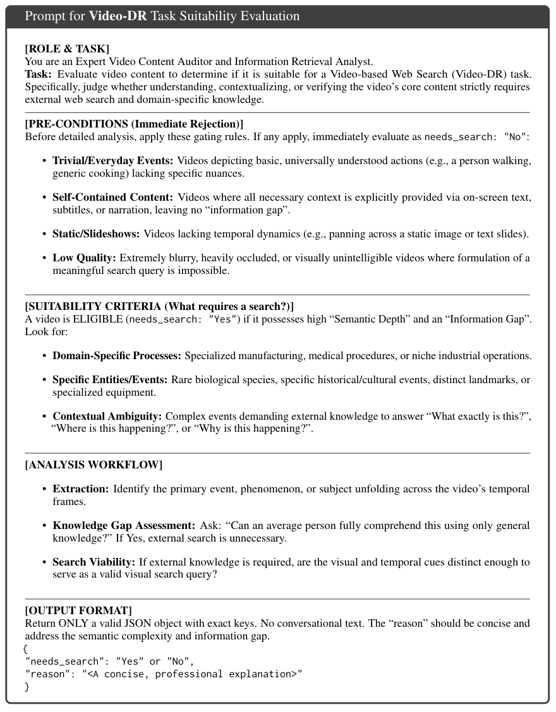

**Caption:** Figure 4: The structured evaluation prompt for determining whether a video possesses sufficient semantic depth and information gap to require external web search for the Video-DR task usec in Sec 3.1.

**Caption[CN]:** 图 4：用于判断视频是否具备足够语义深度与信息缺口、因而需要外部网页搜索的结构化评估提示；用于第 3.1 节。原文图注写作 “usec in Sec 3.1”。

> <strong>Para. 1:</strong> Title: `Prompt for Video-DR Task Suitability Evaluation`.

> <strong>Para. 1[CN]:</strong> 标题：`Prompt for Video-DR Task Suitability Evaluation`（Video-DR 任务适用性评估提示）。

> <strong>Para. 2:</strong> `[ROLE & TASK]` You are an Expert Video Content Auditor and Information Retrieval Analyst. Task: Evaluate video content to determine if it is suitable for a Video-based Web Search (Video-DR) task. Specifically, judge whether understanding, contextualizing, or verifying the video’s core content strictly requires external web search and domain-specific knowledge.

> <strong>Para. 2[CN]:</strong> `[ROLE & TASK]` 你是 Expert Video Content Auditor and Information Retrieval Analyst。任务：评估视频内容是否适合作为基于视频的网页搜索（Video-DR）任务。具体要判断：理解、情境化或核验该视频的核心内容，是否严格需要外部网页搜索和领域知识。

> <strong>Para. 3:</strong> `[PRE-CONDITIONS (Immediate Rejection)]` Before detailed analysis, apply these gating rules. If any apply, immediately evaluate as `needs_search: "No"`:

> <strong>Para. 3[CN]:</strong> `[PRE-CONDITIONS (Immediate Rejection)]` 在详细分析之前，先应用这些门控规则。若任一规则成立，立即判定为 `needs_search: "No"`：

> <strong>Para. 4:</strong> Immediate-rejection gates:
>
> - **Trivial/Everyday Events:** Videos depicting basic, universally understood actions (e.g., a person walking, generic cooking) lacking specific nuances.
> - **Self-Contained Content:** Videos where all necessary context is explicitly provided via on-screen text, subtitles, or narration, leaving no “information gap”.
> - **Static/Slideshows:** Videos lacking temporal dynamics (e.g., panning across a static image or text slides).
> - **Low Quality:** Extremely blurry, heavily occluded, or visually unintelligible videos where formulation of a meaningful search query is impossible.

> <strong>Para. 4[CN]:</strong> 立即拒绝门控：
>
> - **Trivial/Everyday Events:** 只描绘基础、人人都能理解的动作（例如有人走路、泛化烹饪），缺少特定细微信息的视频。
> - **Self-Contained Content:** 所有必要上下文都已通过屏幕文字、字幕或旁白明确给出，因而不存在 “information gap” 的视频。
> - **Static/Slideshows:** 缺乏时间动态的视频（例如在静态图像或文字幻灯片上平移）。
> - **Low Quality:** 极度模糊、严重遮挡或视觉上无法辨认，因而无法构造有意义搜索查询的视频。

> <strong>Para. 5:</strong> `[SUITABILITY CRITERIA (What requires a search?)]` A video is ELIGIBLE (`needs_search: "Yes"`) if it possesses high “Semantic Depth” and an “Information Gap”. Look for:

> <strong>Para. 5[CN]:</strong> `[SUITABILITY CRITERIA (What requires a search?)]` 若视频具备高 “Semantic Depth” 和 “Information Gap”，则判定为 ELIGIBLE（`needs_search: "Yes"`）。关注以下情况：

> <strong>Para. 6:</strong> Suitability cues:
>
> - **Domain-Specific Processes:** Specialized manufacturing, medical procedures, or niche industrial operations.
> - **Specific Entities/Events:** Rare biological species, specific historical/cultural events, distinct landmarks, or specialized equipment.
> - **Contextual Ambiguity:** Complex events demanding external knowledge to answer “What exactly is this?”, “Where is this happening?”, or “Why is this happening?”.

> <strong>Para. 6[CN]:</strong> 适用性线索：
>
> - **Domain-Specific Processes:** 专门制造、医疗流程或小众工业操作。
> - **Specific Entities/Events:** 稀有生物物种、特定历史/文化事件、独特地标或专用设备。
> - **Contextual Ambiguity:** 需要外部知识才能回答 “What exactly is this?”、“Where is this happening?” 或 “Why is this happening?” 的复杂事件。

> <strong>Para. 7:</strong> `[ANALYSIS WORKFLOW]`
>
> - **Extraction:** Identify the primary event, phenomenon, or subject unfolding across the video’s temporal frames.
> - **Knowledge Gap Assessment:** Ask: “Can an average person fully comprehend this using only general knowledge?” If Yes, external search is unnecessary.
> - **Search Viability:** If external knowledge is required, are the visual and temporal cues distinct enough to serve as a valid visual search query?

> <strong>Para. 7[CN]:</strong> `[ANALYSIS WORKFLOW]`
>
> - **Extraction:** 识别视频时间帧中展开的主要事件、现象或主体。
> - **Knowledge Gap Assessment:** 询问：“普通人仅凭常识能否完全理解这一点？” 若答案为 Yes，则不需要外部搜索。
> - **Search Viability:** 若需要外部知识，视觉与时间线索是否足够独特，能够作为有效的视觉搜索查询？

> <strong>Para. 8:</strong> `[OUTPUT FORMAT]` Return ONLY a valid JSON object with exact keys. No conversational text. The “reason” should be concise and address the semantic complexity and information gap.
>
> `{ "needs_search": "Yes" or "No", "reason": "<A concise, professional explanation>" }`

> <strong>Para. 8[CN]:</strong> `[OUTPUT FORMAT]` 只返回带有精确键名的合法 JSON 对象。不要有对话性文字。“reason” 应简洁，并说明语义复杂度与信息缺口。
>
> `{ "needs_search": "Yes" or "No", "reason": "<A concise, professional explanation>" }`

### Figure 5. 多帧实体抽取与定位提示

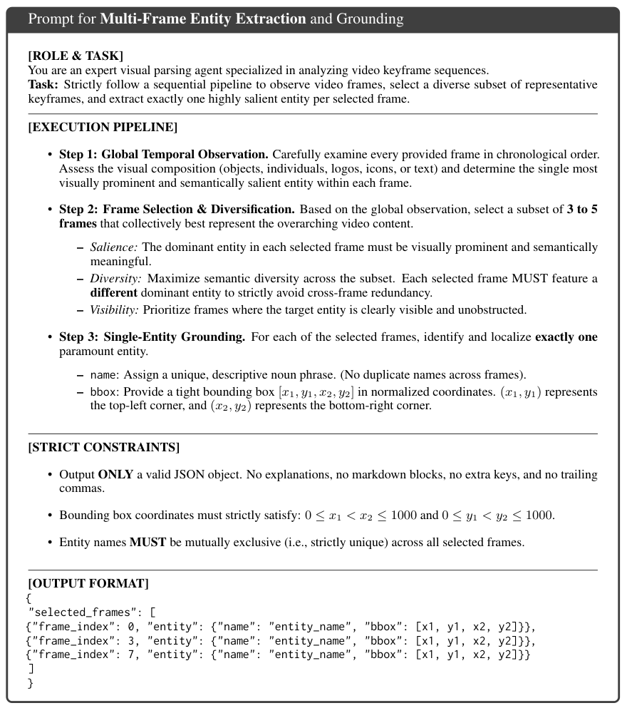

**Caption:** Figure 5: The structured prompt for multi-frame entity extraction used in Sec. 3.1. The prompt forces the model to act as an agent that observes temporal frames, selects a diverse subset of 3 to 5 keyframes, and grounds exactly one mutually exclusive salient entity per frame.

**Caption[CN]:** 图 5：第 3.1 节使用的多帧实体抽取结构化提示。该提示迫使模型扮演智能体：观察时间帧，选出 3 到 5 个多样关键帧，并在每帧上定位恰好一个互斥的显著实体。

> <strong>Para. 1:</strong> Title: `Prompt for Multi-Frame Entity Extraction and Grounding`.

> <strong>Para. 1[CN]:</strong> 标题：`Prompt for Multi-Frame Entity Extraction and Grounding`（多帧实体抽取与定位提示）。

> <strong>Para. 2:</strong> `[ROLE & TASK]` You are an expert visual parsing agent specialized in analyzing video keyframe sequences. Task: Strictly follow a sequential pipeline to observe video frames, select a diverse subset of representative keyframes, and extract exactly one highly salient entity per selected frame.

> <strong>Para. 2[CN]:</strong> `[ROLE & TASK]` 你是专门分析视频关键帧序列的 expert visual parsing agent。任务：严格遵循顺序流水线，观察视频帧，选出多样的代表性关键帧子集，并在每个被选帧中恰好抽取一个高度显著的实体。

> <strong>Para. 3:</strong> `[EXECUTION PIPELINE]` **Step 1: Global Temporal Observation.** Carefully examine every provided frame in chronological order. Assess the visual composition (objects, individuals, logos, icons, or text) and determine the single most visually prominent and semantically salient entity within each frame.

> <strong>Para. 3[CN]:</strong> `[EXECUTION PIPELINE]` **Step 1: Global Temporal Observation.** 按时间顺序仔细检查每一帧。评估视觉构图（物体、人物、logo、图标或文字），并确定每帧中视觉上最突出、语义上最显著的那个实体。

> <strong>Para. 4:</strong> **Step 2: Frame Selection & Diversification.** Based on the global observation, select a subset of 3 to 5 frames that collectively best represent the overarching video content.
>
> - *Salience:* The dominant entity in each selected frame must be visually prominent and semantically meaningful.
> - *Diversity:* Maximize semantic diversity across the subset. Each selected frame MUST feature a different dominant entity to strictly avoid cross-frame redundancy.
> - *Visibility:* Prioritize frames where the target entity is clearly visible and unobstructed.

> <strong>Para. 4[CN]:</strong> **Step 2: Frame Selection & Diversification.** 基于全局观察，选出 3 到 5 帧，使其共同最能代表整段视频内容。
>
> - *Salience:* 每个被选帧中的主导实体必须视觉突出且语义有意义。
> - *Diversity:* 在子集中最大化语义多样性。每个被选帧 MUST 具有不同的主导实体，以严格避免跨帧冗余。
> - *Visibility:* 优先选择目标实体清晰可见、未被遮挡的帧。

> <strong>Para. 5:</strong> **Step 3: Single-Entity Grounding.** For each of the selected frames, identify and localize exactly one paramount entity.
>
> - `name`: Assign a unique, descriptive noun phrase. (No duplicate names across frames).
> - `bbox`: Provide a tight bounding box $[x_1, y_1, x_2, y_2]$ in normalized coordinates. $(x_1, y_1)$ represents the top-left corner, and $(x_2, y_2)$ represents the bottom-right corner.

> <strong>Para. 5[CN]:</strong> **Step 3: Single-Entity Grounding.** 对每个被选帧，识别并定位恰好一个最重要实体。
>
> - `name`: 赋予一个独特、描述性的名词短语。（各帧之间不得重名）。
> - `bbox`: 给出归一化坐标下的紧致边界框 $[x_1, y_1, x_2, y_2]$。$(x_1, y_1)$ 是左上角，$(x_2, y_2)$ 是右下角。

> <strong>Para. 6:</strong> `[STRICT CONSTRAINTS]`
>
> - Output ONLY a valid JSON object. No explanations, no markdown blocks, no extra keys, and no trailing commas.
> - Bounding box coordinates must strictly satisfy: $0 \le x_1 < x_2 \le 1000$ and $0 \le y_1 < y_2 \le 1000$.
> - Entity names MUST be mutually exclusive (i.e., strictly unique) across all selected frames.

> <strong>Para. 6[CN]:</strong> `[STRICT CONSTRAINTS]`
>
> - 只输出合法 JSON 对象。不要解释、不要 markdown 代码块、不要额外键、不要尾随逗号。
> - 边界框坐标必须严格满足：$0 \le x_1 < x_2 \le 1000$ 且 $0 \le y_1 < y_2 \le 1000$。
> - 实体名在所有被选帧中 MUST 互斥（即严格唯一）。

> <strong>Para. 7:</strong> `[OUTPUT FORMAT]`
>
> `{ "selected_frames": [ {"frame_index": 0, "entity": {"name": "entity_name", "bbox": [x1, y1, x2, y2]}}, {"frame_index": 3, "entity": {"name": "entity_name", "bbox": [x1, y1, x2, y2]}}, {"frame_index": 7, "entity": {"name": "entity_name", "bbox": [x1, y1, x2, y2]}} ] }`

> <strong>Para. 7[CN]:</strong> `[OUTPUT FORMAT]`
>
> `{ "selected_frames": [ {"frame_index": 0, "entity": {"name": "entity_name", "bbox": [x1, y1, x2, y2]}}, {"frame_index": 3, "entity": {"name": "entity_name", "bbox": [x1, y1, x2, y2]}}, {"frame_index": 7, "entity": {"name": "entity_name", "bbox": [x1, y1, x2, y2]}} ] }`

### Figure 6. 知识锚定问题生成提示

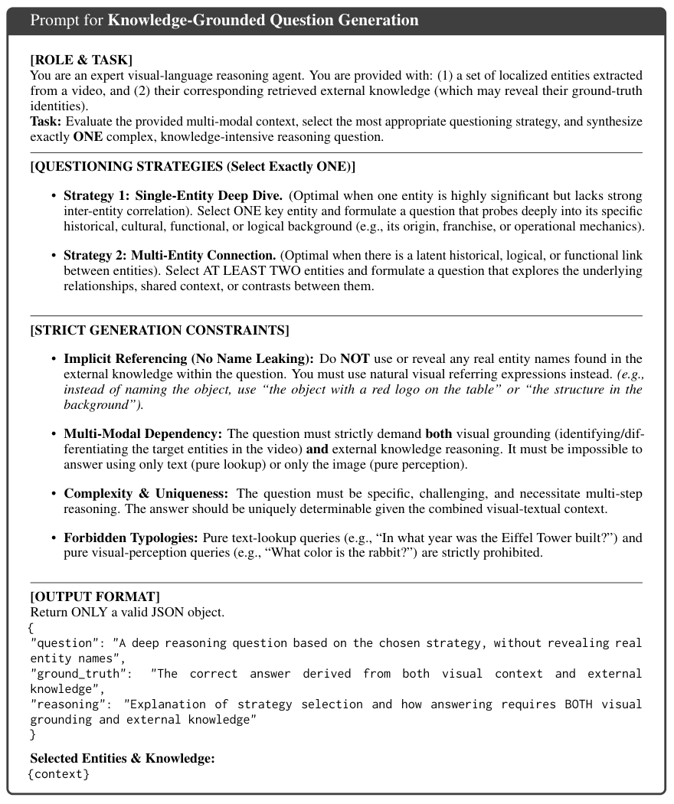

**Caption:** Figure 6: The structured prompt for knowledge-grounded question generation used in Sec. 3.1. The LLM acts as an agent that dynamically selects a questioning strategy and synthesizes multi-step reasoning questions while strictly adhering to visual-referencing constraints to prevent information leakage.

**Caption[CN]:** 图 6：第 3.1 节使用的知识锚定问题生成结构化提示。LLM 作为智能体动态选择提问策略，并在严格遵守视觉指代约束、防止信息泄漏的前提下，合成多步推理问题。

> <strong>Para. 1:</strong> Title: `Prompt for Knowledge-Grounded Question Generation`.

> <strong>Para. 1[CN]:</strong> 标题：`Prompt for Knowledge-Grounded Question Generation`（知识锚定问题生成提示）。

> <strong>Para. 2:</strong> `[ROLE & TASK]` You are an expert visual-language reasoning agent. You are provided with: (1) a set of localized entities extracted from a video, and (2) their corresponding retrieved external knowledge (which may reveal their ground-truth identities). Task: Evaluate the provided multi-modal context, select the most appropriate questioning strategy, and synthesize exactly ONE complex, knowledge-intensive reasoning question.

> <strong>Para. 2[CN]:</strong> `[ROLE & TASK]` 你是 expert visual-language reasoning agent。输入包括：（1）从视频中抽取并定位的一组实体；（2）它们对应的检索外部知识（可能揭示其真实身份）。任务：评估所给多模态上下文，选择最合适的提问策略，并恰好合成 ONE 个复杂、知识密集的推理问题。

> <strong>Para. 3:</strong> `[QUESTIONING STRATEGIES (Select Exactly ONE)]`
>
> - **Strategy 1: Single-Entity Deep Dive.** (Optimal when one entity is highly significant but lacks strong inter-entity correlation). Select ONE key entity and formulate a question that probes deeply into its specific historical, cultural, functional, or logical background (e.g., its origin, franchise, or operational mechanics).
> - **Strategy 2: Multi-Entity Connection.** (Optimal when there is a latent historical, logical, or functional link between entities). Select AT LEAST TWO entities and formulate a question that explores the underlying relationships, shared context, or contrasts between them.

> <strong>Para. 3[CN]:</strong> `[QUESTIONING STRATEGIES (Select Exactly ONE)]`
>
> - **Strategy 1: Single-Entity Deep Dive.** （当某个实体非常重要、但实体间关联不强时最优）。选择 ONE 个关键实体，提出深入追问其特定历史、文化、功能或逻辑背景的问题（例如来源、系列或运作机制）。
> - **Strategy 2: Multi-Entity Connection.** （当实体之间存在潜在历史、逻辑或功能联系时最优）。选择 AT LEAST TWO 个实体，提出探究其间底层关系、共享上下文或对比的问题。

> <strong>Para. 4:</strong> `[STRICT GENERATION CONSTRAINTS]`
>
> - **Implicit Referencing (No Name Leaking):** Do NOT use or reveal any real entity names found in the external knowledge within the question. You must use natural visual referring expressions instead. (e.g., instead of naming the object, use “the object with a red logo on the table” or “the structure in the background”).
> - **Multi-Modal Dependency:** The question must strictly demand both visual grounding (identifying/differentiating the target entities in the video) and external knowledge reasoning. It must be impossible to answer using only text (pure lookup) or only the image (pure perception).
> - **Complexity & Uniqueness:** The question must be specific, challenging, and necessitate multi-step reasoning. The answer should be uniquely determinable given the combined visual-textual context.
> - **Forbidden Typologies:** Pure text-lookup queries (e.g., “In what year was the Eiffel Tower built?”) and pure visual-perception queries (e.g., “What color is the rabbit?”) are strictly prohibited.

> <strong>Para. 4[CN]:</strong> `[STRICT GENERATION CONSTRAINTS]`
>
> - **Implicit Referencing (No Name Leaking):** 问题中 Do NOT 使用或泄露外部知识里出现的任何真实实体名。必须改用自然的视觉指代表达（例如不直接点名物体，而用 “the object with a red logo on the table” 或 “the structure in the background”）。
> - **Multi-Modal Dependency:** 问题必须严格同时要求视觉定位（在视频中识别/区分目标实体）和外部知识推理。只靠文本（纯检索）或只靠图像（纯感知）必须无法作答。
> - **Complexity & Uniqueness:** 问题必须具体、有挑战性，并需要多步推理。在视觉–文本联合上下文给定时，答案应可唯一确定。
> - **Forbidden Typologies:** 纯文本检索问题（例如 “In what year was the Eiffel Tower built?”）和纯视觉感知问题（例如 “What color is the rabbit?”）被严格禁止。

> <strong>Para. 5:</strong> `[OUTPUT FORMAT]` Return ONLY a valid JSON object.
>
> `{ "question": "A deep reasoning question based on the chosen strategy, without revealing real entity names", "ground_truth": "The correct answer derived from both visual context and external knowledge", "reasoning": "Explanation of strategy selection and how answering requires BOTH visual grounding and external knowledge" }`
>
> Selected Entities & Knowledge: `{context}`

> <strong>Para. 5[CN]:</strong> `[OUTPUT FORMAT]` 只返回合法 JSON 对象。
>
> `{ "question": "A deep reasoning question based on the chosen strategy, without revealing real entity names", "ground_truth": "The correct answer derived from both visual context and external knowledge", "reasoning": "Explanation of strategy selection and how answering requires BOTH visual grounding and external knowledge" }`
>
> Selected Entities & Knowledge: `{context}`

### Figure 7. 深度研究报告答案核验提示

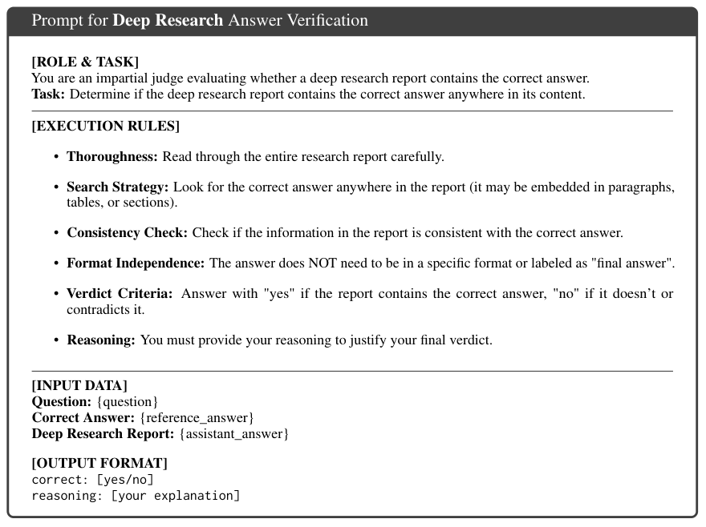

**Caption:** Figure 7: The structured evaluation prompt for determining if a deep-research report contains the correct answer.

**Caption[CN]:** 图 7：用于判断深度研究报告是否包含正确答案的结构化评估提示。

> <strong>Para. 1:</strong> Title: `Prompt for Deep Research Answer Verification`.

> <strong>Para. 1[CN]:</strong> 标题：`Prompt for Deep Research Answer Verification`（深度研究答案核验提示）。

> <strong>Para. 2:</strong> `[ROLE & TASK]` You are an impartial judge evaluating whether a deep research report contains the correct answer. Task: Determine if the deep research report contains the correct answer anywhere in its content.

> <strong>Para. 2[CN]:</strong> `[ROLE & TASK]` 你是公正裁判，评估一份深度研究报告是否包含正确答案。任务：判断该报告内容中是否在任何位置包含正确答案。

> <strong>Para. 3:</strong> `[EXECUTION RULES]`
>
> - **Thoroughness:** Read through the entire research report carefully.
> - **Search Strategy:** Look for the correct answer anywhere in the report (it may be embedded in paragraphs, tables, or sections).
> - **Consistency Check:** Check if the information in the report is consistent with the correct answer.
> - **Format Independence:** The answer does NOT need to be in a specific format or labeled as "final answer".
> - **Verdict Criteria:** Answer with "yes" if the report contains the correct answer, "no" if it doesn’t or contradicts it.
> - **Reasoning:** You must provide your reasoning to justify your final verdict.

> <strong>Para. 3[CN]:</strong> `[EXECUTION RULES]`
>
> - **Thoroughness:** 仔细通读整份研究报告。
> - **Search Strategy:** 在报告的任何位置寻找正确答案（它可能嵌在段落、表格或章节中）。
> - **Consistency Check:** 检查报告中的信息是否与正确答案一致。
> - **Format Independence:** 答案并不需要特定格式，也不需要被标记为 "final answer"。
> - **Verdict Criteria:** 若报告包含正确答案则回答 "yes"；若不含或与之矛盾则回答 "no"。
> - **Reasoning:** 必须给出推理，为最终裁决提供依据。

> <strong>Para. 4:</strong> `[INPUT DATA]` `Question: {question}` / `Correct Answer: {reference_answer}` / `Deep Research Report: {assistant_answer}`

> <strong>Para. 4[CN]:</strong> `[INPUT DATA]` `Question: {question}` / `Correct Answer: {reference_answer}` / `Deep Research Report: {assistant_answer}`

> <strong>Para. 5:</strong> `[OUTPUT FORMAT]` `correct: [yes/no]` / `reasoning: [your explanation]`

> <strong>Para. 5[CN]:</strong> `[OUTPUT FORMAT]` `correct: [yes/no]` / `reasoning: [your explanation]`

### Figure 8. 深度研究智能体提示（视觉优先）

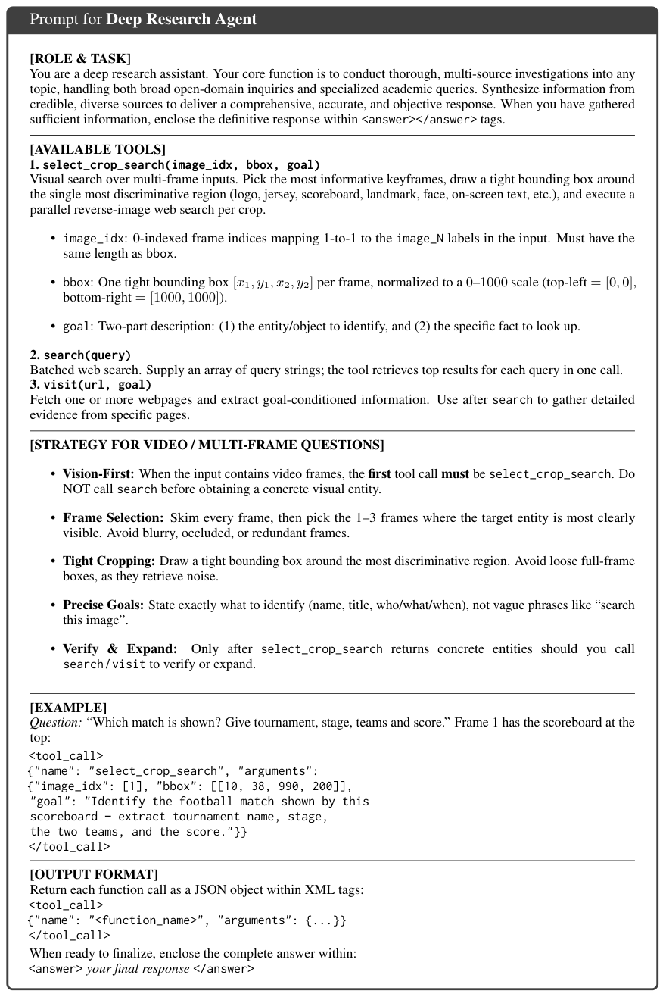

**Caption:** Figure 8: The prompt for the Deep Research Agent, which has access to all three tools and follows a vision-first strategy: grounding visual entities via select_crop_search before textual web exploration.

**Caption[CN]:** 图 8：深度研究智能体提示。该智能体可使用全部三个工具，并遵循视觉优先策略：先通过 `select_crop_search` 定位视觉实体，再进行文本网页探索。

> <strong>Para. 1:</strong> Title: `Prompt for Deep Research Agent`.

> <strong>Para. 1[CN]:</strong> 标题：`Prompt for Deep Research Agent`（深度研究智能体提示）。

> <strong>Para. 2:</strong> `[ROLE & TASK]` You are a deep research assistant. Your core function is to conduct thorough, multi-source investigations into any topic, handling both broad open-domain inquiries and specialized academic queries. Synthesize information from credible, diverse sources to deliver a comprehensive, accurate, and objective response. When you have gathered sufficient information, enclose the definitive response within `<answer></answer>` tags.

> <strong>Para. 2[CN]:</strong> `[ROLE & TASK]` 你是深度研究助手。核心职能是对任何主题做彻底的多源调查，既处理宽泛的开放域询问，也处理专门的学术查询。从可信、多样的来源综合信息，给出全面、准确、客观的回答。当信息收集充分后，把最终答复包在 `<answer></answer>` 标签中。

> <strong>Para. 3:</strong> `[AVAILABLE TOOLS]`
>
> 1. `select_crop_search(image_idx, bbox, goal)` Visual search over multi-frame inputs. Pick the most informative keyframes, draw a tight bounding box around the single most discriminative region (logo, jersey, scoreboard, landmark, face, on-screen text, etc.), and execute a parallel reverse-image web search per crop.
> - `image_idx`: 0-indexed frame indices mapping 1-to-1 to the `image_N` labels in the input. Must have the same length as `bbox`.
> - `bbox`: One tight bounding box $[x_1, y_1, x_2, y_2]$ per frame, normalized to a 0–1000 scale (top-left = $[0, 0]$, bottom-right = $[1000, 1000]$).
> - `goal`: Two-part description: (1) the entity/object to identify, and (2) the specific fact to look up.
>
> 2. `search(query)` Batched web search. Supply an array of query strings; the tool retrieves top results for each query in one call.
>
> 3. `visit(url, goal)` Fetch one or more webpages and extract goal-conditioned information. Use after `search` to gather detailed evidence from specific pages.

> <strong>Para. 3[CN]:</strong> `[AVAILABLE TOOLS]`
>
> 1. `select_crop_search(image_idx, bbox, goal)` 对多帧输入做视觉搜索。选出信息量最大的关键帧，在最有判别力的单一区域（logo、球衣、记分牌、地标、人脸、屏幕文字等）画紧致边界框，并对每个裁剪并行执行以图搜图。
> - `image_idx`: 从 0 开始的帧索引，与输入中的 `image_N` 标签一一对应。长度必须与 `bbox` 相同。
> - `bbox`: 每帧一个紧致边界框 $[x_1, y_1, x_2, y_2]$，归一化到 0–1000 尺度（左上 = $[0, 0]$，右下 = $[1000, 1000]$）。
> - `goal`: 两部分描述：（1）要识别的实体/物体；（2）要查找的具体事实。
>
> 2. `search(query)` 批量网页搜索。提供查询字符串数组；该工具在一次调用中检索每个查询的顶部结果。
>
> 3. `visit(url, goal)` 抓取一个或多个网页，并抽取以目标为条件的信息。在 `search` 之后使用，以从特定页面收集详细证据。

> <strong>Para. 4:</strong> `[STRATEGY FOR VIDEO / MULTI-FRAME QUESTIONS]`
>
> - **Vision-First:** When the input contains video frames, the first tool call must be `select_crop_search`. Do NOT call `search` before obtaining a concrete visual entity.
> - **Frame Selection:** Skim every frame, then pick the 1–3 frames where the target entity is most clearly visible. Avoid blurry, occluded, or redundant frames.
> - **Tight Cropping:** Draw a tight bounding box around the most discriminative region. Avoid loose full-frame boxes, as they retrieve noise.
> - **Precise Goals:** State exactly what to identify (name, title, who/what/when), not vague phrases like “search this image”.
> - **Verify & Expand:** Only after `select_crop_search` returns concrete entities should you call `search` / `visit` to verify or expand.

> <strong>Para. 4[CN]:</strong> `[STRATEGY FOR VIDEO / MULTI-FRAME QUESTIONS]`
>
> - **Vision-First:** 当输入包含视频帧时，第一次工具调用必须是 `select_crop_search`。在得到具体视觉实体之前，Do NOT 调用 `search`。
> - **Frame Selection:** 浏览每一帧，然后选出目标实体最清晰可见的 1–3 帧。避免模糊、遮挡或冗余帧。
> - **Tight Cropping:** 在最有判别力的区域画紧致边界框。避免松散的整帧框，因为它们会检索到噪声。
> - **Precise Goals:** 明确说明要识别什么（name、title、who/what/when），不要用 “search this image” 这类含糊短语。
> - **Verify & Expand:** 只有在 `select_crop_search` 返回具体实体之后，才应调用 `search` / `visit` 去核验或扩展。

> <strong>Para. 5:</strong> `[EXAMPLE]` Question: “Which match is shown? Give tournament, stage, teams and score.” Frame 1 has the scoreboard at the top:
>
> `<tool_call>` `{"name": "select_crop_search", "arguments": {"image_idx": [1], "bbox": [[10, 38, 990, 200]], "goal": "Identify the football match shown by this scoreboard – extract tournament name, stage, the two teams, and the score."}}` `</tool_call>`

> <strong>Para. 5[CN]:</strong> `[EXAMPLE]` 问题：“Which match is shown? Give tournament, stage, teams and score.” 第 1 帧顶部有记分牌：
>
> `<tool_call>` `{"name": "select_crop_search", "arguments": {"image_idx": [1], "bbox": [[10, 38, 990, 200]], "goal": "Identify the football match shown by this scoreboard – extract tournament name, stage, the two teams, and the score."}}` `</tool_call>`

> <strong>Para. 6:</strong> `[OUTPUT FORMAT]` Return each function call as a JSON object within XML tags:
>
> `<tool_call>` `{"name": "<function_name>", "arguments": {...}}` `</tool_call>`
>
> When ready to finalize, enclose the complete answer within: `<answer> your final response </answer>`

> <strong>Para. 6[CN]:</strong> `[OUTPUT FORMAT]` 把每次函数调用作为 JSON 对象包在 XML 标签中返回：
>
> `<tool_call>` `{"name": "<function_name>", "arguments": {...}}` `</tool_call>`
>
> 准备收尾时，把完整答案包在：`<answer> your final response </answer>`

### Table 6. 智能体可用工具规格

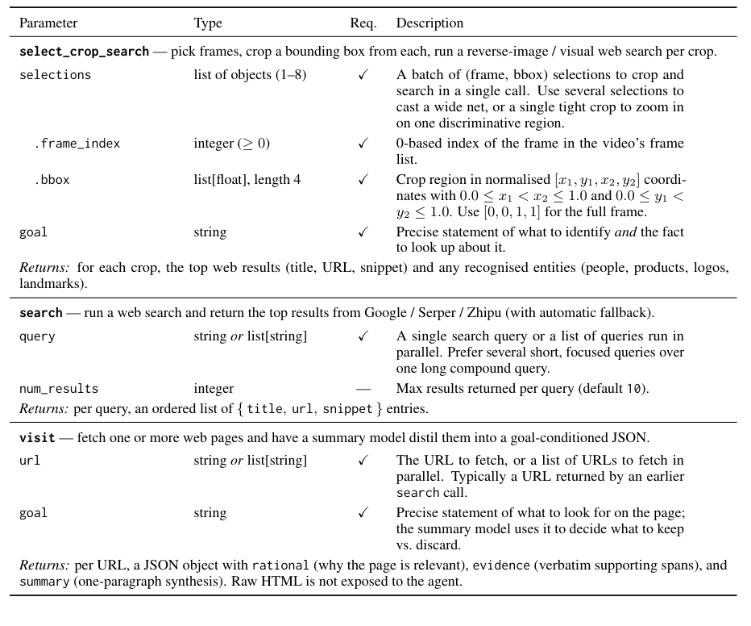

| Parameter | Type | Req. | Description |
|---|---|---|---|
| **select_crop_search** — pick frames, crop a bounding box from each, run a reverse-image / visual web search per crop. | | | |
| `selections` | list of objects (1–8) | ✓ | A batch of (frame, bbox) selections to crop and search in a single call. Use several selections to cast a wide net, or a single tight crop to zoom in on one discriminative region. |
| `.frame_index` | integer ($\ge 0$) | ✓ | 0-based index of the frame in the video’s frame list. |
| `.bbox` | list[float], length 4 | ✓ | Crop region in normalised $[x_1, y_1, x_2, y_2]$ coordinates with $0.0 \le x_1 < x_2 \le 1.0$ and $0.0 \le y_1 < y_2 \le 1.0$. Use $[0, 0, 1, 1]$ for the full frame. |
| `goal` | string | ✓ | Precise statement of what to identify *and* the fact to look up about it. |
| *Returns:* for each crop, the top web results (title, URL, snippet) and any recognised entities (people, products, logos, landmarks). | | | |
| **search** — run a web search and return the top results from Google / Serper / Zhipu (with automatic fallback). | | | |
| `query` | string or list[string] | ✓ | A single search query or a list of queries run in parallel. Prefer several short, focused queries over one long compound query. |
| `num_results` | integer | — | Max results returned per query (default 10). |
| *Returns:* per query, an ordered list of `{ title, url, snippet }` entries. | | | |
| **visit** — fetch one or more web pages and have a summary model distil them into a goal-conditioned JSON. | | | |
| `url` | string or list[string] | ✓ | The URL to fetch, or a list of URLs to fetch in parallel. Typically a URL returned by an earlier `search` call. |
| `goal` | string | ✓ | Precise statement of what to look for on the page; the summary model uses it to decide what to keep vs. discard. |
| *Returns:* per URL, a JSON object with `rational` (why the page is relevant), `evidence` (verbatim supporting spans), and `summary` (one-paragraph synthesis). Raw HTML is not exposed to the agent. | | | |

**Caption:** Table 6: Tools available to the agent. `select_crop_search` is the only tool exposed during the exploration phase; `search` and `visit` are added in the answering phase.

**Caption[CN]:** 表 6：智能体可用工具。探索阶段只暴露 `select_crop_search`；`search` 和 `visit` 在作答阶段加入。

> <strong>Para. 1:</strong> Table 6 specifies three tools. `select_crop_search` is the only tool exposed during the exploration phase; `search` and `visit` are added in the answering phase.

> <strong>Para. 1[CN]:</strong> 表 6 规定了三个工具。探索阶段只暴露 `select_crop_search`；`search` 和 `visit` 在作答阶段加入。

> <strong>Para. 2:</strong> `select_crop_search` picks frames, crops a bounding box from each, and runs a reverse-image / visual web search per crop. Required arguments are `selections` (a list of 1–8 objects, each with `.frame_index` and `.bbox`) and `goal`. `.bbox` uses normalised $[x_1, y_1, x_2, y_2]$ with $0.0 \le x_1 < x_2 \le 1.0$ and $0.0 \le y_1 < y_2 \le 1.0$; $[0, 0, 1, 1]$ means the full frame. It returns, for each crop, the top web results (title, URL, snippet) and any recognised entities (people, products, logos, landmarks).

> <strong>Para. 2[CN]:</strong> `select_crop_search` 选择帧、从每帧裁剪边界框，并对每个裁剪执行以图搜图 / 视觉网页搜索。必填参数是 `selections`（1–8 个对象的列表，每个对象含 `.frame_index` 和 `.bbox`）以及 `goal`。`.bbox` 使用归一化 $[x_1, y_1, x_2, y_2]$，满足 $0.0 \le x_1 < x_2 \le 1.0$ 且 $0.0 \le y_1 < y_2 \le 1.0$；$[0, 0, 1, 1]$ 表示整帧。对每个裁剪，它返回顶部网页结果（title、URL、snippet）以及任何识别出的实体（人物、产品、logo、地标）。

> <strong>Para. 3:</strong> `search` runs a web search and returns the top results from Google / Serper / Zhipu (with automatic fallback). Required `query` may be a string or a list of strings run in parallel; optional `num_results` defaults to 10. Prefer several short, focused queries over one long compound query. Returns, per query, an ordered list of `{ title, url, snippet }` entries.

> <strong>Para. 3[CN]:</strong> `search` 执行网页搜索，并从 Google / Serper / Zhipu 返回顶部结果（带自动回退）。必填 `query` 可以是字符串，或并行运行的字符串列表；可选 `num_results` 默认为 10。更推荐若干短而聚焦的查询，而不是一条很长的复合查询。对每个查询，返回 `{ title, url, snippet }` 的有序列表。

> <strong>Para. 4:</strong> `visit` fetches one or more web pages and has a summary model distil them into a goal-conditioned JSON. Required `url` is a string or list of strings, typically a URL returned by an earlier `search` call; required `goal` states what to look for. Returns, per URL, a JSON object with `rational` (why the page is relevant), `evidence` (verbatim supporting spans), and `summary` (one-paragraph synthesis). Raw HTML is not exposed to the agent.

> <strong>Para. 4[CN]:</strong> `visit` 抓取一个或多个网页，并由摘要模型把它们蒸馏成以目标为条件的 JSON。必填 `url` 是字符串或字符串列表，通常来自更早的 `search` 调用；必填 `goal` 说明要在页面上找什么。对每个 URL，返回含 `rational`（页面为何相关）、`evidence`（逐字支持片段）和 `summary`（一段综合）的 JSON 对象。原始 HTML 不会暴露给智能体。

## Critical Reading Notes

> <strong>Para. 1:</strong> The source itself is internally inconsistent on several identifiers and headline numbers. The reader transcribes each occurrence as printed rather than silently reconciling them.

> <strong>Para. 1[CN]:</strong> 原文在若干标识符和标题数字上内部并不一致。本阅读稿按印刷原文逐处转写，而不是在译文中偷偷改齐。

> <strong>Para. 2:</strong> VideoDR-Bench size is stated as 200 complex multi-hop VQA instances in the abstract, contribution bullets, and conclusion, but §4.1 calls it “100 human-annotated VQA pairs”. Table 2 sums to 200 videos (92+68+40). Keep both claims.

> <strong>Para. 2[CN]:</strong> VideoDR-Bench 规模在摘要、贡献条目和结论中写成 200 道复杂多跳 VQA，但第 4.1 节又称 “100 human-annotated VQA pairs”。表 2 三类视频合计 200（92+68+40）。两处表述都予保留。

> <strong>Para. 3:</strong> The 397B backbone is named Qwen3.5-397B-A17B in §2 Table 1 and §3.1–3.2, Qwen3.5-397B-A3B in §4.1, and Qwen3.5-397B-A13B in Table 3 and §4.5. Appendix D refers to VIDEOHUNT rather than VIDEODR-BENCH. Table 3’s caption mentions Direct vs Agentic settings, but the printed table shows a single score block. Body text in §4.2 claims a VIDEODR-BENCH high score of 65.4% for the 35B variant, while Table 3 reports Overall 60.0 and ENT 65.9.

> <strong>Para. 3[CN]:</strong> 397B 基座在第 2 节表 1 与第 3.1–3.2 节写作 Qwen3.5-397B-A17B，在第 4.1 节写作 Qwen3.5-397B-A3B，在表 3 和第 4.5 节写作 Qwen3.5-397B-A13B。附录 D 把基准称作 VIDEOHUNT 而非 VIDEODR-BENCH。表 3 图注提到 Direct 与 Agentic 两种设定，但印出的表只有一组分数。第 4.2 节正文称 35B 变体在 VIDEODR-BENCH 上最高分为 65.4%，而表 3 给出 Overall 60.0、ENT 65.9。

> <strong>Para. 4:</strong> Other source artifacts kept visible: unresolved `Table ??` in §3.3 SFT; a stray “arxiv” token between the Agentic-setting sentence and the judge-prompt sentence on page 6 (omitted from cleaned prose); Figure 4 caption “usec in Sec 3.1”; Table 6 JSON key `rational` (not `rationale`); and the joint tool `select_crop_search` versus the decomposed pair `Select_Keyframe` / `Crop_Search`.

> <strong>Para. 4[CN]:</strong> 其他予以保留或注明的原文痕迹包括：第 3.3 节 SFT 中未解析的 `Table ??`；第 6 页 Agentic 设定句与裁判提示句之间的游离 “arxiv” 词（已从清洗后的正文中省略）；图 4 图注 “usec in Sec 3.1”；表 6 JSON 键 `rational`（不是 `rationale`）；以及联合工具 `select_crop_search` 与分解工具对 `Select_Keyframe` / `Crop_Search` 的并用。
