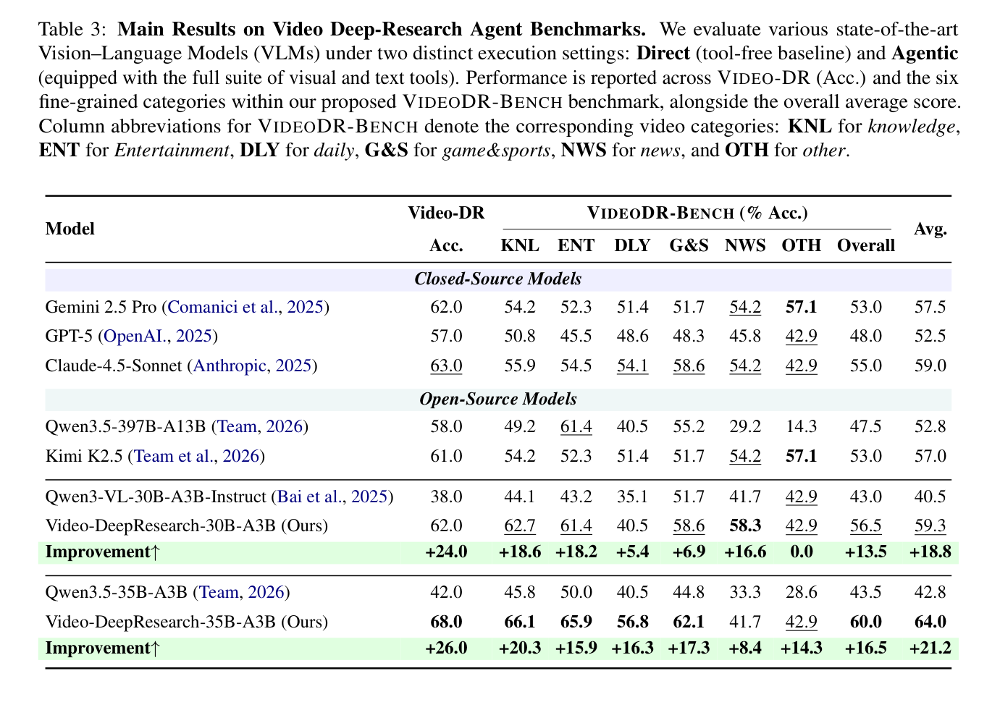
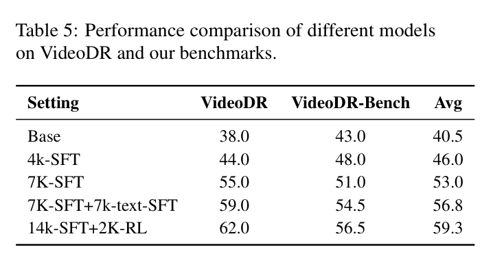
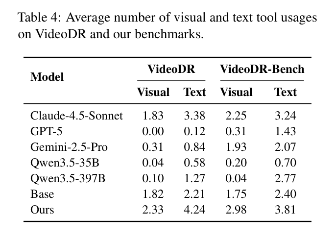

---
tags:
  - papers/multimodal
  - papers/video-agent
aliases:
  - Video-DeepResearch
  - Video-DR
  - VideoDR-Bench
date: 2026-08-04
arxiv_id: 2608.03979
---

# Video-DeepResearch: Towards the Next-Generation Multimodal Deepresearch Agent

## 核心信息

- 标题: Video-DeepResearch: Towards the Next-Generation Multimodal Deepresearch Agent
- 标题翻译: 视频深度研究：面向下一代多模态深度研究智能体
- 作者: Zhen Fang, Yu Zeng, Wenxuan Huang, Yiming Zhao, Shiting Huang, Tianfei Ren, Qi Lu, Qingnan Ren, Qisheng Su, Lionel Z. Wang, Qingyu Yin, Shuang Chen, Zehui Chen, Lin Chen, Zhenfei Yin, Yao Hu, Shaohui Lin, Wanli Ouyang, Shaosheng Cao, Feng Zhao（共同一作：Fang、Zeng、Huang、Zhao；通讯：Wenxuan Huang、Shaosheng Cao、Feng Zhao）
- 机构: 中国科学技术大学、小红书、香港中文大学、香港理工大学、浙江大学、加州大学洛杉矶分校、牛津大学、华东师范大学、清华大学
- 发表时间: 2026-08-04
- 发表渠道: arXiv preprint（cs.CV）
- arXiv: 2608.03979v1
- 论文链接: https://arxiv.org/abs/2608.03979
- 代码 / 项目: https://github.com/Osilly/Vision-DeepResearch （子目录 `Video-DeepResearch/`；仓库写明数据、代码与权重将发布）
- 数据 / 资源: 约 3 万条视频问答、7 千条拒采轨迹、另混 7 千条 `VDR` 文本问答；评测为 `VideoDR-Bench` 与 `VideoDR`（Liu et al. 2026）
- 论文类型: AI_method（含基准协议贡献）

## 原文摘要翻译

我们提出 `Video-DeepResearch`，把多模态智能体从静态图像扩展到连续视频流。该设定要求密集的时空定位，并与开放网页探索耦合。

初步评测暴露了现有模型的两个关键瓶颈：一是模态偏见，智能体绕过视觉工具、转而做文本搜索；二是参数知识泄漏，模型依赖内部记忆，而不是真正的工具增强执行。

针对这些问题，框架用解耦的感知–探索流水线，并配合分阶段工具解锁，迫使模型在网页检索之前完成穷尽式跨帧视觉定位。训练分两阶段：监督微调，再接组相对策略优化，以支持自主探索，从而打破模仿学习的上限。

此外，我们构建了 `VideoDR-Bench`，这是一个人机协同基准，包含 200 道复杂多跳视觉问答。

`Video-DeepResearch-35B-A3B` 以 64.0% 的平均准确率达到新的最高水平，超过专有模型 `Claude-4.5-Sonnet`（59.0%）5.0 分。

它也明显优于 `GPT-5`（52.5%）和 `Gemini-2.5-Pro`（57.5%）。30B-A3B 变体达到 59.3%，与前者相当，说明该训练范式在紧凑规模上仍然有效。

## 创新点

1. **把失败写成可测行为，而不是再喊一次视频很难。** 在已有 `VideoDR` 上统计工具次数：最强开源几乎不用视觉工具，`GPT-5` 零视觉调用仍能拿到 `57`。后续方法都在回应这两件事：模态偏见与参数泄漏。
2. **用动作空间课程，而不是新骨干，来逼视觉第一跳。** 轨迹前半只开放 `Select_Keyframe` 与 `Crop_Search`，感知足够或达到地平线后才解锁 `Search` / `Visit`。这是本文最可迁移的接口，不是又一套通用工具列表。
3. **数据是“可检索实体元组”，不是密集字幕。** 先筛视频，再选帧、框实体、反向图搜、核验，再合成单实体/多实体问答，并用四次无工具试答丢掉能靠记忆做对的题，得到约 `3` 万问答和 `7` 千条成功轨迹。
4. **评测与训练共享同一泄漏过滤器。** `VideoDR-Bench` 的卖点不是领域饼图，而是：题目必须同时依赖视觉定位和外部知识，且无工具答对即丢弃。它让“超过 GPT-5”部分变成基准设计主张。
5. **训练配方是组装，但消融把账算清了。** `SFT` 加 `GRPO` 本身不新；真正要记下的是 `7K` 视频轨迹、`7K` 文本深搜、`2K` 中等难度强化学习各自抬了多少分。

## 一句话总结

这篇不是新的视频大模型，而是把图像深度研究接到视频上时，用“先锁死文本工具”改写轨迹分布，再用防泄漏的视频–网页问答来测量；标题里的下一代智能体，实际交付的是一套课程、一套数据和一个仍然偏小、写法还不自洽的评测。

## 研究问题

图像侧的深度研究已经能做反向图搜、裁剪和多步网页验证，例如 `Vision-DeepResearch`。视频把同一问题拉到时间轴上：关键证据只在若干帧、若干局部出现，而且很多答案根本不在像素里，而在开放网页。

作者认为现成路线有两处对不上。数据上，常规视频语料是局部描述或短动作标签，产不出“跨帧定位再上网核实”的长轨迹。评测上，普通视频问答分数测不到策略执行，也挡不住靠世界知识直接猜。

§2 把问题说死了：不是没有 `Select_Keyframe` 和 `Crop_Search`，而是模型不肯用。于是本文要解决的不是“视频表征够不够强”，而是“如何让策略先看后查，并且让评测惩罚只靠记忆的答法”。

## 数据与任务定义

形式化任务：给定研究问题 $Q$ 与视觉输入 $V$（连续视频或预采样关键帧），智能体输出回答 $R$。逐步决策写为

$$
a_i\sim\pi_\theta(a\mid\mathcal{H}_i)
$$

历史 $\mathcal{H}_i$ 含问题、视频、过往动作与观察。

评测有两套，不要混名。`VideoDR` 是 Liu 等人 2026 年的已有集，用来做直接迁移和工具计数。`VideoDR-Bench` 是本文集，声称每题都要视觉检索加多跳外部知识。平均分是两套准确率再平均。

训练数据与评测数据不是同一管道的简单切分。训练：多源视频经规则加智能体过滤后，合成约 `3` 万视频问答，再用 `Qwen3.5-397B-A17B` 生成轨迹并拒采，留下 `7` 千条做对的轨迹；为补文本工具，再混入 `Vision-DeepResearch` 的 `7` 千条纯文本问答。强化学习另筛 `2` 千条中等难度题。评测：从过滤后的视频池抽样，人工做种子问答，再经多代理扩成多跳题。

`VideoDR-Bench` 规模必须并记，不能只抄摘要。摘要、贡献列表、结论都写 200 道复杂多跳问答；表 2 按时长计 $92+68+40=200$；图 2 的领域占比带半个百分点，也更像以 200 为分母。但实验设置一节写的是 100 条人工标注问答。附录甚至把基准叫成 `VIDEOHUNT`。公开协议冻结前，这两套数字都不能当已核对的样本量。

*论文原图编号：Fig. 2。六个领域与示例题；知识类约占三成，其他类只有约 `3.5%`，类别分不要当稳健指标。*

时长分布如下。短视频占一半，长视频只有 `20%`，所谓连续视频流在评测里仍偏短。

| 类型 | 时长 | 条数 | 占比 |
|---|---|---:|---:|
| Short | $\le 2$ 分钟 | 92 | 46.0% |
| Medium | $2$–$10$ 分钟 | 68 | 34.0% |
| Long | $\ge 10$ 分钟 | 40 | 20.0% |

预处理两边对齐：`CLIP-ViT-L/14@336px` 算帧间相似，超过 `0.8` 的相邻帧丢掉，纯色帧丢掉，每视频最多 `20` 帧。复现时若评测用均匀密采样，分数不可比。

标注：`8` 人、约三周，先培训再资格考；生产期是标注与质检解耦。过滤标准明确：日常无信息差、字幕已自包含、静帧幻灯、画质差到无法检索的视频直接判不需要搜索。

## 方法主线

### 机制流程

*论文原图编号：Fig. 1。上半对照文本捷径与整图检索；下半才是选帧、裁剪、再进入文本与网页。*

1. **输入视频与问题，先提取候选帧。** 输入是 $Q$ 与至多 `20` 帧。策略必须先调用视觉工具：概念上是 `Select_Keyframe`，实现上常合成 `select_crop_search`。输出是少量高区分度帧，而不是整段视频进上下文。
2. **在帧上查询局部实体。** 对选中帧给紧框，裁出标志、人脸、字幕、记分牌等区域，做反向图像搜索。输出是实体名、摘要与网址，写入后续历史 $\mathcal{H}$。
3. **视觉证据足够后，再查询网页。** 轨迹生成时这一步是动作空间解锁：此前没有 `Search` / `Visit`。推理提示则硬性规定第一跳必须是视觉检索，之后才允许文本搜索和访问页面。输出是可核验的网页证据。
4. **生成最终回答。** 从最后一步抽出预测，放入 `<answer>`。训练时由 `Qwen3-VL-30B-A3B-Instruct` 做 `0/1` 判定；评测沿用通义深度研究的官方裁判提示。

### 数据引擎

*论文原图编号：Fig. 3。四段流水线：筛视频、做可检索问答、锁工具生成轨迹、人机扩多跳评测题。*

第一阶段：多领域视频来自既有数据集和实际流媒体。规则过滤时长；`Qwen3.5-35B-A3B` 再丢掉信息量不足的视频。池子切成训练与测试。

第二阶段：对比图编码器提候选帧，大教师模型定帧并预测框，裁剪后做视觉搜索，再用较小模型核对裁区与检索结果是否语义对齐。元数据是帧、框、实体名、检索摘要组成的元组。问答有单实体事实题和多实体组合题，禁止纯颜色、纯外观题。每题做四次无工具试答，任一做对即永久丢弃，最终约三万问答。

第三阶段：用大教师模型在锁工具课程下采样，只留答对轨迹，得到七千条。这七千不是原始问答规模，是过了视觉第一跳并且最终做对的示范。

评测题另走人工种子：人在关键时间点用 `Crop_Search` 核对检索与帧一致，再写种子问答。起草代理扩展关键词，搜索后由生成代理写成多跳题，再滤泄漏、人工核对、排序代理只留最高分，并可递归当新种子。

### 工具与动作空间

概念动作空间包含选帧、裁剪检索与文本搜索。时间工具选出关键时刻，空间工具用四维框裁出局部图像。论文也承认二者可合成一次调用。

实现以附录表 6 和图 8 为准，不要只记概念名。

| 工具 | 何时可用 | 关键参数 | 返回 |
|---|---|---|---|
| `select_crop_search` | 探索阶段唯一工具；推理提示要求第一跳必须用它 | 每帧 `frame_index`、框、`goal`；一次 `1–8` 个选择 | 每个裁块的网页结果与识别实体 |
| `search` | 作答阶段加入 | 一条或多条查询，默认可返回 `10` 条 | 标题、网址、摘要 |
| `visit` | 作答阶段加入 | 网址加 `goal` | 相关理由、原文证据、一段综述；不把原始网页交给模型 |

有两处复现必须对齐。其一，附录表 6 把框写成单位区间，图 5 与图 8 写成千分坐标。其二，分阶段解锁明确写在轨迹生成；推理提示列出全部三个工具，只靠“视觉优先”约束。训练课程和推理提示不是同一硬锁。

### 训练目标

基座：`Video-DeepResearch-30B-A3B` 用 `Qwen3-VL-30B-A3B-Instruct`；`35B-A3B` 用 `Qwen3.5-35B-A3B`。配方相同。计算是 `4` 个节点、每节点 `8` 张 `80GB` 卡，正文写 `H800`。

监督阶段把 `7` 千视频轨迹与 `7` 千 `VDR` 文本问答混在一起，让模型先学会解耦工作流，再补文本深搜。目标是标准下一词负对数似然：

$$
\mathcal{L}_{\mathrm{SFT}}=-\mathbb{E}_{(x,y)\sim\mathcal{D}}\Big[\sum_{i=1}^{|y|}\log\pi_\theta(y_i\mid x,y_{<i})\Big]
$$

这里 $x$ 含系统提示、视觉输入和交互历史，$y$ 是整条示范轨迹。工程上就是在超长工具轨迹上做模仿，而不是只模仿最终答案。

强化学习用组相对策略优化。先对候选做四次采样，只保留既非全对也非全错的两千条。奖励是稀疏二元：裁判判对记 1，否则记 0。格式错误或重复循环的负优势只以两成概率回传，避免长轨迹里的崩溃模式主导更新。目标为

$$
\mathcal{L}_{\mathrm{GRPO}}=\frac{1}{G}\sum_{i=1}^{G}\Big[\min\Big(\frac{\pi_\theta(o_i)}{\pi_{\mathrm{old}}(o_i)}\hat{A}_i,\ \mathrm{clip}\big(\tfrac{\pi_\theta(o_i)}{\pi_{\mathrm{old}}(o_i)},1-\epsilon,1+\epsilon\big)\hat{A}_i\Big)\Big]-\beta D_{\mathrm{KL}}
$$

优势来自组内相对奖励，因此不需要价值网络。正文没写组大小是否就是四次采样，也没写裁剪半径、散度系数和学习率；附录几乎全是监督微调细节。

### 关键实现细节

监督微调用 `Megatron-LM`，上下文八万且不做序列拼接。张量并行 4、上下文并行 2、专家并行 8，并开序列并行。训练 3 轮，微批次 1，全局批次 64。学习率前 5% 步升到 $1\times 10^{-5}$，再降到 $5\times 10^{-7}$。混合专家辅助损失为 $1\times 10^{-6}$，专家容量 2.0。全层激活检查点，注意力用 `FlashAttention`，每 500 步只存权重、不存优化器状态。

裁判与提示：评测在带工具设置下给全套视觉和文本工具，从轨迹最后一步取答案，用 `Qwen3-VL-30B-A3B-Instruct` 加通义深度研究官方裁判提示打对错。这与 30B 基座是同一模型，绝对分数有家族偏置。

## 关键结果

### 主结果与强基线

*论文原图编号：Table 3。表注写了无工具与带工具两套，表内却只有一列；按实验设置应读成带工具。*

| 模型 | Video-DR | VideoDR-Bench Overall | 平均 |
|---|---:|---:|---:|
| Gemini 2.5 Pro | 62.0 | 53.0 | 57.5 |
| GPT-5 | 57.0 | 48.0 | 52.5 |
| Claude-4.5-Sonnet | 63.0 | 55.0 | 59.0 |
| Qwen3.5-397B-A13B | 58.0 | 47.5 | 52.8 |
| Kimi K2.5 | 61.0 | 53.0 | 57.0 |
| Qwen3-VL-30B-A3B-Instruct | 38.0 | 43.0 | 40.5 |
| Video-DeepResearch-30B-A3B | 62.0 | 56.5 | 59.3 |
| 相对 30B 基座 | +24.0 | +13.5 | +18.8 |
| Qwen3.5-35B-A3B | 42.0 | 43.5 | 42.8 |
| Video-DeepResearch-35B-A3B | 68.0 | 60.0 | 64.0 |
| 相对 35B 基座 | +26.0 | +16.5 | +21.2 |

读表时先看协议，再看 SOTA。`35B` 平均 `64.0`，比 `Claude-4.5-Sonnet` 高 `5.0`，比 `GPT-5` 高 `11.5`。`30B` 平均 `59.3`，与 Claude 持平，已经高于 `397B` 和 `Kimi K2.5`。相对自身基座的跳变远大于相对闭源的名次差：配方在对应基座上是真有效的。

有一处正文错误：§4.2 把 `35B` 的 `VideoDR-Bench` 写成 `65.4`，表内 Overall 是 `60.0`。后续引用用表。

类别上不要只抄最高项。`35B` 在知识 `66.1`、娱乐 `65.9`、日常 `56.8`、游戏体育 `62.1` 都强；新闻只有 `41.7`，反而低于 `30B` 的 `58.3`。其他类多个模型都卡在 `42.9`，若总量 `200` 则该类大约 `7` 条，`42.9` 就是 `3/7`，不宜解释成能力画像。

### 消融到底说明了什么

*论文原图编号：Table 5。只在 30B 上拆数据规模、文本混合与强化学习；没有“不锁工具”对照。*

| 设置 | VideoDR | VideoDR-Bench | 平均 | 相对上一步 |
|---|---:|---:|---:|---:|
| Base | 38.0 | 43.0 | 40.5 | — |
| 4k-SFT | 44.0 | 48.0 | 46.0 | +5.5 |
| 7K-SFT | 55.0 | 51.0 | 53.0 | +7.0 |
| 7K-SFT+7k-text-SFT | 59.0 | 54.5 | 56.8 | +3.8 |
| 14k-SFT+2K-RL | 62.0 | 56.5 | 59.3 | +2.5 |

账要按数字算，不要跟错正文修辞。从基座到七千条轨迹监督，平均再升 12.5 分，这是主增益，说明视觉轨迹不是点缀。混入七千条文本后再升 3.8 分，对应表 1 里文本工具也不够用的问题：只看视频会把“会不会查”学残。强化学习再升 2.5 分，是在已经会走流程的策略上挤分，不是从不会到会。

正文写“视觉定位在 `VideoDR-Bench` 上的提升更明显”，但 `7K-SFT` 相对基座是 `VideoDR +17.0`、`VideoDR-Bench +8.0`，与文字相反。应以表为准。另外，消融没有“同一 `7K` 但不锁工具”，所以不能把 `+12.5` 单独记到课程上。

### 工具调用与类别分析

*论文原图编号：Table 4。Ours 对应 30B；GPT-5 在旧集上几乎不调用工具。*

| 模型 | VideoDR 视觉 | VideoDR 文本 | VideoDR-Bench 视觉 | VideoDR-Bench 文本 |
|---|---:|---:|---:|---:|
| Claude-4.5-Sonnet | 1.83 | 3.38 | 2.25 | 3.24 |
| GPT-5 | 0.00 | 0.12 | 0.31 | 1.43 |
| Gemini-2.5-Pro | 0.31 | 0.84 | 1.93 | 2.07 |
| Qwen3.5-397B | 0.10 | 1.27 | 0.04 | 2.77 |
| Base | 1.82 | 2.21 | 1.75 | 2.40 |
| Ours（30B） | 2.33 | 4.24 | 2.98 | 3.81 |

这张表比主准确率更能解释“为什么能赢”。`GPT-5` 在旧 `VideoDR` 上视觉 `0.00`、文本 `0.12` 仍有 `57` 分，所以旧集上的闭源分数很大程度不是工具智能体。新集把 `GPT-5` 的文本调用抬到 `1.43`、视觉到 `0.31`，仍远低于 Claude 和本文 `30B`。于是“平均分超过 GPT-5”同时是：我们的策略更会用工具，以及我们的题更惩罚不用工具的模型。

`397B` 在新集上视觉调用只有 `0.04`，文本 `2.77`：更大开源模型把偏见换成更猛的文本搜，并没有学会看。训练后的 `30B` 两边都高，说明配方改的是行为，而不只是把答案背进权重。

新闻类是明确的负结果：`35B` 相对基座只 `+8.4`，绝对分 `41.7`，低于 `30B` 的 `58.3`。作者将其归因于时效内容，但没有检索新鲜度或网页快照实验，只能当未解释的域转移。

## 深度分析

### 真正贡献是什么

可留下的研究贡献有三件，且都不是新骨干。

第一件是诊断协议：在同一工具接口上同时报准确率和模态调用次数。没有表 1，后面的锁工具课程会看起来像拍脑袋。

第二件是把“必须先看”写进动作空间，而不只写进提示词。训练轨迹在文本工具解锁前就得跨帧裁剪检索；这比再做一个更大的视频编码器更可迁移。

第三件是泄漏过滤的视频–网页评测。它测的是“能否把像素变成可检索实体再核网页”，不是封闭世界描述。

其余大多是领域内标准组装：教师模型合成轨迹、拒采、`SFT` 冷启动、`GRPO`、反向图搜加 `search/visit`、混一点文本深搜。价值在于把组装对准了上述三件，而不在于声称下一代通用智能体。

和邻近工作的差也在这里。`Vision-DeepResearch` 已经在静态图上做多实体、多尺度检索，本文还要混它的七千条文本问答，说明视频轨迹补的是看，不是查。同目录的策略在线数据演化则让生成器盯着当前策略失败改配方；本文生成器是固定的，课程加在动作空间，不加在数据演化环。

### 为什么结果成立

结果能成立，主要不是 `35B` 比 `Claude` 更聪明，而是评测和训练在同一构念上对齐。

数据侧：无工具 `Pass@4` 过滤把“靠记忆能做”的题删掉，闭源的参数优势被削掉一块。课程侧：不会看的轨迹根本进不了 `7K`，所以 `SFT` 直接把视觉第一跳写成句法。监督侧：再灌 `7K` 文本，避免只会裁图不会搜。优化侧：`GRPO` 只吃中等难度，格式崩溃还降权，适合超长工具轨迹。评测侧：裁判接受语义等价，最后一步抽答案，对“会走流程并写出可匹配短答案”的模型友好。

表 5 与表 4 对得上：最大的准确率跳变来自视频轨迹监督，最大的行为跳变是视觉调用次数，而不是强化学习那 2.5 分。

### 容易误读的地方

1. **200 对 100。** 摘要与结论是 200 道；实验设置一节是 100 条人工标注。表 2 合计 200。在仓库清单出来之前，不要把任一数字当已核对的官方容量。
2. **64.0 不是无工具分数。** 表注提无工具对照，表里没有那一列。实验设置明确是带工具。
3. **超过 `GPT-5` 不等于在同一行为下全面更强。** 旧集上它几乎不用工具就能 `57`；新集上视觉调用仍只有 `0.31`。名次差里有基准设计。
4. **`65.4` 与 `60.0`。** 正文把 `35B` 的基准分写成 `65.4`，表是 `60.0`。用表。
5. **表 5 的文字与数字反了。** 七千条轨迹监督在旧集上的增益大于新集。
6. **裁判依赖。** 打分模型就是 `30B` 基座。不能把绝对分读成人类一致性。
7. **`397B` 的 `A17B` / `A13B` 不统一。** 工具表和主表可能不是同一检查点。
8. **推理锁与训练锁不是一回事。** 训练时文本工具可以物理上不存在；推理时三个工具都在，只靠提示约束。

### 复现注意点

- 代码入口是 `Vision-DeepResearch` 仓库的 `Video-DeepResearch/` 子目录；当前公开声明仍是数据、代码、权重将发布。
- 网页搜索是动态的，附录表 6 写多家检索后端自动回退。没有网页快照就没有严格复现。
- 视觉搜索依赖反向图搜服务；裁框坐标在单位区间与千分坐标之间必须先对齐。
- 轨迹教师是 `Qwen3.5-397B-A17B`，过滤和核对常用 `35B`。换教师会改 `7K` 轨迹分布。
- `SFT` 需要约 `32` 张 `80GB` 卡、`80k` 上下文、`Megatron` 混合并行；这是硬门槛。
- `GRPO` 必须实现：`4` 次采样、`Pass@4` 窗口、二元裁判、格式/循环负梯度 `20%` 降采样。缺这些超参只能自己扫。
- 评测要复制：最多 `20` 帧、`CLIP` 去重阈值 `0.8`、最后一步抽答案、通义官方裁判提示。
- 分阶段解锁只保证出现在数据生成；若只在推理加“视觉优先”提示、不训练，论文没有对照。

## 局限

作者承认的局限成立：高算力、动态网页、人工标注限制扩展。真正卡住外推的还有他们没写清楚的部分。

样本量自相矛盾，附录还残留旧名，说明评测协议在第一版里没有冻结。其他类大约数条，新闻类 35B 回退未做诊断。没有人类一致性、没有换裁判、没有无工具列，尽管表注写了双设置。

更关键的是构念边界。本文证明的是：在防泄漏的短视频问答上，锁工具课程加混合 `SFT` 再加少量 `GRPO`，能把开源紧凑模型的工具行为和准确率同时抬起来。它没有证明开放网页上的事实可靠性，没有证明小时级视频，没有证明不依赖 `Qwen` 家族裁判的排序，也没有证明比厂商原生深度研究产品更强。

负结果里最有用的是：更大不一定更会处理新闻；调用次数更高也不自动等于更可信，因为奖励只看最终短答案对错，不看引用是否张冠李戴。

## 我的笔记

放到本地图谱里，这篇应紧挨 `Vision-DeepResearch` 与同目录的数据演化笔记：前者提供图像深搜与本文混入的文本数据，后者提供更彻底的生成器闭环。本文补的是时间轴上的强制视觉第一跳。

可复用的不是 `35B` 这个检查点，而是两条工程规则。其一，凡是能被无工具 `Pass@k` 打穿的评测，不要用来宣称工具智能体。其二，模态偏见可以先用动作空间减法治，不必一上来改网络。

若后续做三维或具身深搜，值得把 `select_crop_search` 换成带相机、时刻和坐标系的观察句柄，并仍先锁死语言搜索，直到几何上可核验的局部证据出现。和 ODE 结合时，生成器应盯“跳过观察直接搜文本”这类失败，而不是只优化最终准确率。

需要亲自核对的实验只有一个：同一批七千条轨迹，取消阶段解锁，只留视觉优先提示。若视觉调用立刻掉回 0.1 量级，课程才算被证伪或证实；现在这篇还没做。

## 引用

- Fang, Z. et al. Video-DeepResearch: Towards the Next-Generation Multimodal Deepresearch Agent. arXiv:2608.03979v1, 2026.
- [[Towards On-Policy Data Evolution for Visual-Native Multimodal Deep Search Agents/paper_DeepPaperNote|Towards On-Policy Data Evolution for Visual-Native Multimodal Deep Search Agents]]
- Huang, W. et al. Vision-DeepResearch: Incentivizing Deep Research Capability in Multimodal Large Language Models. arXiv:2601.22060, 2026.
- Zeng, Y. et al. Vision-DeepResearch Benchmark: Rethinking Visual and Textual Search for Multimodal Large Language Models. arXiv:2602.02185, 2026.
- Liu et al. VideoDR. 2026. 本文表 1 所用已有视频深搜评测。
- Shao et al. GRPO, 2024.
- Tongyi DeepResearch Team et al. 2025. 本文评测裁判提示的来源。
